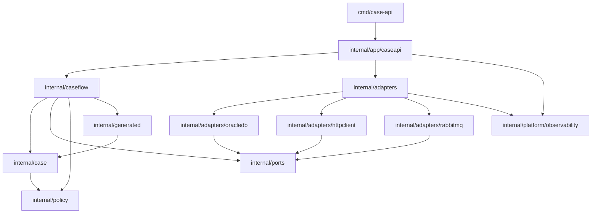
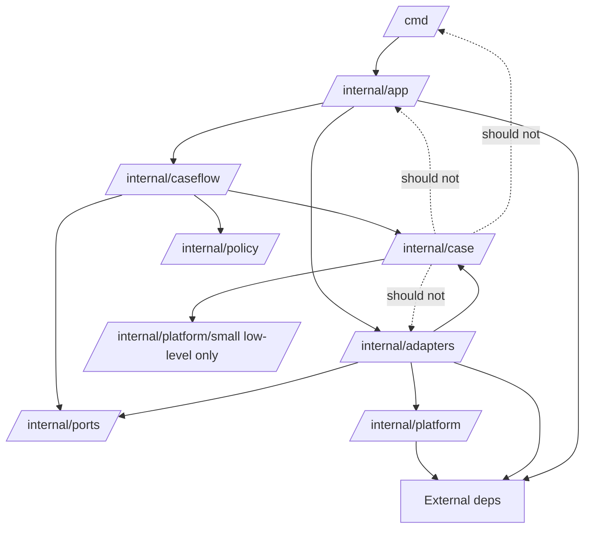
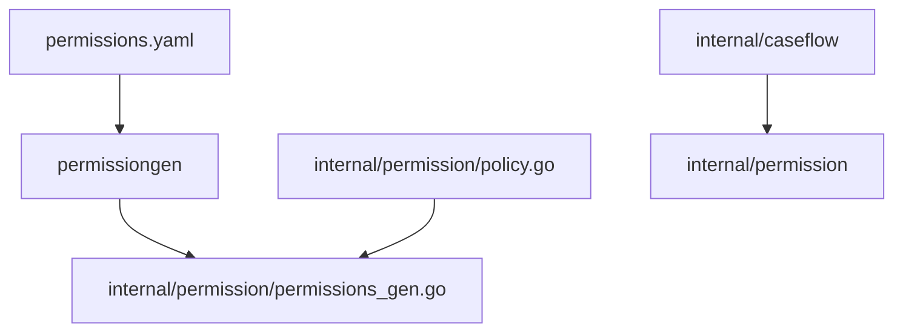
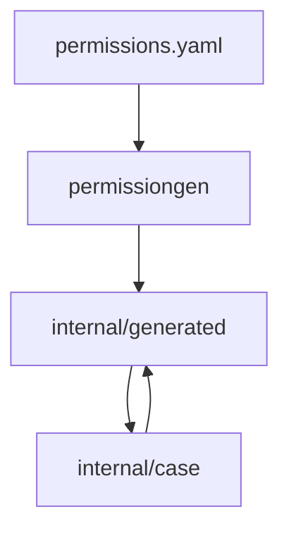
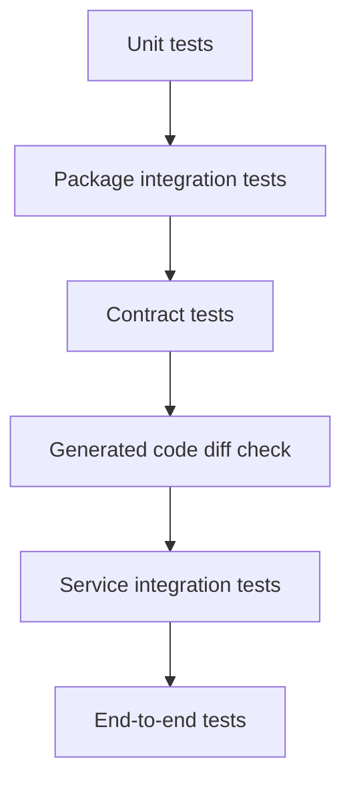

# learn-go-composition-oop-functional-reflection-codegen-modules-part-028.md

# Part 028 — Large-Scale Repo Architecture: Monorepo, Multi-Module, `/cmd`, `/internal`, `/pkg`, Dependency Direction, Ownership Boundary, dan Migration Strategy

> Seri: `learn-go-composition-oop-functional-reflection-codegen-modules`  
> Bagian: `028 / 030`  
> Target pembaca: Java software engineer / tech lead yang ingin merancang repository Go skala enterprise  
> Fokus: arsitektur repository, module/package boundary, ownership, dependency direction, import cycle prevention, generated code placement, testing strategy, dan migrasi sistem besar

---

## 0. Posisi Part Ini Dalam Seri

Kita sudah membangun fondasi:

- composition dan OOP tanpa class;
- interface, method set, structural typing;
- functional style dan higher-order API;
- reflection;
- code generation;
- package design;
- module fundamentals;
- module governance;
- private modules dan enterprise supply-chain.

Part ini menyatukan semuanya ke satu pertanyaan besar:

> Bagaimana bentuk repository Go yang tetap sehat ketika codebase tumbuh menjadi puluhan service, ratusan package, banyak team, private modules, generated code, dan release pipeline enterprise?

Di Go, repo architecture bukan sekadar estetika folder.

Ia memengaruhi:

- import graph;
- encapsulation;
- module dependency;
- build speed;
- test strategy;
- release ownership;
- ability to refactor;
- API compatibility;
- code generation boundary;
- private module governance;
- deployment topology;
- cognitive load team.

Mental model utama:

> Repository architecture adalah **dependency graph design yang diwujudkan dalam filesystem, package names, module boundaries, dan CI policy**.

---

## 1. Kenapa Repo Architecture Go Berbeda Dari Java

Java engineer sering datang dengan mental model:

```text
src/main/java/com/company/app/
  controller/
  service/
  repository/
  domain/
  dto/
  config/
```

Layering ini familiar dan bisa valid di beberapa konteks, tetapi jika diterapkan mentah-mentah di Go, sering menghasilkan:

- package terlalu besar;
- package bernama generic: `service`, `model`, `util`, `common`;
- import cycle;
- interface ditempatkan di provider package;
- internal detail bocor sebagai exported symbol;
- package boundary tidak sesuai domain boundary;
- banyak “manager” object tanpa invariant;
- framework-ish architecture yang tidak Go-like;
- module split terlalu dini;
- shared library menjadi dumping ground.

Go memaksa pertanyaan lebih tajam:

1. Package ini dipakai oleh siapa?
2. Apa public surface-nya?
3. Apakah nama package menjelaskan capability?
4. Apakah dependency direction benar?
5. Apakah consumer perlu tahu implementasi?
6. Apakah ini application code atau reusable library?
7. Apakah module boundary benar-benar perlu?
8. Apakah code ini harus bisa diimport dari luar?
9. Apakah generated code seharusnya visible?
10. Apakah folder ini boundary arsitektur atau hanya kategori teknis?

---

## 2. Repository Architecture as Dependency Graph

Jangan mulai dari folder.

Mulai dari dependency graph.



Key principle:

> Folder layout should make invalid dependency direction difficult.

Jika business domain mengimport HTTP framework, berarti graph sudah bocor.

Jika package `case` mengimport `oracledb`, domain tergantung persistence.

Jika package `service` mengimport semua package, kemungkinan ia menjadi god package.

---

## 3. Canonical Go Layout: Useful, Not Sacred

Go tidak mewajibkan layout seperti Maven.

Beberapa pola umum:

```text
/cmd
/internal
/pkg
/api
/web
/configs
/scripts
/tools
/test
```

Tapi ini bukan standard wajib. Ia convention yang harus digunakan dengan pengertian.

### 3.1 `/cmd`

Untuk executable entrypoints.

Example:

```text
cmd/
  case-api/
    main.go
  case-worker/
    main.go
  migrator/
    main.go
```

`cmd/*/main.go` sebaiknya tipis.

Bad:

```go
package main

func main() {
    // parse config
    // connect db
    // define handlers
    // implement business logic
    // run workflow
    // build SQL
}
```

Better:

```go
package main

func main() {
    os.Exit(caseapi.Main())
}
```

or:

```go
func main() {
    if err := caseapi.Run(context.Background(), os.Args[1:]); err != nil {
        log.Fatal(err)
    }
}
```

### 3.2 `/internal`

Go `internal` directory memberikan compiler-enforced import restriction.

Package di dalam:

```text
internal/foo
```

hanya bisa diimport oleh code yang berada di parent tree.

Example:

```text
repo/
  internal/caseflow
  cmd/case-api
```

`cmd/case-api` bisa import:

```go
import "example.com/case-platform/internal/caseflow"
```

External module tidak bisa.

This is powerful.

Use `/internal` for:

- application logic;
- adapters;
- internal platform code;
- generated internal code;
- private packages not meant as public API.

### 3.3 `/pkg`

`/pkg` sering dipakai untuk reusable public packages.

But be careful.

Bad mindset:

```text
Everything reusable goes into /pkg.
```

Better:

```text
Only packages intentionally supported for external import go into /pkg.
```

Jika module hanya application service, sering tidak perlu `/pkg`.

### 3.4 `/api`

Possible content:

```text
api/
  openapi/
  proto/
  asyncapi/
```

Useful for API schema/source of truth.

But generated Go code placement depends on usage.

### 3.5 `/tools`

For build/codegen tools.

Example:

```text
tools/
  permissiongen/
    main.go
```

or separate module:

```text
tools/
  go.mod
  go.sum
```

### 3.6 `/scripts`

For operational scripts.

Caution:

- scripts must not become hidden build system;
- CI should call documented commands;
- prefer Go command and Make/Taskfile for repeatability.

---

## 4. Application vs Library Repo

Before layout, decide repo type.

### 4.1 Application Repository

Builds deployable artifacts.

Example:

```text
case-platform/
  go.mod
  cmd/case-api/
  cmd/case-worker/
  internal/
```

Characteristics:

- most code inside `/internal`;
- public API surface minimal;
- compatibility concern is runtime behavior and external API, not Go package API;
- module versions less important unless imported elsewhere;
- deployment pipeline central.

### 4.2 Library Repository

Provides importable package.

Example:

```text
workflow/
  go.mod
  engine.go
  policy.go
  internal/
```

Characteristics:

- public exported API must be stable;
- `go` directive is consumer compatibility decision;
- semantic versioning matters;
- examples and documentation matter;
- `internal` still useful for implementation;
- avoid unnecessary dependencies.

### 4.3 Platform Repository

Contains multiple applications and shared internal packages.

Example:

```text
regulatory-platform/
  go.mod
  cmd/
    case-api/
    appeal-api/
    audit-worker/
  internal/
    case/
    appeal/
    audit/
    platform/
```

Characteristics:

- dependency graph must be explicit;
- ownership boundary matters;
- generated code placement matters;
- package naming must avoid `common`;
- CI must support partial test/build but also full graph validation.

---

## 5. Single Module vs Multi-Module

This is one of the most expensive early decisions.

### 5.1 Single Module

```text
repo/
  go.mod
  cmd/
  internal/
  pkg/
```

Benefits:

- simple;
- one `go test ./...`;
- no internal version skew;
- no local workspace required;
- easier refactoring;
- package boundaries enough for many teams;
- simpler CI.

Costs:

- shared dependency graph;
- all packages share same `go` directive;
- releases often tied together;
- public reusable libraries inside same module can be awkward;
- large graph may slow tests if not managed.

### 5.2 Multi-Module

```text
repo/
  services/case-api/go.mod
  services/appeal-api/go.mod
  libs/auth/go.mod
  libs/workflow/go.mod
```

Benefits:

- independent versioning;
- smaller module graphs;
- separate ownership;
- separate Go version support;
- library publishing clearer;
- service dependency isolation.

Costs:

- more CI complexity;
- local workspace complexity;
- version skew between internal modules;
- release coordination;
- accidental reliance on `go.work`;
- harder refactoring across modules;
- more `go.mod`/`go.sum` churn.

### 5.3 Decision Rule

Use single module by default unless you need independent versioning or distribution.

Multi-module is justified when at least one is true:

- module is consumed by other repositories;
- module has independent release lifecycle;
- module has different support matrix;
- module needs separate dependency graph;
- module ownership/release authority is separate;
- module is a stable platform/library product.

Do not split modules merely to mimic Java Maven modules.

### 5.4 Decision Matrix

| Question | Single Module | Multi-Module |
|---|---:|---:|
| Deploy together | Strong | Weak |
| Refactor frequently across boundaries | Strong | Weak |
| Independent versioning required | Weak | Strong |
| Shared package not consumed outside repo | Strong | Weak |
| Library consumed by many repos | Medium | Strong |
| Different Go versions | Weak | Strong |
| Need isolated dependencies | Medium | Strong |
| Low CI maturity | Strong | Weak |
| Stable ownership boundaries | Medium | Strong |
| Early project | Strong | Weak |
| Mature platform | Depends | Strong |

---

## 6. Monorepo vs Multi-Repo

Separate from module decision.

You can have:

1. monorepo single module;
2. monorepo multi-module;
3. multi-repo single module per repo;
4. multi-repo with library/service repos.

### 6.1 Monorepo Benefits

- atomic changes across services/packages;
- unified CI policy;
- shared tooling;
- consistent codegen;
- easier large refactors;
- easier dependency visibility;
- centralized governance.

### 6.2 Monorepo Costs

- CI scale;
- ownership boundaries need tooling;
- large clone/build;
- accidental coupling;
- broad visibility/access concerns;
- release coordination complexity.

### 6.3 Multi-Repo Benefits

- clearer ownership;
- independent lifecycle;
- access control per repo;
- smaller CI;
- cleaner dependency release discipline;
- better for platform libraries consumed by many products.

### 6.4 Multi-Repo Costs

- cross-repo changes harder;
- version lag;
- more release overhead;
- duplicated tooling;
- integration drift;
- harder global refactor.

### 6.5 Top-Level Decision

Ask:

```text
Do we optimize for atomic change or independent release?
```

If atomic change dominates, monorepo helps.

If independent release/access control dominates, multi-repo helps.

---

## 7. Package Naming at Scale

Package names are part of API.

Bad names:

```text
common
utils
helpers
models
types
service
manager
base
shared
core
```

Not always forbidden, but suspicious.

Better names describe capability or domain:

```text
caseflow
permission
auditlog
decision
identity
redaction
token
workflow
approval
escalation
```

### 7.1 Package Name Should Answer

- What capability does this package provide?
- What domain concept does it own?
- What invariant does it protect?
- Who is allowed to import it?
- What should not depend on it?

### 7.2 Avoid Layer-Only Package Names

Java-style:

```text
controller
service
repository
dto
```

Can work for small apps, but at scale it tends to group unrelated domain concepts by technical layer.

Better:

```text
internal/caseflow
internal/casequery
internal/casecommand
internal/auditlog
internal/permission
internal/adapters/oracledb
internal/adapters/httpapi
```

This keeps domain cohesion.

### 7.3 Package Granularity

Too coarse:

```text
internal/app
```

contains everything.

Too fine:

```text
internal/case/status/value/object/transition/checker
```

over-fragmented.

Good package boundary:

- cohesive;
- has small public surface;
- meaningful tests;
- avoids import cycles;
- can be understood independently;
- has clear owner.

---

## 8. Dependency Direction

A sustainable Go repo needs explicit dependency direction.

Example clean direction:

```text
cmd -> app -> usecase -> domain/policy
app -> adapters
adapters -> ports/domain
domain -> no infrastructure
platform -> low-level utilities
generated -> depends on source model? carefully
```

### 8.1 Direction Diagram



### 8.2 Import Cycle as Design Feedback

Go forbids import cycles.

This is good.

If you hit import cycle:

```text
caseflow imports permission
permission imports caseflow
```

do not immediately create `common`.

Instead ask:

1. Which package owns the concept?
2. Is there a missing smaller package?
3. Is the dependency direction wrong?
4. Should one side depend on an interface?
5. Should shared type move to a lower-level package?
6. Is the package too broad?
7. Are we mixing domain and orchestration?

### 8.3 Common Import Cycle Fixes

#### Fix 1 — Extract Stable Domain Type

Before:

```text
caseflow -> permission
permission -> caseflow
```

After:

```text
caseflow -> casetype
permission -> casetype
caseflow -> permission
```

#### Fix 2 — Invert Dependency With Consumer Interface

Before:

```text
caseflow -> notification
notification -> caseflow
```

After:

```go
package caseflow

type Notifier interface {
    NotifyCaseEscalated(ctx context.Context, event CaseEscalated) error
}
```

Implementation lives elsewhere.

#### Fix 3 — Split Orchestrator From Domain

Before:

```text
case package has domain model and workflow orchestration
```

After:

```text
case       = entity/value/invariant
caseflow   = usecase/workflow
casequery  = read/query
```

#### Fix 4 — Move Adapter Out

Domain package should not import database/http/mq.

---

## 9. `/internal/platform` vs Shared Dumping Ground

Many teams create:

```text
internal/common
internal/utils
internal/platform
```

`platform` can be good or terrible.

Good `platform` package contains stable, low-level cross-cutting capabilities:

```text
internal/platform/config
internal/platform/logging
internal/platform/clock
internal/platform/tx
internal/platform/metrics
internal/platform/redaction
```

Bad `platform` contains business rules:

```text
internal/platform/caseapproval
internal/platform/userrolepolicy
internal/platform/documentworkflow
```

Business concepts should live in domain/application packages.

### 9.1 Platform Package Rule

A platform package should generally not depend on business packages.


If `platform` imports `caseflow`, it is no longer platform.

### 9.2 Examples

Good:

```go
package clock

type Clock interface {
    Now() time.Time
}
```

Good:

```go
package redaction

func Email(s string) string
```

Suspicious:

```go
package common

func IsCaseEscalatable(status string, role string) bool
```

This belongs to case/policy.

---

## 10. Application Wiring

Go favors explicit wiring.

Structure:

```text
internal/app/caseapi/
  app.go
  config.go
  wiring.go
```

Example:

```go
package caseapi

type App struct {
    server *http.Server
}

func New(cfg Config) (*App, error) {
    db, err := openDB(cfg.DB)
    if err != nil {
        return nil, err
    }

    repo := oracledb.NewCaseRepository(db)
    policy := permission.NewPolicyEngine(cfg.Permission)
    service := caseflow.NewService(repo, policy)

    handler := httpapi.NewHandler(service)

    srv := &http.Server{
        Addr:    cfg.Addr,
        Handler: handler,
    }

    return &App{server: srv}, nil
}
```

This may look verbose to Java developers used to DI containers, but it gives:

- explicit dependency graph;
- compile-time wiring;
- easy review;
- no hidden reflection;
- no runtime bean ambiguity;
- easier tests;
- clearer ownership.

### 10.1 When to Use DI Libraries

For most Go services, manual wiring is enough.

DI/codegen libraries can help when:

- graph is large;
- many constructors;
- compile-time injection desired;
- startup wiring becomes hard to review.

But avoid bringing Java-style runtime DI reflex into Go.

Questions before DI framework:

1. Is wiring actually complex or just verbose?
2. Can packages be reorganized?
3. Can constructors be simplified?
4. Can optional dependencies be reduced?
5. Can functional options solve configuration?
6. Would codegen DI help without runtime magic?

---

## 11. Ports and Adapters Without Ceremony

Hexagonal architecture maps well to Go if kept small.

Do not create abstract interfaces for everything.

### 11.1 Consumer-Side Ports

In usecase package:

```go
package caseflow

type CaseStore interface {
    Find(ctx context.Context, id caseid.ID) (Case, error)
    Save(ctx context.Context, c Case) error
}

type AuditLog interface {
    Record(ctx context.Context, entry AuditEntry) error
}
```

Adapter:

```go
package oracledb

type CaseStore struct {
    db *sql.DB
}

func (s *CaseStore) Find(ctx context.Context, id caseid.ID) (caseflow.Case, error) {
    // ...
}
```

### 11.2 Avoid Provider-Side Interface Explosion

Bad:

```go
package oracledb

type CaseRepositoryInterface interface {
    Find(...)
    Save(...)
}
```

If only consumers need abstraction, define interface at consumer side.

### 11.3 Adapter Package Naming

Good:

```text
internal/adapters/oracledb
internal/adapters/smtp
internal/adapters/rabbitmq
internal/adapters/httpclient/onemap
```

or domain-specific:

```text
internal/caseflow/oraclecase
```

Choose based on repo scale.

---

## 12. Domain Package Design

A domain package should own invariants.

Example:

```text
internal/case/
  case.go
  status.go
  transition.go
  decision.go
```

### 12.1 Avoid Anemic Structs

Bad:

```go
type Case struct {
    ID     string
    Status string
    Owner  string
}
```

and all rules elsewhere.

Better:

```go
type Case struct {
    id     ID
    status Status
    owner  OfficerID
}

func New(id ID, owner OfficerID) (Case, error) {
    if id.IsZero() {
        return Case{}, ErrInvalidID
    }
    return Case{id: id, status: Draft, owner: owner}, nil
}

func (c Case) CanSubmitBy(actor OfficerID) bool {
    return c.status == Draft && c.owner == actor
}

func (c *Case) Submit(actor OfficerID) error {
    if !c.CanSubmitBy(actor) {
        return ErrTransitionNotAllowed
    }
    c.status = Submitted
    return nil
}
```

### 12.2 Export Strategy

Export only what other packages need.

```go
type Case struct {
    id     ID
    status Status
}
```

with methods:

```go
func (c Case) ID() ID
func (c Case) Status() Status
```

This preserves invariants.

### 12.3 DTO Conversion

Keep DTO outside domain.

```text
internal/adapters/httpapi/dto
internal/adapters/oracledb/model
```

or:

```text
internal/casequery/view
```

depending direction.

Do not let wire DTO tags dictate domain model.

---

## 13. Generated Code Placement

Generated code should be placed where its ownership and visibility are clear.

Options:

### 13.1 Same Package

```text
internal/permission/
  permission.go
  permissions_gen.go
```

Good when generated code is package implementation detail.

Pros:

- can access unexported symbols if generated in same package;
- simple usage;
- less import overhead.

Cons:

- generated file mixes with hand-written code;
- can bloat package.

### 13.2 Subpackage

```text
internal/permission/generated/
```

Good when generated output is large or distinct.

Pros:

- separates generated surface;
- clearer review;
- easier import control.

Cons:

- only exported symbols accessible;
- possible dependency direction issue.

### 13.3 Central Generated Package

```text
internal/generated/permission
internal/generated/dto
```

Good for organization-wide codegen.

Risk:

- becomes dumping ground;
- cross-domain coupling;
- import cycles;
- unclear ownership.

### 13.4 Rule

Generated code placement should answer:

1. Who owns the generated artifact?
2. Who imports it?
3. Is it public API or internal implementation?
4. Does it depend on domain types?
5. Does domain depend on it?
6. Can it create import cycles?
7. Is generated output stable and reviewable?

### 13.5 Diagram



Better than:



which risks cycles.

---

## 14. API Schema Placement

For OpenAPI/protobuf/etc.

Example:

```text
api/
  openapi/case-api.yaml
  proto/case/v1/case.proto
internal/adapters/httpapi/
internal/generated/openapi/
internal/generated/proto/
```

### 14.1 Schema as Source of Truth

Decide:

- code-first;
- schema-first;
- hybrid.

If schema-first:

```text
api schema -> generated server/client types -> adapter -> domain
```

If code-first:

```text
domain/application -> generated docs/schema
```

Be explicit.

### 14.2 Keep Wire Contract Separate

Wire contract should not become domain model accidentally.

Bad:

```go
type Case struct {
    ID string `json:"id" db:"CASE_ID" validate:"required"`
}
```

This type is now:

- domain;
- JSON DTO;
- DB model;
- validation schema.

Better:

```text
domain Case
http DTO
db model
mapper
```

Yes, more code. But it prevents contract coupling.

---

## 15. Testing Strategy by Package Boundary

Repo architecture must support testing.

### 15.1 Unit Tests

Inside same package:

```text
internal/case/case_test.go
```

Use `package case`.

Good for testing unexported invariant.

### 15.2 External Package Tests

```go
package case_test
```

Good for testing public API from consumer perspective.

### 15.3 Adapter Tests

Use integration tests or testcontainers equivalent if allowed.

```text
internal/adapters/oracledb/oracledb_integration_test.go
```

with build tag:

```go
//go:build integration
```

### 15.4 Contract Tests

For interface/ports:

```text
internal/caseflow/casestore_contract_test.go
```

Reusable test function:

```go
func ContractCaseStore(t *testing.T, newStore func(t *testing.T) CaseStore) {
    // test behavior expected by usecase
}
```

Then adapter package calls it.

### 15.5 Generated Code Tests

- golden tests for generator;
- compile tests for generated output;
- deterministic diff in CI;
- behavior tests for generated registry.

### 15.6 CI Test Layers



Do not run all expensive tests on every local save, but CI should have staged coverage.

---

## 16. Ownership Boundary

At scale, packages need owners.

Possible file:

```text
CODEOWNERS
```

Example:

```text
/internal/caseflow/ @team-case
/internal/permission/ @team-identity
/internal/adapters/oracledb/ @team-platform-db
/api/openapi/ @team-api-governance
/tools/permissiongen/ @team-platform
```

Ownership should match architecture.

If everyone owns everything, nobody owns invariants.

### 16.1 Ownership Questions

For each package:

1. Who approves public API changes?
2. Who fixes incidents?
3. Who owns tests?
4. Who owns generated files?
5. Who owns dependency upgrades?
6. Who decides deprecation?
7. Who handles performance regression?
8. Who reviews security-sensitive changes?

### 16.2 Ownership Smells

- package named `common` owned by everyone;
- package imported by many services but no owner;
- generated files modified manually;
- shared auth package owned by app team without security review;
- domain package changed by adapter team without invariant review.

---

## 17. Versioning Internal Shared Packages

In single module, internal package versioning is by repo commit.

In multi-module/multi-repo, shared packages need semantic versions.

For internal library:

```text
go.company.com/platform/auth v1.8.3
```

Rules:

- breaking API changes require v2 path or coordinated migration;
- behavior changes require release notes;
- security fixes need advisory;
- deprecations should be documented;
- consumers should not use `latest` blindly.

### 17.1 Internal Shared Kernel Risk

A shared module can become “enterprise common”.

Bad:

```text
platform-common
  stringutil
  dateutil
  case status
  permission
  sql helpers
  http clients
  constants
```

This creates:

- high coupling;
- slow release;
- unclear ownership;
- dependency bloat;
- accidental dependency from every service.

Better split by capability:

```text
platform/clock
platform/redaction
identity/authn
identity/permission
workflow/engine
audit/eventlog
```

---

## 18. Import Cycle Prevention at Scale

Go import cycles are compile errors. Use that as architecture enforcement.

### 18.1 Layer Rule

Define allowed imports.

Example:

```text
cmd -> internal/app
internal/app -> internal/caseflow, internal/adapters, internal/platform
internal/caseflow -> internal/case, internal/permission, internal/ports
internal/adapters -> internal/ports, internal/platform
internal/case -> internal/platform/clock only
internal/platform -> external deps only
```

### 18.2 Automated Import Checks

Use scripts or tools to enforce:

- domain does not import adapters;
- platform does not import business;
- generated package does not import app;
- `internal/common` forbidden;
- no import from `cmd`.

Even simple grep/go list checks help.

Example:

```bash
go list -deps -json ./internal/case | jq ...
```

or custom Go tool using `golang.org/x/tools/go/packages`.

### 18.3 Architecture Test Idea

Create a small tool:

```text
go run ./tools/archcheck
```

Policy file:

```yaml
forbidden:
  - from: "example.com/app/internal/case"
    to: "example.com/app/internal/adapters/..."
  - from: "example.com/app/internal/platform/..."
    to: "example.com/app/internal/caseflow/..."
```

This is often worth it in large repos.

---

## 19. Migration Strategy From Java-Like Layout

Initial layout:

```text
internal/
  controller/
  service/
  repository/
  model/
  dto/
  utils/
```

Problems:

- domain scattered;
- service package imports everything;
- repository interfaces in repository package;
- DTO and domain mixed;
- import cycles appear;
- util grows.

### 19.1 Migration Target

```text
internal/
  app/caseapi/
  case/
  caseflow/
  casequery/
  permission/
  auditlog/
  ports/
  adapters/
    httpapi/
    oracledb/
    rabbitmq/
  platform/
    config/
    logging/
    clock/
    redaction/
```

### 19.2 Step-by-Step Migration

#### Step 1 — Map Current Dependencies

Use:

```bash
go list -deps ./...
```

or graph tool.

Identify:

- god packages;
- cycles;
- high fan-in packages;
- high fan-out packages;
- packages imported by everything;
- packages importing infrastructure.

#### Step 2 — Identify Domain Concepts

List real domain concepts:

- case;
- appeal;
- enforcement action;
- officer;
- permission;
- audit event;
- workflow transition;
- decision;
- correspondence;
- document.

#### Step 3 — Extract Domain Package

Move invariant-heavy code first.

```text
model -> case
```

But do not blindly move all model.

Separate:

- domain entity;
- DTO;
- DB row;
- API view.

#### Step 4 — Extract Usecase/Workflow

Move orchestration:

```text
service -> caseflow
```

Keep dependencies explicit.

#### Step 5 — Move Infrastructure to Adapters

```text
repository/oracle -> adapters/oracledb
controller/http -> adapters/httpapi
messaging -> adapters/rabbitmq
```

#### Step 6 — Define Consumer Interfaces

In `caseflow`, define what it needs:

```go
type CaseStore interface { ... }
type AuditLog interface { ... }
```

Adapters implement them.

#### Step 7 — Delete `utils`

Move functions to capability packages:

```text
utils.MaskEmail -> platform/redaction.Email
utils.Now -> platform/clock
utils.CaseStatusText -> case.Status.String
```

#### Step 8 — Add Architecture Checks

Prevent regression.

#### Step 9 — Reduce Export Surface

Unexport types/methods not needed outside package.

#### Step 10 — Update Tests

Move tests with behavior.

---

## 20. Large Repo CI Strategy

For large repo, `go test ./...` may still be feasible. Go is fast. But at scale, optimize without losing correctness.

### 20.1 CI Layers

1. format/static quick check;
2. module tidy check;
3. generated code check;
4. unit tests;
5. package integration tests;
6. service build;
7. vulnerability scan;
8. architecture checks;
9. e2e scheduled/merge-gated.

### 20.2 Changed Package Testing

Use changed files to select packages, but be careful with reverse dependencies.

If package `permission` changes, test packages importing it.

Use:

```bash
go list -deps
```

and reverse dependency analysis.

### 20.3 Build All Commands

Always build all deployable binaries:

```bash
go build ./cmd/...
```

### 20.4 Multiple Modules

For multi-module repo:

```bash
find . -name go.mod -not -path '*/vendor/*'
```

Then per module:

```bash
(cd "$moddir" && go mod tidy && git diff --exit-code go.mod go.sum && go test ./...)
```

Also workspace-level test if `go.work` is committed.

---

## 21. Repository Templates

### 21.1 Single Service Template

```text
case-api/
  go.mod
  go.sum
  README.md
  cmd/
    case-api/
      main.go
  internal/
    app/
      caseapi/
        app.go
        config.go
        wiring.go
    case/
      case.go
      status.go
      transition.go
    caseflow/
      service.go
      ports.go
    permission/
      policy.go
    auditlog/
      auditlog.go
    adapters/
      httpapi/
        handler.go
        dto.go
      oracledb/
        case_store.go
      rabbitmq/
        publisher.go
    platform/
      config/
      logging/
      clock/
      redaction/
  api/
    openapi/
      case-api.yaml
  tools/
    permissiongen/
  Makefile
```

### 21.2 Multi-Command Service Repo

```text
case-platform/
  go.mod
  cmd/
    case-api/
    case-worker/
    case-migrator/
  internal/
    app/
      caseapi/
      caseworker/
      migrator/
    case/
    caseflow/
    adapters/
    platform/
```

### 21.3 Platform Monorepo Single Module

```text
regulatory-platform/
  go.mod
  cmd/
    case-api/
    appeal-api/
    audit-worker/
  internal/
    case/
    caseflow/
    appeal/
    appealflow/
    auditlog/
    permission/
    identity/
    adapters/
    platform/
  api/
    openapi/
    proto/
  tools/
```

### 21.4 Monorepo Multi-Module

```text
regulatory/
  go.work
  services/
    case-api/
      go.mod
      cmd/
      internal/
    appeal-api/
      go.mod
      cmd/
      internal/
  libs/
    auth/
      go.mod
    permission/
      go.mod
    workflow/
      go.mod
  tools/
    archcheck/
      go.mod
```

Use only if independent release/versioning matters.

---

## 22. Documentation as Architecture Control

Large repo needs docs close to code.

Recommended docs:

```text
docs/
  architecture.md
  package-boundaries.md
  dependency-rules.md
  module-governance.md
  code-generation.md
  testing.md
  release.md
```

Per package README for important packages:

```text
internal/caseflow/README.md
```

Content:

- purpose;
- owned concepts;
- allowed dependencies;
- public API;
- invariants;
- testing strategy;
- owner.

### 22.1 Architecture Decision Records

Use ADRs for:

- single vs multi-module;
- internal proxy;
- vendoring;
- generated code strategy;
- package split;
- major dependency adoption;
- DI strategy;
- schema-first vs code-first API.

---

## 23. Case Study: Regulatory Case Management Platform

Requirements:

- case lifecycle;
- appeal;
- compliance;
- audit trail;
- permission matrix;
- identity integration;
- correspondence;
- document management;
- multiple workers;
- generated validators;
- internal shared auth module;
- Oracle adapter;
- RabbitMQ adapter;
- strict auditability.

### 23.1 Recommended Initial Layout

```text
aceas-go/
  go.mod
  go.sum
  cmd/
    case-api/
    case-worker/
    audit-worker/
  internal/
    app/
      caseapi/
      caseworker/
      auditworker/
    case/
      case.go
      status.go
      transition.go
      decision.go
    caseflow/
      service.go
      ports.go
      command.go
    appeal/
    appealflow/
    compliance/
    permission/
      policy.go
      matrix.go
      matrix_gen.go
    identity/
    auditlog/
    document/
    correspondence/
    adapters/
      httpapi/
      oracledb/
      rabbitmq/
      s3docstore/
      identityclient/
    platform/
      config/
      logging/
      metrics/
      tracing/
      clock/
      redaction/
      transaction/
  api/
    openapi/
    asyncapi/
  tools/
    permissiongen/
    archcheck/
  docs/
```

### 23.2 Why Single Module Initially

Because:

- services deploy together;
- domain refactoring likely;
- internal package boundary enough;
- avoids version skew;
- easier CI;
- easier generated code coordination.

Split into modules only when:

- `identity` becomes shared across repos;
- `permission` becomes platform library;
- `workflow` engine has independent consumers;
- release cadence diverges.

### 23.3 Dependency Rules

```text
internal/case must not import adapters.
internal/caseflow may import case, permission, auditlog, ports.
internal/adapters may import ports and domain types.
internal/platform must not import business packages.
cmd only imports app packages.
```

### 23.4 Generated Permission Matrix

```text
internal/permission/
  matrix.yaml
  matrix_gen.go
  policy.go
```

Reason:

- permission owns generated matrix;
- consumers import `permission`;
- generated output does not become central dumping ground.

### 23.5 Adapter Boundary

Oracle adapter:

```text
internal/adapters/oracledb
```

converts:

```text
DB rows <-> domain/usecase model
```

HTTP adapter:

```text
internal/adapters/httpapi
```

converts:

```text
JSON DTO <-> command/query
```

No DTO in domain.

### 23.6 Testing

- `internal/case`: invariant tests;
- `internal/caseflow`: usecase tests with fake ports;
- `internal/adapters/oracledb`: integration tests;
- `internal/permission`: generated matrix tests;
- `cmd/...`: build tests;
- `tools/archcheck`: dependency policy tests.

---

## 24. Anti-Patterns

### 24.1 Package by Technical Layer Only

```text
controller/
service/
repository/
model/
```

Can work for small codebase but often fails at scale.

Better:

```text
case/
caseflow/
permission/
auditlog/
adapters/httpapi/
adapters/oracledb/
```

### 24.2 `common` as Trash Bin

Bad:

```text
internal/common
```

with everything.

Better:

- split by capability;
- move domain rules to domain package;
- move platform concerns to platform package.

### 24.3 Multi-Module Too Early

Bad:

```text
every package becomes module
```

Costs:

- version skew;
- CI complexity;
- local workspace dependency;
- slow refactor.

Better:

```text
start single module unless independent versioning is real.
```

### 24.4 `/pkg` as Public Accident

Bad:

```text
/pkg/caseflow
```

when no external consumer should import it.

Better:

```text
/internal/caseflow
```

### 24.5 Domain Imports Infrastructure

Bad:

```go
package case

import "database/sql"
import "net/http"
```

Better:

domain stays infrastructure-free.

### 24.6 Generated Dumping Ground

Bad:

```text
internal/generated
```

imported by everyone and importing everyone.

Better:

generated code lives near owner package.

### 24.7 Interface Everywhere

Bad:

```go
type CaseService interface { ... }
type CaseRepository interface { ... }
```

defined by provider packages without consumer need.

Better:

consumer-defined small interfaces.

### 24.8 App Package Imports Everything

Bad:

```text
internal/app
```

contains orchestration, domain, adapters, policy, DTO.

Better:

app wires components but does not own all logic.

---

## 25. Architecture Review Checklist

### 25.1 Repository Level

- Is repo application, library, or platform?
- Single module or multi-module justified?
- Monorepo or multi-repo decision documented?
- Does CI test correct unit of release?
- Are private module policies explicit?
- Are generated code policies explicit?
- Are package owners clear?

### 25.2 Package Level

- Does package have cohesive purpose?
- Is package name capability/domain-oriented?
- Is export surface minimal?
- Are invariants protected?
- Are dependencies pointing inward or outward correctly?
- Is there import cycle pressure?
- Does package depend on infrastructure unnecessarily?
- Does package have tests matching its role?

### 25.3 Module Level

- Is module boundary release boundary?
- Is `go.mod` stable and intentional?
- Are shared modules versioned?
- Are private modules configured securely?
- Is `go.work` policy clear?
- Are `replace` directives controlled?

### 25.4 Generated Code

- Is generated code near owner?
- Is generator deterministic?
- Is generated code internal/public intentionally?
- Does generated code introduce import cycles?
- Is generated diff checked in CI?

### 25.5 Testing

- Can domain be tested without infrastructure?
- Can usecase be tested with fakes?
- Are adapters tested with integration/contract tests?
- Are commands build-tested?
- Are architecture rules tested?

---

## 26. Practical Commands

Inspect packages:

```bash
go list ./...
```

Inspect package deps:

```bash
go list -deps ./internal/caseflow
```

Find imports:

```bash
go list -json ./... 
```

Build commands:

```bash
go build ./cmd/...
```

Run all tests:

```bash
go test ./...
```

Disable workspace:

```bash
GOWORK=off go test ./...
```

List modules in multi-module repo:

```bash
find . -name go.mod -not -path '*/vendor/*'
```

Graph modules:

```bash
go mod graph
```

Why module exists:

```bash
go mod why -m example.com/module
```

Check generated:

```bash
go generate ./...
git diff --exit-code
```

Check tidy:

```bash
go mod tidy
git diff --exit-code go.mod go.sum
```

---

## 27. What Top Engineers Internalize

Top Go engineers understand:

1. Folder structure is dependency graph made visible.
2. `/internal` is a real compiler-enforced boundary.
3. `/pkg` means intentional public import surface, not “random reusable code.”
4. Single module is usually better until independent versioning is real.
5. Multi-module introduces governance cost.
6. Monorepo optimizes atomic change; multi-repo optimizes independent lifecycle.
7. Package names should reflect capability, not generic technical layer.
8. Import cycle errors are design feedback.
9. Domain should not depend on infrastructure.
10. Consumer-side interfaces keep package boundaries clean.
11. `common` is usually a smell.
12. Generated code belongs near its owner.
13. CI must enforce architecture, not just compile code.
14. Shared internal libraries need product-level ownership.
15. Explicit wiring is often better than hidden DI.
16. Repository architecture should evolve from real dependency pressure, not template worship.
17. Code layout is not aesthetics; it is long-term refactorability and blast-radius control.

---

## 28. Exercises

### Exercise 1 — Choose Single vs Multi-Module

You have:

```text
case-api
case-worker
audit-worker
shared case domain
shared permission matrix
```

All deploy together.

Recommended:

```text
single module
```

Reason:

- one release unit;
- shared domain refactoring likely;
- no need for version skew;
- simpler CI.

### Exercise 2 — Refactor Java-Style Layout

From:

```text
controller/
service/
repository/
model/
utils/
```

To:

```text
case/
caseflow/
adapters/httpapi/
adapters/oracledb/
platform/redaction/
```

Explain each move:

- `model` split into domain/DTO/DB row;
- `service` becomes usecase package;
- `repository` becomes adapter;
- `utils` becomes capability packages.

### Exercise 3 — Fix Import Cycle

Given:

```text
permission imports caseflow
caseflow imports permission
```

Possible fix:

- move shared types to `case`;
- keep permission policy independent from workflow;
- `caseflow` calls permission, not reverse;
- if callback needed, define small interface.

### Exercise 4 — Place Generated Code

Permission matrix generated from YAML.

Best placement:

```text
internal/permission/matrix_gen.go
```

if permission package owns behavior.

Avoid central generated dumping ground unless there is a strong reason.

### Exercise 5 — Define Architecture Rules

For repo:

```text
internal/case
internal/caseflow
internal/adapters
internal/platform
```

Rules:

```text
case must not import adapters
platform must not import caseflow
cmd imports only app
adapters must not be imported by domain
```

Create CI archcheck.

---

## 29. Summary

Large-scale Go repository architecture is the discipline of aligning filesystem, packages, modules, ownership, generated code, tests, and CI with the intended dependency graph.

The most important conclusions:

- Start with dependency direction, not folder aesthetics.
- Use `/internal` aggressively for application-private code.
- Use `/pkg` only for intentional public library surface.
- Prefer single module until independent release/versioning is real.
- Use multi-module only when governance cost is justified.
- Avoid technical-layer-only package organization at scale.
- Domain packages should own invariants and avoid infrastructure.
- Usecase packages define consumer-side ports.
- Adapters implement ports and translate external contracts.
- Generated code should live near its owner.
- `go.work` is local composition, not necessarily release truth.
- CI should enforce architecture rules, generated code determinism, tidy state, and module policy.
- Internal shared packages need ownership and compatibility discipline.

Repository architecture is not static. It should evolve as coupling, ownership, release cadence, and domain boundaries become clearer.

---

## 30. References

Primary references:

- Go Modules: Organizing a Go module — official guidance on module layout and package organization.
- Go Modules Reference — module boundaries, workspaces, vendoring, directives.
- Effective Go — package naming, exported names, interface/composition idioms.
- Go Spec — package/import rules, internal visibility behavior through `cmd/go`.
- `cmd/go` documentation — module, workspace, package discovery, build/test commands.
- Go Blog: Organizing Go code — historical but still useful mental model for packages/workspaces.
- Go Blog: Package names — package naming guidance.
- Go workspaces tutorial — multi-module local development behavior.
- Go generate documentation — generated code workflow and explicit generation model.

---

## 31. Next Part

Part 029 akan membahas:

# API Compatibility Engineering

Topik utama:

- Go 1 compatibility promise
- exported API as contract
- breaking changes
- semantic versioning
- major version path
- deprecation
- migration guide
- compatibility tests
- interface evolution
- struct field compatibility
- functional options compatibility
- generated API compatibility
- module release discipline
- large organization API governance

Status seri: **belum selesai**. Part ini adalah **028 dari 030**.


<!-- NAVIGATION_FOOTER -->
<div class="page-nav">
<a href="./learn-go-composition-oop-functional-reflection-codegen-modules-part-027.md">⬅️ Part 027 — Private Modules & Enterprise Supply Chain: `GOPRIVATE`, Proxy, SumDB, Private Git Auth, Registry, Provenance, dan CI/CD Secret Handling</a>
<a href="./index.md">📚 Kategori</a>
<a href="../../index.md">🏠 Home</a>
<a href="./learn-go-composition-oop-functional-reflection-codegen-modules-part-029.md">Part 029 — API Compatibility Engineering: Go 1 Promise, Exported API Contract, Breaking Changes, Semantic Import Versioning, Deprecation, Migration, dan Compatibility Tests ➡️</a>
</div>
