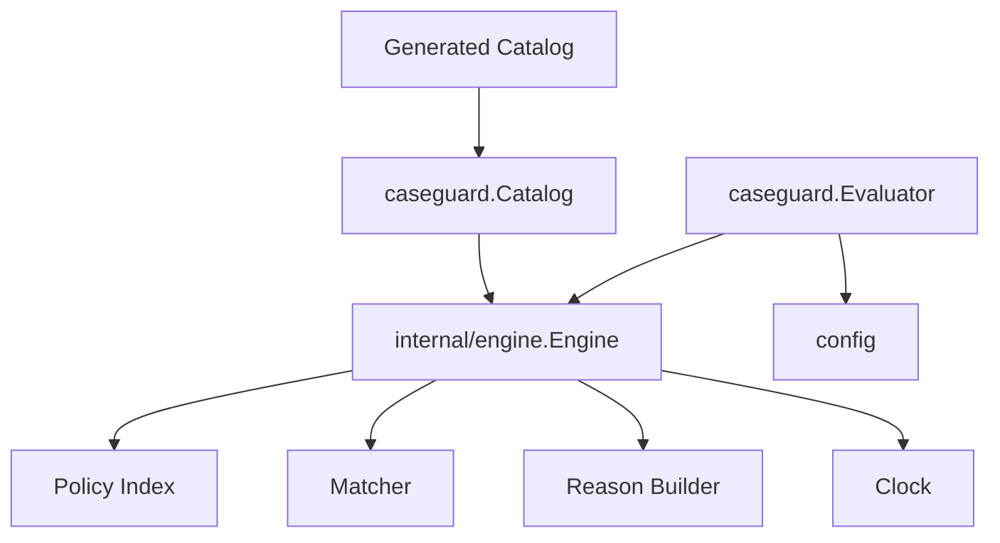
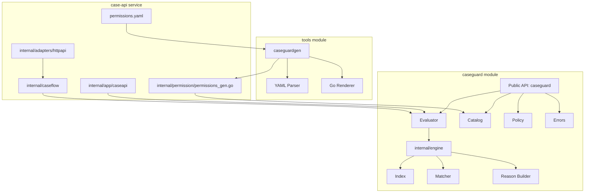
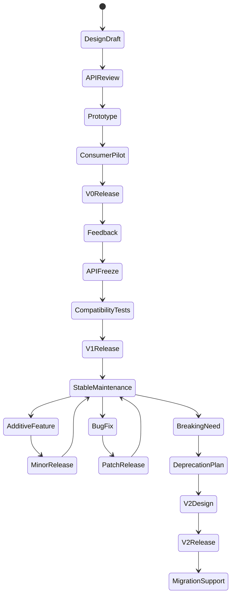

# learn-go-composition-oop-functional-reflection-codegen-modules-part-030.md

# Part 030 — Capstone Handbook: Designing a Production-Grade Go Platform Library End-to-End

> Seri: `learn-go-composition-oop-functional-reflection-codegen-modules`  
> Bagian: `030 / 030`  
> Target pembaca: Java software engineer / tech lead yang ingin menggabungkan composition, OOP tanpa class, functional style, reflection, code generation, package/module design, compatibility, dan enterprise governance menjadi desain nyata  
> Fokus: capstone end-to-end, decision framework, reference architecture, production checklist, dan review model

---

## 0. Status Seri

Ini adalah **bagian terakhir** dari seri:

```text
learn-go-composition-oop-functional-reflection-codegen-modules
```

Status setelah part ini:

```text
SELESAI — Part 030 dari 030
```

Seri ini telah membahas:

1. transisi mental model Java ke Go;
2. defined type, alias, receiver, method;
3. method set;
4. struct embedding;
5. composition patterns;
6. interface sebagai behavioral contract;
7. structural typing;
8. type sets dan generics constraints;
9. OOP tanpa class;
10. anti-inheritance migration;
11. functional style;
12. functional options;
13. higher-order API;
14. iterator-style design;
15. reflection mental model;
16. reflection struct metadata;
17. reflection performance & safety;
18. reflection vs generics vs codegen;
19. code generation fundamentals;
20. AST-based generation;
21. type-aware generation;
22. annotation-like design;
23. generating production APIs;
24. package design;
25. module fundamentals;
26. modern module governance;
27. private modules & supply-chain;
28. large-scale repo architecture;
29. API compatibility engineering;
30. capstone handbook ini.

Part ini bukan mengulang semuanya. Part ini menggabungkan semuanya menjadi satu **production design exercise**.

---

## 1. Capstone Problem

Kita akan merancang sebuah Go platform library untuk domain regulatory system:

```text
caseguard
```

Library ini menyediakan:

- typed permission evaluation;
- policy registry;
- case lifecycle authorization;
- explainable decision;
- audit-ready reason output;
- generated permission catalog;
- compatibility-safe public API;
- private module governance;
- production CI/release process;
- migration/deprecation strategy.

Nama module contoh:

```text
go.company.internal/regulatory/caseguard
```

Public package utama:

```go
import "go.company.internal/regulatory/caseguard"
```

Target consumer:

- case management service;
- appeal service;
- compliance service;
- audit worker;
- workflow engine;
- admin API;
- test fixtures;
- generated clients/tools.

Kita ingin library ini **tidak menjadi framework besar**, tetapi tetap cukup kuat untuk dipakai banyak service.

---

## 2. Design Goals

### 2.1 Functional Goals

Library harus bisa:

1. mengevaluasi apakah subject boleh melakukan action pada resource;
2. mengembalikan decision typed, bukan hanya `bool`;
3. mengembalikan reason untuk audit/explainability;
4. mendukung policy registry;
5. mendukung generated permission catalog;
6. mendukung optional tracing/logging;
7. mendukung testability;
8. stabil untuk banyak consumer;
9. evolve tanpa breaking change berulang.

### 2.2 Non-Functional Goals

Library harus:

1. idiomatic Go;
2. small public surface;
3. explicit dependency;
4. backward-compatible dalam v1;
5. deterministic generated code;
6. bebas runtime reflection di hot path;
7. clear error contract;
8. context-aware;
9. concurrency-safe untuk evaluator;
10. supply-chain compliant;
11. private-module safe;
12. easy to benchmark;
13. easy to migrate.

### 2.3 Non-Goals

Library tidak akan:

1. menjadi full workflow engine;
2. membaca database langsung;
3. membawa HTTP framework;
4. memaksa DI container;
5. menggunakan reflection untuk semua hal;
6. membuat annotation framework;
7. expose internal generated registry sebagai dumping ground;
8. mendefinisikan seluruh domain case management;
9. menjadi “Spring Security for Go” secara literal.

---

## 3. First Principle: Public API Is Product

Karena library akan dipakai banyak service, public API harus dianggap produk.

Pertanyaan awal:

```text
Apa yang consumer butuhkan?
Apa yang harus tetap private?
Apa yang bisa berubah tanpa breaking?
Apa yang jika salah akan berdampak luas?
```

Core consumer story:

```go
evaluator, err := caseguard.NewEvaluator(catalog, opts...)
if err != nil {
    return err
}

decision, err := evaluator.Evaluate(ctx, caseguard.Request{
    Subject: caseguard.Subject{ID: "officer-123", Roles: []caseguard.Role{caseguard.RoleManager}},
    Action:  caseguard.ActionApprove,
    Resource: caseguard.Resource{
        Type: caseguard.ResourceCase,
        ID:   "CASE-001",
        Attributes: map[string]string{
            "status": "submitted",
        },
    },
})
if err != nil {
    return err
}

if !decision.Allowed {
    return fmt.Errorf("not allowed: %w", caseguard.ErrPermissionDenied)
}
```

This must be:

- readable;
- stable;
- testable;
- explicit;
- easy to wrap in application usecase.

---

## 4. Package and Module Layout

Recommended single library module:

```text
caseguard/
  go.mod
  go.sum
  README.md
  CHANGELOG.md
  MIGRATION.md

  evaluator.go
  request.go
  decision.go
  catalog.go
  option.go
  errors.go
  doc.go

  internal/
    engine/
      engine.go
      matcher.go
      index.go
    catalogvalidate/
      validate.go
    generatedcheck/
      check.go

  caseguardtest/
    fixture.go
    assert.go

  tools/
    caseguardgen/
      main.go
      parser.go
      render.go

  testdata/
    catalog/
      permissions.yaml
      invalid-permissions.yaml

  docs/
    api-compatibility.md
    code-generation.md
    release.md
    private-module-policy.md
```

### 4.1 Why Not `/pkg`?

For a pure library repo, root package itself is public API. We do not need `/pkg/caseguard`.

Use:

```go
import "go.company.internal/regulatory/caseguard"
```

not:

```go
import "go.company.internal/regulatory/caseguard/pkg/caseguard"
```

### 4.2 Why `internal/engine`?

The engine implementation is not public API.

Consumers should not import:

```go
go.company.internal/regulatory/caseguard/internal/engine
```

Compiler prevents this outside parent tree.

### 4.3 Why `caseguardtest`?

Test helper package is intentionally public/importable for consumer tests.

Example:

```go
import "go.company.internal/regulatory/caseguard/caseguardtest"
```

This must be treated as API too, but less critical if documented as testing support.

### 4.4 Why `tools/caseguardgen`?

Generator is part of repository, but not part of runtime API.

Depending on governance, `tools/` can be separate module if dependencies are heavy.

---

## 5. `go.mod` Design

Example:

```go
module go.company.internal/regulatory/caseguard

go 1.26.0

toolchain go1.26.4

require (
    gopkg.in/yaml.v3 v3.0.1
)
```

But question:

> Should runtime package depend on YAML parser?

Maybe not.

Better split generator into tools module:

```text
caseguard/
  go.mod              # runtime library
  tools/
    go.mod            # generator deps
```

Runtime `go.mod`:

```go
module go.company.internal/regulatory/caseguard

go 1.26.0

toolchain go1.26.4
```

Tools `go.mod`:

```go
module go.company.internal/regulatory/caseguard/tools

go 1.26.0

toolchain go1.26.4

require (
    gopkg.in/yaml.v3 v3.0.1
)
```

Reason:

- runtime library remains dependency-light;
- generator dependencies do not leak to consumers;
- security review easier;
- module graph smaller.

Trade-off:

- CI slightly more complex.

---

## 6. Public API Draft

### 6.1 Core Types

```go
package caseguard

type Subject struct {
    ID    SubjectID
    Roles []Role
    Attributes map[string]string
}

type SubjectID string
type Role string

type Action string

type Resource struct {
    Type ResourceType
    ID   ResourceID
    Attributes map[string]string
}

type ResourceType string
type ResourceID string

type Request struct {
    Subject  Subject
    Action   Action
    Resource Resource
}

type Decision struct {
    Allowed bool
    Reasons []Reason
}

type Reason struct {
    Code    ReasonCode
    Message string
    Policy  PolicyID
}

type ReasonCode string
type PolicyID string
```

### 6.2 Evaluator

```go
type Evaluator struct {
    engine *engine.Engine
}

func NewEvaluator(catalog Catalog, opts ...Option) (*Evaluator, error)

func (e *Evaluator) Evaluate(ctx context.Context, req Request) (Decision, error)
```

### 6.3 Catalog

```go
type Catalog interface {
    Policies() []Policy
}
```

Pause.

Is this good?

If `Catalog` is implemented by consumers, adding methods later breaks them.

Maybe better:

```go
type Catalog struct {
    policies []Policy
}
```

with constructor:

```go
func NewCatalog(policies []Policy) (Catalog, error)
```

But if generated catalog must return a catalog, a concrete type is easier.

Potential API:

```go
type Catalog struct {
    policies []Policy
}

func NewCatalog(policies []Policy) (Catalog, error)

func (c Catalog) Policies() []Policy
```

But `Policies` returning slice exposes copy/ownership issue.

Better:

```go
func (c Catalog) Len() int
func (c Catalog) Policy(i int) Policy
```

Maybe too much.

For v1 simplicity:

```go
type Catalog struct {
    policies []Policy
}

func NewCatalog(policies []Policy) (Catalog, error) {
    // copy and validate
}

func (c Catalog) policiesForEngine() []Policy {
    return c.policies
}
```

No exported accessor unless needed.

Generated code can be same package or call constructor.

### 6.4 Policy

```go
type Policy struct {
    ID       PolicyID
    Action   Action
    Resource ResourceType
    Roles    []Role
    Effect   Effect
}

type Effect string

const (
    EffectAllow Effect = "allow"
    EffectDeny  Effect = "deny"
)
```

Risk: exported struct fields become API. But policy catalog is likely generated/configured.

Maybe acceptable if stable.

Alternative:

```go
func NewPolicy(id PolicyID, action Action, resource ResourceType, effect Effect, roles ...Role) (Policy, error)
```

with unexported fields.

For public library stability, constructor-based domain type is stronger.

```go
type Policy struct {
    id       PolicyID
    action   Action
    resource ResourceType
    roles    []Role
    effect   Effect
}

func NewPolicy(id PolicyID, action Action, resource ResourceType, effect Effect, roles ...Role) (Policy, error)
```

This protects invariants and allows internal representation changes.

---

## 7. API Design Decision: Struct Fields vs Constructors

For `Request`, exported fields are okay because it is consumer input DTO.

For `Policy`, use constructor because it is internal rule/invariant.

### 7.1 Request as Open Input

```go
type Request struct {
    Subject  Subject
    Action   Action
    Resource Resource
}
```

Consumer creates it frequently.

### 7.2 Policy as Validated Object

```go
type Policy struct {
    id       PolicyID
    action   Action
    resource ResourceType
    effect   Effect
    roles    []Role
}

func NewPolicy(id PolicyID, action Action, resource ResourceType, effect Effect, roles ...Role) (Policy, error)
```

Reason:

- policy validity matters;
- future fields may be added;
- generated code can call constructor;
- prevents invalid state.

### 7.3 Catalog as Immutable Boundary

```go
type Catalog struct {
    policies []Policy
}

func NewCatalog(policies []Policy) (Catalog, error) {
    copied := slices.Clone(policies)
    if err := validatePolicies(copied); err != nil {
        return Catalog{}, err
    }
    return Catalog{policies: copied}, nil
}
```

`Evaluator` copies/compiles catalog into immutable engine.

---

## 8. Error Contract

Define stable errors:

```go
var (
    ErrInvalidCatalog    = errors.New("invalid catalog")
    ErrInvalidRequest    = errors.New("invalid request")
    ErrPermissionDenied  = errors.New("permission denied")
    ErrEvaluatorClosed   = errors.New("evaluator closed")
)
```

But `Evaluate` returning `ErrPermissionDenied` may be wrong if decision uses `Allowed=false` and no error.

Design decision:

- permission denial is not exceptional;
- return `Decision{Allowed:false}` with nil error;
- reserve `ErrPermissionDenied` for helper wrappers.

Better:

```go
func (d Decision) Err() error {
    if d.Allowed {
        return nil
    }
    return ErrPermissionDenied
}
```

Then consumer can choose:

```go
if err := decision.Err(); err != nil {
    return err
}
```

### 8.1 Validation Error

```go
type ValidationError struct {
    Field string
    Code  string
    Err   error
}

func (e *ValidationError) Error() string
func (e *ValidationError) Unwrap() error
```

Support:

```go
errors.Is(err, ErrInvalidCatalog)
errors.As(err, *ValidationError)
```

### 8.2 Error Policy

Document:

- error strings are not stable;
- use `errors.Is`/`errors.As`;
- denial is represented as decision, not error;
- invalid request returns error;
- context cancellation wraps `context.Canceled` or `context.DeadlineExceeded`.

---

## 9. Functional Options

```go
type Option interface {
    apply(*config)
}

type optionFunc func(*config)

func (f optionFunc) apply(c *config) { f(c) }

type config struct {
    clock  Clock
    logger Logger
    tracer Tracer
    strict bool
}

func WithClock(clock Clock) Option {
    return optionFunc(func(c *config) {
        c.clock = clock
    })
}

func WithLogger(logger Logger) Option {
    return optionFunc(func(c *config) {
        c.logger = logger
    })
}

func WithStrictMode(enabled bool) Option {
    return optionFunc(func(c *config) {
        c.strict = enabled
    })
}
```

### 9.1 Why Option Interface With Unexported Method?

This prevents external arbitrary option implementations.

Benefits:

- API evolution safer;
- option semantics controlled;
- validation centralized.

Cost:

- consumers cannot create custom options.

For platform library, this is acceptable.

### 9.2 Required vs Optional

`catalog` is required parameter:

```go
func NewEvaluator(catalog Catalog, opts ...Option) (*Evaluator, error)
```

Do not make required dependency an option:

```go
NewEvaluator(WithCatalog(catalog))
```

because missing catalog becomes runtime validation issue and API less clear.

---

## 10. Interface Strategy

Avoid public interfaces unless consumers need to implement them.

### 10.1 Do Not Start With

```go
type Evaluator interface {
    Evaluate(ctx context.Context, req Request) (Decision, error)
}
```

If consumers need it, they can define:

```go
type Authorizer interface {
    Evaluate(ctx context.Context, req caseguard.Request) (caseguard.Decision, error)
}
```

in their package.

### 10.2 Provide Concrete Type

```go
type Evaluator struct {
    engine *engine.Engine
}
```

This gives:

- evolvable methods;
- no implementer break from adding method;
- clearer ownership.

### 10.3 Small Support Interfaces

Interfaces are acceptable for dependencies:

```go
type Clock interface {
    Now() time.Time
}

type Logger interface {
    DebugContext(ctx context.Context, msg string, attrs ...any)
}
```

But even these can be avoided by using standard `*slog.Logger`.

### 10.4 Optional Capability

If later we add explainability:

```go
func (e *Evaluator) Explain(ctx context.Context, req Request) (Explanation, error)
```

Adding method to concrete type is compatible.

If `Evaluator` had been public interface, this would break implementers.

---

## 11. Composition Model

Internal components:



No inheritance.

Use composition:

```go
type Evaluator struct {
    engine *engine.Engine
}
```

Internal engine:

```go
type Engine struct {
    index   *Index
    matcher Matcher
    clock   Clock
}
```

Capability objects:

```go
type Matcher struct {}
type Index struct {}
type ReasonBuilder struct {}
```

Each component has narrow responsibility.

---

## 12. Reflection vs Generics vs Codegen Decision

For this library:

| Problem | Technique |
|---|---|
| Permission catalog from YAML | code generation |
| Runtime evaluation | normal code |
| Request shape | typed structs |
| Attribute matching | explicit map/string model |
| Validation | explicit code, maybe generated |
| Generated constants | codegen |
| Public API type safety | defined types |
| Generic helpers | minimal |
| Reflection | avoid hot path |

### 12.1 Why Not Reflection?

Reflection would allow arbitrary struct:

```go
Evaluate(ctx, anyRequest)
```

But this hurts:

- type safety;
- performance predictability;
- error clarity;
- API documentation;
- compatibility;
- auditability.

Use reflection only if:

- building optional mapper from struct tags;
- generator introspection;
- testing tool;
- compatibility checker.

### 12.2 Why Codegen?

Permission catalog is static-ish and audit-sensitive.

Generate:

```go
const (
    ActionApprove Action = "case.approve"
    ResourceCase ResourceType = "case"
)

func GeneratedCatalog() caseguard.Catalog
```

Benefits:

- compile-time constants;
- no YAML parsing in runtime;
- deterministic reviewable output;
- safer release evidence;
- smaller runtime dependencies.

### 12.3 Why Not Generics Everywhere?

Generics are useful for utilities but not core public domain API here.

Bad:

```go
func Evaluate[S SubjectLike, A ActionLike, R ResourceLike](...)
```

Too abstract.

Better:

```go
func (e *Evaluator) Evaluate(ctx context.Context, req Request) (Decision, error)
```

Readable beats clever.

---

## 13. Code Generation Design

Source:

```yaml
actions:
  - name: approve
    value: case.approve
resources:
  - name: case
    value: case
policies:
  - id: case-manager-approve
    action: case.approve
    resource: case
    effect: allow
    roles:
      - manager
```

Directive:

```go
//go:generate go run ./tools/caseguardgen -input permissions.yaml -output permissions_gen.go
```

Generated file:

```go
// Code generated by caseguardgen v1.0.0; DO NOT EDIT.

package permission

import "go.company.internal/regulatory/caseguard"

const (
    ActionApprove caseguard.Action = "case.approve"
    ResourceCase  caseguard.ResourceType = "case"
    RoleManager   caseguard.Role = "manager"
)

func Catalog() caseguard.Catalog {
    policies := []caseguard.Policy{
        caseguard.MustPolicy("case-manager-approve", ActionApprove, ResourceCase, caseguard.EffectAllow, RoleManager),
    }
    return caseguard.MustCatalog(policies)
}
```

### 13.1 Should `MustPolicy` Be Public?

Maybe.

For generated code, panic on invalid generated catalog is acceptable if generator already validates.

But exposing `MustPolicy` as public API means consumers may use it.

Option:

```go
func MustPolicy(...) Policy
```

Document:

```go
// MustPolicy is intended for generated or static initialization code.
// It panics if the policy is invalid.
```

Alternatively, generated code handles errors in `init`, but that is worse.

### 13.2 Determinism Requirements

Generator must:

- sort output;
- stable formatting;
- no timestamp;
- no machine path;
- no random IDs;
- deterministic error messages;
- atomic write;
- golden tests;
- CI diff check.

### 13.3 Generated Code Ownership

Generated code should live in consumer package:

```text
services/case/internal/permission/permissions_gen.go
```

not inside central library.

Reason:

- each service owns its permission catalog;
- library provides types/evaluator;
- service generator output is application-specific.

---

## 14. Package Consumer Example

Consumer service layout:

```text
case-api/
  go.mod
  cmd/case-api/main.go
  internal/
    app/caseapi/
    caseflow/
    permission/
      permissions.yaml
      permissions_gen.go
    adapters/httpapi/
```

`internal/permission/permission.go`:

```go
package permission

import "go.company.internal/regulatory/caseguard"

//go:generate go run go.company.internal/regulatory/caseguard/tools/caseguardgen@v1.0.0 -input permissions.yaml -output permissions_gen.go

func NewEvaluator() (*caseguard.Evaluator, error) {
    return caseguard.NewEvaluator(Catalog())
}
```

But `go run module/tools@version` has governance implications. Better if tool module is pinned in service tooling.

Alternative:

```go
//go:generate go run ./tools/caseguardgen ...
```

if service vendors/generates via internal tools.

Policy must decide.

---

## 15. API Compatibility Plan

v1 public API:

```go
type Evaluator struct
func NewEvaluator(catalog Catalog, opts ...Option) (*Evaluator, error)
func (e *Evaluator) Evaluate(ctx context.Context, req Request) (Decision, error)

type Request struct
type Subject struct
type Resource struct
type Decision struct
type Reason struct
type Catalog struct
type Policy struct

func NewPolicy(...) (Policy, error)
func MustPolicy(...) Policy
func NewCatalog([]Policy) (Catalog, error)
func MustCatalog([]Policy) Catalog

var ErrInvalidCatalog
var ErrInvalidRequest
var ErrPermissionDenied
```

### 15.1 Do Not Export

Do not export:

- engine;
- matcher;
- index;
- parser internals;
- config struct;
- generated metadata internals;
- validation registry;
- mutable catalog slice.

### 15.2 Future Additions

Compatible additions:

```go
func (e *Evaluator) Explain(ctx context.Context, req Request) (Explanation, error)
func WithTracer(t Tracer) Option
func WithDecisionCache(size int) Option
type Explanation struct {}
type Trace struct {}
```

### 15.3 Avoid Future Trap

Do not expose interface:

```go
type Evaluator interface { Evaluate(...) }
```

because later adding `Explain` breaks.

Do not expose config struct if many options expected.

Do not return mutable internals.

---

## 16. Versioning and Release Policy

### 16.1 v0 Phase

Use v0 while API is still being tested:

```text
v0.1.0
v0.2.0
v0.3.0
```

Rules:

- breaking changes allowed but documented;
- early consumer list maintained;
- migration notes still provided.

### 16.2 v1 Criteria

Tag v1 only when:

- public API reviewed;
- at least two real consumers integrated;
- compatibility tests exist;
- generator deterministic;
- CI governance complete;
- error semantics documented;
- performance baseline recorded;
- release process practiced;
- private module configuration documented.

### 16.3 v1 Policy

Within v1:

- no breaking API change;
- additive changes only;
- deprecate before remove;
- removal waits for v2;
- behavior changes require release note;
- security fixes may change behavior but must be documented.

### 16.4 v2 Policy

Create v2 only if:

- old API blocks correctness/security/maintainability;
- migration guide exists;
- v1 support window defined;
- import path becomes `/v2`.

---

## 17. Testing Strategy

### 17.1 Unit Tests

- policy validation;
- request validation;
- evaluator logic;
- deny/allow precedence;
- reason generation;
- nil/zero value behavior;
- context cancellation;
- error wrapping.

### 17.2 Table Tests

```go
func TestEvaluate(t *testing.T) {
    tests := []struct{
        name string
        req Request
        wantAllowed bool
        wantReason ReasonCode
    }{
        // ...
    }
}
```

### 17.3 Fuzz Tests

Good for parser/generator input:

```go
func FuzzParseCatalog(f *testing.F) { ... }
```

### 17.4 Compatibility Tests

Consumer fixture:

```text
compat/v1-basic/
  go.mod
  main.go
```

Test:

```bash
cd compat/v1-basic && go test ./...
```

### 17.5 Generated Code Tests

- golden output;
- invalid YAML cases;
- deterministic output;
- generated code compiles;
- generated catalog validates.

### 17.6 Benchmark

```go
func BenchmarkEvaluate(b *testing.B) {
    evaluator := mustEvaluator(b)
    req := sampleRequest()
    b.ReportAllocs()
    for i := 0; i < b.N; i++ {
        _, err := evaluator.Evaluate(context.Background(), req)
        if err != nil { b.Fatal(err) }
    }
}
```

Track:

- ns/op;
- allocs/op;
- B/op;
- policy count scaling.

### 17.7 Race Test

If evaluator is concurrency-safe:

```bash
go test -race ./...
```

Test concurrent evaluate.

---

## 18. CI Pipeline

For library repo:

```bash
set -euo pipefail

go version
go env GOTOOLCHAIN GOPRIVATE GOPROXY GOSUMDB GOWORK

go mod download
go mod tidy
git diff --exit-code go.mod go.sum

go test ./...
go test -race ./...

(cd tools && go mod download && go test ./...)

go generate ./...
git diff --exit-code

go test ./compat/...

govulncheck ./...

go test -bench=. -benchmem ./... > benchmark.txt
```

For generator:

```bash
(cd tools && go test ./...)
```

If `tools` separate module, include tidy check there too.

### 18.1 Forbidden Checks

- reject local path `replace`;
- reject changed generated output;
- reject unpinned generator;
- reject `go.work` dependency in release;
- reject `latest` in generator command;
- reject secrets in files.

---

## 19. Private Module and Supply-Chain Policy

Since module path is private:

```text
go.company.internal/regulatory/caseguard
```

CI must set:

```bash
GOPRIVATE=go.company.internal/*
GOPROXY=https://go-proxy.company.internal
GONOSUMDB=go.company.internal/*
GOTOOLCHAIN=local
```

Decision:

- internal proxy serves private module;
- public modules either mirrored or through approved fallback;
- private module versions immutable;
- release tags protected;
- CI token read-only for consumers;
- release bot creates tags;
- SBOM/release evidence archived.

### 19.1 Consumer Service Policy

Consumer services must not use:

```bash
go get go.company.internal/regulatory/caseguard@latest
```

in release scripts.

They should pin:

```go
require go.company.internal/regulatory/caseguard v1.2.0
```

and upgrade via PR.

---

## 20. Documentation

Minimum docs:

```text
README.md
docs/getting-started.md
docs/api-compatibility.md
docs/errors.md
docs/code-generation.md
docs/migration.md
docs/release.md
```

### 20.1 README Should Show

- what problem library solves;
- install/import;
- basic evaluator example;
- generated catalog example;
- error handling;
- compatibility policy;
- version support.

### 20.2 API Docs Must State

For `Evaluator`:

```go
// Evaluator evaluates authorization requests against an immutable catalog.
// Evaluator is safe for concurrent use by multiple goroutines.
// Evaluate returns a Decision for valid requests. A denied decision is not an error.
// If ctx is canceled, Evaluate returns an error wrapping context.Canceled.
```

For `Decision`:

```go
// Err returns ErrPermissionDenied when the decision is not allowed.
// The returned error is suitable for errors.Is.
```

For error strings:

```go
// Error message text is not part of the API contract.
```

---

## 21. Review: Applying Concepts From All Parts

### 21.1 Composition

Used in:

```go
type Evaluator struct {
    engine *engine.Engine
}
```

Not inheritance.

### 21.2 OOP Without Class

Domain types:

```go
type Policy struct { ... }
func NewPolicy(...) (Policy, error)
```

Encapsulation via unexported fields.

### 21.3 Method Set

Choose pointer receiver for `Evaluator`:

```go
func (e *Evaluator) Evaluate(...)
```

Because evaluator contains compiled engine and may later maintain cache/metrics.

### 21.4 Interface

Avoid public evaluator interface.

Use optional small interfaces only where needed.

### 21.5 Functional

Options:

```go
WithClock
WithLogger
WithStrictMode
```

### 21.6 Reflection

Avoid runtime reflection. Use only tooling if needed.

### 21.7 Codegen

Generate catalog constants and static policy construction.

### 21.8 Modules

Runtime and tools can be separate modules.

### 21.9 Package Design

Root public package, `internal/engine`, `tools/caseguardgen`.

### 21.10 Compatibility

No breaking change in v1. Deprecation before removal. `/v2` for major.

### 21.11 Supply Chain

Private module env configured. Internal proxy. Protected tags.

---

## 22. Full Architecture Diagram



---

## 23. Lifecycle State Machine



---

## 24. Failure Modeling

### 24.1 API Too Broad

Symptom:

- many exported types;
- consumers depend on internals;
- every refactor breaking.

Mitigation:

- move internals to `/internal`;
- unexport fields;
- expose constructors;
- reduce package surface.

### 24.2 Interface Frozen Too Early

Symptom:

- public `Evaluator` interface;
- need to add `Explain`;
- implementers break.

Mitigation:

- expose concrete type;
- consumers define local interface;
- add method to concrete type.

### 24.3 Generator Nondeterminism

Symptom:

- generated file diff changes every run.

Mitigation:

- sort;
- no timestamp;
- golden tests;
- CI diff check.

### 24.4 Runtime YAML Parsing in Hot Path

Symptom:

- service startup slow;
- runtime dependency bloat;
- parsing errors in production.

Mitigation:

- generate catalog at build time;
- validate in CI;
- runtime uses compiled Go.

### 24.5 Mutable Catalog

Symptom:

- consumer modifies policy slice after evaluator creation;
- data race or inconsistent decisions.

Mitigation:

- copy input;
- immutable engine;
- document ownership.

### 24.6 Error Contract Broken

Symptom:

- consumers fail to detect permission denial after error wrapping change.

Mitigation:

- stable sentinel;
- `errors.Is` tests;
- error compatibility fixture.

### 24.7 Private Module Leak

Symptom:

- CI queries public sumdb for private module.

Mitigation:

- `GOPRIVATE`;
- `GONOSUMDB`;
- internal proxy.

### 24.8 v2 Without Migration

Symptom:

- teams stuck on old version;
- duplicated support burden.

Mitigation:

- staged v1 deprecation;
- migration guide;
- compatibility adapters;
- consumer tracking.

---

## 25. Production Readiness Checklist

### 25.1 API

- [ ] Minimal exported surface.
- [ ] Public types documented.
- [ ] Nil/zero behavior documented.
- [ ] Concurrency safety documented.
- [ ] Error contract documented.
- [ ] No public interface unless needed.
- [ ] Config uses options if evolution expected.
- [ ] Constructors validate invariants.
- [ ] No exported mutable internals.

### 25.2 Package

- [ ] Root package public.
- [ ] Internals under `/internal`.
- [ ] Generator under `tools`.
- [ ] Test helper separate package if needed.
- [ ] No `common` dumping ground.
- [ ] No import cycles.
- [ ] Dependency direction clear.

### 25.3 Codegen

- [ ] Deterministic output.
- [ ] Golden tests.
- [ ] No timestamp/path randomness.
- [ ] Generated file header.
- [ ] CI regenerate-and-diff.
- [ ] Tool version pinned.
- [ ] Runtime does not depend on parser unless intended.

### 25.4 Module

- [ ] `go` directive intentional.
- [ ] `toolchain` directive intentional.
- [ ] `go.sum` committed.
- [ ] Runtime module dependency-light.
- [ ] Tools dependency isolated if needed.
- [ ] No local `replace`.
- [ ] Private module env documented.

### 25.5 Compatibility

- [ ] v1 readiness criteria met.
- [ ] Release notes template exists.
- [ ] Deprecation policy exists.
- [ ] Compatibility fixtures exist.
- [ ] Error compatibility tests exist.
- [ ] API diff or snapshot exists.
- [ ] `/v2` strategy documented.

### 25.6 Testing

- [ ] Unit tests.
- [ ] Race tests.
- [ ] Benchmarks.
- [ ] Fuzz tests for parser/generator.
- [ ] Generated compile tests.
- [ ] Consumer compatibility tests.
- [ ] Integration sample.

### 25.7 Supply Chain

- [ ] `GOPRIVATE` configured.
- [ ] Internal proxy policy documented.
- [ ] Tags protected.
- [ ] CI token least privilege.
- [ ] No secrets in Docker layers.
- [ ] Vulnerability scanning.
- [ ] Release provenance archived.
- [ ] SBOM/build metadata if required.

---

## 26. Final Design Principles

### 26.1 Prefer Explicit Over Magical

Go rewards explicit wiring, explicit constructors, explicit errors, explicit package boundaries.

### 26.2 Use Composition as Assembly, Not Inheritance Replacement

Composition is about combining capabilities with clear ownership.

### 26.3 Expose Concrete Types When Evolution Matters

Public interfaces are contracts for implementers. Do not create them casually.

### 26.4 Use Interfaces at Consumer Boundary

Let consumer packages define the minimal behavior they need.

### 26.5 Make Invalid State Hard

Use constructors, unexported fields, validation, and immutable boundaries.

### 26.6 Codegen for Static Truth

Use code generation when input is static, audit-sensitive, or performance-sensitive.

### 26.7 Reflection Is an Escape Hatch

Use reflection for tooling/metadata, not as default runtime design.

### 26.8 Module Governance Is Architecture

`go.mod`, `toolchain`, private module policy, proxy, sumdb, CI, and release process are part of the design.

### 26.9 Compatibility Is a Product Feature

Stable API earns trust. Breaking changes consume organizational capital.

### 26.10 Repository Layout Should Encode Dependency Direction

Folders should make correct imports natural and wrong imports awkward.

---

## 27. Common Senior-Level Trade-Offs

### 27.1 Constructor vs Exported Struct

| Choice | Use When |
|---|---|
| Exported struct fields | Simple data input/output, low invariant |
| Constructor + unexported fields | Invariant-bearing domain type |
| Functional options | Optional config likely to grow |
| Builder | Complex staged construction, use sparingly |

### 27.2 Interface vs Concrete Type

| Choice | Use When |
|---|---|
| Concrete type | Provider owns implementation and may evolve methods |
| Consumer interface | Consumer needs test seam/abstraction |
| Public provider interface | Multiple external implementers are intended |
| Sealed-like interface | Need limited implementations |

### 27.3 Reflection vs Codegen vs Generics

| Choice | Use When |
|---|---|
| Reflection | Dynamic runtime shape unavoidable |
| Codegen | Static input, performance, auditability |
| Generics | Compile-time type-safe algorithms |
| Manual code | Small surface, clarity more valuable |

### 27.4 Single vs Multi-Module

| Choice | Use When |
|---|---|
| Single module | One release/refactor unit |
| Multi-module | Independent versioning/distribution needed |
| Separate tools module | Tool deps should not leak to runtime |
| Workspace | Local development across modules |

---

## 28. Example Final Public API Sketch

```go
// Package caseguard provides typed, audit-friendly authorization evaluation
// for regulatory case-management systems.
package caseguard

type SubjectID string
type ResourceID string
type ResourceType string
type Role string
type Action string
type PolicyID string
type ReasonCode string

type Subject struct {
    ID         SubjectID
    Roles      []Role
    Attributes map[string]string
}

type Resource struct {
    Type       ResourceType
    ID         ResourceID
    Attributes map[string]string
}

type Request struct {
    Subject  Subject
    Action   Action
    Resource Resource
}

type Decision struct {
    Allowed bool
    Reasons []Reason
}

func (d Decision) Err() error {
    if d.Allowed {
        return nil
    }
    return ErrPermissionDenied
}

type Reason struct {
    Code    ReasonCode
    Message string
    Policy  PolicyID
}

type Effect string

const (
    EffectAllow Effect = "allow"
    EffectDeny  Effect = "deny"
)

type Policy struct {
    id       PolicyID
    action   Action
    resource ResourceType
    effect   Effect
    roles    []Role
}

func NewPolicy(id PolicyID, action Action, resource ResourceType, effect Effect, roles ...Role) (Policy, error)
func MustPolicy(id PolicyID, action Action, resource ResourceType, effect Effect, roles ...Role) Policy

type Catalog struct {
    policies []Policy
}

func NewCatalog(policies []Policy) (Catalog, error)
func MustCatalog(policies []Policy) Catalog

type Evaluator struct {
    engine *engine.Engine
}

func NewEvaluator(catalog Catalog, opts ...Option) (*Evaluator, error)
func (e *Evaluator) Evaluate(ctx context.Context, req Request) (Decision, error)

type Option interface {
    apply(*config)
}

func WithStrictMode(enabled bool) Option
func WithLogger(logger *slog.Logger) Option
func WithClock(clock Clock) Option

type Clock interface {
    Now() time.Time
}

var (
    ErrInvalidCatalog   = errors.New("invalid catalog")
    ErrInvalidRequest   = errors.New("invalid request")
    ErrPermissionDenied = errors.New("permission denied")
)
```

Note: in real code, unexported `engine` package reference in public struct field type is hidden because field is unexported. This is okay.

---

## 29. Capstone Self-Review

Ask these questions before calling the design production-grade:

1. Can a consumer understand the API in 10 minutes?
2. Can the API evolve for two years without v2?
3. Are denial, invalid request, and internal error clearly separated?
4. Can evaluator be safely reused concurrently?
5. Are inputs copied where ownership matters?
6. Is generated code deterministic?
7. Can CI prove generated code is up-to-date?
8. Can old consumer code still compile after minor changes?
9. Is private module path protected from leak?
10. Are dependency versions pinned and reviewed?
11. Is runtime dependency graph minimal?
12. Are errors machine-checkable?
13. Is zero value behavior documented?
14. Are package boundaries clear?
15. Is there any unnecessary public interface?
16. Is any “common” package hiding bad cohesion?
17. Is v1 release truly stable?
18. Is migration to v2 planned if needed?
19. Can production artifact prove which module/toolchain built it?
20. Can another team safely adopt this library without tribal knowledge?

If the answer to many of these is “not sure,” the design is not done.

---

## 30. Closing Mental Model

The advanced Go engineer does not merely know syntax.

They know how to create **stable, evolvable, observable, testable, and governable systems** using Go’s deliberately small set of mechanisms:

- package boundary;
- exported/unexported names;
- concrete types;
- methods;
- interfaces;
- composition;
- functions;
- generics;
- reflection when justified;
- code generation when static truth matters;
- modules;
- semantic import versioning;
- compatibility discipline;
- explicit tooling;
- CI policy.

The final shift from Java to Go is not:

```text
How do I recreate classes, inheritance, annotations, and frameworks in Go?
```

The better question is:

```text
What is the smallest explicit design that preserves invariants, keeps dependency direction clean, allows future evolution, and makes production failure modes visible?
```

That question is the core of top-tier Go engineering.

---

## 31. Series Completion

Status seri:

```text
SELESAI
```

Bagian terakhir:

```text
learn-go-composition-oop-functional-reflection-codegen-modules-part-030.md
```

Jumlah part:

```text
031 files total if counting part 000 through part 030
```

Materi yang telah selesai:

```text
Part 000 — Series map and learning strategy
Part 001 — Go vs Java object model
Part 002 — Defined type, alias, receiver, method
Part 003 — Method set
Part 004 — Struct embedding
Part 005 — Composition patterns
Part 006 — Interface behavioral contract
Part 007 — Structural typing
Part 008 — Type sets and generics constraints
Part 009 — OOP without classes
Part 010 — Anti-inheritance migration
Part 011 — Functional style
Part 012 — Functional options
Part 013 — Higher-order API design
Part 014 — Iterator-style design
Part 015 — Reflection mental model
Part 016 — Reflection struct metadata
Part 017 — Reflection performance and safety
Part 018 — Reflection vs generics vs codegen
Part 019 — Code generation fundamentals
Part 020 — AST-based generation
Part 021 — Type-aware generation
Part 022 — Annotation-like design
Part 023 — Generating production APIs
Part 024 — Package design
Part 025 — Module fundamentals
Part 026 — Modern module governance
Part 027 — Private modules and enterprise supply chain
Part 028 — Large-scale repo architecture
Part 029 — API compatibility engineering
Part 030 — Capstone handbook
```

Recommended next step after finishing this series:

1. bundle all markdown files into one zip;
2. optionally create an index README;
3. optionally create a capstone implementation repository skeleton;
4. optionally continue to a new advanced series:
   - `learn-go-authentication-pattern`
   - `learn-go-authorization-pattern`
   - `learn-go-platform-library-design`
   - `learn-go-code-generation-tooling`
   - `learn-go-enterprise-module-supply-chain`
   - `learn-go-clean-architecture-regulatory-systems`

---

## 32. References

Primary references used across the series:

- The Go Programming Language Specification.
- Effective Go.
- Go Modules Reference.
- Go command documentation.
- Go 1.26 Release Notes.
- Go Toolchains documentation.
- Go workspaces documentation.
- Go Blog: The Laws of Reflection.
- Go Blog: Generating code.
- Go Blog: Range over function / iterators.
- Go Blog: Go Modules v2 and Beyond.
- Go Blog: Package names.
- Go Blog: Organizing Go code.
- Go Doc Comments.
- Go Wiki: Deprecated.
- Package documentation for:
  - `reflect`
  - `go/ast`
  - `go/parser`
  - `go/token`
  - `go/types`
  - `go/format`
  - `iter`
  - `sync`
  - `unsafe`
  - `cmd/go`

<!-- NAVIGATION_FOOTER -->
<div class="page-nav">
<a href="./learn-go-composition-oop-functional-reflection-codegen-modules-part-029.md">⬅️ Part 029 — API Compatibility Engineering: Go 1 Promise, Exported API Contract, Breaking Changes, Semantic Import Versioning, Deprecation, Migration, dan Compatibility Tests</a>
<a href="./index.md">📚 Kategori</a>
<a href="../../index.md">🏠 Home</a>
<a href="./README.md">Files ➡️</a>
</div>
