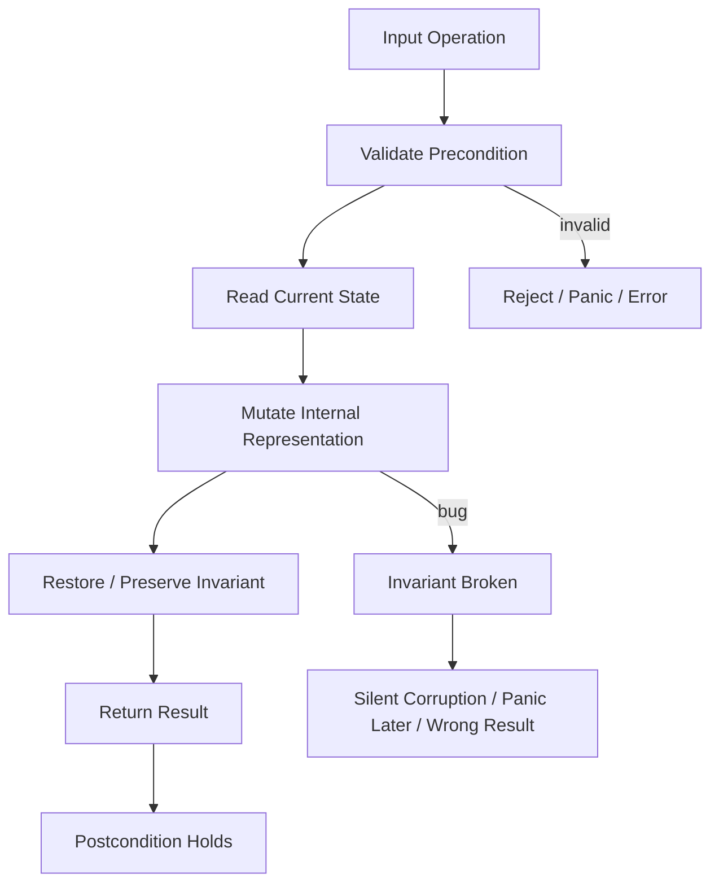
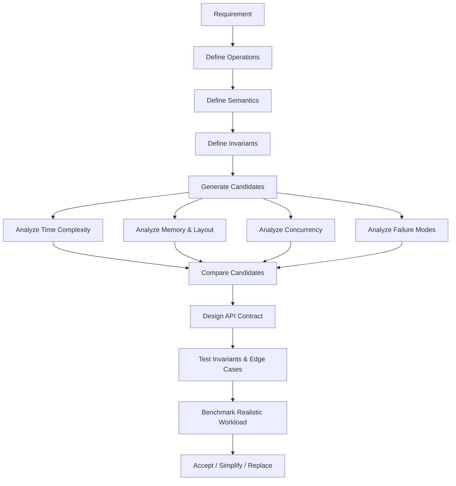
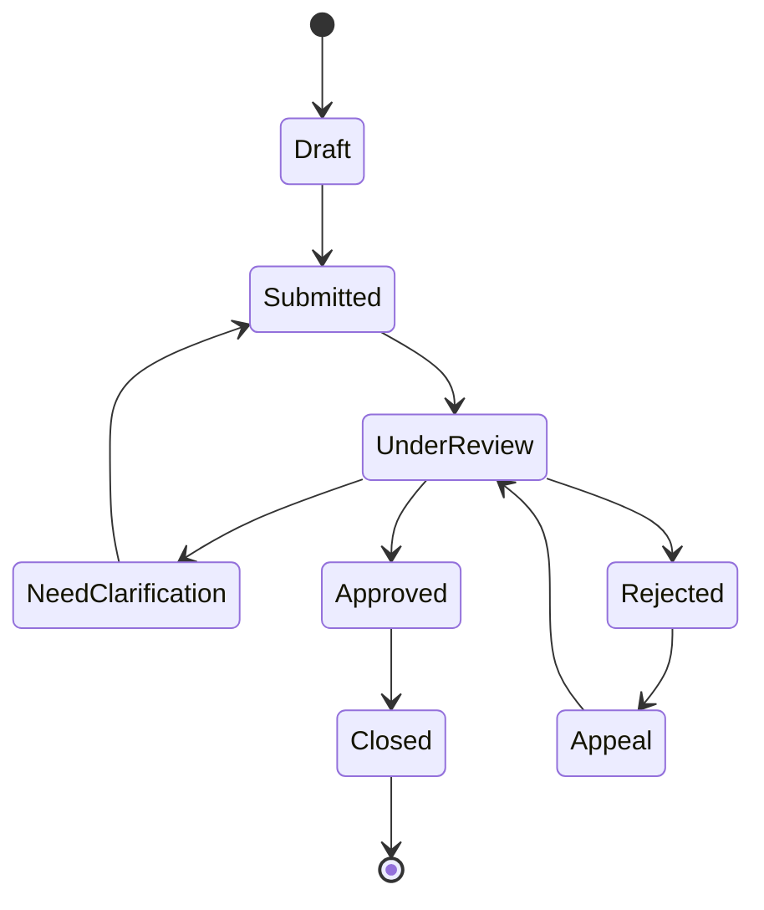
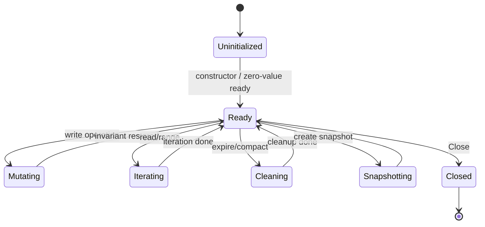
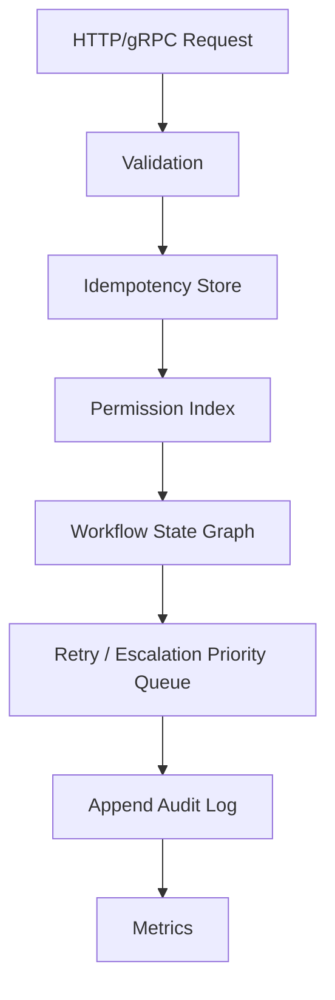

# learn-go-data-structure-algorithm-part-000.md

# Part 000 — Roadmap, Mental Model, dan Batasan Seri

> Seri: **learn-go-data-structure-algorithm**  
> Target: Go hingga **1.26.x**  
> Audience utama: **Java software engineer** yang ingin naik dari sekadar “bisa pakai struktur data” menjadi engineer yang mampu **mendesain, memilih, membuktikan, menguji, dan mengoperasikan** struktur data/algoritma secara production-grade.  
> Status seri: **belum selesai**. Ini adalah **Part 000 dari 034**.

---

## 0. Tujuan Besar Part Ini

Bagian ini bukan langsung membahas `slice`, `map`, tree, heap, graph, atau dynamic programming secara detail. Bagian ini adalah **kerangka berpikir** untuk seluruh seri.

Setelah menyelesaikan part ini, kamu harus punya mental model yang jelas tentang:

1. **Apa arti “menguasai data structure & algorithm” dalam Go untuk level production**, bukan hanya untuk interview.
2. **Apa yang akan dibahas dan tidak dibahas** supaya seri ini tidak mengulang materi Go basic, data model, memory system, concurrency, error handling, atau composition/reflection yang sudah dipelajari.
3. **Bagaimana cara memilih struktur data** berdasarkan invariant, operasi dominan, complexity, memory behavior, concurrency behavior, dan operational risk.
4. **Bagaimana cara membaca trade-off** antara struktur data yang secara teori bagus tetapi buruk untuk CPU cache, GC, allocation, atau p99 latency.
5. **Bagaimana cara mengikuti seluruh seri** agar hasil akhirnya bukan hafalan pattern, tetapi keluwesan desain.

Inti part ini:

> Struktur data bukan sekadar wadah data. Struktur data adalah kontrak operasi, invariant, layout, lifecycle, dan failure mode.

---

## 1. Baseline Versi dan Rujukan Resmi

Seri ini ditulis dengan asumsi target Go sampai **Go 1.26.x**. Rujukan resmi yang menjadi baseline:

- Go 1.26 release notes: <https://go.dev/doc/go1.26>
- Go release history: <https://go.dev/doc/devel/release>
- Go language specification: <https://go.dev/ref/spec>
- Standard library index: <https://pkg.go.dev/std>
- Package `slices`: <https://pkg.go.dev/slices>
- Package `maps`: <https://pkg.go.dev/maps>
- Package `cmp`: <https://pkg.go.dev/cmp>
- Package `container/heap`: <https://pkg.go.dev/container/heap>
- Package `testing` untuk benchmark dan fuzzing: <https://pkg.go.dev/testing>
- Go fuzzing documentation: <https://go.dev/doc/security/fuzz/>

Beberapa konsekuensi dari baseline ini:

1. Kita tidak akan mengajarkan Go seolah-olah masih pra-generics.
2. Kita akan memanfaatkan package modern seperti `slices`, `maps`, `cmp`, dan iterator-style APIs bila relevan.
3. Kita tetap berhati-hati: helper standard library tidak menghapus kebutuhan memahami layout, allocation, aliasing, dan invariant.
4. Go 1 compatibility promise membuat banyak konsep dasar tetap stabil, tetapi detail runtime/library tetap perlu dicek saat dipakai untuk sistem kritikal.

---

## 2. Mengapa Seri Ini Perlu Dipisah dari Seri Go Sebelumnya

Kamu sudah menyelesaikan atau melewati beberapa fondasi penting:

- `learn-go`
- `learn-go-data-model`
- `learn-go-reliability-error-handling`
- `learn-go-concurrency-parallelism`
- `learn-go-composition-oop-functional-reflection-codegen-modules`
- `learn-go-memory-system`

Karena itu, seri ini **tidak akan mengulang** pembahasan seperti:

- syntax dasar Go,
- pointer dasar,
- interface dasar,
- generic syntax dasar,
- error handling dasar,
- goroutine/channel/mutex dasar,
- memory allocation dasar,
- GC dasar,
- package/module dasar,
- reflection dasar,
- OOP vs composition dasar.

Materi tersebut mungkin disentuh, tetapi hanya saat dibutuhkan untuk menjelaskan struktur data/algoritma.

Contoh:

- Kita tidak akan menjelaskan ulang apa itu `slice` dari nol, tetapi akan membahas bagaimana `slice` menjadi sequence structure dengan hidden aliasing, retained capacity, amortized growth, dan cache locality.
- Kita tidak akan menjelaskan ulang apa itu mutex, tetapi akan membahas bagaimana sharded map mempertahankan invariant ketika ada concurrent mutation.
- Kita tidak akan menjelaskan ulang garbage collector, tetapi akan membahas mengapa linked list bisa buruk karena pointer chasing dan GC scanning.

---

## 3. Apa yang Dimaksud “Top 1%” dalam Konteks DSA Go

Dalam konteks engineering, “top 1%” bukan berarti menghafal semua algoritma kompetitif atau mampu menyelesaikan puzzle LeetCode tercepat.

Untuk engineer production, level tinggi berarti mampu menjawab pertanyaan seperti:

1. **Apa invariant struktur data ini?**
2. **Operasi apa yang paling sering terjadi?**
3. **Operasi apa yang paling mahal?**
4. **Apa worst-case behavior-nya?**
5. **Apa amortized behavior-nya?**
6. **Apa yang terjadi pada p99 latency?**
7. **Berapa allocation per operation?**
8. **Apakah layout-nya cache-friendly?**
9. **Apakah ada pointer-heavy graph yang memperbesar GC pressure?**
10. **Apakah struktur ini aman diakses concurrent?**
11. **Kalau aman, invariant apa yang dilindungi lock?**
12. **Kalau tidak aman, ownership model-nya apa?**
13. **Apa yang terjadi jika data tumbuh 10x, 100x, 1000x?**
14. **Apa failure mode saat memory penuh?**
15. **Bagaimana struktur ini dites?**
16. **Bagaimana struktur ini dibenchmark?**
17. **Apa pembanding sederhananya?**
18. **Apakah custom structure ini benar-benar perlu, atau `map`/`slice` cukup?**
19. **Apakah API-nya membuat misuse sulit?**
20. **Apakah desainnya bisa dijelaskan kepada reviewer dengan bukti?**

Engineer biasa sering berhenti di:

> “Pakai map, lookup O(1).”

Engineer kuat akan lanjut bertanya:

> “O(1) average-case untuk lookup, tapi bagaimana dengan key size, hash cost, map growth, allocation, memory retention, iteration nondeterminism, concurrent mutation, dan lifecycle eviction?”

Itulah level berpikir yang akan dibangun seri ini.

---

## 4. DSA untuk Interview vs DSA untuk Production

Banyak orang belajar data structure & algorithm dari interview preparation. Itu berguna, tetapi tidak cukup.

### 4.1 Fokus Interview

Biasanya menekankan:

- Big-O time complexity,
- pattern seperti two pointers, sliding window, BFS, DFS, DP,
- solusi singkat,
- correctness pada input terbatas,
- implementasi cepat.

Contoh pertanyaan interview:

> Given an array, find two numbers that sum to target.

Jawaban umum:

> Use hash map. O(n).

### 4.2 Fokus Production

Production menambahkan dimensi:

- input size tidak selalu terkontrol,
- distribusi data bisa skewed,
- memory tidak infinite,
- data bisa concurrent,
- p99 lebih penting daripada rata-rata,
- bug invariant bisa silent corruption,
- struktur data hidup lama,
- ada observability,
- ada rollback/recovery,
- ada auditability,
- ada cost operasional.

Pertanyaan production untuk kasus yang sama bisa menjadi:

> Kita perlu mendeteksi duplicate external reference ID pada stream 50 juta event/hari. Retensi 7 hari. Latency p99 harus rendah. Memory terbatas. Duplicate check harus menjelaskan alasan penolakan. Bagaimana desainnya?

Jawaban “pakai map” belum cukup.

Kamu perlu memikirkan:

- key representation,
- memory per key,
- TTL/retention,
- sharding,
- cleanup strategy,
- approximate vs exact membership,
- persistence/rebuild,
- false positive tolerance,
- concurrency,
- backpressure,
- observability,
- replay behavior,
- testability.

---

## 5. Mental Model Utama: Struktur Data sebagai Mesin Invariant

Cara paling kuat memahami struktur data adalah melihatnya sebagai **mesin yang menjaga invariant**.

Invariant adalah kondisi yang harus selalu benar sebelum dan sesudah operasi publik.

Contoh:

| Struktur Data | Invariant Utama |
|---|---|
| Stack | Elemen terakhir yang dimasukkan adalah elemen pertama yang keluar. |
| Queue | Elemen pertama yang dimasukkan adalah elemen pertama yang keluar. |
| Heap | Parent selalu lebih kecil/lebih besar dari child sesuai ordering. |
| BST | Semua node kiri lebih kecil, semua node kanan lebih besar. |
| Hash map | Key dapat dicari lewat hash dan equality contract. |
| LRU cache | Elemen paling baru dipakai berada di depan, paling lama di belakang. |
| Bloom filter | Jika bit tidak lengkap, item pasti tidak ada; jika lengkap, item mungkin ada. |
| Union-Find | Setiap elemen menunjuk ke representatif komponen. |
| Segment tree | Setiap node menyimpan agregasi range anak-anaknya. |

Jika kamu memahami invariant, kamu bisa:

- mengimplementasikan struktur data,
- mencari bug,
- membuat test,
- memilih lock boundary,
- mendesain API,
- menjelaskan complexity,
- menentukan failure mode.

### 5.1 Diagram: Struktur Data sebagai Invariant Machine



Kunci desain:

> Operasi boleh mengubah representation, tetapi tidak boleh membocorkan state yang melanggar invariant kepada caller.

---

## 6. Mental Model Kedua: Struktur Data sebagai Kontrak Operasi

Sebuah struktur data harus dinilai dari operasi yang dijanjikan.

Contoh sequence sederhana:

```go
append(x)
get(i)
set(i, x)
insert(i, x)
delete(i)
scan()
```

Pertanyaan desain:

- Apakah `get(i)` harus O(1)?
- Apakah `insert(i)` sering terjadi di tengah?
- Apakah scan lebih dominan daripada random access?
- Apakah data harus stabil urutannya?
- Apakah delete harus mempertahankan order?
- Apakah caller boleh menyimpan reference ke elemen?
- Apakah struktur ini bounded?
- Apakah struktur ini thread-safe?

Struktur data yang sama bisa benar atau salah tergantung operation mix.

Contoh:

| Kebutuhan | Kandidat Buruk | Kandidat Lebih Baik |
|---|---|---|
| Banyak random access | linked list | slice |
| Banyak push/pop belakang | linked list sering tidak perlu | slice |
| Banyak remove by handle O(1) | slice | linked list/intrusive list |
| Banyak prefix lookup | map biasa | trie/radix tree |
| Banyak range query | map | tree/Fenwick/segment tree |
| Top-K streaming | full sort terus-menerus | heap |
| Approx duplicate check | exact map besar | Bloom filter bila false positive acceptable |
| Ordered scan | hash map | sorted slice/tree/B-tree |

---

## 7. Mental Model Ketiga: Representasi Mengalahkan Teori Jika Dataset Nyata

Big-O adalah awal. Di Go, representasi sering menentukan performa aktual.

Dua algoritma sama-sama O(n), tetapi bisa berbeda jauh karena:

- contiguous memory vs pointer chasing,
- allocation per element vs preallocated buffer,
- value copy vs pointer indirection,
- branch predictable vs unpredictable,
- cache line friendly vs scattered heap objects,
- GC-scanned pointers vs pointer-free arrays,
- interface dispatch vs static generic code,
- map hashing cost vs slice scan murah untuk n kecil.

Contoh sederhana:

```go
// Kadang lebih cepat untuk n kecil karena contiguous dan branch sederhana.
func containsSmall(xs []int, target int) bool {
    for _, x := range xs {
        if x == target {
            return true
        }
    }
    return false
}
```

Secara teori, lookup slice adalah O(n), map adalah O(1) average-case. Tetapi untuk dataset kecil, slice scan bisa menang karena:

- tidak perlu hash,
- tidak ada bucket lookup,
- tidak ada pointer-heavy internal state,
- memory contiguous,
- branch mudah diprediksi,
- tidak perlu allocation tambahan.

Kesimpulan penting:

> Big-O menjawab “bagaimana tumbuhnya biaya”. Benchmark menjawab “berapa biaya aktual pada workload ini”. Profiling menjawab “kenapa biayanya begitu”.

---

## 8. Mental Model Keempat: DSA di Go Tidak Sama dengan DSA di Java

Kamu datang dari Java. Itu keuntungan besar, tetapi ada beberapa pergeseran cara pikir.

### 8.1 Java Bias

Java ecosystem sering membuat engineer terbiasa dengan:

- class hierarchy,
- interface-heavy abstractions,
- `ArrayList`, `HashMap`, `TreeMap`, `LinkedHashMap`, `PriorityQueue`,
- object identity,
- iterator objects,
- nullable references,
- GC-managed object graph,
- collection framework yang sangat lengkap.

### 8.2 Go Bias

Go lebih condong ke:

- built-in `slice` dan `map`,
- struct sederhana,
- package-level functions,
- composition,
- explicit ownership convention,
- generics yang pragmatis,
- fewer abstractions,
- fewer hidden allocations bila ditulis hati-hati,
- small APIs,
- data-oriented thinking.

### 8.3 Perbandingan Mental

| Konsep | Java Bias | Go Bias |
|---|---|---|
| List dinamis | `ArrayList<T>` | `[]T` |
| Hash table | `HashMap<K,V>` | `map[K]V` |
| Set | `HashSet<T>` | `map[T]struct{}` / wrapper generic |
| Comparator | `Comparator<T>` object/lambda | function `func(a,b T) int` atau `cmp.Compare` |
| Priority queue | `PriorityQueue<T>` | `container/heap` atau custom generic heap |
| Iterator | object iterator | range, callback iterator, `iter.Seq`, custom cursor |
| Nullability | `null` reference | nil slice/map/pointer/interface semantics |
| Encapsulation | class private fields | package boundary + unexported fields |
| Polymorphism | inheritance/interface | interface kecil + generic + functions |
| Memory layout | many heap objects common | value/slice/layout choice lebih eksplisit |

### 8.4 Bahaya Membawa Java Collection Instinct ke Go

Beberapa contoh insting Java yang perlu dikoreksi:

#### Insting 1: “Butuh list, buat object wrapper besar.”

Di Go, sering cukup:

```go
type UserID int64

var ids []UserID
```

Wrapper baru dibuat jika ada invariant atau behavior penting.

#### Insting 2: “Butuh set, cari library HashSet.”

Di Go, default idiom:

```go
seen := make(map[string]struct{})
seen[id] = struct{}{}
_, ok := seen[id]
```

Wrapper generic baru dibuat jika API clarity, invariant, atau reuse membutuhkannya.

#### Insting 3: “Linked list cocok untuk banyak insert/delete.”

Tidak selalu. Di Go, slice sering menang karena locality. Linked list baru menarik jika kamu butuh remove O(1) dengan handle, seperti LRU cache.

#### Insting 4: “Interface membuat desain fleksibel.”

Benar, tetapi interface juga bisa membawa:

- dynamic dispatch,
- boxing,
- lost inlining,
- allocation karena escape,
- API terlalu abstrak.

Untuk struktur data performan, generic atau concrete type sering lebih tepat.

---

## 9. Taxonomy Struktur Data yang Akan Dipakai Seri Ini

Seri ini mengelompokkan struktur data berdasarkan **fungsi sistem**, bukan hanya nama akademik.

### 9.1 Sequence Structures

Untuk data berurutan.

Contoh:

- array,
- slice,
- stack,
- queue,
- deque,
- ring buffer,
- linked list.

Pertanyaan utama:

- Apakah perlu random access?
- Apakah perlu insert/delete tengah?
- Apakah order stabil?
- Apakah scan dominan?
- Apakah bounded?
- Apakah ada backpressure?

### 9.2 Associative Structures

Untuk key-value lookup.

Contoh:

- map,
- set,
- multiset,
- frequency table,
- reverse index,
- composite key index.

Pertanyaan utama:

- Apa definisi equality?
- Apa key representation?
- Apakah key comparable?
- Apakah perlu ordered iteration?
- Apakah perlu TTL?
- Apakah concurrent?

### 9.3 Ordered Structures

Untuk data dengan urutan total atau parsial.

Contoh:

- sorted slice,
- heap,
- balanced tree,
- B-tree,
- skip list.

Pertanyaan utama:

- Apakah operasi utama search, insert, delete, min/max, range scan, atau top-K?
- Apakah data lebih sering dibaca daripada ditulis?
- Apakah urutan harus deterministik?
- Apakah range query penting?

### 9.4 Prefix and Text Structures

Untuk string/byte/prefix search.

Contoh:

- trie,
- radix tree,
- Patricia tree,
- token index,
- rolling hash,
- substring search.

Pertanyaan utama:

- Apakah lookup berdasarkan exact key atau prefix?
- Apakah key berupa UTF-8 text atau byte protocol?
- Apakah butuh longest prefix match?
- Apakah memory children representation efisien?

### 9.5 Graph Structures

Untuk relasi antar entity.

Contoh:

- adjacency list,
- adjacency matrix,
- edge list,
- DAG,
- dependency graph,
- workflow graph.

Pertanyaan utama:

- Apakah graph directed?
- Apakah weighted?
- Apakah ada cycle?
- Apakah update incremental?
- Apakah traversal harus bounded?
- Apakah hasil traversal harus explainable?

### 9.6 Range Query Structures

Untuk query agregasi range.

Contoh:

- prefix sum,
- difference array,
- Fenwick tree,
- segment tree,
- sparse table.

Pertanyaan utama:

- Query static atau dynamic?
- Update point atau range?
- Agregasi associative?
- Butuh min, max, sum, count, gcd, custom merge?

### 9.7 Probabilistic Structures

Untuk trade-off memory vs akurasi.

Contoh:

- Bloom filter,
- counting Bloom filter,
- HyperLogLog,
- Count-Min Sketch,
- reservoir sampling.

Pertanyaan utama:

- Apakah false positive boleh?
- Apakah false negative boleh?
- Apakah hasil harus explainable?
- Apakah struktur bisa di-merge?
- Apakah perlu aging/reset?

### 9.8 Cache and Temporal Structures

Untuk data yang berubah karena waktu/akses.

Contoh:

- LRU,
- LFU,
- TTL cache,
- timing wheel,
- token bucket,
- sliding window counter.

Pertanyaan utama:

- Policy eviction apa?
- Expiration berdasarkan wall clock atau monotonic time?
- Apakah stale data acceptable?
- Apakah negative caching aman?
- Bagaimana observability hit/miss/eviction?

### 9.9 Concurrent Structures

Untuk shared mutable state.

Contoh:

- mutex-protected map,
- sharded map,
- copy-on-write table,
- atomic snapshot,
- bounded queue,
- lock-free-inspired structures.

Pertanyaan utama:

- Invariant apa yang harus atomic?
- Siapa owner mutation?
- Apakah read-mostly?
- Apakah write-heavy?
- Apakah blocking acceptable?
- Apakah fairness penting?

### 9.10 Persistent and Versioned Structures

Untuk snapshot, rollback, atau immutable state.

Contoh:

- copy-on-write tree,
- immutable routing table,
- versioned policy table,
- MVCC-like index,
- persistent vector/map intuition.

Pertanyaan utama:

- Apakah reader butuh consistent snapshot?
- Apakah writer boleh copy root?
- Apakah old version harus dipertahankan?
- Bagaimana memory retention dikontrol?

### 9.11 External Memory Structures

Untuk data yang tidak muat RAM atau harus persisted.

Contoh:

- external sort,
- SSTable,
- sparse index,
- WAL,
- LSM-like layout,
- file-backed B-tree.

Pertanyaan utama:

- Sequential IO atau random IO?
- Page/block size berapa?
- Apakah write optimized atau read optimized?
- Bagaimana compaction?
- Bagaimana recovery setelah crash?

---

## 10. Diagram Peta Seri

```mermaid
flowchart TD
    P000[000 Roadmap & Mental Model]
    P001[001 Realistic Complexity]

    P002[002 Arrays & Slices]
    P003[003 Maps & Hash Tables]
    P004[004 Sorting & Search]
    P005[005 Stack Queue Deque]
    P006[006 Linked / Intrusive List]
    P007[007 Heap & Priority Queue]
    P008[008 Sets & Multisets]
    P009[009 Strings Bytes Text Algorithms]

    P010[010 Recursion & Backtracking]
    P011[011 Hashing & Equality]
    P012[012 Trees]
    P013[013 Balanced Trees]
    P014[014 B-Tree / B+Tree]
    P015[015 Trie / Radix]
    P016[016 Graph Fundamentals]
    P017[017 Production Graph Algorithms]

    P018[018 Dynamic Programming]
    P019[019 Greedy]
    P020[020 Divide and Conquer]
    P021[021 Range Query Structures]
    P022[022 Union-Find]
    P023[023 Probabilistic Structures]
    P024[024 Cache Structures]
    P025[025 Time Scheduling Rate Limiting]

    P026[026 Concurrent Data Structures]
    P027[027 Persistent Versioned Structures]
    P028[028 Layout-Aware Structures]
    P029[029 External Memory Algorithms]
    P030[030 API Design]
    P031[031 Correctness Testing]
    P032[032 Benchmarking Profiling]
    P033[033 Applied Case Studies]
    P034[034 Final Handbook]

    P000 --> P001
    P001 --> P002
    P001 --> P003
    P002 --> P004
    P003 --> P004
    P004 --> P005
    P005 --> P006
    P006 --> P007
    P007 --> P008
    P008 --> P009
    P009 --> P010
    P010 --> P011
    P011 --> P012
    P012 --> P013
    P013 --> P014
    P014 --> P015
    P015 --> P016
    P016 --> P017
    P017 --> P018
    P018 --> P019
    P019 --> P020
    P020 --> P021
    P021 --> P022
    P022 --> P023
    P023 --> P024
    P024 --> P025
    P025 --> P026
    P026 --> P027
    P027 --> P028
    P028 --> P029
    P029 --> P030
    P030 --> P031
    P031 --> P032
    P032 --> P033
    P033 --> P034
```



---

## 11. Cara Menilai Struktur Data: 10 Lensa

Setiap struktur data dalam seri ini akan dinilai memakai 10 lensa.

### 11.1 Lensa 1 — Operation Mix

Jangan pilih struktur data dari namanya. Pilih dari operasi dominan.

Pertanyaan:

- Berapa persen read?
- Berapa persen write?
- Berapa persen scan?
- Berapa persen delete?
- Apakah lookup exact atau range?
- Apakah butuh min/max?
- Apakah butuh ordered iteration?
- Apakah butuh prefix?
- Apakah operation bursty?

Contoh:

| Operation Mix | Struktur Umum |
|---|---|
| Mostly append + scan | slice |
| Exact lookup | map |
| Ordered scan + occasional insert | sorted slice atau tree |
| Frequent min extraction | heap |
| Prefix lookup | trie/radix |
| Range sum update | Fenwick/segment tree |
| Connectivity merge | union-find |
| Approx membership | Bloom filter |

### 11.2 Lensa 2 — Invariant

Setiap operasi harus menjaga invariant.

Pertanyaan:

- Apa invariant utama?
- Apakah invariant lokal atau global?
- Apakah invariant bisa dicek murah?
- Apakah invariant bisa rusak sebagian saat mutasi?
- Apakah API memungkinkan caller merusak invariant?

Contoh LRU:

- Map harus menunjuk ke node list yang valid.
- Setiap node list harus punya key yang ada di map.
- Head adalah most recently used.
- Tail adalah least recently used.
- Size map sama dengan panjang list.
- Tidak boleh ada duplicate key.

### 11.3 Lensa 3 — Complexity

Complexity bukan hanya Big-O.

Untuk setiap operasi, catat:

- best case,
- average case,
- worst case,
- amortized case,
- memory complexity,
- allocation behavior.

Contoh append slice:

- append tanpa growth: O(1), biasanya tidak allocate,
- append dengan growth: O(n) copy,
- amortized append: O(1),
- tetapi p99 bisa spike ketika backing array tumbuh.

### 11.4 Lensa 4 — Layout

Pertanyaan:

- Apakah data contiguous?
- Apakah banyak pointer?
- Apakah banyak object kecil?
- Apakah struct field order mempengaruhi padding?
- Apakah value besar sering dicopy?
- Apakah data pointer-free sehingga lebih murah untuk GC scan?

Contoh:

```go
type Entry struct {
    ID     int64
    Score  int32
    Active bool
}

var entries []Entry // contiguous
```

Sering lebih baik daripada:

```go
var entries []*Entry // pointer chasing + many heap objects
```

Tentu tidak selalu. Jika object besar, sering dipindahkan, atau perlu identity stabil, pointer bisa tepat.

### 11.5 Lensa 5 — Allocation

Pertanyaan:

- Apakah setiap insert allocate?
- Apakah setiap lookup allocate?
- Apakah iterator allocate?
- Apakah closure membuat capture escape?
- Apakah interface menyebabkan boxing?
- Apakah delete membiarkan reference lama tertahan?

Di Go, allocation bukan hanya biaya CPU. Allocation bisa meningkatkan GC pressure.

### 11.6 Lensa 6 — Ownership and Aliasing

Pertanyaan:

- Apakah caller boleh menyimpan slice internal?
- Apakah caller boleh mutate returned value?
- Apakah struktur menyimpan pointer ke object caller?
- Apakah copy shallow cukup?
- Apakah clone diperlukan?

Contoh bahaya:

```go
func (s *Store) Keys() []string {
    return s.keys // caller bisa mutate internal slice
}
```

Lebih aman:

```go
func (s *Store) Keys() []string {
    out := make([]string, len(s.keys))
    copy(out, s.keys)
    return out
}
```

Tetapi copy punya biaya. Desain API harus eksplisit.

### 11.7 Lensa 7 — Concurrency

Pertanyaan:

- Apakah struktur immutable?
- Apakah single-owner?
- Apakah protected by mutex?
- Apakah sharded?
- Apakah read-copy-update?
- Apakah operasi compound atomic?
- Apakah iterator consistent saat mutation?

Contoh:

```go
if _, ok := m[k]; !ok {
    m[k] = compute()
}
```

Di concurrent environment, ini bukan operasi atomic tanpa lock/singleflight.

### 11.8 Lensa 8 — Failure Mode

Pertanyaan:

- Apa yang terjadi jika capacity penuh?
- Apa yang terjadi jika memory habis?
- Apa yang terjadi jika key duplicate?
- Apa yang terjadi jika delete missing?
- Apa yang terjadi jika comparator invalid?
- Apa yang terjadi jika clock mundur?
- Apa yang terjadi jika hash collision ekstrem?

Production-grade structure harus punya perilaku jelas saat gagal.

### 11.9 Lensa 9 — Observability

Pertanyaan:

- Apakah bisa mengukur size?
- Apakah bisa mengukur hit/miss?
- Apakah bisa mengukur eviction?
- Apakah bisa mengukur collision/overflow secara tidak langsung?
- Apakah bisa expose stats tanpa race?
- Apakah stats murah?

Tidak semua struktur data perlu metric, tetapi struktur data yang menjadi komponen sistem sering perlu.

### 11.10 Lensa 10 — Replaceability

Pertanyaan:

- Apakah implementasi bisa diganti tanpa mengubah caller?
- Apakah API terlalu bocor ke representation?
- Apakah test suite bisa dipakai untuk implementasi alternatif?
- Apakah benchmark membandingkan alternatif?

Contoh desain buruk:

```go
func (c *Cache) List() *list.List
```

API ini membocorkan representation. Caller bisa tergantung pada `container/list`.

Desain lebih baik:

```go
func (c *Cache[K, V]) Range(fn func(K, V) bool)
```

Tetapi callback juga punya trade-off. Itulah yang akan dibahas di part API design.

---

## 12. Diagram Decision Lens

```mermaid
flowchart LR
    A[Requirement] --> B[Operation Mix]
    B --> C[Invariant]
    C --> D[Candidate Structures]
    D --> E[Complexity]
    E --> F[Memory/Layout]
    F --> G[Concurrency]
    G --> H[Failure Mode]
    H --> I[API Contract]
    I --> J[Testing Strategy]
    J --> K[Benchmark & Profile]
    K --> L[Production Decision]
```



Setiap part di seri ini akan mengikuti alur berpikir tersebut.

---

## 13. Go Standard Library sebagai Substrate, Bukan Batas Akhir

Go standard library menyediakan beberapa building block penting.

### 13.1 Built-in

- `array`
- `slice`
- `map`
- `string`
- `struct`
- pointer
- interface
- generic type/function

### 13.2 Package Relevan

| Package | Kegunaan |
|---|---|
| `slices` | helper generic untuk slice: sort, search, clone, compact, delete/replace style operation, iterator helpers |
| `maps` | helper generic untuk map: clone/copy/equal/iterator-related helpers |
| `cmp` | ordered comparison helper dan constraint `cmp.Ordered` |
| `sort` | sorting klasik, termasuk custom sort |
| `container/heap` | heap primitive untuk priority queue |
| `container/list` | doubly linked list |
| `container/ring` | circular list/ring |
| `strings` | operasi string |
| `bytes` | operasi byte slice |
| `unicode/utf8` | UTF-8 primitives |
| `hash`, `hash/fnv`, `hash/maphash` | hashing/fingerprint tertentu |
| `math/bits` | bit manipulation |
| `testing` | unit test, benchmark, fuzz hooks |

### 13.3 Jangan Salah Paham

Standard library bukan berarti selalu optimal untuk semua kasus.

Contoh:

- `container/heap` fleksibel, tetapi interface-based. Untuk hot path, custom generic heap bisa lebih efisien.
- `container/list` berguna untuk LRU, tetapi buruk untuk scan besar karena pointer chasing.
- `map` sangat praktis, tetapi tidak ordered dan tidak safe untuk concurrent write.
- `slices.SortFunc` sangat berguna, tetapi comparator harus konsisten.

Prinsipnya:

> Mulai dari standard library jika cukup. Turun ke custom implementation hanya jika invariant, performance, memory, atau API contract benar-benar menuntut.

---

## 14. Data Structure Selection Framework

Ketika menghadapi kebutuhan baru, jangan langsung coding. Pakai framework berikut.

### Step 1 — Definisikan Entity dan Operasi

Tulis entity dan operasi secara eksplisit.

Contoh:

```text
Entity:
- idempotency key
- request fingerprint
- status
- created_at
- expires_at

Operations:
- PutIfAbsent(key, metadata)
- Get(key)
- MarkCompleted(key)
- ExpireOld(now)
- Stats()
```

### Step 2 — Definisikan Semantik

Pertanyaan:

- Apa arti duplicate?
- Apakah duplicate dilihat dari exact key atau normalized key?
- Apakah expired key dianggap tidak ada?
- Apakah status berubah?
- Apakah operation idempotent?
- Apakah caller perlu alasan penolakan?

### Step 3 — Definisikan Invariant

Contoh:

```text
Invariant:
- Tidak boleh ada dua entry aktif dengan key sama.
- Entry expired tidak boleh menghalangi request baru.
- Jika key ada di map, entry harus ada di expiration index.
- Jika entry ada di expiration index, key harus ada di map kecuali lazy deletion dipakai.
```

### Step 4 — Pilih Candidate Representation

Contoh:

```text
Candidate A:
- map[key]entry
- periodic full scan expiration

Candidate B:
- map[key]*entry
- min-heap by expires_at

Candidate C:
- sharded map
- per-shard min-heap

Candidate D:
- Bloom filter + persistent exact store
```

### Step 5 — Evaluasi Complexity dan Memory

| Candidate | Lookup | Insert | Expire | Memory | Notes |
|---|---:|---:|---:|---:|---|
| A | O(1) avg | O(1) avg | O(n) scan | medium | sederhana, expire mahal |
| B | O(1) avg | O(log n) | O(log n) per expired | higher | butuh heap stale handling |
| C | O(1) avg | O(log shard n) | parallelizable | higher | concurrency lebih baik |
| D | O(k) hash | O(k) hash | depends | low/high mix | false positive risk |

### Step 6 — Tentukan Failure Mode

Contoh:

```text
If memory limit exceeded:
- reject new keys with explicit error?
- evict oldest?
- evict expired first?
- degrade to approximate?
```

### Step 7 — Tentukan API

API harus mengurangi misuse.

Buruk:

```go
func (s *Store) Data() map[string]Entry
```

Lebih baik:

```go
func (s *Store) PutIfAbsent(key string, meta Metadata, now time.Time) (PutResult, error)
func (s *Store) Get(key string, now time.Time) (Entry, bool)
func (s *Store) Expire(now time.Time, limit int) int
```

### Step 8 — Testing Strategy

- unit tests untuk edge cases,
- invariant tests setelah setiap operation,
- randomized operation tests,
- differential test terhadap reference implementation sederhana,
- fuzz tests bila input parser/key normalization kompleks,
- race tests bila concurrent.

### Step 9 — Benchmark Strategy

- benchmark operation individual,
- benchmark mixed workload,
- benchmark dataset kecil/sedang/besar,
- benchmark skewed access,
- measure allocations,
- profile CPU/memory.

### Step 10 — Operational Decision

Tentukan apakah:

- cukup pakai structure sederhana,
- perlu custom structure,
- perlu library eksternal,
- perlu offload ke database/cache external,
- perlu probabilistic approximation,
- perlu redesign requirement.

---

## 15. Diagram: Framework Memilih Struktur Data



---

## 16. Complexity: Cara Seri Ini Akan Membahas Big-O

Kita akan tetap memakai notasi Big-O, tetapi tidak berhenti di sana.

### 16.1 Jenis Complexity

| Jenis | Makna |
|---|---|
| Best-case | Kondisi paling murah. Sering tidak terlalu berguna sendiri. |
| Average-case | Perilaku rata-rata dengan asumsi distribusi tertentu. |
| Worst-case | Batas paling buruk. Penting untuk reliability dan adversarial input. |
| Amortized | Biaya rata-rata per operasi dalam sequence operasi. |
| Space complexity | Memori tambahan relatif terhadap input. |
| Allocation complexity | Berapa banyak object/allocation terjadi. |
| Cache complexity | Seberapa locality-friendly. |
| Contention complexity | Bagaimana biaya berubah saat banyak goroutine. |
| Operational complexity | Kesulitan menjalankan, debug, observe, dan recover. |

### 16.2 Contoh: Map Lookup Tidak Cukup Disebut O(1)

Statement terlalu dangkal:

```text
map lookup is O(1)
```

Statement lebih engineer-grade:

```text
Go map lookup is expected average-case constant time for normal workloads, but actual cost depends on key hash cost, key equality cost, bucket state, cache locality, map growth, and whether the operation participates in a concurrent access pattern. It is unordered, and concurrent writes require synchronization.
```

### 16.3 Contoh: Slice Append Tidak Cukup Disebut O(1)

Statement terlalu dangkal:

```text
append is O(1)
```

Statement lebih akurat:

```text
Appending to a slice is O(1) when capacity is available. When growth is required, append allocates a new backing array and copies existing elements, making that operation O(n). Across many appends the cost is amortized O(1), but growth points can create latency spikes and memory peaks.
```

---

## 17. Production Complexity: p99 Lebih Penting dari Rata-Rata

Di backend system, rata-rata sering menipu.

Misalnya struktur data punya:

- 99 operasi murah,
- 1 operasi sangat mahal karena resize/rehash/compaction.

Average mungkin terlihat aman, tetapi p99 atau p999 bisa buruk.

Contoh kasus:

```text
Request path:
- check idempotency map
- append audit buffer
- update priority retry queue
```

Jika salah satu operasi kadang melakukan resize besar, request latency bisa spike.

Untuk production, pertanyaan penting:

- Apakah operasi mahal terjadi di request path?
- Bisa dipindah ke background?
- Bisa dipreallocate?
- Bisa dibatasi per tick?
- Bisa dibuat incremental?
- Bisa dibuat bounded?

---

## 18. Invariant-First Development

Dalam seri ini, setiap implementasi custom akan dimulai dari invariant.

### 18.1 Template Invariant

```text
Structure: <name>
Purpose: <why it exists>

State:
- field A
- field B
- field C

Invariants:
1. ...
2. ...
3. ...

Operations:
- Op1 preserves invariant by ...
- Op2 preserves invariant by ...

Invalid states:
- ...

Testing:
- check invariant after each mutation
- randomized operation sequence
- compare with reference model
```

### 18.2 Contoh: Stack

```text
Structure: Stack[T]
Purpose: LIFO collection.

State:
- items []T

Invariants:
1. len(items) is the number of elements.
2. Top element is items[len(items)-1] when non-empty.
3. Pop removes exactly the previous top.
4. Empty stack has no top.
```

### 18.3 Contoh: Heap

```text
Structure: MinHeap[T]
Purpose: Efficient min extraction.

State:
- items []T
- less func(a, b T) bool

Invariants:
1. For every index i > 0, parent(i) <= i.
2. Root at index 0 is the minimum element.
3. The slice represents a complete binary tree.
```

### 18.4 Contoh: LRU Cache

```text
Structure: LRUCache[K,V]
Purpose: bounded cache evicting least recently used entry.

State:
- byKey map[K]*node
- list doubly linked list ordered by recency
- capacity int

Invariants:
1. len(byKey) <= capacity.
2. Every map entry points to exactly one list node.
3. Every list node has exactly one map entry.
4. Front is most recently used.
5. Back is least recently used.
6. No duplicate key exists in the list.
```

---

## 19. API Design: Struktur Data yang Bagus Sulit Disalahgunakan

Sebuah struktur data production-grade bukan hanya cepat. API-nya harus membuat penggunaan yang salah menjadi sulit.

### 19.1 Contoh API Buruk

```go
type Cache[K comparable, V any] struct {
    Items map[K]V
}
```

Masalah:

- caller bisa mutate langsung,
- invariant capacity/TTL bisa dilanggar,
- tidak ada ownership boundary,
- tidak bisa menambahkan observability tanpa breaking change,
- tidak bisa sinkronisasi internal dengan aman.

### 19.2 Contoh API Lebih Baik

```go
type Cache[K comparable, V any] struct {
    // unexported fields
}

func NewCache[K comparable, V any](capacity int) (*Cache[K, V], error)
func (c *Cache[K, V]) Get(key K) (V, bool)
func (c *Cache[K, V]) Put(key K, value V) PutResult
func (c *Cache[K, V]) Delete(key K) bool
func (c *Cache[K, V]) Len() int
func (c *Cache[K, V]) Clear()
```

Kelebihan:

- internal invariant terlindungi,
- API bisa diberi lock internal,
- capacity bisa dipastikan,
- result type bisa menjelaskan eviction/update,
- implementation bisa diganti.

### 19.3 Tetapi Jangan Over-Abstract

Terlalu banyak interface juga buruk.

```go
type AbstractEvictionAwareMutableTemporalAssociativeContainer[K comparable, V any] interface {
    // terlalu luas, sulit dipahami, sulit diuji
}
```

Go lebih cocok dengan interface kecil dan konkret.

---

## 20. Generics dalam Seri Ini

Go generics akan dipakai secara pragmatis.

Kita akan membedakan beberapa style.

### 20.1 Comparable-Based

Cocok untuk set/map wrapper.

```go
type Set[T comparable] struct {
    m map[T]struct{}
}
```

### 20.2 Ordered-Based

Cocok untuk struktur yang butuh `<`, `>`, sorting sederhana, binary search.

```go
import "cmp"

type OrderedSet[T cmp.Ordered] struct {
    items []T
}
```

### 20.3 Comparator-Based

Cocok untuk struct kompleks.

```go
type CompareFunc[T any] func(a, b T) int

type SortedIndex[T any] struct {
    items []T
    cmp   CompareFunc[T]
}
```

### 20.4 Hash/Equality Strategy-Based

Go built-in map membutuhkan key comparable. Untuk key yang tidak comparable atau custom equality, kita perlu strategi lain.

Contoh:

```go
type EqualFunc[T any] func(a, b T) bool
type HashFunc[T any] func(v T) uint64
```

Tetapi desain semacam ini lebih kompleks dan akan dibahas hati-hati.

### 20.5 Kapan Tidak Perlu Generic

Tidak semua struktur harus generic.

Untuk hot path tertentu, concrete type bisa lebih jelas dan cepat:

```go
type IntMinHeap struct {
    items []int
}
```

Generic bagus untuk reuse. Concrete bagus untuk simplicity, predictability, dan special optimization.

---

## 21. Nil, Zero Value, dan Empty State

Go punya semantics yang perlu diperhatikan dalam desain struktur data.

### 21.1 Nil Slice

```go
var xs []int
fmt.Println(len(xs)) // 0
xs = append(xs, 1)   // ok
```

Nil slice sering bisa menjadi zero value yang usable.

### 21.2 Nil Map

```go
var m map[string]int
fmt.Println(m["x"]) // 0
m["x"] = 1          // panic
```

Nil map bisa dibaca, tetapi tidak bisa ditulis.

### 21.3 Zero Value Structure

Pertanyaan desain:

- Apakah zero value usable?
- Jika tidak, apakah constructor wajib?
- Jika constructor wajib, bagaimana mencegah misuse?

Contoh zero value usable:

```go
type Stack[T any] struct {
    items []T
}

func (s *Stack[T]) Push(v T) {
    s.items = append(s.items, v)
}
```

Contoh constructor lebih masuk akal:

```go
type LRU[K comparable, V any] struct {
    capacity int
    // ...
}

func NewLRU[K comparable, V any](capacity int) (*LRU[K, V], error) {
    if capacity <= 0 {
        return nil, fmt.Errorf("capacity must be positive")
    }
    // ...
}
```

LRU tanpa capacity valid sulit didefinisikan. Constructor lebih aman.

---

## 22. Mutability: Siapa yang Boleh Mengubah Apa?

Banyak bug struktur data adalah bug mutability.

### 22.1 Mutable Internal State

Jika internal state bisa diubah dari luar, invariant mudah rusak.

Buruk:

```go
type PriorityQueue[T any] struct {
    Items []T
}
```

Caller bisa melakukan:

```go
pq.Items[0], pq.Items[10] = pq.Items[10], pq.Items[0]
```

Heap invariant rusak.

### 22.2 Returned View

Jika method mengembalikan slice internal, caller bisa mutate.

```go
func (s *SortedSet[T]) Items() []T {
    return s.items
}
```

Solusi tergantung kebutuhan:

1. Return clone.
2. Return iterator/callback.
3. Document bahwa result read-only by convention.
4. Return immutable snapshot abstraction.

Tidak ada pilihan gratis.

### 22.3 Element Mutability

Bahkan jika container aman, elemen bisa mutable.

```go
type User struct {
    ID   int64
    Name string
}

var users []*User
```

Jika caller memegang `*User`, mereka bisa mengubah value yang dipakai dalam ordering/index.

Jika `Name` dipakai sebagai sort key lalu diubah, sorted invariant bisa rusak.

---

## 23. Equality, Identity, dan Ordering

Struktur data sering bergantung pada tiga konsep ini.

### 23.1 Equality

Equality menjawab:

> Apakah dua nilai dianggap sama?

Di Go:

- key `map` harus comparable,
- comparable menggunakan aturan bahasa,
- slice/map/function tidak comparable,
- struct comparable jika semua field comparable,
- array comparable jika elemennya comparable.

### 23.2 Identity

Identity menjawab:

> Apakah ini object/entity yang sama?

Contoh:

```go
type User struct {
    ID    int64
    Email string
}
```

Dua `User` dengan ID sama tapi email berbeda mungkin secara entity dianggap sama. Tetapi secara struct equality berbeda.

Desain struktur data harus eksplisit:

- key pakai `ID`, atau
- key pakai full struct, atau
- equality custom.

### 23.3 Ordering

Ordering menjawab:

> Mana yang lebih kecil/besar/duluan?

Ordering harus konsisten.

Comparator yang buruk bisa merusak sort/tree/heap.

Contoh buruk:

```go
func less(a, b Item) bool {
    return rand.Intn(2) == 0
}
```

Sort tidak punya kontrak stabil jika comparator tidak deterministic.

### 23.4 Partial Order vs Total Order

Tidak semua domain punya total order natural.

Contoh workflow state:

```text
Draft -> Submitted -> Reviewed -> Approved
Draft -> Submitted -> Rejected
```

`Approved` dan `Rejected` bukan “lebih kecil/besar” secara natural. Mereka adalah node dalam graph state transition.

Jangan memaksa tree/sort jika domain sebenarnya graph.

---

## 24. Data Distribution Matters

Banyak struktur data terlihat bagus di uniform distribution tetapi buruk pada skewed distribution.

Contoh workload:

- 90% access ke 1% key,
- burst insert pada tenant tertentu,
- key prefix sangat mirip,
- timestamps clustered,
- graph punya satu supernode,
- priority queue punya banyak priority sama,
- cache item size sangat bervariasi.

Pertanyaan yang harus selalu ditanyakan:

- Apakah benchmark memakai distribusi realistis?
- Apakah ada hot key?
- Apakah ada tenant besar?
- Apakah ada adversarial input?
- Apakah ada long tail?
- Apakah item size uniform?

---

## 25. Data Structure dan Domain Modelling

Struktur data bukan hanya urusan performa. Ia juga membentuk model domain.

Contoh regulatory case management:

- case lifecycle sering lebih cocok sebagai graph/state machine daripada enum linear,
- escalation rules bisa menjadi priority queue + calendar schedule,
- permission inheritance bisa menjadi graph atau tree tergantung domain,
- audit trail bisa butuh append-only log + secondary index,
- duplicate detection bisa butuh exact set atau probabilistic filter,
- assignment fairness bisa butuh queue dengan policy.

Jika domain salah dimodelkan, algoritma yang benar pun tidak menyelamatkan sistem.

Contoh buruk:

```text
Status dianggap linear:
Draft < Submitted < Processing < Closed
```

Padahal domain nyata:



Jika dipaksa linear, query seperti “state mana yang reachable dari Submitted?” menjadi sulit dan rawan bug.

---

## 26. Struktur Data dan Lifecycle

Production structure hidup dalam lifecycle:

1. created,
2. warmed up,
3. mutated,
4. read,
5. compacted/cleaned,
6. snapshotted,
7. drained,
8. closed,
9. rebuilt.

Banyak tutorial hanya membahas insert/search/delete. Production butuh lifecycle.

### 26.1 Pertanyaan Lifecycle

- Bagaimana initialization?
- Apakah zero value valid?
- Apakah bisa preload?
- Apakah bisa clear/reset?
- Apakah bisa shrink memory?
- Apakah bisa snapshot?
- Apakah bisa iterate sambil mutate?
- Apakah ada background cleanup?
- Apakah perlu `Close()`?
- Apakah bisa rebuild dari persistent source?

### 26.2 Diagram Lifecycle



---

## 27. Struktur Data dan Memory Budget

Untuk sistem nyata, struktur data harus punya memory story.

### 27.1 Estimasi Kasar

Misal kita punya 10 juta key string rata-rata 32 byte.

Biaya bukan cuma 320 MB.

Ada tambahan:

- string header,
- backing bytes,
- map bucket overhead,
- value size,
- pointer/object overhead,
- alignment,
- allocator metadata,
- fragmentation,
- temporary allocations,
- GC scanning cost.

### 27.2 Pertanyaan Memory

- Berapa memory per item?
- Apakah key disimpan duplicate?
- Apakah value pointer atau inline?
- Apakah ada index tambahan?
- Apakah delete membebaskan reference?
- Apakah backing array besar tertahan oleh slice kecil?
- Apakah bisa compact?
- Apakah ada upper bound?

### 27.3 Bounded vs Unbounded

Unbounded structure adalah red flag.

Buruk:

```go
var seen = map[string]struct{}{}
```

Jika dipakai untuk semua request ID tanpa retention, memory akan tumbuh terus.

Lebih jelas:

```text
seen keys are retained for 24 hours
maximum active keys: 5 million
when limit exceeded: reject or evict expired first
```

---

## 28. Struktur Data dan Concurrency Boundary

Sebuah struktur data concurrent harus mendefinisikan boundary.

### 28.1 Single Owner

Satu goroutine memiliki struktur. Goroutine lain mengirim command.

Kelebihan:

- invariant mudah dijaga,
- tidak perlu lock internal,
- sequence operation jelas.

Kekurangan:

- bottleneck owner,
- perlu channel/protocol,
- shutdown lebih kompleks.

### 28.2 Mutex Protected

Semua operasi lock satu mutex.

Kelebihan:

- sederhana,
- correctness mudah.

Kekurangan:

- contention tinggi jika read/write banyak,
- operasi panjang memblokir semua.

### 28.3 Sharded

Data dibagi per shard.

Kelebihan:

- contention turun,
- parallelism lebih baik.

Kekurangan:

- operasi global lebih sulit,
- invariant cross-shard kompleks,
- resize/rebalance tidak mudah.

### 28.4 Copy-on-Write / Immutable Snapshot

Writer membuat struktur baru atau copy bagian tertentu, reader membaca snapshot.

Kelebihan:

- read sangat cepat,
- consistent snapshot,
- cocok read-mostly.

Kekurangan:

- write lebih mahal,
- old snapshot bisa menahan memory,
- perlu lifecycle version.

### 28.5 Lock-Free

Lock-free tidak otomatis lebih baik.

Risiko:

- ABA problem,
- memory reclamation sulit,
- correctness sulit dibuktikan,
- benchmark synthetic bisa menipu,
- bug sangat mahal.

Dalam Go, lock-free custom structure harus menjadi pilihan terakhir kecuali ada alasan sangat kuat.

---

## 29. Testing Philosophy untuk Struktur Data

Struktur data harus dites dengan cara berbeda dari business service biasa.

### 29.1 Unit Test Edge Cases

Contoh:

- empty structure,
- one element,
- duplicate insert,
- delete missing,
- delete first/last/middle,
- capacity zero,
- capacity full,
- nil value,
- large value,
- comparator equality,
- expired item,
- repeated clear/reset.

### 29.2 Invariant Test

Buat helper internal:

```go
func (h *Heap[T]) checkInvariant() error {
    for i := 1; i < len(h.items); i++ {
        p := (i - 1) / 2
        if h.less(h.items[i], h.items[p]) {
            return fmt.Errorf("heap invariant violated at child=%d parent=%d", i, p)
        }
    }
    return nil
}
```

Helper ini bisa dipakai di test setelah setiap operation.

### 29.3 Differential Test

Bandingkan custom structure dengan reference model sederhana.

Contoh:

- custom set dibandingkan dengan `map[T]struct{}`,
- custom sorted set dibandingkan dengan sorted slice sederhana,
- custom priority queue dibandingkan dengan sort setiap pop,
- custom graph reachability dibandingkan BFS sederhana.

Reference model boleh lambat, asal jelas dan benar untuk input kecil.

### 29.4 Randomized Operation Sequence

Contoh operasi random:

```text
put A
put B
delete A
put C
get A
put A
clear
put D
```

Setelah setiap operasi:

- cek invariant,
- bandingkan hasil dengan reference model,
- pastikan tidak panic kecuali expected.

### 29.5 Fuzzing

Fuzzing sangat berguna untuk:

- parser,
- tokenizer,
- serialization-aware structure,
- custom comparator edge case,
- graph/state transition input,
- range query boundary.

Go menyediakan fuzzing lewat `go test -fuzz` pada package `testing`.

---

## 30. Benchmark Philosophy

Benchmark struktur data harus menjawab pertanyaan desain, bukan sekadar membuat angka besar.

### 30.1 Benchmark yang Buruk

```go
func BenchmarkMapPut(b *testing.B) {
    m := map[int]int{}
    for i := 0; i < b.N; i++ {
        m[i] = i
    }
}
```

Masalah:

- map terus tumbuh,
- benchmark mengukur growth + insert + memory pressure,
- tidak jelas workload production apa,
- tidak ada lookup/delete/mixed workload,
- tidak ada preallocation comparison.

### 30.2 Benchmark Lebih Baik

Pisahkan skenario:

- steady-state lookup,
- insert into preallocated map,
- insert with growth,
- delete-heavy workload,
- mixed read/write,
- skewed keys,
- random keys,
- sequential keys,
- small dataset,
- large dataset.

### 30.3 Ukur Allocation

Gunakan:

```bash
go test -bench=. -benchmem
```

Lihat:

- ns/op,
- B/op,
- allocs/op.

Untuk struktur data hot path, `allocs/op` sering lebih penting daripada hanya `ns/op`.

### 30.4 Profiling

Benchmark menjawab “berapa”. Profiling menjawab “di mana”.

Gunakan:

```bash
go test -bench=BenchmarkX -cpuprofile=cpu.out -memprofile=mem.out
```

Kemudian:

```bash
go tool pprof cpu.out
go tool pprof mem.out
```

---

## 31. Anti-Pattern Umum dalam DSA Go

### 31.1 Premature Custom Structure

Membuat tree custom padahal `map` cukup.

Gejala:

- kompleksitas naik,
- bug invariant,
- tidak ada benchmark,
- tidak ada test differential.

### 31.2 Premature Linked List

Menggunakan linked list karena “insert/delete O(1)” tanpa memperhitungkan locality.

Sering lebih buruk daripada slice.

### 31.3 Unbounded Map

Map tumbuh tanpa retention.

Contoh:

```go
seen[event.ID] = struct{}{}
```

Tanpa TTL, cleanup, atau cap.

### 31.4 Sorting Repeatedly

Melakukan full sort setiap request padahal bisa maintain heap/index.

### 31.5 Comparator Tidak Konsisten

Comparator yang tidak transitive/deterministic dapat membuat sort/tree/heap rusak.

### 31.6 Mengembalikan Internal Slice

Membocorkan representation sehingga caller bisa merusak invariant.

### 31.7 Menggunakan Map untuk Ordered Logic

Go map iteration order tidak boleh dijadikan dasar logic deterministik.

### 31.8 Mengabaikan Delete Reference Cleanup

Saat delete dari slice of pointers, slot lama bisa menahan reference dan mencegah GC.

### 31.9 Overusing Interface in Hot Path

Interface di struktur data hot path bisa membuat dispatch/boxing/escape yang tidak perlu.

### 31.10 Lock-Free Karena Terlihat Keren

Lock-free tanpa bukti kebutuhan dan test linearizability adalah risiko besar.

---

## 32. Cara Setiap Part Akan Ditulis

Setiap part setelah ini akan memakai pola:

1. Problem yang diselesaikan.
2. Mental model.
3. Struktur internal.
4. Invariant.
5. Operasi utama.
6. Complexity.
7. Go implementation.
8. API design.
9. Failure modes.
10. Testing strategy.
11. Benchmark strategy.
12. Production use cases.
13. Anti-pattern.
14. Checklist.
15. Latihan.

Pola ini sengaja konsisten agar kamu belajar bukan hanya nama struktur data, tetapi cara membedah dan menerapkannya.

---

## 33. Style Implementasi dalam Seri Ini

Kode dalam seri ini akan mengikuti prinsip:

### 33.1 Idiomatic, tetapi Tidak Naif

Kita akan memakai Go idiom, tetapi tetap mempertimbangkan performance.

### 33.2 Generic Jika Reuse Bernilai

Generic dipakai untuk struktur reusable seperti `Set[T]`, `Stack[T]`, `Heap[T]`, tetapi tidak dipaksakan untuk semua kasus.

### 33.3 No Magic

Kita tidak akan menyembunyikan cost dengan helper yang terlihat cantik tetapi mahal.

### 33.4 Invariant Comment

Untuk struktur custom, invariant akan ditulis sebagai komentar atau bagian dokumentasi.

### 33.5 Explicit Semantics

Method harus jelas:

- apakah mutate,
- apakah return copy,
- apakah return view,
- apakah thread-safe,
- apakah zero value usable,
- apakah panic atau return error.

### 33.6 Measured Optimization

Optimisasi harus punya benchmark/profiling story.

---

## 34. Contoh Mini: Cara Berpikir pada Masalah Sederhana

Masalah:

> Kita perlu menyimpan daftar user ID aktif dan mengecek apakah user ID tertentu aktif.

### 34.1 Solusi Naif

```go
var active []int64

func IsActive(id int64) bool {
    for _, v := range active {
        if v == id {
            return true
        }
    }
    return false
}
```

Untuk jumlah kecil, ini mungkin cukup.

### 34.2 Solusi Map Set

```go
var active = map[int64]struct{}{}

func IsActive(id int64) bool {
    _, ok := active[id]
    return ok
}
```

Lebih baik untuk lookup besar.

### 34.3 Pertanyaan Production

Tetapi sebelum final, tanyakan:

- Berapa jumlah user aktif?
- Apakah daftar sering berubah?
- Apakah lookup lebih sering daripada update?
- Apakah perlu iterate sorted?
- Apakah concurrent?
- Apakah harus expire otomatis?
- Apakah memory bounded?
- Apakah ID dense sehingga bitmap lebih efisien?
- Apakah update datang batch sehingga copy-on-write lebih cocok?
- Apakah membership approximate acceptable?

### 34.4 Candidate Matrix

| Candidate | Cocok Jika | Tidak Cocok Jika |
|---|---|---|
| `[]int64` scan | n kecil, scan dominan, memory compact | lookup besar dan sering |
| sorted `[]int64` + binary search | read-mostly, deterministic order | update sering |
| `map[int64]struct{}` | exact lookup sering | perlu ordered range atau memory sangat ketat |
| bitmap | ID dense dan bounded | ID sparse besar |
| Bloom filter | approximate membership boleh | false positive tidak boleh |
| copy-on-write set | read-mostly concurrent | write-heavy |
| sharded map | concurrent write/read tinggi | butuh global ordering mudah |

Inilah cara berpikir yang akan terus dipakai.

---

## 35. Contoh Mini: API dan Invariant untuk Set

### 35.1 Struktur Sederhana

```go
type Set[T comparable] struct {
    m map[T]struct{}
}
```

### 35.2 Zero Value Problem

Zero value `Set[T]{}` punya `m == nil`. Read bisa aman jika method menangani nil, tetapi add butuh init.

```go
func (s *Set[T]) Add(v T) {
    if s.m == nil {
        s.m = make(map[T]struct{})
    }
    s.m[v] = struct{}{}
}
```

### 35.3 Invariant

```text
Invariants:
1. If m is nil, set is empty.
2. Each key in m represents exactly one member.
3. Values in m are always empty struct.
```

### 35.4 API

```go
func (s *Set[T]) Add(v T)
func (s *Set[T]) Remove(v T) bool
func (s *Set[T]) Contains(v T) bool
func (s *Set[T]) Len() int
func (s *Set[T]) Clear()
func (s *Set[T]) Values() []T
```

### 35.5 Values Semantics

`Values()` harus jelas:

- urutan tidak dijamin,
- return slice baru,
- mutation pada result tidak mengubah set.

```go
func (s *Set[T]) Values() []T {
    if len(s.m) == 0 {
        return nil
    }
    out := make([]T, 0, len(s.m))
    for v := range s.m {
        out = append(out, v)
    }
    return out
}
```

### 35.6 Kenapa Ini Penting

Bahkan struktur sesederhana Set butuh keputusan:

- zero value usable atau constructor?
- order deterministic atau tidak?
- return copy atau view?
- thread-safe atau tidak?
- mutation during iteration boleh atau tidak?
- nil result atau empty non-nil slice?

Kalau pertanyaan ini tidak dijawab, API akan ambigu.

---

## 36. Dari Struktur Data ke Sistem

Struktur data jarang berdiri sendiri. Biasanya ia menjadi bagian dari sistem.

Contoh:



Di sini struktur data muncul sebagai:

- idempotency store,
- permission index,
- workflow graph,
- priority queue,
- audit log index,
- metrics aggregator.

Jika satu struktur data salah, dampaknya bisa ke reliability, auditability, security, dan user journey.

---

## 37. DSA dan Regulatory Defensibility

Untuk sistem regulasi/enforcement/case management, struktur data tidak hanya perlu cepat. Ia perlu **defensible**.

Artinya:

- keputusan bisa dijelaskan,
- ordering bisa dipertanggungjawabkan,
- duplicate detection bisa diaudit,
- escalation bisa direproduksi,
- state transition bisa divalidasi,
- permission resolution bisa ditelusuri,
- time window calculation bisa dibuktikan,
- cache tidak membuat keputusan stale tanpa kontrol.

Contoh:

Jika sistem memilih case mana yang dieskalasi duluan memakai priority queue, maka priority calculation harus bisa dijelaskan.

Jika sistem memakai probabilistic structure untuk duplicate detection, maka harus jelas apakah false positive acceptable. Dalam domain enforcement, false positive bisa berarti citizen/business salah ditolak. Itu bukan sekadar masalah teknis.

Prinsip:

> Struktur data yang mempengaruhi keputusan bisnis/regulasi harus punya explainability dan audit path.

---

## 38. Checklist Awal Sebelum Memilih Struktur Data

Gunakan checklist ini sebelum implementasi:

```text
Requirement
[ ] Apa entity yang disimpan?
[ ] Apa operasi utama?
[ ] Apa operasi dominan?
[ ] Apa ukuran data sekarang?
[ ] Apa ukuran data worst-case?
[ ] Apa distribusi akses?
[ ] Apa batas memory?
[ ] Apa batas latency?

Semantics
[ ] Apa definisi equality?
[ ] Apa definisi ordering?
[ ] Apakah duplicate boleh?
[ ] Apakah order output penting?
[ ] Apakah stale data boleh?
[ ] Apakah approximation boleh?

Invariant
[ ] Apa invariant utama?
[ ] Apa yang membuat invariant rusak?
[ ] Apakah API melindungi invariant?
[ ] Apakah invariant bisa dites?

Go Runtime / Layout
[ ] Apakah banyak allocation?
[ ] Apakah banyak pointer?
[ ] Apakah data contiguous?
[ ] Apakah value besar sering dicopy?
[ ] Apakah delete membersihkan reference?

Concurrency
[ ] Apakah single-threaded?
[ ] Apakah shared mutable?
[ ] Apakah perlu lock?
[ ] Apakah operation compound atomic?
[ ] Apakah iterator consistent?

Failure Mode
[ ] Apa yang terjadi saat capacity penuh?
[ ] Apa yang terjadi saat input invalid?
[ ] Apa yang terjadi saat memory pressure?
[ ] Apa yang terjadi saat comparator/hash buruk?

Testing & Benchmark
[ ] Ada reference model?
[ ] Ada invariant checker?
[ ] Ada randomized test?
[ ] Ada benchmark realistic?
[ ] Ada allocation measurement?
[ ] Ada CPU/memory profile bila hot path?
```

---

## 39. Latihan Konseptual Part 000

Jawab tanpa coding dulu.

### Latihan 1 — Active Session Store

Kamu perlu menyimpan active session ID selama 60 menit.

Pertanyaan:

1. Struktur data apa kandidat awal?
2. Bagaimana expiration dilakukan?
3. Apakah map saja cukup?
4. Apakah perlu heap?
5. Apa invariant-nya?
6. Apa failure mode jika session tumbuh terlalu banyak?
7. Bagaimana benchmark-nya?

### Latihan 2 — Permission Resolution

User bisa punya permission langsung, permission dari role, dan permission dari organization hierarchy.

Pertanyaan:

1. Apakah ini set, tree, graph, atau kombinasi?
2. Bagaimana menangani duplicate permission?
3. Apakah order penting?
4. Apakah perlu cache?
5. Bagaimana invalidation?
6. Bagaimana menjelaskan hasil final permission?

### Latihan 3 — Retry Scheduler

Ada job gagal yang harus dicoba ulang berdasarkan `nextAttemptAt`.

Pertanyaan:

1. Struktur data apa yang cocok?
2. Apa invariant-nya?
3. Bagaimana update priority?
4. Bagaimana jika ada banyak job dengan waktu sama?
5. Bagaimana cancellation?
6. Bagaimana mencegah starvation?

### Latihan 4 — Audit Event Dedup

Audit event bisa terkirim dua kali. Sistem harus dedup dalam window 24 jam.

Pertanyaan:

1. Exact atau approximate?
2. Apakah false positive acceptable?
3. Key-nya apa?
4. Apakah perlu persistent rebuild?
5. Bagaimana memory bounded?
6. Bagaimana menjelaskan event yang ditolak?

### Latihan 5 — Workflow Transition Validator

Sistem punya state transition yang configurable.

Pertanyaan:

1. Representasi graph apa yang cocok?
2. Bagaimana mendeteksi cycle jika cycle tidak boleh?
3. Bagaimana mencari reachable states?
4. Bagaimana versioning config?
5. Bagaimana rollback config?
6. Bagaimana test invariant?

---

## 40. Ringkasan Mental Model

Jika harus diringkas menjadi beberapa prinsip:

1. **Mulai dari operasi, bukan nama struktur data.**
2. **Tulis invariant sebelum menulis implementasi.**
3. **Big-O adalah awal, bukan akhir.**
4. **Layout dan allocation sering menentukan performa Go.**
5. **Slice dan map adalah fondasi, tetapi bukan jawaban semua masalah.**
6. **Comparator, equality, dan identity harus eksplisit.**
7. **Concurrency adalah bagian dari kontrak, bukan tambahan belakangan.**
8. **Unbounded structure adalah risiko production.**
9. **API harus melindungi invariant.**
10. **Benchmark harus merepresentasikan workload nyata.**
11. **Testing struktur data harus berbasis invariant, differential test, dan random operation sequence.**
12. **Struktur data yang mempengaruhi keputusan domain harus explainable dan auditable.**

---

## 41. Apa yang Akan Dibahas di Part 001

Part berikutnya:

```text
learn-go-data-structure-algorithm-part-001.md
```

Judul:

```text
Part 001 — Complexity Model yang Realistis di Go
```

Fokus:

- Big-O sebagai model awal,
- constant factor,
- allocation cost,
- cache locality,
- pointer chasing,
- interface dispatch,
- bounds check,
- amortized complexity,
- p99 latency,
- memory peak,
- complexity dari perspektif production SLO.

Tujuan part berikutnya adalah membuat kamu tidak lagi membaca complexity secara akademik saja, tetapi sebagai **cost model Go runtime + hardware + production workload**.

---

## 42. Status Seri

Seri belum selesai.

Progress saat ini:

```text
[x] Part 000 — Roadmap, Mental Model, dan Batasan Seri
[ ] Part 001 — Complexity Model yang Realistis di Go
[ ] Part 002 — Arrays, Slices, dan Sequence Design
[ ] Part 003 — Maps, Hash Tables, dan Associative Data
[ ] Part 004 — Sorting, Ordering, Comparison, dan Search
[ ] Part 005 — Stack, Queue, Deque, dan Worklist Algorithms
[ ] Part 006 — Linked List, Intrusive List, dan Pointer-Chasing Trade-off
[ ] Part 007 — Heap, Priority Queue, dan Scheduling Algorithms
[ ] Part 008 — Sets, Multisets, Bag, dan Membership Models
[ ] Part 009 — Strings, Bytes, Runes, Tokenization, dan Text Algorithms
[ ] Part 010 — Recursion, Iteration, Backtracking, dan State Space Search
[ ] Part 011 — Hashing, Fingerprint, Checksums, dan Equality Strategy
[ ] Part 012 — Trees: Binary Tree, BST, Traversal, dan Structural Invariants
[ ] Part 013 — Balanced Trees: AVL, Red-Black, Treap, dan Ordered Index
[ ] Part 014 — B-Tree, B+Tree, Page-Oriented Structure, dan Storage-Aware Index
[ ] Part 015 — Trie, Radix Tree, Patricia Tree, dan Prefix Index
[ ] Part 016 — Graph Fundamentals: Representation, Traversal, dan Modelling
[ ] Part 017 — Graph Algorithms for Production Systems
[ ] Part 018 — Dynamic Programming: Memoization, Tabulation, dan State Compression
[ ] Part 019 — Greedy Algorithms, Exchange Argument, dan Approximation Thinking
[ ] Part 020 — Divide and Conquer, Selection, dan Search Space Reduction
[ ] Part 021 — Range Query Structures: Prefix Sum, Fenwick Tree, Segment Tree
[ ] Part 022 — Disjoint Set Union, Connectivity, dan Merge Semantics
[ ] Part 023 — Probabilistic Data Structures
[ ] Part 024 — Cache Data Structures: LRU, LFU, ARC-like Thinking, TTL Index
[ ] Part 025 — Time, Scheduling, Rate Limiting, dan Window Algorithms
[ ] Part 026 — Concurrent Data Structures in Go: Correctness Before Performance
[ ] Part 027 — Persistent, Immutable, dan Versioned Data Structures
[ ] Part 028 — Serialization-Aware and Layout-Aware Data Structures
[ ] Part 029 — External Memory Algorithms and File-Backed Structures
[ ] Part 030 — API Design for Reusable Data Structures in Go
[ ] Part 031 — Correctness Testing: Invariants, Fuzzing, Property Testing, Differential Testing
[ ] Part 032 — Benchmarking and Profiling Data Structures
[ ] Part 033 — Applied Case Studies: Building Real Backend Structures
[ ] Part 034 — Final Handbook: Decision Framework, Anti-Patterns, dan Production Checklist
```

---

## 43. Referensi

- Go 1.26 Release Notes: <https://go.dev/doc/go1.26>
- Go Release History: <https://go.dev/doc/devel/release>
- Go Language Specification: <https://go.dev/ref/spec>
- Go Standard Library: <https://pkg.go.dev/std>
- Package `slices`: <https://pkg.go.dev/slices>
- Package `maps`: <https://pkg.go.dev/maps>
- Package `cmp`: <https://pkg.go.dev/cmp>
- Package `container/heap`: <https://pkg.go.dev/container/heap>
- Package `container/list`: <https://pkg.go.dev/container/list>
- Package `container/ring`: <https://pkg.go.dev/container/ring>
- Package `testing`: <https://pkg.go.dev/testing>
- Go Fuzzing Documentation: <https://go.dev/doc/security/fuzz/>

<!-- NAVIGATION_FOOTER -->
<div class="page-nav">
<span></span>
<a href="./index.md">📚 Kategori</a>
<a href="../../index.md">🏠 Home</a>
<a href="./learn-go-data-structure-algorithm-part-001.md">Part 001 — Complexity Model yang Realistis di Go ➡️</a>
</div>
