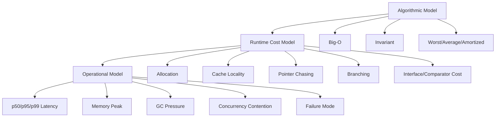
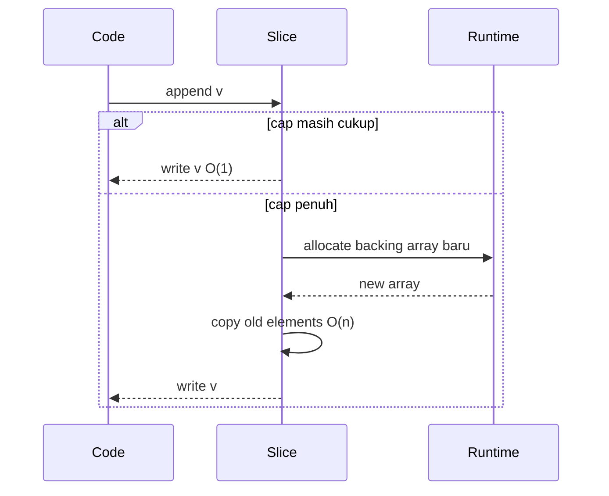

# learn-go-data-structure-algorithm-part-001.md

# Part 001 — Complexity Model yang Realistis di Go

> Seri: **learn-go-data-structure-algorithm**  
> Bagian: **001 / 034**  
> Topik: **Complexity model, cost model, constant factor, allocation, cache locality, latency tail, dan cara menilai algoritma secara realistis di Go**  
> Target pembaca: **Java software engineer yang ingin berpikir seperti engineer Go production-grade**  
> Versi Go target: **Go 1.26.x**

---

## 0. Tujuan Bagian Ini

Bagian ini membangun fondasi paling penting sebelum masuk ke struktur data spesifik seperti slice, map, heap, tree, graph, cache, rate limiter, dan index.

Banyak engineer memahami Big-O, tetapi tetap salah memilih struktur data di sistem nyata karena hanya melihat:

```text
O(1) lebih baik dari O(log n)
O(n log n) lebih buruk dari O(n)
map pasti lebih cepat dari slice
linked list bagus untuk insert/delete
recursion lebih elegan
```

Di production Go, cara berpikir itu terlalu dangkal.

Yang ingin kita bangun di bagian ini adalah **cost model realistis**:

```text
Real Cost = algorithmic complexity
          + constant factor
          + memory allocation
          + pointer chasing
          + cache locality
          + branch behavior
          + GC interaction
          + interface/generic/comparator overhead
          + data distribution
          + concurrency contention
          + operational tail latency
```

Big-O tetap penting, tetapi hanya sebagai **lapisan pertama**. Engineer senior menggunakan Big-O untuk mengeliminasi desain yang jelas buruk, lalu menggunakan model biaya runtime untuk memilih desain yang benar-benar cocok.

---

## 1. Kenapa Complexity Model Perlu Dibahas Ulang untuk Go?

Sebagai Java engineer, Anda mungkin terbiasa dengan struktur data siap pakai seperti:

- `ArrayList`
- `LinkedList`
- `HashMap`
- `TreeMap`
- `PriorityQueue`
- `ConcurrentHashMap`
- `CopyOnWriteArrayList`
- `EnumSet`
- `BitSet`

Di Go, standard library lebih minimalis. Banyak struktur data production-grade sering dibangun langsung dari primitive:

- `[]T`
- `map[K]V`
- `struct`
- pointer
- interface
- generic type
- `container/heap`
- `container/list`
- `container/ring`
- `sort`
- `slices`
- `maps`
- `cmp`

Akibatnya, engineer Go lebih sering harus memahami **biaya aktual dari representasi data**.

Contoh sederhana:

```go
type User struct {
    ID    int64
    Name  string
    Email string
}

users := []User{}
```

Secara algoritmik, scan `users` adalah `O(n)`. Tetapi biaya nyata dipengaruhi oleh:

- ukuran `User`,
- apakah data contiguous,
- apakah field string menyebabkan pointer dereference tambahan,
- apakah scan berhenti cepat,
- apakah branch predicate predictable,
- apakah slice backing array tertahan di memory,
- apakah data cukup kecil sehingga CPU cache lebih dominan daripada Big-O.

Bandingkan dengan:

```go
usersByID := map[int64]*User{}
```

Lookup map average `O(1)`, tetapi biaya nyata melibatkan:

- hashing key,
- bucket lookup,
- possible overflow bucket,
- pointer dereference ke `*User`,
- random memory access,
- GC scan terhadap pointer,
- memory overhead map.

Untuk `n` kecil, linear scan pada slice bisa lebih cepat daripada map lookup. Untuk `n` besar, map biasanya menang. Untuk workload read-heavy dengan stable sorted data, binary search pada sorted slice bisa lebih baik daripada map karena memory locality.

Jadi pertanyaan yang benar bukan:

```text
Apa Big-O-nya?
```

Melainkan:

```text
Dengan ukuran data, pola akses, distribusi input, batas latency, dan memory budget ini, struktur apa yang paling aman dan efisien?
```

---

## 2. Mental Model Tiga Lapisan: Theory, Runtime, Operation

Kita akan memakai tiga lapisan evaluasi.



### 2.1 Algorithmic Model

Ini menjawab:

- berapa jumlah operasi secara asimtotik,
- invariant apa yang dijaga,
- worst-case seperti apa,
- apakah biaya amortized,
- apakah input adversarial bisa merusak performa.

Contoh:

```text
Append ke dynamic array: amortized O(1)
Binary search: O(log n)
Hash map lookup: average O(1)
Heap push/pop: O(log n)
Sort comparison-based: O(n log n)
Graph BFS: O(V + E)
```

### 2.2 Runtime Cost Model

Ini menjawab:

- berapa alokasi heap,
- apakah data contiguous,
- apakah banyak pointer,
- apakah CPU sering cache miss,
- apakah closure/comparator/interface membuat overhead,
- apakah compiler bisa menghilangkan bounds check,
- apakah value copy besar.

Contoh:

```text
O(n) scan pada []int bisa sangat cepat karena contiguous.
O(1) map lookup bisa lebih mahal untuk n kecil karena hashing dan random access.
O(log n) binary search bisa lebih lambat dari linear scan pada n kecil karena branch misprediction.
```

### 2.3 Operational Model

Ini menjawab:

- apakah latency p99 stabil,
- apakah memory peak aman,
- apakah GC pressure naik,
- apakah struktur data bisa tumbuh tak terbatas,
- apakah terjadi contention,
- apakah failure mode jelas.

Contoh:

```text
Cache O(1) tetapi unbounded = operational bug.
Queue O(1) tetapi tanpa backpressure = memory leak.
Map O(1) tetapi global mutex = contention bottleneck.
Recursive DFS O(V+E) tetapi deep graph = stack risk.
```

---

## 3. Big-O: Masih Penting, Tetapi Tidak Cukup

Big-O mengukur pertumbuhan biaya ketika input `n` membesar.

Contoh:

| Operasi | Complexity |
|---|---:|
| akses array by index | O(1) |
| linear scan | O(n) |
| binary search | O(log n) |
| sorting comparison-based | O(n log n) |
| nested pair comparison | O(n²) |
| graph BFS | O(V + E) |

Big-O berguna untuk menghindari desain yang tidak scalable.

Misalnya, mencocokkan semua pair user:

```go
for i := range users {
    for j := range users {
        compare(users[i], users[j])
    }
}
```

Itu `O(n²)`. Untuk `n = 1_000`, masih 1 juta perbandingan. Untuk `n = 1_000_000`, menjadi 1 triliun perbandingan. Ini bukan masalah optimasi kecil; ini masalah desain algoritma.

Namun Big-O menghilangkan detail seperti:

- `O(n)` dengan satu operasi murah,
- `O(n)` dengan hash/JSON/regex mahal,
- `O(log n)` dengan pointer chasing,
- `O(1)` dengan lock contention,
- `O(1)` dengan allocation besar.

Maka Big-O harus dibaca sebagai:

```text
Shape of growth, not exact cost.
```

---

## 4. Constant Factor: Biaya yang Sering Mengalahkan Big-O

Dua algoritma bisa sama-sama `O(n)` tetapi berbeda 100x.

Contoh:

```go
func SumInts(xs []int64) int64 {
    var sum int64
    for _, x := range xs {
        sum += x
    }
    return sum
}
```

Ini murah:

- data contiguous,
- operasi integer sederhana,
- tidak ada allocation,
- branch sederhana,
- CPU prefetch efektif.

Bandingkan:

```go
func CountValid(records []string) int {
    var count int
    for _, s := range records {
        if expensiveValidateJSON(s) {
            count++
        }
    }
    return count
}
```

Sama-sama `O(n)`, tetapi setiap elemen mungkin melakukan:

- parse JSON,
- allocation,
- map/string processing,
- validation nested,
- error path.

Secara Big-O sama. Secara production cost sangat berbeda.

### 4.1 Contoh Constant Factor dalam Go

Beberapa constant factor penting di Go:

| Faktor | Dampak |
|---|---|
| allocation | heap pressure, GC work, latency |
| interface dispatch | dynamic call, boxing/escaping risk |
| closure comparator | call overhead, capture allocation risk |
| pointer chasing | cache miss |
| bounds check | extra check jika compiler tidak eliminate |
| value copy besar | memory bandwidth cost |
| string conversion | allocation jika `[]byte` ke `string` tertentu |
| map hashing | CPU cost per lookup |
| branch unpredictability | pipeline stalls |
| lock/unlock | synchronization cost |

### 4.2 Lesson

Jangan membandingkan algoritma hanya dari Big-O.

Bandingkan:

```text
jumlah operasi × biaya per operasi
```

Dalam Go, biaya per operasi sering sangat terlihat karena model runtime relatif eksplisit.

---

## 5. Amortized Complexity: Murah Rata-Rata, Mahal Sesekali

Amortized complexity berarti operasi rata-rata murah, tetapi ada operasi tertentu yang mahal.

Contoh paling penting: `append` ke slice.

```go
xs = append(xs, v)
```

Jika capacity masih cukup:

```text
O(1)
```

Jika capacity penuh:

```text
allocate backing array baru
copy elemen lama
append elemen baru
```

Biaya operasi itu menjadi `O(n)`.

Namun jika dilihat sepanjang banyak append, biayanya rata-rata `O(1)` amortized.



### 5.1 Kenapa Ini Penting untuk Production?

Karena operasi mahal sesekali bisa terlihat sebagai latency spike.

Misalnya, handler HTTP melakukan append ke slice besar dalam request path:

```go
func Handle(req Request) Response {
    results := []Item{}
    for _, row := range queryRows(req) {
        results = append(results, transform(row))
    }
    return Response{Items: results}
}
```

Jika jumlah item bisa diprediksi, lebih baik:

```go
rows := queryRows(req)
results := make([]Item, 0, len(rows))
for _, row := range rows {
    results = append(results, transform(row))
}
```

Ini mengurangi growth allocation.

### 5.2 Amortized Tidak Sama dengan Selalu Murah

Amortized `O(1)` berarti:

```text
murah secara rata-rata sepanjang sequence operasi
```

Bukan:

```text
setiap operasi pasti murah
```

Untuk batch job, amortized sering cukup. Untuk low-latency request path, spike tetap penting.

---

## 6. Worst-Case, Average-Case, dan Tail Behavior

Ada tiga pertanyaan berbeda:

```text
Average-case: biasanya seberapa cepat?
Worst-case: paling buruk bisa seberapa buruk?
Tail behavior: seberapa sering lambat di p95/p99?
```

### 6.1 Average-Case

Hash map lookup biasanya dianggap average `O(1)`.

Tetapi average-case bergantung pada:

- distribusi key,
- hash quality,
- load factor,
- collision,
- memory state,
- CPU cache behavior.

### 6.2 Worst-Case

Worst-case map lookup secara teori bisa buruk jika banyak collision. Dalam runtime modern, implementasi hash map berusaha membuat ini aman, tetapi sebagai engineer sistem, Anda tetap perlu sadar bahwa average `O(1)` bukan magic.

Worst-case juga muncul dari desain sendiri:

```go
func FindByEmail(users []User, email string) (User, bool) {
    for _, u := range users {
        if u.Email == email {
            return u, true
        }
    }
    return User{}, false
}
```

Linear scan:

- best-case: item pertama `O(1)`,
- average-case: sekitar `n/2`,
- worst-case: tidak ditemukan `O(n)`.

Jika operasi ini dipanggil 1000 kali dalam request, total bisa menjadi `O(q*n)`.

### 6.3 Tail Behavior

Di backend system, p99 sering lebih penting daripada average.

Contoh:

```text
p50 = 2 ms
p95 = 30 ms
p99 = 500 ms
```

Average bisa terlihat bagus, tetapi user tertentu tetap mengalami request lambat.

Tail bisa disebabkan oleh:

- resize map/slice,
- GC assist,
- lock contention,
- large allocation,
- branch/pathological input,
- cache miss burst,
- syscall/IO,
- thundering herd.

### 6.4 Production Rule

Untuk struktur data dalam request path:

```text
Jangan hanya tanya average complexity.
Tanya juga worst-case dan tail-trigger-nya.
```

---

## 7. Space Complexity: Lebih dari Sekadar O(n)

Space complexity menjawab berapa memory yang dibutuhkan.

Tetapi di Go, `O(n)` memory bisa sangat berbeda tergantung layout.

Bandingkan:

```go
type Small struct {
    A int64
    B int64
}

xs := []Small{}
```

Dengan:

```go
xs := []*Small{}
```

Keduanya `O(n)`, tetapi:

| Representasi | Karakteristik |
|---|---|
| `[]Small` | contiguous values, locality baik, copy lebih besar saat move |
| `[]*Small` | slice kecil berisi pointer, object tersebar, pointer chasing, GC scan lebih banyak |

### 7.1 Memory Overhead Tersembunyi

Struktur data sering punya overhead:

| Struktur | Overhead |
|---|---|
| slice | header + backing array + unused capacity |
| map | buckets + overflow + load slack + hash metadata |
| linked list | node object + prev/next pointer + allocation per node |
| heap | array + possible index metadata |
| tree | node object + child pointers + balancing metadata |
| cache | map + list/heap + TTL metadata |

### 7.2 Capacity sebagai Space Complexity Praktis

Slice punya `len` dan `cap`.

```go
xs := make([]byte, 10, 1_000_000)
```

Secara visible length hanya 10, tetapi backing array menahan 1 MB.

Ini penting saat membuat subslice:

```go
func FirstKB(buf []byte) []byte {
    return buf[:1024]
}
```

Jika `buf` berasal dari file 100 MB, return slice 1 KB tetap bisa menahan backing array 100 MB.

Solusi jika perlu detach:

```go
func FirstKBCopy(buf []byte) []byte {
    out := make([]byte, 1024)
    copy(out, buf[:1024])
    return out
}
```

Dalam Big-O, keduanya `O(1)` return view vs `O(k)` copy. Dalam operational model, copy kecil bisa menyelamatkan memory besar.

---

## 8. Allocation Cost: Biaya yang Sering Tidak Terlihat di Pseudocode

Pseudocode algoritma sering menulis:

```text
create node
append to list
return new array
```

Di Go, setiap allocation harus dicurigai:

- apakah heap allocation?
- apakah bisa stack allocation?
- apakah object mengandung pointer?
- apakah lifetime panjang?
- apakah menambah GC scan?
- apakah allocation terjadi di loop panas?

### 8.1 Allocation di Loop Panas

Contoh buruk:

```go
func NormalizeAll(inputs []string) []string {
    out := make([]string, 0)
    for _, s := range inputs {
        out = append(out, normalize(s))
    }
    return out
}
```

Lebih baik jika ukuran diketahui:

```go
func NormalizeAll(inputs []string) []string {
    out := make([]string, 0, len(inputs))
    for _, s := range inputs {
        out = append(out, normalize(s))
    }
    return out
}
```

### 8.2 Allocation karena Interface atau Escape

Contoh:

```go
func UseAny(v any) {
    // ...
}

func Process(x BigStruct) {
    UseAny(x)
}
```

Tergantung penggunaan, value bisa escape ke heap. Ini bukan berarti interface selalu buruk, tetapi dalam struktur data hot path, interface perlu diperhatikan.

### 8.3 Allocation karena Closure Capture

Comparator atau callback bisa menangkap variabel:

```go
threshold := 10
slices.SortFunc(items, func(a, b Item) int {
    if a.Score+threshold < b.Score+threshold {
        return -1
    }
    if a.Score+threshold > b.Score+threshold {
        return 1
    }
    return 0
})
```

Closure tidak otomatis buruk. Namun untuk hot path, benchmark dan escape analysis perlu dicek.

### 8.4 Production Rule

Untuk struktur data reusable:

```text
Allocation per operation harus jelas.
```

Dokumentasikan apakah operasi:

- zero allocation,
- amortized allocation,
- allocation per insert,
- allocation per lookup,
- allocation only during resize,
- allocation during iterator creation.

---

## 9. Cache Locality: Kenapa Slice Sering Mengalahkan Struktur yang “Lebih Pintar”

CPU jauh lebih cepat daripada memory. Ketika data contiguous, CPU bisa memuat cache line dan prefetch elemen berikutnya.

Slice memiliki locality yang baik:

```go
for i := range xs {
    sum += xs[i]
}
```

Linked list buruk untuk locality:

```go
for node != nil {
    sum += node.Value
    node = node.Next
}
```

Setiap node mungkin berada di lokasi memory berbeda. CPU harus menunggu memory load berkali-kali.

### 9.1 Linked List Myth

Secara teori:

| Operasi | Array/Slice | Linked List |
|---|---:|---:|
| insert tengah jika posisi diketahui | O(n) | O(1) |
| delete jika node diketahui | O(n) or O(1) depending handle | O(1) |
| index access | O(1) | O(n) |

Tetapi di production:

- mencari posisi pada linked list tetap `O(n)`,
- node allocation mahal,
- pointer chasing mahal,
- GC scan mahal,
- locality buruk.

Maka linked list hanya unggul jika Anda memang punya handle langsung ke node dan sering remove/move node, misalnya LRU cache dengan `map[key]*list.Element`.

### 9.2 Sorted Slice vs Tree

Untuk ordered data kecil-menengah:

- sorted slice + binary search bisa sangat cepat,
- tree punya `O(log n)` juga, tetapi pointer chasing dan allocation lebih besar,
- insertion pada sorted slice `O(n)`, tetapi jika read-heavy dan update jarang, ini bisa optimal.

Production decision:

```text
Read-heavy stable data: sorted slice often wins.
Write-heavy dynamic ordered data: tree/heap/index may win.
```

---

## 10. Branch Prediction: Complexity yang Tidak Kelihatan

CPU mencoba menebak branch.

Contoh predictable:

```go
for _, x := range xs {
    if x >= 0 {
        count++
    }
}
```

Jika hampir semua `x >= 0`, branch mudah ditebak.

Contoh unpredictable:

```go
for _, x := range xs {
    if randomCondition(x) {
        count++
    }
}
```

Jika hasilnya acak 50/50, CPU sering salah prediksi.

### 10.1 Binary Search dan Branch

Binary search `O(log n)`, tetapi setiap step memiliki branch:

```go
if xs[mid] < target {
    lo = mid + 1
} else {
    hi = mid
}
```

Untuk `n` kecil, linear scan bisa lebih cepat karena:

- branch lebih predictable,
- data contiguous,
- tidak ada random jump,
- loop sederhana.

Ini alasan kenapa banyak library menggunakan hybrid algorithm, misalnya threshold tertentu memakai linear/insertion sort untuk partition kecil.

### 10.2 Production Rule

Untuk data kecil:

```text
Simpler O(n) can beat clever O(log n).
```

Tetapi jangan jadikan ini alasan mempertahankan `O(n²)` pada data besar.

---

## 11. Bounds Check: Biaya Kecil yang Bisa Muncul di Hot Loop

Go melakukan bounds check untuk akses slice/array agar memory safe.

```go
x := xs[i]
```

Compiler sering bisa menghilangkan bounds check jika terbukti aman.

Contoh umum:

```go
for i := 0; i < len(xs); i++ {
    sum += xs[i]
}
```

Biasanya compiler bisa memahami batas loop.

Namun pola kompleks bisa membuat bounds check tetap ada.

### 11.1 Jangan Prematur Mengakali Bounds Check

Rule-nya:

1. Tulis kode jelas dulu.
2. Benchmark.
3. Profile.
4. Baru optimasi jika terbukti hot.

Mengakali bounds check dengan unsafe atau trik indeks tanpa bukti biasanya memperburuk maintainability.

---

## 12. Interface Dispatch, Generics, dan Comparator Cost

Go modern memiliki generics, tetapi struktur data tetap harus didesain hati-hati.

Ada beberapa pendekatan untuk struktur data reusable.

### 12.1 Comparable Constraint

Set berbasis map:

```go
type Set[T comparable] struct {
    m map[T]struct{}
}
```

Keuntungan:

- sederhana,
- type-safe,
- lookup map langsung,
- cocok untuk comparable key.

Keterbatasan:

- tidak bisa untuk slice/map/function,
- equality mengikuti aturan Go,
- tidak bisa custom comparator.

### 12.2 Comparator-Based Structure

Ordered structure:

```go
type LessFunc[T any] func(a, b T) bool

type Tree[T any] struct {
    less LessFunc[T]
    root *node[T]
}
```

Keuntungan:

- fleksibel,
- bisa custom ordering,
- bisa sort complex struct.

Biaya:

- function call comparator,
- risk comparator tidak konsisten,
- closure capture risk,
- strict weak ordering harus dijaga.

Package `slices` menyediakan fungsi seperti `SortFunc`, dengan kontrak comparator yang harus konsisten sebagai strict weak ordering. Ini penting karena comparator yang tidak valid dapat menghasilkan hasil sort yang salah atau tidak stabil secara semantik.

### 12.3 Interface-Based Structure

Mirip Java-style:

```go
type Less interface {
    Less(other any) bool
}
```

Ini biasanya kurang idiomatik untuk hot data structure karena:

- dynamic dispatch,
- type assertion,
- allocation/boxing risk,
- kehilangan static type safety.

Bukan berarti haram, tetapi untuk struktur data performan di Go, generics atau function comparator biasanya lebih baik.

### 12.4 Production Rule

Pilih API berdasarkan workload:

| Kebutuhan | Desain Umum |
|---|---|
| key comparable | `map[T]...`, `T comparable` |
| ordered primitive | `cmp.Ordered`, `cmp.Compare` |
| custom order | comparator function |
| polymorphic behavior luas | interface |
| hot path ekstrem | specialized implementation |

---

## 13. Data Distribution: Input Tidak Selalu Uniform

Banyak analisis algoritma mengasumsikan input random/uniform. Production jarang begitu.

Contoh distribusi:

- mostly sorted,
- reverse sorted,
- duplicate-heavy,
- Zipf/skewed,
- bursty,
- time-correlated,
- adversarial,
- small usually but occasionally huge.

### 13.1 Sorting

Sorting data yang hampir sorted bisa berbeda performanya dari data random.

### 13.2 Cache

Cache dengan distribusi Zipf bisa sangat efektif karena sebagian kecil key sangat sering diakses. Cache dengan distribusi uniform mungkin hit rate rendah.

### 13.3 Queue

Queue workload bursty bisa memerlukan backpressure walaupun average throughput cukup.

### 13.4 Map

Key distribution memengaruhi memory locality, collision behavior, dan cache effectiveness.

### 13.5 Production Rule

Benchmark harus memakai dataset yang merepresentasikan workload:

```text
uniform saja tidak cukup.
```

Minimal uji:

- small input,
- medium input,
- large input,
- duplicate-heavy,
- missing-key-heavy,
- skewed hot key,
- worst-case-ish,
- bursty update.

---

## 14. Complexity dalam Request Path vs Batch Path

Struktur data yang baik untuk batch belum tentu baik untuk request path.

### 14.1 Batch Path

Batch job biasanya lebih toleran terhadap:

- throughput-oriented design,
- amortized allocation,
- sequential scan besar,
- external sort,
- temporary memory besar dengan batas jelas.

### 14.2 Request Path

Request path lebih sensitif terhadap:

- p95/p99,
- allocation spike,
- lock contention,
- timeout,
- per-request memory,
- unbounded work.

### 14.3 Contoh

Sort `O(n log n)` dalam batch mungkin wajar.

Sort per request untuk setiap call mungkin buruk jika data bisa besar.

Lebih baik precompute:

```text
write/update path: maintain sorted index
read path: binary search / range scan
```

Trade-off:

- write lebih mahal,
- read lebih cepat,
- memory lebih besar,
- consistency perlu dijaga.

---

## 15. Complexity untuk Backend: p50, p95, p99, Memory Peak

Dalam backend, complexity harus diterjemahkan ke metrik operasional.

| Teori | Operasional |
|---|---|
| O(n) | latency naik linear dengan ukuran input |
| O(n²) | latency meledak saat input naik |
| O(1) average | bisa tetap p99 buruk jika ada contention/resize |
| O(log n) | stabil tetapi bisa punya pointer/cache overhead |
| O(n) space | memory peak tergantung object layout |
| amortized O(1) | spike saat resize/copy |

### 15.1 Complexity Budget

Sebelum memilih algoritma, tetapkan budget:

```text
N maksimum?
QPS?
latency target?
memory budget?
update frequency?
read/write ratio?
concurrency?
data retention?
failure behavior?
```

Contoh:

```text
N = 10,000 items per tenant
QPS = 500
p99 budget = 50 ms
memory budget = 2 GB
read/write = 100:1
```

Desain mungkin berbeda dari:

```text
N = 100,000,000 events
batch daily
memory budget = 8 GB
throughput target = 200 MB/s
```

---

## 16. Anti-Pattern: “O(1), Jadi Aman”

Banyak struktur `O(1)` tetap berbahaya.

### 16.1 Unbounded Map

```go
var cache = map[string]Value{}
```

Lookup `O(1)`, tetapi memory bisa tumbuh tanpa batas.

Masalahnya bukan complexity lookup, melainkan lifecycle.

Harus ada:

- max size,
- TTL,
- eviction,
- memory accounting,
- cleanup policy,
- observability.

### 16.2 Global Mutex Map

```go
var mu sync.Mutex
var m map[string]Value
```

Setiap lookup `O(1)`, tetapi semua goroutine antre di lock yang sama.

Masalahnya:

- contention,
- tail latency,
- convoy effect.

Solusi tergantung workload:

- read-write lock,
- sharded map,
- immutable snapshot,
- `sync.Map`,
- local cache,
- ownership by goroutine.

### 16.3 O(1) Allocation Per Request

```go
func Handle() {
    buf := make([]byte, 1024*1024)
    // ...
}
```

Secara Big-O `O(1)`, tetapi 1 MB per request jelas mahal.

---

## 17. Anti-Pattern: “O(n), Jadi Buruk”

`O(n)` tidak selalu buruk.

Contoh:

```go
func ContainsSmall(xs []int, target int) bool {
    for _, x := range xs {
        if x == target {
            return true
        }
    }
    return false
}
```

Untuk `n <= 8`, ini bisa lebih baik daripada map karena:

- tidak ada allocation,
- tidak ada hashing,
- data contiguous,
- branch sederhana,
- kode mudah.

### 17.1 Small-N Optimization

Banyak production design memakai strategi hybrid:

```text
n kecil  -> slice linear scan
n besar  -> map/index/tree
```

Contoh set kecil:

```go
type SmallSet[T comparable] struct {
    small []T
    large map[T]struct{}
}
```

Saat jumlah elemen kecil, pakai slice. Setelah melewati threshold, promote ke map.

Trade-off:

- implementasi lebih kompleks,
- threshold perlu benchmark,
- API harus tetap sederhana.

---

## 18. Complexity dan Mutability

Mutability mengubah cost model.

### 18.1 Immutable / Read-Only Data

Jika data dibangun sekali lalu dibaca banyak kali:

- sorted slice sangat menarik,
- binary search murah,
- no lock jika immutable,
- safe sharing,
- memory locality bagus.

Contoh:

```go
type Table struct {
    rows []Row // sorted by ID, immutable after build
}
```

Lookup:

```go
idx, ok := slices.BinarySearchFunc(t.rows, id, func(row Row, id int64) int {
    switch {
    case row.ID < id:
        return -1
    case row.ID > id:
        return 1
    default:
        return 0
    }
})
```

### 18.2 Mutable Data

Jika data sering berubah:

- sorted slice insert/delete mahal,
- map lebih baik untuk lookup/update,
- tree lebih baik untuk ordered dynamic data,
- heap lebih baik untuk min/max priority.

### 18.3 Copy-on-Write

Untuk read-heavy config/policy table:

```text
writer builds new immutable structure
atomic swap root pointer
readers use snapshot without lock
```

Complexity update lebih mahal, tetapi read sangat murah dan stabil.

---

## 19. Complexity dan Correctness: Invariant Adalah Biaya yang Harus Dibayar

Setiap struktur data punya invariant.

| Struktur | Invariant |
|---|---|
| sorted slice | elemen terurut |
| heap | parent priority <= child priority |
| BST | left < node < right |
| LRU cache | map dan list konsisten |
| graph DAG | tidak ada cycle |
| Bloom filter | bit set sesuai hash positions |
| DSU | parent forest valid |

Complexity yang dijanjikan hanya berlaku jika invariant benar.

Contoh binary search hanya valid jika slice sorted.

```go
idx, found := slices.BinarySearch(xs, target)
```

Jika `xs` tidak sorted, hasilnya meaningless.

### 19.1 Production Rule

Dokumentasikan invariant dalam struktur data:

```go
// invariant:
// - items is sorted ascending by ID.
// - IDs are unique.
// - items is immutable after construction.
type UserIndex struct {
    items []User
}
```

Lalu test invariant.

---

## 20. Complexity dan Failure Mode

Struktur data production-grade bukan hanya cepat. Ia harus punya failure mode yang jelas.

Pertanyaan:

- apa yang terjadi jika memory habis?
- apa yang terjadi jika input terlalu besar?
- apa yang terjadi jika key duplikat?
- apa yang terjadi jika comparator inconsistent?
- apa yang terjadi jika operasi concurrent?
- apa yang terjadi jika TTL expired saat lookup?
- apa yang terjadi jika queue penuh?

### 20.1 Bounded vs Unbounded

Unbounded structure mudah dibuat:

```go
queue = append(queue, item)
```

Production-grade queue biasanya perlu:

- capacity,
- backpressure,
- drop policy,
- retry policy,
- metrics,
- shutdown semantics.

### 20.2 Fail Fast vs Degrade

Untuk beberapa struktur:

- fail fast lebih baik daripada silent corruption,
- return error lebih baik daripada panic untuk input user,
- panic bisa diterima untuk programmer error seperti invariant internal rusak.

Contoh:

```go
func NewRing[T any](capacity int) (*Ring[T], error) {
    if capacity <= 0 {
        return nil, fmt.Errorf("capacity must be positive")
    }
    return &Ring[T]{buf: make([]T, capacity)}, nil
}
```

---

## 21. Complexity dan Concurrency: Big-O Tidak Melihat Contention

Dua struktur sama-sama `O(1)` bisa berbeda jauh ketika concurrent.

### 21.1 Single Lock Map

```go
type SafeMap[K comparable, V any] struct {
    mu sync.RWMutex
    m  map[K]V
}
```

Lookup `O(1)`, tetapi semua reader/writer melewati lock yang sama.

Untuk read-heavy, ini bisa cukup. Untuk hot-key/high-QPS, contention bisa dominan.

### 21.2 Sharded Map

```text
hash key -> shard -> shard-local map + lock
```

Mengurangi contention, tetapi menambah:

- hash routing,
- complexity implementation,
- aggregate operation lebih mahal,
- resizing per shard,
- testing lebih kompleks.

### 21.3 Immutable Snapshot

Untuk read-mostly:

```text
read: atomic load pointer, no lock
write: copy/build new structure, atomic publish
```

Read complexity sangat stabil. Write complexity lebih mahal.

### 21.4 Rule

Concurrency mengubah pertanyaan dari:

```text
Berapa complexity operasi ini?
```

menjadi:

```text
Berapa complexity operasi ini saat banyak goroutine melakukan operasi bersamaan?
```

---

## 22. Case Study 1: Lookup User by ID

Kita bandingkan beberapa desain.

### 22.1 Problem

```text
Input: collection User
Operation: find user by ID
Need: fast lookup, low memory, easy update
```

### 22.2 Option A — Linear Scan Slice

```go
func FindUser(users []User, id int64) (User, bool) {
    for _, u := range users {
        if u.ID == id {
            return u, true
        }
    }
    return User{}, false
}
```

Cost:

```text
Time: O(n)
Space: O(1) extra
Allocation: none
Locality: good
Update: simple
Best for: small n, infrequent lookup, contiguous batch processing
```

### 22.3 Option B — Map Index

```go
type UserIndex struct {
    byID map[int64]User
}

func (idx *UserIndex) Find(id int64) (User, bool) {
    u, ok := idx.byID[id]
    return u, ok
}
```

Cost:

```text
Time: average O(1)
Space: O(n) extra
Allocation: map buckets
Locality: moderate/poor compared to slice
Update: good
Best for: frequent lookup, larger n
```

### 22.4 Option C — Sorted Slice + Binary Search

```go
type SortedUsers struct {
    users []User // sorted by ID
}

func (s SortedUsers) Find(id int64) (User, bool) {
    i, ok := slices.BinarySearchFunc(s.users, id, func(u User, id int64) int {
        switch {
        case u.ID < id:
            return -1
        case u.ID > id:
            return 1
        default:
            return 0
        }
    })
    if !ok {
        return User{}, false
    }
    return s.users[i], true
}
```

Cost:

```text
Time: O(log n)
Space: O(1) extra if already sorted
Allocation: none during lookup
Locality: good
Update: expensive insert/delete O(n)
Best for: read-heavy immutable/semi-static data
```

### 22.5 Decision Matrix

| Workload | Best Candidate |
|---|---|
| `n <= 16`, few lookups | slice scan |
| large `n`, frequent random lookup | map |
| read-heavy, mostly immutable, ordered lookup | sorted slice |
| ordered range query with frequent updates | tree/B-tree |

### 22.6 Lesson

Tidak ada struktur terbaik secara universal.

Yang ada:

```text
best under constraints
```

---

## 23. Case Study 2: Deduplicate Event IDs

### 23.1 Problem

```text
Given stream of event IDs, process each ID only once.
```

### 23.2 Naive Slice

```go
seen := []string{}
for _, id := range ids {
    if !contains(seen, id) {
        seen = append(seen, id)
        process(id)
    }
}
```

`contains` linear. Total worst-case `O(n²)`.

This fails quickly at scale.

### 23.3 Map Set

```go
seen := make(map[string]struct{}, len(ids))
for _, id := range ids {
    if _, ok := seen[id]; ok {
        continue
    }
    seen[id] = struct{}{}
    process(id)
}
```

Cost:

```text
Time: average O(n)
Space: O(n)
```

### 23.4 Production Problem

If stream is unbounded, map grows forever.

Need lifecycle:

- TTL,
- max size,
- windowed dedup,
- persistent idempotency store,
- probabilistic filter,
- partition by tenant/time.

### 23.5 Windowed Dedup

```text
dedup key valid for 24 hours
```

Data structure could be:

```text
map[id]expiry + min-heap by expiry
```

Lookup average `O(1)`, insert `O(log n)` due to heap, cleanup `O(k log n)`.

This is operationally safer than unbounded `O(1)` map.

---

## 24. Case Study 3: Top-K Items

### 24.1 Problem

```text
Given n items, find top k by score.
```

### 24.2 Full Sort

```go
slices.SortFunc(items, func(a, b Item) int {
    return cmp.Compare(b.Score, a.Score)
})
top := items[:k]
```

Cost:

```text
O(n log n)
```

Simple and often good enough.

### 24.3 Min-Heap Size K

Maintain heap of size `k`:

```text
for each item:
    if heap size < k: push
    else if item score > heap min: replace min
```

Cost:

```text
O(n log k)
```

If `k << n`, heap wins.

### 24.4 Quickselect

Average:

```text
O(n)
```

But more complex, mutates array, worst-case needs care.

### 24.5 Decision

| Condition | Approach |
|---|---|
| simplicity, n moderate | full sort |
| k small, n large, streaming | heap |
| batch, need fastest average, can mutate | quickselect |
| need stable ordered top-k | heap + final sort or full sort |

---

## 25. Complexity Smell Catalog

Gunakan daftar ini saat review kode.

### 25.1 Nested Loop Over Growing Data

```go
for _, a := range as {
    for _, b := range bs {
        // match
    }
}
```

Jika tujuannya join by key, gunakan map index.

### 25.2 Sort Inside Loop

```go
for _, req := range requests {
    slices.Sort(items)
    handle(req, items)
}
```

Pre-sort sekali jika data sama.

### 25.3 Repeated Linear Lookup

```go
for _, id := range ids {
    u, ok := findUser(users, id)
}
```

Total `O(len(ids) * len(users))`. Bangun index.

### 25.4 Append Without Capacity in Known-Size Loop

```go
out := []T{}
for _, x := range xs {
    out = append(out, f(x))
}
```

Jika output maksimum diketahui, preallocate.

### 25.5 Delete from Front of Slice Repeatedly

```go
for len(q) > 0 {
    x := q[0]
    q = q[1:]
    use(x)
}
```

Bisa menahan backing array dan tidak clear reference. Untuk queue panjang, gunakan head index atau ring buffer.

### 25.6 Map as Cache Without Bound

```go
cache[key] = value
```

Tanpa TTL/eviction/limit, ini memory leak berbentuk fitur.

### 25.7 Comparator Complex or Inconsistent

```go
slices.SortFunc(items, func(a, b Item) int {
    if time.Now().UnixNano()%2 == 0 {
        return -1
    }
    return 1
})
```

Comparator harus deterministic dan konsisten.

### 25.8 Recursive Traversal Without Depth Limit

Tree/graph dari input eksternal bisa sangat dalam.

Gunakan iterative approach atau depth guard jika perlu.

---

## 26. How to Estimate Before Benchmarking

Sebelum benchmark, buat estimasi kasar.

### 26.1 Step 1 — Ukuran Data

```text
n = berapa?
per request atau global?
per tenant atau semua tenant?
peak berapa?
```

### 26.2 Step 2 — Operasi Dominan

```text
lookup?
insert?
delete?
range scan?
sort?
merge?
iterate all?
```

### 26.3 Step 3 — Frequency

```text
berapa kali per request?
berapa QPS?
berapa batch size?
```

### 26.4 Step 4 — Complexity

```text
total work = frequency × complexity × unit cost
```

### 26.5 Step 5 — Allocation

```text
allocation per op?
allocation per request?
peak memory?
```

### 26.6 Step 6 — Tail Trigger

```text
resize?
GC?
lock?
rare huge input?
slow comparator?
```

### 26.7 Example

```text
n users = 50,000
ids per request = 100
lookup by linear scan = 100 × 50,000 = 5,000,000 comparisons/request
QPS = 100
= 500,000,000 comparisons/sec
```

This is likely bad.

Build map index:

```text
100 map lookups/request × 100 QPS = 10,000 lookups/sec
```

Much better, if memory acceptable.

---

## 27. Benchmarking: Kapan Harus Dilakukan?

Benchmark tidak menggantikan reasoning. Benchmark memvalidasi reasoning.

Lakukan benchmark ketika:

- struktur ada di hot path,
- pilihan desain tidak jelas,
- constant factor penting,
- ukuran data cukup besar,
- latency target ketat,
- ada trade-off memory vs CPU,
- ada perubahan implementasi.

Jangan benchmark untuk membenarkan desain yang jelas salah secara complexity.

Misalnya `O(n²)` untuk 1 juta input tidak perlu dibenchmark dulu untuk tahu itu buruk.

### 27.1 Benchmark Minimal

```go
func BenchmarkFindLinear(b *testing.B) {
    users := makeUsers(1000)
    target := users[len(users)-1].ID

    b.ReportAllocs()
    b.ResetTimer()

    for i := 0; i < b.N; i++ {
        _, _ = FindUser(users, target)
    }
}
```

### 27.2 Benchmark Beberapa N

```go
func BenchmarkFindLinearSizes(b *testing.B) {
    for _, n := range []int{4, 8, 16, 32, 64, 128, 1024, 65536} {
        b.Run(fmt.Sprintf("n=%d", n), func(b *testing.B) {
            users := makeUsers(n)
            target := users[n-1].ID
            b.ReportAllocs()
            b.ResetTimer()
            for i := 0; i < b.N; i++ {
                _, _ = FindUser(users, target)
            }
        })
    }
}
```

Benchmark size sweep penting karena threshold sering berubah.

### 27.3 Jangan Lupa Sink

Compiler bisa mengoptimasi hasil yang tidak dipakai.

Gunakan package-level sink jika perlu:

```go
var sinkUser User
var sinkBool bool

func BenchmarkFindLinear(b *testing.B) {
    users := makeUsers(1000)
    target := users[len(users)-1].ID
    b.ReportAllocs()
    b.ResetTimer()
    for i := 0; i < b.N; i++ {
        sinkUser, sinkBool = FindUser(users, target)
    }
}
```

---

## 28. Complexity Review Template

Saat review PR yang menambah struktur data atau algoritma, gunakan template ini.

```text
1. Apa operasi utama?
   - lookup
   - insert
   - delete
   - scan
   - range query
   - top-k
   - merge

2. Berapa complexity setiap operasi?
   - best
   - average
   - worst
   - amortized

3. Apa invariant struktur ini?

4. Apa ukuran data maksimum?
   - normal
   - peak
   - adversarial

5. Apa allocation behavior?
   - per operation
   - per resize
   - per iterator

6. Apa memory overhead?
   - per item
   - extra index
   - unused capacity

7. Bagaimana data distribution?
   - uniform
   - skewed
   - duplicate-heavy
   - sorted
   - bursty

8. Apakah operasi ada di request path?

9. Apa p95/p99 risk?

10. Apakah concurrent?
    - data race?
    - logical race?
    - contention?

11. Bagaimana lifecycle?
    - bounded?
    - TTL?
    - cleanup?
    - clear/reset?

12. Bagaimana correctness dibuktikan?
    - unit test
    - invariant test
    - fuzz test
    - differential test

13. Bagaimana benchmark dilakukan?
    - realistic data
    - multiple sizes
    - allocation report
    - CPU/memory profile if needed
```

---

## 29. Decision Framework: Dari Problem ke Struktur Data

```mermaid
flowchart TD
    A[Mulai dari operasi dominan] --> B{Butuh lookup by exact key?}
    B -- Ya --> C{Key comparable?}
    C -- Ya --> D[map[K]V / set]
    C -- Tidak --> E[custom hash/equality atau canonical key]

    B -- Tidak --> F{Butuh ordered/range query?}
    F -- Ya --> G{Data sering berubah?}
    G -- Tidak --> H[sorted slice + binary search]
    G -- Ya --> I[tree / B-tree / skiplist]

    F -- Tidak --> J{Butuh min/max priority?}
    J -- Ya --> K[heap / priority queue]

    J -- Tidak --> L{Butuh prefix lookup?}
    L -- Ya --> M[trie / radix tree]

    L -- Tidak --> N{Butuh connectivity?}
    N -- Ya --> O[graph / DSU]

    N -- Tidak --> P{Butuh approximate answer?}
    P -- Ya --> Q[Bloom / HLL / sketch]
    P -- Tidak --> R[slice / custom structure]
```

---

## 30. Go-Specific Complexity Heuristics

Ini heuristic awal. Bukan hukum mutlak.

### 30.1 Untuk Data Kecil

Gunakan slice dulu.

```text
n kecil + operasi sederhana + no mutation complexity = slice
```

### 30.2 Untuk Exact Lookup Besar

Gunakan map.

```text
frequent exact lookup + key comparable = map
```

### 30.3 Untuk Ordered Read-Heavy Data

Gunakan sorted slice.

```text
read-heavy + mostly immutable + ordered lookup = sorted slice
```

### 30.4 Untuk Priority

Gunakan heap.

```text
need repeated min/max = heap
```

### 30.5 Untuk Queue Bounded

Gunakan ring buffer.

```text
high-throughput bounded FIFO = ring buffer
```

### 30.6 Untuk Cache

Jangan hanya map.

```text
cache = map + policy + bound + expiration + metrics
```

### 30.7 Untuk Concurrent Read-Mostly

Pertimbangkan immutable snapshot.

```text
many readers + rare writer = copy-on-write snapshot
```

### 30.8 Untuk Dynamic Ordered Large Data

Gunakan tree/B-tree/skiplist sesuai kebutuhan.

```text
range query + frequent update = ordered index
```

---

## 31. Worked Example: Permission Resolution

Sebagai engineer regulatory/case-management system, contoh ini relevan.

### 31.1 Problem

User punya permission dari banyak sumber:

- role,
- group,
- direct grant,
- delegation,
- organization unit,
- case assignment,
- module-specific override.

Kita perlu menjawab:

```text
Does subject S have action A on resource R?
```

### 31.2 Naive Approach

Setiap request scan semua grant:

```go
func Allowed(grants []Grant, subject Subject, action Action, resource Resource) bool {
    for _, g := range grants {
        if matches(g, subject, action, resource) {
            return true
        }
    }
    return false
}
```

Complexity:

```text
O(number_of_grants) per authorization check
```

Jika satu request melakukan 50 authorization checks dan grants 100,000:

```text
5,000,000 grant checks per request
```

Bad.

### 31.3 Indexed Approach

Bangun index:

```text
subject -> action -> resource-pattern -> decision
```

Atau:

```text
subject -> permission set
```

Exact permission bisa map/set.

Hierarchical resource butuh tree/trie/prefix index.

Delegation graph butuh graph traversal atau precomputed closure.

### 31.4 Complexity Trade-off

| Strategy | Read Cost | Write Cost | Memory | Risk |
|---|---:|---:|---:|---|
| scan grants | O(g) | low | low | slow read |
| precomputed set | O(1) average | high | high | invalidation |
| sorted permission list | O(log n) | medium/high | medium | update cost |
| graph traversal per check | O(V+E) | low | medium | tail latency |
| transitive closure | O(1)/O(log n) | high | high | stale/complex |

### 31.5 Production Insight

Authorization sering read-heavy. Maka desain umum:

```text
write/update path builds normalized/indexed permission snapshot
read path performs bounded lookup
```

Ini mengubah complexity dari:

```text
per request expensive traversal
```

menjadi:

```text
expensive recomputation at change time
cheap lookup at request time
```

Itu contoh nyata bagaimana complexity dipindahkan ke path yang lebih aman.

---

## 32. Worked Example: Workflow State Graph

### 32.1 Problem

Sistem case management punya lifecycle:

```text
Draft -> Submitted -> Screening -> Investigation -> Enforcement -> Closed
```

Dengan escalation, appeal, withdrawal, reassignment, reopening.

Kita perlu validasi:

- transition valid,
- no illegal cycle,
- reachable states,
- terminal states,
- role-permitted actions,
- SLA trigger path.

### 32.2 Naive Approach

Hardcode if/else:

```go
func CanTransition(from, to State) bool {
    if from == Draft && to == Submitted {
        return true
    }
    if from == Submitted && to == Screening {
        return true
    }
    // ...
    return false
}
```

Untuk kecil, ini baik. Untuk lifecycle kompleks, sulit dianalisis.

### 32.3 Graph Approach

```go
type State string

type Transition struct {
    From State
    To   State
    Name string
}

type Workflow struct {
    edges map[State][]Transition
}
```

Transition check bisa:

```text
O(out_degree(from))
```

Jika butuh exact lookup:

```text
map[from,to]transition
```

### 32.4 Analysis Operations

- validate cycle: DFS `O(V+E)`
- reachable states: BFS/DFS `O(V+E)`
- terminal states: scan nodes/edges
- topological order if DAG: `O(V+E)`
- impact of state removal: graph traversal

### 32.5 Production Insight

Untuk runtime transition check, gunakan index yang bounded.

Untuk design-time validation, gunakan graph algorithm.

Jangan paksa satu struktur untuk semua operasi.

```text
runtime index != analysis graph
```

---

## 33. Complexity Documentation Pattern

Setiap struktur data yang kita buat di seri ini sebaiknya memiliki blok dokumentasi seperti ini:

```go
// UserIndex provides lookup by user ID over an immutable sorted slice.
//
// Invariants:
//   - users is sorted ascending by ID.
//   - IDs are unique.
//   - users is not mutated after construction.
//
// Complexity:
//   - Build: O(n log n) due to sorting.
//   - Find: O(log n).
//   - Iterate: O(n).
//   - Extra space: O(n) if input copied, O(1) if ownership transferred.
//
// Allocation:
//   - Build may allocate if copying input.
//   - Find allocates zero memory.
//
// Concurrency:
//   - Safe for concurrent readers after construction.
//   - Not safe to mutate underlying slice.
//
// Failure modes:
//   - Duplicate IDs are rejected at construction.
//   - Invalid unsorted input cannot exist through public constructor.
type UserIndex struct {
    users []User
}
```

Ini terlihat verbose, tetapi untuk reusable internal library, dokumentasi seperti ini sangat membantu.

---

## 34. Mini Exercise

### Exercise 1 — Small Set

Desain `SmallSet[T comparable]` dengan strategi:

```text
n <= 8: slice scan
n > 8: map
```

Pertanyaan:

- kapan promote ke map?
- apakah pernah demote lagi?
- bagaimana `Delete`?
- apakah iteration order stabil?
- apakah zero value usable?
- bagaimana complexity `Add`, `Contains`, `Delete`?

### Exercise 2 — Bounded Dedup

Desain dedup event ID selama 10 menit.

Pertanyaan:

- apakah cukup `map[string]time.Time`?
- bagaimana cleanup?
- apakah cleanup dilakukan saat insert, lookup, atau background?
- apa yang terjadi jika event rate melonjak?
- bagaimana memory bound?

### Exercise 3 — Workflow Graph

Desain struktur data untuk menjawab:

```text
CanTransition(from, to)
ListAvailableTransitions(from)
ValidateNoCycle()
FindReachableStates(from)
```

Pertanyaan:

- apakah satu map cukup?
- apakah butuh adjacency list?
- apakah butuh reverse edges?
- complexity tiap operasi?
- invariant apa yang perlu dijaga?

---

## 35. Ringkasan Bagian Ini

Key takeaways:

1. Big-O penting, tetapi hanya lapisan pertama.
2. Go menuntut engineer memahami allocation, locality, pointer, map/slice behavior, dan API cost.
3. `O(1)` tidak otomatis aman; unbounded memory dan contention bisa menghancurkan production system.
4. `O(n)` tidak otomatis buruk; untuk data kecil dan contiguous, slice scan sering optimal.
5. Amortized complexity bisa memunculkan latency spike.
6. Worst-case dan p99 harus dipikirkan, bukan hanya average.
7. Space complexity harus mencakup overhead, retained capacity, pointer graph, dan GC scan.
8. Data distribution sangat memengaruhi performa nyata.
9. Struktur data production-grade harus mendokumentasikan invariant, complexity, allocation behavior, concurrency assumption, dan failure mode.
10. Pilihan struktur data adalah keputusan engineering berbasis constraint, bukan hafalan.

---

## 36. Checklist Cepat

Sebelum memilih struktur data, jawab:

```text
Apa operasi dominan?
Berapa n normal dan n maksimum?
Apakah lookup exact, ordered, prefix, priority, range, atau graph?
Apakah data mutable atau immutable?
Read/write ratio berapa?
Apakah operasi di request path atau batch path?
Apakah perlu bound memory?
Apakah concurrent?
Apa invariant?
Apa worst-case?
Apa tail-latency trigger?
Apa allocation per operation?
Bagaimana menguji correctness?
Bagaimana benchmark-nya?
```

---

## 37. Referensi Resmi dan Lanjutan

Referensi resmi yang relevan untuk bagian ini:

- Go 1.26 Release Notes — compiler/runtime/library changes untuk Go 1.26.x.
- Go Release History — status release dan patch Go.
- Go Language Specification — semantics dasar array, slice, map, function, interface, generics.
- Package `slices` — operasi generic pada slice, termasuk sort/search helper.
- Package `maps` — helper generic untuk map.
- Package `cmp` — comparison helpers dan ordered constraint.
- Package `sort` — sorting/searching klasik.
- Package `container/heap` — heap interface untuk priority queue.
- Package `testing` — benchmark dan fuzzing support.

---

## 38. Penutup

Bagian ini sengaja belum masuk dalam implementasi struktur data besar. Tujuannya adalah membangun cara berpikir.

Mulai bagian berikutnya, kita akan masuk ke primitive paling penting dalam Go data structure engineering:

```text
Arrays, Slices, dan Sequence Design
```

Di sana kita akan membongkar slice bukan hanya sebagai “dynamic array”, tetapi sebagai struktur data utama yang memengaruhi hampir semua desain algoritma Go.

---

# Status Seri

Seri **belum selesai**.

Progress:

```text
[selesai] Part 000 — Roadmap, Mental Model, dan Batasan Seri
[selesai] Part 001 — Complexity Model yang Realistis di Go
[berikutnya] Part 002 — Arrays, Slices, dan Sequence Design
```


<!-- NAVIGATION_FOOTER -->
<div class="page-nav">
<a href="./learn-go-data-structure-algorithm-part-000.md">⬅️ Part 000 — Roadmap, Mental Model, dan Batasan Seri</a>
<a href="./index.md">📚 Kategori</a>
<a href="../../index.md">🏠 Home</a>
<a href="./learn-go-data-structure-algorithm-part-002.md">Part 002 — Arrays, Slices, dan Sequence Design ➡️</a>
</div>
