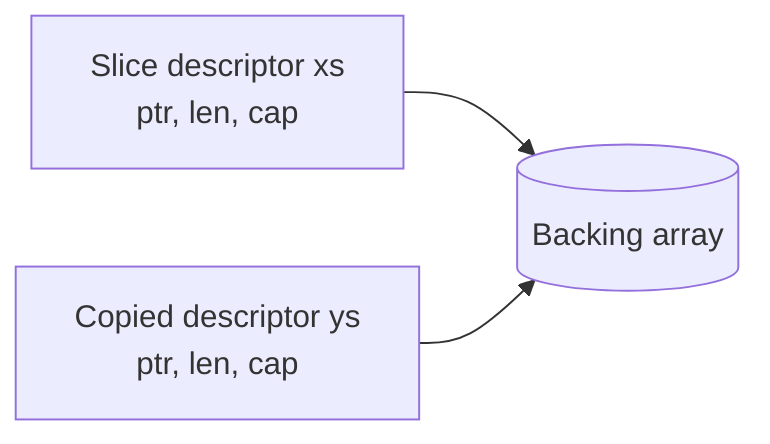
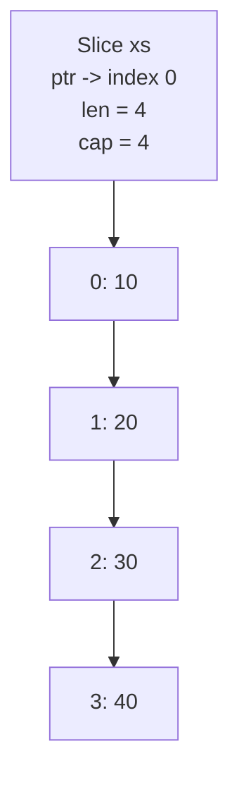
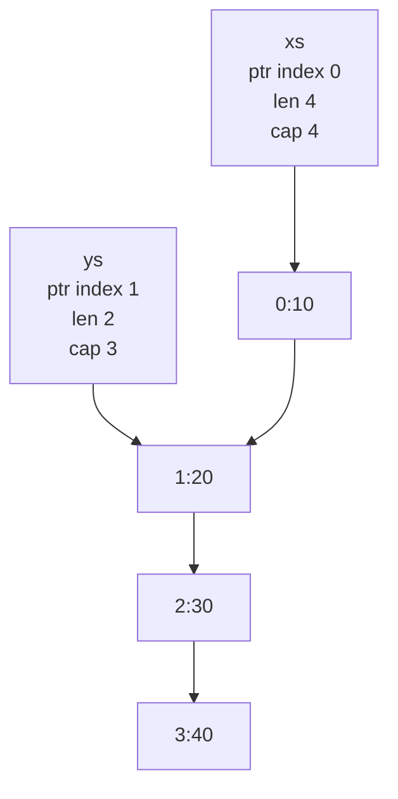
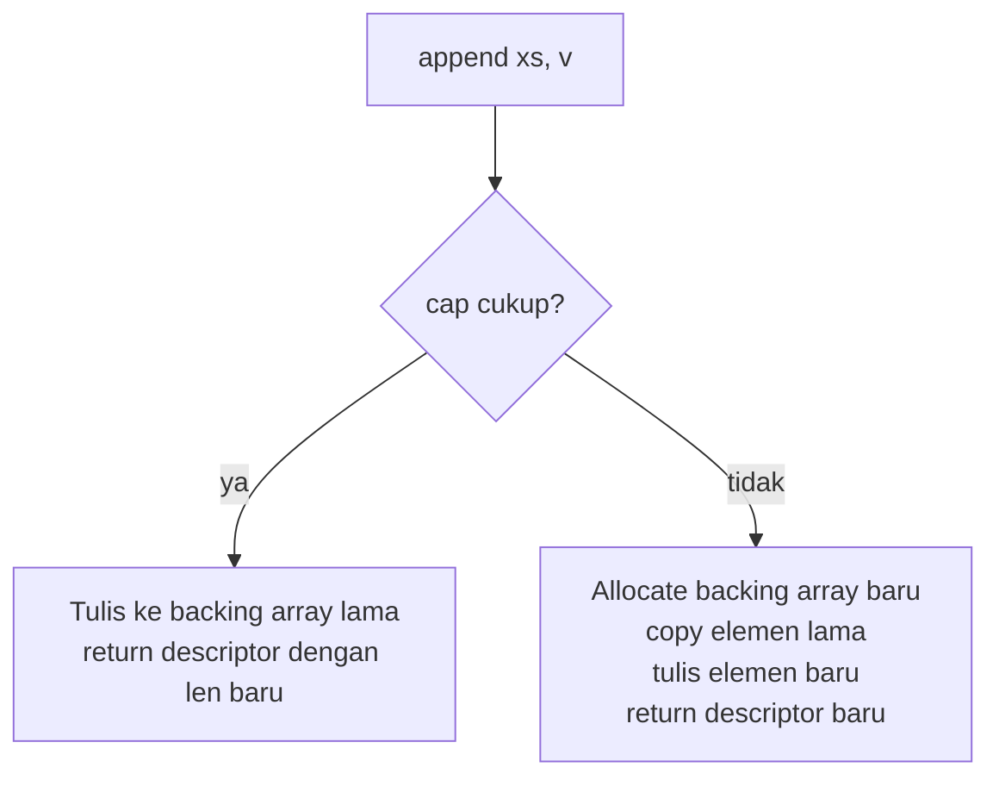
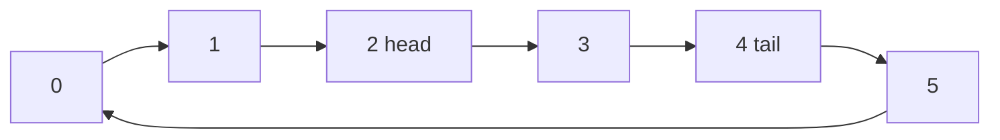

# learn-go-data-structure-algorithm-part-002.md

# Part 002 — Arrays, Slices, dan Sequence Design

> Seri: `learn-go-data-structure-algorithm`  
> Bagian: `002 / 034`  
> Fokus: array, slice, sequence abstraction, operation cost, aliasing, memory retention, dan desain struktur linear production-grade di Go 1.26.x.  
> Target pembaca: Java software engineer yang ingin berpikir seperti engineer top-tier saat memilih, mendesain, dan menguji struktur data berbasis urutan di Go.

---

## 0. Ringkasan Eksekutif

Di Go, struktur data linear paling penting bukan `LinkedList`, bukan `ArrayList`, bukan juga class hierarchy collection seperti di Java. Primitive paling penting adalah:

1. **array**: blok elemen fixed-size, length bagian dari tipe.
2. **slice**: view dinamis atas backing array.
3. **string**: immutable byte sequence, dibahas lebih dalam di part text algorithms.
4. **custom sequence**: struktur yang kita bangun di atas slice, ring buffer, heap, queue, deque, atau compact array layout.

Mental model utama:

```text
slice != array
slice = descriptor kecil yang menunjuk ke backing array
```

Slice terlihat sederhana, tetapi banyak bug production Go berasal dari salah memahami:

- append dapat memakai backing array lama atau membuat backing array baru;
- reslicing dapat mempertahankan memory besar secara tidak sengaja;
- dua slice dapat saling alias;
- delete/compact pada slice of pointer dapat menahan object lama tetap reachable jika tail tidak di-clear;
- kapasitas yang terlalu besar dapat mengubah behaviour append di caller/callee;
- API yang menerima atau mengembalikan slice harus mendefinisikan ownership secara eksplisit.

Part ini membangun fondasi sequence design: bagaimana memilih array/slice/ring buffer, bagaimana menulis operasi insert/delete/filter/compact dengan benar, bagaimana menghindari retained memory, dan bagaimana mendesain API sequence yang aman untuk production.

---

## 1. Posisi Materi Ini dalam Seri

Kita sudah punya Part 001 tentang complexity model realistis. Part ini menerapkannya pada struktur data linear.

DSA klasik sering mengajarkan:

```text
array access O(1)
append amortized O(1)
insert middle O(n)
delete middle O(n)
```

Itu benar sebagai model awal. Tetapi di Go production, pertanyaan yang lebih penting adalah:

```text
Apakah operasi ini meng-copy elemen besar?
Apakah append memicu allocation?
Apakah slice ini retain backing array besar?
Apakah elemen lama masih discan GC?
Apakah caller bisa melihat mutasi internal?
Apakah data structure ini punya invariant ownership yang jelas?
```

Dengan kata lain, Part 002 bukan hanya “cara pakai slice”, tetapi “cara menggunakan slice sebagai bahan baku struktur data yang benar, predictable, dan maintainable”.

---

## 2. Perbedaan Besar dari Java

Sebagai Java engineer, mudah menganggap slice sebagai `ArrayList<T>`. Itu analogi yang berguna di awal, tetapi berbahaya jika dibawa terlalu jauh.

### 2.1 Java `ArrayList` vs Go Slice

| Aspek | Java `ArrayList<E>` | Go `[]T` |
|---|---|---|
| Bentuk | object dengan field internal | descriptor value kecil |
| Mutasi length | method pada object | operasi menghasilkan slice value baru |
| Capacity | internal, tidak terlihat langsung kecuali lewat reflection/internal | `cap(s)` tersedia |
| Ownership | object identity jelas | beberapa slice bisa share backing array |
| Append/add | `list.add(x)` mutate object | `s = append(s, x)` harus assign balik |
| Passing to function | reference ke object | slice descriptor di-copy |
| Aliasing | object aliasing | descriptor aliasing + backing-array aliasing |
| Bounds | runtime check | runtime check |
| Generics | erased generics | monomorphization/implementation detail tidak perlu diasumsikan, tetapi tipe lebih langsung |

Contoh paling penting:

```go
func addBad(xs []int, v int) {
    xs = append(xs, v)
}

func addGood(xs []int, v int) []int {
    return append(xs, v)
}
```

`addBad` bisa menulis ke backing array lama, tetapi caller tidak menerima length baru. Ini berbeda dari `ArrayList.add` yang mutate object yang sama.

### 2.2 Slice adalah Value, Backing Array adalah Storage

Saat slice dikirim ke function, descriptor-nya di-copy. Descriptor itu berisi konsep:

```text
pointer to backing array
length
capacity
```

Diagram:



Jika function mengubah elemen `xs[0]`, caller melihat perubahan karena backing array sama. Jika function melakukan `xs = append(xs, v)`, caller belum tentu melihat length baru karena descriptor caller tidak berubah.

---

## 3. Array di Go

Array adalah sequence fixed-size. Length adalah bagian dari tipe.

```go
var a [3]int
var b [4]int

// a dan b berbeda tipe: [3]int != [4]int
_ = a
_ = b
```

### 3.1 Kapan Array Dipakai?

Array jarang dipakai sebagai struktur utama untuk data dinamis, tetapi sangat berguna untuk:

1. fixed-size key;
2. small tuple;
3. hash/fingerprint;
4. buffer internal fixed-size;
5. lookup table kecil;
6. stack allocation-friendly data;
7. map key karena array comparable jika elemennya comparable.

Contoh map key:

```go
type PairKey [2]uint64

m := map[PairKey]string{
    {10, 20}: "edge-10-20",
}

fmt.Println(m[PairKey{10, 20}])
```

Untuk composite key yang fixed-size, array sering lebih baik daripada string concatenation karena tidak perlu encoding string manual.

### 3.2 Array Copy Semantics

Array di Go adalah value. Assignment meng-copy seluruh array.

```go
a := [3]int{1, 2, 3}
b := a
b[0] = 99

fmt.Println(a) // [1 2 3]
fmt.Println(b) // [99 2 3]
```

Untuk array besar, copy bisa mahal. Maka function biasanya menerima pointer ke array atau slice.

```go
func sumArrayPtr(a *[1024]int) int {
    total := 0
    for _, v := range a {
        total += v
    }
    return total
}

func sumSlice(xs []int) int {
    total := 0
    for _, v := range xs {
        total += v
    }
    return total
}
```

### 3.3 Array sebagai Backing Storage

Slice dapat dibuat dari array:

```go
a := [5]int{10, 20, 30, 40, 50}
s := a[1:4] // []int{20, 30, 40}

s[0] = 99
fmt.Println(a) // [10 99 30 40 50]
```

Ini menunjukkan bahwa slice bukan copy elemen. Slice adalah view.

---

## 4. Slice: Struktur Data Paling Fundamental di Go

Slice adalah descriptor yang menunjuk ke bagian dari backing array.

```go
xs := []int{10, 20, 30, 40}
```

Secara mental:



Untuk reslice:

```go
ys := xs[1:3] // [20 30]
```

Mental model:



`ys` memiliki length 2, tetapi capacity dari index 1 sampai akhir backing array adalah 3.

---

## 5. Length vs Capacity

`len(s)` adalah jumlah elemen yang terlihat.  
`cap(s)` adalah jumlah elemen dari pointer slice sampai akhir backing array.

```go
xs := []int{10, 20, 30, 40, 50}
ys := xs[1:3]

fmt.Println(len(ys)) // 2
fmt.Println(cap(ys)) // 4
```

Karena `ys` mulai dari index 1, capacity-nya mencakup index 1,2,3,4.

### 5.1 Full Slice Expression

Go punya full slice expression:

```go
ys := xs[1:3:3]
```

Format:

```go
s[low:high:max]
```

Length:

```text
high - low
```

Capacity:

```text
max - low
```

Contoh:

```go
xs := []int{10, 20, 30, 40, 50}
ys := xs[1:3:3]

fmt.Println(ys)      // [20 30]
fmt.Println(len(ys)) // 2
fmt.Println(cap(ys)) // 2
```

Ini penting untuk membatasi append agar tidak menimpa elemen di belakang view.

---

## 6. Append Semantics

Append adalah operasi yang mengembalikan slice baru.

```go
xs = append(xs, 42)
```

Kenapa harus assign balik? Karena append mungkin:

1. memakai backing array lama jika capacity cukup;
2. membuat backing array baru jika capacity tidak cukup.

Diagram:



### 6.1 Append dengan Capacity Cukup

```go
base := make([]int, 2, 4)
base[0] = 10
base[1] = 20

next := append(base, 30)

fmt.Println(base) // [10 20]
fmt.Println(next) // [10 20 30]
```

`base` length tetap 2. `next` length 3. Tetapi backing array sama.

Jika kita ubah elemen yang overlap:

```go
next[0] = 99
fmt.Println(base[0]) // 99
```

### 6.2 Append dengan Capacity Tidak Cukup

```go
base := []int{10, 20}
next := append(base, 30)

next[0] = 99
fmt.Println(base[0]) // biasanya tetap 10 karena backing array baru
```

Jangan menulis logic yang bergantung pada “biasanya”. Yang benar: setelah append, gunakan returned slice sebagai authority.

```go
xs = append(xs, v)
```

---

## 7. Aliasing: Sumber Bug Paling Mahal pada Slice

Aliasing terjadi ketika dua slice menunjuk ke backing array yang sama.

```go
xs := []int{1, 2, 3, 4}
a := xs[:2] // [1 2]
b := xs[2:] // [3 4]
```

Kelihatannya `a` dan `b` terpisah. Tapi capacity `a` masih bisa menjangkau elemen belakang.

```go
a = append(a, 99)
fmt.Println(xs) // [1 2 99 4]
fmt.Println(b)  // [99 4]
```

Ini bug nyata yang sering muncul saat membagi buffer.

### 7.1 Membatasi Capacity untuk Mencegah Overwrite

```go
xs := []int{1, 2, 3, 4}
a := xs[:2:2] // len=2 cap=2
b := xs[2:]

a = append(a, 99) // allocate baru
fmt.Println(xs)   // [1 2 3 4]
fmt.Println(b)    // [3 4]
```

Rule:

```text
Jika slice adalah view yang tidak boleh menulis melewati batas logical-nya, gunakan full slice expression.
```

---

## 8. Retained Backing Array: Memory Leak yang Tidak Terlihat

Slice kecil bisa menahan backing array besar tetap hidup.

```go
func firstKB(data []byte) []byte {
    return data[:1024]
}
```

Jika `data` berukuran 500MB, return slice 1KB tetap menunjuk backing array 500MB. GC melihat backing array masih reachable.

### 8.1 Solusi: Copy Keluar

```go
func firstKBCopy(data []byte) []byte {
    n := min(len(data), 1024)
    out := make([]byte, n)
    copy(out, data[:n])
    return out
}
```

Atau:

```go
func cloneBytes(data []byte, n int) []byte {
    n = min(n, len(data))
    return append([]byte(nil), data[:n]...)
}
```

Package `slices` juga menyediakan `Clone` untuk clone slice generic.

```go
copyOfXS := slices.Clone(xs)
```

### 8.2 Retained Pointer Elements

Untuk slice of pointer/object reference, delete/compact harus memperhatikan tail.

Misalnya:

```go
xs = append(xs[:i], xs[i+1:]...)
```

Secara logical elemen terhapus. Tetapi slot terakhir backing array masih bisa menyimpan reference lama. Jika backing array tetap hidup, object lama bisa ikut tertahan.

Solusi manual:

```go
func deleteAt[T any](xs []T, i int) []T {
    copy(xs[i:], xs[i+1:])
    var zero T
    xs[len(xs)-1] = zero
    return xs[:len(xs)-1]
}
```

Untuk Go modern, package `slices` menyediakan helper seperti `Delete`, `Compact`, dan keluarga fungsi lain. Dokumentasi Go menjelaskan package `slices` sebagai generic functions for slices; blog Go juga membahas perubahan agar fungsi-fungsi tersebut lebih robust terhadap GC retention pada elemen yang dihapus.

---

## 9. Operasi Dasar Sequence

Bagian ini adalah toolkit dasar.

### 9.1 Append

```go
xs = append(xs, v)
```

Complexity:

| Case | Cost |
|---|---|
| capacity cukup | O(1) |
| capacity tidak cukup | O(n) copy |
| amortized append | O(1) |

Production note:

```text
Amortized O(1) tidak berarti tidak pernah spike.
Jika p99 penting, allocation/copy spike tetap harus dihitung.
```

### 9.2 Preallocate

```go
xs := make([]Item, 0, expected)
for _, in := range inputs {
    xs = append(xs, transform(in))
}
```

Preallocate berguna saat:

- expected size diketahui;
- input besar;
- allocation spike perlu dikurangi;
- data path panas.

Namun jangan over-preallocate secara buta. Capacity besar bisa memperbesar retained memory.

### 9.3 Insert at End

Sama dengan append.

```go
xs = append(xs, v)
```

### 9.4 Insert at Front

```go
xs = append([]T{v}, xs...)
```

Ini mahal karena allocate dan copy. Untuk repeated front insert, gunakan deque/ring buffer, bukan slice biasa.

Manual:

```go
func insertFront[T any](xs []T, v T) []T {
    xs = append(xs, v)
    copy(xs[1:], xs[:len(xs)-1])
    xs[0] = v
    return xs
}
```

Cost tetap O(n).

### 9.5 Insert at Middle

```go
func insertAt[T any](xs []T, i int, v T) []T {
    if i < 0 || i > len(xs) {
        panic("index out of range")
    }
    xs = append(xs, v)
    copy(xs[i+1:], xs[i:len(xs)-1])
    xs[i] = v
    return xs
}
```

Cost O(n-i).

Untuk production API, bisa pilih error daripada panic:

```go
func InsertAt[T any](xs []T, i int, v T) ([]T, bool) {
    if i < 0 || i > len(xs) {
        return xs, false
    }
    xs = append(xs, v)
    copy(xs[i+1:], xs[i:len(xs)-1])
    xs[i] = v
    return xs, true
}
```

### 9.6 Delete Unstable

Jika order tidak penting:

```go
func deleteUnstable[T any](xs []T, i int) []T {
    last := len(xs) - 1
    xs[i] = xs[last]
    var zero T
    xs[last] = zero
    return xs[:last]
}
```

Cost O(1). Cocok untuk:

- active set;
- entity pool;
- worklist;
- game/server simulation;
- dedup buffer jika order tidak penting.

### 9.7 Delete Stable

Jika order harus dipertahankan:

```go
func deleteStable[T any](xs []T, i int) []T {
    copy(xs[i:], xs[i+1:])
    var zero T
    xs[len(xs)-1] = zero
    return xs[:len(xs)-1]
}
```

Cost O(n-i).

### 9.8 Delete Range

```go
func deleteRange[T any](xs []T, from, to int) []T {
    if from < 0 || to < from || to > len(xs) {
        panic("invalid range")
    }
    n := copy(xs[from:], xs[to:])

    var zero T
    tailStart := from + n
    for i := tailStart; i < len(xs); i++ {
        xs[i] = zero
    }

    return xs[:tailStart]
}
```

### 9.9 Clear Without Releasing Capacity

```go
clear(xs)
xs = xs[:0]
```

Ini mempertahankan backing array. Cocok untuk reuse buffer.

### 9.10 Clear and Release

```go
xs = nil
```

Atau jika butuh empty non-nil:

```go
xs = []T{}
```

Perbedaan nil vs empty dibahas nanti dalam API design, tetapi secara praktis:

```go
var a []int      // nil slice
b := []int{}     // non-nil empty slice

fmt.Println(len(a), len(b)) // 0 0
```

---

## 10. Filter dan Compact

### 10.1 Filter dengan Reuse Backing Array

Pattern umum:

```go
func filterInPlace[T any](xs []T, keep func(T) bool) []T {
    out := xs[:0]
    for _, x := range xs {
        if keep(x) {
            out = append(out, x)
        }
    }

    var zero T
    for i := len(out); i < len(xs); i++ {
        xs[i] = zero
    }

    return out
}
```

Keuntungan:

- tidak allocate backing array baru;
- stable order;
- O(n).

Risiko:

- input dimutasi;
- caller harus tahu ownership;
- jika caller masih butuh original, ini salah.

### 10.2 Filter dengan Copy Baru

```go
func filterCopy[T any](xs []T, keep func(T) bool) []T {
    out := make([]T, 0, len(xs))
    for _, x := range xs {
        if keep(x) {
            out = append(out, x)
        }
    }
    return out
}
```

Keuntungan:

- tidak mutate input;
- ownership jelas.

Kerugian:

- allocate;
- mungkin over-capacity jika banyak elemen dibuang.

### 10.3 Compact Adjacent Duplicates

Untuk slice terurut:

```go
func compactSorted[T comparable](xs []T) []T {
    if len(xs) < 2 {
        return xs
    }

    w := 1
    for r := 1; r < len(xs); r++ {
        if xs[r] != xs[w-1] {
            xs[w] = xs[r]
            w++
        }
    }

    var zero T
    for i := w; i < len(xs); i++ {
        xs[i] = zero
    }

    return xs[:w]
}
```

Production note:

```text
Compact biasanya hanya menghapus duplicate adjacent.
Jika data belum sorted, compact tidak sama dengan dedup global.
```

---

## 11. Stack Berbasis Slice

Stack adalah LIFO: last in, first out.

```go
type Stack[T any] struct {
    items []T
}

func (s *Stack[T]) Push(v T) {
    s.items = append(s.items, v)
}

func (s *Stack[T]) Pop() (T, bool) {
    var zero T
    if len(s.items) == 0 {
        return zero, false
    }

    last := len(s.items) - 1
    v := s.items[last]
    s.items[last] = zero
    s.items = s.items[:last]
    return v, true
}

func (s *Stack[T]) Len() int {
    return len(s.items)
}
```

Kenapa clear slot saat pop?

Karena jika `T` mengandung pointer, slot lama di backing array bisa menahan object. Ini sangat penting untuk long-lived stack.

### 11.1 Stack Use Cases

- DFS iterative;
- parser;
- undo log;
- expression evaluator;
- temporary worklist;
- traversal tree/graph tanpa recursion.

### 11.2 Stack Invariant

```text
items[0:len] berisi elemen valid.
items[len:cap] tidak boleh dianggap valid dan sebaiknya tidak menahan reference lama.
```

---

## 12. Queue Berbasis Slice: Masalah Hidden Retention

Implementasi sederhana:

```go
type BadQueue[T any] struct {
    items []T
}

func (q *BadQueue[T]) Push(v T) {
    q.items = append(q.items, v)
}

func (q *BadQueue[T]) Pop() (T, bool) {
    var zero T
    if len(q.items) == 0 {
        return zero, false
    }
    v := q.items[0]
    q.items[0] = zero
    q.items = q.items[1:]
    return v, true
}
```

Masalah:

- `q.items = q.items[1:]` menggeser pointer slice ke depan;
- backing array lama tetap bisa tertahan;
- capacity makin kecil dari depan, tetapi memory awal tetap bagian backing array;
- untuk queue long-lived, ini buruk.

### 12.1 Queue dengan Head Index

```go
type Queue[T any] struct {
    items []T
    head  int
}

func (q *Queue[T]) Push(v T) {
    q.items = append(q.items, v)
}

func (q *Queue[T]) Pop() (T, bool) {
    var zero T
    if q.head >= len(q.items) {
        return zero, false
    }

    v := q.items[q.head]
    q.items[q.head] = zero
    q.head++

    if q.head > 1024 && q.head*2 >= len(q.items) {
        q.compact()
    }

    return v, true
}

func (q *Queue[T]) compact() {
    n := copy(q.items, q.items[q.head:])

    var zero T
    for i := n; i < len(q.items); i++ {
        q.items[i] = zero
    }

    q.items = q.items[:n]
    q.head = 0
}

func (q *Queue[T]) Len() int {
    return len(q.items) - q.head
}
```

Complexity:

- Push amortized O(1).
- Pop O(1) common case.
- Compact O(n) occasional.

### 12.2 Kapan Queue Ini Cukup?

Cukup jika:

- queue tidak bounded secara ketat;
- workload tidak membutuhkan fixed memory;
- compact spike acceptable;
- queue single-threaded atau external lock.

Jika butuh fixed capacity dan predictable latency, gunakan ring buffer.

---

## 13. Ring Buffer

Ring buffer adalah sequence circular di atas array/slice fixed capacity.

Core fields:

```go
type RingBuffer[T any] struct {
    buf  []T
    head int
    tail int
    size int
}
```

Invariant:

```text
0 <= size <= len(buf)
head = index elemen pertama
tail = index slot tulis berikutnya
jika size == 0: empty
jika size == len(buf): full
```

Diagram:



### 13.1 Implementasi Bounded Ring Buffer

```go
type RingBuffer[T any] struct {
    buf  []T
    head int
    tail int
    size int
}

func NewRingBuffer[T any](capacity int) *RingBuffer[T] {
    if capacity <= 0 {
        panic("capacity must be positive")
    }
    return &RingBuffer[T]{buf: make([]T, capacity)}
}

func (r *RingBuffer[T]) Len() int {
    return r.size
}

func (r *RingBuffer[T]) Cap() int {
    return len(r.buf)
}

func (r *RingBuffer[T]) PushBack(v T) bool {
    if r.size == len(r.buf) {
        return false
    }

    r.buf[r.tail] = v
    r.tail = (r.tail + 1) % len(r.buf)
    r.size++
    return true
}

func (r *RingBuffer[T]) PopFront() (T, bool) {
    var zero T
    if r.size == 0 {
        return zero, false
    }

    v := r.buf[r.head]
    r.buf[r.head] = zero
    r.head = (r.head + 1) % len(r.buf)
    r.size--
    return v, true
}
```

### 13.2 Menghindari Modulo?

Modulo bisa lebih mahal daripada branch, terutama pada hot path. Alternatif:

```go
func next(i, n int) int {
    i++
    if i == n {
        return 0
    }
    return i
}
```

Dalam banyak kasus, readability lebih penting. Untuk hot path, benchmark.

### 13.3 Bounded Behaviour

Apa yang terjadi saat full?

Ada beberapa policy:

1. reject write;
2. overwrite oldest;
3. grow;
4. block via synchronization;
5. drop newest;
6. drop oldest.

Untuk data structure pure, return bool/error biasanya lebih jelas.

```go
ok := r.PushBack(v)
if !ok {
    // full
}
```

---

## 14. Deque

Deque adalah double-ended queue: push/pop depan dan belakang.

Use cases:

- sliding window;
- monotonic queue;
- BFS variant;
- scheduler local queue;
- undo/redo;
- bidirectional traversal.

Deque bisa dibangun dengan ring buffer.

```go
func (r *RingBuffer[T]) PushFront(v T) bool {
    if r.size == len(r.buf) {
        return false
    }

    r.head--
    if r.head < 0 {
        r.head = len(r.buf) - 1
    }

    r.buf[r.head] = v
    r.size++
    return true
}

func (r *RingBuffer[T]) PopBack() (T, bool) {
    var zero T
    if r.size == 0 {
        return zero, false
    }

    r.tail--
    if r.tail < 0 {
        r.tail = len(r.buf) - 1
    }

    v := r.buf[r.tail]
    r.buf[r.tail] = zero
    r.size--
    return v, true
}
```

---

## 15. Monotonic Queue untuk Sliding Window

Problem:

```text
Untuk setiap window ukuran k, cari maksimum.
```

Naive: O(n*k).  
Monotonic deque: O(n).

Mental model:

```text
Deque menyimpan candidate index dengan value menurun.
Elemen yang lebih kecil dari elemen baru tidak mungkin menjadi maksimum selama elemen baru masih dalam window.
```

Implementasi:

```go
func SlidingWindowMax(xs []int, k int) []int {
    if k <= 0 || len(xs) == 0 {
        return nil
    }
    if k > len(xs) {
        k = len(xs)
    }

    dq := make([]int, 0, k) // stores indexes
    out := make([]int, 0, len(xs)-k+1)

    for i, v := range xs {
        // Remove indexes outside window.
        if len(dq) > 0 && dq[0] <= i-k {
            dq = dq[1:]
        }

        // Maintain decreasing values.
        for len(dq) > 0 && xs[dq[len(dq)-1]] <= v {
            dq = dq[:len(dq)-1]
        }

        dq = append(dq, i)

        if i >= k-1 {
            out = append(out, xs[dq[0]])
        }
    }

    return out
}
```

Caveat: `dq = dq[1:]` untuk short-lived local buffer aman. Untuk long-lived queue, gunakan head index/ring buffer.

---

## 16. Sequence Operation Decision Table

| Kebutuhan | Struktur Umum | Alasan |
|---|---|---|
| append banyak di belakang | slice | amortized O(1), simple |
| random access | slice | O(1), cache-local |
| insert/delete tengah sering | tree/list tergantung handle/order | slice O(n) |
| push/pop belakang | slice stack | simple dan cepat |
| push/pop depan sering | ring buffer/deque | hindari O(n) shift |
| bounded queue | ring buffer | fixed memory, predictable |
| stable delete jarang | slice + copy | simple |
| unstable delete | slice swap-last | O(1) |
| sorted search | sorted slice + binary search | cache-local, simple |
| many range insert/delete | tree/B-tree | slice copy mahal |
| read-mostly small ordered data | sorted slice | sering lebih cepat dari tree |
| long-lived pointer slice | slice + clear tail | hindari GC retention |

---

## 17. Sorted Slice sebagai Index

Sorted slice sering diremehkan. Untuk ukuran kecil sampai menengah dan read-heavy workload, sorted slice bisa mengalahkan tree karena cache locality.

### 17.1 Binary Search

Go package `slices` menyediakan `BinarySearch` dan `BinarySearchFunc` untuk slice terurut.

```go
idx, found := slices.BinarySearch(xs, target)
if found {
    fmt.Println("found at", idx)
}
```

Untuk struct:

```go
type User struct {
    ID   int64
    Name string
}

users := []User{
    {ID: 10, Name: "A"},
    {ID: 20, Name: "B"},
    {ID: 30, Name: "C"},
}

idx, found := slices.BinarySearchFunc(users, int64(20), func(u User, id int64) int {
    switch {
    case u.ID < id:
        return -1
    case u.ID > id:
        return 1
    default:
        return 0
    }
})

_ = idx
_ = found
```

Invariant:

```text
Slice harus sorted sesuai comparator yang sama dengan binary search.
```

Jika comparator tidak konsisten, hasilnya undefined secara logic walaupun program tidak panic.

### 17.2 Insert into Sorted Slice

```go
func insertSorted(xs []int, v int) []int {
    i, _ := slices.BinarySearch(xs, v)
    xs = append(xs, 0)
    copy(xs[i+1:], xs[i:])
    xs[i] = v
    return xs
}
```

Cost:

- search O(log n);
- shift O(n).

Untuk read-heavy dan write-light, ini bagus. Untuk write-heavy, pertimbangkan tree.

---

## 18. Slice of Value vs Slice of Pointer

Ini keputusan besar.

```go
[]User
```

vs

```go
[]*User
```

### 18.1 Slice of Value

Keuntungan:

- locality lebih baik;
- lebih sedikit allocation;
- lebih sedikit pointer untuk GC scan;
- copy sequential.

Kerugian:

- copy elemen bisa mahal jika struct besar;
- mutation semantics perlu jelas;
- address elemen bisa berubah jika append reallocate.

### 18.2 Slice of Pointer

Keuntungan:

- elemen murah dipindahkan;
- identity object stabil;
- cocok untuk object besar atau shared mutable entity.

Kerugian:

- pointer chasing;
- GC scanning lebih berat;
- lebih banyak allocation;
- locality buruk;
- aliasing mutation lebih sulit dikontrol.

### 18.3 Rule Praktis

Gunakan `[]T` jika:

- `T` kecil/menengah;
- data ownership jelas;
- workload scan-heavy;
- data immutable-ish;
- performance penting.

Gunakan `[]*T` jika:

- object sangat besar;
- identity harus stabil;
- object dishare di banyak index;
- mutation harus terlihat lintas struktur;
- elemen tidak boleh sering di-copy.

Jangan otomatis memakai pointer hanya karena terbiasa Java reference semantics.

---

## 19. Bounds Check dan Loop Shape

Go melakukan bounds check untuk akses slice. Compiler dapat menghilangkan sebagian bounds check jika bisa membuktikan aman.

Contoh loop yang idiomatik:

```go
for i := range xs {
    xs[i] = xs[i] * 2
}
```

Atau:

```go
for i := 0; i < len(xs); i++ {
    xs[i] = xs[i] * 2
}
```

Biasanya tidak perlu micro-optimize. Tetapi untuk hot path, bentuk loop dan indexing dapat mempengaruhi bounds-check elimination.

Rule:

```text
Tulis jelas dulu. Benchmark dan profile sebelum mengubah bentuk loop demi optimasi.
```

---

## 20. Nil Slice vs Empty Slice

```go
var nilSlice []int
emptySlice := []int{}

fmt.Println(len(nilSlice))   // 0
fmt.Println(len(emptySlice)) // 0
fmt.Println(nilSlice == nil) // true
fmt.Println(emptySlice == nil) // false
```

### 20.1 Kapan Nil Slice Baik?

- zero value struct;
- no data;
- internal buffer lazy allocation;
- append langsung aman.

```go
var xs []int
xs = append(xs, 1)
```

### 20.2 Kapan Empty Non-Nil Dibutuhkan?

- API JSON ingin `[]`, bukan `null`;
- protocol contract membedakan absent vs empty;
- caller explicitly expects non-nil.

Untuk internal data structure, nil slice sering paling natural.

---

## 21. Ownership dalam API Slice

Pertanyaan wajib saat API menerima slice:

```text
Apakah function boleh menyimpan slice?
Apakah function boleh mutate elemen?
Apakah function boleh append?
Apakah caller boleh mutate setelah call?
Apakah returned slice share backing array dengan input?
```

### 21.1 Borrowed Read-Only Slice

```go
func Sum(xs []int) int {
    total := 0
    for _, x := range xs {
        total += x
    }
    return total
}
```

Kontrak:

```text
Function hanya membaca selama call.
Tidak menyimpan slice.
Tidak mutate.
```

### 21.2 Borrowed Mutable Slice

```go
func NormalizeInPlace(xs []float64) {
    for i := range xs {
        if xs[i] < 0 {
            xs[i] = 0
        }
    }
}
```

Nama harus jujur: `InPlace`.

### 21.3 Takes Ownership

```go
type Buffer struct {
    data []byte
}

func NewBufferTakeOwnership(data []byte) *Buffer {
    return &Buffer{data: data}
}
```

Caller tidak boleh mutate setelah menyerahkan.

### 21.4 Defensive Copy

```go
type Buffer struct {
    data []byte
}

func NewBufferCopy(data []byte) *Buffer {
    return &Buffer{data: append([]byte(nil), data...)}
}
```

Lebih aman, tetapi allocate.

### 21.5 Return Internal Slice: Bahaya

```go
type Store struct {
    items []Item
}

func (s *Store) Items() []Item {
    return s.items // dangerous if caller mutates
}
```

Alternatif:

```go
func (s *Store) ItemsCopy() []Item {
    return slices.Clone(s.items)
}
```

Atau callback iteration:

```go
func (s *Store) ForEach(fn func(Item) bool) {
    for _, item := range s.items {
        if !fn(item) {
            return
        }
    }
}
```

---

## 22. Sequence Invariants

Setiap custom sequence harus punya invariant tertulis.

Contoh stack:

```text
0 <= len(items) <= cap(items)
items[0:len] valid
items[len:cap] unspecified dan tidak boleh dibaca
Pop meng-clear slot terakhir
```

Contoh queue head-index:

```text
0 <= head <= len(items)
logical length = len(items) - head
items[head:len] valid
items[0:head] sudah consumed dan harus zeroed jika T dapat menahan reference
compact boleh mengubah backing array layout tetapi tidak mengubah logical order
```

Contoh ring buffer:

```text
0 <= size <= len(buf)
head dan tail selalu dalam range [0, len(buf)) jika len(buf) > 0
size == 0 berarti empty
size == len(buf) berarti full
logical order mulai dari head sebanyak size elemen
slot non-valid harus zeroed setelah pop
```

Invariant adalah alat debugging dan testing. Tanpa invariant, struktur data hanya kumpulan mutasi.

---

## 23. Failure Modes pada Slice-Based Structure

| Failure Mode | Penyebab | Dampak | Mitigasi |
|---|---|---|---|
| retained memory besar | return subslice kecil dari buffer besar | memory tidak turun | clone/copy keluar |
| unexpected overwrite | append pada subslice dengan cap besar | data lain berubah | full slice expression |
| stale pointer retained | delete tanpa clear tail | object tidak di-GC | zero tail |
| lost append | append dalam function tanpa return | caller len tidak berubah | return slice |
| unstable order bug | delete swap-last saat order penting | behaviour salah | stable delete |
| O(n²) growth | repeated front insert | latency buruk | deque/ring buffer |
| API mutation leak | return internal slice | caller corrupt invariant | copy/callback/iterator |
| over-preallocation | cap terlalu besar | memory bloat | size estimate, shrink/copy |
| nil/empty mismatch | JSON/protocol expectation | contract bug | normalize at boundary |

---

## 24. Case Study: Building a Small Production-Grade Sequence Buffer

Requirement:

```text
Kita butuh buffer event in-memory.
- Append event di belakang.
- Bisa drain semua event.
- Bisa reset tanpa allocation jika dipakai ulang.
- Caller tidak boleh mutate internal buffer.
- Event mungkin mengandung pointer/reference.
```

### 24.1 Naive Implementation

```go
type EventBuffer[T any] struct {
    items []T
}

func (b *EventBuffer[T]) Add(v T) {
    b.items = append(b.items, v)
}

func (b *EventBuffer[T]) Items() []T {
    return b.items
}
```

Masalah:

- caller bisa mutate `items`;
- caller bisa append dan merusak backing array;
- tidak ada clear reference saat reset;
- ownership tidak jelas.

### 24.2 Safer Implementation

```go
type EventBuffer[T any] struct {
    items []T
}

func NewEventBuffer[T any](capacity int) *EventBuffer[T] {
    if capacity < 0 {
        capacity = 0
    }
    return &EventBuffer[T]{items: make([]T, 0, capacity)}
}

func (b *EventBuffer[T]) Add(v T) {
    b.items = append(b.items, v)
}

func (b *EventBuffer[T]) Len() int {
    return len(b.items)
}

func (b *EventBuffer[T]) Snapshot() []T {
    return slices.Clone(b.items)
}

func (b *EventBuffer[T]) DrainCopy() []T {
    out := slices.Clone(b.items)
    b.ClearKeepCapacity()
    return out
}

func (b *EventBuffer[T]) ClearKeepCapacity() {
    clear(b.items)
    b.items = b.items[:0]
}

func (b *EventBuffer[T]) ClearRelease() {
    clear(b.items)
    b.items = nil
}
```

### 24.3 Invariants

```text
items[0:len] contains valid events
caller never receives mutable alias to internal items
ClearKeepCapacity removes logical events but retains capacity
ClearRelease removes logical events and releases backing array eligibility
```

### 24.4 Trade-off

`Snapshot` dan `DrainCopy` allocate. Kalau throughput sangat tinggi, kita bisa menyediakan ownership-transfer API:

```go
func (b *EventBuffer[T]) DrainTakeOwnership() []T {
    out := b.items
    b.items = nil
    return out
}
```

Tapi kontrak harus jelas:

```text
Returned slice dimiliki caller.
Buffer tidak lagi mempertahankan backing array lama.
```

---

## 25. Case Study: Sequence as Read-Mostly Index

Requirement:

```text
Data user permission kecil sampai menengah.
Read sangat sering.
Write jarang.
Lookup by permission id.
Output harus deterministic.
```

Pilihan:

1. `map[PermissionID]Permission`: lookup O(1), iteration nondeterministic.
2. sorted `[]Permission`: lookup O(log n), iteration deterministic, memory compact.
3. tree: range query bagus, lebih kompleks.

Untuk read-mostly small/medium, sorted slice sering sangat baik.

```go
type Permission struct {
    ID   int64
    Name string
}

type PermissionIndex struct {
    items []Permission // sorted by ID
}

func NewPermissionIndex(items []Permission) PermissionIndex {
    items = slices.Clone(items)
    slices.SortFunc(items, func(a, b Permission) int {
        switch {
        case a.ID < b.ID:
            return -1
        case a.ID > b.ID:
            return 1
        default:
            return 0
        }
    })

    // Optional compact duplicate policy.
    out := items[:0]
    for _, item := range items {
        if len(out) == 0 || out[len(out)-1].ID != item.ID {
            out = append(out, item)
            continue
        }
        // Example policy: last write wins.
        out[len(out)-1] = item
    }

    return PermissionIndex{items: out}
}

func (idx PermissionIndex) Find(id int64) (Permission, bool) {
    i, ok := slices.BinarySearchFunc(idx.items, id, func(p Permission, id int64) int {
        switch {
        case p.ID < id:
            return -1
        case p.ID > id:
            return 1
        default:
            return 0
        }
    })
    if !ok {
        return Permission{}, false
    }
    return idx.items[i], true
}

func (idx PermissionIndex) All() []Permission {
    return slices.Clone(idx.items)
}
```

Design notes:

- constructor clone input untuk ownership;
- invariant sorted by ID;
- duplicate policy eksplisit;
- `Find` tidak allocate;
- `All` clone agar caller tidak mutate internal state.

---

## 26. Testing Sequence Structures

### 26.1 Table Test untuk Delete Stable

```go
func TestDeleteStable(t *testing.T) {
    tests := []struct {
        name string
        in   []int
        i    int
        want []int
    }{
        {"first", []int{1, 2, 3}, 0, []int{2, 3}},
        {"middle", []int{1, 2, 3}, 1, []int{1, 3}},
        {"last", []int{1, 2, 3}, 2, []int{1, 2}},
    }

    for _, tt := range tests {
        t.Run(tt.name, func(t *testing.T) {
            got := deleteStable(tt.in, tt.i)
            if !slices.Equal(got, tt.want) {
                t.Fatalf("got %v, want %v", got, tt.want)
            }
        })
    }
}
```

### 26.2 Invariant Test untuk Ring Buffer

```go
func assertRingInvariant[T any](t *testing.T, r *RingBuffer[T]) {
    t.Helper()

    if r.size < 0 || r.size > len(r.buf) {
        t.Fatalf("invalid size: %d", r.size)
    }
    if len(r.buf) == 0 {
        return
    }
    if r.head < 0 || r.head >= len(r.buf) {
        t.Fatalf("invalid head: %d", r.head)
    }
    if r.tail < 0 || r.tail >= len(r.buf) {
        t.Fatalf("invalid tail: %d", r.tail)
    }
}
```

### 26.3 Differential Test Queue vs Reference Slice

```go
func TestQueueAgainstReference(t *testing.T) {
    var q Queue[int]
    var ref []int

    for i := 0; i < 10_000; i++ {
        if i%3 != 0 {
            q.Push(i)
            ref = append(ref, i)
            continue
        }

        got, ok := q.Pop()
        if len(ref) == 0 {
            if ok {
                t.Fatalf("pop ok from empty queue")
            }
            continue
        }

        want := ref[0]
        ref = ref[1:]

        if !ok || got != want {
            t.Fatalf("got (%v,%v), want (%v,true)", got, ok, want)
        }
    }
}
```

---

## 27. Benchmarking Sequence Operations

### 27.1 Append Benchmark

```go
func BenchmarkAppendNoPrealloc(b *testing.B) {
    for i := 0; i < b.N; i++ {
        var xs []int
        for j := 0; j < 1000; j++ {
            xs = append(xs, j)
        }
        _ = xs
    }
}

func BenchmarkAppendPrealloc(b *testing.B) {
    for i := 0; i < b.N; i++ {
        xs := make([]int, 0, 1000)
        for j := 0; j < 1000; j++ {
            xs = append(xs, j)
        }
        _ = xs
    }
}
```

Run:

```bash
go test -bench=. -benchmem ./...
```

### 27.2 Benchmark Mistake

Jangan benchmark operasi yang compiler bisa eliminate seluruhnya. Simpan hasil ke package-level sink jika perlu.

```go
var sinkInt int

func BenchmarkSum(b *testing.B) {
    xs := make([]int, 1024)
    for i := range xs {
        xs[i] = i
    }

    b.ResetTimer()
    for i := 0; i < b.N; i++ {
        total := 0
        for _, x := range xs {
            total += x
        }
        sinkInt = total
    }
}
```

---

## 28. Design Heuristics untuk Top-Tier Engineer

### 28.1 Jangan Memulai dari Struktur Data, Mulai dari Operasi

Pertanyaan awal:

```text
Operasi apa yang dominan?
Append?
Pop front?
Random access?
Range scan?
Membership?
Sorted lookup?
Delete by handle?
```

Jika operasi dominan adalah append + scan, slice hampir selalu baseline terbaik.

Jika operasi dominan adalah pop front, jangan langsung pakai `xs = xs[1:]` untuk long-lived queue.

Jika operasi dominan adalah lookup by key, map mungkin lebih tepat.

Jika operasi dominan adalah ordered range query, sorted slice/tree/B-tree masuk kandidat.

### 28.2 Jangan Menganggap O(1) Selalu Lebih Cepat dari O(log n)

Untuk data kecil dan cache-local, sorted slice dengan binary search O(log n) bisa lebih cepat daripada map atau tree yang banyak pointer/indirection.

### 28.3 Ownership Lebih Penting daripada Elegansi API

API yang terlihat enak tetapi mengembalikan internal slice bisa menjadi sumber corruption.

Lebih baik API sedikit verbose tetapi kontraknya jelas:

```go
ItemsCopy()
ForEach(fn)
DrainTakeOwnership()
AppendTo(dst []T) []T
```

### 28.4 Clear Tail untuk Long-Lived Structures

Jika struktur data menyimpan pointer/reference dan backing array long-lived, clear slot yang sudah tidak valid.

```go
var zero T
xs[i] = zero
```

Atau:

```go
clear(xs[from:to])
```

### 28.5 Bedakan Reuse dan Release

Reuse:

```go
clear(xs)
xs = xs[:0]
```

Release:

```go
xs = nil
```

Copy-shrink:

```go
xs = append([]T(nil), xs...)
```

Gunakan sesuai lifecycle.

---

## 29. Anti-Patterns

### 29.1 Append Tanpa Assign Balik

```go
append(xs, v) // compile error jika result tidak dipakai
```

Lebih subtle:

```go
func Add(xs []int, v int) {
    xs = append(xs, v) // caller tidak menerima len baru
}
```

### 29.2 Mengembalikan Subslice dari Buffer Besar

```go
return huge[:10]
```

Jika `huge` besar dan return long-lived, copy.

### 29.3 Queue dengan Repeated `xs = xs[1:]`

Untuk local short-lived boleh. Untuk long-lived queue, hindari.

### 29.4 Delete tanpa Clear Tail pada Pointer Slice

```go
xs = append(xs[:i], xs[i+1:]...)
```

Bisa retain reference di tail.

### 29.5 Full Slice Expression Tidak Pernah Dipakai

Jika membuat view yang logical capacity-nya harus dibatasi, gunakan:

```go
view := xs[i:j:j]
```

### 29.6 Pointer Slice karena “Java Bias”

```go
[]*SmallStruct
```

Sering lebih buruk daripada:

```go
[]SmallStruct
```

Benchmark dan pahami locality.

---

## 30. Mini Checklist untuk PR Review

Saat review kode berbasis slice, tanyakan:

```text
[ ] Apakah append result selalu dipakai?
[ ] Apakah ada subslice dari buffer besar yang keluar dari function?
[ ] Apakah delete/compact clear tail untuk reference type?
[ ] Apakah function menyimpan slice milik caller?
[ ] Apakah returned slice mengekspos internal storage?
[ ] Apakah capacity perlu dibatasi dengan full slice expression?
[ ] Apakah queue long-lived memakai head index/ring buffer?
[ ] Apakah preallocation realistis atau menyebabkan memory bloat?
[ ] Apakah nil vs empty berdampak pada API/protocol?
[ ] Apakah benchmark mencerminkan distribusi data nyata?
```

---

## 31. Latihan Berjenjang

### Latihan 1 — Implementasi Stack

Buat `Stack[T]` dengan:

- `Push(T)`;
- `Pop() (T, bool)`;
- `Peek() (T, bool)`;
- `Len() int`;
- `ClearKeepCapacity()`;
- `ClearRelease()`.

Requirement:

- Pop harus clear slot;
- zero value usable;
- test empty, single, many.

### Latihan 2 — Queue Head Index

Buat `Queue[T]` dengan compact policy.

Requirement:

- amortized O(1) push/pop;
- no retained consumed references;
- differential test dengan reference slice;
- benchmark push/pop 1 juta operasi.

### Latihan 3 — Ring Buffer

Buat bounded ring buffer.

Requirement:

- reject push saat full;
- pop clear slot;
- invariant test setelah setiap operasi;
- randomized operation test.

### Latihan 4 — Sorted Slice Index

Buat `Index[K, V]` sederhana dengan comparator.

Requirement:

- constructor clone input;
- sort by key;
- duplicate key policy eksplisit;
- binary search lookup;
- `AllCopy()` agar caller tidak mutate internal.

### Latihan 5 — Memory Retention Experiment

Buat program yang:

1. allocate buffer besar;
2. return subslice kecil;
3. observe memory;
4. ulangi dengan copy;
5. bandingkan.

Tujuan bukan menghafal angka, tetapi melihat efek lifecycle backing array.

---

## 32. Koneksi ke Part Berikutnya

Part ini membahas sequence design. Part berikutnya membahas **maps, hash tables, dan associative data**.

Hubungannya:

- slice unggul untuk order, scan, locality, compact representation;
- map unggul untuk lookup by key, grouping, dedup, membership;
- banyak struktur production menggabungkan keduanya.

Contoh:

```text
LRU cache = map[key]*node + linked list
stable index = map[key]int + []value
priority scheduler = heap slice + map[id]index
permission result = map for dedup + slice for deterministic output
```

---

## 33. Kesimpulan

Slice adalah fondasi struktur data Go. Untuk engineer biasa, slice adalah dynamic array. Untuk engineer senior/top-tier, slice adalah:

```text
descriptor + backing storage + aliasing contract + lifecycle + complexity profile
```

Poin utama:

1. Array adalah fixed-size value; slice adalah view dinamis atas backing array.
2. Append harus dianggap menghasilkan descriptor baru.
3. Aliasing backing array adalah sumber bug yang sering tidak terlihat.
4. Capacity adalah bagian dari kontrak mutasi, bukan hanya detail performance.
5. Delete/compact harus clear tail untuk long-lived reference-containing slices.
6. Queue long-lived tidak boleh naive `xs = xs[1:]` tanpa memahami retention.
7. Ring buffer memberi fixed memory dan latency lebih predictable.
8. Sorted slice sering sangat baik untuk read-heavy ordered data.
9. API slice harus eksplisit soal ownership: borrow, mutate, clone, atau take ownership.
10. Invariant harus ditulis sebelum optimasi.

Jika kamu menguasai Part 002, kamu tidak hanya bisa “memakai slice”, tetapi bisa membangun struktur linear yang aman, cepat, dan jelas kontraknya.

---

## 34. Referensi Resmi dan Bacaan Lanjutan

- Go 1.26 Release Notes — https://go.dev/doc/go1.26
- Go Release History — https://go.dev/doc/devel/release
- Go Language Specification: Slice expressions, append, make — https://go.dev/ref/spec
- Package `slices` — https://pkg.go.dev/slices
- Go Blog: Go Slices: usage and internals — https://go.dev/blog/slices-intro
- Go Blog: Arrays, slices and strings: The mechanics of append — https://go.dev/blog/slices
- Go Blog: Robust generic functions on slices — https://go.dev/blog/generic-slice-functions
- Go Wiki: SliceTricks — https://go.dev/wiki/SliceTricks

---

## 35. Status Seri

```text
Selesai:
- Part 000 — Roadmap, Mental Model, dan Batasan Seri
- Part 001 — Complexity Model yang Realistis di Go
- Part 002 — Arrays, Slices, dan Sequence Design

Berikutnya:
- Part 003 — Maps, Hash Tables, dan Associative Data
```

Seri belum selesai. Ini adalah Part 002 dari total 034.

<!-- NAVIGATION_FOOTER -->
<div class="page-nav">
<a href="./learn-go-data-structure-algorithm-part-001.md">⬅️ Part 001 — Complexity Model yang Realistis di Go</a>
<a href="./index.md">📚 Kategori</a>
<a href="../../index.md">🏠 Home</a>
<a href="./learn-go-data-structure-algorithm-part-003.md">Part 003 — Maps, Hash Tables, dan Associative Data ➡️</a>
</div>
