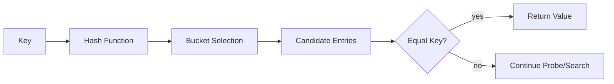
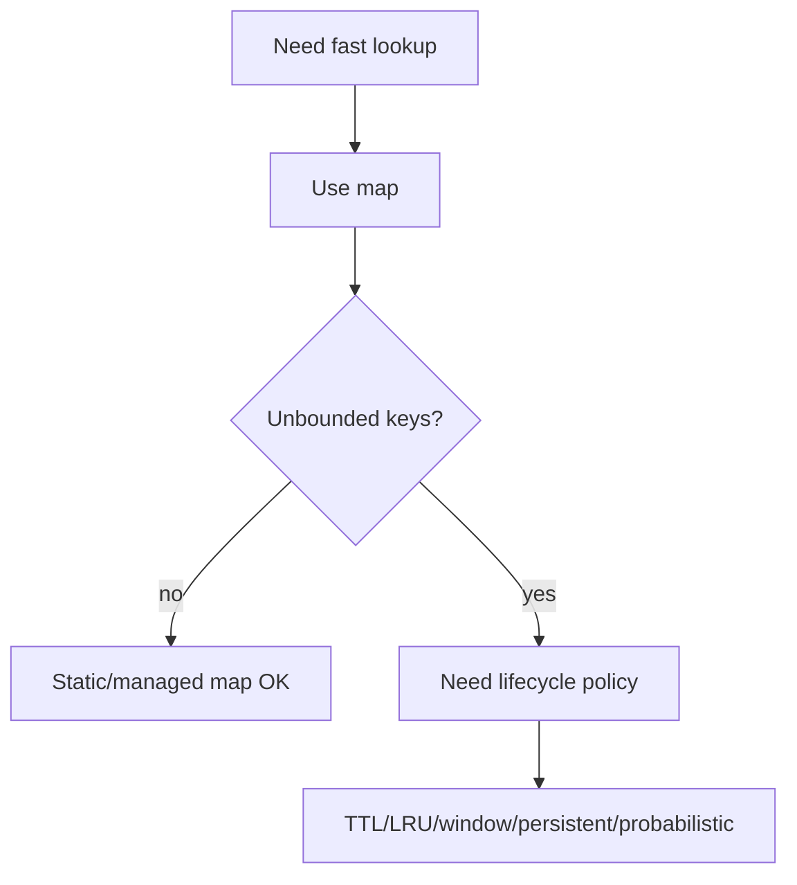

# learn-go-data-structure-algorithm-part-003.md

# Part 003 — Maps, Hash Tables, dan Associative Data

> Seri: `learn-go-data-structure-algorithm`  
> Bagian: `003 / 034`  
> Fokus: `map[K]V`, hash table mental model, associative lookup, set, index, grouping, memory trade-off, determinism, dan desain data structure berbasis key-value di Go 1.26.x.  
> Target pembaca: Java software engineer yang ingin naik dari “bisa pakai map” menjadi mampu mendesain associative data structure yang benar, efisien, predictable, dan aman untuk sistem production.

---

## 0. Ringkasan Eksekutif

Di Go, `map[K]V` adalah primitive utama untuk struktur data associative:

```go
m := map[string]int{
    "alice": 3,
    "bob":   5,
}

v, ok := m["alice"]
```

Secara mental, map adalah struktur data yang menjawab pertanyaan:

```text
Dengan key K, temukan value V secara cepat.
```

Dalam praktik production, map bukan sekadar dictionary. Map sering menjadi fondasi untuk:

- set;
- multiset/frequency counter;
- deduplication;
- grouping;
- reverse index;
- lookup cache;
- idempotency key registry;
- entity registry;
- dependency index;
- permission lookup;
- temporary join table;
- graph adjacency list;
- workflow state lookup;
- precomputed decision table.

Tetapi map juga membawa risiko:

- iteration order tidak deterministic;
- zero value lookup dapat menyembunyikan missing key;
- key harus comparable;
- map tidak aman untuk concurrent write;
- large map dapat menyebabkan memory footprint tinggi;
- value besar bisa sering tercopy;
- pointer-heavy map meningkatkan GC scanning;
- map tanpa lifecycle bisa menjadi unbounded memory sink;
- desain key yang buruk dapat menyebabkan bug correctness, bukan hanya masalah performance.

Part ini membangun mental model Go map sebagai struktur data production-grade: kapan dipakai, bagaimana mendesain key/value, bagaimana membaca complexity-nya secara realistis, bagaimana menghindari bug determinism, bagaimana membuat index dan grouping yang benar, dan kapan `map` bukan pilihan terbaik.

---

## 1. Posisi Materi Ini dalam Seri

Part 002 membahas sequence: array, slice, dan desain struktur linear. Part ini membahas associative data: struktur yang menghubungkan key ke value.

Secara abstrak:

```text
Slice: index integer -> value
Map:   key arbitrary comparable -> value
```

Slice cocok ketika:

- data punya posisi natural;
- akses berdasarkan integer index;
- urutan penting;
- scan berurutan dominan;
- data compact dan cache-friendly.

Map cocok ketika:

- akses dominan berdasarkan identifier;
- lookup harus cepat;
- key sparse;
- order tidak menjadi requirement utama;
- kita perlu membership test cepat;
- kita perlu menggabungkan, menghitung, atau mengindeks data.

Namun, map bukan pengganti semua struktur data. Banyak engineer menggunakan map terlalu cepat, lalu sistem menjadi:

- boros memory;
- nondeterministic;
- sulit di-debug;
- rawan unbounded growth;
- tidak punya ownership/lifecycle yang jelas.

Part ini memberi framework agar `map` dipakai sebagai alat desain, bukan refleks.

---

## 2. Dari Java ke Go: `HashMap<K,V>` vs `map[K]V`

Sebagai Java engineer, analogi awalnya adalah:

```text
Java HashMap<K,V> ≈ Go map[K]V
```

Tetapi perbedaannya penting.

| Aspek | Java `HashMap<K,V>` | Go `map[K]V` |
|---|---|---|
| Bentuk | object/class | built-in reference type |
| API | method: `put`, `get`, `containsKey` | syntax: `m[k] = v`, `v, ok := m[k]` |
| Key equality | `hashCode()` + `equals()` | built-in equality untuk tipe comparable |
| Custom comparator/equality | bisa via tipe/map tertentu | tidak langsung; desain key harus comparable |
| Null key/value | bisa null | tidak ada null; zero value berlaku |
| Missing lookup | `null` atau `containsKey` | zero value + optional `ok` |
| Iteration order | unspecified untuk `HashMap`, ordered untuk `LinkedHashMap` | deliberately not specified |
| Concurrency | fail-fast-ish iterator, tidak thread-safe | concurrent write unsafe; dapat panic/data race |
| Generics | class generic | built-in generic-like syntax |
| Mutation while iterating | ada aturan iterator | ada aturan range, tetapi order/visibility tidak boleh dijadikan kontrak bisnis |

Perbedaan paling besar:

1. Go map tidak memakai method pada object. Ia adalah built-in runtime data structure.
2. Key equality tidak bisa di-custom per map. Key harus tipe yang bisa dibandingkan dengan `==`.
3. Missing key menghasilkan zero value, sehingga `ok` sering wajib untuk correctness.
4. Iteration order jangan pernah dijadikan observable contract.
5. Map adalah reference type: assignment map menyalin header/reference, bukan seluruh isi.

Contoh:

```go
func add(m map[string]int) {
    m["x"] = 10
}

func example() {
    m := map[string]int{}
    add(m)
    fmt.Println(m["x"]) // 10
}
```

Ini berbeda dengan slice dalam detail operasi, tetapi sama-sama penting dari perspektif ownership: passing map ke function memberi function akses untuk memutasi isi map.

---

## 3. Mental Model Hash Table

Hash table menyimpan pasangan key-value dengan prinsip:

```text
key -> hash -> bucket -> candidate entries -> equality check -> value
```

Diagram konseptual:



Hash table tidak mencari key dengan membandingkan terhadap semua key. Ia mengubah key menjadi hash, lalu menggunakan hash untuk mempersempit lokasi pencarian.

Secara ideal:

```text
lookup average: O(1)
insert average: O(1)
delete average: O(1)
```

Tetapi “O(1)” di hash table bukan berarti gratis. Biayanya meliputi:

- menghitung hash key;
- mengakses bucket;
- membandingkan key;
- menangani collision;
- kemungkinan rehash/growth;
- allocation internal;
- GC scanning terhadap key/value yang pointerful;
- cache miss karena layout tidak sesederhana slice linear.

Jadi model yang lebih realistis:

```text
map lookup cost ≈ hash cost + bucket access + equality cost + collision/probe cost + memory/cache effects
```

Untuk key kecil seperti `int`, `uint64`, atau short string, lookup biasanya sangat efisien. Untuk key besar seperti struct besar atau string panjang, hash dan equality dapat menjadi dominan.

---

## 4. Kontrak Dasar `map[K]V`

Deklarasi:

```go
var m map[string]int
```

Literal:

```go
m := map[string]int{
    "a": 1,
    "b": 2,
}
```

Dengan `make`:

```go
m := make(map[string]int)
```

Dengan capacity hint:

```go
m := make(map[string]int, 10_000)
```

Capacity hint bukan hard capacity. Ia memberi runtime perkiraan ukuran awal agar growth lebih jarang.

Operasi dasar:

```go
m["alice"] = 10          // insert/update
v := m["alice"]          // lookup, returns zero if missing
v, ok := m["alice"]      // lookup with existence flag
delete(m, "alice")       // delete; safe even if key absent
n := len(m)               // number of entries
```

Nil map:

```go
var m map[string]int

fmt.Println(m["x"]) // 0, ok false if using comma-ok

m["x"] = 1 // panic: assignment to entry in nil map
```

Read dari nil map aman. Write ke nil map panic.

Prinsip production:

```text
Jika map akan ditulis, pastikan sudah diinisialisasi.
Jika map hanya dibaca sebagai optional dictionary, nil map bisa menjadi representasi empty map.
```

---

## 5. Zero Value Lookup: Bug yang Sangat Umum

Map lookup biasa:

```go
count := counts[userID]
```

Jika `userID` tidak ada, `count` menjadi zero value dari `int`, yaitu `0`.

Masalah muncul ketika zero value adalah value valid.

Contoh bug:

```go
status := userStatus[userID]
if status == "" {
    // Apakah user tidak ada?
    // Atau user ada tetapi status memang empty?
}
```

Solusi:

```go
status, ok := userStatus[userID]
if !ok {
    return ErrUnknownUser
}
```

Rule:

```text
Gunakan comma-ok jika missing key punya makna berbeda dari present key dengan zero value.
```

Contoh value zero yang sering valid:

| Value type | Zero value | Bisa valid? |
|---|---:|---|
| `int` | `0` | ya, count bisa 0 |
| `bool` | `false` | ya, flag bisa false |
| `string` | `""` | ya, empty string bisa valid |
| pointer | `nil` | ya/tidak, tergantung domain |
| slice | `nil` | ya, empty list sering direpresentasikan nil |
| struct | zero struct | sering valid |

Untuk membership set, `ok` adalah operasi utama:

```go
_, exists := seen[id]
```

---

## 6. Key Harus Comparable

Map key harus tipe yang comparable, yaitu bisa dibandingkan dengan `==`.

Contoh valid:

```go
map[string]int
map[int]string
map[uint64]User
map[[16]byte]Session
map[struct{ TenantID, UserID string }]Permission
```

Contoh invalid:

```go
map[[]byte]int       // slice tidak comparable
map[map[string]int]x // map tidak comparable
map[func()]x         // func tidak comparable
```

Struct bisa menjadi key jika semua field-nya comparable.

```go
type UserKey struct {
    TenantID string
    UserID   string
}

m := map[UserKey]User{}
m[UserKey{TenantID: "t1", UserID: "u1"}] = user
```

Ini pattern production yang sangat penting.

Daripada membuat key string manual:

```go
key := tenantID + ":" + userID // rawan collision semantic jika delimiter tidak aman
```

Lebih baik gunakan struct key:

```go
type UserKey struct {
    TenantID string
    UserID   string
}
```

Keunggulan struct key:

- type-safe;
- tidak butuh encoding string;
- menghindari delimiter bug;
- lebih jelas secara domain;
- equality built-in.

Namun ada trade-off:

- struct besar lebih mahal di-hash/compare;
- field string tetap perlu hash content;
- jika key sering dibuat ulang, allocation/escape harus diperhatikan;
- jika field adalah pointer, equality adalah pointer identity, bukan value equality.

---

## 7. Desain Key: Identity adalah Keputusan Domain

Kesalahan map sering bukan karena runtime, tetapi karena salah mendefinisikan identity.

Pertanyaan wajib sebelum membuat map:

```text
Apa yang membuat dua entity dianggap sama?
```

Contoh:

```go
type Person struct {
    NRIC     string
    Name     string
    BirthDay time.Time
}
```

Apakah key-nya:

- `NRIC`?
- normalized name + birthday?
- database ID?
- external system ID?
- tenant + external ID?
- tenant + source system + external ID?

Untuk sistem multi-tenant, key yang lupa tenant adalah bug serius.

Buruk:

```go
usersByID := map[string]User{} // userID global? yakin?
```

Lebih defensible:

```go
type UserKey struct {
    TenantID string
    UserID   string
}

usersByKey := map[UserKey]User{}
```

Untuk regulatory/case management systems, identity sering multidimensional:

```go
type CaseActorKey struct {
    AgencyID string
    CaseID   string
    ActorID  string
    Role     string
}
```

Key adalah kontrak bisnis. Jika key salah, semua lookup setelahnya tampak “cepat” tetapi salah.

---

## 8. Map sebagai Set

Go tidak punya built-in set type. Pattern umum:

```go
seen := map[string]struct{}{}
seen["a"] = struct{}{}

_, ok := seen["a"]
```

Alternatif:

```go
seen := map[string]bool{}
seen["a"] = true

if seen["a"] {
    // present and true
}
```

Trade-off:

| Pattern | Kelebihan | Kekurangan |
|---|---|---|
| `map[T]struct{}` | value tidak membawa payload; idiom set | syntax sedikit verbose |
| `map[T]bool` | lookup lebih enak untuk simple case | `false` bisa ambigu jika key sengaja diset false |

Untuk set murni, gunakan:

```go
type Set[T comparable] map[T]struct{}
```

Contoh generic helper:

```go
type Set[T comparable] map[T]struct{}

func NewSet[T comparable](capHint int) Set[T] {
    return make(Set[T], capHint)
}

func (s Set[T]) Add(v T) {
    s[v] = struct{}{}
}

func (s Set[T]) Contains(v T) bool {
    _, ok := s[v]
    return ok
}

func (s Set[T]) Remove(v T) {
    delete(s, v)
}
```

Catatan penting: method `Add` akan panic jika set nil.

Jika ingin zero-value usable, gunakan struct wrapper:

```go
type SafeSet[T comparable] struct {
    m map[T]struct{}
}

func (s *SafeSet[T]) Add(v T) {
    if s.m == nil {
        s.m = make(map[T]struct{})
    }
    s.m[v] = struct{}{}
}

func (s *SafeSet[T]) Contains(v T) bool {
    _, ok := s.m[v]
    return ok
}
```

Decision:

```text
Alias map bagus untuk internal utility sederhana.
Struct wrapper lebih baik untuk exported reusable data structure.
```

---

## 9. Map sebagai Multiset / Frequency Counter

Frequency counter:

```go
counts := make(map[string]int)
for _, word := range words {
    counts[word]++
}
```

Ini idiom Go yang sangat kuat karena missing key menghasilkan zero value `0`.

Untuk decrement:

```go
counts[word]--
if counts[word] == 0 {
    delete(counts, word)
}
```

Menghapus count 0 penting jika map harus merepresentasikan active entries saja.

Jika tidak dihapus, map bisa berisi banyak key dengan value 0 dan membuat memory tidak turun.

Pattern production:

```go
func Inc[K comparable](m map[K]int, k K) {
    m[k]++
}

func Dec[K comparable](m map[K]int, k K) {
    if n := m[k]; n <= 1 {
        delete(m, k)
    } else {
        m[k] = n - 1
    }
}
```

Use case:

- word count;
- active session per tenant;
- pending task count;
- outstanding retry count;
- permission reference count;
- duplicate candidate score;
- event type histogram.

Invariant multiset:

```text
A key exists iff count > 0.
No key may remain with count <= 0.
```

Tuliskan invariant ini di test.

---

## 10. Map untuk Grouping

Grouping pattern:

```go
groups := make(map[string][]Order)
for _, order := range orders {
    groups[order.CustomerID] = append(groups[order.CustomerID], order)
}
```

Ini bekerja karena nil slice bisa di-append.

Dengan composite key:

```go
type GroupKey struct {
    TenantID string
    Status   string
}

groups := make(map[GroupKey][]Case)
for _, c := range cases {
    k := GroupKey{TenantID: c.TenantID, Status: c.Status}
    groups[k] = append(groups[k], c)
}
```

Pitfall penting:

1. Jika `Case` struct besar, grouping by value mengcopy semua case.
2. Jika pakai pointer, lifecycle object harus jelas.
3. Iteration order group tidak deterministic.
4. Slice dalam map bisa retain memory.

Alternatif untuk data besar:

```go
groups := make(map[GroupKey][]int) // store index into original slice
for i := range cases {
    k := GroupKey{TenantID: cases[i].TenantID, Status: cases[i].Status}
    groups[k] = append(groups[k], i)
}
```

Ini sering lebih baik jika original slice menjadi source of truth.

Trade-off:

| Value dalam group | Kelebihan | Kekurangan |
|---|---|---|
| `[]Case` | mudah, self-contained | copy besar |
| `[]*Case` | tidak copy struct | pointer chasing, aliasing |
| `[]int` index | compact, source of truth jelas | perlu akses original slice |
| `[]CaseID` | stable identifier | perlu lookup lagi |

---

## 11. Map untuk Index Table

Index table mempercepat lookup berdasarkan key tertentu.

Contoh:

```go
byID := make(map[string]User, len(users))
for _, u := range users {
    byID[u.ID] = u
}
```

Tetapi pertanyaan production-nya:

```text
Apa yang terjadi jika ada duplicate ID?
```

Versi defensible:

```go
func IndexUsersByID(users []User) (map[string]User, error) {
    byID := make(map[string]User, len(users))
    for _, u := range users {
        if _, exists := byID[u.ID]; exists {
            return nil, fmt.Errorf("duplicate user id %q", u.ID)
        }
        byID[u.ID] = u
    }
    return byID, nil
}
```

Untuk internal data pipeline, duplicate mungkin bukan error, tetapi harus eksplisit:

```go
// Last writer wins.
byID[u.ID] = u
```

Atau:

```go
// First writer wins.
if _, exists := byID[u.ID]; !exists {
    byID[u.ID] = u
}
```

Atau:

```go
// Preserve all duplicates.
byID[u.ID] = append(byID[u.ID], u)
```

Jangan biarkan overwrite diam-diam jika domain tidak mengizinkan duplicate.

Index invariant:

```text
For every entity e in source, index[key(e)] refers to e.
If key must be unique, duplicate key is invalid input.
```

---

## 12. Reverse Index

Reverse index menghubungkan value/attribute ke entity yang memilikinya.

Contoh permission:

```go
rolesByUser := map[string][]string{}
usersByRole := map[string][]string{}

for userID, roles := range rolesByUser {
    for _, role := range roles {
        usersByRole[role] = append(usersByRole[role], userID)
    }
}
```

Contoh document tags:

```go
docsByTag := map[string][]DocumentID{}
for _, doc := range docs {
    for _, tag := range doc.Tags {
        docsByTag[tag] = append(docsByTag[tag], doc.ID)
    }
}
```

Masalah production:

- duplicate tag dalam satu document;
- inconsistent normalization;
- stale reverse index setelah update;
- unbounded posting list;
- output order nondeterministic;
- memory sangat besar untuk high-cardinality attributes.

Pattern defensible:

```go
func BuildDocsByTag(docs []Document) map[string][]DocumentID {
    out := make(map[string][]DocumentID)
    for _, doc := range docs {
        seenTags := make(map[string]struct{}, len(doc.Tags))
        for _, raw := range doc.Tags {
            tag := normalizeTag(raw)
            if tag == "" {
                continue
            }
            if _, dup := seenTags[tag]; dup {
                continue
            }
            seenTags[tag] = struct{}{}
            out[tag] = append(out[tag], doc.ID)
        }
    }
    return out
}
```

Perhatikan local dedup per document agar satu document tidak muncul dua kali untuk tag yang sama.

---

## 13. Map sebagai Join Table Sementara

Dalam backend service, sering ada dua collection dan kita perlu join di memory.

Naive O(n*m):

```go
for _, order := range orders {
    for _, customer := range customers {
        if order.CustomerID == customer.ID {
            // join
        }
    }
}
```

Dengan map O(n+m):

```go
customersByID := make(map[string]Customer, len(customers))
for _, c := range customers {
    customersByID[c.ID] = c
}

for _, order := range orders {
    customer, ok := customersByID[order.CustomerID]
    if !ok {
        // handle missing customer
        continue
    }
    // join order + customer
}
```

Ini salah satu pattern DSA paling bernilai di production: mengubah nested scan menjadi indexed lookup.

Namun jangan lupa:

- duplicate customer ID policy;
- missing foreign key policy;
- memory cost index;
- lifecycle index;
- apakah join sebaiknya dilakukan di database, bukan service.

Decision:

```text
In-memory join cocok untuk data kecil-menengah, snapshot sudah tersedia, atau join logic tidak praktis di DB.
Database join lebih cocok untuk data besar, filtering kuat, dan query yang sudah indexed di storage layer.
```

---

## 14. Iteration Order Tidak Boleh Diandalkan

Go map iteration order tidak specified. Jangan menulis logic yang bergantung pada urutan `range` map.

Buruk:

```go
for id := range usersByID {
    return id // nondeterministic representative
}
```

Buruk untuk API response:

```go
items := make([]Item, 0, len(m))
for _, item := range m {
    items = append(items, item)
}
return items // order tidak deterministic
```

Jika output harus stable, sort keys:

```go
keys := make([]string, 0, len(m))
for k := range m {
    keys = append(keys, k)
}
slices.Sort(keys)

items := make([]Item, 0, len(keys))
for _, k := range keys {
    items = append(items, m[k])
}
```

Untuk composite key, gunakan custom ordering:

```go
slices.SortFunc(keys, func(a, b UserKey) int {
    if c := cmp.Compare(a.TenantID, b.TenantID); c != 0 {
        return c
    }
    return cmp.Compare(a.UserID, b.UserID)
})
```

Rule:

```text
Map untuk lookup. Slice untuk order. Jika butuh ordered output, extract keys lalu sort.
```

Diagram:

```mermaid
flowchart TD
    M[map[K]V] --> Q{Need stable order?}
    Q -- no --> R[Range directly]
    Q -- yes --> K[Extract keys]
    K --> S[Sort keys]
    S --> O[Read values by sorted keys]
```

---

## 15. Mutasi Saat Iterasi

Go mengizinkan beberapa bentuk mutasi saat range map, tetapi semantik observability-nya tidak boleh dijadikan kontrak rumit.

Delete current/other key saat iteration sering dipakai untuk filter:

```go
for k, v := range m {
    if shouldDelete(k, v) {
        delete(m, k)
    }
}
```

Tetapi insert saat iteration harus dihindari jika hasil iteration penting:

```go
for k := range m {
    m[newKey(k)] = value // jangan buat logic yang bergantung entry baru dikunjungi/tidak
}
```

Untuk transformasi kompleks, lebih baik dua fase:

```go
var toDelete []string
var toAdd []Entry

for k, v := range m {
    if shouldDelete(k, v) {
        toDelete = append(toDelete, k)
    }
    if e, ok := maybeNewEntry(k, v); ok {
        toAdd = append(toAdd, e)
    }
}

for _, k := range toDelete {
    delete(m, k)
}
for _, e := range toAdd {
    m[e.Key] = e.Value
}
```

Dua fase membuat invariant lebih jelas dan testing lebih mudah.

---

## 16. Map Assignment dan Ownership

Map adalah reference type. Assignment tidak meng-copy entries.

```go
a := map[string]int{"x": 1}
b := a
b["x"] = 2
fmt.Println(a["x"]) // 2
```

Jika perlu copy, gunakan `maps.Clone` untuk shallow clone:

```go
b := maps.Clone(a)
```

Shallow berarti value yang pointer/slice/map masih berbagi underlying data.

Contoh:

```go
a := map[string][]int{
    "x": {1, 2, 3},
}

b := maps.Clone(a)
b["x"][0] = 99

fmt.Println(a["x"][0]) // 99, karena slice value berbagi backing array
```

Deep copy harus eksplisit:

```go
func CloneMapOfSlices[K comparable, V any](src map[K][]V) map[K][]V {
    if src == nil {
        return nil
    }
    dst := make(map[K][]V, len(src))
    for k, v := range src {
        dst[k] = slices.Clone(v)
    }
    return dst
}
```

Rule ownership:

```text
Jika map keluar dari boundary package/API, tentukan apakah caller boleh mutate.
Jika tidak boleh, return clone atau expose read-only operations.
```

Go tidak punya immutable map built-in. Immutability harus didesain melalui ownership.

---

## 17. Value by Copy vs Pointer Value

Pilihan:

```go
map[string]User
```

atau:

```go
map[string]*User
```

Trade-off:

| Bentuk | Kelebihan | Kekurangan |
|---|---|---|
| `map[K]SmallStruct` | locality lebih baik, tidak mudah alias | update perlu assign ulang, copy cost |
| `map[K]*Struct` | update field mudah, tidak copy struct besar | pointer chasing, GC scanning, aliasing |
| `map[K]ID` | compact, stable | perlu lookup kedua |
| `map[K]int` index | compact, source slice sebagai storage | index invalid jika slice reorder |

Contoh update value struct:

```go
u := users[id]
u.LastSeen = now
users[id] = u
```

Tidak bisa langsung:

```go
users[id].LastSeen = now // invalid jika value bukan addressable
```

Untuk pointer value:

```go
users[id].LastSeen = now // jika users[id] bukan nil
```

Tetapi pointer value membuka aliasing:

```go
u := users[id]
u.Role = "admin" // semua pemegang pointer melihat perubahan
```

Decision framework:

```text
Gunakan value jika struct kecil, immutable-ish, dan update jarang.
Gunakan pointer jika object besar, identity/lifecycle penting, atau update field sering.
Gunakan index/ID jika ingin storage compact dan ownership jelas.
```

Untuk sistem yang butuh auditability, value immutable + replacement sering lebih defensible daripada pointer mutation tersebar.

---

## 18. Key by String vs Struct vs Encoded Bytes

Common key options:

### 18.1 String Key

```go
map[string]Value
```

Baik untuk:

- natural identifier;
- API IDs;
- code/name;
- small to medium keys.

Risiko:

- normalization inconsistent;
- case sensitivity;
- whitespace;
- Unicode normalization;
- delimiter collision jika composite string manual.

### 18.2 Struct Key

```go
type Key struct {
    TenantID string
    ObjectID string
}

map[Key]Value
```

Baik untuk:

- composite identity;
- type safety;
- domain clarity.

Risiko:

- key terlalu besar;
- field pointer memberi pointer equality;
- field time harus dinormalisasi jika dipakai.

### 18.3 Array Key

```go
map[[16]byte]Value
map[[32]byte]Value
```

Baik untuk:

- UUID bytes;
- fixed hash/fingerprint;
- binary ID fixed-size.

Risiko:

- perlu encoding/decoding;
- human debugging lebih sulit.

### 18.4 Encoded String Key

```go
key := tenantID + "\x00" + userID
```

Bisa cepat dan compact, tetapi rawan jika tidak disiplin. Jika dipakai, bungkus dalam constructor:

```go
type UserKey string

func NewUserKey(tenantID, userID string) UserKey {
    return UserKey(tenantID + "\x00" + userID)
}
```

Jangan menyebar manual concatenation di banyak tempat.

---

## 19. Normalization: Map Tidak Memperbaiki Data Kotor

Map key equality bersifat exact. Jika input tidak dinormalisasi, lookup gagal.

Contoh:

```go
m["ABC"] = value
fmt.Println(m["abc"]) // missing
```

Untuk key manusiawi, tentukan normalization pipeline:

```go
func NormalizeCode(s string) string {
    s = strings.TrimSpace(s)
    s = strings.ToUpper(s)
    return s
}
```

Lalu enforce di boundary:

```go
key := NormalizeCode(input)
v, ok := m[key]
```

Jangan campur normalized dan raw key dalam map yang sama.

Invariant:

```text
All keys stored in this map are normalized according to NormalizeX.
All lookups must normalize input before access.
```

Untuk Unicode-heavy domain, case folding dan normalization bisa kompleks. Jangan anggap `strings.ToLower` menyelesaikan semua masalah linguistik.

---

## 20. Capacity Hint dan Growth

Map bisa dibuat dengan hint:

```go
m := make(map[string]User, len(users))
```

Ini berguna saat jumlah entry kira-kira diketahui.

Tanpa hint:

```go
m := map[string]User{}
for _, u := range users {
    m[u.ID] = u
}
```

Runtime akan grow internal structure saat entries bertambah. Growth ini average tetap baik, tetapi bisa menambah allocation dan latency spike.

Rule:

```text
Jika membangun map dari collection yang sudah diketahui panjangnya, gunakan capacity hint.
```

Contoh:

```go
byID := make(map[string]User, len(users))
```

Untuk grouping, capacity hint map-nya bisa jumlah group estimasi, bukan jumlah item.

```go
groups := make(map[string][]Order, estimatedCustomers)
```

Slice per group juga bisa diberi hint jika distribusi diketahui, tetapi sering tidak praktis.

---

## 21. Large Map dan Memory Lifecycle

Map besar harus punya lifecycle. Pertanyaan:

```text
Kapan entry masuk?
Kapan entry keluar?
Siapa owner-nya?
Apa batas maksimum memory?
Apa yang terjadi jika input cardinality naik 10x?
```

Map yang terus tumbuh tanpa delete adalah memory leak logis.

Contoh buruk:

```go
var seen = map[string]struct{}{}

func Handle(id string) {
    seen[id] = struct{}{}
}
```

Jika `id` unbounded, memory naik selamanya.

Solusi bergantung domain:

- TTL eviction;
- LRU cache;
- bounded size;
- periodic rebuild;
- windowed set;
- probabilistic structure seperti Bloom filter;
- persistent storage;
- explicit lifecycle event.

Map bukan cache policy. Map hanya storage. Cache butuh policy.



---

## 22. Clearing Map

Ada beberapa cara “clear” map.

Delete satu per satu:

```go
for k := range m {
    delete(m, k)
}
```

Atau built-in `clear`:

```go
clear(m)
```

Atau buang map lama:

```go
m = make(map[string]Value)
```

Perbedaan konseptual:

| Cara | Efek |
|---|---|
| `clear(m)` | menghapus entries dari map yang sama |
| loop delete | sama secara konsep, lebih verbose |
| `m = make(...)` | variable menunjuk map baru; referensi lain ke map lama tetap ada |
| `m = nil` | melepas referensi variable; map lama bisa GC jika tidak ada referensi lain |

Jika map dibagikan ke caller lain, reassign tidak membersihkan map yang mereka pegang.

```go
a := map[string]int{"x": 1}
b := a
a = make(map[string]int)
fmt.Println(b["x"]) // 1
```

Jika ingin semua pemegang reference melihat kosong, gunakan `clear(a)`.

---

## 23. Map dan Concurrency

Map biasa tidak aman untuk concurrent write. Ini bukan sekadar data race abstrak; runtime bisa panic seperti:

```text
fatal error: concurrent map writes
```

Pattern unsafe:

```go
go func() { m["a"] = 1 }()
go func() { m["b"] = 2 }()
```

Juga unsafe jika satu goroutine read dan satu write tanpa synchronization.

Safe options:

1. `sync.Mutex` + map.
2. `sync.RWMutex` + map.
3. Sharded map.
4. Copy-on-write immutable snapshot.
5. `sync.Map` untuk use case tertentu.
6. Channel ownership model.

Part concurrency detail sudah ada di series lain, jadi di sini hanya decision model DSA-nya:

| Pattern | Cocok Untuk | Tidak Cocok Untuk |
|---|---|---|
| Mutex map | general purpose, simple invariant | extremely high contention |
| RWMutex map | many reads, fewer writes | write-heavy workloads, reader starvation concerns |
| Sharded map | high-cardinality independent keys | operation butuh global invariant |
| Copy-on-write | read-mostly config/index | frequent writes, large map clone |
| `sync.Map` | append-only/read-mostly/disjoint key workloads | invariant kompleks, type safety lemah |
| Channel owner | serialized state machine | high-throughput random access multi-core |

Mutex map contoh:

```go
type Registry struct {
    mu sync.RWMutex
    m  map[string]User
}

func NewRegistry() *Registry {
    return &Registry{m: make(map[string]User)}
}

func (r *Registry) Get(id string) (User, bool) {
    r.mu.RLock()
    defer r.mu.RUnlock()
    u, ok := r.m[id]
    return u, ok
}

func (r *Registry) Put(u User) {
    r.mu.Lock()
    defer r.mu.Unlock()
    r.m[u.ID] = u
}
```

Ingat: locking bukan hanya mencegah panic. Locking melindungi invariant.

---

## 24. Deterministic Map for Testing and Output

Test yang membandingkan output dari map tanpa sort akan flaky.

Buruk:

```go
func Keys(m map[string]int) []string {
    out := make([]string, 0, len(m))
    for k := range m {
        out = append(out, k)
    }
    return out
}
```

Jika test mengharapkan urutan tertentu, sort:

```go
func SortedKeys[V any](m map[string]V) []string {
    out := make([]string, 0, len(m))
    for k := range m {
        out = append(out, k)
    }
    slices.Sort(out)
    return out
}
```

Untuk API JSON response, stable order sering dibutuhkan agar:

- snapshot test stabil;
- diff mudah dibaca;
- client tidak melihat perubahan urutan aneh;
- audit output deterministic;
- cache key lebih predictable jika serialisasi tergantung order.

Walaupun encoding JSON object secara konseptual unordered, list output yang dibangun dari map harus distabilkan jika manusia atau test membacanya sebagai urutan.

---

## 25. Map of Slice: Pattern Kuat, Pitfall Banyak

Pattern:

```go
m := map[string][]Event{}
m[userID] = append(m[userID], event)
```

Keunggulan:

- concise;
- nil slice append works;
- cocok untuk grouping.

Pitfall:

### 25.1 Mutasi Slice yang Diambil dari Map

```go
events := m[userID]
events = append(events, newEvent)
// lupa assign balik
```

Jika append membuat backing array baru, map tidak melihat perubahan length.

Benar:

```go
events := m[userID]
events = append(events, newEvent)
m[userID] = events
```

Atau langsung:

```go
m[userID] = append(m[userID], newEvent)
```

### 25.2 Retained Large Slice

Jika value slice menyimpan pointer/large object, delete group saat tidak dipakai.

```go
delete(m, userID)
```

### 25.3 Aliasing ke Caller

Jika mengembalikan `m[userID]` langsung, caller bisa memutasi internal slice.

```go
func (s *Store) Events(userID string) []Event {
    return s.eventsByUser[userID] // exposes internal storage
}
```

Lebih aman:

```go
func (s *Store) Events(userID string) []Event {
    return slices.Clone(s.eventsByUser[userID])
}
```

Atau dokumentasikan read-only view, tetapi Go tidak bisa enforce.

---

## 26. Map of Map

Nested map sering dipakai untuk two-dimensional index:

```go
permissions := map[string]map[string]Permission{}
// userID -> resourceID -> permission
```

Write membutuhkan init inner map:

```go
if permissions[userID] == nil {
    permissions[userID] = make(map[string]Permission)
}
permissions[userID][resourceID] = perm
```

Helper:

```go
func Put2[K1, K2 comparable, V any](m map[K1]map[K2]V, k1 K1, k2 K2, v V) {
    inner := m[k1]
    if inner == nil {
        inner = make(map[K2]V)
        m[k1] = inner
    }
    inner[k2] = v
}
```

Alternative composite key:

```go
type PermissionKey struct {
    UserID     string
    ResourceID string
}

permissions := map[PermissionKey]Permission{}
```

Decision:

| Design | Cocok Untuk |
|---|---|
| nested map | sering query semua child dari parent |
| composite key | lookup by full key dominan, simpler storage |
| both indexes | read-heavy, butuh multiple access pattern |

Jangan membuat banyak index tanpa lifecycle. Multiple indexes harus konsisten.

---

## 27. Multi-Index Consistency

Sering kita butuh beberapa lookup:

```go
type UserStore struct {
    byID    map[string]User
    byEmail map[string]string // email -> id
}
```

Invariant:

```text
For every user in byID, byEmail[NormalizeEmail(user.Email)] == user.ID.
For every email in byEmail, byID[id] exists.
```

Update harus atomic secara logical:

```go
func (s *UserStore) Put(u User) error {
    email := NormalizeEmail(u.Email)

    if existingID, ok := s.byEmail[email]; ok && existingID != u.ID {
        return fmt.Errorf("email already used")
    }

    if old, ok := s.byID[u.ID]; ok {
        oldEmail := NormalizeEmail(old.Email)
        if oldEmail != email {
            delete(s.byEmail, oldEmail)
        }
    }

    s.byID[u.ID] = u
    s.byEmail[email] = u.ID
    return nil
}
```

Remove:

```go
func (s *UserStore) Delete(id string) bool {
    old, ok := s.byID[id]
    if !ok {
        return false
    }
    delete(s.byID, id)
    delete(s.byEmail, NormalizeEmail(old.Email))
    return true
}
```

Testing multi-index harus mengecek invariant setelah setiap operasi, bukan hanya return value.

---

## 28. Map dan Error Handling Semantics

Missing key bisa berarti banyak hal:

- data tidak ada;
- data belum diload;
- permission denied;
- cache miss;
- corrupted index;
- stale reference;
- optional relationship absent.

Jangan langsung return `nil` tanpa semantik.

Contoh API internal:

```go
func (s *Store) Get(id string) (User, bool) {
    u, ok := s.byID[id]
    return u, ok
}
```

Untuk domain service:

```go
func (s *Service) RequireUser(id string) (User, error) {
    u, ok := s.store.Get(id)
    if !ok {
        return User{}, fmt.Errorf("user %q not found", id)
    }
    return u, nil
}
```

`bool` cocok untuk low-level collection. `error` cocok saat missing punya domain meaning dan perlu context.

---

## 29. Map vs Slice Linear Scan

Map tidak selalu lebih baik. Untuk data kecil, slice scan bisa lebih cepat, lebih simple, dan lebih cache-friendly.

Contoh:

```go
func FindStatus(statuses []Status, code string) (Status, bool) {
    for _, s := range statuses {
        if s.Code == code {
            return s, true
        }
    }
    return Status{}, false
}
```

Jika `statuses` hanya 5-20 item dan jarang di-query, map mungkin overkill.

Decision:

```text
Gunakan slice scan jika data kecil, order penting, dan lookup tidak intensif.
Gunakan map jika lookup berulang, cardinality sedang-besar, atau nested scan perlu dihilangkan.
```

Cost membuat map juga harus dihitung. Jika hanya lookup satu kali, membangun map dari slice belum tentu menang.

```text
Build index: O(n)
Lookup: O(1)
Total for q lookups: O(n + q)
Linear scan q times: O(n*q)
```

Map mulai bernilai saat `q` cukup besar atau `n` besar.

---

## 30. Map vs Sorted Slice

Untuk lookup read-only, sorted slice bisa menjadi alternatif.

Sorted slice:

- memory compact;
- deterministic order;
- cache-friendly;
- binary search O(log n);
- build perlu sort O(n log n);
- insert/delete mahal O(n).

Map:

- lookup average O(1);
- order tidak deterministic;
- memory overhead lebih besar;
- insert/delete average O(1);
- cocok untuk mutable dictionary.

Decision:

| Workload | Pilihan |
|---|---|
| read-only, output sorted, small/medium | sorted slice |
| frequent lookup, mutable | map |
| range query | sorted slice/tree |
| prefix/range order | trie/tree/sorted slice |
| memory sangat ketat | benchmark map vs sorted slice |

Contoh sorted lookup:

```go
type Entry struct {
    Key   string
    Value int
}

func Find(entries []Entry, key string) (int, bool) {
    i, ok := slices.BinarySearchFunc(entries, key, func(e Entry, k string) int {
        return cmp.Compare(e.Key, k)
    })
    if !ok {
        return 0, false
    }
    return entries[i].Value, true
}
```

---

## 31. Map dan JSON/API Semantics

Ketika map dipakai sebagai API payload:

```go
type Response struct {
    Counts map[string]int `json:"counts"`
}
```

Pertanyaan:

- apakah key space bounded?
- apakah key valid untuk client?
- apakah missing key berarti 0 atau absent?
- apakah client butuh stable order?
- apakah map bisa sangat besar?
- apakah key mengandung data sensitif?

Untuk API publik, kadang list lebih defensible:

```go
type CountItem struct {
    Key   string `json:"key"`
    Count int    `json:"count"`
}

type Response struct {
    Counts []CountItem `json:"counts"`
}
```

Keunggulan list:

- order eksplisit;
- bisa duplicate jika domain perlu;
- schema lebih jelas;
- bisa menambah metadata per item;
- lebih mudah paginate.

Map payload cocok untuk lookup client-side, tetapi kurang cocok untuk data besar atau output audit yang butuh deterministic order.

---

## 32. Map dan Security/Robustness

Map dengan key dari input user harus memperhatikan:

- cardinality attack;
- very large key strings;
- normalization bypass;
- memory exhaustion;
- unbounded grouping;
- hidden PII in keys;
- exposing internal IDs.

Contoh raw input sebagai key:

```go
counts[r.FormValue("q")]++
```

Jika input tidak dibatasi, attacker bisa mengirim jutaan key unik.

Mitigation:

- validate length;
- normalize;
- reject invalid key;
- cap unique key count;
- TTL/window;
- use approximate data structure;
- push aggregation to controlled backend;
- enforce request-level limits.

Example bounded counter:

```go
func AddBounded(m map[string]int, key string, maxKeys int) bool {
    if _, ok := m[key]; !ok && len(m) >= maxKeys {
        return false
    }
    m[key]++
    return true
}
```

---

## 33. Invariant-First Design untuk Map-Based Structure

Saat membuat struktur berbasis map, mulai dari invariant.

Contoh LRU cache akan dibahas detail di part cache, tetapi invariant sederhananya:

```text
Every key in map must have exactly one node in linked list.
Every node in linked list must have exactly one key in map.
List order represents recency.
```

Untuk registry:

```text
IDs are unique.
Email index points to existing ID.
Deleted user is absent from all indexes.
All stored emails are normalized.
```

Untuk grouping:

```text
Every source item appears in exactly one group if group key total.
Every source item appears in zero or more groups if group key multi-valued.
No duplicate item within same group unless duplicates are meaningful.
```

Untuk set:

```text
A key exists iff membership is true.
```

Untuk frequency counter:

```text
A key exists iff count > 0.
Count must never be negative.
```

Production-grade map code biasanya pendek, tetapi invariant-nya harus eksplisit.

---

## 34. Testing Map-Based Data Structures

Test bukan hanya happy path.

Checklist:

- empty map;
- nil map behavior;
- insert new key;
- update existing key;
- delete existing key;
- delete missing key;
- lookup missing key;
- zero value as valid value;
- duplicate key policy;
- deterministic output if required;
- normalization;
- aliasing/copy behavior;
- multi-index consistency;
- high-cardinality input;
- concurrent access if structure claims safe.

Example invariant test:

```go
func assertUserStoreInvariant(t *testing.T, s *UserStore) {
    t.Helper()

    for id, u := range s.byID {
        if id != u.ID {
            t.Fatalf("byID key %q does not match user id %q", id, u.ID)
        }
        email := NormalizeEmail(u.Email)
        gotID, ok := s.byEmail[email]
        if !ok {
            t.Fatalf("missing email index for %q", email)
        }
        if gotID != id {
            t.Fatalf("email index %q points to %q, want %q", email, gotID, id)
        }
    }

    for email, id := range s.byEmail {
        u, ok := s.byID[id]
        if !ok {
            t.Fatalf("email %q points to missing id %q", email, id)
        }
        if NormalizeEmail(u.Email) != email {
            t.Fatalf("email %q points to user with email %q", email, u.Email)
        }
    }
}
```

This style finds bugs that ordinary example-based tests miss.

---

## 35. Benchmarking Map Workloads

Microbenchmark map realistically:

- hit vs miss ratio;
- key distribution;
- key size;
- value size;
- map size;
- build cost vs lookup cost;
- mutation ratio;
- allocation count;
- stable random seed;
- avoid measuring data generation inside benchmark loop unless intended.

Example skeleton:

```go
func BenchmarkMapLookupString(b *testing.B) {
    const n = 100_000

    m := make(map[string]int, n)
    keys := make([]string, n)
    for i := 0; i < n; i++ {
        k := fmt.Sprintf("key-%06d", i)
        keys[i] = k
        m[k] = i
    }

    b.ReportAllocs()
    b.ResetTimer()

    var sink int
    for i := 0; i < b.N; i++ {
        sink += m[keys[i%n]]
    }
    _ = sink
}
```

Benchmark build:

```go
func BenchmarkMapBuild(b *testing.B) {
    keys := make([]string, 100_000)
    for i := range keys {
        keys[i] = fmt.Sprintf("key-%06d", i)
    }

    b.ReportAllocs()
    b.ResetTimer()

    for i := 0; i < b.N; i++ {
        m := make(map[string]int, len(keys))
        for j, k := range keys {
            m[k] = j
        }
        if len(m) == 0 {
            b.Fatal("impossible")
        }
    }
}
```

Benchmark map vs slice only jika workload sama:

```text
Do not benchmark a map lookup against a slice scan with different semantics.
```

---

## 36. Common Anti-Patterns

### 36.1 Missing `ok` When Zero Value Is Ambiguous

```go
if users[id].Active {
    // missing user treated as inactive
}
```

Better:

```go
u, ok := users[id]
if !ok {
    return ErrNotFound
}
if u.Active {
    // ...
}
```

### 36.2 Composite Key by Unsafe Concatenation

```go
key := tenantID + userID
```

Collision semantic:

```text
tenant="ab", user="c"
tenant="a",  user="bc"
```

Better: struct key.

### 36.3 Returning Internal Map

```go
func (s *Store) All() map[string]User {
    return s.byID
}
```

Caller can mutate store.

Better:

```go
func (s *Store) All() map[string]User {
    return maps.Clone(s.byID)
}
```

Or return sorted slice.

### 36.4 Unbounded Global Map

```go
var cache = map[string]Value{}
```

Without TTL/size/lifecycle, this is a memory incident waiting to happen.

### 36.5 Pointer Value Everywhere

```go
map[string]*TinyStruct
```

Pointer value is not always faster. For small structs, value map can be simpler and more locality-friendly.

### 36.6 Map Used Where Order Is Required

```go
for _, step := range workflowStepsByID {
    execute(step)
}
```

If order matters, model order explicitly.

### 36.7 Multiple Indexes Without Consistency Tests

```go
byID[id] = u
byEmail[email] = id
byRole[role] = append(byRole[role], id)
```

But update/delete forgets one index. Add invariant tests.

---

## 37. Production Design Patterns

### 37.1 Dedup Batch

```go
func DedupIDs(ids []string) []string {
    seen := make(map[string]struct{}, len(ids))
    out := make([]string, 0, len(ids))

    for _, id := range ids {
        if _, ok := seen[id]; ok {
            continue
        }
        seen[id] = struct{}{}
        out = append(out, id)
    }
    return out
}
```

This preserves first occurrence order.

### 37.2 Build Unique Index

```go
func UniqueBy[K comparable, V any](items []V, keyFn func(V) K) (map[K]V, error) {
    out := make(map[K]V, len(items))
    for _, item := range items {
        k := keyFn(item)
        if _, exists := out[k]; exists {
            return nil, fmt.Errorf("duplicate key: %v", k)
        }
        out[k] = item
    }
    return out, nil
}
```

For exported library, avoid `%v` if key may contain sensitive data.

### 37.3 Group By

```go
func GroupBy[K comparable, V any](items []V, keyFn func(V) K) map[K][]V {
    out := make(map[K][]V)
    for _, item := range items {
        k := keyFn(item)
        out[k] = append(out[k], item)
    }
    return out
}
```

### 37.4 Count By

```go
func CountBy[K comparable, V any](items []V, keyFn func(V) K) map[K]int {
    out := make(map[K]int)
    for _, item := range items {
        out[keyFn(item)]++
    }
    return out
}
```

### 37.5 Stable Map Values

```go
func ValuesSortedByKey[V any](m map[string]V) []V {
    keys := make([]string, 0, len(m))
    for k := range m {
        keys = append(keys, k)
    }
    slices.Sort(keys)

    out := make([]V, 0, len(keys))
    for _, k := range keys {
        out = append(out, m[k])
    }
    return out
}
```

---

## 38. Case Study: Permission Resolution Index

Misal kita punya permissions:

```go
type Permission struct {
    TenantID   string
    SubjectID  string
    ResourceID string
    Action     string
    Effect     string // allow/deny
}
```

Requirement:

- lookup permission by tenant + subject + resource + action;
- duplicate exact permission invalid;
- deny should override allow if conflict policy says so;
- output audit harus stable.

Key:

```go
type PermissionKey struct {
    TenantID   string
    SubjectID  string
    ResourceID string
    Action     string
}
```

Index:

```go
type PermissionIndex struct {
    byKey map[PermissionKey]Permission
}

func NewPermissionIndex(perms []Permission) (*PermissionIndex, error) {
    idx := &PermissionIndex{
        byKey: make(map[PermissionKey]Permission, len(perms)),
    }

    for _, p := range perms {
        k := PermissionKey{
            TenantID:   p.TenantID,
            SubjectID:  p.SubjectID,
            ResourceID: p.ResourceID,
            Action:     p.Action,
        }

        existing, exists := idx.byKey[k]
        if exists {
            if existing.Effect != p.Effect {
                return nil, fmt.Errorf("conflicting permission for key %+v", k)
            }
            return nil, fmt.Errorf("duplicate permission for key %+v", k)
        }

        idx.byKey[k] = p
    }

    return idx, nil
}

func (idx *PermissionIndex) Lookup(k PermissionKey) (Permission, bool) {
    p, ok := idx.byKey[k]
    return p, ok
}
```

Review:

- key includes tenant: good;
- duplicate policy explicit: good;
- conflict policy explicit: good;
- map not exposed: good;
- stable audit output still needs sorted keys method.

Stable audit:

```go
func (idx *PermissionIndex) Permissions() []Permission {
    keys := make([]PermissionKey, 0, len(idx.byKey))
    for k := range idx.byKey {
        keys = append(keys, k)
    }

    slices.SortFunc(keys, func(a, b PermissionKey) int {
        if c := cmp.Compare(a.TenantID, b.TenantID); c != 0 {
            return c
        }
        if c := cmp.Compare(a.SubjectID, b.SubjectID); c != 0 {
            return c
        }
        if c := cmp.Compare(a.ResourceID, b.ResourceID); c != 0 {
            return c
        }
        return cmp.Compare(a.Action, b.Action)
    })

    out := make([]Permission, 0, len(keys))
    for _, k := range keys {
        out = append(out, idx.byKey[k])
    }
    return out
}
```

This is the production pattern: map for lookup, slice+sort for deterministic output.

---

## 39. Case Study: Entity Merge Candidate Index

Untuk duplicate detection, kita mungkin punya beberapa weak keys:

- email;
- phone;
- normalized name + birthdate;
- external ID;
- document number.

Kita tidak ingin satu map tunggal karena equality domain berbeda.

```go
type CandidateIndexes struct {
    byEmail    map[string][]EntityID
    byPhone    map[string][]EntityID
    byDocument map[string][]EntityID
}
```

Build:

```go
func BuildCandidateIndexes(entities []Entity) CandidateIndexes {
    idx := CandidateIndexes{
        byEmail:    make(map[string][]EntityID),
        byPhone:    make(map[string][]EntityID),
        byDocument: make(map[string][]EntityID),
    }

    for _, e := range entities {
        if email := NormalizeEmail(e.Email); email != "" {
            idx.byEmail[email] = append(idx.byEmail[email], e.ID)
        }
        if phone := NormalizePhone(e.Phone); phone != "" {
            idx.byPhone[phone] = append(idx.byPhone[phone], e.ID)
        }
        if doc := NormalizeDocument(e.DocumentNo); doc != "" {
            idx.byDocument[doc] = append(idx.byDocument[doc], e.ID)
        }
    }
    return idx
}
```

Important reasoning:

```text
Map index returns candidates, not truth.
Candidate equality requires downstream adjudication.
```

This distinction matters in regulatory systems. A weak key match must not automatically merge entities unless policy says so.

---

## 40. Decision Framework

Sebelum memakai map, jawab:

### 40.1 Access Pattern

```text
Apakah lookup by key dominan?
Apakah query range/order/prefix diperlukan?
Apakah output harus deterministic?
```

### 40.2 Key Semantics

```text
Apa identity entity?
Apakah key harus composite?
Apakah key sudah normalized?
Apakah zero/missing punya perbedaan domain?
```

### 40.3 Value Semantics

```text
Apakah value kecil atau besar?
Apakah value mutable?
Apakah pointer aliasing acceptable?
Apakah caller boleh mutate?
```

### 40.4 Lifecycle

```text
Apakah key cardinality bounded?
Kapan entry dihapus?
Apakah perlu TTL/cache policy?
Apakah map bisa direbuild periodik?
```

### 40.5 Determinism

```text
Apakah order observable?
Apakah test snapshot stable?
Apakah audit output harus repeatable?
```

### 40.6 Concurrency

```text
Apakah ada concurrent access?
Siapa owner mutation?
Invariant apa yang harus dilindungi lock?
```

### 40.7 Verification

```text
Apa invariant map?
Bagaimana test duplicate/missing?
Bagaimana test multi-index consistency?
Perlu fuzz/random operation test?
```

---

## 41. Map Selection Matrix

| Kebutuhan | Struktur Awal yang Dipertimbangkan |
|---|---|
| membership test | `map[K]struct{}` |
| count/frequency | `map[K]int` |
| unique lookup | `map[K]V` with duplicate check |
| group by key | `map[K][]V` |
| reverse lookup | `map[Attr][]ID` |
| two-dimensional lookup | `map[K1]map[K2]V` atau composite key |
| stable ordered lookup | sorted slice or tree |
| range query | sorted slice/tree/B-tree |
| prefix lookup | trie/radix tree |
| approximate membership | Bloom filter |
| bounded cache | map + eviction policy |
| read-mostly snapshot | immutable map clone / copy-on-write |
| concurrent general use | map + mutex |
| high-cardinality concurrent | sharded map, depending invariant |

---

## 42. Rangkuman Mental Model

Map di Go adalah primitive kuat, tetapi production-grade usage membutuhkan disiplin.

Pegang model ini:

```text
Map = fast key-based association.
Map is not ordering.
Map is not lifecycle.
Map is not cache policy.
Map is not concurrency safety.
Map is not domain identity by itself.
```

Yang membuat map design matang:

1. Key identity benar.
2. Missing vs zero value jelas.
3. Duplicate policy eksplisit.
4. Output order distabilkan jika observable.
5. Ownership map/value jelas.
6. Large map punya lifecycle.
7. Multi-index punya invariant test.
8. Concurrency dilindungi oleh ownership/lock model.
9. Benchmark sesuai workload nyata.
10. Map tidak dipakai jika sorted slice/tree/trie lebih cocok.

---

## 43. Latihan Praktis

### Latihan 1 — Unique Index

Buat function:

```go
func IndexByID(users []User) (map[string]User, error)
```

Requirement:

- duplicate ID error;
- empty ID error;
- output map tidak expose source mutation problem jika User punya slice field;
- test duplicate.

### Latihan 2 — Stable Grouping

Buat grouping orders by customer:

```go
func GroupOrders(orders []Order) []CustomerOrders
```

Requirement:

- internal boleh pakai map;
- output sorted by customer ID;
- order dalam customer mengikuti input order;
- no duplicate mutation leak.

### Latihan 3 — Multi-Index Store

Buat store dengan:

```go
byID
byEmail
```

Requirement:

- email normalized;
- duplicate email rejected;
- update email removes old index;
- delete removes all indexes;
- invariant test after each operation.

### Latihan 4 — Bounded Frequency Counter

Buat counter yang menolak key baru jika jumlah unique key sudah mencapai limit.

Requirement:

- existing key tetap boleh increment;
- decrement to zero delete key;
- negative count forbidden;
- test high-cardinality input.

### Latihan 5 — Map vs Sorted Slice Benchmark

Bandingkan:

- build map + 1 lookup;
- linear scan 1 lookup;
- sorted slice binary search 1 lookup;
- map repeated lookup 1M;
- sorted slice repeated lookup 1M.

Gunakan dataset kecil, sedang, besar.

---

## 44. Checklist Review PR untuk Map

Gunakan checklist ini saat review code:

```text
[ ] Apakah key identity benar dan cukup spesifik?
[ ] Apakah key perlu normalization?
[ ] Apakah missing key dibedakan dari zero value jika perlu?
[ ] Apakah duplicate policy eksplisit?
[ ] Apakah map diberi capacity hint saat build dari known-size input?
[ ] Apakah map bisa tumbuh tanpa batas?
[ ] Apakah entry punya lifecycle/delete/clear?
[ ] Apakah output dari map perlu sorted?
[ ] Apakah internal map diekspos ke caller?
[ ] Apakah map value pointer/slice/map menyebabkan aliasing?
[ ] Apakah shallow clone cukup?
[ ] Apakah concurrent access aman?
[ ] Apakah multi-index consistency diuji?
[ ] Apakah benchmark memakai workload realistis?
[ ] Apakah slice scan/sorted slice/tree/trie lebih cocok?
```

---

## 45. Referensi Resmi dan Lanjutan

Rujukan utama:

- Go Language Specification — map types, comparison, indexing, range, built-in functions.
- Go standard library documentation:
  - `maps` package;
  - `slices` package;
  - `cmp` package;
  - `sort` package;
  - `sync` package;
  - `testing` package.
- Go 1.26 release notes dan release history untuk konteks versi seri.

Rujukan konseptual:

- hash table average vs worst-case behavior;
- hash/equality design;
- deterministic output from unordered associative containers;
- invariant-based testing;
- cache and indexing patterns.

---

## 46. Penutup Part 003

Part ini membahas `map[K]V` bukan hanya sebagai syntax Go, tetapi sebagai struktur data associative untuk production systems.

Kita sudah membahas:

- mental model hash table;
- kontrak dasar map;
- zero value dan comma-ok;
- comparable key;
- desain identity;
- set, multiset, grouping, index, reverse index;
- iteration nondeterminism;
- ownership dan copy semantics;
- value vs pointer trade-off;
- normalization;
- capacity hint;
- lifecycle large map;
- concurrency decision model;
- testing invariant;
- benchmark;
- anti-pattern;
- case study permission index dan entity merge index.

Bagian berikutnya:

```text
learn-go-data-structure-algorithm-part-004.md
Part 004 — Sorting, Ordering, Comparison, dan Search
```

Di Part 004, kita akan masuk ke ordering: comparator, stable vs unstable sort, binary search, lower/upper bound, top-K, partial sort, dan bagaimana ordering menjadi kontrak correctness dalam Go production code.


<!-- NAVIGATION_FOOTER -->
<div class="page-nav">
<a href="./learn-go-data-structure-algorithm-part-002.md">⬅️ Part 002 — Arrays, Slices, dan Sequence Design</a>
<a href="./index.md">📚 Kategori</a>
<a href="../../index.md">🏠 Home</a>
<a href="./learn-go-data-structure-algorithm-part-004.md">Part 004 — Sorting, Ordering, Comparison, dan Search ➡️</a>
</div>
