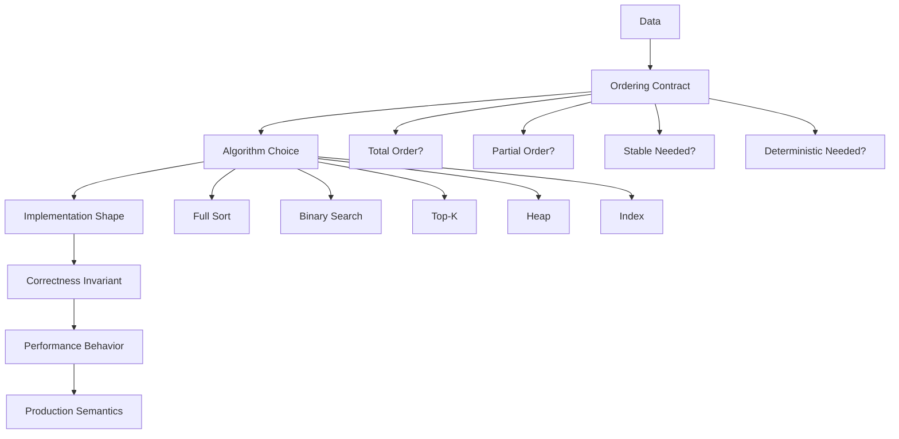
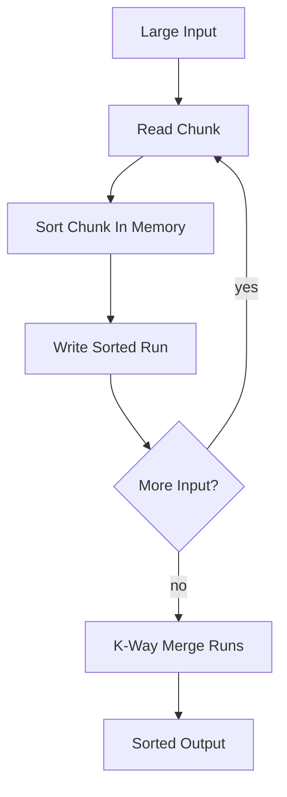
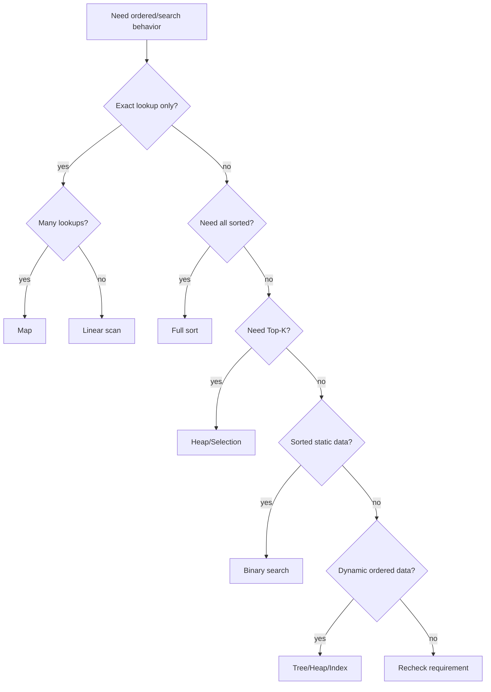

# learn-go-data-structure-algorithm-part-004.md

# Part 004 — Sorting, Ordering, Comparison, dan Search

> Seri: `learn-go-data-structure-algorithm`  
> Target pembaca: Java software engineer yang ingin menguasai Go data structure & algorithm pada level production/internal engineering handbook.  
> Fokus part ini: sorting, ordering contract, comparator correctness, binary search, search over predicate, partial sorting, Top-K, dan decision framework untuk memilih strategi search/sort di Go.

---

## 0. Posisi Part Ini Dalam Seri

Di part sebelumnya kita sudah membahas:

- Part 000: roadmap, mental model, batasan seri.
- Part 001: complexity model yang realistis di Go.
- Part 002: arrays, slices, dan sequence design.
- Part 003: maps, hash tables, dan associative data.

Part ini membahas operasi yang terlihat sederhana tetapi sangat fundamental:

- mengurutkan data,
- mencari data dalam sequence,
- mendesain ordering,
- membuat comparator yang benar,
- memilih antara full sort, partial sort, heap, map, tree, atau binary search.

Sorting dan search sering dianggap “algoritma dasar”. Dalam production system, masalahnya bukan hanya “pakai sort”. Masalah sebenarnya adalah:

- apakah ordering-nya valid?
- apakah comparator konsisten?
- apakah sort stable diperlukan?
- apakah kita benar-benar perlu mengurutkan semua data?
- apakah binary search predicate benar-benar monotonic?
- apakah struktur data kita masih cocok ketika data berubah secara incremental?
- apakah sorting menyebabkan allocation, pointer chasing, atau CPU spike?
- apakah hasil sorting harus deterministic untuk audit/log/report/testing?

Part ini akan membangun mental model untuk menjawab pertanyaan-pertanyaan tersebut.

---

## 1. Core Mental Model

Sorting dan search adalah masalah tentang **order**.

Order bukan sekadar “lebih kecil” dan “lebih besar”. Order adalah kontrak yang menentukan bagaimana elemen dibandingkan, diposisikan, dan ditemukan.

Dalam production-grade Go, sorting/search harus dipikirkan sebagai kombinasi dari:



Dalam Java, kita sering terbiasa dengan:

- `Comparable<T>`
- `Comparator<T>`
- `Collections.sort`
- `List.sort`
- `TreeMap`
- `PriorityQueue`
- `Arrays.binarySearch`

Di Go, modelnya lebih explicit dan lebih dekat ke data representation:

- `sort.Slice`
- `sort.SliceStable`
- `slices.Sort`
- `slices.SortFunc`
- `slices.SortStableFunc`
- `slices.BinarySearch`
- `slices.BinarySearchFunc`
- `sort.Search`
- `container/heap`

Go tidak mendorong hierarchy besar. Go mendorong kita mendefinisikan operasi di sekitar data dan use case.

---

## 2. Apa Itu Ordering?

Ordering adalah aturan untuk membandingkan dua elemen.

Contoh sederhana:

```go
1 < 2
"apple" < "banana"
timeA.Before(timeB)
```

Tapi dalam struktur domain, ordering biasanya composite:

```text
Case sorting:
1. priority descending
2. due date ascending
3. created time ascending
4. case id ascending as tie-breaker
```

Ordering semacam ini bukan hanya detail UI. Ordering bisa memengaruhi:

- fairness,
- determinism,
- repeatability,
- auditability,
- retry order,
- scheduler behavior,
- pagination correctness,
- cache key generation,
- report output,
- reconciliation result.

### 2.1 Ordering Sebagai Kontrak, Bukan Ekspresi Ad Hoc

Comparator yang ditulis asal-asalan bisa membuat sort menghasilkan output tidak konsisten.

Contoh buruk:

```go
sort.Slice(cases, func(i, j int) bool {
    if cases[i].Priority != cases[j].Priority {
        return cases[i].Priority > cases[j].Priority
    }
    return rand.Intn(2) == 0
})
```

Ini salah karena comparator tidak deterministic. Untuk pasangan elemen yang sama, hasilnya bisa berubah.

Contoh lain yang terlihat lebih subtle:

```go
sort.Slice(cases, func(i, j int) bool {
    return cases[i].Score <= cases[j].Score
})
```

Ini salah untuk comparator less-style karena ketika `Score` sama, `less(i, j)` dan `less(j, i)` bisa sama-sama true. Comparator harus menyatakan “strictly less”, bukan “less or equal”.

---

## 3. Strict Weak Ordering

Untuk sorting, comparator harus membentuk **strict weak ordering**.

Secara praktis, aturan yang harus dipegang:

1. Irreflexive:

```text
less(a, a) harus false
```

2. Asymmetric:

```text
Jika less(a, b) true, maka less(b, a) harus false
```

3. Transitive:

```text
Jika less(a, b) true dan less(b, c) true, maka less(a, c) harus true
```

4. Equivalent relation konsisten:

```text
Jika !less(a,b) dan !less(b,a), maka a dan b dianggap setara untuk ordering tersebut.
```

### 3.1 Diagram Kontrak Comparator

```mermaid
flowchart LR
    A[less(a,b)] -->|true| B[a must come before b]
    A -->|false| C[a does not have to come before b]
    C --> D{less(b,a)?}
    D -->|true| E[b must come before a]
    D -->|false| F[a and b equivalent under ordering]
```

Equivalent bukan berarti object-nya sama. Equivalent berarti comparator tidak membedakan keduanya.

Contoh:

```go
type User struct {
    ID   string
    Name string
    Age  int
}
```

Jika sorting hanya berdasarkan `Age`, maka dua user dengan age sama equivalent dalam ordering meskipun ID berbeda.

---

## 4. Total Order vs Partial Order

### 4.1 Total Order

Total order berarti setiap dua elemen bisa dibandingkan secara deterministic.

Contoh:

```text
Sort by:
1. Priority desc
2. DueDate asc
3. CreatedAt asc
4. ID asc
```

Dengan tie-breaker `ID`, hampir semua elemen punya posisi final deterministic.

### 4.2 Partial Order

Partial order berarti tidak semua elemen bisa dibandingkan secara langsung.

Contoh:

- dependency graph,
- workflow state transition,
- approval prerequisites,
- task ordering berdasarkan dependency.

Dalam partial order, sorting biasa tidak cukup. Yang dibutuhkan bisa jadi:

- topological sort,
- dependency resolution,
- graph validation.

Contoh:

```text
A must run before C
B must run before C
A and B have no ordering relation
```

Maka `A, B, C` dan `B, A, C` sama-sama valid.

### 4.3 Kesalahan Umum

Kesalahan umum adalah memaksakan partial order menjadi comparator biasa.

Misalnya:

```go
func less(a, b Task) bool {
    return dependsOn(b, a)
}
```

Ini sering tidak transitive dan tidak total. Untuk dependency problem, gunakan graph algorithm, bukan comparator sort biasa.

---

## 5. Stable vs Unstable Sort

### 5.1 Unstable Sort

Unstable sort tidak menjamin urutan relatif elemen yang equivalent.

Contoh:

Input:

```text
A(priority=1, created=10:00)
B(priority=1, created=10:01)
C(priority=2, created=10:02)
```

Sort hanya berdasarkan priority.

Unstable sort boleh menghasilkan:

```text
C, A, B
```

atau:

```text
C, B, A
```

Karena A dan B equivalent dalam comparator.

### 5.2 Stable Sort

Stable sort mempertahankan urutan relatif elemen yang equivalent.

Jika input sudah disusun berdasarkan `created asc`, lalu stable sort berdasarkan `priority desc`, maka ordering created tetap terjaga dalam priority yang sama.

### 5.3 Kapan Stable Sort Diperlukan?

Stable sort diperlukan ketika:

- sorting dilakukan multi-pass,
- input order punya makna,
- fairness tergantung urutan awal,
- output report harus predictable,
- pagination harus konsisten,
- audit output harus repeatable.

### 5.4 Kapan Stable Sort Tidak Perlu?

Stable sort tidak perlu jika comparator sudah memasukkan tie-breaker total.

Contoh:

```go
func compareCase(a, b Case) int {
    if c := cmp.Compare(b.Priority, a.Priority); c != 0 { // desc
        return c
    }
    if c := a.DueAt.Compare(b.DueAt); c != 0 {
        return c
    }
    if c := a.CreatedAt.Compare(b.CreatedAt); c != 0 {
        return c
    }
    return cmp.Compare(a.ID, b.ID)
}
```

Dengan ID sebagai tie-breaker, stable sort biasanya tidak dibutuhkan untuk determinism.

---

## 6. Go Sorting APIs: Mental Model

Go memiliki dua keluarga API sorting utama:

1. Package `sort`
2. Package `slices`

### 6.1 Package `sort`

Package `sort` adalah API lama dan tetap penting.

Bentuk umum:

```go
sort.Slice(xs, func(i, j int) bool {
    return xs[i] < xs[j]
})
```

Untuk stable sort:

```go
sort.SliceStable(xs, func(i, j int) bool {
    return xs[i].Key < xs[j].Key
})
```

Untuk custom collection:

```go
type ByAge []Person

func (p ByAge) Len() int           { return len(p) }
func (p ByAge) Less(i, j int) bool { return p[i].Age < p[j].Age }
func (p ByAge) Swap(i, j int)      { p[i], p[j] = p[j], p[i] }

sort.Sort(ByAge(people))
```

### 6.2 Package `slices`

Package `slices` memberi API generic modern.

Untuk ordered types:

```go
slices.Sort(nums)
slices.Sort(names)
```

Untuk custom ordering:

```go
slices.SortFunc(people, func(a, b Person) int {
    return cmp.Compare(a.Age, b.Age)
})
```

Untuk stable custom ordering:

```go
slices.SortStableFunc(people, func(a, b Person) int {
    return cmp.Compare(a.Age, b.Age)
})
```

### 6.3 Perbedaan Style Comparator

`sort.Slice` memakai `less(i, j) bool`.

`slices.SortFunc` memakai `compare(a, b) int`:

```text
negative: a before b
zero:     equivalent
positive: a after b
```

Dalam banyak kasus, `compare(a,b) int` lebih mudah dibuat benar untuk multi-key sorting.

---

## 7. Comparator Style: bool Less vs int Compare

### 7.1 bool Less

Contoh:

```go
sort.Slice(users, func(i, j int) bool {
    if users[i].Age != users[j].Age {
        return users[i].Age < users[j].Age
    }
    return users[i].ID < users[j].ID
})
```

Kelebihan:

- familiar,
- compact,
- cocok untuk simple sorting.

Kelemahan:

- mudah salah dengan `<=`,
- multi-key lebih verbose,
- duplicate logic kadang muncul.

### 7.2 int Compare

Contoh:

```go
slices.SortFunc(users, func(a, b User) int {
    if c := cmp.Compare(a.Age, b.Age); c != 0 {
        return c
    }
    return cmp.Compare(a.ID, b.ID)
})
```

Kelebihan:

- natural untuk multi-key,
- mudah test sebagai function biasa,
- reusable untuk sort dan binary search,
- lebih eksplisit tentang equivalence.

Kelemahan:

- harus hati-hati jangan return subtraction untuk integer besar.

Jangan lakukan ini:

```go
return a.Score - b.Score
```

Kenapa? Untuk integer berukuran besar, subtraction bisa overflow. Gunakan:

```go
return cmp.Compare(a.Score, b.Score)
```

---

## 8. `cmp.Compare` dan Composite Ordering

Package `cmp` di standard library menyediakan helper untuk membandingkan ordered values.

Contoh ascending:

```go
func compareUser(a, b User) int {
    if c := cmp.Compare(a.LastName, b.LastName); c != 0 {
        return c
    }
    if c := cmp.Compare(a.FirstName, b.FirstName); c != 0 {
        return c
    }
    return cmp.Compare(a.ID, b.ID)
}
```

Contoh descending:

```go
func compareByPriorityDesc(a, b Case) int {
    return cmp.Compare(b.Priority, a.Priority)
}
```

Atau:

```go
func compareCase(a, b Case) int {
    if c := cmp.Compare(b.Priority, a.Priority); c != 0 { // descending
        return c
    }
    if c := a.DueAt.Compare(b.DueAt); c != 0 { // ascending
        return c
    }
    return cmp.Compare(a.ID, b.ID)
}
```

### 8.1 Avoid Clever Comparator

Comparator sebaiknya boring.

Buruk:

```go
func compare(a, b Case) int {
    return cmp.Or(
        cmp.Compare(b.Priority, a.Priority),
        a.DueAt.Compare(b.DueAt),
        cmp.Compare(a.ID, b.ID),
    )
}
```

Ini bisa valid jika tim paham `cmp.Or`, tetapi untuk handbook production, explicit chain lebih mudah direview.

Baik:

```go
func compareCase(a, b Case) int {
    if c := cmp.Compare(b.Priority, a.Priority); c != 0 {
        return c
    }
    if c := a.DueAt.Compare(b.DueAt); c != 0 {
        return c
    }
    return cmp.Compare(a.ID, b.ID)
}
```

Engineering rule:

> Comparator adalah bagian dari correctness boundary. Optimalkan readability dan testability lebih dulu.

---

## 9. Deterministic Sorting

Deterministic sorting berarti input yang sama menghasilkan output yang sama.

Ini penting untuk:

- audit report,
- test snapshot,
- reconciliation,
- pagination,
- distributed comparison,
- cache signature,
- deploy plan,
- workflow execution order.

### 9.1 Map Iteration + Sort

Go map iteration tidak boleh diasumsikan urut. Jika output dari map perlu deterministic, ambil keys lalu sort.

```go
func SortedKeys[V any](m map[string]V) []string {
    keys := make([]string, 0, len(m))
    for k := range m {
        keys = append(keys, k)
    }
    slices.Sort(keys)
    return keys
}
```

Untuk map dengan key domain:

```go
type CaseID string

type Case struct {
    ID       CaseID
    Priority int
}

func SortedCasesByID(m map[CaseID]Case) []Case {
    ids := make([]CaseID, 0, len(m))
    for id := range m {
        ids = append(ids, id)
    }

    slices.SortFunc(ids, func(a, b CaseID) int {
        return cmp.Compare(string(a), string(b))
    })

    out := make([]Case, 0, len(ids))
    for _, id := range ids {
        out = append(out, m[id])
    }
    return out
}
```

### 9.2 Tie-Breaker Rule

Jika output harus deterministic, comparator harus punya tie-breaker final yang stable dan unique.

Biasanya:

- ID,
- created timestamp + ID,
- sequence number,
- primary key.

Jangan mengandalkan input order kecuali stable sort memang bagian dari kontrak.

---

## 10. Sorting by Multiple Keys

Misal kita punya model:

```go
type Case struct {
    ID        string
    Priority  int
    Status    string
    DueAt     time.Time
    CreatedAt time.Time
}
```

Requirement:

```text
Sort cases by:
1. Priority descending
2. Due date ascending
3. Created time ascending
4. ID ascending
```

Implementasi:

```go
func compareCaseQueue(a, b Case) int {
    if c := cmp.Compare(b.Priority, a.Priority); c != 0 {
        return c
    }
    if c := a.DueAt.Compare(b.DueAt); c != 0 {
        return c
    }
    if c := a.CreatedAt.Compare(b.CreatedAt); c != 0 {
        return c
    }
    return cmp.Compare(a.ID, b.ID)
}

func SortCaseQueue(cases []Case) {
    slices.SortFunc(cases, compareCaseQueue)
}
```

### 10.1 Kenapa Tie-Breaker ID Penting?

Tanpa ID, dua case dengan priority, due date, dan created time sama akan equivalent. Jika sort tidak stable, urutannya bisa berubah.

Dalam UI, ini bisa menyebabkan item “lompat-lompat”. Dalam API pagination, ini bisa menyebabkan duplicate/missing result antar page.

### 10.2 Cursor Pagination dan Ordering

Jika API menggunakan cursor pagination, ordering harus total.

Contoh order:

```text
created_at desc, id desc
```

Cursor:

```text
last_created_at, last_id
```

Predicate next page:

```sql
WHERE (created_at < :last_created_at)
   OR (created_at = :last_created_at AND id < :last_id)
ORDER BY created_at DESC, id DESC
LIMIT :n
```

Mental model yang sama berlaku untuk in-memory slice.

---

## 11. Sorting Struct vs Pointer

Pertanyaan umum:

```go
[]Case
```

atau:

```go
[]*Case
```

### 11.1 Sorting `[]Case`

Kelebihan:

- data contiguous,
- cache locality lebih baik,
- tidak perlu pointer dereference,
- GC scanning bisa lebih murah jika struct minim pointer.

Kekurangan:

- swap menyalin seluruh struct,
- mahal jika struct besar,
- bisa membawa field besar yang tidak perlu.

### 11.2 Sorting `[]*Case`

Kelebihan:

- swap murah karena hanya pointer,
- cocok untuk object besar,
- identity object terjaga.

Kekurangan:

- pointer chasing,
- cache locality buruk,
- GC scanning pointer lebih banyak,
- nil pointer risk.

### 11.3 Pattern: Sort Lightweight View

Untuk data besar, sering lebih baik membuat lightweight view.

```go
type CaseSortKey struct {
    ID       string
    Priority int
    DueAt    time.Time
    Index    int
}
```

Lalu sort key/index, bukan object penuh.

```go
keys := make([]CaseSortKey, 0, len(cases))
for i, c := range cases {
    keys = append(keys, CaseSortKey{
        ID:       c.ID,
        Priority: c.Priority,
        DueAt:    c.DueAt,
        Index:    i,
    })
}

slices.SortFunc(keys, func(a, b CaseSortKey) int {
    if c := cmp.Compare(b.Priority, a.Priority); c != 0 {
        return c
    }
    if c := a.DueAt.Compare(b.DueAt); c != 0 {
        return c
    }
    return cmp.Compare(a.ID, b.ID)
})
```

Ini pattern penting ketika:

- object besar,
- sorting hanya butuh beberapa fields,
- output hanya butuh references/index,
- ingin mengurangi swap cost.

---

## 12. Full Sort vs Partial Sort vs Selection

Full sort butuh mengurutkan semua elemen.

Tapi sering requirement sebenarnya adalah:

- cari elemen minimum,
- cari elemen maksimum,
- cari Top-K,
- cari median,
- cari threshold boundary,
- cari first item matching predicate.

Jangan otomatis full sort.

### 12.1 Decision Table

| Requirement | Struktur/Algoritma Umum | Complexity Umum |
|---|---:|---:|
| Semua data harus urut | Full sort | O(n log n) |
| Hanya min/max sekali | Linear scan | O(n) |
| Top-K kecil dari n besar | Heap size K | O(n log k) |
| Top-K lalu sorted output | Heap + final sort K | O(n log k + k log k) |
| Median/percentile approximate | Sketch/sampling | tergantung |
| Median exact in-memory | Quickselect/selection | average O(n) |
| Repeated ordered insert/search | Tree/heap/index | O(log n) per op |
| Membership lookup | Map/set | average O(1) |
| Search sorted static data | Binary search | O(log n) |

### 12.2 Min/Max Jangan Pakai Sort

Buruk:

```go
slices.SortFunc(cases, compareCaseQueue)
return cases[0]
```

Baik:

```go
func BestCase(cases []Case) (Case, bool) {
    if len(cases) == 0 {
        return Case{}, false
    }

    best := cases[0]
    for _, c := range cases[1:] {
        if compareCaseQueue(c, best) < 0 {
            best = c
        }
    }
    return best, true
}
```

Comparator convention di atas: negative berarti `c` before `best`.

### 12.3 Top-K Dengan Heap

Jika n besar dan K kecil, heap lebih cocok daripada full sort.

Contoh requirement:

```text
Dari 1.000.000 event, cari 100 event dengan score tertinggi.
```

Full sort:

```text
O(n log n)
```

Heap size K:

```text
O(n log k)
```

Kita akan bahas heap lebih dalam di Part 007, tapi konsepnya penting di sini.

---

## 13. Binary Search: Bukan Cuma Cari Angka

Binary search adalah algoritma untuk menemukan boundary dalam ruang yang monotonic.

Ada dua bentuk umum:

1. Search value dalam sorted slice.
2. Search first true dalam monotonic predicate.

### 13.1 Search Value Dalam Sorted Slice

Dengan `slices.BinarySearch`:

```go
nums := []int{10, 20, 30, 40}
idx, found := slices.BinarySearch(nums, 30)
// idx = 2, found = true
```

Jika target tidak ada:

```go
idx, found := slices.BinarySearch(nums, 25)
// idx = 2, found = false
// 25 would be inserted at index 2
```

Interpretasi index:

```text
all elements before idx < target
idx is first position where target could appear
```

### 13.2 Search Custom Type

```go
type User struct {
    ID   string
    Name string
}

users := []User{
    {ID: "u001", Name: "A"},
    {ID: "u002", Name: "B"},
    {ID: "u003", Name: "C"},
}

idx, found := slices.BinarySearchFunc(users, "u002", func(u User, id string) int {
    return cmp.Compare(u.ID, id)
})
```

Important:

> Slice harus sudah sorted dengan ordering yang compatible dengan comparator binary search.

Jika sort berdasarkan `Name` tapi binary search berdasarkan `ID`, hasilnya invalid.

---

## 14. Lower Bound dan Upper Bound

Binary search sering dipakai untuk mencari range.

Misal sorted numbers:

```go
xs := []int{1, 2, 2, 2, 3, 4, 5}
```

### 14.1 Lower Bound

Lower bound untuk target `2` adalah index pertama dengan value `>= 2`.

```text
index 1
```

Dengan `slices.BinarySearch`:

```go
lo, found := slices.BinarySearch(xs, 2)
// lo = 1, found = true
```

### 14.2 Upper Bound

Upper bound untuk target `2` adalah index pertama dengan value `> 2`.

Pakai `sort.Search`:

```go
hi := sort.Search(len(xs), func(i int) bool {
    return xs[i] > 2
})
// hi = 4
```

Range elemen yang sama dengan target:

```go
lo, _ := slices.BinarySearch(xs, 2)
hi := sort.Search(len(xs), func(i int) bool {
    return xs[i] > 2
})

same := xs[lo:hi]
```

### 14.3 Generic Equal Range

```go
func EqualRange[S ~[]E, E cmp.Ordered](xs S, target E) (int, int) {
    lo, _ := slices.BinarySearch(xs, target)
    hi := sort.Search(len(xs), func(i int) bool {
        return xs[i] > target
    })
    return lo, hi
}
```

Untuk custom comparator, lebih hati-hati.

```go
func EqualRangeFunc[S ~[]E, E any, T any](xs S, target T, compare func(E, T) int) (int, int) {
    lo := sort.Search(len(xs), func(i int) bool {
        return compare(xs[i], target) >= 0
    })
    hi := sort.Search(len(xs), func(i int) bool {
        return compare(xs[i], target) > 0
    })
    return lo, hi
}
```

---

## 15. Search Over Monotonic Predicate

`sort.Search` mencari index terkecil `i` di `[0,n)` yang membuat predicate true.

Kontraknya:

```text
false false false true true true
                 ^
                 first true
```

Predicate harus monotonic.

### 15.1 Contoh: First Value >= Target

```go
idx := sort.Search(len(xs), func(i int) bool {
    return xs[i] >= target
})
```

### 15.2 Contoh: Capacity Planning

Misal kita ingin mencari jumlah worker minimum agar throughput >= target.

```go
func MinWorkers(maxWorkers int, ok func(workers int) bool) (int, bool) {
    i := sort.Search(maxWorkers+1, func(workers int) bool {
        if workers == 0 {
            return false
        }
        return ok(workers)
    })
    if i == maxWorkers+1 {
        return 0, false
    }
    return i, true
}
```

Ini valid hanya jika predicate monotonic:

```text
Jika 5 workers cukup, maka 6,7,8 workers juga cukup.
```

Jika tidak monotonic, binary search invalid.

### 15.3 Contoh Non-Monotonic yang Salah

```go
idx := sort.Search(len(events), func(i int) bool {
    return events[i].Status == "FAILED"
})
```

Ini salah kecuali events sudah dikelompokkan sehingga semua non-failed sebelum failed.

---

## 16. Binary Search Invariant

Binary search bukan magic. Binary search menjaga invariant.

Untuk first true:

```text
lo = lower boundary where answer cannot be before unchecked false area
hi = upper boundary where answer may exist
```

Typical loop:

```go
func FirstTrue(n int, pred func(int) bool) int {
    lo, hi := 0, n
    for lo < hi {
        mid := lo + (hi-lo)/2
        if pred(mid) {
            hi = mid
        } else {
            lo = mid + 1
        }
    }
    return lo
}
```

Diagram:

```mermaid
flowchart TD
    A[lo=0 hi=n] --> B{lo < hi?}
    B -->|no| G[return lo]
    B -->|yes| C[mid = lo + (hi-lo)/2]
    C --> D{pred(mid)?}
    D -->|true| E[hi = mid]
    D -->|false| F[lo = mid + 1]
    E --> B
    F --> B
```

Di Go, gunakan `sort.Search` untuk menghindari bug boundary.

---

## 17. Search Strategy: Linear, Binary, Map, Tree

Tidak semua search harus binary search.

### 17.1 Linear Search

Cocok jika:

- data kecil,
- data tidak sorted,
- hanya sekali search,
- predicate mahal dan early exit sering terjadi,
- simplicity lebih penting.

```go
func FindUserByID(users []User, id string) (User, bool) {
    for _, u := range users {
        if u.ID == id {
            return u, true
        }
    }
    return User{}, false
}
```

Untuk n kecil, linear scan bisa lebih cepat daripada membangun map atau sorting.

### 17.2 Binary Search

Cocok jika:

- data sorted,
- banyak lookup,
- data mostly immutable,
- memory tambahan ingin minimal,
- range query dibutuhkan.

### 17.3 Map Lookup

Cocok jika:

- exact lookup,
- banyak query,
- tidak butuh order,
- key comparable,
- memory tambahan acceptable.

### 17.4 Tree/Ordered Index

Cocok jika:

- data berubah secara incremental,
- butuh ordered iteration,
- butuh range query,
- tidak ingin resort seluruh slice.

Go stdlib tidak memiliki generic ordered map/tree. Bisa implement sendiri, pakai third-party, atau pilih sorted slice jika data mostly read-only.

### 17.5 Decision Matrix

| Data Shape | Query Type | Update Pattern | Good Default |
|---|---|---|---|
| Small slice | predicate/exact | rare | linear scan |
| Sorted static slice | exact/range | rare | binary search |
| Large unsorted | exact key | many reads | map |
| Ordered dynamic | range/order | many updates | tree/heap/index |
| Need top priority repeatedly | min/max pop | incremental | heap |
| Need top K once | top K | batch | heap or selection |

---

## 18. Sorting Cost Beyond Big-O

Big-O untuk comparison sort adalah O(n log n). Tapi real cost di Go tergantung banyak hal.

### 18.1 Comparison Cost

Comparator murah:

```go
cmp.Compare(a.ID, b.ID)
```

Comparator mahal:

```go
normalize(a.Name) < normalize(b.Name)
```

Jika comparator melakukan transformasi mahal, sort menjadi sangat mahal karena comparator dipanggil berkali-kali.

Buruk:

```go
slices.SortFunc(users, func(a, b User) int {
    return cmp.Compare(strings.ToLower(a.Name), strings.ToLower(b.Name))
})
```

Lebih baik decorate-sort-undecorate:

```go
type userKey struct {
    key  string
    user User
}

keys := make([]userKey, 0, len(users))
for _, u := range users {
    keys = append(keys, userKey{
        key:  strings.ToLower(u.Name),
        user: u,
    })
}

slices.SortFunc(keys, func(a, b userKey) int {
    return cmp.Compare(a.key, b.key)
})
```

### 18.2 Allocation Cost

Perhatikan allocation dalam comparator.

Comparator harus sebisa mungkin:

- tidak allocate,
- tidak parse repeatedly,
- tidak call network/db,
- tidak mutate state,
- tidak lock berat,
- tidak depend on time/random.

### 18.3 Pointer Chasing

Sorting `[]*T` membuat comparator melakukan dereference pointer.

```go
slices.SortFunc(items, func(a, b *Item) int {
    return cmp.Compare(a.Score, b.Score)
})
```

Jika data besar dan pointer tersebar, cache locality buruk.

### 18.4 Branching Cost

Multi-key comparator punya branch.

Jika key pertama sering sama, comparator lanjut ke key kedua/ketiga. Ini tidak selalu buruk, tapi perlu dipahami.

---

## 19. Decorate-Sort-Undecorate Pattern

Pattern ini dikenal juga sebagai Schwartzian transform.

Gunakan ketika key sorting mahal dihitung.

### 19.1 Example: Sort By Parsed Timestamp

Buruk:

```go
slices.SortFunc(rows, func(a, b Row) int {
    ta, _ := time.Parse(time.RFC3339, a.Timestamp)
    tb, _ := time.Parse(time.RFC3339, b.Timestamp)
    return ta.Compare(tb)
})
```

Parsing dilakukan berkali-kali.

Baik:

```go
type rowWithKey struct {
    row Row
    ts  time.Time
    ok  bool
}

keyed := make([]rowWithKey, 0, len(rows))
for _, r := range rows {
    ts, err := time.Parse(time.RFC3339, r.Timestamp)
    keyed = append(keyed, rowWithKey{
        row: r,
        ts:  ts,
        ok:  err == nil,
    })
}

slices.SortFunc(keyed, func(a, b rowWithKey) int {
    if c := cmp.Compare(b.ok, a.ok); c != 0 { // valid first
        return c
    }
    if c := a.ts.Compare(b.ts); c != 0 {
        return c
    }
    return cmp.Compare(a.row.ID, b.row.ID)
})
```

### 19.2 Trade-Off

Kelebihan:

- expensive key dihitung sekali,
- comparator murah,
- error handling lebih jelas,
- deterministic.

Kekurangan:

- butuh memory tambahan,
- copy data/key,
- perlu undecorate jika output ingin original shape.

---

## 20. Sorting dan Floating Point

Floating point punya masalah khusus:

- NaN,
- -0.0 vs +0.0,
- precision,
- non-intuitive equality.

Jika domain sensitif seperti finance, jangan pakai float sebagai ordering utama tanpa policy jelas.

### 20.1 Comparator Float Dengan NaN Policy

Misal policy:

```text
NaN always last
```

```go
func compareFloatNaNLast(a, b float64) int {
    aNaN := math.IsNaN(a)
    bNaN := math.IsNaN(b)

    switch {
    case aNaN && bNaN:
        return 0
    case aNaN:
        return 1
    case bNaN:
        return -1
    default:
        return cmp.Compare(a, b)
    }
}
```

### 20.2 Production Rule

Jangan biarkan NaN policy implicit.

Dokumentasikan:

- NaN first atau last?
- -0 dan +0 dianggap sama?
- precision rounding dilakukan sebelum sort?
- apakah ordering dipakai untuk audit/report?

---

## 21. Sorting dan Time

`time.Time` punya method `Compare`, `Before`, `After`, `Equal`.

Gunakan:

```go
a.CreatedAt.Compare(b.CreatedAt)
```

bukan:

```go
cmp.Compare(a.CreatedAt.UnixNano(), b.CreatedAt.UnixNano())
```

kecuali memang butuh unix representation.

### 21.1 Time Zone Normalization

`time.Time` merepresentasikan instant. Dua time dengan location berbeda bisa mewakili instant sama.

Untuk sorting instant:

```go
return a.At.Compare(b.At)
```

Untuk sorting tanggal lokal domain, jangan asal convert. Tentukan domain rule:

- date in user timezone,
- date in office timezone,
- date in UTC,
- date in regulatory jurisdiction timezone.

---

## 22. Search dan Sorted Invariant

Binary search hanya benar jika sorted invariant terjaga.

Invariant:

```text
For all i < j: compare(xs[i], xs[j]) <= 0
```

Jika data dimutasi setelah sort, invariant bisa rusak.

Contoh bug:

```go
slices.SortFunc(users, compareUserByID)
users[3].ID = "aaa" // sorted invariant broken
idx, found := slices.BinarySearchFunc(users, "aaa", compareUserID)
```

### 22.1 Defensive Pattern

Jika sorted slice dipakai sebagai index:

- jangan expose mutable slice langsung,
- jangan expose pointer yang bisa mutate key,
- buat rebuild method,
- validate invariant in tests,
- document mutation rule.

Contoh:

```go
type UserIndex struct {
    users []User // sorted by ID
}

func NewUserIndex(users []User) UserIndex {
    copied := slices.Clone(users)
    slices.SortFunc(copied, compareUserByID)
    return UserIndex{users: copied}
}

func (idx UserIndex) FindByID(id string) (User, bool) {
    i, found := slices.BinarySearchFunc(idx.users, id, func(u User, id string) int {
        return cmp.Compare(u.ID, id)
    })
    if !found {
        return User{}, false
    }
    return idx.users[i], true
}
```

---

## 23. Sorted Slice as Index

Sorted slice sering underrated. Untuk data mostly read-only, sorted slice bisa sangat efektif.

### 23.1 Kelebihan

- compact,
- cache-friendly,
- binary search O(log n),
- range scan efficient,
- no map overhead,
- deterministic iteration.

### 23.2 Kekurangan

- insert/delete mahal O(n),
- menjaga invariant lebih sulit jika mutable,
- exact lookup O(log n), bukan average O(1),
- duplicate key handling perlu policy.

### 23.3 Use Case

- config table,
- routing table,
- static permission rule,
- postal code lookup,
- country code lookup,
- feature flag snapshot,
- immutable dictionary.

### 23.4 Example: Sorted Index With Range Query

```go
type Rule struct {
    Namespace string
    Name      string
    Value     string
}

type RuleIndex struct {
    rules []Rule // sorted by Namespace, then Name
}

func compareRule(a, b Rule) int {
    if c := cmp.Compare(a.Namespace, b.Namespace); c != 0 {
        return c
    }
    return cmp.Compare(a.Name, b.Name)
}

func NewRuleIndex(rules []Rule) RuleIndex {
    copied := slices.Clone(rules)
    slices.SortFunc(copied, compareRule)
    return RuleIndex{rules: copied}
}

func (idx RuleIndex) Find(namespace, name string) (Rule, bool) {
    target := Rule{Namespace: namespace, Name: name}
    i, found := slices.BinarySearchFunc(idx.rules, target, compareRule)
    if !found {
        return Rule{}, false
    }
    return idx.rules[i], true
}
```

Range by namespace:

```go
func (idx RuleIndex) NamespaceRange(namespace string) []Rule {
    lo := sort.Search(len(idx.rules), func(i int) bool {
        return idx.rules[i].Namespace >= namespace
    })
    hi := sort.Search(len(idx.rules), func(i int) bool {
        return idx.rules[i].Namespace > namespace
    })
    return idx.rules[lo:hi]
}
```

Caveat: returned slice is a view. If immutability matters, return clone or iterator.

---

## 24. Duplicate Keys

Duplicate key handling harus eksplisit.

Contoh sorted users by email:

```text
a@example.com -> user1
a@example.com -> user2
```

Pertanyaan:

- Apakah duplicate allowed?
- Jika allowed, binary search return yang mana?
- Apakah harus return semua?
- Apakah duplicate berarti data corruption?
- Apakah duplicate harus deterministic ordered by ID?

### 24.1 Reject Duplicate Saat Build Index

```go
func NewUniqueUserEmailIndex(users []User) (UserEmailIndex, error) {
    copied := slices.Clone(users)
    slices.SortFunc(copied, func(a, b User) int {
        if c := cmp.Compare(a.Email, b.Email); c != 0 {
            return c
        }
        return cmp.Compare(a.ID, b.ID)
    })

    for i := 1; i < len(copied); i++ {
        if copied[i-1].Email == copied[i].Email {
            return UserEmailIndex{}, fmt.Errorf("duplicate email %q", copied[i].Email)
        }
    }

    return UserEmailIndex{users: copied}, nil
}
```

### 24.2 Allow Duplicate and Return Range

```go
func (idx UserEmailIndex) FindAll(email string) []User {
    lo := sort.Search(len(idx.users), func(i int) bool {
        return idx.users[i].Email >= email
    })
    hi := sort.Search(len(idx.users), func(i int) bool {
        return idx.users[i].Email > email
    })
    return idx.users[lo:hi]
}
```

---

## 25. Sorting for Pagination

Pagination is where weak ordering becomes production bug.

### 25.1 Offset Pagination Problem

If data changes between requests:

```text
GET /items?offset=0&limit=10
GET /items?offset=10&limit=10
```

Items can be duplicated or skipped.

### 25.2 Cursor Pagination Needs Total Order

Good order:

```text
created_at desc, id desc
```

Bad order:

```text
created_at desc
```

Because many rows can share same timestamp.

### 25.3 In-Memory Cursor Example

```go
func NextPage(items []Item, afterCreated time.Time, afterID string, limit int) []Item {
    start := sort.Search(len(items), func(i int) bool {
        it := items[i]
        if it.CreatedAt.Before(afterCreated) {
            return true
        }
        if it.CreatedAt.Equal(afterCreated) && it.ID < afterID {
            return true
        }
        return false
    })

    end := min(start+limit, len(items))
    return items[start:end]
}
```

Assumption:

```text
items sorted by created_at desc, id desc
```

Binary search predicate must match ordering exactly.

---

## 26. Sorting and Domain Semantics

Sorting must encode business semantics, not incidental field order.

### 26.1 Example: Enforcement Case Queue

Possible requirement:

```text
A case should appear earlier if:
1. It is overdue.
2. It has higher severity.
3. It has older due date.
4. It has older created date.
5. It has lower case ID.
```

Comparator:

```go
func compareCaseWorkQueue(now time.Time) func(a, b Case) int {
    return func(a, b Case) int {
        aOverdue := a.DueAt.Before(now)
        bOverdue := b.DueAt.Before(now)

        if c := cmp.Compare(bOverdue, aOverdue); c != 0 { // true first
            return c
        }
        if c := cmp.Compare(b.Severity, a.Severity); c != 0 { // higher first
            return c
        }
        if c := a.DueAt.Compare(b.DueAt); c != 0 {
            return c
        }
        if c := a.CreatedAt.Compare(b.CreatedAt); c != 0 {
            return c
        }
        return cmp.Compare(a.ID, b.ID)
    }
}
```

### 26.2 Hidden Risk: Comparator Captures `now`

Comparator captures `now`, but `now` must be fixed for the whole sort.

Bad:

```go
slices.SortFunc(cases, func(a, b Case) int {
    now := time.Now()
    // compare using now
})
```

Why bad?

- comparator result can change during sort,
- ordering can become inconsistent,
- tests become flaky.

Good:

```go
now := clock.Now()
slices.SortFunc(cases, compareCaseWorkQueue(now))
```

---

## 27. Comparator Testing

Comparator deserves tests.

### 27.1 Basic Unit Test

```go
func TestCompareCaseQueue(t *testing.T) {
    now := time.Date(2026, 6, 22, 10, 0, 0, 0, time.UTC)
    cmpCase := compareCaseWorkQueue(now)

    a := Case{ID: "A", Severity: 3, DueAt: now.Add(-time.Hour)}
    b := Case{ID: "B", Severity: 1, DueAt: now.Add(time.Hour)}

    if got := cmpCase(a, b); got >= 0 {
        t.Fatalf("expected A before B, got %d", got)
    }
}
```

### 27.2 Contract Test

```go
func TestCompareCaseQueueContract(t *testing.T) {
    now := time.Date(2026, 6, 22, 10, 0, 0, 0, time.UTC)
    compare := compareCaseWorkQueue(now)

    cases := []Case{
        {ID: "A", Severity: 1, DueAt: now},
        {ID: "B", Severity: 2, DueAt: now.Add(time.Hour)},
        {ID: "C", Severity: 2, DueAt: now.Add(-time.Hour)},
    }

    for _, a := range cases {
        if compare(a, a) != 0 {
            t.Fatalf("compare(a,a) must be zero: %#v", a)
        }
    }

    for _, a := range cases {
        for _, b := range cases {
            ab := compare(a, b)
            ba := compare(b, a)
            if sign(ab) != -sign(ba) {
                t.Fatalf("antisymmetry violated: a=%#v b=%#v ab=%d ba=%d", a, b, ab, ba)
            }
        }
    }
}

func sign(n int) int {
    switch {
    case n < 0:
        return -1
    case n > 0:
        return 1
    default:
        return 0
    }
}
```

### 27.3 Transitivity Test

```go
func TestCompareCaseQueueTransitive(t *testing.T) {
    now := time.Date(2026, 6, 22, 10, 0, 0, 0, time.UTC)
    compare := compareCaseWorkQueue(now)
    xs := sampleCases(now)

    for _, a := range xs {
        for _, b := range xs {
            for _, c := range xs {
                if compare(a, b) < 0 && compare(b, c) < 0 && compare(a, c) >= 0 {
                    t.Fatalf("transitivity violated: a=%#v b=%#v c=%#v", a, b, c)
                }
            }
        }
    }
}
```

This is not overkill for critical comparator used in scheduler, workflow, queue, or audit report.

---

## 28. Binary Search Testing

Binary search bugs usually come from:

- wrong sorted invariant,
- wrong comparator,
- wrong boundary,
- off-by-one,
- duplicate handling,
- inconsistent target type comparison.

### 28.1 Test Found and Not Found

```go
func TestUserIndexFindByID(t *testing.T) {
    idx := NewUserIndex([]User{
        {ID: "u003"},
        {ID: "u001"},
        {ID: "u002"},
    })

    u, found := idx.FindByID("u002")
    if !found || u.ID != "u002" {
        t.Fatalf("expected u002, got %#v found=%v", u, found)
    }

    _, found = idx.FindByID("u999")
    if found {
        t.Fatalf("did not expect u999")
    }
}
```

### 28.2 Test Boundary

```go
func TestEqualRange(t *testing.T) {
    xs := []int{1, 2, 2, 2, 3, 4}
    lo, hi := EqualRange(xs, 2)

    if lo != 1 || hi != 4 {
        t.Fatalf("expected [1,4), got [%d,%d)", lo, hi)
    }
}
```

---

## 29. Sorting In Place vs Returning Copy

Go sorting APIs usually mutate slice in place.

This is important.

```go
slices.Sort(xs) // xs mutated
```

If caller expects original order preserved, clone first.

```go
func SortedUsers(users []User) []User {
    out := slices.Clone(users)
    slices.SortFunc(out, compareUser)
    return out
}
```

### 29.1 API Design Rule

Function name should reveal mutation.

Good:

```go
func SortUsers(users []User)
func SortedUsers(users []User) []User
```

Bad:

```go
func GetSortedUsers(users []User) []User // unclear whether mutates input
```

### 29.2 Slice Aliasing Risk

If caller passes a subslice, sorting mutates backing array.

```go
xs := []int{3, 2, 1, 9, 8, 7}
part := xs[:3]
slices.Sort(part)
// xs becomes [1,2,3,9,8,7]
```

This is expected, but must be understood.

---

## 30. Partial Ordering for Status/Enum

Domain statuses often need custom order.

Example:

```go
type Status string

const (
    StatusCritical Status = "CRITICAL"
    StatusOpen     Status = "OPEN"
    StatusPending  Status = "PENDING"
    StatusClosed   Status = "CLOSED"
)
```

Business order might be:

```text
CRITICAL, OPEN, PENDING, CLOSED
```

Not lexicographic.

Implement rank:

```go
func statusRank(s Status) int {
    switch s {
    case StatusCritical:
        return 0
    case StatusOpen:
        return 1
    case StatusPending:
        return 2
    case StatusClosed:
        return 3
    default:
        return 99
    }
}

func compareByStatus(a, b Case) int {
    if c := cmp.Compare(statusRank(a.Status), statusRank(b.Status)); c != 0 {
        return c
    }
    return cmp.Compare(a.ID, b.ID)
}
```

### 30.1 Unknown Value Policy

Always define policy for unknown enum value.

Options:

- unknown last,
- unknown first,
- reject before sort,
- panic in internal invariant violation,
- return error during index build.

For external data, prefer validation error instead of panic.

---

## 31. Sorting With Locale and Human Text

String ordering in Go with `<` is byte-wise lexicographic order, not human locale collation.

This matters for:

- names,
- addresses,
- multilingual text,
- case-insensitive sorting,
- accent handling.

For internal IDs, byte-wise order is usually good.

For human-facing sorted text, define policy:

- case-sensitive or insensitive,
- locale-specific or simple Unicode code point,
- normalization needed or not,
- stable tie-breaker.

Avoid pretending byte-wise order is user-friendly ordering for all languages.

---

## 32. Sorting Large Data

Large data sorting brings operational concerns.

Questions:

1. Does data fit memory?
2. Is full sort necessary?
3. Can sort happen in DB instead?
4. Is external sort needed?
5. Is approximate result acceptable?
6. Can we maintain an index incrementally?
7. Can we stream Top-K?
8. Is result deterministic?

### 32.1 In-Memory Sort Limit

Sorting 10k records is trivial.
Sorting 10M records is an engineering event.

Costs include:

- memory footprint,
- CPU spike,
- GC work,
- cache misses,
- temporary structures,
- latency impact,
- timeout risk.

### 32.2 External Sort Preview

External sort will be covered later in file-backed structures, but the idea:



Use this when data cannot fit memory.

---

## 33. Sorting vs Database ORDER BY

In backend systems, sorting can happen:

- in database,
- in application memory,
- in search engine,
- in stream processor,
- in client/UI.

### 33.1 Database Sort Is Good When

- data already lives in DB,
- index supports order,
- pagination is DB-backed,
- filtering is DB-backed,
- result set large.

### 33.2 Application Sort Is Good When

- data is assembled from multiple sources,
- result set is small after filtering,
- domain order is app-specific,
- DB ordering cannot express rule easily,
- deterministic post-processing needed.

### 33.3 Anti-Pattern

Bad:

```text
SELECT * FROM huge_table
then sort all rows in Go
then return 20 rows
```

Usually better:

```text
WHERE ...
ORDER BY indexed_columns
LIMIT 20
```

But if ordering is domain-computed and cannot be indexed, consider:

- materialized rank,
- precomputed sort key,
- search index,
- batch job,
- limited candidate set then app sort.

---

## 34. Search Over Answer

Binary search can search not just array index but answer space.

Example:

```text
Find minimum batch size so processing finishes within 5 minutes.
```

If predicate is monotonic:

```text
batch size 100 fails
batch size 200 fails
batch size 300 succeeds
batch size 400 succeeds
```

Then binary search applies.

```go
func MinBatchSize(max int, ok func(size int) bool) (int, bool) {
    ans := sort.Search(max+1, func(size int) bool {
        if size == 0 {
            return false
        }
        return ok(size)
    })
    if ans == max+1 {
        return 0, false
    }
    return ans, true
}
```

### 34.1 Production Warning

The expensive `ok` function may run O(log n) times.

If `ok` triggers simulation, DB query, or benchmark, cache carefully or compute offline.

---

## 35. Two-Pointer and Sliding Window as Sorted/Ordered Search

Two-pointer patterns often rely on sorted order.

### 35.1 Pair Sum in Sorted Slice

```go
func HasPairSum(xs []int, target int) bool {
    i, j := 0, len(xs)-1
    for i < j {
        sum := xs[i] + xs[j]
        switch {
        case sum == target:
            return true
        case sum < target:
            i++
        default:
            j--
        }
    }
    return false
}
```

Invariant:

- if sum too small, move left pointer right to increase sum,
- if sum too large, move right pointer left to decrease sum.

Requires sorted `xs`.

### 35.2 Sliding Window

Sliding window works when moving boundary has monotonic effect.

Example: longest subarray with sum <= limit for non-negative numbers.

```go
func LongestSumAtMost(xs []int, limit int) int {
    best := 0
    sum := 0
    left := 0

    for right, x := range xs {
        sum += x
        for sum > limit && left <= right {
            sum -= xs[left]
            left++
        }
        best = max(best, right-left+1)
    }
    return best
}
```

This relies on non-negative numbers. If numbers can be negative, monotonic property breaks.

---

## 36. Production Anti-Patterns

### 36.1 Comparator Uses Mutable Global State

Bad:

```go
var priorityBoost map[string]int

slices.SortFunc(cases, func(a, b Case) int {
    return cmp.Compare(priorityBoost[b.ID], priorityBoost[a.ID])
})
```

If map changes during sort, comparator inconsistent.

### 36.2 Comparator Performs I/O

Bad:

```go
slices.SortFunc(users, func(a, b User) int {
    scoreA := fetchScore(a.ID)
    scoreB := fetchScore(b.ID)
    return cmp.Compare(scoreB, scoreA)
})
```

Never do I/O in comparator.

### 36.3 Comparator Ignores Tie-Breaker

Bad for deterministic output:

```go
return cmp.Compare(b.Priority, a.Priority)
```

Better:

```go
if c := cmp.Compare(b.Priority, a.Priority); c != 0 {
    return c
}
return cmp.Compare(a.ID, b.ID)
```

### 36.4 Binary Search on Unsorted Slice

Bad:

```go
idx, found := slices.BinarySearch(users, target)
```

unless `users` sorted with the same order.

### 36.5 Sorting When Map Lookup Is Needed

Bad:

```go
slices.SortFunc(users, compareUserByID)
for _, id := range ids {
    // binary search each id
}
```

If many exact lookups and no range/order required, build map.

### 36.6 Full Sort for Top One

Bad:

```go
sort all to get first
```

Use linear scan.

### 36.7 Full Sort for Top-K Small

Bad:

```go
sort 10 million rows to get top 100
```

Use heap/selection/candidate reduction.

---

## 37. Case Study: Work Queue Ordering

### 37.1 Requirements

We need to order work items for case officers.

Rules:

1. Blocked items should be last.
2. Overdue items first.
3. Higher severity first.
4. Earlier due date first.
5. Earlier created date first.
6. ID ascending as final tie-breaker.

### 37.2 Model

```go
type WorkItem struct {
    ID        string
    Blocked   bool
    Severity  int
    DueAt     time.Time
    CreatedAt time.Time
}
```

### 37.3 Comparator

```go
func CompareWorkItem(now time.Time) func(a, b WorkItem) int {
    return func(a, b WorkItem) int {
        if c := cmp.Compare(a.Blocked, b.Blocked); c != 0 {
            return c // false before true
        }

        aOverdue := a.DueAt.Before(now)
        bOverdue := b.DueAt.Before(now)
        if c := cmp.Compare(bOverdue, aOverdue); c != 0 {
            return c // true before false
        }

        if c := cmp.Compare(b.Severity, a.Severity); c != 0 {
            return c // higher first
        }

        if c := a.DueAt.Compare(b.DueAt); c != 0 {
            return c
        }

        if c := a.CreatedAt.Compare(b.CreatedAt); c != 0 {
            return c
        }

        return cmp.Compare(a.ID, b.ID)
    }
}
```

### 37.4 Why This Is Production-Friendly

- `now` fixed outside comparator.
- Blocked policy explicit.
- Overdue policy explicit.
- Severity direction explicit.
- Due date and created date deterministic.
- ID final tie-breaker.
- No I/O.
- No allocation.
- Easy to test.

### 37.5 Sort Function

```go
func SortWorkQueue(items []WorkItem, now time.Time) {
    slices.SortFunc(items, CompareWorkItem(now))
}
```

### 37.6 Non-Mutating Version

```go
func SortedWorkQueue(items []WorkItem, now time.Time) []WorkItem {
    out := slices.Clone(items)
    SortWorkQueue(out, now)
    return out
}
```

---

## 38. Case Study: Exact Lookup vs Sorted Index

Suppose we have 50k rules.

Requirement A:

```text
Find rule by exact code 10k times per request.
```

Use map:

```go
type RuleMap struct {
    byCode map[string]Rule
}
```

Requirement B:

```text
Find all rules with code prefix or range.
```

Sorted slice can be better:

```go
type RuleIndex struct {
    rules []Rule // sorted by code
}
```

Requirement C:

```text
Rules are updated every few milliseconds and range queries are frequent.
```

Consider tree/index structure.

The correct structure depends on query pattern, not aesthetic preference.

---

## 39. Engineering Review Checklist

Before approving code with sorting/search, ask:

### 39.1 Ordering Contract

- Is the ordering explicitly documented?
- Is it total or partial?
- If partial, why is normal sort valid?
- Are tie-breakers defined?
- Is output required deterministic?

### 39.2 Comparator Correctness

- Does comparator avoid `<=` for less?
- Is it deterministic?
- Does it avoid time.Now/random/global mutable state?
- Does it avoid I/O?
- Does it avoid allocation-heavy transformation?
- Does it handle unknown enum/status?
- Does it handle NaN/time/text policy if relevant?

### 39.3 Algorithm Choice

- Is full sort necessary?
- Would linear scan be enough?
- Would map be better for exact lookup?
- Would binary search be better for sorted static data?
- Would heap be better for Top-K?
- Would DB `ORDER BY` be better?
- Would tree/index be better for dynamic ordered data?

### 39.4 Search Invariant

- Is the slice sorted before binary search?
- Is sorted invariant preserved after mutation?
- Does search comparator match sort comparator?
- Are duplicates handled intentionally?
- Are boundary conditions tested?

### 39.5 API Semantics

- Does function mutate input?
- Is mutation clear from name?
- Should it clone?
- Does it expose mutable internal sorted slice?
- Is returned range a view or copy?

### 39.6 Performance

- How large can n be?
- How frequent is sort/search?
- What is comparator cost?
- Are objects large?
- Is pointer chasing acceptable?
- Are there avoidable allocations?
- Is benchmark representative?

---

## 40. Mini Patterns Library

### 40.1 Sort Ascending Primitive

```go
slices.Sort(xs)
```

### 40.2 Sort Descending Primitive

```go
slices.SortFunc(xs, func(a, b int) int {
    return cmp.Compare(b, a)
})
```

### 40.3 Sort Struct Multi-Key

```go
slices.SortFunc(users, func(a, b User) int {
    if c := cmp.Compare(a.LastName, b.LastName); c != 0 {
        return c
    }
    if c := cmp.Compare(a.FirstName, b.FirstName); c != 0 {
        return c
    }
    return cmp.Compare(a.ID, b.ID)
})
```

### 40.4 Stable Sort

```go
slices.SortStableFunc(items, compareItem)
```

### 40.5 Binary Search Ordered

```go
i, found := slices.BinarySearch(xs, target)
```

### 40.6 Binary Search Custom

```go
i, found := slices.BinarySearchFunc(users, id, func(u User, id string) int {
    return cmp.Compare(u.ID, id)
})
```

### 40.7 First True

```go
i := sort.Search(n, func(i int) bool {
    return pred(i)
})
```

### 40.8 Sort Map Keys

```go
keys := make([]string, 0, len(m))
for k := range m {
    keys = append(keys, k)
}
slices.Sort(keys)
```

### 40.9 Non-Mutating Sort

```go
out := slices.Clone(in)
slices.SortFunc(out, compare)
return out
```

---

## 41. Mental Model Summary

Sorting dan search di Go bukan sekadar memanggil library function. Yang lebih penting adalah menjaga kontrak.



Core principle:

> Sorting/search correctness depends more on invariant and ordering contract than on syntax.

---

## 42. What Top 1% Engineers Pay Attention To

A strong engineer does not merely ask:

```text
How do I sort this slice?
```

They ask:

```text
What is the semantic order?
Is it total?
Is it deterministic?
What happens for duplicates?
What is the mutation contract?
How large can the data be?
Is full sort necessary?
Is comparator pure and cheap?
Is binary search predicate monotonic?
Can this break pagination or audit reproducibility?
Should this be an index instead of a sort?
How do we test the invariant?
```

That is the difference between using sorting as a coding trick and treating ordering as a production contract.

---

## 43. References

Official Go references to consult when implementing production code:

- Go standard library documentation: `sort`
- Go standard library documentation: `slices`
- Go standard library documentation: `cmp`
- Go standard library documentation: `container/heap`
- Go language specification
- Go 1.26 release notes and release history

---

## 44. Latihan

### Exercise 1 — Comparator Contract

Buat comparator untuk:

```text
Ticket:
- urgent first
- SLA due date ascending
- customer tier descending
- created time ascending
- ticket ID ascending
```

Lalu tulis test untuk:

- self comparison,
- antisymmetry,
- transitivity,
- deterministic output.

### Exercise 2 — Sorted Index

Buat `UserEmailIndex`:

- build dari `[]User`,
- sorted by email then ID,
- support `FindOne(email)` jika email unique,
- support `FindAll(email)` jika duplicate allowed,
- reject duplicate mode sebagai constructor terpisah.

### Exercise 3 — Avoid Full Sort

Diberikan 1 juta event dengan score, cari top 100. Jangan full sort. Implement dengan heap atau selection approach.

### Exercise 4 — Binary Search Predicate

Implement function:

```go
func FirstAtOrAfter(events []Event, ts time.Time) int
```

Dengan assumption `events` sorted by timestamp ascending.

### Exercise 5 — Pagination Order

Desain comparator untuk cursor pagination:

```text
created_at desc, id desc
```

Lalu implement predicate untuk mencari next page setelah cursor.

---

## 45. Penutup Part 004

Di part ini kita membangun fondasi untuk sorting, ordering, comparison, dan search di Go.

Poin terpenting:

- comparator adalah correctness boundary,
- stable sort bukan pengganti tie-breaker total,
- binary search hanya valid untuk sorted/monotonic invariant,
- full sort sering bukan algoritma terbaik,
- deterministic ordering penting untuk audit, pagination, test, dan reproducibility,
- sorted slice bisa menjadi index yang sangat efektif untuk data mostly immutable,
- production sorting harus mempertimbangkan memory, allocation, comparator cost, dan mutation semantics.

Part berikutnya:

```text
learn-go-data-structure-algorithm-part-005.md
Part 005 — Stack, Queue, Deque, dan Worklist Algorithms
```

Kita akan masuk ke struktur data linear berbasis operasi: push, pop, enqueue, dequeue, double-ended operation, monotonic queue, ring buffer, dan worklist algorithm untuk DFS/BFS/scheduler.


<!-- NAVIGATION_FOOTER -->
<div class="page-nav">
<a href="./learn-go-data-structure-algorithm-part-003.md">⬅️ Part 003 — Maps, Hash Tables, dan Associative Data</a>
<a href="./index.md">📚 Kategori</a>
<a href="../../index.md">🏠 Home</a>
<a href="./learn-go-data-structure-algorithm-part-005.md">Part 005 — Stack, Queue, Deque, dan Worklist Algorithms ➡️</a>
</div>
