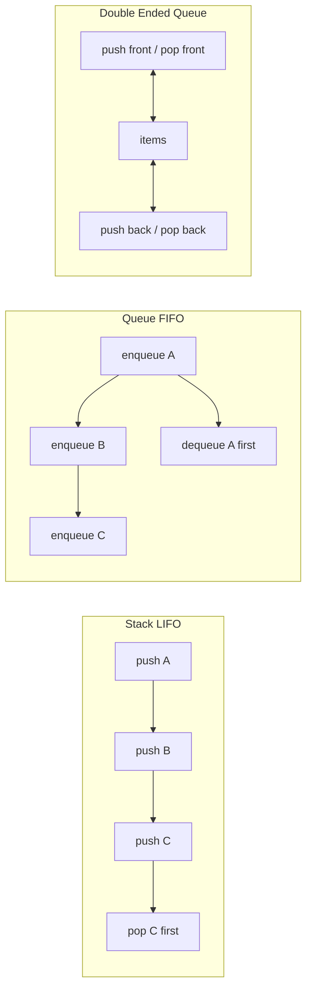
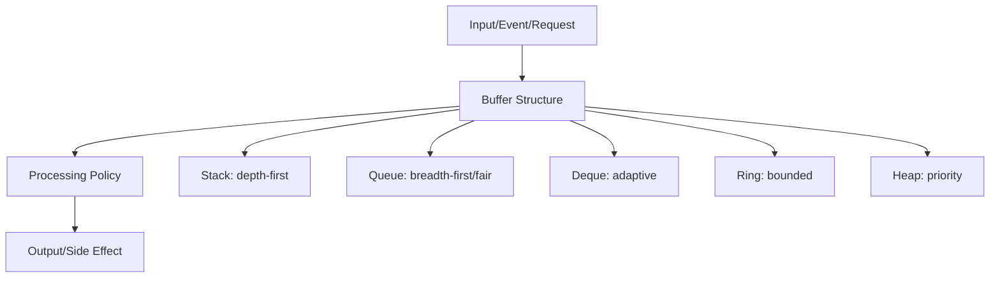
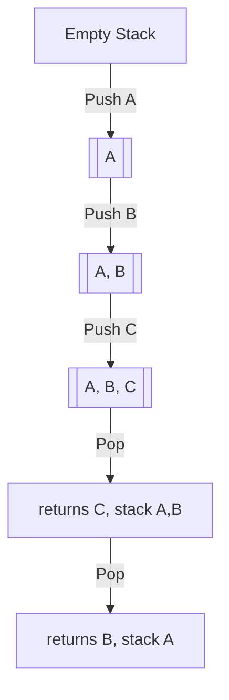
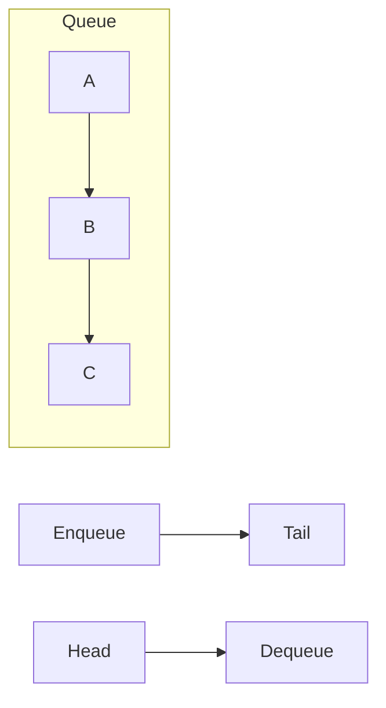
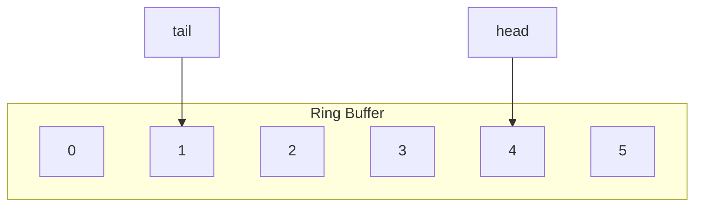
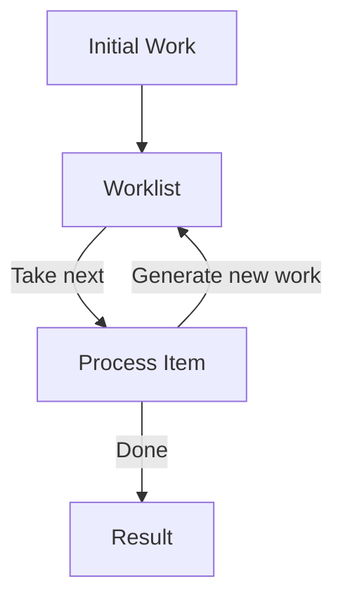
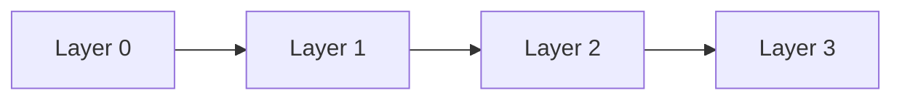
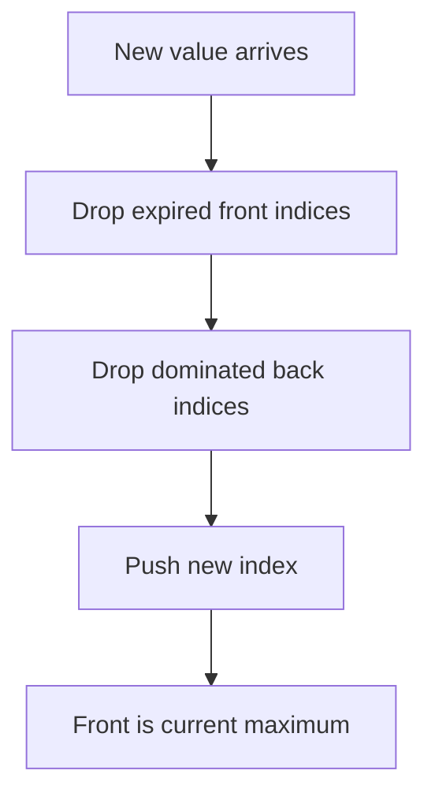
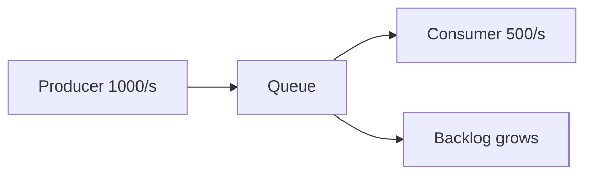
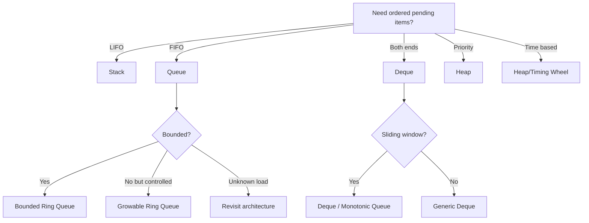

# learn-go-data-structure-algorithm-part-005.md

# Part 005 — Stack, Queue, Deque, dan Worklist Algorithms

> Seri: `learn-go-data-structure-algorithm`  
> Target pembaca: Java software engineer yang ingin menguasai Go data structure & algorithm pada level production/internal engineering handbook.  
> Fokus part ini: stack, queue, deque, ring buffer, worklist algorithms, bounded/unbounded buffering, invariant, memory safety, API design, dan penerapan production seperti BFS/DFS, scheduler, retry queue, sliding window, serta workflow traversal.

---

## 0. Posisi Part Ini Dalam Seri

Di part sebelumnya kita sudah membahas:

- Part 000: roadmap, mental model, dan batasan seri.
- Part 001: complexity model yang realistis di Go.
- Part 002: arrays, slices, dan sequence design.
- Part 003: maps, hash tables, dan associative data.
- Part 004: sorting, ordering, comparison, dan search.

Part ini mulai masuk ke kelompok struktur data linear yang sangat sering muncul di sistem nyata:

- stack,
- queue,
- deque,
- ring buffer,
- worklist.

Sekilas struktur ini terlihat mudah. Stack hanya LIFO. Queue hanya FIFO. Deque hanya bisa push/pop di dua ujung. Tetapi di production, pertanyaan yang menentukan kualitas desain bukan hanya “bagaimana implementasinya”, melainkan:

- siapa pemilik elemen di dalam struktur?
- apakah buffer bounded atau unbounded?
- apakah operasi harus stabil dan deterministic?
- apakah pop harus menghapus reference agar tidak menahan object besar?
- apakah API aman untuk zero value?
- apakah struktur akan dipakai single goroutine, shared dengan lock, atau disalurkan lewat channel?
- apakah growth strategy bisa menyebabkan latency spike?
- apakah traversal bisa berubah dari recursion menjadi iterative untuk menghindari stack depth risk?
- apakah queue menjadi tempat menumpuk backpressure yang tidak terlihat?

Tujuan part ini adalah membangun mental model agar stack/queue/deque tidak hanya dipahami sebagai “template DSA”, tetapi sebagai alat desain untuk mengontrol **urutan kerja, lifecycle data, memory retention, fairness, dan failure mode**.

---

## 1. Mental Model Utama

Stack, queue, dan deque adalah struktur data untuk mengatur **urutan konsumsi**.

Mereka menjawab pertanyaan:

> Dari kumpulan pekerjaan/data yang sudah masuk, item mana yang harus diproses berikutnya?

Jawaban tiap struktur berbeda:

| Struktur | Semantics | Ambil berikutnya dari | Cocok untuk |
|---|---:|---:|---|
| Stack | LIFO | item terakhir | DFS, undo, parser, nested state |
| Queue | FIFO | item pertama | BFS, work queue, event order, fairness sederhana |
| Deque | double-ended | depan atau belakang | sliding window, monotonic queue, hybrid BFS/DFS, scheduler internal |
| Ring buffer | bounded circular sequence | head/tail | fixed-capacity queue, telemetry buffer, smoothing, producer/consumer local buffer |
| Worklist | policy-driven pending set | tergantung policy | graph traversal, propagation, retry, incremental analysis |

Diagram dasarnya:



Dalam production, struktur ini biasanya bukan struktur isolated. Ia menjadi bagian dari pipeline:



Perhatikan: stack/queue/deque bukan hanya bentuk penyimpanan, tetapi **policy primitive**.

---

## 2. Dari Perspektif Java ke Go

Sebagai Java engineer, Anda mungkin terbiasa dengan:

- `ArrayDeque<E>` untuk stack/queue/deque,
- `LinkedList<E>` sebagai queue/list,
- `Stack<E>` lama yang synchronized dan umumnya dihindari,
- `PriorityQueue<E>` untuk heap,
- `BlockingQueue<E>` untuk concurrency.

Di Go, standard library tidak menyediakan generic `Stack[T]`, `Queue[T]`, atau `Deque[T]` sebagai tipe utama. Go memberi primitive yang lebih rendah:

- slice,
- map,
- channel,
- `container/list`,
- `container/ring`,
- `container/heap`,
- generics untuk membuat tipe sendiri.

Untuk part ini:

- kita tidak akan menjadikan `channel` sebagai default queue data structure;
- channel adalah primitive concurrency/synchronization, bukan replacement universal untuk queue;
- queue lokal single goroutine sering lebih baik dibuat dengan slice/ring buffer;
- queue shared bisa menggunakan mutex, shard, atau channel tergantung semantic.

Rujukan resmi yang relevan:

- Go 1.26 tetap mempertahankan Go 1 compatibility promise, sehingga desain dasar slice/container tetap stabil untuk materi ini: https://go.dev/doc/go1.26
- Standard library mencakup package `container/list`, `container/ring`, dan `container/heap`: https://pkg.go.dev/container
- `container/list` mengimplementasikan doubly linked list: https://pkg.go.dev/container/list
- `container/ring` mengimplementasikan circular list: https://pkg.go.dev/container/ring
- `container/heap` mengimplementasikan heap operations untuk priority queue: https://pkg.go.dev/container/heap
- Slice tetap menjadi cara utama Go untuk sequence data sebagaimana dijelaskan dalam Effective Go: https://go.dev/doc/effective_go#slices

---

## 3. Stack

### 3.1 Apa Itu Stack?

Stack adalah struktur data **Last-In, First-Out**.

Item terakhir yang masuk adalah item pertama yang keluar.

```text
push A
push B
push C
pop => C
pop => B
pop => A
```

Stack cocok ketika proses bersifat nested atau depth-first:

- call stack,
- DFS,
- undo/redo,
- expression parsing,
- bracket matching,
- backtracking,
- iterative traversal menggantikan recursion,
- nested transaction-like state,
- parser state.

### 3.2 Stack Invariant

Untuk stack berbasis slice:

```go
type Stack[T any] struct {
    items []T
}
```

Invariant:

```text
0 <= len(items) <= cap(items)
top item, jika ada, berada pada items[len(items)-1]
push menambah tepat satu item di akhir
pop menghapus tepat satu item dari akhir
urutan pop adalah kebalikan urutan push
```

Diagram:



### 3.3 Stack Minimal di Go

```go
package ds

type Stack[T any] struct {
	items []T
}

func (s *Stack[T]) Push(v T) {
	s.items = append(s.items, v)
}

func (s *Stack[T]) Len() int {
	return len(s.items)
}

func (s *Stack[T]) Empty() bool {
	return len(s.items) == 0
}

func (s *Stack[T]) Peek() (T, bool) {
	if len(s.items) == 0 {
		var zero T
		return zero, false
	}
	return s.items[len(s.items)-1], true
}

func (s *Stack[T]) Pop() (T, bool) {
	if len(s.items) == 0 {
		var zero T
		return zero, false
	}

	idx := len(s.items) - 1
	v := s.items[idx]

	var zero T
	s.items[idx] = zero // penting untuk melepas reference
	s.items = s.items[:idx]

	return v, true
}

func (s *Stack[T]) Clear() {
	var zero T
	for i := range s.items {
		s.items[i] = zero
	}
	s.items = s.items[:0]
}
```

### 3.4 Mengapa `s.items[idx] = zero` Penting?

Kalau `T` berisi pointer, slice, map, string besar yang merujuk backing memory, atau object graph besar, item yang sudah dipop bisa tetap tertahan oleh backing array slice.

Contoh masalah:

```go
func (s *Stack[*BigObject]) PopBad() (*BigObject, bool) {
	if len(s.items) == 0 {
		return nil, false
	}
	idx := len(s.items) - 1
	v := s.items[idx]
	s.items = s.items[:idx]
	return v, true
}
```

Secara logical item sudah keluar. Tetapi backing array masih menyimpan pointer lama pada slot `idx`, sehingga garbage collector masih bisa melihat object tersebut sebagai reachable selama backing array masih reachable.

Versi aman:

```go
func (s *Stack[*BigObject]) PopGood() (*BigObject, bool) {
	if len(s.items) == 0 {
		return nil, false
	}
	idx := len(s.items) - 1
	v := s.items[idx]
	s.items[idx] = nil
	s.items = s.items[:idx]
	return v, true
}
```

Ini bukan micro-optimization. Ini memory safety di level lifecycle.

### 3.5 Panic atau `(T, bool)`?

Ada dua gaya API:

```go
func (s *Stack[T]) Pop() (T, bool)
```

atau:

```go
func (s *Stack[T]) MustPop() T
```

Untuk production library, biasanya sediakan operasi aman:

```go
v, ok := s.Pop()
if !ok {
    // empty
}
```

Panic boleh untuk invariant internal yang seharusnya mustahil dilanggar, bukan untuk kondisi input biasa.

Contoh:

```go
func (s *Stack[T]) MustPop() T {
	v, ok := s.Pop()
	if !ok {
		panic("stack: pop from empty stack")
	}
	return v
}
```

Gunakan `MustPop` hanya saat caller sudah menjaga invariant.

### 3.6 Stack untuk DFS Iteratif

Recursive DFS:

```go
func dfs(n *Node) {
	if n == nil {
		return
	}
	visit(n)
	for _, child := range n.Children {
		dfs(child)
	}
}
```

Versi iterative:

```go
func DFS(root *Node, visit func(*Node)) {
	if root == nil {
		return
	}

	var stack Stack[*Node]
	stack.Push(root)

	for !stack.Empty() {
		n, _ := stack.Pop()
		visit(n)

		// Reverse agar urutan traversal sama dengan recursive pre-order.
		for i := len(n.Children) - 1; i >= 0; i-- {
			if n.Children[i] != nil {
				stack.Push(n.Children[i])
			}
		}
	}
}
```

Mengapa iterative DFS penting?

- menghindari recursion depth yang terlalu dalam,
- kontrol memory lebih eksplisit,
- mudah menambahkan cancellation,
- mudah menambahkan budget/limit,
- cocok untuk graph traversal production.

### 3.7 Stack untuk State Machine Exploration

Dalam regulatory workflow, graph/state machine dapat dieksplorasi depth-first:

```go
type StateID string

type Transition struct {
	From StateID
	To   StateID
	Name string
}

type StateGraph map[StateID][]Transition

func ReachableDFS(g StateGraph, start StateID) map[StateID]bool {
	seen := make(map[StateID]bool)
	var stack Stack[StateID]
	stack.Push(start)

	for !stack.Empty() {
		state, _ := stack.Pop()
		if seen[state] {
			continue
		}
		seen[state] = true

		for _, tr := range g[state] {
			if !seen[tr.To] {
				stack.Push(tr.To)
			}
		}
	}

	return seen
}
```

Invariant penting:

```text
seen[state] == true berarti state sudah diproses, bukan hanya sudah ditemukan.
stack berisi kandidat state yang belum tentu belum diproses.
duplicate dalam stack boleh jika dicegah oleh seen saat pop.
```

Kenapa duplicate dalam stack kadang diterima?

Karena lebih sederhana. Complexity bisa tetap baik untuk banyak kasus. Tetapi untuk graph sangat padat, bisa lebih efisien menandai saat push.

Versi mark-on-push:

```go
func ReachableDFSMarkOnPush(g StateGraph, start StateID) map[StateID]bool {
	seen := make(map[StateID]bool)
	var stack Stack[StateID]

	seen[start] = true
	stack.Push(start)

	for !stack.Empty() {
		state, _ := stack.Pop()

		for _, tr := range g[state] {
			if !seen[tr.To] {
				seen[tr.To] = true
				stack.Push(tr.To)
			}
		}
	}

	return seen
}
```

Trade-off:

| Strategy | Mark kapan? | Kelebihan | Kekurangan |
|---|---:|---|---|
| mark-on-pop | saat item diproses | simple untuk work retry | duplicate pending bisa banyak |
| mark-on-push | saat item dijadwalkan | menghindari duplicate work | kurang cocok jika work bisa gagal dan perlu dijadwalkan ulang |

---

## 4. Queue

### 4.1 Apa Itu Queue?

Queue adalah struktur data **First-In, First-Out**.

```text
enqueue A
enqueue B
enqueue C
dequeue => A
dequeue => B
dequeue => C
```

Queue cocok untuk:

- BFS,
- event order,
- simple scheduler,
- task queue,
- request buffer,
- retry list sederhana,
- producer-consumer local buffer,
- fairness dasar.

### 4.2 Queue Invariant

Untuk queue, invariant dasarnya:

```text
items masuk dari tail
items keluar dari head
urutan keluar sama dengan urutan masuk
length adalah jumlah item aktif
head tidak boleh melewati tail secara invalid
```

Diagram:



### 4.3 Queue Naif Berbasis Slice

Implementasi paling sederhana:

```go
type Queue[T any] struct {
	items []T
}

func (q *Queue[T]) Enqueue(v T) {
	q.items = append(q.items, v)
}

func (q *Queue[T]) Dequeue() (T, bool) {
	if len(q.items) == 0 {
		var zero T
		return zero, false
	}
	v := q.items[0]
	var zero T
	q.items[0] = zero
	q.items = q.items[1:]
	return v, true
}
```

Masalahnya: `q.items = q.items[1:]` membuat slice bergerak maju, tetapi backing array lama masih bisa tertahan. Untuk queue yang banyak enqueue/dequeue, ini bisa menyebabkan retained memory.

Contoh:

```text
capacity backing array = 1,000,000
len aktif tinggal 10
karena slice masih menunjuk ke backing array lama,
memori besar tetap tertahan.
```

### 4.4 Queue dengan Head Index

Alternatif:

```go
type SliceQueue[T any] struct {
	items []T
	head  int
}

func (q *SliceQueue[T]) Len() int {
	return len(q.items) - q.head
}

func (q *SliceQueue[T]) Empty() bool {
	return q.Len() == 0
}

func (q *SliceQueue[T]) Enqueue(v T) {
	q.items = append(q.items, v)
}

func (q *SliceQueue[T]) Dequeue() (T, bool) {
	if q.head >= len(q.items) {
		var zero T
		return zero, false
	}

	v := q.items[q.head]
	var zero T
	q.items[q.head] = zero
	q.head++

	// Compact saat prefix kosong terlalu besar.
	if q.head > 1024 && q.head*2 >= len(q.items) {
		copy(q.items, q.items[q.head:])
		newLen := len(q.items) - q.head
		for i := newLen; i < len(q.items); i++ {
			q.items[i] = zero
		}
		q.items = q.items[:newLen]
		q.head = 0
	}

	return v, true
}
```

Invariant:

```text
active items berada pada items[head:]
0 <= head <= len(items)
Len() = len(items) - head
slot yang sudah keluar harus dizero-kan
compact dilakukan untuk membatasi retained memory
```

Trade-off:

- Enqueue O(1) amortized.
- Dequeue O(1) amortized.
- Compact kadang O(n), tetapi jarang.
- Cocok untuk queue single goroutine dengan pertumbuhan moderat.

### 4.5 Queue dengan Ring Buffer

Untuk queue yang lebih stabil, ring buffer sering lebih baik.

Ring buffer memakai array/slice fixed atau growable dengan dua index:

- `head`: posisi item berikutnya untuk dequeue.
- `tail`: posisi slot berikutnya untuk enqueue.
- `len`: jumlah item aktif.

Diagram:



Ketika index sampai akhir array, ia wrap ke awal.

```go
type RingQueue[T any] struct {
	buf  []T
	head int
	tail int
	len  int
}

func NewRingQueue[T any](capacity int) *RingQueue[T] {
	if capacity < 0 {
		panic("queue: negative capacity")
	}
	return &RingQueue[T]{buf: make([]T, capacity)}
}

func (q *RingQueue[T]) Len() int {
	return q.len
}

func (q *RingQueue[T]) Cap() int {
	return len(q.buf)
}

func (q *RingQueue[T]) Empty() bool {
	return q.len == 0
}

func (q *RingQueue[T]) Enqueue(v T) {
	if q.len == len(q.buf) {
		q.grow()
	}
	q.buf[q.tail] = v
	q.tail = q.next(q.tail)
	q.len++
}

func (q *RingQueue[T]) Dequeue() (T, bool) {
	if q.len == 0 {
		var zero T
		return zero, false
	}
	v := q.buf[q.head]
	var zero T
	q.buf[q.head] = zero
	q.head = q.next(q.head)
	q.len--
	return v, true
}

func (q *RingQueue[T]) next(i int) int {
	if len(q.buf) == 0 {
		return 0
	}
	i++
	if i == len(q.buf) {
		return 0
	}
	return i
}

func (q *RingQueue[T]) grow() {
	oldCap := len(q.buf)
	newCap := 2 * oldCap
	if newCap == 0 {
		newCap = 4
	}

	newBuf := make([]T, newCap)
	for i := 0; i < q.len; i++ {
		newBuf[i] = q.buf[(q.head+i)%oldCap]
	}

	var zero T
	for i := range q.buf {
		q.buf[i] = zero
	}

	q.buf = newBuf
	q.head = 0
	q.tail = q.len
}
```

### 4.6 Ring Queue Invariant

```text
0 <= len <= cap(buf)
head adalah index item pertama jika len > 0
tail adalah index slot kosong berikutnya untuk enqueue
active item ke-i berada pada buf[(head+i)%cap]
ketika len == 0, head dan tail boleh sama
ketika len == cap, head dan tail juga bisa sama, sehingga len wajib disimpan
```

Tanpa field `len`, kondisi empty dan full sulit dibedakan jika `head == tail`.

### 4.7 Bounded Ring Queue

Production queue sering sebaiknya bounded.

```go
type BoundedRingQueue[T any] struct {
	buf  []T
	head int
	tail int
	len  int
}

func NewBoundedRingQueue[T any](capacity int) *BoundedRingQueue[T] {
	if capacity <= 0 {
		panic("queue: capacity must be positive")
	}
	return &BoundedRingQueue[T]{buf: make([]T, capacity)}
}

func (q *BoundedRingQueue[T]) TryEnqueue(v T) bool {
	if q.len == len(q.buf) {
		return false
	}
	q.buf[q.tail] = v
	q.tail++
	if q.tail == len(q.buf) {
		q.tail = 0
	}
	q.len++
	return true
}

func (q *BoundedRingQueue[T]) Dequeue() (T, bool) {
	if q.len == 0 {
		var zero T
		return zero, false
	}
	v := q.buf[q.head]
	var zero T
	q.buf[q.head] = zero
	q.head++
	if q.head == len(q.buf) {
		q.head = 0
	}
	q.len--
	return v, true
}
```

Bounded queue memaksa caller menghadapi kenyataan:

```text
kalau produksi lebih cepat daripada konsumsi, apa kebijakan sistem?
```

Pilihan policy:

| Policy | Behavior | Cocok untuk | Risiko |
|---|---|---|---|
| reject | enqueue gagal | request admission | caller harus handle |
| block | producer menunggu | backpressure sinkron | deadlock/latency |
| drop newest | item baru dibuang | telemetry lossy | kehilangan data terbaru |
| drop oldest | item lama dibuang | recent-state buffer | kehilangan order history |
| grow | kapasitas naik | batch internal | OOM jika tidak dibatasi |

Queue bukan hanya struktur data. Queue adalah tempat backpressure terkumpul.

---

## 5. Deque

### 5.1 Apa Itu Deque?

Deque adalah **double-ended queue**.

Operasi utama:

```text
PushFront
PushBack
PopFront
PopBack
```

Deque dapat menjadi:

- stack: `PushBack` + `PopBack`,
- queue: `PushBack` + `PopFront`,
- sliding window: push back, pop front,
- monotonic queue: push back dengan pruning, pop front dengan expiry,
- scheduler local queue: push/pop pada dua ujung.

### 5.2 Deque Berbasis Ring Buffer

```go
type Deque[T any] struct {
	buf  []T
	head int
	len  int
}

func NewDeque[T any](capacity int) *Deque[T] {
	if capacity < 0 {
		panic("deque: negative capacity")
	}
	return &Deque[T]{buf: make([]T, capacity)}
}

func (d *Deque[T]) Len() int {
	return d.len
}

func (d *Deque[T]) Empty() bool {
	return d.len == 0
}

func (d *Deque[T]) PushBack(v T) {
	if d.len == len(d.buf) {
		d.grow()
	}
	idx := d.physical(d.len)
	d.buf[idx] = v
	d.len++
}

func (d *Deque[T]) PushFront(v T) {
	if d.len == len(d.buf) {
		d.grow()
	}
	if len(d.buf) == 0 {
		d.grow()
	}
	d.head--
	if d.head < 0 {
		d.head = len(d.buf) - 1
	}
	d.buf[d.head] = v
	d.len++
}

func (d *Deque[T]) PopFront() (T, bool) {
	if d.len == 0 {
		var zero T
		return zero, false
	}
	v := d.buf[d.head]
	var zero T
	d.buf[d.head] = zero
	d.head++
	if d.head == len(d.buf) {
		d.head = 0
	}
	d.len--
	return v, true
}

func (d *Deque[T]) PopBack() (T, bool) {
	if d.len == 0 {
		var zero T
		return zero, false
	}
	idx := d.physical(d.len - 1)
	v := d.buf[idx]
	var zero T
	d.buf[idx] = zero
	d.len--
	return v, true
}

func (d *Deque[T]) Front() (T, bool) {
	if d.len == 0 {
		var zero T
		return zero, false
	}
	return d.buf[d.head], true
}

func (d *Deque[T]) Back() (T, bool) {
	if d.len == 0 {
		var zero T
		return zero, false
	}
	return d.buf[d.physical(d.len-1)], true
}

func (d *Deque[T]) physical(logical int) int {
	return (d.head + logical) % len(d.buf)
}

func (d *Deque[T]) grow() {
	oldCap := len(d.buf)
	newCap := oldCap * 2
	if newCap == 0 {
		newCap = 4
	}

	newBuf := make([]T, newCap)
	for i := 0; i < d.len; i++ {
		if oldCap == 0 {
			break
		}
		newBuf[i] = d.buf[(d.head+i)%oldCap]
	}

	var zero T
	for i := range d.buf {
		d.buf[i] = zero
	}

	d.buf = newBuf
	d.head = 0
}
```

### 5.3 Deque Invariant

```text
0 <= len <= cap(buf)
logical index i berada pada physical index (head+i)%cap
front adalah logical index 0
back adalah logical index len-1
push/pop di dua ujung mempertahankan urutan logical
```

### 5.4 Kapan Deque Lebih Baik Daripada Queue Biasa?

Deque dibutuhkan saat kita perlu memanipulasi dua ujung.

Contoh:

1. Sliding window maximum.
2. BFS 0-1 shortest path.
3. Scheduler local queue.
4. Undo/redo buffer.
5. Parser yang butuh lookahead/rollback.
6. Hybrid traversal.

---

## 6. Worklist Algorithms

### 6.1 Apa Itu Worklist?

Worklist adalah struktur yang menyimpan pekerjaan yang belum diproses.

Bentuknya bisa stack, queue, deque, heap, set, atau kombinasi.



Worklist muncul di banyak sistem:

- graph traversal,
- compiler analysis,
- dependency propagation,
- workflow validation,
- rule engine,
- retry processing,
- cache invalidation,
- impact analysis,
- permission inheritance resolution.

### 6.2 Worklist Invariant

Worklist yang baik harus menjawab:

```text
Apa arti item berada di worklist?
Apakah item boleh duplicate?
Kapan item dianggap done?
Apakah item yang gagal boleh masuk lagi?
Apakah order pemrosesan memengaruhi hasil?
Apakah hasil harus deterministic?
Bagaimana sistem berhenti?
```

Contoh invariant untuk graph reachability:

```text
worklist berisi node yang sudah ditemukan tetapi belum diproses
seen berisi node yang sudah ditemukan
setiap node masuk worklist maksimal sekali
loop selesai saat worklist kosong
hasil adalah semua node dalam seen
```

### 6.3 Queue-Based BFS Worklist

```go
type Graph[N comparable] map[N][]N

func BFS[N comparable](g Graph[N], start N, visit func(N)) {
	seen := make(map[N]bool)
	q := NewRingQueue[N](16)

	seen[start] = true
	q.Enqueue(start)

	for !q.Empty() {
		n, _ := q.Dequeue()
		visit(n)

		for _, next := range g[n] {
			if !seen[next] {
				seen[next] = true
				q.Enqueue(next)
			}
		}
	}
}
```

BFS memakai queue karena ingin memproses layer demi layer.



BFS cocok untuk:

- shortest path di unweighted graph,
- finding minimum number of transitions,
- discovering dependency layers,
- level-order traversal,
- spreading impact secara bertahap.

### 6.4 Stack-Based DFS Worklist

```go
func DFS[N comparable](g Graph[N], start N, visit func(N)) {
	seen := make(map[N]bool)
	var stack Stack[N]
	stack.Push(start)

	for !stack.Empty() {
		n, _ := stack.Pop()
		if seen[n] {
			continue
		}
		seen[n] = true
		visit(n)

		for i := len(g[n]) - 1; i >= 0; i-- {
			next := g[n][i]
			if !seen[next] {
				stack.Push(next)
			}
		}
	}
}
```

DFS cocok untuk:

- cycle detection,
- topological analysis,
- deep exploration,
- connected component,
- tree traversal,
- path existence.

### 6.5 Deque-Based 0-1 BFS

Untuk graph dengan edge weight hanya 0 atau 1, deque bisa dipakai untuk shortest path lebih efisien daripada Dijkstra heap.

```text
edge cost 0 => push front
edge cost 1 => push back
```

```go
type Edge[N comparable] struct {
	To   N
	Cost int // 0 or 1
}

type Weighted01Graph[N comparable] map[N][]Edge[N]

func ZeroOneBFS[N comparable](g Weighted01Graph[N], start N) map[N]int {
	const inf = int(^uint(0) >> 1)
	dist := make(map[N]int)
	for n := range g {
		dist[n] = inf
	}

	dq := NewDeque[N](16)
	dist[start] = 0
	dq.PushBack(start)

	for !dq.Empty() {
		n, _ := dq.PopFront()
		for _, e := range g[n] {
			nd := dist[n] + e.Cost
			if old, ok := dist[e.To]; !ok || nd < old {
				dist[e.To] = nd
				if e.Cost == 0 {
					dq.PushFront(e.To)
				} else {
					dq.PushBack(e.To)
				}
			}
		}
	}

	return dist
}
```

Ini contoh bahwa deque bukan sekadar struktur “tambahan”, tetapi bisa mengubah kelas algoritma.

---

## 7. Sliding Window dan Monotonic Queue

### 7.1 Sliding Window

Sliding window dipakai saat kita memproses sequence dengan rentang aktif bergerak.

Contoh:

- maksimum dalam 5 menit terakhir,
- jumlah request dalam 60 detik terakhir,
- last N events,
- consecutive pattern,
- moving average,
- fraud window,
- rate limiter.

Basic window dengan deque:

```text
push item baru ke belakang
hapus item lama dari depan
jawab query berdasarkan isi window
```

### 7.2 Monotonic Queue untuk Sliding Window Maximum

Problem:

> Diberikan array angka dan window size `k`, cari maksimum untuk setiap window.

Naif:

```text
untuk setiap window, scan k item => O(n*k)
```

Monotonic queue:

```text
simpan index dengan value menurun
front selalu maximum
setiap index masuk sekali dan keluar sekali
O(n)
```

Implementasi:

```go
func SlidingWindowMax(nums []int, k int) []int {
	if k <= 0 || len(nums) == 0 {
		return nil
	}
	if k > len(nums) {
		k = len(nums)
	}

	// Deque of indices. Values are monotonically decreasing.
	dq := NewDeque[int](k)
	out := make([]int, 0, len(nums)-k+1)

	for i, v := range nums {
		// Remove indices outside current window.
		for !dq.Empty() {
			front, _ := dq.Front()
			if front > i-k {
				break
			}
			dq.PopFront()
		}

		// Remove smaller/equal values from back.
		for !dq.Empty() {
			back, _ := dq.Back()
			if nums[back] > v {
				break
			}
			dq.PopBack()
		}

		dq.PushBack(i)

		if i >= k-1 {
			front, _ := dq.Front()
			out = append(out, nums[front])
		}
	}

	return out
}
```

Invariant:

```text
deque menyimpan index dalam urutan naik
nilai nums[index] dalam deque menurun dari depan ke belakang
front adalah index maximum window saat ini
index di luar window dibuang dari depan
index dengan nilai <= item baru dibuang dari belakang
```

Diagram:



### 7.3 Kenapa Setiap Elemen O(1) Amortized?

Setiap index:

- masuk deque sekali,
- keluar dari depan maksimal sekali,
- keluar dari belakang maksimal sekali.

Total operasi deque sepanjang array adalah O(n), bukan O(n*k).

Ini contoh penting dari amortized reasoning.

---

## 8. Queue dan Backpressure

### 8.1 Queue Sebagai Buffer Risiko

Queue sering dipakai untuk “menahan beban sementara”. Tetapi queue bukan menghilangkan beban. Queue hanya memindahkan beban ke memori dan waktu tunggu.



Jika producer lebih cepat dari consumer dalam waktu lama, unbounded queue akan tumbuh sampai:

- latency naik,
- memory naik,
- GC pressure naik,
- OOM,
- sistem restart,
- work hilang,
- retry storm.

### 8.2 Little's Law Intuition

Dalam queueing system:

```text
L = λ * W
```

- `L`: jumlah item rata-rata dalam sistem.
- `λ`: arrival rate.
- `W`: waktu rata-rata item berada dalam sistem.

Jika arrival rate naik atau processing time naik, queue length naik.

Misalnya:

```text
arrival = 100 req/s
average wait+service = 2 s
items in system ≈ 200
```

DSA engineer perlu memahami bahwa queue length bukan hanya angka internal. Ia adalah gejala mismatch antara load dan capacity.

### 8.3 Bounded Queue Sebagai Contract

Bounded queue mengatakan:

```text
Sistem hanya bersedia menahan N item.
Setelah itu, caller harus menerima explicit outcome.
```

Outcome bisa:

- rejected,
- retried later,
- blocked,
- dropped,
- persisted elsewhere.

Dalam service backend, bounded queue sering lebih jujur daripada unbounded queue.

---

## 9. Channel vs Queue

### 9.1 Channel Bukan Generic Queue Universal

Go channel adalah primitive untuk komunikasi antar goroutine.

Channel bisa berperilaku seperti bounded FIFO, tetapi membawa semantics tambahan:

- blocking send,
- blocking receive,
- close semantics,
- synchronization happens-before,
- select,
- goroutine scheduling,
- cancellation pattern.

Gunakan channel ketika Anda butuh komunikasi/concurrency semantics.

Gunakan queue biasa ketika Anda butuh data structure lokal.

### 9.2 Decision Table

| Use case | Struktur lebih cocok |
|---|---|
| BFS lokal dalam satu goroutine | ring queue/slice queue |
| parser iterative | stack slice |
| sliding window | deque/ring |
| worker pool communication | channel |
| shared mutable task buffer with custom policy | mutex + queue/deque |
| priority scheduling | heap |
| retry with time | heap/timing wheel |
| bounded telemetry buffer | ring buffer |

### 9.3 Anti-Pattern

```go
ch := make(chan Item, 1000000)
```

Ini sering tanda bahwa channel dipakai sebagai unbounded-ish queue. Risiko:

- memory spike,
- latency tersembunyi,
- sulit introspeksi policy,
- sulit melakukan compaction/drop oldest,
- cancellation/close menjadi rumit.

Bukan berarti channel buruk. Yang buruk adalah menggunakannya tanpa memikirkan buffering policy.

---

## 10. Linked List untuk Queue/Deque?

Go standard library memiliki `container/list`, yaitu doubly linked list.

Contoh queue dengan `container/list`:

```go
package ds

import "container/list"

type ListQueue[T any] struct {
	l *list.List
}

func NewListQueue[T any]() *ListQueue[T] {
	return &ListQueue[T]{l: list.New()}
}

func (q *ListQueue[T]) Enqueue(v T) {
	q.l.PushBack(v)
}

func (q *ListQueue[T]) Dequeue() (T, bool) {
	front := q.l.Front()
	if front == nil {
		var zero T
		return zero, false
	}
	q.l.Remove(front)
	v, ok := front.Value.(T)
	if !ok {
		var zero T
		return zero, false
	}
	return v, true
}
```

Tetapi ini memiliki beberapa kelemahan:

- `container/list` memakai `any` untuk `Value`, sehingga perlu type assertion.
- Setiap elemen adalah node terpisah, biasanya allocation per item.
- Pointer chasing buruk untuk cache locality.
- API tidak generic.

Untuk queue sederhana, slice/ring biasanya lebih baik.

Linked list tetap berguna ketika:

- perlu O(1) remove dari tengah dengan handle,
- perlu splice/move element,
- LRU cache map+list,
- intrusive lifecycle,
- item harus tetap stabil sebagai node.

Part khusus linked list akan dibahas di Part 006. Di part ini, kesimpulannya:

> Jangan memilih linked list hanya karena operasi pop-front terlihat O(1). Dalam praktik Go modern, ring buffer sering lebih baik untuk queue/deque biasa.

---

## 11. API Design untuk Stack/Queue/Deque

### 11.1 Zero Value Usability

Go menyukai zero value yang berguna.

Stack ini zero-value usable:

```go
var s Stack[int]
s.Push(1)
v, ok := s.Pop()
```

RingQueue dengan constructor tidak selalu zero-value usable jika membutuhkan kapasitas awal. Tapi bisa dibuat zero-value usable dengan grow saat enqueue:

```go
var q RingQueue[int]
q.Enqueue(1)
```

Decision:

| Struktur | Zero value mudah? | Catatan |
|---|---:|---|
| Stack slice | ya | `nil` slice bisa append |
| SliceQueue | ya | compact perlu hati-hati |
| Growable RingQueue | ya | grow dari zero cap |
| BoundedRingQueue | tidak ideal | butuh capacity explicit |
| Deque growable | ya, jika grow handle cap 0 | |
| Fixed ring | tidak | capacity adalah contract |

### 11.2 Naming

Gunakan nama yang mencerminkan semantics:

```go
Push / Pop        // stack
Enqueue / Dequeue // queue
PushFront / PushBack / PopFront / PopBack // deque
TryEnqueue        // bounded non-blocking
MustPop           // panic jika invariant dilanggar
Len / Empty / Cap // observability dasar
Clear             // release references logically
```

Hindari API ambigu:

```go
Add
Remove
Get
Take
```

Kecuali domain Anda memang punya semantic jelas.

### 11.3 Return Value

Untuk operasi yang bisa gagal karena kosong:

```go
func (q *Queue[T]) Dequeue() (T, bool)
```

Untuk bounded enqueue:

```go
func (q *Queue[T]) TryEnqueue(v T) bool
```

Untuk API yang harus memberi alasan:

```go
type EnqueueResult int

const (
	Enqueued EnqueueResult = iota
	RejectedFull
)
```

Jangan buru-buru memakai `error` jika hanya ada satu kondisi expected seperti empty/full. `bool` sering cukup.

### 11.4 Ownership dan Aliasing

Jika queue menyimpan pointer:

```go
q.Enqueue(&item)
```

Pertanyaan:

- apakah caller boleh mengubah object setelah enqueue?
- apakah consumer menerima ownership?
- apakah queue harus copy?
- apakah object boleh dipakai lagi setelah dequeue?

Untuk production library, dokumentasikan:

```text
Queue stores values as provided. If T contains pointers or mutable references,
caller is responsible for synchronization and ownership discipline.
```

### 11.5 Iterator atau Snapshot?

Queue/deque kadang perlu diinspeksi.

Opsi:

```go
func (q *RingQueue[T]) ForEach(fn func(T) bool)
```

atau:

```go
func (q *RingQueue[T]) Snapshot() []T
```

Trade-off:

| API | Kelebihan | Risiko |
|---|---|---|
| `ForEach` | no allocation | mutation during iteration harus dilarang |
| `Snapshot` | aman untuk caller | allocation/copy |
| expose internal slice | cepat | sangat berbahaya |

Untuk struktur reusable, jangan expose internal slice mutable kecuali Anda benar-benar mendesain ownership-nya.

---

## 12. Implementation Pitfalls

### 12.1 Tidak Menghapus Reference Saat Pop

Sudah dibahas, tapi penting diulang sebagai checklist:

```go
var zero T
buf[idx] = zero
```

Lakukan ini untuk:

- stack pop,
- queue dequeue,
- deque pop,
- clear,
- compaction.

### 12.2 Pop dari Slice Depan Tanpa Compaction

```go
q.items = q.items[1:]
```

Ini simple tetapi bisa menahan backing array besar.

Gunakan:

- head index + periodic compaction,
- ring buffer,
- copy ke slice baru jika perlu release memory.

### 12.3 Full dan Empty Tidak Bisa Dibedakan

Ring buffer tanpa `len`:

```text
head == tail bisa berarti empty atau full
```

Solusi:

- simpan `len`, atau
- sisakan satu slot kosong, atau
- simpan boolean `full`.

Simpan `len` biasanya paling jelas.

### 12.4 Modulo Cost Berlebihan

`(head+i)%cap` jelas dan benar. Untuk hot path, bisa ganti dengan branch:

```go
i++
if i == len(buf) {
    i = 0
}
```

Tapi jangan lakukan sebelum benchmark.

### 12.5 Infinite Worklist

Worklist yang menghasilkan work baru bisa tidak pernah selesai.

Contoh bug:

```go
for !q.Empty() {
    item := q.Dequeue()
    q.Enqueue(item) // tanpa state change
}
```

Checklist termination:

- apakah ada visited set?
- apakah ada max iteration?
- apakah ada state progress?
- apakah retry punya limit?
- apakah time budget/cancellation tersedia?

### 12.6 Duplicate Work Tidak Dikendalikan

Worklist graph tanpa seen set bisa explode.

```go
for _, next := range g[n] {
    q.Enqueue(next)
}
```

Jika graph punya cycle, loop tidak selesai.

### 12.7 Queue Menjadi Hidden Memory Leak

Unbounded queue dengan consumer lambat adalah memory leak yang “valid secara code”.

Tambahkan observability:

- current length,
- max length,
- enqueue rate,
- dequeue rate,
- oldest item age,
- rejection/drop count,
- processing latency.

---

## 13. Production Patterns

### 13.1 BFS untuk Workflow Layering

Misalnya state transition graph:

```go
type WorkflowState string

type WorkflowGraph map[WorkflowState][]WorkflowState

func Layers(g WorkflowGraph, start WorkflowState) map[WorkflowState]int {
	level := make(map[WorkflowState]int)
	q := NewRingQueue[WorkflowState](16)

	level[start] = 0
	q.Enqueue(start)

	for !q.Empty() {
		s, _ := q.Dequeue()
		for _, next := range g[s] {
			if _, ok := level[next]; ok {
				continue
			}
			level[next] = level[s] + 1
			q.Enqueue(next)
		}
	}

	return level
}
```

Ini berguna untuk:

- minimum transition count,
- escalation distance,
- “berapa langkah dari Draft ke Enforcement?”.

### 13.2 DFS untuk Cycle Detection Preparation

Cycle detection detail akan dibahas di graph part, tetapi stack mental model dimulai di sini.

```go
type Color uint8

const (
	White Color = iota
	Gray
	Black
)
```

Dalam DFS:

```text
White = belum dilihat
Gray = sedang dalam stack/path
Black = selesai
```

Cycle ditemukan jika edge menuju Gray.

### 13.3 Retry Work Queue

Queue sederhana untuk retry FIFO:

```go
type RetryItem struct {
	ID      string
	Attempt int
}

type RetryQueue struct {
	q *RingQueue[RetryItem]
}

func (r *RetryQueue) Add(id string) {
	r.q.Enqueue(RetryItem{ID: id, Attempt: 0})
}

func (r *RetryQueue) Requeue(item RetryItem, maxAttempt int) bool {
	item.Attempt++
	if item.Attempt > maxAttempt {
		return false
	}
	r.q.Enqueue(item)
	return true
}
```

Tetapi retry production biasanya butuh delay/backoff. Itu bukan queue biasa lagi; biasanya butuh heap/timing wheel yang akan dibahas di part scheduling/rate limiting.

### 13.4 Parser Stack

Bracket validation:

```go
func Balanced(s string) bool {
	var st Stack[rune]

	for _, r := range s {
		switch r {
		case '(', '[', '{':
			st.Push(r)
		case ')', ']', '}':
			open, ok := st.Pop()
			if !ok || !match(open, r) {
				return false
			}
		}
	}

	return st.Empty()
}

func match(open, close rune) bool {
	switch open {
	case '(':
		return close == ')'
	case '[':
		return close == ']'
	case '{':
		return close == '}'
	default:
		return false
	}
}
```

Invariant:

```text
stack berisi opening delimiter yang belum ditutup
setiap closing delimiter harus match top of stack
akhir input valid jika stack kosong
```

### 13.5 Undo Stack

```go
type Command interface {
	Do() error
	Undo() error
}

type UndoManager struct {
	done Stack[Command]
}

func (m *UndoManager) Execute(cmd Command) error {
	if err := cmd.Do(); err != nil {
		return err
	}
	m.done.Push(cmd)
	return nil
}

func (m *UndoManager) Undo() error {
	cmd, ok := m.done.Pop()
	if !ok {
		return nil
	}
	return cmd.Undo()
}
```

Production caveat:

- undo operation bisa gagal,
- command harus idempotent atau punya compensation semantics,
- external side effect sulit diundo,
- audit log tetap diperlukan.

---

## 14. Testing Stack/Queue/Deque

### 14.1 Stack Test

```go
func TestStackLIFO(t *testing.T) {
	var s Stack[int]

	for i := 0; i < 100; i++ {
		s.Push(i)
	}

	for i := 99; i >= 0; i-- {
		v, ok := s.Pop()
		if !ok {
			t.Fatalf("expected value")
		}
		if v != i {
			t.Fatalf("got %d, want %d", v, i)
		}
	}

	if !s.Empty() {
		t.Fatalf("stack should be empty")
	}
}
```

### 14.2 Queue Test

```go
func TestRingQueueFIFO(t *testing.T) {
	q := NewRingQueue[int](2)

	for i := 0; i < 100; i++ {
		q.Enqueue(i)
	}

	for i := 0; i < 100; i++ {
		v, ok := q.Dequeue()
		if !ok {
			t.Fatalf("expected value")
		}
		if v != i {
			t.Fatalf("got %d, want %d", v, i)
		}
	}

	if !q.Empty() {
		t.Fatalf("queue should be empty")
	}
}
```

### 14.3 Wraparound Test

Wraparound adalah sumber bug utama ring buffer.

```go
func TestRingQueueWraparound(t *testing.T) {
	q := NewRingQueue[int](4)

	for i := 0; i < 4; i++ {
		q.Enqueue(i)
	}

	for i := 0; i < 2; i++ {
		v, ok := q.Dequeue()
		if !ok || v != i {
			t.Fatalf("got %d %v, want %d true", v, ok, i)
		}
	}

	q.Enqueue(4)
	q.Enqueue(5)

	for _, want := range []int{2, 3, 4, 5} {
		v, ok := q.Dequeue()
		if !ok || v != want {
			t.Fatalf("got %d %v, want %d true", v, ok, want)
		}
	}
}
```

### 14.4 Deque Test

```go
func TestDequeBothEnds(t *testing.T) {
	d := NewDeque[int](2)
	d.PushBack(2)
	d.PushFront(1)
	d.PushBack(3)

	v, _ := d.PopFront()
	if v != 1 {
		t.Fatalf("got %d, want 1", v)
	}

	v, _ = d.PopBack()
	if v != 3 {
		t.Fatalf("got %d, want 3", v)
	}

	v, _ = d.PopFront()
	if v != 2 {
		t.Fatalf("got %d, want 2", v)
	}
}
```

### 14.5 Differential Testing

Bandingkan queue buatan sendiri dengan model sederhana.

```go
func TestQueueAgainstSliceModel(t *testing.T) {
	q := NewRingQueue[int](1)
	model := []int{}

	for i := 0; i < 10_000; i++ {
		if i%3 != 0 || len(model) == 0 {
			q.Enqueue(i)
			model = append(model, i)
			continue
		}

		got, ok := q.Dequeue()
		if !ok {
			t.Fatalf("queue empty unexpectedly")
		}
		want := model[0]
		model[0] = 0
		model = model[1:]

		if got != want {
			t.Fatalf("got %d, want %d", got, want)
		}
	}
}
```

### 14.6 Invariant Checking Helper

Untuk ring buffer, buat helper internal saat test:

```go
func assertQueueInvariant[T any](t *testing.T, q *RingQueue[T]) {
	t.Helper()
	if q.len < 0 || q.len > len(q.buf) {
		t.Fatalf("invalid len: %d cap=%d", q.len, len(q.buf))
	}
	if len(q.buf) == 0 {
		if q.len != 0 || q.head != 0 || q.tail != 0 {
			t.Fatalf("invalid zero-cap state")
		}
		return
	}
	if q.head < 0 || q.head >= len(q.buf) {
		t.Fatalf("invalid head")
	}
	if q.tail < 0 || q.tail >= len(q.buf) {
		t.Fatalf("invalid tail")
	}
}
```

Invariant test lebih bernilai daripada sekadar contoh input/output.

---

## 15. Benchmarking

### 15.1 Benchmark Stack Push/Pop

```go
func BenchmarkStackPushPop(b *testing.B) {
	var s Stack[int]
	for i := 0; i < b.N; i++ {
		s.Push(i)
		_, _ = s.Pop()
	}
}
```

### 15.2 Benchmark Queue Enqueue/Dequeue

```go
func BenchmarkRingQueueEnqueueDequeue(b *testing.B) {
	q := NewRingQueue[int](1024)
	b.ResetTimer()

	for i := 0; i < b.N; i++ {
		q.Enqueue(i)
		_, _ = q.Dequeue()
	}
}
```

### 15.3 Benchmark Burst

Single enqueue/dequeue terlalu ideal. Production sering bursty.

```go
func BenchmarkRingQueueBurst(b *testing.B) {
	const burst = 1024
	q := NewRingQueue[int](burst)
	b.ResetTimer()

	for i := 0; i < b.N; i++ {
		for j := 0; j < burst; j++ {
			q.Enqueue(j)
		}
		for j := 0; j < burst; j++ {
			_, _ = q.Dequeue()
		}
	}
}
```

### 15.4 Apa yang Diukur?

Untuk stack/queue/deque, ukur:

- ns/op,
- B/op,
- allocs/op,
- behavior saat grow,
- behavior saat wraparound,
- retained memory setelah drain,
- p95/p99 jika dipakai dalam loop service,
- throughput untuk workload bursty.

Benchmark yang baik harus mewakili pola pemakaian:

| Workload | Pattern |
|---|---|
| parser | push/pop interleaved |
| BFS | burst enqueue lalu gradual dequeue |
| worker buffer | concurrent-ish arrival/drain pattern |
| sliding window | push back + pop front terus menerus |
| telemetry | bounded overwrite/drop |

---

## 16. Complexity Summary

| Struktur | Operasi | Complexity | Catatan |
|---|---|---:|---|
| Stack slice | Push | O(1) amortized | append bisa grow |
| Stack slice | Pop | O(1) | zero slot untuk release reference |
| Slice queue naive | Dequeue front | O(1) logical | retained backing array risk |
| Slice queue with compact | Enqueue/Dequeue | O(1) amortized | compact sesekali O(n) |
| Ring queue growable | Enqueue/Dequeue | O(1) amortized | grow O(n) |
| Ring queue bounded | TryEnqueue/Dequeue | O(1) | full harus diputuskan policy |
| Deque ring | Push/Pop both ends | O(1) amortized | grow O(n) |
| Linked list queue | Push/Pop ends | O(1) | allocation/pointer chasing |

---

## 17. Failure Mode Matrix

| Failure mode | Struktur terdampak | Penyebab | Mitigasi |
|---|---|---|---|
| retained memory | stack/queue/deque | slot tidak dizero-kan | assign zero saat remove |
| unbounded growth | queue/worklist | producer > consumer | bounded queue, backpressure |
| infinite traversal | worklist graph | tidak ada visited/limit | seen set, budget, cancellation |
| order bug | stack/queue/deque | salah ujung push/pop | test LIFO/FIFO/wraparound |
| duplicate work explosion | worklist | mark-on-pop pada graph padat | mark-on-push atau pending set |
| latency spike | growable buffer | reallocation/copy | prealloc, bounded, amortized analysis |
| wrong empty/full | ring buffer | head==tail ambiguity | simpan len/full flag |
| unsafe sharing | semua | dipakai multi goroutine tanpa sync | mutex/channel/ownership discipline |
| hidden drop | bounded lossy queue | policy tidak diekspos | explicit result/metrics |

---

## 18. Decision Framework

Gunakan pertanyaan berikut:



Rule of thumb:

1. Untuk stack: pakai slice.
2. Untuk queue sederhana: pakai ring buffer atau slice+head+compact.
3. Untuk deque: pakai ring deque.
4. Untuk queue production lintas goroutine: tentukan dulu semantics, baru pilih channel/mutex queue.
5. Untuk priority: pakai heap, bukan queue.
6. Untuk delayed retry: pakai heap/timing wheel, bukan FIFO queue biasa.
7. Untuk unbounded queue: berhenti dan minta alasan kuat.

---

## 19. Engineering Review Checklist

Sebelum merge struktur stack/queue/deque, jawab:

### Correctness

- Apakah semantics LIFO/FIFO/deque jelas?
- Apakah empty behavior jelas?
- Apakah full behavior jelas jika bounded?
- Apakah wraparound dites?
- Apakah grow dites?
- Apakah order deterministic?
- Apakah duplicate work memang boleh?

### Memory

- Apakah slot yang dihapus dizero-kan?
- Apakah backing array besar bisa tertahan?
- Apakah ada Clear/Reset?
- Apakah preallocation diperlukan?
- Apakah bounded capacity lebih aman?

### API

- Apakah zero value usable?
- Apakah nama method jelas?
- Apakah expose internal buffer dihindari?
- Apakah ownership elemen terdokumentasi?
- Apakah panic hanya untuk invariant violation?

### Production

- Apakah queue length dimonitor?
- Apakah drop/reject count dimonitor?
- Apakah oldest item age dimonitor?
- Apakah ada cancellation/budget untuk worklist?
- Apakah ada strategi saat consumer lambat?

---

## 20. Latihan Bertahap

### Latihan 1 — Implement Stack Generic

Buat:

```go
type Stack[T any] struct
```

Dengan:

- Push,
- Pop,
- Peek,
- Len,
- Empty,
- Clear.

Test:

- empty pop,
- LIFO,
- clear,
- pointer release dengan finalizer atau memory profile sederhana.

### Latihan 2 — Implement Bounded Ring Queue

Buat queue fixed capacity:

- `TryEnqueue(T) bool`,
- `Dequeue() (T, bool)`,
- `Len()`,
- `Cap()`,
- `Empty()`,
- `Full()`.

Test:

- capacity 1,
- wraparound,
- full,
- empty,
- alternating enqueue/dequeue.

### Latihan 3 — Implement Growable Deque

Buat deque generic:

- PushFront,
- PushBack,
- PopFront,
- PopBack,
- Front,
- Back.

Test:

- push dua arah,
- pop dua arah,
- grow,
- wraparound.

### Latihan 4 — BFS Workflow Reachability

Diberikan graph state transition, cari semua state reachable dari start.

Tambahkan:

- visited set,
- layer distance,
- deterministic traversal dengan sorting adjacency jika perlu.

### Latihan 5 — Sliding Window Maximum

Implement `SlidingWindowMax(nums []int, k int) []int` memakai deque.

Test:

- k=1,
- k=len(nums),
- duplicate values,
- increasing sequence,
- decreasing sequence,
- empty input.

---

## 21. Anti-Patterns

### Anti-Pattern 1 — Queue Tanpa Policy

```go
var q []Task
q = append(q, task)
```

Jika tidak ada limit, tidak ada metric, dan tidak ada backpressure, ini bukan desain queue; ini backlog tak terkendali.

### Anti-Pattern 2 — Linked List Karena “O(1)”

Linked list pop-front memang O(1), tetapi allocation dan cache locality bisa jauh lebih buruk daripada ring buffer.

### Anti-Pattern 3 — Channel Besar Sebagai Storage

```go
make(chan Event, 1_000_000)
```

Ini sering menyembunyikan masalah capacity.

### Anti-Pattern 4 — DFS Recursive Tanpa Depth Bound

Untuk input eksternal atau graph besar, recursion depth bisa menjadi risiko.

### Anti-Pattern 5 — Worklist Tanpa Seen Set

Graph traversal tanpa seen set pada graph cyclic bisa infinite.

### Anti-Pattern 6 — Tidak Menghapus Reference

Pop tanpa zeroing bisa menahan object graph besar.

---

## 22. Production Case Study: Queue untuk Validasi Workflow

### 22.1 Problem

Kita punya lifecycle case:

```text
Draft -> Submitted -> Screening -> Investigation -> Enforcement -> Closed
```

Dengan beberapa branch:

```text
Submitted -> Rejected
Investigation -> Appeal
Appeal -> Investigation
```

Kita ingin:

- menemukan semua state reachable dari `Draft`,
- menghitung minimum transition count,
- mendeteksi state yang tidak reachable,
- memastikan traversal tidak infinite meskipun ada cycle.

### 22.2 Model

```go
type State string

type Transition struct {
	From State
	To   State
	Name string
}

type Workflow struct {
	States      []State
	Transitions []Transition
}
```

### 22.3 Build Adjacency

```go
func BuildGraph(w Workflow) map[State][]State {
	g := make(map[State][]State, len(w.States))
	for _, s := range w.States {
		g[s] = nil
	}
	for _, tr := range w.Transitions {
		g[tr.From] = append(g[tr.From], tr.To)
	}
	return g
}
```

### 22.4 BFS Analysis

```go
func MinTransitionDistance(g map[State][]State, start State) map[State]int {
	dist := make(map[State]int)
	q := NewRingQueue[State](16)

	dist[start] = 0
	q.Enqueue(start)

	for !q.Empty() {
		s, _ := q.Dequeue()
		for _, next := range g[s] {
			if _, ok := dist[next]; ok {
				continue
			}
			dist[next] = dist[s] + 1
			q.Enqueue(next)
		}
	}

	return dist
}
```

### 22.5 Detect Unreachable

```go
func Unreachable(states []State, dist map[State]int) []State {
	out := make([]State, 0)
	for _, s := range states {
		if _, ok := dist[s]; !ok {
			out = append(out, s)
		}
	}
	return out
}
```

### 22.6 Why Queue Matters

BFS queue memberi minimum number of transitions pada unweighted graph.

Jika memakai stack DFS, kita tetap bisa menemukan reachable states, tetapi jarak pertama yang ditemukan belum tentu minimum.

Ini contoh pemilihan struktur data berdampak pada semantics, bukan hanya performance.

---

## 23. Ring Buffer Variants

### 23.1 Fixed Capacity Rejecting Ring

- cocok untuk admission control,
- tidak kehilangan data secara diam-diam,
- caller menerima `false` saat full.

### 23.2 Overwriting Ring

- saat full, item terlama diganti,
- cocok untuk telemetry terbaru,
- tidak cocok untuk task yang wajib diproses.

```go
func (q *BoundedRingQueue[T]) EnqueueDropOldest(v T) (dropped bool) {
	if q.len == len(q.buf) {
		var zero T
		q.buf[q.head] = zero
		q.head++
		if q.head == len(q.buf) {
			q.head = 0
		}
		q.len--
		dropped = true
	}
	_ = q.TryEnqueue(v)
	return dropped
}
```

### 23.3 Sampling Ring

- simpan last N samples,
- query snapshot untuk debugging,
- cocok untuk in-memory diagnostics.

### 23.4 Batch Drain

Untuk mengurangi overhead consumer:

```go
func (q *RingQueue[T]) DrainTo(dst []T, max int) []T {
	for max > 0 && !q.Empty() {
		v, _ := q.Dequeue()
		dst = append(dst, v)
		max--
	}
	return dst
}
```

Batch drain berguna untuk worker yang memproses item dalam chunk.

---

## 24. Catatan Tentang Concurrency

Part ini bukan mengulang seri concurrency. Namun stack/queue/deque sering salah dipakai lintas goroutine.

Rule sederhana:

```text
Semua struktur di part ini tidak thread-safe kecuali disebutkan eksplisit.
```

Jika perlu shared queue:

```go
type LockedQueue[T any] struct {
	mu sync.Mutex
	q  RingQueue[T]
}

func (l *LockedQueue[T]) Enqueue(v T) {
	l.mu.Lock()
	defer l.mu.Unlock()
	l.q.Enqueue(v)
}

func (l *LockedQueue[T]) Dequeue() (T, bool) {
	l.mu.Lock()
	defer l.mu.Unlock()
	return l.q.Dequeue()
}
```

Tetapi ini hanya mutual exclusion. Ia belum memberi:

- blocking wait,
- condition variable,
- cancellation,
- close semantics,
- fairness antar producer.

Jika butuh itu, pertimbangkan channel atau condition variable. Tetapi desain concurrency detail ada di seri concurrency dan part concurrent data structures nanti.

---

## 25. Ring Buffer dan Observability

Untuk production queue, minimal expose stats:

```go
type QueueStats struct {
	Len      int
	Capacity int
	Dropped  uint64
	Rejected uint64
}
```

Namun hati-hati:

- stats harus konsisten jika concurrent,
- counter harus atomic atau dilindungi lock,
- jangan membuat observability mengubah invariant.

Metrics yang berguna:

```text
queue_len
queue_capacity
queue_enqueue_total
queue_dequeue_total
queue_rejected_total
queue_dropped_total
queue_oldest_age_seconds
queue_processing_latency_seconds
```

Oldest age sering lebih penting daripada length.

Queue dengan 10 item bisa buruk jika item tertua sudah menunggu 30 menit.

---

## 26. Hubungan dengan Part Berikutnya

Part berikutnya adalah:

```text
learn-go-data-structure-algorithm-part-006.md
Part 006 — Linked List, Intrusive List, dan Pointer-Chasing Trade-off
```

Part ini sengaja belum mendalami linked list karena queue/deque production di Go sering lebih baik dimulai dari slice/ring buffer. Di Part 006, kita akan membahas kapan linked list memang layak, terutama:

- O(1) remove dengan handle,
- LRU cache,
- intrusive list,
- lifecycle ownership,
- pointer chasing,
- cache locality,
- `container/list`,
- `container/ring`,
- anti-pattern linked list.

---

## 27. Ringkasan Final

Stack, queue, deque, dan worklist adalah struktur kecil dengan konsekuensi besar.

Mental model utama:

```text
Stack = LIFO = depth-first/nested state
Queue = FIFO = breadth-first/fair order
Deque = both ends = adaptive/window/specialized traversal
Ring buffer = bounded/circular memory discipline
Worklist = algorithmic pending-state policy
```

Pelajaran penting:

1. Stack berbasis slice adalah default yang baik di Go.
2. Queue naif dengan `items = items[1:]` bisa menahan backing array besar.
3. Queue production sebaiknya memakai ring buffer atau head-index dengan compaction.
4. Deque berguna untuk sliding window, monotonic queue, dan algoritma khusus.
5. Worklist harus punya invariant tentang duplicate, visited, retry, dan termination.
6. Bounded queue adalah bentuk desain yang lebih jujur daripada unbounded queue.
7. Channel adalah concurrency primitive, bukan pengganti universal untuk queue data structure.
8. Pop/remove harus membersihkan reference agar tidak menahan memory.
9. Test harus mencakup order, empty/full, grow, wraparound, dan invariant.
10. Queue length harus dipantau di production, tetapi oldest age sering lebih penting.

Jika Anda memahami part ini dengan benar, Anda tidak hanya bisa mengimplementasikan stack/queue/deque, tetapi juga bisa menjawab pertanyaan arsitektural:

> “Apa yang terjadi ketika pekerjaan datang lebih cepat daripada bisa diproses?”

Dan itu adalah pertanyaan yang jauh lebih production-grade daripada sekadar “bagaimana membuat queue”.

---

## 28. Referensi

- Go 1.26 Release Notes — https://go.dev/doc/go1.26
- Go Release History — https://go.dev/doc/devel/release
- Effective Go: Slices — https://go.dev/doc/effective_go#slices
- Go Standard Library — https://pkg.go.dev/std
- Package `container` — https://pkg.go.dev/container
- Package `container/list` — https://pkg.go.dev/container/list
- Package `container/ring` — https://pkg.go.dev/container/ring
- Package `container/heap` — https://pkg.go.dev/container/heap
- Package `testing` — https://pkg.go.dev/testing

<!-- NAVIGATION_FOOTER -->
<div class="page-nav">
<a href="./learn-go-data-structure-algorithm-part-004.md">⬅️ Part 004 — Sorting, Ordering, Comparison, dan Search</a>
<a href="./index.md">📚 Kategori</a>
<a href="../../index.md">🏠 Home</a>
<a href="./learn-go-data-structure-algorithm-part-006.md">Part 006 — Linked List, Intrusive List, dan Pointer-Chasing Trade-off ➡️</a>
</div>
