# learn-go-data-structure-algorithm-part-006.md

# Part 006 — Linked List, Intrusive List, dan Pointer-Chasing Trade-off

> Seri: **learn-go-data-structure-algorithm**  
> Part: **006 / 034**  
> Target Go: **Go 1.26.x**  
> Fokus: linked list sebagai struktur data, bukan sebagai nostalgia OOP/Java collection. Kita akan membedah kapan linked list berguna, kapan buruk, bagaimana Go standard library memodelkannya, bagaimana desain intrusive list bekerja, dan bagaimana menilai trade-off pointer chasing terhadap cache locality, GC, API safety, dan invariant production.

---

## 0. Posisi Part Ini dalam Seri

Pada part sebelumnya kita sudah membahas:

- slice sebagai sequence utama,
- map sebagai associative data,
- sorting/search,
- stack/queue/deque/worklist.

Sekarang kita masuk ke keluarga struktur data yang sering disalahpahami: **linked list**.

Di banyak materi algoritma klasik, linked list sering diperkenalkan sangat awal seolah-olah ia adalah struktur data fundamental yang harus sering dipakai. Di Go production code, realitasnya berbeda:

> **Linked list adalah alat khusus, bukan default collection.**

Default collection di Go biasanya:

- `[]T` untuk urutan data,
- `map[K]V` untuk lookup,
- kombinasi `map + slice` untuk index/order sederhana,
- `heap` untuk priority,
- struktur custom ketika invariant lebih spesifik.

Linked list mulai masuk akal ketika kita butuh **handle-based O(1) removal/reordering** tanpa memindahkan elemen lain.

Contoh nyata:

- LRU cache: `map[key]*Element + doubly linked list`,
- scheduler queue dengan node yang perlu dipindah antar queue,
- intrusive lifecycle list,
- object pool internal,
- wait queue internal,
- ring/circular list untuk round-robin pointer traversal,
- struktur internal yang mengutamakan stabilitas alamat node.

Namun jika kebutuhan hanya “menyimpan banyak item dan diiterasi”, linked list biasanya kalah dari slice karena:

- buruk untuk cache locality,
- banyak pointer,
- banyak allocation,
- membuat GC harus menelusuri banyak object,
- tidak bisa memakai `range` secara natural seperti slice,
- traversal membutuhkan pointer chasing.

---

## 1. Learning Objectives

Setelah part ini, target pemahaman Anda:

1. Mampu menjelaskan kenapa linked list jarang menjadi pilihan default di Go.
2. Mampu membedakan:
   - singly linked list,
   - doubly linked list,
   - circular linked list,
   - intrusive linked list,
   - non-intrusive linked list.
3. Mampu menggunakan `container/list` dan `container/ring` dengan benar.
4. Mampu mendesain linked list generic yang type-safe.
5. Mampu menjelaskan trade-off pointer chasing terhadap CPU cache, branch, allocation, dan GC.
6. Mampu menerapkan linked list untuk LRU-style structure.
7. Mampu mendesain API yang aman dari invalid handle, double remove, stale element, dan ownership ambiguity.
8. Mampu memilih antara slice, linked list, ring buffer, heap, map, dan tree berdasarkan operasi dominan.

---

## 2. Core Mental Model

Linked list menyimpan urutan elemen bukan melalui indeks numerik, tetapi melalui **link/pointer antar node**.

### 2.1 Slice Sequence

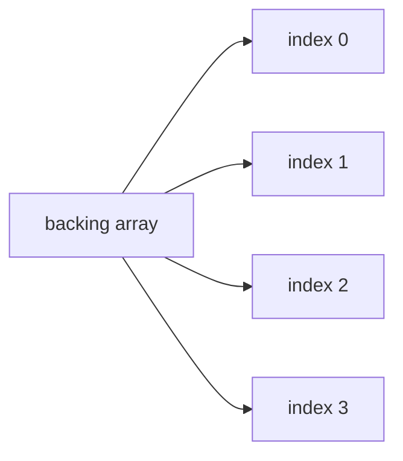

Pada slice:

- elemen biasanya tersimpan berdekatan dalam backing array,
- akses by index O(1),
- iterasi sangat cache-friendly,
- insert/delete di tengah perlu menggeser elemen,
- append amortized O(1).

### 2.2 Linked List Sequence

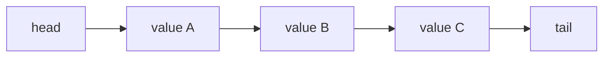

Pada linked list:

- node bisa tersebar di heap,
- setiap node menyimpan value + pointer ke node lain,
- akses ke posisi ke-N O(n),
- insert/delete jika node sudah diketahui bisa O(1),
- traversal cenderung lebih mahal karena pointer chasing.

Kunci pemahamannya:

> Linked list tidak memberi O(1) delete “berdasarkan value”. Linked list memberi O(1) delete **jika Anda sudah memegang pointer/handle ke node-nya**.

Ini sering menjadi sumber salah kaprah.

---

## 3. Operasi Dasar dan Kompleksitas

| Operasi | Slice | Singly List | Doubly List |
|---|---:|---:|---:|
| Akses by index | O(1) | O(n) | O(n) |
| Iterasi penuh | O(n), cache-friendly | O(n), pointer chasing | O(n), pointer chasing |
| Append belakang | amortized O(1) | O(1) jika punya tail | O(1) jika punya tail |
| Insert depan | O(n) shift | O(1) | O(1) |
| Insert tengah by index | O(n) | O(n) find + O(1) insert | O(n) find + O(1) insert |
| Insert sebelum/sesudah node diketahui | O(n) atau shift | O(1) after, before butuh prev | O(1) |
| Delete by index | O(n) shift | O(n) find | O(n) find |
| Delete by node handle | tidak natural | O(1) jika punya prev atau special trick | O(1) |
| Memory overhead | rendah | pointer next per node | prev + next per node |
| Cache locality | tinggi | rendah | rendah |
| GC scan cost | tergantung T | tinggi jika banyak node pointer | lebih tinggi |

Kesimpulan awal:

- Slice unggul untuk **scan, random access, compact data, batch processing**.
- Linked list unggul untuk **O(1) unlink/relink dengan handle stabil**.

---

## 4. Mengapa Linked List Sering Buruk di Go

Sebagai Java engineer, mungkin Anda terbiasa melihat `LinkedList`, `ArrayList`, `HashMap`, `TreeMap`, dan collection hierarchy lain. Di Go, desain collection jauh lebih minimalis. Itu bukan kekurangan; itu bagian dari philosophy Go: gunakan primitive sederhana, buat abstraction ketika invariant benar-benar perlu.

Linked list sering buruk bukan karena Big-O-nya salah, tetapi karena **model biaya riil modern hardware**.

### 4.1 Pointer Chasing

Linked list traversal kira-kira seperti ini:

```go
for n := head; n != nil; n = n.next {
    consume(n.value)
}
```

CPU tidak melihat array linear yang bisa diprefetch mudah. Ia harus:

1. baca pointer node sekarang,
2. dereference ke alamat node,
3. baca pointer `next`,
4. lompat ke lokasi memory lain,
5. ulangi.

Jika node tersebar, setiap lompatan bisa menyebabkan cache miss.

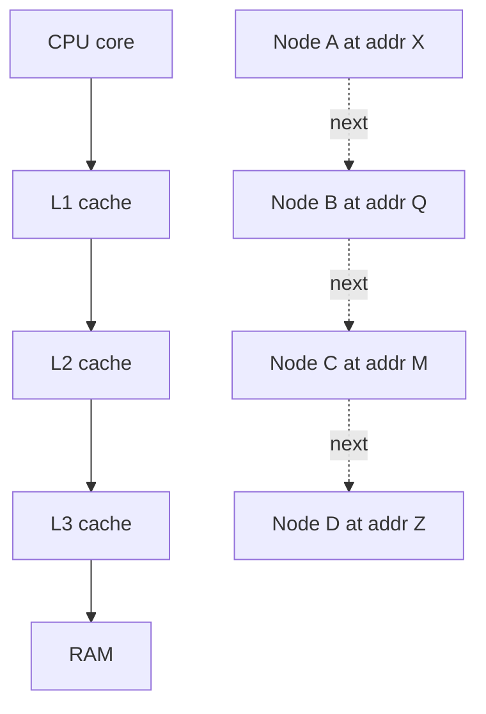

Slice traversal lebih seperti:

```go
for i := range xs {
    consume(xs[i])
}
```

Data cenderung contiguous, CPU prefetcher lebih efektif.

### 4.2 Banyak Allocation

Linked list non-intrusive biasanya membuat satu object node per elemen:

```go
type node[T any] struct {
    value T
    next  *node[T]
}
```

Jika Anda memasukkan 1 juta item, bisa ada 1 juta node allocation.

Dampaknya:

- allocator lebih sibuk,
- heap lebih fragmented,
- GC root/graph lebih besar,
- pointer scanning lebih mahal,
- locality lebih buruk.

### 4.3 Interface Boxing pada `container/list`

`container/list` di standard library menyimpan value sebagai `any`:

```go
type Element struct {
    next, prev *Element
    list       *List
    Value      any
}
```

Konsekuensinya:

- tidak type-safe secara compile-time,
- perlu type assertion saat mengambil value,
- value tertentu bisa menyebabkan boxing/allocation tergantung konteks,
- API lebih fleksibel tetapi kurang ideal untuk hot path generic modern.

`container/list` tetap berguna, tetapi untuk struktur data production yang hot, Anda sering ingin wrapper generic atau implementasi khusus.

### 4.4 Tidak Ada Random Access

Linked list tidak cocok untuk:

- pagination by offset,
- binary search,
- index lookup,
- batch vectorized processing,
- sorting in-place sederhana,
- stable dense iteration.

Jika use case Anda butuh `items[i]`, linked list hampir pasti salah.

---

## 5. Singly Linked List

Singly linked list punya satu pointer: `next`.

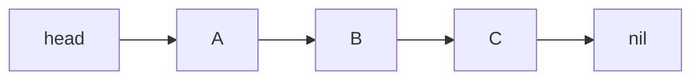

### 5.1 Struktur Minimal

```go
type singlyNode[T any] struct {
    value T
    next  *singlyNode[T]
}

type SinglyList[T any] struct {
    head *singlyNode[T]
    tail *singlyNode[T]
    len  int
}
```

### 5.2 Operasi PushFront

```go
func (l *SinglyList[T]) PushFront(v T) {
    n := &singlyNode[T]{value: v, next: l.head}
    l.head = n
    if l.tail == nil {
        l.tail = n
    }
    l.len++
}
```

Invariant:

- jika `len == 0`, maka `head == nil` dan `tail == nil`,
- jika `len == 1`, maka `head == tail`,
- jika `tail != nil`, maka `tail.next == nil`.

### 5.3 Operasi PushBack

```go
func (l *SinglyList[T]) PushBack(v T) {
    n := &singlyNode[T]{value: v}
    if l.tail == nil {
        l.head = n
        l.tail = n
    } else {
        l.tail.next = n
        l.tail = n
    }
    l.len++
}
```

Tanpa `tail`, `PushBack` akan O(n). Dengan `tail`, O(1).

### 5.4 PopFront

```go
func (l *SinglyList[T]) PopFront() (T, bool) {
    if l.head == nil {
        var zero T
        return zero, false
    }

    n := l.head
    l.head = n.next
    if l.head == nil {
        l.tail = nil
    }
    l.len--

    n.next = nil // detach for GC/lifecycle clarity
    return n.value, true
}
```

Perhatikan detach `n.next = nil`.

Ini bukan sekadar kosmetik. Untuk linked structure, detach membantu:

- mencegah accidental retention chain,
- memperjelas ownership,
- mengurangi risiko bug ketika node handle masih tersimpan.

### 5.5 Delete After Node

Singly list bisa delete node setelah node tertentu secara O(1):

```go
func (l *SinglyList[T]) DeleteAfter(prev *singlyNode[T]) bool {
    if prev == nil || prev.next == nil {
        return false
    }

    victim := prev.next
    prev.next = victim.next
    if victim == l.tail {
        l.tail = prev
    }
    victim.next = nil
    l.len--
    return true
}
```

Tapi delete node sekarang membutuhkan pointer ke previous node. Karena itu doubly linked list sering dipakai untuk cache/scheduler.

---

## 6. Doubly Linked List

Doubly linked list menyimpan `prev` dan `next`.

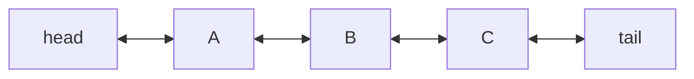

### 6.1 Struktur Minimal

```go
type doublyNode[T any] struct {
    value T
    prev  *doublyNode[T]
    next  *doublyNode[T]
}

type DoublyList[T any] struct {
    head *doublyNode[T]
    tail *doublyNode[T]
    len  int
}
```

### 6.2 Kenapa Doubly List Berguna

Dengan pointer ke node `n`, kita bisa unlink O(1):

```go
func (l *DoublyList[T]) Remove(n *doublyNode[T]) {
    if n.prev != nil {
        n.prev.next = n.next
    } else {
        l.head = n.next
    }

    if n.next != nil {
        n.next.prev = n.prev
    } else {
        l.tail = n.prev
    }

    n.prev = nil
    n.next = nil
    l.len--
}
```

Ini inti penggunaan linked list di production:

> Simpan pointer node di map, lalu lakukan move/remove O(1).

### 6.3 Diagram Remove

Sebelum:

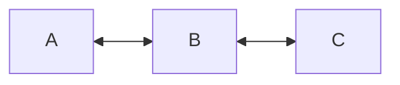

Remove `B`:

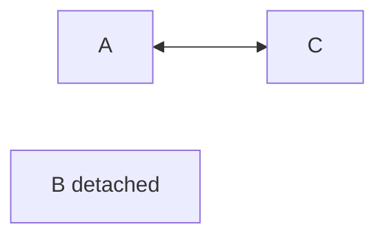

Invariant setelah remove:

- `A.next == C`,
- `C.prev == A`,
- `B.prev == nil`,
- `B.next == nil`,
- `B` tidak lagi dianggap anggota list.

---

## 7. Sentinel Node Pattern

Banyak implementasi linked list production memakai sentinel/root node untuk menyederhanakan edge case.

Tanpa sentinel, operasi remove harus membedakan:

- remove head,
- remove tail,
- remove middle,
- remove only element.

Dengan sentinel circular doubly list:

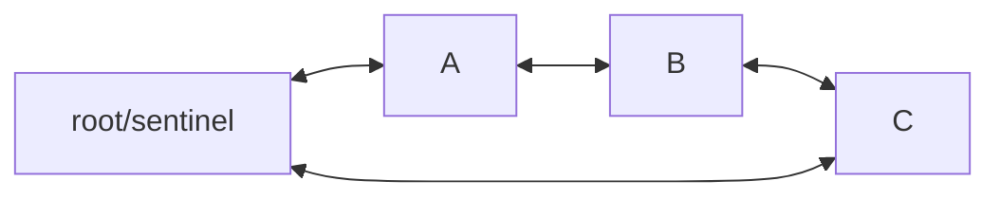

List kosong:

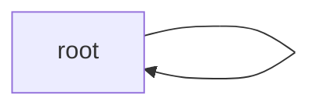

### 7.1 Struktur Sentinel

```go
type elem[T any] struct {
    value T
    prev  *elem[T]
    next  *elem[T]
}

type SentinelList[T any] struct {
    root elem[T]
    len  int
}

func NewSentinelList[T any]() *SentinelList[T] {
    l := &SentinelList[T]{}
    l.root.prev = &l.root
    l.root.next = &l.root
    return l
}
```

### 7.2 Insert After

```go
func (l *SentinelList[T]) insertAfter(at *elem[T], n *elem[T]) {
    n.prev = at
    n.next = at.next
    at.next.prev = n
    at.next = n
    l.len++
}
```

### 7.3 Remove

```go
func (l *SentinelList[T]) remove(n *elem[T]) {
    n.prev.next = n.next
    n.next.prev = n.prev
    n.prev = nil
    n.next = nil
    l.len--
}
```

Tidak perlu special-case head/tail karena root selalu ada.

### 7.4 Production Insight

Sentinel pattern bagus karena:

- mengurangi cabang edge-case,
- invariant lebih seragam,
- code lebih pendek,
- bug boundary lebih sedikit.

Tapi sentinel juga membuat bug lebih halus jika node asing dimasukkan atau node sudah detached tetapi di-remove lagi.

Karena itu API perlu ownership tracking.

---

## 8. `container/list` di Go

Go standard library menyediakan `container/list`, yaitu doubly linked list.

Secara konsep:

- `list.List` adalah container,
- `list.Element` adalah node/handle,
- `Element.Value` bertipe `any`,
- operasi penting: `PushFront`, `PushBack`, `InsertBefore`, `InsertAfter`, `MoveToFront`, `MoveToBack`, `Remove`, `Front`, `Back`, `Len`.

### 8.1 Contoh Dasar

```go
package main

import (
    "container/list"
    "fmt"
)

func main() {
    l := list.New()

    a := l.PushBack("A")
    b := l.PushBack("B")
    c := l.PushBack("C")

    _ = a
    _ = c

    l.MoveToFront(b)

    for e := l.Front(); e != nil; e = e.Next() {
        fmt.Println(e.Value.(string))
    }
}
```

Output:

```text
B
A
C
```

### 8.2 Kenapa `Element` Penting

`PushBack` mengembalikan `*list.Element`.

Itu bukan detail minor. Itu handle yang membuat operasi berikut O(1):

```go
l.MoveToFront(element)
l.Remove(element)
```

Tanpa handle, Anda harus scan list untuk menemukan elemen.

### 8.3 Masalah Type Safety

Karena `Value any`, Anda perlu type assertion:

```go
v := e.Value.(string)
```

Jika salah type, panic.

Untuk production, biasanya dibuat wrapper:

```go
type TypedList[T any] struct {
    l list.List
}

type TypedElement[T any] struct {
    e *list.Element
}

func (l *TypedList[T]) PushBack(v T) TypedElement[T] {
    return TypedElement[T]{e: l.l.PushBack(v)}
}

func (l *TypedList[T]) FrontValue() (T, bool) {
    e := l.l.Front()
    if e == nil {
        var zero T
        return zero, false
    }
    return e.Value.(T), true
}
```

Namun wrapper seperti ini belum sepenuhnya menghilangkan runtime assertion di dalam. Jika ingin fully type-safe dan hot-path-friendly, implementasi generic custom lebih baik.

---

## 9. `container/ring` di Go

`container/ring` menyediakan circular list. Ring tidak punya awal/akhir intrinsik. Pointer ke satu elemen bisa menjadi referensi ke seluruh ring.

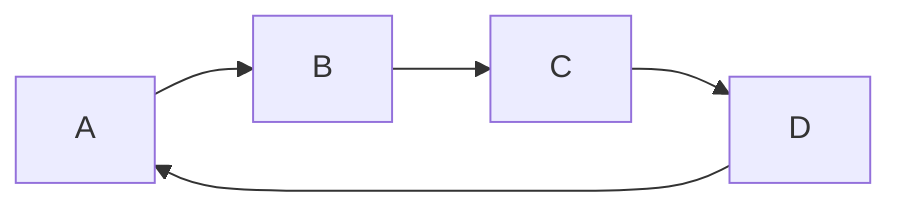

### 9.1 Contoh Dasar

```go
package main

import (
    "container/ring"
    "fmt"
)

func main() {
    r := ring.New(3)

    for i := 0; i < r.Len(); i++ {
        r.Value = i + 1
        r = r.Next()
    }

    r.Do(func(v any) {
        fmt.Println(v.(int))
    })
}
```

### 9.2 Kapan Ring Berguna

Ring cocok untuk:

- round-robin traversal,
- cyclic scheduling,
- fixed membership rotation,
- circular buffer concept sederhana,
- repeated scan tanpa boundary head/tail.

Namun jangan samakan `container/ring` dengan ring buffer array. Ring package adalah linked circular list, bukan contiguous circular array.

Untuk queue high-performance bounded, ring buffer berbasis slice biasanya lebih baik.

---

## 10. Intrusive vs Non-Intrusive List

Ini bagian penting untuk engineer level lanjut.

### 10.1 Non-Intrusive List

Non-intrusive list menyimpan wrapper node yang memuat value.

```go
type node[T any] struct {
    value T
    prev  *node[T]
    next  *node[T]
}
```

Object domain berada di dalam node atau direferensikan oleh node.

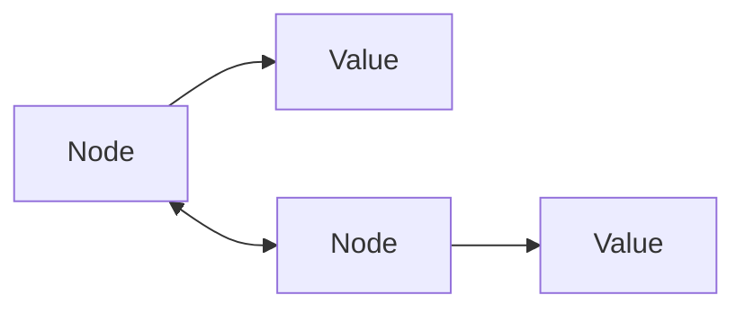

`container/list` adalah non-intrusive.

Kelebihan:

- mudah dipakai,
- object tidak harus tahu ia berada di list,
- cocok untuk generic collection.

Kekurangan:

- perlu allocation node terpisah,
- value/element indirection,
- membership tracking ada di wrapper,
- bisa terjadi mismatch antara object dan node handle.

### 10.2 Intrusive List

Intrusive list menyimpan link langsung di dalam object.

```go
type Task struct {
    ID   string
    Name string

    prev *Task
    next *Task
}
```

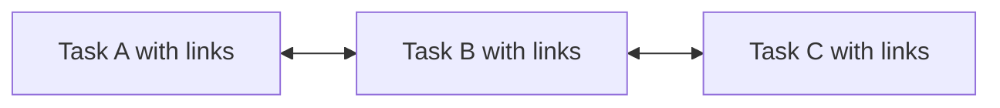

Kelebihan:

- tidak perlu node wrapper terpisah,
- allocation lebih sedikit,
- pointer ke object juga pointer ke list element,
- bagus untuk scheduler/internal runtime-style structure.

Kekurangan:

- object tercemar concern struktur data,
- satu object sulit masuk beberapa list kecuali punya beberapa link field,
- ownership lebih rawan,
- API lebih mudah salah jika diekspos ke luar package.

### 10.3 Multi-List Intrusive Object

Kadang object perlu masuk lebih dari satu list.

Misalnya task bisa berada di:

- ready queue,
- timeout queue,
- owner queue.

Jangan pakai satu pasang `prev/next` untuk semua. Gunakan link field berbeda:

```go
type link struct {
    prev *Task
    next *Task
}

type Task struct {
    ID string

    readyLink  link
    timerLink  link
    ownerLink  link
}
```

Tapi ini cepat menjadi kompleks. Intrusive list sebaiknya dibatasi ke package internal dengan invariant kuat.

---

## 11. Ownership dan Membership

Linked list sering gagal bukan karena algoritmanya sulit, tetapi karena **ownership handle** tidak jelas.

Pertanyaan wajib:

1. Siapa pemilik node?
2. Apakah node boleh berada di dua list?
3. Apa yang terjadi jika remove dipanggil dua kali?
4. Apa yang terjadi jika element dari list A dipakai ke list B?
5. Apakah user boleh menyimpan pointer node setelah remove?
6. Apakah mutation saat iterasi diizinkan?
7. Apakah value boleh diubah setelah masuk list?
8. Apakah list thread-safe? Jika tidak, siapa yang melindungi?

### 11.1 Membership Tracking

Salah satu teknik: node menyimpan pointer ke owner list.

```go
type Element[T any] struct {
    value T
    prev  *Element[T]
    next  *Element[T]
    list  *List[T]
}

type List[T any] struct {
    root Element[T]
    len  int
}
```

Saat insert:

```go
n.list = l
```

Saat remove:

```go
n.list = nil
```

Remove bisa validasi:

```go
func (l *List[T]) Remove(e *Element[T]) (T, bool) {
    if e == nil || e.list != l {
        var zero T
        return zero, false
    }
    // unlink...
}
```

Ini mencegah:

- remove element asing,
- remove dua kali,
- move element dari list lain tanpa eksplisit.

### 11.2 Panic vs Bool Return

Untuk struktur data internal, panic pada misuse bisa diterima:

```go
if e.list != l {
    panic("list: element does not belong to this list")
}
```

Untuk API publik, lebih defensif:

```go
if e == nil || e.list != l {
    return zero, false
}
```

Decision rule:

- invariant violation oleh programmer internal → panic bisa membantu fail fast,
- input/user controlled misuse → return bool/error lebih aman.

---

## 12. Generic Doubly List Type-Safe

Berikut desain minimal generic doubly linked list yang lebih type-safe daripada `container/list`.

> Catatan: ini educational-quality yang cukup kuat untuk belajar invariant. Untuk production, tambahkan test, fuzzing, benchmark, dokumentasi mutation semantics, dan package boundary yang jelas.

```go
package dlist

type Element[T any] struct {
    value T
    prev  *Element[T]
    next  *Element[T]
    list  *List[T]
}

func (e *Element[T]) Value() T {
    return e.value
}

type List[T any] struct {
    root Element[T]
    len  int
}

func New[T any]() *List[T] {
    l := &List[T]{}
    l.init()
    return l
}

func (l *List[T]) init() {
    l.root.prev = &l.root
    l.root.next = &l.root
}

func (l *List[T]) lazyInit() {
    if l.root.next == nil {
        l.init()
    }
}

func (l *List[T]) Len() int {
    return l.len
}

func (l *List[T]) Front() *Element[T] {
    if l.len == 0 {
        return nil
    }
    return l.root.next
}

func (l *List[T]) Back() *Element[T] {
    if l.len == 0 {
        return nil
    }
    return l.root.prev
}

func (e *Element[T]) Next() *Element[T] {
    if e == nil || e.list == nil {
        return nil
    }
    n := e.next
    if n == &e.list.root {
        return nil
    }
    return n
}

func (e *Element[T]) Prev() *Element[T] {
    if e == nil || e.list == nil {
        return nil
    }
    p := e.prev
    if p == &e.list.root {
        return nil
    }
    return p
}

func (l *List[T]) insertAfter(at *Element[T], e *Element[T]) *Element[T] {
    e.prev = at
    e.next = at.next
    at.next.prev = e
    at.next = e
    e.list = l
    l.len++
    return e
}

func (l *List[T]) PushFront(v T) *Element[T] {
    l.lazyInit()
    return l.insertAfter(&l.root, &Element[T]{value: v})
}

func (l *List[T]) PushBack(v T) *Element[T] {
    l.lazyInit()
    return l.insertAfter(l.root.prev, &Element[T]{value: v})
}

func (l *List[T]) Remove(e *Element[T]) (T, bool) {
    if e == nil || e.list != l {
        var zero T
        return zero, false
    }

    e.prev.next = e.next
    e.next.prev = e.prev
    l.len--

    e.prev = nil
    e.next = nil
    e.list = nil

    return e.value, true
}

func (l *List[T]) MoveToFront(e *Element[T]) bool {
    if e == nil || e.list != l {
        return false
    }
    if l.root.next == e {
        return true
    }

    // unlink
    e.prev.next = e.next
    e.next.prev = e.prev

    // insert after root
    e.prev = &l.root
    e.next = l.root.next
    l.root.next.prev = e
    l.root.next = e
    return true
}
```

### 12.1 Zero Value Support

`lazyInit` membuat zero value usable:

```go
var l List[int]
l.PushBack(10)
l.PushBack(20)
```

Ini idiom Go yang bagus untuk collection kecil.

### 12.2 Why `Value()` not Export Field?

Jika field `value` diekspor, user bisa mengubah value langsung. Itu kadang boleh, tetapi untuk struktur dengan invariant berdasarkan value, berbahaya.

Untuk list biasa, mutable value mungkin aman. Untuk ordered list, priority queue, tree, atau indexed list, mutable value bisa merusak invariant.

Design rule:

> Export mutability hanya jika tidak bisa merusak invariant.

---

## 13. Iteration Semantics

Linked list iteration harus jelas terhadap mutation.

### 13.1 Safe Remove During Iteration

Pattern aman:

```go
for e := l.Front(); e != nil; {
    next := e.Next()
    if shouldRemove(e.Value()) {
        l.Remove(e)
    }
    e = next
}
```

Kenapa simpan `next` dulu?

Karena setelah remove:

- `e.next` bisa dinilkan,
- `e.list` bisa nil,
- `e.Next()` bisa tidak valid.

### 13.2 Unsafe Pattern

```go
for e := l.Front(); e != nil; e = e.Next() {
    if shouldRemove(e.Value()) {
        l.Remove(e)
    }
}
```

Jika `Remove` detach pointer, `e.Next()` setelah remove akan nil atau invalid.

### 13.3 Iterator API Alternative

Callback iteration:

```go
func (l *List[T]) ForEach(fn func(T) bool) {
    for e := l.Front(); e != nil; e = e.Next() {
        if !fn(e.Value()) {
            return
        }
    }
}
```

Kelemahan:

- mutation semantics harus didokumentasikan,
- closure overhead bisa relevan di hot path,
- tidak fleksibel untuk remove kecuali API khusus.

---

## 14. LRU Cache: Canonical Use Case

LRU adalah contoh paling umum linked list production.

Kebutuhan:

- `Get(key)` O(1),
- `Put(key, value)` O(1),
- ketika key diakses, pindah ke paling baru,
- ketika capacity penuh, buang yang paling lama.

Struktur:

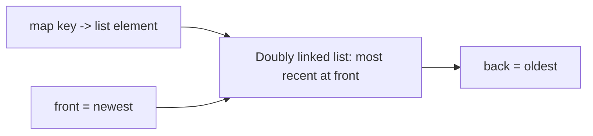

### 14.1 Entry

```go
type entry[K comparable, V any] struct {
    key   K
    value V
}
```

### 14.2 LRU dengan `container/list`

```go
package lru

import "container/list"

type Cache[K comparable, V any] struct {
    cap   int
    items map[K]*list.Element
    order list.List // front = most recently used
}

type entry[K comparable, V any] struct {
    key   K
    value V
}

func New[K comparable, V any](capacity int) *Cache[K, V] {
    if capacity <= 0 {
        panic("lru: capacity must be positive")
    }
    return &Cache[K, V]{
        cap:   capacity,
        items: make(map[K]*list.Element, capacity),
    }
}

func (c *Cache[K, V]) Get(key K) (V, bool) {
    e, ok := c.items[key]
    if !ok {
        var zero V
        return zero, false
    }

    c.order.MoveToFront(e)
    ent := e.Value.(entry[K, V])
    return ent.value, true
}

func (c *Cache[K, V]) Put(key K, value V) {
    if e, ok := c.items[key]; ok {
        e.Value = entry[K, V]{key: key, value: value}
        c.order.MoveToFront(e)
        return
    }

    e := c.order.PushFront(entry[K, V]{key: key, value: value})
    c.items[key] = e

    if len(c.items) > c.cap {
        c.evictOldest()
    }
}

func (c *Cache[K, V]) evictOldest() {
    e := c.order.Back()
    if e == nil {
        return
    }
    c.order.Remove(e)
    ent := e.Value.(entry[K, V])
    delete(c.items, ent.key)
}
```

### 14.3 Invariant LRU

Untuk LRU, invariant penting:

1. `len(items) == order.Len()`.
2. Setiap map value menunjuk ke element dalam list.
3. Setiap list element punya key yang ada di map.
4. Front adalah most recently used.
5. Back adalah least recently used.
6. Tidak ada duplicate key di list.
7. Capacity tidak boleh dilampaui setelah `Put` selesai.

### 14.4 LRU Failure Modes

| Failure | Penyebab | Dampak |
|---|---|---|
| Map/list tidak sinkron | remove list tanpa delete map | stale pointer |
| Duplicate key | put existing tanpa update old element | memory leak/logical bug |
| Wrong eviction side | evict front bukan back | cache jadi MRU eviction |
| Type assertion panic | salah Value type | runtime crash |
| Unbounded cache | capacity tidak enforced | memory growth |
| Concurrent access race | tanpa lock | data race/corruption |

---

## 15. Linked List vs Slice untuk LRU Kecil

Jangan otomatis pakai linked list untuk semua LRU.

Jika capacity sangat kecil, misalnya 8, 16, 32, slice scan bisa lebih cepat dan lebih sederhana.

```go
type smallEntry[K comparable, V any] struct {
    key   K
    value V
}

type SmallLRU[K comparable, V any] struct {
    cap int
    xs  []smallEntry[K, V] // index 0 = newest
}
```

`Get` scan O(n), tetapi untuk n kecil:

- contiguous memory,
- no map,
- no list node allocation,
- simpler GC graph.

Top-tier engineering principle:

> O(1) with poor locality can lose to O(n) with tiny n and contiguous data.

---

## 16. Linked List vs Ring Buffer

Ring buffer cocok untuk queue FIFO bounded.

Linked list queue:

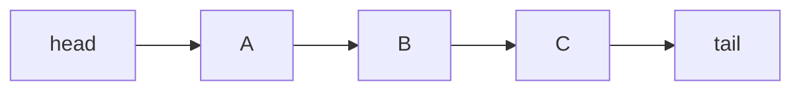

Ring buffer:

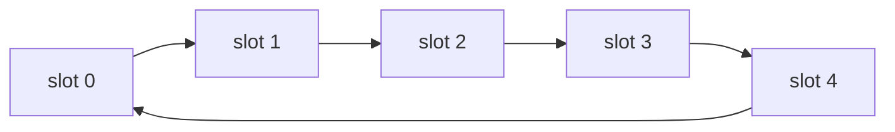

Ring buffer keunggulan:

- fixed allocation,
- contiguous slots,
- good cache locality,
- simple head/tail index,
- bagus untuk bounded queue.

Linked list queue keunggulan:

- unbounded secara struktur,
- element bisa dipindah/remove by handle,
- no capacity resize needed.

Decision:

- FIFO murni, bounded/high-throughput → ring buffer slice.
- Need remove/move arbitrary element by handle → doubly linked list.

---

## 17. Linked List vs Heap

Jika Anda butuh “ambil item dengan prioritas tertinggi/terendah”, linked list bukan default.

| Kebutuhan | Struktur Lebih Cocok |
|---|---|
| FIFO | queue/ring buffer |
| LIFO | stack/slice |
| LRU | map + doubly list |
| priority min/max | heap |
| ordered range | tree/sorted slice/B-tree |
| membership lookup | map/set |
| arbitrary remove with handle | doubly list |

Sorted linked list sering tampak menarik, tetapi biasanya buruk:

- insert O(n),
- scan pointer chasing,
- no binary search,
- high allocation.

Jika ordered operation dominan, pertimbangkan:

- sorted slice untuk small/mostly-read data,
- heap untuk min/max priority,
- tree/B-tree untuk range query,
- skip list untuk concurrent/ordered specialized case.

---

## 18. Java Comparison: `LinkedList` vs Go Approach

Sebagai Java engineer, Anda mungkin mengenal `java.util.LinkedList`, yang mengimplementasikan `List` dan `Deque`. Dalam Java, `LinkedList` bisa diperlakukan sebagai `List`, tetapi akses by index pada linked list tetap O(n).

Di Go, tidak ada abstraction collection hierarchy seperti `List` interface di standard library. Ini mengurangi ilusi bahwa semua list memiliki karakteristik serupa.

Go mendorong Anda bertanya:

- operasi dominan apa?
- data size berapa?
- mutation pattern seperti apa?
- perlu handle stabil atau tidak?
- perlu lookup by key atau tidak?
- perlu order deterministic atau tidak?
- hot path atau bukan?

Ini lebih eksplisit, tetapi lebih jujur.

---

## 19. API Design untuk Linked List Production

### 19.1 Jangan Ekspor Node Internal Sembarangan

Bad:

```go
type Node[T any] struct {
    Value T
    Prev  *Node[T]
    Next  *Node[T]
}
```

Problem:

- user bisa mengubah `Prev/Next`,
- invariant rusak,
- list bisa cyclic tanpa sengaja,
- remove bisa panic,
- memory retention sulit dilacak.

Better:

```go
type Element[T any] struct {
    value T
    prev  *Element[T]
    next  *Element[T]
    list  *List[T]
}

func (e *Element[T]) Value() T { return e.value }
func (e *Element[T]) Next() *Element[T] { /* safe */ }
```

### 19.2 Document Mutation Semantics

Contoh dokumentasi:

```text
Elements returned by PushFront/PushBack remain valid until removed.
Calling Remove on an element not owned by this list returns false.
Iteration is not safe against concurrent mutation.
Removing the current element during iteration is allowed only if the next element is captured before removal.
```

### 19.3 Avoid Ambiguous Remove by Value

```go
func (l *List[T]) RemoveValue(v T) bool
```

Ini hanya bisa untuk `comparable`, dan O(n). Nama harus jujur:

```go
func (l *List[T]) RemoveFirst(v T) bool
```

Jangan buat user mengira O(1).

### 19.4 Expose Handle for O(1) Operations

```go
e := l.PushBack(task)
l.Remove(e)
l.MoveToFront(e)
```

Handle adalah alasan linked list dipakai.

---

## 20. Memory Retention dan Detach Discipline

Jika node dihapus tapi pointer internal tidak dilepas, object graph bisa tertahan lebih lama.

Misalnya:

```go
victim.prev.next = victim.next
victim.next.prev = victim.prev
// forgot victim.prev = nil, victim.next = nil
```

Jika `victim` masih direferensikan dari luar, maka `victim.prev` dan `victim.next` bisa mempertahankan chain object lain.

Pattern aman:

```go
victim.prev = nil
victim.next = nil
victim.list = nil
```

Untuk value besar yang mengandung pointer, kadang juga perlu zero out value saat remove jika node akan disimpan ulang/pool:

```go
var zero T
victim.value = zero
```

Namun jika `Remove` mengembalikan value, zeroing harus dilakukan setelah value disalin keluar atau desain API harus jelas.

---

## 21. Object Pool dan Linked List

Kadang orang ingin mengoptimalkan linked list dengan `sync.Pool` untuk node.

Hati-hati.

Pool bisa membantu jika:

- node allocation sangat tinggi,
- node lifetime pendek,
- profiling membuktikan allocator/GC bottleneck,
- value bisa dizero dengan aman,
- tidak ada stale handle.

Pool bisa berbahaya jika:

- element handle masih disimpan user,
- node dipakai ulang saat masih dianggap valid,
- value lama bocor,
- ownership tidak ketat.

Untuk public collection, pooling internal sulit aman. Untuk internal package dengan invariant kuat, mungkin layak.

Design rule:

> Jangan pakai pool untuk memperbaiki desain data structure yang salah. Profil dulu.

---

## 22. Concurrent Access

Linked list basic tidak thread-safe.

Jika beberapa goroutine mengakses list:

- satu goroutine remove,
- satu goroutine iterate,
- satu goroutine move,

maka pointer internal bisa inconsistent jika tidak dilindungi.

Wrapper minimal:

```go
type SafeList[T any] struct {
    mu sync.Mutex
    l  List[T]
}
```

Namun hati-hati dengan handle `*Element[T]` yang keluar dari lock. Jika user menyimpan handle lalu memakainya nanti, Anda perlu mendefinisikan semantics.

Untuk concurrent LRU, biasanya:

- satu global lock sederhana cukup untuk banyak kasus,
- sharded cache untuk throughput lebih tinggi,
- hindari fine-grained pointer lock kecuali benar-benar perlu,
- lock-free linked list sangat kompleks dan jarang worth it.

Karena seri concurrency sudah ada, part ini cukup memberi rule:

> Linked list punya invariant pointer multi-field. Mutasi harus atomic secara logical. Lindungi seluruh operasi unlink/relink sebagai satu critical section.

---

## 23. Invariant Checklist

Untuk doubly linked list:

```text
Empty:
- len == 0
- front == nil or root.next == root
- back == nil or root.prev == root

Non-empty:
- len > 0
- front.prev == root/sentinel or nil depending implementation
- back.next == root/sentinel or nil depending implementation
- every node.next.prev == node
- every node.prev.next == node
- number of reachable nodes == len
- every reachable node.list == this list
- no cycle except intended sentinel cycle
- removed node has prev == nil, next == nil, list == nil
```

Untuk LRU:

```text
- map size == list length
- every key in map appears exactly once in list
- every list element key exists in map
- map[key] points to the matching element
- front is most recent
- back is oldest
- capacity invariant holds after mutation
```

---

## 24. Testing Strategy

### 24.1 Basic Unit Tests

Test cases:

- empty list,
- push front one,
- push back one,
- push front many,
- push back many,
- remove front,
- remove back,
- remove middle,
- remove same element twice,
- remove foreign element,
- move front to front,
- move back to front,
- iterate after mutations.

### 24.2 Invariant Test Helper

```go
func assertListInvariant[T any](t *testing.T, l *List[T]) {
    t.Helper()

    count := 0
    for e := l.Front(); e != nil; e = e.Next() {
        if e.list != l {
            t.Fatalf("element has wrong owner")
        }
        if e.next != nil && e.next.prev != e && e.next != &l.root {
            t.Fatalf("broken next/prev link")
        }
        count++
        if count > l.Len()+1 {
            t.Fatalf("cycle detected")
        }
    }

    if count != l.Len() {
        t.Fatalf("len mismatch: counted=%d len=%d", count, l.Len())
    }
}
```

### 24.3 Random Operation Test

Model list behavior with slice:

- PushBack(v): append to slice,
- PushFront(v): prepend,
- Remove(handle): remove corresponding element,
- MoveToFront(handle): update order.

Differential testing catches pointer bugs better than hand-picked examples.

### 24.4 Fuzzing Direction

Fuzz sequence of operations:

```text
0 = PushFront(random value)
1 = PushBack(random value)
2 = Remove(random existing handle)
3 = MoveToFront(random existing handle)
4 = PopFront
5 = PopBack
```

After every operation:

- validate invariant,
- compare list order with reference slice,
- ensure no panic except expected misuse case.

---

## 25. Benchmarking Direction

Benchmark linked list against alternatives.

### 25.1 Cases to Benchmark

1. Sequential iteration:
   - slice vs linked list.
2. PushBack many:
   - slice append vs list PushBack.
3. Remove middle by handle:
   - linked list vs slice with known index.
4. LRU access workload:
   - map+list vs small slice LRU.
5. Queue workload:
   - linked list queue vs ring buffer.

### 25.2 Example Benchmark Skeleton

```go
func BenchmarkListIteration(b *testing.B) {
    l := list.New()
    for i := 0; i < 100_000; i++ {
        l.PushBack(i)
    }

    b.ResetTimer()
    var sum int
    for i := 0; i < b.N; i++ {
        for e := l.Front(); e != nil; e = e.Next() {
            sum += e.Value.(int)
        }
    }
    _ = sum
}
```

Compare with:

```go
func BenchmarkSliceIteration(b *testing.B) {
    xs := make([]int, 100_000)
    for i := range xs {
        xs[i] = i
    }

    b.ResetTimer()
    var sum int
    for i := 0; i < b.N; i++ {
        for _, v := range xs {
            sum += v
        }
    }
    _ = sum
}
```

Expected lesson:

- linked list likely loses badly in pure iteration,
- linked list only shines when O(1) handle mutation dominates.

---

## 26. Anti-Patterns

### 26.1 Using Linked List for General Collection

Bad:

```go
var users list.List
// store all users, iterate often, rarely remove by handle
```

Better:

```go
users := []User{}
```

### 26.2 Removing by Value and Claiming O(1)

Bad claim:

```text
Linked list delete is O(1).
```

Correct:

```text
Linked list delete is O(1) only when the node/previous node is already known.
Finding the node is O(n).
```

### 26.3 Exposing Internal Pointers

Bad:

```go
task.Next = otherTask
```

This lets callers corrupt invariant.

### 26.4 Using `container/list` in Hot Path Without Benchmark

`container/list` is correct and useful, but:

- `Value any`,
- type assertion,
- node allocation,
- pointer chasing.

Benchmark before using it in hot path.

### 26.5 Using Linked List Instead of Heap for Priority

If operation is “always take earliest deadline”, use heap or ordered structure, not scan linked list.

### 26.6 Not Detaching Removed Nodes

Can retain memory and allow stale traversal.

### 26.7 Ambiguous Thread Safety

Document explicitly:

```text
List is not safe for concurrent use.
```

or wrap lock and define handle semantics.

---

## 27. Decision Framework

### 27.1 Choose Slice When

Use slice when:

- need compact sequence,
- frequent iteration,
- random index access,
- data size moderate/large,
- append-heavy,
- sort/search needed,
- remove frequency low or batch-removal possible.

### 27.2 Choose Linked List When

Use linked list when:

- need stable element handle,
- remove/move arbitrary known element O(1),
- order changes frequently,
- LRU/MRU semantics,
- element belongs to lifecycle queue,
- no need random access,
- traversal cost acceptable.

### 27.3 Choose Ring Buffer When

Use ring buffer when:

- FIFO queue,
- bounded capacity,
- high throughput,
- predictable memory,
- no arbitrary removal.

### 27.4 Choose Heap When

Use heap when:

- need min/max priority,
- scheduler by deadline,
- retry by next attempt time,
- Top-K streaming.

### 27.5 Choose Map + List When

Use map + list when:

- lookup by key O(1),
- remove/move by key O(1),
- ordering by recency/lifecycle,
- LRU-like cache.

---

## 28. Production Case Study: Request Dedup LRU Window

Problem:

A service receives idempotency keys. We want to remember recently seen keys to reject duplicates within a bounded window.

Requirements:

- `Seen(key)` returns true if key exists.
- `Mark(key)` records key as newest.
- Capacity bounded.
- Evict oldest when full.
- O(1) expected operations.

Data structure:

```text
map[string]*list.Element
list.List of key entries, newest at front
```

Invariants:

- map/list sync,
- no duplicate key,
- capacity bounded,
- front newest.

Edge cases:

- marking existing key should move to front,
- capacity must be positive,
- if key cardinality high, memory must be tracked,
- if distributed service, local cache is not global dedup guarantee.

Implementation sketch:

```go
type DedupWindow struct {
    cap   int
    keys  map[string]*list.Element
    order list.List // string values
}

func NewDedupWindow(capacity int) *DedupWindow {
    if capacity <= 0 {
        panic("capacity must be positive")
    }
    return &DedupWindow{
        cap:  capacity,
        keys: make(map[string]*list.Element, capacity),
    }
}

func (d *DedupWindow) Seen(key string) bool {
    e, ok := d.keys[key]
    if ok {
        d.order.MoveToFront(e)
    }
    return ok
}

func (d *DedupWindow) Mark(key string) {
    if e, ok := d.keys[key]; ok {
        d.order.MoveToFront(e)
        return
    }

    e := d.order.PushFront(key)
    d.keys[key] = e

    if len(d.keys) > d.cap {
        old := d.order.Back()
        d.order.Remove(old)
        delete(d.keys, old.Value.(string))
    }
}
```

Production extensions:

- TTL expiration,
- metrics for hit/miss/eviction,
- sharding for concurrency,
- memory accounting by key length,
- persistent backing if dedup must survive restart.

---

## 29. Deep Mental Model: Linked List Is a Relationship Structure

A slice says:

> “These values live in a compact ordered region.”

A map says:

> “This key identifies this value.”

A heap says:

> “The root is always the minimum/maximum by priority.”

A linked list says:

> “This object has a predecessor/successor relationship that can be rewired cheaply if I already hold the object.”

That sentence is the essence.

Linked list is not about storage density. It is about **relationship rewiring**.

---

## 30. Engineering Review Checklist

When reviewing PR that introduces linked list, ask:

```text
1. Why not slice?
2. Why not ring buffer?
3. Why not heap?
4. Is O(1) remove/move by handle required?
5. Where are element handles stored?
6. Can handles become stale?
7. Is remove double-call safe?
8. Can element belong to multiple lists?
9. Is mutation during iteration defined?
10. Are removed nodes detached?
11. Is value type pointer-heavy?
12. Is this hot path benchmarked?
13. Is there an invariant test?
14. Is concurrency explicitly unsupported or protected?
15. Is memory bounded?
```

If the answer to #4 is “no”, linked list is probably the wrong structure.

---

## 31. Mini Exercises

### Exercise 1 — Generic List

Implement generic doubly linked list with:

- `PushFront`,
- `PushBack`,
- `Front`,
- `Back`,
- `Remove`,
- `MoveToFront`,
- `Len`.

Add invariant test helper.

### Exercise 2 — LRU Cache

Build LRU cache with:

- fixed capacity,
- `Get`,
- `Put`,
- `Len`,
- `KeysNewestFirst`.

Test:

- update existing,
- eviction order,
- duplicate prevention,
- capacity invariant.

### Exercise 3 — Slice vs List Benchmark

Benchmark:

- iterating 1k, 100k, 1M items,
- deleting 10% known positions,
- LRU workload with capacity 16, 128, 4096.

Write conclusion based on measurements, not theory only.

### Exercise 4 — Intrusive Queue

Implement internal `TaskQueue` where `Task` has `prev/next` fields.

Add protection against:

- enqueue same task twice,
- remove task not in queue,
- double remove.

---

## 32. Summary

Linked list is a specialized structure for cheap relationship rewiring.

Key lessons:

1. Linked list is rarely the default in Go.
2. Slice usually wins for iteration and compact sequence.
3. Linked list delete is O(1) only with a known node/handle.
4. Doubly linked list is useful for LRU, scheduler queues, and lifecycle lists.
5. `container/list` is useful but not generic type-safe.
6. `container/ring` is circular linked list, not array ring buffer.
7. Intrusive list reduces allocation but increases ownership complexity.
8. Pointer chasing can dominate theoretical Big-O.
9. Detach removed nodes to avoid retention and stale links.
10. Production linked lists need invariant tests, handle semantics, and clear concurrency rules.

The top-tier mental model:

> Do not choose linked list because insertion/deletion is “O(1)”. Choose it only when the system already owns stable handles and frequently rewires known elements.

---

## 33. Referensi Resmi

- Go 1.26 Release Notes: https://go.dev/doc/go1.26
- Go Release History: https://go.dev/doc/devel/release
- Go Standard Library: https://pkg.go.dev/std
- `container` directory: https://pkg.go.dev/container
- `container/list`: https://pkg.go.dev/container/list
- `container/ring`: https://pkg.go.dev/container/ring
- `container/heap`: https://pkg.go.dev/container/heap

<!-- NAVIGATION_FOOTER -->
<div class="page-nav">
<a href="./learn-go-data-structure-algorithm-part-005.md">⬅️ Part 005 — Stack, Queue, Deque, dan Worklist Algorithms</a>
<a href="./index.md">📚 Kategori</a>
<a href="../../index.md">🏠 Home</a>
<a href="./learn-go-data-structure-algorithm-part-007.md">Part 007 — Heap, Priority Queue, dan Scheduling Algorithms ➡️</a>
</div>
