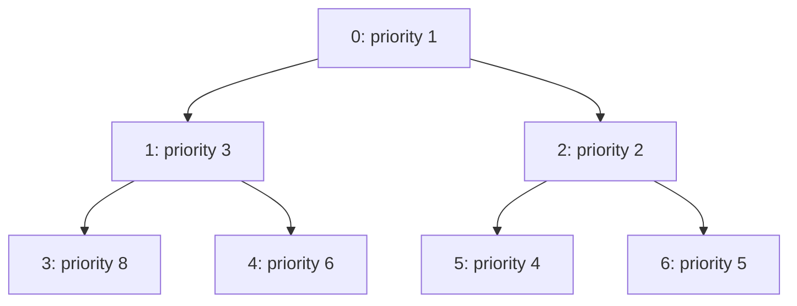
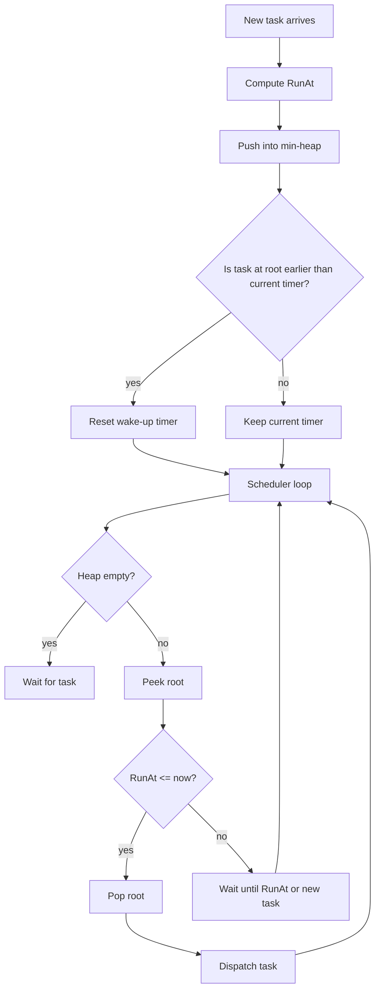
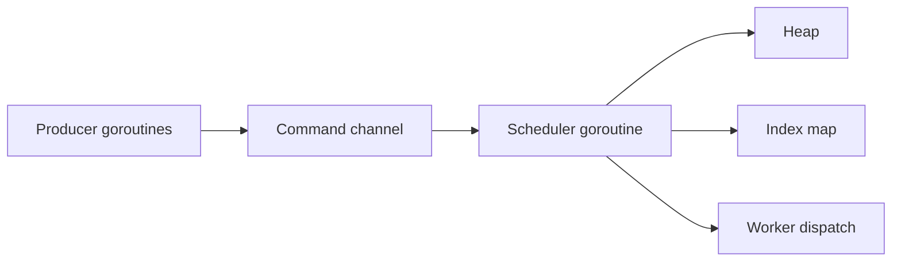

# learn-go-data-structure-algorithm-part-007.md

# Part 007 — Heap, Priority Queue, dan Scheduling Algorithms

> Seri: `learn-go-data-structure-algorithm`  
> Target pembaca: Java software engineer yang ingin memahami Go data structure & algorithm secara production-grade  
> Versi Go: ditulis untuk Go 1.26.x dengan prinsip Go 1 compatibility  
> Fokus: heap, priority queue, indexed priority queue, mutable priority, timer/retry scheduling, Dijkstra support, Top-K streaming, dan failure mode production

---

## 0. Posisi Part Ini dalam Seri

Pada part sebelumnya kita sudah membahas:

- slice sebagai fondasi sequence,
- map sebagai associative structure,
- sorting, ordering, binary search,
- stack, queue, deque, worklist,
- linked list dan pointer-chasing trade-off.

Sekarang kita masuk ke struktur yang sering muncul ketika sistem perlu memilih **elemen “paling prioritas” secara berulang**.

Heap dan priority queue muncul di banyak sistem nyata:

- retry scheduler,
- timer queue,
- background job executor,
- Dijkstra shortest path,
- A*/pathfinding,
- Top-K ranking,
- streaming analytics,
- rate-limited worker,
- delayed task queue,
- event simulation,
- merge banyak sorted streams,
- cache eviction policy tertentu,
- deadline-based scheduling.

Secara teori, heap terlihat sederhana: `Push` dan `Pop` dalam `O(log n)`. Tetapi di production, bagian sulitnya bukan hanya operasi heap. Bagian sulitnya adalah:

- bagaimana mendefinisikan prioritas secara konsisten,
- bagaimana menangani item yang prioritasnya berubah,
- bagaimana menghapus item arbitrary,
- bagaimana mencegah stale entry,
- bagaimana menjaga fairness,
- bagaimana menghindari starvation,
- bagaimana menguji invariant,
- bagaimana memilih heap vs sorted slice vs tree vs bucket queue,
- bagaimana mengintegrasikan heap ke scheduler tanpa race dan memory leak.

Part ini akan membangun mental model tersebut dari bawah.

---

## 1. Inti Mental Model

Heap adalah struktur data untuk kasus ketika kita butuh operasi utama:

```text
ambil elemen dengan prioritas tertinggi/terendah secara berulang
```

Dalam Go standard library, package `container/heap` menyediakan operasi heap untuk tipe apa pun yang mengimplementasikan `heap.Interface`. Dokumentasi resminya menyatakan bahwa heap adalah tree dengan properti bahwa setiap node adalah node bernilai minimum di subtree-nya, dan elemen minimum berada di root index `0`.

Untuk Go, heap biasanya direpresentasikan sebagai **slice**, bukan node pointer tree.

```text
logical tree:

          1
       /     \
      3       5
    /  \     / \
   7    9   8   10

array/slice representation:

index:  0  1  2  3  4  5  6
value:  1  3  5  7  9  8 10
```

Parent/child relation:

```text
parent(i) = (i - 1) / 2
left(i)   = 2*i + 1
right(i)  = 2*i + 2
```

Heap bukan sorted array. Heap hanya menjamin root adalah minimum atau maksimum, tergantung comparator. Elemen lain tidak harus sorted secara global.

---

## 2. Heap vs Sorted Slice vs Tree

Sebelum menulis heap, engineer senior harus tahu kapan heap memang struktur yang tepat.

| Kebutuhan | Struktur cocok | Alasan |
|---|---:|---|
| Banyak insert, sering ambil min/max | Heap | `Push/Pop O(log n)` |
| Banyak lookup by key | Map | Heap buruk untuk lookup arbitrary |
| Ambil range terurut | Balanced tree / sorted slice | Heap tidak mendukung range scan terurut |
| Data kecil, sort sekali lalu proses | Sorted slice | Lebih sederhana, locality bagus |
| Prioritas berubah sering | Indexed heap / tree | Heap biasa sulit update item arbitrary |
| Butuh delete arbitrary by handle | Indexed heap / tree / linked structure | Heap biasa perlu index tracking |
| Prioritas integer kecil terbatas | Bucket queue | Bisa mendekati `O(1)` |
| Banyak read min, jarang mutate | Sorted slice | `x[0]` cepat, binary insert mungkin cukup |
| Butuh stable order untuk equal priority | Heap + sequence number | Heap tidak otomatis stable |

Rule praktis:

> Gunakan heap ketika operasi dominan adalah “masukkan item” dan “ambil item prioritas terbaik” secara dinamis.

Jangan gunakan heap hanya karena “butuh data terurut”. Heap bukan struktur general-purpose ordering.

---

## 3. Heap Invariant

Untuk min-heap:

```text
for every node i:
    heap[parent(i)] <= heap[i]
```

Untuk max-heap:

```text
for every node i:
    heap[parent(i)] >= heap[i]
```

Yang penting:

- root adalah minimum/maximum,
- subtree juga memenuhi heap property,
- sibling tidak harus sorted,
- left child tidak harus lebih kecil dari right child,
- level tidak harus sorted.

Contoh min-heap valid:

```text
          2
       /     \
      7       3
    /  \     / \
   9   10   5   4
```

Slice:

```go
[]int{2, 7, 3, 9, 10, 5, 4}
```

Ini valid walaupun `7 > 3`, `10 > 5`, dan level tidak sorted.

---

## 4. Diagram Operasi Heap

### 4.1 Push: append lalu bubble-up

Misal min-heap:

```text
Before push 1:

          2
       /     \
      7       3
    /  \
   9   10

append 1:

          2
       /     \
      7       3
    /  \     /
   9   10   1

bubble up:

          2
       /     \
      7       1
    /  \     /
   9   10   3

bubble up again:

          1
       /     \
      7       2
    /  \     /
   9   10   3
```

### 4.2 Pop: swap root dengan last, remove last, bubble-down

```text
Before pop:

          1
       /     \
      7       2
    /  \     /
   9   10   3

swap root with last:

          3
       /     \
      7       2
    /  \     /
   9   10   1

remove last = 1

          3
       /     \
      7       2
    /  \
   9   10

bubble down:

          2
       /     \
      7       3
    /  \
   9   10
```

---

## 5. Mermaid: Heap sebagai Complete Binary Tree



Array representation:

```text
index:     0  1  2  3  4  5  6
priority:  1  3  2  8  6  4  5
```

Parent-child relation bukan disimpan eksplisit. Semuanya dihitung dari index.

---

## 6. Complexity Dasar

| Operasi | Complexity | Catatan |
|---|---:|---|
| Peek min/max | `O(1)` | root di index 0 |
| Push | `O(log n)` | bubble-up |
| Pop | `O(log n)` | bubble-down |
| Heapify dari n item | `O(n)` | lebih baik dari push satu-satu `O(n log n)` |
| Remove by index | `O(log n)` | kalau index diketahui |
| Fix/update by index | `O(log n)` | kalau index diketahui |
| Search arbitrary item | `O(n)` | heap bukan lookup structure |

Important nuance:

- `O(log n)` heap biasanya punya constant factor kecil karena berbasis contiguous slice.
- Heap punya locality lebih baik daripada pointer-based tree.
- Tetapi heap tidak bisa lookup item by key tanpa bantuan map.

---

## 7. Go Standard Library: `container/heap`

Go menyediakan package `container/heap`. Package ini tidak menyediakan generic `PriorityQueue[T]` langsung. Ia menyediakan fungsi operasi heap di atas tipe yang mengimplementasikan interface.

Secara konsep, interface-nya terdiri dari:

```go
type Interface interface {
    sort.Interface
    Push(x any)
    Pop() any
}
```

Karena embedded `sort.Interface`, tipe heap perlu punya:

```go
Len() int
Less(i, j int) bool
Swap(i, j int)
```

Lalu ditambah:

```go
Push(x any)
Pop() any
```

Catatan penting:

- `heap.Push(h, x)` memanggil method `h.Push(x)` lalu memperbaiki invariant.
- `heap.Pop(h)` melakukan swap dan down-heap, lalu memanggil method `h.Pop()` untuk mengambil last element.
- Method `Push` dan `Pop` milik tipe Anda biasanya bekerja di ujung slice, bukan root secara langsung.
- Ini sering membingungkan untuk engineer yang baru memakai `container/heap`.

---

## 8. Implementasi Min-Heap Integer Sederhana

```go
package main

import (
    "container/heap"
    "fmt"
)

type IntMinHeap []int

func (h IntMinHeap) Len() int { return len(h) }

func (h IntMinHeap) Less(i, j int) bool {
    return h[i] < h[j]
}

func (h IntMinHeap) Swap(i, j int) {
    h[i], h[j] = h[j], h[i]
}

func (h *IntMinHeap) Push(x any) {
    *h = append(*h, x.(int))
}

func (h *IntMinHeap) Pop() any {
    old := *h
    n := len(old)
    x := old[n-1]
    *h = old[:n-1]
    return x
}

func main() {
    h := &IntMinHeap{5, 3, 8, 1}
    heap.Init(h)

    heap.Push(h, 2)

    for h.Len() > 0 {
        fmt.Println(heap.Pop(h).(int))
    }
}
```

Output:

```text
1
2
3
5
8
```

### 8.1 Kenapa `Pop()` mengambil elemen terakhir?

Karena `heap.Pop(h)` dari package melakukan orchestration:

1. swap root dengan elemen terakhir,
2. perbaiki heap untuk elemen sisanya,
3. panggil method `Pop()` user untuk mengambil elemen terakhir.

Jadi method `Pop()` milik tipe Anda memang mengambil last element.

---

## 9. Min-Heap vs Max-Heap

`container/heap` secara default mengikuti `Less`. Kalau `Less(i,j)` berarti item `i` lebih prioritas daripada `j`, maka root adalah item “terkecil” menurut `Less`.

Min-heap:

```go
func (h IntHeap) Less(i, j int) bool {
    return h[i] < h[j]
}
```

Max-heap:

```go
func (h IntHeap) Less(i, j int) bool {
    return h[i] > h[j]
}
```

Jadi untuk max-heap, kita tidak perlu implementasi struktur berbeda. Cukup balik comparator.

Namun hati-hati:

> Nama method `Less` tetap `Less`, tetapi semantik production-nya sebenarnya adalah “higher priority”.

Agar tidak membingungkan, dalam priority queue sering lebih baik menulis helper:

```go
func higherPriority(a, b *Item) bool {
    return a.Priority > b.Priority
}

func (pq PriorityQueue) Less(i, j int) bool {
    return higherPriority(pq[i], pq[j])
}
```

---

## 10. Priority Queue: Struktur Lebih Realistis

Heap integer jarang cukup di production. Biasanya item punya payload dan metadata.

```go
type Job struct {
    ID       string
    Priority int
    Payload  []byte
}
```

Untuk priority queue mutable, kita butuh menyimpan index item di heap.

```go
type Item struct {
    ID       string
    Priority int
    Payload  []byte

    // index adalah posisi item dalam heap.
    // Dibutuhkan untuk heap.Fix atau heap.Remove.
    index int
}

type PriorityQueue []*Item
```

### 10.1 Implementasi

```go
package pq

import "container/heap"

type Item struct {
    ID       string
    Priority int
    Payload  []byte
    index    int
}

type PriorityQueue []*Item

func (pq PriorityQueue) Len() int { return len(pq) }

func (pq PriorityQueue) Less(i, j int) bool {
    // Max-priority queue: priority lebih besar keluar dulu.
    if pq[i].Priority != pq[j].Priority {
        return pq[i].Priority > pq[j].Priority
    }

    // Tie-breaker deterministik optional.
    return pq[i].ID < pq[j].ID
}

func (pq PriorityQueue) Swap(i, j int) {
    pq[i], pq[j] = pq[j], pq[i]
    pq[i].index = i
    pq[j].index = j
}

func (pq *PriorityQueue) Push(x any) {
    item := x.(*Item)
    item.index = len(*pq)
    *pq = append(*pq, item)
}

func (pq *PriorityQueue) Pop() any {
    old := *pq
    n := len(old)
    item := old[n-1]

    // Avoid memory retention.
    old[n-1] = nil

    item.index = -1
    *pq = old[:n-1]
    return item
}

func (pq *PriorityQueue) Update(item *Item, priority int) {
    item.Priority = priority
    heap.Fix(pq, item.index)
}

func (pq *PriorityQueue) Remove(item *Item) *Item {
    removed := heap.Remove(pq, item.index).(*Item)
    return removed
}
```

### 10.2 Kenapa index harus diupdate di `Swap`?

Karena setiap operasi heap melakukan banyak swap internal. Kalau index tidak diupdate setiap swap:

- `heap.Fix` akan memperbaiki posisi yang salah,
- `heap.Remove` bisa menghapus item yang salah,
- corruption bisa diam-diam terjadi,
- bug hanya muncul pada urutan operasi tertentu.

Invariant penting:

```text
for each item in pq:
    pq[item.index] == item
```

Ini harus benar setelah setiap operasi.

---

## 11. Stable Priority Queue

Heap tidak stable secara default. Jika dua item punya priority sama, urutan keluarnya tidak dijamin sesuai urutan masuk.

Untuk scheduler, fairness sering perlu stability.

Caranya: tambahkan sequence number.

```go
type Item struct {
    ID       string
    Priority int
    Seq      uint64
    index    int
}
```

Comparator:

```go
func (pq PriorityQueue) Less(i, j int) bool {
    a := pq[i]
    b := pq[j]

    if a.Priority != b.Priority {
        return a.Priority > b.Priority // max priority
    }

    return a.Seq < b.Seq // older first
}
```

Mental model:

```text
higher priority first
if same priority, earlier insertion first
```

Ini membuat priority queue deterministic dan lebih mudah diuji.

---

## 12. Deadline Queue / Timer Queue

Timer queue biasanya min-heap berdasarkan due time.

```go
type Task struct {
    ID      string
    RunAt   int64 // unix nano, or monotonic-derived timestamp abstraction
    Attempt int
    index   int
}

type TimerHeap []*Task

func (h TimerHeap) Len() int { return len(h) }

func (h TimerHeap) Less(i, j int) bool {
    if h[i].RunAt != h[j].RunAt {
        return h[i].RunAt < h[j].RunAt // earliest first
    }
    return h[i].ID < h[j].ID
}

func (h TimerHeap) Swap(i, j int) {
    h[i], h[j] = h[j], h[i]
    h[i].index = i
    h[j].index = j
}

func (h *TimerHeap) Push(x any) {
    t := x.(*Task)
    t.index = len(*h)
    *h = append(*h, t)
}

func (h *TimerHeap) Pop() any {
    old := *h
    n := len(old)
    t := old[n-1]
    old[n-1] = nil
    t.index = -1
    *h = old[:n-1]
    return t
}
```

Usage:

```go
func Peek(h TimerHeap) *Task {
    if len(h) == 0 {
        return nil
    }
    return h[0]
}
```

Scheduler loop concept:

```text
while running:
    if heap empty:
        wait for new task

    next = heap[0]
    if next.RunAt <= now:
        pop and execute
    else:
        sleep/wait until next.RunAt or new earlier task arrives
```

---

## 13. Mermaid: Scheduler dengan Min-Heap Deadline



---

## 14. Retry Scheduler

Retry scheduler adalah salah satu use case paling umum.

Kita butuh:

- task gagal,
- hitung next retry time,
- masukkan ke heap,
- worker mengambil task yang due,
- eksekusi ulang,
- kalau gagal lagi, jadwalkan lagi,
- kalau melewati max attempt, kirim ke dead-letter path.

### 14.1 Retry item

```go
type RetryTask struct {
    Key       string
    RunAt     int64
    Attempt   int
    MaxAttempt int
    Payload   []byte
    LastError string
    index     int
}
```

### 14.2 Backoff function

```go
func NextDelayMillis(attempt int) int64 {
    if attempt <= 0 {
        return 100
    }

    delay := int64(100) << min(attempt-1, 10) // cap growth
    if delay > 30_000 {
        delay = 30_000
    }
    return delay
}

func min(a, b int) int {
    if a < b {
        return a
    }
    return b
}
```

Production note:

- Tambahkan jitter untuk menghindari retry storm.
- Cap delay agar task tidak hilang terlalu lama.
- Simpan attempt agar retry deterministic.
- Gunakan idempotency key agar retry aman.
- Jangan retry error yang non-transient.

### 14.3 Jitter

```go
func AddJitter(delayMillis int64, jitterMillis int64, rnd func(int64) int64) int64 {
    if jitterMillis <= 0 {
        return delayMillis
    }
    delta := rnd(2*jitterMillis+1) - jitterMillis
    result := delayMillis + delta
    if result < 0 {
        return 0
    }
    return result
}
```

Untuk production, random source harus dipilih sesuai kebutuhan:

- tidak perlu crypto random untuk retry jitter biasa,
- tetapi jangan membuat random global yang menjadi bottleneck tanpa alasan,
- untuk deterministic test, inject function/random source.

---

## 15. Mutable Priority: `heap.Fix`

Ada kasus prioritas item berubah setelah masuk queue:

- job menjadi lebih urgent,
- deadline berubah,
- retry dipercepat,
- weight berubah,
- distance dalam Dijkstra menurun.

Kalau index diketahui, gunakan `heap.Fix`.

```go
func (pq *PriorityQueue) ChangePriority(item *Item, priority int) {
    item.Priority = priority
    heap.Fix(pq, item.index)
}
```

`heap.Fix` akan melakukan bubble-up atau bubble-down sesuai kebutuhan.

### 15.1 Kesalahan umum

```go
item.Priority = 999
// lupa heap.Fix
```

Heap invariant sekarang rusak secara logis. Root belum tentu item prioritas tertinggi.

Bug seperti ini sering sulit ditemukan karena:

- queue tetap terlihat “jalan”,
- hanya salah urutan pada kondisi tertentu,
- test kecil mungkin lolos,
- efeknya muncul sebagai tail latency/fairness issue.

---

## 16. Remove Arbitrary Item: `heap.Remove`

Jika perlu cancel job sebelum dieksekusi:

```go
func (pq *PriorityQueue) Cancel(item *Item) bool {
    if item.index < 0 || item.index >= pq.Len() {
        return false
    }
    heap.Remove(pq, item.index)
    return true
}
```

Namun implementasi ini hanya aman jika:

```text
pq[item.index] == item
```

Lebih defensif:

```go
func (pq *PriorityQueue) Cancel(item *Item) bool {
    if item == nil {
        return false
    }
    if item.index < 0 || item.index >= pq.Len() {
        return false
    }
    if (*pq)[item.index] != item {
        return false
    }
    heap.Remove(pq, item.index)
    return true
}
```

---

## 17. Indexed Priority Queue

Heap biasa tidak bisa lookup by key secara efisien. Untuk production, sering perlu:

- cancel by job ID,
- update priority by ID,
- dedup insert by ID,
- check existence.

Solusi: heap + map.

```go
type IndexedPQ struct {
    heap PriorityQueue
    byID map[string]*Item
}
```

### 17.1 Operations

```go
func NewIndexedPQ() *IndexedPQ {
    h := make(PriorityQueue, 0)
    heap.Init(&h)
    return &IndexedPQ{
        heap: h,
        byID: make(map[string]*Item),
    }
}

func (q *IndexedPQ) PushOrUpdate(id string, priority int, payload []byte) {
    if item, ok := q.byID[id]; ok {
        item.Priority = priority
        item.Payload = payload
        heap.Fix(&q.heap, item.index)
        return
    }

    item := &Item{ID: id, Priority: priority, Payload: payload}
    heap.Push(&q.heap, item)
    q.byID[id] = item
}

func (q *IndexedPQ) Pop() (*Item, bool) {
    if q.heap.Len() == 0 {
        return nil, false
    }
    item := heap.Pop(&q.heap).(*Item)
    delete(q.byID, item.ID)
    return item, true
}

func (q *IndexedPQ) Remove(id string) bool {
    item, ok := q.byID[id]
    if !ok {
        return false
    }
    heap.Remove(&q.heap, item.index)
    delete(q.byID, id)
    return true
}

func (q *IndexedPQ) Contains(id string) bool {
    _, ok := q.byID[id]
    return ok
}
```

### 17.2 Invariants

```text
1. For every item in heap: byID[item.ID] == item
2. For every id,item in byID: heap[item.index] == item
3. Heap property holds for every parent-child relation
4. Removed item has index == -1
5. No duplicate ID in heap
```

These invariants matter more than syntax.

---

## 18. Stale Entry Pattern

Kadang kita tidak ingin maintain index. Untuk Dijkstra dan beberapa scheduler, kita bisa memakai stale entry pattern.

Idea:

- setiap update push entry baru,
- entry lama dibiarkan di heap,
- saat pop, cek apakah entry masih valid,
- kalau stale, skip.

Contoh:

```go
type Entry struct {
    Node string
    Dist int
}
```

Saat distance membaik:

```go
dist[node] = newDist
heap.Push(h, Entry{Node: node, Dist: newDist})
```

Saat pop:

```go
e := heap.Pop(h).(Entry)
if e.Dist != dist[e.Node] {
    // stale entry
    continue
}
```

### 18.1 Kelebihan

- lebih sederhana,
- tidak perlu index tracking,
- cocok untuk Dijkstra,
- menghindari mutable heap complexity.

### 18.2 Kekurangan

- heap bisa membesar karena stale entries,
- memory peak lebih tinggi,
- pop bisa membuang banyak stale entry,
- perlu validasi kuat.

Production rule:

> Stale entry pattern boleh dipakai jika jumlah update bounded atau memory cap jelas.

Untuk scheduler jangka panjang dengan banyak update/cancel, indexed heap biasanya lebih aman.

---

## 19. Dijkstra dengan Heap

Dijkstra mencari shortest path pada graph dengan edge weight non-negative.

Heap dipakai untuk memilih node dengan distance tentative terkecil.

### 19.1 Struktur Graph

```go
type Edge struct {
    To     string
    Weight int
}

type Graph map[string][]Edge
```

### 19.2 Heap Entry

```go
type DistEntry struct {
    Node string
    Dist int
}

type DistHeap []DistEntry

func (h DistHeap) Len() int { return len(h) }
func (h DistHeap) Less(i, j int) bool { return h[i].Dist < h[j].Dist }
func (h DistHeap) Swap(i, j int) { h[i], h[j] = h[j], h[i] }

func (h *DistHeap) Push(x any) {
    *h = append(*h, x.(DistEntry))
}

func (h *DistHeap) Pop() any {
    old := *h
    n := len(old)
    x := old[n-1]
    *h = old[:n-1]
    return x
}
```

### 19.3 Algorithm

```go
func Dijkstra(g Graph, source string) map[string]int {
    const Inf = int(^uint(0) >> 1)

    dist := make(map[string]int, len(g))
    for node := range g {
        dist[node] = Inf
    }
    dist[source] = 0

    h := &DistHeap{}
    heap.Init(h)
    heap.Push(h, DistEntry{Node: source, Dist: 0})

    for h.Len() > 0 {
        cur := heap.Pop(h).(DistEntry)

        // Stale entry check.
        if cur.Dist != dist[cur.Node] {
            continue
        }

        for _, e := range g[cur.Node] {
            if e.Weight < 0 {
                // In production, validate graph before running Dijkstra.
                continue
            }

            nd := cur.Dist + e.Weight
            if nd < dist[e.To] {
                dist[e.To] = nd
                heap.Push(h, DistEntry{Node: e.To, Dist: nd})
            }
        }
    }

    return dist
}
```

### 19.4 Production caveat

- Dijkstra tidak valid untuk negative edge weight.
- Hati-hati integer overflow saat `cur.Dist + e.Weight`.
- Graph dengan node yang hanya muncul sebagai destination perlu dimasukkan ke `dist`.
- Untuk graph besar, map string key mahal; gunakan integer node ID jika performa penting.
- Untuk repeated query, precompute/index graph representation.

---

## 20. Top-K Streaming dengan Heap

Masalah:

```text
Dari stream besar, ambil K elemen terbesar tanpa menyimpan semua data.
```

Solusi:

- pakai min-heap ukuran K,
- root adalah elemen terkecil dari top K saat ini,
- untuk item baru:
  - jika heap belum penuh, push,
  - jika item lebih besar dari root, replace root,
  - jika tidak, discard.

Complexity:

```text
N item, K target
Time:  O(N log K)
Space: O(K)
```

Ini jauh lebih baik daripada sort semua data:

```text
O(N log N) time, O(N) space
```

### 20.1 Implementasi

```go
type IntMinHeap []int

func (h IntMinHeap) Len() int { return len(h) }
func (h IntMinHeap) Less(i, j int) bool { return h[i] < h[j] }
func (h IntMinHeap) Swap(i, j int) { h[i], h[j] = h[j], h[i] }
func (h *IntMinHeap) Push(x any) { *h = append(*h, x.(int)) }
func (h *IntMinHeap) Pop() any {
    old := *h
    n := len(old)
    x := old[n-1]
    *h = old[:n-1]
    return x
}

func TopK(values []int, k int) []int {
    if k <= 0 {
        return nil
    }

    h := &IntMinHeap{}
    heap.Init(h)

    for _, v := range values {
        if h.Len() < k {
            heap.Push(h, v)
            continue
        }

        if v > (*h)[0] {
            (*h)[0] = v
            heap.Fix(h, 0)
        }
    }

    result := make([]int, h.Len())
    copy(result, *h)
    return result
}
```

Jika output perlu sorted descending, sort result di akhir:

```go
slices.SortFunc(result, func(a, b int) int {
    return b - a
})
```

Namun hati-hati overflow untuk `b - a` pada int ekstrem. Lebih aman:

```go
slices.SortFunc(result, func(a, b int) int {
    switch {
    case a > b:
        return -1
    case a < b:
        return 1
    default:
        return 0
    }
})
```

---

## 21. K-Way Merge dengan Heap

Masalah:

```text
Gabungkan beberapa sorted stream menjadi satu sorted output.
```

Contoh use case:

- merge SSTable iterator,
- merge sorted log files,
- merge paginated sorted API result,
- merge shard result.

Gunakan heap berisi current item dari setiap stream.

```text
streams:
A: 1, 4, 9
B: 2, 3, 8
C: 0, 7, 10

heap initially:
0(C), 1(A), 2(B)

pop 0, advance C -> 7
pop 1, advance A -> 4
pop 2, advance B -> 3
...
```

Complexity:

```text
N total items, K streams
Time:  O(N log K)
Space: O(K)
```

This is a fundamental external-memory/data-platform algorithm.

---

## 22. Heapify: `heap.Init`

Jika Anda sudah punya slice berisi banyak item, jangan push satu-satu jika tidak perlu.

```go
h := &IntMinHeap{9, 4, 7, 1, 3, 8}
heap.Init(h)
```

`heap.Init` membangun heap dalam `O(n)`.

Push satu per satu:

```text
O(n log n)
```

Heapify:

```text
O(n)
```

Mengapa bisa `O(n)`? Karena banyak node berada di level bawah dan hanya perlu sedikit bubble-down. Hanya sedikit node dekat root yang mungkin turun jauh.

---

## 23. Heap Sort

Heap bisa dipakai untuk sorting:

1. heapify array,
2. pop berulang.

Complexity:

```text
O(n log n)
```

Tetapi di Go production, biasanya gunakan `slices.Sort`, `slices.SortFunc`, atau `sort` package. Heap sort jarang menjadi pilihan default karena:

- standard sort sudah optimized,
- comparator ergonomics lebih baik,
- heap sort tidak stable,
- heap sort locality saat pop tidak selalu lebih baik,
- full sort lebih sederhana jika memang butuh semua data sorted.

Heap lebih tepat ketika:

- data datang streaming,
- hanya butuh Top-K,
- perlu pop min/max incremental,
- K jauh lebih kecil daripada N.

---

## 24. Comparator Design

Heap correctness bergantung pada `Less`.

Comparator harus:

- deterministic,
- consistent,
- tidak bergantung pada state volatile yang berubah tanpa `heap.Fix`,
- tidak menyebabkan cycle ordering,
- tidak panic pada nilai valid,
- tidak membaca data yang bisa berubah concurrent tanpa lock.

### 24.1 Comparator buruk

```go
func (pq PriorityQueue) Less(i, j int) bool {
    return rand.Intn(2) == 0
}
```

Ini jelas salah.

Lebih subtle:

```go
func (pq PriorityQueue) Less(i, j int) bool {
    return pq[i].Score() > pq[j].Score()
}
```

Jika `Score()` membaca waktu sekarang, external state, map mutable, atau network state, heap invariant tidak stabil.

### 24.2 Comparator baik

```go
func (pq PriorityQueue) Less(i, j int) bool {
    a := pq[i]
    b := pq[j]

    if a.Priority != b.Priority {
        return a.Priority > b.Priority
    }
    if a.RunAt != b.RunAt {
        return a.RunAt < b.RunAt
    }
    return a.Seq < b.Seq
}
```

Semua field adalah snapshot di item.

---

## 25. Memory Management dan Retention

Jika heap berisi pointer ke object besar, pastikan slot yang dilepas di-nil-kan.

```go
func (pq *PriorityQueue) Pop() any {
    old := *pq
    n := len(old)
    item := old[n-1]
    old[n-1] = nil // important
    item.index = -1
    *pq = old[:n-1]
    return item
}
```

Tanpa ini, backing array slice masih menyimpan pointer ke item yang sudah dianggap keluar. GC tidak bisa reclaim object tersebut selama backing array masih reachable.

Ini sama mental modelnya dengan queue berbasis slice dari part sebelumnya.

---

## 26. Capacity Management

Heap berbasis slice bisa tumbuh. Untuk queue jangka panjang:

- preallocate jika ukuran puncak bisa diprediksi,
- shrink jika pernah spike besar lalu turun drastis,
- hindari shrink terlalu sering,
- monitor length vs capacity.

Contoh reset dengan reclaim:

```go
func (pq *PriorityQueue) Clear(reclaim bool) {
    old := *pq
    for i := range old {
        old[i] = nil
    }

    if reclaim {
        *pq = nil
    } else {
        *pq = old[:0]
    }
}
```

Trade-off:

| Strategy | Kelebihan | Kekurangan |
|---|---|---|
| `old[:0]` | reuse allocation | memory tetap tertahan |
| `nil` | reclaim memory | allocation ulang nanti |
| threshold shrink | balanced | lebih kompleks |

---

## 27. Heap Bukan Concurrent Data Structure

`container/heap` tidak membuat heap Anda thread-safe. Jika banyak goroutine mengakses heap:

- lindungi dengan mutex,
- atau single owner goroutine,
- atau channel command loop,
- atau shard queue.

### 27.1 Mutex wrapper

```go
type SafePQ struct {
    mu sync.Mutex
    pq PriorityQueue
}

func (q *SafePQ) Push(item *Item) {
    q.mu.Lock()
    defer q.mu.Unlock()
    heap.Push(&q.pq, item)
}

func (q *SafePQ) Pop() (*Item, bool) {
    q.mu.Lock()
    defer q.mu.Unlock()

    if q.pq.Len() == 0 {
        return nil, false
    }
    return heap.Pop(&q.pq).(*Item), true
}
```

But scheduler usually needs condition/wakeup behavior, not just lock.

### 27.2 Single-owner scheduler

```text
all heap mutation happens in one goroutine
other goroutines send commands:
    add task
    cancel task
    update task
    stop scheduler
```

This avoids shared-memory complexity but introduces command queue design.

---

## 28. Scheduler Command Loop Pattern

```go
type Command struct {
    Kind string
    Task *Task
    ID   string
}
```

Concept:

```text
scheduler goroutine owns heap and map
external goroutines never touch heap directly
```

Mermaid:



Advantages:

- no heap data race,
- invariant easier,
- cancellation/update serialized,
- testable event loop.

Risks:

- command channel can become bottleneck,
- scheduler goroutine can be overloaded,
- need shutdown protocol,
- need backpressure.

---

## 29. Fairness dan Starvation

Priority queue can starve low-priority tasks.

Example:

```text
high priority jobs continuously arrive
low priority jobs never run
```

Solution patterns:

### 29.1 Aging

Increase priority with waiting time.

```text
effectivePriority = basePriority + agingFactor * waitDuration
```

Caveat:

- if effective priority depends on `time.Now()` dynamically, heap invariant becomes stale.
- You need periodic recompute/fix or bucketed aging.

### 29.2 Multi-level queue

Separate queues by priority, then round-robin with weights.

```text
P0 high:    serve 5 slots
P1 medium:  serve 3 slots
P2 low:     serve 1 slot
```

This may be fairer than one global heap.

### 29.3 Deadline + priority

Use deadline as primary or secondary key.

```go
if a.Deadline != b.Deadline {
    return a.Deadline < b.Deadline
}
return a.Priority > b.Priority
```

This prevents tasks with old deadlines from being ignored.

---

## 30. Priority Inversion

Priority inversion terjadi ketika high-priority task bergantung pada low-priority task yang tidak dijalankan.

Example:

```text
High-priority report waits for low-priority cache refresh.
Scheduler keeps running high-priority tasks, but dependency is low priority and starved.
```

Mitigation:

- dependency-aware scheduling,
- priority inheritance,
- promote dependency task,
- DAG scheduler instead of simple priority queue,
- admission control.

Heap sendiri tidak memahami dependency. Ia hanya memilih root berdasarkan comparator.

---

## 31. Bounded Priority Queue

Unbounded heap adalah production smell jika input berasal dari external traffic.

Bounded priority queue punya capacity.

Policies:

| Policy | Makna |
|---|---|
| reject new | jika penuh, tolak item baru |
| drop lowest priority | jika item baru lebih baik, buang item terburuk |
| drop newest | cocok untuk overload protection tertentu |
| block producer | backpressure |
| spill to disk | untuk durability/large backlog |

Top-K adalah contoh bounded priority queue.

Untuk scheduler, capacity harus dikaitkan dengan:

- memory budget,
- execution rate,
- retry backlog,
- SLA,
- dead-letter policy.

---

## 32. Bucket Queue: Ketika Heap Bukan yang Terbaik

Jika priority adalah integer kecil dalam range terbatas, bucket queue bisa lebih cepat.

Example priority 0..9:

```go
type BucketQueue[T any] struct {
    buckets [10][]T
    current int
}
```

Operations bisa mendekati `O(1)` tergantung pola.

Use case:

- discrete priority class,
- small bounded delay wheel,
- rate limiter buckets,
- event loop phases.

But:

- tidak cocok untuk arbitrary timestamp besar,
- range besar membuat memory boros,
- scanning bucket kosong bisa mahal kalau sparse.

---

## 33. Timing Wheel vs Heap Timer

Heap timer:

- good for arbitrary deadlines,
- simple,
- `O(log n)` insert/pop,
- root gives next deadline.

Timing wheel:

- bucket deadlines into time slots,
- often `O(1)` insert,
- good for massive timer count with coarse precision,
- more complex around overflow/cascade.

| Kebutuhan | Pilihan |
|---|---|
| ribuan timer, arbitrary deadline | heap |
| jutaan timer, precision coarse | timing wheel |
| simple retry scheduler | heap |
| high-frequency network timeouts | timing wheel/hybrid |
| exact next earliest task | heap |

Part detail rate-limiting/scheduling akan muncul lagi di Part 025, tetapi fondasi heap-nya ada di sini.

---

## 34. Failure Mode Production

### 34.1 Lupa `heap.Init`

```go
h := &PriorityQueue{...}
heap.Push(h, item) // existing elements belum heapified
```

Jika slice sudah berisi data awal, panggil:

```go
heap.Init(h)
```

### 34.2 Mutasi priority tanpa `heap.Fix`

```go
item.Priority = 100
```

Harus:

```go
item.Priority = 100
heap.Fix(&pq, item.index)
```

### 34.3 Index tidak diupdate saat `Swap`

```go
func (pq PriorityQueue) Swap(i, j int) {
    pq[i], pq[j] = pq[j], pq[i]
    // BUG: index tidak diupdate
}
```

### 34.4 Pop tidak nil-kan slot

Memory retention.

### 34.5 Comparator tidak deterministic

Heap invariant tidak meaningful.

### 34.6 Equal priority tanpa tie-breaker

Output nondeterministic, test flaky, fairness lemah.

### 34.7 Duplicate item dalam indexed queue

Map dan heap diverge.

### 34.8 Cancel item yang sudah popped

Handle stale. Gunakan `index == -1` dan pointer check.

### 34.9 Unbounded retry heap

Outage external service bisa membuat jutaan retry task.

### 34.10 Stale entry pattern tanpa cap

Memory blowup.

---

## 35. Testing Heap

Unit test operasi happy path tidak cukup.

Kita perlu test invariant.

### 35.1 Heap invariant checker

```go
func AssertHeapInvariant(t *testing.T, pq PriorityQueue) {
    t.Helper()

    for i := 1; i < pq.Len(); i++ {
        parent := (i - 1) / 2
        if pq.Less(i, parent) {
            t.Fatalf("heap invariant violated: child %d has higher priority than parent %d", i, parent)
        }
    }

    for i, item := range pq {
        if item.index != i {
            t.Fatalf("index invariant violated: item %s index=%d actual=%d", item.ID, item.index, i)
        }
    }
}
```

### 35.2 Test sorted pop order

```go
func TestPriorityQueuePopOrder(t *testing.T) {
    pq := &PriorityQueue{}
    heap.Init(pq)

    items := []*Item{
        {ID: "a", Priority: 1},
        {ID: "b", Priority: 3},
        {ID: "c", Priority: 2},
    }

    for _, item := range items {
        heap.Push(pq, item)
        AssertHeapInvariant(t, *pq)
    }

    got := []string{}
    for pq.Len() > 0 {
        item := heap.Pop(pq).(*Item)
        got = append(got, item.ID)
        AssertHeapInvariant(t, *pq)
    }

    want := []string{"b", "c", "a"}
    if !slices.Equal(got, want) {
        t.Fatalf("got %v want %v", got, want)
    }
}
```

### 35.3 Random operation test

Operations:

- push new,
- update existing,
- remove existing,
- pop,
- compare against simple reference model.

Reference model can be sorted slice or map + scan.

```text
random op sequence:
    Push(id, priority)
    Update(id, priority)
    Remove(id)
    Pop()

After each op:
    heap invariant holds
    index invariant holds
    output matches reference model
```

This catches bugs that fixed examples miss.

---

## 36. Benchmarking Heap

Benchmark dimensions:

- item count,
- push/pop ratio,
- update ratio,
- payload size,
- pointer vs value item,
- indexed vs stale entry,
- heap vs sorted slice,
- heap vs map scan,
- stable comparator cost.

### 36.1 Push/pop benchmark sketch

```go
func BenchmarkPriorityQueuePushPop(b *testing.B) {
    for _, n := range []int{128, 1024, 65536} {
        b.Run(fmt.Sprintf("n=%d", n), func(b *testing.B) {
            for i := 0; i < b.N; i++ {
                pq := &PriorityQueue{}
                heap.Init(pq)

                for j := 0; j < n; j++ {
                    heap.Push(pq, &Item{ID: strconv.Itoa(j), Priority: j})
                }

                for pq.Len() > 0 {
                    _ = heap.Pop(pq).(*Item)
                }
            }
        })
    }
}
```

But this benchmark includes allocation of `Item` and `ID` string. That may be fine if realistic, but not if measuring heap mechanics only.

A better engineering benchmark should separate:

- data generation cost,
- allocation cost,
- heap operation cost,
- comparator cost.

---

## 37. Heap vs Sorted Slice: Concrete Decision

Suppose you maintain 100 pending retry tasks and pop one every second. Sorted slice may be enough.

Sorted slice approach:

- insert with binary search + `copy` shift: `O(n)`,
- pop front: `O(1)` logically but shifting if remove front badly,
- good locality,
- simpler debugging.

Heap approach:

- insert `O(log n)`,
- pop `O(log n)`,
- root only sorted,
- harder arbitrary scan.

For small `n`, sorted slice may beat heap due to constant factor.

Decision rule:

```text
If n is small and code simplicity matters, benchmark sorted slice.
If n grows dynamically or push/pop is frequent, heap is usually safer.
If range operations matter, choose tree/sorted structure.
```

---

## 38. Heap in Real Backend Design

### 38.1 Delayed job queue in memory

Requirements:

- add task with runAt,
- cancel by ID,
- update runAt,
- pop due tasks,
- cap backlog,
- expose metrics.

Structure:

```text
heap: by RunAt
map:  ID -> task pointer
mutex or single owner goroutine
```

Invariants:

```text
heap root has earliest RunAt
map and heap agree
cancelled task not dispatched
updated RunAt calls heap.Fix
```

Metrics:

```text
queue_len
oldest_due_lag_ms
scheduled_future_count
cancel_count
dispatch_count
retry_count
heap_capacity
```

### 38.2 Priority worker queue

Requirements:

- high priority tasks first,
- stable within priority,
- avoid starvation,
- bounded memory.

Structure:

```text
heap key: priority desc, seq asc
or multi-level queues
```

Risk:

- starvation,
- priority inversion,
- unbounded high priority flood.

### 38.3 Multi-source merge

Requirements:

- merge K sorted input streams,
- output sorted stream,
- avoid loading all data.

Structure:

```text
heap key: current item key
entry: stream ID + item
on pop: advance that stream and push next
```

Risk:

- slow stream blocks if sync read,
- duplicate key resolution,
- memory retention of stream buffers.

---

## 39. API Design: Production Priority Queue

A reusable priority queue package should decide:

### 39.1 Is it generic?

Possible generic design:

```go
type LessFunc[T any] func(a, b T) bool

type Queue[T any] struct {
    items []T
    less  LessFunc[T]
}
```

But `container/heap` uses `any`. You can either:

1. wrap `container/heap`,
2. implement heap algorithm yourself generically,
3. accept non-generic interface.

For internal production code, generic custom heap can be cleaner and avoid type assertion.

### 39.2 Should item be pointer or value?

Pointer item:

- mutable priority easy,
- index stored in item,
- less copying,
- more GC pointer chasing.

Value item:

- better locality,
- fewer allocations,
- update/remove by external handle harder,
- copying payload can be expensive.

### 39.3 Should it expose item handles?

Handle allows update/remove.

```go
type Handle struct {
    id string
    // maybe generation to avoid stale handle
}
```

But exposing pointer to internal item can break invariants if caller mutates priority directly.

Safer API:

```go
func (q *Queue) Update(id string, priority int) bool
func (q *Queue) Remove(id string) bool
```

Avoid exposing raw item unless caller is trusted.

---

## 40. Generation Counter untuk Stale Handle

If handle can outlive item removal, add generation.

```go
type Handle struct {
    id  string
    gen uint64
}

type Item struct {
    ID  string
    Gen uint64
    index int
}
```

Validation:

```go
func (q *IndexedPQ) valid(h Handle) (*Item, bool) {
    item, ok := q.byID[h.id]
    if !ok || item.Gen != h.gen {
        return nil, false
    }
    return item, true
}
```

This prevents old handle from accidentally modifying a new item with same ID.

---

## 41. Heap and Observability

A priority queue hidden inside a service can cause production issues. Expose operational signals.

Recommended metrics:

```text
pq_length
pq_capacity
pq_push_total
pq_pop_total
pq_remove_total
pq_update_total
pq_stale_skip_total
pq_oldest_age_ms
pq_due_lag_ms
pq_rejected_total
pq_dropped_total
pq_dispatch_latency_ms
```

For retry scheduler:

```text
retry_scheduled_total
retry_attempt_total
retry_dead_letter_total
retry_backlog
retry_next_due_timestamp
retry_due_lag_ms
```

Logs should include:

- task ID,
- old priority/runAt,
- new priority/runAt,
- attempt,
- reason,
- queue size sample.

Avoid logging payload if sensitive.

---

## 42. Security and Abuse Considerations

Priority queues can be abused:

- attacker creates many delayed tasks,
- attacker submits high-priority tasks if priority user-controlled,
- retry storm amplifies upstream outage,
- huge payload retained in queue,
- pathologically many updates cause CPU churn.

Mitigations:

- cap queue size,
- validate priority range,
- separate internal priority from user input,
- limit payload size,
- store payload externally if large,
- deduplicate by idempotency key,
- circuit breaker before retry storm,
- dead-letter after max attempts,
- per-tenant quota.

---

## 43. Comparison with Java PriorityQueue

As a Java engineer, you may expect something like `java.util.PriorityQueue<E>`.

Important differences:

| Java | Go |
|---|---|
| `PriorityQueue<E>` built-in generic collection | stdlib provides `container/heap` primitives |
| comparator passed into constructor | `Less` method on type |
| remove object possible but `O(n)` | `heap.Remove` by index if known |
| no automatic stable ordering | same in Go |
| mutating element priority breaks queue | same in Go; call `heap.Fix` if index known |
| object references common | Go can use values or pointers deliberately |

Mental shift:

> In Go, you often design the queue as part of the domain structure, not as a one-size-fits-all library collection.

This is actually an advantage for production systems because you encode invariants explicitly.

---

## 44. Anti-Patterns

### 44.1 Priority queue for everything

If you only need FIFO, use queue.

### 44.2 Heap for range query

Heap cannot efficiently answer “all items between priority A and B”. Use tree/sorted index.

### 44.3 User-controlled priority direct mapping

Do not let user set raw scheduler priority without normalization/quota.

### 44.4 Mutable item exposed publicly

```go
item.Priority = 100 // caller bypasses heap.Fix
```

Use encapsulated update method.

### 44.5 Comparator with side effects

Comparator must not mutate queue or external state.

### 44.6 Heap without capacity strategy

Unbounded queue is an outage amplifier.

### 44.7 Ignoring equal priority

No deterministic tie-breaker means flaky behavior.

### 44.8 Using wall-clock directly inside comparator

Comparator should compare stored timestamps, not call `time.Now()`.

---

## 45. Production Checklist

Before using heap/priority queue in production, answer:

### 45.1 Data model

- What is the item?
- What is the priority field?
- Is lower value better or higher value better?
- Are equal priorities allowed?
- Is ordering stable?
- Can priority change after insertion?
- Can item be cancelled?
- Can duplicate ID exist?

### 45.2 Complexity

- Expected max heap size?
- Push/pop ratio?
- Update/remove ratio?
- Is `O(log n)` acceptable at p99?
- Is memory bounded?

### 45.3 Invariants

- Does heap property hold after every operation?
- If indexed, does map agree with heap?
- Are removed items invalidated?
- Is duplicate prevented?

### 45.4 Concurrency

- Who owns the heap?
- Is there a mutex or single-owner goroutine?
- Can callback mutate the queue recursively?
- Is shutdown safe?

### 45.5 Failure mode

- What happens if queue is full?
- What happens if task keeps failing?
- What happens if priority changes too often?
- What happens during clock jump?
- What happens after restart?

### 45.6 Observability

- Queue length metric?
- Oldest age metric?
- Due lag metric?
- Drop/reject metric?
- Retry/dead-letter metric?

---

## 46. Exercises

### Exercise 1 — Stable Max Priority Queue

Build priority queue with:

- `ID string`,
- `Priority int`,
- `Seq uint64`,
- higher priority first,
- older sequence first for tie.

Test:

- push equal priority items,
- ensure pop order follows sequence.

### Exercise 2 — Indexed Cancel

Add:

```go
Cancel(id string) bool
Update(id string, priority int) bool
```

Invariants:

- map and heap stay consistent,
- cancelled item never popped,
- update changes pop order.

### Exercise 3 — Retry Scheduler Model

Implement in-memory retry scheduler without goroutines first:

```go
Schedule(id string, runAt int64)
PopDue(now int64) []Task
Cancel(id string) bool
```

Test with manual time.

### Exercise 4 — Top-K Streaming

Implement generic TopK for ints or custom item:

```go
TopK(values []T, k int, less func(a, b T) bool) []T
```

Benchmark vs full sort for:

- N = 1_000,
- N = 100_000,
- K = 10,
- K = 100,
- K = N/2.

### Exercise 5 — Dijkstra Stale Entry

Implement Dijkstra with stale entry pattern.

Add tests:

- simple graph,
- disconnected graph,
- repeated better path,
- negative weight rejection/validation.

---

## 47. Key Takeaways

1. Heap is ideal when you repeatedly need the best-priority item from a changing set.
2. Heap is not a sorted collection.
3. Go's `container/heap` is low-level but flexible.
4. `Less` defines priority semantics; name it mentally as “higher priority”.
5. Mutable priority requires `heap.Fix` and usually item index tracking.
6. Remove/cancel by ID requires indexed heap: heap + map.
7. Stale entry pattern is simpler but can increase memory and pop cost.
8. Equal priority needs deterministic tie-breaker for fairness and testing.
9. Heap is not thread-safe by itself.
10. Production scheduler design needs capacity, observability, fairness, and failure policy.

---

## 48. Hubungan ke Part Berikutnya

Part berikutnya adalah:

```text
learn-go-data-structure-algorithm-part-008.md
Part 008 — Sets, Multisets, Bag, dan Membership Models
```

Di Part 008 kita akan membahas struktur berbasis membership:

- set sebagai `map[T]struct{}`,
- multiset/frequency map,
- identity vs equality,
- set algebra,
- large-set memory concerns,
- stable output ordering,
- dedup/idempotency/permission union use case.

Heap memilih item terbaik. Set menjawab pertanyaan berbeda:

```text
Apakah item ini ada?
Apakah sudah pernah diproses?
Apa gabungan/irisan/difference dari kelompok item?
```

Keduanya sering digabung di production. Contoh:

```text
priority queue untuk memilih job berikutnya
set untuk mencegah duplicate job ID
map untuk index job by ID
```

---

## 49. Referensi Resmi dan Rujukan Teknis

- Go 1.26 Release Notes — https://go.dev/doc/go1.26
- Go Release History — https://go.dev/doc/devel/release
- `container/heap` package — https://pkg.go.dev/container/heap
- Go standard library index — https://pkg.go.dev/std
- `slices` package — https://pkg.go.dev/slices
- Go blog: Slices internals — https://go.dev/blog/slices-intro

<!-- NAVIGATION_FOOTER -->
<div class="page-nav">
<a href="./learn-go-data-structure-algorithm-part-006.md">⬅️ Part 006 — Linked List, Intrusive List, dan Pointer-Chasing Trade-off</a>
<a href="./index.md">📚 Kategori</a>
<a href="../../index.md">🏠 Home</a>
<a href="./learn-go-data-structure-algorithm-part-008.md">Part 008 — Sets, Multisets, Bag, dan Membership Models ➡️</a>
</div>
