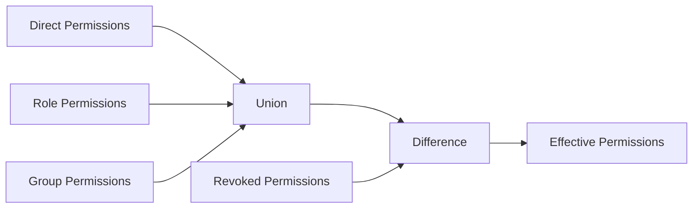
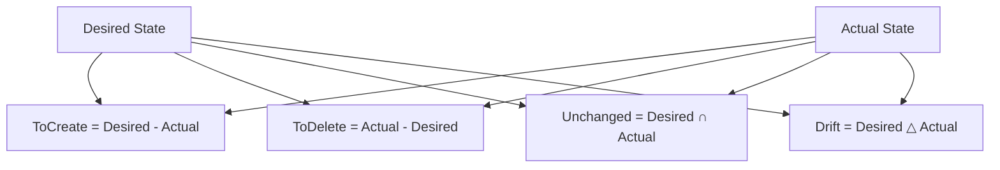
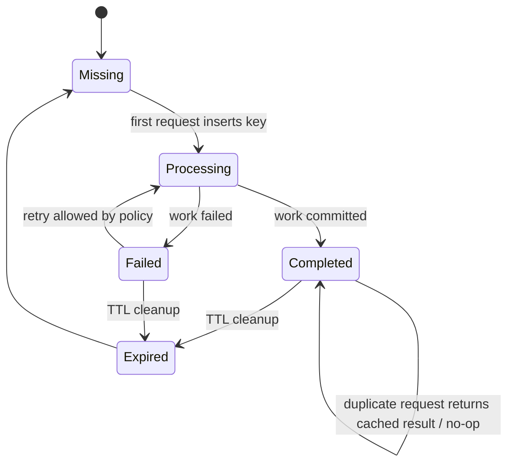
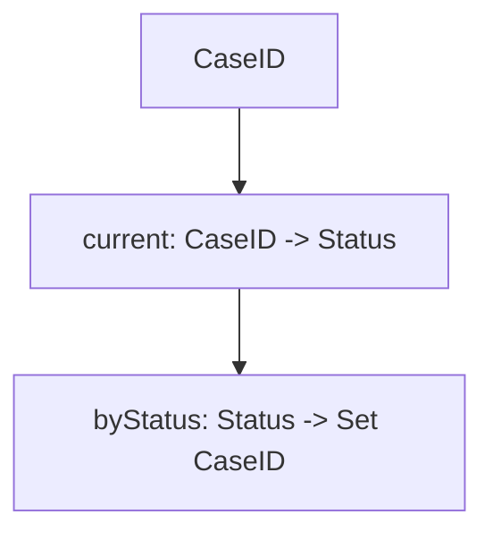
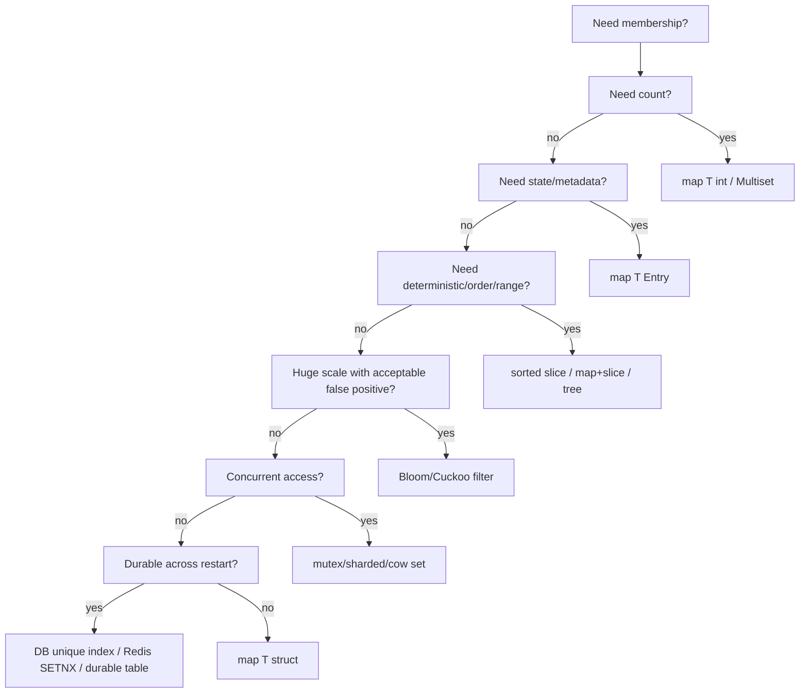

# learn-go-data-structure-algorithm-part-008.md

# Part 008 — Sets, Multisets, Bag, dan Membership Models

> Seri: `learn-go-data-structure-algorithm`  
> Bagian: `008 / 034`  
> Target: Software engineer Java yang ingin berpikir dan membangun struktur data idiomatik, efisien, dan production-grade di Go.  
> Fokus part ini: membership modelling, set, multiset, bag, equality, deduplication, set algebra, lifecycle, memory trade-off, deterministic output, dan penerapan backend nyata.

---

## 0. Posisi Part Ini dalam Seri

Di bagian sebelumnya kita sudah membahas:

1. roadmap dan mental model DSA di Go,
2. complexity model yang realistis,
3. slices sebagai sequence,
4. maps sebagai associative data,
5. sorting/searching,
6. stack/queue/deque,
7. linked list,
8. heap/priority queue.

Part ini memperdalam satu konsep yang terlihat sederhana tetapi muncul hampir di semua sistem backend: **membership**.

Pertanyaan dasarnya:

> “Apakah elemen X ada di dalam koleksi ini?”

Dari pertanyaan sesederhana itu, lahir banyak desain:

- set,
- multiset,
- bag,
- duplicate detection,
- idempotency store,
- permission aggregation,
- reverse index,
- visited node tracking,
- uniqueness constraint,
- conflict detection,
- anti-join,
- allowlist/denylist,
- cache admission,
- feature flag targeting,
- dependency reachability.

Di Java, kita biasanya memakai `HashSet`, `TreeSet`, `LinkedHashSet`, `EnumSet`, `ConcurrentHashMap.newKeySet()`, atau third-party collections. Di Go, tidak ada built-in `Set` type di standard library. Idiom paling umum adalah:

```go
seen := map[string]struct{}{}
seen["A"] = struct{}{}
_, ok := seen["A"]
```

Namun memahami “set di Go” bukan hanya menghafal `map[T]struct{}`. Engineer yang kuat harus memahami:

- apa sebenarnya kontrak membership,
- bagaimana equality didefinisikan,
- kapan butuh count bukan hanya presence,
- kapan output harus deterministic,
- bagaimana memory bertumbuh,
- kapan stale membership menjadi bug,
- kapan set harus punya TTL atau lifecycle,
- kapan unordered set tidak cukup,
- kapan probabilistic set lebih tepat daripada exact set.

Part ini akan membangun fondasi itu.

---

## 1. Mental Model: Set adalah Struktur Data untuk Pertanyaan Membership

Secara matematis, set adalah koleksi elemen unik.

Dalam engineering, definisi lebih praktis:

> Set adalah struktur data yang menjawab apakah suatu identitas sudah tercatat, tanpa memperdulikan berapa kali elemen itu dimasukkan.

Contoh:

```go
visited := map[int]struct{}{}

if _, ok := visited[nodeID]; ok {
    // node sudah pernah dikunjungi
}

visited[nodeID] = struct{}{}
```

Kontrak utamanya:

| Operasi | Makna | Umum |
|---|---|---|
| Add | catat elemen sebagai anggota | O(1) average dengan map |
| Contains | cek apakah elemen anggota | O(1) average dengan map |
| Remove | hilangkan elemen | O(1) average dengan map |
| Size | jumlah anggota unik | O(1) via `len(m)` |
| Iterate | kunjungi semua anggota | O(n), order tidak dijamin |

Tetapi di sistem nyata, pertanyaan membership sering lebih kaya:

- Apakah user ini punya permission ini?
- Apakah event ini sudah pernah diproses?
- Apakah dependency ini sudah dikunjungi dalam DFS?
- Apakah account ini muncul di dua dataset berbeda?
- Apakah email ini masuk allowlist?
- Apakah feature flag berlaku untuk tenant ini?
- Apakah key ini masih valid sebelum TTL habis?
- Apakah item ini anggota set dengan urutan stabil?
- Apakah item ini muncul lebih dari satu kali?

Masing-masing pertanyaan mungkin membutuhkan struktur berbeda.

---

## 2. Set di Go: Idiom Dasar `map[T]struct{}`

Go tidak memiliki tipe `set` built-in. Idiom paling umum:

```go
type Set[T comparable] map[T]struct{}
```

Karena key map harus `comparable`, maka elemen set juga harus comparable.

Contoh sederhana:

```go
package main

import "fmt"

func main() {
    users := map[string]struct{}{}

    users["alice"] = struct{}{}
    users["bob"] = struct{}{}

    if _, ok := users["alice"]; ok {
        fmt.Println("alice exists")
    }

    delete(users, "bob")

    fmt.Println(len(users))
}
```

Kenapa value-nya `struct{}{}`?

Karena empty struct memiliki ukuran nol secara bahasa. Secara praktis, `map[T]struct{}` menyampaikan intent bahwa value tidak penting; hanya key membership yang penting.

Alternatif:

```go
map[T]bool
```

Contoh:

```go
seen := map[string]bool{}
seen["A"] = true

if seen["A"] {
    // exists and true
}
```

Keduanya valid, tetapi maknanya berbeda.

---

## 3. `map[T]struct{}` vs `map[T]bool`

### 3.1 `map[T]struct{}`

Gunakan ketika value benar-benar tidak bermakna.

```go
type UserSet map[string]struct{}
```

Kelebihan:

- intent jelas: hanya membership,
- tidak ada state boolean palsu,
- umum dipakai di Go,
- menghindari ambiguity `false` value.

Kekurangan:

- syntax contains sedikit lebih panjang,
- untuk pemula kurang intuitif.

Contains:

```go
_, ok := set[id]
```

### 3.2 `map[T]bool`

Gunakan ketika value boolean memang bermakna, atau ergonomics lebih penting daripada purity.

```go
allowed := map[string]bool{
    "read":  true,
    "write": true,
}

if allowed["read"] {
    // allowed
}
```

Namun hati-hati:

```go
m := map[string]bool{
    "A": false,
}

fmt.Println(m["A"]) // false
fmt.Println(m["B"]) // false juga
```

Tanpa `ok`, Anda tidak bisa membedakan:

- key tidak ada,
- key ada dengan value false.

Maka jika memakai `map[T]bool` sebagai set, sebaiknya value selalu `true`, dan delete untuk remove.

### 3.3 Decision Rule

| Kebutuhan | Pilihan |
|---|---|
| pure membership | `map[T]struct{}` |
| membership + simple readable check | `map[T]bool` bisa diterima |
| tri-state / enabled-disabled | `map[T]bool` dengan `ok` check |
| count/frequency | `map[T]int` |
| metadata | `map[T]Metadata` |
| TTL | `map[T]Entry{ExpiresAt ...}` + expiry index |

---

## 4. Generic Set Type yang Idiomatik

Untuk kode production yang sering memakai set, wrapper generic membuat API lebih jelas.

```go
package set

type Set[T comparable] struct {
    m map[T]struct{}
}

func New[T comparable](capacity int) Set[T] {
    if capacity < 0 {
        capacity = 0
    }
    return Set[T]{m: make(map[T]struct{}, capacity)}
}

func (s Set[T]) Add(v T) {
    if s.m == nil {
        // Ini tidak bisa memperbaiki nil map jika receiver value dan s.m nil,
        // karena assignment ke field map di copy receiver tetap memodifikasi header copy.
        // Maka desain zero value perlu dipikirkan. Lihat bagian berikutnya.
        panic("set is not initialized")
    }
    s.m[v] = struct{}{}
}

func (s Set[T]) Contains(v T) bool {
    _, ok := s.m[v]
    return ok
}

func (s Set[T]) Remove(v T) {
    delete(s.m, v)
}

func (s Set[T]) Len() int {
    return len(s.m)
}
```

Namun wrapper di atas punya isu: zero value tidak usable untuk `Add` karena `nil` map tidak bisa ditulis.

Ada beberapa desain.

---

## 5. Zero Value Design untuk Set

Di Go, tipe yang baik sering diharapkan punya zero value berguna. Namun untuk struktur berbasis map, zero value perlu keputusan desain.

### 5.1 Opsi A — Constructor Required

```go
type Set[T comparable] struct {
    m map[T]struct{}
}

func NewSet[T comparable](capacity int) *Set[T] {
    return &Set[T]{m: make(map[T]struct{}, capacity)}
}

func (s *Set[T]) Add(v T) {
    if s.m == nil {
        panic("nil Set: use NewSet")
    }
    s.m[v] = struct{}{}
}
```

Kelebihan:

- invariant kuat,
- bug cepat terlihat,
- cocok untuk library internal yang strict.

Kekurangan:

- zero value tidak usable,
- caller wajib ingat constructor.

### 5.2 Opsi B — Lazy Initialization

```go
type Set[T comparable] struct {
    m map[T]struct{}
}

func (s *Set[T]) Add(v T) {
    if s.m == nil {
        s.m = make(map[T]struct{})
    }
    s.m[v] = struct{}{}
}

func (s *Set[T]) Contains(v T) bool {
    _, ok := s.m[v]
    return ok
}
```

Kelebihan:

- zero value usable,
- ergonomis,
- cocok untuk app code.

Kekurangan:

- pointer receiver wajib untuk mutasi,
- ada branch setiap Add,
- concurrency tetap tidak aman tanpa lock.

### 5.3 Opsi C — Alias Map

```go
type Set[T comparable] map[T]struct{}

func NewSet[T comparable](capacity int) Set[T] {
    return make(Set[T], capacity)
}

func (s Set[T]) Add(v T) {
    s[v] = struct{}{}
}
```

Kelebihan:

- ringan,
- sintaks dekat dengan map,
- tidak ada struct wrapper.

Kekurangan:

- zero value nil map tetap panic saat Add,
- caller bisa memodifikasi langsung,
- sulit menambah metadata di kemudian hari tanpa breaking API.

### 5.4 Rekomendasi

Untuk internal application code:

```go
type Set[T comparable] struct {
    m map[T]struct{}
}
```

Dengan lazy initialization jika ergonomics penting.

Untuk library yang butuh invariant eksplisit, constructor required bisa lebih baik.

---

## 6. Production-Grade Generic Set Implementation

Berikut implementasi yang cukup baik untuk banyak kebutuhan aplikasi. Ini bukan concurrent set.

```go
package set

// Set is a non-concurrent hash set.
// The zero value is ready to use.
type Set[T comparable] struct {
    m map[T]struct{}
}

func New[T comparable](capacity int) Set[T] {
    if capacity < 0 {
        capacity = 0
    }
    return Set[T]{m: make(map[T]struct{}, capacity)}
}

func FromSlice[T comparable](values []T) Set[T] {
    s := New[T](len(values))
    for _, v := range values {
        s.Add(v)
    }
    return s
}

func (s *Set[T]) Add(v T) bool {
    if s.m == nil {
        s.m = make(map[T]struct{})
    }
    if _, ok := s.m[v]; ok {
        return false
    }
    s.m[v] = struct{}{}
    return true
}

func (s *Set[T]) Remove(v T) bool {
    if s.m == nil {
        return false
    }
    if _, ok := s.m[v]; !ok {
        return false
    }
    delete(s.m, v)
    return true
}

func (s Set[T]) Contains(v T) bool {
    _, ok := s.m[v]
    return ok
}

func (s Set[T]) Len() int {
    return len(s.m)
}

func (s Set[T]) Empty() bool {
    return len(s.m) == 0
}

func (s *Set[T]) Clear() {
    clear(s.m)
}

func (s Set[T]) Values() []T {
    out := make([]T, 0, len(s.m))
    for v := range s.m {
        out = append(out, v)
    }
    return out
}
```

Catatan penting:

- `Add` mengembalikan `true` jika elemen baru dimasukkan.
- `Remove` mengembalikan `true` jika elemen memang ada dan dihapus.
- `Values` tidak menjamin order.
- `Clear` menggunakan built-in `clear`, tersedia dalam Go modern.

---

## 7. Comparable Constraint: Batasan Fundamental Set Berbasis Map

Dalam Go, key map harus comparable.

Bisa:

```go
map[string]struct{}{}
map[int64]struct{}{}
map[[16]byte]struct{}{}
map[UserID]struct{}{}
map[CompositeKey]struct{}{}
```

Tidak bisa:

```go
map[[]byte]struct{}{}      // invalid
map[map[string]int]struct{}{} // invalid
map[func()]struct{}{}      // invalid
```

Struct bisa jadi key jika semua field comparable.

```go
type PermissionKey struct {
    Subject string
    Action  string
    Object  string
}

set := map[PermissionKey]struct{}{}
set[PermissionKey{Subject: "u1", Action: "read", Object: "case:123"}] = struct{}{}
```

Slice tidak comparable, maka `[]byte` tidak bisa jadi key. Solusi umum:

1. convert ke string,
2. hash ke fixed array,
3. encode ke comparable struct,
4. pakai custom structure dengan comparator.

Contoh key dari `[]byte`:

```go
key := string(rawBytes)
seen := map[string]struct{}{}
seen[key] = struct{}{}
```

Namun konversi `[]byte` ke `string` dapat melakukan copy dan punya implikasi memory. Jangan asal pakai untuk jalur sangat panas tanpa benchmark.

---

## 8. Equality: Apa yang Sebenarnya Disebut “Sama”?

Set selalu membutuhkan definisi equality.

Pada `map[T]struct{}`, equality mengikuti aturan Go untuk key type.

Contoh:

```go
type User struct {
    ID    string
    Email string
}

users := map[User]struct{}{}
```

Di sini dua user dianggap sama jika `ID` dan `Email` sama.

Namun mungkin domain Anda menganggap user sama jika `ID` sama saja.

Maka key seharusnya bukan `User`, melainkan `UserID`.

```go
type UserID string

seen := map[UserID]struct{}{}
seen[UserID(user.ID)] = struct{}{}
```

Rule penting:

> Jangan menjadikan seluruh object sebagai key kalau identity domain hanya sebagian field.

Anti-pattern:

```go
type Account struct {
    ID        string
    Name      string
    UpdatedAt time.Time
}

seen := map[Account]struct{}{}
```

Jika `UpdatedAt` berubah, key berubah secara logical. Ini sering menghasilkan bug dedup.

Lebih baik:

```go
type AccountID string
seen := map[AccountID]struct{}{}
```

---

## 9. Identity Key Design

Key design menentukan correctness.

Contoh domain permission:

```go
type Permission struct {
    SubjectID string
    Resource  string
    Action    string
}
```

Apakah permission unik berdasarkan:

- subject saja?
- subject + resource?
- subject + action?
- resource + action?
- subject + resource + action?
- subject + tenant + resource + action?

Jika multi-tenant, lupa tenant adalah bug serius.

```go
type PermissionKey struct {
    TenantID  string
    SubjectID string
    Resource  string
    Action    string
}
```

Untuk sistem regulatory/case-management, key harus eksplisit karena berdampak pada defensibility:

```go
type CaseActorPermissionKey struct {
    AgencyID string
    CaseID   string
    ActorID  string
    Action   string
}
```

Ini lebih verbose, tetapi mengurangi ambiguity.

---

## 10. Composite Key: Struct vs Encoded String

Dua cara umum membuat composite key.

### 10.1 Struct Key

```go
type Key struct {
    TenantID string
    UserID   string
    RoleID   string
}

m := map[Key]struct{}{}
m[Key{"t1", "u1", "admin"}] = struct{}{}
```

Kelebihan:

- type-safe,
- tidak perlu delimiter,
- mudah refactor,
- tidak ada collision karena encoding delimiter salah.

Kekurangan:

- key lebih besar,
- string fields tetap pointer-like header,
- hashing multi-field mungkin lebih mahal.

### 10.2 Encoded String Key

```go
func key(tenantID, userID, roleID string) string {
    return tenantID + "\x00" + userID + "\x00" + roleID
}
```

Kelebihan:

- mudah dipakai sebagai key,
- cocok untuk interop/cache key,
- bisa disimpan/log.

Kekurangan:

- allocation saat concatenation,
- delimiter collision jika tidak hati-hati,
- kurang type-safe,
- raw string key bisa tersebar.

### 10.3 Rule Praktis

Gunakan struct key untuk in-memory domain logic.

Gunakan encoded string key jika:

- memang butuh wire/cache key,
- key harus portable lintas process,
- storage eksternal memerlukan string.

---

## 11. Ordered Set vs Unordered Set

`map` di Go tidak menjamin iteration order. Maka set berbasis map adalah unordered set.

```go
for v := range set {
    fmt.Println(v) // order tidak stabil
}
```

Ini penting untuk:

- test snapshot,
- API response,
- audit output,
- deterministic report,
- deterministic hash/signature,
- reproducible build,
- stable pagination.

Jika output harus deterministic, Anda perlu sorting:

```go
values := make([]string, 0, len(set))
for v := range set {
    values = append(values, v)
}
slices.Sort(values)
```

Atau desain ordered set.

### 11.1 Ordered Set dengan Slice + Map

```go
type OrderedSet[T comparable] struct {
    index map[T]int
    items []T
}

func (s *OrderedSet[T]) Add(v T) bool {
    if s.index == nil {
        s.index = make(map[T]int)
    }
    if _, ok := s.index[v]; ok {
        return false
    }
    s.index[v] = len(s.items)
    s.items = append(s.items, v)
    return true
}

func (s *OrderedSet[T]) Contains(v T) bool {
    _, ok := s.index[v]
    return ok
}

func (s *OrderedSet[T]) Values() []T {
    out := make([]T, len(s.items))
    copy(out, s.items)
    return out
}
```

Remove lebih rumit jika ingin mempertahankan order.

```go
func (s *OrderedSet[T]) RemoveStable(v T) bool {
    idx, ok := s.index[v]
    if !ok {
        return false
    }
    delete(s.index, v)

    copy(s.items[idx:], s.items[idx+1:])
    var zero T
    s.items[len(s.items)-1] = zero
    s.items = s.items[:len(s.items)-1]

    for i := idx; i < len(s.items); i++ {
        s.index[s.items[i]] = i
    }
    return true
}
```

Stable remove O(n). Jika order tidak perlu dipertahankan, swap remove bisa O(1).

```go
func (s *OrderedSet[T]) RemoveUnstable(v T) bool {
    idx, ok := s.index[v]
    if !ok {
        return false
    }

    lastIdx := len(s.items) - 1
    last := s.items[lastIdx]

    s.items[idx] = last
    s.index[last] = idx

    var zero T
    s.items[lastIdx] = zero
    s.items = s.items[:lastIdx]
    delete(s.index, v)

    return true
}
```

Trade-off:

| Struktur | Contains | Add | Remove | Iteration order |
|---|---:|---:|---:|---|
| map set | O(1) avg | O(1) avg | O(1) avg | tidak stabil |
| slice only | O(n) | O(n) dedup | O(n) | stabil |
| map + slice stable remove | O(1) avg | O(1) avg | O(n) | insertion order |
| map + slice unstable remove | O(1) avg | O(1) avg | O(1) avg | tidak preserve order setelah remove |
| tree set | O(log n) | O(log n) | O(log n) | sorted |

---

## 12. Multiset / Bag: Ketika Count Penting

Set hanya menjawab “ada atau tidak”. Multiset menjawab “ada berapa kali”.

Di Go:

```go
freq := map[string]int{}

for _, word := range words {
    freq[word]++
}
```

Contoh:

```go
func Count[T comparable](values []T) map[T]int {
    counts := make(map[T]int, len(values))
    for _, v := range values {
        counts[v]++
    }
    return counts
}
```

Multiset cocok untuk:

- frequency counter,
- inventory count,
- duplicate analysis,
- scoring,
- weighted voting,
- telemetry count,
- bag-of-words,
- event aggregation.

### 12.1 Generic Multiset

```go
type Multiset[T comparable] struct {
    counts map[T]int
    total  int
}

func (m *Multiset[T]) Add(v T) {
    if m.counts == nil {
        m.counts = make(map[T]int)
    }
    m.counts[v]++
    m.total++
}

func (m *Multiset[T]) AddN(v T, n int) {
    if n <= 0 {
        return
    }
    if m.counts == nil {
        m.counts = make(map[T]int)
    }
    m.counts[v] += n
    m.total += n
}

func (m Multiset[T]) Count(v T) int {
    return m.counts[v]
}

func (m Multiset[T]) UniqueLen() int {
    return len(m.counts)
}

func (m Multiset[T]) TotalLen() int {
    return m.total
}

func (m *Multiset[T]) RemoveOne(v T) bool {
    if m.counts == nil {
        return false
    }
    c := m.counts[v]
    if c == 0 {
        return false
    }
    if c == 1 {
        delete(m.counts, v)
    } else {
        m.counts[v] = c - 1
    }
    m.total--
    return true
}
```

### 12.2 Invariant Multiset

Invariant yang harus dijaga:

```text
for all v: counts[v] > 0
total == sum(counts[v])
uniqueLen == len(counts)
```

Jangan menyimpan count nol:

```go
counts[v] = 0 // buruk jika tetap dianggap key exists
```

Lebih baik:

```go
delete(counts, v)
```

---

## 13. Set Algebra

Set algebra membantu berpikir tentang operasi domain.

Operasi utama:

- union,
- intersection,
- difference,
- symmetric difference,
- subset,
- superset,
- disjoint.

### 13.1 Union

Union: semua elemen yang ada di A atau B.

```go
func Union[T comparable](a, b map[T]struct{}) map[T]struct{} {
    out := make(map[T]struct{}, len(a)+len(b))
    for v := range a {
        out[v] = struct{}{}
    }
    for v := range b {
        out[v] = struct{}{}
    }
    return out
}
```

Use case:

- permission dari direct role + inherited role,
- combined allowlist,
- merged dependency set,
- aggregated feature targets.

### 13.2 Intersection

Intersection: elemen yang ada di A dan B.

```go
func Intersection[T comparable](a, b map[T]struct{}) map[T]struct{} {
    if len(a) > len(b) {
        a, b = b, a
    }

    out := make(map[T]struct{})
    for v := range a {
        if _, ok := b[v]; ok {
            out[v] = struct{}{}
        }
    }
    return out
}
```

Optimasi: iterate set yang lebih kecil.

Use case:

- common permissions,
- overlapping users,
- matching tags,
- common dependencies.

### 13.3 Difference

Difference A - B: elemen di A yang tidak ada di B.

```go
func Difference[T comparable](a, b map[T]struct{}) map[T]struct{} {
    out := make(map[T]struct{}, len(a))
    for v := range a {
        if _, ok := b[v]; !ok {
            out[v] = struct{}{}
        }
    }
    return out
}
```

Use case:

- permissions to revoke,
- records missing in target,
- cleanup candidates,
- delta sync.

### 13.4 Symmetric Difference

Symmetric difference: elemen yang ada di salah satu set, tetapi tidak keduanya.

```go
func SymmetricDifference[T comparable](a, b map[T]struct{}) map[T]struct{} {
    out := make(map[T]struct{})

    for v := range a {
        if _, ok := b[v]; !ok {
            out[v] = struct{}{}
        }
    }
    for v := range b {
        if _, ok := a[v]; !ok {
            out[v] = struct{}{}
        }
    }

    return out
}
```

Use case:

- drift detection,
- config mismatch,
- reconciliation report,
- audit diff.

### 13.5 Subset

```go
func IsSubset[T comparable](a, b map[T]struct{}) bool {
    if len(a) > len(b) {
        return false
    }
    for v := range a {
        if _, ok := b[v]; !ok {
            return false
        }
    }
    return true
}
```

Use case:

- check if required permissions are granted,
- verify dependency closure,
- validate allowed state transitions.

### 13.6 Disjoint

```go
func Disjoint[T comparable](a, b map[T]struct{}) bool {
    if len(a) > len(b) {
        a, b = b, a
    }
    for v := range a {
        if _, ok := b[v]; ok {
            return false
        }
    }
    return true
}
```

Use case:

- conflicting role detection,
- mutually exclusive flags,
- incompatible workflow states.

---

## 14. Set Algebra sebagai Domain Language

Set algebra bukan hanya teori. Ini bisa menjadi bahasa desain sistem.

Contoh permission resolution:

```text
EffectivePermissions = DirectPermissions ∪ RolePermissions ∪ GroupPermissions - RevokedPermissions
```

Dalam Mermaid:



Ini jauh lebih mudah diaudit daripada kode if-else yang tersebar.

Contoh reconciliation:

```text
ToCreate = Desired - Actual
ToDelete = Actual - Desired
Unchanged = Desired ∩ Actual
Drift = Desired △ Actual
```



---

## 15. Deduplication Patterns

Dedup adalah penggunaan set paling umum.

### 15.1 Dedup Unordered

```go
func Dedup[T comparable](values []T) []T {
    seen := make(map[T]struct{}, len(values))
    out := make([]T, 0, len(values))

    for _, v := range values {
        if _, ok := seen[v]; ok {
            continue
        }
        seen[v] = struct{}{}
        out = append(out, v)
    }

    return out
}
```

Ini sebenarnya preserve first occurrence order karena output mengikuti input.

### 15.2 Dedup Sorted Input

Jika input sudah sorted:

```go
func DedupSorted[T comparable](values []T) []T {
    if len(values) == 0 {
        return values
    }

    write := 1
    for read := 1; read < len(values); read++ {
        if values[read] != values[write-1] {
            values[write] = values[read]
            write++
        }
    }

    var zero T
    for i := write; i < len(values); i++ {
        values[i] = zero
    }

    return values[:write]
}
```

Keuntungan:

- O(1) extra memory,
- cache-friendly,
- tidak memakai map.

Kekurangan:

- hanya bekerja jika input sorted,
- sorting sebelumnya O(n log n).

### 15.3 Dedup dengan Key Function

Go map key harus comparable. Kadang entity tidak comparable, tetapi punya comparable key.

```go
type User struct {
    ID    string
    Email string
    Tags  []string
}

func DedupBy[T any, K comparable](values []T, keyFn func(T) K) []T {
    seen := make(map[K]struct{}, len(values))
    out := make([]T, 0, len(values))

    for _, v := range values {
        k := keyFn(v)
        if _, ok := seen[k]; ok {
            continue
        }
        seen[k] = struct{}{}
        out = append(out, v)
    }

    return out
}
```

Pemakaian:

```go
users = DedupBy(users, func(u User) string { return u.ID })
```

Ini pattern penting untuk production karena identity domain sering bukan seluruh object.

---

## 16. Duplicate Detection vs Deduplication

Deduplication menghasilkan output unik.

Duplicate detection hanya ingin tahu apakah ada duplicate.

```go
func HasDuplicate[T comparable](values []T) bool {
    seen := make(map[T]struct{}, len(values))
    for _, v := range values {
        if _, ok := seen[v]; ok {
            return true
        }
        seen[v] = struct{}{}
    }
    return false
}
```

Jika hanya butuh boolean, jangan membangun output slice.

Jika butuh daftar duplicate pertama:

```go
func Duplicates[T comparable](values []T) []T {
    seen := make(map[T]struct{}, len(values))
    dupSeen := make(map[T]struct{})
    duplicates := make([]T, 0)

    for _, v := range values {
        if _, ok := seen[v]; !ok {
            seen[v] = struct{}{}
            continue
        }
        if _, ok := dupSeen[v]; ok {
            continue
        }
        dupSeen[v] = struct{}{}
        duplicates = append(duplicates, v)
    }

    return duplicates
}
```

---

## 17. Membership Lifecycle: Set yang Tidak Pernah Dibersihkan adalah Memory Leak Logis

Banyak production bug muncul bukan karena set salah secara algoritma, tetapi karena lifecycle tidak jelas.

Contoh buruk:

```go
var processed = map[string]struct{}{}

func Handle(event Event) {
    if _, ok := processed[event.ID]; ok {
        return
    }
    processed[event.ID] = struct{}{}
    process(event)
}
```

Jika service hidup berbulan-bulan dan event ID terus bertambah, map tumbuh tanpa batas.

Pertanyaan lifecycle:

- Berapa lama membership valid?
- Apakah set bounded?
- Siapa yang membersihkan?
- Apa yang terjadi saat restart?
- Apakah duplicate lama masih perlu dicegah?
- Apakah membership harus durable?
- Apakah memory cap tersedia?
- Apakah eviction aman?

Untuk idempotency, set in-memory sering tidak cukup. Anda mungkin butuh:

- TTL cache,
- Redis,
- database uniqueness constraint,
- durable idempotency table,
- compacted log.

---

## 18. TTL Set

TTL set menjawab:

> “Apakah elemen pernah terlihat dalam jangka waktu tertentu?”

Entry:

```go
type ttlEntry struct {
    expiresAt int64
}

type TTLSet[T comparable] struct {
    items map[T]ttlEntry
}
```

Sederhana:

```go
func (s *TTLSet[T]) Add(v T, now, ttl int64) {
    if s.items == nil {
        s.items = make(map[T]ttlEntry)
    }
    s.items[v] = ttlEntry{expiresAt: now + ttl}
}

func (s TTLSet[T]) Contains(v T, now int64) bool {
    e, ok := s.items[v]
    if !ok {
        return false
    }
    return now < e.expiresAt
}
```

Namun ada masalah: entry expired tetap tersimpan.

Butuh cleanup:

```go
func (s *TTLSet[T]) Sweep(now int64, max int) int {
    if max <= 0 {
        return 0
    }

    removed := 0
    for v, e := range s.items {
        if now >= e.expiresAt {
            delete(s.items, v)
            removed++
            if removed >= max {
                break
            }
        }
    }
    return removed
}
```

Ini lazy sweep sederhana. Untuk skala besar, butuh expiry index:

- min-heap by expiry,
- timing wheel,
- bucketed expiration.

Part TTL cache dan scheduler akan dibahas lebih dalam di Part 024 dan 025.

---

## 19. Memory Trade-off pada Set Besar

Set berbasis map sangat nyaman, tetapi tidak gratis.

Biaya utama:

- hash table bucket overhead,
- key storage/copy,
- pointer scanning jika key/value mengandung pointer,
- rehash/growth cost,
- memory retention setelah delete banyak elemen,
- nondeterministic iteration.

Contoh:

```go
seen := make(map[string]struct{}, 10_000_000)
```

Jika key adalah string panjang unik, memory tidak hanya map; backing string juga harus dipertimbangkan.

Jika string berasal dari substring yang retain buffer besar, ini bisa parah.

Rule:

> Untuk set besar, hitung memory dari key, bukan hanya jumlah entry.

### 19.1 Preallocation

Jika tahu ukuran kira-kira:

```go
seen := make(map[string]struct{}, len(values))
```

Ini dapat mengurangi growth/rehash.

Namun jangan over-allocate ekstrem tanpa alasan.

### 19.2 Delete Tidak Selalu Mengembalikan Memory ke OS

Jika map pernah sangat besar lalu banyak delete, kapasitas internal mungkin tetap besar. Untuk benar-benar mengecilkan, buat map baru.

```go
func CompactSet[T comparable](old map[T]struct{}) map[T]struct{} {
    fresh := make(map[T]struct{}, len(old))
    for v := range old {
        fresh[v] = struct{}{}
    }
    return fresh
}
```

### 19.3 Clear vs Recreate

```go
clear(seen)
```

Menghapus entry, tetapi dapat mempertahankan alokasi internal untuk reuse.

Jika set akan dipakai lagi dengan ukuran mirip, `clear` bagus.

Jika set besar sementara dan ingin lepas memory, buat map baru atau nil-kan referensi:

```go
seen = nil
```

Atau:

```go
seen = make(map[string]struct{})
```

---

## 20. Deterministic Output untuk Test, API, dan Audit

Karena map iteration tidak stabil, output dari set harus disortir jika perlu deterministic.

```go
func SortedValues(set map[string]struct{}) []string {
    values := make([]string, 0, len(set))
    for v := range set {
        values = append(values, v)
    }
    slices.Sort(values)
    return values
}
```

Untuk type custom:

```go
type PermissionKey struct {
    Resource string
    Action   string
}

func SortedPermissions(set map[PermissionKey]struct{}) []PermissionKey {
    values := make([]PermissionKey, 0, len(set))
    for v := range set {
        values = append(values, v)
    }

    slices.SortFunc(values, func(a, b PermissionKey) int {
        if c := cmp.Compare(a.Resource, b.Resource); c != 0 {
            return c
        }
        return cmp.Compare(a.Action, b.Action)
    })

    return values
}
```

Rule:

> Jangan expose order map ke luar package jika konsumen mungkin menganggapnya stabil.

---

## 21. Set dalam Graph Algorithms: Visited dan Recursion Guard

Set sering dipakai untuk graph traversal.

```go
func DFS(graph map[string][]string, start string) []string {
    visited := make(map[string]struct{})
    order := make([]string, 0)

    var walk func(string)
    walk = func(node string) {
        if _, ok := visited[node]; ok {
            return
        }
        visited[node] = struct{}{}
        order = append(order, node)

        for _, next := range graph[node] {
            walk(next)
        }
    }

    walk(start)
    return order
}
```

Namun cycle detection membutuhkan lebih dari satu set.

```go
type Mark uint8

const (
    Unvisited Mark = iota
    Visiting
    Done
)
```

Atau:

```go
visiting := map[string]struct{}{}
done := map[string]struct{}{}
```

Membership model:

- `visiting`: sedang di recursion stack,
- `done`: sudah selesai diproses.

Ini bukan sekadar set; ini state machine kecil.

---

## 22. Set untuk Permission Resolution

Permission sering natural sebagai set.

```go
type Permission string

type PrincipalPermissions struct {
    Direct  map[Permission]struct{}
    Role    map[Permission]struct{}
    Group   map[Permission]struct{}
    Revoked map[Permission]struct{}
}
```

Effective permission:

```go
func Effective(p PrincipalPermissions) map[Permission]struct{} {
    effective := make(map[Permission]struct{}, len(p.Direct)+len(p.Role)+len(p.Group))

    for x := range p.Direct {
        effective[x] = struct{}{}
    }
    for x := range p.Role {
        effective[x] = struct{}{}
    }
    for x := range p.Group {
        effective[x] = struct{}{}
    }
    for x := range p.Revoked {
        delete(effective, x)
    }

    return effective
}
```

Invariant domain:

```text
Revoked permission must override granted permission.
Effective permission must be deterministic for same input set.
Permission key must include tenant/context when authorization is scoped.
```

Jangan lupa scoping.

Buruk:

```go
type Permission string // "case:read"
```

Lebih defensible:

```go
type PermissionKey struct {
    TenantID string
    CaseID   string
    Action   string
}
```

---

## 23. Set untuk Idempotency

Idempotency sering dimodelkan sebagai set “processed keys”.

```go
processed := map[string]struct{}{}
```

Namun production idempotency punya kebutuhan lebih besar:

- key harus durable,
- race-safe,
- punya TTL,
- bisa distinguish processing vs completed vs failed,
- punya response replay kadang,
- atomic check-and-insert.

Set sederhana hanya cukup untuk single-process toy scenario.

State lebih realistis:

```go
type IdempotencyState uint8

const (
    Processing IdempotencyState = iota + 1
    Completed
    Failed
)

type IdempotencyEntry struct {
    State     IdempotencyState
    ExpiresAt int64
}

store := map[string]IdempotencyEntry{}
```

Diagram:



Lesson:

> Banyak problem yang terlihat seperti set sebenarnya membutuhkan map ke state.

---

## 24. Set untuk Reverse Index

Reverse index: dari value ke kumpulan owner.

Contoh: role ke users.

```go
roleUsers := map[string]map[string]struct{}{}
```

Add:

```go
func AddRoleUser(index map[string]map[string]struct{}, roleID, userID string) {
    users := index[roleID]
    if users == nil {
        users = make(map[string]struct{})
        index[roleID] = users
    }
    users[userID] = struct{}{}
}
```

Remove:

```go
func RemoveRoleUser(index map[string]map[string]struct{}, roleID, userID string) {
    users := index[roleID]
    if users == nil {
        return
    }
    delete(users, userID)
    if len(users) == 0 {
        delete(index, roleID)
    }
}
```

Invariant:

```text
if roleID exists in index, len(index[roleID]) > 0
no empty child set retained unless intentionally cached
```

Reverse index cocok untuk:

- tag -> documents,
- role -> users,
- permission -> subjects,
- dependency -> dependents,
- status -> case IDs,
- tenant -> active sessions.

---

## 25. Set untuk Anti-Join dan Reconciliation

Anti-join: temukan item di A yang tidak ada di B.

```go
func MissingInTarget(source, target []string) []string {
    targetSet := make(map[string]struct{}, len(target))
    for _, id := range target {
        targetSet[id] = struct{}{}
    }

    missing := make([]string, 0)
    for _, id := range source {
        if _, ok := targetSet[id]; !ok {
            missing = append(missing, id)
        }
    }

    return missing
}
```

Untuk data besar, pilih set yang lebih kecil sebagai lookup jika logic memungkinkan.

Jika A besar dan B kecil, `B` jadi set.

Jika keduanya sorted, bisa two-pointer tanpa map.

```go
func DifferenceSorted(a, b []string) []string {
    out := make([]string, 0)
    i, j := 0, 0

    for i < len(a) && j < len(b) {
        switch cmp.Compare(a[i], b[j]) {
        case 0:
            i++
            j++
        case -1:
            out = append(out, a[i])
            i++
        case 1:
            j++
        }
    }

    out = append(out, a[i:]...)
    return out
}
```

Sorted approach:

- O(n + m),
- O(1) extra memory excluding output,
- deterministic,
- very cache-friendly.

Map approach:

- O(n + m) average,
- O(m) extra memory,
- good if unsorted.

---

## 26. Bitset: Set untuk Domain Integer Kecil/Padat

Jika universe berupa integer kecil dan padat, bitset jauh lebih hemat daripada map.

Contoh: permission flag 0..127.

```go
type Bitset []uint64

func NewBitset(size int) Bitset {
    return make([]uint64, (size+63)/64)
}

func (b Bitset) Add(x int) {
    b[x/64] |= 1 << uint(x%64)
}

func (b Bitset) Contains(x int) bool {
    return b[x/64]&(1<<uint(x%64)) != 0
}

func (b Bitset) Remove(x int) {
    b[x/64] &^= 1 << uint(x%64)
}
```

Set algebra sangat cepat:

```go
func (b Bitset) UnionWith(other Bitset) {
    for i := range b {
        b[i] |= other[i]
    }
}

func (b Bitset) IntersectWith(other Bitset) {
    for i := range b {
        b[i] &= other[i]
    }
}
```

Cocok untuk:

- permission flags,
- feature flags,
- dense IDs,
- small enum sets,
- bitmap index,
- fast filtering.

Tidak cocok jika:

- ID sparse sangat besar,
- key bukan integer,
- universe tidak jelas,
- butuh dynamic huge sparse set.

---

## 27. Sparse Set

Sparse set adalah struktur untuk integer set yang memungkinkan O(1) add/contains/remove dan iteration padat atas elemen aktif.

Konsep:

- `dense` menyimpan elemen aktif,
- `sparse[x]` menyimpan posisi x di dense.

```go
type SparseSet struct {
    dense  []int
    sparse []int
}

func NewSparseSet(universe int) *SparseSet {
    return &SparseSet{
        dense:  make([]int, 0),
        sparse: make([]int, universe),
    }
}

func (s *SparseSet) Contains(x int) bool {
    if x < 0 || x >= len(s.sparse) {
        return false
    }
    i := s.sparse[x]
    return i < len(s.dense) && s.dense[i] == x
}

func (s *SparseSet) Add(x int) bool {
    if s.Contains(x) {
        return false
    }
    s.sparse[x] = len(s.dense)
    s.dense = append(s.dense, x)
    return true
}

func (s *SparseSet) Remove(x int) bool {
    if !s.Contains(x) {
        return false
    }

    i := s.sparse[x]
    last := s.dense[len(s.dense)-1]
    s.dense[i] = last
    s.sparse[last] = i
    s.dense = s.dense[:len(s.dense)-1]
    return true
}
```

Trade-off:

- very fast,
- no hashing,
- great iteration,
- needs known bounded universe,
- memory O(universe), not O(active).

---

## 28. When Set is the Wrong Tool

Set bukan jawaban untuk semua.

### 28.1 Butuh Count

Gunakan multiset:

```go
map[T]int
```

### 28.2 Butuh Metadata

Gunakan map ke struct:

```go
map[T]Entry
```

### 28.3 Butuh Order

Gunakan:

- sorted slice,
- map + slice,
- tree,
- heap jika priority.

### 28.4 Butuh Range Query

Set hash tidak bisa menjawab range dengan efisien.

Gunakan:

- sorted slice,
- balanced tree,
- B-tree,
- interval tree,
- segment tree.

### 28.5 Butuh Approximate Membership Sangat Besar

Gunakan probabilistic structure:

- Bloom filter,
- Cuckoo filter.

### 28.6 Butuh Durable Uniqueness

Gunakan storage constraint:

- database unique index,
- Redis SETNX,
- durable idempotency table,
- transactional insert.

---

## 29. Concurrency Safety

Map/set biasa tidak aman untuk concurrent write.

Buruk:

```go
seen := map[string]struct{}{}

go func() { seen["a"] = struct{}{} }()
go func() { seen["b"] = struct{}{} }()
```

Gunakan lock:

```go
type SafeSet[T comparable] struct {
    mu sync.RWMutex
    m  map[T]struct{}
}

func (s *SafeSet[T]) Add(v T) bool {
    s.mu.Lock()
    defer s.mu.Unlock()

    if s.m == nil {
        s.m = make(map[T]struct{})
    }
    if _, ok := s.m[v]; ok {
        return false
    }
    s.m[v] = struct{}{}
    return true
}

func (s *SafeSet[T]) Contains(v T) bool {
    s.mu.RLock()
    defer s.mu.RUnlock()

    _, ok := s.m[v]
    return ok
}
```

Namun jangan otomatis membuat semua set concurrent. Lock punya biaya dan kompleksitas.

Decision:

| Situasi | Desain |
|---|---|
| single goroutine owns set | plain map set |
| read/write dari banyak goroutine | mutex/RWMutex |
| high contention | sharded set |
| read-mostly snapshot | copy-on-write |
| ephemeral per request | plain local set |
| cross-process uniqueness | external store |

Part concurrent data structure akan dibahas lebih dalam di Part 026.

---

## 30. Sharded Set

Untuk high contention, shard berdasarkan hash/key.

Contoh sederhana untuk string:

```go
type shard struct {
    mu sync.RWMutex
    m  map[string]struct{}
}

type ShardedSet struct {
    shards []shard
}

func NewShardedSet(n int) *ShardedSet {
    if n <= 0 {
        n = 16
    }
    s := &ShardedSet{shards: make([]shard, n)}
    for i := range s.shards {
        s.shards[i].m = make(map[string]struct{})
    }
    return s
}
```

Butuh hash:

```go
func fnv32(s string) uint32 {
    var h uint32 = 2166136261
    for i := 0; i < len(s); i++ {
        h ^= uint32(s[i])
        h *= 16777619
    }
    return h
}

func (s *ShardedSet) shardFor(v string) *shard {
    return &s.shards[int(fnv32(v))%len(s.shards)]
}
```

Add:

```go
func (s *ShardedSet) Add(v string) bool {
    sh := s.shardFor(v)
    sh.mu.Lock()
    defer sh.mu.Unlock()

    if _, ok := sh.m[v]; ok {
        return false
    }
    sh.m[v] = struct{}{}
    return true
}
```

Contains:

```go
func (s *ShardedSet) Contains(v string) bool {
    sh := s.shardFor(v)
    sh.mu.RLock()
    defer sh.mu.RUnlock()

    _, ok := sh.m[v]
    return ok
}
```

Trade-off:

- throughput lebih baik pada write paralel,
- operation global seperti Len/Values lebih kompleks,
- hash quality penting,
- shard count harus dipilih wajar.

---

## 31. Copy-on-Write Set untuk Read-Mostly Data

Untuk data yang jarang berubah tetapi sering dibaca, copy-on-write bisa menarik.

Mental model:

```text
readers read immutable map snapshot
writer copies map, mutates copy, publishes new snapshot atomically
```

Di Go, map tidak boleh dimutasi saat reader membaca. Maka snapshot harus diperlakukan immutable setelah publish.

Pseudo-design:

```go
type SnapshotSet[T comparable] struct {
    // conceptually atomic pointer to immutable map snapshot
}
```

Kapan cocok:

- config allowlist,
- feature flag target,
- routing table,
- permission table yang reload periodik,
- policy snapshot.

Kapan tidak cocok:

- write-heavy,
- huge map with frequent mutation,
- strict memory cap,
- per-item update tinggi.

Part persistent/versioned data structures akan membahas ini lebih dalam.

---

## 32. Probabilistic Membership: Ketika Exact Set Terlalu Mahal

Untuk data sangat besar, exact set bisa terlalu mahal.

Pertanyaan:

> Apakah item ini mungkin pernah terlihat?

Bloom filter menjawab:

- “definitely not present”, atau
- “maybe present”.

Ada false positive, tidak ada false negative dalam model dasar jika tidak ada delete.

Cocok untuk:

- precheck sebelum disk lookup,
- duplicate detection kasar,
- cache admission,
- abuse detection,
- crawler visited URL scale besar.

Tidak cocok untuk:

- authorization decision final,
- billing correctness,
- legal/audit decision,
- idempotency final tanpa fallback exact check.

Probabilistic structures akan dibahas di Part 023.

---

## 33. Case Study 1: Permission Union dengan Revocation

Requirement:

- User mendapat permission dari direct grant, role, dan group.
- Revocation harus override grant.
- Output harus deterministic untuk audit.

Model:

```go
type PermissionKey struct {
    TenantID string
    Resource string
    Action   string
}

type PermissionInput struct {
    Direct  map[PermissionKey]struct{}
    Role    map[PermissionKey]struct{}
    Group   map[PermissionKey]struct{}
    Revoked map[PermissionKey]struct{}
}
```

Implementation:

```go
func ResolvePermissions(in PermissionInput) []PermissionKey {
    effective := make(map[PermissionKey]struct{}, len(in.Direct)+len(in.Role)+len(in.Group))

    for p := range in.Direct {
        effective[p] = struct{}{}
    }
    for p := range in.Role {
        effective[p] = struct{}{}
    }
    for p := range in.Group {
        effective[p] = struct{}{}
    }
    for p := range in.Revoked {
        delete(effective, p)
    }

    out := make([]PermissionKey, 0, len(effective))
    for p := range effective {
        out = append(out, p)
    }

    slices.SortFunc(out, func(a, b PermissionKey) int {
        if c := cmp.Compare(a.TenantID, b.TenantID); c != 0 {
            return c
        }
        if c := cmp.Compare(a.Resource, b.Resource); c != 0 {
            return c
        }
        return cmp.Compare(a.Action, b.Action)
    })

    return out
}
```

Invariants:

```text
No revoked permission appears in output.
Output order is deterministic.
Permission equality includes tenant scope.
Duplicate grants collapse to one effective permission.
```

---

## 34. Case Study 2: Duplicate Event Detection dalam Batch

Requirement:

- Batch event tidak boleh punya duplicate event ID.
- Perlu report semua duplicate, bukan hanya fail fast.
- Output duplicate harus stable.

```go
type Event struct {
    ID      string
    Payload []byte
}

func DuplicateEventIDs(events []Event) []string {
    seen := make(map[string]struct{}, len(events))
    duplicated := make(map[string]struct{})
    out := make([]string, 0)

    for _, e := range events {
        if _, ok := seen[e.ID]; !ok {
            seen[e.ID] = struct{}{}
            continue
        }

        if _, ok := duplicated[e.ID]; ok {
            continue
        }

        duplicated[e.ID] = struct{}{}
        out = append(out, e.ID)
    }

    return out
}
```

Invariant:

```text
Each duplicate ID appears at most once in output.
Output follows first duplicate encounter order.
```

---

## 35. Case Study 3: Reverse Index untuk Case Status

Misal case management system perlu index status -> case IDs.

```go
type CaseID string
type Status string

type StatusIndex struct {
    byStatus map[Status]map[CaseID]struct{}
    current  map[CaseID]Status
}
```

Update status:

```go
func (idx *StatusIndex) Move(caseID CaseID, newStatus Status) {
    if idx.byStatus == nil {
        idx.byStatus = make(map[Status]map[CaseID]struct{})
    }
    if idx.current == nil {
        idx.current = make(map[CaseID]Status)
    }

    if oldStatus, ok := idx.current[caseID]; ok {
        cases := idx.byStatus[oldStatus]
        delete(cases, caseID)
        if len(cases) == 0 {
            delete(idx.byStatus, oldStatus)
        }
    }

    cases := idx.byStatus[newStatus]
    if cases == nil {
        cases = make(map[CaseID]struct{})
        idx.byStatus[newStatus] = cases
    }
    cases[caseID] = struct{}{}
    idx.current[caseID] = newStatus
}
```

Invariants:

```text
Each caseID belongs to at most one status set.
current[caseID] matches exactly one byStatus membership.
No empty status set retained.
```

Mermaid:



---

## 36. Testing Set Structures

Minimum tests:

```go
func TestSetAddContainsRemove(t *testing.T) {
    var s Set[string]

    if s.Contains("a") {
        t.Fatal("empty set contains a")
    }

    if !s.Add("a") {
        t.Fatal("first add should return true")
    }
    if !s.Contains("a") {
        t.Fatal("set should contain a")
    }
    if s.Add("a") {
        t.Fatal("second add should return false")
    }
    if !s.Remove("a") {
        t.Fatal("remove existing should return true")
    }
    if s.Contains("a") {
        t.Fatal("set should not contain a after remove")
    }
    if s.Remove("a") {
        t.Fatal("remove missing should return false")
    }
}
```

Property ideas:

```text
Add(x) => Contains(x) == true
Remove(x) => Contains(x) == false
Add(x) twice does not increase Len twice
Union(A, B) contains all A and all B
Intersection(A, B) contains only elements in both
Difference(A, B) contains no element from B
```

Differential testing:

- compare custom `Set[T]` against raw `map[T]struct{}`,
- random operation sequence,
- after each operation compare membership and len.

---

## 37. Benchmarking Membership

Benchmark dimensions:

- key type: int/string/struct,
- size: 10, 1K, 1M,
- hit ratio: 0%, 50%, 100%,
- access distribution: uniform vs skewed,
- construction vs lookup,
- memory allocation,
- deterministic output cost.

Example:

```go
func BenchmarkSetContainsString(b *testing.B) {
    values := make([]string, 100_000)
    set := make(map[string]struct{}, len(values))

    for i := range values {
        values[i] = strconv.Itoa(i)
        set[values[i]] = struct{}{}
    }

    b.ReportAllocs()
    b.ResetTimer()

    for i := 0; i < b.N; i++ {
        _, _ = set[values[i%len(values)]]
    }
}
```

Benchmark anti-pattern:

- benchmark hanya 10 item lalu klaim production performance,
- tidak report allocation,
- key generation masuk timed section padahal bukan target,
- semua lookup hit padahal production mostly miss,
- tidak benchmark construction cost.

---

## 38. Common Anti-Patterns

### 38.1 Menggunakan Object Besar sebagai Key

```go
map[LargeStruct]struct{}{}
```

Jika identity hanya ID, gunakan ID.

### 38.2 Tidak Memikirkan Scope

```go
map[UserID]struct{}{}
```

Dalam multi-tenant system mungkin harus:

```go
type Key struct {
    TenantID string
    UserID   string
}
```

### 38.3 Mengandalkan Map Iteration Order

Output jadi flakey.

### 38.4 Set Global Tanpa Lifecycle

Memory tumbuh tanpa batas.

### 38.5 Count Nol Tetap Disimpan

```go
counts[k] = 0
```

Lebih baik `delete(counts, k)`.

### 38.6 `map[T]bool` tanpa `ok` saat false bermakna

Ambiguous.

### 38.7 Concurrent Write ke Map

Fatal di runtime atau data race.

### 38.8 Dedup dengan String Concatenation Rapuh

```go
key := a + ":" + b
```

Jika `a` atau `b` bisa mengandung `:`, collision semantic mungkin terjadi.

### 38.9 Set untuk Range Query

Hash set buruk untuk range. Gunakan ordered structure.

### 38.10 Exact Set Padahal Data Sangat Besar dan False Positive Diterima

Pertimbangkan Bloom filter.

---

## 39. Design Checklist

Sebelum memakai set, jawab:

```text
1. Apa definisi equality?
2. Apa key minimal yang benar?
3. Apakah key harus menyertakan tenant/scope/context?
4. Apakah hanya membership, atau perlu count/state/metadata?
5. Apakah output harus deterministic?
6. Apakah set bounded?
7. Apa lifecycle dan cleanup policy?
8. Apakah concurrent access terjadi?
9. Apakah membership harus durable lintas restart?
10. Apakah range/order query diperlukan?
11. Apakah exact membership wajib?
12. Apakah memory cukup untuk worst-case cardinality?
13. Apakah delete banyak entry butuh compaction?
14. Apakah key allocation mahal?
15. Apakah perlu benchmark dengan distribusi realistis?
```

---

## 40. Mental Model Summary

Set bukan “map tanpa value”. Set adalah cara menyatakan invariant membership.

Di Go, implementasi default-nya memang `map[T]struct{}`, tetapi engineering decision sebenarnya berada di sekitar:

- key identity,
- equality,
- scope,
- lifecycle,
- order,
- count/state,
- memory,
- concurrency,
- durability,
- deterministic behavior.

Diagram ringkas:



---

## 41. Latihan

### Latihan 1 — Implement Generic Set

Buat package `set` dengan:

```go
type Set[T comparable] struct { ... }
```

Method:

- `Add(T) bool`,
- `Remove(T) bool`,
- `Contains(T) bool`,
- `Len() int`,
- `Values() []T`,
- `Clear()`.

Pastikan zero value usable.

### Latihan 2 — Implement Set Algebra

Implement:

- `Union`,
- `Intersection`,
- `Difference`,
- `SymmetricDifference`,
- `IsSubset`,
- `Disjoint`.

Tambahkan tests untuk edge cases:

- empty-empty,
- empty-nonempty,
- same set,
- disjoint,
- partial overlap.

### Latihan 3 — Implement Multiset

Implement:

- `Add`,
- `AddN`,
- `RemoveOne`,
- `RemoveN`,
- `Count`,
- `UniqueLen`,
- `TotalLen`.

Pastikan invariant `total == sum(counts)`.

### Latihan 4 — Dedup By Key

Buat fungsi:

```go
func DedupBy[T any, K comparable](values []T, keyFn func(T) K) []T
```

Test dengan struct yang punya slice field sehingga tidak comparable.

### Latihan 5 — Status Reverse Index

Implement `StatusIndex` yang menjaga invariant:

- satu case hanya ada pada satu status,
- tidak ada empty status set,
- query by status deterministic.

---

## 42. Penutup Part 008

Part ini membahas set bukan sebagai “struktur data kecil”, tetapi sebagai fondasi modelling.

Poin paling penting:

1. Set menjawab membership, bukan count/state/order.
2. Di Go, default exact set adalah `map[T]struct{}`.
3. Key design adalah sumber correctness utama.
4. Output map tidak deterministic; sort jika perlu stabil.
5. Set tanpa lifecycle bisa menjadi memory leak logis.
6. Multiset dibutuhkan saat jumlah kemunculan bermakna.
7. Ordered set, bitset, sparse set, TTL set, concurrent set, dan probabilistic set adalah variasi untuk constraint berbeda.
8. Dalam production, membership sering harus dipikirkan bersama scope, auditability, durability, concurrency, dan memory cap.

Setelah memahami ini, kita siap masuk ke text-oriented data structures dan algorithms: string, bytes, runes, tokenization, prefix matching, substring search, dan trie preparation.

---

## Status Seri

```text
[selesai] Part 000 — Roadmap, Mental Model, dan Batasan Seri
[selesai] Part 001 — Complexity Model yang Realistis di Go
[selesai] Part 002 — Arrays, Slices, dan Sequence Design
[selesai] Part 003 — Maps, Hash Tables, dan Associative Data
[selesai] Part 004 — Sorting, Ordering, Comparison, dan Search
[selesai] Part 005 — Stack, Queue, Deque, dan Worklist Algorithms
[selesai] Part 006 — Linked List, Intrusive List, dan Pointer-Chasing Trade-off
[selesai] Part 007 — Heap, Priority Queue, dan Scheduling Algorithms
[selesai] Part 008 — Sets, Multisets, Bag, dan Membership Models
[berikutnya] Part 009 — Strings, Bytes, Runes, Tokenization, dan Text Algorithms
```

Seri belum selesai. Masih ada Part 009 sampai Part 034.


<!-- NAVIGATION_FOOTER -->
<div class="page-nav">
<a href="./learn-go-data-structure-algorithm-part-007.md">⬅️ Part 007 — Heap, Priority Queue, dan Scheduling Algorithms</a>
<a href="./index.md">📚 Kategori</a>
<a href="../../index.md">🏠 Home</a>
<a href="./learn-go-data-structure-algorithm-part-009.md">Part 009 — Strings, Bytes, Runes, Tokenization, dan Text Algorithms ➡️</a>
</div>
