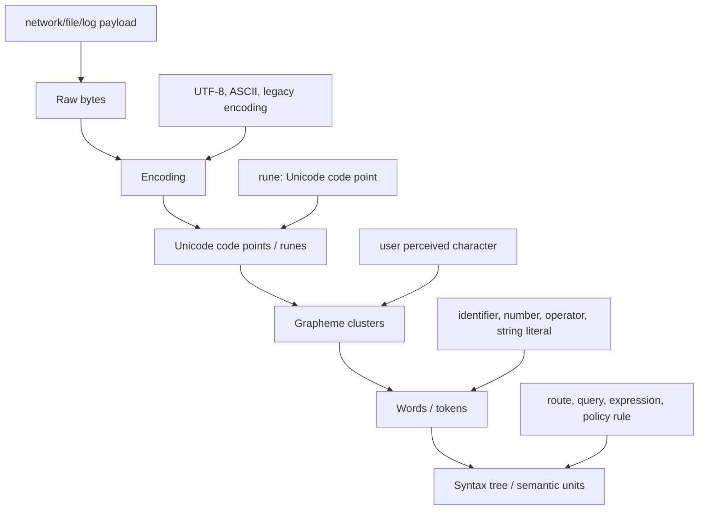
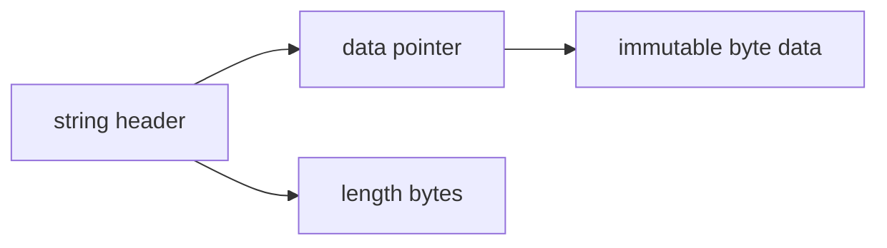

# learn-go-data-structure-algorithm-part-009.md

# Part 009 — Strings, Bytes, Runes, Tokenization, dan Text Algorithms

> Seri: `learn-go-data-structure-algorithm`  
> Bagian: `009 / 034`  
> Target pembaca: Java software engineer yang ingin memahami struktur data dan algoritma teks di Go secara production-grade.  
> Fokus: `string`, `[]byte`, `rune`, UTF-8, tokenization, substring search, parser ringan, trie, alokasi, dan failure mode pemrosesan teks.

---

## 0. Posisi Part Ini dalam Seri

Sampai part sebelumnya, kita sudah membangun fondasi struktur data linear, map/hash table, sorting/search, queue/deque/worklist, linked list, heap, dan set/multiset.

Part ini masuk ke dunia **text-oriented data structure and algorithms**.

Di backend production, teks muncul hampir di semua tempat:

- request path dan route matching,
- query string,
- header HTTP,
- JSON/XML/protobuf field name,
- log line,
- audit text,
- error message,
- search prefix,
- template token,
- rule expression,
- permission namespace,
- workflow/state code,
- idempotency key,
- external reference number,
- user-provided free text.

Banyak engineer menganggap text processing sebagai hal kecil: `strings.Split`, `strings.Contains`, `regexp`, selesai.

Itu cukup untuk banyak kasus. Tetapi untuk sistem besar, masalahnya menjadi lebih dalam:

- Apakah input ASCII, UTF-8, binary, atau campuran?
- Apakah `len(s)` berarti jumlah karakter?
- Apakah indexing string aman untuk Unicode?
- Apakah normalisasi Unicode diperlukan?
- Apakah parser menghasilkan terlalu banyak allocation?
- Apakah tokenizer bisa menangani quoted string, escape, dan error position?
- Apakah substring search harus linear, regex, KMP, trie, atau indexed?
- Apakah route matching harus ordered, trie, radix tree, atau regex list?
- Apakah prefix lookup harus case-sensitive?
- Apakah matching harus byte-level, rune-level, atau grapheme-level?
- Apakah string conversion dari `[]byte` menyalin data?
- Apakah hasil slicing string menahan backing bytes besar?

Part ini tidak mengulang materi Go dasar. Kita akan memakai Go sebagai medium untuk memahami **struktur data dan algoritma teks** yang bisa dipakai untuk membuat parser, matcher, tokenizer, index, dan route/prefix engine yang layak production.

---

## 1. Referensi Resmi dan Batasan Fakta

Materi ini disusun dengan mengacu pada rujukan resmi Go berikut:

- Go 1.26 Release Notes: `https://go.dev/doc/go1.26`
- Go Release History: `https://go.dev/doc/devel/release`
- Go Language Specification: `https://go.dev/ref/spec`
- Go Blog: “Strings, bytes, runes and characters in Go”: `https://go.dev/blog/strings`
- Package `strings`: `https://pkg.go.dev/strings`
- Package `bytes`: `https://pkg.go.dev/bytes`
- Package `unicode/utf8`: `https://pkg.go.dev/unicode/utf8`
- Package `unicode`: `https://pkg.go.dev/unicode`
- Package `regexp`: `https://pkg.go.dev/regexp`
- Package `bufio`: `https://pkg.go.dev/bufio`
- Package `strconv`: `https://pkg.go.dev/strconv`
- Package `strings.Builder`: bagian dari `strings`
- Package `bytes.Buffer`: bagian dari `bytes`

Catatan penting:

- Go string adalah **immutable sequence of bytes**.
- Source code Go sendiri menggunakan UTF-8, tetapi nilai `string` pada runtime **tidak wajib valid UTF-8**.
- `rune` adalah alias untuk `int32`, biasanya merepresentasikan Unicode code point.
- `byte` adalah alias untuk `uint8`.
- `len(s)` pada string mengembalikan jumlah byte, bukan jumlah rune atau karakter visual.
- Standard library Go menyediakan package `strings` untuk operasi string UTF-8-oriented sederhana, `bytes` untuk operasi `[]byte`, `unicode/utf8` untuk encoding/decoding/validasi UTF-8, dan `regexp` untuk regular expression.

---

## 2. Core Mental Model: Text Is Not One Thing

Kesalahan terbesar dalam text algorithm adalah menganggap “text” hanya satu level.

Padahal ada beberapa level representasi:



Contoh sederhana:

```go
s := "Go世界"
fmt.Println(len(s))         // byte length
fmt.Println(len([]rune(s))) // rune count
```

`len(s)` bukan jumlah “karakter”. Untuk ASCII murni, kebetulan sama. Untuk UTF-8 non-ASCII, tidak sama.

Sebagai Java engineer, bandingkan dengan Java:

- Java `String.length()` menghitung jumlah UTF-16 code unit, bukan Unicode code point.
- Go `len(string)` menghitung jumlah byte.
- Java `char` adalah 16-bit code unit.
- Go `rune` adalah 32-bit code point.
- Go string lebih dekat ke immutable byte sequence daripada Java UTF-16 abstraction.

Ini membuat Go sangat nyaman untuk network/file/protocol processing karena mayoritas protokol modern berbasis byte dan UTF-8. Tetapi itu juga membuat engineer harus eksplisit memilih level algoritma.

---

## 3. Production Rule: Pilih Level Algoritma Sebelum Menulis Kode

Sebelum memproses string, tanyakan:

| Pertanyaan | Jika jawabannya... | Implikasi |
|---|---:|---|
| Apakah input bisa dianggap ASCII? | Ya | Byte-level algorithm cukup dan cepat. |
| Apakah input harus valid UTF-8? | Ya | Validasi dengan `utf8.ValidString` atau saat decoding. |
| Apakah matching berdasarkan Unicode code point? | Ya | Pakai `range` string atau `utf8.DecodeRuneInString`. |
| Apakah matching berdasarkan karakter visual? | Ya | Perlu grapheme-aware library; standard library tidak cukup untuk semua kasus. |
| Apakah input binary-safe? | Ya | Jangan asumsikan string valid UTF-8. |
| Apakah performa kritikal? | Ya | Hindari allocation dari `Split`, regex, conversion berulang. |
| Apakah parsing grammar kompleks? | Ya | Buat lexer/parser, jangan tumpuk `Split`/regex ad-hoc. |

Prinsipnya:

> Jangan memilih fungsi dulu. Pilih representasi dan invariant dulu.

---

## 4. String di Go: Immutable Byte Sequence

String di Go bersifat immutable. Artinya setelah string dibuat, isi byte-nya tidak bisa diubah melalui operasi normal Go.

Mental model konseptual:



Secara konseptual, string membawa pointer ke data dan panjang byte. Detail internal runtime tidak perlu dijadikan kontrak API, tetapi model ini membantu memahami biaya operasi:

| Operasi | Biaya konseptual |
|---|---:|
| `len(s)` | O(1) |
| `s[i]` | O(1), hasil byte |
| `s[a:b]` | O(1) header slice string baru, berbagi data |
| `s + t` | O(len(s)+len(t)), alokasi string baru |
| `[]byte(s)` | copy byte |
| `string(b)` | copy byte |
| `for _, r := range s` | decode UTF-8 per rune |

Contoh:

```go
s := "hello"
fmt.Println(len(s)) // 5
fmt.Println(s[1])   // byte 'e', type uint8
```

Indexing string menghasilkan byte, bukan rune:

```go
s := "世界"
fmt.Println(len(s)) // 6 bytes, karena setiap rune CJK umum 3 bytes dalam UTF-8
fmt.Println(s[0])   // byte pertama encoding UTF-8, bukan rune '世'
```

Untuk membaca rune:

```go
for i, r := range s {
    fmt.Printf("byte offset=%d rune=%q codepoint=%U\n", i, r, r)
}
```

`i` dalam `range` string adalah **byte offset**, bukan rune index.

---

## 5. Byte, Rune, Character: Jangan Dicampur

Go punya dua alias penting:

```go
type byte = uint8
type rune = int32
```

Tetapi istilah “character” ambigu.

| Level | Go representation | Contoh |
|---|---|---|
| Byte | `byte` / `uint8` | satu byte UTF-8 |
| Code point | `rune` / `int32` | `'世'` |
| Grapheme cluster | tidak built-in penuh | `e` + combining accent dapat terlihat sebagai satu karakter visual |
| Token | custom struct | identifier, number, operator |
| Semantic node | AST/custom struct | expression, route segment, rule clause |

Contoh grapheme problem:

```go
s1 := "é"      // bisa satu code point U+00E9
s2 := "e\u0301" // e + combining acute accent

fmt.Println(s1 == s2) // false secara byte-level
```

Secara visual keduanya bisa terlihat sama, tetapi byte sequence dan rune sequence berbeda.

Untuk backend systems, sering kali byte equality memang benar:

- idempotency key,
- token,
- route path,
- ID,
- code,
- enum string,
- protocol field.

Namun untuk user-facing search, nama orang, alamat, atau free text, equality visual/linguistik bisa berbeda.

---

## 6. Kapan Pakai `string`, Kapan Pakai `[]byte`

Keputusan ini fundamental.

| Gunakan `string` ketika... | Gunakan `[]byte` ketika... |
|---|---|
| data immutable | data mutable |
| key map | buffer IO |
| identifier/code/path | parsing stream |
| sering dibandingkan | perlu append/edit in-place |
| ingin aman dari mutation caller | ingin reuse memory |
| API menerima text logical | API menerima bytes/protocol payload |

Contoh `string` cocok:

```go
type RouteKey string

type HandlerRegistry struct {
    handlers map[RouteKey]Handler
}
```

Contoh `[]byte` cocok:

```go
func normalizeHeaderName(dst []byte, src []byte) []byte {
    dst = dst[:0]
    for _, b := range src {
        if 'A' <= b && b <= 'Z' {
            b += 'a' - 'A'
        }
        dst = append(dst, b)
    }
    return dst
}
```

Rule praktis:

> Gunakan `string` untuk identity dan immutable text. Gunakan `[]byte` untuk buffer, IO, scanning, transformation, dan temporary workspace.

---

## 7. Conversion Cost: `string` <-> `[]byte`

Konversi antara string dan byte slice umumnya melakukan copy untuk menjaga immutability.

```go
b := []byte("hello") // copy
s := string(b)       // copy
```

Implikasi:

- Jangan konversi bolak-balik di hot path.
- Pilih satu representasi dominan.
- Untuk parser dari network/file, sering lebih baik scan `[]byte` dulu, lalu materialize string hanya untuk token yang perlu disimpan.
- Untuk map key, string sering praktis karena comparable dan immutable.

Anti-pattern:

```go
func badContains(payload []byte, needle string) bool {
    return strings.Contains(string(payload), needle) // allocates copy of payload
}
```

Lebih baik:

```go
func goodContains(payload []byte, needle []byte) bool {
    return bytes.Contains(payload, needle)
}
```

Atau jika input memang string dari awal:

```go
func goodStringContains(payload string, needle string) bool {
    return strings.Contains(payload, needle)
}
```

---

## 8. Hidden Retention: Substring Bisa Menahan Data Besar

Karena substring dapat berbagi data dengan string asal secara konseptual, mengambil substring kecil dari string besar dapat membuat data besar tetap hidup lebih lama.

Contoh konseptual:

```go
func extractID(line string) string {
    // line bisa sangat besar
    return line[10:30]
}
```

Jika hasil substring disimpan lama, ia bisa mempertahankan backing data besar. Untuk memutus retention, copy string kecil:

```go
func extractIDOwned(line string) string {
    id := line[10:30]
    return strings.Clone(id)
}
```

Gunakan `strings.Clone` ketika:

- substring kecil disimpan lama,
- source string besar,
- source datang dari buffer besar/log line besar,
- retention memory lebih buruk daripada biaya copy kecil.

Jangan gunakan `Clone` membabi-buta. Ini trade-off:

| Kondisi | Keputusan |
|---|---|
| substring dipakai sebentar | tidak perlu clone |
| substring disimpan lama dan source besar | clone |
| source kecil | clone kemungkinan tidak penting |
| hot path dengan banyak token temporary | hindari clone kecuali perlu ownership |

---

## 9. Concatenation, Builder, dan Buffer

String immutable berarti concatenation berulang dapat mahal.

Anti-pattern:

```go
func joinBad(parts []string) string {
    var out string
    for _, p := range parts {
        out += p // repeatedly allocates/copies
    }
    return out
}
```

Lebih baik pakai `strings.Builder`:

```go
func joinGood(parts []string) string {
    var b strings.Builder

    total := 0
    for _, p := range parts {
        total += len(p)
    }
    b.Grow(total)

    for _, p := range parts {
        b.WriteString(p)
    }
    return b.String()
}
```

Untuk bytes:

```go
func buildPayload(parts [][]byte) []byte {
    var b bytes.Buffer
    for _, p := range parts {
        b.Write(p)
    }
    return b.Bytes()
}
```

`strings.Builder` cocok untuk membangun string. `bytes.Buffer` cocok untuk membangun mutable bytes atau output IO-like.

Decision table:

| Kebutuhan | Pilihan |
|---|---|
| Bangun string final | `strings.Builder` |
| Bangun `[]byte` | `bytes.Buffer` atau append slice |
| Format kompleks | `fmt.Fprintf(&builder, ...)`, tetapi hati-hati overhead |
| Hot path sederhana | manual append/write lebih cepat |
| Jumlah output diketahui | `Grow` |

---

## 10. ASCII Fast Path

Banyak protokol backend memakai subset ASCII:

- HTTP method,
- header name,
- URL path segment tertentu,
- enum code,
- status code,
- ID,
- UUID,
- base64/base32/hex,
- numeric field,
- machine-generated key.

Jika domain invariant-nya ASCII, algoritma byte-level lebih sederhana dan cepat.

Contoh validasi identifier ASCII:

```go
func isIdentASCII(s string) bool {
    if s == "" {
        return false
    }

    for i := 0; i < len(s); i++ {
        c := s[i]
        if i == 0 {
            if !isAlpha(c) && c != '_' {
                return false
            }
            continue
        }
        if !isAlpha(c) && !isDigit(c) && c != '_' {
            return false
        }
    }
    return true
}

func isAlpha(c byte) bool {
    return ('a' <= c && c <= 'z') || ('A' <= c && c <= 'Z')
}

func isDigit(c byte) bool {
    return '0' <= c && c <= '9'
}
```

Ini tidak Unicode-aware, dan itu bukan bug jika domain memang ASCII.

Production invariant harus ditulis jelas:

```text
Invariant:
- Identifier hanya ASCII.
- Karakter valid: A-Z, a-z, 0-9, underscore.
- Karakter pertama tidak boleh digit.
- Matching case-sensitive.
```

Tanpa invariant ini, engineer berikutnya bisa salah menganggap fungsi tersebut mendukung semua bahasa.

---

## 11. UTF-8 Validation dan Decoding

Untuk validasi UTF-8:

```go
if !utf8.ValidString(s) {
    return fmt.Errorf("invalid UTF-8")
}
```

Untuk `[]byte`:

```go
if !utf8.Valid(payload) {
    return fmt.Errorf("invalid UTF-8")
}
```

Untuk decode manual:

```go
for len(s) > 0 {
    r, size := utf8.DecodeRuneInString(s)
    if r == utf8.RuneError && size == 1 {
        // could be invalid encoding or actual RuneError encoded as one byte scenario
    }
    fmt.Println(r, size)
    s = s[size:]
}
```

Namun biasanya `range` cukup:

```go
for offset, r := range s {
    fmt.Println(offset, r)
}
```

`range` atas string melakukan UTF-8 decoding. Untuk invalid UTF-8, Go menghasilkan `RuneError` pada posisi invalid. Jadi, jika input harus valid, validasi eksplisit lebih baik.

---

## 12. Tokenization: Dari Bytes ke Token

Tokenizer mengubah stream karakter/byte menjadi unit bermakna.

Contoh input:

```text
status:open priority>=3 owner="alice smith"
```

Token yang mungkin:

```text
IDENT(status)
COLON(:)
IDENT(open)
IDENT(priority)
GTE(>=)
NUMBER(3)
IDENT(owner)
EQ(=)
STRING("alice smith")


<!-- NAVIGATION_FOOTER -->
<div class="page-nav">
<a href="./learn-go-data-structure-algorithm-part-008.md">⬅️ Part 008 — Sets, Multisets, Bag, dan Membership Models</a>
<a href="./index.md">📚 Kategori</a>
<a href="../../index.md">🏠 Home</a>
<a href="./learn-go-data-structure-algorithm-part-010.md">Part 010 — Recursion, Iteration, Backtracking, dan State Space Search ➡️</a>
</div>
