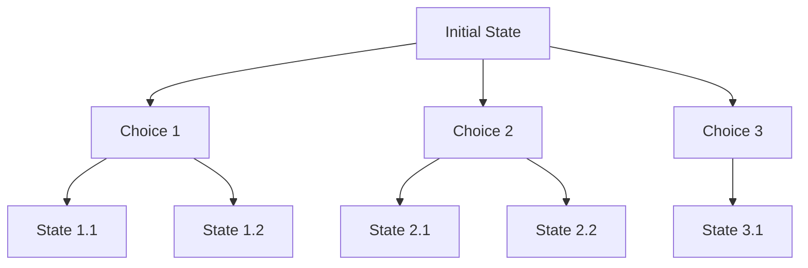
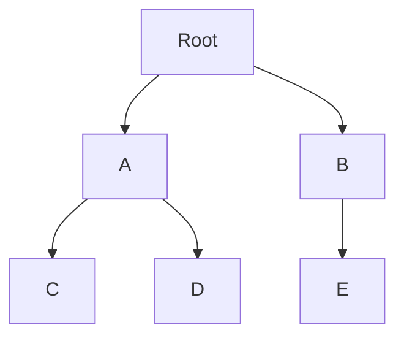
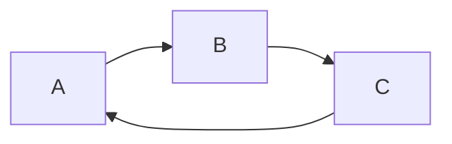
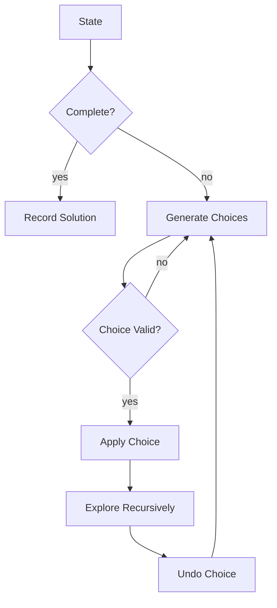
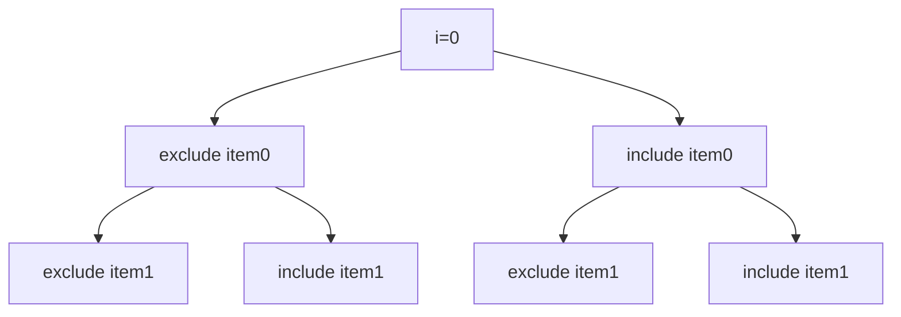
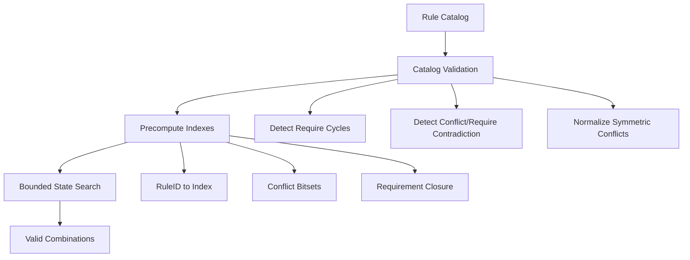

# learn-go-data-structure-algorithm-part-010.md

# Part 010 — Recursion, Iteration, Backtracking, dan State Space Search

> Seri: `learn-go-data-structure-algorithm`  
> Part: `010` dari `034`  
> Fokus: recursion, iterative transformation, backtracking, pruning, state-space search, memoization boundary, dan desain algoritma eksplorasi state yang aman di Go.

---

## 0. Posisi Part Ini dalam Seri

Part sebelumnya membangun fondasi sequence, map, sorting, heap, set, dan algoritma teks. Part ini masuk ke keluarga algoritma yang sering terlihat “mudah ditulis” tetapi sulit dibuat aman untuk production:

- recursion,
- explicit stack iteration,
- backtracking,
- state-space search,
- pruning,
- constraint propagation,
- memoization,
- branch-and-bound thinking,
- failure modelling untuk eksplorasi state.

Di interview, recursion dan backtracking sering muncul sebagai soal kombinasi, permutasi, subset, Sudoku, path search, atau generate parentheses. Di sistem nyata, pola yang sama muncul dalam bentuk:

- policy rule expansion,
- workflow transition exploration,
- dependency resolution,
- route matching,
- hierarchical configuration lookup,
- template expansion,
- validation rule search,
- permission inheritance,
- escalation path simulation,
- impact analysis linting,
- state machine reachability check.

Tujuan part ini bukan membuat Anda hafal template DFS. Tujuan sebenarnya adalah membuat Anda bisa melihat sebuah masalah sebagai **ruang state** dengan **invariant**, **batas eksplorasi**, **biaya eksplorasi**, dan **kondisi berhenti** yang eksplisit.

---

## 1. Mental Model Utama

Recursion dan backtracking bukan “fitur bahasa”. Mereka adalah cara merepresentasikan proses eksplorasi.

Secara konseptual, banyak problem bisa dilihat seperti ini:

```text
state awal
  -> pilih aksi 1
      -> state baru
          -> pilih aksi berikutnya
              -> ...
  -> pilih aksi 2
      -> state baru
          -> ...
```

Atau dalam bentuk pohon:



Setiap node adalah state. Setiap edge adalah keputusan/aksi. Algoritma traversal menentukan urutan eksplorasi.

Recursion adalah cara alami menulis traversal karena call stack menyimpan:

- posisi saat ini,
- parameter state,
- local variables,
- pilihan yang belum dieksplorasi,
- titik kembali setelah branch selesai.

Iteration dengan explicit stack menyimpan hal yang sama, tetapi struktur stack-nya Anda kelola sendiri.

Backtracking menambahkan prinsip:

1. pilih kandidat,
2. ubah state,
3. eksplorasi,
4. kembalikan state,
5. coba kandidat berikutnya.

Pattern klasik:

```text
func search(state):
    if done(state):
        record answer
        return

    for choice in choices(state):
        if invalid(choice, state):
            continue

        apply(choice, state)
        search(state)
        undo(choice, state)
```

Masalah production terjadi ketika salah satu hal berikut tidak eksplisit:

- Apa definisi state?
- Apa invariant state?
- Apa pilihan valid?
- Apa batas kedalaman?
- Apa batas waktu?
- Apa batas jumlah hasil?
- Apakah state di-copy atau dimutasi lalu di-undo?
- Apakah duplicate state bisa muncul?
- Apakah recursion depth bisa meledak?
- Apakah solusi harus semua, pertama, terbaik, atau cukup feasible?

---

## 2. Recursion di Go: Apa yang Perlu Dipahami

Go mendukung recursion seperti bahasa lain. Function dapat memanggil dirinya sendiri atau membentuk mutual recursion.

Namun, dalam production Go, recursion perlu diperlakukan sebagai alat yang harus dikontrol, bukan default.

Alasannya:

1. Kedalaman recursion tidak selalu jelas dari input.
2. Stack goroutine memang growable, tetapi bukan berarti tak terbatas.
3. Stack overflow tetap mungkin pada recursion yang terlalu dalam.
4. Recursive implementation kadang lebih sulit diberi cancellation, timeout, dan progress accounting.
5. Recursive closure bisa menyebabkan allocation/escape yang tidak diinginkan.
6. Iterative version sering lebih mudah dioperasionalkan untuk input besar.

Rumus mentalnya:

```text
Recursion aman jika depth bounded, kecil, dan invariant mudah dibaca.
Iteration lebih aman jika depth berasal dari input eksternal, bisa sangat besar, atau butuh kontrol operasional.
```

### 2.1 Contoh Recursion Sederhana

```go
func factorial(n int) int {
    if n < 0 {
        panic("negative factorial")
    }
    if n == 0 || n == 1 {
        return 1
    }
    return n * factorial(n-1)
}
```

Secara pedagogis bagus. Secara production, ini kurang menarik karena:

- bisa overflow integer,
- recursion tidak memberi manfaat nyata,
- iterative version lebih sederhana secara operational.

Iterative:

```go
func factorial(n int) (int, bool) {
    if n < 0 {
        return 0, false
    }

    result := 1
    for i := 2; i <= n; i++ {
        next := result * i
        if next/i != result { // crude overflow check for positive ints
            return 0, false
        }
        result = next
    }
    return result, true
}
```

Pelajaran:

- recursion bukan tanda “lebih elegan” jika domain-nya linear dan bisa ditulis loop biasa,
- production code harus memikirkan overflow, invalid input, dan failure mode.

---

## 3. Recursion sebagai DFS Implisit

DFS recursive pada tree:

```go
type Node[T any] struct {
    Value    T
    Children []*Node[T]
}

func DFS[T any](root *Node[T], visit func(T)) {
    if root == nil {
        return
    }

    visit(root.Value)
    for _, child := range root.Children {
        DFS(child, visit)
    }
}
```

Call stack menyimpan path dari root ke node saat ini.



Traversal preorder menghasilkan:

```text
Root, A, C, D, B, E
```

Tetapi kode ini punya asumsi tersembunyi:

- struktur benar-benar tree, bukan graph dengan cycle,
- depth tidak ekstrem,
- `visit` tidak memodifikasi tree secara berbahaya,
- tidak perlu cancellation,
- tidak perlu error propagation.

Versi lebih production-aware:

```go
func DFS[T any](root *Node[T], visit func(T) error) error {
    if root == nil {
        return nil
    }

    if err := visit(root.Value); err != nil {
        return err
    }

    for _, child := range root.Children {
        if err := DFS(child, visit); err != nil {
            return err
        }
    }

    return nil
}
```

Namun ini tetap tidak punya depth bound.

Dengan bound:

```go
func DFSBounded[T any](root *Node[T], maxDepth int, visit func(T, int) error) error {
    var walk func(node *Node[T], depth int) error

    walk = func(node *Node[T], depth int) error {
        if node == nil {
            return nil
        }
        if depth > maxDepth {
            return ErrMaxDepthExceeded
        }
        if err := visit(node.Value, depth); err != nil {
            return err
        }
        for _, child := range node.Children {
            if err := walk(child, depth+1); err != nil {
                return err
            }
        }
        return nil
    }

    return walk(root, 0)
}

var ErrMaxDepthExceeded = errors.New("max recursion depth exceeded")
```

Catatan desain:

- Pada recursive closure seperti `walk`, function value dapat berdampak pada escape/allocation tergantung konteks compiler.
- Untuk hot path, helper function biasa sering lebih mudah dianalisis compiler dan manusia.
- Untuk clarity, closure masih dapat diterima jika bukan bottleneck.

---

## 4. Iterative DFS: Mengambil Alih Call Stack

Recursive DFS:

```text
call stack = path traversal
```

Iterative DFS:

```text
explicit stack = path traversal
```

```go
func DFSIterative[T any](root *Node[T], visit func(T) error) error {
    if root == nil {
        return nil
    }

    stack := []*Node[T]{root}

    for len(stack) > 0 {
        n := len(stack) - 1
        node := stack[n]
        stack[n] = nil // avoid retaining popped pointer
        stack = stack[:n]

        if err := visit(node.Value); err != nil {
            return err
        }

        // Push reverse order if we want left-to-right traversal.
        for i := len(node.Children) - 1; i >= 0; i-- {
            if node.Children[i] != nil {
                stack = append(stack, node.Children[i])
            }
        }
    }

    return nil
}
```

Mengapa `stack[n] = nil`?

Karena slice backing array dapat tetap menahan pointer yang sudah tidak logis dipakai. Pada traversal besar dengan banyak pointer, ini bisa mempertahankan object lebih lama dari perlu. Ini bukan soal correctness, tetapi memory retention.

### 4.1 Recursive vs Iterative DFS

| Aspek | Recursive DFS | Iterative DFS |
|---|---:|---:|
| Readability untuk tree kecil | Sangat baik | Sedang |
| Aman untuk depth besar | Lebih riskan | Lebih baik |
| Mudah diberi max node/depth budget | Bisa, tapi manual | Sangat mudah |
| Cancellation/progress accounting | Bisa | Lebih eksplisit |
| Risk stack overflow | Ada | Lebih rendah |
| Memory control | Implicit call stack | Explicit slice stack |
| Hot-path tuning | Lebih sulit | Lebih fleksibel |

Rule praktis:

```text
Gunakan recursive DFS untuk struktur bounded dan domain-internal.
Gunakan iterative DFS untuk input eksternal, tree/graph besar, atau traversal production-critical.
```

---

## 5. Base Case, Progress, dan Termination

Recursive algorithm harus punya tiga hal:

1. base case,
2. progress menuju base case,
3. bounded state space atau cycle detection.

Contoh buruk:

```go
func bad(n int) int {
    return bad(n)
}
```

Tidak ada progress.

Contoh yang terlihat ada progress tetapi salah:

```go
func alsoBad(n int) int {
    if n == 0 {
        return 0
    }
    return alsoBad(n + 1)
}
```

Untuk `n > 0`, state menjauh dari base case.

Checklist termination:

```text
[ ] Apa base case eksplisit?
[ ] Apakah setiap recursive call mengurangi ukuran problem?
[ ] Jika ukuran tidak selalu berkurang, apakah ada visited set?
[ ] Apakah ada max depth?
[ ] Apakah ada max node explored?
[ ] Apakah ada cancellation/timeout jika input eksternal?
```

Untuk graph, progress depth saja tidak cukup karena cycle bisa kembali ke state lama:



DFS tanpa visited akan infinite.

```go
func Reachable(graph map[string][]string, start string) map[string]bool {
    visited := make(map[string]bool)

    var dfs func(string)
    dfs = func(node string) {
        if visited[node] {
            return
        }
        visited[node] = true
        for _, next := range graph[node] {
            dfs(next)
        }
    }

    dfs(start)
    return visited
}
```

Namun untuk graph besar, iterative lebih aman:

```go
func ReachableIterative(graph map[string][]string, start string) map[string]bool {
    visited := make(map[string]bool)
    stack := []string{start}

    for len(stack) > 0 {
        n := len(stack) - 1
        node := stack[n]
        stack = stack[:n]

        if visited[node] {
            continue
        }
        visited[node] = true

        for _, next := range graph[node] {
            if !visited[next] {
                stack = append(stack, next)
            }
        }
    }

    return visited
}
```

---

## 6. Backtracking: Choose, Explore, Undo

Backtracking adalah DFS atas ruang keputusan.

Framework:



Contoh: generate combinations ukuran `k` dari angka `1..n`.

```go
func Combinations(n, k int) [][]int {
    if n < 0 || k < 0 || k > n {
        return nil
    }

    var result [][]int
    path := make([]int, 0, k)

    var dfs func(start int)
    dfs = func(start int) {
        if len(path) == k {
            combo := append([]int(nil), path...)
            result = append(result, combo)
            return
        }

        remainingSlots := k - len(path)
        maxStart := n - remainingSlots + 1

        for x := start; x <= maxStart; x++ {
            path = append(path, x)
            dfs(x + 1)
            path = path[:len(path)-1]
        }
    }

    dfs(1)
    return result
}
```

Perhatikan detail penting:

- `path` dimutasi in-place.
- Saat solusi ditemukan, `path` harus di-copy.
- Kalau tidak di-copy, semua result bisa menunjuk backing array yang sama.
- Loop memakai pruning `maxStart` agar tidak mengeksplorasi branch yang mustahil lengkap.

Bug klasik:

```go
result = append(result, path) // salah untuk reusable mutable path
```

Benar:

```go
combo := append([]int(nil), path...)
result = append(result, combo)
```

### 6.1 State Mutation vs State Copy

Ada dua gaya utama.

#### Gaya 1 — Mutate + Undo

```go
path = append(path, choice)
dfs(next)
path = path[:len(path)-1]
```

Kelebihan:

- hemat allocation,
- cepat,
- cocok untuk DFS besar.

Kekurangan:

- rentan bug jika lupa undo,
- result harus copy,
- tidak aman jika dipakai concurrent tanpa isolation.

#### Gaya 2 — Copy State per Branch

```go
nextPath := append(append([]int(nil), path...), choice)
dfs(nextPath)
```

Kelebihan:

- lebih aman secara reasoning,
- tidak butuh undo,
- cocok untuk prototype atau state kecil.

Kekurangan:

- allocation besar,
- lebih lambat,
- mudah membuat GC pressure.

Decision:

```text
State kecil + correctness lebih penting -> copy branch boleh.
State besar/hot path -> mutate + undo dengan invariant ketat.
```

---

## 7. Permutation: Backtracking dengan Used Set

Generate permutation dari slice.

```go
func Permutations[T any](items []T) [][]T {
    n := len(items)
    result := make([][]T, 0)
    path := make([]T, 0, n)
    used := make([]bool, n)

    var dfs func()
    dfs = func() {
        if len(path) == n {
            perm := append([]T(nil), path...)
            result = append(result, perm)
            return
        }

        for i := 0; i < n; i++ {
            if used[i] {
                continue
            }
            used[i] = true
            path = append(path, items[i])

            dfs()

            path = path[:len(path)-1]
            used[i] = false
        }
    }

    dfs()
    return result
}
```

Complexity:

```text
Jumlah solusi = n!
Panjang tiap solusi = n
Waktu output-sensitive = O(n * n!)
Space tambahan = O(n) untuk path + used, selain result
```

Production lesson:

- `n!` tumbuh sangat cepat.
- Jangan expose API `Permutations(items)` untuk input eksternal tanpa limit.
- Lebih baik API berbasis iterator/callback dengan stop condition.

Callback version:

```go
func EachPermutation[T any](items []T, yield func([]T) bool) {
    n := len(items)
    path := make([]T, 0, n)
    used := make([]bool, n)

    var dfs func() bool
    dfs = func() bool {
        if len(path) == n {
            perm := append([]T(nil), path...)
            return yield(perm)
        }

        for i := 0; i < n; i++ {
            if used[i] {
                continue
            }

            used[i] = true
            path = append(path, items[i])

            if !dfs() {
                return false
            }

            path = path[:len(path)-1]
            used[i] = false
        }

        return true
    }

    _ = dfs()
}
```

Ada bug subtle: jika `dfs()` return false sebelum undo, state tidak dikembalikan. Pada function langsung selesai, mungkin tidak masalah. Tetapi jika state lifecycle dipakai lagi, ini berbahaya.

Versi lebih disiplin:

```go
func EachPermutation[T any](items []T, yield func([]T) bool) {
    n := len(items)
    path := make([]T, 0, n)
    used := make([]bool, n)

    var dfs func() bool
    dfs = func() bool {
        if len(path) == n {
            perm := append([]T(nil), path...)
            return yield(perm)
        }

        for i := 0; i < n; i++ {
            if used[i] {
                continue
            }

            used[i] = true
            path = append(path, items[i])

            keepGoing := dfs()

            path = path[:len(path)-1]
            used[i] = false

            if !keepGoing {
                return false
            }
        }

        return true
    }

    _ = dfs()
}
```

Production rule:

```text
Undo harus tetap terjadi walaupun branch meminta stop.
```

---

## 8. Subset Search dan Binary Decision Tree

Subset generation punya dua pilihan di setiap item:

- include,
- exclude.



Implementation:

```go
func Subsets[T any](items []T) [][]T {
    result := make([][]T, 0)
    path := make([]T, 0, len(items))

    var dfs func(i int)
    dfs = func(i int) {
        if i == len(items) {
            subset := append([]T(nil), path...)
            result = append(result, subset)
            return
        }

        // Exclude
        dfs(i + 1)

        // Include
        path = append(path, items[i])
        dfs(i + 1)
        path = path[:len(path)-1]
    }

    dfs(0)
    return result
}
```

Complexity:

```text
Jumlah subset = 2^n
Waktu output-sensitive = O(n * 2^n) jika setiap subset dicopy
```

### 8.1 Bitmask Alternative

Untuk `n` kecil, subset bisa di-generate dengan bitmask:

```go
func SubsetsByMask[T any](items []T) [][]T {
    n := len(items)
    if n >= bits.UintSize {
        panic("too many items for machine-word bitmask")
    }

    total := 1 << n
    result := make([][]T, 0, total)

    for mask := 0; mask < total; mask++ {
        subset := make([]T, 0, bits.OnesCount(uint(mask)))
        for i := 0; i < n; i++ {
            if mask&(1<<i) != 0 {
                subset = append(subset, items[i])
            }
        }
        result = append(result, subset)
    }

    return result
}
```

Membutuhkan import:

```go
import "math/bits"
```

Trade-off:

| Pendekatan | Kelebihan | Kekurangan |
|---|---|---|
| Recursive include/exclude | Natural untuk pruning | Stack depth `n` |
| Bitmask | Simple untuk `n` kecil | Terbatas word size, kurang fleksibel untuk pruning |
| Iterative stack | Bounded control | Kode lebih verbose |

---

## 9. State Space Search

State-space search adalah generalisasi dari backtracking.

Komponen:

| Komponen | Pertanyaan |
|---|---|
| State | Apa informasi minimum untuk mewakili posisi saat ini? |
| Initial state | Mulai dari mana? |
| Goal test | Kapan dianggap selesai? |
| Successor function | Dari state ini, state apa saja yang mungkin? |
| Cost function | Apakah transisi punya biaya? |
| Constraint | State mana yang invalid? |
| Visited/memo | State mana yang sudah pernah dievaluasi? |
| Strategy | DFS, BFS, best-first, branch-and-bound? |

Pola umum:

```go
type State struct {
    // domain-specific fields
}

func Search(initial State) (State, bool) {
    stack := []State{initial}
    visited := make(map[State]bool)

    for len(stack) > 0 {
        n := len(stack) - 1
        current := stack[n]
        stack = stack[:n]

        if visited[current] {
            continue
        }
        visited[current] = true

        if isGoal(current) {
            return current, true
        }

        for _, next := range successors(current) {
            if valid(next) && !visited[next] {
                stack = append(stack, next)
            }
        }
    }

    var zero State
    return zero, false
}
```

Syarat penting: `State` harus comparable jika dipakai sebagai key map. Jika tidak comparable, gunakan canonical key:

```go
type State struct {
    Items []int
}

func (s State) Key() string {
    var b strings.Builder
    for i, x := range s.Items {
        if i > 0 {
            b.WriteByte(',')
        }
        b.WriteString(strconv.Itoa(x))
    }
    return b.String()
}
```

Namun string key dapat mahal. Untuk hot path, pertimbangkan:

- compact struct key,
- fixed array key,
- integer encoding,
- hash/fingerprint dengan collision handling,
- interning state ID.

---

## 10. Pruning: Mengurangi Cabang yang Mustahil

Backtracking tanpa pruning sering exponential brutal. Pruning adalah seni membuang branch yang tidak mungkin menghasilkan solusi atau tidak mungkin mengalahkan solusi terbaik.

Jenis pruning:

| Jenis | Ide |
|---|---|
| Feasibility pruning | Branch melanggar constraint |
| Bound pruning | Branch tidak bisa mengalahkan best-so-far |
| Dominance pruning | State lain lebih baik/ekivalen |
| Symmetry pruning | Branch duplikat karena simetri |
| Remaining-capacity pruning | Resource tersisa tidak cukup |
| Ordering heuristic | Coba kandidat paling menjanjikan dulu |

Contoh combination tadi:

```go
remainingSlots := k - len(path)
maxStart := n - remainingSlots + 1
for x := start; x <= maxStart; x++ {
    ...
}
```

Tanpa pruning, loop akan mencoba angka yang tidak mungkin melengkapi kombinasi.

### 10.1 Pruning pada Sum Search

Cari subset yang jumlahnya target.

Asumsi semua angka non-negative.

```go
func HasSubsetSumNonNegative(nums []int, target int) bool {
    if target < 0 {
        return false
    }

    var dfs func(i int, sum int) bool
    dfs = func(i int, sum int) bool {
        if sum == target {
            return true
        }
        if sum > target { // valid only because nums are non-negative
            return false
        }
        if i == len(nums) {
            return false
        }

        if dfs(i+1, sum+nums[i]) {
            return true
        }
        return dfs(i+1, sum)
    }

    return dfs(0, 0)
}
```

Critical caveat:

```text
Pruning sum > target valid hanya jika semua angka non-negative.
Jika ada angka negative, branch yang sekarang > target bisa turun lagi nanti.
```

Ini contoh asumsi yang harus ditulis sebagai precondition.

Lebih defensif:

```go
func HasSubsetSumNonNegative(nums []int, target int) bool {
    for _, x := range nums {
        if x < 0 {
            panic("HasSubsetSumNonNegative requires non-negative inputs")
        }
    }
    // algorithm...
    return false
}
```

Atau API return error:

```go
func HasSubsetSumNonNegative(nums []int, target int) (bool, error) {
    for _, x := range nums {
        if x < 0 {
            return false, errors.New("negative input is not supported")
        }
    }
    // algorithm...
    return false, nil
}
```

Design choice:

- library reusable: return error lebih aman,
- internal algorithm dengan invariant kuat: panic bisa diterima jika violation adalah programmer error,
- public API: dokumentasikan precondition.

---

## 11. Constraint Propagation

Constraint propagation berarti setiap pilihan mengurangi domain pilihan berikutnya.

Contoh sederhana: graph coloring.

Problem:

- setiap node diberi warna,
- adjacent node tidak boleh punya warna sama.

State:

- warna tiap node,
- node yang sedang diproses.

Naive backtracking mencoba semua warna untuk semua node.

Pruning:

- warna yang dipakai neighbor tidak boleh dipilih.

```go
func CanColor(graph [][]int, colorCount int) bool {
    n := len(graph)
    colors := make([]int, n)
    for i := range colors {
        colors[i] = -1
    }

    var validColor func(node, color int) bool
    validColor = func(node, color int) bool {
        for _, nb := range graph[node] {
            if colors[nb] == color {
                return false
            }
        }
        return true
    }

    var dfs func(node int) bool
    dfs = func(node int) bool {
        if node == n {
            return true
        }

        for color := 0; color < colorCount; color++ {
            if !validColor(node, color) {
                continue
            }

            colors[node] = color
            if dfs(node + 1) {
                return true
            }
            colors[node] = -1
        }

        return false
    }

    return dfs(0)
}
```

Improvement heuristic:

- pilih node dengan degree terbesar dulu,
- atau pilih node dengan remaining valid color paling sedikit.

Ini disebut fail-fast search: temukan contradiction sedini mungkin.

```text
Dalam search exponential, urutan eksplorasi bisa membedakan selesai dalam milidetik vs tidak selesai.
```

---

## 12. Memoization: Ketika Backtracking Menjadi DP

Jika state yang sama bisa dicapai lewat banyak path, backtracking murni mengulang kerja.

Memoization menyimpan hasil evaluasi state.

Contoh Fibonacci buruk:

```go
func Fib(n int) int {
    if n <= 1 {
        return n
    }
    return Fib(n-1) + Fib(n-2)
}
```

Ini exponential karena state `Fib(k)` dihitung berulang.

Memoized:

```go
func Fib(n int) int {
    memo := make(map[int]int)

    var f func(int) int
    f = func(x int) int {
        if x <= 1 {
            return x
        }
        if v, ok := memo[x]; ok {
            return v
        }
        v := f(x-1) + f(x-2)
        memo[x] = v
        return v
    }

    return f(n)
}
```

Tetapi production version harus memikirkan:

- overflow,
- max input,
- map allocation,
- recursion depth,
- apakah iterative tabulation lebih baik.

Iterative:

```go
func Fib(n int) (int, bool) {
    if n < 0 {
        return 0, false
    }
    if n <= 1 {
        return n, true
    }

    a, b := 0, 1
    for i := 2; i <= n; i++ {
        c := a + b
        if c < b { // weak overflow guard for int positive sequence
            return 0, false
        }
        a, b = b, c
    }
    return b, true
}
```

### 12.1 Memoization Boundary

Memoization cocok jika:

- state space finite,
- state bisa dikey-kan,
- hasil state deterministic,
- memory cukup,
- repeated state banyak.

Tidak cocok jika:

- state hampir selalu unik,
- key mahal dibuat,
- result tergantung mutable external state,
- memory tidak bounded,
- cache invalidation tidak jelas.

Checklist:

```text
[ ] Apa canonical key untuk state?
[ ] Apakah key collision mungkin?
[ ] Apakah state immutable saat dipakai sebagai key?
[ ] Berapa maksimum jumlah state?
[ ] Apakah memo butuh TTL/eviction?
[ ] Apakah memo local per request atau shared global?
[ ] Apakah result deterministic?
```

---

## 13. Branch and Bound

Branch and bound dipakai saat mencari solusi terbaik, bukan semua solusi.

Pattern:

- maintain best solution so far,
- untuk setiap partial state, hitung optimistic bound,
- jika bound tidak bisa mengalahkan best, prune.

Contoh abstrak:

```go
type Candidate struct {
    Score int
    // other fields
}

func SearchBest(initial State) (Candidate, bool) {
    best := Candidate{}
    found := false

    var dfs func(State)
    dfs = func(s State) {
        if found && optimisticBound(s) <= best.Score {
            return
        }

        if isComplete(s) {
            cand := evaluate(s)
            if !found || cand.Score > best.Score {
                best = cand
                found = true
            }
            return
        }

        for _, next := range successors(s) {
            if valid(next) {
                dfs(next)
            }
        }
    }

    dfs(initial)
    return best, found
}
```

Risiko utama:

```text
Jika optimisticBound tidak benar-benar optimistic, algoritma bisa membuang solusi optimal.
```

Production rule:

- bound harus dibuktikan,
- test harus membandingkan dengan brute force untuk input kecil,
- tulis invariant bound di komentar.

---

## 14. Duplicate State, Canonicalization, dan Symmetry Breaking

Banyak search lambat bukan karena branch banyak, tetapi karena branch duplikat.

Contoh permutation dengan duplicate item:

Input:

```text
[1, 1, 2]
```

Naive permutation menghasilkan duplicate.

Solusi umum:

1. sort input,
2. skip duplicate pada level yang sama.

```go
func UniquePermutations(nums []int) [][]int {
    nums = append([]int(nil), nums...)
    slices.Sort(nums)

    n := len(nums)
    used := make([]bool, n)
    path := make([]int, 0, n)
    result := make([][]int, 0)

    var dfs func()
    dfs = func() {
        if len(path) == n {
            result = append(result, append([]int(nil), path...))
            return
        }

        for i := 0; i < n; i++ {
            if used[i] {
                continue
            }
            if i > 0 && nums[i] == nums[i-1] && !used[i-1] {
                continue
            }

            used[i] = true
            path = append(path, nums[i])
            dfs()
            path = path[:len(path)-1]
            used[i] = false
        }
    }

    dfs()
    return result
}
```

Membutuhkan:

```go
import "slices"
```

Invariant skip duplicate:

```text
Untuk nilai yang sama, hanya pilih occurrence pertama yang belum dipakai pada level tersebut.
```

Tanpa komentar, kondisi ini terlihat seperti magic. Dalam production code, komentar invariant semacam ini sangat bernilai.

---

## 15. Iterative Backtracking dengan Frame

Kadang recursion perlu diubah menjadi iterative tetapi tetap harus punya kemampuan “resume loop”. Untuk itu explicit stack harus menyimpan frame.

Recursive function punya hidden frame:

```text
function parameters
local variables
loop index saat ini
state partial
return address
```

Explicit frame harus menyimpan minimal informasi yang sama.

Contoh conceptual:

```go
type Frame struct {
    Start int
    Next  int
}
```

Namun iterative backtracking yang benar sering lebih kompleks daripada recursive. Jangan mengubah ke iterative hanya demi gaya. Ubah jika:

- depth bisa besar,
- butuh pause/resume,
- butuh explicit budget,
- recursion terbukti bottleneck/risk,
- harus menghindari stack overflow dari input eksternal.

Contoh DFS graph iterative sudah cukup sederhana karena tidak butuh undo. Backtracking iterative dengan undo lebih rawan bug.

Rule:

```text
Untuk search dengan path mutation dan undo, recursion sering lebih jelas.
Untuk traversal graph/tree besar, iterative stack sering lebih aman.
```

---

## 16. Budgeting: Depth, Node Count, Result Count, dan Time

Production search harus bounded.

Jenis budget:

| Budget | Tujuan |
|---|---|
| Max depth | Mencegah stack/branch terlalu dalam |
| Max explored nodes | Mencegah exponential runaway |
| Max result count | Mencegah memory explosion |
| Deadline/context | Integrasi request lifecycle |
| Max memory estimate | Mencegah cache/memo membesar liar |

Contoh bounded search:

```go
type SearchBudget struct {
    MaxDepth    int
    MaxNodes    int
    MaxResults  int
}

type SearchStats struct {
    NodesExplored int
    MaxDepthSeen  int
    Pruned        int
}

var ErrSearchBudgetExceeded = errors.New("search budget exceeded")
```

Backtracking dengan budget:

```go
func CombinationsBounded(n, k int, budget SearchBudget) ([][]int, SearchStats, error) {
    var stats SearchStats

    if n < 0 || k < 0 || k > n {
        return nil, stats, nil
    }
    if budget.MaxDepth <= 0 {
        budget.MaxDepth = k
    }

    result := make([][]int, 0)
    path := make([]int, 0, k)

    var dfs func(start int, depth int) error
    dfs = func(start int, depth int) error {
        stats.NodesExplored++
        if budget.MaxNodes > 0 && stats.NodesExplored > budget.MaxNodes {
            return ErrSearchBudgetExceeded
        }
        if depth > stats.MaxDepthSeen {
            stats.MaxDepthSeen = depth
        }
        if depth > budget.MaxDepth {
            return ErrSearchBudgetExceeded
        }

        if len(path) == k {
            if budget.MaxResults > 0 && len(result) >= budget.MaxResults {
                return ErrSearchBudgetExceeded
            }
            result = append(result, append([]int(nil), path...))
            return nil
        }

        remainingSlots := k - len(path)
        maxStart := n - remainingSlots + 1
        for x := start; x <= maxStart; x++ {
            path = append(path, x)
            err := dfs(x+1, depth+1)
            path = path[:len(path)-1]
            if err != nil {
                return err
            }
        }

        return nil
    }

    err := dfs(1, 0)
    return result, stats, err
}
```

API ini lebih verbose, tetapi operationally honest.

Pertanyaan penting:

```text
Apakah partial result boleh dikembalikan ketika budget exceeded?
```

Ada dua desain:

1. Return partial result + error.
2. Return no result + error.

Untuk search/analytics, partial result mungkin berguna. Untuk validation/security/policy decision, partial result bisa berbahaya.

Rule:

```text
Jika hasil digunakan untuk keputusan otoritatif, partial result harus diperlakukan invalid kecuali semantik partial secara eksplisit didesain.
```

---

## 17. Context Cancellation

Untuk search yang berjalan dalam request lifecycle, gunakan `context.Context`.

```go
func SearchWithContext(ctx context.Context, initial State) (State, bool, error) {
    stack := []State{initial}
    visited := make(map[State]bool)

    for len(stack) > 0 {
        select {
        case <-ctx.Done():
            var zero State
            return zero, false, ctx.Err()
        default:
        }

        n := len(stack) - 1
        current := stack[n]
        stack = stack[:n]

        if visited[current] {
            continue
        }
        visited[current] = true

        if isGoal(current) {
            return current, true, nil
        }

        for _, next := range successors(current) {
            if valid(next) && !visited[next] {
                stack = append(stack, next)
            }
        }
    }

    var zero State
    return zero, false, nil
}
```

Tidak perlu check context di setiap instruction. Biasanya cukup di loop besar atau setiap N nodes untuk mengurangi overhead.

Pattern:

```go
if nodesExplored&1023 == 0 {
    select {
    case <-ctx.Done():
        return ctx.Err()
    default:
    }
}
```

---

## 18. Output-Sensitive Algorithm

Banyak backtracking tidak bisa dinilai hanya dari input size. Harus mempertimbangkan jumlah output.

Contoh:

- combinations: `C(n, k)`,
- permutations: `n!`,
- subsets: `2^n`,
- paths in DAG: bisa exponential,
- all valid configurations: bisa sangat besar.

Jika API mengembalikan `[][]T`, memory minimal sebesar semua output.

Untuk output besar, prefer:

```go
func EachX(..., yield func(X) bool) error
```

Keuntungan:

- caller bisa stop lebih awal,
- tidak harus menyimpan semua result,
- memory lebih bounded,
- cocok untuk streaming.

Contoh:

```go
func EachCombination(n, k int, yield func([]int) bool) {
    if n < 0 || k < 0 || k > n {
        return
    }

    path := make([]int, 0, k)

    var dfs func(start int) bool
    dfs = func(start int) bool {
        if len(path) == k {
            combo := append([]int(nil), path...)
            return yield(combo)
        }

        remainingSlots := k - len(path)
        maxStart := n - remainingSlots + 1
        for x := start; x <= maxStart; x++ {
            path = append(path, x)
            keepGoing := dfs(x + 1)
            path = path[:len(path)-1]
            if !keepGoing {
                return false
            }
        }
        return true
    }

    _ = dfs(1)
}
```

---

## 19. Case Study: Rule Combination Search

Bayangkan sistem regulatory case management punya rule engine sederhana:

- Ada daftar rule.
- Setiap rule bisa applicable atau not applicable.
- Beberapa rule saling conflict.
- Beberapa rule require rule lain.
- Kita ingin mencari kombinasi valid untuk scenario tertentu.

Model:

```go
type RuleID string

type Rule struct {
    ID        RuleID
    Conflicts []RuleID
    Requires  []RuleID
}
```

Goal:

- cari semua valid subset rule yang memenuhi constraint.

Ini subset search dengan pruning.

Naive:

```text
coba semua 2^n subset lalu validasi
```

Better:

```text
saat include rule, langsung cek conflict dan requirement partial
```

Namun requirement bisa tricky:

- Jika A requires B, apakah A boleh dipilih sebelum B?
- Jika ya, state partial sementara belum valid.
- Validasi final berbeda dari validasi partial.

Design invariant:

```text
Partial state tidak boleh mengandung conflict.
Requirement boleh pending, tetapi harus mungkin dipenuhi oleh remaining rules.
```

Pseudo:

```go
type SearchState struct {
    Selected map[RuleID]bool
    Index    int
}
```

Pruning conflict:

```go
func canInclude(rule Rule, selected map[RuleID]bool) bool {
    for _, c := range rule.Conflicts {
        if selected[c] {
            return false
        }
    }
    return true
}
```

Final validation:

```go
func finalValid(rules []Rule, selected map[RuleID]bool) bool {
    for _, r := range rules {
        if !selected[r.ID] {
            continue
        }
        for _, req := range r.Requires {
            if !selected[req] {
                return false
            }
        }
    }
    return true
}
```

But top-tier design asks deeper questions:

- Is “all combinations” actually needed?
- Is the number of rules bounded?
- Do conflicts form graph components?
- Can we precompute transitive requires?
- Are cycles in requires valid?
- Is conflict symmetric?
- What if A requires B but A conflicts with B?
- Should invalid rule catalog be rejected before runtime?

Mermaid model:



For production, do not run expensive search before catalog sanity is verified.

---

## 20. Case Study: Workflow Reachability

Dalam workflow/state machine, kita sering ingin tahu:

- apakah state terminal reachable?
- apakah ada dead state?
- apakah ada illegal cycle?
- apakah escalation path bisa kembali ke prior state?
- apakah transition baru merusak invariant?

Model:

```go
type State string

type Transition struct {
    From State
    To   State
    Name string
}
```

Build adjacency:

```go
func BuildGraph(transitions []Transition) map[State][]State {
    g := make(map[State][]State)
    for _, t := range transitions {
        g[t.From] = append(g[t.From], t.To)
        if _, ok := g[t.To]; !ok {
            g[t.To] = nil
        }
    }
    return g
}
```

Reachability:

```go
func ReachableStates(g map[State][]State, start State) map[State]bool {
    seen := make(map[State]bool)
    stack := []State{start}

    for len(stack) > 0 {
        n := len(stack) - 1
        cur := stack[n]
        stack = stack[:n]

        if seen[cur] {
            continue
        }
        seen[cur] = true

        for _, next := range g[cur] {
            if !seen[next] {
                stack = append(stack, next)
            }
        }
    }

    return seen
}
```

Dead states:

```go
func DeadStates(all []State, reachable map[State]bool) []State {
    dead := make([]State, 0)
    for _, s := range all {
        if !reachable[s] {
            dead = append(dead, s)
        }
    }
    return dead
}
```

This is not “backtracking” but the same state-space mental model.

Production invariant:

```text
Every non-terminal state must have at least one valid outbound transition.
Every state except configured initial states must be reachable from an initial state.
Terminal states must not have ordinary outbound transitions unless explicitly allowed.
```

This kind of invariant often matters more than the traversal code itself.

---

## 21. Error Handling Strategy for Search Algorithms

Search algorithm can fail due to:

- invalid input,
- impossible problem,
- resource budget exceeded,
- cancellation,
- internal invariant violation.

Do not collapse all into `false`.

Bad:

```go
ok := Search(input)
```

Better:

```go
result, found, err := Search(input)
```

Semantics:

| Return | Meaning |
|---|---|
| `found=true, err=nil` | solution exists |
| `found=false, err=nil` | searched completely, no solution |
| `found=false, err!=nil` | search incomplete or invalid |
| `found=true, err!=nil` | usually avoid unless partial result explicitly allowed |

For decision systems, distinction between “not found” and “not fully searched” is critical.

```text
No solution found after complete search != no solution found before timeout.
```

---

## 22. Testing Backtracking and Search

Unit test examples are insufficient. Search algorithms need invariant and differential tests.

### 22.1 Example Tests

```go
func TestCombinations(t *testing.T) {
    got := Combinations(4, 2)
    want := [][]int{
        {1, 2}, {1, 3}, {1, 4},
        {2, 3}, {2, 4},
        {3, 4},
    }
    if !reflect.DeepEqual(got, want) {
        t.Fatalf("got %#v, want %#v", got, want)
    }
}
```

### 22.2 Invariant Tests

For every combination:

- length is `k`,
- strictly increasing,
- values in `1..n`,
- no duplicate combination,
- count equals `C(n,k)` for small n.

```go
func assertCombinationInvariants(t *testing.T, n, k int, combos [][]int) {
    t.Helper()

    seen := make(map[string]bool)
    for _, c := range combos {
        if len(c) != k {
            t.Fatalf("len(%v) = %d, want %d", c, len(c), k)
        }
        for i, x := range c {
            if x < 1 || x > n {
                t.Fatalf("value out of range: %v", c)
            }
            if i > 0 && c[i-1] >= c[i] {
                t.Fatalf("not strictly increasing: %v", c)
            }
        }
        key := fmt.Sprint(c)
        if seen[key] {
            t.Fatalf("duplicate combination: %v", c)
        }
        seen[key] = true
    }
}
```

### 22.3 Differential Testing

Compare optimized implementation against brute force for small input.

```go
func bruteCombinations(n, k int) [][]int {
    // simple but maybe slower implementation for testing only
    return Combinations(n, k)
}
```

In real tests, brute and optimized should be independent implementations. If both share the same bug, differential test loses value.

### 22.4 Fuzzing

Go's `testing` package supports fuzz tests via `F.Fuzz`. For this kind of algorithm, fuzzing can generate varied `n`, `k`, targets, graph shapes, or rule catalogs.

Example:

```go
func FuzzCombinations(f *testing.F) {
    f.Add(5, 2)
    f.Add(0, 0)
    f.Add(3, 4)

    f.Fuzz(func(t *testing.T, n int, k int) {
        if n < 0 || n > 12 || k < 0 || k > 12 {
            return
        }
        combos := Combinations(n, k)
        if k <= n {
            assertCombinationInvariants(t, n, k, combos)
        } else if combos != nil {
            t.Fatalf("expected nil for k > n")
        }
    })
}
```

Limit fuzz domain. Without bound, fuzzing can generate cases that are technically valid but too expensive.

---

## 23. Benchmarking Search Algorithms

Benchmark search with distributions, not one happy path.

Dimensions:

- solution exists early,
- solution exists late,
- no solution,
- high branching factor,
- low branching factor,
- duplicate-heavy input,
- pruning effective,
- pruning ineffective.

Example:

```go
func BenchmarkCombinations20Choose10(b *testing.B) {
    for i := 0; i < b.N; i++ {
        _ = Combinations(20, 10)
    }
}
```

This benchmark may allocate huge memory. Better for generation core:

```go
func BenchmarkEachCombination20Choose10(b *testing.B) {
    for i := 0; i < b.N; i++ {
        count := 0
        EachCombination(20, 10, func(c []int) bool {
            count++
            return true
        })
        if count == 0 {
            b.Fatal("unexpected zero")
        }
    }
}
```

But note: `EachCombination` still copies each yielded combination in our implementation. If callback promises not to retain, we could expose a borrowed slice, but that is dangerous.

Two API variants:

```go
// Safe: caller may retain c.
func EachCombinationCopy(n, k int, yield func(c []int) bool)

// Fast: c is borrowed and invalid after callback returns.
func EachCombinationBorrowed(n, k int, yield func(c []int) bool)
```

Borrowed API must be documented aggressively.

---

## 24. Common Anti-Patterns

### 24.1 Returning All Results by Default

Bad:

```go
func AllPaths(g Graph, start, end Node) [][]Node
```

Could be exponential.

Better:

```go
func EachPath(g Graph, start, end Node, opts SearchOptions, yield func([]Node) bool) error
```

### 24.2 No Cycle Detection

Bad for graph-like structures:

```go
func Walk(n Node) {
    for _, child := range n.Children() {
        Walk(child)
    }
}
```

If data is not guaranteed tree, this can infinite.

### 24.3 Incorrect Shared Path

Bad:

```go
results = append(results, path)
```

when path is reused.

### 24.4 Missing Undo on Early Return

Bad:

```go
apply(choice)
if dfs() {
    return true
}
undo(choice)
```

If returning true is final, maybe okay. If caller expects state restored, bug.

Safer:

```go
apply(choice)
ok := dfs()
undo(choice)
if ok {
    return true
}
```

### 24.5 Pruning with Invalid Assumption

Bad:

```go
if sum > target { return false }
```

when negative numbers are allowed.

### 24.6 Memoization with Mutable Key

Bad conceptual pattern:

```go
memo[path] = result // impossible for slice key, but same issue with mutable canonical objects
```

State key must be stable.

### 24.7 Exponential Algorithm Hidden Behind Innocent API

Bad:

```go
func ValidateAllPossiblePolicies(policy Policy) bool
```

Name hides explosion.

Better:

```go
func ValidatePolicySearch(policy Policy, opts SearchOptions) (Report, error)
```

---

## 25. Design Checklist

Before implementing recursion/backtracking/search:

```text
Problem model
[ ] What is the state?
[ ] What is the initial state?
[ ] What is the goal condition?
[ ] What are valid transitions?
[ ] Are transitions deterministic?
[ ] Can the same state be reached multiple ways?

Termination
[ ] What guarantees termination?
[ ] Is there a base case?
[ ] Is there cycle detection?
[ ] Is there max depth?
[ ] Is there max explored node count?
[ ] Is there context cancellation?

Complexity
[ ] What is worst-case branching factor?
[ ] What is max depth?
[ ] What is output size?
[ ] Is result count bounded?
[ ] Does API return all results or stream them?

State handling
[ ] Is state copied per branch or mutated and undone?
[ ] If mutated, is undo guaranteed on every path?
[ ] Are yielded results copied or borrowed?
[ ] Are keys immutable/stable?

Correctness
[ ] What invariants must hold before recursion?
[ ] What invariants must hold after undo?
[ ] What assumptions make pruning valid?
[ ] Are impossible/incomplete/error states distinguishable?

Operations
[ ] What happens on timeout?
[ ] Are partial results allowed?
[ ] Is memory bounded?
[ ] Are stats exposed for observability?
[ ] Can benchmarks represent realistic distributions?
```

---

## 26. Production Template: Search Options and Result

A reusable shape:

```go
type SearchOptions struct {
    MaxDepth    int
    MaxNodes    int
    MaxResults  int
    AllowPartial bool
}

type SearchReport struct {
    NodesExplored int
    MaxDepthSeen  int
    ResultsFound  int
    Pruned        int
    Complete      bool
}
```

Return shape:

```go
type SearchResult[T any] struct {
    Values []T
    Report SearchReport
}
```

Function shape:

```go
func SearchSomething(ctx context.Context, input Input, opts SearchOptions) (SearchResult[Output], error) {
    // validate input
    // initialize state
    // search with budget
    // mark report.Complete only if search fully completed
    // return partial only if opts.AllowPartial
    return SearchResult[Output]{}, nil
}
```

Important semantic:

```text
Report.Complete=false means caller must not interpret absence of a result as proof that no result exists.
```

---

## 27. How This Connects to Later Parts

This part prepares several later topics:

- Tree traversal in Part 012.
- Graph traversal and reachability in Part 016–017.
- Dynamic programming in Part 018.
- Greedy and branch-and-bound contrast in Part 019.
- Divide-and-conquer in Part 020.
- Correctness testing in Part 031.
- Benchmarking in Part 032.
- Applied workflow/permission/rate-limiter case studies in Part 033.

The same vocabulary will repeat:

```text
state, transition, invariant, bound, pruning, memo, visited, output-sensitive complexity
```

---

## 28. Summary

Recursion is not just “a function calling itself”. It is an implicit stack-based strategy for decomposing or exploring a problem.

Backtracking is not just a coding template. It is DFS over a decision space, with explicit state mutation, constraints, and undo.

State-space search is the general mental model behind many production problems:

- validation,
- workflow reachability,
- dependency resolution,
- policy expansion,
- graph traversal,
- rule combination,
- scheduling,
- impact analysis.

A top-tier Go engineer does not merely ask:

```text
Can I solve this recursively?
```

They ask:

```text
What is the state?
What is the invariant?
What guarantees termination?
What is the search budget?
Can duplicate states occur?
Is the result complete or partial?
Is the API hiding exponential work?
What happens under production input?
```

That is the difference between solving a puzzle and designing a reliable algorithmic component.

---

## 29. Latihan

### Latihan 1 — Safe Combination Iterator

Buat:

```go
func EachCombination(n, k int, yield func([]int) bool)
```

Versi 1:

- safe copy per yield.

Versi 2:

- borrowed slice,
- documented that caller must not retain.

Benchmark keduanya.

### Latihan 2 — Graph Reachability with Budget

Buat function:

```go
func ReachableWithBudget(g map[string][]string, start string, maxNodes int) (map[string]bool, bool)
```

Return kedua menunjukkan complete atau tidak.

### Latihan 3 — Rule Catalog Validator

Buat validator untuk rule catalog:

- detect unknown required rule,
- detect conflict with required dependency,
- detect require cycle,
- normalize conflict symmetry.

### Latihan 4 — Backtracking Invariant Test

Untuk permutation generator:

- pastikan semua output panjangnya `n`,
- tidak ada duplicate index,
- jumlah output `n!` untuk `n <= 8`,
- tidak ada aliasing antar result.

### Latihan 5 — Pruning Validity

Ambil subset sum non-negative. Tambahkan negative input. Tunjukkan dengan test bahwa pruning `sum > target` menjadi tidak valid.

---

## 30. Referensi

- Go 1.26 Release Notes — https://go.dev/doc/go1.26
- Go Release History — https://go.dev/doc/devel/release
- Go Language Specification — https://go.dev/ref/spec
- Package `runtime` — https://pkg.go.dev/runtime
- Package `runtime/debug` — https://pkg.go.dev/runtime/debug
- Package `testing` — https://pkg.go.dev/testing
- Package `slices` — https://pkg.go.dev/slices
- Package `math/bits` — https://pkg.go.dev/math/bits
- Package `context` — https://pkg.go.dev/context

---

## 31. Status Seri

Part ini adalah **Part 010 dari 034**.

Seri **belum selesai**.

Part berikutnya:

```text
learn-go-data-structure-algorithm-part-011.md
Part 011 — Hashing, Fingerprint, Checksums, dan Equality Strategy
```

<!-- NAVIGATION_FOOTER -->
<div class="page-nav">
<a href="./learn-go-data-structure-algorithm-part-009.md">⬅️ Part 009 — Strings, Bytes, Runes, Tokenization, dan Text Algorithms</a>
<a href="./index.md">📚 Kategori</a>
<a href="../../index.md">🏠 Home</a>
<a href="./learn-go-data-structure-algorithm-part-011.md">Part 011 — Hashing, Fingerprint, Checksums, dan Equality Strategy ➡️</a>
</div>
