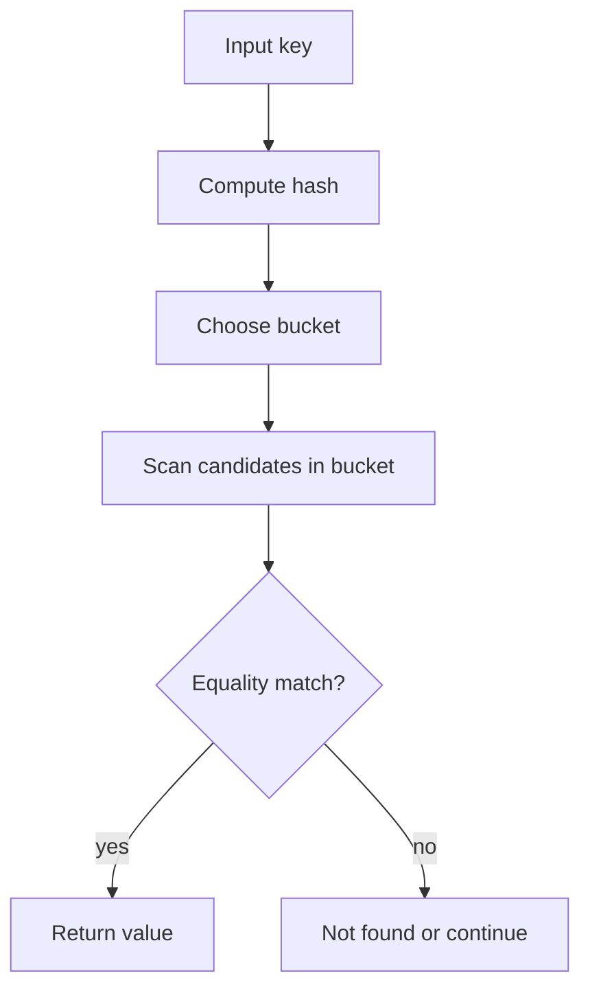
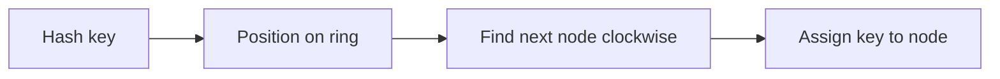
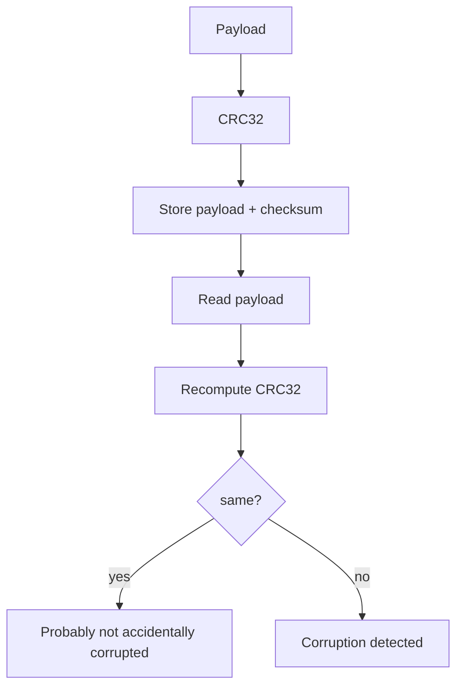
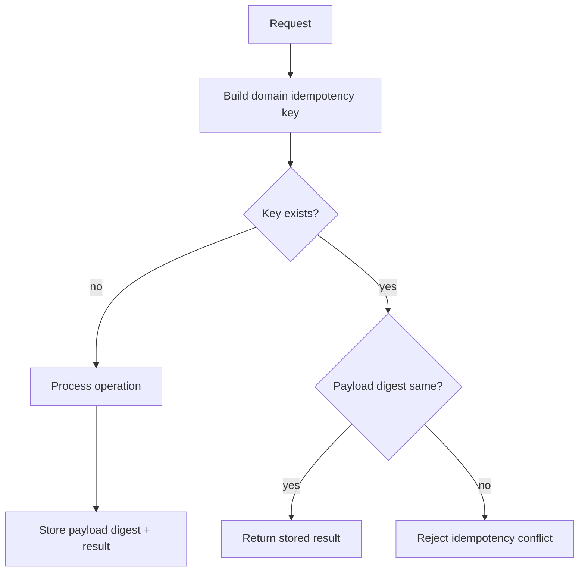
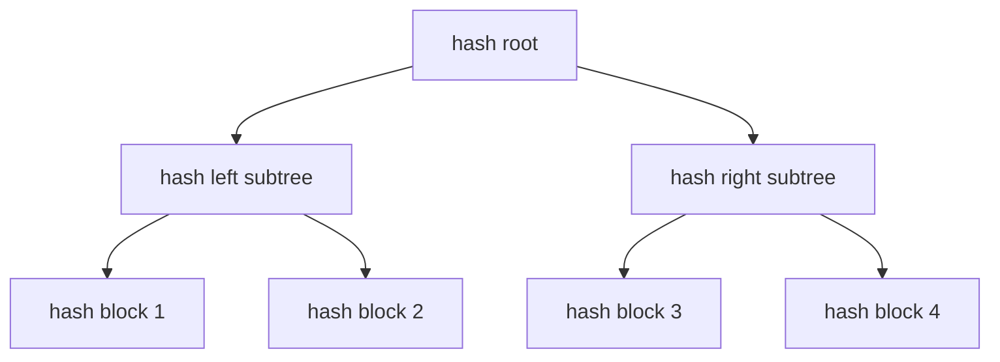
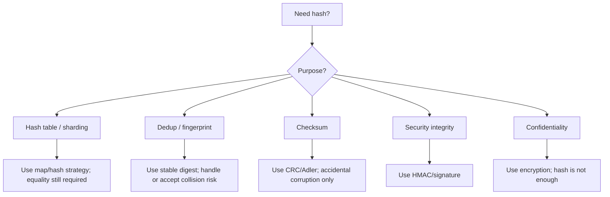

# learn-go-data-structure-algorithm-part-011.md

# Part 011 — Hashing, Fingerprint, Checksums, dan Equality Strategy

> Seri: `learn-go-data-structure-algorithm`  
> Bagian: `011 / 034`  
> Target pembaca: Java software engineer yang ingin menguasai Go data structure & algorithm pada level production-grade  
> Fokus: hashing sebagai alat desain struktur data, bukan sekadar memanggil fungsi hash

---

## 0. Posisi Bagian Ini Dalam Seri

Bagian sebelumnya sudah membahas struktur linear, maps, sorting/search, stack/queue/deque, linked list, heap, set/multiset, text algorithm, serta recursion/backtracking.

Bagian ini membahas fondasi yang sering tersembunyi di balik banyak struktur data:

- `map[K]V`
- set
- deduplication
- cache key
- sharding key
- fingerprint
- checksum
- partitioning
- Bloom filter
- consistent hashing
- content-addressed storage
- idempotency key
- integrity check
- equality acceleration

Hashing sering terlihat sederhana: “ubah data menjadi angka”. Tetapi dalam sistem production, pertanyaan sebenarnya bukan “pakai SHA-256 atau CRC32?”, melainkan:

1. Apa tujuan hash-nya?
2. Apakah collision boleh terjadi?
3. Apakah hasil hash harus stabil antar proses, antar versi, antar mesin?
4. Apakah input bisa dikontrol attacker?
5. Apakah hash dipakai untuk security boundary?
6. Apakah hash dipakai untuk equality, lookup, partitioning, atau integrity?
7. Apakah hash perlu cepat, kuat, deterministik, atau cryptographically secure?
8. Bagaimana jika collision terjadi?
9. Bagaimana strategi key encoding-nya?
10. Bagaimana cara menguji distribusi, collision, dan determinism?

Bab ini bertujuan membentuk mental model tersebut.

---

## 1. Distingsi Penting: Hash, Fingerprint, Checksum, MAC, Signature, Encryption

Sebelum masuk ke implementasi Go, kita harus memisahkan istilah yang sering tercampur.

| Konsep | Tujuan utama | Collision mungkin? | Secret key? | Bisa dibalik? | Contoh |
|---|---:|---:|---:|---:|---|
| Hash table hash | Distribusi key ke bucket | Ya | Tidak | Tidak relevan | internal map hash, `hash/maphash` |
| Fingerprint | Identifikasi ringkas objek | Ya, tapi harus sangat jarang | Biasanya tidak | Tidak | content fingerprint, cache key digest |
| Checksum | Deteksi kerusakan tidak disengaja | Ya | Tidak | Tidak | CRC32, Adler32 |
| Cryptographic hash | Digest tahan preimage/collision praktis | Secara teori ya, secara praktis sulit | Tidak | Tidak | SHA-256, SHA-512 |
| MAC / HMAC | Integritas + autentikasi dengan secret | Praktis sulit | Ya | Tidak | HMAC-SHA256 |
| Digital signature | Integritas + autentikasi + non-repudiation | Praktis sulit | Private key | Tidak | ECDSA, Ed25519 |
| Encryption | Kerahasiaan | Tidak relevan | Ya | Ya, dengan key | AES-GCM, ChaCha20-Poly1305 |

**Rule utama:** hash bukan encryption. Checksum bukan security. Fingerprint bukan proof of identity. Hash collision bukan bug jika desain sudah mengantisipasi collision, tetapi bisa menjadi incident jika desain menganggap hash sebagai identitas mutlak.

---

## 2. Mental Model Hash Function

Secara abstrak:

```text
hash: arbitrary-sized input -> fixed-sized output
```

Contoh:

```text
"case:12345" -> 0x9f84a1c2...
```

Hash yang baik untuk struktur data biasanya menginginkan:

1. **Deterministic within required scope**  
   Input sama menghasilkan output sama dalam scope yang dibutuhkan.

2. **Uniform distribution**  
   Output tersebar merata agar bucket tidak berat sebelah.

3. **Fast enough**  
   Hash tidak boleh lebih mahal dari operasi yang ingin dioptimalkan.

4. **Low collision probability**  
   Collision harus cukup jarang atau ditangani dengan equality check kedua.

5. **Domain-appropriate**  
   Hash untuk hash table tidak harus cryptographic; hash untuk security harus cryptographic atau keyed.

---

## 3. Hashing Dalam Go: Package yang Relevan

Go standard library menyediakan beberapa kategori package terkait hashing.

### 3.1 `hash`

Package `hash` mendefinisikan interface umum untuk hash function stateful:

```go
type Hash interface {
    io.Writer
    Sum(b []byte) []byte
    Reset()
    Size() int
    BlockSize() int
}
```

Secara mental, banyak hash function di Go mengikuti pola:

```go
h := sha256.New()
h.Write([]byte("hello"))
h.Write([]byte("world"))
sum := h.Sum(nil)
```

Pola ini cocok untuk input streaming.

### 3.2 `hash/crc32`, `hash/crc64`, `hash/adler32`

Package ini adalah checksum, bukan security primitive.

Contoh:

```go
package main

import (
    "fmt"
    "hash/crc32"
)

func main() {
    data := []byte("important payload")
    sum := crc32.ChecksumIEEE(data)
    fmt.Printf("%08x\n", sum)
}
```

Gunakan untuk:

- mendeteksi corruption tidak disengaja,
- file chunk verification ringan,
- protocol checksum,
- bucketing non-security jika collision acceptable.

Jangan gunakan untuk:

- password hashing,
- API signing,
- tamper-proof token,
- authorization decision,
- data authenticity.

### 3.3 `crypto/sha256`, `crypto/sha512`

Cryptographic hash digunakan ketika sifat security penting:

```go
package main

import (
    "crypto/sha256"
    "fmt"
)

func main() {
    sum := sha256.Sum256([]byte("payload"))
    fmt.Printf("%x\n", sum)
}
```

Gunakan untuk:

- content digest,
- tamper-evident data structure,
- Merkle tree,
- content-addressed storage,
- comparing large content with collision risk extremely low.

Tetapi, cryptographic hash **tidak otomatis memberikan authentication**. Jika attacker bisa mengganti payload dan digest sekaligus, SHA-256 saja tidak cukup. Butuh MAC/signature.

### 3.4 `crypto/hmac`

Untuk autentikasi integritas berbasis shared secret:

```go
package main

import (
    "crypto/hmac"
    "crypto/sha256"
    "encoding/hex"
    "fmt"
)

func sign(secret, msg []byte) string {
    mac := hmac.New(sha256.New, secret)
    mac.Write(msg)
    return hex.EncodeToString(mac.Sum(nil))
}

func verify(secret, msg []byte, sigHex string) bool {
    expected := sign(secret, msg)
    got, err := hex.DecodeString(sigHex)
    if err != nil {
        return false
    }
    exp, err := hex.DecodeString(expected)
    if err != nil {
        return false
    }
    return hmac.Equal(got, exp)
}

func main() {
    secret := []byte("secret")
    msg := []byte("payload")
    sig := sign(secret, msg)
    fmt.Println(sig)
    fmt.Println(verify(secret, msg, sig))
}
```

Catatan: gunakan `hmac.Equal`, bukan `bytes.Equal`, untuk membandingkan MAC agar menghindari timing side-channel.

### 3.5 `hash/fnv`

FNV adalah non-cryptographic hash. Sering dipakai untuk hash sederhana yang stabil, tetapi bukan pilihan default untuk semua kasus.

```go
package main

import (
    "fmt"
    "hash/fnv"
)

func hashString(s string) uint64 {
    h := fnv.New64a()
    _, _ = h.Write([]byte(s))
    return h.Sum64()
}

func main() {
    fmt.Println(hashString("customer:123"))
}
```

Kelebihan:

- sederhana,
- tersedia di stdlib,
- deterministic,
- cukup untuk beberapa use case internal kecil.

Keterbatasan:

- bukan cryptographic,
- kualitas distribusi dan collision resistance tidak sekuat modern non-cryptographic hash yang dirancang untuk throughput tinggi,
- jangan dipakai untuk input attacker-controlled pada boundary sensitif.

### 3.6 `hash/maphash`

`hash/maphash` menyediakan hash function untuk byte sequence dan comparable value yang ditujukan untuk implementasi hash table atau struktur data lain yang membutuhkan distribusi uniform ke `uint64`.

Karakter penting:

- non-cryptographic,
- memakai seed,
- setiap instance struktur data sebaiknya memakai seed sendiri,
- hasil tidak dimaksudkan sebagai stable persisted hash.

Contoh:

```go
package main

import (
    "fmt"
    "hash/maphash"
)

func main() {
    var h maphash.Hash
    h.SetSeed(maphash.MakeSeed())
    h.WriteString("case:12345")
    fmt.Println(h.Sum64())
}
```

Untuk struktur data custom seperti sharded map internal, `maphash` bisa lebih tepat dibanding membuat hash string sendiri secara manual.

---

## 4. Hashing Bukan Equality

Ini prinsip besar.

```text
same value  => same hash       harus benar untuk hash yang konsisten
same hash   => same value       tidak dijamin
```

Hash hanya mempersempit kandidat. Equality tetap menentukan kebenaran.

### 4.1 Salah

```go
if hash(a) == hash(b) {
    // assume equal
}
```

Ini salah kecuali sistem memang menerima false positive.

### 4.2 Benar

```go
if hash(a) == hash(b) && equal(a, b) {
    // equal
}
```

Atau untuk fingerprint sebagai probabilistic identity:

```go
if fpA == fpB {
    // probably equal, but document the risk explicitly
}
```

---

## 5. Collision: Bukan Kemungkinan Teoretis Saja

Collision terjadi ketika dua input berbeda menghasilkan hash sama.

```text
hash(x) == hash(y), tetapi x != y
```

Collision bukan sekadar problem akademik. Dalam production, collision bisa menyebabkan:

- wrong deduplication,
- cache poisoning,
- wrong partition assignment,
- data overwrite,
- broken idempotency,
- corrupted index,
- authorization bug jika hash dipakai sebagai identity,
- denial of service jika banyak key masuk bucket sama.

### 5.1 Birthday Bound Intuition

Jika hash output memiliki `b` bit, ruang kemungkinan adalah `2^b`. Collision probability mulai terasa ketika jumlah item mendekati `sqrt(2^b) = 2^(b/2)`.

| Hash bits | Skala birthday bound kasar |
|---:|---:|
| 32-bit | sekitar 65 ribu item |
| 64-bit | sekitar 4 miliar item |
| 128-bit | sekitar 1.8e19 item |
| 256-bit | sangat besar untuk praktik umum |

Implikasi:

- CRC32 buruk untuk fingerprint global banyak objek.
- 64-bit mungkin cukup untuk in-memory probabilistic fingerprint kecil/menengah, tetapi harus dievaluasi.
- 128-bit atau 256-bit lebih aman untuk persistent content identity.

---

## 6. Hash Table Lookup: Hash + Equality

Hash table bekerja dengan dua tahap:

1. Gunakan hash untuk menemukan bucket.
2. Gunakan equality untuk memastikan key yang benar.



Dalam Go, built-in `map[K]V` mengurus detail ini untuk key yang `comparable`.

Yang harus kita desain:

- tipe key,
- canonicalization,
- equality semantics,
- lifecycle map,
- memory footprint,
- determinism kebutuhan aplikasi.

---

## 7. Equality Strategy di Go

Go map key harus `comparable`.

Tipe yang bisa menjadi key:

- bool,
- integer,
- float,
- string,
- pointer,
- channel,
- interface berisi dynamic comparable value,
- array dari comparable element,
- struct yang seluruh field-nya comparable.

Tipe yang tidak bisa langsung menjadi key:

- slice,
- map,
- function,
- struct yang memiliki field non-comparable,
- array yang elemennya non-comparable.

### 7.1 Struct Key

Struct key sangat berguna untuk composite key.

```go
type AccountKey struct {
    TenantID string
    UserID   string
}

m := map[AccountKey]int{}
m[AccountKey{TenantID: "t1", UserID: "u1"}] = 42
```

Kelebihan:

- type-safe,
- tidak perlu manual delimiter,
- equality otomatis berdasarkan field,
- menghindari bug encoding string.

Kekurangan:

- field besar akan dicopy saat lookup/insert,
- string field tetap pointer+len, bukan deep copy data saat key dibuat,
- harus hati-hati dengan canonicalization.

### 7.2 String-Encoded Key

```go
func key(tenantID, userID string) string {
    return tenantID + ":" + userID
}
```

Masalah:

```text
tenantID="a:b", userID="c"
tenantID="a",   userID="b:c"
```

Keduanya bisa menjadi `a:b:c` jika encoding tidak aman.

Jika memakai string key, encoding harus unambiguous.

Contoh length-prefixed:

```go
func compositeKey(a, b string) string {
    return fmt.Sprintf("%d:%s%d:%s", len(a), a, len(b), b)
}
```

Tetapi `fmt.Sprintf` mahal. Untuk hot path, gunakan builder atau struct key.

### 7.3 Array Key untuk Fixed-Size Digest

Cryptographic digest seperti SHA-256 menghasilkan array `[32]byte`, cocok menjadi map key.

```go
type Digest [32]byte

func digestOf(data []byte) Digest {
    return sha256.Sum256(data)
}

m := map[Digest]string{}
m[digestOf([]byte("payload"))] = "seen"
```

Ini lebih baik daripada string hex jika tidak perlu human-readable.

Perbandingan:

| Bentuk digest | Ukuran | Allocation | Human-readable |
|---|---:|---:|---:|
| `[32]byte` | 32 byte | rendah | tidak |
| `[]byte` | slice header + backing | tidak comparable | tidak |
| hex string | 64 byte char + header | lebih mahal | ya |
| base64 string | lebih pendek dari hex | tetap string allocation | ya |

---

## 8. Canonicalization: Equality Dimulai Sebelum Hash

Hash hanya benar jika input representation benar.

Contoh user ID:

```text
"Fajar"
"fajar"
" fajar "
"FAJAR"
```

Jika domain mengatakan semua sama, maka canonicalization harus dilakukan sebelum hashing/lookup.

```go
func canonicalUserID(s string) string {
    return strings.ToLower(strings.TrimSpace(s))
}
```

Tetapi canonicalization bukan operasi netral. Ia adalah keputusan domain.

Contoh:

- Email lokal-part secara teori bisa case-sensitive tergantung provider, tetapi praktik sering di-normalize.
- Unicode normalization bisa mengubah representation karakter.
- Postal code bisa butuh trim, uppercase, atau left-padding tergantung negara.
- Permission key bisa case-sensitive untuk alasan audit.

**Rule:** jangan canonicalize diam-diam tanpa domain contract.

---

## 9. Composite Key Design

Composite key muncul ketika identitas dibentuk dari beberapa dimensi.

Contoh:

```text
tenant_id + user_id
tenant_id + role_id
module + action + resource_id
country + postal_code
workflow_id + state + event
```

### 9.1 Gunakan Struct Key Jika Semua Field Comparable

```go
type PermissionKey struct {
    TenantID   string
    SubjectID  string
    ResourceID string
    Action     string
}

type PermissionIndex map[PermissionKey]bool
```

Kelebihan terbesar: tidak ada delimiter ambiguity.

### 9.2 Gunakan Encoded Key Jika Butuh Compact/Persistent Key

Untuk persistent key, cross-language key, atau storage key, buat encoding eksplisit.

```go
func encodeKey(parts ...string) string {
    var b strings.Builder
    for _, p := range parts {
        b.WriteString(strconv.Itoa(len(p)))
        b.WriteByte(':')
        b.WriteString(p)
        b.WriteByte('|')
    }
    return b.String()
}
```

### 9.3 Jangan Pakai JSON untuk Hot Key Tanpa Alasan

```go
json.Marshal(key)
```

Mudah, tetapi biasanya:

- lebih lambat,
- allocation-heavy,
- tergantung field ordering/encoding detail,
- tidak ideal untuk hot path.

JSON key boleh untuk debug/admin/persistence yang tidak hot, bukan default untuk index internal.

---

## 10. Hash untuk Deduplication

Dedup bisa exact atau probabilistic.

### 10.1 Exact Dedup

Gunakan map dari key canonical.

```go
func dedupStrings(in []string) []string {
    seen := make(map[string]struct{}, len(in))
    out := in[:0]

    for _, s := range in {
        if _, ok := seen[s]; ok {
            continue
        }
        seen[s] = struct{}{}
        out = append(out, s)
    }
    return out
}
```

Exact dedup menyimpan semua key yang sudah terlihat.

Trade-off:

- benar secara equality,
- memory O(n),
- cocok jika n bounded.

### 10.2 Fingerprint Dedup

```go
type Fingerprint [32]byte

func fingerprint(data []byte) Fingerprint {
    return sha256.Sum256(data)
}
```

Dedup berdasarkan fingerprint:

```go
seen := map[Fingerprint]struct{}{}
```

Ini sangat kecil collision risk jika SHA-256, tetapi secara formal tetap probabilistic.

Gunakan untuk:

- blob/content dedup,
- immutable event payload,
- file block identity,
- cache digest.

Jika consequence salah dedup sangat fatal, simpan metadata tambahan atau lakukan byte equality saat collision candidate.

---

## 11. Hash untuk Partitioning dan Sharding

Hash sering dipakai untuk memilih shard.

```go
shard := hash(key) % numShards
```

Masalah utama: ketika `numShards` berubah, hampir semua key bisa pindah shard.

### 11.1 Modulo Sharding

```go
func shardOf(h uint64, n int) int {
    return int(h % uint64(n))
}
```

Cocok untuk:

- jumlah shard tetap,
- in-memory shard lock,
- proses tunggal,
- tidak butuh stable placement saat scale out.

Tidak cocok untuk:

- distributed cache yang sering resize,
- cluster node membership dinamis,
- persistent partition ownership.

### 11.2 Power of Two Masking

Jika shard count power of two:

```go
shard := int(h & uint64(numShards-1))
```

Lebih murah dari modulo, tetapi hanya valid jika `numShards` power of two.

Pastikan lower bits hash berkualitas baik. Jika hash buruk pada lower bits, distribusi bisa bias.

### 11.3 Consistent Hashing Intuition

Consistent hashing mengurangi jumlah key yang pindah ketika node bertambah/berkurang.



Use case:

- distributed cache,
- partition routing,
- storage ownership,
- load distribution across dynamic nodes.

Kita akan membahas lebih dalam di part probabilistic/distributed/cache jika diperlukan, tetapi prinsipnya: hash bukan hanya angka; hash membentuk routing contract.

---

## 12. Hash Flooding dan Adversarial Input

Jika attacker bisa memilih key, mereka bisa mencoba membuat banyak key collision atau distribusi buruk.

Dampaknya:

- lookup degrade,
- CPU spike,
- latency p99 buruk,
- potential DoS.

Go runtime memiliki strategi internal untuk map hashing, termasuk randomization/seed. Namun, saat kita membuat struktur data sendiri, kita harus memperhatikan:

- jangan memakai hash sederhana untuk untrusted input pada boundary terbuka,
- gunakan keyed hash atau hash dengan seed jika perlu,
- batasi ukuran input,
- batasi jumlah key per request/tenant,
- gunakan timeout/context untuk workload berat,
- jangan expose hash result sebagai API contract kecuali memang stabil dan aman.

---

## 13. Stable vs Unstable Hash

Ini sering salah.

Ada hash yang cocok untuk proses internal tetapi tidak cocok untuk persistence.

| Kebutuhan | Hash boleh berubah antar proses? | Contoh |
|---|---:|---|
| In-memory hash table | Ya | map internal, `maphash` dengan seed |
| Sharded lock dalam satu process | Ya | `maphash` |
| Persistent cache key | Tidak | SHA-256 / stable encoded key |
| Database partition key | Tidak | stable hash algorithm versioned |
| Cross-service routing | Tidak | documented stable hash |
| Security digest | Tidak, tetapi algorithm versioned | SHA-256/HMAC |

### 13.1 Jangan Persist `maphash`

`maphash` ditujukan untuk hash table atau struktur data runtime. Karena seed bisa berbeda, hasilnya tidak boleh dijadikan persistent ID.

Salah:

```go
// Jangan lakukan ini untuk persistent ID.
func persistentID(s string) uint64 {
    var h maphash.Hash
    h.SetSeed(maphash.MakeSeed())
    h.WriteString(s)
    return h.Sum64()
}
```

Benar untuk stable digest:

```go
func stableDigest(s string) [32]byte {
    return sha256.Sum256([]byte(s))
}
```

Atau untuk stable non-security partitioning, definisikan algorithm dan versioning secara eksplisit.

---

## 14. Versioning Hash Algorithm

Jika hash dipakai dalam persistent system, algorithm adalah bagian dari format data.

Contoh format:

```text
sha256:v1:<hex-digest>
fnv64a:v1:<uint64>
partitionhash:v2:<uint64>
```

Mengapa versioning penting?

- algorithm bisa diganti,
- bug encoding bisa diperbaiki,
- distribusi bisa ditingkatkan,
- migration bisa dilakukan bertahap,
- audit bisa menjelaskan hasil lama.

Contoh type:

```go
type Digest struct {
    Algorithm string
    Version   uint16
    Value     [32]byte
}
```

Untuk hot path, metadata bisa dipisah dari digest value, tetapi secara desain tetap harus ada.

---

## 15. Fingerprint Design

Fingerprint adalah ringkasan untuk mewakili objek.

Pertanyaan desain:

1. Apakah fingerprint hanya optimization atau source of truth?
2. Jika collision, apa dampaknya?
3. Apakah object immutable?
4. Apakah fingerprint mencakup schema version?
5. Apakah field ordering stabil?
6. Apakah canonical encoding stabil?
7. Apakah fingerprint harus cross-language?

### 15.1 Fingerprint untuk Object

Jangan fingerprint struct dengan `fmt.Sprintf("%v", obj)`.

Salah:

```go
sum := sha256.Sum256([]byte(fmt.Sprintf("%v", obj)))
```

Masalah:

- format bukan kontrak persistence,
- bisa berubah,
- ambiguous,
- lambat,
- tidak cocok untuk cross-language.

Lebih baik: explicit canonical encoding.

```go
type Rule struct {
    ID      string
    Action  string
    Version int
}

func (r Rule) Fingerprint() [32]byte {
    h := sha256.New()
    writeField(h, "id", r.ID)
    writeField(h, "action", r.Action)
    writeInt(h, "version", r.Version)

    var out [32]byte
    copy(out[:], h.Sum(nil))
    return out
}

func writeField(h hash.Hash, name, value string) {
    h.Write([]byte(name))
    h.Write([]byte{0})
    h.Write([]byte(strconv.Itoa(len(value))))
    h.Write([]byte{':'})
    h.Write([]byte(value))
    h.Write([]byte{0xff})
}

func writeInt(h hash.Hash, name string, value int) {
    writeField(h, name, strconv.Itoa(value))
}
```

Untuk production, gunakan binary encoding yang lebih disiplin jika format harus stabil.

---

## 16. Checksum Design

Checksum berguna untuk mendeteksi corruption tidak disengaja.

Contoh:

- file chunk rusak,
- network frame corruption,
- disk block verification,
- simple cache payload validation.

Checksum tidak melindungi dari attacker yang bisa menghitung checksum baru.



### 16.1 CRC32 Example

```go
package checksum

import "hash/crc32"

type Record struct {
    Payload  []byte
    Checksum uint32
}

func NewRecord(payload []byte) Record {
    copied := append([]byte(nil), payload...)
    return Record{
        Payload:  copied,
        Checksum: crc32.ChecksumIEEE(copied),
    }
}

func (r Record) Valid() bool {
    return crc32.ChecksumIEEE(r.Payload) == r.Checksum
}
```

Ini baik untuk accidental corruption. Bukan untuk tamper-proof record.

---

## 17. MAC Design untuk Tamper Detection

Jika data bisa dimodifikasi oleh pihak yang tidak dipercaya, gunakan HMAC atau signature.

```go
package integrity

import (
    "crypto/hmac"
    "crypto/sha256"
)

func Sign(secret, payload []byte) [32]byte {
    mac := hmac.New(sha256.New, secret)
    mac.Write(payload)

    var out [32]byte
    copy(out[:], mac.Sum(nil))
    return out
}

func Verify(secret, payload []byte, sig [32]byte) bool {
    expected := Sign(secret, payload)
    return hmac.Equal(expected[:], sig[:])
}
```

Use case:

- signed webhook payload,
- tamper-evident cookie,
- internal token integrity,
- request signing.

Tetapi HMAC tidak menyembunyikan isi. Untuk confidentiality, gunakan encryption authenticated mode seperti AES-GCM.

---

## 18. Hashing Large Data

Untuk data besar, jangan selalu materialize semua ke memory.

Gunakan streaming hash:

```go
func SHA256Reader(r io.Reader) ([32]byte, error) {
    h := sha256.New()
    if _, err := io.Copy(h, r); err != nil {
        return [32]byte{}, err
    }

    var out [32]byte
    copy(out[:], h.Sum(nil))
    return out, nil
}
```

Kelebihan:

- memory O(1),
- cocok untuk file besar,
- cocok untuk stream network,
- mudah digabung dengan multi-writer.

Contoh menghitung hash sambil menulis file:

```go
func CopyAndHash(dst io.Writer, src io.Reader) ([32]byte, int64, error) {
    h := sha256.New()
    mw := io.MultiWriter(dst, h)

    n, err := io.Copy(mw, src)
    if err != nil {
        return [32]byte{}, n, err
    }

    var out [32]byte
    copy(out[:], h.Sum(nil))
    return out, n, nil
}
```

---

## 19. Hashing and Allocation

Hot path hashing sering punya hidden allocation.

### 19.1 Hindari `[]byte(s)` Jika Tidak Perlu

Untuk beberapa hash API, `WriteString` tersedia atau `maphash.Hash.WriteString` bisa digunakan.

```go
var h maphash.Hash
h.WriteString(s)
```

Dibanding:

```go
h.Write([]byte(s))
```

Konversi `[]byte(s)` bisa mengalokasikan jika compiler tidak bisa mengoptimalkan.

### 19.2 Reuse Hasher dengan Hati-Hati

```go
type Hasher struct {
    h hash.Hash
}

func NewHasher() *Hasher {
    return &Hasher{h: sha256.New()}
}

func (x *Hasher) Sum(data []byte) [32]byte {
    x.h.Reset()
    x.h.Write(data)
    var out [32]byte
    copy(out[:], x.h.Sum(nil))
    return out
}
```

Tetapi object seperti ini tidak safe untuk concurrent use tanpa lock. Jangan share hasher state antar goroutine kecuali dilindungi.

---

## 20. Hash-Based Equality Acceleration

Untuk object besar, kita bisa menyimpan fingerprint untuk mempercepat equality.

```go
type Blob struct {
    data []byte
    fp   [32]byte
}

func NewBlob(data []byte) Blob {
    copied := append([]byte(nil), data...)
    return Blob{
        data: copied,
        fp:   sha256.Sum256(copied),
    }
}

func (b Blob) Equal(other Blob) bool {
    if b.fp != other.fp {
        return false
    }
    return bytes.Equal(b.data, other.data)
}
```

Prinsip:

- fingerprint mismatch => definitely not equal,
- fingerprint match => probably equal, but verify if correctness requires exact equality.

Ini pattern umum untuk:

- AST comparison,
- document comparison,
- large config snapshot,
- immutable blob,
- event payload.

---

## 21. Rolling Hash

Rolling hash memungkinkan update hash window secara incremental.

Use case:

- substring search,
- Rabin-Karp,
- chunking,
- duplicate block detection,
- content-defined chunking intuition.

Simple polynomial rolling hash:

```text
H(s[0:n]) = s0*b^(n-1) + s1*b^(n-2) + ... + s[n-1]
```

Sliding window:

```text
remove old char contribution
multiply by base
add new char
```

Pseudocode:

```go
type RollingHash struct {
    base uint64
    pow  uint64
    hash uint64
}
```

Catatan production:

- overflow unsigned integer bisa sengaja dipakai sebagai modulo 2^64,
- collision harus diverifikasi dengan byte compare,
- jangan pakai rolling hash sebagai security primitive.

---

## 22. Hashing untuk Bloom Filter Preparation

Bloom filter memakai beberapa hash positions.

```text
item -> h1, h2, h3 -> set bits
```

Lookup:

```text
if all bits set => maybe present
if any bit not set => definitely not present
```

Bloom filter menerima false positive, tidak menerima false negative jika implementasi benar.

Hashing concern:

- butuh distribusi baik,
- bisa memakai double hashing technique,
- bitset size dan number of hash functions menentukan false positive rate,
- hash collision adalah bagian dari desain probabilistic.

Akan dibahas lebih detail di part probabilistic data structures.

---

## 23. Hashing untuk Cache Key

Cache key harus stabil, unambiguous, dan mencerminkan semua dimensi yang mempengaruhi hasil.

Contoh buruk:

```go
key := userID
```

Padahal hasil tergantung:

- tenant,
- locale,
- permission version,
- feature flag,
- query params,
- API version.

Contoh lebih baik:

```go
type CacheKey struct {
    TenantID          string
    UserID            string
    Locale            string
    PermissionVersion int64
    FeatureVersion    int64
}
```

Untuk cache eksternal, encode secara stabil:

```go
func (k CacheKey) String() string {
    return encodeKey(
        "tenant", k.TenantID,
        "user", k.UserID,
        "locale", k.Locale,
        "permv", strconv.FormatInt(k.PermissionVersion, 10),
        "featv", strconv.FormatInt(k.FeatureVersion, 10),
    )
}
```

### 23.1 Cache Key Checklist

- Apakah semua input yang mempengaruhi output masuk key?
- Apakah ordering field stabil?
- Apakah ada schema/version?
- Apakah key terlalu panjang?
- Jika key di-hash, bagaimana debugging dilakukan?
- Jika collision terjadi, apakah bisa menyebabkan wrong response?
- Apakah key mengandung PII?
- Apakah key aman untuk log?

---

## 24. Hashing untuk Idempotency Key

Idempotency key sering dipakai agar request yang sama tidak dieksekusi dua kali.

Bahaya besar: menganggap hash payload sebagai idempotency identity tanpa domain rules.

```text
same payload != same business operation, selalu
same business operation != same payload, selalu
```

Contoh idempotency identity:

```go
type IdempotencyKey struct {
    TenantID       string
    ClientID       string
    ExternalReqID  string
    Operation      string
}
```

Payload fingerprint bisa menjadi guard:

```go
type IdempotencyRecord struct {
    Key         IdempotencyKey
    PayloadHash [32]byte
    Result      []byte
}
```

Logic:

- key baru: process and store payload hash + result,
- key sama + payload hash sama: return stored result,
- key sama + payload hash beda: reject conflict.



---

## 25. Hashing untuk Permission dan Authorization Cache

Authorization cache key harus sangat hati-hati.

Jangan hanya pakai:

```go
key := userID + ":" + action
```

Biasanya permission decision tergantung:

- tenant,
- subject,
- roles,
- resource,
- resource owner,
- action,
- policy version,
- attribute snapshot,
- time/window,
- delegation,
- environment.

Contoh:

```go
type AuthzDecisionKey struct {
    TenantID      string
    SubjectID     string
    ResourceType  string
    ResourceID    string
    Action        string
    PolicyVersion int64
    AttrVersion   int64
}
```

Jika key tidak lengkap, cache bisa mengembalikan keputusan lama atau salah.

Untuk authorization, collision atau stale key bisa menjadi security incident. Jika memakai digest untuk compact key, gunakan stable cryptographic digest dari canonical encoded decision key.

---

## 26. Hashing untuk Workflow / State Machine

Dalam sistem lifecycle/regulatory workflow, hashing bisa dipakai untuk:

- detecting duplicate transition graph,
- versioning workflow definition,
- cache decision transition,
- comparing policy snapshot,
- audit integrity chain.

Contoh workflow definition fingerprint:

```go
type Transition struct {
    From   string
    Event  string
    To     string
    Guard  string
    Action string
}
```

Fingerprint harus canonical:

- sort transitions,
- include workflow version,
- include guard/action version,
- include schema version,
- avoid map iteration nondeterminism.

Salah:

```go
for k, v := range transitionsMap {
    h.Write([]byte(k))
    h.Write([]byte(v.To))
}
```

Map iteration order tidak deterministik. Untuk stable digest, sort keys dulu.

Benar:

```go
keys := make([]string, 0, len(transitionsMap))
for k := range transitionsMap {
    keys = append(keys, k)
}
slices.Sort(keys)

for _, k := range keys {
    v := transitionsMap[k]
    writeField(h, "key", k)
    writeField(h, "to", v.To)
}
```

---

## 27. Merkle Tree Intuition

Merkle tree menyusun hash secara hierarchical.



Use case:

- content verification,
- audit log integrity,
- distributed synchronization,
- partial proof,
- snapshot comparison.

Jika satu block berubah, hanya path ke root berubah.

Untuk audit trail, bisa digunakan konsep hash chain atau Merkle root, tetapi desainnya harus memperjelas:

- ordering event,
- canonical encoding event,
- algorithm version,
- storage of root,
- tamper boundary,
- key management jika memakai HMAC/signature.

---

## 28. Hash Chain untuk Audit Log

Hash chain:

```text
H0 = hash(genesis)
H1 = hash(H0 || event1)
H2 = hash(H1 || event2)
H3 = hash(H2 || event3)
```

Diagram:


Keuntungan:

- perubahan event lama mengubah semua hash setelahnya,
- urutan event menjadi bagian dari integrity,
- mudah diverifikasi sequentially.

Keterbatasan:

- jika attacker bisa mengganti semua event dan head, hash chain saja tidak cukup,
- perlu anchor eksternal, signature, atau trusted storage untuk head,
- canonical encoding wajib.

---

## 29. Common Anti-Patterns

### 29.1 Menggunakan Hash sebagai Primary Key Tanpa Collision Strategy

```go
id := crc32.ChecksumIEEE(payload)
store[id] = payload
```

Masalah:

- CRC32 collision mudah pada skala besar,
- overwrite mungkin terjadi,
- tidak ada equality verification.

Lebih baik:

```go
type Entry struct {
    Digest [32]byte
    Data   []byte
}
```

Atau simpan list per digest jika collision perlu ditangani exact.

### 29.2 Menggunakan Checksum untuk Security

```go
if crc32.ChecksumIEEE(payload) == provided {
    accept()
}
```

Ini hanya mendeteksi corruption tidak disengaja, bukan tampering.

### 29.3 Hashing String Gabungan Dengan Delimiter Ambiguous

```go
key := a + ":" + b
```

Jika `a` atau `b` bisa mengandung `:`, key ambiguous.

### 29.4 Fingerprint dari Map Tanpa Sorting

```go
for k, v := range m {
    h.Write([]byte(k))
    h.Write([]byte(v))
}
```

Map iteration order tidak deterministic. Stable fingerprint harus sort key.

### 29.5 Menganggap SHA-256 Berarti Data Aman

SHA-256 memberi digest. Tidak memberi confidentiality. Tidak memberi authentication jika digest bisa diganti.

### 29.6 Persist Hash Runtime

Hash dengan random seed/runtime-specific behavior tidak boleh dipersist atau dipakai lintas proses.

### 29.7 Tidak Mengikutkan Version dalam Digest

Digest dari schema v1 dan schema v2 bisa terlihat sama formatnya tetapi maknanya berbeda.

---

## 30. Decision Matrix

| Use case | Recommended approach | Catatan |
|---|---|---|
| Go map key composite | struct key | Paling aman jika field comparable |
| Set membership exact | `map[T]struct{}` | Exact, memory O(n) |
| Large content fingerprint | SHA-256 `[32]byte` | Stable, collision sangat kecil |
| Accidental corruption check | CRC32/CRC64 | Bukan security |
| Webhook/request signing | HMAC-SHA256 | Gunakan constant-time compare |
| In-memory custom hash table | `hash/maphash` | Jangan persist result |
| Sharded lock internal | `maphash` + modulo/mask | Stabil hanya dalam runtime sesuai desain |
| Persistent partitioning | stable versioned hash | Dokumentasikan algorithm |
| Cache key external | canonical encoded key or digest | Include all dimensions |
| Idempotency | domain key + payload digest guard | Jangan payload hash saja |
| Authorization decision cache | canonical complete decision key + version | Security-sensitive |
| Probabilistic membership | Bloom filter | False positive acceptable |

---

## 31. Production Checklist

Sebelum memakai hash dalam desain, jawab pertanyaan ini.

### 31.1 Purpose

- Hash dipakai untuk lookup, dedup, partitioning, checksum, integrity, atau security?
- Apakah hash hanya optimization atau source of truth?
- Jika hash salah/collision, apa dampaknya?

### 31.2 Stability

- Apakah hash perlu stabil antar process?
- Apakah hash perlu stabil antar release?
- Apakah hash perlu cross-language?
- Apakah algorithm/version dicatat?

### 31.3 Collision

- Apakah collision diterima?
- Apakah ada equality verification?
- Apakah false positive acceptable?
- Apakah collision bisa menjadi security incident?

### 31.4 Encoding

- Apakah input di-canonicalize?
- Apakah composite key unambiguous?
- Apakah map iteration order sudah distabilkan?
- Apakah schema version masuk digest?

### 31.5 Security

- Apakah input attacker-controlled?
- Apakah butuh cryptographic hash?
- Apakah butuh HMAC/signature?
- Apakah comparison harus constant-time?
- Apakah digest/key mengandung PII jika dilog?

### 31.6 Performance

- Apakah hashing lebih mahal dari lookup?
- Apakah ada hidden allocation?
- Apakah hasher state reused safely?
- Apakah benchmark memakai distribution realistis?

---

## 32. Testing Strategy

Hash-related code harus dites lebih dari happy path.

### 32.1 Determinism Test

```go
func TestDigestDeterministic(t *testing.T) {
    input := []byte("payload")
    a := sha256.Sum256(input)
    b := sha256.Sum256(input)
    if a != b {
        t.Fatal("digest must be deterministic")
    }
}
```

### 32.2 Composite Key Ambiguity Test

```go
func TestCompositeKeyUnambiguous(t *testing.T) {
    a := encodeKey("a:b", "c")
    b := encodeKey("a", "b:c")
    if a == b {
        t.Fatal("composite key encoding is ambiguous")
    }
}
```

### 32.3 Map Fingerprint Stable Test

```go
func TestMapFingerprintStable(t *testing.T) {
    m := map[string]string{
        "b": "2",
        "a": "1",
    }

    first := fingerprintMap(m)
    for i := 0; i < 100; i++ {
        if got := fingerprintMap(m); got != first {
            t.Fatal("fingerprint must be stable")
        }
    }
}
```

### 32.4 Collision Path Test

Jika struktur data punya collision handling, buat fake hasher yang memaksa collision.

```go
type badHasher struct{}

func (badHasher) HashString(string) uint64 { return 1 }
```

Lalu uji bahwa equality tetap benar walau semua key masuk bucket sama.

---

## 33. Benchmark Strategy

Benchmark hash harus mengukur:

- throughput,
- allocation,
- input size,
- input distribution,
- streaming vs one-shot,
- string vs bytes,
- reused hasher vs new hasher,
- collision path jika struktur custom.

Contoh benchmark:

```go
func BenchmarkSHA256_1KB(b *testing.B) {
    data := bytes.Repeat([]byte("x"), 1024)
    b.SetBytes(int64(len(data)))
    b.ReportAllocs()

    for i := 0; i < b.N; i++ {
        _ = sha256.Sum256(data)
    }
}
```

Benchmark map key style:

```go
type StructKey struct {
    A string
    B string
}

func BenchmarkStructKeyLookup(b *testing.B) {
    m := map[StructKey]int{}
    for i := 0; i < 100_000; i++ {
        k := StructKey{A: strconv.Itoa(i), B: strconv.Itoa(i * 7)}
        m[k] = i
    }

    b.ReportAllocs()
    for i := 0; i < b.N; i++ {
        k := StructKey{A: strconv.Itoa(i % 100_000), B: strconv.Itoa((i % 100_000) * 7)}
        _ = m[k]
    }
}
```

Catatan: benchmark di atas mengukur juga biaya `strconv.Itoa`, jadi untuk mengisolasi lookup, precompute keys.

---

## 34. Mini Case Study: Stable Workflow Definition Fingerprint

Misal kita punya definisi workflow:

```go
type Workflow struct {
    Name        string
    Version     int
    Transitions []Transition
}

type Transition struct {
    From   string
    Event  string
    To     string
    Guard  string
    Action string
}
```

Goal:

- workflow yang sama menghasilkan fingerprint sama,
- urutan input transition tidak mempengaruhi fingerprint jika domain menganggap set transition tidak ordered,
- perubahan guard/action/version mengubah fingerprint,
- format stabil untuk audit.

Implementation sketch:

```go
func WorkflowFingerprint(w Workflow) [32]byte {
    transitions := append([]Transition(nil), w.Transitions...)
    slices.SortFunc(transitions, func(a, b Transition) int {
        if c := cmp.Compare(a.From, b.From); c != 0 { return c }
        if c := cmp.Compare(a.Event, b.Event); c != 0 { return c }
        if c := cmp.Compare(a.To, b.To); c != 0 { return c }
        if c := cmp.Compare(a.Guard, b.Guard); c != 0 { return c }
        return cmp.Compare(a.Action, b.Action)
    })

    h := sha256.New()
    writeField(h, "schema", "workflow-fingerprint-v1")
    writeField(h, "name", w.Name)
    writeField(h, "version", strconv.Itoa(w.Version))

    for _, tr := range transitions {
        writeField(h, "from", tr.From)
        writeField(h, "event", tr.Event)
        writeField(h, "to", tr.To)
        writeField(h, "guard", tr.Guard)
        writeField(h, "action", tr.Action)
        writeField(h, "end-transition", "")
    }

    var out [32]byte
    copy(out[:], h.Sum(nil))
    return out
}
```

Key points:

- copy slice agar tidak mutate input,
- sort agar stable,
- include schema marker,
- length-prefix/field-prefix agar tidak ambiguous,
- digest array `[32]byte` agar comparable dan compact.

---

## 35. Mini Case Study: Idempotency Store Key

```go
type IdempotencyKey struct {
    TenantID      string
    ClientID      string
    Operation     string
    ExternalReqID string
}

type IdempotencyRecord struct {
    Key         IdempotencyKey
    PayloadHash [32]byte
    Status      string
    Response    []byte
}
```

Insert semantics:

```go
type IdempotencyStore struct {
    records map[IdempotencyKey]IdempotencyRecord
}

func NewIdempotencyStore() *IdempotencyStore {
    return &IdempotencyStore{records: make(map[IdempotencyKey]IdempotencyRecord)}
}

func (s *IdempotencyStore) Begin(key IdempotencyKey, payload []byte) (IdempotencyRecord, bool, error) {
    payloadHash := sha256.Sum256(payload)

    if existing, ok := s.records[key]; ok {
        if existing.PayloadHash != payloadHash {
            return IdempotencyRecord{}, true, fmt.Errorf("idempotency key conflict: same key, different payload")
        }
        return existing, true, nil
    }

    rec := IdempotencyRecord{
        Key:         key,
        PayloadHash: payloadHash,
        Status:      "processing",
    }
    s.records[key] = rec
    return rec, false, nil
}
```

Production notes:

- real implementation needs transaction/locking,
- store must have TTL/retention policy,
- conflict must be auditable,
- key must be domain-provided or domain-derived, not only payload hash,
- response replay must consider security and freshness.

---

## 36. Mini Case Study: Sharded In-Memory Counter

```go
type shard struct {
    mu sync.Mutex
    m  map[string]int64
}

type ShardedCounter struct {
    seed   maphash.Seed
    shards []shard
}

func NewShardedCounter(n int) *ShardedCounter {
    if n <= 0 || n&(n-1) != 0 {
        panic("shard count must be positive power of two")
    }

    s := &ShardedCounter{
        seed:   maphash.MakeSeed(),
        shards: make([]shard, n),
    }
    for i := range s.shards {
        s.shards[i].m = make(map[string]int64)
    }
    return s
}

func (c *ShardedCounter) shardFor(key string) *shard {
    h := maphash.String(c.seed, key)
    idx := int(h & uint64(len(c.shards)-1))
    return &c.shards[idx]
}

func (c *ShardedCounter) Add(key string, delta int64) {
    sh := c.shardFor(key)
    sh.mu.Lock()
    sh.m[key] += delta
    sh.mu.Unlock()
}

func (c *ShardedCounter) Get(key string) int64 {
    sh := c.shardFor(key)
    sh.mu.Lock()
    v := sh.m[key]
    sh.mu.Unlock()
    return v
}
```

Catatan:

- `maphash` cocok karena ini in-memory runtime structure,
- seed disimpan dalam struktur,
- shard count power-of-two agar mask valid,
- result hash tidak dipersist,
- ini bukan pembahasan concurrency detail; fokusnya hashing untuk shard choice.

---

## 37. Ringkasan Mental Model

Hashing adalah alat untuk mengubah data menjadi representasi ringkas atau posisi distribusi. Tetapi maknanya bergantung pada konteks.



Prinsip yang harus diingat:

1. Hash tidak sama dengan equality.
2. Checksum tidak sama dengan security.
3. Cryptographic hash tidak sama dengan authentication.
4. Encryption bukan hashing.
5. Composite key harus unambiguous.
6. Stable hash harus versioned.
7. Runtime hash jangan dipersist.
8. Map iteration order tidak boleh masuk stable digest tanpa sorting.
9. Collision strategy harus eksplisit.
10. Purpose menentukan pilihan algorithm.

---

## 38. Latihan

### Latihan 1 — Composite Key

Buat `PermissionKey` untuk:

- tenant,
- subject,
- resource type,
- resource id,
- action,
- policy version.

Implementasikan dua bentuk:

1. struct key untuk in-memory map,
2. stable encoded string untuk external cache.

Uji bahwa encoded key tidak ambiguous.

### Latihan 2 — Stable Map Fingerprint

Buat fungsi:

```go
func FingerprintLabels(labels map[string]string) [32]byte
```

Requirement:

- deterministic,
- tidak bergantung pada map iteration order,
- include schema/version marker,
- tidak ambiguous.

### Latihan 3 — Collision-Safe Bucket Table

Implementasikan struktur sederhana:

```go
type BucketTable struct { ... }
```

Dengan fake hasher yang selalu mengembalikan hash sama. Pastikan lookup tetap benar menggunakan equality.

### Latihan 4 — Idempotency Conflict

Implementasikan idempotency store yang:

- menerima key domain,
- menyimpan SHA-256 payload,
- replay response jika payload sama,
- reject jika key sama tetapi payload berbeda.

### Latihan 5 — Benchmark Hash Choices

Benchmark:

- CRC32,
- FNV-1a 64,
- SHA-256,
- `maphash.String`,

untuk input:

- 16 byte,
- 128 byte,
- 1 KB,
- 64 KB.

Bandingkan throughput dan allocation.

---

## 39. Apa yang Tidak Dibahas Terlalu Dalam di Part Ini

Agar seri tetap efisien dan tidak mengulang/melompat terlalu jauh, bagian ini belum membahas secara penuh:

- internal Go runtime hashmap,
- full cryptography engineering,
- password hashing,
- distributed consistent hashing implementation lengkap,
- Bloom filter implementation lengkap,
- Merkle tree production library,
- concurrency-heavy hash table.

Topik tersebut akan muncul di bagian lain atau seri lanjutan jika diperlukan.

---

## 40. Referensi Resmi dan Rujukan Teknis

Rujukan utama:

- Go 1.26 Release Notes — https://go.dev/doc/go1.26
- Go Release History — https://go.dev/doc/devel/release
- Go package `hash` — https://pkg.go.dev/hash
- Go package `hash/crc32` — https://pkg.go.dev/hash/crc32
- Go package `hash/crc64` — https://pkg.go.dev/hash/crc64
- Go package `hash/adler32` — https://pkg.go.dev/hash/adler32
- Go package `hash/fnv` — https://pkg.go.dev/hash/fnv
- Go package `hash/maphash` — https://pkg.go.dev/hash/maphash
- Go package `crypto` — https://pkg.go.dev/crypto
- Go package `crypto/sha256` — https://pkg.go.dev/crypto/sha256
- Go package `crypto/sha512` — https://pkg.go.dev/crypto/sha512
- Go package `crypto/hmac` — https://pkg.go.dev/crypto/hmac
- Go package `crypto/subtle` — https://pkg.go.dev/crypto/subtle
- Go package `testing` — https://pkg.go.dev/testing

---

## 41. Checklist Review PR

Saat review PR yang memakai hashing, tanyakan:

- Apakah istilah hash/checksum/fingerprint/MAC/encryption dipakai dengan benar?
- Apakah composite key bebas ambiguity?
- Apakah key sudah canonical sesuai domain?
- Apakah map iteration order tidak mempengaruhi stable digest?
- Apakah algorithm versioned jika persistent?
- Apakah hash runtime tidak dipersist?
- Apakah collision handling eksplisit?
- Apakah equality tetap dicek setelah hash match jika exact correctness diperlukan?
- Apakah checksum tidak dipakai sebagai security primitive?
- Apakah MAC dibandingkan dengan constant-time comparison?
- Apakah benchmark mengukur allocation dan data size realistis?
- Apakah key/digest aman untuk logging dari sisi PII?

---

## 42. Penutup Part 011

Hashing adalah fondasi banyak struktur data dan sistem backend. Engineer yang kuat tidak hanya memilih fungsi hash, tetapi memahami kontrak semantik di sekitarnya:

- data apa yang diwakili,
- equality apa yang berlaku,
- collision bagaimana ditangani,
- stability sampai batas mana dibutuhkan,
- security property apa yang sebenarnya diperlukan,
- encoding apa yang menjadi kontrak,
- dan bagaimana desain tersebut diuji.

Bagian berikutnya akan masuk ke struktur pohon dasar: binary tree, BST, traversal, dan structural invariants.

---

## Status Seri

Selesai:

- Part 000 — Roadmap, Mental Model, dan Batasan Seri
- Part 001 — Complexity Model yang Realistis di Go
- Part 002 — Arrays, Slices, dan Sequence Design
- Part 003 — Maps, Hash Tables, dan Associative Data
- Part 004 — Sorting, Ordering, Comparison, dan Search
- Part 005 — Stack, Queue, Deque, dan Worklist Algorithms
- Part 006 — Linked List, Intrusive List, dan Pointer-Chasing Trade-off
- Part 007 — Heap, Priority Queue, dan Scheduling Algorithms
- Part 008 — Sets, Multisets, Bag, dan Membership Models
- Part 009 — Strings, Bytes, Runes, Tokenization, dan Text Algorithms
- Part 010 — Recursion, Iteration, Backtracking, dan State Space Search
- Part 011 — Hashing, Fingerprint, Checksums, dan Equality Strategy

Berikutnya:

- Part 012 — Trees: Binary Tree, BST, Traversal, dan Structural Invariants

Seri belum selesai.


<!-- NAVIGATION_FOOTER -->
<div class="page-nav">
<a href="./learn-go-data-structure-algorithm-part-010.md">⬅️ Part 010 — Recursion, Iteration, Backtracking, dan State Space Search</a>
<a href="./index.md">📚 Kategori</a>
<a href="../../index.md">🏠 Home</a>
<a href="./learn-go-data-structure-algorithm-part-012.md">Part 012 — Trees: Binary Tree, BST, Traversal, dan Structural Invariants ➡️</a>
</div>
