# learn-go-data-structure-algorithm-part-012.md

# Part 012 — Trees: Binary Tree, BST, Traversal, dan Structural Invariants

> Seri: `learn-go-data-structure-algorithm`  
> Bagian: `012 / 034`  
> Target: Java software engineer yang ingin menguasai Go data structure & algorithm sampai level production-grade/internal engineering handbook.

---

## 0. Tujuan Part Ini

Pada bagian sebelumnya kita sudah membahas struktur linear, hash-based, sorting/search, worklist, heap, set, text algorithms, recursion/backtracking, dan hashing. Sekarang kita masuk ke keluarga struktur data yang sangat fundamental: **tree**.

Tree adalah salah satu struktur data paling penting karena ia muncul di banyak sistem nyata:

- file system,
- DOM/XML/JSON tree,
- AST/compiler,
- query planner,
- expression evaluator,
- decision engine,
- permission hierarchy,
- organizational structure,
- workflow/state modelling,
- rule tree,
- routing tree,
- index structure,
- B-tree/database index,
- Merkle tree,
- dependency tree,
- configuration inheritance.

Namun part ini **belum membahas balanced tree secara mendalam** seperti AVL, Red-Black Tree, Treap, B-Tree, B+Tree, Trie, dan Radix Tree. Itu akan dibahas pada part berikutnya.

Part ini fokus pada fondasi:

1. mental model tree,
2. terminology,
3. binary tree,
4. binary search tree,
5. traversal,
6. insert/search/delete,
7. structural invariant,
8. validation,
9. degenerasi,
10. desain API Go yang aman,
11. testing invariant,
12. use case production.

Target akhirnya: kamu tidak hanya bisa menulis BST dari hafalan, tetapi bisa menjawab:

- apa invariant struktur ini?
- operasi apa yang dijamin?
- kapan complexity berubah dari `O(log n)` menjadi `O(n)`?
- apakah traversal recursive aman untuk input arbitrer?
- apakah node ownership jelas?
- apakah tree ini cocok untuk production atau hanya exercise akademik?
- bagaimana memvalidasi tree setelah mutasi kompleks?
- bagaimana tree dipakai untuk modelling domain?

---

## 1. Mental Model Tree

Tree adalah struktur data hierarkis. Ia terdiri dari node yang saling terhubung oleh edge, dengan satu node khusus sebagai akar/root.

Dalam tree biasa:

- ada satu root,
- setiap node selain root memiliki tepat satu parent,
- node dapat memiliki nol atau lebih child,
- tidak ada cycle,
- dari root ke setiap node ada tepat satu path.

Diagram sederhana:

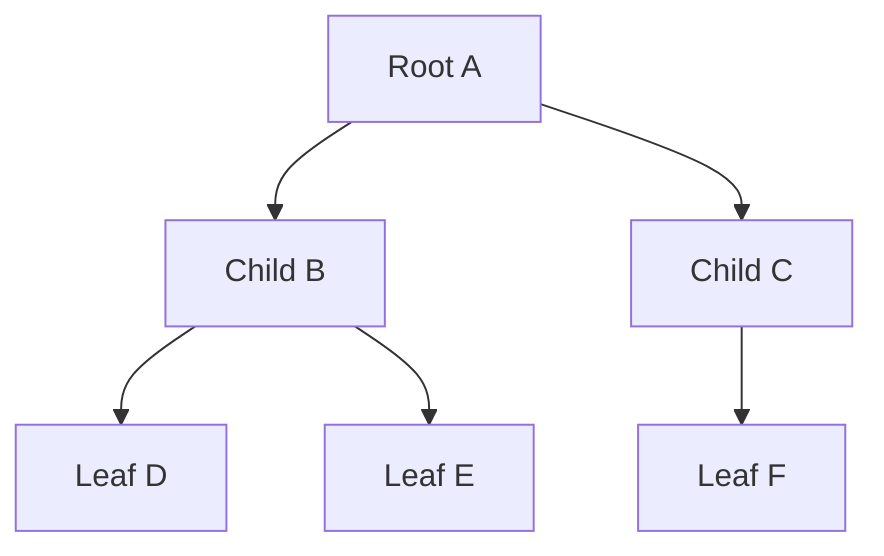

Tree bukan sekadar “graph tanpa cycle”. Dalam konteks struktur data, tree biasanya membawa **semantic hierarchy**.

Contoh:

```text
Company
├── Engineering
│   ├── Backend
│   └── Frontend
└── Finance
    └── Payroll
```

Atau:

```text
Expression
      *
     / \
    +   7
   / \
  3   5
```

Atau policy:

```text
Permission Root
├── Application
│   ├── Read
│   ├── Write
│   └── Approve
└── Case
    ├── View
    └── Escalate
```

Hal penting: tree memberi struktur pada **containment, ordering, dependency, derivation, dan evaluation**.

---

## 2. Terminology Tree

Terminology dasar:

| Istilah | Makna |
|---|---|
| Root | Node paling atas, tidak punya parent |
| Parent | Node yang memiliki child |
| Child | Node turunan langsung |
| Sibling | Node dengan parent yang sama |
| Leaf | Node tanpa child |
| Internal node | Node yang punya minimal satu child |
| Edge | Hubungan parent-child |
| Path | Urutan node dari satu node ke node lain |
| Depth | Jarak node dari root |
| Height | Jarak maksimum dari node ke leaf terdalam |
| Subtree | Tree yang berakar pada node tertentu |
| Degree | Jumlah child suatu node |
| Ancestor | Parent, grandparent, dst |
| Descendant | Child, grandchild, dst |

Contoh:

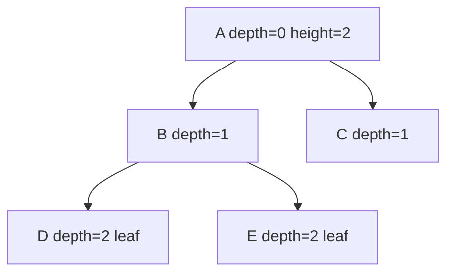

Pada diagram di atas:

- `A` adalah root,
- `D` dan `E` adalah leaf,
- depth `D` = 2,
- height `A` = 2,
- subtree `B` berisi `B`, `D`, `E`.

### 2.1 Depth vs Height

Sering tertukar:

- **depth** dihitung dari root ke node,
- **height** dihitung dari node ke leaf terdalam.

```text
root-centric  : depth
leaf-centric  : height
```

Mental model:

- depth = “seberapa dalam node ini berada dari awal?”
- height = “seberapa tinggi subtree ini jika node ini jadi root?”

---

## 3. Tree Invariant

Tree punya invariant struktural minimal:

1. root tidak punya parent,
2. setiap node selain root punya tepat satu parent,
3. tidak ada cycle,
4. semua node reachable dari root,
5. edge count untuk `n` node adalah `n-1`.

Untuk binary search tree, ada invariant tambahan:

```text
semua key di left subtree  < node.key
semua key di right subtree > node.key
```

Atau jika duplicate diizinkan, harus eksplisit:

```text
left  <= node.key < right
```

atau:

```text
left < node.key <= right
```

Tidak boleh ambigu.

### 3.1 Kenapa Invariant Penting?

Invariant adalah “hukum internal” struktur data.

Kalau invariant rusak:

- search bisa salah,
- traversal bisa infinite loop,
- delete bisa corrupt,
- ordering tidak valid,
- memory bisa retained,
- hasil range query bisa salah,
- production bug bisa silent.

Contoh BST corrupt:

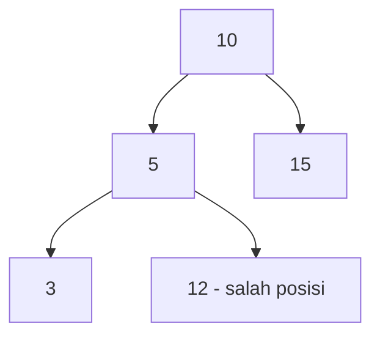

Node `12` berada di left subtree dari `10`, padahal `12 > 10`. Ini melanggar invariant global walaupun secara lokal `12 > 5` tampak benar.

Ini jebakan umum: validasi BST tidak cukup dengan membandingkan child langsung. Harus membawa bound dari ancestor.

---

## 4. Binary Tree

Binary tree adalah tree di mana setiap node punya maksimal dua child:

- left,
- right.

Binary tree tidak otomatis berarti binary search tree.

Contoh binary tree biasa:

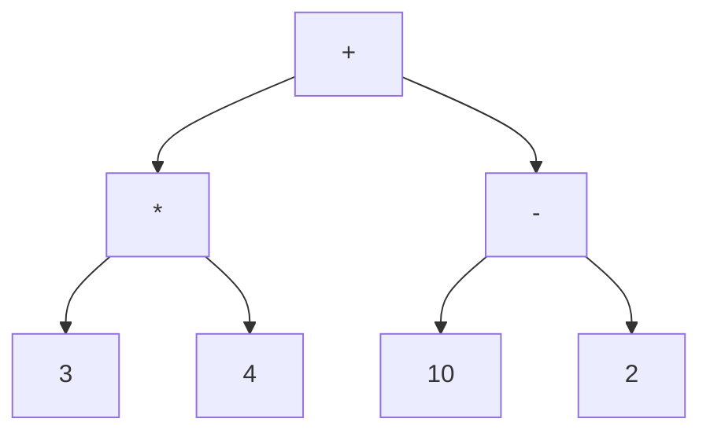

Tree ini bisa merepresentasikan expression:

```text
(3 * 4) + (10 - 2)
```

Tidak ada ordering key. Left/right hanya bagian dari struktur expression.

### 4.1 Node Binary Tree di Go

Representasi dasar:

```go
type BinaryNode[T any] struct {
    Value T
    Left  *BinaryNode[T]
    Right *BinaryNode[T]
}
```

Ini sederhana, tapi production concern-nya:

- setiap node biasanya allocation terpisah,
- pointer chasing tinggi,
- GC harus scan pointer,
- locality buruk dibanding slice,
- recursive traversal bisa dalam,
- ownership node perlu jelas.

Untuk tree kecil, ini sangat cukup. Untuk tree besar/latency-sensitive, harus dievaluasi.

---

## 5. Binary Search Tree

Binary Search Tree atau BST adalah binary tree dengan ordering invariant.

Untuk setiap node `n`:

```text
left subtree  contains keys < n.key
right subtree contains keys > n.key
```

Diagram:

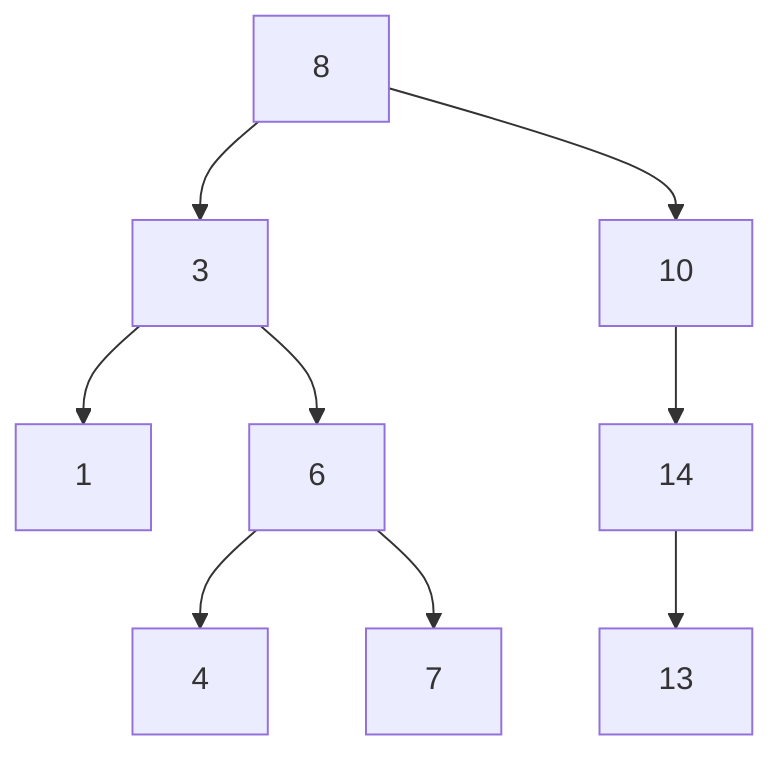

Jika kita lakukan inorder traversal, hasilnya sorted:

```text
1, 3, 4, 6, 7, 8, 10, 13, 14
```

Itulah kekuatan BST: ia menggabungkan tree structure dengan ordering.

### 5.1 Operasi Utama BST

| Operasi | Average jika balanced | Worst jika degenerasi |
|---|---:|---:|
| Search | `O(log n)` | `O(n)` |
| Insert | `O(log n)` | `O(n)` |
| Delete | `O(log n)` | `O(n)` |
| Min/Max | `O(log n)` | `O(n)` |
| Inorder traversal | `O(n)` | `O(n)` |
| Range query | `O(log n + k)` jika balanced | `O(n)` |

Catatan penting: BST biasa **tidak menjamin balanced**.

Jika insert data sorted:

```text
1, 2, 3, 4, 5
```

BST bisa menjadi linked list:


Search `5` menjadi `O(n)`, bukan `O(log n)`.

---

## 6. Go Comparator Model

Go tidak memiliki operator `<` untuk generic arbitrary type kecuali type constraint tertentu. Untuk struktur data ordered, kita biasanya punya beberapa opsi:

### 6.1 Constraint-Based Ordered Key

Jika key numeric/string:

```go
type Ordered interface {
    ~int | ~int8 | ~int16 | ~int32 | ~int64 |
        ~uint | ~uint8 | ~uint16 | ~uint32 | ~uint64 | ~uintptr |
        ~float32 | ~float64 |
        ~string
}
```

Lalu:

```go
type Node[K Ordered, V any] struct {
    Key   K
    Value V
    Left  *Node[K, V]
    Right *Node[K, V]
}
```

Keuntungan:

- ergonomic,
- compile-time type safety,
- tanpa comparator call.

Kelemahan:

- tidak cocok untuk custom ordering,
- tidak cocok untuk struct key kompleks,
- float ordering punya edge case seperti `NaN`.

### 6.2 Comparator Function

```go
type CompareFunc[K any] func(a, b K) int
```

Kontrak:

```text
compare(a,b) < 0  => a < b
compare(a,b) == 0 => a == b
compare(a,b) > 0  => a > b
```

Keuntungan:

- flexible,
- bisa multi-field,
- bisa custom domain order.

Kelemahan:

- comparator harus konsisten,
- ada call overhead,
- closure bisa capture state,
- jika comparator berubah, tree corrupt secara logical.

### 6.3 Interface-Based Compare

```go
type Comparable[T any] interface {
    Compare(T) int
}
```

Bisa, tapi biasanya kurang idiomatik untuk reusable generic data structure karena memaksa domain type punya method tertentu.

### 6.4 Production Rule

Untuk tree reusable, comparator-based design paling fleksibel.

Untuk tree internal yang key-nya sudah pasti primitive, constraint-based design lebih sederhana.

---

## 7. Basic BST Implementation di Go

Contoh generic BST sederhana dengan comparator.

```go
package bst

type CompareFunc[K any] func(a, b K) int

type Tree[K any, V any] struct {
    root *node[K, V]
    cmp  CompareFunc[K]
    size int
}

type node[K any, V any] struct {
    key   K
    value V
    left  *node[K, V]
    right *node[K, V]
}

func New[K any, V any](cmp CompareFunc[K]) *Tree[K, V] {
    if cmp == nil {
        panic("bst: nil comparator")
    }
    return &Tree[K, V]{cmp: cmp}
}

func (t *Tree[K, V]) Len() int {
    if t == nil {
        return 0
    }
    return t.size
}
```

Mengapa `panic` untuk nil comparator?

Karena comparator adalah dependency fundamental. Tanpa comparator, tree tidak bisa mempertahankan invariant. Ini programming error, bukan runtime business error.

---

## 8. Search

Search pada BST mengikuti ordering.

```go
func (t *Tree[K, V]) Get(key K) (V, bool) {
    var zero V
    if t == nil || t.root == nil {
        return zero, false
    }

    cur := t.root
    for cur != nil {
        c := t.cmp(key, cur.key)
        switch {
        case c < 0:
            cur = cur.left
        case c > 0:
            cur = cur.right
        default:
            return cur.value, true
        }
    }

    return zero, false
}
```

Mental model:

```text
at each node:
  if key smaller -> go left
  if key larger  -> go right
  if equal       -> found
```

Complexity:

```text
O(h)
```

`h` = height tree.

Jika balanced:

```text
h ≈ log2(n)
```

Jika degenerate:

```text
h ≈ n
```

---

## 9. Insert

Insert mencari posisi kosong sambil mempertahankan ordering invariant.

```go
func (t *Tree[K, V]) Put(key K, value V) (replaced bool) {
    if t == nil {
        panic("bst: nil tree")
    }
    if t.root == nil {
        t.root = &node[K, V]{key: key, value: value}
        t.size = 1
        return false
    }

    cur := t.root
    for {
        c := t.cmp(key, cur.key)
        switch {
        case c < 0:
            if cur.left == nil {
                cur.left = &node[K, V]{key: key, value: value}
                t.size++
                return false
            }
            cur = cur.left
        case c > 0:
            if cur.right == nil {
                cur.right = &node[K, V]{key: key, value: value}
                t.size++
                return false
            }
            cur = cur.right
        default:
            cur.value = value
            return true
        }
    }
}
```

Policy duplicate di sini:

```text
same key => replace value
```

Alternatif policy:

- reject duplicate,
- allow duplicate in count,
- store list per key,
- define tie-breaker.

Production rule: duplicate policy harus eksplisit.

---

## 10. Min dan Max

Minimum berada di left-most node.

```go
func (t *Tree[K, V]) Min() (K, V, bool) {
    var zk K
    var zv V
    if t == nil || t.root == nil {
        return zk, zv, false
    }

    cur := t.root
    for cur.left != nil {
        cur = cur.left
    }
    return cur.key, cur.value, true
}
```

Maximum berada di right-most node.

```go
func (t *Tree[K, V]) Max() (K, V, bool) {
    var zk K
    var zv V
    if t == nil || t.root == nil {
        return zk, zv, false
    }

    cur := t.root
    for cur.right != nil {
        cur = cur.right
    }
    return cur.key, cur.value, true
}
```

---

## 11. Traversal

Traversal adalah cara mengunjungi node.

Untuk binary tree, traversal utama:

1. preorder,
2. inorder,
3. postorder,
4. level-order.

---

## 12. Preorder Traversal

Urutan:

```text
node -> left -> right
```

Cocok untuk:

- copy tree,
- serialize prefix,
- evaluate command tree,
- print structure dari root ke leaf.

Recursive:

```go
func preorder[K any, V any](n *node[K, V], visit func(K, V) bool) bool {
    if n == nil {
        return true
    }
    if !visit(n.key, n.value) {
        return false
    }
    if !preorder(n.left, visit) {
        return false
    }
    return preorder(n.right, visit)
}
```

Dengan early stop.

Public API:

```go
func (t *Tree[K, V]) Preorder(visit func(K, V) bool) {
    if t == nil || visit == nil {
        return
    }
    preorder(t.root, visit)
}
```

---

## 13. Inorder Traversal

Urutan:

```text
left -> node -> right
```

Pada BST, inorder menghasilkan urutan sorted.

```go
func inorder[K any, V any](n *node[K, V], visit func(K, V) bool) bool {
    if n == nil {
        return true
    }
    if !inorder(n.left, visit) {
        return false
    }
    if !visit(n.key, n.value) {
        return false
    }
    return inorder(n.right, visit)
}
```

Public API:

```go
func (t *Tree[K, V]) Ascend(visit func(K, V) bool) {
    if t == nil || visit == nil {
        return
    }
    inorder(t.root, visit)
}
```

Use case:

```go
t.Ascend(func(k int, v string) bool {
    fmt.Println(k, v)
    return true
})
```

---

## 14. Reverse Inorder Traversal

Urutan:

```text
right -> node -> left
```

Pada BST, menghasilkan descending order.

```go
func reverseInorder[K any, V any](n *node[K, V], visit func(K, V) bool) bool {
    if n == nil {
        return true
    }
    if !reverseInorder(n.right, visit) {
        return false
    }
    if !visit(n.key, n.value) {
        return false
    }
    return reverseInorder(n.left, visit)
}
```

---

## 15. Postorder Traversal

Urutan:

```text
left -> right -> node
```

Cocok untuk:

- delete/free subtree,
- evaluate expression jika child harus selesai dulu,
- compute subtree aggregate,
- validate bottom-up.

```go
func postorder[K any, V any](n *node[K, V], visit func(K, V) bool) bool {
    if n == nil {
        return true
    }
    if !postorder(n.left, visit) {
        return false
    }
    if !postorder(n.right, visit) {
        return false
    }
    return visit(n.key, n.value)
}
```

---

## 16. Level-Order Traversal

Level-order traversal mengunjungi node per depth menggunakan queue.

Urutan:

```text
root, children, grandchildren, ...
```

```go
func (t *Tree[K, V]) LevelOrder(visit func(K, V) bool) {
    if t == nil || t.root == nil || visit == nil {
        return
    }

    q := []*node[K, V]{t.root}
    for len(q) > 0 {
        n := q[0]
        q[0] = nil // avoid retaining popped node through backing array
        q = q[1:]

        if !visit(n.key, n.value) {
            return
        }
        if n.left != nil {
            q = append(q, n.left)
        }
        if n.right != nil {
            q = append(q, n.right)
        }
    }
}
```

Production caveat:

- queue backed by `q = q[1:]` can retain backing array,
- for huge traversal, use ring buffer or compact periodically,
- set popped slot to nil if node references large objects.

---

## 17. Recursive vs Iterative Traversal

Recursive traversal sederhana, tetapi stack depth bergantung pada tree height.

Pada balanced tree:

```text
height = O(log n)
```

Aman untuk banyak kasus.

Pada degenerate tree:

```text
height = O(n)
```

Recursive traversal bisa sangat dalam.

Iterative inorder menggunakan explicit stack:

```go
func (t *Tree[K, V]) AscendIter(visit func(K, V) bool) {
    if t == nil || visit == nil {
        return
    }

    stack := make([]*node[K, V], 0)
    cur := t.root

    for cur != nil || len(stack) > 0 {
        for cur != nil {
            stack = append(stack, cur)
            cur = cur.left
        }

        cur = stack[len(stack)-1]
        stack[len(stack)-1] = nil
        stack = stack[:len(stack)-1]

        if !visit(cur.key, cur.value) {
            return
        }

        cur = cur.right
    }
}
```

Keuntungan iterative:

- tidak bergantung pada call stack,
- lebih predictable untuk tree arbitrary,
- bisa mengontrol memory.

Kekurangan:

- kode lebih verbose,
- stack eksplisit tetap `O(h)`.

Production rule:

> Jika tree bisa berasal dari input eksternal atau bisa degenerasi, iterative traversal lebih aman.

---

## 18. Delete pada BST

Delete lebih rumit karena harus mempertahankan invariant.

Ada 3 kasus:

1. node adalah leaf,
2. node punya satu child,
3. node punya dua child.

### 18.1 Delete Leaf

```text
hapus langsung dari parent
```

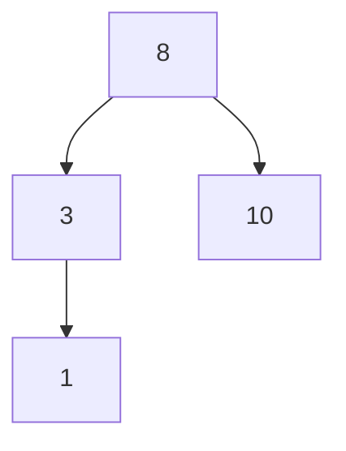

Delete `1`:

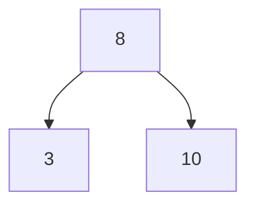

### 18.2 Delete Node dengan Satu Child

Replace node dengan child-nya.

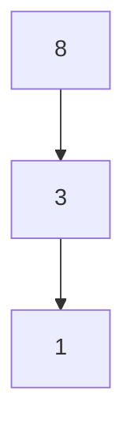

Delete `3`:

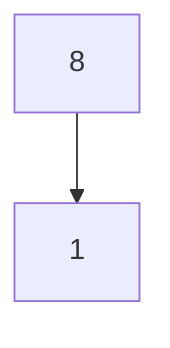

### 18.3 Delete Node dengan Dua Child

Strategi umum:

- replace dengan inorder successor, yaitu minimum dari right subtree,
- atau replace dengan inorder predecessor, yaitu maximum dari left subtree.

Contoh:

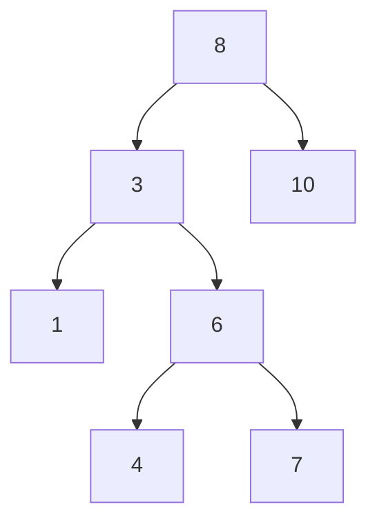

Delete `3`:

- successor = `4`, minimum dari right subtree `6 -> 4`,
- replace key/value `3` dengan `4`,
- delete node `4` dari posisi lama.

---

## 19. Delete Implementation

Recursive delete bisa ditulis ringkas:

```go
func (t *Tree[K, V]) Delete(key K) bool {
    if t == nil || t.root == nil {
        return false
    }

    var deleted bool
    t.root, deleted = t.delete(t.root, key)
    if deleted {
        t.size--
    }
    return deleted
}

func (t *Tree[K, V]) delete(n *node[K, V], key K) (*node[K, V], bool) {
    if n == nil {
        return nil, false
    }

    c := t.cmp(key, n.key)
    switch {
    case c < 0:
        var deleted bool
        n.left, deleted = t.delete(n.left, key)
        return n, deleted
    case c > 0:
        var deleted bool
        n.right, deleted = t.delete(n.right, key)
        return n, deleted
    default:
        // case 1: no child
        if n.left == nil && n.right == nil {
            return nil, true
        }

        // case 2: one child
        if n.left == nil {
            return n.right, true
        }
        if n.right == nil {
            return n.left, true
        }

        // case 3: two children
        succ := minNode(n.right)
        n.key = succ.key
        n.value = succ.value
        var deleted bool
        n.right, deleted = t.delete(n.right, succ.key)
        return n, deleted
    }
}

func minNode[K any, V any](n *node[K, V]) *node[K, V] {
    for n.left != nil {
        n = n.left
    }
    return n
}
```

### 19.1 Subtle Issue: Duplicate Key Policy

Kode di atas mengasumsikan unique key. Kalau duplicate diizinkan, delete successor by key bisa menghapus node yang tidak tepat jika comparator menganggap beberapa key sama.

Untuk production, duplicate policy harus jelas sebelum implementasi delete.

---

## 20. Range Query

BST bisa melakukan range query lebih efisien dari full traversal jika tree cukup balanced.

```go
func (t *Tree[K, V]) Range(min K, max K, visit func(K, V) bool) {
    if t == nil || visit == nil {
        return
    }
    t.rangeAsc(t.root, min, max, visit)
}

func (t *Tree[K, V]) rangeAsc(n *node[K, V], min K, max K, visit func(K, V) bool) bool {
    if n == nil {
        return true
    }

    if t.cmp(n.key, min) > 0 {
        if !t.rangeAsc(n.left, min, max, visit) {
            return false
        }
    }

    if t.cmp(n.key, min) >= 0 && t.cmp(n.key, max) <= 0 {
        if !visit(n.key, n.value) {
            return false
        }
    }

    if t.cmp(n.key, max) < 0 {
        if !t.rangeAsc(n.right, min, max, visit) {
            return false
        }
    }

    return true
}
```

Complexity ideal:

```text
O(log n + k)
```

Dengan:

- `k` = jumlah hasil,
- `log n` = biaya menemukan batas range.

Namun pada BST tidak balanced, worst-case tetap `O(n)`.

---

## 21. Validasi BST: Child Check Tidak Cukup

Validasi salah yang sering muncul:

```go
func invalidValidate(n *node[int, string]) bool {
    if n == nil {
        return true
    }
    if n.left != nil && n.left.key >= n.key {
        return false
    }
    if n.right != nil && n.right.key <= n.key {
        return false
    }
    return invalidValidate(n.left) && invalidValidate(n.right)
}
```

Ini hanya memeriksa child langsung.

Counterexample:

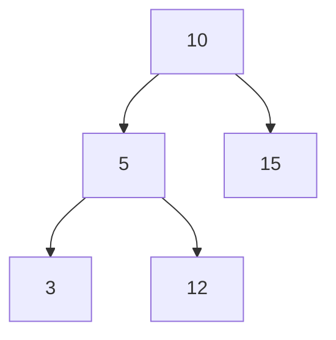

`12` lebih besar dari `5`, jadi lolos local check. Tapi `12` berada di left subtree dari `10`, sehingga melanggar global invariant.

Validasi benar membawa bound:

```go
func (t *Tree[K, V]) Validate() bool {
    if t == nil {
        return true
    }
    count := 0
    ok := t.validate(t.root, nil, nil, &count)
    return ok && count == t.size
}

func (t *Tree[K, V]) validate(n *node[K, V], min *K, max *K, count *int) bool {
    if n == nil {
        return true
    }

    if min != nil && t.cmp(n.key, *min) <= 0 {
        return false
    }
    if max != nil && t.cmp(n.key, *max) >= 0 {
        return false
    }

    *count++

    if !t.validate(n.left, min, &n.key, count) {
        return false
    }
    return t.validate(n.right, &n.key, max, count)
}
```

Namun kode di atas memiliki masalah Go syntax:

```go
*count++
```

tidak valid. Yang benar:

```go
*count = *count + 1
```

Versi benar:

```go
func (t *Tree[K, V]) Validate() bool {
    if t == nil {
        return true
    }
    count := 0
    ok := t.validate(t.root, nil, nil, &count)
    return ok && count == t.size
}

func (t *Tree[K, V]) validate(n *node[K, V], min *K, max *K, count *int) bool {
    if n == nil {
        return true
    }

    if min != nil && t.cmp(n.key, *min) <= 0 {
        return false
    }
    if max != nil && t.cmp(n.key, *max) >= 0 {
        return false
    }

    *count = *count + 1

    if !t.validate(n.left, min, &n.key, count) {
        return false
    }
    return t.validate(n.right, &n.key, max, count)
}
```

### 21.1 Bound Semantics dengan Duplicate

Jika duplicate diizinkan, bound harus berubah.

Policy:

```text
left <= node < right
```

atau:

```text
left < node <= right
```

Validator harus mengikuti policy itu.

---

## 22. Height dan Degenerasi

Height menentukan biaya operasi BST.

```go
func height[K any, V any](n *node[K, V]) int {
    if n == nil {
        return -1
    }
    lh := height(n.left)
    rh := height(n.right)
    if lh > rh {
        return lh + 1
    }
    return rh + 1
}
```

Beberapa definisi memakai height empty tree = 0, leaf = 1. Definisi di atas memakai:

```text
empty = -1
leaf  = 0
```

Tidak ada yang “paling benar”; yang penting konsisten.

### 22.1 Degenerate Tree

Sorted insert:

```go
for i := 0; i < n; i++ {
    t.Put(i, i)
}
```

Akan membuat tree mirip linked list jika tanpa balancing.

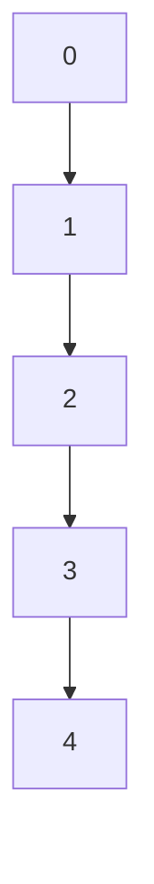

Height menjadi `n-1`.

### 22.2 Balanced Tree

Ideal balanced:

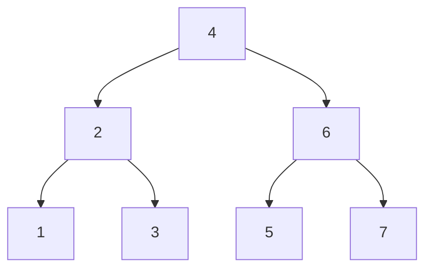

Height sekitar `log2(n)`.

---

## 23. BST vs Sorted Slice vs Map

BST bukan default terbaik untuk semua masalah.

| Struktur | Search | Insert | Delete | Ordered iteration | Range query | Memory locality |
|---|---:|---:|---:|---:|---:|---:|
| `map` | avg `O(1)` | avg `O(1)` | avg `O(1)` | tidak ordered | tidak natural | mixed |
| sorted slice | `O(log n)` | `O(n)` | `O(n)` | sangat baik | baik | sangat baik |
| BST biasa | avg `O(log n)` | avg `O(log n)` | avg `O(log n)` | baik | baik | buruk |
| balanced tree | `O(log n)` | `O(log n)` | `O(log n)` | baik | baik | buruk-moderate |

### 23.1 Kapan Map Lebih Baik?

Gunakan map jika:

- hanya butuh exact lookup,
- tidak butuh ordering,
- tidak butuh range query,
- key comparable,
- operation mostly lookup/insert/delete.

### 23.2 Kapan Sorted Slice Lebih Baik?

Gunakan sorted slice jika:

- dataset relatif kecil,
- mutation jarang,
- read/search sering,
- butuh iteration cepat,
- memory locality penting,
- batch rebuild memungkinkan.

Contoh:

- static routing table kecil,
- config lookup,
- sorted enum/rule list,
- allowlist jarang berubah.

### 23.3 Kapan Tree Lebih Baik?

Gunakan tree jika:

- mutation sering,
- tetap butuh ordered traversal,
- butuh predecessor/successor,
- butuh range query dinamis,
- sorted slice terlalu mahal karena shifting.

Namun untuk production, biasanya pilih balanced tree, B-tree, skiplist, atau library teruji, bukan BST biasa.

---

## 24. Parent Pointer atau Tidak?

Node bisa memiliki parent pointer:

```go
type node[K any, V any] struct {
    key    K
    value  V
    left   *node[K, V]
    right  *node[K, V]
    parent *node[K, V]
}
```

Keuntungan:

- successor/predecessor lebih mudah,
- deletion/rotation bisa lebih fleksibel,
- iterator bisa naik ke ancestor.

Kelemahan:

- invariant lebih kompleks,
- mutation harus update parent pointer,
- lebih banyak pointer untuk GC,
- bug lebih mudah,
- node ownership makin sensitif.

Production rule:

> Jangan tambahkan parent pointer kecuali operasi yang dibutuhkan memang membenarkannya.

---

## 25. Node Handle dan Ownership

Jika API mengembalikan pointer node keluar:

```go
func (t *Tree[K, V]) FindNode(key K) *node[K, V]
```

Maka caller bisa menyimpan handle. Ini berbahaya jika:

- tree berubah,
- node dihapus,
- node dipindahkan,
- key dimutasi,
- pointer lama dianggap valid.

Untuk package reusable, hindari expose internal node.

Lebih aman:

```go
func (t *Tree[K, V]) Get(key K) (V, bool)
func (t *Tree[K, V]) Ascend(func(K, V) bool)
func (t *Tree[K, V]) Delete(key K) bool
```

Jika perlu handle, buat handle dengan lifecycle jelas.

---

## 26. Mutation During Iteration

Pertanyaan penting:

> Bolehkah tree dimutasi saat traversal?

Jika tidak didefinisikan, jangan.

Contoh berbahaya:

```go
t.Ascend(func(k int, v string) bool {
    if shouldDelete(k) {
        t.Delete(k)
    }
    return true
})
```

Ini bisa:

- melewati node,
- mengunjungi node dua kali,
- corrupt traversal state,
- panic jika iterator bergantung pada pointer tertentu.

Policy API harus eksplisit:

```text
The tree must not be mutated during iteration.
```

Alternatif aman:

1. collect keys first,
2. delete after traversal.

```go
var toDelete []int

t.Ascend(func(k int, v string) bool {
    if shouldDelete(k) {
        toDelete = append(toDelete, k)
    }
    return true
})

for _, k := range toDelete {
    t.Delete(k)
}
```

---

## 27. Tree sebagai Expression Tree

Binary tree tidak harus ordered. Salah satu use case kuat adalah expression tree.

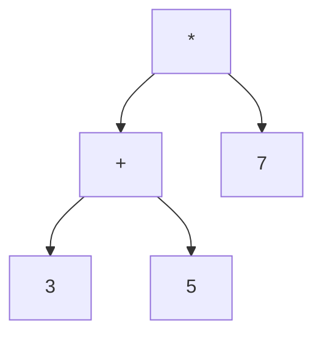

Merepresentasikan:

```text
(3 + 5) * 7
```

Go model:

```go
type Expr interface {
    Eval() int
}

type Number struct {
    Value int
}

func (n Number) Eval() int { return n.Value }

type BinaryExpr struct {
    Op    string
    Left  Expr
    Right Expr
}

func (b BinaryExpr) Eval() int {
    switch b.Op {
    case "+":
        return b.Left.Eval() + b.Right.Eval()
    case "-":
        return b.Left.Eval() - b.Right.Eval()
    case "*":
        return b.Left.Eval() * b.Right.Eval()
    case "/":
        return b.Left.Eval() / b.Right.Eval()
    default:
        panic("unknown operator")
    }
}
```

Production version harus menangani:

- divide by zero,
- unknown operator sebagai error,
- overflow jika relevan,
- recursion depth,
- validation,
- typed AST instead of string op.

Lebih aman:

```go
type Op uint8

const (
    OpAdd Op = iota
    OpSub
    OpMul
    OpDiv
)
```

---

## 28. Tree sebagai Decision Tree

Decision tree umum dipakai di rule engine.

Contoh:

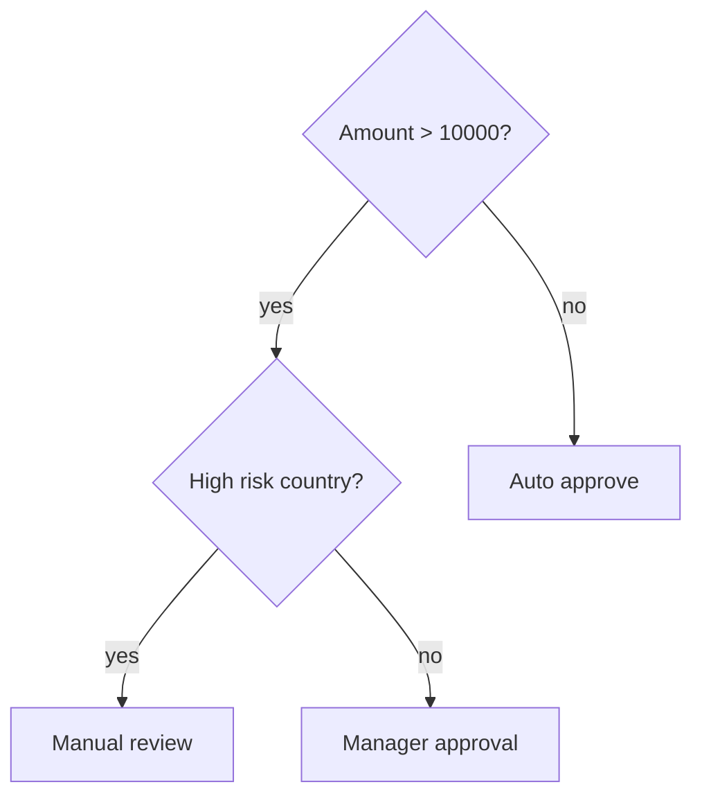

Model sederhana:

```go
type DecisionNode struct {
    Predicate func(Input) bool
    Yes       *DecisionNode
    No        *DecisionNode
    Result    *DecisionResult
}

type Input struct {
    Amount      int64
    CountryCode string
}

type DecisionResult struct {
    Action string
}
```

Evaluation:

```go
func EvalDecision(root *DecisionNode, in Input) (*DecisionResult, bool) {
    cur := root
    for cur != nil {
        if cur.Result != nil {
            return cur.Result, true
        }
        if cur.Predicate == nil {
            return nil, false
        }
        if cur.Predicate(in) {
            cur = cur.Yes
        } else {
            cur = cur.No
        }
    }
    return nil, false
}
```

Production concerns:

- every non-leaf must have predicate,
- every leaf should have result,
- no cycle,
- evaluation should be bounded,
- predicates should be deterministic,
- audit trail should record path,
- versioning should be explicit.

Audit path:

```go
type DecisionTraceStep struct {
    NodeID string
    Taken  string
}
```

This matters in regulatory systems.

---

## 29. Tree sebagai Hierarchical Policy

Policy sering berbentuk hierarchical tree.

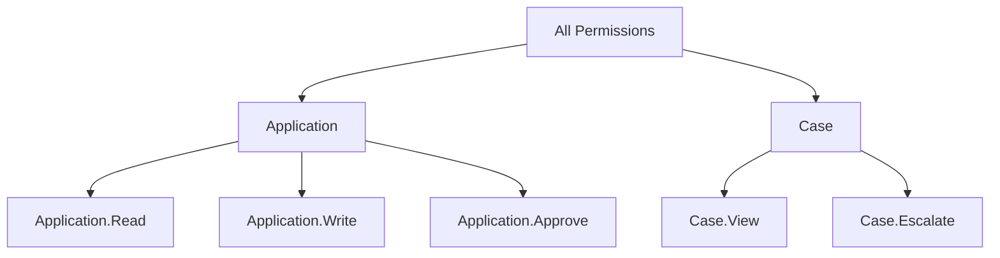

Pertanyaan desain:

- apakah parent permission implies children?
- apakah child permission implies parent visibility?
- apakah deny override allow?
- apakah inheritance bisa diputus?
- apakah order evaluation penting?

Tree bisa membantu model, tapi policy engine butuh invariant domain, bukan hanya structure.

Contoh invariant:

```text
If a permission node is disabled, all descendants are unreachable unless explicitly re-enabled by override policy.
```

Atau:

```text
Deny at any ancestor dominates allow at descendant.
```

Ini bukan invariant tree umum, tapi invariant domain.

---

## 30. Tree sebagai Workflow/State Hierarchy

Tree juga bisa memodelkan breakdown workflow.

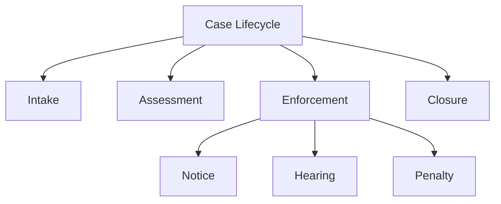

Namun hati-hati: workflow sebenarnya sering graph, bukan tree.

Jika suatu state bisa punya multiple incoming transitions, struktur tree tidak cukup.

Contoh:

```text
Draft -> Submitted -> Reviewed -> Approved
Draft -> Cancelled
Reviewed -> Rework -> Submitted
```

Ada cycle/re-entry. Ini graph, bukan tree.

Production rule:

> Gunakan tree untuk decomposition hierarchy. Gunakan graph untuk transition/reachability.

---

## 31. Memory Model Tree di Go

Pointer-based tree:

```go
type node struct {
    key   int
    value string
    left  *node
    right *node
}
```

Karakteristik:

- mudah dimutasi,
- mudah implementasi recursive,
- setiap node bisa allocation sendiri,
- locality buruk,
- pointer scanning oleh GC,
- overhead per node cukup besar.

Slice-backed tree:

```go
type node struct {
    key   int
    value string
    left  int
    right int
}
```

Dengan `-1` sebagai nil.

Keuntungan:

- locality lebih baik,
- lebih compact,
- bisa serialize lebih mudah,
- lebih sedikit pointer.

Kelemahan:

- mutation lebih kompleks,
- delete/reuse slot butuh free list,
- external handle by index bisa invalid,
- harder to code correctly.

### 31.1 Pointer Tree vs Index Tree

| Aspek | Pointer Tree | Index/Slice Tree |
|---|---|---|
| Simplicity | tinggi | sedang-rendah |
| Mutation | mudah | lebih kompleks |
| GC scanning | tinggi | lebih rendah jika pointer sedikit |
| Locality | buruk | lebih baik |
| Serialization | lebih sulit | lebih mudah |
| Stable handle | pointer bisa stale | index bisa stale |
| Production complexity | sedang | tinggi |

Untuk pembelajaran, pointer tree lebih baik. Untuk storage/index performance, index/tree layout bisa lebih menarik.

---

## 32. Complete Minimal BST Example

Berikut contoh minimal yang compile secara konseptual untuk ordered int-like use case dengan comparator.

```go
package bst

type CompareFunc[K any] func(a, b K) int

type Tree[K any, V any] struct {
    root *node[K, V]
    cmp  CompareFunc[K]
    size int
}

type node[K any, V any] struct {
    key   K
    value V
    left  *node[K, V]
    right *node[K, V]
}

func New[K any, V any](cmp CompareFunc[K]) *Tree[K, V] {
    if cmp == nil {
        panic("bst: nil comparator")
    }
    return &Tree[K, V]{cmp: cmp}
}

func (t *Tree[K, V]) Len() int {
    if t == nil {
        return 0
    }
    return t.size
}

func (t *Tree[K, V]) Put(key K, value V) bool {
    if t == nil {
        panic("bst: nil tree")
    }
    if t.root == nil {
        t.root = &node[K, V]{key: key, value: value}
        t.size = 1
        return false
    }

    cur := t.root
    for {
        c := t.cmp(key, cur.key)
        switch {
        case c < 0:
            if cur.left == nil {
                cur.left = &node[K, V]{key: key, value: value}
                t.size++
                return false
            }
            cur = cur.left
        case c > 0:
            if cur.right == nil {
                cur.right = &node[K, V]{key: key, value: value}
                t.size++
                return false
            }
            cur = cur.right
        default:
            cur.value = value
            return true
        }
    }
}

func (t *Tree[K, V]) Get(key K) (V, bool) {
    var zero V
    if t == nil || t.root == nil {
        return zero, false
    }

    cur := t.root
    for cur != nil {
        c := t.cmp(key, cur.key)
        switch {
        case c < 0:
            cur = cur.left
        case c > 0:
            cur = cur.right
        default:
            return cur.value, true
        }
    }
    return zero, false
}

func (t *Tree[K, V]) Delete(key K) bool {
    if t == nil || t.root == nil {
        return false
    }
    var deleted bool
    t.root, deleted = t.delete(t.root, key)
    if deleted {
        t.size--
    }
    return deleted
}

func (t *Tree[K, V]) delete(n *node[K, V], key K) (*node[K, V], bool) {
    if n == nil {
        return nil, false
    }

    c := t.cmp(key, n.key)
    switch {
    case c < 0:
        var deleted bool
        n.left, deleted = t.delete(n.left, key)
        return n, deleted
    case c > 0:
        var deleted bool
        n.right, deleted = t.delete(n.right, key)
        return n, deleted
    default:
        if n.left == nil {
            return n.right, true
        }
        if n.right == nil {
            return n.left, true
        }

        succ := n.right
        for succ.left != nil {
            succ = succ.left
        }

        n.key = succ.key
        n.value = succ.value

        var deleted bool
        n.right, deleted = t.delete(n.right, succ.key)
        return n, deleted
    }
}

func (t *Tree[K, V]) Ascend(visit func(K, V) bool) {
    if t == nil || visit == nil {
        return
    }

    stack := make([]*node[K, V], 0)
    cur := t.root

    for cur != nil || len(stack) > 0 {
        for cur != nil {
            stack = append(stack, cur)
            cur = cur.left
        }

        cur = stack[len(stack)-1]
        stack[len(stack)-1] = nil
        stack = stack[:len(stack)-1]

        if !visit(cur.key, cur.value) {
            return
        }

        cur = cur.right
    }
}

func (t *Tree[K, V]) Validate() bool {
    if t == nil {
        return true
    }
    count := 0
    ok := t.validate(t.root, nil, nil, &count)
    return ok && count == t.size
}

func (t *Tree[K, V]) validate(n *node[K, V], min *K, max *K, count *int) bool {
    if n == nil {
        return true
    }
    if min != nil && t.cmp(n.key, *min) <= 0 {
        return false
    }
    if max != nil && t.cmp(n.key, *max) >= 0 {
        return false
    }

    *count = *count + 1

    if !t.validate(n.left, min, &n.key, count) {
        return false
    }
    return t.validate(n.right, &n.key, max, count)
}
```

Usage:

```go
func compareInt(a, b int) int {
    switch {
    case a < b:
        return -1
    case a > b:
        return 1
    default:
        return 0
    }
}

func example() {
    t := bst.New[int, string](compareInt)
    t.Put(8, "eight")
    t.Put(3, "three")
    t.Put(10, "ten")

    t.Ascend(func(k int, v string) bool {
        fmt.Println(k, v)
        return true
    })
}
```

---

## 33. Testing Tree Invariants

Minimal tests:

```go
func TestTreePutGet(t *testing.T) {
    tr := New[int, string](compareInt)

    tr.Put(2, "two")
    tr.Put(1, "one")
    tr.Put(3, "three")

    got, ok := tr.Get(1)
    if !ok || got != "one" {
        t.Fatalf("Get(1) = %q, %v", got, ok)
    }

    if !tr.Validate() {
        t.Fatalf("tree invariant invalid")
    }
}
```

Test sorted traversal:

```go
func TestTreeAscendSorted(t *testing.T) {
    tr := New[int, int](compareInt)
    inputs := []int{5, 1, 3, 2, 4}
    for _, x := range inputs {
        tr.Put(x, x)
    }

    var got []int
    tr.Ascend(func(k int, v int) bool {
        got = append(got, k)
        return true
    })

    want := []int{1, 2, 3, 4, 5}
    if !reflect.DeepEqual(got, want) {
        t.Fatalf("got %v want %v", got, want)
    }
}
```

Test delete cases:

```go
func TestTreeDeleteCases(t *testing.T) {
    tr := New[int, int](compareInt)
    for _, x := range []int{8, 3, 10, 1, 6, 4, 7, 14, 13} {
        tr.Put(x, x)
    }

    for _, x := range []int{1, 14, 3, 8} {
        if !tr.Delete(x) {
            t.Fatalf("Delete(%d) returned false", x)
        }
        if !tr.Validate() {
            t.Fatalf("tree invalid after delete %d", x)
        }
        if _, ok := tr.Get(x); ok {
            t.Fatalf("key %d still found", x)
        }
    }
}
```

---

## 34. Property-Style Testing

Tree bagus diuji dengan model reference.

Reference model bisa memakai Go `map` plus sorted keys.

Pseudo approach:

```text
for random operation sequence:
  operation = put/get/delete
  apply to tree
  apply to reference map
  compare:
    len
    get result
    sorted traversal
    invariant
```

Contoh skeleton:

```go
func TestTreeRandomOperations(t *testing.T) {
    tr := New[int, int](compareInt)
    ref := make(map[int]int)

    r := rand.New(rand.NewSource(1))

    for i := 0; i < 10_000; i++ {
        k := r.Intn(1000)
        op := r.Intn(3)

        switch op {
        case 0:
            v := r.Int()
            tr.Put(k, v)
            ref[k] = v
        case 1:
            got, ok := tr.Get(k)
            want, wantOK := ref[k]
            if ok != wantOK || got != want {
                t.Fatalf("Get(%d) got (%d,%v) want (%d,%v)", k, got, ok, want, wantOK)
            }
        case 2:
            got := tr.Delete(k)
            _, existed := ref[k]
            delete(ref, k)
            if got != existed {
                t.Fatalf("Delete(%d) got %v want %v", k, got, existed)
            }
        }

        if tr.Len() != len(ref) {
            t.Fatalf("len mismatch got %d want %d", tr.Len(), len(ref))
        }
        if !tr.Validate() {
            t.Fatalf("tree invalid at iteration %d", i)
        }
    }
}
```

Ini jauh lebih kuat daripada hanya menguji contoh kecil.

---

## 35. Fuzzing Angle

Fuzzing cocok untuk menemukan sequence mutasi yang merusak invariant.

Fuzz input bisa berupa byte sequence yang diterjemahkan menjadi operasi.

Pseudo:

```text
byte % 3 => op
next bytes => key/value
```

Yang dicek:

- no panic,
- `Validate()` selalu true,
- traversal sorted,
- result sama dengan reference model.

Fuzzing tree berguna karena bug delete dan edge case traversal sering muncul dari urutan operasi tertentu.

---

## 36. Production Failure Modes

### 36.1 Comparator Tidak Konsisten

Comparator harus memenuhi:

- antisymmetry,
- transitivity,
- equality consistency.

Jika:

```text
a < b
b < c
```

maka harus:

```text
a < c
```

Comparator buruk bisa membuat tree corrupt secara logical.

Contoh buruk:

```go
func badCompare(a, b string) int {
    return len(a) - len(b)
}
```

Ini menganggap semua string dengan panjang sama sebagai key sama.

Mungkin valid jika memang key identity adalah panjang string. Tapi jika caller mengira key identity adalah string penuh, ini bug.

### 36.2 Mutating Key Setelah Insert

Jika key berupa pointer ke struct dan comparator membaca field mutable, tree bisa corrupt tanpa tree tahu.

```go
type Key struct {
    ID int
}
```

Jika key pointer:

```go
k := &Key{ID: 10}
t.Put(k, value)
k.ID = 1
```

Ordering invariant rusak.

Production rule:

> Key yang dipakai untuk ordering harus immutable secara logical selama berada dalam tree.

### 36.3 Degeneration

BST biasa bisa menjadi linked list.

Mitigasi:

- use balanced tree,
- randomize insertion order jika acceptable,
- rebuild periodically,
- use sorted slice for mostly static data,
- use map if ordering unnecessary.

### 36.4 Recursive Stack Depth

Recursive algorithms bisa dalam jika tree degenerate.

Mitigasi:

- iterative traversal,
- max depth validation,
- balanced tree,
- reject malicious input.

### 36.5 Exposing Internal Node

Jika caller bisa memodifikasi node:

- invariant bisa rusak,
- size bisa salah,
- traversal bisa loop.

Mitigasi:

- keep node unexported,
- expose value/key copy,
- immutable iterator result.

### 36.6 Size Counter Drift

Jika delete/insert path lupa update size, tree tampak bekerja tapi metadata salah.

Mitigasi:

- invariant test count nodes equals size,
- property testing,
- fuzzing mutation sequence.

---

## 37. Tree Design Checklist

Sebelum memakai atau membuat tree, tanyakan:

### 37.1 Problem Fit

- Apakah data benar-benar hierarchical?
- Apakah butuh ordering?
- Apakah butuh range query?
- Apakah butuh predecessor/successor?
- Apakah `map` lebih tepat?
- Apakah sorted slice cukup?

### 37.2 Invariant

- Apa invariant utama?
- Apakah duplicate key diizinkan?
- Apa policy duplicate?
- Apakah comparator stable?
- Apakah key immutable secara logical?

### 37.3 Complexity

- Apa average-case?
- Apa worst-case?
- Apakah input bisa sorted/adversarial?
- Apakah tree bisa degenerasi?
- Apakah perlu balancing?

### 37.4 API

- Apakah node internal diekspor?
- Apakah mutation during iteration diizinkan?
- Apakah traversal punya early stop?
- Apakah nil tree behavior jelas?
- Apakah comparator nil dipanic-kan?

### 37.5 Memory

- Berapa node allocation?
- Apakah pointer chasing acceptable?
- Apakah value besar disimpan by value atau pointer?
- Apakah GC scanning tinggi?
- Apakah slice-backed layout lebih cocok?

### 37.6 Testing

- Ada invariant validator?
- Ada random operation test?
- Ada differential test terhadap map/sorted slice?
- Ada delete case test?
- Ada traversal sorted test?
- Ada fuzzing?

---

## 38. Kapan Tidak Menulis Tree Sendiri

Jangan menulis tree sendiri untuk production jika:

- butuh balancing kuat,
- butuh high concurrency,
- data besar,
- performance kritikal,
- correctness sulit diuji,
- library mature tersedia,
- kamu tidak punya waktu membuat invariant testing.

Tree adalah struktur data yang mudah terlihat benar pada contoh kecil, tapi rawan bug pada delete, rotation, iterator, concurrency, dan duplicate policy.

Untuk banyak backend service, pilihan pragmatic sering:

- `map` untuk lookup,
- sorted slice untuk small/static ordered data,
- heap untuk priority,
- database index untuk persistent ordered query,
- library balanced tree untuk ordered map dinamis,
- custom tree hanya jika domain benar-benar membutuhkan.

---

## 39. Hubungan dengan Part Berikutnya

Part ini membahas BST biasa. Masalah terbesar BST biasa adalah degenerasi.

Part berikutnya akan membahas struktur yang menjaga height tetap terkendali:

- AVL Tree,
- Red-Black Tree,
- Treap,
- ordered map/set,
- rotation,
- range query,
- predecessor/successor,
- rank/select introduction,
- trade-off tree vs sorted slice vs hash map vs B-tree.

Dengan kata lain:

```text
Part 012: memahami tree dan invariant dasar
Part 013: menjaga tree tetap balanced dan usable untuk ordered index production
```

---

## 40. Ringkasan

Tree adalah struktur data untuk hierarchy dan ordering.

Binary tree membatasi setiap node maksimal dua child.

BST menambahkan ordering invariant:

```text
left subtree < node < right subtree
```

Operasi BST bergantung pada height:

```text
O(h)
```

Jika balanced:

```text
O(log n)
```

Jika degenerate:

```text
O(n)
```

Hal paling penting bukan menghafal insert/delete, tetapi menjaga invariant:

- ordering global,
- no cycle,
- size benar,
- duplicate policy jelas,
- comparator konsisten,
- key immutable secara logical,
- traversal aman,
- mutation during iteration didefinisikan.

Untuk Go, desain tree harus mempertimbangkan:

- generics,
- comparator,
- pointer allocation,
- GC scanning,
- recursion depth,
- API exposure,
- testing invariant,
- workload nyata.

Production-grade tree bukan sekadar “bisa search”. Ia harus punya kontrak yang jelas, invariant yang bisa diuji, dan failure mode yang dipahami.

---

## 41. Latihan

### Latihan 1 — Implementasi BST Minimal

Implementasikan `Tree[K,V]` dengan:

- `Put`,
- `Get`,
- `Delete`,
- `Len`,
- `Ascend`,
- `Validate`.

Gunakan comparator function.

### Latihan 2 — Duplicate Policy

Ubah BST agar duplicate key disimpan sebagai list value:

```go
type node[K any, V any] struct {
    key    K
    values []V
    left   *node[K, V]
    right  *node[K, V]
}
```

Tentukan policy delete:

- delete satu value,
- atau delete seluruh key.

### Latihan 3 — Iterative Traversal

Implementasikan:

- preorder iterative,
- postorder iterative,
- level-order dengan ring buffer.

### Latihan 4 — Property Test

Buat random operation test dengan reference `map[int]int`.

Validasi:

- length,
- get,
- traversal sorted,
- invariant.

### Latihan 5 — Degeneration Benchmark

Bandingkan insert/search untuk:

1. random input,
2. sorted input,
3. reverse sorted input.

Amati perbedaan height dan latency.

### Latihan 6 — Decision Tree Trace

Buat decision tree yang mengembalikan:

- result,
- path node yang dilewati,
- alasan setiap branch.

Ini sangat relevan untuk sistem yang butuh auditability.

---

## 42. Referensi Resmi dan Relevan

- Go Language Specification — type parameters, pointers, method sets, comparison rules.
- Go standard library documentation — `cmp`, `slices`, `container/list`, `container/ring`, `container/heap`, `testing`.
- Go release notes dan release history untuk konteks versi Go 1.26.x.
- Dokumentasi `testing` dan fuzzing untuk invariant/property-style validation.

---

## 43. Status Seri

- Part ini: **selesai**.
- Seri keseluruhan: **belum selesai**.
- Part berikutnya: **Part 013 — Balanced Trees: AVL, Red-Black, Treap, dan Ordered Index**.


<!-- NAVIGATION_FOOTER -->
<div class="page-nav">
<a href="./learn-go-data-structure-algorithm-part-011.md">⬅️ Part 011 — Hashing, Fingerprint, Checksums, dan Equality Strategy</a>
<a href="./index.md">📚 Kategori</a>
<a href="../../index.md">🏠 Home</a>
<a href="./learn-go-data-structure-algorithm-part-013.md">Part 013 — Balanced Trees: AVL, Red-Black, Treap, dan Ordered Index ➡️</a>
</div>
