# learn-go-data-structure-algorithm-part-013.md

# Part 013 — Balanced Trees: AVL, Red-Black, Treap, dan Ordered Index

> **Seri:** `learn-go-data-structure-algorithm`  
> **Bagian:** `013 / 034`  
> **Target:** Software engineer Java yang ingin menguasai struktur data dan algoritma Go di level production-grade.  
> **Fokus:** balanced binary search tree, ordered map/set, range query, predecessor/successor, rank/select introduction, dan decision framework kapan memakai tree dibanding hash map, sorted slice, heap, atau B-tree.  
> **Versi Go acuan:** Go 1.26.x.  

---

## 0. Posisi Part Ini dalam Seri

Pada Part 012 kita membahas binary tree dan binary search tree dasar. Di sana kita melihat satu fakta penting:

> BST biasa hanya bagus selama bentuk pohonnya tetap cukup seimbang.

Masalahnya, data production jarang selalu random. Banyak data datang dalam pola yang sangat berbahaya untuk BST polos:

- ID meningkat monoton.
- Timestamp meningkat.
- Sequence number meningkat.
- Sorted import dari CSV.
- Replay event log.
- Migration script yang memasukkan data dalam urutan key.
- Batch ETL yang sudah terurut.
- Retry scheduler yang key-nya waktu eksekusi berikutnya.

Jika BST polos menerima key terurut, pohon bisa berubah menjadi linked list.

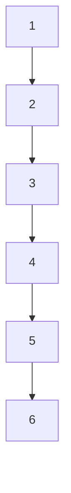

Akibatnya:

- `Search` dari `O(log n)` turun menjadi `O(n)`.
- `Insert` dari `O(log n)` turun menjadi `O(n)`.
- `Delete` dari `O(log n)` turun menjadi `O(n)`.
- Traversal tetap `O(n)`, tetapi latency operasi individual memburuk drastis.

Balanced tree adalah jawaban terhadap masalah ini.

Part ini fokus pada tiga keluarga balanced tree yang paling penting sebagai mental model:

1. **AVL tree** — sangat ketat menjaga tinggi pohon.
2. **Red-black tree** — lebih longgar, tetapi update lebih murah dalam banyak kasus.
3. **Treap** — menggabungkan BST dengan heap priority random.

Kita juga akan membahas ordered index sebagai abstraksi praktis:

- ordered map,
- ordered set,
- range query,
- predecessor,
- successor,
- floor/ceiling,
- rank/select introduction,
- trade-off terhadap `map`, sorted slice, heap, dan B-tree.

---

## 1. Kenapa Balanced Tree Penting?

Go memiliki built-in `map[K]V`, tetapi `map` tidak menjaga urutan key.

`map` sangat cocok untuk:

- exact lookup,
- membership test,
- dedup,
- grouping,
- frequency counter,
- reverse index berbasis equality.

Namun `map` tidak cocok jika operasi utama membutuhkan ordering:

- ambil semua key antara `A..B`,
- cari key terkecil >= `x`,
- cari key terbesar <= `x`,
- iterasi key secara sorted,
- ambil next item setelah key tertentu,
- maintain deadline scheduler,
- maintain sorted index in-memory,
- cari rule/policy berdasarkan interval atau prefix numerik,
- merge stream terurut,
- query timeline.

Untuk operasi seperti itu, kita membutuhkan struktur yang mempertahankan invariant ordering.

Pilihan umumnya:

| Struktur | Exact lookup | Ordered iteration | Range query | Insert/delete | Locality | Catatan |
|---|---:|---:|---:|---:|---:|---|
| `map[K]V` | Sangat baik | Tidak | Tidak | Sangat baik rata-rata | Campuran | Default untuk equality lookup |
| Sorted slice | Baik via binary search | Sangat baik | Sangat baik | Mahal di tengah | Sangat baik | Bagus untuk read-heavy/small data |
| Heap | Top min/max baik | Tidak penuh | Tidak | Baik | Baik | Untuk priority, bukan full ordering |
| Balanced BST | Baik | Baik | Baik | Baik | Kurang dari slice | Bagus untuk dynamic ordered index |
| B-tree | Baik | Sangat baik | Sangat baik | Baik | Sangat baik per page | Bagus untuk data besar/page-oriented |

Balanced tree mengisi ruang antara hash map dan sorted slice:

- lebih ordered daripada map,
- lebih dinamis daripada sorted slice,
- lebih general daripada heap,
- lebih sederhana daripada B-tree untuk banyak in-memory use case.

---

## 2. Mental Model Ordered Index

Sebelum masuk AVL/red-black/treap, pahami dulu abstraksi yang ingin dicapai.

Ordered index adalah struktur data yang menyimpan key dalam urutan tertentu dan mendukung operasi berdasarkan posisi relatif key.

Minimal API konseptual:

```go
type OrderedMap[K any, V any] interface {
    Put(key K, value V) (replaced bool)
    Get(key K) (V, bool)
    Delete(key K) (deleted bool)

    Min() (K, V, bool)
    Max() (K, V, bool)

    Floor(key K) (K, V, bool)   // largest key <= key
    Ceiling(key K) (K, V, bool) // smallest key >= key
    Lower(key K) (K, V, bool)   // largest key < key
    Higher(key K) (K, V, bool)  // smallest key > key

    Range(from K, to K, fn func(K, V) bool)
    Len() int
}
```

Untuk set, value bisa dihilangkan:

```go
type OrderedSet[K any] interface {
    Add(key K) bool
    Contains(key K) bool
    Remove(key K) bool
    Min() (K, bool)
    Max() (K, bool)
    Range(from K, to K, fn func(K) bool)
}
```

Yang membuat ordered index berbeda dari `map` bukan hanya “datanya sorted”. Yang lebih penting adalah invariant:

> Untuk setiap node, semua key di kiri lebih kecil dari key node, dan semua key di kanan lebih besar dari key node, serta tinggi pohon dijaga agar tetap logarithmic.

---

## 3. Recap Singkat BST Invariant

BST invariant:

```text
left subtree keys  < node.key < right subtree keys
```

Untuk comparator umum:

```text
cmp(leftKey, nodeKey) < 0
cmp(rightKey, nodeKey) > 0
```

Diagram:

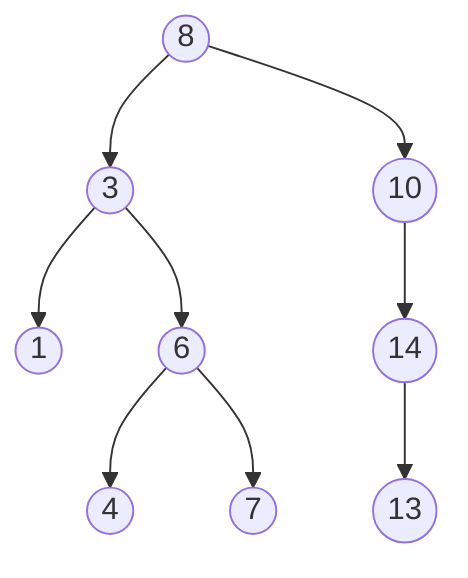

Inorder traversal menghasilkan urutan sorted:

```text
1, 3, 4, 6, 7, 8, 10, 13, 14
```

Tinggi pohon menentukan biaya operasi.

Jika tinggi `h`, maka:

- search: `O(h)`
- insert: `O(h)`
- delete: `O(h)`
- min/max: `O(h)`
- predecessor/successor: `O(h)`

Balanced tree menjaga `h = O(log n)`.

---

## 4. Apa Itu “Balanced”?

Balanced bukan berarti kiri dan kanan selalu punya jumlah node sama persis.

Balanced berarti tinggi pohon dikendalikan sehingga tidak tumbuh linear terhadap jumlah node.

Ada banyak definisi balancing:

| Tree | Cara menjaga balance | Ketat? | Ide utama |
|---|---|---:|---|
| AVL | Height difference tiap node maksimal 1 | Sangat ketat | Simpan height/balance factor |
| Red-black | Warna node + black-height invariant | Sedang | Batasi panjang path relatif |
| Treap | Random priority sebagai heap invariant | Probabilistic | BST by key, heap by priority |
| B-tree | Node multi-key, split/merge page | Page-oriented | Tinggi kecil karena fanout besar |

Pada part ini kita fokus pada AVL, red-black, dan treap.

B-tree akan dibahas di Part 014 karena modelnya berbeda: page/block/fanout, bukan binary pointer tree biasa.

---

## 5. Comparator sebagai Fondasi Ordered Structure

Di Java, ordered structure sering memakai:

- `Comparable<T>`
- `Comparator<T>`
- `TreeMap<K,V>`
- `TreeSet<E>`

Di Go, standard library tidak menyediakan generic ordered tree seperti Java `TreeMap`. Kita biasanya memilih salah satu:

1. Pakai built-in ordered types dengan `cmp.Compare`.
2. Terima comparator function.
3. Gunakan third-party package.
4. Implement sendiri untuk kebutuhan khusus.

Untuk reusable structure, comparator-based API paling fleksibel:

```go
type CompareFunc[K any] func(a, b K) int
```

Kontrak comparator:

```text
cmp(a, b) < 0  => a < b
cmp(a, b) == 0 => a equivalent dengan b
cmp(a, b) > 0  => a > b
```

Comparator harus konsisten. Ini bukan detail kecil. Seluruh ordered structure bergantung pada comparator.

Comparator yang buruk bisa menyebabkan:

- lookup gagal meskipun key ada,
- duplicate key muncul secara logical,
- range query salah,
- delete menghapus node yang salah,
- tree invariant rusak,
- infinite traversal pada implementasi buggy,
- hasil nondeterministic.

Contoh comparator buruk:

```go
func BadCmp(a, b User) int {
    // BUG: hanya membandingkan umur, padahal ID berbeda dianggap equivalent.
    return cmp.Compare(a.Age, b.Age)
}
```

Jika `User{ID:1, Age:30}` dan `User{ID:2, Age:30}` dimasukkan ke ordered map, comparator menganggap keduanya key yang sama.

Comparator yang lebih aman:

```go
func CompareUser(a, b User) int {
    if c := cmp.Compare(a.Age, b.Age); c != 0 {
        return c
    }
    return cmp.Compare(a.ID, b.ID)
}
```

Untuk key komposit, comparator harus membentuk total order.

---

## 6. Strict Weak Ordering dan Total Order

Untuk struktur data ordered, kita butuh ordering yang stabil.

Secara praktis, comparator harus memenuhi:

1. **Antisymmetry-like behavior**
   - Jika `a < b`, maka tidak boleh `b < a`.

2. **Transitivity**
   - Jika `a < b` dan `b < c`, maka `a < c`.

3. **Equivalence consistency**
   - Jika `cmp(a,b)==0`, struktur akan memperlakukan `a` dan `b` sebagai key yang sama.

4. **Stability over time**
   - Hasil compare tidak boleh berubah selama key ada di tree.

Masalah umum di Go:

```go
type Task struct {
    ID       string
    Priority int
    DueAt    time.Time
}
```

Jika tree diurutkan berdasarkan `Priority`, lalu field `Priority` diubah setelah node masuk tree, invariant rusak.

```go
// Berbahaya jika pointer Task dipakai sebagai key dan field ordering-nya mutable.
task.Priority = 999
```

Rule production:

> Key yang masuk ordered tree harus immutable terhadap field yang dipakai comparator.

Jika perlu mengubah priority/key:

1. Delete key lama.
2. Insert key baru.

---

## 7. Node Model untuk Balanced BST di Go

Node dasar:

```go
type node[K any, V any] struct {
    key   K
    value V
    left  *node[K, V]
    right *node[K, V]
}
```

Untuk AVL, kita butuh height:

```go
type avlNode[K any, V any] struct {
    key    K
    value  V
    left   *avlNode[K, V]
    right  *avlNode[K, V]
    height int8 // cukup untuk banyak use case; int juga boleh lebih sederhana
}
```

Untuk red-black:

```go
type color bool

const (
    red   color = true
    black color = false
)

type rbNode[K any, V any] struct {
    key    K
    value  V
    left   *rbNode[K, V]
    right  *rbNode[K, V]
    parent *rbNode[K, V]
    color  color
}
```

Untuk treap:

```go
type treapNode[K any, V any] struct {
    key      K
    value    V
    priority uint64
    left     *treapNode[K, V]
    right    *treapNode[K, V]
}
```

Trade-off node fields:

| Field | Kegunaan | Biaya |
|---|---|---|
| `left/right` | Navigasi pohon | pointer chasing, GC scan |
| `parent` | Memudahkan successor/delete/iterator | tambahan pointer |
| `height` | AVL balancing | update saat rotation |
| `color` | Red-black invariant | sedikit metadata |
| `priority` | Treap heap invariant | random/source entropy |
| `size` | rank/select | update setiap mutasi |

Production note:

- Pointer-heavy tree kurang cache-friendly dibanding sorted slice.
- Tetapi update di tengah lebih murah daripada shifting slice besar.
- Untuk ukuran kecil, sorted slice sering menang karena locality.
- Untuk ukuran besar dan update dinamis, balanced tree mulai masuk akal.

---

## 8. Rotation: Operasi Fundamental Balanced Tree

Balanced tree menjaga bentuk menggunakan rotation.

Rotation adalah transformasi lokal yang mempertahankan BST ordering.

### 8.1 Right Rotation

Sebelum:

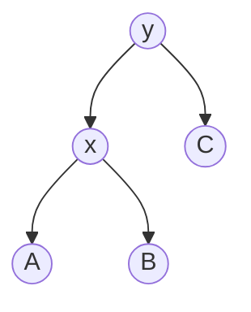

Setelah right rotate pada `y`:

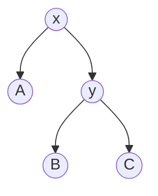

Ordering tetap benar karena:

```text
A < x < B < y < C
```

Go implementation konseptual:

```go
func rotateRight[K any, V any](y *avlNode[K, V]) *avlNode[K, V] {
    x := y.left
    beta := x.right

    x.right = y
    y.left = beta

    updateHeight(y)
    updateHeight(x)

    return x
}
```

### 8.2 Left Rotation

Sebelum:


Setelah left rotate pada `x`:


Go implementation konseptual:

```go
func rotateLeft[K any, V any](x *avlNode[K, V]) *avlNode[K, V] {
    y := x.right
    beta := y.left

    y.left = x
    x.right = beta

    updateHeight(x)
    updateHeight(y)

    return y
}
```

Rotation adalah operasi `O(1)`.

Yang mahal adalah menemukan path dari root ke titik insert/delete, yaitu `O(log n)` jika tree balanced.

---

## 9. AVL Tree

AVL tree adalah self-balancing BST yang menjaga selisih tinggi subtree kiri dan kanan setiap node maksimal 1.

Invariant AVL:

```text
balanceFactor(node) = height(left) - height(right)

valid jika balanceFactor ∈ {-1, 0, +1}
```

AVL sangat ketat menjaga tinggi. Akibatnya lookup sangat stabil, tetapi insert/delete bisa membutuhkan lebih banyak rebalancing dibanding red-black tree.

---

## 10. AVL Height dan Balance Factor

Helper:

```go
func height[K any, V any](n *avlNode[K, V]) int {
    if n == nil {
        return 0
    }
    return int(n.height)
}

func updateHeight[K any, V any](n *avlNode[K, V]) {
    if n == nil {
        return
    }
    lh := height(n.left)
    rh := height(n.right)
    if lh > rh {
        n.height = int8(lh + 1)
    } else {
        n.height = int8(rh + 1)
    }
}

func balanceFactor[K any, V any](n *avlNode[K, V]) int {
    if n == nil {
        return 0
    }
    return height(n.left) - height(n.right)
}
```

Catatan:

- Untuk materi, `int8` dipakai untuk menunjukkan metadata kecil.
- Untuk library umum, `int` sering lebih sederhana dan menghindari diskusi overflow.
- Tinggi AVL untuk jumlah node realistis tidak akan mendekati batas `int8`, tetapi kesederhanaan kadang lebih penting dari micro-optimization.

Versi sederhana:

```go
type avlNode[K any, V any] struct {
    key    K
    value  V
    left   *avlNode[K, V]
    right  *avlNode[K, V]
    height int
}
```

---

## 11. Empat Kasus Rebalancing AVL

Saat insert/delete, sebuah node bisa menjadi unbalanced.

Ada empat kasus:

1. Left-left
2. Right-right
3. Left-right
4. Right-left

### 11.1 Left-Left Case

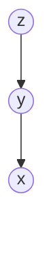

Solusi: right rotate `z`.

### 11.2 Right-Right Case


Secara visual arah sebenarnya ke kanan; Mermaid sederhana di atas hanya menunjukkan rantai. Solusi: left rotate `z`.

### 11.3 Left-Right Case


Solusi:

1. Left rotate `y`.
2. Right rotate `z`.

### 11.4 Right-Left Case

Solusi:

1. Right rotate child kanan.
2. Left rotate node unbalanced.

Lebih mudah dipahami lewat kode rebalancing.

```go
func rebalance[K any, V any](n *avlNode[K, V]) *avlNode[K, V] {
    updateHeight(n)
    bf := balanceFactor(n)

    // Left heavy.
    if bf > 1 {
        if balanceFactor(n.left) < 0 {
            n.left = rotateLeft(n.left)
        }
        return rotateRight(n)
    }

    // Right heavy.
    if bf < -1 {
        if balanceFactor(n.right) > 0 {
            n.right = rotateRight(n.right)
        }
        return rotateLeft(n)
    }

    return n
}
```

Mental model:

- Jika node terlalu berat kiri, rotate kanan.
- Jika node terlalu berat kanan, rotate kiri.
- Jika child condong ke arah berlawanan, lakukan double rotation.

---

## 12. AVL Ordered Map: Implementasi Minimal

Berikut implementasi AVL ordered map generic yang cukup untuk memahami struktur.

```go
package ordered

import "cmp"

type CompareFunc[K any] func(a, b K) int

type AVLMap[K any, V any] struct {
    root *avlNode[K, V]
    cmp  CompareFunc[K]
    len  int
}

type avlNode[K any, V any] struct {
    key    K
    value  V
    left   *avlNode[K, V]
    right  *avlNode[K, V]
    height int
}

func NewAVLMap[K any, V any](cmp CompareFunc[K]) *AVLMap[K, V] {
    if cmp == nil {
        panic("ordered: nil comparator")
    }
    return &AVLMap[K, V]{cmp: cmp}
}

func NewOrderedAVLMap[K cmp.Ordered, V any]() *AVLMap[K, V] {
    return NewAVLMap[K, V](cmp.Compare[K])
}

func (m *AVLMap[K, V]) Len() int {
    if m == nil {
        return 0
    }
    return m.len
}
```

Catatan API:

- Constructor menerima comparator.
- Untuk built-in ordered key, `cmp.Compare` bisa dipakai.
- `Len` aman dipanggil pada nil receiver, tetapi ini pilihan desain. Tidak wajib.
- Untuk production library, dokumentasikan apakah nil receiver valid.

---

## 13. AVL Insert

```go
func (m *AVLMap[K, V]) Put(key K, value V) (replaced bool) {
    if m == nil {
        panic("ordered: nil AVLMap")
    }
    var inserted bool
    m.root, replaced, inserted = avlPut(m.root, key, value, m.cmp)
    if inserted {
        m.len++
    }
    return replaced
}

func avlPut[K any, V any](
    n *avlNode[K, V],
    key K,
    value V,
    cmpFn CompareFunc[K],
) (root *avlNode[K, V], replaced bool, inserted bool) {
    if n == nil {
        return &avlNode[K, V]{key: key, value: value, height: 1}, false, true
    }

    c := cmpFn(key, n.key)
    switch {
    case c < 0:
        n.left, replaced, inserted = avlPut(n.left, key, value, cmpFn)
    case c > 0:
        n.right, replaced, inserted = avlPut(n.right, key, value, cmpFn)
    default:
        n.value = value
        return n, true, false
    }

    return avlRebalance(n), replaced, inserted
}
```

Insert path:

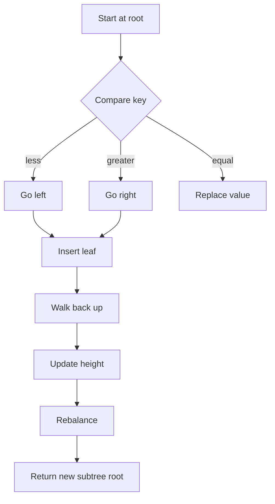

Key insight:

> Insert pada recursive BST harus mengembalikan root subtree baru karena rotation bisa mengganti root subtree.

Contoh:

```text
n.left = avlPut(...)
return avlRebalance(n)
```

Jika lupa mengembalikan root baru, parent akan tetap menunjuk node lama dan tree bisa rusak.

---

## 14. AVL Get

```go
func (m *AVLMap[K, V]) Get(key K) (V, bool) {
    var zero V
    if m == nil {
        return zero, false
    }

    n := m.root
    for n != nil {
        c := m.cmp(key, n.key)
        switch {
        case c < 0:
            n = n.left
        case c > 0:
            n = n.right
        default:
            return n.value, true
        }
    }

    return zero, false
}
```

Lookup tidak membutuhkan recursion. Iterative lookup lebih sederhana dan menghindari stack growth untuk tree yang seharusnya balanced.

Complexity:

```text
O(log n)
```

Jika comparator mahal, biaya riil adalah:

```text
O(log n * cost(compare))
```

Comparator string panjang, composite key, atau time parsing di comparator bisa merusak performa.

Rule:

> Comparator tidak boleh melakukan parsing mahal, allocation, I/O, lock, atau dependency eksternal.

---

## 15. AVL Min, Max, Floor, Ceiling

### 15.1 Min dan Max

```go
func (m *AVLMap[K, V]) Min() (K, V, bool) {
    var zk K
    var zv V
    if m == nil || m.root == nil {
        return zk, zv, false
    }
    n := m.root
    for n.left != nil {
        n = n.left
    }
    return n.key, n.value, true
}

func (m *AVLMap[K, V]) Max() (K, V, bool) {
    var zk K
    var zv V
    if m == nil || m.root == nil {
        return zk, zv, false
    }
    n := m.root
    for n.right != nil {
        n = n.right
    }
    return n.key, n.value, true
}
```

### 15.2 Floor

Floor adalah key terbesar yang `<= target`.

```go
func (m *AVLMap[K, V]) Floor(key K) (K, V, bool) {
    var zk K
    var zv V
    if m == nil {
        return zk, zv, false
    }

    n := m.root
    var candidate *avlNode[K, V]

    for n != nil {
        c := m.cmp(key, n.key)
        switch {
        case c < 0:
            n = n.left
        case c > 0:
            candidate = n
            n = n.right
        default:
            return n.key, n.value, true
        }
    }

    if candidate == nil {
        return zk, zv, false
    }
    return candidate.key, candidate.value, true
}
```

### 15.3 Ceiling

Ceiling adalah key terkecil yang `>= target`.

```go
func (m *AVLMap[K, V]) Ceiling(key K) (K, V, bool) {
    var zk K
    var zv V
    if m == nil {
        return zk, zv, false
    }

    n := m.root
    var candidate *avlNode[K, V]

    for n != nil {
        c := m.cmp(key, n.key)
        switch {
        case c < 0:
            candidate = n
            n = n.left
        case c > 0:
            n = n.right
        default:
            return n.key, n.value, true
        }
    }

    if candidate == nil {
        return zk, zv, false
    }
    return candidate.key, candidate.value, true
}
```

Mental model candidate:

- Untuk floor, saat node lebih kecil dari target, node itu kandidat; coba cari yang lebih besar di kanan.
- Untuk ceiling, saat node lebih besar dari target, node itu kandidat; coba cari yang lebih kecil di kiri.

---

## 16. AVL Range Query

Range query adalah alasan utama memakai ordered tree.

```go
func (m *AVLMap[K, V]) Range(from K, to K, fn func(K, V) bool) {
    if m == nil || fn == nil {
        return
    }
    avlRange(m.root, from, to, m.cmp, fn)
}

func avlRange[K any, V any](
    n *avlNode[K, V],
    from K,
    to K,
    cmpFn CompareFunc[K],
    fn func(K, V) bool,
) bool {
    if n == nil {
        return true
    }

    // Jika n.key > from, subtree kiri mungkin punya key dalam range.
    if cmpFn(n.key, from) > 0 {
        if !avlRange(n.left, from, to, cmpFn, fn) {
            return false
        }
    }

    // Visit jika from <= n.key <= to.
    if cmpFn(n.key, from) >= 0 && cmpFn(n.key, to) <= 0 {
        if !fn(n.key, n.value) {
            return false
        }
    }

    // Jika n.key < to, subtree kanan mungkin punya key dalam range.
    if cmpFn(n.key, to) < 0 {
        if !avlRange(n.right, from, to, cmpFn, fn) {
            return false
        }
    }

    return true
}
```

Complexity:

```text
O(log n + k)
```

Dengan:

- `n` = jumlah total node,
- `k` = jumlah item yang dikembalikan.

Kenapa bukan `O(n)`?

Karena tree bisa memotong subtree yang jelas berada di luar range.

Diagram pruning:

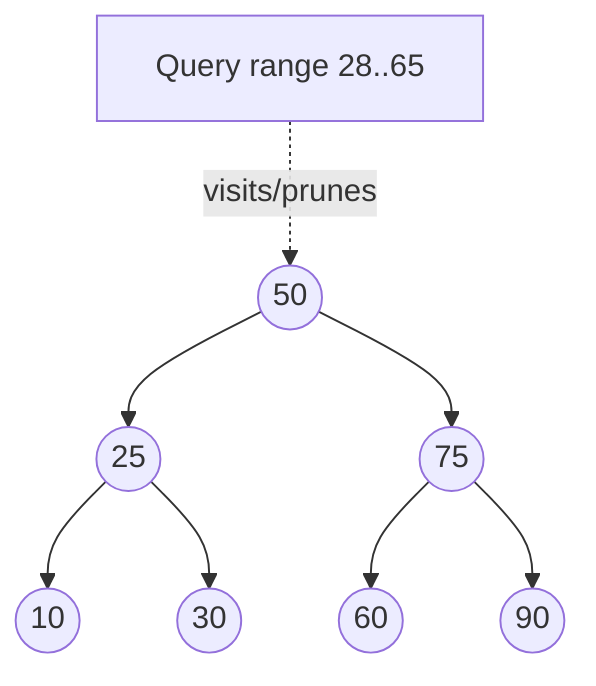

Untuk range `28..65`:

- Subtree `10` bisa dipotong.
- Node `30`, `50`, `60` dikunjungi.
- Subtree `90` bisa dipotong.

---

## 17. AVL Delete: Bagian yang Sering Salah

Delete pada BST lebih sulit daripada insert karena ada tiga kasus:

1. Node tidak punya child.
2. Node punya satu child.
3. Node punya dua child.

Untuk dua child, biasanya diganti dengan inorder successor:

- successor = node terkecil di subtree kanan.

Atau inorder predecessor:

- predecessor = node terbesar di subtree kiri.

Implementasi konseptual:

```go
func (m *AVLMap[K, V]) Delete(key K) bool {
    if m == nil {
        return false
    }
    var deleted bool
    m.root, deleted = avlDelete(m.root, key, m.cmp)
    if deleted {
        m.len--
    }
    return deleted
}

func avlDelete[K any, V any](
    n *avlNode[K, V],
    key K,
    cmpFn CompareFunc[K],
) (*avlNode[K, V], bool) {
    if n == nil {
        return nil, false
    }

    var deleted bool
    c := cmpFn(key, n.key)

    switch {
    case c < 0:
        n.left, deleted = avlDelete(n.left, key, cmpFn)
    case c > 0:
        n.right, deleted = avlDelete(n.right, key, cmpFn)
    default:
        deleted = true

        if n.left == nil {
            return n.right, true
        }
        if n.right == nil {
            return n.left, true
        }

        // Dua child: copy successor ke node ini, lalu delete successor.
        succ := minNode(n.right)
        n.key = succ.key
        n.value = succ.value
        n.right, _ = avlDelete(n.right, succ.key, cmpFn)
    }

    if !deleted {
        return n, false
    }
    return avlRebalance(n), true
}

func minNode[K any, V any](n *avlNode[K, V]) *avlNode[K, V] {
    for n != nil && n.left != nil {
        n = n.left
    }
    return n
}
```

Pitfall:

- Lupa rebalance setelah delete.
- Salah update height setelah delete.
- Mengurangi length dua kali saat delete successor.
- Comparator tidak bisa membedakan duplicate logical key.
- Key/value besar dicopy saat mengganti successor.
- Memakai pointer key mutable.

Production note:

Jika key/value besar, copy successor bisa mahal. Alternatifnya memindahkan node pointer, tetapi implementasinya lebih kompleks.

---

## 18. AVL Rebalance Helper Lengkap

```go
func avlHeight[K any, V any](n *avlNode[K, V]) int {
    if n == nil {
        return 0
    }
    return n.height
}

func avlUpdateHeight[K any, V any](n *avlNode[K, V]) {
    if n == nil {
        return
    }
    lh := avlHeight(n.left)
    rh := avlHeight(n.right)
    if lh > rh {
        n.height = lh + 1
    } else {
        n.height = rh + 1
    }
}

func avlBalanceFactor[K any, V any](n *avlNode[K, V]) int {
    if n == nil {
        return 0
    }
    return avlHeight(n.left) - avlHeight(n.right)
}

func avlRotateRight[K any, V any](y *avlNode[K, V]) *avlNode[K, V] {
    x := y.left
    beta := x.right

    x.right = y
    y.left = beta

    avlUpdateHeight(y)
    avlUpdateHeight(x)

    return x
}

func avlRotateLeft[K any, V any](x *avlNode[K, V]) *avlNode[K, V] {
    y := x.right
    beta := y.left

    y.left = x
    x.right = beta

    avlUpdateHeight(x)
    avlUpdateHeight(y)

    return y
}

func avlRebalance[K any, V any](n *avlNode[K, V]) *avlNode[K, V] {
    if n == nil {
        return nil
    }

    avlUpdateHeight(n)
    bf := avlBalanceFactor(n)

    if bf > 1 {
        if avlBalanceFactor(n.left) < 0 {
            n.left = avlRotateLeft(n.left)
        }
        return avlRotateRight(n)
    }

    if bf < -1 {
        if avlBalanceFactor(n.right) > 0 {
            n.right = avlRotateRight(n.right)
        }
        return avlRotateLeft(n)
    }

    return n
}
```

Invariant setelah operasi:

```text
1. BST ordering valid.
2. Height setiap node valid.
3. Balance factor setiap node ∈ {-1, 0, +1}.
4. Len sesuai jumlah node reachable dari root.
```

---

## 19. Testing AVL Invariant

Balanced tree tidak cukup dites dengan contoh kecil. Harus ada invariant test.

```go
func validateAVL[K any, V any](
    n *avlNode[K, V],
    cmpFn CompareFunc[K],
    min *K,
    max *K,
) (height int, count int, ok bool) {
    if n == nil {
        return 0, 0, true
    }

    if min != nil && cmpFn(n.key, *min) <= 0 {
        return 0, 0, false
    }
    if max != nil && cmpFn(n.key, *max) >= 0 {
        return 0, 0, false
    }

    lh, lc, lok := validateAVL(n.left, cmpFn, min, &n.key)
    if !lok {
        return 0, 0, false
    }

    rh, rc, rok := validateAVL(n.right, cmpFn, &n.key, max)
    if !rok {
        return 0, 0, false
    }

    expectedHeight := lh
    if rh > expectedHeight {
        expectedHeight = rh
    }
    expectedHeight++

    if n.height != expectedHeight {
        return 0, 0, false
    }

    bf := lh - rh
    if bf < -1 || bf > 1 {
        return 0, 0, false
    }

    return expectedHeight, lc + rc + 1, true
}
```

Random operation test:

```go
func TestAVLMapRandomOps(t *testing.T) {
    tree := NewOrderedAVLMap[int, int]()
    ref := map[int]int{}

    r := rand.New(rand.NewSource(1))

    for i := 0; i < 100_000; i++ {
        k := r.Intn(10_000)
        switch r.Intn(3) {
        case 0, 1:
            v := r.Int()
            tree.Put(k, v)
            ref[k] = v
        case 2:
            got := tree.Delete(k)
            _, existed := ref[k]
            if got != existed {
                t.Fatalf("delete mismatch key=%d got=%v existed=%v", k, got, existed)
            }
            delete(ref, k)
        }

        if tree.Len() != len(ref) {
            t.Fatalf("len mismatch tree=%d ref=%d", tree.Len(), len(ref))
        }

        _, count, ok := validateAVL(tree.root, tree.cmp, nil, nil)
        if !ok {
            t.Fatalf("invalid AVL after op %d", i)
        }
        if count != tree.Len() {
            t.Fatalf("count mismatch count=%d len=%d", count, tree.Len())
        }
    }
}
```

Differential test against `map` validates exact lookup/delete. Untuk ordering, bandingkan dengan sorted slice.

```go
func collectKeysFromMap(m map[int]int) []int {
    keys := make([]int, 0, len(m))
    for k := range m {
        keys = append(keys, k)
    }
    slices.Sort(keys)
    return keys
}
```

---

## 20. Red-Black Tree

Red-black tree adalah self-balancing BST dengan warna merah/hitam di setiap node.

Invariant umum:

1. Setiap node merah atau hitam.
2. Root hitam.
3. Semua nil leaf dianggap hitam.
4. Node merah tidak boleh punya child merah.
5. Semua path dari node ke descendant nil leaf memiliki jumlah black node yang sama.

Konsekuensi:

- Path terpanjang tidak lebih dari kira-kira 2 kali path terpendek.
- Tinggi tetap `O(log n)`.
- Balancing lebih longgar daripada AVL.

Red-black tree sering dipilih untuk ordered map/set umum karena update relatif efisien dan tinggi cukup baik.

Java `TreeMap` menggunakan red-black tree. Banyak engineer Java akrab dengan perilakunya, tetapi di Go kita tidak punya built-in `TreeMap` di standard library.

---

## 21. Red-Black Tree Mental Model

AVL menjaga height secara eksplisit.

Red-black menjaga “black-height”.

Bayangkan node merah sebagai node yang bisa “menempel” pada node hitam, sehingga pohon 2-3-4 direpresentasikan sebagai binary tree.

Mental model sederhana:

- Black node memberi struktur utama.
- Red node memberi fleksibilitas lokal.
- Tidak boleh ada dua red berturut-turut.
- Jumlah black node di semua path harus sama.

Contoh valid:

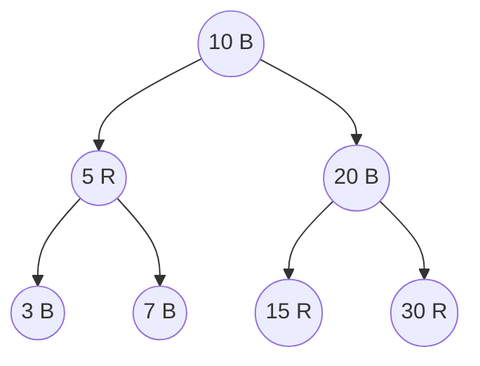

Red-black tidak berusaha membuat tinggi kiri-kanan tiap node beda maksimal 1. Ia hanya memastikan tinggi tidak memburuk linear.

---

## 22. Red-Black Insert: Intuisi

Insert node baru biasanya sebagai red.

Kenapa red?

Jika insert sebagai black, black-height path langsung berubah dan lebih sulit diperbaiki. Jika insert sebagai red, black-height belum berubah, tetapi mungkin melanggar aturan red-red jika parent juga red.

Kasus umum setelah insert red:

1. Parent black → selesai.
2. Parent red dan uncle red → recolor.
3. Parent red dan uncle black → rotation + recolor.

Diagram recolor:

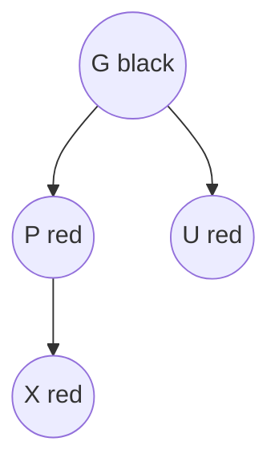

Jika parent dan uncle merah:

- parent menjadi hitam,
- uncle menjadi hitam,
- grandparent menjadi merah,
- lanjut perbaiki dari grandparent.

Rotation case mirip AVL, tetapi aturan trigger-nya berdasarkan warna, bukan height.

---

## 23. Left-Leaning Red-Black Tree sebagai Alternatif Implementasi

Implementasi red-black klasik dengan parent pointer dan banyak case cukup panjang.

Untuk Go, salah satu pendekatan edukatif yang lebih sederhana adalah **left-leaning red-black tree** atau LLRB.

LLRB menjaga red link condong ke kiri.

Helper konseptual:

```go
type rbColor bool

const (
    rbRed   rbColor = true
    rbBlack rbColor = false
)

type llrbNode[K any, V any] struct {
    key   K
    value V
    left  *llrbNode[K, V]
    right *llrbNode[K, V]
    color rbColor
}

func isRed[K any, V any](n *llrbNode[K, V]) bool {
    return n != nil && n.color == rbRed
}
```

Rotation:

```go
func rotateLeftRB[K any, V any](h *llrbNode[K, V]) *llrbNode[K, V] {
    x := h.right
    h.right = x.left
    x.left = h
    x.color = h.color
    h.color = rbRed
    return x
}

func rotateRightRB[K any, V any](h *llrbNode[K, V]) *llrbNode[K, V] {
    x := h.left
    h.left = x.right
    x.right = h
    x.color = h.color
    h.color = rbRed
    return x
}

func flipColors[K any, V any](h *llrbNode[K, V]) {
    h.color = !h.color
    h.left.color = !h.left.color
    h.right.color = !h.right.color
}
```

Insert fix-up:

```go
func fixUpRB[K any, V any](h *llrbNode[K, V]) *llrbNode[K, V] {
    if isRed(h.right) && !isRed(h.left) {
        h = rotateLeftRB(h)
    }
    if isRed(h.left) && isRed(h.left.left) {
        h = rotateRightRB(h)
    }
    if isRed(h.left) && isRed(h.right) {
        flipColors(h)
    }
    return h
}
```

Insert:

```go
func putRB[K any, V any](
    h *llrbNode[K, V],
    key K,
    value V,
    cmpFn CompareFunc[K],
) (*llrbNode[K, V], bool, bool) {
    if h == nil {
        return &llrbNode[K, V]{key: key, value: value, color: rbRed}, false, true
    }

    var replaced, inserted bool
    c := cmpFn(key, h.key)
    switch {
    case c < 0:
        h.left, replaced, inserted = putRB(h.left, key, value, cmpFn)
    case c > 0:
        h.right, replaced, inserted = putRB(h.right, key, value, cmpFn)
    default:
        h.value = value
        return h, true, false
    }

    return fixUpRB(h), replaced, inserted
}
```

Setelah insert root harus dibuat black:

```go
func (m *RBMap[K, V]) Put(key K, value V) bool {
    var replaced, inserted bool
    m.root, replaced, inserted = putRB(m.root, key, value, m.cmp)
    m.root.color = rbBlack
    if inserted {
        m.len++
    }
    return replaced
}
```

Catatan:

- LLRB delete lebih rumit daripada insert.
- Untuk production, jangan implement red-black delete sembarangan tanpa invariant tests yang kuat.
- Jika butuh ordered map cepat, pertimbangkan library mature atau struktur lebih sederhana seperti sorted slice jika workload cocok.

---

## 24. AVL vs Red-Black

| Aspek | AVL | Red-black |
|---|---|---|
| Balance | Lebih ketat | Lebih longgar |
| Lookup | Sedikit lebih cepat/stabil karena tinggi lebih rendah | Sangat baik |
| Insert/delete | Bisa lebih banyak rotation/update height | Umumnya update lebih murah |
| Metadata | Height/balance | Color |
| Implementasi | Relatif mudah untuk insert/delete dibanding RB klasik | Delete klasik kompleks |
| Cocok untuk | Read-heavy ordered index | General-purpose ordered map/set |

Namun jangan overclaim:

- Constant factor bergantung implementasi.
- Comparator cost bisa mendominasi.
- Allocation pattern bisa mendominasi.
- Cache locality bisa membuat sorted slice lebih cepat untuk data kecil/menengah.
- B-tree bisa mengalahkan binary tree untuk data besar karena fanout dan locality.

Rule praktis:

- Banyak lookup, update moderat, butuh ordered query → AVL oke.
- Banyak insert/delete dan butuh ordered map umum → red-black atau B-tree sering lebih cocok.
- Data kecil/read-mostly → sorted slice sering lebih sederhana dan lebih cepat.

---

## 25. Treap

Treap adalah kombinasi:

- BST berdasarkan key.
- Heap berdasarkan random priority.

Nama treap = tree + heap.

Invariant:

```text
BST invariant by key:
left.key < node.key < right.key

Heap invariant by priority:
node.priority <= child.priority    // untuk min-priority treap
```

Atau sebaliknya untuk max-priority.

Jika priority random dan independen dari key, bentuk tree expected balanced.

Treap menarik karena implementasinya sederhana dibanding AVL/RB.

---

## 26. Treap Node dan Insert

```go
type TreapMap[K any, V any] struct {
    root *treapNode[K, V]
    cmp  CompareFunc[K]
    rng  func() uint64
    len  int
}

type treapNode[K any, V any] struct {
    key      K
    value    V
    priority uint64
    left     *treapNode[K, V]
    right    *treapNode[K, V]
}
```

Rotation sama seperti BST biasa, tetapi tidak perlu height/color.

```go
func rotateRightTreap[K any, V any](y *treapNode[K, V]) *treapNode[K, V] {
    x := y.left
    y.left = x.right
    x.right = y
    return x
}

func rotateLeftTreap[K any, V any](x *treapNode[K, V]) *treapNode[K, V] {
    y := x.right
    x.right = y.left
    y.left = x
    return y
}
```

Insert:

```go
func treapPut[K any, V any](
    n *treapNode[K, V],
    key K,
    value V,
    priority uint64,
    cmpFn CompareFunc[K],
) (*treapNode[K, V], bool, bool) {
    if n == nil {
        return &treapNode[K, V]{
            key: key, value: value, priority: priority,
        }, false, true
    }

    c := cmpFn(key, n.key)
    switch {
    case c < 0:
        var replaced, inserted bool
        n.left, replaced, inserted = treapPut(n.left, key, value, priority, cmpFn)
        if n.left.priority < n.priority {
            n = rotateRightTreap(n)
        }
        return n, replaced, inserted

    case c > 0:
        var replaced, inserted bool
        n.right, replaced, inserted = treapPut(n.right, key, value, priority, cmpFn)
        if n.right.priority < n.priority {
            n = rotateLeftTreap(n)
        }
        return n, replaced, inserted

    default:
        n.value = value
        return n, true, false
    }
}
```

Treap menggunakan randomness untuk balancing.

Jika priority buruk atau deterministic correlated dengan key, treap bisa rusak.

Production rule:

> Priority harus berasal dari sumber yang cukup uniform dan tidak berkorelasi dengan key ordering.

Tidak harus cryptographic random untuk struktur data biasa. Tetapi harus cukup baik.

---

## 27. Treap Delete

Delete treap bisa dilakukan dengan memutar node turun sampai menjadi leaf, lalu hapus.

```go
func treapDelete[K any, V any](
    n *treapNode[K, V],
    key K,
    cmpFn CompareFunc[K],
) (*treapNode[K, V], bool) {
    if n == nil {
        return nil, false
    }

    c := cmpFn(key, n.key)
    switch {
    case c < 0:
        var deleted bool
        n.left, deleted = treapDelete(n.left, key, cmpFn)
        return n, deleted
    case c > 0:
        var deleted bool
        n.right, deleted = treapDelete(n.right, key, cmpFn)
        return n, deleted
    default:
        return treapMerge(n.left, n.right), true
    }
}

func treapMerge[K any, V any](
    left *treapNode[K, V],
    right *treapNode[K, V],
) *treapNode[K, V] {
    if left == nil {
        return right
    }
    if right == nil {
        return left
    }

    if left.priority < right.priority {
        left.right = treapMerge(left.right, right)
        return left
    }

    right.left = treapMerge(left, right.left)
    return right
}
```

Treap supports elegant split/merge operations.

Split by key:

```text
split(root, key) => (all keys < key, all keys >= key)
```

Merge:

```text
merge(left, right) where max(left) < min(right)
```

Ini membuat treap menarik untuk struktur seperti:

- ordered sequence,
- interval set,
- persistent randomized tree,
- rank-based split/merge jika ditambah `size`.

---

## 28. Treap vs AVL vs Red-Black

| Aspek | AVL | Red-black | Treap |
|---|---|---|---|
| Balance guarantee | Deterministic strict | Deterministic relaxed | Expected/probabilistic |
| Metadata | height | color | priority |
| Insert | Moderate | Moderate | Simple |
| Delete | Moderate | Complex | Relatively simple |
| Worst-case | `O(log n)` | `O(log n)` | `O(n)` jika priority buruk |
| Expected | `O(log n)` | `O(log n)` | `O(log n)` |
| Split/merge | Tidak natural | Tidak natural | Natural |
| Risk | height bug | color/delete bug | RNG/priority risk |

Treap bagus sebagai engineering tool jika:

- Anda butuh implementasi balanced ordered tree yang lebih sederhana.
- Expected guarantee cukup.
- Anda bisa mengontrol randomness.
- Anda butuh split/merge.

Treap kurang cocok jika:

- Anda butuh worst-case deterministic guarantee.
- Input adversarial dan priority bisa diprediksi/diserang.
- Tim tidak familiar dengan probabilistic invariant.

---

## 29. Ordered Set

Ordered set adalah ordered map tanpa value.

Implementasi bisa:

```go
type Set[K any] struct {
    tree *AVLMap[K, struct{}]
}
```

Atau implement node tanpa value untuk menghemat memory.

Wrapper sederhana:

```go
type OrderedSet[K any] struct {
    m *AVLMap[K, struct{}]
}

func NewOrderedSet[K any](cmpFn CompareFunc[K]) *OrderedSet[K] {
    return &OrderedSet[K]{m: NewAVLMap[K, struct{}](cmpFn)}
}

func (s *OrderedSet[K]) Add(key K) bool {
    replaced := s.m.Put(key, struct{}{})
    return !replaced
}

func (s *OrderedSet[K]) Contains(key K) bool {
    _, ok := s.m.Get(key)
    return ok
}

func (s *OrderedSet[K]) Remove(key K) bool {
    return s.m.Delete(key)
}
```

Production trade-off:

- Wrapper cepat dibuat.
- Node masih membawa `value struct{}` yang secara layout mungkin tidak gratis jika ada padding.
- Untuk high-scale structure, buat node khusus set.

---

## 30. Rank dan Select Introduction

Balanced tree bisa diperluas menjadi order-statistics tree dengan menyimpan ukuran subtree.

Tambahkan field:

```go
type rankedNode[K any, V any] struct {
    key   K
    value V
    left  *rankedNode[K, V]
    right *rankedNode[K, V]

    height int
    size   int // jumlah node di subtree ini
}
```

Invariant:

```text
size(node) = size(left) + size(right) + 1
```

Operasi baru:

- `Rank(key)` = jumlah key `< key`.
- `Select(i)` = key ke-i dalam urutan sorted.

Contoh:

```text
keys = [10, 20, 30, 40, 50]
Rank(30) = 2
Select(0) = 10
Select(3) = 40
```

Rank:

```go
func size[K any, V any](n *rankedNode[K, V]) int {
    if n == nil {
        return 0
    }
    return n.size
}

func rank[K any, V any](n *rankedNode[K, V], key K, cmpFn CompareFunc[K]) int {
    if n == nil {
        return 0
    }

    c := cmpFn(key, n.key)
    switch {
    case c <= 0:
        return rank(n.left, key, cmpFn)
    default:
        return size(n.left) + 1 + rank(n.right, key, cmpFn)
    }
}
```

Select:

```go
func selectByRank[K any, V any](n *rankedNode[K, V], i int) (*rankedNode[K, V], bool) {
    if n == nil || i < 0 || i >= size(n) {
        return nil, false
    }

    leftSize := size(n.left)
    switch {
    case i < leftSize:
        return selectByRank(n.left, i)
    case i > leftSize:
        return selectByRank(n.right, i-leftSize-1)
    default:
        return n, true
    }
}
```

Setiap rotation harus update `size` selain `height`.

Pitfall:

- Lupa update size setelah rotation.
- Size overflow untuk data sangat besar jika memakai `int32`.
- Delete successor membuat size update lebih rawan.

Use case:

- percentile in-memory,
- median tracker,
- leaderboard,
- paginated ordered result,
- select nth pending job,
- rank user score.

Namun untuk percentile besar dan streaming, struktur lain seperti heap pair, quantile sketch, atau external storage mungkin lebih cocok.

---

## 31. Range Aggregation dengan Augmented Tree

Selain `size`, node bisa menyimpan agregat subtree:

```go
type aggNode[K any] struct {
    key   K
    left  *aggNode[K]
    right *aggNode[K]

    height int
    size   int
    sum    int64
    min    int64
    max    int64
}
```

Invariant agregat:

```text
sum(node) = value(node) + sum(left) + sum(right)
min(node) = min(value(node), min(left), min(right))
max(node) = max(value(node), max(left), max(right))
```

Ini memungkinkan query seperti:

- sum untuk key range,
- count untuk key range,
- min/max dalam interval,
- quota per time bucket,
- billing per ordered dimension.

Namun complexity implementasi meningkat.

Rule:

> Augment tree hanya jika query agregat sangat sering dan data update masih harus online.

Jika query mostly analytical, mungkin lebih baik pakai database/index khusus.

---

## 32. Interval Tree sebagai Augmented Balanced Tree

Interval tree menyimpan interval `[start, end]` dan bisa mencari overlap.

Node menyimpan:

```go
type intervalNode[V any] struct {
    start int64
    end   int64
    value V

    maxEnd int64
    left   *intervalNode[V]
    right  *intervalNode[V]
    height int
}
```

Invariant:

```text
maxEnd(node) = max(node.end, maxEnd(left), maxEnd(right))
```

Overlap condition:

```text
[a,b] overlaps [c,d] iff a <= d && c <= b
```

Search overlap:

```go
func overlaps(aStart, aEnd, bStart, bEnd int64) bool {
    return aStart <= bEnd && bStart <= aEnd
}
```

Traversal can prune:

- Jika `left.maxEnd < query.start`, tidak perlu cari kiri.
- Kalau current overlap, return.
- Kalau tidak, cari kanan.

Use case:

- scheduling conflict,
- entitlement validity period,
- regulatory rule effective period,
- timeline annotations,
- reservation system,
- IP range metadata jika key numerik.

Interval tree akan dibahas lebih luas saat range structures, tetapi akar mental modelnya adalah balanced tree + augmented metadata.

---

## 33. Sorted Slice vs Balanced Tree

Ini trade-off yang sering salah.

Banyak engineer otomatis memilih tree karena ingin `O(log n)`. Tetapi untuk data kecil dan read-heavy, sorted slice sering lebih cepat.

Sorted slice:

- Search `O(log n)` via binary search.
- Range scan sangat cache-friendly.
- Insert/delete `O(n)` karena shifting.
- Memory compact.
- Tidak pointer-heavy.
- Mudah serialize.

Balanced tree:

- Search `O(log n)`.
- Range scan `O(log n + k)`, tetapi pointer chasing.
- Insert/delete `O(log n)`.
- Memory overhead per node.
- GC scan lebih besar.
- Implementasi lebih kompleks.

Decision table:

| Workload | Pilihan awal |
|---|---|
| Data kecil, read-mostly | sorted slice |
| Data sedang, banyak range scan, update jarang | sorted slice + batch rebuild |
| Data dinamis, insert/delete sering, butuh ordering | balanced tree |
| Butuh exact lookup saja | map |
| Butuh min/max priority saja | heap |
| Data besar page/disk/cache-aware | B-tree |

Rule praktis:

> Jangan pilih balanced tree hanya karena Big-O terlihat bagus. Benchmark dengan distribusi operasi yang realistis.

---

## 34. Map vs Balanced Tree

`map` menang untuk equality lookup.

Balanced tree menang untuk ordered query.

| Pertanyaan | `map` | Balanced tree |
|---|---:|---:|
| Apakah key X ada? | Sangat baik | Baik |
| Ambil value untuk key X | Sangat baik | Baik |
| Iterasi sorted | Tidak natural | Ya |
| Range A..B | Tidak natural | Ya |
| Floor/ceiling | Tidak | Ya |
| Min/max | Perlu scan | Ya |
| Memory overhead | Umumnya lebih rendah untuk exact lookup | Node pointer overhead |
| Concurrent writes | Butuh lock | Butuh lock |

Kadang hybrid cocok:

```text
map[id]*Node      => exact lookup
balanced tree     => ordered by deadline
```

Contoh retry scheduler:

- Map by job ID untuk cancel/update job cepat.
- Tree by nextRunAt untuk mengambil job yang due.

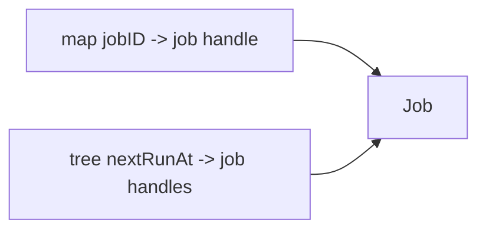

Hybrid invariant:

> Setiap job yang aktif harus ada tepat satu entry di map dan tepat satu entry di ordered index.

Operasi update deadline:

1. Lookup job by ID di map.
2. Remove old deadline entry dari tree.
3. Update job deadline.
4. Insert new deadline entry ke tree.

Jika salah satu langkah gagal, index bisa inconsistent.

---

## 35. Heap vs Balanced Tree

Heap cocok untuk mengambil min/max berulang.

Balanced tree cocok untuk operasi ordered yang lebih general.

| Operasi | Heap | Balanced tree |
|---|---:|---:|
| Push | `O(log n)` | `O(log n)` |
| Pop min | `O(log n)` | `O(log n)` |
| Peek min | `O(1)` | `O(log n)` atau cache min |
| Delete arbitrary key | Sulit tanpa index | `O(log n)` |
| Update priority | Butuh handle/index | `O(log n)` delete+insert |
| Range query | Tidak | Ya |
| Sorted iteration | Destructive/expensive | Ya |
| Floor/ceiling | Tidak | Ya |

Untuk scheduler sederhana:

- Heap cukup jika hanya butuh `next due` dan cancel jarang.
- Tree lebih baik jika butuh range due, cancel/update banyak, atau inspect window.

---

## 36. B-Tree vs Binary Balanced Tree

B-tree akan dibahas di part berikutnya, tetapi perlu decision preview.

Binary balanced tree punya fanout 2.

B-tree punya fanout besar, misalnya puluhan sampai ratusan key per node.

Akibatnya:

- Tinggi B-tree jauh lebih kecil.
- Node lebih cache/page-friendly.
- Range scan lebih baik.
- Implementasi lebih kompleks.

Untuk in-memory large ordered index, B-tree sering lebih practical dibanding AVL/RB karena locality.

Binary tree tetap berguna sebagai:

- mental model balancing,
- struktur sederhana,
- augmented tree khusus,
- interval tree,
- order-statistics tree,
- teaching implementation.

---

## 37. Memory dan Layout di Go

Balanced binary tree di Go biasanya pointer-heavy.

Setiap node punya beberapa pointer:

```go
type Node[K any, V any] struct {
    key   K
    value V
    left  *Node[K, V]
    right *Node[K, V]
    meta  int
}
```

Konsekuensi:

1. Banyak object allocation.
2. GC harus scan pointer fields.
3. Traversal menyebabkan pointer chasing.
4. Cache locality buruk dibanding slice.
5. Fragmentasi heap bisa meningkat.

Untuk high-performance implementation, opsi advanced:

- arena/pool allocation,
- node slab,
- index-based tree dengan slice storage,
- B-tree with array nodes,
- intrusive node ownership,
- object reuse with care.

Namun hati-hati dengan `sync.Pool`:

- Tidak menjamin reuse langsung.
- Object bisa hilang saat GC.
- Bisa menyembunyikan lifecycle bug.
- Untuk generic node dengan pointer, harus clear fields sebelum reuse.

Safe cleanup saat delete:

```go
func clearNode[K any, V any](n *avlNode[K, V]) {
    var zk K
    var zv V
    n.key = zk
    n.value = zv
    n.left = nil
    n.right = nil
    n.height = 0
}
```

Ini membantu melepas reference agar GC bisa reclaim object yang sebelumnya reachable lewat key/value/child.

---

## 38. Iterator Design

Ordered tree biasanya butuh iterator.

Pilihan API:

1. Callback:

```go
func (m *AVLMap[K, V]) Ascend(fn func(K, V) bool)
```

2. Iterator object:

```go
type Iterator[K any, V any] struct { ... }
func (it *Iterator[K,V]) Next() bool
func (it *Iterator[K,V]) Key() K
func (it *Iterator[K,V]) Value() V
```

3. Channel:

```go
func (m *AVLMap[K, V]) Iterate() <-chan Pair[K,V]
```

Untuk production data structure, callback sering paling sederhana dan allocation-friendly.

Channel iterator jarang ideal untuk hot path:

- goroutine overhead,
- channel synchronization,
- cancellation complexity,
- harder error handling,
- allocation risk.

Iterator object butuh mendefinisikan mutation semantics:

- Apakah map boleh dimutasi saat iteration?
- Apakah iterator snapshot atau live?
- Jika live, apa yang terjadi bila current node dihapus?
- Apakah panic, undefined, atau best effort?

Rule production:

> Jangan biarkan mutation during iteration tanpa kontrak eksplisit.

Simplest safe contract:

```text
Do not mutate the tree while iterating. Behavior is undefined/panic if mutated.
```

Lebih defensif:

- Simpan version counter.
- Increment pada mutation.
- Iterator memeriksa version.
- Panic jika concurrent modification.

```go
type AVLMap[K any, V any] struct {
    root    *avlNode[K, V]
    cmp     CompareFunc[K]
    len     int
    version uint64
}
```

---

## 39. Concurrency Model

Balanced tree tidak thread-safe secara default.

Jika dipakai concurrent:

1. External lock.
2. Internal `sync.RWMutex`.
3. Sharded tree.
4. Copy-on-write immutable tree.
5. Actor/owner goroutine.

Untuk general ordered map, internal lock bisa terlihat nyaman:

```go
type SafeOrderedMap[K any, V any] struct {
    mu sync.RWMutex
    m  *AVLMap[K, V]
}
```

Tetapi iterator dan range query membuat locking rumit.

Jika `Range` memegang read lock sepanjang callback:

```go
func (s *SafeOrderedMap[K,V]) Range(from, to K, fn func(K,V) bool) {
    s.mu.RLock()
    defer s.mu.RUnlock()
    s.m.Range(from, to, fn)
}
```

Maka callback tidak boleh mencoba write ke map yang sama, karena bisa deadlock.

Alternatif:

- collect result dulu lalu unlock,
- snapshot tree,
- document callback constraints.

Production rule:

> Jangan menyembunyikan lock di balik callback tanpa menjelaskan reentrancy dan mutation rule.

---

## 40. Copy-on-Write Ordered Index

Untuk read-mostly workload, copy-on-write bisa lebih cocok.

Pattern:

```text
atomic pointer -> immutable tree root
writes build new path
reads traverse immutable root without lock
```

Manfaat:

- Read sangat murah.
- Snapshot natural.
- Tidak perlu read lock.

Biaya:

- Write lebih mahal.
- Memory retention saat snapshot lama masih hidup.
- Implementasi lebih kompleks.

COW tree cocok untuk:

- config routing table,
- policy table,
- feature flag index,
- rule engine,
- read-heavy service metadata.

Tidak cocok untuk:

- high-write cache,
- job scheduler dengan update intensif,
- large mutable index tanpa memory budget.

Ini akan nyambung ke Part 027 tentang persistent/immutable/versioned structures.

---

## 41. Failure Modes Balanced Tree

Balanced tree bug biasanya tidak langsung terlihat. Data masih bisa masuk, tetapi query tertentu salah.

Failure modes utama:

### 41.1 Comparator Inconsistent

Gejala:

- Duplicate logical key.
- Get gagal.
- Range salah.
- Delete tidak menemukan key.

Mitigasi:

- Test comparator.
- Dokumentasikan key equivalence.
- Hindari mutable key.

### 41.2 Rotation Salah

Gejala:

- Subtree hilang.
- Cycle terbentuk.
- Inorder tidak sorted.
- Panic stack overflow traversal.

Mitigasi:

- Invariant test setelah setiap operation.
- Random sequence test.
- Fuzzing.

### 41.3 Metadata Tidak Diupdate

Gejala:

- AVL balance makin salah.
- Rank/select salah.
- Range aggregation salah.

Mitigasi:

- Recompute validator dari struktur aktual.
- Jangan percaya metadata saat validasi.

### 41.4 Delete Bug

Gejala:

- Len tidak cocok.
- Node masih reachable.
- Key hilang salah.
- Tree invalid setelah delete dua-child.

Mitigasi:

- Differential test dengan map/sorted slice.
- Test delete root, leaf, one-child, two-child.
- Test repeated delete same key.

### 41.5 Iterator Mutation Bug

Gejala:

- Skip node.
- Visit node dua kali.
- Panic nil pointer.
- Deadlock jika locked callback.

Mitigasi:

- Clear mutation contract.
- Version check.
- Snapshot iteration.

---

## 42. Production Case Study 1: Deadline Ordered Index

Masalah:

Kita punya job scheduler. Setiap job punya `nextRunAt`. Kita perlu:

- insert job,
- cancel job by ID,
- reschedule job,
- ambil semua job due sampai `now`,
- inspect window `now..now+5m`.

Struktur hybrid:

```go
type JobID string

type Job struct {
    ID        JobID
    NextRunAt int64 // unix nanos or millis
    Payload   []byte
}

type DeadlineKey struct {
    At int64
    ID JobID
}
```

Comparator:

```go
func CompareDeadlineKey(a, b DeadlineKey) int {
    if c := cmp.Compare(a.At, b.At); c != 0 {
        return c
    }
    return cmp.Compare(a.ID, b.ID)
}
```

Kenapa ID masuk key?

Karena banyak job bisa punya deadline sama. Jika comparator hanya membandingkan `At`, semua job dengan deadline sama dianggap key sama.

Index:

```text
byID: map[JobID]*Job
byDeadline: ordered set/map DeadlineKey -> *Job
```

Invariant:

```text
For every active job J:
  byID[J.ID] exists
  byDeadline[(J.NextRunAt, J.ID)] exists
  both point to same logical job
```

Due query:

```go
from := DeadlineKey{At: math.MinInt64, ID: ""}
to := DeadlineKey{At: now, ID: maxJobIDSentinel}
byDeadline.Range(from, to, func(k DeadlineKey, job *Job) bool {
    // collect due job
    return true
})
```

Production pitfall:

- Need sentinel for max ID if ID is string.
- Simpler: range from MinInt64 to now by using custom range predicate or store per timestamp bucket.
- If many jobs share exact timestamp, map timestamp -> list may be better.

---

## 43. Production Case Study 2: Effective-Dated Rules

Regulatory/business systems often have rules valid over time:

```text
Rule A valid from 2026-01-01 to 2026-06-30
Rule B valid from 2026-07-01 to open-ended
```

Query:

- given date, find active rule,
- list rules effective in range,
- detect overlap.

Simpler model if intervals do not overlap per category:

```go
type RuleKey struct {
    Category string
    From     int64
    RuleID   string
}
```

Use ordered tree by `(Category, From, RuleID)`.

Find active rule:

1. Floor `(category, targetDate, maxID)`.
2. Check if returned rule category matches.
3. Check `targetDate <= rule.To`.

If intervals can overlap, use interval tree.

Important invariant:

```text
For a category where only one rule can be active at a time,
new interval must not overlap any existing interval.
```

Overlap check:

- Check predecessor interval.
- Check successor interval.
- Reject if overlap.

Balanced tree makes predecessor/successor efficient.

---

## 44. Production Case Study 3: Permission Resolution Ordered by Specificity

Suppose permissions are represented by scopes:

```text
case.*
case.read
case.write
case.appeal.*
case.appeal.approve
```

A trie may be better for prefix. But ordered tree can help if scopes are sorted lexicographically and range prefix is needed.

Prefix range trick:

```text
prefix = "case.appeal."
range = [prefix, nextLexicographicPrefix(prefix))
```

For ASCII-like keyspaces, `nextPrefix` can be computed carefully. For general Unicode/string collation, be careful.

Ordered tree can list all scopes under prefix efficiently if comparator is bytewise/string order.

However:

- Trie gives more natural longest-prefix matching.
- Ordered tree gives simpler sorted range listing.

Decision:

| Need | Better structure |
|---|---|
| List all keys with prefix | ordered tree or trie |
| Longest prefix match | trie/radix |
| Sorted prefix result | ordered tree |
| Memory compact prefix sharing | radix tree |

---

## 45. Production Case Study 4: In-Memory Secondary Index

Suppose you store entities in a primary map:

```go
type Entity struct {
    ID        string
    Status    string
    CreatedAt int64
}
```

Primary:

```go
byID map[string]*Entity
```

Secondary ordered index:

```go
type CreatedKey struct {
    CreatedAt int64
    ID        string
}
```

Tree:

```text
byCreated: OrderedSet[CreatedKey]
```

Query:

- list entities created in date range,
- paginate by created time,
- find next entity after cursor.

Cursor:

```go
type Cursor struct {
    CreatedAt int64
    ID        string
}
```

Next page:

```text
Higher(cursor) then continue range
```

Invariant:

```text
byID and byCreated must be updated atomically under same lock/transaction boundary.
```

This is a common source of bugs: secondary index becomes stale.

---

## 46. Error Handling and API Semantics

Balanced tree operations usually should not return errors for normal miss.

Use:

```go
Get(key) (V, bool)
Delete(key) bool
Put(key, value) replaced bool
```

Panic acceptable for programmer errors:

- nil comparator,
- invalid iterator use,
- corrupted internal invariant detected in debug build.

Do not panic for:

- key not found,
- empty tree min/max,
- range with no result.

Range boundary semantics must be explicit:

```text
RangeClosed(from, to): from <= key <= to
RangeOpen(from, to): from < key < to
RangeHalfOpen(from, to): from <= key < to
```

In Go, avoid ambiguous `Range` unless documented.

Suggested explicit methods:

```go
AscendRange(from K, to K, fn func(K,V) bool) // document inclusive/exclusive
AscendGreaterOrEqual(from K, fn func(K,V) bool)
AscendLessThan(to K, fn func(K,V) bool)
```

---

## 47. Benchmarking Balanced Trees

Benchmark harus mencerminkan workload.

Dataset distributions:

1. Sequential insert.
2. Random insert.
3. Zipf/skewed key access.
4. Repeated replace existing key.
5. Delete random.
6. Insert-delete mixed.
7. Range query small result.
8. Range query large result.
9. Comparator cheap vs expensive.

Baseline comparisons:

- `map` for exact lookup.
- sorted slice for read-heavy ordered lookup.
- heap for min scheduling.
- B-tree library if allowed.

Microbenchmark shape:

```go
func BenchmarkAVLGetRandom(b *testing.B) {
    tree := NewOrderedAVLMap[int, int]()
    keys := make([]int, 100_000)
    r := rand.New(rand.NewSource(1))

    for i := range keys {
        keys[i] = r.Int()
        tree.Put(keys[i], i)
    }

    b.ReportAllocs()
    b.ResetTimer()

    var sink int
    for i := 0; i < b.N; i++ {
        k := keys[i%len(keys)]
        v, _ := tree.Get(k)
        sink ^= v
    }
    _ = sink
}
```

Avoid benchmark traps:

- Jangan generate random di hot loop jika yang diukur tree lookup.
- Jangan biarkan compiler eliminate result.
- Jangan hanya benchmark sorted insert jika workload production random.
- Jangan hanya pakai `int` jika production key string/composite.
- Ukur allocation.
- Ukur pprof untuk pointer chasing dan comparator cost.

---

## 48. Fuzzing Balanced Tree

Fuzzing cocok untuk data structure karena operasi random bisa menemukan kombinasi sulit.

Pseudo fuzz model:

```go
func FuzzAVLMap(f *testing.F) {
    f.Add([]byte{1, 2, 3})

    f.Fuzz(func(t *testing.T, data []byte) {
        tree := NewOrderedAVLMap[int, int]()
        ref := map[int]int{}

        for i, b := range data {
            k := int(b)
            switch b % 3 {
            case 0:
                tree.Put(k, i)
                ref[k] = i
            case 1:
                got := tree.Delete(k)
                _, existed := ref[k]
                if got != existed {
                    t.Fatalf("delete mismatch")
                }
                delete(ref, k)
            case 2:
                got, ok := tree.Get(k)
                want, exists := ref[k]
                if ok != exists || (ok && got != want) {
                    t.Fatalf("get mismatch")
                }
            }

            _, count, ok := validateAVL(tree.root, tree.cmp, nil, nil)
            if !ok || count != tree.Len() {
                t.Fatalf("invalid tree")
            }
        }
    })
}
```

Fuzzing tidak menggantikan property test besar, tapi efektif menemukan:

- delete corner case,
- rotation bug,
- len mismatch,
- nil child bug,
- duplicate handling bug.

---

## 49. Design Checklist

Sebelum membuat ordered tree sendiri, jawab:

1. Apakah `map` cukup?
2. Apakah sorted slice cukup?
3. Apakah heap cukup?
4. Apakah B-tree lebih cocok?
5. Apakah workload benar-benar butuh online insert/delete ordered?
6. Berapa ukuran data?
7. Berapa rasio read/write?
8. Apakah range query dominan?
9. Apakah key immutable?
10. Apakah comparator total dan stabil?
11. Apakah iteration perlu snapshot?
12. Apakah concurrent access perlu didukung?
13. Apakah GC pressure acceptable?
14. Apakah ada invariant test?
15. Apakah ada differential test?
16. Apakah ada benchmark dengan distribusi realistis?

Jika jawaban nomor 1–4 “ya”, jangan langsung implement tree.

---

## 50. Implementation Checklist

Untuk AVL/RB/Treap production implementation:

- [ ] Comparator tidak nil.
- [ ] Comparator documented.
- [ ] Duplicate semantics jelas.
- [ ] Insert replace semantics jelas.
- [ ] Delete missing semantics jelas.
- [ ] Min/max empty semantics jelas.
- [ ] Range boundary semantics jelas.
- [ ] Mutation during iteration semantics jelas.
- [ ] Len selalu update benar.
- [ ] Rotation mempertahankan BST invariant.
- [ ] Metadata update setelah rotation.
- [ ] Delete two-child tested.
- [ ] Root update setelah rotation.
- [ ] Root color black untuk RB.
- [ ] Priority source valid untuk treap.
- [ ] Invariant validator tersedia untuk test.
- [ ] Fuzz/random operation test ada.
- [ ] Benchmark ada.
- [ ] No hidden goroutine/channel in hot path.
- [ ] No allocation in comparator.
- [ ] No mutable key fields.

---

## 51. Anti-Patterns

### 51.1 Membuat Tree untuk Semua Hal

Jika hanya perlu exact lookup, gunakan `map`.

Tree bukan pengganti map.

### 51.2 Comparator Berdasarkan Field Mutable

```go
tree.Put(task, value)
task.Priority = 10 // invariant rusak
```

Gunakan immutable key.

### 51.3 Comparator Tidak Total

```go
func cmpUser(a, b User) int {
    return cmp.Compare(a.Department, b.Department)
}
```

Jika banyak user di department sama, mereka dianggap key yang sama.

### 51.4 Range Query dengan Full Traversal

```go
// Buruk jika tree besar.
tree.Ascend(func(k K, v V) bool {
    if inRange(k) { ... }
    return true
})
```

Gunakan pruning berdasarkan ordering.

### 51.5 Channel Iterator untuk Hot Path

Channel terlihat idiomatik, tetapi sering mahal untuk data structure internal.

### 51.6 Tidak Ada Invariant Test

Balanced tree tanpa invariant test adalah risiko tinggi.

### 51.7 Menganggap Big-O Mengalahkan Locality

`O(log n)` tree bisa kalah dari `O(n)` slice untuk data kecil karena cache locality dan overhead pointer.

---

## 52. Java Engineer Translation Layer

Karena konteks Anda Java engineer, mapping mental model:

| Java | Go equivalent / pattern |
|---|---|
| `HashMap<K,V>` | `map[K]V` |
| `HashSet<E>` | `map[E]struct{}` |
| `TreeMap<K,V>` | custom/library ordered map |
| `TreeSet<E>` | custom/library ordered set |
| `Comparator<T>` | `func(a,b T) int` |
| `Comparable<T>` | `cmp.Ordered` untuk built-in ordered types |
| `PriorityQueue<E>` | `container/heap` wrapper |
| `NavigableMap.floorKey` | `Floor(key)` |
| `NavigableMap.ceilingKey` | `Ceiling(key)` |
| `subMap(from,to)` | `Range(from,to,fn)` |

Perbedaan penting:

- Go stdlib tidak punya generic `TreeMap`.
- Go lebih sering memilih struktur sederhana + benchmark.
- Generic constraints tidak sama dengan Java inheritance.
- Comparator function explicit lebih umum untuk reusable ordered structure.
- Memory layout dan allocation lebih terlihat dalam keputusan Go.

---

## 53. Mermaid Summary: Decision Flow

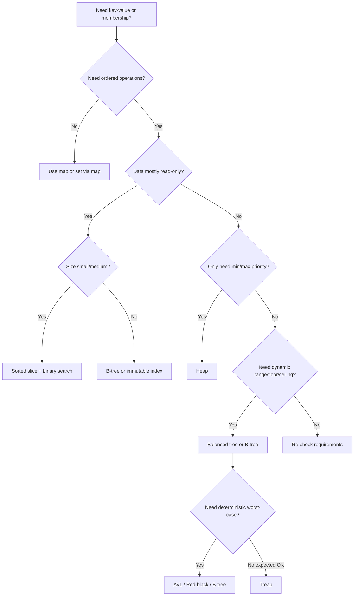

---

## 54. Mermaid Summary: AVL Insert/Rebalance

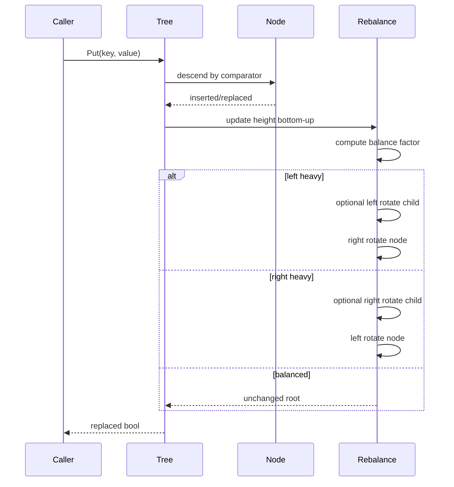

---

## 55. Exercises

### Exercise 1 — AVL Invariant Validator

Implement validator yang memeriksa:

- BST ordering,
- height metadata,
- balance factor,
- count node.

Jangan gunakan metadata height untuk menghitung expected height. Recompute dari child.

### Exercise 2 — Floor dan Ceiling

Implement `Floor`, `Ceiling`, `Lower`, dan `Higher` untuk AVL map.

Test cases:

```text
empty tree
single node
target below min
target above max
target exactly existing key
target between two keys
```

### Exercise 3 — Range Query

Implement range query inclusive.

Bandingkan hasil dengan sorted slice reference.

### Exercise 4 — Random Operation Differential Test

Generate 1 juta operasi random:

- put,
- get,
- delete,
- range small,
- range large.

Bandingkan dengan `map` + sorted keys reference.

### Exercise 5 — Deadline Scheduler Index

Bangun struktur:

```go
type SchedulerIndex struct {
    byID map[string]*Job
    byDeadline *AVLMap[DeadlineKey, *Job]
}
```

Support:

- Add
- Cancel
- Reschedule
- Due(now)

Tuliskan invariant test.

### Exercise 6 — Rank/Select

Augment AVL dengan `size`.

Implement:

- `Rank(key)`
- `Select(i)`

Test dengan sorted slice.

---

## 56. Summary

Balanced tree menyelesaikan kelemahan utama BST biasa: degenerasi menjadi linked list.

Hal penting dari part ini:

1. Balanced tree diperlukan ketika operasi ordered bersifat dinamis.
2. AVL menjaga tinggi sangat ketat dengan height/balance factor.
3. Red-black menjaga black-height dengan color invariant.
4. Treap memakai random priority dan memberi expected balance.
5. Rotation mempertahankan BST ordering sambil mengubah bentuk tree.
6. Comparator adalah fondasi correctness.
7. Key yang dipakai comparator harus immutable selama berada di tree.
8. Range query, floor, ceiling, predecessor, successor adalah alasan utama memakai ordered tree.
9. Sorted slice sering lebih baik untuk data kecil/read-heavy.
10. Heap lebih cocok untuk priority-only workload.
11. B-tree sering lebih cocok untuk data besar karena locality/fanout.
12. Production tree wajib punya invariant tests, differential tests, dan benchmark realistis.

Balanced tree bukan struktur yang harus selalu Anda implement sendiri. Tetapi memahami invariant dan trade-off-nya membuat Anda mampu memilih struktur yang benar, mendesain ordered index yang defensible, dan membaca library implementation dengan lebih tajam.

---

## 57. Referensi Resmi dan Bacaan Lanjutan

Referensi utama Go:

- Go 1.26 Release Notes: `https://go.dev/doc/go1.26`
- Go Release History: `https://go.dev/doc/devel/release`
- Go Standard Library: `https://pkg.go.dev/std`
- Package `cmp`: `https://pkg.go.dev/cmp`
- Package `slices`: `https://pkg.go.dev/slices`
- Package `container`: `https://pkg.go.dev/container`
- Package `container/heap`: `https://pkg.go.dev/container/heap`
- Package `container/list`: `https://pkg.go.dev/container/list`
- Package `testing`: `https://pkg.go.dev/testing`

Bacaan konseptual:

- AVL tree rotation and balance invariant.
- Red-black tree color and black-height invariant.
- Left-leaning red-black tree.
- Treap split/merge operations.
- Order-statistics tree.
- Interval tree.
- B-tree and cache-aware ordered indexes.

---

## 58. Status Seri

```text
Selesai:
- Part 000 — Roadmap, Mental Model, dan Batasan Seri
- Part 001 — Complexity Model yang Realistis di Go
- Part 002 — Arrays, Slices, dan Sequence Design
- Part 003 — Maps, Hash Tables, dan Associative Data
- Part 004 — Sorting, Ordering, Comparison, dan Search
- Part 005 — Stack, Queue, Deque, dan Worklist Algorithms
- Part 006 — Linked List, Intrusive List, dan Pointer-Chasing Trade-off
- Part 007 — Heap, Priority Queue, dan Scheduling Algorithms
- Part 008 — Sets, Multisets, Bag, dan Membership Models
- Part 009 — Strings, Bytes, Runes, Tokenization, dan Text Algorithms
- Part 010 — Recursion, Iteration, Backtracking, dan State Space Search
- Part 011 — Hashing, Fingerprint, Checksums, dan Equality Strategy
- Part 012 — Trees: Binary Tree, BST, Traversal, dan Structural Invariants
- Part 013 — Balanced Trees: AVL, Red-Black, Treap, dan Ordered Index

Berikutnya:
- Part 014 — B-Tree, B+Tree, Page-Oriented Structure, dan Storage-Aware Index
```

Seri belum selesai. Bagian berikutnya adalah `learn-go-data-structure-algorithm-part-014.md`.

<!-- NAVIGATION_FOOTER -->
<div class="page-nav">
<a href="./learn-go-data-structure-algorithm-part-012.md">⬅️ Part 012 — Trees: Binary Tree, BST, Traversal, dan Structural Invariants</a>
<a href="./index.md">📚 Kategori</a>
<a href="../../index.md">🏠 Home</a>
<a href="./learn-go-data-structure-algorithm-part-014.md">Part 014 — B-Tree, B+Tree, Page-Oriented Structure, dan Storage-Aware Index ➡️</a>
</div>
