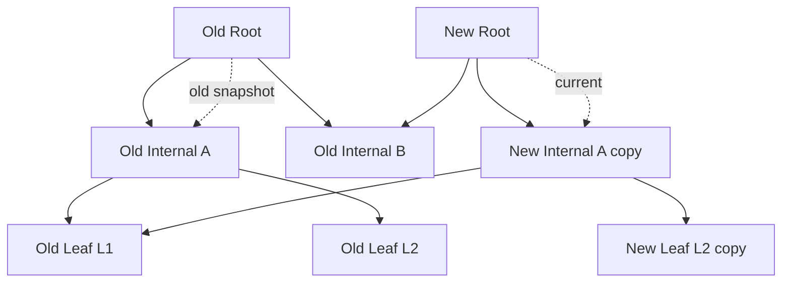
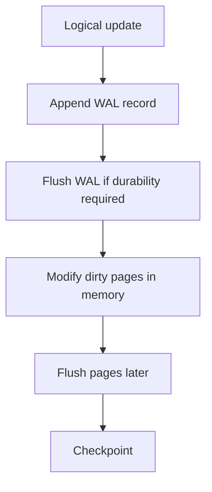
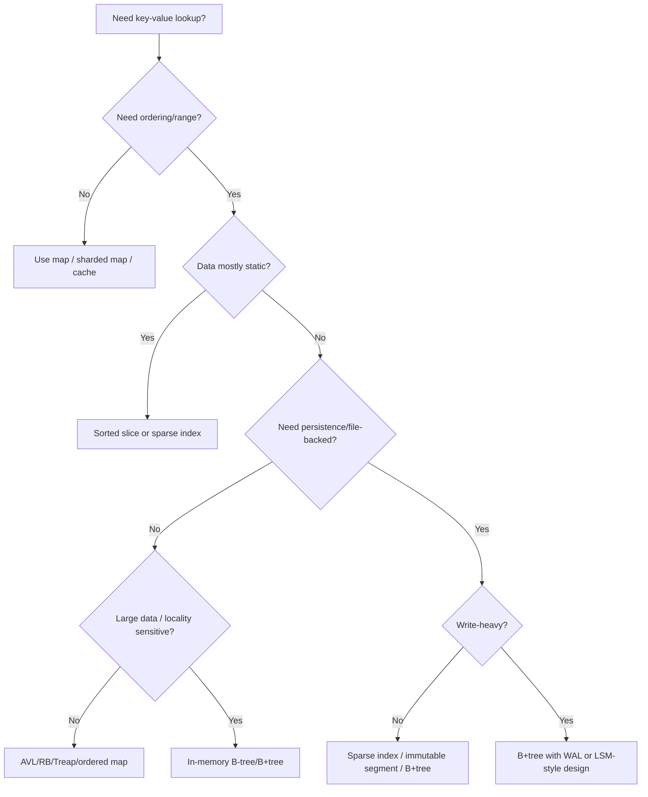

# learn-go-data-structure-algorithm-part-014.md

# Part 014 — B-Tree, B+Tree, Page-Oriented Structure, dan Storage-Aware Index

> **Seri:** `learn-go-data-structure-algorithm`  
> **Bagian:** `014 / 034`  
> **Target:** Software engineer Java yang ingin menguasai struktur data dan algoritma Go di level production-grade.  
> **Fokus:** B-tree, B+tree, page/block-oriented indexing, storage-aware design, range scan, split/merge, sparse index, cache locality, dan cara berpikir seperti engineer storage/database/index engine.  
> **Versi Go acuan:** Go 1.26.x.  

---

## 0. Posisi Part Ini dalam Seri

Pada Part 012 dan Part 013 kita membahas binary search tree, AVL, red-black tree, treap, ordered map, dan ordered set. Semua struktur itu penting untuk memahami **ordered index**.

Namun, balanced binary tree masih memiliki satu karakteristik besar:

> Setiap node biasanya kecil dan terhubung lewat pointer.

Model tersebut masuk akal untuk struktur data murni in-memory. Tetapi ketika data membesar, atau ketika akses data berinteraksi dengan cache CPU, page memory, SSD, disk, network storage, atau file-backed storage, biaya utama tidak lagi sekadar jumlah perbandingan.

Biaya utama berubah menjadi:

- berapa banyak cache line disentuh,
- berapa banyak page disentuh,
- berapa banyak random I/O dilakukan,
- berapa banyak pointer chasing terjadi,
- berapa banyak allocation dan object header tersebar,
- apakah aksesnya sequential atau random,
- apakah range scan bisa berjalan linear,
- apakah data layout cocok dengan perangkat penyimpanan.

B-tree dan B+tree muncul dari kenyataan ini.

Balanced binary tree menjaga tinggi pohon dengan membatasi bentuk node. B-tree menjaga tinggi pohon dengan cara berbeda:

> Satu node menyimpan banyak key dan banyak child pointer, sehingga fanout tinggi dan tinggi pohon rendah.

Secara mental:

- binary tree: satu node kira-kira satu key, dua child;
- B-tree: satu node adalah **page** berisi banyak key dan banyak child;
- B+tree: internal node hanya untuk routing, semua record berada di leaf, dan leaf biasanya saling terhubung untuk range scan.

Part ini akan membahas B-tree/B+tree bukan sebagai hafalan database, tetapi sebagai fondasi untuk membangun:

- ordered index besar,
- embedded index,
- disk-backed lookup,
- file-backed data structure,
- storage engine,
- sparse index,
- SSTable-style index,
- range scan structure,
- page-oriented in-memory structure,
- compact large lookup table.

---

## 1. Masalah yang Diselesaikan B-Tree

### 1.1 Binary tree terlalu dalam untuk storage

Misalkan kita punya 1.000.000 key.

Balanced binary tree ideal memiliki tinggi sekitar:

```text
log2(1_000_000) ≈ 20
```

Dua puluh langkah terdengar kecil. Tetapi jika setiap langkah berarti membaca node berbeda dari disk, SSD, page cache, atau memory area yang tidak locality-friendly, maka 20 random access adalah mahal.

Sekarang bayangkan B-tree dengan fanout 128.

```text
log128(1_000_000) ≈ 3
```

Artinya, lookup bisa menyentuh kira-kira 3 sampai 4 page saja.

Perbedaan mentalnya:

```text
binary tree lookup:
    touch node
    touch node
    touch node
    ... sekitar 20 kali

B-tree lookup:
    touch root page
    touch internal page
    touch leaf page
```

Dalam storage/index engineering, mengurangi jumlah page touch sering jauh lebih penting daripada mengurangi satu-dua operasi CPU.

---

### 1.2 Pointer chasing buruk untuk locality

Balanced binary tree berbasis node pointer biasanya terlihat seperti ini:

```go
type Node[K any, V any] struct {
    Key   K
    Value V
    Left  *Node[K, V]
    Right *Node[K, V]
    // metadata: height/color/priority/etc
}
```

Setiap node bisa berada di lokasi memory berbeda. Traversal berarti CPU sering harus mengikuti pointer ke lokasi yang tidak berdekatan.

Masalahnya:

- CPU cache bekerja bagus ketika data berdekatan.
- Pointer chasing membuat akses memory sulit diprediksi.
- Banyak object kecil menambah overhead allocation.
- Banyak pointer menambah pekerjaan GC scan.
- Untuk disk/file-backed storage, pointer biasa tidak berguna; kita butuh offset/page id.

B-tree menyelesaikan sebagian besar masalah ini dengan menyimpan banyak key dalam satu node/page.

```text
Page:
+----------------------------------------------------+
| key0 | key1 | key2 | key3 | ... | keyN             |
| ptr0 | ptr1 | ptr2 | ptr3 | ... | ptrN+1           |
+----------------------------------------------------+
```

Satu page bisa dibaca sekali, lalu banyak perbandingan dilakukan di dalam page yang sudah berada di memory/cache.

---

### 1.3 Range scan butuh layout yang sequential

Banyak query production bukan exact lookup, tetapi range:

- ambil semua event dari timestamp A sampai B,
- ambil semua invoice due date minggu ini,
- ambil semua audit trail untuk module tertentu dalam rentang waktu,
- ambil semua user id antara shard key tertentu,
- ambil semua retry task yang due sebelum `now`,
- ambil semua key dengan prefix tertentu.

Binary tree bisa melakukan range scan dengan inorder traversal, tetapi node-node leaf belum tentu berdekatan di memory atau disk.

B+tree memperbaiki ini dengan membuat leaf berisi data terurut dan biasanya di-link secara sequential.

```mermaid
flowchart TD
    R[Root: 30 | 60] --> I1[Internal: 10 | 20]
    R --> I2[Internal: 40 | 50]
    R --> I3[Internal: 70 | 80]

    I1 --> L1[Leaf: 1,2,5,8]
    I1 --> L2[Leaf: 10,12,15]
    I1 --> L3[Leaf: 20,21,25]

    I2 --> L4[Leaf: 30,31,35]
    I2 --> L5[Leaf: 40,42,45]
    I2 --> L6[Leaf: 50,55,58]

    I3 --> L7[Leaf: 60,63,66]
    I3 --> L8[Leaf: 70,72,75]
    I3 --> L9[Leaf: 80,88,90]

    L1 -.next.-> L2
    L2 -.next.-> L3
    L3 -.next.-> L4
    L4 -.next.-> L5
    L5 -.next.-> L6
    L6 -.next.-> L7
    L7 -.next.-> L8
    L8 -.next.-> L9
```

Untuk range scan:

1. cari leaf awal,
2. scan entry dalam leaf,
3. ikuti pointer `next` ke leaf berikutnya,
4. berhenti saat key keluar dari batas range.

Ini cocok sekali dengan storage karena akses leaf bisa dibuat sequential.

---

## 2. Page-Oriented Thinking

### 2.1 Node B-tree bukan sekadar object

Dalam AVL/red-black tree, node adalah object logis.

Dalam B-tree, node lebih tepat dipikirkan sebagai **page**.

Page adalah unit transfer dan unit locality.

Untuk in-memory B-tree, page bisa berarti:

- struct yang menyimpan array key/value/child,
- block memory fixed-size,
- slab allocation,
- cache-conscious chunk.

Untuk disk-backed B-tree, page bisa berarti:

- 4 KiB block,
- 8 KiB block,
- 16 KiB block,
- database page,
- file segment,
- memory-mapped page,
- logical page id.

Mental model:

```text
B-tree does not optimize number of comparisons first.
B-tree optimizes number of page accesses first.
```

Perbandingan di dalam page bisa lebih banyak daripada binary tree per level. Tetapi karena data berada di satu page, biayanya sering lebih murah daripada menyentuh page lain.

---

### 2.2 Page size menentukan fanout

Fanout adalah jumlah child maksimum yang bisa dimiliki node internal.

Misalkan satu page 4096 byte.

Jika internal entry membutuhkan:

- key: 16 byte,
- child pointer/page id: 8 byte,
- overhead per entry: kira-kira 0 sampai beberapa byte tergantung layout.

Secara kasar:

```text
entry ≈ 24 byte
4096 / 24 ≈ 170 entries
```

Fanout sekitar 170.

Dengan fanout sebesar itu, tinggi pohon untuk jutaan hingga miliaran key tetap kecil.

Contoh kasar:

```text
fanout 128
height 1: 128
height 2: 16,384
height 3: 2,097,152
height 4: 268,435,456
height 5: 34,359,738,368
```

Artinya, dengan fanout tinggi, root + beberapa internal level cukup untuk index sangat besar.

---

### 2.3 Binary search di dalam page vs linear scan

Di dalam sebuah page yang key-nya terurut, kita perlu mencari slot.

Ada beberapa strategi:

1. Linear scan.
2. Binary search.
3. SIMD/vectorized scan, jika tersedia dan desain sangat low-level.
4. Interpolation search untuk distribusi tertentu.

Di Go production biasa, pilihan realistis adalah linear scan atau binary search.

Binary search memiliki `O(log m)` per page, sedangkan linear scan `O(m)`. Tetapi untuk `m` kecil, linear scan bisa kompetitif karena:

- branch lebih predictable,
- data contiguous,
- tidak ada loop lompat-lompat,
- compiler bisa menghasilkan kode sederhana,
- cache sudah hangat.

Rule of thumb:

- page kecil dan key murah dibandingkan: linear scan layak.
- page besar: binary search lebih aman.
- comparator mahal: kurangi jumlah comparison.
- workload range scan: pencarian awal penting, scan berikutnya linear.

Dalam Go, `sort.Search`, `slices.BinarySearch`, atau custom binary search bisa digunakan, tetapi untuk page internal yang memakai array fixed-size, custom search sering lebih ergonomis.

---

## 3. B-Tree: Definisi dan Invariant

### 3.1 Definisi konseptual

B-tree adalah balanced search tree multi-way.

Setiap node menyimpan beberapa key terurut dan beberapa child.

Untuk degree minimum `t`, invariant klasik B-tree:

- setiap node memiliki maksimum `2t - 1` key,
- setiap internal node memiliki maksimum `2t` child,
- selain root, setiap node memiliki minimum `t - 1` key,
- selain root, setiap internal node memiliki minimum `t` child,
- semua leaf berada pada kedalaman yang sama,
- key dalam node terurut,
- child memisahkan range key.

Secara visual:

```text
        [ 10 | 20 | 30 ]
       /     |    |     \
   <10   10..20 20..30  >30
```

Jika node memiliki key:

```text
k0, k1, k2, ..., kn-1
```

Maka node internal memiliki child:

```text
c0, c1, c2, ..., cn
```

Range child:

```text
c0: keys < k0
c1: k0 < keys < k1
c2: k1 < keys < k2
...
cn: keys > kn-1
```

Untuk key duplicate, harus ada policy eksplisit:

- duplicate tidak boleh,
- duplicate overwrite value,
- duplicate disimpan sebagai list,
- key dibuat composite agar unik.

Production B-tree harus menentukan ini sejak awal.

---

### 3.2 B-tree bukan binary tree dengan lebih banyak child saja

Kesalahan umum adalah menganggap B-tree hanya “tree dengan banyak child”. B-tree lebih spesifik:

- node penuh harus split,
- node terlalu kosong harus merge atau borrow,
- semua leaf memiliki depth yang sama,
- range antar child harus konsisten,
- occupancy node dijaga agar tree tidak terlalu tinggi,
- update harus mempertahankan invariant page.

B-tree adalah struktur data yang sangat invariant-heavy.

Jika invariant dilanggar, gejalanya bisa halus:

- lookup kadang gagal,
- range scan lompat key,
- duplicate muncul,
- delete menghilangkan key lain,
- parent separator stale,
- tree tampak benar untuk small dataset tetapi rusak saat split/merge berulang.

Karena itu, testing B-tree harus lebih serius daripada testing stack atau queue.

---

### 3.3 Invariant utama

Untuk implementasi production, minimal ada invariant berikut.

#### Invariant 1 — Sorted keys in page

Semua key dalam page harus sorted.

```text
keys[i] < keys[i+1]
```

Atau jika duplicate diperbolehkan:

```text
keys[i] <= keys[i+1]
```

dengan policy duplicate yang jelas.

#### Invariant 2 — Child count matches key count

Untuk internal node:

```text
len(children) == len(keys) + 1
```

Untuk leaf:

```text
len(children) == 0
```

#### Invariant 3 — Child range boundaries valid

Semua key di child kiri harus lebih kecil daripada separator, dan semua key di child kanan harus lebih besar.

```text
child[i] range berada antara keys[i-1] dan keys[i]
```

#### Invariant 4 — Occupancy bound

Node tidak boleh terlalu penuh atau terlalu kosong.

Batas umumnya:

```text
minKeys <= len(keys) <= maxKeys
```

Root biasanya punya aturan khusus.

#### Invariant 5 — All leaves same depth

Semua leaf berada pada depth sama.

Ini yang membuat B-tree balanced.

#### Invariant 6 — Parent separator consistent

Separator key di parent harus merepresentasikan batas child dengan benar.

Pada beberapa varian B-tree, separator adalah key aktual yang juga ada di internal node. Pada B+tree, separator sering berupa copy key pembatas dari leaf.

#### Invariant 7 — Linked leaves consistent, untuk B+tree

Jika B+tree memakai `next` pointer antar leaf:

```text
leaf[i].maxKey < leaf[i].next.minKey
leaf[i].next.prev == leaf[i] // jika double-linked
```

Range scan sangat bergantung pada invariant ini.

---

## 4. B-Tree Search

### 4.1 Algoritma lookup

Lookup B-tree:

1. mulai dari root,
2. cari posisi key di dalam page,
3. jika ditemukan dan value berada di internal node, return,
4. jika leaf dan tidak ditemukan, return not found,
5. jika internal, turun ke child sesuai posisi,
6. ulangi.

Pseudocode:

```text
Search(node, key):
    i = lower_bound(node.keys, key)

    if i < len(node.keys) and node.keys[i] == key:
        return node.values[i]

    if node.isLeaf:
        return not found

    return Search(node.children[i], key)
```

Untuk B-tree klasik, value bisa berada di internal maupun leaf.

Untuk B+tree, internal node hanya routing, sehingga jika key ditemukan di internal, lookup tetap harus turun ke leaf.

---

### 4.2 Go skeleton untuk node in-memory

Implementasi sederhana untuk belajar:

```go
package btree

import "cmp"

type node[K cmp.Ordered, V any] struct {
    leaf     bool
    keys     []K
    values   []V
    children []*node[K, V]
}
```

Untuk production, struct ini belum ideal karena:

- banyak allocation,
- `[]K`, `[]V`, `[]*node` bisa memiliki backing array berbeda,
- child pointer membuat GC scan tinggi,
- tidak page-size bounded,
- tidak cocok untuk disk-backed structure.

Tetapi skeleton ini bagus untuk memahami algoritma.

Search:

```go
func search[K cmp.Ordered, V any](n *node[K, V], key K) (V, bool) {
    i := lowerBound(n.keys, key)
    if i < len(n.keys) && n.keys[i] == key {
        return n.values[i], true
    }
    if n.leaf {
        var zero V
        return zero, false
    }
    return search(n.children[i], key)
}

func lowerBound[K cmp.Ordered](xs []K, target K) int {
    lo, hi := 0, len(xs)
    for lo < hi {
        mid := lo + (hi-lo)/2
        if xs[mid] < target {
            lo = mid + 1
        } else {
            hi = mid
        }
    }
    return lo
}
```

Catatan production:

- Untuk comparator custom, `cmp.Ordered` tidak cukup.
- Untuk key besar, copy key bisa mahal.
- Untuk disk-backed index, key encoding lebih penting daripada generic type.
- Untuk duplicate key, equality handling harus eksplisit.

---

## 5. B-Tree Insert dan Split

### 5.1 Intuisi insert

Insert B-tree selalu menjaga node agar tidak melebihi kapasitas maksimum.

Ketika node penuh, node di-split menjadi dua node, dan separator dipromosikan ke parent.

Contoh sederhana: max 3 key per node.

Sebelum insert menyebabkan overflow:

```text
[10 | 20 | 30]
```

Jika kita perlu memasukkan 25:

```text
[10 | 20 | 25 | 30]  // overflow
```

Split:

```text
        [20]
       /    \
   [10]    [25 | 30]
```

Key tengah dipromosikan ke parent.

---

### 5.2 Top-down split vs bottom-up split

Ada dua gaya umum insert.

#### Bottom-up split

1. Turun ke leaf.
2. Insert key.
3. Jika leaf overflow, split.
4. Jika parent overflow, split parent.
5. Propagate ke atas.

Kelebihan:

- konsep natural,
- mirip “insert dulu, repair kemudian”.

Kekurangan:

- butuh membawa hasil split naik,
- recursion return lebih kompleks,
- handling root split perlu hati-hati.

#### Top-down split

1. Sebelum turun ke child, pastikan child tidak penuh.
2. Jika child penuh, split child dulu.
3. Turun ke child yang tepat.
4. Insert di leaf yang dijamin tidak penuh.

Kelebihan:

- saat sampai leaf, leaf tidak penuh,
- tidak perlu propagate split dari bawah dalam banyak implementasi,
- sering lebih sederhana untuk B-tree klasik.

Kekurangan:

- bisa melakukan split lebih awal,
- implementasi parent-child mutation harus teliti.

Untuk pembelajaran production, top-down insert lebih mudah dijaga invariant-nya.

---

### 5.3 Split child: operasi inti

Misalkan parent memiliki child `y` yang penuh.

Kita buat node baru `z`.

```text
parent: [ ... ]
child y: [ k0 k1 k2 k3 k4 ]
```

Jika degree minimum `t = 3`, maka max key `2t-1 = 5`.

Split:

```text
y: [ k0 k1 ]
promote: k2
z: [ k3 k4 ]
```

Parent menerima `k2` dan pointer ke `z`.

```text
parent: [ ... k2 ... ]
children: [... y, z ...]
```

Pseudocode:

```text
splitChild(parent, i):
    y = parent.children[i]
    z = new node with same leaf flag as y

    median = y.keys[t-1]

    z.keys = y.keys[t : 2t-1]
    y.keys = y.keys[0 : t-1]

    if not y.leaf:
        z.children = y.children[t : 2t]
        y.children = y.children[0 : t]

    insert median into parent.keys at i
    insert z into parent.children at i+1
```

---

### 5.4 Go helper untuk insert into slice

Untuk pembelajaran:

```go
func insertAt[T any](xs []T, i int, v T) []T {
    xs = append(xs, v)
    copy(xs[i+1:], xs[i:])
    xs[i] = v
    return xs
}
```

Namun, fungsi ini punya bug halus jika tidak hati-hati.

Perhatikan:

```go
xs = append(xs, v)
copy(xs[i+1:], xs[i:])
xs[i] = v
```

Ini valid karena setelah `append`, slice panjang bertambah satu, lalu range `xs[i+1:]` punya ruang untuk shifting.

Tetapi untuk object pointer/value besar, shifting bisa mahal.

Untuk page fixed-size, biasanya kita memakai array fixed-size dan count:

```go
type page[K cmp.Ordered, V any] struct {
    leaf  bool
    n     int
    keys  [maxKeys]K
    vals  [maxKeys]V
    child [maxChildren]*page[K, V]
}
```

Dengan layout seperti ini:

- tidak perlu allocation per insert dalam page,
- capacity jelas,
- shifting manual,
- page lebih predictable.

Tetapi generic array dengan `maxKeys` sebagai konstanta compile-time membuat fleksibilitas terbatas. Production library sering memakai generator, unsafe layout, byte page, atau konfigurasi fixed.

---

### 5.5 Root split

Jika root penuh sebelum insert, root harus di-split dan tinggi tree bertambah satu.

Sebelum:

```text
[10 | 20 | 30]
```

Setelah root split:

```text
      [20]
     /    \
 [10]    [30]
```

Root adalah satu-satunya node yang boleh punya occupancy lebih kecil dari minimum normal.

Implementasi top-down biasanya:

```text
Insert(key):
    if root is full:
        oldRoot = root
        root = new internal node
        root.children[0] = oldRoot
        splitChild(root, 0)

    insertNonFull(root, key)
```

---

## 6. B-Tree Delete: Borrow, Merge, dan Underflow

### 6.1 Kenapa delete lebih sulit daripada insert

Insert menangani overflow.

Delete menangani underflow.

Underflow terjadi ketika jumlah key node turun di bawah minimum.

Dalam B-tree, delete harus memastikan tree tetap balanced dan setiap node selain root tetap cukup penuh.

Delete lebih kompleks karena ada beberapa kasus:

- key ada di leaf,
- key ada di internal node,
- child yang akan dituruni kurang key,
- sibling bisa meminjamkan key,
- sibling tidak bisa meminjamkan key sehingga harus merge,
- root kehilangan semua key dan tinggi tree turun.

---

### 6.2 Strategi top-down delete

Strategi yang umum:

> Sebelum turun ke child, pastikan child memiliki lebih dari minimum key.

Dengan cara ini, saat kita menghapus di bawah, child tidak langsung underflow.

Jika child hanya punya minimum key, kita perbaiki dulu dengan:

- borrow dari sibling kiri,
- borrow dari sibling kanan,
- merge dengan sibling.

---

### 6.3 Borrow dari sibling

Misalkan child kekurangan ruang aman, sibling kiri punya extra key.

Parent:

```text
        [20]
       /    \
 [5 | 10]  [30]
```

Jika child kanan `[30]` perlu tambahan sebelum turun, sibling kiri `[5|10]` bisa meminjamkan.

Rotasi dari kiri:

```text
        [10]
       /    \
     [5]   [20 | 30]
```

Parent separator turun ke child, sibling key naik ke parent.

---

### 6.4 Merge sibling

Jika child dan sibling sama-sama minimum, mereka digabung bersama separator parent.

Sebelum:

```text
        [20]
       /    \
    [10]   [30]
```

Merge:

```text
[10 | 20 | 30]
```

Parent kehilangan satu key dan satu child pointer.

Jika parent menjadi kosong dan parent adalah root, root diganti dengan merged child.

---

### 6.5 Production advice untuk delete

B-tree delete rawan bug. Banyak sistem production menghindari delete fisik langsung, terutama di storage engine.

Alternatif:

1. Tombstone.
2. Lazy delete.
3. Background compaction.
4. Rebuild index periodik.
5. Mark-and-sweep page cleanup.

Untuk in-memory ordered map kecil, delete fisik oke.

Untuk disk-backed atau file-backed structure, tombstone sering lebih aman karena:

- write path lebih sederhana,
- crash recovery lebih mudah,
- tidak perlu immediate page merge,
- compaction bisa dilakukan terpisah.

Namun tombstone punya biaya:

- lookup harus melihat marker delete,
- range scan harus skip tombstone,
- storage bisa membengkak,
- compaction wajib ada.

---

## 7. B+Tree: Struktur yang Lebih Cocok untuk Range Scan

### 7.1 Perbedaan B-tree dan B+tree

Pada B-tree klasik:

- key dan value bisa berada di internal node maupun leaf.
- lookup bisa selesai di internal node.

Pada B+tree:

- internal node hanya menyimpan separator/routing key,
- semua record berada di leaf,
- leaf berisi key-value terurut,
- leaf biasanya linked dengan `next` pointer.

Diagram:

```mermaid
flowchart TD
    R[Internal: 30 | 60]
    R --> A[Internal: 10 | 20]
    R --> B[Internal: 40 | 50]
    R --> C[Internal: 70 | 80]

    A --> L1[Leaf: 1=V1, 5=V5, 9=V9]
    A --> L2[Leaf: 10=V10, 15=V15]
    A --> L3[Leaf: 20=V20, 25=V25]

    B --> L4[Leaf: 30=V30, 35=V35]
    B --> L5[Leaf: 40=V40, 45=V45]
    B --> L6[Leaf: 50=V50, 55=V55]

    C --> L7[Leaf: 60=V60, 65=V65]
    C --> L8[Leaf: 70=V70, 75=V75]
    C --> L9[Leaf: 80=V80, 90=V90]

    L1 -. next .-> L2
    L2 -. next .-> L3
    L3 -. next .-> L4
    L4 -. next .-> L5
    L5 -. next .-> L6
    L6 -. next .-> L7
    L7 -. next .-> L8
    L8 -. next .-> L9
```

---

### 7.2 Kenapa database sering memakai B+tree

B+tree bagus untuk database/index karena:

1. Semua data record berada di leaf.
2. Leaf bisa disimpan sequential.
3. Range scan sangat efisien.
4. Internal node lebih kecil karena hanya routing key dan child pointer.
5. Fanout internal lebih besar.
6. Root dan internal upper levels sering bisa tetap di memory.
7. Leaf bisa menjadi unit I/O utama.

Jika value besar disimpan di internal node, fanout turun.

Dengan B+tree, internal node bisa compact:

```text
internal entry = separator key + child page id
```

Leaf node menyimpan:

```text
leaf entry = key + value pointer / record id / inline value
```

Jika value besar, leaf juga bisa menyimpan pointer ke record location, bukan value langsung.

---

### 7.3 B+tree lookup

Lookup B+tree:

1. mulai dari root,
2. cari child berdasarkan separator,
3. turun hingga leaf,
4. cari key di leaf,
5. return value jika ditemukan.

Tidak berhenti di internal node meskipun separator sama dengan key.

Pseudocode:

```text
Search(root, key):
    n = root
    while not n.leaf:
        i = childIndex(n.separators, key)
        n = readChild(n.children[i])

    i = lower_bound(n.keys, key)
    if i < len(n.keys) and n.keys[i] == key:
        return n.values[i]
    return not found
```

Hal penting: `childIndex` untuk separator B+tree harus konsisten.

Ada dua policy umum:

- separator adalah minimum key child kanan,
- separator adalah maximum key child kiri.

Pilih satu dan dokumentasikan.

---

### 7.4 Separator key pada B+tree

Misalkan internal node:

```text
[10 | 20 | 30]
```

Jika separator adalah minimum key child kanan:

```text
child0: keys < 10
child1: keys >= 10 and < 20
child2: keys >= 20 and < 30
child3: keys >= 30
```

Maka child selection:

```text
i = upper_bound(separators, key)
```

Contoh:

- key 5  -> child0
- key 10 -> child1
- key 19 -> child1
- key 20 -> child2
- key 30 -> child3

Jika salah memakai `lower_bound`, exact key pada separator bisa turun ke child yang salah.

Ini salah satu bug paling umum dalam B+tree.

---

## 8. Page Layout Design di Go

### 8.1 Object layout vs byte layout

Ada dua gaya implementasi besar.

#### Object layout

```go
type Page[K cmp.Ordered, V any] struct {
    Leaf     bool
    Keys     []K
    Values   []V
    Children []*Page[K, V]
    Next     *Page[K, V]
}
```

Kelebihan:

- mudah dipahami,
- mudah di-debug,
- generic-friendly,
- cocok untuk in-memory index.

Kekurangan:

- tidak page-size stable,
- banyak pointer,
- banyak allocation,
- GC pressure,
- tidak langsung bisa disimpan ke file,
- layout tidak compact.

#### Byte/page layout

```text
+--------------------+
| header             |
| key offset table   |
| value offset table |
| free space         |
| encoded entries    |
+--------------------+
```

Kelebihan:

- compact,
- bisa fixed page size,
- cocok untuk file/mmap,
- lebih sedikit object Go,
- bisa pakai page id/offset,
- lebih dekat ke database engine design.

Kekurangan:

- implementasi kompleks,
- encoding/decoding harus aman,
- raw byte manipulation rawan bug,
- generic API lebih sulit,
- perlu checksum/versioning jika durable.

Untuk seri ini, kita pahami keduanya. Production choice bergantung pada tujuan.

---

### 8.2 Page header

Sebuah page biasanya butuh metadata.

Contoh header konseptual:

```text
PageHeader:
    page_id       uint64
    page_type     uint16  // internal or leaf
    key_count     uint16
    free_start    uint16
    free_end      uint16
    next_page_id  uint64  // for leaf
    prev_page_id  uint64  // optional
    checksum      uint32  // optional
    version       uint16  // optional
```

Untuk in-memory object, beberapa field tidak perlu.

Untuk disk-backed page, field seperti `page_id`, `checksum`, dan `version` penting.

---

### 8.3 Fixed-size key vs variable-size key

Desain B-tree sangat dipengaruhi ukuran key.

#### Fixed-size key

Contoh:

- `uint64` id,
- timestamp encoded as int64,
- hash fingerprint,
- composite fixed-width key.

Keuntungan:

- binary search mudah,
- offset langsung dihitung,
- page capacity predictable,
- no fragmentation within page.

Layout:

```text
[key0][key1][key2]...[keyN]
[val0][val1][val2]...[valN]
```

#### Variable-size key

Contoh:

- string,
- encoded composite key,
- path,
- email,
- namespace permission key.

Butuh offset table:

```text
+----------------------+
| header               |
| slot0 offset/length   |
| slot1 offset/length   |
| slot2 offset/length   |
| free space            |
| key/value bytes       |
+----------------------+
```

Masalah tambahan:

- fragmentation,
- compaction within page,
- prefix compression,
- max key size policy,
- overflow page untuk value/key besar.

---

### 8.4 Inline value vs record pointer

B+tree leaf bisa menyimpan value langsung atau pointer ke record.

#### Inline value

```text
leaf: key -> value
```

Cocok jika:

- value kecil,
- lookup harus satu page read,
- update value tidak sering berubah ukuran,
- index adalah primary storage.

#### Record pointer

```text
leaf: key -> record_id/page_offset
```

Cocok jika:

- value besar,
- ada heap file terpisah,
- index hanya secondary index,
- multiple index menunjuk record yang sama.

Trade-off:

- Inline value memperbesar leaf dan menurunkan fanout.
- Record pointer butuh extra read untuk mengambil value.

Production decision:

```text
If lookup frequently needs full value and value is small -> inline.
If value is large or multiple indexes exist -> pointer/reference.
```

---

## 9. Prefix Compression

### 9.1 Kenapa prefix compression penting

Banyak key production memiliki prefix berulang:

```text
tenant-001:user:00000001
tenant-001:user:00000002
tenant-001:user:00000003
tenant-001:user:00000004
```

Menyimpan prefix penuh untuk setiap key memboroskan page.

Prefix compression menyimpan bagian yang sama sekali, lalu suffix per key.

```text
shared prefix: tenant-001:user:000000
suffixes: 01, 02, 03, 04
```

Efeknya:

- lebih banyak key per page,
- fanout meningkat,
- height menurun,
- I/O berkurang.

---

### 9.2 Prefix compression di internal node

Internal node hanya perlu separator yang cukup untuk membedakan child.

Kadang tidak perlu menyimpan full key sebagai separator. Cukup shortest separator.

Misalnya batas antara:

```text
apple-999
apricot-001
```

Separator bisa berupa string yang cukup membedakan, misalnya `apr` tergantung policy.

Tetapi ini sangat tricky:

- comparator harus konsisten,
- separator tetap harus mengarahkan search dengan benar,
- key reconstruction mungkin diperlukan,
- bug separator bisa menyebabkan lost lookup.

Untuk implementasi awal production, gunakan full separator dulu. Prefix compression adalah optimisasi setelah correctness kuat.

---

## 10. B-Tree vs B+Tree vs Balanced Binary Tree

### 10.1 Perbandingan ringkas

| Struktur | Best For | Range Scan | Exact Lookup | Locality | Implementasi | Catatan |
|---|---:|---:|---:|---:|---:|---|
| AVL/RB tree | ordered in-memory small/medium | baik | baik | sedang/buruk | sedang | pointer-heavy |
| Treap | simple randomized ordered map | baik | baik average | sedang/buruk | sedang | random priority |
| B-tree | ordered large in-memory/disk | baik | baik | baik | kompleks | value bisa internal/leaf |
| B+tree | database/storage range index | sangat baik | baik | sangat baik | kompleks | leaf-linked scan |
| Sorted slice | static/read-heavy ordered data | sangat baik | baik | sangat baik | mudah | update mahal |
| Hash map | exact lookup | buruk | sangat baik average | baik/sedang | built-in | unordered |

---

### 10.2 Kapan B-tree lebih masuk akal daripada red-black tree

Gunakan B-tree/B+tree jika:

- data besar,
- range scan penting,
- locality penting,
- index perlu file-backed,
- fanout tinggi mengurangi height,
- key terurut dan update cukup sering,
- sorted slice terlalu mahal untuk insert/delete,
- binary tree terlalu banyak pointer chasing.

Gunakan red-black/AVL/treap jika:

- implementasi perlu sederhana,
- data relatif kecil,
- in-memory only,
- node-level mutation cukup,
- tidak butuh page layout,
- range scan ada tetapi tidak massive.

Gunakan sorted slice jika:

- data mostly static,
- build once read many,
- range scan dominan,
- insert/delete jarang,
- locality sangat penting,
- batch rebuild acceptable.

---

## 11. Sparse Index dan Dense Index

### 11.1 Dense index

Dense index menyimpan entry untuk setiap record.

```text
key1 -> record1
key2 -> record2
key3 -> record3
key4 -> record4
```

Keuntungan:

- exact lookup langsung,
- update per key jelas.

Kekurangan:

- index besar,
- memory/storage lebih tinggi,
- write amplification.

B+tree leaf sebagai secondary index sering dense.

---

### 11.2 Sparse index

Sparse index hanya menyimpan beberapa key sebagai anchor.

Misalnya file data sorted:

```text
Block 0: keys 0000..0999
Block 1: keys 1000..1999
Block 2: keys 2000..2999
```

Sparse index:

```text
0000 -> block 0 offset
1000 -> block 1 offset
2000 -> block 2 offset
```

Lookup key `1450`:

1. cari anchor terbesar <= 1450,
2. dapat block 1,
3. scan/binary search dalam block.

Sparse index sangat penting dalam SSTable/log-structured storage.

---

### 11.3 Sparse index vs B+tree

Sparse index cocok jika data file immutable atau mostly immutable.

B+tree cocok jika index sering di-update secara online.

| Aspek | Sparse Index | B+Tree |
|---|---:|---:|
| Update random | buruk | baik |
| Immutable file | sangat baik | bisa, tapi overkill |
| Memory size | kecil | lebih besar |
| Range scan | baik | sangat baik |
| Lookup | perlu block scan | langsung ke leaf |
| Compaction/rebuild | natural | tidak selalu |

---

## 12. Write Amplification dan Page Split

### 12.1 Apa itu write amplification

Write amplification adalah kondisi ketika satu logical write menyebabkan banyak physical write.

Contoh insert B+tree:

1. tulis leaf yang berubah,
2. jika split, tulis leaf lama dan leaf baru,
3. update parent,
4. jika parent split, update parent lagi,
5. update root,
6. update WAL/checkpoint metadata.

Satu insert bisa menyentuh beberapa page.

---

### 12.2 Random insert vs sequential insert

Sequential insert ke B+tree biasanya lebih mudah:

- selalu masuk leaf paling kanan,
- split terjadi di kanan,
- locality lebih baik.

Random insert:

- menyentuh leaf berbeda-beda,
- banyak random page writes,
- cache hit lebih rendah,
- split tersebar.

Namun sequential insert juga bisa menyebabkan hot spot pada leaf terakhir jika concurrent writer tinggi.

---

### 12.3 Fill factor

Fill factor menentukan seberapa penuh page setelah split/rebuild.

Jika page selalu 100% penuh, insert berikutnya mudah split.

Jika page dibiarkan 70–90% penuh, ada ruang untuk update berikutnya.

Trade-off:

- fill factor tinggi: storage efisien, tetapi split lebih sering,
- fill factor rendah: storage lebih boros, tetapi update lebih murah.

Untuk read-mostly index, fill factor tinggi masuk akal.

Untuk write-heavy random index, sisakan ruang.

---

## 13. Copy-on-Write B-Tree

### 13.1 Intuisi COW B-tree

Copy-on-write B-tree tidak mengubah page lama secara langsung.

Saat update:

1. copy path dari root ke leaf,
2. apply perubahan pada copy,
3. tulis page baru,
4. publish root baru.

Diagram:



Page lama tetap valid untuk snapshot lama.

---

### 13.2 Kelebihan COW

- Snapshot murah.
- Reader tidak perlu lock berat.
- Crash consistency bisa lebih mudah jika root pointer update atomic.
- Old version tetap bisa dibaca.
- Cocok untuk MVCC-like design.

---

### 13.3 Kekurangan COW

- Write amplification lebih tinggi.
- Garbage collection page lama diperlukan.
- Long-running snapshot menahan banyak page lama.
- Root publish harus aman.
- Space amplification.

COW B-tree cocok untuk:

- configuration snapshot,
- policy snapshot,
- read-heavy index,
- embedded storage tertentu,
- immutable segment indexing.

Tidak selalu cocok untuk write-heavy OLTP tanpa desain page reclamation matang.

---

## 14. Crash Safety: WAL, Atomic Root, dan Page Version

### 14.1 B-tree durable tidak cukup hanya `Write`

Jika B-tree disimpan ke file, masalah baru muncul:

- proses bisa crash di tengah write,
- page bisa half-written,
- parent sudah menunjuk child baru tetapi child belum fsync,
- child sudah ditulis tetapi root belum update,
- metadata corrupt,
- torn write,
- reorder oleh OS/storage.

Karena itu durable B-tree butuh protocol.

---

### 14.2 Write-Ahead Log

WAL prinsipnya:

> Tulis niat/perubahan ke log dulu, pastikan durable, baru apply ke page utama.

Flow sederhana:



Saat recovery:

1. baca checkpoint,
2. replay WAL setelah checkpoint,
3. restore consistent state.

---

### 14.3 Atomic root pointer

Untuk COW B-tree, alternatifnya adalah root pointer update.

Flow:

1. tulis semua page baru,
2. flush page baru,
3. update metadata root pointer ke root baru,
4. flush metadata.

Jika crash sebelum root pointer update, root lama tetap valid.

Jika crash setelah root pointer update, root baru valid jika semua page baru sudah durable.

Ini tetap sulit tanpa ordering guarantee dan checksum.

---

### 14.4 Checksums dan page version

Page durable biasanya perlu:

- magic number,
- format version,
- page type,
- page id,
- LSN/version,
- checksum.

Checksum membantu mendeteksi corruption, bukan memperbaiki sendiri.

Page version membantu migration format dan recovery logic.

---

## 15. Implementasi In-Memory B+Tree Minimal di Go: Desain API

Kita tidak akan membangun full production B+tree di part ini, tetapi kita akan bentuk API dan invariant.

```go
package bplus

import "cmp"

type Tree[K cmp.Ordered, V any] struct {
    root     *node[K, V]
    maxKeys  int
    minKeys  int
    length   int
}

type node[K cmp.Ordered, V any] struct {
    leaf     bool
    keys     []K
    values   []V          // only for leaf
    children []*node[K,V] // only for internal
    next     *node[K,V]   // only for leaf
}
```

API:

```go
func New[K cmp.Ordered, V any](maxKeys int) *Tree[K, V]
func (t *Tree[K, V]) Put(key K, value V)
func (t *Tree[K, V]) Get(key K) (V, bool)
func (t *Tree[K, V]) Delete(key K) bool
func (t *Tree[K, V]) Len() int
func (t *Tree[K, V]) Range(start, end K, fn func(K, V) bool)
func (t *Tree[K, V]) Validate() error
```

Production notes:

- `Range` callback returns bool to stop early.
- `Validate` is not optional during development.
- `Delete` may initially use tombstone or physical delete depending scope.
- Generic ordered key is okay for learning, but comparator-based API is more general.

Comparator-based version:

```go
type CompareFunc[K any] func(a, b K) int

type Tree[K any, V any] struct {
    cmp CompareFunc[K]
    // ...
}
```

Comparator API supports:

- custom struct key,
- byte slice key,
- collation policy,
- descending order,
- composite order.

But comparator must be stable and strict.

---

## 16. Range Scan API Design

### 16.1 Callback style

```go
func (t *Tree[K, V]) Range(start, end K, fn func(K, V) bool) {
    leaf, idx := t.findLeaf(start)
    for leaf != nil {
        for idx < len(leaf.keys) {
            k := leaf.keys[idx]
            if k >= end {
                return
            }
            if !fn(k, leaf.values[idx]) {
                return
            }
            idx++
        }
        leaf = leaf.next
        idx = 0
    }
}
```

Semantics harus jelas:

```text
[start, end)
```

atau:

```text
[start, end]
```

Production recommendation: gunakan half-open interval `[start, end)` karena lebih mudah dikomposisi.

---

### 16.2 Iterator style

```go
type Iterator[K any, V any] struct {
    leaf *node[K,V]
    idx  int
}

func (it *Iterator[K, V]) Valid() bool
func (it *Iterator[K, V]) Key() K
func (it *Iterator[K, V]) Value() V
func (it *Iterator[K, V]) Next()
```

Iterator lebih fleksibel tetapi lebih sulit:

- apa yang terjadi jika tree dimutasi saat iterasi?
- apakah iterator snapshot atau live?
- apakah key/value boleh disimpan setelah `Next`?
- apakah iterator perlu `Close`?

Untuk production, dokumentasikan salah satu:

1. mutation while iterating forbidden,
2. iterator snapshot,
3. iterator weakly consistent,
4. iterator fail-fast.

Go built-in map iteration tidak fail-fast. Tapi untuk struktur data custom, jangan ambigu.

---

## 17. Testing B-Tree/B+Tree

### 17.1 Kenapa test biasa tidak cukup

B-tree bug sering hanya muncul setelah sequence operasi tertentu:

```text
insert 1..1000
remove odd keys
insert random keys
range scan subset
remove keys causing merge
insert keys causing root split
```

Unit test fixed-case membantu, tetapi tidak cukup.

Kita butuh:

- invariant validation,
- random operation testing,
- differential testing,
- fuzzing,
- range scan verification,
- structural edge cases.

---

### 17.2 Validate function

`Validate` harus mengecek:

- keys sorted,
- key count within bounds,
- children count correct,
- child ranges valid,
- all leaves same depth,
- leaf links sorted and complete,
- length matches counted records,
- no duplicate jika duplicate dilarang,
- parent separator valid.

Pseudo:

```text
Validate(tree):
    if root nil: length must be 0
    walk root with min/max boundary
    verify every node occupancy
    verify key ordering
    collect leaf depths
    verify all leaf depths equal
    verify linked leaf sequence equals in-order traversal
    verify counted records == tree.length
```

---

### 17.3 Differential testing dengan sorted slice/map

Untuk exact lookup, bandingkan dengan `map[K]V`.

Untuk order/range, bandingkan dengan sorted slice.

Test flow:

```text
model = map[int]string
btree = New[int,string]

repeat N:
    op = random put/delete/get/range
    apply to model
    apply to btree
    compare result
    validate btree invariant
```

Untuk range:

1. ambil semua key model,
2. sort,
3. filter `[start,end)`,
4. compare dengan output B+tree.

---

### 17.4 Edge-case test matrix

Minimal test:

| Case | Tujuan |
|---|---|
| empty tree lookup | zero state |
| one key insert/delete | root leaf behavior |
| insert until first split | split correctness |
| insert causing root split | height growth |
| ascending insert | right-edge hot path |
| descending insert | left-edge path |
| random insert | general split |
| overwrite same key | duplicate policy |
| delete missing key | no-op correctness |
| delete causing borrow | redistribution |
| delete causing merge | underflow repair |
| delete all keys | root shrink |
| full range scan | leaf chain correctness |
| narrow range scan | lower bound correctness |
| range beyond max | boundary correctness |
| range before min | boundary correctness |

---

## 18. Benchmarking B-Tree/B+Tree

### 18.1 Apa yang harus diukur

Jangan hanya ukur `ns/op` untuk `Put` dan `Get`.

Ukur:

- `Get` random,
- `Get` sequential,
- `Put` ascending,
- `Put` descending,
- `Put` random,
- `Range` small window,
- `Range` large window,
- mixed workload,
- memory usage,
- allocations per operation,
- tree height,
- average page occupancy,
- split count,
- merge count,
- cache hit ratio jika ada page cache.

---

### 18.2 Workload distribution

Dataset distribution penting.

| Distribution | Kenapa Penting |
|---|---|
| ascending | timestamp/id production |
| descending | reverse import/special cases |
| uniform random | baseline |
| Zipf/skewed | hot key workload |
| clustered | tenant/locality workload |
| mixed read/write | realistic service |
| range-heavy | analytics/listing workload |

B-tree yang bagus di random lookup belum tentu bagus di range-heavy workload.

---

### 18.3 Comparison target

Benchmark bandingkan dengan:

- built-in `map` untuk exact lookup,
- sorted slice untuk static range,
- heap untuk min/max priority workload,
- AVL/RB/treap implementation jika ada,
- simple two-level sparse index untuk immutable data.

Tidak ada struktur data yang menang semua.

Benchmark harus menjawab:

> Untuk workload ini, trade-off apa yang kita beli?

---

## 19. Failure Modes Production

### 19.1 Separator stale

Parent separator tidak sesuai dengan child setelah split/delete.

Gejala:

- lookup key tertentu gagal,
- range scan skip segment,
- bug hanya muncul setelah split tertentu.

Mitigasi:

- validate separator after mutation,
- property test,
- clear separator policy.

---

### 19.2 Leaf chain broken

B+tree leaf `next` pointer salah.

Gejala:

- exact lookup benar,
- range scan salah.

Ini berbahaya karena test lookup biasa tidak mendeteksi.

Mitigasi:

- compare range scan dengan full sorted model,
- validate linked leaves against in-order traversal.

---

### 19.3 Underflow after delete

Node di bawah minimum key setelah delete.

Gejala:

- tree height bisa tetap benar sementara occupancy buruk,
- performance turun,
- future delete/insert rusak.

Mitigasi:

- validate occupancy,
- test delete random sequence,
- support root special-case.

---

### 19.4 Off-by-one child selection

B+tree child selection salah saat key sama dengan separator.

Gejala:

- key separator tidak ditemukan,
- duplicate key masuk leaf salah,
- range boundary salah.

Mitigasi:

- test exact separator keys,
- define lower/upper bound policy,
- document separator semantics.

---

### 19.5 Retained memory from slice-backed pages

Jika page split memakai slicing tanpa copy, page lama bisa retain backing array besar.

Contoh buruk:

```go
right.keys = left.keys[mid+1:]
left.keys = left.keys[:mid]
```

Ini membuat `left` dan `right` berbagi backing array.

Konsekuensi:

- mutation bisa saling mempengaruhi,
- memory retention,
- bug sangat halus.

Lebih aman:

```go
right.keys = append([]K(nil), left.keys[mid+1:]...)
left.keys = append([]K(nil), left.keys[:mid]...)
```

Atau gunakan array fixed-size/count.

---

### 19.6 Large key/value copy cost

Jika key/value besar, setiap split/shift bisa mahal.

Mitigasi:

- simpan pointer/reference,
- encode key compact,
- intern string,
- use record id,
- separate key prefix,
- avoid large inline value.

Tetapi pointer/reference menambah lifecycle complexity.

---

## 20. Case Study 1: Audit Trail Index

Bayangkan kita punya audit trail dengan query umum:

```text
module_id = X
created_at between A and B
order by created_at asc
limit 100
```

Composite key:

```text
(module_id, created_at, audit_id)
```

Mengapa `audit_id` ditambahkan?

Agar key unik jika beberapa audit event punya timestamp sama.

B+tree leaf:

```text
key -> record pointer
```

Range scan:

```text
start = (module_id, A, min_id)
end   = (module_id, B, max_id)
```

Keuntungan:

- query module+time menjadi contiguous range,
- pagination bisa memakai last key,
- order naturally mengikuti key,
- limit 100 cukup scan leaf.

Trade-off:

- query by `created_at` tanpa `module_id` tidak optimal,
- butuh index lain jika access pattern berbeda,
- insert timestamp ascending bisa hot di area tertentu per module.

---

## 21. Case Study 2: Retry Scheduler

Kita punya retry task dengan field:

```text
due_at
priority
task_id
```

Kita ingin mengambil semua task due sebelum `now`.

Composite key:

```text
(due_at, priority, task_id)
```

B+tree range:

```text
[-inf, (now, maxPriority, maxTaskID)]
```

Namun untuk scheduler kecil, heap lebih sederhana.

Kapan B+tree lebih masuk akal?

- perlu cancel task by id,
- perlu query range due time,
- perlu listing scheduled tasks,
- task banyak,
- perlu persistence,
- perlu pagination.

Kapan heap lebih baik?

- hanya butuh pop minimum due task,
- data in-memory,
- cancel jarang,
- range listing tidak penting.

---

## 22. Case Study 3: Tenant-Scoped Permission Index

Key:

```text
tenant_id | subject_id | resource_type | resource_id | permission
```

Access pattern:

- semua permission user dalam tenant,
- semua permission user untuk resource prefix,
- check exact permission.

B+tree bisa membantu jika key encoded lexicographically.

Range:

```text
start = tenant|subject|min
end   = tenant|subject|max
```

Caveat:

- permission checking exact bisa lebih cepat dengan hash map/cache,
- B+tree bagus untuk listing/resolution batch,
- composite key order harus mengikuti query paling penting.

Jika query utama adalah exact check:

```text
(subject, resource, permission) -> allow/deny
```

hash map/cache mungkin lebih cocok.

Jika query utama adalah explain/list effective permissions:

B+tree/radix/prefix index lebih masuk akal.

---

## 23. Designing Composite Keys

### 23.1 Order matters

Composite key order menentukan range yang efisien.

```text
(A, B, C)
```

Efisien untuk:

- A exact,
- A exact + B range,
- A exact + B exact + C range,
- prefix A/B/C.

Tidak efisien untuk:

- B only,
- C only,
- B range tanpa A.

Ini sama seperti database index prefix rule.

---

### 23.2 Encoding must preserve order

Jika key disimpan sebagai `[]byte`, encoding harus lexicographically order-preserving.

Untuk unsigned integer fixed-width big-endian:

```go
func putUint64BE(dst []byte, x uint64) {
    dst[0] = byte(x >> 56)
    dst[1] = byte(x >> 48)
    dst[2] = byte(x >> 40)
    dst[3] = byte(x >> 32)
    dst[4] = byte(x >> 24)
    dst[5] = byte(x >> 16)
    dst[6] = byte(x >> 8)
    dst[7] = byte(x)
}
```

Big-endian fixed-width preserves numeric order lexicographically for unsigned integers.

For signed integers, need bias transform:

```text
uint64(x) ^ (1 << 63)
```

For strings, need delimiter/escaping or length-prefix carefully.

Bad encoding can break index order.

---

### 23.3 Avoid ambiguous concatenation

Bad:

```text
tenant + user
```

Because:

```text
("ab", "c") -> "abc"
("a", "bc") -> "abc"
```

Use:

- fixed width fields,
- length prefix,
- delimiter with escaping,
- structured binary encoding.

---

## 24. Memory Model for In-Memory B-Tree

### 24.1 Page as object

Object page:

```go
type page[K cmp.Ordered, V any] struct {
    keys []K
    vals []V
    kids []*page[K,V]
}
```

Good for learning and moderate data.

But production concerns:

- `keys` and `vals` separate arrays,
- page struct small but arrays allocated separately,
- each child pointer scanned by GC,
- many pages means many allocations.

---

### 24.2 Page as arena block

Arena/slab approach:

```text
Arena:
+--------+--------+--------+--------+
| page 1 | page 2 | page 3 | page 4 |
+--------+--------+--------+--------+
```

Page id can be index into arena.

```go
type PageID uint32
```

Advantages:

- fewer Go pointers,
- less GC scanning,
- compact metadata,
- easier serialization,
- page cache possible.

Disadvantages:

- manual lifecycle,
- free list needed,
- harder generics,
- unsafe/byte encoding might be needed.

---

### 24.3 Page id instead of pointer

Disk-backed or arena-backed B-tree should use logical page id:

```go
type PageID uint64

type InternalPage struct {
    Keys     []EncodedKey
    Children []PageID
}
```

A page manager resolves id to page bytes/object:

```go
type Pager interface {
    Get(id PageID) (*Page, error)
    Allocate(kind PageKind) (*Page, error)
    MarkDirty(id PageID)
}
```

This separates:

- tree algorithm,
- page storage,
- cache,
- durability,
- eviction.

---

## 25. Page Cache

### 25.1 Kenapa page cache diperlukan

Disk-backed B-tree tidak bisa membaca file setiap lookup tanpa cache.

Page cache menyimpan page yang sering digunakan.

Root dan upper internal pages biasanya sangat hot.

```text
root: accessed every lookup
level 1: accessed frequently
leaf: workload-dependent
```

Page cache policy bisa:

- LRU,
- clock,
- segmented LRU,
- admission policy,
- pin/unpin.

---

### 25.2 Pin/unpin

Saat operasi memakai page, page tidak boleh di-evict.

API konseptual:

```go
type PageRef struct {
    ID   PageID
    Data []byte
}

func (c *Cache) Pin(id PageID) (*PageRef, error)
func (c *Cache) Unpin(ref *PageRef, dirty bool)
```

Jika lupa unpin:

- page cache penuh,
- eviction macet,
- memory leak logical.

Jika unpin terlalu cepat:

- page bisa di-evict saat masih dipakai,
- data race/corruption.

---

## 26. Concurrency Considerations tanpa Mengulang Seri Concurrency

B-tree concurrent jauh lebih sulit daripada map+mutex.

Strategi dasar:

1. Single mutex untuk seluruh tree.
2. RWMutex untuk reader/writer.
3. Latch coupling/crabbing per page.
4. Copy-on-write root for read-mostly.
5. MVCC page version.

Untuk kebanyakan aplikasi Go:

```text
Start with coarse lock unless benchmark proves it is insufficient.
```

Karena B-tree invariant kompleks, fine-grained locking mudah salah.

Latch coupling idea:

```text
lock parent
lock child
verify child still valid
unlock parent
continue
```

Masalah:

- split changes parent,
- delete merge changes siblings,
- deadlock ordering,
- range scan holds many pages,
- iterator consistency.

Read-mostly index sering lebih cocok dengan COW snapshot.

---

## 27. Practical Decision Framework

### 27.1 Pertanyaan utama

Sebelum memilih B-tree/B+tree, jawab:

1. Apakah butuh order?
2. Apakah butuh range scan?
3. Apakah data berubah sering?
4. Apakah data lebih besar dari memory nyaman?
5. Apakah persistence diperlukan?
6. Apakah lookup exact lebih dominan?
7. Apakah value besar?
8. Apakah key fixed-size atau variable-size?
9. Apakah concurrency tinggi?
10. Apakah delete fisik wajib?
11. Apakah crash safety dibutuhkan?
12. Apakah rebuild offline acceptable?

---

### 27.2 Decision tree



---

## 28. Anti-Patterns

### 28.1 Membuat B-tree padahal sorted slice cukup

Jika data dibangun sekali lalu dibaca berkali-kali, sorted slice sering lebih sederhana dan lebih cepat.

```text
build -> sort -> binary search/range scan
```

Tidak perlu B-tree jika tidak ada online insert/delete.

---

### 28.2 Membuat B-tree padahal hash map cukup

Jika hanya exact lookup tanpa range/order, `map` lebih sederhana.

B-tree memberi order, bukan magic speed.

---

### 28.3 Mengabaikan key encoding

B-tree dengan encoded keys hanya benar jika encoding preserve order.

Jika encoding salah, seluruh index salah.

---

### 28.4 Tidak punya `Validate`

B-tree tanpa validator adalah risiko besar.

Validator adalah bagian dari engineering, bukan debugging tambahan.

---

### 28.5 Delete fisik terlalu awal

Physical delete dalam B-tree kompleks.

Untuk storage-backed design, tombstone + compaction sering lebih aman.

---

### 28.6 Iterator semantics tidak jelas

Jika tree bisa dimutasi saat iterator berjalan, behavior harus eksplisit.

Ambiguity di sini akan menjadi bug production.

---

## 29. Minimal Implementation Exercise

Untuk latihan serius, implementasikan bertahap:

### Stage 1 — In-memory B-tree without delete

- `Put`
- `Get`
- split root
- split child
- validate sorted and occupancy

### Stage 2 — B+tree leaf chain

- all values in leaf,
- internal separator only,
- linked leaves,
- range scan.

### Stage 3 — overwrite and duplicate policy

- overwrite existing key,
- no duplicate key,
- length stable on overwrite.

### Stage 4 — physical delete or tombstone

- choose one,
- implement validator accordingly.

### Stage 5 — random differential test

- compare with map + sorted keys.

### Stage 6 — benchmark

- random get,
- ascending put,
- random put,
- range scan.

### Stage 7 — page-size thinking

- limit max keys,
- measure occupancy,
- count split.

---

## 30. Review Checklist

Sebelum B-tree/B+tree masuk production, checklist:

### Correctness

- [ ] Key ordering strict and documented.
- [ ] Duplicate policy documented.
- [ ] Separator policy documented.
- [ ] All page occupancy rules validated.
- [ ] All leaves same depth.
- [ ] Leaf chain valid for B+tree.
- [ ] Range scan tested against reference model.
- [ ] Insert split tested ascending/descending/random.
- [ ] Delete underflow tested, jika delete fisik ada.
- [ ] Root split/shrink tested.

### API

- [ ] `Get` zero value ambiguity handled with `(V, bool)`.
- [ ] `Range` boundary semantics documented.
- [ ] Iterator mutation semantics documented.
- [ ] Comparator semantics documented.
- [ ] Key/value ownership documented.

### Performance

- [ ] Allocation measured.
- [ ] Page occupancy measured.
- [ ] Split/merge count observable.
- [ ] Range scan benchmarked.
- [ ] Random/sequential workload benchmarked.
- [ ] Large key/value copy cost understood.

### Storage/Durability, jika file-backed

- [ ] Page format versioned.
- [ ] Page checksum considered.
- [ ] WAL/COW/recovery protocol defined.
- [ ] fsync policy defined.
- [ ] Partial write/torn write considered.
- [ ] Free page management defined.
- [ ] Compaction/reclamation defined.

### Concurrency

- [ ] Locking model documented.
- [ ] Iterator under mutation behavior documented.
- [ ] Reader/writer consistency defined.
- [ ] Snapshot semantics defined if any.
- [ ] Race tests run.

---

## 31. Ringkasan Mental Model

B-tree dan B+tree bukan sekadar tree yang lebih rumit.

Mereka adalah jawaban untuk pertanyaan:

> Bagaimana membuat ordered index yang tetap dangkal, locality-friendly, range-scan-friendly, dan cocok untuk page/block-based storage?

Kunci pemahamannya:

1. B-tree mengurangi tinggi pohon dengan fanout tinggi.
2. Node B-tree sebaiknya dipikirkan sebagai page.
3. Page access lebih mahal daripada comparison dalam banyak konteks storage.
4. B+tree menaruh semua record di leaf agar range scan efisien.
5. Leaf chain adalah invariant kritis.
6. Separator key policy harus sangat jelas.
7. Insert relatif manageable; delete jauh lebih rawan bug.
8. Sparse index cocok untuk immutable sorted data.
9. B+tree cocok untuk mutable ordered index.
10. Page layout, key encoding, dan crash protocol adalah bagian dari struktur data, bukan detail sekunder.

---

## 32. Hubungan dengan Part Berikutnya

Part berikutnya adalah:

```text
learn-go-data-structure-algorithm-part-015.md
Part 015 — Trie, Radix Tree, Patricia Tree, dan Prefix Index
```

Kita akan berpindah dari ordered index berbasis comparison ke struktur berbasis **prefix**.

B-tree/B+tree menjawab:

```text
How do I index ordered keys efficiently for lookup and range scan?
```

Trie/radix/Patricia menjawab:

```text
How do I index keys by prefix, longest-prefix-match, namespace, route, or lexical hierarchy?
```

Ini sangat relevan untuk:

- HTTP router,
- permission namespace,
- config prefix,
- IP routing mental model,
- autocomplete,
- path matching,
- hierarchical key lookup.

---

## 33. Latihan Mandiri

Kerjakan latihan berikut agar pemahaman tidak berhenti di teori.

### Latihan 1 — B-tree search trace

Diberikan B-tree:

```text
          [30 | 60]
        /    |     \
 [10|20] [40|50] [70|80|90]
```

Trace lookup untuk:

- 5,
- 20,
- 35,
- 60,
- 88.

Tentukan child yang diambil pada setiap step.

---

### Latihan 2 — Separator policy

Untuk B+tree dengan separator sebagai minimum key child kanan:

```text
internal: [10 | 20 | 30]
```

Tentukan child untuk key:

- 9,
- 10,
- 19,
- 20,
- 29,
- 30,
- 31.

Pastikan Anda bisa menjelaskan kenapa exact separator harus turun ke child kanan.

---

### Latihan 3 — Composite key design

Design composite key untuk query:

```text
tenant_id = ?
module_id = ?
created_at between ? and ?
order by created_at asc
```

Tentukan:

- urutan field,
- field unik tambahan,
- start key,
- end key,
- apakah key encoding harus fixed-width.

---

### Latihan 4 — Sparse index

Anda memiliki file sorted berisi 10 juta record. Setiap block berisi 1.000 record.

Hitung:

- jumlah sparse index entry,
- langkah lookup kasar,
- kapan sparse index lebih cocok daripada B+tree.

---

### Latihan 5 — Validate function

Buat desain `Validate()` untuk B+tree yang memeriksa:

- sorted keys,
- child count,
- leaf depth,
- leaf chain,
- separator correctness,
- length.

Jangan implementasi dulu. Tulis kontraknya.

---

## 34. Penutup Part 014

Part ini adalah salah satu bagian paling penting jika targetnya bukan hanya “bisa coding DSA”, tetapi mampu berpikir seperti engineer yang membangun index, storage engine, query path, dan struktur data besar.

B-tree dan B+tree mengajarkan satu prinsip besar:

> Struktur data production tidak hanya ditentukan oleh operasi abstrak, tetapi juga oleh unit akses fisik, locality, encoding, lifecycle, dan failure model.

Jika Anda memahami Part 014 dengan baik, Anda akan lebih mudah memahami banyak sistem nyata:

- database index,
- filesystem directory index,
- embedded key-value store,
- page cache,
- SSTable sparse index,
- audit/event index,
- range query engine,
- storage-aware backend design.

Seri belum selesai. Lanjut ke Part 015 untuk prefix-oriented data structures.

<!-- NAVIGATION_FOOTER -->
<div class="page-nav">
<a href="./learn-go-data-structure-algorithm-part-013.md">⬅️ Part 013 — Balanced Trees: AVL, Red-Black, Treap, dan Ordered Index</a>
<a href="./index.md">📚 Kategori</a>
<a href="../../index.md">🏠 Home</a>
<a href="./learn-go-data-structure-algorithm-part-015.md">Part 015 — Trie, Radix Tree, Patricia Tree, dan Prefix Index ➡️</a>
</div>
