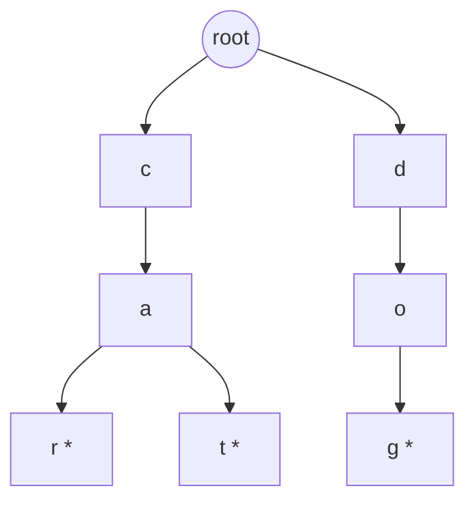
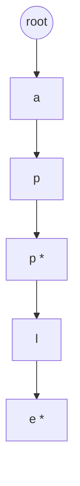
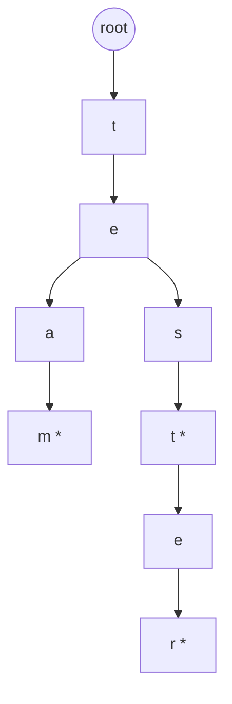
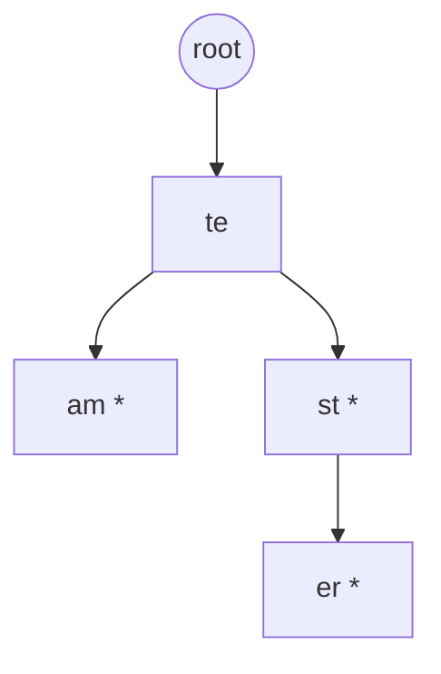
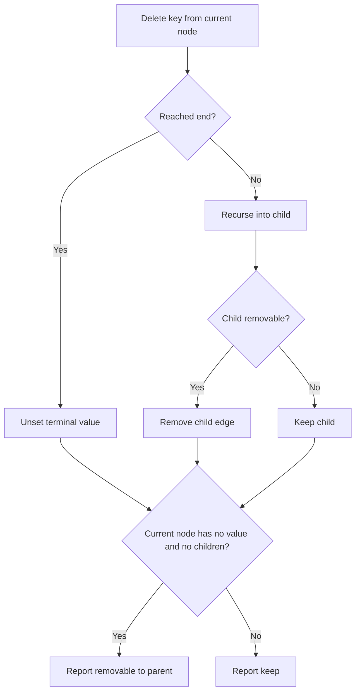
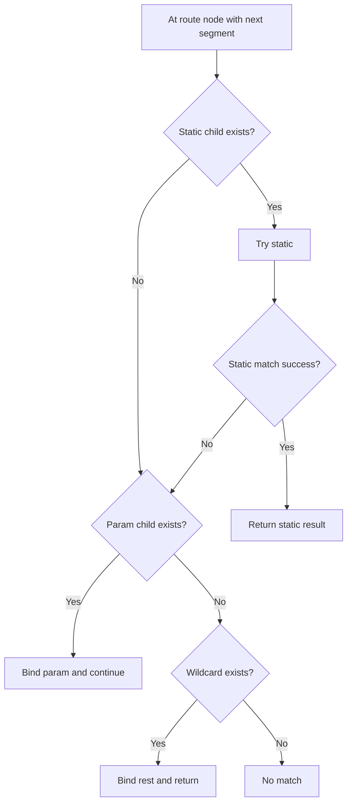
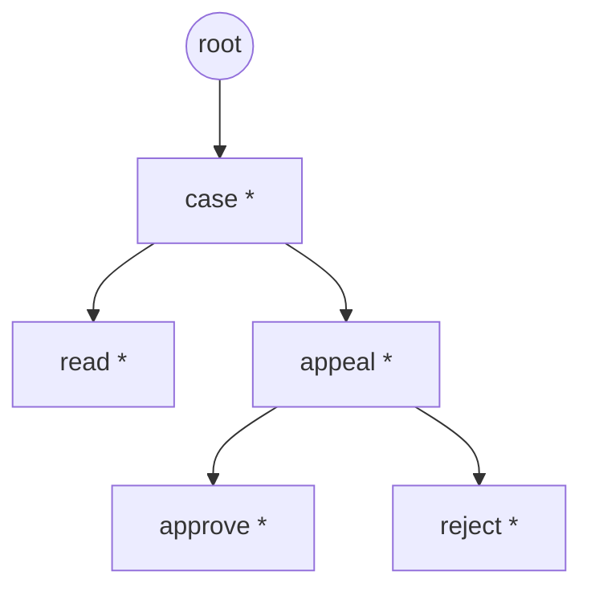
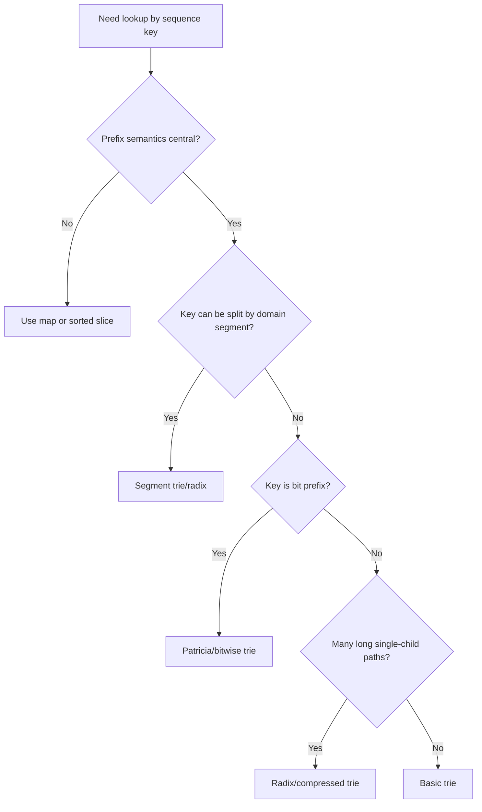

# learn-go-data-structure-algorithm-part-015.md

# Part 015 — Trie, Radix Tree, Patricia Tree, dan Prefix Index

> Seri: `learn-go-data-structure-algorithm`  
> Bagian: `015 / 034`  
> Topik: Trie, radix tree, Patricia tree, prefix index, longest-prefix-match, routing, namespace matching, dan desain struktur data prefix-aware di Go.

---

## 0. Posisi Part Ini dalam Seri

Sampai part sebelumnya, kita sudah membahas beberapa keluarga struktur data:

1. struktur linear: slice, stack, queue, deque;
2. associative: map/hash table;
3. ordering: sort/search;
4. linked structure;
5. heap/priority queue;
6. set/multiset;
7. text/string processing;
8. recursion/backtracking;
9. hashing/fingerprint;
10. binary tree, balanced tree, B-tree/B+tree.

Part ini fokus pada struktur data yang berbeda orientasinya: **prefix**.

Kalau hash map unggul untuk exact lookup:

```go
value, ok := m["/api/v1/users"]
```

maka trie/radix tree unggul ketika pertanyaannya bukan hanya exact match, melainkan:

- apakah ada key dengan prefix tertentu?
- key apa saja di bawah prefix ini?
- prefix terpanjang mana yang cocok dengan input?
- route mana yang cocok dengan path ini?
- permission namespace mana yang berlaku untuk resource ini?
- konfigurasi paling spesifik mana yang harus dipakai?

Contoh pertanyaan prefix-oriented:

```text
Input path: /api/v1/users/123/orders
Rules:
  /api
  /api/v1
  /api/v1/users
  /api/v1/users/:id/orders

Mana rule paling spesifik yang match?
```

Hash map tidak secara natural menjawab pertanyaan seperti itu tanpa membangun banyak variasi key atau melakukan scanning.

Trie dan turunannya memodelkan key sebagai **urutan simbol**.

Simbol bisa berupa:

- byte;
- rune;
- path segment;
- token;
- domain label;
- permission segment;
- bit.

Mental model penting: **trie bukan hanya struktur data string. Trie adalah struktur data untuk sequence key yang bisa dibagi menjadi prefix.**

---

## 1. Masalah yang Diselesaikan oleh Trie

Trie cocok ketika key punya struktur prefix yang meaningful.

Contoh:

| Domain | Key | Prefix Meaningful? | Contoh Query |
|---|---:|---:|---|
| Autocomplete | `application`, `approval`, `appeal` | Ya | semua kata mulai dari `app` |
| HTTP routing | `/cases/{id}/appeals` | Ya | path route matching |
| Permission | `case.appeal.approve` | Ya | permission inherited dari namespace |
| IP routing | bit prefix alamat IP | Ya | longest prefix match |
| Config | `module.case.appeal.timeout` | Ya | config paling spesifik |
| Postal code | `123456` | Kadang | lookup by prefix area |
| Dictionary | word list | Ya | spell-check/prefix search |
| Random UUID | `f47ac10b...` | Tidak terlalu | exact lookup lebih cocok hash map |

Trie tidak otomatis lebih cepat dari `map`.

Trie berguna bila operasi yang dibutuhkan adalah prefix/search-by-structure, bukan exact lookup biasa.

---

## 2. Basic Trie Mental Model

Trie menyimpan key sebagai path dari root ke node.

Misal kita menyimpan kata:

```text
car
cat
dog
```

Representasinya:



Tanda `*` berarti node tersebut menyimpan value atau menandai akhir key.

Important distinction:

- node bisa ada hanya sebagai prefix;
- node bisa menjadi terminal key;
- terminal node bisa punya children.

Contoh:

```text
Key: app
Key: apple
```

Maka node `app` adalah terminal dan juga prefix untuk `apple`.



Jadi invariant pertama:

> Sebuah key ada dalam trie jika path simbolnya dapat diikuti dari root dan node terakhirnya bertanda terminal.

---

## 3. Struktur Node Paling Dasar di Go

Untuk string ASCII/byte-key, implementasi dasar:

```go
type Trie[V any] struct {
    root *node[V]
}

type node[V any] struct {
    children map[byte]*node[V]
    value    V
    hasValue bool
}
```

Insert:

```go
func (t *Trie[V]) Put(key string, value V) {
    if t.root == nil {
        t.root = &node[V]{}
    }

    cur := t.root
    for i := 0; i < len(key); i++ {
        b := key[i]
        if cur.children == nil {
            cur.children = make(map[byte]*node[V])
        }
        next := cur.children[b]
        if next == nil {
            next = &node[V]{}
            cur.children[b] = next
        }
        cur = next
    }

    cur.value = value
    cur.hasValue = true
}
```

Get exact:

```go
func (t *Trie[V]) Get(key string) (V, bool) {
    var zero V
    if t.root == nil {
        return zero, false
    }

    cur := t.root
    for i := 0; i < len(key); i++ {
        if cur.children == nil {
            return zero, false
        }
        cur = cur.children[key[i]]
        if cur == nil {
            return zero, false
        }
    }

    if !cur.hasValue {
        return zero, false
    }
    return cur.value, true
}
```

Contains prefix:

```go
func (t *Trie[V]) HasPrefix(prefix string) bool {
    if t.root == nil {
        return false
    }

    cur := t.root
    for i := 0; i < len(prefix); i++ {
        if cur.children == nil {
            return false
        }
        cur = cur.children[prefix[i]]
        if cur == nil {
            return false
        }
    }
    return true
}
```

Core complexity:

| Operation | Complexity | Notes |
|---|---:|---|
| Exact lookup | O(k) | `k` = length key dalam simbol |
| Insert | O(k) | creates missing nodes |
| Prefix check | O(p) | `p` = length prefix |
| Enumerate under prefix | O(p + output) | must visit subtree |
| Delete | O(k) + cleanup | cleanup may remove dead path |

Bandingkan dengan hash map:

| Operation | Hash Map | Trie |
|---|---:|---:|
| Exact lookup | average O(1) by hash + equality | O(k) |
| Prefix lookup | tidak natural | O(prefix length) |
| Ordered traversal | tidak natural | natural by symbol order if children ordered |
| Longest prefix match | perlu manual scan prefixes | natural |

Trie bukan pengganti map secara umum. Trie adalah index untuk sequence/prefix semantics.

---

## 4. Byte Trie vs Rune Trie vs Segment Trie

Kesalahan desain umum: langsung membuat trie per `rune` atau per `byte` tanpa memahami domain key.

### 4.1 Byte Trie

Byte trie memakai `key[i]`.

Cocok untuk:

- protocol path ASCII;
- route path;
- config keys ASCII;
- permission keys;
- binary keys;
- encoded keys;
- lowercase normalized dictionary.

Kelebihan:

- sederhana;
- cepat;
- tidak decode UTF-8;
- cocok untuk network/server path.

Kekurangan:

- prefix dihitung per byte, bukan karakter manusia;
- Unicode semantics tidak otomatis benar.

### 4.2 Rune Trie

Rune trie memakai:

```go
for _, r := range key {
    // r is rune
}
```

Cocok untuk:

- dictionary Unicode;
- text processing yang sadar code point;
- non-ASCII language.

Kelebihan:

- lebih dekat ke Unicode code point;
- tidak memecah multibyte UTF-8.

Kekurangan:

- lebih mahal;
- `rune` bukan grapheme cluster;
- normalisasi Unicode tetap isu terpisah.

Contoh problem:

```text
é bisa direpresentasikan sebagai:
1. U+00E9
2. e + combining accent
```

Rune trie menganggap dua bentuk itu berbeda kecuali input dinormalisasi.

### 4.3 Segment Trie

Segment trie memakai token sebagai edge.

Contoh HTTP path:

```text
/cases/123/appeals
```

Daripada memecah per byte:

```text
/, c, a, s, e, s, /, 1, 2, 3, /, ...
```

kita bisa memecah per segment:

```text
cases -> 123 -> appeals
```

Cocok untuk:

- HTTP router;
- permission namespace: `case.appeal.approve`;
- config key: `module.case.timeout`;
- domain path hierarchy;
- package/module namespace.

Contoh node:

```go
type SegmentTrie[V any] struct {
    root *segmentNode[V]
}

type segmentNode[V any] struct {
    children map[string]*segmentNode[V]
    value    V
    hasValue bool
}
```

Trade-off:

- key length lebih pendek dalam jumlah simbol;
- setiap symbol berupa string, equality lebih mahal;
- splitting path bisa allocate jika tidak hati-hati;
- lebih domain-readable.

---

## 5. Child Representation: Map, Array, Sorted Slice

Node trie harus menyimpan children.

Pilihan child representation sangat menentukan performa dan memory.

### 5.1 `map[byte]*node`

```go
type node[V any] struct {
    children map[byte]*node[V]
    value    V
    hasValue bool
}
```

Kelebihan:

- fleksibel;
- mudah;
- lookup average O(1);
- cocok untuk sparse children.

Kekurangan:

- overhead map per node besar;
- banyak small allocations;
- GC scanning tinggi;
- iteration order tidak deterministic;
- buruk untuk jutaan node kecil.

Cocok untuk:

- prototyping;
- jumlah key kecil/menengah;
- branching factor tidak diketahui;
- key sparse.

### 5.2 Fixed Array `[256]*node`

```go
type byteNode[V any] struct {
    children [256]*byteNode[V]
    value    V
    hasValue bool
}
```

Kelebihan:

- lookup O(1) direct index;
- no map allocation;
- deterministic;
- cepat untuk dense alphabet.

Kekurangan:

- memory sangat besar per node;
- sebagian besar nil untuk sparse key;
- GC harus scan banyak pointer;
- tidak cocok untuk jutaan sparse node.

Cocok untuk:

- kecil tapi extremely latency-sensitive;
- dense alphabet;
- specialized parser;
- finite automata kecil.

### 5.3 Small Sorted Slice of Edges

```go
type edge[V any] struct {
    label byte
    child *smallNode[V]
}

type smallNode[V any] struct {
    edges    []edge[V]
    value    V
    hasValue bool
}
```

Lookup:

```go
func findEdge[V any](edges []edge[V], label byte) (*smallNode[V], bool) {
    lo, hi := 0, len(edges)
    for lo < hi {
        mid := int(uint(lo+hi) >> 1)
        if edges[mid].label < label {
            lo = mid + 1
        } else {
            hi = mid
        }
    }
    if lo < len(edges) && edges[lo].label == label {
        return edges[lo].child, true
    }
    return nil, false
}
```

Kelebihan:

- compact untuk small branching factor;
- deterministic order;
- cache-friendly dibanding map;
- lebih sedikit overhead per node.

Kekurangan:

- lookup O(log d) atau O(d), `d` = jumlah child;
- insert perlu shifting;
- lebih banyak kode.

Cocok untuk:

- trie besar dengan branching factor kecil;
- ordered traversal;
- read-heavy index;
- radix tree.

### 5.4 Hybrid Representation

Production-grade trie sering memakai hybrid:

```text
0 child       -> nil
1-8 children -> sorted small slice
9+ children  -> map or array-like table
```

Atau:

```text
ASCII fast path -> compact table
Unicode fallback -> map[rune]*node
```

Tujuannya:

- small node tetap compact;
- high fanout node tetap cepat;
- allocation terkendali.

---

## 6. Why Naive Trie Can Be Wasteful

Naive trie membuat satu node per simbol.

Misal key:

```text
/api/v1/users
/api/v1/orders
/api/v1/payments
```

Byte trie menyimpan banyak node untuk `/api/v1/`.

Itu bagus karena prefix dishare.

Tetapi jika key panjang dan prefix sharing rendah:

```text
/user/f47ac10b58cc4372a5670e02b2c3d479
/user/550e8400e29b41d4a716446655440000
/user/6fa459eaee8a3ca4... 
```

Bagian UUID hampir tidak share prefix secara meaningful.

Naive trie akan membuat banyak node.

Masalahnya:

- pointer chasing tinggi;
- banyak allocation;
- memory overhead tinggi;
- GC scan besar;
- cache locality buruk.

Untuk mengatasi ini, kita memakai **radix tree** atau **compressed trie**.

---

## 7. Radix Tree / Compressed Trie

Radix tree mengompresi path yang hanya punya satu cabang.

Naive trie untuk `team`, `tester`, `test`:



Compressed/radix representation:



Edge tidak lagi satu simbol, tetapi string/substring label.

Invariant radix tree:

> Setiap edge memiliki label non-empty. Tidak boleh ada node non-root tanpa value yang hanya punya satu child, karena path seperti itu harus dikompresi.

Radix tree mengurangi:

- jumlah node;
- pointer chasing;
- memory overhead;
- traversal step.

Tetapi menambah kompleksitas:

- edge split;
- prefix comparison;
- substring management;
- mutation correctness.

---

## 8. Radix Tree Insert Mental Model

Misal sudah ada key:

```text
foobar
```

Tree:

```text
root -- "foobar" *
```

Insert key baru:

```text
fooz
```

Longest common prefix dari `foobar` dan `fooz` adalah `foo`.

Kita perlu split edge:

```text
root -- "foo" -- "bar" *
              \
               -- "z" *
```

Kasus umum saat insert ke radix tree:

1. edge label adalah prefix dari remaining key;
2. remaining key adalah prefix dari edge label;
3. edge dan remaining key punya partial common prefix;
4. tidak ada common prefix.

Diagram decision:

```mermaid
flowchart TD
    A[Insert remaining key at node] --> B{Find child edge with same first symbol?}
    B -- No --> C[Add new edge with remaining label as terminal]
    B -- Yes --> D[Compute LCP edgeLabel vs remaining]
    D --> E{LCP length == len(edgeLabel)?}
    E -- Yes --> F[Descend into child with remaining advanced]
    E -- No --> G{LCP length == len(remaining)?}
    G -- Yes --> H[Split edge; new intermediate becomes terminal]
    G -- No --> I[Split edge; add old suffix and new suffix as children]
```

LCP helper:

```go
func commonPrefixLen(a, b string) int {
    n := len(a)
    if len(b) < n {
        n = len(b)
    }
    i := 0
    for i < n && a[i] == b[i] {
        i++
    }
    return i
}
```

Byte-based radix tree uses byte prefix. For UTF-8 text semantics, this may split inside a rune if arbitrary byte matching is used. For HTTP paths and ASCII-like keys, byte semantics are usually correct.

---

## 9. A Minimal Radix Tree Shape in Go

```go
type Radix[V any] struct {
    root radixNode[V]
}

type radixNode[V any] struct {
    edges    []radixEdge[V]
    value    V
    hasValue bool
}

type radixEdge[V any] struct {
    label string
    child *radixNode[V]
}
```

Find edge by first byte:

```go
func (n *radixNode[V]) findEdge(first byte) int {
    for i := range n.edges {
        if n.edges[i].label[0] == first {
            return i
        }
    }
    return -1
}
```

For small branching factor, linear scan is often fine. For larger branching factor, use sorted edges and binary search by first byte.

Exact lookup:

```go
func (r *Radix[V]) Get(key string) (V, bool) {
    var zero V
    cur := &r.root
    rest := key

    for len(rest) > 0 {
        idx := cur.findEdge(rest[0])
        if idx < 0 {
            return zero, false
        }

        e := cur.edges[idx]
        if len(rest) < len(e.label) || rest[:len(e.label)] != e.label {
            return zero, false
        }

        rest = rest[len(e.label):]
        cur = e.child
    }

    if !cur.hasValue {
        return zero, false
    }
    return cur.value, true
}
```

This is intentionally simple. A production implementation would think carefully about:

- avoiding repeated substring retention where relevant;
- edge ordering;
- deletion cleanup;
- immutable snapshots if read-mostly;
- route parameters if used as router;
- allocation behavior during insert.

---

## 10. Longest Prefix Match

Longest prefix match adalah salah satu operasi utama radix/trie.

Pertanyaan:

> Dari semua key yang tersimpan, key terpanjang mana yang menjadi prefix input?

Contoh:

```text
Stored rules:
/api
/api/v1
/api/v1/users

Input:
/api/v1/users/123

Answer:
/api/v1/users
```

Pada trie, traversal dilakukan sepanjang input. Setiap kali melewati terminal node, simpan kandidat terakhir.

Byte trie version:

```go
type Match[V any] struct {
    KeyLen int
    Value  V
}

func (t *Trie[V]) LongestPrefix(input string) (Match[V], bool) {
    var out Match[V]
    found := false

    if t.root == nil {
        return out, false
    }

    cur := t.root
    if cur.hasValue {
        out = Match[V]{KeyLen: 0, Value: cur.value}
        found = true
    }

    for i := 0; i < len(input); i++ {
        if cur.children == nil {
            break
        }
        next := cur.children[input[i]]
        if next == nil {
            break
        }
        cur = next
        if cur.hasValue {
            out = Match[V]{KeyLen: i + 1, Value: cur.value}
            found = true
        }
    }

    return out, found
}
```

Use cases:

- IP routing;
- path-based authorization;
- config specificity;
- route table;
- feature flag override;
- namespace policy resolution.

---

## 11. Prefix Enumeration

Given prefix `app`, return all keys:

```text
app
apple
application
apply
```

Algorithm:

1. traverse to prefix node;
2. DFS/BFS subtree;
3. emit terminal nodes.

Naive implementation:

```go
func (t *Trie[V]) WalkPrefix(prefix string, visit func(key string, value V) bool) {
    if t.root == nil {
        return
    }

    cur := t.root
    for i := 0; i < len(prefix); i++ {
        if cur.children == nil {
            return
        }
        cur = cur.children[prefix[i]]
        if cur == nil {
            return
        }
    }

    buf := []byte(prefix)
    walkNode(cur, buf, visit)
}

func walkNode[V any](n *node[V], buf []byte, visit func(string, V) bool) bool {
    if n.hasValue {
        if !visit(string(buf), n.value) {
            return false
        }
    }

    for b, child := range n.children {
        buf = append(buf, b)
        if !walkNode(child, buf, visit) {
            return false
        }
        buf = buf[:len(buf)-1]
    }
    return true
}
```

Important caveat:

- map iteration order is random-ish/non-deterministic;
- if deterministic output matters, child representation must be ordered or child keys must be sorted before traversal.

For production:

```text
If output order is part of API contract, do not rely on Go map iteration.
```

---

## 12. Delete and Cleanup

Deleting from trie has two parts:

1. unset terminal value;
2. remove dead nodes that no longer lead to any key.

A node is removable if:

- it has no value;
- it has no children.

Recursive delete mental model:



Byte trie delete:

```go
func (t *Trie[V]) Delete(key string) bool {
    if t.root == nil {
        return false
    }
    deleted, _ := deleteNode(t.root, key, 0)
    return deleted
}

func deleteNode[V any](n *node[V], key string, depth int) (deleted bool, removable bool) {
    if depth == len(key) {
        if !n.hasValue {
            return false, false
        }
        var zero V
        n.value = zero
        n.hasValue = false
        return true, len(n.children) == 0
    }

    if n.children == nil {
        return false, false
    }

    b := key[depth]
    child := n.children[b]
    if child == nil {
        return false, false
    }

    deleted, childRemovable := deleteNode(child, key, depth+1)
    if childRemovable {
        delete(n.children, b)
        if len(n.children) == 0 {
            n.children = nil
        }
    }

    return deleted, !n.hasValue && len(n.children) == 0
}
```

Important production note:

- avoid deleting root itself;
- clear stored value to release references;
- consider tombstone semantics if snapshots/concurrent readers exist;
- for radix tree, deletion may require edge merge after removing value/child.

---

## 13. Patricia Tree

Patricia tree usually refers to a compressed trie, often bitwise, where paths with single children are compressed. Historically, Patricia means **Practical Algorithm To Retrieve Information Coded In Alphanumeric**.

In modern engineering conversations, terms can be used loosely:

| Term | Common Meaning |
|---|---|
| Trie | one symbol per edge |
| Compressed trie | compress chains of single-child nodes |
| Radix tree | compressed trie with edge labels of multiple symbols |
| Patricia tree | often compressed binary/radix trie, especially bitwise |

Patricia trees are commonly relevant for:

- IP prefix lookup;
- routing table;
- bit-prefix matching;
- compact key indexing.

Bitwise example for binary keys:

```text
1010*
101100*
111*
```

A Patricia-style structure can branch by bit positions instead of storing every bit node.

For this Go DSA series, the practical distinction:

- use **trie** when clarity matters and key count is moderate;
- use **radix/compressed trie** when many keys share long prefixes or keys are long;
- use **Patricia/bitwise trie** when matching bit prefixes, especially network-like keys.

---

## 14. Prefix Index for HTTP Routing

HTTP routing is one of the most common trie/radix applications in Go ecosystems.

Path:

```text
GET /cases/123/appeals/456
```

Route patterns:

```text
GET /cases
GET /cases/{caseID}
GET /cases/{caseID}/appeals
GET /cases/{caseID}/appeals/{appealID}
```

A route trie often uses segments, not bytes.

Simplified model:

```go
type RouteHandler any

type routeNode struct {
    static   map[string]*routeNode
    param    *routeNode
    paramKey string
    wildcard *routeNode
    handler  RouteHandler
    hasRoute bool
}
```

Matching precedence is important.

Common order:

1. exact static segment;
2. parameter segment;
3. wildcard/catch-all.

Why static first?

```text
Routes:
/users/me
/users/{id}

Input:
/users/me
```

Expected match usually: `/users/me`, not `/users/{id}`.

Route matching diagram:



Production route trie concerns:

- method dimension: separate tree per method or method at terminal node;
- trailing slash policy;
- path normalization;
- URL escaping;
- conflict detection at registration time;
- deterministic precedence;
- parameter allocation;
- panic vs error during route registration;
- immutable tree after startup.

Registration should reject ambiguous routes.

Example ambiguity:

```text
/users/{id}
/users/{name}
```

Structurally identical, different param names. Usually should be rejected or treated as duplicate.

---

## 15. Permission Namespace Trie

Suppose permissions:

```text
case
case.read
case.appeal
case.appeal.approve
case.appeal.reject
```

A segment trie by `.` can represent namespace hierarchy.



Possible semantics:

1. exact permission only;
2. inherited permission;
3. deny overrides allow;
4. most-specific rule wins;
5. all matching prefixes contribute.

This is where data structure meets policy semantics.

The trie does not define authorization rules by itself. It only gives efficient lookup for namespace prefixes.

Example most-specific match:

```text
Rules:
case = allow
case.appeal = deny
case.appeal.approve = allow

Request:
case.appeal.approve

Most-specific result: allow
```

Example all-prefix aggregation:

```text
Matching chain:
case
case.appeal
case.appeal.approve
```

Then policy engine decides how to combine.

Production advice:

```text
Keep trie lookup separate from policy decision semantics.
```

Bad design:

```go
func (t *PermissionTrie) IsAllowed(permission string) bool
```

Better design:

```go
type MatchedRule struct {
    Prefix string
    Rule   Rule
    Depth  int
}

func (t *PermissionTrie) MatchPrefixes(permission string) []MatchedRule
```

Then policy evaluator decides.

---

## 16. Config Prefix Matching

Config systems often need specificity.

Example:

```text
module.default.timeout = 5s
module.case.timeout = 10s
module.case.appeal.timeout = 30s
```

For key:

```text
module.case.appeal.submit.timeout
```

You may want:

- exact key;
- closest ancestor;
- all ancestors;
- fallback default.

A trie supports this naturally.

Pattern:

```go
type ConfigMatch[V any] struct {
    Key   string
    Value V
    Depth int
}
```

Lookup chain:

```text
module
module.case
module.case.appeal
module.case.appeal.submit
module.case.appeal.submit.timeout
```

This is often more transparent than repeatedly trimming strings and doing map lookups.

However, for small config sets, repeated map lookup may be simpler and fast enough.

Rule:

```text
Use trie when prefix matching is a core operation, not just an occasional convenience.
```

---

## 17. Autocomplete and Dictionary Search

Autocomplete needs:

1. traverse to prefix;
2. enumerate candidates;
3. rank/filter candidates;
4. return top N.

Naive trie solves step 1 and 2, not ranking.

Production autocomplete usually needs more metadata:

```go
type Suggestion struct {
    Text  string
    Score int64
}

type suggestNode struct {
    children map[rune]*suggestNode
    terminal bool
    score    int64
    top      []Suggestion // cached top suggestions under subtree
}
```

Optimization:

- store top-K suggestions at each node;
- update top-K during insert/update;
- query prefix returns cached top-K without scanning entire subtree.

Trade-off:

- faster query;
- slower updates;
- more memory;
- harder consistency.

Autocomplete design choices:

| Requirement | Structure |
|---|---|
| small dictionary | trie + DFS |
| large read-only dictionary | compact radix / FST-like structure |
| dynamic ranking | trie + per-node top-K |
| typo tolerance | trie + edit distance search, expensive |
| multilingual | normalized Unicode pipeline |

---

## 18. Memory Model of Trie in Go

Trie can be surprisingly expensive.

Naive node:

```go
type node[V any] struct {
    children map[byte]*node[V]
    value    V
    hasValue bool
}
```

Each node may involve:

- node allocation;
- map header;
- map buckets when children created;
- child node pointers;
- value storage;
- GC scanning.

If you store 1 million strings of average length 20 with low prefix sharing, naive trie can approach tens of millions of nodes.

Memory warning signs:

- many nodes with one child;
- map allocated for nodes with one or two children;
- large pointer graph;
- heavy GC CPU;
- poor cache locality.

Possible mitigations:

1. radix compression;
2. sorted edge slices;
3. arena-like allocation if lifecycle is whole-index;
4. immutable build once and serve many reads;
5. store values separately and use integer IDs;
6. avoid map per node;
7. use compact byte slices for labels;
8. use segment trie to reduce depth.

---

## 19. Value Placement: Store Value Inline or by ID?

Option A: store value inline.

```go
type node[V any] struct {
    children map[byte]*node[V]
    value    V
    hasValue bool
}
```

Good when:

- value is small;
- value has no large pointer graph;
- direct access matters;
- number of entries moderate.

Option B: store value pointer.

```go
type node[V any] struct {
    children map[byte]*node[V]
    value    *V
}
```

Good when:

- distinguish missing vs zero without bool;
- large value should not be copied;
- shared value object.

Bad because:

- extra allocation;
- extra indirection;
- GC scans pointer.

Option C: store integer ID.

```go
type node struct {
    children map[byte]*node
    valueID  int
    hasValue bool
}
```

Values stored separately:

```go
values []Route
```

Good when:

- compact index;
- stable registry;
- cache-friendly values;
- immutable route table;
- serialization-friendly.

Often the best production design for routers/index tables.

---

## 20. Terminal State Design

Need to distinguish:

- node exists as prefix only;
- node stores actual value;
- stored value is zero value.

Do not use zero value as implicit absence unless domain guarantees it.

Bad:

```go
if n.value == "" {
    // absent?
}
```

Better:

```go
type node[V any] struct {
    value    V
    hasValue bool
}
```

Alternative:

```go
type node[V any] struct {
    value *V
}
```

But pointer option changes allocation and lifecycle.

General rule:

```text
Presence should be explicit.
```

---

## 21. Iteration API Design

Trie supports natural prefix walk.

Question: should API return slice or accept callback?

Return slice:

```go
func (t *Trie[V]) KeysWithPrefix(prefix string) []string
```

Pros:

- easy to use;
- simple for tests.

Cons:

- allocates result;
- can explode memory;
- cannot stop early unless extra parameter.

Callback:

```go
func (t *Trie[V]) WalkPrefix(prefix string, visit func(key string, value V) bool)
```

Pros:

- streaming;
- caller can stop early;
- less allocation;
- good for large index.

Cons:

- callback complexity;
- mutation during walk must be specified;
- cannot easily compose without adapter.

Iterator object:

```go
type Iterator[V any] struct { /* stack */ }

func (it *Iterator[V]) Next() bool
func (it *Iterator[V]) Key() string
func (it *Iterator[V]) Value() V
```

Pros:

- explicit state;
- no recursive stack;
- caller controls loop.

Cons:

- more complex implementation;
- key buffer ownership matters.

Production recommendation:

- small libraries: callback is often enough;
- high-performance index: explicit iterator;
- external API: avoid returning unbounded slices unless bounded by limit.

---

## 22. Mutation During Iteration

Trie mutation during traversal is dangerous.

Questions:

- Can caller call `Put` inside `WalkPrefix`?
- Can caller delete current key?
- Are visited results snapshot-consistent?
- Is order deterministic?

Possible policies:

### Policy 1: No mutation during iteration

Document:

```text
The trie must not be mutated while WalkPrefix is executing.
```

Simple and fast.

### Policy 2: Snapshot iteration

Build immutable snapshot or copy matching keys.

Safe but more memory.

### Policy 3: Iterator detects version changes

Store mod count:

```go
type Trie[V any] struct {
    root    *node[V]
    version uint64
}
```

Iterator captures version and panics/errors if changed.

Go standard containers do not universally enforce this like Java fail-fast iterators. In Go, explicit documentation and tests are important.

---

## 23. Concurrency Model

This part does not repeat concurrency series, but trie data structures need a clear concurrency contract.

Options:

### 23.1 Not thread-safe

```text
Trie is not safe for concurrent mutation or concurrent read/write.
```

Caller must lock.

Good for:

- simple library;
- internal structure;
- route table built at startup then read-only.

### 23.2 Mutex protected

```go
type SafeTrie[V any] struct {
    mu sync.RWMutex
    t  Trie[V]
}
```

Good for:

- moderate dynamic updates;
- simple correctness.

### 23.3 Immutable copy-on-write root

Use when:

- many readers;
- rare updates;
- need lock-free reads.

Concept:

```text
writer builds new tree/root -> atomically publishes root -> readers use consistent old/new root
```

This is strong for:

- router table;
- config snapshot;
- policy table;
- feature flags.

Trade-off:

- update cost higher;
- memory retention while readers hold old snapshot;
- requires immutable nodes.

### 23.4 Sharded trie

Useful when key prefix partitions naturally:

```text
first byte/segment -> shard
```

Good for high-write concurrent workloads, but more complex for global prefix traversal.

---

## 24. Exact Lookup vs Prefix Lookup Decision

Do not use trie just because keys are strings.

Decision table:

| Requirement | Better Default |
|---|---|
| Exact lookup by full key | `map[string]V` |
| Prefix existence | trie/radix |
| Longest prefix match | trie/radix/Patricia |
| Ordered prefix enumeration | trie with ordered children / sorted index |
| Range query by lexicographic order | sorted slice / B-tree / ordered tree |
| High write, random keys | map |
| Read-mostly route matching | radix/segment trie |
| Massive static dictionary | compressed trie / FST-like specialized structure |
| IP prefix matching | Patricia/bitwise trie |

The strongest engineering rule:

```text
Choose trie only when prefix semantics are part of the problem, not because the key type is string.
```

---

## 25. Trie vs Sorted Slice

For read-only prefix search, sorted slice may be competitive.

Suppose keys sorted lexicographically:

```go
keys := []string{
    "app",
    "apple",
    "application",
    "banana",
}
```

Prefix search:

1. binary search lower bound for prefix;
2. scan while strings have prefix.

Complexity:

```text
O(log n + output)
```

Trie:

```text
O(prefix length + output subtree)
```

Sorted slice can be better when:

- data is static/read-only;
- memory compactness matters;
- updates rare;
- prefix queries return small contiguous ranges;
- simple implementation is preferred.

Trie can be better when:

- many prefix operations;
- longest prefix match;
- incremental insertion;
- hierarchical semantics;
- route matching with parameters.

---

## 26. Trie vs Hash Map with Prefix Expansion

Sometimes you can simulate longest prefix match with map.

Example input:

```text
/api/v1/users/123/orders
```

Generate prefixes:

```text
/api/v1/users/123/orders
/api/v1/users/123
/api/v1/users
/api/v1
/api
/
```

Lookup each in map.

This may be perfectly fine if:

- delimiter-based prefixes;
- number of segments small;
- exact prefix candidates easy to generate;
- key count moderate;
- no prefix enumeration needed.

For route/config namespace, this pattern is often simpler than trie.

But it becomes awkward if:

- prefixes are arbitrary byte positions;
- need enumerate descendants;
- need wildcard/param matching;
- need efficient autocomplete;
- need IP-like bit prefix.

Production decision:

```text
Prefer simpler map prefix-generation if prefix depth is small and semantics are delimiter-based.
Use trie/radix when prefix matching is central, large-scale, or structurally richer.
```

---

## 27. Wildcards and Parameters

Plain trie matches literal symbols.

Routing/policy often needs:

```text
/users/{id}
/files/*path
/cases/{caseID}/appeals/{appealID}
```

This is no longer ordinary trie lookup. It is trie lookup plus pattern semantics.

Node may contain:

```go
type routeNode struct {
    static   map[string]*routeNode
    param    *routeNode
    wildcard *routeNode
    route    *Route
}
```

Conflict rules are crucial.

Potential conflict:

```text
/files/{name}
/files/*path
```

Potential ambiguity:

```text
/users/{id}
/users/{username}
```

Production router should validate these at registration time.

Do not defer ambiguity to request time.

---

## 28. Case Study 1: Longest Prefix Config Resolver

Requirement:

- config rules stored by dot-separated namespace;
- query returns most specific rule;
- small-to-medium dynamic set;
- deterministic behavior.

Example:

```text
service.timeout = 5s
service.case.timeout = 10s
service.case.appeal.timeout = 30s
```

Implementation could use map prefix-generation:

```go
func Resolve[V any](m map[string]V, key string) (V, bool) {
    for {
        if v, ok := m[key]; ok {
            return v, true
        }
        i := strings.LastIndexByte(key, '.')
        if i < 0 {
            break
        }
        key = key[:i]
    }
    var zero V
    return zero, false
}
```

This is often better than trie if depth is small.

When trie becomes better:

- need list all children under namespace;
- need validate namespace tree;
- need aggregate all matching ancestors;
- need large number of repeated lookups;
- need per-node metadata.

Lesson:

```text
Do not force trie when simple prefix generation is sufficient.
```

---

## 29. Case Study 2: Permission Prefix Index

Requirement:

- permissions are hierarchical;
- exact and inherited rules exist;
- evaluator needs all matching prefixes;
- deny/allow semantics handled separately.

Trie lookup should return rule chain:

```go
type RuleMatch[R any] struct {
    Prefix string
    Rule   R
    Depth  int
}
```

Pseudo API:

```go
func (t *PermissionTrie[R]) Match(permission string) []RuleMatch[R]
```

For permission:

```text
case.appeal.approve
```

Return:

```text
case
case.appeal
case.appeal.approve
```

Then evaluator:

```go
func Evaluate(matches []RuleMatch[Rule]) Decision
```

This separation is important because:

- trie is indexing structure;
- authorization is policy semantics;
- mixing them makes auditing harder;
- future rule changes become dangerous.

---

## 30. Case Study 3: HTTP Route Table

Requirement:

- routes registered at startup;
- request matching read-only and high frequency;
- static routes have priority over param;
- wildcard supported;
- route conflicts rejected.

Recommended structure:

- one tree per method;
- segment-based radix/trie;
- immutable after build;
- terminal stores route ID;
- route metadata stored in dense slice.

Shape:

```go
type Router struct {
    methods map[string]*routeNode
    routes  []Route
}

type routeNode struct {
    static   []routeEdge // sorted by segment
    param    *routeNode
    paramKey string
    wildcard *routeNode
    routeID  int
    hasRoute bool
}

type routeEdge struct {
    segment string
    child   *routeNode
}
```

Why store `routeID` not handler inline?

- compact node;
- dense route metadata;
- easier debug/introspection;
- easier generated router table;
- easier immutable publishing.

Failure modes:

- ambiguous routes;
- path normalization mismatch;
- duplicate params;
- greedy wildcard hiding specific route;
- allocation per request for params;
- wrong trailing slash behavior;
- route registration after serving.

---

## 31. Case Study 4: Postal Code Prefix Lookup

Postal code example:

```text
123000 -> Region A
123400 -> Region B
123456 -> Building X
```

Queries:

- exact code lookup;
- prefix region lookup;
- longest matching prefix.

If postal code is fixed length and exact lookup is primary:

```go
map[string]AddressInfo
```

If hierarchical prefix matters:

```text
12 -> province
123 -> city
1234 -> district
123456 -> building
```

Trie/radix can model it.

But be careful:

- numeric-looking codes should often remain strings;
- leading zero matters;
- prefix semantics depend on country/domain;
- do not assume all postal systems are hierarchical.

---

## 32. Unicode and Normalization Caveat

For human language trie, correctness is harder.

Issues:

- Unicode normalization;
- case folding;
- locale-specific behavior;
- grapheme cluster;
- diacritics;
- emoji sequences;
- combined characters.

Example:

```text
Cafe01
Café
```

They can look the same but encode differently.

A trie does not solve normalization.

Pipeline should be:

```text
raw input -> normalize -> case fold -> tokenize -> index/search
```

The exact normalization package choice may be outside standard library. The important engineering point:

```text
The trie should receive canonical keys. Do not bury normalization inconsistently inside trie operations.
```

---

## 33. Testing Trie Correctness

Test categories:

### 33.1 Empty Trie

- get missing;
- delete missing;
- prefix walk missing;
- longest prefix no match.

### 33.2 Single Key

- exact get;
- prefix exists;
- delete;
- reinsert;
- zero value value.

### 33.3 Shared Prefix

Keys:

```text
app
apple
application
apply
```

Test:

- all exact gets;
- prefix enumeration;
- delete `app` should not delete `apple`;
- delete `apple` should not delete `app`.

### 33.4 Prefix Key and Longer Key

```text
/a
/a/b
/a/b/c
```

Test longest prefix for:

```text
/a/b/c/d
```

### 33.5 Non-existing Branch

```text
stored: abc
query: abd
```

### 33.6 Radix Split Cases

Insert order permutations:

```text
foobar
fooz
foo
f
bar
```

Order should not affect final lookup correctness.

### 33.7 Differential Testing

Compare exact lookup against `map[string]V`.

For random sequence:

- put;
- delete;
- get;
- compare with map.

For prefix enumeration, compare with brute-force scan over map.

Pseudo:

```go
func brutePrefix(m map[string]int, prefix string) map[string]int {
    out := make(map[string]int)
    for k, v := range m {
        if strings.HasPrefix(k, prefix) {
            out[k] = v
        }
    }
    return out
}
```

---

## 34. Benchmarking Trie

Benchmark against alternatives, not in isolation.

Compare:

1. map exact lookup;
2. trie exact lookup;
3. radix exact lookup;
4. sorted slice + binary search;
5. map prefix-generation;
6. brute-force scan if dataset small.

Datasets:

| Dataset | Why |
|---|---|
| shared prefix path keys | favorable to trie |
| random UUID-like strings | unfavorable to trie |
| route patterns | realistic for router |
| permission namespaces | segment trie case |
| large dictionary | autocomplete case |
| Zipf query distribution | hot prefixes |

Measure:

- ns/op;
- B/op;
- allocs/op;
- build time;
- memory retained;
- p95/p99 if concurrent service;
- GC impact for large index.

Do not benchmark only happy path.

Benchmark:

- exact hit;
- exact miss;
- prefix hit small output;
- prefix hit large output;
- prefix miss early;
- prefix miss late;
- longest prefix match;
- update/delete if dynamic.

---

## 35. Common Anti-Patterns

### 35.1 Using Trie for Exact Lookup Only

Bad:

```text
Need: exact user ID lookup
Chosen: trie
```

Use map.

### 35.2 Map per Node for Huge Sparse Trie

Naive map children can explode memory.

Use radix/sorted edges/hybrid.

### 35.3 Ignoring Output Cost

Prefix search is not just O(prefix length).

It is:

```text
O(prefix length + number of returned items + traversal overhead)
```

If prefix is broad, output dominates.

### 35.4 Mixing Policy Semantics into Trie

Bad:

```go
func IsAllowed(permission string) bool
```

Better:

```go
func MatchPrefixes(permission string) []Rule
func Evaluate(rules []Rule) Decision
```

### 35.5 Unicode Assumptions

Byte trie over human text may be wrong unless normalized semantics are explicit.

### 35.6 Mutable Route Table During Serving

Route table should usually be immutable after startup or published via safe snapshot.

### 35.7 Returning Unbounded Result Slice

Autocomplete/prefix enumeration can return enormous output.

Add:

- limit;
- callback;
- iterator;
- pagination/cursor.

### 35.8 Non-deterministic Traversal Exposed as API

If output order matters, do not traverse map children directly.

---

## 36. Design Checklist

Before implementing trie/radix tree, answer:

### 36.1 Key Semantics

- Are keys bytes, runes, segments, bits, or tokens?
- Is prefix semantics meaningful?
- Is normalization required?
- Is matching exact, prefix, longest-prefix, wildcard, or enumeration?

### 36.2 Workload

- Read-heavy or write-heavy?
- Static or dynamic?
- Expected number of keys?
- Average key length?
- Prefix sharing level?
- Output size for prefix queries?

### 36.3 Representation

- Naive trie or radix tree?
- Child map, array, sorted slice, or hybrid?
- Store value inline, pointer, or ID?
- Need deterministic order?
- Need deletion cleanup?

### 36.4 API

- Exact `Get`?
- `Put`?
- `Delete`?
- `LongestPrefix`?
- `WalkPrefix`?
- Iterator?
- Limit parameter?
- Mutation during walk allowed?

### 36.5 Correctness

- Terminal node explicit?
- Prefix key and longer key both supported?
- Delete does not remove shared prefix?
- Radix split cases tested?
- Conflict detection for wildcard/param?

### 36.6 Production

- Memory bounded?
- Build time acceptable?
- GC impact measured?
- Thread-safety contract documented?
- Snapshot/immutability needed?
- Benchmarked against map/sorted slice alternatives?

---

## 37. Summary Mental Model

Trie family structures are about **shared prefix paths**.

Use them when the problem asks:

- what starts with this prefix?
- what is the longest rule that prefixes this input?
- what path pattern matches this sequence?
- what namespace ancestors apply?
- what keys live under this hierarchy?

Do not use them just because the key is a string.

Core hierarchy:



Most production-grade implementations are not naive tries. They are some combination of:

- radix compression;
- segment-aware matching;
- compact child representation;
- explicit terminal state;
- immutable read path;
- deterministic conflict rules;
- benchmarked alternatives.

---

## 38. What You Should Be Able to Do After This Part

After this part, you should be able to:

1. explain when trie is better than map;
2. implement a basic generic trie in Go;
3. understand why naive trie can waste memory;
4. explain radix tree compression;
5. implement longest prefix match;
6. design prefix enumeration API safely;
7. choose byte/rune/segment/bit key representation;
8. reason about HTTP router trie precedence;
9. separate trie lookup from permission policy semantics;
10. benchmark trie against map and sorted slice alternatives;
11. identify production risks around memory, Unicode, mutation, and ordering.

---

## 39. Bridge to the Next Part

Part 015 focused on hierarchical/prefix-based sequence indexing.

Next part moves to a more general modelling structure:

```text
Part 016 — Graph Fundamentals: Representation, Traversal, dan Modelling
```

Graph is the natural structure when relationships are not simply prefix/parent-child, but arbitrary connections:

- workflow transitions;
- service dependencies;
- permission inheritance;
- escalation paths;
- deployment ordering;
- case lifecycle modelling;
- impact analysis.

Trie is about **shared prefix path**.

Graph is about **arbitrary relation topology**.


<!-- NAVIGATION_FOOTER -->
<div class="page-nav">
<a href="./learn-go-data-structure-algorithm-part-014.md">⬅️ Part 014 — B-Tree, B+Tree, Page-Oriented Structure, dan Storage-Aware Index</a>
<a href="./index.md">📚 Kategori</a>
<a href="../../index.md">🏠 Home</a>
<a href="./learn-go-data-structure-algorithm-part-016.md">Part 016 — Graph Fundamentals: Representation, Traversal, dan Modelling ➡️</a>
</div>
