# learn-go-data-structure-algorithm-part-016.md

# Part 016 — Graph Fundamentals: Representation, Traversal, dan Modelling

> Seri: `learn-go-data-structure-algorithm`  
> Bagian: `016 / 034`  
> Topik: graph fundamentals, graph modelling, adjacency list, adjacency matrix, edge list, BFS, DFS, connected component, cycle detection dasar, topological intuition, dan desain graph di Go untuk sistem production.

---

## 0. Posisi Part Ini dalam Seri

Sampai part sebelumnya, kita sudah membangun fondasi struktur data dari yang paling lokal sampai yang mulai memiliki struktur hierarkis:

1. slice, array, stack, queue, deque;
2. map/hash table dan set;
3. sorting/searching;
4. linked list dan heap;
5. text algorithms;
6. hashing/equality;
7. tree, balanced tree, B-tree/B+tree;
8. trie/radix/prefix index.

Part ini mulai masuk ke keluarga struktur data yang lebih umum: **graph**.

Graph adalah struktur data untuk memodelkan **entity + relationship**.

Tree sebenarnya adalah graph dengan constraint ketat:

- biasanya connected;
- tidak punya cycle;
- ada root;
- setiap node non-root punya tepat satu parent.

Graph melepas constraint itu.

Dengan graph, satu node bisa punya banyak parent, banyak child, relasi dua arah, relasi berbobot, cycle, disconnected component, dan dependensi kompleks.

Di sistem backend production, graph sering muncul bahkan ketika code tidak menyebut kata `Graph` sama sekali.

Contoh:

| Domain | Node | Edge |
|---|---|---|
| dependency build | package/module | depends-on |
| microservice | service | calls-service |
| workflow | state | transition-to |
| authorization | role/permission/resource | inherits/grants/contains |
| regulatory case | case/event/action | affects/blocks/escalates |
| deployment | resource | must-create-before |
| cache invalidation | object | invalidates |
| organization | user/unit/team | reports-to/member-of |
| task scheduling | job | prerequisite-of |

Graph adalah alat berpikir yang sangat penting untuk engineer senior karena banyak failure production bukan disebabkan oleh satu komponen, tapi oleh **relasi antar komponen**.

Part ini belum membahas algoritma graph advanced secara penuh. Itu akan masuk Part 017.

Part ini fokus pada:

- apa itu graph;
- bagaimana memilih representasi graph di Go;
- bagaimana menulis traversal aman dan jelas;
- bagaimana memodelkan domain sebagai graph tanpa kehilangan invariant;
- bagaimana menghindari jebakan modelling;
- bagaimana menyiapkan mental model untuk algoritma graph production.

---

## 1. Graph sebagai Mental Model

Graph terdiri dari:

- **vertex/node**: entity;
- **edge/link/arc**: relationship antar entity.

Secara formal:

```text
G = (V, E)

V = set of vertices
E = set of edges
```

Untuk directed graph:

```text
E subset of V x V
```

Artinya edge adalah pasangan berurutan `(from, to)`.

Untuk undirected graph:

```text
E subset of unordered pairs of V
```

Artinya edge `{a, b}` tidak punya arah.

Dalam production system, bagian tersulit bukan menulis BFS/DFS. Bagian tersulit adalah menjawab:

> “Apa sebenarnya node-nya, apa sebenarnya edge-nya, dan invariant apa yang harus selalu benar?”

Contoh buruk:

```text
Node = semua hal
Edge = semua relasi
```

Ini terlalu kabur.

Contoh lebih baik:

```text
Node = workflow state
Edge = allowed transition from state A to state B under event E
```

Atau:

```text
Node = service name
Edge = runtime synchronous call from service A to service B
```

Atau:

```text
Node = permission subject/object namespace
Edge = inheritance or containment relation
```

Graph yang baik harus punya **semantic contract**.

---

## 2. Directed vs Undirected Graph

### 2.1 Undirected Graph

Undirected graph berarti relasi simetris.

Jika ada edge `A -- B`, maka `A` connected ke `B` dan `B` connected ke `A`.

Contoh:

- friendship relation;
- network cable between routers;
- undirected similarity graph;
- mutual compatibility;
- geographic adjacency.

Mermaid:

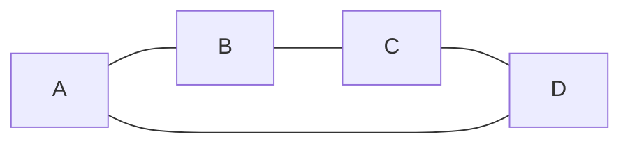

Jika kita simpan undirected graph sebagai adjacency list, biasanya edge dimasukkan dua kali:

```text
A -> B
B -> A
```

In Go:

```go
graph[a] = append(graph[a], b)
graph[b] = append(graph[b], a)
```

Invariant yang perlu dijaga:

> Untuk setiap edge `(u, v)`, adjacency `u` memuat `v` dan adjacency `v` memuat `u`.

Kalau invariant ini rusak, traversal bisa memberi hasil salah.

### 2.2 Directed Graph

Directed graph berarti relasi punya arah.

Jika ada edge `A -> B`, tidak berarti `B -> A`.

Contoh:

- service A calls service B;
- task A must finish before task B;
- role A inherits role B;
- state Draft transitions to Submitted;
- package A imports package B;
- event X triggers process Y.

Mermaid:

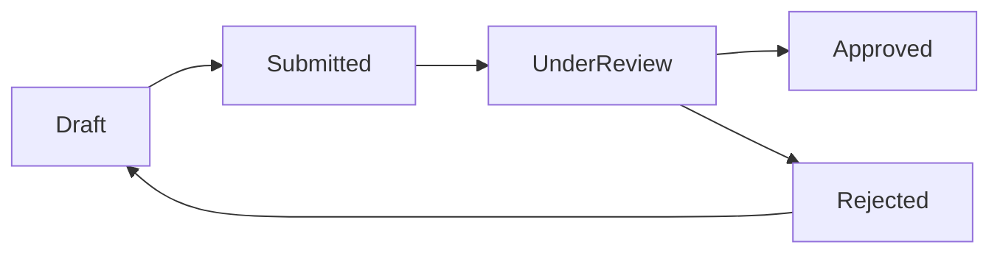

Directed graph lebih sering muncul di backend architecture karena banyak relasi production tidak simetris.

`Service A calls B` tidak sama dengan `B calls A`.

`State A can transition to B` tidak berarti `B can transition to A`.

`Role Admin inherits Staff` tidak berarti `Staff inherits Admin`.

---

## 3. Weighted vs Unweighted Graph

### 3.1 Unweighted Graph

Unweighted graph berarti setiap edge dianggap punya cost sama.

Pertanyaan umum:

- apakah node reachable?
- berapa jumlah edge minimum dari A ke B?
- component mana yang connected?
- apakah ada cycle?

BFS sangat cocok untuk shortest path pada unweighted graph.

### 3.2 Weighted Graph

Weighted graph memberi nilai pada edge.

Contoh:

| Domain | Edge Weight |
|---|---|
| road network | distance/time |
| service call graph | latency/error rate |
| job scheduling | cost/duration |
| data pipeline | processing time |
| authorization | risk score |
| workflow escalation | SLA hours |

Representasi edge:

```go
type Edge struct {
    To     int
    Weight int64
}
```

Atau generic:

```go
type WeightedEdge[N comparable, W any] struct {
    To     N
    Weight W
}
```

Weighted graph membuka algoritma seperti:

- Dijkstra;
- Bellman-Ford;
- Floyd-Warshall;
- minimum spanning tree;
- shortest/cheapest path;
- max flow.

Part ini hanya memperkenalkan representasinya. Algoritma weighted lebih lengkap masuk Part 017.

---

## 4. Sparse vs Dense Graph

Ini salah satu decision paling penting sebelum memilih representasi.

Misal:

```text
n = jumlah node
m = jumlah edge
```

Graph disebut **sparse** jika edge jauh lebih sedikit dari jumlah maksimum edge.

Untuk directed graph tanpa self-loop, maksimum edge sekitar:

```text
n * (n - 1)
```

Untuk undirected graph tanpa self-loop:

```text
n * (n - 1) / 2
```

### 4.1 Sparse Graph

Contoh sparse:

```text
1.000.000 node
3.000.000 edge
```

Setiap node rata-rata hanya punya beberapa neighbor.

Cocok memakai adjacency list.

### 4.2 Dense Graph

Contoh dense:

```text
10.000 node
hampir setiap node berhubungan dengan node lain
```

Cocok memakai adjacency matrix jika operasi `hasEdge(u, v)` sangat sering dan memory masih masuk.

### 4.3 Trade-off

| Representasi | Space | Iterate Neighbors | Has Edge | Cocok Untuk |
|---|---:|---:|---:|---|
| adjacency list | O(n + m) | O(deg(v)) | O(deg(v)) atau O(1) jika set | sparse graph |
| adjacency matrix | O(n²) | O(n) | O(1) | dense graph, small fixed graph |
| edge list | O(m) | O(m) | O(m) | ingestion, sorting edges, MST |

Production rule:

> Jangan pilih adjacency matrix hanya karena mudah dipahami. Untuk graph besar, `n²` bisa menghancurkan memory.

Jika `n = 1.000.000`, maka `n² = 10¹²` cell.

Bahkan jika tiap cell hanya 1 byte, itu sekitar 1 TB.

---

## 5. Representasi Graph di Go

Ada beberapa representasi utama:

1. adjacency list dengan slice;
2. adjacency list dengan map;
3. adjacency set;
4. adjacency matrix;
5. edge list;
6. compressed representation.

Kita bahas satu per satu.

---

## 6. Adjacency List dengan Node ID Integer

Ini bentuk paling umum untuk graph besar dan performan.

```go
type Graph struct {
    adj [][]int
}
```

`adj[u]` berisi semua neighbor dari node `u`.

Contoh:

```go
g := Graph{
    adj: [][]int{
        0: {1, 2},
        1: {3},
        2: {3},
        3: {},
    },
}
```

Graph:

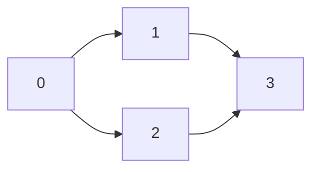

Di Go, literal dengan index seperti itu valid jika semua elemen bertipe sesuai.

Namun untuk materi reusable, lebih baik pakai constructor.

```go
type IntGraph struct {
    adj [][]int
}

func NewIntGraph(n int) *IntGraph {
    if n < 0 {
        panic("negative node count")
    }
    return &IntGraph{adj: make([][]int, n)}
}

func (g *IntGraph) Len() int {
    return len(g.adj)
}

func (g *IntGraph) AddDirectedEdge(from, to int) {
    g.checkNode(from)
    g.checkNode(to)
    g.adj[from] = append(g.adj[from], to)
}

func (g *IntGraph) AddUndirectedEdge(a, b int) {
    g.AddDirectedEdge(a, b)
    g.AddDirectedEdge(b, a)
}

func (g *IntGraph) Neighbors(node int) []int {
    g.checkNode(node)
    return g.adj[node]
}

func (g *IntGraph) checkNode(node int) {
    if node < 0 || node >= len(g.adj) {
        panic("node out of range")
    }
}
```

### 6.1 API Aliasing Warning

`Neighbors` mengembalikan slice internal.

```go
func (g *IntGraph) Neighbors(node int) []int {
    g.checkNode(node)
    return g.adj[node]
}
```

Ini cepat, tetapi caller bisa melakukan mutation:

```go
neighbors := g.Neighbors(0)
neighbors[0] = 999 // merusak graph
```

Pilihan desain:

#### Option A — Return Internal View

```go
func (g *IntGraph) Neighbors(node int) []int {
    g.checkNode(node)
    return g.adj[node]
}
```

Kelebihan:

- cepat;
- no allocation;
- cocok untuk internal package.

Kekurangan:

- caller bisa mutate;
- invariant bisa rusak.

#### Option B — Return Copy

```go
func (g *IntGraph) NeighborsCopy(node int) []int {
    g.checkNode(node)
    out := make([]int, len(g.adj[node]))
    copy(out, g.adj[node])
    return out
}
```

Kelebihan:

- aman;
- public API lebih defensible.

Kekurangan:

- allocation;
- copy cost.

#### Option C — Iterator Callback

```go
func (g *IntGraph) ForEachNeighbor(node int, fn func(to int) bool) {
    g.checkNode(node)
    for _, to := range g.adj[node] {
        if !fn(to) {
            return
        }
    }
}
```

Kelebihan:

- no allocation;
- tidak expose mutable slice;
- bisa early stop.

Kekurangan:

- callback overhead;
- lebih verbose;
- tidak selalu inline sesuai kasus.

Production recommendation:

- untuk internal algorithm package: return view boleh, dokumentasikan read-only;
- untuk public library: gunakan callback atau copy;
- untuk high-performance critical path: gunakan view + invariant test + package boundary ketat.

---

## 7. Adjacency List dengan Generic Node Key

Tidak semua domain punya node integer.

Kadang node adalah string:

```text
"application-service"
"case-service"
"notification-service"
```

Atau composite key:

```go
type StateID string
type RoleID string
type ServiceName string
```

Representasi generic:

```go
type Graph[N comparable] struct {
    adj map[N][]N
}

func NewGraph[N comparable]() *Graph[N] {
    return &Graph[N]{adj: make(map[N][]N)}
}

func (g *Graph[N]) AddNode(n N) {
    if _, ok := g.adj[n]; !ok {
        g.adj[n] = nil
    }
}

func (g *Graph[N]) AddDirectedEdge(from, to N) {
    g.AddNode(from)
    g.AddNode(to)
    g.adj[from] = append(g.adj[from], to)
}

func (g *Graph[N]) Neighbors(n N) []N {
    return g.adj[n]
}
```

Contoh penggunaan:

```go
type Service string

const (
    API      Service = "api"
    Case     Service = "case"
    Document Service = "document"
    Email    Service = "email"
)

func ExampleServiceGraph() {
    g := NewGraph[Service]()
    g.AddDirectedEdge(API, Case)
    g.AddDirectedEdge(Case, Document)
    g.AddDirectedEdge(Case, Email)
}
```

### 7.1 Trade-off Map-Based Graph

Kelebihan:

- domain-friendly;
- node tidak perlu dipetakan ke integer manual;
- cocok untuk graph kecil/menengah;
- API lebih ekspresif.

Kekurangan:

- overhead map lookup;
- key copy/hash cost;
- memory lebih besar;
- traversal kurang cache-friendly dibanding `[][]int`.

Production pattern:

> Gunakan domain key di boundary, tetapi untuk algoritma berat, compile graph menjadi integer-indexed representation.

Contoh pipeline:

```mermaid
flowchart LR
    A[Domain Nodes: service names / state IDs] --> B[Interning / ID Assignment]
    B --> C[Integer Node IDs]
    C --> D[[][]int adjacency]
    D --> E[Run BFS / DFS / SCC / Toposort]
    E --> F[Map result back to domain nodes]
```

---

## 8. Node Interning: Domain Key ke Integer ID

Untuk graph besar, integer ID sangat membantu.

Kita bisa membuat interner:

```go
type Interner[K comparable] struct {
    ids  map[K]int
    keys []K
}

func NewInterner[K comparable]() *Interner[K] {
    return &Interner[K]{ids: make(map[K]int)}
}

func (in *Interner[K]) ID(key K) int {
    if id, ok := in.ids[key]; ok {
        return id
    }
    id := len(in.keys)
    in.ids[key] = id
    in.keys = append(in.keys, key)
    return id
}

func (in *Interner[K]) Key(id int) K {
    if id < 0 || id >= len(in.keys) {
        panic("id out of range")
    }
    return in.keys[id]
}

func (in *Interner[K]) Len() int {
    return len(in.keys)
}
```

Lalu graph builder:

```go
type GraphBuilder[K comparable] struct {
    interner *Interner[K]
    edges    [][2]int
}

func NewGraphBuilder[K comparable]() *GraphBuilder[K] {
    return &GraphBuilder[K]{interner: NewInterner[K]()}
}

func (b *GraphBuilder[K]) AddDirectedEdge(from, to K) {
    u := b.interner.ID(from)
    v := b.interner.ID(to)
    b.edges = append(b.edges, [2]int{u, v})
}

func (b *GraphBuilder[K]) Build() (*IntGraph, *Interner[K]) {
    g := NewIntGraph(b.interner.Len())
    for _, e := range b.edges {
        g.AddDirectedEdge(e[0], e[1])
    }
    return g, b.interner
}
```

Ini pattern yang sangat kuat untuk sistem production:

- domain tetap readable;
- algoritma tetap cepat;
- result bisa dikembalikan ke domain key.

---

## 9. Adjacency Set

Adjacency list `map[N][]N` tidak mencegah duplicate edge.

```go
g.AddDirectedEdge("A", "B")
g.AddDirectedEdge("A", "B")
```

Maka neighbor `A` punya `B` dua kali.

Duplicate edge bisa valid atau invalid tergantung domain.

### 9.1 Jika Duplicate Edge Valid

Contoh valid:

- multigraph;
- dua event berbeda menghasilkan edge sama;
- edge punya identity sendiri;
- parallel relationship.

Maka simpan edge sebagai object.

```go
type Edge struct {
    From string
    To   string
    Kind string
    ID   string
}
```

### 9.2 Jika Duplicate Edge Tidak Valid

Gunakan set:

```go
type SetGraph[N comparable] struct {
    adj map[N]map[N]struct{}
}

func NewSetGraph[N comparable]() *SetGraph[N] {
    return &SetGraph[N]{adj: make(map[N]map[N]struct{})}
}

func (g *SetGraph[N]) AddNode(n N) {
    if _, ok := g.adj[n]; !ok {
        g.adj[n] = make(map[N]struct{})
    }
}

func (g *SetGraph[N]) AddDirectedEdge(from, to N) {
    g.AddNode(from)
    g.AddNode(to)
    g.adj[from][to] = struct{}{}
}

func (g *SetGraph[N]) HasEdge(from, to N) bool {
    neighbors, ok := g.adj[from]
    if !ok {
        return false
    }
    _, ok = neighbors[to]
    return ok
}
```

Trade-off:

| Representation | Duplicate Prevention | Iterate Cost | HasEdge | Memory |
|---|---:|---:|---:|---:|
| `map[N][]N` | no | good | O(deg) | lower |
| `map[N]map[N]struct{}` | yes | okay | expected O(1) | higher |
| sorted slice neighbors | yes if normalized | good | O(log deg) | lower than map-set |

Production rule:

> Jika graph dibangun sekali lalu banyak dibaca, pertimbangkan build dengan set lalu freeze menjadi sorted adjacency slice.

---

## 10. Build-Time Dedup lalu Freeze

Pattern:

1. ingest edge ke set untuk dedup;
2. convert ke sorted slice untuk traversal cepat dan deterministic;
3. expose immutable graph.

```go
type FrozenGraph[N comparable] struct {
    adj map[N][]N
}

type DedupBuilder[N comparable] struct {
    adj map[N]map[N]struct{}
    less func(a, b N) bool
}

func NewDedupBuilder[N comparable](less func(a, b N) bool) *DedupBuilder[N] {
    return &DedupBuilder[N]{
        adj:  make(map[N]map[N]struct{}),
        less: less,
    }
}

func (b *DedupBuilder[N]) AddNode(n N) {
    if _, ok := b.adj[n]; !ok {
        b.adj[n] = make(map[N]struct{})
    }
}

func (b *DedupBuilder[N]) AddDirectedEdge(from, to N) {
    b.AddNode(from)
    b.AddNode(to)
    b.adj[from][to] = struct{}{}
}

func (b *DedupBuilder[N]) Build() FrozenGraph[N] {
    out := make(map[N][]N, len(b.adj))
    for from, set := range b.adj {
        ns := make([]N, 0, len(set))
        for to := range set {
            ns = append(ns, to)
        }
        if b.less != nil {
            // A small local insertion sort avoids importing slices in this minimal snippet.
            // In production, prefer slices.SortFunc for ordered comparator logic.
            for i := 1; i < len(ns); i++ {
                x := ns[i]
                j := i - 1
                for j >= 0 && b.less(x, ns[j]) {
                    ns[j+1] = ns[j]
                    j--
                }
                ns[j+1] = x
            }
        }
        out[from] = ns
    }
    return FrozenGraph[N]{adj: out}
}
```

Note:

Untuk real code di Go modern, gunakan `slices.SortFunc` ketika comparator dibutuhkan. Package `slices` menyediakan fungsi generic untuk operasi slice seperti binary search dan sorting, sementara package `cmp` menyediakan helper comparison untuk ordered values. Dokumentasi resmi package `slices` dan `cmp` ada di standard library Go.  
Referensi: Go standard library dan `slices`/`cmp`. citeturn119937search1turn119937search5

---

## 11. Adjacency Matrix

Adjacency matrix memakai matrix `n x n`.

```text
matrix[u][v] = true jika edge u -> v ada
```

Implementation sederhana:

```go
type MatrixGraph struct {
    n int
    m [][]bool
}

func NewMatrixGraph(n int) *MatrixGraph {
    m := make([][]bool, n)
    for i := range m {
        m[i] = make([]bool, n)
    }
    return &MatrixGraph{n: n, m: m}
}

func (g *MatrixGraph) AddDirectedEdge(from, to int) {
    g.checkNode(from)
    g.checkNode(to)
    g.m[from][to] = true
}

func (g *MatrixGraph) HasEdge(from, to int) bool {
    g.checkNode(from)
    g.checkNode(to)
    return g.m[from][to]
}

func (g *MatrixGraph) checkNode(node int) {
    if node < 0 || node >= g.n {
        panic("node out of range")
    }
}
```

Masalahnya, `[][]bool` punya overhead per row.

Untuk graph kecil, ini tidak masalah.

Untuk graph besar, matrix harus dipikirkan hati-hati.

### 11.1 Bitset Matrix

Agar lebih hemat, gunakan bitset.

```go
type BitMatrixGraph struct {
    n    int
    rows [][]uint64
}

func NewBitMatrixGraph(n int) *BitMatrixGraph {
    words := (n + 63) / 64
    rows := make([][]uint64, n)
    for i := range rows {
        rows[i] = make([]uint64, words)
    }
    return &BitMatrixGraph{n: n, rows: rows}
}

func (g *BitMatrixGraph) AddDirectedEdge(from, to int) {
    g.checkNode(from)
    g.checkNode(to)
    word := to / 64
    bit := uint(to % 64)
    g.rows[from][word] |= 1 << bit
}

func (g *BitMatrixGraph) HasEdge(from, to int) bool {
    g.checkNode(from)
    g.checkNode(to)
    word := to / 64
    bit := uint(to % 64)
    return g.rows[from][word]&(1<<bit) != 0
}

func (g *BitMatrixGraph) checkNode(node int) {
    if node < 0 || node >= g.n {
        panic("node out of range")
    }
}
```

Space:

```text
n*n bits = n² / 8 bytes
```

Jika `n = 10_000`:

```text
100_000_000 bits = 12.5 MB plus slice overhead
```

Masih mungkin.

Jika `n = 1_000_000`:

```text
1_000_000_000_000 bits = 125 GB plus overhead
```

Biasanya tidak layak.

---

## 12. Edge List

Edge list menyimpan semua edge sebagai daftar.

```go
type Edge struct {
    From int
    To   int
}

type EdgeList struct {
    Nodes int
    Edges []Edge
}
```

Kelebihan:

- sederhana;
- bagus untuk ingestion;
- bagus untuk sorting edge;
- cocok untuk algorithms seperti Kruskal MST;
- mudah diserialisasi.

Kekurangan:

- mencari neighbor node tertentu butuh scan semua edge;
- `HasEdge` mahal;
- traversal BFS/DFS tidak efisien jika tidak di-index.

Production pattern:

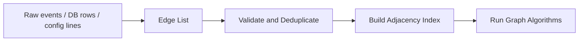

Edge list bagus sebagai **input representation**, bukan selalu bagus sebagai **query representation**.

---

## 13. Graph Construction Pipeline

Dalam sistem production, graph jarang hardcoded. Biasanya graph dibangun dari:

- DB rows;
- config file;
- API response;
- event stream;
- service discovery;
- workflow definition;
- permission registry;
- deployment manifests.

Pipeline yang sehat:

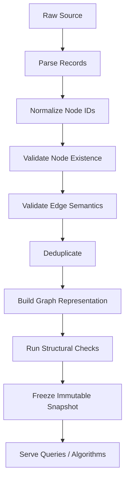

Structural checks bisa termasuk:

- tidak ada unknown node;
- tidak ada forbidden self-loop;
- tidak ada duplicate edge jika domain melarang;
- graph harus DAG;
- graph harus connected;
- graph tidak boleh punya orphan node;
- semua terminal state reachable;
- semua transition punya reason/action;
- tidak ada circular dependency;
- tidak ada edge lintas tenant;
- tidak ada permission escalation cycle.

Graph tanpa validation adalah sumber bug domain yang sangat sulit ditemukan.

---

## 14. BFS: Breadth-First Search

BFS mengunjungi graph layer by layer.

Dari start node:

1. kunjungi start;
2. kunjungi semua neighbor distance 1;
3. kunjungi semua neighbor distance 2;
4. lanjut sampai habis.

BFS memakai queue.

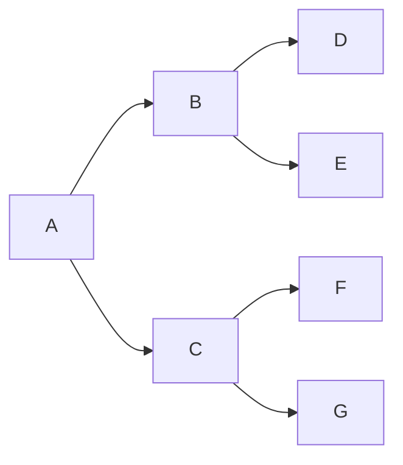

BFS dari `A`:

```text
A, B, C, D, E, F, G
```

Dengan adjacency order tertentu.

### 14.1 BFS untuk IntGraph

```go
func BFS(g *IntGraph, start int, visit func(node int) bool) {
    g.checkNode(start)

    seen := make([]bool, g.Len())
    queue := make([]int, 0, g.Len())

    seen[start] = true
    queue = append(queue, start)

    head := 0
    for head < len(queue) {
        node := queue[head]
        head++

        if !visit(node) {
            return
        }

        for _, next := range g.Neighbors(node) {
            g.checkNode(next)
            if seen[next] {
                continue
            }
            seen[next] = true
            queue = append(queue, next)
        }
    }
}
```

Important detail:

```go
head := 0
for head < len(queue) {
    node := queue[head]
    head++
}
```

Ini menghindari `queue = queue[1:]` yang bisa retained backing array dan membuat memory lifecycle kurang jelas.

### 14.2 BFS Distance

Untuk unweighted graph, BFS memberi shortest path dalam jumlah edge.

```go
func BFSDistance(g *IntGraph, start int) []int {
    g.checkNode(start)

    dist := make([]int, g.Len())
    for i := range dist {
        dist[i] = -1
    }

    queue := make([]int, 0, g.Len())
    dist[start] = 0
    queue = append(queue, start)

    head := 0
    for head < len(queue) {
        node := queue[head]
        head++

        for _, next := range g.Neighbors(node) {
            g.checkNode(next)
            if dist[next] != -1 {
                continue
            }
            dist[next] = dist[node] + 1
            queue = append(queue, next)
        }
    }

    return dist
}
```

Meaning:

```text
dist[x] = -1 berarti unreachable
dist[x] >= 0 berarti jumlah edge minimum dari start ke x
```

### 14.3 BFS Parent untuk Reconstruct Path

```go
func BFSPath(g *IntGraph, start, target int) ([]int, bool) {
    g.checkNode(start)
    g.checkNode(target)

    parent := make([]int, g.Len())
    for i := range parent {
        parent[i] = -1
    }

    queue := make([]int, 0, g.Len())
    parent[start] = start
    queue = append(queue, start)

    head := 0
    for head < len(queue) {
        node := queue[head]
        head++

        if node == target {
            break
        }

        for _, next := range g.Neighbors(node) {
            g.checkNode(next)
            if parent[next] != -1 {
                continue
            }
            parent[next] = node
            queue = append(queue, next)
        }
    }

    if parent[target] == -1 {
        return nil, false
    }

    path := make([]int, 0)
    for cur := target; cur != start; cur = parent[cur] {
        path = append(path, cur)
    }
    path = append(path, start)

    reverseInts(path)
    return path, true
}

func reverseInts(xs []int) {
    for i, j := 0, len(xs)-1; i < j; i, j = i+1, j-1 {
        xs[i], xs[j] = xs[j], xs[i]
    }
}
```

### 14.4 BFS Complexity

For adjacency list:

```text
Time:  O(V + E)
Space: O(V)
```

Setiap node diproses sekali. Setiap edge diperiksa sesuai adjacency.

Untuk directed graph, edge diperiksa sekali.

Untuk undirected graph yang disimpan dua arah, setiap logical edge diperiksa dua kali, tetap O(V + E).

---

## 15. DFS: Depth-First Search

DFS mengeksplor sedalam mungkin sebelum backtrack.

DFS dapat ditulis recursive atau iterative.

Recursive lebih pendek, tetapi punya risiko stack depth pada graph besar.

Iterative lebih eksplisit dan lebih aman untuk input besar.

### 15.1 Recursive DFS

```go
func DFSRecursive(g *IntGraph, start int, visit func(node int) bool) {
    g.checkNode(start)
    seen := make([]bool, g.Len())

    var walk func(int) bool
    walk = func(node int) bool {
        seen[node] = true
        if !visit(node) {
            return false
        }
        for _, next := range g.Neighbors(node) {
            g.checkNode(next)
            if seen[next] {
                continue
            }
            if !walk(next) {
                return false
            }
        }
        return true
    }

    walk(start)
}
```

Risk:

```text
Graph chain length = 1.000.000
Recursive DFS depth = 1.000.000
```

Ini tidak ideal untuk production input yang tidak dikontrol.

### 15.2 Iterative DFS

```go
func DFSIterative(g *IntGraph, start int, visit func(node int) bool) {
    g.checkNode(start)

    seen := make([]bool, g.Len())
    stack := make([]int, 0)
    stack = append(stack, start)

    for len(stack) > 0 {
        n := len(stack) - 1
        node := stack[n]
        stack = stack[:n]

        if seen[node] {
            continue
        }
        seen[node] = true

        if !visit(node) {
            return
        }

        neighbors := g.Neighbors(node)
        for i := len(neighbors) - 1; i >= 0; i-- {
            next := neighbors[i]
            g.checkNode(next)
            if !seen[next] {
                stack = append(stack, next)
            }
        }
    }
}
```

Kenapa neighbor dipush dari belakang ke depan?

Agar traversal order mendekati recursive DFS yang memproses neighbor dari kiri ke kanan.

Jika order tidak penting, loop biasa juga boleh.

### 15.3 DFS Complexity

For adjacency list:

```text
Time:  O(V + E)
Space: O(V)
```

Space recursive DFS memakai call stack. Space iterative DFS memakai explicit stack.

Production preference:

- recursive DFS boleh untuk graph kecil/terkontrol;
- iterative DFS lebih aman untuk graph besar/untrusted;
- jika butuh enter/exit event, gunakan stack frame eksplisit.

---

## 16. BFS vs DFS

| Kebutuhan | BFS | DFS |
|---|---:|---:|
| shortest path unweighted | sangat cocok | tidak cocok default |
| reachability | cocok | cocok |
| connected components | cocok | cocok |
| cycle detection directed | bisa, tapi DFS lebih natural | sangat cocok |
| topological sort | tidak langsung; Kahn pakai queue | DFS postorder juga bisa |
| memory pada graph lebar | bisa besar | lebih kecil relatif |
| memory pada graph dalam | queue bisa kecil | recursive stack bisa bahaya |
| path paling dangkal | cocok | tidak menjamin |
| exhaustive exploration | cocok | cocok |

Mental model:

```text
BFS = explore by distance/layer
DFS = explore by branch/depth
```

---

## 17. Connected Components

Connected component adalah grup node yang saling reachable dalam undirected graph.

Contoh:

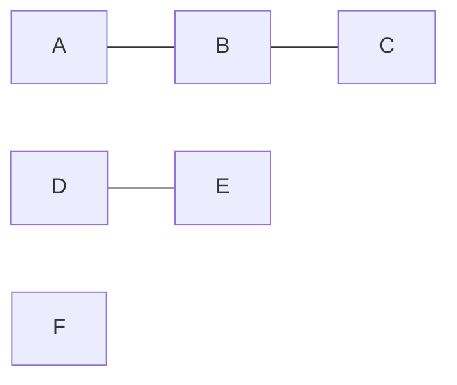

Components:

```text
{A, B, C}
{D, E}
{F}
```

Untuk `IntGraph` undirected:

```go
func ConnectedComponents(g *IntGraph) [][]int {
    seen := make([]bool, g.Len())
    var comps [][]int

    for start := 0; start < g.Len(); start++ {
        if seen[start] {
            continue
        }

        comp := make([]int, 0)
        stack := []int{start}
        seen[start] = true

        for len(stack) > 0 {
            n := len(stack) - 1
            node := stack[n]
            stack = stack[:n]
            comp = append(comp, node)

            for _, next := range g.Neighbors(node) {
                g.checkNode(next)
                if seen[next] {
                    continue
                }
                seen[next] = true
                stack = append(stack, next)
            }
        }

        comps = append(comps, comp)
    }

    return comps
}
```

Use cases:

- grouping related accounts;
- duplicate entity clusters;
- network segmentation;
- tenant isolation validation;
- data migration batch grouping;
- dependency island detection.

Production caveat:

Connected components pada directed graph berbeda. Untuk directed graph, konsep yang lebih kuat adalah **strongly connected components**. Itu masuk Part 017.

---

## 18. Cycle Detection — Undirected Graph

Dalam undirected graph, cycle terjadi jika saat DFS kita menemukan neighbor yang sudah seen dan bukan parent.

```go
func HasCycleUndirected(g *IntGraph) bool {
    seen := make([]bool, g.Len())

    var dfs func(node, parent int) bool
    dfs = func(node, parent int) bool {
        seen[node] = true

        for _, next := range g.Neighbors(node) {
            g.checkNode(next)
            if !seen[next] {
                if dfs(next, node) {
                    return true
                }
                continue
            }
            if next != parent {
                return true
            }
        }
        return false
    }

    for node := 0; node < g.Len(); node++ {
        if seen[node] {
            continue
        }
        if dfs(node, -1) {
            return true
        }
    }
    return false
}
```

Recursive version ini sederhana. Untuk graph sangat besar, gunakan iterative dengan parent frame.

Important caveat:

Jika undirected graph bisa punya parallel edge, cycle definition perlu diperjelas. Dua parallel edge antara `A` dan `B` bisa dianggap cycle length 2 pada multigraph, tetapi algoritma sederhana di atas tidak dirancang untuk multigraph.

---

## 19. Cycle Detection — Directed Graph

Directed graph butuh state warna:

```text
white = belum dikunjungi
gray  = sedang di recursion stack
black = selesai diproses
```

Cycle ada jika kita menemukan edge ke `gray` node.

```go
func HasCycleDirected(g *IntGraph) bool {
    const (
        white = 0
        gray  = 1
        black = 2
    )

    color := make([]int, g.Len())

    var dfs func(int) bool
    dfs = func(node int) bool {
        color[node] = gray

        for _, next := range g.Neighbors(node) {
            g.checkNode(next)
            switch color[next] {
            case gray:
                return true
            case white:
                if dfs(next) {
                    return true
                }
            }
        }

        color[node] = black
        return false
    }

    for node := 0; node < g.Len(); node++ {
        if color[node] != white {
            continue
        }
        if dfs(node) {
            return true
        }
    }

    return false
}
```

Use cases:

- dependency graph must not cycle;
- deployment ordering must be acyclic;
- workflow state transition may or may not allow cycles;
- permission inheritance usually must avoid escalation cycles;
- config include graph should avoid include loops.

### 19.1 Directed Cycle Example

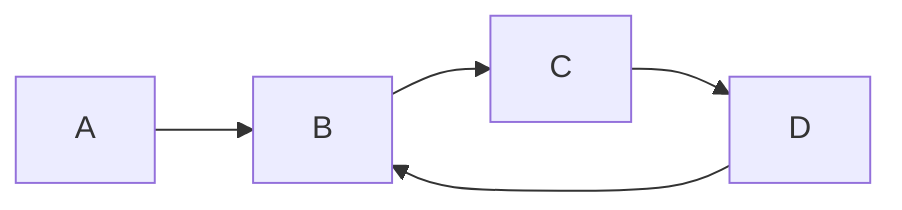

Cycle:

```text
B -> C -> D -> B
```

Cycle detection is not just technical. It is domain modelling.

Pertanyaan yang perlu dijawab:

- Apakah cycle forbidden?
- Jika allowed, apakah semua cycle safe?
- Apakah cycle harus punya exit path?
- Apakah cycle bisa menyebabkan infinite processing?
- Apakah cycle membuat approval/escalation tidak pernah selesai?

---

## 20. Topological Intuition

Topological order adalah urutan node pada DAG sehingga setiap edge `u -> v` berarti `u` muncul sebelum `v`.

DAG = Directed Acyclic Graph.

Contoh:

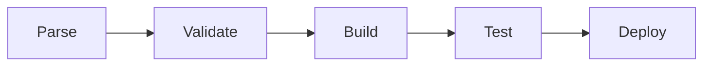

Topological order:

```text
Parse, Validate, Build, Test, Deploy
```

Jika graph punya cycle, topological order tidak ada.

Contoh cycle:

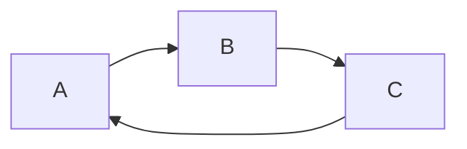

Tidak mungkin menaruh `A` sebelum `B`, `B` sebelum `C`, dan `C` sebelum `A` sekaligus.

Topological sort akan dibahas detail di Part 017.

Untuk sekarang, cukup pegang invariant:

> Topological ordering hanya valid untuk directed acyclic graph.

Use cases:

- build order;
- migration order;
- job scheduling;
- deployment dependency;
- data pipeline stage ordering;
- rule evaluation order;
- workflow validation.

---

## 21. Modelling Graph dari Domain: Cara Berpikir

Graph modelling harus dimulai dari pertanyaan domain, bukan dari struktur data.

Framework:

```text
1. Apa entity-nya?
2. Apa relationship-nya?
3. Apakah relationship punya arah?
4. Apakah relationship punya bobot/metadata?
5. Apakah duplicate relationship boleh?
6. Apakah self-loop boleh?
7. Apakah cycle boleh?
8. Apakah graph harus connected?
9. Apakah graph berubah sering atau mostly read-only?
10. Query utama apa?
```

Mari lihat beberapa contoh.

---

## 22. Case Study A — Service Dependency Graph

### 22.1 Domain

Node:

```text
service
```

Edge:

```text
A -> B berarti service A melakukan synchronous call ke service B
```

Graph:

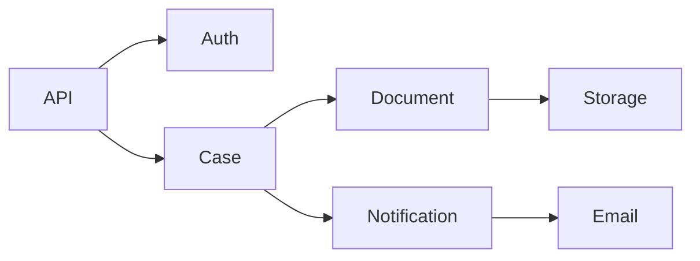

### 22.2 Pertanyaan

- Jika `Storage` down, service mana terdampak?
- Apakah ada circular synchronous call?
- Service mana punya fan-out terbesar?
- Apakah ada dependency lintas zone yang dilarang?
- Apakah call chain terlalu panjang?

### 22.3 Direction Matters

Jika edge `A -> B` berarti `A depends on B`, maka impact reverse query butuh reverse graph.

```text
A -> B
```

Meaning:

```text
A membutuhkan B
```

Jika B down, yang terdampak adalah predecessor B pada reverse graph.

Build reverse graph:

```go
func Reverse(g *IntGraph) *IntGraph {
    r := NewIntGraph(g.Len())
    for from := 0; from < g.Len(); from++ {
        for _, to := range g.Neighbors(from) {
            g.checkNode(to)
            r.AddDirectedEdge(to, from)
        }
    }
    return r
}
```

Then BFS/DFS from failed dependency on reverse graph gives impacted services.

---

## 23. Case Study B — Workflow State Graph

### 23.1 Domain

Node:

```text
case state
```

Edge:

```text
state A can transition to state B under event/action X
```

Graph:

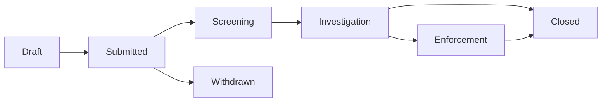

### 23.2 Edge Metadata

A transition edge usually needs metadata:

```go
type State string

type Transition struct {
    From   State
    To     State
    Action string
    Guard  string
}
```

In this case, graph as `map[State][]State` may be too weak because it loses action/guard.

Better:

```go
type WorkflowGraph struct {
    outgoing map[State][]Transition
}
```

### 23.3 Questions

- Can every non-terminal state reach a terminal state?
- Are there dead states?
- Are there transitions without guard?
- Are there forbidden cycles?
- Is escalation path always reachable?
- Does every rejection path allow correction?

### 23.4 Reachability to Terminal

For each state, check if terminal reachable.

Naive:

```text
for each state: run BFS
```

More efficient:

```text
build reverse graph from terminal states and run one reverse BFS
```

If reverse BFS from terminals reaches all states, every state can reach a terminal in original graph.

This is a powerful production modelling trick.

---

## 24. Case Study C — Authorization Inheritance Graph

### 24.1 Domain

Node:

```text
role or permission namespace
```

Edge:

```text
A -> B means A inherits B
```

Graph:

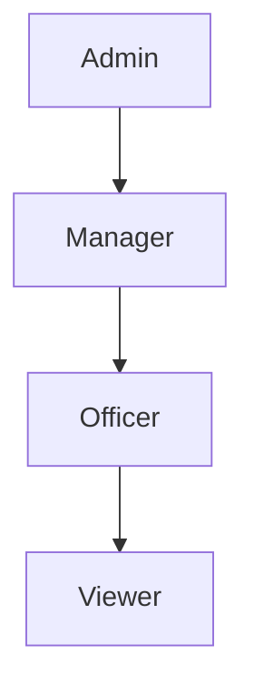

### 24.2 Cycle Danger

If:

```text
Admin -> Manager
Manager -> Officer
Officer -> Admin
```

Then permission resolution may loop or produce privilege escalation ambiguity.

Graph validation:

- inheritance graph must be DAG;
- no self-loop;
- no cross-tenant inheritance;
- no inheritance from more privileged external namespace unless explicitly allowed;
- permission closure must be explainable.

### 24.3 Transitive Permission

If `Admin inherits Manager` and `Manager inherits Viewer`, then Admin indirectly has Viewer permissions.

This is reachability.

For small graph, DFS per role may be enough.

For large/read-heavy graph, precompute closure or use memoization/versioned snapshot.

---

## 25. Case Study D — Regulatory Case Impact Graph

### 25.1 Domain

Node candidates:

- case;
- entity;
- license;
- offence;
- action;
- correspondence;
- appeal;
- enforcement measure.

But putting everything as node may create a graph that is too generic.

Better to define subgraphs by question.

### 25.2 Example: Enforcement Impact Graph

Node:

```text
regulated entity or license
```

Edge:

```text
case/action affects entity/license
```

Questions:

- If one entity is suspended, which linked licenses need review?
- Which active cases depend on the same entity?
- Is there an escalation path from warning to penalty?
- Can one action create cascading impact?

### 25.3 Avoid Over-Modelling

Bad graph:

```text
Node = every database row
Edge = every foreign key
```

This creates a database schema graph, not necessarily a decision graph.

Better:

```text
Node = domain object relevant to decision
Edge = relationship relevant to decision/change/impact
```

For regulatory defensibility, the graph should explain:

- why a node is included;
- why an edge exists;
- what rule created it;
- when it was valid;
- who/what source asserted it.

Graph without provenance can be dangerous in audit-sensitive systems.

---

## 26. Edge Metadata and Rich Graphs

Simple graph:

```go
map[N][]N
```

Rich graph:

```go
type Edge[N comparable] struct {
    From N
    To   N
    Kind string
    Attr map[string]string
}
```

But `map[string]string` everywhere can become vague and expensive.

Prefer typed metadata when domain is known.

Example service graph:

```go
type CallKind uint8

const (
    SyncHTTP CallKind = iota + 1
    GRPC
    AsyncEvent
)

type ServiceEdge struct {
    To       Service
    Kind     CallKind
    Critical bool
}

type ServiceGraph struct {
    outgoing map[Service][]ServiceEdge
}
```

Example workflow graph:

```go
type TransitionEdge struct {
    To        State
    Action    Action
    GuardName string
    Requires  []Permission
}
```

Design rule:

> Edge metadata should represent relationship semantics, not become a dumping ground for arbitrary state.

---

## 27. Reverse Graph

Many graph questions are easier in reverse.

Original:

```text
A -> B means A depends on B
```

Question:

```text
Who is impacted if B fails?
```

Need reverse:

```text
B -> A
```

Reverse graph builder was shown earlier.

For generic graph:

```go
func ReverseGeneric[N comparable](adj map[N][]N) map[N][]N {
    rev := make(map[N][]N, len(adj))

    for from, neighbors := range adj {
        if _, ok := rev[from]; !ok {
            rev[from] = nil
        }
        for _, to := range neighbors {
            rev[to] = append(rev[to], from)
        }
    }

    return rev
}
```

Important:

- preserve isolated nodes;
- preserve nodes with no outgoing edge;
- decide duplicate semantics.

Reverse graph is useful for:

- impact analysis;
- “who depends on X?”;
- terminal reachability;
- reverse topological reasoning;
- invalidation propagation;
- inbound dependency count.

---

## 28. In-Degree and Out-Degree

For directed graph:

```text
out-degree(u) = number of edges leaving u
in-degree(u)  = number of edges entering u
```

Compute:

```go
func Degrees(g *IntGraph) (in, out []int) {
    n := g.Len()
    in = make([]int, n)
    out = make([]int, n)

    for from := 0; from < n; from++ {
        neighbors := g.Neighbors(from)
        out[from] = len(neighbors)
        for _, to := range neighbors {
            g.checkNode(to)
            in[to]++
        }
    }

    return in, out
}
```

Use cases:

- dependency fan-in/fan-out;
- root/source detection;
- leaf/sink detection;
- Kahn topological sort;
- orphan node detection;
- highly coupled service detection;
- workflow state complexity.

Interpretation:

| Metric | Meaning in Dependency Graph |
|---|---|
| high out-degree | component depends on many others |
| high in-degree | many components depend on this one |
| zero out-degree | no dependency / terminal |
| zero in-degree | no inbound dependency / root |

But direction must be defined first.

---

## 29. Self-Loop

Self-loop:

```text
A -> A
```

Mermaid:

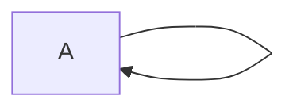

Self-loop can mean different things:

| Domain | Self-loop Meaning |
|---|---|
| workflow | state can remain same after action |
| dependency | package depends on itself, usually invalid |
| retry scheduler | task reschedules itself, maybe valid |
| graph algorithm | cycle length 1 |
| authorization inheritance | role inherits itself, usually invalid/redundant |

Do not globally say self-loop is bad.

Ask domain.

In builder:

```go
func (g *IntGraph) AddDirectedEdgeNoSelfLoop(from, to int) error {
    g.checkNode(from)
    g.checkNode(to)
    if from == to {
        return fmt.Errorf("self-loop is not allowed: %d", from)
    }
    g.adj[from] = append(g.adj[from], to)
    return nil
}
```

For production package, prefer returning error at parsing/validation layer rather than panic if input is external.

---

## 30. Multigraph

A multigraph allows multiple edges between same pair of nodes.

Example:

```text
A -> B via HTTP
A -> B via async event
A -> B via admin action
```

If edge kind matters, dedup by `(from, to)` would lose information.

Represent edge with ID/kind:

```go
type MultiEdge[N comparable] struct {
    To   N
    Kind string
    ID   string
}

type MultiGraph[N comparable] struct {
    adj map[N][]MultiEdge[N]
}
```

Dedup key might be:

```go
type EdgeKey[N comparable] struct {
    From N
    To   N
    Kind string
}
```

Domain decision:

- duplicate same kind allowed?
- same from/to different kind allowed?
- same from/to/action but different guard allowed?
- edge identity required for audit?

---

## 31. Deterministic Traversal

Go map iteration order is not deterministic by contract. For graph algorithms, nondeterministic iteration can produce nondeterministic traversal output.

If output order matters:

- use integer IDs and ordered adjacency slices;
- sort adjacency lists after build;
- use deterministic node ordering;
- avoid relying on map iteration.

Example normalize integer graph adjacency:

```go
func SortNeighbors(g *IntGraph) {
    for _, ns := range g.adj {
        // simple insertion sort for snippet clarity
        for i := 1; i < len(ns); i++ {
            x := ns[i]
            j := i - 1
            for j >= 0 && x < ns[j] {
                ns[j+1] = ns[j]
                j--
            }
            ns[j+1] = x
        }
    }
}
```

In production, use `slices.Sort` for ordered types.

Why deterministic matters:

- stable tests;
- reproducible incident analysis;
- consistent generated reports;
- deterministic migration plan;
- less noisy diffs;
- predictable PR review.

---

## 32. Graph Mutation Model

Graph can be:

1. immutable after build;
2. append-only;
3. mutable with add/remove edge;
4. versioned;
5. concurrent mutable.

Each has different complexity.

### 32.1 Immutable Graph

Best for algorithms.

```text
Build -> Validate -> Freeze -> Query
```

Advantages:

- no concurrent mutation issues;
- traversal sees consistent snapshot;
- easier testing;
- easier caching;
- good for config/workflow/policy graph.

### 32.2 Mutable Graph

Needed when graph changes frequently.

Operations:

- add node;
- remove node;
- add edge;
- remove edge;
- update edge metadata.

Challenges:

- removing from slice is O(deg);
- duplicate prevention;
- iterator invalidation;
- consistency during traversal;
- concurrency safety;
- versioning.

### 32.3 Versioned Graph

Common in production:

```text
current active graph snapshot
next graph built in background
atomic swap after validation
```

This avoids exposing partially updated graph.

Mermaid:

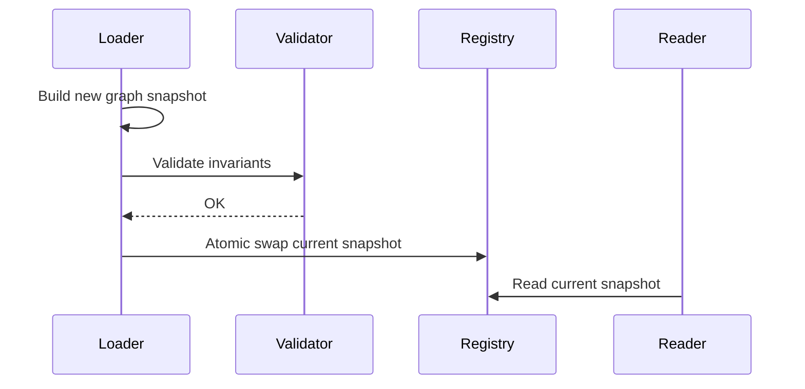

This pattern is especially useful for:

- workflow definition;
- route table;
- permission inheritance;
- config dependency;
- service topology;
- feature flag relation.

---

## 33. Error Handling Strategy for Graph Builders

For internal graph algorithms, panic on invalid node ID may be acceptable.

For external input, return error.

Example:

```go
type GraphBuildError struct {
    Op     string
    From   string
    To     string
    Reason string
}

func (e GraphBuildError) Error() string {
    return e.Op + ": " + e.Reason + " (from=" + e.From + ", to=" + e.To + ")"
}
```

Builder validation:

```go
func ValidateNoSelfLoop(edges []Edge) error {
    for _, e := range edges {
        if e.From == e.To {
            return fmt.Errorf("self-loop not allowed: %d", e.From)
        }
    }
    return nil
}
```

General rule:

| Layer | Invalid Graph Handling |
|---|---|
| public parser | return rich error |
| config loader | collect multiple errors if useful |
| internal invariant violation | panic may be acceptable |
| runtime query | avoid panic for user input |
| test helper | panic/fatal acceptable |

---

## 34. Graph Validation Checklist

When designing graph-backed systems, ask:

### Node Validation

- Are node IDs unique?
- Can node ID be empty?
- Are node types homogeneous or heterogeneous?
- Are orphan nodes allowed?
- Are isolated nodes meaningful?
- Are node attributes required?

### Edge Validation

- Are unknown endpoints allowed?
- Are duplicate edges allowed?
- Are self-loops allowed?
- Are parallel edges allowed?
- Does edge need metadata?
- Is edge direction correct?
- Are reverse edges required?

### Structural Validation

- Must graph be connected?
- Must graph be acyclic?
- Must every node reach terminal?
- Must every node be reachable from root?
- Are there max depth/fan-out constraints?
- Are there forbidden cross-boundary edges?

### Operational Validation

- How big can graph become?
- Is graph read-heavy or write-heavy?
- Is traversal bounded?
- Is graph built from trusted source?
- Do we need deterministic output?
- Do we need audit provenance?
- Can graph be swapped atomically?

---

## 35. Testing Graph Code

Graph code must be tested at several levels.

### 35.1 Small Deterministic Tests

```go
func TestBFSDistance(t *testing.T) {
    g := NewIntGraph(5)
    g.AddDirectedEdge(0, 1)
    g.AddDirectedEdge(0, 2)
    g.AddDirectedEdge(1, 3)
    g.AddDirectedEdge(2, 3)

    got := BFSDistance(g, 0)
    want := []int{0, 1, 1, 2, -1}

    if !reflect.DeepEqual(got, want) {
        t.Fatalf("distance mismatch: got %v want %v", got, want)
    }
}
```

### 35.2 Invariant Tests

For undirected graph:

```go
func AssertUndirectedSymmetry(t *testing.T, g *IntGraph) {
    t.Helper()

    for from := 0; from < g.Len(); from++ {
        for _, to := range g.Neighbors(from) {
            if !hasInt(g.Neighbors(to), from) {
                t.Fatalf("missing reverse edge: %d -> %d exists, but %d -> %d missing", from, to, to, from)
            }
        }
    }
}

func hasInt(xs []int, target int) bool {
    for _, x := range xs {
        if x == target {
            return true
        }
    }
    return false
}
```

### 35.3 Property-Like Tests

Examples:

- reverse(reverse(g)) equals g if adjacency normalized;
- BFS distance from start to start is 0;
- unreachable nodes have distance -1;
- connected component count is at least 1 for non-empty graph;
- directed graph with self-loop has cycle;
- DAG must not have directed cycle;
- topological order length equals node count if DAG.

### 35.4 Fuzzing

Go's `testing` package includes fuzzing support; fuzz targets can generate random graph edge lists and assert invariants like no panic for valid inputs or consistency between two implementations. Referensi official `testing`/fuzzing tersedia di dokumentasi Go. citeturn119937search5

Fuzzing graph parser/builders is very useful because graph bugs often hide in edge cases:

- empty graph;
- single node;
- self-loop;
- duplicate edge;
- disconnected graph;
- invalid node ID;
- very deep chain;
- very wide node;
- cycle;
- repeated components.

---

## 36. Benchmarking Graph Representation

Benchmark questions:

1. Build speed?
2. Memory usage?
3. BFS/DFS throughput?
4. `HasEdge` speed?
5. Reverse graph construction speed?
6. Validation speed?
7. Allocation count?

Dataset shapes:

| Shape | Purpose |
|---|---|
| chain | worst depth |
| star | high fan-out/fan-in |
| grid | path/search realistic |
| random sparse | general traversal |
| dense small | matrix candidate |
| DAG layered | topo/dependency systems |
| cyclic clusters | SCC/cycle validation |

Example benchmark skeleton:

```go
func BenchmarkBFSChain(b *testing.B) {
    const n = 100_000
    g := NewIntGraph(n)
    for i := 0; i+1 < n; i++ {
        g.AddDirectedEdge(i, i+1)
    }

    b.ResetTimer()
    for i := 0; i < b.N; i++ {
        count := 0
        BFS(g, 0, func(node int) bool {
            count++
            return true
        })
        if count != n {
            b.Fatalf("visited %d want %d", count, n)
        }
    }
}
```

Important:

- generate graph before `b.ResetTimer()` if measuring traversal only;
- include build in benchmark if build cost matters;
- benchmark realistic graph shape;
- report allocation with `go test -bench . -benchmem`;
- do not overinterpret microbenchmarks without production-like data distribution.

---

## 37. Common Anti-Patterns

### 37.1 Treating Direction Casually

Bad:

```text
A related to B
```

Better:

```text
A depends on B
A owns B
A can transition to B
A invalidates B
A inherits B
```

Direction is semantics.

### 37.2 Using Map Iteration for Deterministic Output

Bad:

```go
for node := range graph {
    // generate report
}
```

If report order matters, sort node IDs.

### 37.3 Running BFS per Node When Reverse Traversal Suffices

Bad:

```text
For every state, BFS to see if terminal reachable.
```

Better:

```text
Reverse graph. BFS once from all terminal states.
```

### 37.4 Modelling Database Schema as Business Graph

Foreign keys are not always business edges.

Business graph should represent decision/impact relation.

### 37.5 Ignoring Duplicate Edge Semantics

Duplicate edge can mean:

- bug;
- parallel relationship;
- multiple sources;
- multigraph;
- version conflict.

Do not accidentally dedup if duplicate carries meaning.

### 37.6 Recursive DFS on Unbounded Input

Recursive DFS is elegant but risky for huge/deep graph.

Use iterative traversal for untrusted or potentially large graph.

### 37.7 Graph Without Invariant Documentation

Every graph type should document:

- directed or undirected;
- duplicate edge allowed or not;
- self-loop allowed or not;
- adjacency ordering;
- mutation safety;
- concurrency safety;
- node identity rule.

---

## 38. Production Design Template

When introducing graph into a Go codebase, write this in design docs:

```text
Graph Name:

Purpose:

Node Definition:

Edge Definition:

Directed/Undirected:

Weighted/Unweighted:

Duplicate Edge Rule:

Self-loop Rule:

Cycle Rule:

Connectivity Rule:

Primary Queries:

Expected Size:

Mutation Pattern:

Representation:

Build Source:

Validation:

Determinism Requirement:

Concurrency Model:

Testing Strategy:

Benchmark Strategy:

Failure Modes:
```

Example:

```text
Graph Name:
  WorkflowTransitionGraph

Purpose:
  Validate and query allowed case state transitions.

Node Definition:
  Workflow state code.

Edge Definition:
  Allowed transition from one state to another under an action and guard.

Directed/Undirected:
  Directed.

Weighted/Unweighted:
  Unweighted for reachability; edge metadata contains action/guard.

Duplicate Edge Rule:
  Duplicate same from/to/action is invalid.

Self-loop Rule:
  Allowed only for explicit no-state-change actions.

Cycle Rule:
  Cycles allowed only if each cycle has an exit path to terminal state.

Primary Queries:
  Allowed next states, terminal reachability, invalid transition detection.

Expected Size:
  Tens to hundreds of states, hundreds of transitions.

Mutation Pattern:
  Immutable snapshot loaded from versioned configuration.

Representation:
  map[State][]TransitionEdge plus reverse graph for terminal reachability.

Validation:
  Unknown state check, duplicate edge check, terminal reachability check.

Determinism Requirement:
  Yes, reports sorted by state/action.

Concurrency Model:
  Atomic snapshot swap.

Testing Strategy:
  Golden workflow examples, invariant checks, cycle/terminal reachability tests.

Benchmark Strategy:
  Usually not critical; validate load time and query allocation.

Failure Modes:
  Missing transition, invalid cycle, unreachable terminal, stale snapshot.
```

---

## 39. Complete Minimal Graph Package Example

Below is a compact but usable integer directed graph foundation.

```go
package graph

import "fmt"

type IntGraph struct {
    adj [][]int
}

func NewIntGraph(n int) *IntGraph {
    if n < 0 {
        panic("negative node count")
    }
    return &IntGraph{adj: make([][]int, n)}
}

func (g *IntGraph) Len() int {
    if g == nil {
        return 0
    }
    return len(g.adj)
}

func (g *IntGraph) AddDirectedEdge(from, to int) error {
    if err := g.validateNode(from); err != nil {
        return fmt.Errorf("invalid from node: %w", err)
    }
    if err := g.validateNode(to); err != nil {
        return fmt.Errorf("invalid to node: %w", err)
    }
    g.adj[from] = append(g.adj[from], to)
    return nil
}

func (g *IntGraph) MustAddDirectedEdge(from, to int) {
    if err := g.AddDirectedEdge(from, to); err != nil {
        panic(err)
    }
}

func (g *IntGraph) AddUndirectedEdge(a, b int) error {
    if err := g.AddDirectedEdge(a, b); err != nil {
        return err
    }
    if err := g.AddDirectedEdge(b, a); err != nil {
        return err
    }
    return nil
}

func (g *IntGraph) Neighbors(node int) []int {
    g.checkNode(node)
    return g.adj[node]
}

func (g *IntGraph) NeighborsCopy(node int) []int {
    g.checkNode(node)
    out := make([]int, len(g.adj[node]))
    copy(out, g.adj[node])
    return out
}

func (g *IntGraph) ForEachNeighbor(node int, fn func(to int) bool) {
    g.checkNode(node)
    for _, to := range g.adj[node] {
        if !fn(to) {
            return
        }
    }
}

func (g *IntGraph) validateNode(node int) error {
    if g == nil {
        return fmt.Errorf("nil graph")
    }
    if node < 0 || node >= len(g.adj) {
        return fmt.Errorf("node %d out of range [0,%d)", node, len(g.adj))
    }
    return nil
}

func (g *IntGraph) checkNode(node int) {
    if err := g.validateNode(node); err != nil {
        panic(err)
    }
}

func BFS(g *IntGraph, start int, visit func(node int) bool) {
    g.checkNode(start)

    seen := make([]bool, g.Len())
    queue := make([]int, 0)

    seen[start] = true
    queue = append(queue, start)

    for head := 0; head < len(queue); head++ {
        node := queue[head]
        if !visit(node) {
            return
        }
        for _, next := range g.Neighbors(node) {
            g.checkNode(next)
            if seen[next] {
                continue
            }
            seen[next] = true
            queue = append(queue, next)
        }
    }
}

func DFS(g *IntGraph, start int, visit func(node int) bool) {
    g.checkNode(start)

    seen := make([]bool, g.Len())
    stack := []int{start}

    for len(stack) > 0 {
        last := len(stack) - 1
        node := stack[last]
        stack = stack[:last]

        if seen[node] {
            continue
        }
        seen[node] = true

        if !visit(node) {
            return
        }

        neighbors := g.Neighbors(node)
        for i := len(neighbors) - 1; i >= 0; i-- {
            next := neighbors[i]
            g.checkNode(next)
            if !seen[next] {
                stack = append(stack, next)
            }
        }
    }
}

func Reverse(g *IntGraph) *IntGraph {
    r := NewIntGraph(g.Len())
    for from := 0; from < g.Len(); from++ {
        for _, to := range g.Neighbors(from) {
            g.checkNode(to)
            r.MustAddDirectedEdge(to, from)
        }
    }
    return r
}
```

This is intentionally not over-engineered. It gives enough foundation for algorithms while making boundary choices explicit.

---

## 40. Mental Model Summary

Graph is not just an algorithm topic. Graph is a modelling tool.

The key skill is not memorizing BFS/DFS. The key skill is asking:

```text
What is the node?
What is the edge?
What does direction mean?
What invariant must never break?
What query must be fast?
What graph shapes can occur?
What failure mode is unacceptable?
```

If you answer these well, choosing representation becomes straightforward.

Core representation choices:

| Requirement | Good Default |
|---|---|
| sparse graph, heavy traversal | `[][]int` adjacency list |
| domain-readable graph | `map[Node][]Node` |
| duplicate edge forbidden | adjacency set or build-time dedup |
| frequent `HasEdge` | adjacency set or matrix |
| dense small graph | bit matrix |
| ingestion/sorting edges | edge list |
| read-heavy config graph | immutable frozen graph |
| impact analysis | reverse graph |
| deterministic report | sorted nodes and sorted adjacency |

---

## 41. Checklist Sebelum Lanjut Part 017

Pastikan sudah bisa menjawab:

1. Apa bedanya directed dan undirected graph?
2. Kenapa direction adalah semantic decision, bukan detail teknis?
3. Kapan adjacency list lebih cocok daripada adjacency matrix?
4. Kenapa edge list bagus untuk ingestion tetapi buruk untuk traversal?
5. Bagaimana membangun graph dari domain key lalu mengubahnya menjadi integer ID?
6. Bagaimana BFS bekerja dan kenapa cocok untuk shortest path unweighted?
7. Bagaimana DFS bekerja dan kenapa recursive DFS berisiko pada graph besar?
8. Apa itu connected component?
9. Bagaimana mendeteksi cycle dasar pada directed graph?
10. Kenapa reverse graph sering lebih efisien untuk impact analysis?
11. Apa saja invariant yang harus didokumentasikan oleh graph type?
12. Kenapa graph production sebaiknya divalidasi sebelum dipakai?

---

## 42. Referensi Resmi

Rujukan utama yang relevan untuk part ini:

- Go 1.26 Release Notes — memastikan konteks versi dan kompatibilitas Go 1.26. citeturn119937search3
- Go Release History — patch/release lifecycle Go. citeturn119937search6
- Go Language Specification — terutama aturan map key/comparable, slice, dan type system yang memengaruhi desain graph generic. citeturn119937search4
- Go Standard Library docs — package `slices`, `cmp`, `sort`, `container/heap`, dan `testing` sebagai building blocks algoritmik. citeturn119937search1turn119937search5turn119937search0turn119937search2

---

## 43. Penutup Part 016

Part ini membangun fondasi graph dari sisi modelling dan representasi.

Poin utama:

- graph memodelkan entity dan relationship;
- direction adalah bagian dari domain semantics;
- representation harus dipilih berdasarkan query dan ukuran graph;
- adjacency list adalah default untuk sparse graph;
- adjacency matrix hanya masuk akal untuk dense/small graph atau kebutuhan `HasEdge` sangat kuat;
- edge list bagus sebagai format input/building stage;
- BFS/DFS adalah primitive traversal, bukan tujuan akhir;
- reverse graph adalah trik production yang sangat berguna;
- graph tanpa invariant validation mudah menjadi sumber bug tersembunyi.

Part berikutnya akan masuk ke algoritma graph yang lebih production-oriented:

```text
learn-go-data-structure-algorithm-part-017.md
Part 017 — Graph Algorithms for Production Systems
```

Di sana kita akan membahas:

- topological sort;
- DAG validation;
- shortest path;
- strongly connected components;
- reachability;
- transitive closure;
- incremental graph updates;
- cycle-safe workflow design;
- dependency deployment order;
- permission inheritance;
- event propagation impact.


<!-- NAVIGATION_FOOTER -->
<div class="page-nav">
<a href="./learn-go-data-structure-algorithm-part-015.md">⬅️ Part 015 — Trie, Radix Tree, Patricia Tree, dan Prefix Index</a>
<a href="./index.md">📚 Kategori</a>
<a href="../../index.md">🏠 Home</a>
<a href="./learn-go-data-structure-algorithm-part-017.md">Part 017 — Graph Algorithms for Production Systems ➡️</a>
</div>
