# learn-go-data-structure-algorithm-part-017.md

# Part 017 — Graph Algorithms for Production Systems

> Seri: `learn-go-data-structure-algorithm`  
> Bagian: `017 / 034`  
> Target pembaca: Java software engineer yang ingin menguasai Go data structure & algorithm pada level production/internal engineering handbook.  
> Fokus: algoritma graph untuk sistem nyata: dependency ordering, DAG validation, shortest path, SCC, reachability, transitive impact, workflow graph, permission inheritance, deployment order, dan policy/state modelling.

---

## 0. Posisi Part Ini dalam Seri

Part sebelumnya membahas **fundamental graph**:

- node / vertex,
- edge,
- directed graph,
- undirected graph,
- weighted graph,
- adjacency list,
- adjacency matrix,
- BFS,
- DFS,
- connected component,
- modelling graph untuk workflow dan service dependency.

Part ini naik satu level: **algoritma graph yang benar-benar sering muncul dalam sistem production**.

Di banyak backend system, graph tidak selalu disebut “graph”. Ia muncul sebagai:

- dependency antar module,
- dependency antar job,
- dependency antar service,
- state transition lifecycle,
- approval escalation path,
- permission inheritance,
- organizational hierarchy,
- product bundle dependency,
- data lineage,
- migration ordering,
- event propagation path,
- retry dependency,
- build pipeline,
- release orchestration,
- workflow case management.

Kalau engineer hanya melihatnya sebagai list biasa, biasanya sistem akan rapuh:

- dependency cycle terlambat ditemukan,
- urutan eksekusi salah,
- deletion merusak dependent entity,
- permission inheritance bocor,
- deployment gagal karena service belum siap,
- workflow bisa masuk state mustahil,
- impact analysis tidak lengkap,
- recursive traversal infinite loop,
- performance meledak karena repeated traversal.

Graph algorithm memberi bahasa formal untuk mencegah itu.

---

## 1. Mental Model Utama

Graph adalah struktur untuk menjawab pertanyaan:

> “Entitas mana yang terhubung ke entitas mana, lewat aturan apa, dan konsekuensi apa yang muncul dari hubungan itu?”

Dalam sistem production, graph jarang hanya soal menemukan path. Lebih sering graph dipakai untuk menjamin invariant.

Contoh invariant:

| Domain | Invariant |
|---|---|
| Dependency graph | Tidak boleh ada cycle |
| Workflow graph | Semua state terminal harus reachable |
| Permission inheritance | Tidak boleh privilege escalation tak disengaja |
| Deployment graph | Service harus deploy setelah dependency siap |
| Rule engine | Evaluation order harus deterministic |
| Data pipeline | Downstream impact harus bisa dihitung |
| Approval flow | Tidak boleh ada escalation loop |
| Case lifecycle | Tidak boleh state dead-end kecuali terminal |

Jadi, berpikir graph production bukan hanya:

```text
node A connect node B
```

Tapi:

```text
relationship A -> B implies ordering, reachability, authority, propagation, or lifecycle constraint
```

---

## 2. Taxonomy Pertanyaan Graph di Production

Sebelum memilih algoritma, tanyakan: graph ini dipakai untuk menjawab pertanyaan apa?

| Pertanyaan | Algoritma umum |
|---|---|
| “Apa urutan aman untuk menjalankan semua task?” | Topological sort |
| “Apakah dependency ini punya cycle?” | DFS cycle detection / Kahn algorithm |
| “Apa semua hal yang terdampak oleh perubahan X?” | Reachability / traversal |
| “Apa path termurah dari A ke B?” | Dijkstra jika weight non-negative |
| “Apakah ada edge negatif?” | Bellman-Ford style reasoning |
| “Node mana yang saling bergantung cyclically?” | Strongly Connected Components |
| “Apakah graph ini valid sebagai workflow?” | Reachability + terminal validation + cycle policy |
| “Apa semua dependency transitif dari service X?” | DFS/BFS/transitive closure |
| “Bisa tidak role A mewarisi permission B?” | Reachability in inheritance graph |
| “Bagaimana urutan migration database?” | DAG validation + topological sort |

Kesalahan umum adalah memakai DFS/BFS mentah untuk semua problem. Padahal setiap problem punya invariant berbeda.

---

## 3. Representasi Dasar yang Akan Dipakai

Untuk contoh part ini, kita gunakan representasi adjacency list generic sederhana.

```go
package graphalg

type Graph[N comparable] struct {
    out map[N][]N
}

func NewGraph[N comparable]() *Graph[N] {
    return &Graph[N]{out: make(map[N][]N)}
}

func (g *Graph[N]) AddNode(n N) {
    if _, ok := g.out[n]; !ok {
        g.out[n] = nil
    }
}

func (g *Graph[N]) AddEdge(from, to N) {
    g.AddNode(from)
    g.AddNode(to)
    g.out[from] = append(g.out[from], to)
}

func (g *Graph[N]) Nodes() []N {
    nodes := make([]N, 0, len(g.out))
    for n := range g.out {
        nodes = append(nodes, n)
    }
    return nodes
}

func (g *Graph[N]) Neighbors(n N) []N {
    return g.out[n]
}
```

Catatan production:

- `Neighbors` mengembalikan slice internal. Untuk library public, ini dapat membocorkan mutability.
- Untuk graph besar, duplicate edge perlu dicegah.
- Untuk deterministic output, node dan edge perlu diurutkan.
- Untuk graph weighted, adjacency harus menyimpan edge struct.
- Untuk graph dengan metadata, jangan paksakan semua informasi masuk ke node ID.

Versi production yang lebih aman bisa mengembalikan copy:

```go
func (g *Graph[N]) NeighborsCopy(n N) []N {
    ns := g.out[n]
    cp := make([]N, len(ns))
    copy(cp, ns)
    return cp
}
```

Tapi ini menambah allocation. Untuk internal hot path, dokumentasikan ownership dengan jelas.

---

## 4. Directed Acyclic Graph atau DAG

DAG adalah directed graph tanpa cycle.

DAG sangat penting karena banyak sistem membutuhkan **partial order**.

Contoh:

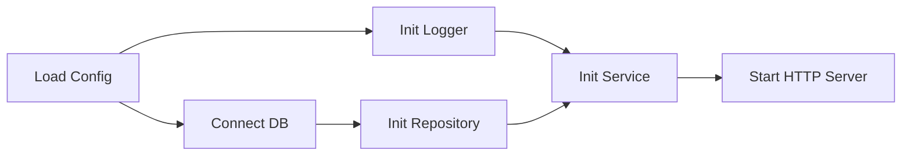

Tidak semua task harus punya urutan total. `Logger` dan `DB` bisa jalan setelah `Config`, tetapi tidak harus saling menunggu. DAG menyatakan **constraint minimum**, bukan urutan tunggal.

Topological sort mengubah partial order menjadi satu urutan valid.

---

## 5. Topological Sort

### 5.1 Problem

Diberikan graph directed. Jika `A -> B`, artinya `A` harus dilakukan sebelum `B`.

Cari urutan node sehingga setiap dependency muncul sebelum dependent.

Contoh:

```text
parse config -> connect db -> start service
```

Topological sort hanya valid jika graph adalah DAG.

Kalau ada cycle:

```text
A -> B -> C -> A
```

Tidak ada urutan valid.

---

### 5.2 Kahn Algorithm

Kahn algorithm bekerja dengan indegree.

Indegree = jumlah incoming edge ke node.

Langkah:

1. Hitung indegree semua node.
2. Masukkan semua node dengan indegree 0 ke queue.
3. Ambil node dari queue, tambahkan ke output.
4. Untuk setiap neighbor, kurangi indegree.
5. Jika indegree neighbor menjadi 0, masukkan ke queue.
6. Jika output berisi semua node, sukses.
7. Jika tidak, graph punya cycle.

Diagram:

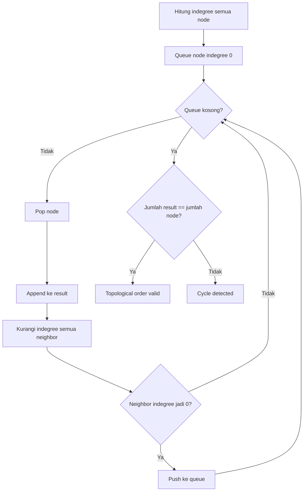

---

### 5.3 Implementasi Kahn di Go

```go
package graphalg

import "fmt"

type CycleError struct {
    Message string
}

func (e CycleError) Error() string { return e.Message }

func TopoSort[N comparable](g *Graph[N]) ([]N, error) {
    indegree := make(map[N]int, len(g.out))

    for n := range g.out {
        indegree[n] = 0
    }

    for _, neighbors := range g.out {
        for _, to := range neighbors {
            indegree[to]++
        }
    }

    queue := make([]N, 0)
    for n, deg := range indegree {
        if deg == 0 {
            queue = append(queue, n)
        }
    }

    order := make([]N, 0, len(indegree))
    head := 0

    for head < len(queue) {
        n := queue[head]
        head++

        order = append(order, n)

        for _, to := range g.out[n] {
            indegree[to]--
            if indegree[to] == 0 {
                queue = append(queue, to)
            }
        }
    }

    if len(order) != len(indegree) {
        return nil, CycleError{Message: fmt.Sprintf(
            "graph contains cycle: sorted %d of %d nodes",
            len(order), len(indegree),
        )}
    }

    return order, nil
}
```

Complexity:

```text
Time  : O(V + E)
Space : O(V)
```

V = jumlah node.  
E = jumlah edge.

---

### 5.4 Deterministic Topological Sort

Map iteration di Go tidak boleh diasumsikan deterministic. Jadi output `TopoSort` di atas bisa berbeda antar run.

Untuk production case seperti:

- migration order,
- generated file,
- deployment plan,
- audit report,
- test snapshot,

non-determinism bisa menjadi masalah.

Solusi: queue awal dan neighbor diurutkan.

Untuk generic node, butuh comparator.

```go
type LessFunc[N any] func(a, b N) bool
```

Implementasi deterministic dapat memakai sort/slices.

```go
package graphalg

import "slices"

func TopoSortStable[N comparable](g *Graph[N], less func(a, b N) bool) ([]N, error) {
    indegree := make(map[N]int, len(g.out))

    for n := range g.out {
        indegree[n] = 0
    }
    for _, neighbors := range g.out {
        for _, to := range neighbors {
            indegree[to]++
        }
    }

    ready := make([]N, 0)
    for n, deg := range indegree {
        if deg == 0 {
            ready = append(ready, n)
        }
    }
    slices.SortFunc(ready, func(a, b N) int {
        switch {
        case less(a, b):
            return -1
        case less(b, a):
            return 1
        default:
            return 0
        }
    })

    order := make([]N, 0, len(indegree))

    for len(ready) > 0 {
        n := ready[0]
        copy(ready, ready[1:])
        ready = ready[:len(ready)-1]

        order = append(order, n)

        neighbors := append([]N(nil), g.out[n]...)
        slices.SortFunc(neighbors, func(a, b N) int {
            switch {
            case less(a, b):
                return -1
            case less(b, a):
                return 1
            default:
                return 0
            }
        })

        for _, to := range neighbors {
            indegree[to]--
            if indegree[to] == 0 {
                ready = append(ready, to)
                slices.SortFunc(ready, func(a, b N) int {
                    switch {
                    case less(a, b):
                        return -1
                    case less(b, a):
                        return 1
                    default:
                        return 0
                    }
                })
            }
        }
    }

    if len(order) != len(indegree) {
        return nil, CycleError{Message: "graph contains cycle"}
    }
    return order, nil
}
```

Versi ini lebih mudah dipahami, tetapi kurang efisien karena sort berulang.

Untuk graph besar, gunakan priority queue untuk node ready.

Trade-off:

| Approach | Pros | Cons |
|---|---|---|
| Simple queue | O(V+E), cepat | Output tidak deterministic |
| Sorted repeatedly | Mudah | Bisa mahal |
| Priority queue | Deterministic dan efisien | Implementasi lebih panjang |

---

## 6. Cycle Detection

Cycle detection adalah salah satu validasi graph paling penting di production.

Contoh masalah:

```text
Service A depends on Service B
Service B depends on Service C
Service C depends on Service A
```

Tidak ada service yang bisa start duluan.

---

### 6.1 Cycle Detection dengan DFS Color

Gunakan tiga warna:

| Warna | Makna |
|---|---|
| White | Belum dikunjungi |
| Gray | Sedang dalam recursion stack |
| Black | Selesai diproses |

Jika DFS menemukan edge ke node gray, berarti ada cycle.

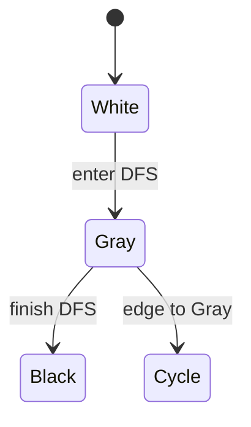

Implementasi:

```go
package graphalg

type color uint8

const (
    white color = iota
    gray
    black
)

func HasCycle[N comparable](g *Graph[N]) bool {
    seen := make(map[N]color, len(g.out))

    var visit func(N) bool
    visit = func(n N) bool {
        switch seen[n] {
        case gray:
            return true
        case black:
            return false
        }

        seen[n] = gray
        for _, to := range g.out[n] {
            if visit(to) {
                return true
            }
        }
        seen[n] = black
        return false
    }

    for n := range g.out {
        if seen[n] == white {
            if visit(n) {
                return true
            }
        }
    }
    return false
}
```

Complexity:

```text
Time  : O(V + E)
Space : O(V) plus recursion stack
```

---

### 6.2 Returning the Actual Cycle

Untuk production, “cycle exists” sering tidak cukup. User butuh cycle path.

Misalnya konfigurasi dependency invalid:

```text
payment -> invoice -> ledger -> payment
```

Kita perlu laporkan cycle tersebut.

```go
package graphalg

func FindCycle[N comparable](g *Graph[N]) ([]N, bool) {
    state := make(map[N]color, len(g.out))
    stack := make([]N, 0, len(g.out))
    pos := make(map[N]int, len(g.out))

    var visit func(N) ([]N, bool)
    visit = func(n N) ([]N, bool) {
        switch state[n] {
        case gray:
            start := pos[n]
            cycle := append([]N(nil), stack[start:]...)
            cycle = append(cycle, n)
            return cycle, true
        case black:
            return nil, false
        }

        state[n] = gray
        pos[n] = len(stack)
        stack = append(stack, n)

        for _, to := range g.out[n] {
            if cycle, ok := visit(to); ok {
                return cycle, true
            }
        }

        stack = stack[:len(stack)-1]
        delete(pos, n)
        state[n] = black
        return nil, false
    }

    for n := range g.out {
        if state[n] == white {
            if cycle, ok := visit(n); ok {
                return cycle, true
            }
        }
    }
    return nil, false
}
```

Catatan:

- Output cycle bisa tidak deterministic kalau iterasi map tidak distabilkan.
- Untuk UX config validation, biasanya deterministic cycle report lebih baik.
- Untuk graph besar, hindari recursive DFS jika depth sangat dalam; gunakan iterative DFS.

---

## 7. Reachability

Reachability menjawab:

> “Dari node X, node mana saja yang bisa dicapai?”

Ini digunakan untuk:

- impact analysis,
- permission inheritance,
- workflow validation,
- transitive dependency,
- downstream data lineage,
- blast radius estimation.

---

### 7.1 Basic Reachability dengan BFS

```go
package graphalg

func ReachableFrom[N comparable](g *Graph[N], start N) map[N]struct{} {
    seen := make(map[N]struct{})
    queue := []N{start}
    seen[start] = struct{}{}
    head := 0

    for head < len(queue) {
        n := queue[head]
        head++

        for _, to := range g.out[n] {
            if _, ok := seen[to]; ok {
                continue
            }
            seen[to] = struct{}{}
            queue = append(queue, to)
        }
    }

    return seen
}
```

Complexity:

```text
O(V_reachable + E_reachable)
```

Bukan selalu `O(V+E)` untuk seluruh graph, hanya bagian reachable.

---

### 7.2 Upstream vs Downstream Reachability

Jika edge berarti:

```text
A -> B
A mempengaruhi B
```

Maka:

- downstream dari A = semua yang terdampak oleh A,
- upstream dari B = semua dependency yang dibutuhkan B.

Untuk upstream query, buat reverse graph.

```go
func Reverse[N comparable](g *Graph[N]) *Graph[N] {
    r := NewGraph[N]()
    for n := range g.out {
        r.AddNode(n)
    }
    for from, tos := range g.out {
        for _, to := range tos {
            r.AddEdge(to, from)
        }
    }
    return r
}
```

Diagram:

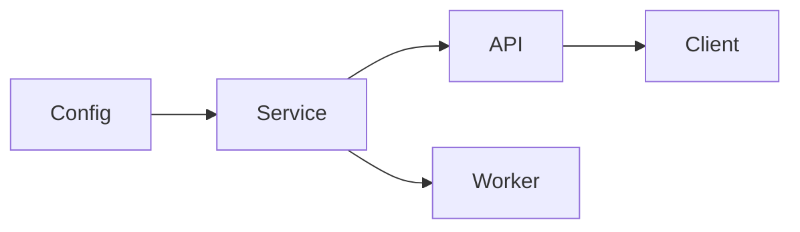

Downstream `Config`:

```text
Service, API, Worker, Client
```

Upstream `Client`:

```text
API, Service, Config
```

---

## 8. Transitive Closure

Transitive closure menjawab reachability untuk semua pasangan node.

Jika `A -> B` dan `B -> C`, maka transitive closure menyimpan bahwa `A -> C` reachable.

Pertanyaan:

```text
Can A eventually reach C?
```

---

### 8.1 Kapan Butuh Transitive Closure?

Gunakan transitive closure jika:

- graph relatif stabil,
- query reachability sangat sering,
- latency query harus kecil,
- memory masih masuk akal.

Contoh:

- permission inheritance graph,
- workflow transition validation,
- static dependency graph,
- product compatibility graph,
- policy implication graph.

Jangan gunakan jika:

- graph sangat besar,
- edge sering berubah,
- query jarang,
- memory lebih mahal daripada traversal.

---

### 8.2 Closure dengan Repeated BFS/DFS

```go
func TransitiveClosure[N comparable](g *Graph[N]) map[N]map[N]struct{} {
    closure := make(map[N]map[N]struct{}, len(g.out))
    for n := range g.out {
        closure[n] = ReachableFrom(g, n)
    }
    return closure
}
```

Complexity:

```text
O(V * (V + E))
```

Untuk graph kecil-menengah, ini cukup. Untuk graph besar, bisa mahal.

---

### 8.3 Closure untuk DAG dengan Topological DP

Untuk DAG, closure bisa dihitung dari belakang topological order.

Intuisi:

```text
reachable(n) = direct_neighbors(n) union reachable(neighbor)
```

Jika semua neighbor sudah diproses, node tinggal merge set.

```go
func DAGClosure[N comparable](g *Graph[N]) (map[N]map[N]struct{}, error) {
    order, err := TopoSort(g)
    if err != nil {
        return nil, err
    }

    closure := make(map[N]map[N]struct{}, len(g.out))
    for i := len(order) - 1; i >= 0; i-- {
        n := order[i]
        set := make(map[N]struct{})

        for _, to := range g.out[n] {
            set[to] = struct{}{}
            for x := range closure[to] {
                set[x] = struct{}{}
            }
        }
        closure[n] = set
    }

    return closure, nil
}
```

Tetap bisa mahal secara memory jika closure dense.

Worst case:

```text
O(V^2) space
```

---

## 9. Shortest Path

Shortest path menjawab:

> “Berapa cost minimum dari A ke B?”

Cost bisa berarti:

- jarak,
- latency,
- risk score,
- number of hops,
- price,
- expected processing time,
- penalty.

---

## 10. Shortest Path pada Unweighted Graph: BFS

Jika semua edge punya cost sama, shortest path berdasarkan jumlah edge bisa dicari dengan BFS.

```go
type PathResult[N comparable] struct {
    Distance int
    Path     []N
    Found    bool
}

func ShortestPathUnweighted[N comparable](g *Graph[N], start, target N) PathResult[N] {
    queue := []N{start}
    seen := map[N]struct{}{start: {}}
    prev := make(map[N]N)
    dist := map[N]int{start: 0}

    head := 0
    for head < len(queue) {
        n := queue[head]
        head++

        if n == target {
            return PathResult[N]{
                Distance: dist[n],
                Path:     reconstructPath(prev, start, target),
                Found:    true,
            }
        }

        for _, to := range g.out[n] {
            if _, ok := seen[to]; ok {
                continue
            }
            seen[to] = struct{}{}
            prev[to] = n
            dist[to] = dist[n] + 1
            queue = append(queue, to)
        }
    }

    return PathResult[N]{Found: false, Distance: -1}
}

func reconstructPath[N comparable](prev map[N]N, start, target N) []N {
    path := []N{target}
    for path[len(path)-1] != start {
        p := prev[path[len(path)-1]]
        path = append(path, p)
    }

    for i, j := 0, len(path)-1; i < j; i, j = i+1, j-1 {
        path[i], path[j] = path[j], path[i]
    }
    return path
}
```

Production caveat:

- Jika `target` tidak reachable, pastikan tidak reconstruct path.
- Jika `start == target`, path harus `[start]`, distance 0.
- Jika graph bisa punya node unknown, tentukan kontrak: unknown berarti empty neighbors atau error?

---

## 11. Weighted Graph

Untuk weighted graph, adjacency list perlu menyimpan edge.

```go
type Edge[N comparable] struct {
    To     N
    Weight int64
}

type WeightedGraph[N comparable] struct {
    out map[N][]Edge[N]
}

func NewWeightedGraph[N comparable]() *WeightedGraph[N] {
    return &WeightedGraph[N]{out: make(map[N][]Edge[N])}
}

func (g *WeightedGraph[N]) AddNode(n N) {
    if _, ok := g.out[n]; !ok {
        g.out[n] = nil
    }
}

func (g *WeightedGraph[N]) AddEdge(from, to N, weight int64) {
    g.AddNode(from)
    g.AddNode(to)
    g.out[from] = append(g.out[from], Edge[N]{To: to, Weight: weight})
}
```

Penting:

- Dijkstra membutuhkan weight non-negative.
- Negative weight invalid untuk Dijkstra.
- Zero weight boleh, tetapi harus hati-hati dengan duplicate/state.

---

## 12. Dijkstra Algorithm

Dijkstra mencari shortest path dari satu start ke semua node pada graph dengan edge weight non-negative.

Mental model:

> Selalu expand node dengan distance sementara paling kecil.

Struktur data utama:

- distance map,
- priority queue,
- previous map,
- visited/finalized set.

Diagram:

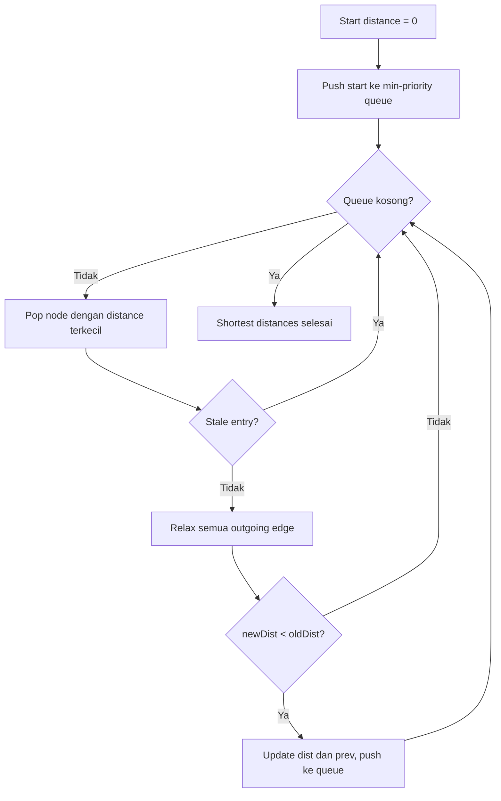

---

### 12.1 Priority Queue untuk Dijkstra

```go
package graphalg

import "container/heap"

type pqItem[N comparable] struct {
    Node N
    Dist int64
}

type minPQ[N comparable] []pqItem[N]

func (p minPQ[N]) Len() int { return len(p) }
func (p minPQ[N]) Less(i, j int) bool { return p[i].Dist < p[j].Dist }
func (p minPQ[N]) Swap(i, j int) { p[i], p[j] = p[j], p[i] }

func (p *minPQ[N]) Push(x any) {
    *p = append(*p, x.(pqItem[N]))
}

func (p *minPQ[N]) Pop() any {
    old := *p
    n := len(old)
    x := old[n-1]
    old[n-1] = pqItem[N]{}
    *p = old[:n-1]
    return x
}
```

Karena `container/heap` belum generic, wrapper tetap membutuhkan `any` di method `Push`/`Pop`. Kita batasi type assertion di boundary kecil ini.

---

### 12.2 Implementasi Dijkstra

```go
package graphalg

import (
    "container/heap"
    "math"
)

type WeightedPathResult[N comparable] struct {
    Distance int64
    Path     []N
    Found    bool
}

func Dijkstra[N comparable](g *WeightedGraph[N], start, target N) WeightedPathResult[N] {
    const inf int64 = math.MaxInt64

    dist := make(map[N]int64, len(g.out))
    prev := make(map[N]N, len(g.out))

    for n := range g.out {
        dist[n] = inf
    }
    if _, ok := g.out[start]; !ok {
        return WeightedPathResult[N]{Found: false, Distance: -1}
    }
    if _, ok := g.out[target]; !ok {
        return WeightedPathResult[N]{Found: false, Distance: -1}
    }

    dist[start] = 0
    pq := &minPQ[N]{}
    heap.Init(pq)
    heap.Push(pq, pqItem[N]{Node: start, Dist: 0})

    for pq.Len() > 0 {
        item := heap.Pop(pq).(pqItem[N])
        n := item.Node

        if item.Dist != dist[n] {
            continue // stale entry
        }

        if n == target {
            return WeightedPathResult[N]{
                Distance: dist[n],
                Path:     reconstructPath(prev, start, target),
                Found:    true,
            }
        }

        for _, e := range g.out[n] {
            if e.Weight < 0 {
                // In production, validate earlier and return error instead.
                continue
            }
            if dist[n] > inf-e.Weight {
                continue // overflow guard
            }
            nd := dist[n] + e.Weight
            if nd < dist[e.To] {
                dist[e.To] = nd
                prev[e.To] = n
                heap.Push(pq, pqItem[N]{Node: e.To, Dist: nd})
            }
        }
    }

    return WeightedPathResult[N]{Found: false, Distance: -1}
}
```

Production caveat:

- Jangan diam-diam skip negative weight; contoh di atas hanya menyederhanakan. Versi production harus validasi dan return error.
- Guard overflow penting jika weight berasal dari input eksternal.
- Stale entry approach lebih sederhana daripada decrease-key.
- Untuk graph besar dan query banyak, pertimbangkan indexing/precomputation.

Complexity dengan binary heap:

```text
Time  : O((V + E) log V)
Space : O(V + E) untuk graph + O(V) untuk dist/prev/pq
```

---

## 13. Bellman-Ford Intuition

Dijkstra tidak valid untuk edge weight negatif.

Bellman-Ford bisa menangani negative weight dan mendeteksi negative cycle, tetapi lebih mahal.

Complexity:

```text
O(V * E)
```

Kapan relevan di production?

- financial arbitrage modelling,
- penalty/reward graph,
- policy scoring dengan negative adjustment,
- dependency cost yang bisa mengurangi total.

Namun di backend biasa, negative weight sering sinyal model yang perlu dipikir ulang.

Rule praktis:

> Jika “cost” merepresentasikan waktu, jarak, latency, effort, atau risk, biasanya harus non-negative. Gunakan Dijkstra dan validasi input.

---

## 14. Strongly Connected Components

Dalam directed graph, strongly connected component atau SCC adalah kelompok node yang saling reachable.

Artinya untuk semua node A dan B dalam SCC:

```text
A can reach B
B can reach A
```

SCC sangat berguna untuk menemukan cycle group.

Contoh:

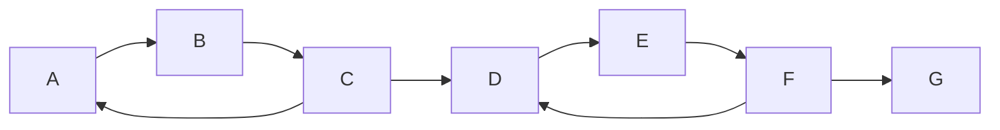

SCC:

```text
{A, B, C}
{D, E, F}
{G}
```

---

## 15. Kenapa SCC Penting di Production?

Cycle detection hanya mengatakan ada cycle. SCC memberi struktur masalah.

Contoh dependency graph:

```text
Billing -> Invoice -> Ledger -> Billing
Notification -> Template
Auth -> User
```

Cycle group:

```text
Billing, Invoice, Ledger
```

Ini membantu:

- error report yang actionable,
- refactoring dependency,
- module boundary analysis,
- detecting mutually recursive workflows,
- finding permission inheritance loops,
- compressing cyclic graph menjadi DAG komponen.

---

## 16. Kosaraju Algorithm

Kosaraju algorithm:

1. DFS pada graph original, simpan finish order.
2. Reverse graph.
3. DFS pada reverse graph mengikuti reverse finish order.
4. Setiap DFS tree di tahap kedua adalah SCC.

Complexity:

```text
O(V + E)
```

Implementasi:

```go
package graphalg

func StronglyConnectedComponents[N comparable](g *Graph[N]) [][]N {
    visited := make(map[N]struct{}, len(g.out))
    order := make([]N, 0, len(g.out))

    var dfs1 func(N)
    dfs1 = func(n N) {
        if _, ok := visited[n]; ok {
            return
        }
        visited[n] = struct{}{}
        for _, to := range g.out[n] {
            dfs1(to)
        }
        order = append(order, n)
    }

    for n := range g.out {
        dfs1(n)
    }

    rg := Reverse(g)
    visited = make(map[N]struct{}, len(g.out))
    components := make([][]N, 0)

    var dfs2 func(N, *[]N)
    dfs2 = func(n N, comp *[]N) {
        if _, ok := visited[n]; ok {
            return
        }
        visited[n] = struct{}{}
        *comp = append(*comp, n)
        for _, to := range rg.out[n] {
            dfs2(to, comp)
        }
    }

    for i := len(order) - 1; i >= 0; i-- {
        n := order[i]
        if _, ok := visited[n]; ok {
            continue
        }
        comp := make([]N, 0)
        dfs2(n, &comp)
        components = append(components, comp)
    }

    return components
}
```

Caveat:

- Recursive DFS bisa bermasalah untuk graph sangat dalam.
- Output tidak deterministic jika map iteration tidak distabilkan.
- Untuk graph production besar, Tarjan iterative atau library khusus bisa dipertimbangkan.

---

## 17. Condensation Graph

Setiap SCC bisa dikompresi menjadi satu node. Hasilnya selalu DAG.

Ini disebut condensation graph.

Diagram:

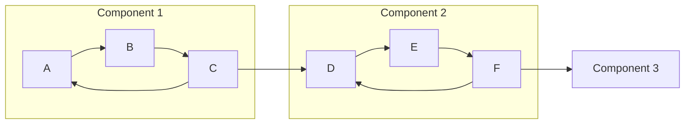

Setelah dikompresi:

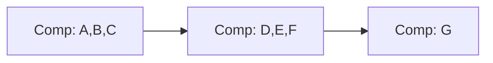

Kegunaan:

- memahami dependency antar cluster,
- menganalisis cyclic modules,
- memisahkan cycle internal dari order eksternal,
- refactoring architecture.

---

## 18. Graph Validation untuk Workflow

Workflow graph bukan hanya graph directed. Ia punya semantic.

Contoh workflow case management:

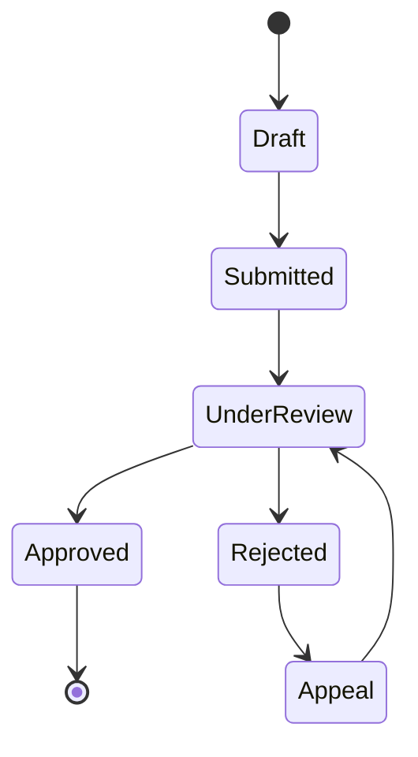

Validasi yang sering dibutuhkan:

1. Start state ada.
2. Terminal state ada.
3. Semua state reachable dari start.
4. Tidak ada state non-terminal dead-end.
5. Cycle hanya boleh jika explicitly allowed.
6. Semua transition punya action/guard/audit reason.
7. Tidak ada transition yang melewati mandatory review.
8. Tidak ada privilege transition untuk actor yang salah.

---

### 18.1 Model Workflow Graph

```go
type State string

type Transition struct {
    From   State
    To     State
    Action string
    Guard  string
}

type Workflow struct {
    Start     State
    Terminal  map[State]struct{}
    Transitions []Transition
}
```

Build graph:

```go
func BuildWorkflowGraph(w Workflow) *Graph[State] {
    g := NewGraph[State]()
    g.AddNode(w.Start)
    for t := range w.Terminal {
        g.AddNode(t)
    }
    for _, tr := range w.Transitions {
        g.AddEdge(tr.From, tr.To)
    }
    return g
}
```

---

### 18.2 Validate Reachability

```go
func ValidateWorkflowReachability(w Workflow) []string {
    g := BuildWorkflowGraph(w)
    reachable := ReachableFrom(g, w.Start)

    var problems []string
    for state := range g.out {
        if _, ok := reachable[state]; !ok {
            problems = append(problems, "unreachable state: "+string(state))
        }
    }
    return problems
}
```

---

### 18.3 Validate Dead-End

Dead-end adalah state tanpa outgoing edge. Ini valid hanya jika terminal.

```go
func ValidateNoUnexpectedDeadEnd(w Workflow) []string {
    g := BuildWorkflowGraph(w)
    var problems []string

    for state, out := range g.out {
        if len(out) == 0 {
            if _, terminal := w.Terminal[state]; !terminal {
                problems = append(problems, "non-terminal dead-end state: "+string(state))
            }
        }
    }
    return problems
}
```

---

### 18.4 Workflow Cycle Policy

Tidak semua cycle buruk.

Contoh cycle valid:

```text
UnderReview -> NeedMoreInfo -> Submitted -> UnderReview
```

Contoh cycle berbahaya:

```text
Approved -> UnderReview -> Approved
```

Jadi production validator tidak boleh sekadar “cycle = invalid”. Harus ada policy.

Contoh:

```go
type CyclePolicy int

const (
    CycleForbidden CyclePolicy = iota
    CycleAllowedWithExplicitStates
)
```

Untuk regulatory lifecycle, cycle harus memiliki:

- audit reason,
- actor authorization,
- maximum retry/escalation policy,
- explicit business meaning.

Graph algorithm menemukan cycle; domain policy menentukan apakah cycle itu boleh.

---

## 19. Dependency Deployment Order

Misalnya ada service:

```text
api depends on auth
api depends on billing
billing depends on ledger
ledger depends on database
```

Jika edge `dependency -> dependent`, topological sort memberi deploy/start order.

```go
func DeploymentOrder(deps map[string][]string) ([]string, error) {
    g := NewGraph[string]()

    for service, dependencies := range deps {
        g.AddNode(service)
        for _, dep := range dependencies {
            // dep must come before service
            g.AddEdge(dep, service)
        }
    }

    return TopoSort(g)
}
```

Input:

```go
deps := map[string][]string{
    "api":     {"auth", "billing"},
    "billing": {"ledger"},
    "ledger":  {"database"},
    "auth":    {"database"},
}
```

Possible output:

```text
database, ledger, auth, billing, api
```

Karena map iteration tidak deterministic, gunakan stable topo sort untuk deployment plan yang dicatat atau direview manusia.

---

## 20. Permission Inheritance Graph

Permission graph sering directed.

Misalnya:

```text
Admin -> Manager -> Officer -> Viewer
```

Jika edge `A -> B` berarti A inherits B permissions, maka permission effective Admin adalah semua node reachable dari Admin plus Admin sendiri.

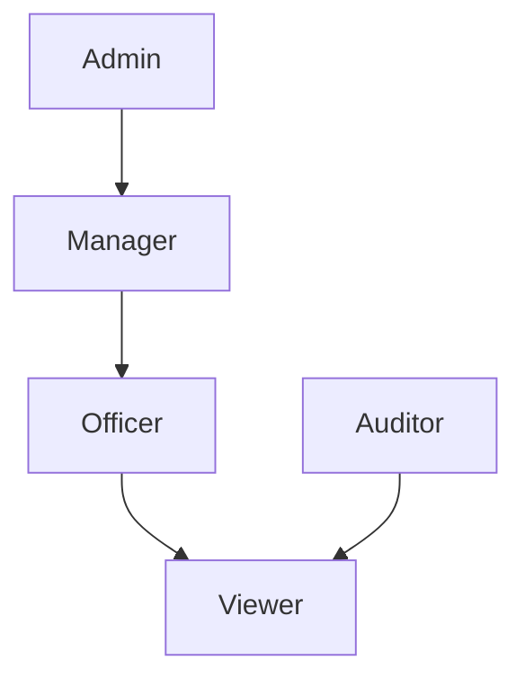

Effective permissions:

```text
Admin = Admin + Manager + Officer + Viewer
Auditor = Auditor + Viewer
```

Implementasi:

```go
func EffectiveRoles(g *Graph[string], role string) []string {
    reachable := ReachableFrom(g, role)
    result := make([]string, 0, len(reachable))
    for r := range reachable {
        result = append(result, r)
    }
    return result
}
```

Production caveat:

- Role inheritance cycle harus dilarang atau ditangani eksplisit.
- Effective permission harus deterministic untuk audit report.
- Permission expansion harus cacheable tapi invalidation harus benar.
- Jangan confuse graph role inheritance dengan user assignment.
- Jangan membuat edge direction ambigu.

Saran modelling:

```text
RoleA -> RoleB means RoleA includes RoleB
```

Dokumentasikan ini di package.

---

## 21. Impact Analysis

Impact analysis menjawab:

> “Kalau node X berubah, apa saja yang terdampak?”

Contoh data pipeline:

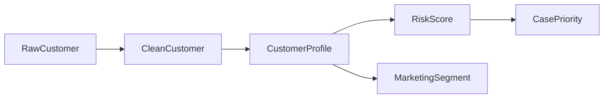

Jika `CleanCustomer` berubah, downstream impact:

```text
CustomerProfile, RiskScore, MarketingSegment, CasePriority
```

Implementasi sama dengan reachability.

Tetapi production impact analysis biasanya perlu metadata:

- direct vs indirect impact,
- distance/hop,
- path explanation,
- criticality,
- owner,
- SLA,
- recomputation cost.

---

### 21.1 Reachability dengan Distance

```go
func ReachableWithDistance[N comparable](g *Graph[N], start N) map[N]int {
    dist := map[N]int{start: 0}
    queue := []N{start}
    head := 0

    for head < len(queue) {
        n := queue[head]
        head++

        for _, to := range g.out[n] {
            if _, ok := dist[to]; ok {
                continue
            }
            dist[to] = dist[n] + 1
            queue = append(queue, to)
        }
    }

    return dist
}
```

Distance membantu membedakan:

```text
hop 1 = direct impact
hop 2+ = indirect impact
```

---

## 22. Incremental Graph Updates

Graph production sering berubah:

- service dependency ditambah,
- workflow transition diubah,
- role inheritance berubah,
- pipeline node ditambah,
- feature flag dependency berubah.

Pertanyaan:

> Apakah setiap perubahan harus recompute semuanya?

Jawaban bergantung pada ukuran dan frekuensi.

| Ukuran graph | Update frequency | Strategy |
|---|---:|---|
| Kecil | Jarang | Recompute semua |
| Medium | Sedang | Recompute affected area |
| Besar | Sering | Incremental index/cache |
| Sangat besar | Sering | Dedicated graph store / specialized engine |

Prinsip:

> Jangan membuat incremental algorithm sebelum full recompute terbukti bottleneck.

Full recompute lebih mudah diuji, lebih mudah diaudit, dan lebih kecil risiko stale index.

---

## 23. Caching Graph Query

Graph query yang sering:

- effective role,
- transitive dependencies,
- downstream impact,
- workflow allowed next states,
- reachable nodes.

Bisa dicache.

Namun cache harus punya invalidation.

Pattern sederhana:

```go
type VersionedGraph[N comparable] struct {
    version uint64
    graph   *Graph[N]
}

type ReachabilityCache[N comparable] struct {
    graphVersion uint64
    byStart      map[N]map[N]struct{}
}
```

Jika graph version berubah, cache invalid.

Production choices:

- invalidate all on change,
- invalidate affected start nodes,
- rebuild asynchronously,
- copy-on-write snapshot,
- cache per version.

Untuk sistem regulatory/audit, cache result harus explainable:

```text
permission granted because Admin -> Manager -> Officer -> ApproveCase
```

Jangan hanya cache boolean tanpa path kalau auditability penting.

---

## 24. Path Explanation

Banyak domain tidak cukup menjawab `true/false`.

Contoh:

```text
Can user approve case?
```

Jawaban bagus:

```text
Yes, because user has SeniorOfficer, SeniorOfficer includes Officer, Officer grants ApproveCase.
```

Graph path memberi explanation.

```go
func FindPath[N comparable](g *Graph[N], start, target N) ([]N, bool) {
    queue := []N{start}
    seen := map[N]struct{}{start: {}}
    prev := make(map[N]N)
    head := 0

    for head < len(queue) {
        n := queue[head]
        head++

        if n == target {
            return reconstructPath(prev, start, target), true
        }

        for _, to := range g.out[n] {
            if _, ok := seen[to]; ok {
                continue
            }
            seen[to] = struct{}{}
            prev[to] = n
            queue = append(queue, to)
        }
    }
    return nil, false
}
```

Untuk deterministic explanation, urutkan neighbors.

---

## 25. Graph Algorithm dan Error Modelling

Jangan desain API graph hanya dengan return boolean.

Bad:

```go
func Validate(g Graph) bool
```

Better:

```go
type GraphProblem struct {
    Code    string
    Message string
    Nodes   []string
    Edge    *[2]string
}

type ValidationReport struct {
    Problems []GraphProblem
}
```

Contoh problem code:

```text
CYCLE_DETECTED
UNREACHABLE_NODE
UNKNOWN_NODE
DUPLICATE_EDGE
NON_TERMINAL_DEAD_END
NEGATIVE_WEIGHT
MISSING_START_NODE
MISSING_TERMINAL_NODE
```

Production validator seharusnya:

- mengumpulkan banyak problem sekaligus jika memungkinkan,
- memberi node/edge penyebab,
- deterministic,
- tidak panic untuk input buruk,
- memisahkan structural error dari domain policy error.

---

## 26. Testing Graph Algorithms

Graph algorithm rentan bug karena kombinasi edge case.

Test wajib:

### 26.1 Empty Graph

```text
V=0, E=0
```

Tentukan kontrak:

- topo sort return empty?
- start missing return error?
- reachability from unknown return only start atau empty/error?

Tidak ada jawaban universal. Yang penting eksplisit.

### 26.2 Single Node

```text
A
```

Expected:

- no cycle,
- topo `[A]`,
- reachable from A = A.

### 26.3 Simple Chain

```text
A -> B -> C
```

Expected:

- topo A before B before C,
- reachable A includes B,C,
- shortest A to C = 2 hops.

### 26.4 Diamond

```text
A -> B
A -> C
B -> D
C -> D
```

Expected:

- D appears after B and C,
- no duplicate D,
- reachability stable.

### 26.5 Cycle

```text
A -> B -> C -> A
```

Expected:

- topo error,
- cycle detected,
- SCC `{A,B,C}`.

### 26.6 Disconnected Graph

```text
A -> B
C -> D
```

Expected:

- topo includes all nodes,
- reachable A does not include C/D,
- SCC separate.

### 26.7 Self Loop

```text
A -> A
```

Expected:

- cycle detected.

### 26.8 Duplicate Edge

```text
A -> B
A -> B
```

Tentukan kontrak:

- allowed?
- normalized?
- error?

Untuk dependency graph, duplicate biasanya lebih baik dinormalisasi atau divalidasi sebagai warning.

---

## 27. Property-Based Thinking

Untuk topological sort, property utama:

```text
For every edge u -> v, index(u) < index(v)
```

Test tidak perlu mengharapkan urutan exact kecuali stable sort.

```go
func AssertTopoOrder[N comparable](order []N, edges [][2]N) bool {
    pos := make(map[N]int, len(order))
    for i, n := range order {
        pos[n] = i
    }
    for _, e := range edges {
        if pos[e[0]] >= pos[e[1]] {
            return false
        }
    }
    return true
}
```

Untuk reachability:

```text
If B is reachable from A and C is reachable from B, then C is reachable from A.
```

Untuk SCC:

```text
All nodes in same component are mutually reachable.
```

Untuk shortest path unweighted:

```text
Distance must equal path length - 1.
```

---

## 28. Benchmarking Graph Algorithms

Graph benchmark harus mempertimbangkan shape.

Graph shape berbeda menghasilkan performa berbeda:

| Shape | Karakter |
|---|---|
| Chain | Depth tinggi, branching rendah |
| Star | Branching tinggi dari satu node |
| Dense | Banyak edge, memory berat |
| DAG layered | Mirip pipeline/dependency |
| Random sparse | Umum untuk network ringan |
| Scale-free | Beberapa hub besar |
| Cyclic clusters | Relevan untuk SCC |

Benchmark hanya satu graph random tidak cukup.

Contoh generator chain:

```go
func ChainGraph(n int) *Graph[int] {
    g := NewGraph[int]()
    for i := 0; i < n; i++ {
        g.AddNode(i)
    }
    for i := 0; i+1 < n; i++ {
        g.AddEdge(i, i+1)
    }
    return g
}
```

Generator layered DAG:

```go
func LayeredDAG(layers, width int) *Graph[int] {
    g := NewGraph[int]()
    id := func(layer, offset int) int { return layer*width + offset }

    for l := 0; l < layers; l++ {
        for i := 0; i < width; i++ {
            g.AddNode(id(l, i))
        }
    }

    for l := 0; l+1 < layers; l++ {
        for i := 0; i < width; i++ {
            for j := 0; j < width; j++ {
                g.AddEdge(id(l, i), id(l+1, j))
            }
        }
    }
    return g
}
```

Benchmark dimensions:

- V count,
- E count,
- max outdegree,
- depth,
- disconnected components,
- repeated query vs one-off query,
- allocation count,
- deterministic sorting cost.

---

## 29. Common Production Anti-Patterns

### 29.1 Edge Direction Tidak Jelas

Bad:

```text
A -> B means A depends on B?
or B depends on A?
```

Good:

```text
In this graph, edge A -> B means A must happen before B.
```

Atau:

```text
In this graph, edge A -> B means A includes B permission.
```

Direction adalah kontrak utama graph.

---

### 29.2 Recursive DFS untuk Input Tak Terbatas

Jika graph berasal dari input user atau data eksternal, depth bisa sangat besar.

Risiko:

- stack growth besar,
- latency spike,
- crash jika recursion ekstrem.

Solusi:

- iterative traversal,
- depth limit,
- validation limit,
- graph size cap.

---

### 29.3 Repeated Reachability Tanpa Cache

Bad:

```go
for _, user := range users {
    ReachableFrom(roleGraph, user.Role)
}
```

Jika banyak user punya role sama, cache per role.

---

### 29.4 Topological Sort tanpa Cycle Report

Bad UX:

```text
invalid dependency graph
```

Good UX:

```text
cycle detected: billing -> invoice -> ledger -> billing
```

---

### 29.5 Stable Output Dianggap Tidak Penting

Untuk machine-only runtime, mungkin tidak masalah.

Untuk config validation, audit, generated plan, atau test snapshot, unstable output menyakitkan.

---

### 29.6 Graph Database untuk Masalah Kecil

Tidak semua graph butuh graph database.

Jika graph:

- kecil,
- static,
- local to service,
- query sederhana,

in-memory adjacency list + validation sering cukup.

Graph database baru masuk akal jika:

- graph sangat besar,
- query ad hoc kompleks,
- multi-hop traversal dinamis,
- banyak relationship type,
- perlu indexing khusus,
- graph dibagi antar banyak service/user.

---

## 30. Production Design Checklist

Sebelum ship graph-based feature, jawab ini:

### Semantics

- Apa arti node?
- Apa arti edge?
- Apakah direction jelas?
- Apakah graph directed/undirected?
- Apakah edge weighted?
- Apakah duplicate edge boleh?
- Apakah self-loop boleh?

### Validity

- Apakah cycle boleh?
- Apakah disconnected node boleh?
- Apakah unknown node boleh?
- Apakah semua terminal/reachable rule tervalidasi?
- Apakah graph punya size limit?

### Algorithm

- Query utama apa?
- BFS/DFS cukup?
- Butuh topological sort?
- Butuh SCC?
- Butuh shortest path?
- Butuh transitive closure?
- Butuh deterministic output?

### Performance

- Berapa V dan E maksimum?
- Graph static atau sering berubah?
- Query one-off atau repeated?
- Perlu cache?
- Apa invalidation strategy?
- Apa memory worst-case?

### Reliability

- Error report actionable?
- Bisa menjelaskan path/reason?
- Ada protection dari infinite traversal?
- Ada test untuk cycle, self-loop, disconnected graph?
- Ada benchmark untuk graph shape realistis?

### Auditability

- Bisa menjelaskan kenapa decision true?
- Bisa mencatat path yang dipakai?
- Bisa reproduce output?
- Deterministic untuk report?

---

## 31. Case Study: Regulatory Case Workflow Graph

Bayangkan sistem case management.

State:

```text
Draft
Submitted
Screening
Investigation
EnforcementReview
WarningIssued
PenaltyIssued
Closed
Appeal
```

Transitions:

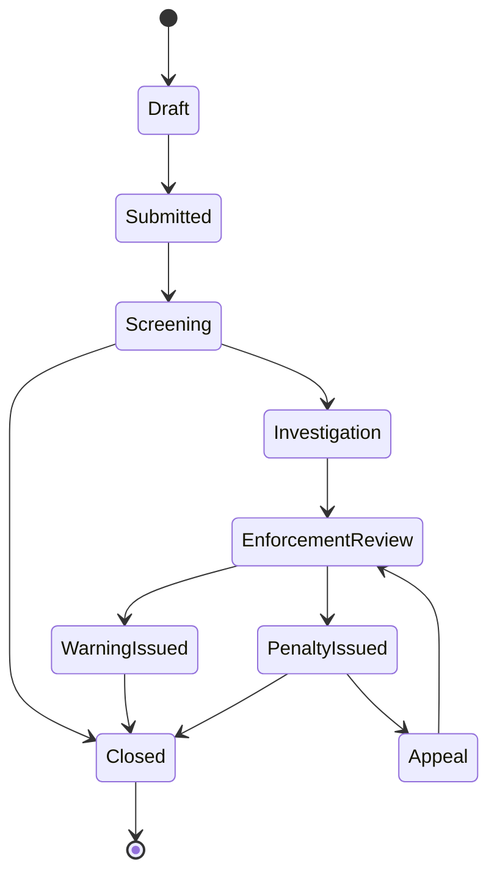

Graph questions:

| Question | Algorithm |
|---|---|
| Bisa state `PenaltyIssued` dicapai dari `Draft`? | Reachability |
| Ada state tidak reachable? | Reachability from start |
| Ada non-terminal dead-end? | Outdegree + terminal set |
| Ada loop? | Cycle detection |
| Loop mana yang allowed? | Cycle + domain policy |
| Apa impact jika `Screening` dihapus? | Downstream reachability |
| Apakah `Closed` bisa balik ke non-terminal? | Reachability from terminal should be restricted |

Poin penting:

> Workflow graph bukan hanya routing state. Ia adalah regulatory control surface.

Kalau graph salah, sistem bisa memperbolehkan proses yang tidak defensible secara audit.

---

## 32. Case Study: Service Dependency Deployment

Service:

```text
config
identity
case-api
case-worker
document-api
notification
reporting
```

Dependency:

```text
identity depends on config
case-api depends on identity, document-api
case-worker depends on case-api, notification
reporting depends on case-api
notification depends on config
document-api depends on config
```

Direction untuk topological sort:

```text
dependency -> dependent
```

Graph:

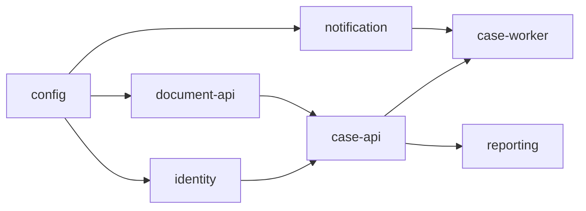

Topological sort memberi safe startup/deploy order.

Jika cycle muncul:

```text
case-api depends on reporting
reporting depends on case-api
```

Validasi harus gagal sebelum deployment.

---

## 33. Case Study: Permission Inheritance with Explanation

Role graph:

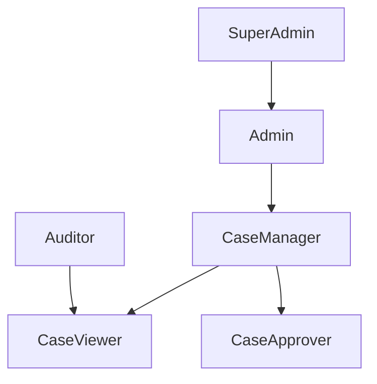

Question:

```text
Does SuperAdmin include CaseApprover?
```

Algorithm:

- BFS path from `SuperAdmin` to `CaseApprover`.

Result:

```text
SuperAdmin -> Admin -> CaseManager -> CaseApprover
```

This is audit-friendly.

Bad authorization answer:

```text
allowed: true
```

Better:

```text
allowed because SuperAdmin includes Admin, Admin includes CaseManager, and CaseManager includes CaseApprover
```

Graph path becomes explanation.

---

## 34. Summary

Graph algorithms di production bukan materi akademik terpisah dari backend engineering. Ia muncul dalam desain nyata:

- dependency ordering,
- workflow lifecycle,
- permission inheritance,
- impact analysis,
- deployment planning,
- data lineage,
- rule evaluation,
- module architecture.

Algoritma utama yang harus dikuasai:

| Algorithm | Production use |
|---|---|
| BFS/DFS | traversal, reachability, impact |
| Topological sort | dependency order, migration order |
| Cycle detection | config/workflow/dependency validation |
| SCC | cyclic cluster analysis |
| Reverse graph | upstream dependency query |
| Transitive closure | repeated reachability query |
| Dijkstra | weighted shortest path non-negative |
| Bellman-Ford intuition | negative weight / negative cycle reasoning |

Mental model terpenting:

> Graph algorithm memilih bukan berdasarkan nama algoritma, tetapi berdasarkan pertanyaan production yang ingin dijawab dan invariant domain yang harus dijaga.

---

## 35. Latihan

### Latihan 1 — Dependency Validator

Buat validator dependency module:

Input:

```go
map[string][]string{
    "case-api": {"identity", "document"},
    "identity": {"config"},
    "document": {"config"},
}
```

Output:

- topological order,
- cycle report jika ada,
- unknown dependency jika dependency tidak terdaftar.

Tambahkan stable output.

---

### Latihan 2 — Workflow Validator

Buat workflow validator yang mengecek:

- start state ada,
- terminal state ada,
- semua state reachable,
- semua non-terminal punya outgoing transition,
- cycle hanya boleh jika state termasuk allowlist.

---

### Latihan 3 — Permission Explanation

Buat function:

```go
func ExplainInheritance(g *Graph[string], from, to string) ([]string, bool)
```

Jika `from` bisa mencapai `to`, return path.

Contoh:

```text
SuperAdmin -> Admin -> CaseManager -> CaseApprover
```

---

### Latihan 4 — Impact Analysis

Buat function:

```go
func DownstreamImpact(g *Graph[string], changed string) []Impact
```

Dengan:

```go
type Impact struct {
    Node     string
    Distance int
    Direct   bool
}
```

---

### Latihan 5 — SCC Report

Buat SCC report untuk module dependency graph.

Output hanya komponen dengan size > 1 atau self-loop.

Format:

```text
cycle group: billing, invoice, ledger
```

---

## 36. Checklist Review PR

Saat review PR yang memakai graph algorithm, tanyakan:

- Apakah arti edge sudah jelas?
- Apakah direction edge tidak ambigu?
- Apakah graph boleh cycle?
- Apakah algorithm sesuai pertanyaan domain?
- Apakah output perlu deterministic?
- Apakah error report actionable?
- Apakah ada test self-loop?
- Apakah ada test disconnected graph?
- Apakah ada test duplicate edge?
- Apakah graph size bisa bounded?
- Apakah repeated query butuh cache?
- Apakah cache invalidation jelas?
- Apakah path explanation dibutuhkan untuk audit?

---

## 37. Penutup Part 017

Part ini membangun toolkit graph untuk sistem nyata.

Kita tidak hanya mempelajari:

```text
DFS, BFS, topo sort, Dijkstra
```

Tapi cara memetakan algoritma itu ke problem engineering:

```text
dependency safety
workflow correctness
permission explainability
impact analysis
deployment order
data lineage
cycle diagnostics
```

Part berikutnya akan masuk ke:

```text
Part 018 — Dynamic Programming: Memoization, Tabulation, dan State Compression
```

Dynamic programming akan mengubah cara kita melihat problem yang punya overlapping subproblem, optimization state, scoring, scheduling, dan cost modelling.

---

## Referensi Resmi dan Rujukan Stabil

- Go Language Specification — tipe, map, slice, function, dan generic constraint semantics.
- Go standard library documentation — `container/heap`, `slices`, `cmp`, `sort`, `testing`.
- Go release notes 1.26 — baseline versi seri ini.
- Go release history — validasi versi Go 1.26.x.
- CLRS-style algorithm foundations untuk graph traversal, topological sort, shortest path, dan SCC.

<!-- NAVIGATION_FOOTER -->
<div class="page-nav">
<a href="./learn-go-data-structure-algorithm-part-016.md">⬅️ Part 016 — Graph Fundamentals: Representation, Traversal, dan Modelling</a>
<a href="./index.md">📚 Kategori</a>
<a href="../../index.md">🏠 Home</a>
<a href="./learn-go-data-structure-algorithm-part-018.md">Part 018 — Dynamic Programming: Memoization, Tabulation, dan State Compression ➡️</a>
</div>
