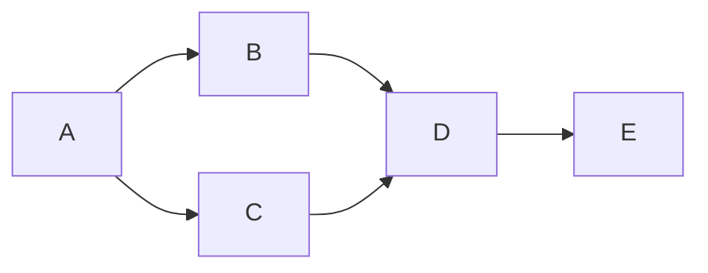
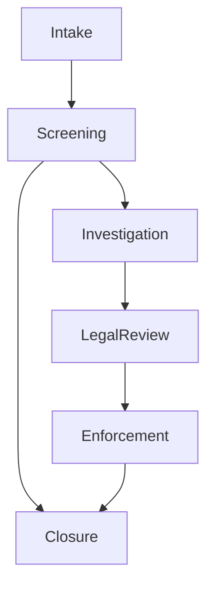
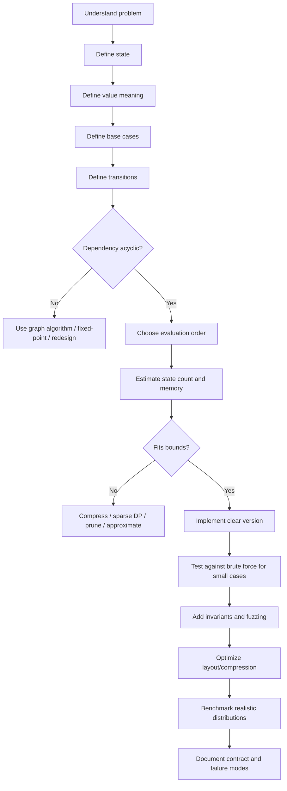

# learn-go-data-structure-algorithm-part-018.md

# Part 018 — Dynamic Programming: Memoization, Tabulation, dan State Compression

> Seri: `learn-go-data-structure-algorithm`  
> Part: `018 / 034`  
> Fokus: Dynamic Programming sebagai teknik modelling state, bukan sekadar kumpulan template.  
> Target pembaca: Java software engineer yang sedang membangun keluwesan algoritmik dan production engineering di Go.

---

## 0. Posisi Part Ini dalam Seri

Pada part sebelumnya kita sudah membahas graph fundamentals dan graph algorithms untuk production systems. Sekarang kita masuk ke **Dynamic Programming** atau DP.

Banyak engineer mengenal DP sebagai topik interview yang terasa seperti trik:

- Fibonacci.
- Knapsack.
- Longest Common Subsequence.
- Coin Change.
- Edit Distance.
- Matrix path.

Tetapi dalam engineering nyata, DP lebih dalam dari itu.

DP adalah cara berpikir ketika sebuah keputusan besar dapat dipecah menjadi banyak keputusan kecil yang:

1. memiliki **subproblem yang berulang**,
2. dapat disimpan hasilnya,
3. memiliki relasi transisi yang stabil,
4. dan solusi akhirnya dapat dibangun dari solusi subproblem.

Dalam sistem backend, DP muncul pada:

- scheduling,
- optimization,
- scoring,
- cost calculation,
- pricing,
- policy evaluation,
- route planning,
- diffing,
- reconciliation,
- workflow analysis,
- dependency impact analysis,
- quota allocation,
- validation planning,
- batch packing,
- resource assignment.

Jadi tujuan part ini bukan membuat Anda bisa menjawab soal DP tertentu, tetapi membuat Anda mampu melihat:

> “Apakah problem ini punya state space yang bisa dimodelkan, disimpan, dikompresi, dan dievaluasi secara aman?”

---

## 1. Definisi Mental: Apa Itu Dynamic Programming?

Dynamic Programming adalah teknik menyelesaikan problem dengan menyimpan hasil subproblem agar tidak dihitung berulang.

Namun definisi ini masih terlalu dangkal.

Definisi yang lebih berguna:

> DP adalah teknik modelling problem sebagai kumpulan state, lalu mendefinisikan transisi antar-state sehingga nilai state akhir dapat dihitung dari state-state yang lebih kecil, sebelumnya, atau lebih sederhana.

Elemen utama DP:

| Elemen | Pertanyaan |
|---|---|
| State | Informasi minimum apa yang diperlukan untuk mendeskripsikan posisi problem saat ini? |
| Value | Apa nilai yang disimpan pada tiap state? |
| Transition | Dari state mana nilai ini bisa dihitung? |
| Base Case | State mana yang nilainya sudah diketahui tanpa rekursi? |
| Order | Urutan evaluasi apa yang memastikan dependency sudah dihitung dulu? |
| Answer | State mana yang menjadi jawaban akhir? |

DP bukan “loop dua dimensi”. DP adalah **state machine numerik/logis**.

---

## 2. Dua Syarat DP

Sebuah problem cocok untuk DP bila punya dua properti berikut.

### 2.1 Overlapping Subproblems

Subproblem yang sama muncul berkali-kali.

Contoh Fibonacci naïve:

```text
fib(5)
├── fib(4)
│   ├── fib(3)
│   │   ├── fib(2)
│   │   └── fib(1)
│   └── fib(2)
└── fib(3)
    ├── fib(2)
    └── fib(1)
```

`fib(3)`, `fib(2)`, dan `fib(1)` dihitung berulang.

DP menyimpan hasilnya.

### 2.2 Optimal Substructure

Solusi optimal problem besar dapat dibangun dari solusi optimal subproblem.

Contoh shortest path pada graph dengan bobot non-negatif:

> Jika path terpendek A → D melewati B, maka segmen A → B juga harus merupakan path terpendek dari A ke B.

Kalau tidak, kita bisa mengganti A → B dengan path yang lebih pendek dan menghasilkan A → D yang lebih pendek.

Itulah bentuk optimal substructure.

---

## 3. DP Bukan Hanya Optimization

DP sering diasosiasikan dengan “minimum” atau “maximum”. Padahal value DP bisa berupa banyak hal.

| Jenis Value | Contoh |
|---|---|
| Boolean | Apakah state reachable? |
| Integer count | Berapa banyak cara mencapai state? |
| Cost | Minimum biaya mencapai state. |
| Score | Maximum score dari pilihan. |
| Set | Entity mana yang reachable dari state ini. |
| Struct | Cost + predecessor + metadata. |
| Path pointer | Rekonstruksi solusi. |
| Policy result | Allowed/Denied/Conditional. |

Dalam Go, DP value sering lebih baik dibuat explicit sebagai struct daripada beberapa slice paralel yang sulit dibaca.

Contoh:

```go
type StateValue struct {
    Reachable bool
    Cost      int64
    Prev      int
}
```

Ini lebih jelas daripada:

```go
reachable := make([]bool, n)
cost := make([]int64, n)
prev := make([]int, n)
```

Namun struct juga punya trade-off memory layout. Untuk data besar, beberapa array terpisah kadang lebih cache-friendly dan lebih hemat bila field tidak selalu dibutuhkan.

---

## 4. Memoization vs Tabulation

Ada dua gaya utama DP.

### 4.1 Memoization: Top-Down DP

Memoization mulai dari problem akhir, lalu menghitung subproblem saat dibutuhkan.

Contoh:

```go
func FibMemo(n int) int64 {
    memo := make(map[int]int64)

    var fib func(int) int64
    fib = func(x int) int64 {
        if x <= 1 {
            return int64(x)
        }
        if v, ok := memo[x]; ok {
            return v
        }
        v := fib(x-1) + fib(x-2)
        memo[x] = v
        return v
    }

    return fib(n)
}
```

Karakter memoization:

| Aspek | Dampak |
|---|---|
| Natural untuk problem recursive | Mudah ditulis dari recurrence. |
| Hanya menghitung state yang dibutuhkan | Bagus untuk sparse state space. |
| Memakai call stack | Risiko stack growth/depth. |
| Sering memakai map | Ada overhead hashing dan allocation. |
| Dependency order implisit | Lebih mudah benar, tapi sulit optimize. |

### 4.2 Tabulation: Bottom-Up DP

Tabulation menghitung state dari base case ke arah jawaban.

```go
func FibTab(n int) int64 {
    if n <= 1 {
        return int64(n)
    }

    dp := make([]int64, n+1)
    dp[0] = 0
    dp[1] = 1

    for i := 2; i <= n; i++ {
        dp[i] = dp[i-1] + dp[i-2]
    }

    return dp[n]
}
```

Karakter tabulation:

| Aspek | Dampak |
|---|---|
| Iteratif | Aman dari recursion depth. |
| Biasanya memakai slice | Lebih cepat daripada map. |
| Menghitung semua state dalam range | Bisa boros bila state sparse. |
| Order eksplisit | Perlu dirancang hati-hati. |
| Mudah dikompresi | Cocok untuk production optimization. |

### 4.3 Perbandingan Praktis

| Kriteria | Memoization | Tabulation |
|---|---:|---:|
| Cepat ditulis | Tinggi | Sedang |
| Cocok untuk sparse state | Tinggi | Rendah-sedang |
| Cocok untuk dense state | Sedang | Tinggi |
| Kontrol memory | Sedang | Tinggi |
| Risiko stack | Ada | Tidak ada |
| Mudah reconstruct path | Mudah | Mudah jika simpan predecessor |
| Cocok untuk hot path | Kadang | Biasanya lebih cocok |

Rule of thumb:

> Gunakan memoization untuk menemukan recurrence dan correctness. Ubah ke tabulation bila sudah masuk hot path atau state space dense.

---

## 5. DP sebagai Graph of States

Cara paling kuat memahami DP:

> DP adalah graph problem pada graph implisit, di mana node adalah state dan edge adalah transition.

Contoh state `i` pada Fibonacci:

```mermaid
graph TD
    F0[dp[0]] --> F2[dp[2]]
    F1[dp[1]] --> F2
    F1 --> F3[dp[3]]
    F2 --> F3
    F2 --> F4[dp[4]]
    F3 --> F4
    F3 --> F5[dp[5]]
    F4 --> F5
```

DP bottom-up berarti kita melakukan evaluasi dalam topological order pada state graph.

Jika state graph cyclic, DP sederhana tidak langsung berlaku kecuali:

- cycle dapat dipecahkan dengan fixed-point iteration,
- ada monotonic convergence,
- atau problem sebenarnya graph shortest path / graph search.

Ini penting untuk production: jangan memaksakan DP pada sistem workflow cyclic tanpa model convergence.

---

## 6. Anatomy of DP Design

Setiap DP harus bisa dijelaskan dengan template konseptual berikut.

```text
Problem:
    Apa yang ingin dihitung?

State:
    dp[...] merepresentasikan apa?

Base Case:
    State mana yang sudah diketahui?

Transition:
    Bagaimana menghitung dp[state] dari state lain?

Evaluation Order:
    Urutan apa yang menjamin dependency sudah tersedia?

Answer:
    Nilai mana yang dikembalikan?

Complexity:
    Time? Space? Allocation? Overflow? Bounds?

Correctness Invariant:
    Setelah iterasi tertentu, apa yang pasti benar?
```

Engineer yang kuat tidak hanya menulis kode DP; ia bisa menjelaskan **apa arti setiap cell**.

Kalau arti `dp[i][j]` tidak bisa dijelaskan dalam satu kalimat, desain DP biasanya belum matang.

---

## 7. Example 1 — Fibonacci sebagai DP Minimal

Fibonacci terlalu sederhana, tapi bagus untuk melihat transformasi.

### 7.1 Naïve Recursive

```go
func FibNaive(n int) int64 {
    if n <= 1 {
        return int64(n)
    }
    return FibNaive(n-1) + FibNaive(n-2)
}
```

Masalah:

- exponential time,
- subproblem berulang,
- recursion depth,
- overflow untuk `int64` setelah nilai tertentu.

### 7.2 Memoization

```go
func FibMemo(n int) int64 {
    if n < 0 {
        panic("negative n")
    }

    memo := make([]int64, n+1)
    seen := make([]bool, n+1)

    var fib func(int) int64
    fib = func(x int) int64 {
        if x <= 1 {
            return int64(x)
        }
        if seen[x] {
            return memo[x]
        }
        v := fib(x-1) + fib(x-2)
        memo[x] = v
        seen[x] = true
        return v
    }

    return fib(n)
}
```

Kenapa pakai `seen`?

Karena `0` bisa menjadi value valid. Jika memakai zero value sebagai “belum dihitung”, desain menjadi rapuh.

### 7.3 Tabulation

```go
func FibTab(n int) int64 {
    if n < 0 {
        panic("negative n")
    }
    if n <= 1 {
        return int64(n)
    }

    dp := make([]int64, n+1)
    dp[0] = 0
    dp[1] = 1

    for i := 2; i <= n; i++ {
        dp[i] = dp[i-1] + dp[i-2]
    }

    return dp[n]
}
```

### 7.4 State Compression

Karena `dp[i]` hanya butuh dua state sebelumnya, kita tidak perlu menyimpan seluruh array.

```go
func FibCompressed(n int) int64 {
    if n < 0 {
        panic("negative n")
    }
    if n <= 1 {
        return int64(n)
    }

    prev2 := int64(0)
    prev1 := int64(1)

    for i := 2; i <= n; i++ {
        cur := prev1 + prev2
        prev2 = prev1
        prev1 = cur
    }

    return prev1
}
```

Space turun dari `O(n)` ke `O(1)`.

Tetapi kita kehilangan kemampuan reconstruct semua intermediate values. Ini trade-off umum dalam DP.

---

## 8. State Design: Bagian Tersulit DP

Kesalahan terbesar dalam DP biasanya bukan syntax, melainkan state yang salah.

State harus memenuhi dua syarat:

1. **cukup lengkap** untuk menentukan transisi,
2. **cukup kecil** agar state space tidak meledak.

### 8.1 State Terlalu Kecil

Misal ingin menghitung maximum profit dari transaksi saham dengan cooldown, tapi state hanya `day`.

```text
dp[day] = max profit until day
```

Ini tidak cukup, karena keputusan hari ini bergantung pada apakah kita:

- sedang memegang saham,
- baru menjual kemarin,
- bebas membeli.

State harus menambahkan mode:

```text
dp[day][mode]
```

Dengan mode:

- holding,
- free,
- cooldown.

### 8.2 State Terlalu Besar

Misal ingin menghitung subset sum, lalu state menyimpan seluruh subset yang dipilih.

Itu terlalu besar.

Cukup simpan:

```text
dp[i][sum] = apakah sum bisa dibuat dari item pertama sampai i
```

Jika butuh reconstruct subset, simpan predecessor/choice secara terpisah.

### 8.3 Heuristik Menemukan State

Tanya:

1. Keputusan berikutnya butuh informasi apa dari masa lalu?
2. Mana informasi masa lalu yang irrelevant setelah diringkas?
3. Apakah dua history berbeda dengan ringkasan sama akan selalu menghasilkan masa depan yang sama?

Jika jawabannya “ya”, ringkasan itu kandidat state.

Ini mirip konsep sufficient statistic.

---

## 9. Example 2 — Climbing Stairs / Count Ways

Problem:

> Ada tangga `n`. Setiap langkah boleh naik 1 atau 2. Berapa banyak cara mencapai anak tangga ke-n?

### 9.1 State

```text
dp[i] = jumlah cara mencapai anak tangga i
```

### 9.2 Base Case

```text
dp[0] = 1
```

Ada satu cara untuk berada di posisi awal: tidak melakukan apa-apa.

```text
dp[1] = 1
```

### 9.3 Transition

Untuk mencapai `i`, langkah terakhir bisa dari:

- `i-1`, naik 1,
- `i-2`, naik 2.

```text
dp[i] = dp[i-1] + dp[i-2]
```

### 9.4 Implementation

```go
func CountWays(n int) int64 {
    if n < 0 {
        return 0
    }
    if n == 0 {
        return 1
    }

    dp := make([]int64, n+1)
    dp[0] = 1
    dp[1] = 1

    for i := 2; i <= n; i++ {
        dp[i] = dp[i-1] + dp[i-2]
    }

    return dp[n]
}
```

### 9.5 Production Concern

Jumlah cara bisa overflow.

Untuk production, tentukan kontrak:

- apakah return modulo?
- apakah return `big.Int`?
- apakah error saat overflow?
- apakah input dibatasi?

Contoh checked addition:

```go
import "math"

func safeAddInt64(a, b int64) (int64, bool) {
    if b > 0 && a > math.MaxInt64-b {
        return 0, false
    }
    if b < 0 && a < math.MinInt64-b {
        return 0, false
    }
    return a + b, true
}
```

DP production harus punya kontrak overflow.

---

## 10. Example 3 — Minimum Cost Path

Problem:

> Diberikan grid biaya `cost[r][c]`. Mulai dari kiri atas. Bergerak hanya kanan atau bawah. Cari minimum cost ke kanan bawah.

### 10.1 State

```text
dp[r][c] = minimum cost untuk mencapai cell (r,c)
```

### 10.2 Base Case

```text
dp[0][0] = cost[0][0]
```

Cell row pertama hanya bisa dari kiri.

Cell column pertama hanya bisa dari atas.

### 10.3 Transition

```text
dp[r][c] = cost[r][c] + min(dp[r-1][c], dp[r][c-1])
```

### 10.4 Implementation dengan 2D Slice

```go
func MinCostPath(cost [][]int64) (int64, bool) {
    rows := len(cost)
    if rows == 0 {
        return 0, false
    }
    cols := len(cost[0])
    if cols == 0 {
        return 0, false
    }
    for r := 1; r < rows; r++ {
        if len(cost[r]) != cols {
            return 0, false
        }
    }

    dp := make([][]int64, rows)
    for r := range dp {
        dp[r] = make([]int64, cols)
    }

    dp[0][0] = cost[0][0]

    for c := 1; c < cols; c++ {
        dp[0][c] = dp[0][c-1] + cost[0][c]
    }

    for r := 1; r < rows; r++ {
        dp[r][0] = dp[r-1][0] + cost[r][0]
    }

    for r := 1; r < rows; r++ {
        for c := 1; c < cols; c++ {
            bestPrev := dp[r-1][c]
            if dp[r][c-1] < bestPrev {
                bestPrev = dp[r][c-1]
            }
            dp[r][c] = bestPrev + cost[r][c]
        }
    }

    return dp[rows-1][cols-1], true
}
```

### 10.5 Flat Slice untuk Locality

`[][]T` punya banyak backing array. Untuk grid besar, flat slice sering lebih baik.

```go
func MinCostPathFlat(cost []int64, rows, cols int) (int64, bool) {
    if rows <= 0 || cols <= 0 || len(cost) != rows*cols {
        return 0, false
    }

    idx := func(r, c int) int {
        return r*cols + c
    }

    dp := make([]int64, rows*cols)
    dp[idx(0, 0)] = cost[idx(0, 0)]

    for c := 1; c < cols; c++ {
        dp[idx(0, c)] = dp[idx(0, c-1)] + cost[idx(0, c)]
    }
    for r := 1; r < rows; r++ {
        dp[idx(r, 0)] = dp[idx(r-1, 0)] + cost[idx(r, 0)]
    }

    for r := 1; r < rows; r++ {
        for c := 1; c < cols; c++ {
            up := dp[idx(r-1, c)]
            left := dp[idx(r, c-1)]
            if left < up {
                up = left
            }
            dp[idx(r, c)] = up + cost[idx(r, c)]
        }
    }

    return dp[idx(rows-1, cols-1)], true
}
```

### 10.6 State Compression ke 1D

Karena `dp[r][c]` hanya butuh row sebelumnya dan cell kiri di row saat ini, kita bisa memakai satu row.

```go
func MinCostPath1D(cost []int64, rows, cols int) (int64, bool) {
    if rows <= 0 || cols <= 0 || len(cost) != rows*cols {
        return 0, false
    }

    idx := func(r, c int) int { return r*cols + c }

    dp := make([]int64, cols)
    dp[0] = cost[idx(0, 0)]

    for c := 1; c < cols; c++ {
        dp[c] = dp[c-1] + cost[idx(0, c)]
    }

    for r := 1; r < rows; r++ {
        dp[0] += cost[idx(r, 0)]
        for c := 1; c < cols; c++ {
            bestPrev := dp[c] // from up: previous row
            if dp[c-1] < bestPrev { // from left: current row
                bestPrev = dp[c-1]
            }
            dp[c] = bestPrev + cost[idx(r, c)]
        }
    }

    return dp[cols-1], true
}
```

Important invariant:

```text
Saat memproses row r dan column c:
- dp[c] sebelum update adalah nilai dari row r-1, column c.
- dp[c-1] setelah update adalah nilai dari row r, column c-1.
```

Tanpa memahami invariant ini, 1D compression mudah salah.

---

## 11. State Compression: Cara Berpikir

State compression adalah mengurangi memory DP tanpa mengubah hasil.

Pertanyaan utama:

> Untuk menghitung state saat ini, state masa lalu mana yang masih dibutuhkan?

Jika hanya butuh `i-1`, simpan satu variabel.

Jika butuh `i-1` dan `i-2`, simpan dua variabel.

Jika butuh row sebelumnya, simpan satu row.

Jika butuh diagonal, simpan temporary.

### 11.1 Pattern Compression

| Original DP | Dependency | Compressed Space |
|---|---|---|
| `dp[i]` | `i-1` | `O(1)` |
| `dp[i]` | `i-1`, `i-2` | `O(1)` |
| `dp[r][c]` | previous row + left | `O(cols)` |
| `dp[i][sum]` | previous item | `O(sum)` |
| `dp[i][j]` with diagonal | previous row + diagonal temp | `O(j)` |

### 11.2 Bahaya Compression

Compression mengurangi memory tapi menghilangkan informasi.

Risiko:

- tidak bisa reconstruct path,
- update order salah,
- nilai lama tertimpa sebelum dipakai,
- sulit debug,
- invariant lebih implisit.

Production rule:

> Compress state hanya setelah recurrence benar dan test coverage kuat.

---

## 12. Example 4 — 0/1 Knapsack

Problem:

> Ada item dengan weight dan value. Setiap item boleh dipilih maksimal sekali. Capacity `W`. Cari maximum value.

### 12.1 State 2D

```text
dp[i][w] = maximum value memakai item pertama sampai i dengan kapasitas w
```

Transition:

```text
notTake = dp[i-1][w]
take    = value[i] + dp[i-1][w-weight[i]]
dp[i][w] = max(notTake, take)
```

### 12.2 Implementation 2D

```go
type Item struct {
    Weight int
    Value  int64
}

func Knapsack01(items []Item, capacity int) int64 {
    if capacity <= 0 || len(items) == 0 {
        return 0
    }

    n := len(items)
    dp := make([][]int64, n+1)
    for i := range dp {
        dp[i] = make([]int64, capacity+1)
    }

    for i := 1; i <= n; i++ {
        item := items[i-1]
        for w := 0; w <= capacity; w++ {
            best := dp[i-1][w]
            if item.Weight <= w {
                candidate := dp[i-1][w-item.Weight] + item.Value
                if candidate > best {
                    best = candidate
                }
            }
            dp[i][w] = best
        }
    }

    return dp[n][capacity]
}
```

Complexity:

```text
Time:  O(n * capacity)
Space: O(n * capacity)
```

### 12.3 Compression ke 1D

Karena row `i` hanya butuh row `i-1`, kita bisa pakai 1D.

Namun update harus dari kanan ke kiri.

```go
func Knapsack01Compressed(items []Item, capacity int) int64 {
    if capacity <= 0 || len(items) == 0 {
        return 0
    }

    dp := make([]int64, capacity+1)

    for _, item := range items {
        if item.Weight <= 0 {
            continue // production code should define contract explicitly
        }
        for w := capacity; w >= item.Weight; w-- {
            candidate := dp[w-item.Weight] + item.Value
            if candidate > dp[w] {
                dp[w] = candidate
            }
        }
    }

    return dp[capacity]
}
```

Kenapa kanan ke kiri?

Karena setiap item hanya boleh dipakai sekali. Jika update kiri ke kanan, `dp[w-item.Weight]` bisa sudah berisi value dari item yang sama, sehingga item dapat dipakai berkali-kali.

### 12.4 Diagram Update Order

```mermaid
flowchart LR
    A[Process item i] --> B[Update capacity from high to low]
    B --> C[dp[w-item.Weight] still belongs to previous item set]
    C --> D[Item i used at most once]
```

Jika unbounded knapsack, update order justru kiri ke kanan.

```mermaid
flowchart LR
    A[Unbounded item] --> B[Update capacity from low to high]
    B --> C[dp[w-item.Weight] may include same item]
    C --> D[Item can be reused]
```

Ini contoh penting: **arah loop adalah bagian dari correctness**.

---

## 13. Example 5 — Coin Change

Ada dua varian problem yang sering tertukar.

### 13.1 Minimum Coins

> Diberikan coin denominations. Cari minimum jumlah coin untuk mencapai amount.

State:

```text
dp[a] = minimum coins untuk amount a
```

Base:

```text
dp[0] = 0
```

Transition:

```text
dp[a] = min(dp[a], dp[a-coin] + 1)
```

Implementation:

```go
func MinCoins(coins []int, amount int) (int, bool) {
    if amount < 0 {
        return 0, false
    }

    const inf = int(^uint(0) >> 1)
    dp := make([]int, amount+1)
    for i := 1; i <= amount; i++ {
        dp[i] = inf
    }

    for a := 1; a <= amount; a++ {
        for _, coin := range coins {
            if coin <= 0 || coin > a {
                continue
            }
            if dp[a-coin] != inf && dp[a-coin]+1 < dp[a] {
                dp[a] = dp[a-coin] + 1
            }
        }
    }

    if dp[amount] == inf {
        return 0, false
    }
    return dp[amount], true
}
```

### 13.2 Count Ways

> Berapa banyak kombinasi coin untuk mencapai amount?

State:

```text
dp[a] = jumlah kombinasi mencapai amount a
```

Implementation:

```go
func CountCoinCombinations(coins []int, amount int) int64 {
    if amount < 0 {
        return 0
    }

    dp := make([]int64, amount+1)
    dp[0] = 1

    for _, coin := range coins {
        if coin <= 0 {
            continue
        }
        for a := coin; a <= amount; a++ {
            dp[a] += dp[a-coin]
        }
    }

    return dp[amount]
}
```

Loop coin di luar berarti menghitung kombinasi, bukan permutasi.

Jika amount loop di luar dan coin loop di dalam, hasil dapat menghitung urutan berbeda sebagai cara berbeda.

Ini salah satu jebakan DP paling umum.

---

## 14. Example 6 — Longest Common Subsequence

Problem:

> Diberikan dua sequence `a` dan `b`. Cari panjang subsequence terpanjang yang muncul di keduanya.

Subsequence tidak harus contiguous.

### 14.1 State

```text
dp[i][j] = panjang LCS dari a[:i] dan b[:j]
```

### 14.2 Transition

Jika elemen terakhir sama:

```text
dp[i][j] = dp[i-1][j-1] + 1
```

Jika berbeda:

```text
dp[i][j] = max(dp[i-1][j], dp[i][j-1])
```

### 14.3 Implementation Generic Comparable

```go
func LCSLength[T comparable](a, b []T) int {
    rows := len(a) + 1
    cols := len(b) + 1

    dp := make([]int, rows*cols)
    idx := func(i, j int) int { return i*cols + j }

    for i := 1; i <= len(a); i++ {
        for j := 1; j <= len(b); j++ {
            if a[i-1] == b[j-1] {
                dp[idx(i, j)] = dp[idx(i-1, j-1)] + 1
            } else {
                x := dp[idx(i-1, j)]
                y := dp[idx(i, j-1)]
                if y > x {
                    x = y
                }
                dp[idx(i, j)] = x
            }
        }
    }

    return dp[idx(len(a), len(b))]
}
```

### 14.4 Compression ke Dua Row

```go
func LCSLength2Rows[T comparable](a, b []T) int {
    if len(b) == 0 || len(a) == 0 {
        return 0
    }

    prev := make([]int, len(b)+1)
    cur := make([]int, len(b)+1)

    for i := 1; i <= len(a); i++ {
        for j := 1; j <= len(b); j++ {
            if a[i-1] == b[j-1] {
                cur[j] = prev[j-1] + 1
            } else {
                cur[j] = prev[j]
                if cur[j-1] > cur[j] {
                    cur[j] = cur[j-1]
                }
            }
        }
        prev, cur = cur, prev
        for j := range cur {
            cur[j] = 0
        }
    }

    return prev[len(b)]
}
```

Why clear `cur`?

Dalam recurrence ini, semua `cur[1:]` ditulis ulang, dan `cur[0]` tetap 0. Clear penuh tidak selalu perlu, tapi membuat reuse aman saat logic berubah. Di hot path, clear bisa dihindari dengan invariant yang jelas.

---

## 15. Example 7 — Edit Distance

Edit distance mengukur minimum operasi untuk mengubah string A menjadi B.

Operasi umum:

- insert,
- delete,
- replace.

### 15.1 State

```text
dp[i][j] = edit distance antara a[:i] dan b[:j]
```

Base:

```text
dp[i][0] = i
dp[0][j] = j
```

Transition:

Jika karakter sama:

```text
dp[i][j] = dp[i-1][j-1]
```

Jika berbeda:

```text
dp[i][j] = 1 + min(
    dp[i-1][j],   // delete
    dp[i][j-1],   // insert
    dp[i-1][j-1], // replace
)
```

### 15.2 Rune-Aware Implementation

```go
func EditDistance(a, b string) int {
    ar := []rune(a)
    br := []rune(b)

    prev := make([]int, len(br)+1)
    cur := make([]int, len(br)+1)

    for j := 0; j <= len(br); j++ {
        prev[j] = j
    }

    for i := 1; i <= len(ar); i++ {
        cur[0] = i
        for j := 1; j <= len(br); j++ {
            if ar[i-1] == br[j-1] {
                cur[j] = prev[j-1]
            } else {
                del := prev[j]
                ins := cur[j-1]
                rep := prev[j-1]

                best := del
                if ins < best {
                    best = ins
                }
                if rep < best {
                    best = rep
                }
                cur[j] = best + 1
            }
        }
        prev, cur = cur, prev
    }

    return prev[len(br)]
}
```

Important caveat:

- `[]rune` handles Unicode code points.
- It does not fully solve grapheme clusters.
- Human-visible characters can consist of multiple code points.

For production text matching, define whether distance is byte-based, rune-based, or grapheme-aware.

---

## 16. DP over DAG

DP tidak harus berupa array. DP bisa berjalan di DAG.

Problem:

> Diberikan DAG dependency. Hitung longest path cost dari setiap node.

State:

```text
dp[node] = maximum cost dari source ke node
```

Transition:

```text
dp[v] = max(dp[v], dp[u] + weight(u,v)) for each edge u -> v
```

Butuh topological order.



Jika order topological adalah `A, B, C, D, E`, maka semua predecessor node sudah diproses sebelum node tersebut.

### 16.1 Implementation Sketch

```go
type WeightedEdge struct {
    To     int
    Weight int64
}

func LongestPathDAG(adj [][]WeightedEdge, order []int, source int) []int64 {
    const negInf = -1 << 60

    dist := make([]int64, len(adj))
    for i := range dist {
        dist[i] = negInf
    }
    dist[source] = 0

    for _, u := range order {
        if dist[u] == negInf {
            continue
        }
        for _, e := range adj[u] {
            cand := dist[u] + e.Weight
            if cand > dist[e.To] {
                dist[e.To] = cand
            }
        }
    }

    return dist
}
```

Production use:

- maximum dependency chain duration,
- critical path analysis,
- workflow SLA propagation,
- build pipeline timing,
- regulatory escalation timeline.

---

## 17. DP over Tree

Tree DP menghitung value dari children ke parent atau parent ke children.

### 17.1 Example: Subtree Size

```go
type TreeNode struct {
    ID       int
    Children []*TreeNode
}

func SubtreeSizes(root *TreeNode) map[int]int {
    sizes := make(map[int]int)

    var dfs func(*TreeNode) int
    dfs = func(n *TreeNode) int {
        if n == nil {
            return 0
        }
        size := 1
        for _, child := range n.Children {
            size += dfs(child)
        }
        sizes[n.ID] = size
        return size
    }

    dfs(root)
    return sizes
}
```

State:

```text
dp[node] = jumlah node dalam subtree node
```

Transition:

```text
dp[node] = 1 + sum(dp[child])
```

### 17.2 Example: Policy Inheritance

Misal ada hierarchy policy. Effective permission node adalah gabungan inherited parent dan own rule.

State:

```text
effective[node] = merge(effective[parent], own[node])
```

Ini top-down tree DP.

Production warning:

- define conflict rule,
- define deny override vs allow override,
- handle cycles if data accidentally not tree,
- validate parent uniqueness,
- avoid mutating inherited map without copy.

---

## 18. Bitmask DP

Bitmask DP cocok untuk state berupa subset kecil.

Contoh:

```text
dp[mask] = best value for subset mask
```

Jika ada `n` item, jumlah subset adalah `2^n`.

Ini hanya layak untuk `n` kecil.

| n | states |
|---:|---:|
| 10 | 1,024 |
| 20 | 1,048,576 |
| 25 | 33,554,432 |
| 30 | 1,073,741,824 |

Bitmask DP bisa cepat untuk `n <= 20`, tapi meledak setelah itu.

### 18.1 Example: Visit All Small Set

```go
func CountSubsets(n int) int {
    if n < 0 || n >= 63 {
        return 0
    }
    return 1 << n
}
```

Production rule:

> Jangan memakai bitmask DP tanpa explicit limit terhadap `n`.

### 18.2 Iterating Submasks

Pattern penting:

```go
for sub := mask; sub > 0; sub = (sub - 1) & mask {
    // sub is non-empty submask of mask
}
```

Ini powerful tapi berbahaya jika tidak dibatasi karena total complexity bisa `O(3^n)` untuk semua mask.

---

## 19. Memo Key Design di Go

Top-down DP sering butuh key composite.

### 19.1 Struct Key

```go
type Key struct {
    I int
    J int
    K int
}

memo := make(map[Key]int64)
```

Ini idiomatik bila semua field comparable.

### 19.2 Encoded Integer Key

Untuk state dua dimensi dense:

```go
key := i*cols + j
```

Lebih cepat dan hemat daripada map struct, tetapi butuh validasi overflow dan bounds.

### 19.3 String Key

```go
key := strconv.Itoa(i) + ":" + strconv.Itoa(j)
```

Biasanya buruk untuk hot path karena allocation dan parsing overhead.

Gunakan hanya untuk prototyping atau debugging.

### 19.4 Array Key

```go
type Key [3]int
memo := make(map[Key]int64)
```

Bisa lebih compact untuk fixed dimension.

---

## 20. Sentinel Value dan Validity Flag

DP sering butuh membedakan:

- value belum dihitung,
- value valid yang kebetulan zero,
- state impossible,
- state computed dengan value negatif.

Jangan asal memakai zero value sebagai sentinel.

### 20.1 Bad Pattern

```go
if memo[key] != 0 {
    return memo[key]
}
```

Ini salah jika hasil valid bisa `0`.

### 20.2 Better Pattern

```go
if v, ok := memo[key]; ok {
    return v
}
```

### 20.3 Slice + Seen

```go
values := make([]int64, n)
seen := make([]bool, n)

if seen[i] {
    return values[i]
}
```

### 20.4 Struct Cell

```go
type Cell struct {
    Value int64
    Valid bool
}
```

Ini readable, tetapi bisa lebih besar di memory. Untuk DP besar, separate `[]int64` dan `[]bool` bisa lebih hemat atau lebih cache-friendly tergantung access pattern.

---

## 21. Path Reconstruction

Kadang DP tidak cukup mengembalikan cost. Kita perlu solusi aktual.

Approach:

1. Simpan predecessor.
2. Simpan choice.
3. Recompute backward dari DP table.

### 21.1 Predecessor Example untuk Grid

```go
type Prev struct {
    R  int
    C  int
    OK bool
}
```

Simpan `prev[r][c]` saat memilih min dari atas/kiri.

### 21.2 Trade-off

| Approach | Space | Pros | Cons |
|---|---:|---|---|
| Store full predecessor | Tinggi | Reconstruct cepat | Memory besar |
| Store choice bit | Rendah | Compact | Lebih rumit |
| Recompute backward | Rendah | Hemat memory | Tambahan CPU |
| No reconstruction | Rendah | Simple | Hanya cost |

Production decision tergantung kebutuhan:

- Apakah user perlu explanation?
- Apakah audit perlu path?
- Apakah debugging perlu trace?
- Apakah memory lebih kritis daripada explainability?

Untuk regulatory/workflow system, explainability sering lebih penting daripada memory minimal.

---

## 22. DP dan Explainability

Dalam sistem bisnis, DP bisa menghasilkan keputusan yang benar tetapi sulit dijelaskan.

Contoh:

- schedule optimal,
- resource assignment,
- pricing discount combination,
- policy resolution,
- risk scoring,
- validation route.

Jika hasil mempengaruhi user atau audit, simpan reasoning trace.

### 22.1 Reason Trace Struct

```go
type Decision struct {
    State       string
    Chosen      string
    Previous    string
    Incremental int64
    Total       int64
}
```

Namun jangan campur trace besar ke hot DP table bila tidak selalu dibutuhkan.

Pattern:

- run optimized DP for decision,
- reconstruct trace only for selected output,
- or enable trace in debug/audit mode.

---

## 23. Memory Explosion

DP sering gagal bukan karena CPU, tapi karena memory.

Contoh `dp[n][m]`:

```text
n = 100,000
m = 100,000
states = 10,000,000,000
```

Jika setiap state `int64`, memory:

```text
10B * 8 bytes = 80GB
```

Belum termasuk overhead.

### 23.1 Pre-flight Estimation

Sebelum implement DP, hitung:

```text
state_count = dimension1 * dimension2 * ...
bytes = state_count * bytes_per_state
```

Jika pakai `[][]int64`, tambahkan overhead slice headers dan fragmentation.

### 23.2 Guardrail Function

```go
func canAllocateStates(states int64, bytesPerState int64, maxBytes int64) bool {
    if states < 0 || bytesPerState <= 0 || maxBytes <= 0 {
        return false
    }
    if states > maxBytes/bytesPerState {
        return false
    }
    return true
}
```

Production DP harus menolak input yang menyebabkan memory explosion.

---

## 24. Sparse DP

Jika state space besar tapi state yang reachable sedikit, gunakan sparse DP.

Contoh:

```go
current := map[int]int64{0: 0}

for _, item := range items {
    next := make(map[int]int64, len(current)*2)
    for state, value := range current {
        // carry
        if old, ok := next[state]; !ok || value > old {
            next[state] = value
        }

        // transition
        ns := state + item.Weight
        nv := value + item.Value
        if ns <= capacity {
            if old, ok := next[ns]; !ok || nv > old {
                next[ns] = nv
            }
        }
    }
    current = next
}
```

Trade-off sparse DP:

| Pros | Cons |
|---|---|
| Hemat saat reachable states sedikit | Map overhead tinggi |
| Flexible state | Lebih sulit predict memory |
| Natural untuk irregular problem | Iteration order nondeterministic |

Gunakan sparse DP bila dense table terlalu besar dan reachable state relatif sedikit.

---

## 25. Rolling Map DP

Untuk DP per layer, kita tidak perlu menyimpan semua layer.

```go
prev := map[Key]int64{start: 0}

for layer := 0; layer < layers; layer++ {
    cur := make(map[Key]int64)
    for state, value := range prev {
        for _, next := range transitions(state) {
            update(cur, next, value)
        }
    }
    prev = cur
}
```

Pattern ini muncul pada:

- bounded path search,
- scoring sequences,
- automata DP,
- validation pipeline planning,
- small workflow simulation.

Risiko:

- map allocation per layer,
- state count explosion,
- nondeterministic iteration,
- duplicate transition cost.

Optimasi:

- preallocate map,
- reuse maps with clear,
- compact key,
- prune dominated states,
- limit frontier size.

---

## 26. Dominance and Pruning

Dalam optimization DP, banyak state bisa dibuang karena didominasi state lain.

State A mendominasi B jika:

- A tidak lebih buruk di semua aspek,
- dan lebih baik di minimal satu aspek.

Contoh resource planning:

```text
State A: cost=100, time=5
State B: cost=120, time=6
```

Jika objective ingin minimum cost dan minimum time, B tidak perlu disimpan.

Pruning bisa mengubah DP dari tidak layak menjadi layak.

Namun pruning harus dibuktikan aman. Jika salah, hasil optimal bisa hilang.

---

## 27. DP with Constraints and Invalid States

Banyak DP production punya invalid states.

Contoh:

- schedule tidak boleh melewati deadline,
- rule tidak boleh violate permission,
- resource tidak boleh negatif,
- workflow transition tidak boleh lompat state,
- allocation tidak boleh melebihi quota.

Representasi invalid state:

1. state tidak dimasukkan ke map,
2. value sentinel `inf`,
3. `Valid bool`,
4. explicit error/violation object.

Untuk optimization, sentinel umum:

```go
const inf = int64(1<<62)
```

Jangan pakai `math.MaxInt64` jika akan ditambah, karena overflow.

---

## 28. DP dan Overflow

DP sering melakukan penjumlahan berkali-kali:

- count ways,
- cost accumulation,
- score accumulation,
- path length,
- probability scaling.

Overflow harus diperlakukan sebagai bagian dari kontrak.

Pilihan:

| Strategy | Use Case |
|---|---|
| Input limit | Simple service rule. |
| Checked arithmetic | Financial/cost decision. |
| Saturating arithmetic | Ranking/scoring approximate. |
| Modulo | Combinatorics. |
| `math/big` | Exact large integer. |

Example saturating add:

```go
func saturatingAdd(a, b int64) int64 {
    if b > 0 && a > (1<<63-1)-b {
        return 1<<63 - 1
    }
    if b < 0 && a < (-1<<63)-b {
        return -1 << 63
    }
    return a + b
}
```

Untuk keputusan yang harus akurat, jangan diam-diam saturate tanpa dokumentasi.

---

## 29. DP dan Floating Point

DP dengan float muncul pada:

- probability,
- scoring,
- risk calculation,
- ML-ish heuristic,
- expected value.

Masalah:

- precision loss,
- comparison instability,
- NaN propagation,
- non-associativity,
- reproducibility.

Production rule:

- define tolerance,
- handle NaN,
- avoid direct equality for floats,
- use fixed-point integer jika domain financial,
- document deterministic requirement.

Example:

```go
func betterScore(a, b float64) bool {
    if math.IsNaN(a) {
        return false
    }
    if math.IsNaN(b) {
        return true
    }
    return a > b
}
```

---

## 30. Evaluation Order

DP benar hanya jika evaluation order menghormati dependency.

### 30.1 Linear Order

```text
dp[i] depends on dp[i-1]
```

Loop `i` naik.

### 30.2 Reverse Order

0/1 knapsack compressed:

```text
dp[w] depends on previous-layer dp[w-weight]
```

Loop `w` turun.

### 30.3 Topological Order

DAG DP:

```text
dp[v] depends on dp[u] for predecessors u
```

Gunakan topological sort.

### 30.4 Fixed Point

Jika ada cycle:

```text
dp[a] depends on dp[b]
dp[b] depends on dp[a]
```

Butuh algoritma lain:

- shortest path relaxation,
- Bellman-Ford,
- iterative convergence,
- strongly connected component condensation.

Jangan sebut semua recurrence sebagai DP tanpa memeriksa cycle.

---

## 31. DP vs Greedy vs Graph Search

Banyak problem bisa terlihat mirip.

| Problem Shape | Technique |
|---|---|
| Local choice always safe | Greedy |
| State graph with non-negative weighted edges | Dijkstra |
| State graph unweighted | BFS |
| DAG state dependency | DP over DAG |
| Overlapping subproblem with table | DP |
| Need enumerate possibilities with pruning | Backtracking / branch and bound |

DP bukan hammer untuk semua problem.

Jika state transition membentuk graph besar dan kita hanya butuh shortest path ke satu target, graph search bisa lebih baik daripada tabulating semua states.

---

## 32. Production Case Study 1 — Rule Evaluation Cost

Misal ada rule engine dengan beberapa validation steps. Setiap rule punya:

- cost eksekusi,
- probability failure,
- dependency,
- severity.

Tujuan:

> Menentukan urutan evaluasi yang meminimalkan expected cost sebelum menemukan failure.

Jika rule independent, greedy by expected value mungkin cukup.

Jika ada dependency dan constraints, bisa menjadi DP over subset kecil atau DAG optimization.

State kandidat:

```text
dp[mask] = minimum expected cost setelah mengevaluasi subset rule mask
```

Transition:

```text
choose next rule yang dependencies-nya sudah ada di mask
```

Problem:

- `2^n` state.
- Hanya layak untuk n kecil.
- Untuk n besar, perlu greedy/heuristic.

Production decision:

- exact DP untuk <= 20 rules,
- heuristic untuk > 20,
- log decision mode,
- benchmark distribution nyata.

---

## 33. Production Case Study 2 — Workflow SLA Critical Path

Workflow memiliki transition/task dengan duration.

Kita ingin menghitung minimum/maximum completion time.

Jika workflow adalah DAG:

```text
dp[node] = earliest completion time node
```

Transition:

```text
dp[v] = max(dp[v], dp[u] + duration(u,v))
```

Jika graph cyclic, tidak bisa langsung DP. Harus validasi DAG atau memberi semantics loop.

Mermaid:



Use case:

- estimate SLA,
- identify critical path,
- simulate delay impact,
- detect impossible timeline.

Production invariant:

```text
For every edge u -> v, topologicalPosition[u] < topologicalPosition[v]
```

Jika invariant gagal, workflow definition invalid untuk DP critical path.

---

## 34. Production Case Study 3 — Permission Resolution

Permission bisa berasal dari:

- direct role,
- group,
- inherited unit,
- explicit deny,
- temporary delegation,
- case-specific override.

DP dapat dipakai bila struktur inheritance adalah tree/DAG.

State:

```text
effectivePermission[node] = merge(parentEffective, localRules)
```

Jika DAG:

```text
effective[node] = merge(all predecessor effective permissions, localRules)
```

Critical design:

- merge must be associative? commutative?
- deny override order?
- conflict detection?
- deterministic ordering?
- audit trace?

Jika merge tidak commutative, graph traversal order dapat mengubah hasil. Itu tidak defensible.

Production rule:

> Untuk DP berbasis merge, definisikan algebra merge sebelum menulis kode.

---

## 35. Production Case Study 4 — Batch Packing

Misal ingin membagi jobs ke batch dengan batas capacity.

Ini mirip knapsack/bin packing.

Exact DP bisa mahal.

Approach:

- jika item kecil dan capacity kecil: DP,
- jika item banyak: greedy approximation,
- jika perlu optimal tapi offline: branch and bound / ILP-style solver,
- jika production request-time: heuristic bounded.

DP cocok untuk:

- pricing bundle kecil,
- quota allocation kecil,
- exact subset selection kecil.

DP tidak cocok untuk unbounded large batch online tanpa guardrail.

---

## 36. Designing DP APIs in Go

DP sering awalnya ditulis sebagai function lokal. Untuk production, buat API jelas.

### 36.1 Input Contract

```go
type PlanInput struct {
    Items    []Item
    Capacity int
}
```

Validate:

- nil slice,
- negative capacity,
- negative weights,
- duplicate IDs,
- overflow risk,
- max states.

### 36.2 Output Contract

```go
type PlanResult struct {
    Value   int64
    Chosen  []int
    Exact   bool
    Traced  bool
}
```

Explicit `Exact` berguna bila fallback heuristic digunakan.

### 36.3 Options

```go
type DPOptions struct {
    MaxStates     int64
    NeedTrace     bool
    AllowApprox   bool
    OverflowMode  OverflowMode
}
```

Options membuat behavior production jelas.

---

## 37. Testing DP

DP testing harus mencakup lebih dari contoh kecil.

### 37.1 Test Base Cases

- empty input,
- one element,
- zero capacity,
- impossible state,
- all equal,
- extreme value.

### 37.2 Compare Naïve vs DP untuk Small N

Untuk input kecil, brute force bisa menjadi oracle.

Example knapsack brute force:

```go
func bruteKnapsack(items []Item, capacity int) int64 {
    n := len(items)
    best := int64(0)

    for mask := 0; mask < (1 << n); mask++ {
        weight := 0
        value := int64(0)
        for i := 0; i < n; i++ {
            if mask&(1<<i) != 0 {
                weight += items[i].Weight
                value += items[i].Value
            }
        }
        if weight <= capacity && value > best {
            best = value
        }
    }

    return best
}
```

Then compare compressed DP with brute for `n <= 20`.

### 37.3 Invariant Tests

For min cost DP:

```text
dp[r][c] >= cost[r][c] if all cost non-negative
```

For LCS:

```text
0 <= lcs(a,b) <= min(len(a), len(b))
lcs(a,b) == lcs(b,a)
```

For edit distance:

```text
d(a,a) = 0
d(a,b) = d(b,a)
d(a,c) <= d(a,b) + d(b,c)
```

### 37.4 Fuzzing

Fuzzing is valuable for DP because state combinations explode.

Fuzz target example idea:

- generate small random items,
- compare DP against brute force,
- cap size to avoid exponential blowup.

---

## 38. Benchmarking DP

Benchmark dimensions matter.

Bad benchmark:

```text
n=100 only
```

Better benchmark:

- small dense,
- medium dense,
- sparse,
- impossible-heavy,
- skewed values,
- high capacity,
- many duplicate states,
- trace on/off.

Metrics:

- ns/op,
- B/op,
- allocs/op,
- peak memory if possible,
- latency distribution for service-level benchmark.

DP often has cliff behavior. A benchmark must show where the cliff starts.

---

## 39. Go-Specific Performance Guidance

### 39.1 Prefer Slice for Dense Numeric DP

`[]int64` is usually better than `map[int]int64` for dense state.

Why:

- contiguous memory,
- less allocation,
- no hashing,
- better cache locality,
- easier bounds-check optimization.

### 39.2 Prefer Map for Sparse/Irregular State

`map[Key]Value` is better when dense table would be huge.

But preallocate if possible:

```go
memo := make(map[Key]int64, estimatedStates)
```

### 39.3 Avoid String Keys in Hot DP

String keys allocate unless carefully interned or built from existing strings.

Prefer struct keys.

### 39.4 Flatten 2D Tables

Instead of:

```go
dp := make([][]int64, rows)
```

Prefer:

```go
dp := make([]int64, rows*cols)
```

Especially for large dense DP.

### 39.5 Guard Against Huge Allocation

Before:

```go
dp := make([]int64, rows*cols)
```

Validate multiplication overflow and max memory.

```go
func checkedProduct(a, b int) (int, bool) {
    if a < 0 || b < 0 {
        return 0, false
    }
    if a != 0 && b > int(^uint(0)>>1)/a {
        return 0, false
    }
    return a * b, true
}
```

---

## 40. Common DP Anti-Patterns

### 40.1 Writing Code Before Defining State

If you cannot explain `dp[i][j]`, do not write code yet.

### 40.2 Using Zero as Uncomputed Sentinel

Fails when zero is valid.

### 40.3 Compressing Too Early

Compression hides invariants. First implement clear version, then optimize.

### 40.4 Ignoring Input Bounds

DP can allocate enormous memory. Always estimate state count.

### 40.5 Wrong Loop Order

Classic in knapsack and coin change.

### 40.6 Treating Recursion as Free

Top-down memoization can stack overflow or allocate heavily.

### 40.7 No Reconstruction Plan

If stakeholders need explanation, cost-only DP is insufficient.

### 40.8 Nondeterministic Tie-Breaking

If two choices have equal score, define deterministic tie-break.

Without this, results can change across runs if map iteration is involved.

---

## 41. DP Design Checklist

Sebelum implement:

```text
[ ] Apa state-nya?
[ ] Apa arti value setiap state?
[ ] Apa base case?
[ ] Apa transition?
[ ] Apakah dependency acyclic?
[ ] Apa evaluation order?
[ ] Apa answer state?
[ ] Berapa jumlah state?
[ ] Berapa memory per state?
[ ] Apakah input bisa menyebabkan explosion?
[ ] Apakah overflow mungkin?
[ ] Apakah perlu reconstruct solution?
[ ] Apakah tie-break deterministic?
[ ] Apakah invalid states direpresentasikan jelas?
[ ] Apakah sparse atau dense lebih cocok?
[ ] Apakah state bisa dikompresi?
[ ] Apakah compression menghilangkan informasi penting?
[ ] Apakah ada brute-force oracle untuk small cases?
[ ] Apakah benchmark mencakup worst realistic case?
```

---

## 42. Mermaid Summary: DP Workflow



---

## 43. Practical Exercises

### Exercise 1 — Decode Ways

Given digit string, count ways to decode with mapping `1=A ... 26=Z`.

Tasks:

- define state,
- handle leading zero,
- handle invalid pairs,
- implement O(n),
- compress to O(1),
- add tests for `"0"`, `"10"`, `"101"`, `"226"`.

### Exercise 2 — Bounded Validation Plan

You have validation rules with cost and dependency. For `n <= 20`, find minimum cost order satisfying dependencies.

Tasks:

- model dependencies as bitmask,
- use subset DP,
- detect impossible dependency cycle,
- reconstruct selected order.

### Exercise 3 — LCS with Reconstruction

Implement LCS that returns actual subsequence, not only length.

Tasks:

- implement full table,
- reconstruct backwards,
- add deterministic tie-break,
- compare memory with length-only version.

### Exercise 4 — SLA Critical Path

Given workflow DAG with task duration, compute critical path.

Tasks:

- topological sort,
- DP longest path,
- reconstruct critical path,
- reject cyclic workflow.

### Exercise 5 — Sparse DP

Implement sparse subset sum for large capacity but few reachable sums.

Tasks:

- use map frontier,
- prune sums greater than capacity,
- compare with dense DP,
- benchmark where sparse wins and loses.

---

## 44. Part Summary

Dynamic Programming is not a bag of templates. It is a disciplined way to model a problem as states and transitions.

Core lessons:

1. DP starts with **state meaning**, not code.
2. Memoization is top-down; tabulation is bottom-up.
3. Evaluation order is part of correctness.
4. State compression saves memory but hides invariants.
5. Dense DP prefers slices; sparse DP often prefers maps.
6. DP can run over arrays, DAGs, trees, subsets, and layered frontiers.
7. Production DP needs input bounds, overflow policy, memory estimation, deterministic tie-break, and explanation strategy.
8. Testing should compare with brute force for small cases whenever possible.
9. If dependency graph has cycles, check whether the problem is still DP or actually graph relaxation/fixed-point.
10. For audit-heavy systems, reconstructability and traceability can matter more than minimal memory.

The mark of strong DP skill is not memorizing recurrence formulas. It is being able to say:

> “This is the minimum state needed, this transition is sound, this order is valid, this memory bound is acceptable, and these are the cases where the model breaks.”

---

## 45. Koneksi ke Part Berikutnya

Part berikutnya membahas:

```text
Part 019 — Greedy Algorithms, Exchange Argument, dan Approximation Thinking
```

Greedy sering terlihat lebih sederhana dari DP, tetapi jauh lebih berbahaya jika asumsi local-optimum tidak terbukti.

Setelah memahami DP, kita akan belajar kapan problem tidak perlu full state table karena local choice benar-benar aman — dan bagaimana membuktikannya dengan exchange argument.

---

## 46. Status Seri

```text
[selesai] Part 000 — Roadmap, Mental Model, dan Batasan Seri
[selesai] Part 001 — Complexity Model yang Realistis di Go
[selesai] Part 002 — Arrays, Slices, dan Sequence Design
[selesai] Part 003 — Maps, Hash Tables, dan Associative Data
[selesai] Part 004 — Sorting, Ordering, Comparison, dan Search
[selesai] Part 005 — Stack, Queue, Deque, dan Worklist Algorithms
[selesai] Part 006 — Linked List, Intrusive List, dan Pointer-Chasing Trade-off
[selesai] Part 007 — Heap, Priority Queue, dan Scheduling Algorithms
[selesai] Part 008 — Sets, Multisets, Bag, dan Membership Models
[selesai] Part 009 — Strings, Bytes, Runes, Tokenization, dan Text Algorithms
[selesai] Part 010 — Recursion, Iteration, Backtracking, dan State Space Search
[selesai] Part 011 — Hashing, Fingerprint, Checksums, dan Equality Strategy
[selesai] Part 012 — Trees: Binary Tree, BST, Traversal, dan Structural Invariants
[selesai] Part 013 — Balanced Trees: AVL, Red-Black, Treap, dan Ordered Index
[selesai] Part 014 — B-Tree, B+Tree, Page-Oriented Structure, dan Storage-Aware Index
[selesai] Part 015 — Trie, Radix Tree, Patricia Tree, dan Prefix Index
[selesai] Part 016 — Graph Fundamentals: Representation, Traversal, dan Modelling
[selesai] Part 017 — Graph Algorithms for Production Systems
[selesai] Part 018 — Dynamic Programming: Memoization, Tabulation, dan State Compression
[berikutnya] Part 019 — Greedy Algorithms, Exchange Argument, dan Approximation Thinking
```

Seri belum selesai. Bagian terakhir adalah Part 034.

<!-- NAVIGATION_FOOTER -->
<div class="page-nav">
<a href="./learn-go-data-structure-algorithm-part-017.md">⬅️ Part 017 — Graph Algorithms for Production Systems</a>
<a href="./index.md">📚 Kategori</a>
<a href="../../index.md">🏠 Home</a>
<a href="./learn-go-data-structure-algorithm-part-019.md">Part 019 — Greedy Algorithms, Exchange Argument, dan Approximation Thinking ➡️</a>
</div>
