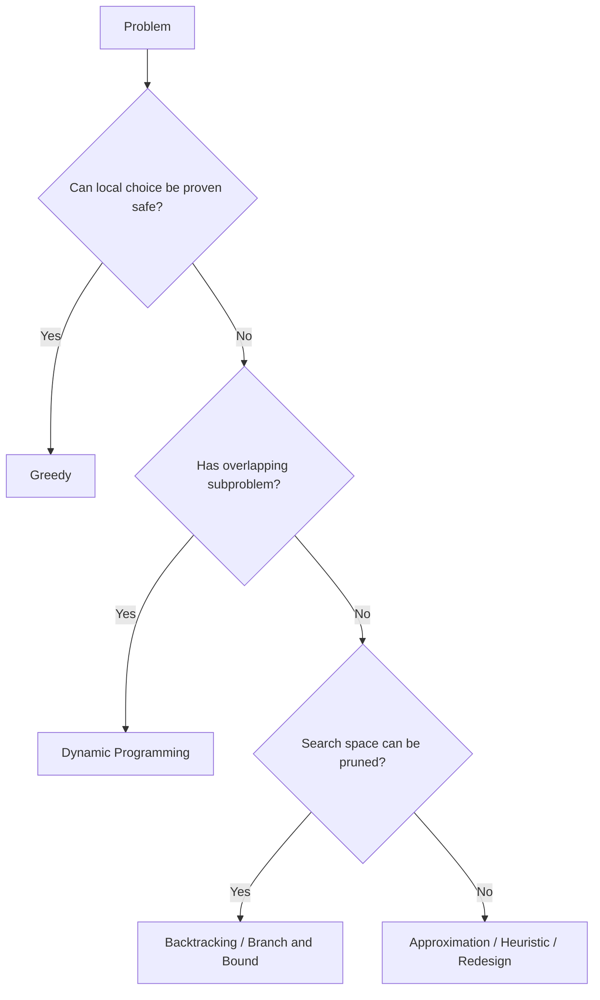
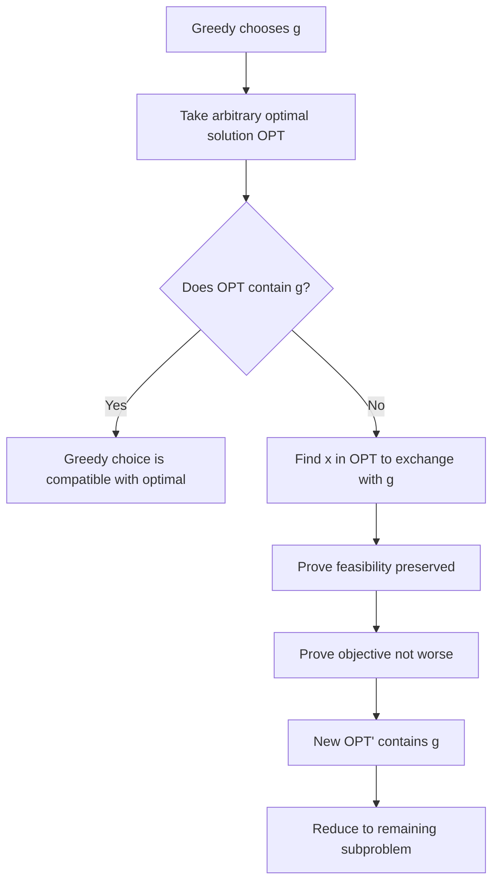
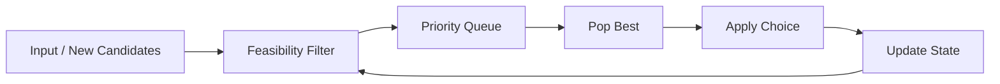
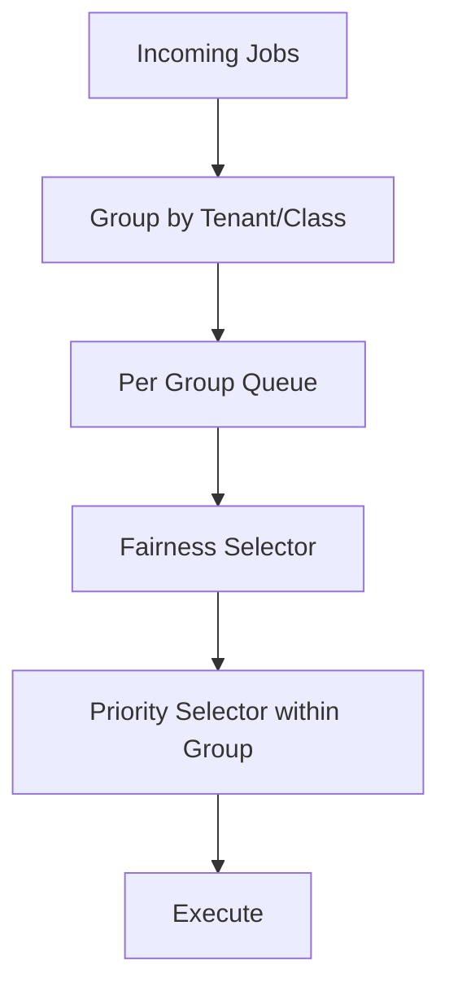
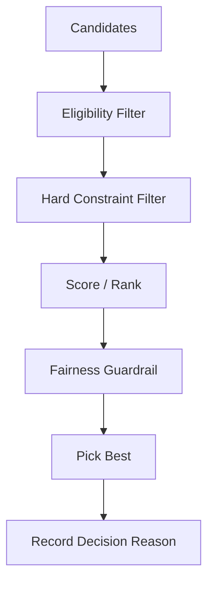
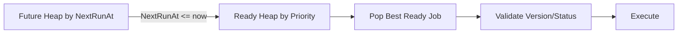

# learn-go-data-structure-algorithm-part-019.md

# Part 019 — Greedy Algorithms, Exchange Argument, dan Approximation Thinking

> Seri: `learn-go-data-structure-algorithm`  
> Part: `019 / 034`  
> Fokus: Greedy algorithm sebagai teknik keputusan lokal yang harus dibuktikan, bukan sekadar intuisi.  
> Target pembaca: Java software engineer yang ingin mampu memilih, membuktikan, menguji, dan mengoperasikan algoritma greedy di Go untuk sistem production.

---

## 0. Posisi Part Ini dalam Seri

Pada part sebelumnya kita membahas **Dynamic Programming**: problem dipecah menjadi state, value, transition, dan base case. DP cocok ketika keputusan saling bergantung dan kita perlu mengevaluasi banyak kemungkinan secara sistematis.

Di part ini kita membahas kebalikannya secara filosofis: **Greedy Algorithms**.

Greedy terlihat sederhana:

> Pada setiap langkah, ambil pilihan lokal terbaik.

Tetapi justru karena terlihat sederhana, greedy sering menjadi sumber bug desain yang halus.

Contoh keputusan yang tampak greedy:

- ambil task dengan deadline paling dekat,
- ambil file terkecil dulu,
- ambil request dengan priority tertinggi,
- pilih interval yang selesai paling awal,
- assign worker ke job termurah,
- gabungkan dua item terkecil,
- kirim retry yang paling lama menunggu,
- penuhkan batch sampai capacity maksimal,
- pakai route dengan cost lokal terendah,
- beri resource ke tenant paling besar,
- evict cache entry paling tua,
- throttle user yang paling banyak request.

Sebagian benar. Sebagian salah. Sebagian benar hanya dalam constraint tertentu. Sebagian hanya heuristic yang cukup baik tetapi tidak optimal.

Part ini bertujuan membuat Anda mampu menjawab:

1. **Apakah greedy boleh dipakai?**
2. **Apa invariant yang membuatnya benar?**
3. **Bagaimana membuktikan keputusan lokal menghasilkan solusi global?**
4. **Bagaimana mengenali greedy yang hanya heuristic?**
5. **Bagaimana mengimplementasikan greedy di Go tanpa bug ordering, starvation, overflow, atau nondeterminism?**
6. **Bagaimana memakai greedy dalam production system seperti scheduler, rate limiter, batcher, allocator, retry queue, dan prioritization engine?**

---

## 1. Mental Model Greedy

Greedy algorithm adalah algoritma yang membangun solusi sedikit demi sedikit dengan memilih opsi yang terlihat paling baik pada saat itu, tanpa kembali mengubah keputusan sebelumnya.

Struktur umum greedy:

```text
solution = empty
state = initial

while not done:
    candidates = feasible choices from state
    choice = locally best candidate
    apply choice to solution
    update state

return solution
```

Dalam bentuk Go:

```go
func Greedy(input Input) Solution {
    state := NewState(input)
    solution := NewSolution()

    for !state.Done() {
        choice, ok := state.BestFeasibleChoice()
        if !ok {
            break
        }
        solution.Apply(choice)
        state.Advance(choice)
    }

    return solution
}
```

Bagian berbahaya ada pada kata **best**.

Best menurut apa?

- cost terkecil?
- value terbesar?
- deadline tercepat?
- durasi terpendek?
- rasio value/weight terbesar?
- priority terbesar?
- arrival time terdahulu?
- penalty terbesar?
- dependency count terkecil?
- remaining capacity paling cocok?

Greedy tidak otomatis benar hanya karena pilihan lokal tampak masuk akal.

---

## 2. Greedy vs Dynamic Programming vs Brute Force

Problem yang sama kadang dapat diselesaikan dengan beberapa pendekatan.

| Pendekatan | Cara berpikir | Kelebihan | Risiko |
|---|---|---|---|
| Brute Force | Coba semua kemungkinan | Sederhana, cocok untuk oracle test | Eksponensial |
| Backtracking | Coba kemungkinan dengan pruning | Bisa mengurangi search space | Tetap bisa meledak |
| Dynamic Programming | Simpan subproblem berulang | Optimal untuk banyak problem | State design sulit, memory besar |
| Greedy | Ambil pilihan lokal terbaik | Cepat, sederhana, hemat memory | Bisa salah jika tidak terbukti |
| Approximation | Ambil solusi cukup baik dengan bound | Praktis untuk problem sulit | Tidak selalu optimal |
| Heuristic | Rule of thumb | Mudah dioperasikan | Tidak ada jaminan matematis |

Perbedaan paling penting:

> DP menunda komitmen dengan menyimpan banyak kemungkinan. Greedy berkomitmen cepat dan tidak menyesal.

Diagram:



Greedy cocok ketika ada **safe choice**: pilihan lokal tertentu selalu dapat menjadi bagian dari solusi optimal.

---

## 3. Syarat Inti Greedy: Greedy-Choice Property

Sebuah problem cocok untuk greedy jika memiliki **greedy-choice property**:

> Ada pilihan lokal yang dapat dipilih sekarang dan masih memungkinkan solusi global optimal.

Ini tidak berarti semua pilihan lokal yang tampak baik benar. Biasanya hanya pilihan tertentu yang benar.

Contoh interval scheduling:

Problem:

- diberikan banyak interval `[start, end)`,
- pilih sebanyak mungkin interval yang tidak overlap.

Greedy yang benar:

- selalu pilih interval yang selesai paling awal.

Greedy yang salah:

- pilih interval yang mulai paling awal,
- pilih interval paling pendek,
- pilih interval dengan overlap paling sedikit tanpa analisis tambahan.

Mengapa selesai paling awal benar?

Karena memilih interval yang selesai paling awal meninggalkan sisa waktu paling besar untuk interval berikutnya. Ada pembuktian exchange argument yang akan kita bahas.

---

## 4. Syarat Kedua: Optimal Substructure

Greedy juga membutuhkan **optimal substructure**:

> Setelah mengambil pilihan greedy, sisa problem masih merupakan problem dengan bentuk yang sama, dan solusi optimal total terdiri dari pilihan greedy + solusi optimal untuk sisa problem.

Contoh interval scheduling:

Setelah memilih interval `i` yang selesai paling awal, semua interval yang overlap dengan `i` dibuang. Sisa problem adalah memilih interval terbanyak dari interval yang start-nya >= `i.end`.

Ini bentuk problem yang sama.

---

## 5. Greedy Harus Dibuktikan, Bukan Dirasakan

Banyak greedy tampak benar karena contoh kecil mendukungnya.

Contoh coin change:

Dengan coin system `{1, 5, 10, 25}`, greedy untuk mengambil coin terbesar dulu tampak benar untuk banyak nilai.

Tetapi dengan coin system `{1, 3, 4}`:

- target `6`,
- greedy ambil `4 + 1 + 1` = 3 coin,
- optimal `3 + 3` = 2 coin.

Jadi greedy coin change tidak benar untuk semua sistem coin.

Pelajaran:

> Greedy yang benar pada domain A bisa salah pada domain B hanya karena constraint berubah sedikit.

Dalam production, ini sering terjadi ketika business rule berubah.

Contoh:

- batch packing awalnya semua item punya size seragam,
- lalu item mulai punya size berbeda,
- greedy lama tetap jalan,
- hasilnya mulai buruk atau melanggar SLA.

---

## 6. Exchange Argument

Exchange argument adalah teknik pembuktian greedy paling umum.

Intuisi:

1. Ambil sebuah solusi optimal `OPT`.
2. Jika `OPT` tidak memakai pilihan greedy `g`, tunjukkan bahwa kita bisa menukar salah satu pilihan di `OPT` dengan `g`.
3. Setelah pertukaran, solusi tetap feasible dan tidak lebih buruk.
4. Maka ada solusi optimal yang memakai `g`.
5. Setelah itu problem menyusut dan argumen diulang.

Template:

```text
Let g be the greedy choice.
Let OPT be an optimal solution.
If OPT contains g, done.
Otherwise, find an element x in OPT that can be replaced by g.
Show replacement keeps feasibility.
Show replacement does not decrease objective quality.
Therefore an optimal solution exists that contains g.
Then solve remaining subproblem recursively/iteratively.
```

Diagram:



Exchange argument adalah cara melawan “sepertinya benar” dengan pembuktian struktural.

---

## 7. Example 1: Interval Scheduling

### 7.1 Problem

Diberikan interval:

```go
type Interval struct {
    Start int
    End   int
    ID    string
}
```

Pilih jumlah interval maksimum yang tidak overlap.

Asumsi interval half-open `[Start, End)`:

- `[1, 3)` dan `[3, 5)` tidak overlap.

### 7.2 Greedy Strategy

Urutkan berdasarkan `End` ascending, lalu pilih interval yang `Start >= currentEnd`.

```go
package intervals

import (
    "cmp"
    "slices"
)

type Interval struct {
    Start int
    End   int
    ID    string
}

func MaxNonOverlapping(intervals []Interval) []Interval {
    xs := slices.Clone(intervals)

    slices.SortFunc(xs, func(a, b Interval) int {
        if c := cmp.Compare(a.End, b.End); c != 0 {
            return c
        }
        if c := cmp.Compare(a.Start, b.Start); c != 0 {
            return c
        }
        return cmp.Compare(a.ID, b.ID)
    })

    result := make([]Interval, 0, len(xs))
    currentEnd := 0
    hasCurrent := false

    for _, iv := range xs {
        if iv.End < iv.Start {
            // Invalid interval. In real API, prefer returning error.
            continue
        }
        if !hasCurrent || iv.Start >= currentEnd {
            result = append(result, iv)
            currentEnd = iv.End
            hasCurrent = true
        }
    }

    return result
}
```

### 7.3 Complexity

| Step | Cost |
|---|---:|
| Clone | O(n) |
| Sort | O(n log n) |
| Scan | O(n) |
| Total | O(n log n) |
| Extra memory | O(n) for clone/result |

Jika caller mengizinkan mutasi input, clone bisa dihindari.

### 7.4 Exchange Argument

Misal `g` adalah interval dengan finish time paling awal.

Ambil solusi optimal `OPT`. Jika `OPT` sudah mengandung `g`, selesai.

Jika tidak, ambil interval pertama `x` dalam `OPT` menurut finish time. Karena `g` selesai paling awal, `g.End <= x.End`.

Ganti `x` dengan `g`.

- Solusi tetap feasible karena `g` selesai tidak lebih lambat dari `x`, sehingga tidak membuat interval berikutnya overlap.
- Jumlah interval tetap sama.
- Maka ada solusi optimal yang mengandung `g`.

Setelah memilih `g`, problem tersisa adalah semua interval yang mulai setelah `g.End`.

Maka greedy benar.

### 7.5 Production Caveat

Interval scheduling berubah jika objective berubah.

| Objective | Greedy by earliest finish? |
|---|---|
| Maksimalkan jumlah interval | Ya |
| Maksimalkan total weight/value | Tidak selalu |
| Minimalkan idle time | Tidak selalu |
| Prioritaskan tenant tertentu | Tidak cukup |
| Respect hard deadline + priority | Butuh model lain |

Weighted interval scheduling biasanya butuh DP, bukan greedy sederhana.

---

## 8. Example 2: Merge Intervals

### 8.1 Problem

Diberikan interval, gabungkan semua yang overlap.

Ini sering muncul pada:

- availability window,
- booking slots,
- maintenance windows,
- policy active periods,
- audit range compression,
- quota usage windows.

### 8.2 Greedy Strategy

Urutkan by start ascending. Maintain current merged interval. Jika interval berikut overlap, extend. Jika tidak, flush current.

```go
package intervals

import (
    "cmp"
    "slices"
)

type Range struct {
    Start int
    End   int
}

func MergeRanges(ranges []Range) []Range {
    if len(ranges) == 0 {
        return nil
    }

    xs := slices.Clone(ranges)
    slices.SortFunc(xs, func(a, b Range) int {
        if c := cmp.Compare(a.Start, b.Start); c != 0 {
            return c
        }
        return cmp.Compare(a.End, b.End)
    })

    out := make([]Range, 0, len(xs))
    cur := xs[0]

    for _, r := range xs[1:] {
        if r.Start <= cur.End { // closed/overlap semantics; adjust for half-open if needed
            if r.End > cur.End {
                cur.End = r.End
            }
            continue
        }

        out = append(out, cur)
        cur = r
    }

    out = append(out, cur)
    return out
}
```

### 8.3 Semantics Matter

Untuk interval half-open `[start, end)`, dua interval `[1,3)` dan `[3,5)` tidak overlap. Jika ingin merge only overlap, condition adalah:

```go
if r.Start < cur.End {
    // overlap
}
```

Jika ingin merge adjacent juga:

```go
if r.Start <= cur.End {
    // overlap or touching
}
```

Satu karakter operator bisa mengubah business semantics.

---

## 9. Example 3: Huffman Coding Intuition

Huffman coding adalah greedy classic: gabungkan dua frequency terkecil berulang kali.

Mental model:

- item yang sering muncul harus punya code pendek,
- item yang jarang muncul boleh punya code panjang,
- dua item paling jarang pantas berada paling dalam sebagai sibling.

Algorithm:

1. Masukkan semua node ke min-heap berdasarkan frequency.
2. Pop dua node terkecil.
3. Gabungkan menjadi parent dengan frequency sum.
4. Push parent kembali.
5. Ulang sampai tersisa satu root.

Go skeleton:

```go
package huffman

import "container/heap"

type Node struct {
    Symbol string
    Freq   int
    Left   *Node
    Right  *Node
}

type minHeap []*Node

func (h minHeap) Len() int { return len(h) }
func (h minHeap) Less(i, j int) bool {
    return h[i].Freq < h[j].Freq
}
func (h minHeap) Swap(i, j int) { h[i], h[j] = h[j], h[i] }

func (h *minHeap) Push(x any) {
    *h = append(*h, x.(*Node))
}

func (h *minHeap) Pop() any {
    old := *h
    n := len(old)
    x := old[n-1]
    old[n-1] = nil
    *h = old[:n-1]
    return x
}

func Build(freq map[string]int) *Node {
    h := make(minHeap, 0, len(freq))
    for sym, f := range freq {
        if f > 0 {
            h = append(h, &Node{Symbol: sym, Freq: f})
        }
    }
    heap.Init(&h)

    for h.Len() > 1 {
        a := heap.Pop(&h).(*Node)
        b := heap.Pop(&h).(*Node)
        heap.Push(&h, &Node{
            Freq:  a.Freq + b.Freq,
            Left:  a,
            Right: b,
        })
    }

    if h.Len() == 0 {
        return nil
    }
    return heap.Pop(&h).(*Node)
}
```

Production note:

- tie-breaking harus deterministic jika output perlu reproducible,
- frequency overflow perlu dipertimbangkan untuk input besar,
- tree perlu canonicalization jika digunakan untuk interoperable encoding,
- untuk real compression, canonical Huffman code sering lebih praktis daripada menyimpan tree mentah.

---

## 10. Example 4: Top-K dengan Heap sebagai Greedy Streaming

Problem:

> Dari stream nilai besar, ambil K terbesar tanpa menyimpan semua.

Greedy strategy:

- maintain min-heap ukuran K,
- untuk setiap item:
  - jika heap belum penuh, push,
  - jika item > min heap, replace min,
  - jika tidak, skip.

Ini greedy karena setiap saat kita menyimpan kandidat terbaik sejauh ini.

```go
package topk

import "container/heap"

type Item struct {
    Key   string
    Score int
}

type minHeap []Item

func (h minHeap) Len() int { return len(h) }
func (h minHeap) Less(i, j int) bool {
    return h[i].Score < h[j].Score
}
func (h minHeap) Swap(i, j int) { h[i], h[j] = h[j], h[i] }
func (h *minHeap) Push(x any) { *h = append(*h, x.(Item)) }
func (h *minHeap) Pop() any {
    old := *h
    n := len(old)
    x := old[n-1]
    *h = old[:n-1]
    return x
}

func TopK(items []Item, k int) []Item {
    if k <= 0 || len(items) == 0 {
        return nil
    }

    h := make(minHeap, 0, k)
    heap.Init(&h)

    for _, item := range items {
        if h.Len() < k {
            heap.Push(&h, item)
            continue
        }
        if item.Score <= h[0].Score {
            continue
        }
        h[0] = item
        heap.Fix(&h, 0)
    }

    out := make([]Item, len(h))
    for i := len(out) - 1; i >= 0; i-- {
        out[i] = heap.Pop(&h).(Item)
    }
    return out
}
```

Complexity:

| Approach | Time | Memory |
|---|---:|---:|
| Sort all | O(n log n) | O(n) or in-place |
| Heap Top-K | O(n log k) | O(k) |

Top-K adalah contoh greedy yang sangat production-relevant karena stream/log/event sering terlalu besar untuk full sort.

---

## 11. Example 5: Fractional Knapsack vs 0/1 Knapsack

Ini contoh penting untuk membedakan greedy yang benar dan salah.

### 11.1 Fractional Knapsack

Item boleh diambil sebagian.

Greedy benar:

- sort berdasarkan value/weight ratio descending,
- ambil sebanyak mungkin dari ratio terbesar.

Mengapa benar?

Karena setiap unit capacity sebaiknya diisi dengan value density tertinggi. Jika solusi optimal punya unit dari density lebih rendah sementara masih ada density lebih tinggi yang belum diambil, tukar unit tersebut dan value naik.

### 11.2 0/1 Knapsack

Item harus diambil utuh atau tidak sama sekali.

Greedy ratio tidak selalu benar.

Contoh:

| Item | Weight | Value | Ratio |
|---|---:|---:|---:|
| A | 10 | 60 | 6 |
| B | 20 | 100 | 5 |
| C | 30 | 120 | 4 |

Capacity 50.

Greedy ratio:

- ambil A + B = weight 30, value 160,
- C tidak muat,
- total 160.

Optimal:

- ambil B + C = weight 50, value 220.

Jadi:

> Fractional knapsack greedy benar. 0/1 knapsack butuh DP/search/approximation.

Production equivalent:

- Kalau resource bisa dibagi kontinu, greedy density sering masuk akal.
- Kalau keputusan indivisible, greedy density bisa salah.

---

## 12. Example 6: Activity Selection dan Scheduling

Activity selection sama dengan interval scheduling: pilih aktivitas maksimum yang compatible.

Tetapi scheduling production sering punya constraint tambahan:

- deadline,
- priority,
- tenant fairness,
- retry age,
- task duration,
- worker skill,
- dependency,
- resource class,
- SLA penalty,
- cancellation,
- preemption,
- idempotency.

Greedy schedule yang sederhana bisa berubah menjadi buruk ketika objective tidak tunggal.

Contoh objective conflict:

```text
Minimize deadline miss
Maximize throughput
Maximize tenant fairness
Minimize retry latency
Avoid starvation
Reduce context switch
Respect priority
```

Tidak semua bisa diselesaikan dengan satu comparator.

Jika Anda membuat scheduler dengan comparator seperti ini:

```go
priority desc, deadline asc, createdAt asc
```

itu bukan otomatis greedy optimal. Itu adalah **policy heuristic**.

Harus didokumentasikan sebagai policy, bukan sebagai “optimal algorithm”.

---

## 13. Comparator Design di Go untuk Greedy

Banyak greedy membutuhkan sorting atau heap. Maka correctness greedy sering bergantung pada comparator.

Comparator harus:

1. deterministic,
2. transitive,
3. total atau strict weak order,
4. tie-break jelas,
5. tidak bergantung pada mutable external state.

Contoh comparator stabil untuk job:

```go
type Job struct {
    ID        string
    Priority  int
    Deadline  int64
    CreatedAt int64
}

func CompareJob(a, b Job) int {
    // Higher priority first.
    if a.Priority != b.Priority {
        if a.Priority > b.Priority {
            return -1
        }
        return 1
    }

    // Earlier deadline first.
    if a.Deadline != b.Deadline {
        if a.Deadline < b.Deadline {
            return -1
        }
        return 1
    }

    // Older job first.
    if a.CreatedAt != b.CreatedAt {
        if a.CreatedAt < b.CreatedAt {
            return -1
        }
        return 1
    }

    // Stable deterministic final tie-break.
    if a.ID < b.ID {
        return -1
    }
    if a.ID > b.ID {
        return 1
    }
    return 0
}
```

Jangan membuat comparator seperti ini:

```go
func BadCompare(a, b Job) int {
    if a.Priority >= b.Priority {
        return -1
    }
    return 1
}
```

Masalah:

- `BadCompare(a, a)` mengembalikan `-1`, bukan `0`,
- equality rusak,
- sort/heap behavior bisa tidak valid.

---

## 14. Greedy dengan Sorting

Banyak greedy punya bentuk:

1. sort input berdasarkan kriteria tertentu,
2. scan dari kiri ke kanan,
3. maintain state ringkas.

Template:

```go
func GreedyBySort[T any](items []T, cmp func(a, b T) int) []T {
    xs := slices.Clone(items)
    slices.SortFunc(xs, cmp)

    out := make([]T, 0, len(xs))
    state := NewState()

    for _, item := range xs {
        if state.Feasible(item) {
            out = append(out, item)
            state.Apply(item)
        }
    }

    return out
}
```

Examples:

| Problem | Sort key | Scan state |
|---|---|---|
| Interval scheduling | end asc | currentEnd |
| Merge interval | start asc | current range |
| Minimum arrows/points for intervals | end asc | current point |
| Assign cookies | appetite asc, cookie size asc | two pointers |
| Meeting rooms | start asc + min-heap end | active meetings |
| Job sequencing variant | deadline/profit | slot/DSU |

Sorting-based greedy biasanya mudah diuji dengan brute force untuk n kecil.

---

## 15. Greedy dengan Heap

Heap digunakan ketika “pilihan terbaik” berubah dinamis seiring state berubah.

Pattern:

```go
for state not done:
    add newly feasible candidates to heap
    best := heap.Pop(h)
    apply best
```

Contoh:

- scheduling task by earliest deadline,
- Dijkstra shortest path,
- merge K sorted lists,
- Top-K streaming,
- retry scheduler,
- Huffman coding,
- meeting room allocation,
- maximize capital with project selection.

Diagram:



Heap greedy lebih mudah salah karena stale entry.

### 15.1 Stale Entry Pattern

Jika priority item berubah, kadang lebih murah push entry baru daripada update old entry. Saat pop, validasi apakah entry masih current.

```go
type Entry struct {
    ID      string
    Version int64
    Score   int
}

func process(h *PriorityQueue, currentVersion func(string) int64) {
    for h.Len() > 0 {
        e := heap.Pop(h).(Entry)
        if e.Version != currentVersion(e.ID) {
            continue // stale
        }
        // process current entry
        return
    }
}
```

Ini umum pada:

- Dijkstra,
- retry scheduling,
- task reprioritization,
- cache expiration,
- deadline update.

---

## 16. Greedy dengan Two Pointers

Two pointers sering dipakai dalam greedy ketika input sudah sorted.

Contoh: assign cookies.

Problem:

- anak punya appetite,
- cookies punya size,
- satu cookie untuk satu anak,
- anak puas jika `cookie >= appetite`,
- maksimalkan jumlah anak puas.

Greedy:

- sort appetite ascending,
- sort cookie ascending,
- beri cookie terkecil yang cukup untuk anak dengan appetite terkecil.

```go
func AssignCookies(appetite []int, cookies []int) int {
    a := slices.Clone(appetite)
    c := slices.Clone(cookies)
    slices.Sort(a)
    slices.Sort(c)

    i, j := 0, 0
    satisfied := 0

    for i < len(a) && j < len(c) {
        if c[j] >= a[i] {
            satisfied++
            i++
            j++
            continue
        }
        j++
    }

    return satisfied
}
```

Exchange intuition:

- Anak dengan appetite terkecil paling mudah dipenuhi.
- Cookie terkecil yang cukup untuknya tidak mengurangi peluang anak lain lebih dari memakai cookie lebih besar.

---

## 17. Greedy dengan Monotonicity

Greedy sering berhubungan dengan monotonic structure:

- sorted order,
- earliest finish,
- lowest cost,
- highest density,
- smallest feasible resource,
- monotonic queue,
- increasing frontier.

Monotonicity membuat keputusan lokal aman karena masa depan tidak bisa “membalik” fakta tertentu.

Contoh interval scheduling:

- setelah memilih earliest finish, sisa waktu maksimum,
- interval yang sudah berakhir tidak perlu dipertimbangkan lagi.

Contoh merging intervals:

- setelah sort by start, interval berikutnya tidak mungkin mulai sebelum current start,
- cukup cek overlap dengan current merged interval.

Contoh Dijkstra:

- dengan edge weight non-negative, node dengan distance terkecil di priority queue sudah final.
- Jika ada negative edge, monotonicity rusak.

---

## 18. Dijkstra sebagai Greedy yang Bersyarat

Dijkstra adalah greedy:

- selalu ambil node unvisited dengan tentative distance terkecil,
- finalisasi node tersebut.

Ini benar hanya jika semua edge weight non-negative.

Mengapa?

Karena jika node `u` adalah distance terkecil saat ini, tidak ada jalur masa depan melalui node lain yang bisa membuat `u` lebih murah, karena semua tambahan edge cost >= 0.

Jika ada negative edge, keputusan finalisasi bisa salah.

Skeleton Go:

```go
package graph

import "container/heap"

type Edge struct {
    To     int
    Weight int64
}

type State struct {
    Node int
    Dist int64
}

type minHeap []State

func (h minHeap) Len() int { return len(h) }
func (h minHeap) Less(i, j int) bool { return h[i].Dist < h[j].Dist }
func (h minHeap) Swap(i, j int) { h[i], h[j] = h[j], h[i] }
func (h *minHeap) Push(x any) { *h = append(*h, x.(State)) }
func (h *minHeap) Pop() any {
    old := *h
    n := len(old)
    x := old[n-1]
    *h = old[:n-1]
    return x
}

const Inf int64 = 1<<63 - 1

func Dijkstra(g [][]Edge, src int) []int64 {
    dist := make([]int64, len(g))
    for i := range dist {
        dist[i] = Inf
    }
    dist[src] = 0

    h := &minHeap{{Node: src, Dist: 0}}
    heap.Init(h)

    for h.Len() > 0 {
        cur := heap.Pop(h).(State)
        if cur.Dist != dist[cur.Node] {
            continue // stale
        }

        for _, e := range g[cur.Node] {
            if e.Weight < 0 {
                // In production API, reject negative weight before running.
                continue
            }
            if cur.Dist > Inf-e.Weight {
                continue // avoid overflow
            }
            nd := cur.Dist + e.Weight
            if nd < dist[e.To] {
                dist[e.To] = nd
                heap.Push(h, State{Node: e.To, Dist: nd})
            }
        }
    }

    return dist
}
```

Important:

- Dijkstra adalah greedy yang terbukti, bukan heuristic.
- Tetapi proof-nya bergantung pada non-negative weight.
- Jika domain berubah dan negative penalty diperbolehkan, algoritma tidak valid.

---

## 19. Minimum Spanning Tree: Kruskal dan Prim

Minimum Spanning Tree atau MST mencari subset edge yang menghubungkan semua node dengan total weight minimum tanpa cycle.

### 19.1 Kruskal

Greedy:

- sort edge by weight ascending,
- tambahkan edge jika tidak membentuk cycle,
- gunakan DSU untuk cek connectivity.

```go
package mst

import (
    "cmp"
    "slices"
)

type Edge struct {
    U, V int
    W    int64
}

type DSU struct {
    parent []int
    size   []int
}

func NewDSU(n int) *DSU {
    p := make([]int, n)
    s := make([]int, n)
    for i := range p {
        p[i] = i
        s[i] = 1
    }
    return &DSU{parent: p, size: s}
}

func (d *DSU) Find(x int) int {
    for d.parent[x] != x {
        d.parent[x] = d.parent[d.parent[x]]
        x = d.parent[x]
    }
    return x
}

func (d *DSU) Union(a, b int) bool {
    ra, rb := d.Find(a), d.Find(b)
    if ra == rb {
        return false
    }
    if d.size[ra] < d.size[rb] {
        ra, rb = rb, ra
    }
    d.parent[rb] = ra
    d.size[ra] += d.size[rb]
    return true
}

func Kruskal(n int, edges []Edge) []Edge {
    xs := slices.Clone(edges)
    slices.SortFunc(xs, func(a, b Edge) int {
        if c := cmp.Compare(a.W, b.W); c != 0 {
            return c
        }
        if c := cmp.Compare(a.U, b.U); c != 0 {
            return c
        }
        return cmp.Compare(a.V, b.V)
    })

    dsu := NewDSU(n)
    out := make([]Edge, 0, max(0, n-1))

    for _, e := range xs {
        if dsu.Union(e.U, e.V) {
            out = append(out, e)
            if len(out) == n-1 {
                break
            }
        }
    }

    return out
}
```

### 19.2 Cut Property

Kruskal benar karena cut property:

> Untuk setiap cut di graph, edge termurah yang melintasi cut aman untuk dimasukkan ke MST.

Ini bentuk greedy-choice property.

---

## 20. Greedy yang Salah: Counterexample sebagai Senjata

Untuk menolak greedy yang tidak terbukti, cari counterexample kecil.

### 20.1 Strategy

1. Identifikasi rule greedy.
2. Cari input kecil dengan 3–5 item.
3. Buat greedy memilih sesuatu yang menghalangi solusi optimal.
4. Bandingkan dengan brute force.

### 20.2 Example: Pick Shortest Interval First

Problem interval scheduling.

Greedy salah: pilih interval berdurasi paling pendek.

Counterexample:

```text
A: [1, 4) duration 3
B: [4, 7) duration 3
C: [3, 5) duration 2
```

Greedy shortest memilih C, lalu tidak bisa memilih A atau B. Total 1.

Optimal memilih A + B. Total 2.

### 20.3 Example: Highest Value First in Knapsack

Capacity 10.

```text
A: weight 10, value 100
B: weight 6,  value 60
C: weight 4,  value 50
```

Highest value greedy memilih A = 100.

Optimal B + C = 110.

Counterexample kecil sering lebih kuat daripada debat panjang.

---

## 21. Approximation Thinking

Tidak semua problem punya greedy optimal yang sederhana. Banyak problem production terlalu besar untuk exact algorithm.

Approximation algorithm memberi solusi tidak selalu optimal, tetapi punya bound.

Contoh:

- Set cover greedy memberi approximation guarantee logarithmic dalam banyak setting.
- Metric TSP punya approximation algorithms dengan syarat triangle inequality.
- Bin packing punya heuristic seperti First-Fit Decreasing yang sering baik, walaupun tidak selalu optimal.

Perbedaan penting:

| Jenis | Klaim |
|---|---|
| Exact greedy | Selalu optimal jika asumsi terpenuhi |
| Approximation | Tidak selalu optimal, tetapi punya bound |
| Heuristic | Tidak ada jaminan formal, diuji empiris |
| Policy | Pilihan bisnis/operasional, bukan klaim optimal |

Dalam engineering, jujur soal kategori ini sangat penting.

Jangan menulis:

> “This algorithm optimizes allocation.”

Kalau sebenarnya:

> “This heuristic prioritizes high-penalty allocation first and is designed to reduce missed SLA under typical load.”

---

## 22. Bin Packing dan Batch Packing

Batch packing sering muncul di backend:

- kirim request batch maksimal 100 item,
- payload maksimal 5 MB,
- worker memory maksimal 512 MB,
- API limit maksimal 300 request/min,
- database IN clause maksimal N,
- Kafka message maksimal size tertentu.

Problem bin packing exact sulit.

Greedy heuristic umum:

- First Fit,
- Best Fit,
- First Fit Decreasing,
- Best Fit Decreasing.

### 22.1 First Fit Decreasing

1. Sort item by size descending.
2. Masukkan item ke bin pertama yang masih muat.
3. Jika tidak ada, buat bin baru.

```go
package packing

import (
    "cmp"
    "slices"
)

type Item struct {
    ID   string
    Size int
}

type Bin struct {
    Items []Item
    Used  int
}

func FirstFitDecreasing(items []Item, capacity int) []Bin {
    if capacity <= 0 {
        return nil
    }

    xs := slices.Clone(items)
    slices.SortFunc(xs, func(a, b Item) int {
        if c := cmp.Compare(b.Size, a.Size); c != 0 { // descending
            return c
        }
        return cmp.Compare(a.ID, b.ID)
    })

    bins := make([]Bin, 0)

    for _, item := range xs {
        if item.Size > capacity {
            // Production API should return error or route to oversized handling.
            continue
        }

        placed := false
        for i := range bins {
            if bins[i].Used+item.Size <= capacity {
                bins[i].Items = append(bins[i].Items, item)
                bins[i].Used += item.Size
                placed = true
                break
            }
        }

        if !placed {
            bins = append(bins, Bin{
                Items: []Item{item},
                Used:  item.Size,
            })
        }
    }

    return bins
}
```

### 22.2 Production Warning

This is a heuristic.

Dokumentasikan:

- apakah optimality required?
- apakah oversized item reject atau split?
- apakah item order harus stable?
- apakah tenant fairness perlu dipertahankan?
- apakah size estimate akurat?
- apakah capacity hard atau soft?
- apakah retry memperbesar duplicate cost?

---

## 23. Greedy untuk Rate Limit Scheduling

Misal kita punya banyak work item dan rate limit global 250/minute.

Greedy policy:

- selalu pilih job dengan highest priority,
- tie by oldest created time.

Ini bukan always optimal dalam arti matematis, karena objective business bisa multi-dimensional. Tetapi bisa menjadi policy yang jelas.

```go
type Work struct {
    ID        string
    Tenant    string
    Priority  int
    CreatedAt int64
}
```

Comparator:

```go
func CompareWork(a, b Work) int {
    if a.Priority != b.Priority {
        if a.Priority > b.Priority {
            return -1
        }
        return 1
    }
    if a.CreatedAt != b.CreatedAt {
        if a.CreatedAt < b.CreatedAt {
            return -1
        }
        return 1
    }
    if a.ID < b.ID {
        return -1
    }
    if a.ID > b.ID {
        return 1
    }
    return 0
}
```

But watch starvation:

- low-priority job bisa tidak pernah jalan jika high-priority terus datang.

Mitigation:

- aging priority,
- quota per tenant,
- weighted fair queue,
- separate queues by class,
- max wait escalation,
- deadline override.

Greedy production design harus membahas starvation secara eksplisit.

---

## 24. Greedy dan Fairness

Greedy by priority sering anti-fairness.

Jika sistem memiliki tenants A, B, C:

- A selalu mengirim high-priority jobs,
- B dan C jarang tetapi penting,
- priority-only greedy bisa membuat B/C starve.

Fairness-aware greedy bisa memakai:

- round-robin,
- weighted round-robin,
- deficit round-robin,
- per-tenant token bucket,
- priority within tenant,
- tenant fairness first then priority.

Model:



Key point:

> Greedy criterion harus sesuai dengan fairness model, bukan hanya throughput.

---

## 25. Greedy dan Starvation

Starvation terjadi ketika sebuah item feasible tetapi tidak pernah dipilih.

Greedy rentan starvation ketika:

- priority unbounded,
- high-priority arrival rate > service rate,
- tie-breaking selalu mendukung kelas tertentu,
- deadline terus diperbarui,
- retry baru selalu mengalahkan retry lama,
- queue global tidak punya fairness partition.

Checklist:

```text
For every item that remains feasible:
- Is there a maximum wait bound?
- Can priority age upward?
- Is there per-class quota?
- Is there observable starvation metric?
- Can an operator explain why it is not selected?
```

Ingat: greedy yang optimal untuk objective tertentu bisa buruk untuk objective sosial/operasional seperti fairness.

---

## 26. Greedy dan Idempotency

Greedy scheduler sering memilih “next best work”. Tetapi work execution bisa gagal setelah side effect parsial.

Jika greedy digunakan untuk retry:

- item bisa dieksekusi ulang,
- priority bisa berubah,
- duplicate bisa muncul,
- ordering bisa berubah,
- stale heap entry bisa diproses.

Maka data structure harus menyimpan lifecycle state:

```go
type Status uint8

const (
    Pending Status = iota
    Running
    Succeeded
    Failed
    Cancelled
)

type RetryJob struct {
    ID          string
    Attempt     int
    Status      Status
    NextRunAt   int64
    Priority    int
    Version     int64
}
```

Greedy selection harus validasi:

- status masih pending,
- version masih current,
- nextRunAt sudah lewat,
- tenant quota masih ada,
- not cancelled,
- not already succeeded.

---

## 27. Greedy Decision Table

Sebelum memakai greedy, isi decision table berikut.

| Pertanyaan | Jawaban yang harus jelas |
|---|---|
| Apa objective utama? | maximize count, minimize cost, minimize lateness, etc. |
| Apa constraint keras? | capacity, deadline, dependency, tenant quota |
| Apa pilihan lokal? | item/task/edge/interval mana yang dipilih tiap langkah |
| Apa ranking criterion? | earliest finish, lowest cost, highest ratio |
| Apa proof? | exchange, cut property, matroid, monotonicity |
| Apa counterexample untuk greedy lain? | contoh kecil yang menolak alternatif salah |
| Apakah hasil harus optimal? | exact vs approximation vs heuristic |
| Apakah tie-break deterministic? | ID/order stable |
| Apakah ada starvation? | aging/quota/fairness |
| Bagaimana diuji? | brute force small n, property, fuzz |

Jika proof tidak ada dan optimality diklaim, itu red flag.

---

## 28. Property Testing untuk Greedy

Greedy yang benar bisa diuji dengan membandingkan terhadap brute force untuk input kecil.

Contoh interval scheduling.

### 28.1 Brute Force Oracle

```go
func bruteMaxNonOverlapping(xs []Interval) int {
    n := len(xs)
    best := 0

    for mask := 0; mask < (1 << n); mask++ {
        chosen := make([]Interval, 0, n)
        for i := 0; i < n; i++ {
            if mask&(1<<i) != 0 {
                chosen = append(chosen, xs[i])
            }
        }
        if nonOverlapping(chosen) && len(chosen) > best {
            best = len(chosen)
        }
    }

    return best
}

func nonOverlapping(xs []Interval) bool {
    ys := slices.Clone(xs)
    slices.SortFunc(ys, func(a, b Interval) int {
        return cmp.Compare(a.Start, b.Start)
    })

    for i := 1; i < len(ys); i++ {
        if ys[i].Start < ys[i-1].End {
            return false
        }
    }
    return true
}
```

### 28.2 Random Small Test

```go
func TestMaxNonOverlappingAgainstBrute(t *testing.T) {
    rng := rand.New(rand.NewSource(1))

    for iter := 0; iter < 10_000; iter++ {
        n := rng.Intn(12)
        xs := make([]Interval, n)
        for i := range xs {
            a := rng.Intn(20)
            b := a + rng.Intn(5) + 1
            xs[i] = Interval{Start: a, End: b, ID: strconv.Itoa(i)}
        }

        got := len(MaxNonOverlapping(xs))
        want := bruteMaxNonOverlapping(xs)
        if got != want {
            t.Fatalf("got %d want %d input=%+v", got, want, xs)
        }
    }
}
```

Ini sangat efektif karena:

- greedy cepat diuji ribuan kali,
- brute force hanya untuk n kecil,
- counterexample langsung terlihat.

---

## 29. Fuzzing untuk Greedy

Fuzzing berguna untuk menemukan input edge-case:

- zero-length interval,
- negative range,
- duplicate key,
- overflow score,
- unstable comparator,
- invalid capacity,
- same deadline,
- all same priority.

Example fuzz skeleton:

```go
func FuzzMergeRanges(f *testing.F) {
    f.Add([]byte{1, 3, 2, 4})
    f.Add([]byte{1, 2, 2, 3})

    f.Fuzz(func(t *testing.T, data []byte) {
        if len(data)%2 != 0 {
            return
        }

        ranges := make([]Range, 0, len(data)/2)
        for i := 0; i < len(data); i += 2 {
            a := int(data[i])
            b := int(data[i+1])
            if a > b {
                a, b = b, a
            }
            ranges = append(ranges, Range{Start: a, End: b})
        }

        merged := MergeRanges(ranges)

        for i := 1; i < len(merged); i++ {
            if merged[i].Start <= merged[i-1].End {
                t.Fatalf("overlap remains: %+v", merged)
            }
        }
    })
}
```

Fuzzing tidak membuktikan optimality, tetapi bagus untuk invariant violation.

---

## 30. Invariant untuk Greedy

Greedy biasanya punya invariant yang diperbarui tiap langkah.

Contoh interval scheduling:

```text
After processing sorted intervals up to i:
- result is non-overlapping
- currentEnd is the end of last selected interval
- no interval selected after currentEnd overlaps with previous selected interval
- result is optimal among intervals considered so far under greedy proof
```

Contoh Top-K:

```text
After processing first i items:
- heap size <= k
- heap contains k largest items among processed prefix if i >= k
- heap root is smallest among retained top-k candidates
```

Contoh merge intervals:

```text
- output ranges are non-overlapping and sorted
- cur represents merged union of current overlapping group
- all processed ranges are represented by output + cur
```

Invariant harus masuk ke test.

---

## 31. Greedy dan Determinism

Production systems sering butuh deterministic output untuk:

- reproducible debugging,
- audit trail,
- cache key,
- idempotency,
- tests,
- consensus-like behavior,
- user-visible ordering.

Greedy dengan sort/heap bisa nondeterministic jika tie tidak diatur.

Contoh buruk:

```go
slices.SortFunc(jobs, func(a, b Job) int {
    return cmp.Compare(b.Priority, a.Priority)
})
```

Jika priority sama, order bisa tidak meaningful.

Better:

```go
slices.SortFunc(jobs, func(a, b Job) int {
    if c := cmp.Compare(b.Priority, a.Priority); c != 0 {
        return c
    }
    if c := cmp.Compare(a.CreatedAt, b.CreatedAt); c != 0 {
        return c
    }
    return cmp.Compare(a.ID, b.ID)
})
```

Rule:

> Every production greedy ordering should have a final deterministic tie-breaker.

---

## 32. Greedy dan Overflow

Greedy sering menghitung:

- cost sum,
- score,
- ratio,
- deadline delta,
- weighted priority,
- capacity remaining.

Beware integer overflow.

Bad ratio comparator:

```go
// Bad: value/weight loses precision.
ratioA := a.Value / a.Weight
ratioB := b.Value / b.Weight
```

Better cross-multiply, but beware overflow:

```go
// Compare a.Value/a.Weight vs b.Value/b.Weight.
// This may overflow if values are huge.
lhs := a.Value * b.Weight
rhs := b.Value * a.Weight
```

Safer strategies:

- use `int64` when domain supports bound,
- check overflow before multiplication,
- use `math/bits` for high precision compare,
- use rational representation if needed,
- avoid float if exact ordering matters.

For many business systems, explicitly bound values in validation.

```go
const MaxWeight = 1_000_000_000
const MaxValue = 1_000_000_000
```

Bounded inputs simplify correctness.

---

## 33. Greedy dan Floating Point

Greedy by ratio often tempts float.

```go
score := float64(value) / float64(weight)
```

Potential issues:

- precision loss,
- NaN,
- Inf,
- non-deterministic expectations across edge cases,
- equality near boundary.

If ratio determines business-critical allocation, prefer exact integer comparison with bounds.

If float is acceptable, define:

- behavior for zero weight,
- NaN rejection,
- tie threshold,
- deterministic fallback.

---

## 34. Greedy dan Mutability

Greedy algorithms often mutate state.

Risks:

- mutate caller input during sort,
- heap entries point to mutable objects,
- comparator reads mutable fields,
- selected item modified later,
- stale references retained,
- slices alias unexpected backing array.

Production choices:

| Choice | Use when |
|---|---|
| Clone input | API should not mutate caller data |
| Sort in-place | Performance critical and documented |
| Store values | Small immutable item |
| Store pointers | Large item or shared state, but lifecycle clear |
| Store IDs | Need stable reference and external state validation |

Document ownership.

---

## 35. Greedy as Policy Engine

Many real systems do not need mathematically optimal greedy. They need clear policy.

Example permission conflict resolution:

```text
Explicit Deny beats Allow
Specific rule beats broad rule
Newer emergency override beats older normal rule
Tenant rule beats global default
```

This is greedy-like priority resolution.

But it is not “optimal”. It is a deterministic policy order.

Represent it honestly:

```go
type Rule struct {
    ID          string
    Effect      Effect
    Specificity int
    Emergency   bool
    CreatedAt   int64
}
```

Comparator:

```go
func CompareRule(a, b Rule) int {
    if a.Effect != b.Effect {
        if a.Effect == Deny {
            return -1
        }
        return 1
    }
    if a.Specificity != b.Specificity {
        return cmp.Compare(b.Specificity, a.Specificity)
    }
    if a.Emergency != b.Emergency {
        if a.Emergency {
            return -1
        }
        return 1
    }
    if a.CreatedAt != b.CreatedAt {
        return cmp.Compare(b.CreatedAt, a.CreatedAt)
    }
    return cmp.Compare(a.ID, b.ID)
}
```

Make policy auditable:

```go
type Decision struct {
    WinningRule Rule
    Candidates  []Rule
    Reason      string
}
```

For regulatory or enforcement systems, explainability can matter more than algorithmic cleverness.

---

## 36. Greedy in Resource Allocation

Resource allocation examples:

- assign cases to officers,
- assign jobs to workers,
- assign shards to nodes,
- assign tenants to rate buckets,
- assign tasks to execution windows.

Common greedy criteria:

| Criterion | Possible problem |
|---|---|
| Least loaded worker | ignores skill/affinity |
| Highest priority task | starvation |
| Earliest deadline | ignores duration |
| Shortest job first | long job starvation |
| Highest SLA penalty | unfair to low-penalty tenants |
| Best fit capacity | fragmentation in future |

A good allocation engine separates:

1. eligibility filter,
2. hard constraints,
3. scoring function,
4. tie-breakers,
5. fairness guardrail,
6. audit reason.

Diagram:



This architecture prevents “one giant comparator” from becoming unmaintainable.

---

## 37. Greedy vs Local Search

Sometimes greedy gives initial solution, then local search improves it.

Pattern:

1. Build feasible solution greedily.
2. Try local improvements:
   - swap,
   - move,
   - replace,
   - split,
   - merge.
3. Stop when no local improvement or budget exhausted.

This is common in:

- scheduling,
- packing,
- routing,
- assignment,
- optimization under constraints.

Pseudo:

```go
sol := BuildGreedy(input)
for budget.Remains() {
    next, improved := ImproveOnce(sol)
    if !improved {
        break
    }
    sol = next
}
return sol
```

This is not pure greedy. It is heuristic optimization.

Document:

- termination condition,
- max time budget,
- quality metric,
- reproducibility,
- random seed if randomized.

---

## 38. Greedy Failure Modes in Production

| Failure | Cause | Mitigation |
|---|---|---|
| Wrong optimality claim | Greedy not proven | Exchange proof/counterexample tests |
| Starvation | Priority-only choice | Aging/fairness quota |
| Nondeterminism | Missing tie-break | Stable final key |
| Comparator panic/invalid order | Bad comparator | Unit/property test comparator |
| Heap stale entries | Mutable priority | Version validation |
| Overflow | Cost/ratio calculation | Bounds/checked arithmetic |
| Mutated input | In-place sort undocumented | Clone or document mutation |
| Retained memory | Large slice/result retains refs | Clear popped refs/copy result |
| Unbounded queue | Greedy admission accepts all | Backpressure/drop policy |
| Poor tail latency | Greedy optimizes throughput only | p95/p99-aware objective |
| Business rule drift | Constraints changed | Decision table + regression cases |

---

## 39. Implementation Checklist for Greedy in Go

Before merging greedy code:

```text
[ ] Objective is explicitly stated.
[ ] Constraints are explicitly stated.
[ ] Greedy choice is named.
[ ] Correctness proof or heuristic label exists.
[ ] Counterexamples for rejected greedy rules are documented.
[ ] Comparator is deterministic and transitive.
[ ] Tie-breaker is complete.
[ ] Input mutation is documented or avoided.
[ ] Overflow/zero/negative edge cases are handled.
[ ] Starvation/fairness is considered if scheduling resources.
[ ] Heap stale entry strategy exists if priority mutates.
[ ] Tests compare against brute force for small n where possible.
[ ] Fuzz/property tests check invariants.
[ ] Benchmark covers realistic distributions.
[ ] Metrics can explain behavior in production.
```

---

## 40. Benchmarking Greedy

Greedy algorithms are often chosen for speed. Benchmark them realistically.

Dimensions:

- `n`: number of items,
- distribution:
  - uniform,
  - skewed,
  - sorted,
  - reverse-sorted,
  - many duplicates,
- key comparison cost,
- allocation count,
- mutation vs clone,
- heap size,
- output size,
- invalid item ratio.

Example benchmark skeleton:

```go
func BenchmarkMaxNonOverlapping(b *testing.B) {
    inputs := []struct {
        name string
        n    int
    }{
        {"n100", 100},
        {"n1000", 1000},
        {"n10000", 10000},
    }

    for _, in := range inputs {
        b.Run(in.name, func(b *testing.B) {
            data := generateIntervals(in.n, 1)
            b.ReportAllocs()
            b.ResetTimer()

            for i := 0; i < b.N; i++ {
                got := MaxNonOverlapping(data)
                if len(got) == 0 && len(data) > 0 {
                    b.Fatal("unexpected empty result")
                }
            }
        })
    }
}
```

Important:

- If function clones input, benchmark includes clone cost.
- If production caller can reuse buffer, benchmark that variant separately.
- If comparator is expensive, benchmark comparison-heavy cases.

---

## 41. Greedy Documentation Template

Use this in internal handbook or PR:

```markdown
## Algorithm: <name>

### Objective
What does this maximize/minimize?

### Constraints
What must never be violated?

### Greedy Choice
At each step, choose <x> according to <criterion>.

### Why This Is Correct / Why This Is a Heuristic
- If exact: provide exchange/cut/monotonicity proof.
- If heuristic: state no optimality guarantee and explain why acceptable.

### Complexity
- Time:
- Space:
- Allocation behavior:

### Edge Cases
- Empty input:
- Duplicate keys:
- Equal priority:
- Invalid item:
- Overflow:

### Determinism
Tie-breakers:

### Fairness / Starvation
Relevant? If yes, mitigation.

### Tests
- Examples:
- Brute force comparison:
- Fuzz/property:
- Benchmark:
```

---

## 42. Case Study: Priority Retry Scheduler

### 42.1 Requirements

We need a retry scheduler:

- job has `NextRunAt`, `Priority`, `Attempt`, `Tenant`, `ID`, `Version`, `Status`,
- execute jobs whose `NextRunAt <= now`,
- higher priority first among ready jobs,
- avoid starvation,
- handle updated jobs,
- skip stale heap entries,
- deterministic tie-break.

This is greedy policy, not mathematical optimum.

### 42.2 Data Model

```go
type RetryStatus uint8

const (
    RetryPending RetryStatus = iota
    RetryRunning
    RetrySucceeded
    RetryCancelled
)

type RetryJob struct {
    ID        string
    Tenant    string
    Priority  int
    Attempt   int
    NextRunAt int64
    CreatedAt int64
    Version   int64
    Status    RetryStatus
}
```

### 42.3 Two-Level Selection

Use min-heap by `NextRunAt` for readiness. When jobs become ready, move to priority heap.



### 42.4 Why Two Heaps?

Because readiness and priority are different dimensions.

A single comparator like:

```text
NextRunAt asc, Priority desc
```

would not pick the highest-priority ready job if many ready jobs exist behind earlier low-priority items, depending on heap structure and comparator semantics.

Separate eligibility from ranking:

1. future heap answers: “what becomes ready next?”
2. ready heap answers: “among ready jobs, what should run first?”

This is a strong production design principle.

---

## 43. Greedy and Domain Modelling

The hardest part is often not algorithm implementation. It is choosing the correct objective.

For example:

> “Pick the best case to process next.”

Best can mean:

- highest legal risk,
- oldest case,
- closest SLA breach,
- highest public impact,
- easiest to close,
- assigned officer availability,
- dependency unblocked,
- most complete documentation,
- tenant fairness,
- management priority.

A greedy algorithm cannot fix ambiguous objective.

Before coding:

```text
Best = ?
Feasible = ?
Forbidden = ?
Tie = ?
Fair = ?
Explainable = ?
```

This is where senior engineering judgment matters.

---

## 44. Relationship to Previous and Next Parts

From previous parts:

- Part 004 sorting/search gives ordering tools.
- Part 007 heap gives priority queue mechanics.
- Part 016–017 graph parts show greedy-like algorithms such as Dijkstra and MST.
- Part 018 DP shows what to use when greedy is not enough.

This part connects them by showing how to decide whether local choice is safe.

Next part, Part 020, will discuss **Divide and Conquer, Selection, dan Search Space Reduction**:

- merge sort intuition,
- quicksort intuition,
- quickselect,
- binary search over answer,
- parametric search,
- two pointers,
- sliding window,
- meet-in-the-middle,
- allocation-aware implementation in Go.

---

## 45. Summary

Greedy is powerful because it is simple, fast, and memory-efficient.

But greedy is dangerous when treated as intuition rather than proof.

Key takeaways:

1. Greedy commits early and does not revisit choices.
2. Correct greedy needs greedy-choice property and optimal substructure.
3. Exchange argument is the main proof technique.
4. Some greedy algorithms are exact; others are approximation; many production policies are only heuristic.
5. Sorting and heap are the two most common implementation tools.
6. Comparator correctness is part of algorithm correctness.
7. Deterministic tie-breaking matters in production.
8. Starvation and fairness must be considered for scheduling/resource allocation.
9. Counterexamples are the fastest way to reject invalid greedy rules.
10. Brute force oracle for small inputs is an excellent test strategy.

The senior-level habit:

> Never say “greedy is optimal” unless you can state the safe choice and prove why an optimal solution can be transformed to include it.

---

## 46. Latihan

### Latihan 1 — Interval Scheduling Proof

Tulis ulang exchange argument untuk earliest-finish-time interval scheduling dengan bahasa Anda sendiri.

Pastikan menjawab:

- apa greedy choice-nya,
- apa yang ditukar,
- mengapa feasibility tetap aman,
- mengapa jumlah interval tidak menurun.

### Latihan 2 — Counterexample

Cari counterexample untuk greedy berikut pada interval scheduling:

1. pilih interval yang mulai paling awal,
2. pilih interval paling pendek,
3. pilih interval dengan overlap paling sedikit.

### Latihan 3 — Top-K

Implementasikan `TopK[T]` generic dengan comparator.

Requirement:

- tidak full sort,
- memory O(k),
- deterministic tie-break,
- test against full sort untuk random input.

### Latihan 4 — Batch Packing

Implementasikan First Fit Decreasing untuk item dengan:

- `ID`,
- `Tenant`,
- `Size`.

Tambahkan rule:

- oversized item harus masuk `Rejected`, bukan di-skip diam-diam.
- output harus deterministic.

### Latihan 5 — Retry Scheduler

Desain retry scheduler dengan dua heap:

- future heap by `NextRunAt`,
- ready heap by priority.

Tambahkan:

- stale entry check,
- cancellation,
- tenant quota,
- starvation metric.

---

## 47. Production Review Questions

Gunakan pertanyaan ini saat review PR yang memakai greedy:

```text
1. Apa objective yang dioptimalkan?
2. Apakah objective itu benar-benar objective business?
3. Apa greedy choice-nya?
4. Apa proof atau guarantee-nya?
5. Jika tidak ada proof, apakah sudah disebut heuristic?
6. Apa counterexample untuk rule alternatif?
7. Apa tie-break final agar deterministic?
8. Apakah comparator valid untuk equal item?
9. Apakah input di-mutasi?
10. Apakah ada overflow pada cost/ratio?
11. Apakah bisa starvation?
12. Apakah ada fairness requirement?
13. Apakah stale heap entry mungkin terjadi?
14. Apakah ada brute-force oracle test untuk n kecil?
15. Apakah benchmark memakai distribusi realistis?
```

---

## 48. Penutup Part 019

Part ini menyelesaikan pembahasan greedy sebagai teknik algoritmik dan production policy.

Greedy bukan “algoritma gampang”. Greedy adalah salah satu bentuk desain paling tajam: sederhana di kode, tetapi harus kuat di reasoning.

Jika Anda bisa membedakan:

- exact greedy,
- approximation greedy,
- heuristic greedy,
- policy priority order,

maka Anda sudah jauh lebih aman dalam mendesain scheduler, allocator, rate limiter, cache admission, retry engine, batching system, dan decision engine di Go.

Seri belum selesai.

Lanjut ke:

```text
learn-go-data-structure-algorithm-part-020.md
Part 020 — Divide and Conquer, Selection, dan Search Space Reduction
```


<!-- NAVIGATION_FOOTER -->
<div class="page-nav">
<a href="./learn-go-data-structure-algorithm-part-018.md">⬅️ Part 018 — Dynamic Programming: Memoization, Tabulation, dan State Compression</a>
<a href="./index.md">📚 Kategori</a>
<a href="../../index.md">🏠 Home</a>
<a href="./learn-go-data-structure-algorithm-part-020.md">Part 020 — Divide and Conquer, Selection, dan Search Space Reduction ➡️</a>
</div>
