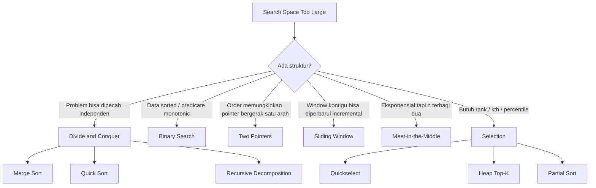
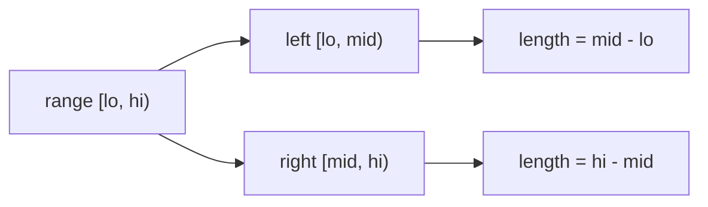
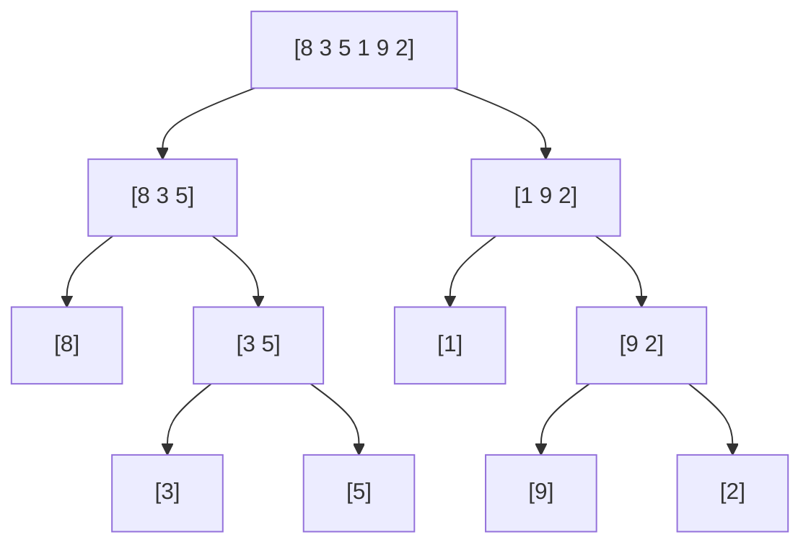
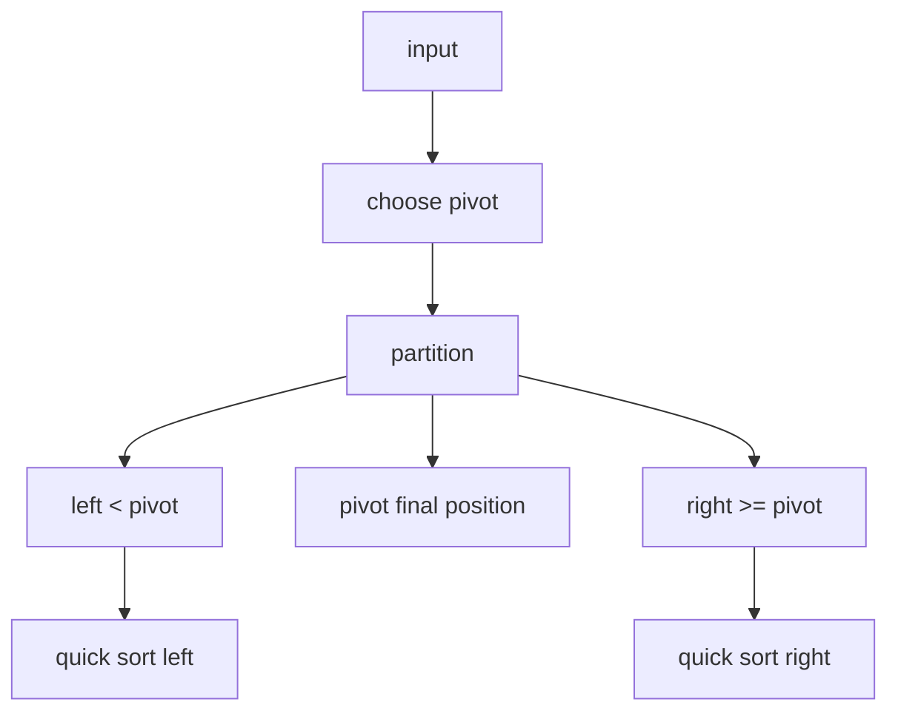
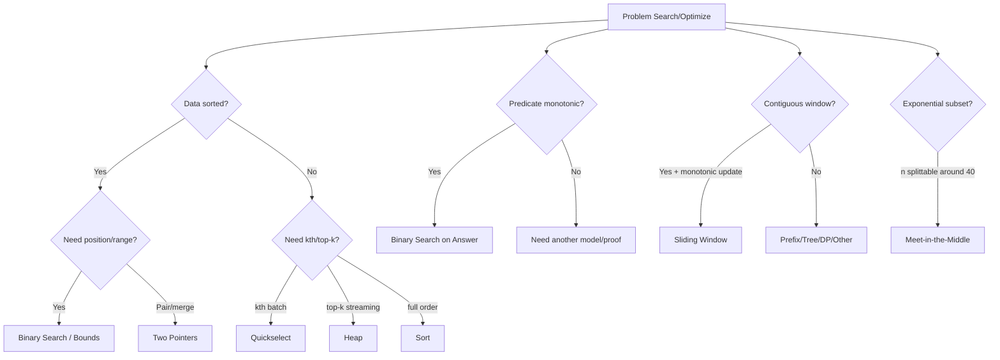

# learn-go-data-structure-algorithm-part-020.md

# Part 020 — Divide and Conquer, Selection, dan Search Space Reduction

> Seri: `learn-go-data-structure-algorithm`  
> Bagian: `020 / 034`  
> Target pembaca: Java software engineer yang ingin menguasai Go data structure & algorithm sampai level production-grade  
> Fokus: divide and conquer, selection, binary-search-on-answer, two pointers, sliding window, meet-in-the-middle, dan implementasi Go yang minim alokasi, jelas invariant, serta aman boundary

---

## Daftar Isi

- [1. Tujuan Part Ini](#1-tujuan-part-ini)
- [2. Inti Mental Model](#2-inti-mental-model)
- [3. Divide and Conquer: Bentuk Umum](#3-divide-and-conquer-bentuk-umum)
- [4. Cost Model: Bukan Hanya Big-O](#4-cost-model-bukan-hanya-big-o)
- [5. Merge Sort: Stable Divide-and-Conquer](#5-merge-sort-stable-divide-and-conquer)
- [6. Quick Sort: Partition-Based Divide-and-Conquer](#6-quick-sort-partition-based-divide-and-conquer)
- [7. Quickselect: Selection Tanpa Full Sort](#7-quickselect-selection-tanpa-full-sort)
- [8. Binary Search sebagai Search Space Reduction](#8-binary-search-sebagai-search-space-reduction)
- [9. Binary Search on Answer / Parametric Search](#9-binary-search-on-answer--parametric-search)
- [10. Two Pointers](#10-two-pointers)
- [11. Sliding Window](#11-sliding-window)
- [12. Meet-in-the-Middle](#12-meet-in-the-middle)
- [13. Go-Specific Design Notes](#13-go-specific-design-notes)
- [14. Testing Strategy](#14-testing-strategy)
- [15. Benchmarking Strategy](#15-benchmarking-strategy)
- [16. Production Case Studies](#16-production-case-studies)
- [17. Anti-Patterns](#17-anti-patterns)
- [18. Decision Framework](#18-decision-framework)
- [19. Latihan Bertahap](#19-latihan-bertahap)
- [20. Ringkasan](#20-ringkasan)
- [21. Referensi](#21-referensi)

---

## 1. Tujuan Part Ini

Part ini membahas keluarga teknik algoritmik yang memiliki satu tema besar:

> **Jangan mengecek semua kemungkinan secara linear/bruteforce kalau struktur masalah memungkinkan ruang pencarian diperkecil secara sistematis.**

Teknik yang akan dibahas:

1. **Divide and conquer**
   - pecah masalah besar menjadi submasalah,
   - selesaikan submasalah,
   - gabungkan hasil.

2. **Selection**
   - cari elemen ke-k, median, percentile, Top-K,
   - tanpa harus selalu melakukan full sort.

3. **Binary search**
   - bukan hanya mencari angka di array sorted,
   - tetapi mencari titik transisi pada predicate monotonic.

4. **Two pointers**
   - manfaatkan order untuk menghindari nested loop.

5. **Sliding window**
   - proses subarray/subsequence kontigu secara incremental.

6. **Meet-in-the-middle**
   - ubah eksplorasi eksponensial menjadi dua eksplorasi lebih kecil.

Dalam Go, teknik ini harus dilihat dengan lebih realistis:

- berapa alokasi tambahan?
- apakah kita membuat slice baru atau hanya slice view?
- apakah recursive depth aman?
- apakah comparator konsisten?
- apakah index boundary benar?
- apakah data input boleh dimutasi?
- apakah output harus stable?
- apakah p99 latency lebih penting daripada average case?

---

## 2. Inti Mental Model

### 2.1. Dari Brute Force ke Search Space Reduction

Banyak masalah algoritmik dimulai dengan bentuk brute force:

```text
for every candidate:
    check candidate
```

Masalahnya, jumlah candidate sering terlalu besar.

Search space reduction bertanya:

```text
Apakah semua candidate memang perlu dicek?
Apakah ada struktur yang bisa dipakai untuk membuang sebagian ruang pencarian?
```

Contoh:

| Masalah | Brute force | Reduction |
|---|---:|---:|
| Cari item di sorted slice | O(n) | binary search O(log n) |
| Cari pair sum pada sorted slice | O(n²) | two pointers O(n) |
| Cari median | sort O(n log n) | quickselect average O(n) |
| Cari minimum feasible capacity | coba semua capacity | binary search on answer |
| Subarray dengan sum <= limit | semua subarray O(n²) | sliding window O(n), jika nilai non-negative |
| Subset sum n=40 | O(2⁴⁰) | meet-in-the-middle O(2²⁰ log 2²⁰) |

---

### 2.2. Diagram Keluarga Teknik



---

### 2.3. Invariant Lebih Penting daripada Template

Sebagian besar bug pada keluarga algoritma ini bukan karena engineer tidak tahu rumusnya, tetapi karena invariant tidak jelas.

Contoh invariant binary search:

```text
lo adalah batas bawah kandidat.
hi adalah batas atas eksklusif kandidat.
Jawaban, jika ada, selalu berada di [lo, hi).
```

Contoh invariant two pointers:

```text
left dan right hanya bergerak maju.
Setiap pasangan yang dibuang sudah terbukti tidak mungkin menjadi jawaban.
```

Contoh invariant sliding window:

```text
Window [left, right) selalu memenuhi constraint setelah proses shrink selesai.
```

Kalau invariant tidak bisa ditulis, implementasi hampir pasti rapuh.

---

## 3. Divide and Conquer: Bentuk Umum

Divide and conquer memiliki tiga fase:

```text
solve(problem):
    if problem small:
        solve directly

    parts = divide(problem)
    partialResults = solve(each part)
    return combine(partialResults)
```

Dalam bentuk recurrence:

```text
T(n) = a * T(n / b) + f(n)
```

Contoh:

| Algoritma | Recurrence | Complexity |
|---|---|---:|
| Binary search | T(n)=T(n/2)+O(1) | O(log n) |
| Merge sort | T(n)=2T(n/2)+O(n) | O(n log n) |
| Quick sort average | T(n)=T(k)+T(n-k-1)+O(n) | avg O(n log n) |
| Quickselect average | T(n)=T(one side)+O(n) | avg O(n) |

---

### 3.1. Bentuk Implementasi di Go

Go tidak memiliki tail-call optimization sebagai kontrak bahasa. Jadi recursion harus digunakan dengan sadar.

Bentuk umum yang aman:

```go
func solveRange(a []int, lo, hi int) {
	if hi-lo <= 1 {
		return
	}

	mid := lo + (hi-lo)/2
	solveRange(a, lo, mid)
	solveRange(a, mid, hi)
	// combine range [lo, mid) and [mid, hi)
}
```

Gunakan `lo, hi` sebagai **half-open interval**:

```text
[lo, hi)
```

Keuntungan half-open interval:

- panjang = `hi - lo`,
- empty jika `lo == hi`,
- split natural:
  - kiri `[lo, mid)`,
  - kanan `[mid, hi)`,
- mengurangi off-by-one.

---

### 3.2. Diagram Half-Open Range



---

### 3.3. Divide-and-Conquer dan Slice View

Di Go, operasi slicing tidak menyalin elemen. Contoh:

```go
left := xs[:mid]
right := xs[mid:]
```

Ini membuat **view** ke backing array yang sama.

Implikasi:

- bagus untuk menghindari copy,
- berbahaya jika kedua sisi dimutasi tanpa disiplin,
- bisa menahan backing array besar tetap hidup,
- capacity bisa membuat append pada subslice menimpa area yang tidak diduga.

Untuk algoritma divide-and-conquer, lebih aman memakai index `lo, hi` ketika mutasi kompleks.

---

## 4. Cost Model: Bukan Hanya Big-O

### 4.1. Cost yang Sering Tersembunyi

| Cost | Dampak |
|---|---|
| Allocation | GC pressure, latency |
| Copy | CPU dan memory bandwidth |
| Recursive calls | stack growth, overhead |
| Comparator call | bisa dominan jika mahal |
| Pointer chasing | cache miss |
| Branch misprediction | quick partition bisa terdampak |
| Extra buffer | memory peak |
| Mutating input | API contract risk |
| Stability requirement | butuh algoritma berbeda |

---

### 4.2. Complexity Matrix

| Teknik | Typical Time | Extra Space | Stable? | Mutates Input? |
|---|---:|---:|---|---|
| Merge sort | O(n log n) | O(n) | Ya | Bisa |
| Quick sort | avg O(n log n), worst O(n²) | O(log n) stack | Tidak natural | Ya |
| Quickselect | avg O(n), worst O(n²) | O(1) extra | Tidak | Ya |
| Binary search | O(log n) | O(1) | N/A | Tidak |
| Two pointers | O(n) | O(1) | N/A | Tidak/ya |
| Sliding window | O(n) | O(1) atau O(k) | N/A | Tidak |
| Meet-in-middle | O(2^(n/2)) | O(2^(n/2)) | N/A | Tidak |

---

### 4.3. Production View

Dalam backend system, kita jarang hanya bertanya:

```text
Apakah ini O(n log n)?
```

Pertanyaan yang lebih penting:

```text
Untuk n maksimum realistis, apakah:
- memory peak aman?
- p99 latency stabil?
- input boleh dimutasi?
- hasil deterministic?
- comparator valid?
- failure mode jelas?
- benchmark memakai distribusi data realistis?
```

---

## 5. Merge Sort: Stable Divide-and-Conquer

### 5.1. Mental Model

Merge sort:

1. pecah slice menjadi dua,
2. sort masing-masing bagian,
3. merge dua bagian sorted.



---

### 5.2. Kapan Merge Sort Cocok

Merge sort cocok ketika:

- hasil harus stable,
- worst-case O(n log n) penting,
- data linked/external/file-backed,
- merge dari beberapa sorted run,
- sequential access lebih penting daripada random access.

Tidak cocok ketika:

- memory tambahan O(n) tidak boleh,
- input kecil dan allocation overhead dominan,
- mutasi in-place lebih diinginkan.

---

### 5.3. Generic Merge Sort di Go

```go
package dsa

import "cmp"

func MergeSort[S ~[]E, E cmp.Ordered](xs S) S {
	if len(xs) <= 1 {
		out := make(S, len(xs))
		copy(out, xs)
		return out
	}

	buf := make(S, len(xs))
	out := make(S, len(xs))
	copy(out, xs)

	mergeSortInto(out, buf, 0, len(out))
	return out
}

func mergeSortInto[S ~[]E, E cmp.Ordered](xs, buf S, lo, hi int) {
	if hi-lo <= 1 {
		return
	}

	mid := lo + (hi-lo)/2
	mergeSortInto(xs, buf, lo, mid)
	mergeSortInto(xs, buf, mid, hi)

	merge(xs, buf, lo, mid, hi)
	copy(xs[lo:hi], buf[lo:hi])
}

func merge[S ~[]E, E cmp.Ordered](xs, buf S, lo, mid, hi int) {
	i, j, k := lo, mid, lo

	for i < mid && j < hi {
		if xs[i] <= xs[j] {
			buf[k] = xs[i]
			i++
		} else {
			buf[k] = xs[j]
			j++
		}
		k++
	}

	for i < mid {
		buf[k] = xs[i]
		i++
		k++
	}

	for j < hi {
		buf[k] = xs[j]
		j++
		k++
	}
}
```

Catatan:

- fungsi ini mengembalikan slice baru,
- input tidak dimutasi,
- buffer dialokasikan sekali,
- stable karena ketika sama, elemen kiri dipilih dulu.

---

### 5.4. Comparator-Based Merge Sort

Untuk struct, gunakan comparator:

```go
type LessFunc[T any] func(a, b T) bool

func MergeSortFunc[S ~[]E, E any](xs S, less LessFunc[E]) S {
	if len(xs) <= 1 {
		out := make(S, len(xs))
		copy(out, xs)
		return out
	}

	out := make(S, len(xs))
	buf := make(S, len(xs))
	copy(out, xs)

	mergeSortFuncInto(out, buf, 0, len(out), less)
	return out
}

func mergeSortFuncInto[S ~[]E, E any](xs, buf S, lo, hi int, less LessFunc[E]) {
	if hi-lo <= 1 {
		return
	}

	mid := lo + (hi-lo)/2
	mergeSortFuncInto(xs, buf, lo, mid, less)
	mergeSortFuncInto(xs, buf, mid, hi, less)

	i, j, k := lo, mid, lo
	for i < mid && j < hi {
		if !less(xs[j], xs[i]) {
			buf[k] = xs[i]
			i++
		} else {
			buf[k] = xs[j]
			j++
		}
		k++
	}

	for i < mid {
		buf[k] = xs[i]
		i++
		k++
	}

	for j < hi {
		buf[k] = xs[j]
		j++
		k++
	}

	copy(xs[lo:hi], buf[lo:hi])
}
```

Perhatikan stability rule:

```go
if !less(xs[j], xs[i]) {
    pilih xs[i]
}
```

Artinya jika `xs[i]` dan `xs[j]` setara, elemen kiri tetap lebih dulu.

---

### 5.5. Common Bug pada Merge Sort

Bug umum:

1. `mid := (lo + hi) / 2`
   - pada int besar bisa overflow secara teori.
   - prefer `lo + (hi-lo)/2`.

2. Merge tidak stable:
   - memilih kanan ketika sama.

3. Mengalokasikan buffer pada setiap recursive call:
   - membuat complexity allocation buruk.

4. Mengembalikan subslice yang masih menahan backing array besar.

5. Comparator tidak strict weak ordering.

---

## 6. Quick Sort: Partition-Based Divide-and-Conquer

### 6.1. Mental Model

Quick sort:

1. pilih pivot,
2. partition:
   - elemen < pivot ke kiri,
   - elemen >= pivot ke kanan,
3. sort kiri dan kanan.



---

### 6.2. Invariant Partition

Untuk partition Lomuto sederhana:

```text
range [lo, i)      < pivot
range [i, j)       >= pivot
range [j, hi-1)    unknown
hi-1               pivot
```

Setelah selesai:

```text
range [lo, i)      < pivot
i                  pivot
range [i+1, hi)    >= pivot
```

---

### 6.3. Lomuto Partition

```go
func partition(xs []int, lo, hi int) int {
	pivot := xs[hi-1]
	i := lo

	for j := lo; j < hi-1; j++ {
		if xs[j] < pivot {
			xs[i], xs[j] = xs[j], xs[i]
			i++
		}
	}

	xs[i], xs[hi-1] = xs[hi-1], xs[i]
	return i
}
```

---

### 6.4. Quick Sort Implementation

```go
func QuickSort(xs []int) {
	quickSortRange(xs, 0, len(xs))
}

func quickSortRange(xs []int, lo, hi int) {
	if hi-lo <= 1 {
		return
	}

	p := partition(xs, lo, hi)
	quickSortRange(xs, lo, p)
	quickSortRange(xs, p+1, hi)
}
```

Ini baik untuk pembelajaran, tetapi belum cukup production-grade karena:

- pivot selalu akhir bisa buruk untuk data sorted,
- worst-case O(n²),
- recursion depth bisa O(n),
- banyak duplicate bisa memperburuk partition.

---

### 6.5. Median-of-Three Pivot

```go
func medianOfThree(xs []int, lo, hi int) int {
	mid := lo + (hi-lo)/2
	last := hi - 1

	if xs[mid] < xs[lo] {
		xs[mid], xs[lo] = xs[lo], xs[mid]
	}
	if xs[last] < xs[mid] {
		xs[last], xs[mid] = xs[mid], xs[last]
	}
	if xs[mid] < xs[lo] {
		xs[mid], xs[lo] = xs[lo], xs[mid]
	}

	return mid
}
```

Gunakan pivot median-of-three untuk mengurangi risiko input sorted/reverse-sorted.

---

### 6.6. Three-Way Partition untuk Banyak Duplicate

Jika banyak duplicate, partition dua arah bisa membuang waktu memproses elemen sama berulang-ulang.

Three-way partition membagi:

```text
< pivot
== pivot
> pivot
```

```go
func threeWayPartition(xs []int, lo, hi int) (lt, gt int) {
	pivot := xs[lo]
	lt, i, gt := lo, lo+1, hi

	for i < gt {
		switch {
		case xs[i] < pivot:
			xs[lt], xs[i] = xs[i], xs[lt]
			lt++
			i++
		case xs[i] > pivot:
			gt--
			xs[i], xs[gt] = xs[gt], xs[i]
		default:
			i++
		}
	}

	return lt, gt
}
```

Setelah partition:

```text
[lo, lt)  < pivot
[lt, gt)  == pivot
[gt, hi)  > pivot
```

Quick sort:

```go
func QuickSort3(xs []int) {
	quickSort3(xs, 0, len(xs))
}

func quickSort3(xs []int, lo, hi int) {
	if hi-lo <= 1 {
		return
	}

	lt, gt := threeWayPartition(xs, lo, hi)
	quickSort3(xs, lo, lt)
	quickSort3(xs, gt, hi)
}
```

---

### 6.7. Tail Recursion Reduction

Untuk mengurangi stack depth, sort sisi lebih kecil dengan recursion, lalu lanjutkan sisi besar dengan loop.

```go
func quickSortIter(xs []int, lo, hi int) {
	for hi-lo > 1 {
		p := partition(xs, lo, hi)

		leftLen := p - lo
		rightLen := hi - (p + 1)

		if leftLen < rightLen {
			quickSortIter(xs, lo, p)
			lo = p + 1
		} else {
			quickSortIter(xs, p+1, hi)
			hi = p
		}
	}
}
```

Dengan cara ini, recursion depth cenderung O(log n) untuk balanced partition.

---

### 6.8. Kapan Jangan Implement Sort Sendiri

Di production, gunakan standard library kecuali ada alasan kuat:

- `slices.Sort`
- `slices.SortFunc`
- `sort.Slice`
- `sort.SliceStable`
- `slices.BinarySearch`
- `slices.BinarySearchFunc`

Implementasi sendiri tepat untuk:

- belajar invariant,
- custom partition untuk selection,
- partial sort/top-k,
- specialized data layout,
- external sorting,
- deterministic domain-specific algorithm.

---

## 7. Quickselect: Selection Tanpa Full Sort

### 7.1. Problem

Cari elemen ke-k jika data diurutkan.

Contoh:

```text
xs = [9, 1, 8, 2, 7]
k = 2
sorted = [1, 2, 7, 8, 9]
jawaban = 7
```

Full sort:

```text
O(n log n)
```

Quickselect average:

```text
O(n)
```

---

### 7.2. Invariant Quickselect

Setelah partition pivot berada di index `p`.

- Jika `p == k`, selesai.
- Jika `k < p`, cari di kiri.
- Jika `k > p`, cari di kanan.

Kita hanya perlu melanjutkan **satu sisi**, bukan dua sisi seperti quicksort.

---

### 7.3. Implementation

```go
func KthSmallest(xs []int, k int) (int, bool) {
	if k < 0 || k >= len(xs) {
		return 0, false
	}

	lo, hi := 0, len(xs)

	for lo < hi {
		p := partition(xs, lo, hi)

		switch {
		case p == k:
			return xs[p], true
		case k < p:
			hi = p
		default:
			lo = p + 1
		}
	}

	return 0, false
}
```

Catatan penting:

- Fungsi ini memutasi `xs`.
- Jika input tidak boleh berubah, copy dulu.
- Worst-case tetap O(n²) jika pivot buruk.
- Untuk percentile/median pada input besar, quickselect sering jauh lebih murah daripada full sort.

---

### 7.4. Median

```go
func MedianInt(xs []int) (float64, bool) {
	n := len(xs)
	if n == 0 {
		return 0, false
	}

	cp := append([]int(nil), xs...)

	if n%2 == 1 {
		v, _ := KthSmallest(cp, n/2)
		return float64(v), true
	}

	left, _ := KthSmallest(cp, n/2-1)
	right, _ := KthSmallest(cp, n/2)
	return float64(left+right) / 2.0, true
}
```

Caveat:

```go
float64(left+right)
```

bisa overflow untuk `int` ekstrem sebelum konversi. Lebih aman:

```go
return float64(left)/2.0 + float64(right)/2.0, true
```

---

### 7.5. Top-K: Quickselect vs Heap vs Sort

| Approach | Time | Space | Mutates | Cocok Untuk |
|---|---:|---:|---|---|
| Full sort | O(n log n) | tergantung sort | bisa | output sorted lengkap |
| Heap size K | O(n log k) | O(k) | tidak harus | streaming, K kecil |
| Quickselect | avg O(n) | O(1) | ya | batch, butuh threshold/top partition |
| Partial sorted after quickselect | avg O(n) + O(k log k) | O(1) | ya | top-K sorted |

Jika data streaming, heap sering lebih cocok. Jika data batch dan mutasi boleh, quickselect sering lebih cepat.

---

## 8. Binary Search sebagai Search Space Reduction

### 8.1. Binary Search Bukan Hanya Array Search

Binary search bekerja ketika ada **monotonic predicate**.

Contoh predicate:

```text
false false false true true true
```

Target:

```text
first true
```

Atau:

```text
true true true false false
```

Target:

```text
last true
```

---

### 8.2. Half-Open Binary Search

Cari index pertama `i` sehingga `xs[i] >= target`.

```go
func LowerBound(xs []int, target int) int {
	lo, hi := 0, len(xs)

	for lo < hi {
		mid := lo + (hi-lo)/2
		if xs[mid] < target {
			lo = mid + 1
		} else {
			hi = mid
		}
	}

	return lo
}
```

Invariant:

```text
Semua index < lo pasti < target.
Semua index >= hi adalah kandidat >= target.
Jawaban selalu di [lo, hi].
```

---

### 8.3. Upper Bound

Cari index pertama `i` sehingga `xs[i] > target`.

```go
func UpperBound(xs []int, target int) int {
	lo, hi := 0, len(xs)

	for lo < hi {
		mid := lo + (hi-lo)/2
		if xs[mid] <= target {
			lo = mid + 1
		} else {
			hi = mid
		}
	}

	return lo
}
```

Jumlah kemunculan `target`:

```go
count := UpperBound(xs, target) - LowerBound(xs, target)
```

---

### 8.4. Search First True

```go
func FirstTrue(n int, pred func(int) bool) int {
	lo, hi := 0, n

	for lo < hi {
		mid := lo + (hi-lo)/2
		if pred(mid) {
			hi = mid
		} else {
			lo = mid + 1
		}
	}

	return lo
}
```

Jika return `n`, artinya tidak ada `true`.

---

### 8.5. Search Last True

```go
func LastTrue(n int, pred func(int) bool) int {
	lo, hi := 0, n

	for lo < hi {
		mid := lo + (hi-lo)/2
		if pred(mid) {
			lo = mid + 1
		} else {
			hi = mid
		}
	}

	return lo - 1
}
```

Jika return `-1`, artinya tidak ada `true`.

---

### 8.6. Standard Library

Go menyediakan:

```go
sort.Search(n int, f func(int) bool) int
```

Pola:

```go
i := sort.Search(len(xs), func(i int) bool {
	return xs[i] >= target
})
```

Package `slices` juga menyediakan binary search untuk slice terurut:

```go
idx, found := slices.BinarySearch(xs, target)
```

dan comparator-based:

```go
idx, found := slices.BinarySearchFunc(items, target, cmpFunc)
```

Gunakan standard library ketika sesuai; implement sendiri ketika ingin invariant eksplisit atau ada kebutuhan custom.

---

## 9. Binary Search on Answer / Parametric Search

### 9.1. Mental Model

Kadang kita tidak mencari posisi pada array, tapi mencari **nilai minimum/maksimum yang feasible**.

Bentuk umum:

```text
Diberikan answer space [lo, hi].
Ada predicate feasible(x).
Jika feasible(x) true, maka semua nilai lebih besar juga true.
Cari nilai terkecil x yang feasible.
```

Contoh:

```text
capacity: 1 2 3 4 5 6 7 8 9
feasible: F F F F T T T T T
answer = 5
```

---

### 9.2. Pattern Minimum Feasible

```go
func MinFeasible(lo, hi int, feasible func(int) bool) int {
	for lo < hi {
		mid := lo + (hi-lo)/2
		if feasible(mid) {
			hi = mid
		} else {
			lo = mid + 1
		}
	}
	return lo
}
```

Precondition:

```text
feasible(hi) harus true
```

atau `hi` harus eksklusif dan disesuaikan.

---

### 9.3. Example: Minimum Capacity to Ship Packages

Problem:

```text
Diberikan weights dan jumlah hari D.
Cari kapasitas minimum kapal supaya semua package bisa dikirim berurutan dalam D hari.
```

Feasibility:

```go
func canShip(weights []int, days int, cap int) bool {
	usedDays := 1
	load := 0

	for _, w := range weights {
		if w > cap {
			return false
		}

		if load+w <= cap {
			load += w
		} else {
			usedDays++
			load = w
			if usedDays > days {
				return false
			}
		}
	}

	return true
}
```

Search:

```go
func MinShipCapacity(weights []int, days int) int {
	lo, hi := 0, 0
	for _, w := range weights {
		if w > lo {
			lo = w
		}
		hi += w
	}

	for lo < hi {
		mid := lo + (hi-lo)/2
		if canShip(weights, days, mid) {
			hi = mid
		} else {
			lo = mid + 1
		}
	}

	return lo
}
```

Complexity:

```text
O(n log sum(weights))
```

Bukan:

```text
O(sum(weights) * n)
```

---

### 9.4. Example: Minimum Workers

Misal setiap worker punya capacity sama, dan kita ingin mencari jumlah minimum worker agar semua task selesai sebelum deadline.

```go
func MinWorkers(tasks []int, deadline int) int {
	if len(tasks) == 0 {
		return 0
	}

	lo, hi := 1, len(tasks)

	feasible := func(workers int) bool {
		loads := make([]int, workers)

		for _, t := range tasks {
			best := 0
			for i := 1; i < workers; i++ {
				if loads[i] < loads[best] {
					best = i
				}
			}
			loads[best] += t
			if loads[best] > deadline {
				return false
			}
		}

		return true
	}

	for lo < hi {
		mid := lo + (hi-lo)/2
		if feasible(mid) {
			hi = mid
		} else {
			lo = mid + 1
		}
	}

	return lo
}
```

Caveat penting:

- feasibility function di atas adalah heuristic greedy.
- Untuk general scheduling, greedy assignment tidak selalu optimal.
- Binary search hanya valid jika predicate yang dipakai benar-benar monotonic dan merepresentasikan feasibility yang benar.

Ini contoh penting: binary search framework bisa benar, tetapi predicate bisa salah.

---

### 9.5. Red Flags pada Binary Search on Answer

1. Predicate tidak monotonic.
2. Boundary `lo/hi` tidak menjamin answer ada.
3. Overflow pada `mid`.
4. Infinite loop karena update salah.
5. Feasibility terlalu mahal sehingga total cost tidak acceptable.
6. Predicate punya side effect.
7. Predicate heuristic tapi dianggap proof.

---

## 10. Two Pointers

### 10.1. Mental Model

Two pointers cocok ketika:

- data sorted,
- ada dua boundary yang bisa digerakkan satu arah,
- setiap move membuang sebagian kandidat secara valid.

Bentuk umum:

```go
left, right := 0, len(xs)-1

for left < right {
	// inspect xs[left], xs[right]
	// move left or right based on invariant
}
```

---

### 10.2. Pair Sum pada Sorted Slice

```go
func HasPairSumSorted(xs []int, target int) bool {
	left, right := 0, len(xs)-1

	for left < right {
		sum := xs[left] + xs[right]

		switch {
		case sum == target:
			return true
		case sum < target:
			left++
		default:
			right--
		}
	}

	return false
}
```

Invariant:

```text
Jika sum terlalu kecil, menaikkan right tidak mungkin karena right sudah maksimum.
Maka left harus naik.
Jika sum terlalu besar, menurunkan left tidak cukup karena left sudah minimum.
Maka right harus turun.
```

---

### 10.3. Remove Duplicates In-Place

Untuk sorted slice:

```go
func UniqueSortedInPlace[S ~[]E, E comparable](xs S) S {
	if len(xs) <= 1 {
		return xs
	}

	write := 1
	for read := 1; read < len(xs); read++ {
		if xs[read] != xs[write-1] {
			xs[write] = xs[read]
			write++
		}
	}

	var zero E
	for i := write; i < len(xs); i++ {
		xs[i] = zero
	}

	return xs[:write]
}
```

Kenapa zeroing tail penting?

Jika `E` mengandung pointer, elemen yang tidak lagi dipakai masih bisa menahan objek hidup di memory.

---

### 10.4. Merge Two Sorted Slices

```go
func MergeSorted(a, b []int) []int {
	out := make([]int, 0, len(a)+len(b))
	i, j := 0, 0

	for i < len(a) && j < len(b) {
		if a[i] <= b[j] {
			out = append(out, a[i])
			i++
		} else {
			out = append(out, b[j])
			j++
		}
	}

	out = append(out, a[i:]...)
	out = append(out, b[j:]...)
	return out
}
```

Ini adalah two pointers klasik.

---

### 10.5. Intersection of Sorted Slices

```go
func IntersectSorted(a, b []int) []int {
	out := make([]int, 0)

	i, j := 0, 0
	for i < len(a) && j < len(b) {
		switch {
		case a[i] == b[j]:
			out = append(out, a[i])
			i++
			j++
		case a[i] < b[j]:
			i++
		default:
			j++
		}
	}

	return out
}
```

Jika ingin set intersection tanpa duplicate, tambahkan skip duplicate.

---

## 11. Sliding Window

### 11.1. Mental Model

Sliding window digunakan untuk subarray/subsequence kontigu.

Bentuk umum:

```text
right bergerak menambah item.
left bergerak menghapus item sampai invariant terpenuhi.
```

Window biasanya:

```text
[left, right)
```

---

### 11.2. Longest Subarray Sum <= Limit untuk Non-Negative Numbers

Jika semua angka non-negative, sum window monotonic terhadap perluasan window.

```go
func LongestSumAtMost(xs []int, limit int) int {
	left := 0
	sum := 0
	best := 0

	for right, x := range xs {
		sum += x

		for left <= right && sum > limit {
			sum -= xs[left]
			left++
		}

		if length := right - left + 1; length > best {
			best = length
		}
	}

	return best
}
```

Precondition penting:

```text
xs harus non-negative.
```

Jika ada angka negatif, sliding window ini tidak valid karena mengecilkan window tidak selalu menurunkan sum secara predictable.

---

### 11.3. Longest Substring Without Repeating Bytes

Untuk byte-level string:

```go
func LongestUniqueBytes(s string) int {
	last := make(map[byte]int)
	left := 0
	best := 0

	for right := 0; right < len(s); right++ {
		c := s[right]

		if prev, ok := last[c]; ok && prev >= left {
			left = prev + 1
		}

		last[c] = right

		if length := right - left + 1; length > best {
			best = length
		}
	}

	return best
}
```

Caveat:

- Ini byte-level, bukan rune/grapheme-level.
- Cocok untuk ASCII/protocol tokens.
- Tidak cocok untuk user-facing Unicode text tanpa requirement jelas.

---

### 11.4. Sliding Window Frequency

Cari apakah string `s` mengandung permutation dari `pattern`, ASCII lowercase.

```go
func ContainsPermutationLowerASCII(s, pattern string) bool {
	if len(pattern) > len(s) {
		return false
	}

	var need, have [26]int

	for i := 0; i < len(pattern); i++ {
		need[pattern[i]-'a']++
		have[s[i]-'a']++
	}

	if need == have {
		return true
	}

	for right := len(pattern); right < len(s); right++ {
		left := right - len(pattern)

		have[s[left]-'a']--
		have[s[right]-'a']++

		if need == have {
			return true
		}
	}

	return false
}
```

Production caveat:

- Validasi input jika tidak dijamin lowercase ASCII.
- Untuk Unicode/general text, desain frequency map berbeda.

---

### 11.5. Fixed Window vs Variable Window

| Window Type | Contoh | Invariant |
|---|---|---|
| Fixed | moving average 5 menit | length konstan |
| Variable | longest sum <= limit | constraint terpenuhi |
| Frequency | anagram search | counts match |
| Monotonic | max in window | deque maintains order |

Monotonic queue akan dibahas lebih dalam pada part range/window lanjutan.

---

## 12. Meet-in-the-Middle

### 12.1. Mental Model

Jika n terlalu besar untuk brute force O(2ⁿ), tetapi bisa dibelah dua:

```text
2ⁿ -> 2^(n/2) + 2^(n/2)
```

Contoh:

```text
n = 40
2^40 ≈ 1,099,511,627,776
2^20 ≈ 1,048,576
```

Masih besar, tapi sering feasible.

---

### 12.2. Subset Sum Closest to Target

Generate semua subset sum dari kiri dan kanan.

```go
func subsetSums(xs []int) []int {
	n := len(xs)
	total := 1 << n

	out := make([]int, 0, total)
	for mask := 0; mask < total; mask++ {
		sum := 0
		for i, x := range xs {
			if mask&(1<<i) != 0 {
				sum += x
			}
		}
		out = append(out, sum)
	}

	return out
}
```

Cari apakah ada subset sum tepat target:

```go
func HasSubsetSumMITM(xs []int, target int) bool {
	n := len(xs)
	left := subsetSums(xs[:n/2])
	right := subsetSums(xs[n/2:])

	slices.Sort(right)

	for _, a := range left {
		need := target - a
		_, found := slices.BinarySearch(right, need)
		if found {
			return true
		}
	}

	return false
}
```

Import:

```go
import "slices"
```

---

### 12.3. Caveat Meet-in-the-Middle

Meet-in-the-middle bukan magic.

Risiko:

- memory O(2^(n/2)),
- integer overflow pada jumlah subset,
- subset generation bisa mahal,
- duplicate sums bisa banyak,
- output reconstruction lebih kompleks daripada boolean existence.

Untuk `n=60`, `2^30` bisa terlalu besar untuk memory production.

---

### 12.4. Dengan Dedup Sums

Jika banyak duplicate, kita bisa compress:

```go
func uniqueSortedInts(xs []int) []int {
	if len(xs) == 0 {
		return xs
	}

	slices.Sort(xs)

	write := 1
	for read := 1; read < len(xs); read++ {
		if xs[read] != xs[write-1] {
			xs[write] = xs[read]
			write++
		}
	}

	return xs[:write]
}
```

Trade-off:

- sorting O(m log m),
- memory tetap besar sebelum dedup,
- tetapi search bisa lebih murah.

---

## 13. Go-Specific Design Notes

### 13.1. Prefer Index Range untuk Recursive Algorithms

Daripada:

```go
func rec(xs []int) {
	rec(xs[:mid])
	rec(xs[mid:])
}
```

gunakan:

```go
func rec(xs []int, lo, hi int) {
	rec(xs, lo, mid)
	rec(xs, mid, hi)
}
```

Alasan:

- lebih jelas ownership,
- menghindari retained subslice yang membingungkan,
- memudahkan buffer reuse,
- memudahkan instrumentation.

---

### 13.2. Jangan Alokasikan Buffer Berulang

Buruk:

```go
func sortRange(xs []int) {
	buf := make([]int, len(xs))
	// recursive...
}
```

Jika dipanggil di setiap level recursion, allocation bisa sangat besar.

Lebih baik:

```go
buf := make([]int, len(xs))
sortRange(xs, buf, 0, len(xs))
```

---

### 13.3. Mutability Harus Menjadi API Contract

Contoh:

```go
func KthSmallest(xs []int, k int) (int, bool)
```

Apakah fungsi ini boleh mengubah `xs`?

Nama saja tidak cukup.

Lebih defensible:

```go
func KthSmallestInPlace(xs []int, k int) (int, bool)
```

atau:

```go
func KthSmallestCopy(xs []int, k int) (int, bool) {
	cp := append([]int(nil), xs...)
	return KthSmallestInPlace(cp, k)
}
```

---

### 13.4. Comparator Contract

Comparator harus konsisten.

Untuk `less(a,b)`:

```text
less(a,a) harus false
Jika less(a,b) true, maka less(b,a) harus false.
Transitivity harus berlaku.
```

Untuk `cmp(a,b)`:

```text
cmp(a,b) < 0 berarti a sebelum b.
cmp(a,b) == 0 berarti setara.
cmp(a,b) > 0 berarti a setelah b.
```

Bug comparator bisa menyebabkan:

- sort tidak valid,
- binary search salah,
- tree invariant rusak,
- heap invariant rusak.

---

### 13.5. Integer Overflow

Masalah umum:

```go
mid := (lo + hi) / 2
```

Prefer:

```go
mid := lo + (hi-lo)/2
```

Untuk sum:

```go
sum := xs[left] + xs[right]
```

Jika `int` bisa ekstrem, gunakan check atau tipe lebih besar.

---

### 13.6. Avoid Closure Cost pada Hot Loop Jika Perlu

`sort.Search` menerima closure:

```go
i := sort.Search(n, func(i int) bool {
	return xs[i] >= target
})
```

Biasanya baik. Tetapi pada hot path ultra-sensitif, manual loop bisa lebih mudah di-inline dan dioptimasi.

Jangan menebak. Benchmark.

---

### 13.7. Use Standard Library by Default

Package relevan:

- `sort`
- `slices`
- `cmp`
- `container/heap`
- `testing`

Gunakan implementasi manual terutama untuk:

- belajar,
- specialized algorithm,
- explicit invariant,
- custom memory behavior,
- partial selection,
- external-memory processing.

---

## 14. Testing Strategy

### 14.1. Boundary Tests

Untuk binary search:

```go
func TestLowerBound(t *testing.T) {
	tests := []struct {
		xs     []int
		target int
		want   int
	}{
		{nil, 1, 0},
		{[]int{}, 1, 0},
		{[]int{1}, 0, 0},
		{[]int{1}, 1, 0},
		{[]int{1}, 2, 1},
		{[]int{1, 2, 2, 2, 3}, 2, 1},
		{[]int{1, 2, 2, 2, 3}, 4, 5},
	}

	for _, tt := range tests {
		got := LowerBound(tt.xs, tt.target)
		if got != tt.want {
			t.Fatalf("LowerBound(%v, %d)=%d want %d", tt.xs, tt.target, got, tt.want)
		}
	}
}
```

---

### 14.2. Differential Testing

Untuk quickselect, bandingkan dengan sort:

```go
func TestKthSmallestAgainstSort(t *testing.T) {
	inputs := [][]int{
		{},
		{1},
		{2, 1},
		{3, 1, 2},
		{5, 5, 5},
		{9, -1, 3, 7, 0},
	}

	for _, xs := range inputs {
		for k := 0; k < len(xs); k++ {
			a := append([]int(nil), xs...)
			got, ok := KthSmallest(a, k)
			if !ok {
				t.Fatalf("unexpected not ok")
			}

			b := append([]int(nil), xs...)
			slices.Sort(b)
			want := b[k]

			if got != want {
				t.Fatalf("xs=%v k=%d got=%d want=%d", xs, k, got, want)
			}
		}
	}
}
```

---

### 14.3. Property Tests

Properti merge sort:

```text
1. output sorted
2. output length sama
3. multiset elemen sama
4. jika stable sort, elemen equal mempertahankan relative order
5. input tidak berubah, jika contract-nya non-mutating
```

---

### 14.4. Fuzz Testing Lower Bound

```go
func FuzzLowerBound(f *testing.F) {
	f.Add([]byte{1, 2, 2, 3}, byte(2))

	f.Fuzz(func(t *testing.T, raw []byte, target byte) {
		xs := make([]int, len(raw))
		for i, b := range raw {
			xs[i] = int(b)
		}
		slices.Sort(xs)

		idx := LowerBound(xs, int(target))

		for i := 0; i < idx; i++ {
			if xs[i] >= int(target) {
				t.Fatalf("index before lower bound violates condition")
			}
		}

		for i := idx; i < len(xs); i++ {
			if xs[i] < int(target) {
				t.Fatalf("index after lower bound violates condition")
			}
		}
	})
}
```

---

## 15. Benchmarking Strategy

### 15.1. Benchmark Input Distribution

Jangan hanya benchmark random uniform.

Gunakan:

- sorted,
- reverse sorted,
- many duplicates,
- almost sorted,
- random uniform,
- skewed,
- small n,
- medium n,
- large n.

Quick sort/quickselect sangat sensitif terhadap distribusi input dan pivot policy.

---

### 15.2. Benchmark Quickselect vs Sort

```go
func BenchmarkKthSmallest(b *testing.B) {
	base := make([]int, 100_000)
	for i := range base {
		base[i] = len(base) - i
	}

	k := len(base) / 2

	b.ReportAllocs()
	b.ResetTimer()

	for i := 0; i < b.N; i++ {
		xs := append([]int(nil), base...)
		_, _ = KthSmallest(xs, k)
	}
}

func BenchmarkSortMedian(b *testing.B) {
	base := make([]int, 100_000)
	for i := range base {
		base[i] = len(base) - i
	}

	k := len(base) / 2

	b.ReportAllocs()
	b.ResetTimer()

	for i := 0; i < b.N; i++ {
		xs := append([]int(nil), base...)
		slices.Sort(xs)
		_ = xs[k]
	}
}
```

Catatan:

- copy input masuk benchmark karena kedua algoritma butuh copy jika input asli tidak boleh berubah.
- Jika mutasi boleh, benchmark terpisah.

---

### 15.3. Benchmark Sliding Window vs Brute Force

```go
func BruteLongestSumAtMost(xs []int, limit int) int {
	best := 0
	for i := 0; i < len(xs); i++ {
		sum := 0
		for j := i; j < len(xs); j++ {
			sum += xs[j]
			if sum <= limit && j-i+1 > best {
				best = j - i + 1
			}
		}
	}
	return best
}
```

Benchmark akan menunjukkan gap O(n²) vs O(n), tetapi juga memperlihatkan bahwa untuk `n` kecil, complexity improvement belum tentu dominan.

---

## 16. Production Case Studies

### 16.1. Case Study: Percentile Latency dari Batch Metrics

Problem:

```text
Diberikan batch latency request.
Butuh p50, p95, p99.
```

Naive:

```text
sort semua latency
```

Jika hanya butuh satu percentile, quickselect bisa cukup.

Tapi jika butuh banyak percentile:

- full sort mungkin lebih sederhana dan total lebih efisien,
- quickselect berulang bisa memutasi dan memproses data berkali-kali.

Decision:

| Kebutuhan | Pilihan |
|---|---|
| Satu percentile batch besar | quickselect |
| Banyak percentile | sort sekali |
| Streaming percentile | quantile sketch, bukan part ini |
| Butuh deterministic stable output | sort |

---

### 16.2. Case Study: Minimum Capacity untuk Batch Worker

Problem:

```text
Ada batch task dengan size tertentu.
Butuh capacity minimum supaya batch selesai dalam window tertentu.
```

Cocok:

- binary search on answer,
- feasibility O(n).

Risk:

- predicate harus benar,
- greedy feasibility harus terbukti valid untuk constraint tersebut,
- capacity range harus jelas.

---

### 16.3. Case Study: Event Dedup pada Sorted Input

Jika event sudah sorted by key:

- gunakan two pointers atau write pointer,
- tidak perlu map besar.

```go
func DedupSortedEvents[E any](events []E, same func(a, b E) bool) []E {
	if len(events) <= 1 {
		return events
	}

	write := 1
	for read := 1; read < len(events); read++ {
		if !same(events[read], events[write-1]) {
			events[write] = events[read]
			write++
		}
	}

	var zero E
	for i := write; i < len(events); i++ {
		events[i] = zero
	}

	return events[:write]
}
```

Ini mengubah complexity memory dari O(n) map menjadi O(1), dengan syarat input sorted.

---

### 16.4. Case Study: Sliding Window Rate Analytics

Problem:

```text
Cari rentang request terpanjang dalam satu session dengan total cost <= budget.
```

Jika cost non-negative:

- sliding window valid.

Jika cost bisa negative karena correction/refund:

- sliding window tidak valid,
- butuh prefix sum + ordered structure atau algorithm lain.

Lesson:

> Sliding window bukan pattern universal; validitasnya bergantung pada monotonicity saat window diperluas/dikecilkan.

---

### 16.5. Case Study: Access Policy Search

Misal policy threshold:

```text
Level akses minimum yang membuat user eligible untuk action tertentu.
```

Jika eligibility monotonic:

```text
level rendah false, level tinggi true
```

binary search valid.

Jika tidak monotonic karena deny rule spesifik:

```text
level 1 false
level 2 true
level 3 false karena special deny
level 4 true
```

binary search tidak valid.

Dalam sistem authorization, monotonicity harus dibuktikan, bukan diasumsikan.

---

## 17. Anti-Patterns

### 17.1. Full Sort untuk Satu Elemen

Buruk:

```go
slices.Sort(xs)
median := xs[len(xs)/2]
```

Jika hanya butuh satu rank dan input boleh dimutasi, quickselect lebih sesuai.

Tetapi jangan over-optimize jika:

- n kecil,
- simplicity lebih penting,
- butuh banyak rank,
- sort standard library sudah cukup cepat.

---

### 17.2. Binary Search pada Predicate Non-Monotonic

Salah:

```text
F T F T T
```

Binary search tidak punya kontrak untuk pattern ini.

---

### 17.3. Sliding Window pada Data dengan Negative Values

Salah untuk sum constraint jika angka bisa negatif:

```text
[10, -9, 10]
```

Mengecilkan window tidak selalu menurunkan/memperbaiki sum dengan cara monotonic.

---

### 17.4. Recursion Tanpa Batas

Buruk:

```go
func qs(xs []int) {
	// worst-case recursive depth O(n)
}
```

Untuk input production yang bisa adversarial atau sangat besar, kurangi risiko dengan:

- pivot lebih baik,
- recursion on smaller side,
- fallback to heap sort/introsort idea,
- gunakan standard library.

---

### 17.5. Menganggap `append(xs[:0], ...)` Selalu Aman

Pattern reuse backing array bagus, tetapi harus sadar ownership.

Jika caller masih memegang slice lama, mutasi bisa mengejutkan.

---

### 17.6. Tidak Mendokumentasikan Mutasi

Fungsi selection biasanya memutasi input. Jika tidak jelas, bug akan muncul saat caller masih membutuhkan order asli.

---

### 17.7. Comparator dengan Side Effect

Comparator harus pure.

Buruk:

```go
less := func(a, b Item) bool {
	counter++
	return a.Score < b.Score
}
```

Side effect membuat debugging sulit dan bisa membuat hasil tidak reproducible.

---

## 18. Decision Framework

### 18.1. Pertanyaan Awal

```text
1. Apakah data sudah sorted?
2. Apakah output harus sorted?
3. Apakah hanya butuh satu rank/top-K?
4. Apakah input boleh dimutasi?
5. Apakah predicate monotonic?
6. Apakah window bersifat kontigu?
7. Apakah elemen non-negative atau monotonic secara domain?
8. Apakah n cukup besar sehingga complexity matters?
9. Apakah memory tambahan acceptable?
10. Apakah adversarial input mungkin?
```

---

### 18.2. Decision Table

| Situasi | Teknik |
|---|---|
| Cari item di sorted slice | binary search |
| Cari first feasible value | binary search on answer |
| Cari pair sum sorted | two pointers |
| Dedup sorted data | write pointer |
| Merge sorted streams | two pointers / k-way heap |
| Longest contiguous range dengan monotonic constraint | sliding window |
| Median batch besar | quickselect |
| Top-K streaming | heap |
| Banyak percentile | sort |
| Subset n≈40 | meet-in-the-middle |
| Need stable sorted output | merge sort / stable sort |
| Need production general sort | standard library |

---

### 18.3. Flowchart



---

## 19. Latihan Bertahap

### 19.1. Level 1 — Boundary Mastery

Implementasikan:

1. `LowerBound`
2. `UpperBound`
3. `FirstTrue`
4. `LastTrue`

Test dengan:

- empty slice,
- one element,
- all smaller,
- all greater,
- duplicates,
- target missing,
- target present.

---

### 19.2. Level 2 — Two Pointers

Implementasikan:

1. pair sum sorted,
2. intersection sorted,
3. union sorted tanpa duplicate,
4. remove duplicates in-place,
5. merge sorted.

Tambahkan benchmark vs map-based approach untuk input sorted.

---

### 19.3. Level 3 — Sliding Window

Implementasikan:

1. longest sum <= limit untuk non-negative integer,
2. shortest sum >= target untuk positive integer,
3. longest substring unique ASCII,
4. fixed-size moving average,
5. anagram detection ASCII.

Untuk setiap fungsi, tulis precondition.

---

### 19.4. Level 4 — Selection

Implementasikan:

1. quickselect kth smallest,
2. kth largest,
3. median,
4. top-k unsorted,
5. top-k sorted.

Bandingkan dengan full sort.

---

### 19.5. Level 5 — Production Exercise

Desain library kecil:

```go
package selectx
```

API:

```go
func KthSmallestInPlace[S ~[]E, E cmp.Ordered](xs S, k int) (E, bool)
func KthSmallestCopy[S ~[]E, E cmp.Ordered](xs S, k int) (E, bool)
func Median[S ~[]E, E cmp.Ordered](xs S) (float64, bool)
```

Tambahkan:

- docs,
- mutation contract,
- tests,
- fuzz tests,
- benchmarks,
- adversarial input cases.

---

## 20. Ringkasan

Part ini membahas cara mengurangi ruang pencarian secara sistematis:

- **Divide and conquer** memecah masalah menjadi submasalah.
- **Merge sort** memberi stable O(n log n) dengan extra buffer.
- **Quick sort** cepat secara rata-rata, tetapi perlu pivot policy dan depth control.
- **Quickselect** mencari kth/median tanpa full sort.
- **Binary search** adalah pencarian titik transisi pada predicate monotonic.
- **Binary search on answer** mengubah optimization menjadi feasibility search.
- **Two pointers** memakai order untuk menghindari nested loop.
- **Sliding window** memakai incremental update untuk subarray kontigu dengan invariant.
- **Meet-in-the-middle** mengurangi eksponensial besar menjadi dua eksponensial lebih kecil.

Mental model utama:

```text
Jangan hanya tanya "algoritma apa?"
Tanya:
- ruang pencariannya apa?
- struktur apa yang bisa mengecilkannya?
- invariant apa yang membuktikan kandidat yang dibuang memang aman dibuang?
- berapa biaya memory, allocation, mutasi, dan tail latency?
```

---

## 21. Referensi

Referensi utama yang relevan untuk part ini:

- Go 1.26 Release Notes — `https://go.dev/doc/go1.26`
- Go Release History — `https://go.dev/doc/devel/release`
- Package `slices` — `https://pkg.go.dev/slices`
- Package `sort` — `https://pkg.go.dev/sort`
- Package `cmp` — `https://pkg.go.dev/cmp`
- Package `container/heap` — `https://pkg.go.dev/container/heap`
- Package `testing` — `https://pkg.go.dev/testing`
- Go Language Specification — `https://go.dev/ref/spec`

---

# Status Seri

Selesai:

- Part 000 — Roadmap, Mental Model, dan Batasan Seri
- Part 001 — Complexity Model yang Realistis di Go
- Part 002 — Arrays, Slices, dan Sequence Design
- Part 003 — Maps, Hash Tables, dan Associative Data
- Part 004 — Sorting, Ordering, Comparison, dan Search
- Part 005 — Stack, Queue, Deque, dan Worklist Algorithms
- Part 006 — Linked List, Intrusive List, dan Pointer-Chasing Trade-off
- Part 007 — Heap, Priority Queue, dan Scheduling Algorithms
- Part 008 — Sets, Multisets, Bag, dan Membership Models
- Part 009 — Strings, Bytes, Runes, Tokenization, dan Text Algorithms
- Part 010 — Recursion, Iteration, Backtracking, dan State Space Search
- Part 011 — Hashing, Fingerprint, Checksums, dan Equality Strategy
- Part 012 — Trees: Binary Tree, BST, Traversal, dan Structural Invariants
- Part 013 — Balanced Trees: AVL, Red-Black, Treap, dan Ordered Index
- Part 014 — B-Tree, B+Tree, Page-Oriented Structure, dan Storage-Aware Index
- Part 015 — Trie, Radix Tree, Patricia Tree, dan Prefix Index
- Part 016 — Graph Fundamentals: Representation, Traversal, dan Modelling
- Part 017 — Graph Algorithms for Production Systems
- Part 018 — Dynamic Programming: Memoization, Tabulation, dan State Compression
- Part 019 — Greedy Algorithms, Exchange Argument, dan Approximation Thinking
- Part 020 — Divide and Conquer, Selection, dan Search Space Reduction

Berikutnya:

- Part 021 — Range Query Structures: Prefix Sum, Fenwick Tree, Segment Tree

<!-- NAVIGATION_FOOTER -->
<div class="page-nav">
<a href="./learn-go-data-structure-algorithm-part-019.md">⬅️ Part 019 — Greedy Algorithms, Exchange Argument, dan Approximation Thinking</a>
<a href="./index.md">📚 Kategori</a>
<a href="../../index.md">🏠 Home</a>
<a href="./learn-go-data-structure-algorithm-part-021.md">Part 021 — Range Query Structures: Prefix Sum, Fenwick Tree, Segment Tree ➡️</a>
</div>
