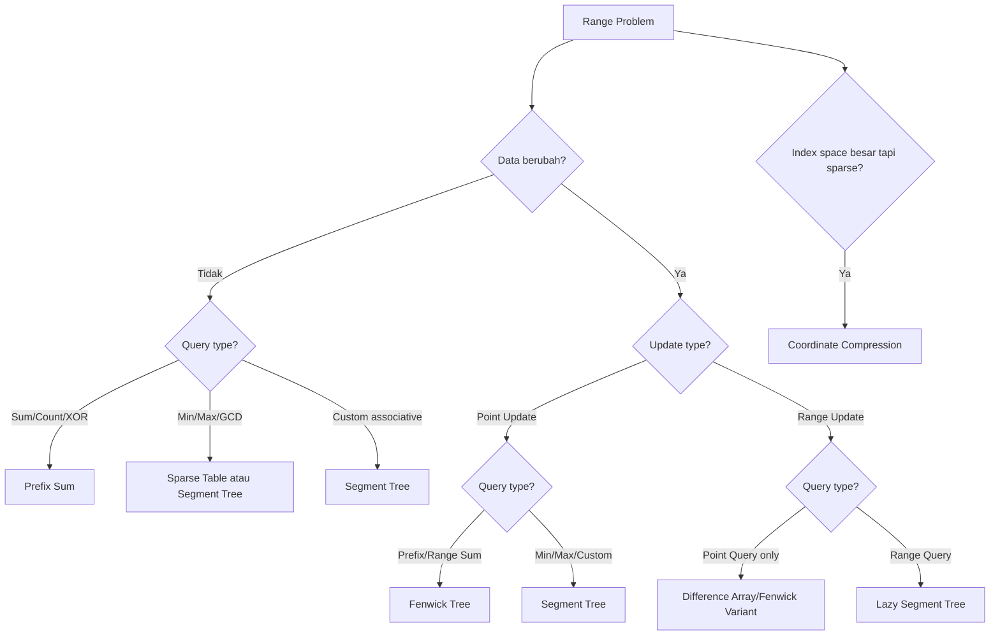
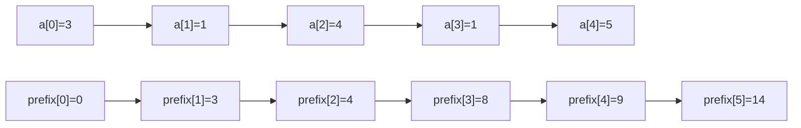
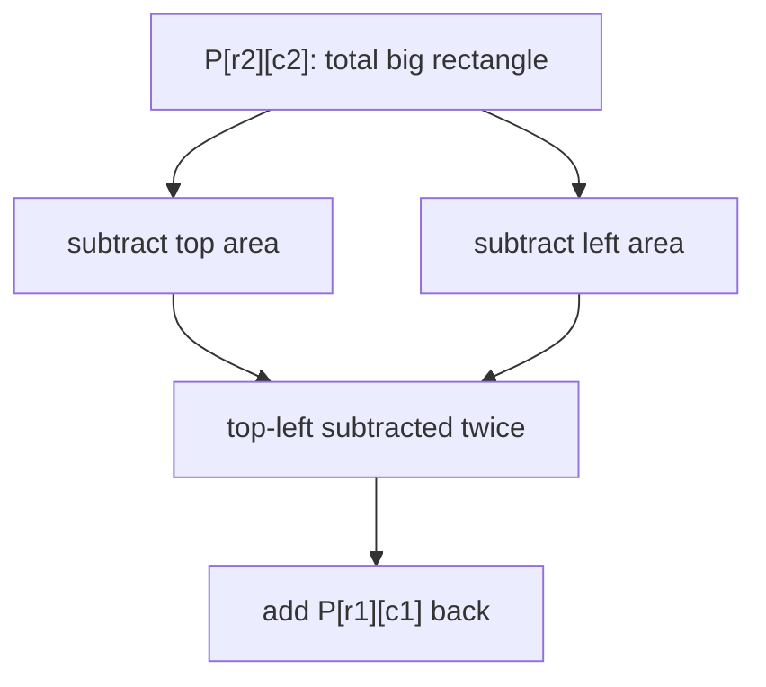
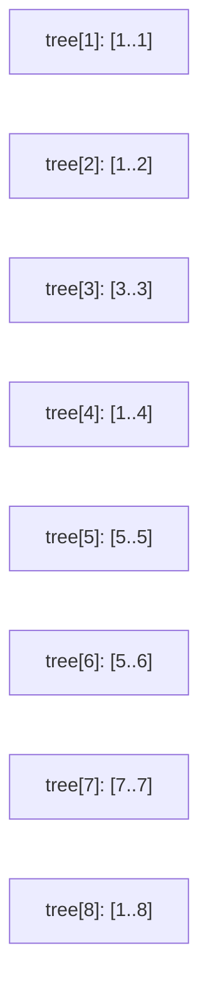
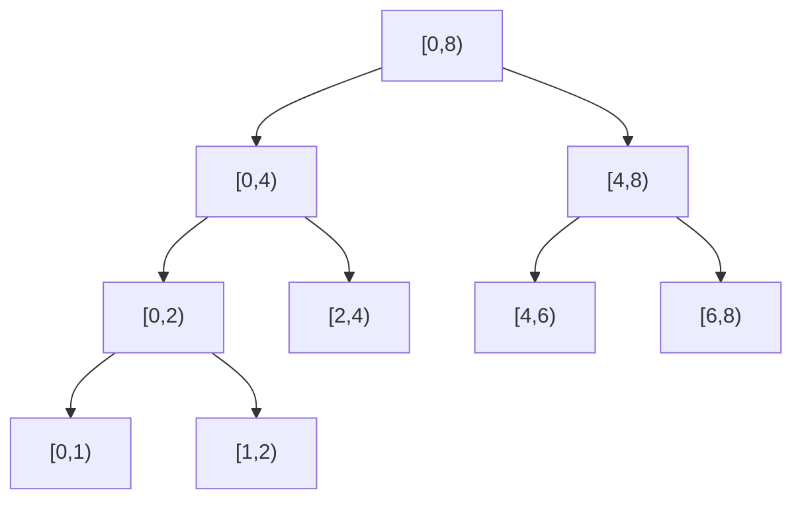
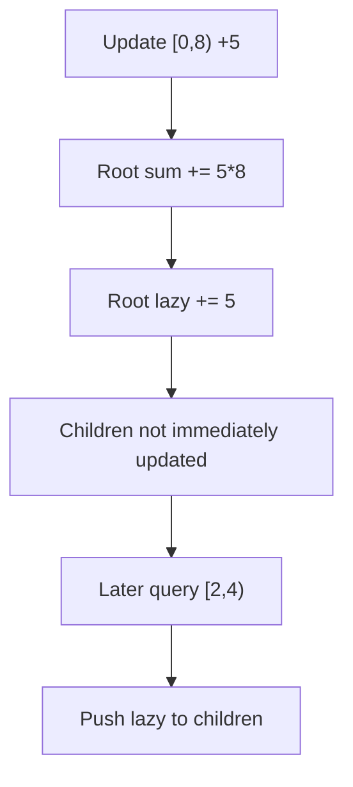

# learn-go-data-structure-algorithm-part-021.md

# Part 021 — Range Query Structures: Prefix Sum, Fenwick Tree, Segment Tree

> Seri: `learn-go-data-structure-algorithm`  
> Bagian: `021 / 034`  
> Target pembaca: Java software engineer yang ingin menguasai Go data structure & algorithm sampai level production-grade  
> Fokus: struktur data untuk query/update rentang: prefix sum, difference array, Fenwick Tree, Segment Tree, Lazy Propagation, Sparse Table, Coordinate Compression, dan decision model production

---

## Daftar Isi

- [1. Tujuan Part Ini](#1-tujuan-part-ini)
- [2. Masalah Range Query](#2-masalah-range-query)
- [3. Taxonomy Range Problem](#3-taxonomy-range-problem)
- [4. Prefix Sum](#4-prefix-sum)
- [5. Difference Array](#5-difference-array)
- [6. 2D Prefix Sum](#6-2d-prefix-sum)
- [7. Fenwick Tree / Binary Indexed Tree](#7-fenwick-tree--binary-indexed-tree)
- [8. Segment Tree](#8-segment-tree)
- [9. Lazy Propagation](#9-lazy-propagation)
- [10. Sparse Table](#10-sparse-table)
- [11. Coordinate Compression](#11-coordinate-compression)
- [12. Choosing the Right Structure](#12-choosing-the-right-structure)
- [13. Go Implementation Design](#13-go-implementation-design)
- [14. Testing Strategy](#14-testing-strategy)
- [15. Benchmarking Strategy](#15-benchmarking-strategy)
- [16. Production Case Studies](#16-production-case-studies)
- [17. Anti-Patterns](#17-anti-patterns)
- [18. Latihan Bertahap](#18-latihan-bertahap)
- [19. Ringkasan](#19-ringkasan)
- [20. Referensi](#20-referensi)

---

## 1. Tujuan Part Ini

Range query muncul ketika kita tidak hanya peduli pada satu elemen, tetapi pada agregasi atas rentang.

Contoh:

```text
Berapa total usage user A dari hari ke-10 sampai hari ke-20?
Berapa maksimum CPU dalam interval 14:00-15:00?
Berapa jumlah event active dalam rentang waktu tertentu?
Berapa quota yang tersisa setelah banyak update batch?
Berapa minimum severity pada rentang case tertentu?
```

Part ini membahas struktur data yang menjawab pertanyaan seperti:

```text
query(l, r)
update(i, delta)
update(l, r, delta)
```

dengan biaya jauh lebih baik daripada scan linear setiap kali.

Materi ini penting untuk backend dan systems engineering karena banyak sistem nyata memiliki pola:

- analytics window,
- billing window,
- quota tracking,
- timeline aggregation,
- monitoring,
- rate-limit accounting,
- event counting,
- policy range validity,
- capacity planning,
- audit/event index.

---

## 2. Masalah Range Query

### 2.1. Problem Dasar

Diberikan array:

```text
a = [3, 1, 4, 1, 5, 9]
```

Query:

```text
sum(1, 4) = a[1] + a[2] + a[3] = 1 + 4 + 1 = 6
```

Dengan convention half-open interval:

```text
[l, r)
```

Maka:

```text
sum(l, r) = a[l] + ... + a[r-1]
```

Half-open interval dipakai karena:

- panjang = `r - l`,
- empty range jika `l == r`,
- split natural:
  - `[l, m)`
  - `[m, r)`,
- cocok dengan slicing Go.

---

### 2.2. Naive Approach

```go
func RangeSumNaive(xs []int64, l, r int) int64 {
	var sum int64
	for i := l; i < r; i++ {
		sum += xs[i]
	}
	return sum
}
```

Complexity:

```text
query: O(r-l), worst O(n)
update point: O(1)
```

Jika query sedikit, naive cukup.

Jika query ribuan/jutaan, naive bisa menjadi bottleneck.

---

### 2.3. Query/Update Trade-Off

Tidak ada struktur data yang selalu terbaik.

Kita harus tahu pattern operasi:

| Pattern | Struktur Umum |
|---|---|
| Banyak query sum, tidak ada update | Prefix Sum |
| Banyak range update, query final value setelah semua update | Difference Array |
| Point update + prefix/range sum | Fenwick Tree |
| Point/range update + range query general | Segment Tree |
| Static range min/max/idempotent query | Sparse Table |
| Index besar tapi value aktif sedikit | Coordinate Compression + struktur lain |

---

## 3. Taxonomy Range Problem

### 3.1. Dimensi Operasi

Ada empat tipe dasar:

```text
1. Point Query
2. Range Query
3. Point Update
4. Range Update
```

Kombinasi menghasilkan berbagai problem.

| Update | Query | Contoh |
|---|---|---|
| none | range sum | analytics static |
| point update | range sum | mutable counter |
| range update | point query | batch increment, query final |
| range update | range query | quota/window engine |
| point update | range min/max | monitoring current window |
| none | range min/max | static lookup table |

---

### 3.2. Jenis Aggregation

Tidak semua aggregation sama.

| Aggregation | Associative? | Invertible? | Idempotent? | Contoh Struktur |
|---|---|---|---|---|
| Sum | Ya | Ya | Tidak | Prefix, Fenwick, Segment |
| Count | Ya | Ya | Tidak | Prefix, Fenwick |
| Min/Max | Ya | Tidak umum | Ya | Segment, Sparse Table |
| GCD | Ya | Tidak umum | Ya | Segment, Sparse Table |
| XOR | Ya | Ya | Tidak | Prefix XOR, Fenwick |
| Product | Ya | Kadang | Tidak | Prefix if invertible, Segment |
| Custom merge | Tergantung | Tergantung | Tergantung | Segment Tree |

Kata kunci:

- **Associative**: `(a op b) op c == a op (b op c)`
- **Invertible**: bisa menghapus kontribusi dengan inverse.
- **Idempotent**: `op(x, x) == x`

Struktur seperti prefix sum sangat bergantung pada invertibility. Segment tree hanya butuh associativity.

---

### 3.3. Diagram Pilihan Umum



---

## 4. Prefix Sum

### 4.1. Mental Model

Prefix sum menyimpan total kumulatif sampai posisi tertentu.

Untuk array:

```text
a = [3, 1, 4, 1, 5]
```

Buat prefix:

```text
prefix[0] = 0
prefix[1] = 3
prefix[2] = 4
prefix[3] = 8
prefix[4] = 9
prefix[5] = 14
```

Maka:

```text
sum(l, r) = prefix[r] - prefix[l]
```

---

### 4.2. Diagram Prefix Sum



---

### 4.3. Implementasi Go

```go
package rangeq

type PrefixSum struct {
	prefix []int64
}

func NewPrefixSum(xs []int64) PrefixSum {
	p := make([]int64, len(xs)+1)
	for i, x := range xs {
		p[i+1] = p[i] + x
	}
	return PrefixSum{prefix: p}
}

func (p PrefixSum) Len() int {
	if len(p.prefix) == 0 {
		return 0
	}
	return len(p.prefix) - 1
}

func (p PrefixSum) Sum(l, r int) (int64, bool) {
	if l < 0 || r < l || r > p.Len() {
		return 0, false
	}
	return p.prefix[r] - p.prefix[l], true
}
```

Complexity:

```text
build: O(n)
query: O(1)
update: O(n) rebuild or adjust suffix
space: O(n)
```

---

### 4.4. Kenapa `prefix` Panjangnya `n+1`

Dengan `n+1`, empty prefix eksplisit:

```text
prefix[0] = 0
```

Query `[0, r)` menjadi:

```text
prefix[r] - prefix[0]
```

Tidak perlu special case.

Ini contoh desain data structure yang baik: sedikit memory tambahan untuk menghapus banyak cabang logika.

---

### 4.5. Prefix XOR

Untuk XOR:

```go
type PrefixXOR struct {
	prefix []uint64
}

func NewPrefixXOR(xs []uint64) PrefixXOR {
	p := make([]uint64, len(xs)+1)
	for i, x := range xs {
		p[i+1] = p[i] ^ x
	}
	return PrefixXOR{prefix: p}
}

func (p PrefixXOR) XOR(l, r int) (uint64, bool) {
	if l < 0 || r < l || r > len(p.prefix)-1 {
		return 0, false
	}
	return p.prefix[r] ^ p.prefix[l], true
}
```

XOR bisa memakai prefix karena inverse-nya dirinya sendiri.

---

### 4.6. Prefix Count

Untuk binary predicate:

```go
func NewPrefixCount[T any](xs []T, pred func(T) bool) PrefixSum {
	p := make([]int64, len(xs)+1)
	for i, x := range xs {
		p[i+1] = p[i]
		if pred(x) {
			p[i+1]++
		}
	}
	return PrefixSum{prefix: p}
}
```

Use case:

- count active records,
- count errors,
- count high-severity events,
- count days exceeding threshold.

---

### 4.7. Prefix Sum Limitations

Prefix sum buruk ketika:

- banyak update,
- aggregation tidak invertible,
- memory `O(n)` terlalu besar,
- index space sparse dan sangat besar,
- membutuhkan min/max dynamic.

---

### 4.8. Overflow Concern

Prefix sum bisa overflow.

```go
p[i+1] = p[i] + x
```

Jika domain bisa besar:

- gunakan `int64` bukan `int`,
- validasi overflow,
- gunakan saturating semantics jika sesuai,
- gunakan `math/bits` untuk unsigned overflow detection,
- dokumentasikan batas nilai.

Contoh checked addition sederhana:

```go
func addInt64Checked(a, b int64) (int64, bool) {
	if b > 0 && a > (1<<63-1)-b {
		return 0, false
	}
	if b < 0 && a < (-1<<63)-b {
		return 0, false
	}
	return a + b, true
}
```

---

## 5. Difference Array

### 5.1. Mental Model

Difference array merepresentasikan perubahan antar posisi.

Jika kita ingin melakukan range update:

```text
add delta ke semua a[l:r)
```

Kita bisa simpan:

```text
diff[l] += delta
diff[r] -= delta
```

Setelah semua update, array final didapat dengan prefix sum atas diff.

---

### 5.2. Example

Awal:

```text
a = [0, 0, 0, 0, 0]
```

Update:

```text
add +3 to [1,4)
```

Diff:

```text
diff[1] += 3
diff[4] -= 3
```

Diff:

```text
[0, 3, 0, 0, -3, 0]
```

Prefix diff:

```text
[0, 3, 3, 3, 0]
```

---

### 5.3. Implementasi Go

```go
type DifferenceArray struct {
	diff []int64
}

func NewDifferenceArray(n int) DifferenceArray {
	return DifferenceArray{diff: make([]int64, n+1)}
}

func (d *DifferenceArray) Add(l, r int, delta int64) bool {
	if l < 0 || r < l || r >= len(d.diff) {
		return false
	}
	d.diff[l] += delta
	d.diff[r] -= delta
	return true
}

func (d *DifferenceArray) Materialize() []int64 {
	n := len(d.diff) - 1
	out := make([]int64, n)

	var cur int64
	for i := 0; i < n; i++ {
		cur += d.diff[i]
		out[i] = cur
	}

	return out
}
```

Range update:

```text
O(1)
```

Materialize:

```text
O(n)
```

---

### 5.4. Cocok Untuk

Difference array cocok ketika:

- banyak range update,
- query dilakukan setelah semua update selesai,
- tidak butuh query online setelah tiap update.

Use case:

- apply batch quota adjustments,
- timeline event accumulation,
- capacity reservation simulation,
- offline analytics,
- cumulative effect computation.

---

### 5.5. Tidak Cocok Untuk

Tidak cocok ketika:

- perlu range query setelah setiap update,
- perlu min/max online,
- update dan query interleaved kompleks.

Untuk itu gunakan Fenwick variant atau segment tree.

---

## 6. 2D Prefix Sum

### 6.1. Problem

Untuk matrix:

```text
grid[row][col]
```

Query sum rectangle:

```text
rows [r1, r2)
cols [c1, c2)
```

Naive:

```text
O(area)
```

2D prefix:

```text
O(1)
```

---

### 6.2. Formula

Build:

```text
P[r+1][c+1] =
    grid[r][c]
  + P[r][c+1]
  + P[r+1][c]
  - P[r][c]
```

Query:

```text
sum(r1,r2,c1,c2) =
    P[r2][c2]
  - P[r1][c2]
  - P[r2][c1]
  + P[r1][c1]
```

---

### 6.3. Diagram Inclusion-Exclusion



---

### 6.4. Implementasi Go

```go
type PrefixSum2D struct {
	rows int
	cols int
	p    []int64
}

func NewPrefixSum2D(grid [][]int64) PrefixSum2D {
	rows := len(grid)
	cols := 0
	if rows > 0 {
		cols = len(grid[0])
	}

	p := make([]int64, (rows+1)*(cols+1))

	idx := func(r, c int) int {
		return r*(cols+1) + c
	}

	for r := 0; r < rows; r++ {
		for c := 0; c < cols; c++ {
			p[idx(r+1, c+1)] =
				grid[r][c] +
					p[idx(r, c+1)] +
					p[idx(r+1, c)] -
					p[idx(r, c)]
		}
	}

	return PrefixSum2D{
		rows: rows,
		cols: cols,
		p:    p,
	}
}

func (ps PrefixSum2D) Sum(r1, r2, c1, c2 int) (int64, bool) {
	if r1 < 0 || r2 < r1 || r2 > ps.rows ||
		c1 < 0 || c2 < c1 || c2 > ps.cols {
		return 0, false
	}

	idx := func(r, c int) int {
		return r*(ps.cols+1) + c
	}

	return ps.p[idx(r2, c2)] -
		ps.p[idx(r1, c2)] -
		ps.p[idx(r2, c1)] +
		ps.p[idx(r1, c1)], true
}
```

---

### 6.5. Ragged Matrix Warning

Kode di atas mengasumsikan matrix rectangular.

Jika `grid` ragged:

```go
[][]int64{
    {1,2,3},
    {4},
}
```

maka harus ditolak atau dinormalisasi.

Production constructor sebaiknya validate:

```go
for _, row := range grid {
    if len(row) != cols {
        return error
    }
}
```

---

## 7. Fenwick Tree / Binary Indexed Tree

### 7.1. Mental Model

Fenwick Tree menyimpan partial sums berbasis bit terakhir.

Ia mendukung:

```text
point update: O(log n)
prefix sum:   O(log n)
range sum:    O(log n)
space:        O(n)
```

Fenwick sangat cocok untuk:

- frequency table dynamic,
- prefix counts,
- rank query,
- mutable cumulative counters.

---

### 7.2. Lowbit

Fenwick memakai operasi:

```go
i & -i
```

Secara konseptual, ini mengambil bit 1 paling kanan.

Contoh:

```text
i = 12 = 1100b
lowbit = 4 = 0100b
```

Dalam Go dengan signed int, pattern umum:

```go
i += i & -i
i -= i & -i
```

Ini aman selama `i > 0`.

---

### 7.3. Diagram Fenwick Responsibility

Untuk 1-based index:

```text
tree[1] covers 1 item
tree[2] covers 2 items
tree[3] covers 1 item
tree[4] covers 4 items
tree[5] covers 1 item
tree[6] covers 2 items
tree[7] covers 1 item
tree[8] covers 8 items
```



---

### 7.4. Fenwick Implementation

Public API tetap pakai 0-based index agar natural untuk Go caller.

Internal memakai 1-based.

```go
type Fenwick struct {
	tree []int64
}

func NewFenwick(n int) Fenwick {
	return Fenwick{tree: make([]int64, n+1)}
}

func NewFenwickFrom(xs []int64) Fenwick {
	f := NewFenwick(len(xs))
	for i, x := range xs {
		f.Add(i, x)
	}
	return f
}

func (f Fenwick) Len() int {
	return len(f.tree) - 1
}

func (f *Fenwick) Add(index int, delta int64) bool {
	if index < 0 || index >= f.Len() {
		return false
	}

	for i := index + 1; i < len(f.tree); i += i & -i {
		f.tree[i] += delta
	}

	return true
}

func (f Fenwick) PrefixSum(count int) (int64, bool) {
	if count < 0 || count > f.Len() {
		return 0, false
	}

	var sum int64
	for i := count; i > 0; i -= i & -i {
		sum += f.tree[i]
	}

	return sum, true
}

func (f Fenwick) RangeSum(l, r int) (int64, bool) {
	if l < 0 || r < l || r > f.Len() {
		return 0, false
	}

	right, _ := f.PrefixSum(r)
	left, _ := f.PrefixSum(l)
	return right - left, true
}
```

---

### 7.5. O(n) Fenwick Build

Naive build dengan `Add`:

```text
O(n log n)
```

Bisa build O(n):

```go
func NewFenwickFromLinear(xs []int64) Fenwick {
	f := Fenwick{tree: make([]int64, len(xs)+1)}

	for i, x := range xs {
		f.tree[i+1] += x

		parent := (i + 1) + ((i + 1) & -(i + 1))
		if parent < len(f.tree) {
			f.tree[parent] += f.tree[i+1]
		}
	}

	return f
}
```

---

### 7.6. Find by Prefix Sum

Jika Fenwick menyimpan frequency non-negative, kita bisa cari index pertama dengan prefix sum >= target.

Use case:

- order statistic,
- weighted random selection,
- rank/select,
- dynamic frequency.

```go
func (f Fenwick) LowerBoundPrefix(target int64) (int, bool) {
	if target <= 0 {
		return 0, true
	}

	idx := 0
	bit := 1
	for bit*2 < len(f.tree) {
		bit *= 2
	}

	for bit > 0 {
		next := idx + bit
		if next < len(f.tree) && f.tree[next] < target {
			idx = next
			target -= f.tree[next]
		}
		bit >>= 1
	}

	if idx >= f.Len() {
		return 0, false
	}

	return idx, true
}
```

Caveat:

- hanya valid jika values non-negative,
- prefix sum harus monotonic.

---

### 7.7. Fenwick for Range Update + Point Query

Kita bisa memakai difference idea dengan Fenwick.

Range add `[l,r)`:

```text
diff[l] += delta
diff[r] -= delta
```

Point query `i`:

```text
prefix diff sampai i
```

```go
type RangeAddPointQuery struct {
	f Fenwick
}

func NewRangeAddPointQuery(n int) RangeAddPointQuery {
	return RangeAddPointQuery{f: NewFenwick(n + 1)}
}

func (r *RangeAddPointQuery) Add(l, rr int, delta int64) bool {
	if l < 0 || rr < l || rr > r.f.Len()-1 {
		return false
	}
	r.f.Add(l, delta)
	r.f.Add(rr, -delta)
	return true
}

func (r RangeAddPointQuery) Get(i int) (int64, bool) {
	if i < 0 || i >= r.f.Len()-1 {
		return 0, false
	}
	return r.f.PrefixSum(i + 1)
}
```

---

### 7.8. Fenwick Limitations

Fenwick tidak ideal untuk:

- arbitrary range min with update,
- custom non-invertible aggregation,
- complex range update + range query with non-linear operation,
- retrieving actual array values unless modeled carefully,
- multi-dimensional large dense space.

Segment tree lebih fleksibel.

---

## 8. Segment Tree

### 8.1. Mental Model

Segment tree menyimpan aggregation untuk segment/range.

Root:

```text
[0, n)
```

Children:

```text
[0, mid), [mid, n)
```

Setiap node menyimpan agregasi segment-nya.



---

### 8.2. Kapan Segment Tree Cocok

Segment tree cocok ketika:

- data mutable,
- butuh range query,
- aggregation associative,
- update point atau range,
- operation tidak cukup dengan Fenwick,
- query bukan hanya sum.

Contoh aggregation:

- sum,
- min,
- max,
- gcd,
- custom struct merge:
  - max prefix,
  - max suffix,
  - best subarray,
  - count + sum,
  - min + index.

---

### 8.3. Iterative Segment Tree untuk Sum

Lebih simple dan cache-friendly daripada recursive tree node pointer.

```go
type SegmentTreeSum struct {
	n    int
	tree []int64
}

func NewSegmentTreeSum(xs []int64) SegmentTreeSum {
	n := len(xs)
	tree := make([]int64, 2*n)

	copy(tree[n:], xs)

	for i := n - 1; i > 0; i-- {
		tree[i] = tree[i<<1] + tree[i<<1|1]
	}

	return SegmentTreeSum{n: n, tree: tree}
}

func (s SegmentTreeSum) Len() int {
	return s.n
}

func (s *SegmentTreeSum) Set(index int, value int64) bool {
	if index < 0 || index >= s.n {
		return false
	}

	i := index + s.n
	s.tree[i] = value

	for i > 1 {
		i >>= 1
		s.tree[i] = s.tree[i<<1] + s.tree[i<<1|1]
	}

	return true
}

func (s SegmentTreeSum) Sum(l, r int) (int64, bool) {
	if l < 0 || r < l || r > s.n {
		return 0, false
	}

	l += s.n
	r += s.n

	var res int64
	for l < r {
		if l&1 == 1 {
			res += s.tree[l]
			l++
		}
		if r&1 == 1 {
			r--
			res += s.tree[r]
		}
		l >>= 1
		r >>= 1
	}

	return res, true
}
```

Complexity:

```text
build: O(n)
set:   O(log n)
query: O(log n)
space: O(n)
```

---

### 8.4. Generic Segment Tree

Segment tree hanya butuh associative merge dan identity.

```go
type SegmentTree[T any] struct {
	n        int
	tree     []T
	identity T
	merge    func(a, b T) T
}

func NewSegmentTree[T any](xs []T, identity T, merge func(a, b T) T) SegmentTree[T] {
	n := len(xs)
	tree := make([]T, 2*n)

	copy(tree[n:], xs)

	for i := n - 1; i > 0; i-- {
		tree[i] = merge(tree[i<<1], tree[i<<1|1])
	}

	return SegmentTree[T]{
		n:        n,
		tree:     tree,
		identity: identity,
		merge:    merge,
	}
}

func (s SegmentTree[T]) Len() int {
	return s.n
}

func (s *SegmentTree[T]) Set(index int, value T) bool {
	if index < 0 || index >= s.n {
		return false
	}

	i := index + s.n
	s.tree[i] = value

	for i > 1 {
		i >>= 1
		s.tree[i] = s.merge(s.tree[i<<1], s.tree[i<<1|1])
	}

	return true
}

func (s SegmentTree[T]) Query(l, r int) (T, bool) {
	if l < 0 || r < l || r > s.n {
		return s.identity, false
	}

	l += s.n
	r += s.n

	leftRes := s.identity
	rightRes := s.identity

	for l < r {
		if l&1 == 1 {
			leftRes = s.merge(leftRes, s.tree[l])
			l++
		}
		if r&1 == 1 {
			r--
			rightRes = s.merge(s.tree[r], rightRes)
		}
		l >>= 1
		r >>= 1
	}

	return s.merge(leftRes, rightRes), true
}
```

Kenapa ada `leftRes` dan `rightRes`?

Untuk operation yang associative tetapi tidak commutative, urutan harus dipertahankan.

Contoh non-commutative:

```text
string concatenation
matrix multiplication
function composition
```

---

### 8.5. Segment Tree for Min with Index

```go
type MinEntry struct {
	Value int64
	Index int
}

func minEntry(a, b MinEntry) MinEntry {
	if a.Value < b.Value {
		return a
	}
	if b.Value < a.Value {
		return b
	}
	if a.Index <= b.Index {
		return a
	}
	return b
}
```

Identity:

```go
const MaxInt64 = int64(^uint64(0) >> 1)

identity := MinEntry{Value: MaxInt64, Index: -1}
```

Gunakan:

```go
st := NewSegmentTree(entries, identity, minEntry)
```

---

### 8.6. Segment Tree Limitations

Segment tree memiliki trade-off:

- lebih banyak code daripada Fenwick,
- memory lebih besar,
- recursive lazy tree lebih rawan bug,
- generic function merge bisa memiliki overhead,
- tidak cocok jika query sangat simple dan prefix cukup,
- tidak cocok untuk sparse huge coordinate tanpa compression/dynamic tree.

---

## 9. Lazy Propagation

### 9.1. Problem

Kita ingin:

```text
range update [l,r) add delta
range query sum [l,r)
```

Jika update range dilakukan dengan update setiap point:

```text
O(k log n)
```

Untuk range panjang, mahal.

Lazy propagation menyimpan update tertunda pada node segment tree.

---

### 9.2. Mental Model

Jika update menutupi satu node penuh:

```text
update node aggregate sekarang
catat lazy delta untuk children nanti
jangan turun ke children sekarang
```

Ketika query/update berikutnya butuh children:

```text
push lazy delta ke children
clear lazy di parent
```

---

### 9.3. Diagram Lazy



---

### 9.4. Lazy Segment Tree for Range Add + Range Sum

```go
type LazySegmentTreeSum struct {
	n    int
	tree []int64
	lazy []int64
}

func NewLazySegmentTreeSum(xs []int64) LazySegmentTreeSum {
	n := len(xs)
	size := 4 * n
	if size == 0 {
		size = 1
	}

	st := LazySegmentTreeSum{
		n:    n,
		tree: make([]int64, size),
		lazy: make([]int64, size),
	}

	if n > 0 {
		st.build(1, 0, n, xs)
	}

	return st
}

func (s *LazySegmentTreeSum) build(node, lo, hi int, xs []int64) {
	if hi-lo == 1 {
		s.tree[node] = xs[lo]
		return
	}

	mid := lo + (hi-lo)/2
	s.build(node*2, lo, mid, xs)
	s.build(node*2+1, mid, hi, xs)
	s.tree[node] = s.tree[node*2] + s.tree[node*2+1]
}

func (s *LazySegmentTreeSum) apply(node, lo, hi int, delta int64) {
	s.tree[node] += delta * int64(hi-lo)
	s.lazy[node] += delta
}

func (s *LazySegmentTreeSum) push(node, lo, hi int) {
	if s.lazy[node] == 0 || hi-lo <= 1 {
		return
	}

	mid := lo + (hi-lo)/2
	delta := s.lazy[node]

	s.apply(node*2, lo, mid, delta)
	s.apply(node*2+1, mid, hi, delta)

	s.lazy[node] = 0
}

func (s *LazySegmentTreeSum) Add(l, r int, delta int64) bool {
	if l < 0 || r < l || r > s.n {
		return false
	}
	if s.n == 0 || l == r {
		return true
	}
	s.add(1, 0, s.n, l, r, delta)
	return true
}

func (s *LazySegmentTreeSum) add(node, lo, hi, ql, qr int, delta int64) {
	if qr <= lo || hi <= ql {
		return
	}

	if ql <= lo && hi <= qr {
		s.apply(node, lo, hi, delta)
		return
	}

	s.push(node, lo, hi)

	mid := lo + (hi-lo)/2
	s.add(node*2, lo, mid, ql, qr, delta)
	s.add(node*2+1, mid, hi, ql, qr, delta)

	s.tree[node] = s.tree[node*2] + s.tree[node*2+1]
}

func (s *LazySegmentTreeSum) Sum(l, r int) (int64, bool) {
	if l < 0 || r < l || r > s.n {
		return 0, false
	}
	if s.n == 0 || l == r {
		return 0, true
	}
	return s.sum(1, 0, s.n, l, r), true
}

func (s *LazySegmentTreeSum) sum(node, lo, hi, ql, qr int) int64 {
	if qr <= lo || hi <= ql {
		return 0
	}

	if ql <= lo && hi <= qr {
		return s.tree[node]
	}

	s.push(node, lo, hi)

	mid := lo + (hi-lo)/2
	return s.sum(node*2, lo, mid, ql, qr) +
		s.sum(node*2+1, mid, hi, ql, qr)
}
```

---

### 9.5. Lazy Propagation Invariants

Key invariants:

```text
tree[node] selalu merepresentasikan aggregate benar untuk segment node,
termasuk semua lazy update yang sudah diterapkan ke node.
```

```text
lazy[node] merepresentasikan update yang sudah masuk ke tree[node],
tetapi belum didistribusikan ke children.
```

Tanpa invariant ini, lazy segment tree mudah rusak.

---

### 9.6. Lazy Operation Tidak Selalu Sederhana

Range add + range sum sederhana karena:

```text
sum segment bertambah delta * length
```

Tetapi untuk operation lain:

- range assign + sum,
- range add + min,
- range chmin/chmax,
- affine transform,
- max subarray,

lazy tag composition harus dirancang hati-hati.

Contoh range assign dan range add bersama:

```text
assign harus override add sebelumnya?
add setelah assign harus mengubah assign value?
```

Ini membutuhkan tag composition rules.

---

### 9.7. Lazy Tree Production Risks

Lazy propagation rawan:

- off-by-one,
- lupa push,
- salah segment length,
- salah identity,
- overflow `delta * length`,
- recursive stack,
- bug saat empty range,
- tag composition salah.

Jika tidak benar-benar butuh, gunakan struktur lebih sederhana.

---

## 10. Sparse Table

### 10.1. Mental Model

Sparse table cocok untuk **static range query** pada operation idempotent seperti min/max/gcd.

Precompute jawaban untuk rentang panjang power of two.

Query `[l,r)` dengan dua block overlapping:

```text
len = r-l
k = floor(log2(len))

answer = op(table[k][l], table[k][r-2^k])
```

Untuk min/max, overlap aman karena idempotent.

---

### 10.2. Complexity

```text
build: O(n log n)
query: O(1)
update: not supported efficiently
space: O(n log n)
```

---

### 10.3. Sparse Table Min

```go
type SparseTableMin struct {
	logs []int
	st   [][]int64
}

func NewSparseTableMin(xs []int64) SparseTableMin {
	n := len(xs)
	logs := make([]int, n+1)
	for i := 2; i <= n; i++ {
		logs[i] = logs[i/2] + 1
	}

	kmax := 0
	if n > 0 {
		kmax = logs[n] + 1
	}

	st := make([][]int64, kmax)
	if n > 0 {
		st[0] = make([]int64, n)
		copy(st[0], xs)

		for k := 1; k < kmax; k++ {
			length := 1 << k
			half := length >> 1
			st[k] = make([]int64, n-length+1)

			for i := 0; i+length <= n; i++ {
				a := st[k-1][i]
				b := st[k-1][i+half]
				if a < b {
					st[k][i] = a
				} else {
					st[k][i] = b
				}
			}
		}
	}

	return SparseTableMin{logs: logs, st: st}
}

func (s SparseTableMin) Min(l, r int) (int64, bool) {
	if l < 0 || r <= l || r > len(s.logs)-1 {
		return 0, false
	}

	length := r - l
	k := s.logs[length]
	block := 1 << k

	a := s.st[k][l]
	b := s.st[k][r-block]

	if a < b {
		return a, true
	}
	return b, true
}
```

---

### 10.4. Kenapa Sparse Table Tidak untuk Sum O(1) dengan Overlap

Untuk min:

```text
min(x, x) = x
```

Overlap tidak masalah.

Untuk sum:

```text
sum(x, x) = 2x
```

Overlap menggandakan kontribusi.

Jadi sparse table O(1) overlapping cocok untuk idempotent operation.

---

### 10.5. Sparse Table vs Segment Tree

| Faktor | Sparse Table | Segment Tree |
|---|---|---|
| Data update | Tidak | Ya |
| Query min/max | O(1) | O(log n) |
| Build | O(n log n) | O(n) |
| Space | O(n log n) | O(n) |
| Simplicity | Sedang | Sedang |
| Static analytics | Bagus | Bisa |
| Dynamic system | Buruk | Bagus |

---

## 11. Coordinate Compression

### 11.1. Problem

Kadang index space besar:

```text
timestamps from 0 to 1e18
user IDs sparse
case IDs sparse
coordinate values arbitrary
```

Tetapi jumlah distinct coordinate kecil.

Tidak mungkin membuat array panjang `1e18`.

Coordinate compression mengubah nilai asli menjadi dense index:

```text
actual values: [100, 5000, 7000000000]
compressed:    [0,   1,    2]
```

---

### 11.2. Implementation

```go
type Compressor[T cmp.Ordered] struct {
	values []T
}

func NewCompressor[T cmp.Ordered](xs []T) Compressor[T] {
	values := append([]T(nil), xs...)
	slices.Sort(values)

	write := 0
	for _, v := range values {
		if write == 0 || values[write-1] != v {
			values[write] = v
			write++
		}
	}

	values = values[:write]
	return Compressor[T]{values: values}
}

func (c Compressor[T]) Len() int {
	return len(c.values)
}

func (c Compressor[T]) Index(v T) (int, bool) {
	i, found := slices.BinarySearch(c.values, v)
	return i, found
}

func (c Compressor[T]) LowerBound(v T) int {
	i, _ := slices.BinarySearch(c.values, v)
	return i
}

func (c Compressor[T]) Value(i int) (T, bool) {
	var zero T
	if i < 0 || i >= len(c.values) {
		return zero, false
	}
	return c.values[i], true
}
```

Imports:

```go
import (
	"cmp"
	"slices"
)
```

---

### 11.3. Compression for Interval Problems

Interval `[start,end)` needs careful compression.

If querying coverage over intervals, compress all endpoints:

```text
start
end
query boundaries
```

But note:

```text
compressed index segment i represents [values[i], values[i+1])
```

This is different from point compression.

---

### 11.4. Example: Timeline Range Add

```go
type Interval struct {
	Start int64
	End   int64
	Delta int64
}

func ApplyIntervals(intervals []Interval) ([]int64, []int64) {
	points := make([]int64, 0, len(intervals)*2)
	for _, in := range intervals {
		points = append(points, in.Start, in.End)
	}

	c := NewCompressor(points)
	diff := NewDifferenceArray(c.Len())

	for _, in := range intervals {
		l, _ := c.Index(in.Start)
		r, _ := c.Index(in.End)
		diff.Add(l, r, in.Delta)
	}

	return c.values, diff.Materialize()
}
```

Interpretasi:

```text
value[i] berlaku untuk segment [points[i], points[i+1])
```

Untuk index terakhir, tidak ada segment setelahnya.

---

### 11.5. Compression Risks

Risiko:

- lupa memasukkan query endpoints,
- mencampur point semantics dan interval segment semantics,
- menganggap jarak compressed sama dengan jarak asli,
- kehilangan informasi duration/length,
- memory tetap besar jika distinct coordinate sangat banyak.

Jika aggregate bergantung panjang interval, gunakan panjang asli:

```text
length = values[i+1] - values[i]
```

---

## 12. Choosing the Right Structure

### 12.1. Decision Matrix

| Problem | Update | Query | Recommended |
|---|---|---|---|
| Static range sum | none | sum | Prefix Sum |
| Static range min | none | min | Sparse Table |
| Point update + range sum | point | sum | Fenwick |
| Point update + range min | point | min | Segment Tree |
| Range add + final values | range offline | point final | Difference Array |
| Range add + point query online | range | point | Fenwick diff variant |
| Range add + range sum | range | sum | Lazy Segment Tree |
| Huge sparse index | any | any | Coordinate Compression + structure |
| Small n | any | any | Simple scan often enough |

---

### 12.2. Cost Matrix

| Structure | Build | Point Update | Range Update | Range Query | Space |
|---|---:|---:|---:|---:|---:|
| Naive array | O(n) | O(1) | O(k) | O(k) | O(n) |
| Prefix Sum | O(n) | O(n) | O(n) | O(1) sum | O(n) |
| Difference Array | O(n) | O(1) style | O(1) | final only | O(n) |
| Fenwick | O(n) or O(n log n) | O(log n) | variant | O(log n) sum | O(n) |
| Segment Tree | O(n) | O(log n) | with lazy | O(log n) | O(n) |
| Lazy Segment Tree | O(n) | O(log n) | O(log n) | O(log n) | O(n) |
| Sparse Table | O(n log n) | no | no | O(1) min/max | O(n log n) |

---

### 12.3. Real-World Decision

Gunakan struktur paling sederhana yang memenuhi:

```text
correctness
expected operation volume
memory budget
latency target
implementation risk
debuggability
```

Jangan memilih lazy segment tree jika prefix sum cukup.

---

## 13. Go Implementation Design

### 13.1. API Boundary

Gunakan half-open interval:

```go
Query(l, r int)
```

Return `(value, bool)` untuk invalid range:

```go
sum, ok := tree.Sum(l, r)
```

Alternatif:

- panic untuk programming error,
- return error untuk API boundary eksternal,
- bool untuk internal high-performance data structure.

Pilih satu dan konsisten.

---

### 13.2. Zero Value Usability

Beberapa structure bisa dibuat zero-value usable, tetapi tidak selalu worth it.

Contoh Fenwick zero value:

```go
var f Fenwick
```

`Len()` = -1 jika tidak hati-hati.

Lebih baik constructor eksplisit untuk structure dengan size.

---

### 13.3. Avoid Pointer-Based Tree Nodes

Untuk segment tree, hindari:

```go
type Node struct {
	left, right *Node
}
```

Untuk dense index, array-backed jauh lebih baik:

- lebih sedikit allocation,
- lebih cache-friendly,
- lebih mudah serialize,
- lebih mudah benchmark.

Pointer tree hanya masuk akal untuk sparse dynamic segment tree.

---

### 13.4. Generic vs Specialized

Generic:

```go
SegmentTree[T]
```

Keuntungan:

- reusable,
- expressive.

Kerugian:

- merge function call cost,
- identity harus benar,
- debugging bisa lebih abstrak.

Specialized:

```go
SegmentTreeSum
```

Keuntungan:

- cepat,
- sederhana,
- lebih mudah optimize.

Kerugian:

- duplikasi code.

Production guideline:

```text
Mulai specialized untuk hot path kritikal.
Gunakan generic untuk library internal non-hot atau banyak use case.
Benchmark sebelum generalisasi.
```

---

### 13.5. Concurrency

Struktur di part ini secara default **tidak thread-safe**.

Jika perlu concurrent access:

- protect dengan `sync.RWMutex`,
- gunakan copy-on-write untuk read-mostly,
- shard by key/range,
- snapshot immutable untuk analytics,
- jangan mencampur lock di dalam struktur tanpa desain jelas.

Contoh wrapper:

```go
type SafeFenwick struct {
	mu sync.RWMutex
	f  Fenwick
}

func (s *SafeFenwick) Add(i int, delta int64) bool {
	s.mu.Lock()
	defer s.mu.Unlock()
	return s.f.Add(i, delta)
}

func (s *SafeFenwick) RangeSum(l, r int) (int64, bool) {
	s.mu.RLock()
	defer s.mu.RUnlock()
	return s.f.RangeSum(l, r)
}
```

Import:

```go
import "sync"
```

Trade-off:

- simple,
- correct,
- but update/query contention can be high.

---

### 13.6. Serialization and Persistence

If range structures are used as cache/index, consider:

- can it be rebuilt cheaply?
- should it be serialized?
- is byte order relevant?
- can version mismatch corrupt interpretation?
- are indexes derived from coordinate compression stable?

Untuk compression, simpan juga mapping `values`, bukan hanya tree.

---

## 14. Testing Strategy

### 14.1. Test Against Naive Model

Naive model adalah oracle terbaik.

Untuk Fenwick:

```go
func TestFenwickAgainstNaive(t *testing.T) {
	xs := []int64{3, 1, 4, 1, 5, 9}
	f := NewFenwickFrom(xs)

	for l := 0; l <= len(xs); l++ {
		for r := l; r <= len(xs); r++ {
			got, ok := f.RangeSum(l, r)
			if !ok {
				t.Fatalf("unexpected invalid range")
			}

			var want int64
			for i := l; i < r; i++ {
				want += xs[i]
			}

			if got != want {
				t.Fatalf("range [%d,%d): got %d want %d", l, r, got, want)
			}
		}
	}
}
```

---

### 14.2. Random Operation Testing

```go
func TestFenwickRandomOps(t *testing.T) {
	const n = 100
	xs := make([]int64, n)
	f := NewFenwick(n)

	for step := 0; step < 10_000; step++ {
		i := step % n
		delta := int64((step*17)%11 - 5)

		xs[i] += delta
		if !f.Add(i, delta) {
			t.Fatalf("add failed")
		}

		l := (step * 7) % n
		r := (step * 13) % (n + 1)
		if r < l {
			l, r = r, l
		}

		got, ok := f.RangeSum(l, r)
		if !ok {
			t.Fatalf("query failed")
		}

		var want int64
		for j := l; j < r; j++ {
			want += xs[j]
		}

		if got != want {
			t.Fatalf("step=%d range [%d,%d): got=%d want=%d", step, l, r, got, want)
		}
	}
}
```

---

### 14.3. Test Invalid Ranges

Cover:

- negative index,
- `r < l`,
- `r > n`,
- `l == r`,
- empty structure,
- single-element structure.

---

### 14.4. Fuzz Range Structures

Fuzz with operation sequence encoded as bytes.

Properties:

- structure result equals naive model,
- no panic on invalid but handled input,
- after update, all future queries consistent.

---

### 14.5. Lazy Segment Tree Testing

Lazy segment tree harus diuji lebih keras.

Test sequence:

```text
random range add
random range sum
compare against naive array
```

Also test:

- full range update,
- empty update,
- single point update,
- overlapping updates,
- negative deltas,
- repeated same range,
- query after no push,
- query causing push.

---

## 15. Benchmarking Strategy

### 15.1. Benchmark Query Volume

```go
func BenchmarkPrefixSumQuery(b *testing.B) {
	xs := make([]int64, 1_000_000)
	for i := range xs {
		xs[i] = int64(i % 17)
	}

	ps := NewPrefixSum(xs)

	b.ReportAllocs()
	b.ResetTimer()

	var sink int64
	for i := 0; i < b.N; i++ {
		l := i % len(xs)
		r := l + 100
		if r > len(xs) {
			r = len(xs)
		}
		v, _ := ps.Sum(l, r)
		sink += v
	}
	_ = sink
}
```

---

### 15.2. Benchmark Fenwick vs Segment Tree for Sum

Fenwick often wins for simple sum due to:

- smaller memory,
- simpler loop,
- less constant factor.

Segment tree wins when operation is more general.

---

### 15.3. Benchmark Distributions

Range query distribution matters:

- short ranges,
- long ranges,
- full range,
- random ranges,
- hot ranges,
- sequential ranges,
- mixed update/query ratio.

Do not benchmark only uniform random.

---

### 15.4. Allocation Check

Range query structures should usually have:

```text
0 alloc/op
```

after construction.

If query allocates, investigate:

- closure capture,
- returning slice,
- interface boxing,
- generic merge returning heap-escaped value,
- logging/debug code.

---

## 16. Production Case Studies

### 16.1. Usage Aggregation

Problem:

```text
Need daily usage sum for arbitrary day range.
Data is loaded once per report.
No update during report.
```

Use:

```text
Prefix Sum
```

Reason:

- build once O(n),
- query O(1),
- simple,
- low bug risk.

---

### 16.2. Quota Tracking with Point Updates

Problem:

```text
Each event updates usage at timestamp bucket.
Need range usage query for current billing period.
```

Use:

```text
Fenwick Tree
```

Reason:

- point update O(log n),
- range sum O(log n),
- simple enough,
- memory O(n).

---

### 16.3. Timeline Reservation

Problem:

```text
Many reservations add capacity usage to [start,end).
After all reservations, compute usage per time segment.
```

Use:

```text
Coordinate Compression + Difference Array
```

Reason:

- timestamps sparse,
- updates offline,
- final materialization enough.

---

### 16.4. Dynamic Monitoring Window Min

Problem:

```text
Point updates to metrics.
Need min/max over arbitrary time bucket range.
```

Use:

```text
Segment Tree
```

Reason:

- min/max not invertible like sum,
- updates online.

---

### 16.5. Range Add Billing Adjustment

Problem:

```text
Apply adjustment to all days in billing period.
Need sum over arbitrary subperiod after updates.
```

Use:

```text
Lazy Segment Tree
```

Reason:

- range update,
- range query,
- online interleaving.

But ask first:

```text
Can updates be batched offline?
Can reports run after materialization?
```

If yes, difference array may be simpler.

---

### 16.6. Static SLA Lookup

Problem:

```text
Static array of SLA severity values.
Need range minimum queries many times.
No updates.
```

Use:

```text
Sparse Table
```

Reason:

- O(1) query,
- static data,
- min is idempotent.

---

## 17. Anti-Patterns

### 17.1. Segment Tree untuk Semua Hal

Segment tree powerful, but not default.

If prefix sum solves it, use prefix sum.

---

### 17.2. Fenwick untuk Non-Invertible Operation

Fenwick is natural for prefix sums and invertible operations.

Do not force it for arbitrary min/max with updates unless you fully understand constraints.

---

### 17.3. Lazy Propagation Tanpa Invariant

Lazy tree tanpa invariant tertulis adalah bug generator.

Harus jelas:

```text
tree[node] represents what?
lazy[node] represents what?
how is tag composed?
when is push required?
```

---

### 17.4. Ignoring Coordinate Semantics

Compressed index is not original distance.

Wrong:

```text
duration = compressedR - compressedL
```

Correct:

```text
duration = originalValues[r] - originalValues[l]
```

---

### 17.5. Rebuilding Prefix Sum on Every Query

Prefix sum should be built once for many queries.

If data changes often, choose Fenwick/Segment Tree.

---

### 17.6. No Overflow Policy

Range structures often aggregate many values.

No overflow policy means silent wrong answer.

---

### 17.7. Returning Internal Slices

Do not expose internal `tree` or `prefix` slice unless read-only contract is impossible to violate.

Go has no immutable slice.

---

## 18. Latihan Bertahap

### 18.1. Level 1 — Prefix Sum

Implement:

1. `PrefixSum`
2. `PrefixXOR`
3. `PrefixCount`
4. invalid range handling
5. overflow-aware variant

---

### 18.2. Level 2 — Difference Array

Implement:

1. range add,
2. materialize,
3. coordinate-compressed interval add,
4. timeline output with segment length.

---

### 18.3. Level 3 — Fenwick

Implement:

1. point add,
2. prefix sum,
3. range sum,
4. O(n) build,
5. lower bound by prefix,
6. range add + point query variant.

---

### 18.4. Level 4 — Segment Tree

Implement:

1. sum segment tree,
2. min segment tree,
3. generic segment tree,
4. non-commutative operation test,
5. point update.

---

### 18.5. Level 5 — Lazy Segment Tree

Implement:

1. range add + range sum,
2. range assign + range sum,
3. random test against naive,
4. benchmark with mixed workload.

---

### 18.6. Level 6 — Production Design

Design internal package:

```go
package rangeq
```

Include:

```text
PrefixSum
Fenwick
SegmentTreeSum
LazySegmentTreeSum
Compressor
```

Add:

- docs,
- examples,
- benchmarks,
- fuzz tests,
- invalid input policy,
- mutation/concurrency note.

---

## 19. Ringkasan

Range query structures adalah keluarga struktur data untuk menjawab pertanyaan atas interval.

Key takeaways:

- Prefix Sum:
  - static sum/count/xor,
  - query O(1),
  - update buruk.

- Difference Array:
  - offline range update,
  - materialize final state,
  - sangat sederhana dan powerful.

- Fenwick Tree:
  - point update + prefix/range sum,
  - O(log n),
  - kecil dan cepat.

- Segment Tree:
  - lebih general,
  - associative aggregation,
  - point update + range query.

- Lazy Segment Tree:
  - range update + range query,
  - powerful tetapi rawan bug.

- Sparse Table:
  - static idempotent range query,
  - O(1) query,
  - O(n log n) memory.

- Coordinate Compression:
  - untuk sparse huge coordinate,
  - harus menjaga semantics original coordinate.

Mental model utama:

```text
Range problem bukan satu problem.
Selalu identifikasi:
- static atau dynamic?
- update point atau range?
- query point atau range?
- operation associative/invertible/idempotent?
- online atau offline?
- dense atau sparse coordinate?
```

---

## 20. Referensi

Referensi utama yang relevan untuk part ini:

- Go 1.26 Release Notes — `https://go.dev/doc/go1.26`
- Go Release History — `https://go.dev/doc/devel/release`
- Go Language Specification — `https://go.dev/ref/spec`
- Package `slices` — `https://pkg.go.dev/slices`
- Package `cmp` — `https://pkg.go.dev/cmp`
- Package `sort` — `https://pkg.go.dev/sort`
- Package `testing` — `https://pkg.go.dev/testing`
- Package `sync` — `https://pkg.go.dev/sync`
- Package `math/bits` — `https://pkg.go.dev/math/bits`

---

# Status Seri

Selesai:

- Part 000 — Roadmap, Mental Model, dan Batasan Seri
- Part 001 — Complexity Model yang Realistis di Go
- Part 002 — Arrays, Slices, dan Sequence Design
- Part 003 — Maps, Hash Tables, dan Associative Data
- Part 004 — Sorting, Ordering, Comparison, dan Search
- Part 005 — Stack, Queue, Deque, dan Worklist Algorithms
- Part 006 — Linked List, Intrusive List, dan Pointer-Chasing Trade-off
- Part 007 — Heap, Priority Queue, dan Scheduling Algorithms
- Part 008 — Sets, Multisets, Bag, dan Membership Models
- Part 009 — Strings, Bytes, Runes, Tokenization, dan Text Algorithms
- Part 010 — Recursion, Iteration, Backtracking, dan State Space Search
- Part 011 — Hashing, Fingerprint, Checksums, dan Equality Strategy
- Part 012 — Trees: Binary Tree, BST, Traversal, dan Structural Invariants
- Part 013 — Balanced Trees: AVL, Red-Black, Treap, dan Ordered Index
- Part 014 — B-Tree, B+Tree, Page-Oriented Structure, dan Storage-Aware Index
- Part 015 — Trie, Radix Tree, Patricia Tree, dan Prefix Index
- Part 016 — Graph Fundamentals: Representation, Traversal, dan Modelling
- Part 017 — Graph Algorithms for Production Systems
- Part 018 — Dynamic Programming: Memoization, Tabulation, dan State Compression
- Part 019 — Greedy Algorithms, Exchange Argument, dan Approximation Thinking
- Part 020 — Divide and Conquer, Selection, dan Search Space Reduction
- Part 021 — Range Query Structures: Prefix Sum, Fenwick Tree, Segment Tree

Berikutnya:

- Part 022 — Disjoint Set Union, Connectivity, dan Merge Semantics


<!-- NAVIGATION_FOOTER -->
<div class="page-nav">
<a href="./learn-go-data-structure-algorithm-part-020.md">⬅️ Part 020 — Divide and Conquer, Selection, dan Search Space Reduction</a>
<a href="./index.md">📚 Kategori</a>
<a href="../../index.md">🏠 Home</a>
<a href="./learn-go-data-structure-algorithm-part-022.md">Part 022 — Disjoint Set Union, Connectivity, dan Merge Semantics ➡️</a>
</div>
