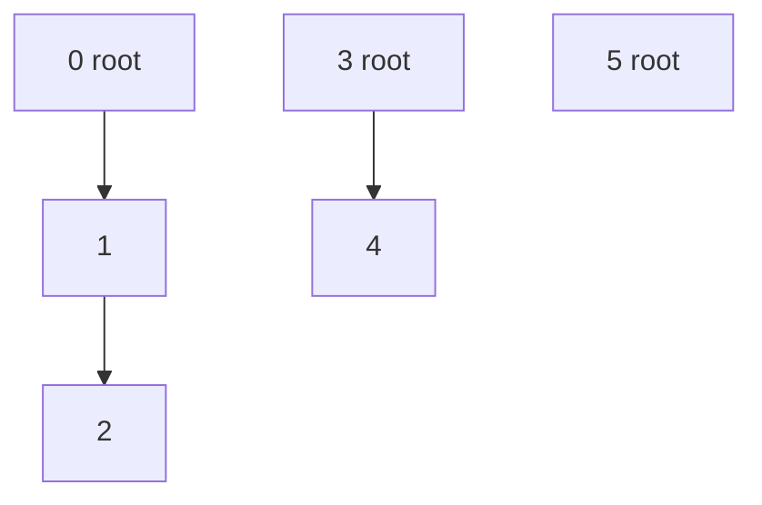
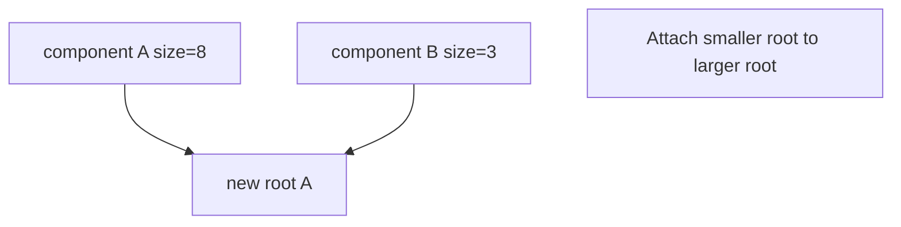
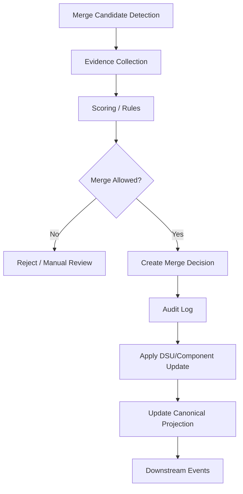

# learn-go-data-structure-algorithm-part-022.md

# Part 022 — Disjoint Set Union, Connectivity, dan Merge Semantics

> Seri: `learn-go-data-structure-algorithm`  
> Bagian: `022 / 034`  
> Target pembaca: Java software engineer yang ingin menguasai Go data structure & algorithm sampai level production-grade  
> Fokus: Disjoint Set Union / Union-Find, connectivity, component metadata, rollback, constraint union, entity merge semantics, auditability, dan production failure modes

---

## Daftar Isi

- [1. Tujuan Part Ini](#1-tujuan-part-ini)
- [2. Problem Connectivity](#2-problem-connectivity)
- [3. Mental Model DSU](#3-mental-model-dsu)
- [4. Representasi Parent Array](#4-representasi-parent-array)
- [5. Find, Union, Connected](#5-find-union-connected)
- [6. Path Compression](#6-path-compression)
- [7. Union by Size / Rank](#7-union-by-size--rank)
- [8. Complexity Intuition](#8-complexity-intuition)
- [9. Implementasi DSU Production-Ready di Go](#9-implementasi-dsu-production-ready-di-go)
- [10. DSU dengan Component Metadata](#10-dsu-dengan-component-metadata)
- [11. DSU untuk Sparse / Non-Integer ID](#11-dsu-untuk-sparse--non-integer-id)
- [12. Rollback DSU](#12-rollback-dsu)
- [13. DSU dengan Constraints](#13-dsu-dengan-constraints)
- [14. DSU vs Graph Traversal](#14-dsu-vs-graph-traversal)
- [15. Merge Semantics di Sistem Production](#15-merge-semantics-di-sistem-production)
- [16. Testing Strategy](#16-testing-strategy)
- [17. Benchmarking Strategy](#17-benchmarking-strategy)
- [18. Production Case Studies](#18-production-case-studies)
- [19. Anti-Patterns](#19-anti-patterns)
- [20. Latihan Bertahap](#20-latihan-bertahap)
- [21. Ringkasan](#21-ringkasan)
- [22. Referensi](#22-referensi)

---

## 1. Tujuan Part Ini

Disjoint Set Union, sering disebut **Union-Find**, adalah struktur data untuk mengelola kumpulan elemen yang terbagi ke beberapa component/set yang saling terpisah.

Operasi utama:

```text
find(x)      -> representative/root component x
union(a,b)   -> gabungkan component a dan b
connected(a,b) -> apakah a dan b berada dalam component sama?
```

DSU sangat penting untuk:

- dynamic connectivity,
- Kruskal minimum spanning tree,
- duplicate/entity resolution,
- account merge,
- cluster grouping,
- permission inheritance component,
- equivalence class,
- connected component offline,
- constraint consistency.

Yang sering terlewat:

> DSU bukan hanya struktur data cepat. DSU adalah model merge yang secara default **irreversible**.

Dalam sistem production, "merge" bisa berbahaya:

- dua account digabung,
- dua identity dianggap sama,
- dua case/regulatory entity dianggap satu cluster,
- dua permission group disatukan,
- dua duplicate record digabung.

Kalau salah merge, dampaknya bisa sulit dipulihkan tanpa audit log dan rollback strategy.

---

## 2. Problem Connectivity

### 2.1. Problem Dasar

Diberikan elemen:

```text
0, 1, 2, 3, 4, 5
```

Union events:

```text
union(0,1)
union(1,2)
union(3,4)
```

Maka component:

```text
{0,1,2}
{3,4}
{5}
```

Query:

```text
connected(0,2) = true
connected(0,4) = false
connected(3,4) = true
```

---

### 2.2. Naive Approach

Simpan component ID untuk setiap node.

```text
component = [0,1,2,3,4,5]
```

Saat union(0,1), ubah semua yang component-nya 1 menjadi 0.

Problem:

```text
union bisa O(n)
```

Jika banyak union, total mahal.

DSU menghindari update semua anggota dengan memakai parent tree.

---

## 3. Mental Model DSU

DSU menyimpan setiap set sebagai tree.

Setiap elemen menunjuk parent.

Root adalah representative component.

Contoh:

```text
0 <- 1 <- 2
3 <- 4
5
```

Artinya:

```text
find(2) = 0
find(1) = 0
find(4) = 3
find(5) = 5
```

Union dilakukan dengan menghubungkan root satu component ke root component lain.

---

### 3.1. Diagram DSU



Catatan arah diagram konseptual ini menunjukkan root sebagai parent. Dalam array, biasanya `parent[child] = parentNode`.

---

### 3.2. Representative Bukan Identitas Bisnis

Root DSU adalah technical representative.

Jangan menyamakan root dengan:

- canonical user ID,
- golden record,
- master account,
- legal identity,
- source of truth.

Dalam production, component representative dan business canonical record sebaiknya dipisahkan.

---

## 4. Representasi Parent Array

Untuk `n` elemen integer `0..n-1`:

```go
parent := []int{0,1,2,3,4,5}
size   := []int{1,1,1,1,1,1}
```

Invariant awal:

```text
parent[i] == i
size[i] == 1 for root
```

Setelah union(0,1):

```text
parent[1] = 0
size[0] = 2
```

Setelah union(1,2):

```text
find(1) = 0
find(2) = 2
parent[2] = 0
size[0] = 3
```

---

### 4.1. Invariant Parent

Core invariant:

```text
Setiap node akhirnya mencapai root r.
Root memenuhi parent[r] == r.
Dua node satu component jika find(a) == find(b).
```

Jika invariant ini rusak:

- infinite loop,
- connected salah,
- union salah,
- metadata component corrupt.

---

### 4.2. Parent Tree Bisa Dalam

Tanpa optimization:

```text
0 <- 1 <- 2 <- 3 <- 4 <- 5
```

`find(5)` O(n).

DSU menjadi cepat karena dua teknik:

1. path compression,
2. union by size/rank.

---

## 5. Find, Union, Connected

### 5.1. Basic Find

```go
func find(parent []int, x int) int {
	for parent[x] != x {
		x = parent[x]
	}
	return x
}
```

Ini mencari root.

---

### 5.2. Basic Union

```go
func union(parent []int, a, b int) bool {
	ra := find(parent, a)
	rb := find(parent, b)

	if ra == rb {
		return false
	}

	parent[rb] = ra
	return true
}
```

Return `false` jika sudah satu component.

---

### 5.3. Connected

```go
func connected(parent []int, a, b int) bool {
	return find(parent, a) == find(parent, b)
}
```

---

### 5.4. Problem Basic DSU

Basic DSU bisa membentuk tree tinggi.

Contoh union buruk:

```text
union(0,1)
union(1,2)
union(2,3)
union(3,4)
```

Jika selalu attach root lama ke root baru, bisa menjadi chain.

Kita perlu balancing.

---

## 6. Path Compression

### 6.1. Mental Model

Path compression memperpendek path saat `find`.

Jika:

```text
0 <- 1 <- 2 <- 3
```

Setelah `find(3)`, semua node di path bisa langsung menunjuk ke root:

```text
0 <- 1
0 <- 2
0 <- 3
```

---

### 6.2. Recursive Path Compression

```go
func find(parent []int, x int) int {
	if parent[x] != x {
		parent[x] = find(parent, parent[x])
	}
	return parent[x]
}
```

Sederhana, tetapi recursion depth tergantung tinggi tree sebelum compression.

Dalam Go production, iterative sering lebih aman.

---

### 6.3. Iterative Path Compression: Two-Pass

```go
func findCompress(parent []int, x int) int {
	root := x
	for parent[root] != root {
		root = parent[root]
	}

	for parent[x] != x {
		next := parent[x]
		parent[x] = root
		x = next
	}

	return root
}
```

Kelebihan:

- tidak memakai recursion,
- menghindari stack risk,
- invariant jelas.

---

### 6.4. Path Halving

Path halving membuat setiap node menunjuk ke grandparent saat berjalan.

```go
func findHalving(parent []int, x int) int {
	for parent[x] != x {
		parent[x] = parent[parent[x]]
		x = parent[x]
	}
	return x
}
```

Ini ringkas dan sering efisien.

---

### 6.5. Path Compression Mengubah Struktur

`find` bukan read-only jika melakukan compression.

Implikasi:

- `Find` memutasi internal state,
- concurrent read tanpa lock bisa menjadi data race,
- rollback DSU biasanya tidak memakai path compression biasa,
- audit/debug parent tree berubah setelah query.

Di API, ini penting.

---

## 7. Union by Size / Rank

### 7.1. Union by Size

Attach tree lebih kecil ke root tree lebih besar.

```go
if size[ra] < size[rb] {
    ra, rb = rb, ra
}
parent[rb] = ra
size[ra] += size[rb]
```

Tujuan:

```text
Tree tidak tumbuh terlalu dalam.
```

---

### 7.2. Union by Rank

Rank kira-kira estimasi tinggi tree.

```go
if rank[ra] < rank[rb] {
    parent[ra] = rb
} else if rank[ra] > rank[rb] {
    parent[rb] = ra
} else {
    parent[rb] = ra
    rank[ra]++
}
```

Size lebih praktis jika kita juga butuh component size.

---

### 7.3. Size Hanya Valid untuk Root

Invariant:

```text
size[root] valid.
size[nonRoot] tidak dipakai.
```

Jangan membaca `size[x]` sebelum `x = find(x)`.

---

### 7.4. Diagram Union by Size



---

## 8. Complexity Intuition

Dengan path compression + union by size/rank:

```text
amortized nearly O(1)
```

Secara teori:

```text
O(alpha(n))
```

`alpha(n)` adalah inverse Ackermann function, tumbuh sangat lambat. Untuk ukuran input praktis, nilainya kecil sekali.

Secara production, anggap:

```text
find/union hampir konstan
```

Tetapi tetap ada cost:

- memory O(n),
- map lookup jika sparse ID,
- mutation during find,
- lock cost jika concurrent,
- metadata merge cost,
- audit logging cost.

---

## 9. Implementasi DSU Production-Ready di Go

### 9.1. API Design

Kita buat DSU untuk dense integer ID `0..n-1`.

Policy:

- constructor eksplisit,
- invalid index return `false`,
- `Find` return `(root, ok)`,
- `Union` return `(root, merged, ok)`.

---

### 9.2. Implementation

```go
package dsu

type DSU struct {
	parent []int
	size   []int
	sets   int
}

func New(n int) DSU {
	parent := make([]int, n)
	size := make([]int, n)

	for i := 0; i < n; i++ {
		parent[i] = i
		size[i] = 1
	}

	return DSU{
		parent: parent,
		size:   size,
		sets:   n,
	}
}

func (d DSU) Len() int {
	return len(d.parent)
}

func (d DSU) Sets() int {
	return d.sets
}

func (d DSU) valid(x int) bool {
	return x >= 0 && x < len(d.parent)
}

func (d *DSU) Find(x int) (int, bool) {
	if !d.valid(x) {
		return 0, false
	}

	root := x
	for d.parent[root] != root {
		root = d.parent[root]
	}

	for d.parent[x] != x {
		next := d.parent[x]
		d.parent[x] = root
		x = next
	}

	return root, true
}

func (d *DSU) Connected(a, b int) (bool, bool) {
	ra, ok := d.Find(a)
	if !ok {
		return false, false
	}

	rb, ok := d.Find(b)
	if !ok {
		return false, false
	}

	return ra == rb, true
}

func (d *DSU) Union(a, b int) (root int, merged bool, ok bool) {
	ra, ok := d.Find(a)
	if !ok {
		return 0, false, false
	}

	rb, ok := d.Find(b)
	if !ok {
		return 0, false, false
	}

	if ra == rb {
		return ra, false, true
	}

	if d.size[ra] < d.size[rb] {
		ra, rb = rb, ra
	}

	d.parent[rb] = ra
	d.size[ra] += d.size[rb]
	d.sets--

	return ra, true, true
}

func (d *DSU) Size(x int) (int, bool) {
	root, ok := d.Find(x)
	if !ok {
		return 0, false
	}
	return d.size[root], true
}
```

---

### 9.3. Notes on Value Receiver vs Pointer Receiver

`Len` and `Sets` use value receiver because they do not mutate.

`Find`, `Union`, `Connected`, `Size` use pointer receiver because `Find` path-compresses.

Even `Connected` mutates due to `Find`.

This is intentional and should be documented.

---

### 9.4. Should `Find` Be Read-Only?

Sometimes we want read-only find.

```go
func (d DSU) FindNoCompress(x int) (int, bool) {
	if !d.valid(x) {
		return 0, false
	}

	for d.parent[x] != x {
		x = d.parent[x]
	}

	return x, true
}
```

Use cases:

- debugging,
- snapshot inspection,
- rollback DSU,
- read-only query with external lock strategy.

Trade-off:

- no compression,
- slower over time if used exclusively.

---

### 9.5. Exposing Internal Arrays

Do not expose `parent` and `size` directly.

If needed for debugging:

```go
func (d DSU) ParentsCopy() []int {
	out := make([]int, len(d.parent))
	copy(out, d.parent)
	return out
}
```

Never return internal slice unless mutation by caller is intended.

---

## 10. DSU dengan Component Metadata

### 10.1. Problem

Sering kita butuh metadata per component:

- component size,
- total weight,
- min ID,
- max ID,
- member count,
- canonical record,
- conflict flag,
- source systems,
- severity aggregate.

DSU bisa menyimpan metadata di root.

---

### 10.2. Metadata Merge Rule

Jika component A dan B digabung:

```text
metadata[newRoot] = merge(metadata[rootA], metadata[rootB])
```

Syarat:

- merge associative jika order tidak penting,
- deterministic jika audit/reproducibility penting,
- conflict rule eksplisit.

---

### 10.3. Example: Component Stats

```go
type ComponentStats struct {
	Count  int
	Weight int64
	MinID  int
	MaxID  int
}

type DSUStats struct {
	parent []int
	size   []int
	stats  []ComponentStats
	sets   int
}

func NewDSUStats(weights []int64) DSUStats {
	n := len(weights)
	parent := make([]int, n)
	size := make([]int, n)
	stats := make([]ComponentStats, n)

	for i, w := range weights {
		parent[i] = i
		size[i] = 1
		stats[i] = ComponentStats{
			Count:  1,
			Weight: w,
			MinID:  i,
			MaxID:  i,
		}
	}

	return DSUStats{
		parent: parent,
		size:   size,
		stats:  stats,
		sets:   n,
	}
}

func (d *DSUStats) find(x int) int {
	for d.parent[x] != x {
		d.parent[x] = d.parent[d.parent[x]]
		x = d.parent[x]
	}
	return x
}

func mergeStats(a, b ComponentStats) ComponentStats {
	return ComponentStats{
		Count:  a.Count + b.Count,
		Weight: a.Weight + b.Weight,
		MinID:  minInt(a.MinID, b.MinID),
		MaxID:  maxInt(a.MaxID, b.MaxID),
	}
}

func minInt(a, b int) int {
	if a < b {
		return a
	}
	return b
}

func maxInt(a, b int) int {
	if a > b {
		return a
	}
	return b
}

func (d *DSUStats) Union(a, b int) bool {
	if a < 0 || a >= len(d.parent) || b < 0 || b >= len(d.parent) {
		return false
	}

	ra := d.find(a)
	rb := d.find(b)

	if ra == rb {
		return false
	}

	if d.size[ra] < d.size[rb] {
		ra, rb = rb, ra
	}

	d.parent[rb] = ra
	d.size[ra] += d.size[rb]
	d.stats[ra] = mergeStats(d.stats[ra], d.stats[rb])
	d.sets--

	return true
}

func (d *DSUStats) Stats(x int) (ComponentStats, bool) {
	if x < 0 || x >= len(d.parent) {
		return ComponentStats{}, false
	}
	root := d.find(x)
	return d.stats[root], true
}
```

---

### 10.4. Metadata for Non-Root

Metadata pada non-root stale.

Invariant:

```text
stats[root] valid.
stats[nonRoot] undefined/stale.
```

Jangan membaca `stats[x]` tanpa `root := find(x)`.

---

### 10.5. Canonical Record Selection

Untuk entity merge, sering perlu canonical record.

Jangan pilih root DSU sebagai canonical record tanpa rule.

Better:

```text
canonical = choose(a.canonical, b.canonical)
```

Rule bisa berdasarkan:

- verified source,
- latest update,
- highest trust score,
- smallest stable ID,
- manual override,
- regulatory precedence.

Example:

```go
type EntityMeta struct {
	Count       int
	CanonicalID string
	TrustScore  int
	Conflict    bool
}
```

Canonical selection harus deterministic.

---

## 11. DSU untuk Sparse / Non-Integer ID

### 11.1. Problem

Real systems jarang punya dense integer ID.

Biasanya:

```text
user IDs
account IDs
case IDs
UUID
email
external source keys
```

Kita butuh mapping:

```text
external ID -> internal int index
```

---

### 11.2. Sparse DSU Wrapper

```go
type SparseDSU[K comparable] struct {
	index map[K]int
	keys  []K
	dsu   DSU
}

func NewSparseDSU[K comparable]() *SparseDSU[K] {
	return &SparseDSU[K]{
		index: make(map[K]int),
		keys:  make([]K, 0),
		dsu:   New(0),
	}
}

func (s *SparseDSU[K]) ensure(k K) int {
	if idx, ok := s.index[k]; ok {
		return idx
	}

	idx := len(s.keys)
	s.index[k] = idx
	s.keys = append(s.keys, k)

	s.dsu.parent = append(s.dsu.parent, idx)
	s.dsu.size = append(s.dsu.size, 1)
	s.dsu.sets++

	return idx
}

func (s *SparseDSU[K]) Union(a, b K) {
	ia := s.ensure(a)
	ib := s.ensure(b)
	s.dsu.Union(ia, ib)
}

func (s *SparseDSU[K]) Connected(a, b K) bool {
	ia, oka := s.index[a]
	ib, okb := s.index[b]
	if !oka || !okb {
		return false
	}

	connected, ok := s.dsu.Connected(ia, ib)
	return ok && connected
}

func (s *SparseDSU[K]) Representative(k K) (K, bool) {
	var zero K

	i, ok := s.index[k]
	if !ok {
		return zero, false
	}

	root, ok := s.dsu.Find(i)
	if !ok {
		return zero, false
	}

	return s.keys[root], true
}
```

---

### 11.3. Caution: Representative Key May Change

If union by size changes root choice, representative key may change depending on union order.

For business semantics, expose:

```text
ComponentID
CanonicalID
```

not DSU root as business identity.

---

### 11.4. Memory Cost

Sparse DSU costs:

- map storage,
- key slice,
- parent slice,
- size slice,
- possible metadata.

For millions of string keys, memory can be large.

Consider:

- pre-mapping IDs,
- integer dictionary,
- interning,
- batch coordinate compression,
- streaming component output.

---

## 12. Rollback DSU

### 12.1. Problem

Standard DSU merge is destructive.

Rollback DSU supports undo union operations.

Use cases:

- offline dynamic connectivity,
- backtracking constraints,
- simulation,
- transaction-like tentative merge.

---

### 12.2. Why Path Compression Is Problematic

Path compression changes many parents during `Find`.

Rollback would need to record every changed parent.

Rollback DSU typically uses:

- union by size,
- no path compression,
- stack of changes.

Find becomes O(log n) with union by size.

---

### 12.3. Rollback DSU Implementation

```go
type change struct {
	childRoot  int
	parentRoot int
	parentSize int
	merged    bool
}

type RollbackDSU struct {
	parent []int
	size   []int
	sets   int
	history []change
}

func NewRollback(n int) RollbackDSU {
	parent := make([]int, n)
	size := make([]int, n)

	for i := 0; i < n; i++ {
		parent[i] = i
		size[i] = 1
	}

	return RollbackDSU{
		parent: parent,
		size:   size,
		sets:   n,
	}
}

func (d *RollbackDSU) Find(x int) int {
	for d.parent[x] != x {
		x = d.parent[x]
	}
	return x
}

func (d *RollbackDSU) Snapshot() int {
	return len(d.history)
}

func (d *RollbackDSU) Union(a, b int) bool {
	ra := d.Find(a)
	rb := d.Find(b)

	if ra == rb {
		d.history = append(d.history, change{merged: false})
		return false
	}

	if d.size[ra] < d.size[rb] {
		ra, rb = rb, ra
	}

	d.history = append(d.history, change{
		childRoot:  rb,
		parentRoot: ra,
		parentSize: d.size[ra],
		merged:    true,
	})

	d.parent[rb] = ra
	d.size[ra] += d.size[rb]
	d.sets--

	return true
}

func (d *RollbackDSU) Rollback(snapshot int) bool {
	if snapshot < 0 || snapshot > len(d.history) {
		return false
	}

	for len(d.history) > snapshot {
		last := d.history[len(d.history)-1]
		d.history = d.history[:len(d.history)-1]

		if !last.merged {
			continue
		}

		d.parent[last.childRoot] = last.childRoot
		d.size[last.parentRoot] = last.parentSize
		d.sets++
	}

	return true
}
```

---

### 12.4. Rollback Semantics

`Snapshot()` returns logical point.

```go
snap := d.Snapshot()
d.Union(1, 2)
d.Union(2, 3)
d.Rollback(snap)
```

State returns to before both unions.

---

### 12.5. Limitations

Rollback DSU:

- no path compression,
- slower find,
- metadata rollback must also be recorded,
- not general transaction system,
- not safe for concurrent mutation without lock,
- rollback only reverses DSU state, not external side effects.

---

## 13. DSU dengan Constraints

### 13.1. Problem

Kadang union tidak hanya berarti "same set", tetapi ada relation.

Examples:

- parity constraints,
- bipartite graph check,
- equations like `a == b`, `a != b`,
- difference constraints modulo K.

---

### 13.2. Equality and Inequality

Classic problem:

```text
a == b
b == c
a != c
```

Contradiction.

Approach:

1. union all equality,
2. check inequality.

```go
type Equation struct {
	A  int
	B  int
	Eq bool
}

func EquationsConsistent(n int, equations []Equation) bool {
	d := New(n)

	for _, e := range equations {
		if e.Eq {
			d.Union(e.A, e.B)
		}
	}

	for _, e := range equations {
		if !e.Eq {
			same, ok := d.Connected(e.A, e.B)
			if !ok || same {
				return false
			}
		}
	}

	return true
}
```

---

### 13.3. Parity DSU Intuition

Parity DSU tracks relation between node and root:

```text
parity[x] = parity from x to parent[x]
```

Can answer:

```text
x and y same color?
x and y different color?
```

Useful for online bipartite checking.

---

### 13.4. Weighted DSU Intuition

Weighted DSU stores difference to parent.

Example:

```text
value[x] - value[parent[x]] = weight[x]
```

Can model equations:

```text
value[a] - value[b] = delta
```

This is advanced but important in constraint systems.

---

### 13.5. Production Warning

Constraint DSU is compact but easy to misuse.

Before using:

- define algebra relation,
- define composition,
- define inverse,
- test contradictions,
- document semantics.

If relation is not equivalence-like, DSU may be wrong tool.

---

## 14. DSU vs Graph Traversal

### 14.1. When DSU Wins

DSU wins when:

- many union events,
- many connectivity queries,
- graph is undirected,
- only component membership matters,
- no need path details,
- merge is monotonic/add-only.

---

### 14.2. When Graph Traversal Wins

Graph traversal is better when:

- need actual path,
- need directed reachability,
- edges can be removed online,
- need shortest path,
- need cycle path details,
- need per-query constraints,
- graph relation is not equivalence.

---

### 14.3. Comparison

| Requirement | DSU | BFS/DFS |
|---|---|---|
| Undirected connectivity | Excellent | Good |
| Path retrieval | Poor | Good |
| Edge deletion | Poor | Possible but costly |
| Directed graph | Not natural | Natural |
| Online add edge | Excellent | Possible |
| Component metadata | Good | Good |
| Cycle detection undirected | Good | Good |
| Audit merge semantics | Needs design | Edge log natural |

---

## 15. Merge Semantics di Sistem Production

### 15.1. DSU Merge Is Irreversible by Default

Dalam DSU standar:

```go
Union(a, b)
```

Tidak ada operasi native:

```go
Ununion(a, b)
```

Ini cocok untuk problem matematis, tetapi berbahaya di domain bisnis.

---

### 15.2. Entity Merge Is Not Just Connectivity

Jika dua entity digabung, biasanya perlu:

- canonical record selection,
- field-level merge,
- conflict resolution,
- audit trail,
- permission implication,
- notification,
- downstream sync,
- rollback/reconciliation,
- legal/regulatory defensibility.

DSU hanya menjawab:

```text
Apakah mereka satu component?
```

Bukan:

```text
Apakah aman secara bisnis untuk merge?
```

---

### 15.3. Recommended Architecture for Entity Merge



DSU berada di step apply connectivity, bukan seluruh decision system.

---

### 15.4. Audit Log

For every merge:

```text
merge_id
timestamp
actor/system
entity_a
entity_b
root_before_a
root_before_b
root_after
reason
evidence
rule_version
metadata_before
metadata_after
```

Tanpa audit, sulit menjelaskan kenapa dua entity dianggap sama.

---

### 15.5. Conflict Semantics

Contoh conflict:

```text
Entity A verified by source X as person 1.
Entity B verified by source Y as person 2.
```

Union tidak boleh hanya karena ada shared email jika verified identity conflict.

DSU metadata bisa menyimpan conflict flag:

```go
type IdentityMeta struct {
	CanonicalID string
	Sources     map[string]string
	Conflict    bool
}
```

Merge rule:

```text
if same source has different verified ID -> conflict
```

---

### 15.6. Component Split

DSU tidak mendukung split.

Jika business requires unmerge:

Options:

1. rebuild DSU from event log excluding bad merge,
2. use rollback DSU if correction is stack-like,
3. store graph edges and compute components from valid edges,
4. use versioned component projection.

For production entity resolution, event-log rebuild is often more defensible.

---

### 15.7. Event-Sourced Component Projection

Instead of treating DSU as source of truth:

```text
merge_events = source of truth
DSU/component table = projection
```

If a merge is invalidated:

```text
mark event invalid
rebuild projection
```

This is safer for audit-heavy systems.

---

## 16. Testing Strategy

### 16.1. Basic Tests

```go
func TestDSUBasic(t *testing.T) {
	d := New(5)

	if same, ok := d.Connected(0, 1); !ok || same {
		t.Fatalf("0 and 1 should not be connected")
	}

	if _, merged, ok := d.Union(0, 1); !ok || !merged {
		t.Fatalf("expected merge")
	}

	if same, ok := d.Connected(0, 1); !ok || !same {
		t.Fatalf("0 and 1 should be connected")
	}
}
```

---

### 16.2. Component Size Test

```go
func TestDSUSize(t *testing.T) {
	d := New(5)

	d.Union(0, 1)
	d.Union(1, 2)

	size, ok := d.Size(0)
	if !ok || size != 3 {
		t.Fatalf("size=%d ok=%v, want 3 true", size, ok)
	}
}
```

---

### 16.3. Invalid Index Tests

Test:

- `Find(-1)`,
- `Find(n)`,
- `Union(-1, 0)`,
- `Union(0, n)`,
- `Connected` invalid,
- `Size` invalid.

---

### 16.4. Differential Testing Against Naive Model

Naive component labels:

```go
type naiveDSU struct {
	comp []int
}

func newNaive(n int) naiveDSU {
	comp := make([]int, n)
	for i := range comp {
		comp[i] = i
	}
	return naiveDSU{comp: comp}
}

func (n *naiveDSU) union(a, b int) {
	ca := n.comp[a]
	cb := n.comp[b]
	if ca == cb {
		return
	}
	for i := range n.comp {
		if n.comp[i] == cb {
			n.comp[i] = ca
		}
	}
}

func (n naiveDSU) connected(a, b int) bool {
	return n.comp[a] == n.comp[b]
}
```

Random operation test:

```go
func TestDSUAgainstNaive(t *testing.T) {
	const size = 50
	d := New(size)
	nv := newNaive(size)

	for step := 0; step < 10_000; step++ {
		a := (step * 17) % size
		b := (step * 31) % size

		if step%3 == 0 {
			d.Union(a, b)
			nv.union(a, b)
		} else {
			got, ok := d.Connected(a, b)
			if !ok {
				t.Fatalf("unexpected invalid")
			}
			want := nv.connected(a, b)
			if got != want {
				t.Fatalf("step=%d connected(%d,%d) got=%v want=%v", step, a, b, got, want)
			}
		}
	}
}
```

---

### 16.5. Rollback DSU Tests

Test:

- snapshot before merge,
- rollback after several merges,
- rollback no-op,
- rollback invalid snapshot,
- union already connected,
- sets count restored.

---

### 16.6. Metadata Tests

Metadata tests must verify:

- count sum,
- weight sum,
- min/max,
- conflict flag,
- canonical deterministic choice,
- non-root metadata not read directly.

---

## 17. Benchmarking Strategy

### 17.1. Benchmark Dense DSU

```go
func BenchmarkDSUUnionFind(b *testing.B) {
	const n = 1_000_000
	d := New(n)

	b.ReportAllocs()
	b.ResetTimer()

	for i := 0; i < b.N; i++ {
		a := i % n
		c := (i*31 + 7) % n
		d.Union(a, c)
		d.Connected(a, c)
	}
}
```

---

### 17.2. Benchmark Sparse DSU

Sparse DSU benchmark must include map cost.

```go
func BenchmarkSparseDSU(b *testing.B) {
	d := NewSparseDSU[string]()

	keys := make([]string, 100_000)
	for i := range keys {
		keys[i] = fmt.Sprintf("key-%d", i)
	}

	b.ReportAllocs()
	b.ResetTimer()

	for i := 0; i < b.N; i++ {
		a := keys[i%len(keys)]
		c := keys[(i*31+7)%len(keys)]
		d.Union(a, c)
	}
}
```

Import:

```go
import "fmt"
```

For production benchmark, avoid `fmt.Sprintf` inside timed loop.

---

### 17.3. Metrics to Watch

- ns/op,
- allocs/op,
- bytes/op,
- memory resident size,
- parent tree depth distribution,
- map overhead for sparse IDs,
- lock contention if concurrent wrapper.

---

### 17.4. Benchmark With Realistic Workload

Operation distribution matters:

```text
90% find, 10% union
50% union, 50% connected
batch union then batch query
sparse random IDs
hot component growth
many duplicate union operations
```

Duplicate union is common in entity resolution and graph processing.

---

## 18. Production Case Studies

### 18.1. Account Merge

Problem:

```text
Multiple accounts may belong to same person.
Merge candidates generated from verified email/phone/document.
```

DSU role:

```text
Track connected component of accounts considered same entity.
```

But production merge needs:

- evidence confidence,
- conflict detection,
- canonical account,
- manual review,
- audit,
- rebuild strategy.

Recommended:

```text
merge events as source of truth
DSU as projection
```

---

### 18.2. Duplicate Case Grouping

Problem:

```text
Regulatory cases may be duplicates or related.
Need grouping for review queue.
```

DSU can group cases if relation is equivalence-like.

Caveat:

```text
related-to is not always same-as
```

If relation is:

```text
case A related to B
case B related to C
```

It does not always imply:

```text
A duplicate of C
```

Use DSU only when transitivity is valid.

---

### 18.3. Cluster Membership

Problem:

```text
Services/nodes connected by network links.
Need component count after links added.
```

DSU is excellent for add-only undirected connectivity.

If links can be removed, DSU alone is insufficient.

---

### 18.4. Kruskal MST

Kruskal algorithm:

1. sort edges by weight,
2. for each edge:
   - if endpoints not connected, add edge,
   - union endpoints.

DSU prevents cycles.

```go
type Edge struct {
	U, V int
	W    int64
}

func Kruskal(n int, edges []Edge) (int64, []Edge) {
	slices.SortFunc(edges, func(a, b Edge) int {
		switch {
		case a.W < b.W:
			return -1
		case a.W > b.W:
			return 1
		default:
			return 0
		}
	})

	d := New(n)
	var total int64
	chosen := make([]Edge, 0, n-1)

	for _, e := range edges {
		if same, _ := d.Connected(e.U, e.V); same {
			continue
		}
		d.Union(e.U, e.V)
		total += e.W
		chosen = append(chosen, e)
	}

	return total, chosen
}
```

Import:

```go
import "slices"
```

---

### 18.5. Permission Equivalence Classes

If permissions are aliases:

```text
PERM_A equivalent to PERM_B
PERM_B equivalent to PERM_C
```

DSU can resolve equivalence class.

But if permission relation is hierarchy:

```text
ADMIN implies READ
```

DSU is wrong because implication is directional, not equivalence.

Use graph/transitive closure instead.

---

## 19. Anti-Patterns

### 19.1. Using DSU for Directed Reachability

Wrong:

```text
A -> B
B -> C
```

DSU would make A, B, C same component, losing direction.

Use graph algorithms.

---

### 19.2. Using DSU for Non-Transitive Relation

If relation is not transitive, DSU is wrong.

Example:

```text
"similar name"
A similar B
B similar C
A not similar C
```

DSU would force all same component.

---

### 19.3. Treating Root as Business Canonical ID

Root depends on union order/size policy.

Do not expose root as canonical identity unless explicitly designed.

---

### 19.4. No Audit for Merge

In production, merge without audit is dangerous.

Especially for:

- identity,
- account,
- legal/regulatory case,
- permission,
- billing,
- compliance.

---

### 19.5. Concurrent Find Without Lock

Path compression mutates parent.

This is a data race if multiple goroutines call `Find` without synchronization.

---

### 19.6. Trying to Split DSU Component Directly

DSU does not support split.

If split is required, use event log rebuild or dynamic connectivity structure.

---

### 19.7. Metadata Merge Without Conflict Rule

Merging metadata with "last write wins" can hide serious conflicts.

Define deterministic, domain-aware merge rules.

---

## 20. Latihan Bertahap

### 20.1. Level 1 — Basic DSU

Implement:

1. `New(n)`
2. `Find`
3. `Union`
4. `Connected`
5. `Size`
6. `Sets`

---

### 20.2. Level 2 — Path Optimization

Implement variants:

1. no compression,
2. path compression,
3. path halving,
4. union by size,
5. union by rank.

Benchmark each.

---

### 20.3. Level 3 — Metadata DSU

Add component metadata:

1. count,
2. sum weight,
3. min/max ID,
4. canonical ID,
5. conflict flag.

---

### 20.4. Level 4 — Sparse DSU

Implement:

```go
SparseDSU[K comparable]
```

Support:

- union by external key,
- connected by key,
- representative,
- component size,
- list known keys.

---

### 20.5. Level 5 — Rollback DSU

Implement:

- snapshot,
- union,
- rollback,
- sets count,
- metadata rollback.

---

### 20.6. Level 6 — Production Design Exercise

Design entity merge component system:

```text
Input:
- candidate pair
- evidence
- confidence
- source system
- rule version

Output:
- component ID
- canonical entity
- conflict flag
- audit event
```

Decide:

- when DSU is updated,
- how to rebuild,
- how to reject unsafe merge,
- how to handle unmerge.

---

## 21. Ringkasan

Disjoint Set Union adalah struktur data untuk mengelola equivalence classes dan undirected connectivity secara sangat efisien.

Key points:

- `Find` mencari representative/root.
- `Union` menggabungkan dua component.
- `Connected` mengecek apakah dua elemen satu component.
- Path compression dan union by size/rank membuat operasi hampir O(1) amortized.
- Metadata bisa disimpan di root, tetapi hanya root metadata yang valid.
- Sparse DSU membutuhkan map dari external ID ke dense integer.
- Rollback DSU memungkinkan undo, tetapi biasanya menghindari path compression.
- Constraint DSU bisa menangani parity/weighted relation, tetapi perlu algebra yang jelas.
- DSU cocok untuk equivalence relation yang transitive, symmetric, reflexive.
- DSU buruk untuk directed reachability, non-transitive similarity, dan relation yang perlu split.

Mental model production paling penting:

```text
Union is not just an algorithmic operation.
In business systems, union means merge.
Merge needs evidence, conflict handling, audit, and rollback/rebuild strategy.
```

---

## 22. Referensi

Referensi utama yang relevan untuk part ini:

- Go 1.26 Release Notes — `https://go.dev/doc/go1.26`
- Go Release History — `https://go.dev/doc/devel/release`
- Go Language Specification — `https://go.dev/ref/spec`
- Package `slices` — `https://pkg.go.dev/slices`
- Package `cmp` — `https://pkg.go.dev/cmp`
- Package `testing` — `https://pkg.go.dev/testing`
- Package `sync` — `https://pkg.go.dev/sync`
- Package `fmt` — `https://pkg.go.dev/fmt`

---

# Status Seri

Selesai:

- Part 000 — Roadmap, Mental Model, dan Batasan Seri
- Part 001 — Complexity Model yang Realistis di Go
- Part 002 — Arrays, Slices, dan Sequence Design
- Part 003 — Maps, Hash Tables, dan Associative Data
- Part 004 — Sorting, Ordering, Comparison, dan Search
- Part 005 — Stack, Queue, Deque, dan Worklist Algorithms
- Part 006 — Linked List, Intrusive List, dan Pointer-Chasing Trade-off
- Part 007 — Heap, Priority Queue, dan Scheduling Algorithms
- Part 008 — Sets, Multisets, Bag, dan Membership Models
- Part 009 — Strings, Bytes, Runes, Tokenization, dan Text Algorithms
- Part 010 — Recursion, Iteration, Backtracking, dan State Space Search
- Part 011 — Hashing, Fingerprint, Checksums, dan Equality Strategy
- Part 012 — Trees: Binary Tree, BST, Traversal, dan Structural Invariants
- Part 013 — Balanced Trees: AVL, Red-Black, Treap, dan Ordered Index
- Part 014 — B-Tree, B+Tree, Page-Oriented Structure, dan Storage-Aware Index
- Part 015 — Trie, Radix Tree, Patricia Tree, dan Prefix Index
- Part 016 — Graph Fundamentals: Representation, Traversal, dan Modelling
- Part 017 — Graph Algorithms for Production Systems
- Part 018 — Dynamic Programming: Memoization, Tabulation, dan State Compression
- Part 019 — Greedy Algorithms, Exchange Argument, dan Approximation Thinking
- Part 020 — Divide and Conquer, Selection, dan Search Space Reduction
- Part 021 — Range Query Structures: Prefix Sum, Fenwick Tree, Segment Tree
- Part 022 — Disjoint Set Union, Connectivity, dan Merge Semantics

Berikutnya:

- Part 023 — Probabilistic Data Structures


<!-- NAVIGATION_FOOTER -->
<div class="page-nav">
<a href="./learn-go-data-structure-algorithm-part-021.md">⬅️ Part 021 — Range Query Structures: Prefix Sum, Fenwick Tree, Segment Tree</a>
<a href="./index.md">📚 Kategori</a>
<a href="../../index.md">🏠 Home</a>
<a href="./learn-go-data-structure-algorithm-part-023.md">Part 023 — Probabilistic Data Structures ➡️</a>
</div>
