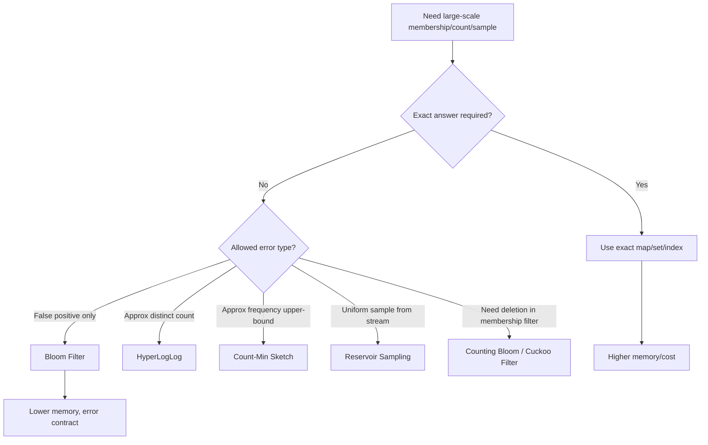
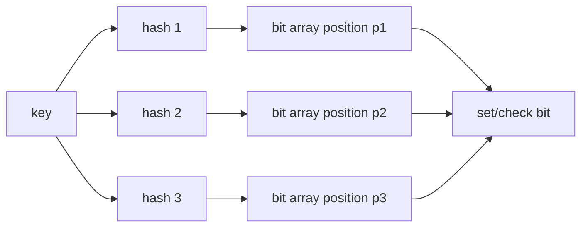

# learn-go-data-structure-algorithm-part-023.md

# Part 023 — Probabilistic Data Structures

> Seri: `learn-go-data-structure-algorithm`  
> Bagian: `023 / 034`  
> Target pembaca: Java software engineer yang ingin menguasai Go data structure & algorithm sampai level production-grade  
> Fokus: Bloom filter, Counting Bloom filter, Cuckoo filter intuition, HyperLogLog intuition, Count-Min Sketch, Reservoir Sampling, false positive/negative, memory-error trade-off, merge semantics, dan production risk

---

## Daftar Isi

- [1. Tujuan Part Ini](#1-tujuan-part-ini)
- [2. Mental Model: Approximate by Design](#2-mental-model-approximate-by-design)
- [3. Error Model: False Positive, False Negative, Estimation Error](#3-error-model-false-positive-false-negative-estimation-error)
- [4. Bitset sebagai Primitive](#4-bitset-sebagai-primitive)
- [5. Hash Strategy](#5-hash-strategy)
- [6. Bloom Filter](#6-bloom-filter)
- [7. Counting Bloom Filter](#7-counting-bloom-filter)
- [8. Cuckoo Filter Intuition](#8-cuckoo-filter-intuition)
- [9. HyperLogLog Intuition](#9-hyperloglog-intuition)
- [10. Count-Min Sketch](#10-count-min-sketch)
- [11. Reservoir Sampling](#11-reservoir-sampling)
- [12. Merge Semantics](#12-merge-semantics)
- [13. Aging, Reset, dan Time Window](#13-aging-reset-dan-time-window)
- [14. Production Decision Framework](#14-production-decision-framework)
- [15. Go Implementation Design](#15-go-implementation-design)
- [16. Testing Strategy](#16-testing-strategy)
- [17. Benchmarking Strategy](#17-benchmarking-strategy)
- [18. Production Case Studies](#18-production-case-studies)
- [19. Anti-Patterns](#19-anti-patterns)
- [20. Latihan Bertahap](#20-latihan-bertahap)
- [21. Ringkasan](#21-ringkasan)
- [22. Referensi](#22-referensi)

---

## 1. Tujuan Part Ini

Probabilistic data structures adalah struktur data yang sengaja mengorbankan akurasi sempurna untuk mendapatkan:

- memory jauh lebih kecil,
- query cepat,
- kemampuan streaming,
- kemampuan merge antar node,
- skalabilitas untuk data sangat besar.

Contoh pertanyaan:

```text
Apakah ID ini mungkin pernah terlihat?
Berapa kira-kira jumlah user unik?
Item mana yang kira-kira paling sering muncul?
Ambil sample representatif dari stream besar.
Apakah request ini mungkin duplicate?
```

Jawaban struktur probabilistik sering berbentuk:

```text
"mungkin ada"
"pasti tidak ada"
"estimasi sekitar X"
"frekuensi tidak lebih kecil dari Y"
```

Ini berbeda dari struktur deterministik seperti map/set/tree.

Dalam production, probabilistic structure berguna ketika exactness terlalu mahal atau tidak diperlukan. Tetapi ia berbahaya jika error model tidak dipahami oleh sistem pemakai.

---

## 2. Mental Model: Approximate by Design

### 2.1. Struktur Deterministik vs Probabilistik

| Aspek | Deterministik | Probabilistik |
|---|---|---|
| Jawaban | exact | approximate |
| Memory | sering besar | kecil |
| Error | bug jika salah | bagian dari kontrak |
| Use case | correctness-critical | scale/telemetry/cache/filtering |
| Auditability | tinggi | harus dijelaskan dengan error bound |
| Merge | tergantung | sering didesain mergeable |

Contoh exact set:

```go
seen := map[string]struct{}{}
```

Untuk 1 miliar key string, ini bisa sangat mahal.

Bloom filter bisa menjawab membership dengan memory jauh lebih kecil, tetapi dengan false positive.

---

### 2.2. Filosofi

Probabilistic structure bukan "struktur data yang salah kadang-kadang".

Ia adalah:

```text
struktur data dengan error yang dikontrol, dihitung, dan dijadikan bagian dari desain.
```

Production contract-nya harus jelas:

```text
False positive allowed?
False negative allowed?
Error rate target berapa?
Apa dampak business jika error terjadi?
Bisakah error dikoreksi di downstream?
Apakah user-facing?
Apakah regulatory/audit critical?
```

---

### 2.3. Diagram Decision



---

## 3. Error Model: False Positive, False Negative, Estimation Error

### 3.1. False Positive

False positive:

```text
Structure says "yes", but true answer is "no".
```

Example Bloom filter:

```text
Query key "X".
Bloom says "possibly present".
Actually X was never inserted.
```

Impact:

- cache might skip loading something,
- dedup might incorrectly drop a new event,
- security system might deny incorrectly,
- abuse system might flag incorrectly.

False positive can be acceptable in some prefilter use cases but dangerous in final decision.

---

### 3.2. False Negative

False negative:

```text
Structure says "no", but true answer is "yes".
```

Classic Bloom filter without deletion has no false negative if implemented correctly.

False negative is often more dangerous for:

- duplicate detection,
- security denylist,
- compliance screening,
- idempotency.

If false negative is not allowed, choose structure accordingly.

---

### 3.3. Estimation Error

HyperLogLog and Count-Min Sketch produce estimates.

Example:

```text
distinct users ≈ 1,020,000 with expected relative error ~1%
```

For reporting:

- maybe acceptable for dashboard,
- not acceptable for billing invoice,
- maybe acceptable for capacity planning,
- not acceptable for legal count.

---

### 3.4. Error Budget

Probabilistic structure should be tied to an error budget.

Example:

```text
Bloom filter target false positive rate: 1%
Expected inserts: 10 million
Memory: ~12 MB
```

If actual inserts exceed design capacity, false positive rate worsens.

Therefore track:

- insert count,
- saturation,
- observed false positive via sample,
- reset/rotation window.

---

## 4. Bitset sebagai Primitive

Many probabilistic structures use compact bit arrays.

Go does not have built-in bitset type in standard library, but we can implement with `[]uint64`.

---

### 4.1. Bitset Implementation

```go
package prob

type Bitset struct {
	words []uint64
	nbits uint64
}

func NewBitset(nbits uint64) Bitset {
	nwords := (nbits + 63) / 64
	return Bitset{
		words: make([]uint64, nwords),
		nbits: nbits,
	}
}

func (b Bitset) Len() uint64 {
	return b.nbits
}

func (b Bitset) valid(i uint64) bool {
	return i < b.nbits
}

func (b *Bitset) Set(i uint64) bool {
	if !b.valid(i) {
		return false
	}
	b.words[i/64] |= uint64(1) << (i % 64)
	return true
}

func (b Bitset) Get(i uint64) (bool, bool) {
	if !b.valid(i) {
		return false, false
	}
	return b.words[i/64]&(uint64(1)<<(i%64)) != 0, true
}

func (b *Bitset) Clear(i uint64) bool {
	if !b.valid(i) {
		return false
	}
	b.words[i/64] &^= uint64(1) << (i % 64)
	return true
}

func (b Bitset) Words() []uint64 {
	out := make([]uint64, len(b.words))
	copy(out, b.words)
	return out
}
```

---

### 4.2. Bitset Operations

Union:

```go
func (b *Bitset) Or(other Bitset) bool {
	if b.nbits != other.nbits {
		return false
	}
	for i := range b.words {
		b.words[i] |= other.words[i]
	}
	return true
}
```

Intersection:

```go
func (b *Bitset) And(other Bitset) bool {
	if b.nbits != other.nbits {
		return false
	}
	for i := range b.words {
		b.words[i] &= other.words[i]
	}
	return true
}
```

---

### 4.3. Popcount

Untuk menghitung bit set:

```go
import "math/bits"

func (b Bitset) CountSetBits() uint64 {
	var total uint64
	for _, w := range b.words {
		total += uint64(bits.OnesCount64(w))
	}
	return total
}
```

---

### 4.4. Concurrency Warning

Bitset di atas tidak thread-safe.

Concurrent `Set` bisa data race.

Untuk concurrent Bloom filter:

- lock,
- shard,
- atomic OR,
- batch build then publish immutable snapshot.

Atomic bitset butuh desain hati-hati dan biasanya memakai `sync/atomic`.

---

## 5. Hash Strategy

### 5.1. Why Hashing Matters

Probabilistic structures sangat bergantung pada hash.

Hash yang buruk menghasilkan:

- collision berlebihan,
- false positive rate lebih tinggi,
- bias estimasi,
- vulnerability terhadap adversarial input,
- distribusi register buruk.

---

### 5.2. Standard Library Options

Go menyediakan beberapa package relevan:

- `hash`
- `hash/fnv`
- `hash/maphash`
- `crypto/sha256`
- `hash/crc32`

Untuk probabilistic structure internal process:

- `hash/maphash` berguna untuk hash non-cryptographic dengan seed.
- `crypto/sha256` lebih stabil dan cryptographic, tetapi lebih mahal.
- `hash/fnv` sederhana, tetapi bukan pilihan terbaik untuk adversarial input.

---

### 5.3. Stable vs Seeded Hash

`maphash` menggunakan seed.

Kelebihan:

- bagus untuk melawan hash collision adversarial dalam proses,
- cepat dan practical.

Caveat:

- hash tidak stabil antar process jika seed berbeda,
- serialized Bloom filter tidak bisa diinterpretasikan dengan seed berbeda,
- merge antar node butuh seed dan hash function sama.

Jika structure disimpan/di-merge across process, tentukan hash function dan seed secara eksplisit.

---

### 5.4. Double Hashing

Bloom filter butuh `k` hash positions.

Daripada menghitung k hash independen, gunakan double hashing:

```text
h_i(x) = h1(x) + i*h2(x) mod m
```

Ini umum dan efisien.

---

### 5.5. Hash Bytes Helper with maphash

```go
import "hash/maphash"

type Hasher struct {
	seed maphash.Seed
}

func NewHasher() Hasher {
	return Hasher{seed: maphash.MakeSeed()}
}

func (h Hasher) Sum64String(s string) uint64 {
	return maphash.String(h.seed, s)
}

func (h Hasher) Sum64Bytes(b []byte) uint64 {
	return maphash.Bytes(h.seed, b)
}
```

Caveat:

- keep seed if structure lifetime needs consistency,
- do not persist without seed strategy.

---

## 6. Bloom Filter

### 6.1. Mental Model

Bloom filter is a bit array plus k hash functions.

Insert key:

```text
set k bit positions to 1
```

Query key:

```text
if all k positions are 1 -> possibly present
if any position is 0 -> definitely not present
```

Bloom filter guarantees:

```text
No false negative, if no deletion and implementation correct.
False positive possible.
```

---

### 6.2. Diagram Bloom Filter



---

### 6.3. Parameter Sizing

Given:

```text
n = expected number of inserted items
p = target false positive probability
```

Bit size:

```text
m = -n * ln(p) / (ln(2)^2)
```

Number of hashes:

```text
k = (m/n) * ln(2)
```

Approx false positive probability:

```text
p ≈ (1 - e^(-k*n/m))^k
```

---

### 6.4. Sizing Function

```go
import "math"

func BloomParams(expected uint64, fpRate float64) (m uint64, k uint64, ok bool) {
	if expected == 0 || fpRate <= 0 || fpRate >= 1 {
		return 0, 0, false
	}

	n := float64(expected)
	p := fpRate

	mFloat := -n * math.Log(p) / (math.Ln2 * math.Ln2)
	kFloat := (mFloat / n) * math.Ln2

	m = uint64(math.Ceil(mFloat))
	k = uint64(math.Ceil(kFloat))

	if k == 0 {
		k = 1
	}

	return m, k, true
}
```

---

### 6.5. Bloom Filter Implementation for `[]byte`

```go
type BloomFilter struct {
	bits Bitset
	k    uint64
	seed maphash.Seed
	n    uint64
}

func NewBloomFilter(bitSize, hashes uint64) BloomFilter {
	if bitSize == 0 {
		bitSize = 1
	}
	if hashes == 0 {
		hashes = 1
	}

	return BloomFilter{
		bits: NewBitset(bitSize),
		k:    hashes,
		seed: maphash.MakeSeed(),
	}
}

func NewBloomFilterFor(expected uint64, fpRate float64) (BloomFilter, bool) {
	m, k, ok := BloomParams(expected, fpRate)
	if !ok {
		return BloomFilter{}, false
	}
	return NewBloomFilter(m, k), true
}

func (b *BloomFilter) Add(key []byte) {
	h1 := maphash.Bytes(b.seed, key)
	h2 := mix64(h1 ^ 0x9e3779b97f4a7c15)

	m := b.bits.Len()
	for i := uint64(0); i < b.k; i++ {
		pos := (h1 + i*h2) % m
		b.bits.Set(pos)
	}
	b.n++
}

func (b BloomFilter) MightContain(key []byte) bool {
	h1 := maphash.Bytes(b.seed, key)
	h2 := mix64(h1 ^ 0x9e3779b97f4a7c15)

	m := b.bits.Len()
	for i := uint64(0); i < b.k; i++ {
		pos := (h1 + i*h2) % m
		set, ok := b.bits.Get(pos)
		if !ok || !set {
			return false
		}
	}
	return true
}

func (b BloomFilter) InsertedCount() uint64 {
	return b.n
}
```

Mix function:

```go
func mix64(x uint64) uint64 {
	x ^= x >> 30
	x *= 0xbf58476d1ce4e5b9
	x ^= x >> 27
	x *= 0x94d049bb133111eb
	x ^= x >> 31
	if x == 0 {
		return 0x9e3779b97f4a7c15
	}
	return x
}
```

Imports:

```go
import (
	"hash/maphash"
	"math"
)
```

---

### 6.6. Important Caveat: `maphash` Seed and Serialization

The Bloom filter above is process-local.

If you serialize the bitset and reload with a new seed, it breaks.

Production options:

1. store seed if possible,
2. use stable hash function,
3. define custom deterministic hash,
4. do not serialize/merge filters across processes.

---

### 6.7. Bloom Filter Merge

Two Bloom filters can be merged by OR if and only if:

```text
same bit size
same number of hash functions
same hash function
same seed/salt
same interpretation
```

```go
func (b *BloomFilter) Merge(other BloomFilter) bool {
	if b.k != other.k || b.bits.Len() != other.bits.Len() {
		return false
	}
	return b.bits.Or(other.bits)
}
```

Caveat:

- inserted count after merge is not exact by simple addition if overlap unknown,
- false positive rate increases with total distinct inserts.

---

### 6.8. Saturation

As more bits become 1, false positive rate rises.

Track:

```go
func (b BloomFilter) FillRatio() float64 {
	if b.bits.Len() == 0 {
		return 0
	}
	return float64(b.bits.CountSetBits()) / float64(b.bits.Len())
}
```

High fill ratio means filter is near useless.

---

### 6.9. Common Bloom Use Cases

Good:

- prefilter before expensive DB lookup,
- avoid repeated negative lookups,
- approximate duplicate detection where false positive is acceptable,
- cache admission helper,
- distributed membership summary.

Dangerous:

- final idempotency decision,
- final fraud decision,
- final security authorization,
- legal/compliance decision,
- dropping business events without verification.

---

## 7. Counting Bloom Filter

### 7.1. Problem

Classic Bloom filter cannot delete.

If you clear bits during delete, you may break other keys sharing those bits, causing false negatives.

Counting Bloom uses counters instead of bits.

Insert:

```text
counter[pos]++
```

Delete:

```text
counter[pos]--
```

Query:

```text
all counters > 0
```

---

### 7.2. Implementation

```go
type CountingBloomFilter struct {
	counts []uint16
	k      uint64
	seed   maphash.Seed
	n      uint64
}

func NewCountingBloomFilter(size, hashes uint64) CountingBloomFilter {
	if size == 0 {
		size = 1
	}
	if hashes == 0 {
		hashes = 1
	}
	return CountingBloomFilter{
		counts: make([]uint16, size),
		k:      hashes,
		seed:   maphash.MakeSeed(),
	}
}

func (c *CountingBloomFilter) Add(key []byte) bool {
	positions := c.positions(key)

	for _, p := range positions {
		if c.counts[p] == ^uint16(0) {
			return false
		}
	}

	for _, p := range positions {
		c.counts[p]++
	}
	c.n++
	return true
}

func (c *CountingBloomFilter) Remove(key []byte) bool {
	if !c.MightContain(key) {
		return false
	}

	positions := c.positions(key)
	for _, p := range positions {
		if c.counts[p] == 0 {
			return false
		}
	}

	for _, p := range positions {
		c.counts[p]--
	}
	if c.n > 0 {
		c.n--
	}
	return true
}

func (c CountingBloomFilter) MightContain(key []byte) bool {
	for _, p := range c.positions(key) {
		if c.counts[p] == 0 {
			return false
		}
	}
	return true
}

func (c CountingBloomFilter) positions(key []byte) []uint64 {
	h1 := maphash.Bytes(c.seed, key)
	h2 := mix64(h1 ^ 0x517cc1b727220a95)

	out := make([]uint64, c.k)
	m := uint64(len(c.counts))
	for i := uint64(0); i < c.k; i++ {
		out[i] = (h1 + i*h2) % m
	}
	return out
}
```

---

### 7.3. Allocation Issue

The `positions` method allocates every call.

Hot path version should avoid allocation:

```go
func (c CountingBloomFilter) forEachPosition(key []byte, fn func(uint64) bool) {
	h1 := maphash.Bytes(c.seed, key)
	h2 := mix64(h1 ^ 0x517cc1b727220a95)

	m := uint64(len(c.counts))
	for i := uint64(0); i < c.k; i++ {
		if !fn((h1 + i*h2) % m) {
			return
		}
	}
}
```

But closure can also cost. For hot code, inline loops in each method.

---

### 7.4. Counting Bloom Risks

Risks:

- counter overflow,
- removing key that was never inserted can create false negatives,
- duplicate insertion semantics unclear,
- memory larger than Bloom filter,
- still has false positives.

Deletion is only safe if:

```text
Remove is called only for keys previously inserted the same number of times.
```

If caller cannot guarantee this, Counting Bloom is unsafe.

---

## 8. Cuckoo Filter Intuition

### 8.1. Why Cuckoo Filter

Cuckoo filters are membership filters that support deletion more naturally than Bloom filters and can be space-efficient.

They store small fingerprints in buckets.

Query:

```text
Compute fingerprint f.
Check candidate buckets for f.
```

Insert may relocate existing fingerprints, similar to cuckoo hashing.

---

### 8.2. High-Level Model

```text
fingerprint = hash(key)
bucket1 = hash(key)
bucket2 = bucket1 XOR hash(fingerprint)
```

Key may be stored in either bucket.

---

### 8.3. Benefits

Compared to Counting Bloom:

- supports deletion,
- often better space efficiency at low false positive rates,
- query checks a few buckets.

---

### 8.4. Risks

- insert can fail when table too full,
- implementation more complex,
- fingerprint collision causes false positive,
- deletion with false positive can remove wrong fingerprint if no count/identity,
- resizing is non-trivial.

---

### 8.5. Production Guidance

Use library or specialized implementation only if:

- deletion is required,
- memory matters,
- Bloom/Counting Bloom is insufficient,
- you can test load factor and insertion failure behavior.

For this series, understand Cuckoo filter as a design option, not as first structure to implement by hand.

---

## 9. HyperLogLog Intuition

### 9.1. Problem: Approximate Cardinality

Need estimate:

```text
How many distinct users/events/IPs?
```

Exact:

```go
seen := map[string]struct{}{}
```

For huge streams, memory can explode.

HyperLogLog estimates distinct count with fixed memory.

---

### 9.2. Core Intuition

Hash values are uniformly random.

If we see a hash with many leading zero bits, that suggests many distinct items have been observed.

Example:

```text
hash starts with 0000001...
```

This is rare.

The maximum observed leading-zero run gives cardinality signal.

HyperLogLog improves this by using many registers and harmonic averaging.

---

### 9.3. Register Model

```text
Use first p bits of hash as register index.
Use remaining bits to compute rank = leading zeros + 1.
register[index] = max(register[index], rank)
```

Estimate cardinality from registers.

---

### 9.4. Simplified HLL Skeleton

This is educational skeleton, not production-calibrated HLL.

```go
type HLL struct {
	p         uint8
	registers []uint8
	seed      maphash.Seed
}

func NewHLL(p uint8) HLL {
	if p < 4 {
		p = 4
	}
	if p > 18 {
		p = 18
	}

	m := 1 << p
	return HLL{
		p:         p,
		registers: make([]uint8, m),
		seed:      maphash.MakeSeed(),
	}
}

func (h *HLL) Add(key []byte) {
	x := maphash.Bytes(h.seed, key)

	idx := x >> (64 - h.p)
	rest := (x << h.p) | (1 << (h.p - 1))

	rank := uint8(bits.LeadingZeros64(rest) + 1)
	if rank > h.registers[idx] {
		h.registers[idx] = rank
	}
}
```

Import:

```go
import (
	"hash/maphash"
	"math/bits"
)
```

---

### 9.5. HLL Estimate Intuition

Real HLL estimate uses:

```text
alpha_m * m^2 / sum(2^-register[i])
```

with corrections for small and large cardinalities.

For production, prefer vetted library or implement the full algorithm carefully.

---

### 9.6. Merge

HLL is mergeable:

```text
merged.register[i] = max(a.register[i], b.register[i])
```

Only if:

```text
same p
same hash function
same seed/salt
```

This makes HLL useful for distributed systems:

- each node estimates local distinct,
- central aggregator merges registers.

---

### 9.7. HLL Use Cases

Good:

- approximate unique visitors,
- unique IPs,
- unique request IDs for telemetry,
- capacity planning,
- anomaly dashboards.

Bad:

- billing exact unique users,
- legal/regulatory exact reporting,
- small cardinality where exact set is cheap,
- per-user decisioning.

---

## 10. Count-Min Sketch

### 10.1. Problem: Approximate Frequency

Need estimate frequency of items in stream:

```text
how often did key X occur?
```

Exact:

```go
counts := map[string]uint64{}
```

For huge keyspace, memory can explode.

Count-Min Sketch uses a matrix of counters.

---

### 10.2. Core Idea

Use `d` hash functions and width `w`.

Add key:

```text
for each row i:
    counters[i][hash_i(key) % w]++
```

Estimate key:

```text
min counters across rows
```

Why min?

Collisions only increase counters, never decrease. Min gives upper-bound-ish estimate.

---

### 10.3. Error Semantics

Count-Min Sketch generally overestimates, not underestimates, assuming non-negative increments.

```text
estimate(key) >= true count
```

The overcount depends on width/depth and total count.

---

### 10.4. Implementation

```go
type CountMinSketch struct {
	width uint64
	depth uint64
	table []uint64
	seeds []uint64
	seed  maphash.Seed
}

func NewCountMinSketch(width, depth uint64) CountMinSketch {
	if width == 0 {
		width = 1
	}
	if depth == 0 {
		depth = 1
	}

	seeds := make([]uint64, depth)
	for i := range seeds {
		seeds[i] = mix64(uint64(i) + 0x9e3779b97f4a7c15)
	}

	return CountMinSketch{
		width: width,
		depth: depth,
		table: make([]uint64, width*depth),
		seeds: seeds,
		seed:  maphash.MakeSeed(),
	}
}

func (c *CountMinSketch) Add(key []byte, delta uint64) {
	h := maphash.Bytes(c.seed, key)

	for row := uint64(0); row < c.depth; row++ {
		col := mix64(h ^ c.seeds[row]) % c.width
		c.table[row*c.width+col] += delta
	}
}

func (c CountMinSketch) Estimate(key []byte) uint64 {
	h := maphash.Bytes(c.seed, key)

	var best uint64 = ^uint64(0)
	for row := uint64(0); row < c.depth; row++ {
		col := mix64(h ^ c.seeds[row]) % c.width
		v := c.table[row*c.width+col]
		if v < best {
			best = v
		}
	}

	return best
}
```

---

### 10.5. Merge

Two sketches can be merged by adding counters if:

```text
same width
same depth
same hash functions/seeds
same counter semantics
```

```go
func (c *CountMinSketch) Merge(other CountMinSketch) bool {
	if c.width != other.width || c.depth != other.depth {
		return false
	}
	for i := range c.table {
		c.table[i] += other.table[i]
	}
	return true
}
```

Need overflow policy.

---

### 10.6. Use Cases

Good:

- approximate hot key detection,
- abuse detection prefilter,
- telemetry heavy hitters,
- cache admission,
- per-key approximate traffic.

Bad:

- exact quota enforcement,
- exact billing,
- legal evidence,
- deletion/negative updates without advanced variant.

---

### 10.7. Heavy Hitters Caveat

Count-Min Sketch estimates count for queried keys.

It does not automatically list top keys unless paired with candidate tracking.

Pattern:

```text
CMS + small heap/map of candidate heavy hitters
```

---

## 11. Reservoir Sampling

### 11.1. Problem

Need uniform sample of `k` items from stream of unknown length.

Cannot store all items.

Reservoir sampling keeps a reservoir of size `k`.

---

### 11.2. Algorithm R

For item number `i` starting from 1:

- if `i <= k`, put item in reservoir,
- else choose random `j` in `[0, i)`,
- if `j < k`, replace reservoir[j].

This gives each item probability `k/n` of being included.

---

### 11.3. Generic Reservoir Sampler

```go
import "math/rand/v2"

type Reservoir[T any] struct {
	items []T
	seen  uint64
	rng   *rand.Rand
}

func NewReservoir[T any](k int, seed uint64) Reservoir[T] {
	src := rand.NewPCG(seed, seed^0x9e3779b97f4a7c15)
	return Reservoir[T]{
		items: make([]T, 0, k),
		rng:   rand.New(src),
	}
}

func (r *Reservoir[T]) Add(item T) {
	r.seen++

	k := uint64(cap(r.items))
	if k == 0 {
		return
	}

	if uint64(len(r.items)) < k {
		r.items = append(r.items, item)
		return
	}

	j := r.rng.Uint64N(r.seen)
	if j < k {
		r.items[j] = item
	}
}

func (r Reservoir[T]) Items() []T {
	out := make([]T, len(r.items))
	copy(out, r.items)
	return out
}

func (r Reservoir[T]) Seen() uint64 {
	return r.seen
}
```

---

### 11.4. Use Cases

Good:

- sample logs,
- sample events for debugging,
- sample users for analysis,
- representative telemetry sample.

Bad:

- security evidence,
- deterministic replay unless seed and order fixed,
- exact percentile,
- biased stream where uniform sample is not desired.

---

### 11.5. Weighted Sampling

Reservoir sampling above is uniform.

If items have weight, need weighted reservoir sampling.

Do not misuse uniform sampling for weighted domain.

---

## 12. Merge Semantics

### 12.1. Why Merge Matters

Probabilistic structures are common in distributed systems.

Example:

```text
Node A observes events.
Node B observes events.
Aggregator wants global estimate.
```

Some structures merge naturally.

---

### 12.2. Merge Table

| Structure | Merge Operation | Conditions |
|---|---|---|
| Bloom Filter | bitwise OR | same m, k, hash |
| Counting Bloom | counter addition | same params, overflow safe |
| HLL | register-wise max | same p/hash |
| Count-Min Sketch | counter addition | same width/depth/hash |
| Reservoir Sampling | not trivial | needs weighted merge algorithm |
| Exact set | union | memory heavy |

---

### 12.3. Merge Is Not Always Exact

Bloom merge increases false positive rate.

CMS merge increases total counts and collision error.

HLL merge estimates distinct union, but only if hash domains align.

Reservoir merge is not simple concatenation.

---

### 12.4. Version Your Structures

If serialized or shared:

```text
type
version
hash algorithm
seed/salt
parameters
created_at
window
counter width
endianness if binary
```

Without metadata, merged results may be meaningless.

---

## 13. Aging, Reset, dan Time Window

### 13.1. The Staleness Problem

Probabilistic structures accumulate history.

Bloom filter cannot forget individual items.

CMS counters grow forever.

HLL tracks all-time distinct unless windowed.

Production systems usually need time window.

---

### 13.2. Rotation

Use multiple structures per time bucket:

```text
current minute
previous minute
...
```

Query across window by merging or checking all buckets.

Example:

```text
last 10 minutes = OR of 10 Bloom filters
```

Trade-off:

- memory multiplied by bucket count,
- false positive may increase with OR,
- operationally simple.

---

### 13.3. Stable Bloom / Decaying Sketch

Some advanced structures decay over time.

But they are harder to reason about.

Production recommendation:

```text
Prefer explicit time-bucket rotation before probabilistic decay.
```

---

### 13.4. Reset Policy

Define reset condition:

- time-based,
- fill-ratio threshold,
- insert-count threshold,
- deployment epoch,
- manual admin operation.

A Bloom filter past capacity silently degrades.

Track metrics.

---

## 14. Production Decision Framework

### 14.1. Ask These Questions

```text
1. What exact question are we answering?
2. Is exactness required?
3. Which error type is acceptable?
4. What is the error budget?
5. What is the expected cardinality/volume?
6. What happens if volume exceeds estimate?
7. Is the structure persisted or merged?
8. Does it need deletion?
9. Is it user-facing/regulatory/security critical?
10. How will we monitor saturation/error?
```

---

### 14.2. Decision Matrix

| Need | Structure |
|---|---|
| Membership, no false negatives, false positive allowed | Bloom Filter |
| Membership with deletion | Counting Bloom / Cuckoo Filter |
| Approx distinct count | HyperLogLog |
| Approx frequency | Count-Min Sketch |
| Uniform stream sample | Reservoir Sampling |
| Exact idempotency | Exact store, not Bloom |
| Exact billing | Exact aggregation |
| Exact deny/allow security | Exact source of truth |

---

### 14.3. Error Impact Matrix

| Error | Safe Example | Dangerous Example |
|---|---|---|
| False positive | extra DB lookup skipped only if verified later | drop real payment event |
| False negative | cache prefetch misses | duplicate transaction accepted |
| Overestimate | capacity dashboard | overcharge billing |
| Underestimate | non-critical trend | under-enforce quota |
| Biased sample | exploratory logs | compliance evidence sample |

---

## 15. Go Implementation Design

### 15.1. Avoid Hidden Allocation on Query

Membership checks should be allocation-free.

Bad:

```go
positions := make([]uint64, k)
```

inside query.

Better:

```go
for i := uint64(0); i < k; i++ {
    pos := ...
}
```

---

### 15.2. Byte vs String API

Offer both if needed:

```go
AddBytes([]byte)
AddString(string)
```

Avoid forcing string allocation from bytes on hot path.

---

### 15.3. Mutability

Most structures mutate on add.

For read-mostly:

- build mutable,
- publish immutable snapshot,
- no concurrent writes after publish.

For concurrent mutation:

- shard,
- lock,
- atomic counters/bits,
- accept contention.

---

### 15.4. Persistence Contract

If persisted:

```go
type BloomHeader struct {
	Version uint32
	Bits    uint64
	Hashes  uint64
	HashAlg string
	SeedID  string
}
```

Do not persist only raw bit array without metadata.

---

### 15.5. Generics

Many probabilistic structures should operate on bytes:

```go
[]byte
string
```

Generic `T any` requires stable serialization/hashing, which is often dangerous.

Prefer explicit key encoding at caller boundary.

---

## 16. Testing Strategy

### 16.1. Bloom Filter Tests

Properties:

1. after add, key must be found,
2. unknown key may be found but should be statistically bounded,
3. invalid params rejected,
4. merge works for same params,
5. merge rejects incompatible params.

```go
func TestBloomNoFalseNegative(t *testing.T) {
	b, ok := NewBloomFilterFor(1000, 0.01)
	if !ok {
		t.Fatal("bad params")
	}

	keys := [][]byte{
		[]byte("a"),
		[]byte("b"),
		[]byte("c"),
	}

	for _, k := range keys {
		b.Add(k)
	}

	for _, k := range keys {
		if !b.MightContain(k) {
			t.Fatalf("false negative for %q", k)
		}
	}
}
```

---

### 16.2. Statistical Tests

Do not assert exact false positive rate for small sample.

Use broad bound:

```text
expected p=1%
test allows <5% for sufficiently large sample
```

Statistical tests can be flaky if too strict.

---

### 16.3. CMS Tests

Properties:

- estimate inserted key >= actual count,
- estimate unknown key >= 0,
- merge equals combined stream within sketch semantics,
- counter overflow policy tested.

---

### 16.4. Reservoir Tests

Properties:

- reservoir size <= k,
- seen count correct,
- deterministic with fixed seed,
- rough uniformity over many trials.

Do not make flaky randomness tests. Use deterministic seed.

---

### 16.5. Serialization Tests

If structure persisted:

- round-trip preserves behavior,
- incompatible hash metadata rejected,
- version mismatch handled,
- corrupted payload rejected.

---

## 17. Benchmarking Strategy

### 17.1. Bloom vs Map

Benchmark:

- memory usage,
- add throughput,
- query throughput,
- false positive under target load,
- saturation after over-capacity.

Map gives exactness but much larger memory.

---

### 17.2. CMS Throughput

Benchmark with:

- uniform keys,
- Zipfian keys,
- hot keys,
- random bytes,
- strings.

Distribution affects cache locality and collision pattern.

---

### 17.3. HLL

Benchmark:

- add throughput,
- merge throughput,
- estimate cost,
- memory per instance.

---

### 17.4. Allocation Metrics

Hot operations should ideally be:

```text
0 alloc/op
```

If not:

- check key conversion,
- closure allocations,
- positions slice,
- interface boxing,
- fmt usage.

---

## 18. Production Case Studies

### 18.1. Negative Lookup Prefilter

Problem:

```text
Avoid expensive DB lookup for IDs definitely not present.
```

Use:

```text
Bloom filter as prefilter.
```

Logic:

```text
if !bloom.MightContain(id):
    return not found
else:
    query DB to confirm
```

Safe because positive is verified by DB.

---

### 18.2. Duplicate Event Prefilter

Problem:

```text
High-volume event stream.
Need detect likely duplicate before exact idempotency store.
```

Use Bloom only as prefilter:

```text
if bloom says no:
    definitely new to filter, still write exact idempotency store
if bloom says yes:
    check exact store before dropping
```

Do not drop solely on Bloom positive unless false drop is acceptable.

---

### 18.3. Unique Visitors Dashboard

Problem:

```text
Show approximate unique users per minute/hour/day.
```

Use:

```text
HyperLogLog per time bucket.
```

Merge buckets for larger windows.

Not for billing.

---

### 18.4. Hot Key Detection

Problem:

```text
Detect keys causing high load.
```

Use:

```text
Count-Min Sketch + candidate heap/map.
```

CMS estimates frequency, candidate tracker remembers possible top keys.

---

### 18.5. Log Sampling

Problem:

```text
Keep 10,000 representative logs from unbounded stream.
```

Use:

```text
Reservoir Sampling
```

Need seed/order if reproducibility matters.

---

## 19. Anti-Patterns

### 19.1. Bloom Filter as Source of Truth

Wrong for exact decisions:

```text
Bloom says seen -> drop event
```

Unless false drop is explicitly acceptable.

---

### 19.2. Ignoring Capacity

Bloom filter configured for 1M inserts but receives 100M.

False positive rate explodes.

Track saturation.

---

### 19.3. Merging Different Hash Seeds

Bloom/HLL/CMS merge is invalid if hash function/seed differs.

---

### 19.4. Counting Bloom Deletion Without Insert Guarantee

Removing non-inserted key can create false negatives for other keys.

---

### 19.5. Using HLL for Small Exact Counts

For small cardinality, exact set may be simpler and more accurate.

---

### 19.6. Using CMS for Exact Quota

CMS overestimates due to collisions.

Do not enforce exact quota solely with CMS.

---

### 19.7. Randomness Without Reproducibility

Reservoir sampling without seed policy makes debugging hard.

---

## 20. Latihan Bertahap

### 20.1. Level 1 — Bitset

Implement:

1. set,
2. get,
3. clear,
4. count bits,
5. OR merge,
6. AND merge.

---

### 20.2. Level 2 — Bloom Filter

Implement:

1. sizing function,
2. add,
3. might contain,
4. fill ratio,
5. merge,
6. false positive simulation.

---

### 20.3. Level 3 — Counting Bloom

Implement:

1. counters,
2. add,
3. remove,
4. overflow policy,
5. no false negative test for valid operations.

---

### 20.4. Level 4 — Count-Min Sketch

Implement:

1. add,
2. estimate,
3. merge,
4. candidate heavy hitter tracker.

---

### 20.5. Level 5 — HLL Skeleton

Implement educational HLL:

1. registers,
2. add,
3. merge,
4. rough estimate,
5. compare with exact set.

Then study full HLL corrections before production.

---

### 20.6. Level 6 — Production Design Exercise

Design dedup pipeline:

```text
Bloom prefilter
exact idempotency store
metrics for false positive estimate
rotation every N minutes
safe fallback when saturated
```

Document:

- error model,
- what is allowed,
- what is verified,
- what is never decided probabilistically.

---

## 21. Ringkasan

Probabilistic data structures trade exactness for memory and scale.

Key takeaways:

- Bloom filter:
  - no false negatives,
  - false positives possible,
  - good as prefilter.

- Counting Bloom:
  - supports deletion,
  - deletion safe only with correct insert/remove accounting.

- Cuckoo filter:
  - deletion-friendly membership filter,
  - more complex.

- HyperLogLog:
  - approximate distinct count,
  - mergeable,
  - good for telemetry/dashboard.

- Count-Min Sketch:
  - approximate frequency,
  - overestimates,
  - good for hot key detection.

- Reservoir Sampling:
  - uniform sample from stream,
  - good for observability/debugging.

Production mental model:

```text
Approximate structure must never hide its error model.
The error model is part of the API contract.
```

Before using one, decide:

```text
What error can happen?
Who sees it?
Can downstream verify it?
How is saturation monitored?
Can it be reset/rotated?
Can it be merged safely?
```

---

## 22. Referensi

Referensi utama yang relevan untuk part ini:

- Go 1.26 Release Notes — `https://go.dev/doc/go1.26`
- Go Release History — `https://go.dev/doc/devel/release`
- Go Language Specification — `https://go.dev/ref/spec`
- Package `hash` — `https://pkg.go.dev/hash`
- Package `hash/maphash` — `https://pkg.go.dev/hash/maphash`
- Package `hash/fnv` — `https://pkg.go.dev/hash/fnv`
- Package `hash/crc32` — `https://pkg.go.dev/hash/crc32`
- Package `crypto/sha256` — `https://pkg.go.dev/crypto/sha256`
- Package `math` — `https://pkg.go.dev/math`
- Package `math/bits` — `https://pkg.go.dev/math/bits`
- Package `math/rand/v2` — `https://pkg.go.dev/math/rand/v2`
- Package `testing` — `https://pkg.go.dev/testing`

---

# Status Seri

Selesai:

- Part 000 — Roadmap, Mental Model, dan Batasan Seri
- Part 001 — Complexity Model yang Realistis di Go
- Part 002 — Arrays, Slices, dan Sequence Design
- Part 003 — Maps, Hash Tables, dan Associative Data
- Part 004 — Sorting, Ordering, Comparison, dan Search
- Part 005 — Stack, Queue, Deque, dan Worklist Algorithms
- Part 006 — Linked List, Intrusive List, dan Pointer-Chasing Trade-off
- Part 007 — Heap, Priority Queue, dan Scheduling Algorithms
- Part 008 — Sets, Multisets, Bag, dan Membership Models
- Part 009 — Strings, Bytes, Runes, Tokenization, dan Text Algorithms
- Part 010 — Recursion, Iteration, Backtracking, dan State Space Search
- Part 011 — Hashing, Fingerprint, Checksums, dan Equality Strategy
- Part 012 — Trees: Binary Tree, BST, Traversal, dan Structural Invariants
- Part 013 — Balanced Trees: AVL, Red-Black, Treap, dan Ordered Index
- Part 014 — B-Tree, B+Tree, Page-Oriented Structure, dan Storage-Aware Index
- Part 015 — Trie, Radix Tree, Patricia Tree, dan Prefix Index
- Part 016 — Graph Fundamentals: Representation, Traversal, dan Modelling
- Part 017 — Graph Algorithms for Production Systems
- Part 018 — Dynamic Programming: Memoization, Tabulation, dan State Compression
- Part 019 — Greedy Algorithms, Exchange Argument, dan Approximation Thinking
- Part 020 — Divide and Conquer, Selection, dan Search Space Reduction
- Part 021 — Range Query Structures: Prefix Sum, Fenwick Tree, Segment Tree
- Part 022 — Disjoint Set Union, Connectivity, dan Merge Semantics
- Part 023 — Probabilistic Data Structures

Berikutnya:

- Part 024 — Cache Data Structures: LRU, LFU, ARC-like Thinking, TTL Index


<!-- NAVIGATION_FOOTER -->
<div class="page-nav">
<a href="./learn-go-data-structure-algorithm-part-022.md">⬅️ Part 022 — Disjoint Set Union, Connectivity, dan Merge Semantics</a>
<a href="./index.md">📚 Kategori</a>
<a href="../../index.md">🏠 Home</a>
<a href="./learn-go-data-structure-algorithm-part-024.md">Part 024 — Cache Data Structures: LRU, LFU, ARC-like Thinking, TTL Index ➡️</a>
</div>
