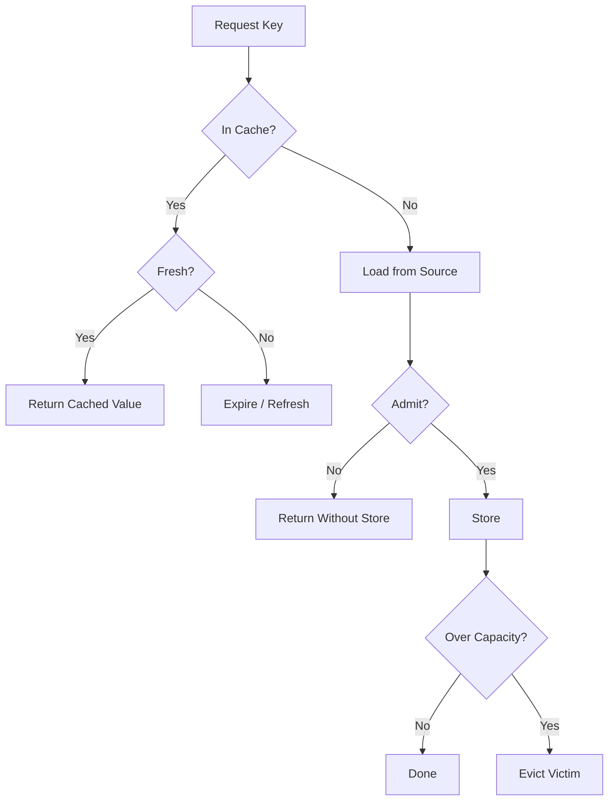
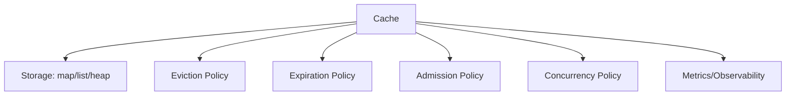
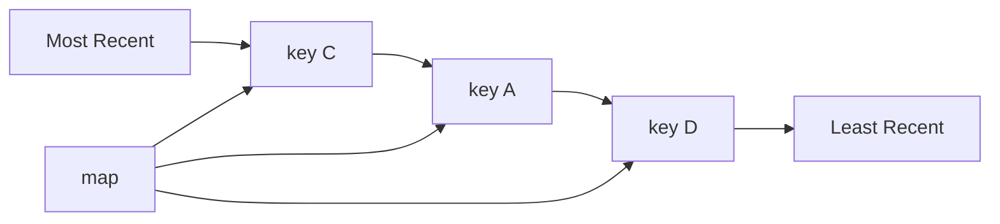
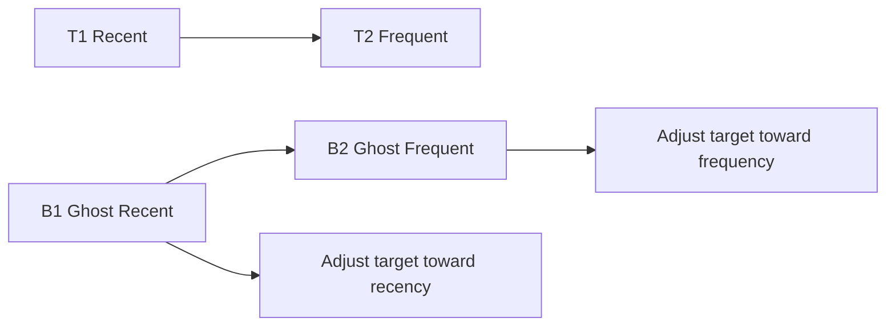

# learn-go-data-structure-algorithm-part-024.md

# Part 024 — Cache Data Structures: LRU, LFU, ARC-like Thinking, TTL Index

> Seri: `learn-go-data-structure-algorithm`  
> Bagian: `024 / 034`  
> Target pembaca: Java software engineer yang ingin menguasai Go data structure & algorithm sampai level production-grade  
> Fokus: cache sebagai data structure + policy: LRU, LFU, TTL, heap expiration, timing wheel intuition, admission/eviction, negative caching, sharding, memory accounting, stale-data risk, thundering herd, dan desain cache Go yang defensible

---

## Daftar Isi

- [1. Tujuan Part Ini](#1-tujuan-part-ini)
- [2. Cache Bukan Sekadar Map](#2-cache-bukan-sekadar-map)
- [3. Core Cache Contract](#3-core-cache-contract)
- [4. Taxonomy Cache Policy](#4-taxonomy-cache-policy)
- [5. LRU Cache: Map + Doubly Linked List](#5-lru-cache-map--doubly-linked-list)
- [6. LFU Cache: Frequency-Aware Eviction](#6-lfu-cache-frequency-aware-eviction)
- [7. ARC-like dan Adaptive Thinking](#7-arc-like-dan-adaptive-thinking)
- [8. TTL Cache](#8-ttl-cache)
- [9. Expiration Index: Heap, Bucket, Timing Wheel](#9-expiration-index-heap-bucket-timing-wheel)
- [10. Admission vs Eviction](#10-admission-vs-eviction)
- [11. Negative Caching](#11-negative-caching)
- [12. Singleflight-Style Dedup dan Thundering Herd](#12-singleflight-style-dedup-dan-thundering-herd)
- [13. Sharded Cache](#13-sharded-cache)
- [14. Memory Accounting](#14-memory-accounting)
- [15. Invalidation, Freshness, dan Staleness](#15-invalidation-freshness-dan-staleness)
- [16. Go API Design](#16-go-api-design)
- [17. Testing Strategy](#17-testing-strategy)
- [18. Benchmarking Strategy](#18-benchmarking-strategy)
- [19. Production Case Studies](#19-production-case-studies)
- [20. Anti-Patterns](#20-anti-patterns)
- [21. Latihan Bertahap](#21-latihan-bertahap)
- [22. Ringkasan](#22-ringkasan)
- [23. Referensi](#23-referensi)

---

## 1. Tujuan Part Ini

Cache adalah salah satu struktur data paling sering dipakai di sistem backend, tetapi juga salah satu sumber bug production paling mahal.

Cache terlihat sederhana:

```go
cache[key] = value
```

Tetapi production cache harus menjawab:

```text
Kapan item masuk?
Kapan item keluar?
Apa yang terjadi jika item stale?
Berapa memory yang dipakai?
Apakah cache bounded?
Apakah query concurrent aman?
Apakah miss menyebabkan thundering herd?
Apakah negative result ikut dicache?
Apakah eviction fair?
Apakah TTL absolut atau sliding?
Apakah cache boleh menjadi source of truth?
```

Part ini membahas cache sebagai gabungan dari:

```text
data structure + policy + lifecycle + observability + correctness contract
```

Bukan sekadar `map`.

---

## 2. Cache Bukan Sekadar Map

### 2.1. Map Tanpa Bound adalah Memory Leak Terselubung

```go
m := map[string]UserProfile{}
```

Jika key terus bertambah, map tumbuh tanpa batas.

Masalah:

- memory naik terus,
- GC pressure naik,
- latency naik,
- OOM risk,
- stale data makin banyak.

Cache production harus punya boundary:

```text
max entries
max bytes
TTL
manual invalidation
window rotation
```

---

### 2.2. Cache Adalah Policy Engine

Cache minimal punya tiga keputusan:

```text
1. Admission: apakah item boleh masuk cache?
2. Lookup: apakah item masih valid untuk dipakai?
3. Eviction: item mana yang harus dibuang?
```

LRU, LFU, TTL, TinyLFU, ARC-like policy adalah jawaban berbeda untuk pertanyaan tersebut.

---

### 2.3. Diagram Cache Lifecycle



---

## 3. Core Cache Contract

### 3.1. Basic Operations

Typical cache API:

```go
Get(key) (value, ok)
Set(key, value)
Delete(key)
Len()
Clear()
```

Production API often needs:

```go
GetOrLoad(key, loader)
SetWithTTL(key, value, ttl)
Invalidate(key)
Stats()
Close()
```

---

### 3.2. Cache Semantics

Important semantic choices:

| Question | Options |
|---|---|
| On get, should recency update? | yes for LRU, no for simple TTL |
| TTL type | absolute, sliding, refresh-after-write, refresh-after-access |
| Expired item behavior | remove immediately, lazy remove, serve stale |
| Capacity | entries, bytes, weighted |
| Loader | sync, async, singleflight |
| Error caching | cache errors? cache not found? |
| Concurrency | internal lock, caller lock, immutable snapshot |
| Value ownership | copy value or store reference |

---

### 3.3. Cache Correctness Is Domain-Specific

Cache correctness is not one universal rule.

Examples:

| Domain | Stale Data Allowed? |
|---|---|
| User avatar URL | usually yes |
| Feature flag | maybe short TTL |
| Permission decision | dangerous |
| Auth token introspection | short TTL with revocation risk |
| Product price | maybe with clear TTL |
| Regulatory case status | depends on workflow |
| Idempotency key | must be exact within window |
| Rate limiter counter | must be consistent enough |

---

## 4. Taxonomy Cache Policy

### 4.1. Main Policies

| Policy | Eviction Basis | Good For | Bad For |
|---|---|---|---|
| FIFO | oldest inserted | simple buffer | ignores access |
| LRU | least recently used | recency-local workload | scan pollution |
| LFU | least frequently used | stable hot keys | stale popularity |
| TTL | expiry time | freshness control | no capacity intelligence |
| Size-based | memory weight | bounded memory | needs accounting |
| Random | random victim | simple/low overhead | weaker hit ratio |
| ARC-like | adaptive recency/frequency | mixed workloads | complex |
| TinyLFU-like | admission by frequency | cache pollution resistance | more components |

---

### 4.2. Policy Axes

```text
Eviction: what leaves?
Admission: what enters?
Expiration: when becomes invalid?
Refresh: when reload happens?
Accounting: what is capacity measured in?
Concurrency: how is state protected?
```

Good cache design separates these concerns.

---

### 4.3. Diagram Policy Layering



---

## 5. LRU Cache: Map + Doubly Linked List

### 5.1. Mental Model

LRU evicts least recently used item.

Operations:

```text
Get(key): move item to front
Set(key): insert/update at front
Evict: remove from back
```

Data structures:

```text
map[key]*node      -> O(1) lookup
doubly linked list -> O(1) move/remove
```

---

### 5.2. Diagram LRU



---

### 5.3. Why Not Slice?

With slice, moving arbitrary item to front requires shifting:

```text
O(n)
```

Doubly linked list gives:

```text
remove node: O(1)
insert front: O(1)
```

But linked list has pointer chasing and allocation overhead. For small caches, simpler structures can beat theoretical LRU.

---

### 5.4. LRU Implementation with `container/list`

```go
package cache

import "container/list"

type LRU[K comparable, V any] struct {
	capacity int
	items    map[K]*list.Element
	ll       *list.List
}

type lruEntry[K comparable, V any] struct {
	key   K
	value V
}

func NewLRU[K comparable, V any](capacity int) *LRU[K, V] {
	if capacity < 0 {
		capacity = 0
	}

	return &LRU[K, V]{
		capacity: capacity,
		items:    make(map[K]*list.Element, capacity),
		ll:       list.New(),
	}
}

func (c *LRU[K, V]) Len() int {
	return len(c.items)
}

func (c *LRU[K, V]) Get(key K) (V, bool) {
	if elem, ok := c.items[key]; ok {
		c.ll.MoveToFront(elem)
		entry := elem.Value.(lruEntry[K, V])
		return entry.value, true
	}

	var zero V
	return zero, false
}

func (c *LRU[K, V]) Set(key K, value V) {
	if c.capacity == 0 {
		return
	}

	if elem, ok := c.items[key]; ok {
		elem.Value = lruEntry[K, V]{key: key, value: value}
		c.ll.MoveToFront(elem)
		return
	}

	elem := c.ll.PushFront(lruEntry[K, V]{key: key, value: value})
	c.items[key] = elem

	if len(c.items) > c.capacity {
		c.evictOldest()
	}
}

func (c *LRU[K, V]) Delete(key K) bool {
	elem, ok := c.items[key]
	if !ok {
		return false
	}

	c.ll.Remove(elem)
	delete(c.items, key)
	return true
}

func (c *LRU[K, V]) Clear() {
	c.items = make(map[K]*list.Element, c.capacity)
	c.ll.Init()
}

func (c *LRU[K, V]) evictOldest() {
	elem := c.ll.Back()
	if elem == nil {
		return
	}

	entry := elem.Value.(lruEntry[K, V])
	delete(c.items, entry.key)
	c.ll.Remove(elem)
}
```

---

### 5.5. Interface Boxing Concern

`container/list` stores `Value any`.

That means:

```go
entry := elem.Value.(lruEntry[K,V])
```

This is convenient but may add overhead.

For hot path cache, custom intrusive doubly linked nodes avoid interface boxing.

---

### 5.6. Custom Node LRU

```go
type node[K comparable, V any] struct {
	key   K
	value V
	prev  *node[K, V]
	next  *node[K, V]
}

type FastLRU[K comparable, V any] struct {
	capacity int
	items    map[K]*node[K, V]
	head     *node[K, V]
	tail     *node[K, V]
}

func NewFastLRU[K comparable, V any](capacity int) *FastLRU[K, V] {
	if capacity < 0 {
		capacity = 0
	}
	return &FastLRU[K, V]{
		capacity: capacity,
		items:    make(map[K]*node[K, V], capacity),
	}
}

func (c *FastLRU[K, V]) Get(key K) (V, bool) {
	n, ok := c.items[key]
	if !ok {
		var zero V
		return zero, false
	}

	c.moveToFront(n)
	return n.value, true
}

func (c *FastLRU[K, V]) Set(key K, value V) {
	if c.capacity == 0 {
		return
	}

	if n, ok := c.items[key]; ok {
		n.value = value
		c.moveToFront(n)
		return
	}

	n := &node[K, V]{key: key, value: value}
	c.items[key] = n
	c.pushFront(n)

	if len(c.items) > c.capacity {
		c.removeTail()
	}
}

func (c *FastLRU[K, V]) Delete(key K) bool {
	n, ok := c.items[key]
	if !ok {
		return false
	}
	c.unlink(n)
	delete(c.items, key)
	return true
}

func (c *FastLRU[K, V]) pushFront(n *node[K, V]) {
	n.prev = nil
	n.next = c.head

	if c.head != nil {
		c.head.prev = n
	}
	c.head = n

	if c.tail == nil {
		c.tail = n
	}
}

func (c *FastLRU[K, V]) unlink(n *node[K, V]) {
	if n.prev != nil {
		n.prev.next = n.next
	} else {
		c.head = n.next
	}

	if n.next != nil {
		n.next.prev = n.prev
	} else {
		c.tail = n.prev
	}

	n.prev = nil
	n.next = nil
}

func (c *FastLRU[K, V]) moveToFront(n *node[K, V]) {
	if c.head == n {
		return
	}
	c.unlink(n)
	c.pushFront(n)
}

func (c *FastLRU[K, V]) removeTail() {
	if c.tail == nil {
		return
	}

	victim := c.tail
	c.unlink(victim)
	delete(c.items, victim.key)
}

func (c *FastLRU[K, V]) Len() int {
	return len(c.items)
}
```

---

### 5.7. LRU Failure Mode: Scan Pollution

Workload:

```text
Hot set: A, B, C
Then one-time scan: X1, X2, X3, X4, X5, ...
```

LRU may evict hot items due to scan.

LFU/TinyLFU/ARC-like policies can handle this better.

---

## 6. LFU Cache: Frequency-Aware Eviction

### 6.1. Mental Model

LFU evicts least frequently used item.

Good for stable hot keys.

Problem:

```text
Old hot key may stay forever even if no longer used.
```

Need aging/decay to adapt.

---

### 6.2. Simplified LFU Design

Data structures:

```text
map[key]*entry
map[freq]*list of entries
minFreq
```

On get:

```text
increase frequency
move entry from freq bucket f to f+1
update minFreq
```

On eviction:

```text
evict from minFreq bucket
```

---

### 6.3. LFU Skeleton

```go
type lfuEntry[K comparable, V any] struct {
	key   K
	value V
	freq  int
	elem  *list.Element
}

type LFU[K comparable, V any] struct {
	capacity int
	items    map[K]*lfuEntry[K, V]
	buckets  map[int]*list.List
	minFreq  int
}

func NewLFU[K comparable, V any](capacity int) *LFU[K, V] {
	if capacity < 0 {
		capacity = 0
	}
	return &LFU[K, V]{
		capacity: capacity,
		items:    make(map[K]*lfuEntry[K, V], capacity),
		buckets:  make(map[int]*list.List),
	}
}

func (c *LFU[K, V]) Get(key K) (V, bool) {
	e, ok := c.items[key]
	if !ok {
		var zero V
		return zero, false
	}
	c.bump(e)
	return e.value, true
}

func (c *LFU[K, V]) Set(key K, value V) {
	if c.capacity == 0 {
		return
	}

	if e, ok := c.items[key]; ok {
		e.value = value
		c.bump(e)
		return
	}

	if len(c.items) >= c.capacity {
		c.evict()
	}

	e := &lfuEntry[K, V]{
		key:   key,
		value: value,
		freq:  1,
	}

	b := c.bucket(1)
	e.elem = b.PushFront(e)
	c.items[key] = e
	c.minFreq = 1
}

func (c *LFU[K, V]) bucket(freq int) *list.List {
	b := c.buckets[freq]
	if b == nil {
		b = list.New()
		c.buckets[freq] = b
	}
	return b
}

func (c *LFU[K, V]) bump(e *lfuEntry[K, V]) {
	oldFreq := e.freq
	oldBucket := c.buckets[oldFreq]
	oldBucket.Remove(e.elem)

	if oldBucket.Len() == 0 {
		delete(c.buckets, oldFreq)
		if c.minFreq == oldFreq {
			c.minFreq++
		}
	}

	e.freq++
	newBucket := c.bucket(e.freq)
	e.elem = newBucket.PushFront(e)
}

func (c *LFU[K, V]) evict() {
	b := c.buckets[c.minFreq]
	if b == nil || b.Len() == 0 {
		return
	}

	elem := b.Back()
	e := elem.Value.(*lfuEntry[K, V])

	b.Remove(elem)
	delete(c.items, e.key)

	if b.Len() == 0 {
		delete(c.buckets, c.minFreq)
	}
}
```

---

### 6.4. LFU Caveats

LFU is more complex than LRU.

Issues:

- frequency can grow unbounded,
- old hot items can dominate,
- needs aging/decay,
- more maps/lists,
- higher constant factor,
- harder to reason about under concurrency.

---

### 6.5. Aging Strategies

Options:

1. periodic halve frequency,
2. reset all frequency periodically,
3. windowed LFU,
4. TinyLFU-style approximate admission,
5. segmented policy.

Naive LFU without aging is often not production-friendly for changing workloads.

---

## 7. ARC-like dan Adaptive Thinking

### 7.1. Problem with Pure LRU and Pure LFU

LRU:

- good for recency,
- bad for scans.

LFU:

- good for frequency,
- bad for changing workload.

Adaptive policies try to balance recency and frequency.

---

### 7.2. ARC Intuition

ARC, Adaptive Replacement Cache, uses:

```text
recent list
frequent list
ghost recent list
ghost frequent list
```

Ghost lists remember recently evicted keys without values.

If a key appears in ghost recent, cache learns recency working set may need more room.

If a key appears in ghost frequent, cache learns frequency matters.

---

### 7.3. ARC-like Mental Model



---

### 7.4. Why Not Implement ARC Immediately?

ARC-like policies are powerful but:

- more state,
- subtle invariants,
- harder tests,
- patent/history considerations in some contexts,
- not always needed.

For internal engineering:

```text
Start with LRU/TTL.
Measure.
If scan pollution/frequency mismatch is real, consider adaptive/admission policies.
```

---

### 7.5. TinyLFU Intuition

TinyLFU separates admission from eviction.

Idea:

```text
Do not admit every item.
Admit item only if it appears more valuable than eviction candidate.
```

Often uses approximate frequency sketch.

This is useful when workload has scans or one-hit wonders.

---

## 8. TTL Cache

### 8.1. Mental Model

TTL cache evicts/invalidates entries based on time.

Entry:

```text
key
value
expiresAt
```

Get:

```text
if now >= expiresAt:
    delete and miss
else:
    hit
```

---

### 8.2. Absolute TTL vs Sliding TTL

| TTL Type | Meaning |
|---|---|
| Absolute TTL | expires N duration after write |
| Sliding TTL | expires N duration after last access |
| Refresh-after-write | eligible for refresh after duration |
| Refresh-ahead | proactively refresh before expiry |

Absolute TTL is simpler and more predictable.

Sliding TTL can keep hot stale data alive forever if source changes.

---

### 8.3. Simple TTL Cache

```go
import "time"

type ttlEntry[V any] struct {
	value     V
	expiresAt time.Time
}

type TTLCache[K comparable, V any] struct {
	items map[K]ttlEntry[V]
	ttl   time.Duration
	now   func() time.Time
}

func NewTTLCache[K comparable, V any](ttl time.Duration) *TTLCache[K, V] {
	return &TTLCache[K, V]{
		items: make(map[K]ttlEntry[V]),
		ttl:   ttl,
		now:   time.Now,
	}
}

func (c *TTLCache[K, V]) Set(key K, value V) {
	c.items[key] = ttlEntry[V]{
		value:     value,
		expiresAt: c.now().Add(c.ttl),
	}
}

func (c *TTLCache[K, V]) Get(key K) (V, bool) {
	e, ok := c.items[key]
	if !ok {
		var zero V
		return zero, false
	}

	if !c.now().Before(e.expiresAt) {
		delete(c.items, key)
		var zero V
		return zero, false
	}

	return e.value, true
}

func (c *TTLCache[K, V]) Delete(key K) bool {
	if _, ok := c.items[key]; !ok {
		return false
	}
	delete(c.items, key)
	return true
}

func (c *TTLCache[K, V]) Len() int {
	return len(c.items)
}
```

---

### 8.4. Testability with Clock Injection

The `now func() time.Time` field makes cache testable.

In tests, use fake clock.

```go
func (c *TTLCache[K, V]) SetNowFunc(now func() time.Time) {
	if now == nil {
		c.now = time.Now
		return
	}
	c.now = now
}
```

Avoid hard-coding `time.Now()` everywhere.

---

### 8.5. Lazy Expiration

The simple cache removes expired item only on `Get`.

Problem:

```text
expired entries not accessed remain in memory
```

This is lazy expiration.

Need active cleanup if memory matters.

---

## 9. Expiration Index: Heap, Bucket, Timing Wheel

### 9.1. Why Expiration Index?

If we need proactive cleanup:

```text
Find entries with earliest expiresAt.
Remove expired entries efficiently.
```

Options:

- min-heap by expiry,
- bucketed expiration,
- timing wheel.

---

### 9.2. Min-Heap Expiration

Store `(key, expiresAt)` in heap.

Cleanup:

```text
while heap.min.expiresAt <= now:
    pop
    if entry still exists and expiry matches:
        delete
```

Need handle stale heap entries because key may be updated with new expiry.

---

### 9.3. Heap Entry

```go
type expiryItem[K comparable] struct {
	key       K
	expiresAt time.Time
	index     int
}

type expiryHeap[K comparable] []*expiryItem[K]

func (h expiryHeap[K]) Len() int { return len(h) }

func (h expiryHeap[K]) Less(i, j int) bool {
	return h[i].expiresAt.Before(h[j].expiresAt)
}

func (h expiryHeap[K]) Swap(i, j int) {
	h[i], h[j] = h[j], h[i]
	h[i].index = i
	h[j].index = j
}

func (h *expiryHeap[K]) Push(x any) {
	item := x.(*expiryItem[K])
	item.index = len(*h)
	*h = append(*h, item)
}

func (h *expiryHeap[K]) Pop() any {
	old := *h
	n := len(old)
	item := old[n-1]
	item.index = -1
	*h = old[:n-1]
	return item
}
```

Import:

```go
import "container/heap"
```

---

### 9.4. Heap Cleanup Pattern

```go
func cleanupExpired[K comparable, V any](
	items map[K]ttlEntry[V],
	h *expiryHeap[K],
	now time.Time,
) {
	for h.Len() > 0 {
		top := (*h)[0]
		if now.Before(top.expiresAt) {
			return
		}

		heap.Pop(h)

		entry, ok := items[top.key]
		if !ok {
			continue
		}

		if entry.expiresAt.Equal(top.expiresAt) {
			delete(items, top.key)
		}
	}
}
```

Stale heap entries are ignored.

---

### 9.5. Bucketed Expiration

If TTL granularity is coarse:

```text
bucket by second/minute
```

Example:

```text
expiresAt second -> list of keys
```

Cleanup scans current bucket.

Benefits:

- lower overhead than heap,
- simple for fixed TTL,
- good for high-volume caches.

Trade-off:

- less precise,
- bucket memory,
- key updates create stale bucket entries.

---

### 9.6. Timing Wheel Intuition

Timing wheel is circular array of buckets.

Each tick advances pointer.

Good for:

- many timers,
- coarse granularity,
- high throughput.

Common in networking/scheduling systems.

Trade-off:

- complexity,
- granularity,
- long-duration timers need hierarchy or rounds.

---

## 10. Admission vs Eviction

### 10.1. Eviction Is Not Admission

Eviction asks:

```text
If cache is full, what should leave?
```

Admission asks:

```text
Should this new item enter at all?
```

LRU often admits everything.

That can be bad for scan workloads.

---

### 10.2. One-Hit Wonder Problem

Workload:

```text
A,B,C are hot.
Then stream of unique keys X1..X100000.
```

LRU admits every X and evicts hot keys.

Better admission:

```text
Only admit if key likely to be reused.
```

---

### 10.3. Simple Admission Counter

A simple approximate admission:

```go
type Admission[K comparable] struct {
	counts map[K]uint8
}

func NewAdmission[K comparable]() *Admission[K] {
	return &Admission[K]{counts: make(map[K]uint8)}
}

func (a *Admission[K]) Observe(key K) bool {
	c := a.counts[key]
	if c < 255 {
		c++
		a.counts[key] = c
	}
	return c >= 2
}
```

This is not memory-bounded, so production would use Count-Min Sketch or aging.

But mental model:

```text
do not cache everything on first sight
```

---

### 10.4. Admission Policy Must Match Load Cost

If load is expensive and item might be reused, admit.

If value is huge or unlikely reused, skip.

Good cache may reject large low-value entries.

---

## 11. Negative Caching

### 11.1. What Is Negative Caching?

Cache negative results:

```text
not found
permission denied
upstream says unavailable
validation missing
```

Example:

```text
DB lookup user ID not found.
Cache not found for 30 seconds.
```

Benefit:

- avoids repeated expensive misses,
- protects source system.

Risk:

- newly created data still appears missing until TTL expires,
- denial state might become stale,
- error could be cached accidentally.

---

### 11.2. Representing Negative Values

Do not use zero value ambiguity.

```go
type CacheResult[V any] struct {
	Value V
	Found bool
	Err   error
}
```

For cache entry:

```go
type Maybe[V any] struct {
	Value V
	Found bool
}
```

---

### 11.3. Different TTL for Negative Result

Negative result often needs shorter TTL.

```text
positive TTL: 5 minutes
negative TTL: 15 seconds
error TTL: maybe none or very short
```

Do not cache transient errors like permanent not found unless intentional.

---

### 11.4. Negative Cache Example

```go
type LookupValue[V any] struct {
	Value V
	Found bool
}

type NegativeTTLCache[K comparable, V any] struct {
	items       map[K]ttlEntry[LookupValue[V]]
	positiveTTL time.Duration
	negativeTTL time.Duration
	now         func() time.Time
}
```

Design rule:

```text
not found != error
```

Cache them separately.

---

## 12. Singleflight-Style Dedup dan Thundering Herd

### 12.1. Problem

If a hot key expires, many goroutines may miss simultaneously and all load from source.

```text
1000 requests -> same DB/API call
```

This is thundering herd/cache stampede.

---

### 12.2. In-Flight Dedup Mental Model

For each key:

```text
if load in progress:
    wait for same result
else:
    become loader
```

This is commonly known as singleflight-style behavior.

---

### 12.3. Minimal In-Flight Dedup

```go
type call[V any] struct {
	done chan struct{}
	val  V
	err  error
}

type LoaderGroup[K comparable, V any] struct {
	mu    sync.Mutex
	calls map[K]*call[V]
}

func NewLoaderGroup[K comparable, V any]() *LoaderGroup[K, V] {
	return &LoaderGroup[K, V]{
		calls: make(map[K]*call[V]),
	}
}

func (g *LoaderGroup[K, V]) Do(key K, fn func() (V, error)) (V, error, bool) {
	g.mu.Lock()
	if c, ok := g.calls[key]; ok {
		g.mu.Unlock()
		<-c.done
		return c.val, c.err, true
	}

	c := &call[V]{done: make(chan struct{})}
	g.calls[key] = c
	g.mu.Unlock()

	c.val, c.err = fn()
	close(c.done)

	g.mu.Lock()
	delete(g.calls, key)
	g.mu.Unlock()

	return c.val, c.err, false
}
```

Imports:

```go
import "sync"
```

Return `shared == true` means caller reused in-flight result.

---

### 12.4. Error Handling

If loader returns error:

Options:

- return error to all waiters,
- cache error briefly,
- do not cache error,
- serve stale value if available,
- backoff before retry.

Production policy must be explicit.

---

### 12.5. Context and Cancellation

The minimal example does not support `context.Context`.

In production:

- caller cancellation should not necessarily cancel shared load for everyone,
- loader timeout should be bounded,
- waiting caller should be able to stop waiting,
- cleanup must avoid goroutine leak.

---

## 13. Sharded Cache

### 13.1. Why Shard?

A cache with one mutex:

```text
all operations contend on one lock
```

Sharding splits cache into N independent shards.

```text
shard = hash(key) % shardCount
```

Benefits:

- lower lock contention,
- better parallelism.

Trade-offs:

- capacity divided per shard,
- uneven key distribution,
- global eviction harder,
- stats aggregation needed.

---

### 13.2. Sharded LRU Skeleton

```go
type shard[K comparable, V any] struct {
	mu sync.Mutex
	lru *FastLRU[K, V]
}

type ShardedLRU[K comparable, V any] struct {
	shards []shard[K, V]
	hash   func(K) uint64
}

func NewShardedLRU[K comparable, V any](
	shardCount int,
	capacity int,
	hash func(K) uint64,
) *ShardedLRU[K, V] {
	if shardCount <= 0 {
		shardCount = 1
	}
	if hash == nil {
		panic("hash function is required")
	}

	perShard := capacity / shardCount
	if perShard <= 0 && capacity > 0 {
		perShard = 1
	}

	shards := make([]shard[K, V], shardCount)
	for i := range shards {
		shards[i].lru = NewFastLRU[K, V](perShard)
	}

	return &ShardedLRU[K, V]{
		shards: shards,
		hash:   hash,
	}
}

func (c *ShardedLRU[K, V]) shardFor(key K) *shard[K, V] {
	i := c.hash(key) % uint64(len(c.shards))
	return &c.shards[i]
}

func (c *ShardedLRU[K, V]) Get(key K) (V, bool) {
	s := c.shardFor(key)
	s.mu.Lock()
	defer s.mu.Unlock()
	return s.lru.Get(key)
}

func (c *ShardedLRU[K, V]) Set(key K, value V) {
	s := c.shardFor(key)
	s.mu.Lock()
	defer s.mu.Unlock()
	s.lru.Set(key, value)
}
```

---

### 13.3. Hash Function Concern

Generic `K comparable` does not provide hash access.

Options:

- caller provides hash func,
- specialize for string/uint64,
- use `hash/maphash` for string/bytes,
- encode key deterministically.

Do not use `fmt.Sprintf(key)` for hot path hashing.

---

### 13.4. Shard Count

Shard count too low:

```text
contention remains
```

Shard count too high:

```text
memory overhead
capacity fragmentation
poor hit ratio per shard
```

Measure.

---

## 14. Memory Accounting

### 14.1. Entry Count Is Not Memory

Capacity by entry count:

```text
maxEntries = 10_000
```

is simple but inaccurate if values vary in size.

Better for large variable values:

```text
maxBytes
```

Need weight function:

```go
type Weigher[K comparable, V any] func(K, V) int64
```

---

### 14.2. Weighted LRU

Concept:

```text
currentWeight += weight(key,value)
while currentWeight > maxWeight:
    evict oldest
```

Need account on update:

```text
delta = newWeight - oldWeight
```

---

### 14.3. Size Estimation Is Hard in Go

Accurate object size is difficult because:

- pointers,
- maps,
- slices,
- strings,
- shared backing arrays,
- allocator overhead,
- GC metadata.

Use logical weight:

- byte length of payload,
- serialized size,
- known resource cost,
- manually defined weight.

Document what weight means.

---

### 14.4. Oversized Entry

If single entry weight > maxWeight:

Options:

- reject admission,
- allow temporarily then evict all,
- store anyway with warning,
- cap value.

Usually reject admission.

---

### 14.5. Memory Leak Through Values

If value contains large slice or pointer graph, cache holds it alive.

Eviction must remove references.

If reusing nodes, zero old value to release references.

---

## 15. Invalidation, Freshness, dan Staleness

### 15.1. TTL Is Not Invalidation

TTL says:

```text
data can be stale up to duration
```

Invalidation says:

```text
data changed, remove/update now
```

TTL is simpler but permits stale reads.

---

### 15.2. Invalidation Strategies

| Strategy | Description |
|---|---|
| Manual delete | caller deletes key |
| Write-through | update cache when source updated |
| Write-around | write source, invalidate cache |
| Write-behind | write cache then async source |
| Event-based | source emits invalidation event |
| Version check | cache value includes version/etag |
| Short TTL | accept bounded staleness |

---

### 15.3. Permission Cache Warning

Caching authorization decisions is risky.

If permission revoked:

```text
cache may still allow action until TTL expires
```

Mitigations:

- short TTL,
- versioned policy,
- revocation event invalidation,
- cache only non-critical derived data,
- deny-sensitive actions recheck source.

---

### 15.4. Serve Stale

Sometimes better to serve stale if source down.

Policy:

```text
fresh TTL: 1 minute
stale TTL: 10 minutes
if fresh expired:
    try refresh
    if refresh fails and stale valid:
        serve stale with marker
```

Need caller know freshness.

---

### 15.5. Cache as Source of Truth

Usually wrong.

Cache can be source of truth only if it is explicitly designed as primary storage with durability/replication semantics.

Normal in-memory cache is disposable.

---

## 16. Go API Design

### 16.1. Basic Interface

```go
type Cache[K comparable, V any] interface {
	Get(K) (V, bool)
	Set(K, V)
	Delete(K) bool
	Len() int
	Clear()
}
```

This is too simple for TTL/weighted/concurrent caches, but useful baseline.

---

### 16.2. TTL Interface

```go
type TTLCacheAPI[K comparable, V any] interface {
	Get(K) (V, bool)
	Set(K, V, time.Duration)
	Delete(K) bool
}
```

Avoid hiding TTL if caller needs per-entry control.

---

### 16.3. Loader API

```go
type Loader[K comparable, V any] func(K) (V, error)
```

Get or load:

```go
func GetOrLoad[K comparable, V any](
	c Cache[K, V],
	key K,
	load Loader[K, V],
) (V, error) {
	if v, ok := c.Get(key); ok {
		return v, nil
	}

	v, err := load(key)
	if err != nil {
		var zero V
		return zero, err
	}

	c.Set(key, v)
	return v, nil
}
```

This is not singleflight-safe yet.

---

### 16.4. Value Copy Policy

If value is mutable pointer/slice/map:

```go
v, _ := cache.Get(k)
v.SomeField = ...
```

Caller may mutate cached value.

Options:

- store immutable values,
- deep copy on get/set,
- document shared ownership,
- use value types,
- expose read-only views.

Go cannot enforce immutable slice/map.

---

### 16.5. Stats

Useful stats:

```text
hits
misses
sets
evictions
expired
loadSuccess
loadError
loadShared
currentEntries
currentWeight
```

Stats must be cheap and concurrency-safe.

---

## 17. Testing Strategy

### 17.1. LRU Tests

Test:

- get missing,
- set/get,
- update existing,
- eviction order,
- get updates recency,
- delete,
- capacity zero,
- clear.

Example:

```go
func TestLRUEviction(t *testing.T) {
	c := NewFastLRU[string, int](2)

	c.Set("a", 1)
	c.Set("b", 2)

	if _, ok := c.Get("a"); !ok {
		t.Fatalf("expected a")
	}

	c.Set("c", 3)

	if _, ok := c.Get("b"); ok {
		t.Fatalf("b should be evicted")
	}
	if v, ok := c.Get("a"); !ok || v != 1 {
		t.Fatalf("a should remain")
	}
	if v, ok := c.Get("c"); !ok || v != 3 {
		t.Fatalf("c should exist")
	}
}
```

---

### 17.2. TTL Tests with Fake Clock

```go
func TestTTLExpiration(t *testing.T) {
	now := time.Unix(1000, 0)

	c := NewTTLCache[string, int](10 * time.Second)
	c.SetNowFunc(func() time.Time { return now })

	c.Set("a", 1)

	if _, ok := c.Get("a"); !ok {
		t.Fatalf("expected hit")
	}

	now = now.Add(11 * time.Second)

	if _, ok := c.Get("a"); ok {
		t.Fatalf("expected expired")
	}
}
```

---

### 17.3. LFU Tests

Test:

- frequency increment,
- evict least frequency,
- tie-breaker recency inside frequency bucket,
- update existing,
- minFreq update.

---

### 17.4. LoaderGroup Tests

Test:

- concurrent callers only run loader once,
- all waiters get same result,
- error propagates,
- call removed after completion,
- no goroutine leak.

---

### 17.5. Property Tests

Cache invariant examples:

```text
Len <= capacity
Every map entry has list node
Every list node has map entry
No duplicate keys in list
Head/tail links valid
Expired entries not returned
Weight <= maxWeight unless oversized policy says otherwise
```

---

## 18. Benchmarking Strategy

### 18.1. Workload Shapes

Benchmark cache with real workload patterns:

- uniform random,
- Zipfian hot keys,
- scan workload,
- mixed read/write,
- TTL expiration bursts,
- high concurrency,
- large values,
- negative lookup.

---

### 18.2. Metrics

Track:

```text
ns/op
allocs/op
bytes/op
hit ratio
evictions/sec
lock contention
loader dedup ratio
memory usage
p95/p99 latency
```

Hit ratio alone is not enough.

A cache with high hit ratio but stale dangerous values can be wrong.

---

### 18.3. Benchmark LRU Get

```go
func BenchmarkFastLRUGet(b *testing.B) {
	c := NewFastLRU[int, int](100_000)
	for i := 0; i < 100_000; i++ {
		c.Set(i, i)
	}

	b.ReportAllocs()
	b.ResetTimer()

	var sink int
	for i := 0; i < b.N; i++ {
		v, _ := c.Get(i % 100_000)
		sink += v
	}
	_ = sink
}
```

---

### 18.4. Benchmark Under Contention

Use `b.RunParallel`:

```go
func BenchmarkShardedLRUParallelGet(b *testing.B) {
	c := NewShardedLRU[int, int](32, 100_000, func(k int) uint64 {
		return uint64(k)
	})

	for i := 0; i < 100_000; i++ {
		c.Set(i, i)
	}

	b.ReportAllocs()
	b.ResetTimer()

	b.RunParallel(func(pb *testing.PB) {
		i := 0
		for pb.Next() {
			c.Get(i % 100_000)
			i++
		}
	})
}
```

---

## 19. Production Case Studies

### 19.1. Token Cache

Problem:

```text
External token endpoint returns access token with expiry.
```

Use:

```text
TTL cache with expiry slightly before actual expiry.
singleflight refresh.
```

Design:

- cache token until `expiresAt - safetyMargin`,
- dedup refresh,
- on refresh failure maybe use stale token only if still valid,
- never expose token to client/browser,
- metrics for refresh error.

---

### 19.2. Postal Code / Geocoding Cache

Problem:

```text
Repeated postal lookup to external API.
```

Use:

```text
TTL + LRU/size bound.
```

Add:

- negative cache for not found with shorter TTL,
- singleflight per postal code,
- rate-limit aware refresh,
- exact-key cache.

---

### 19.3. Idempotency Cache

Problem:

```text
Prevent duplicate request within window.
```

Danger:

```text
Approximate cache alone is unsafe.
```

Use:

- exact store for final decision,
- TTL matches idempotency window,
- cache may be local accelerator,
- durable source of truth required if duplicates are business-critical.

---

### 19.4. Permission Cache

Problem:

```text
Authorization check expensive.
```

Risk:

- stale allow after revocation.

Mitigation:

- cache derived policy data, not final decision,
- short TTL,
- versioned permission,
- invalidation event,
- recheck on critical operation.

---

### 19.5. API Response Cache

Problem:

```text
Cache expensive read-only API response.
```

Need:

- vary by user/tenant/role/locale/query,
- TTL,
- invalidation on writes,
- response size accounting,
- avoid caching sensitive data under wrong key.

---

### 19.6. Config Snapshot Cache

Problem:

```text
Many goroutines read config.
Config changes occasionally.
```

Use:

```text
immutable snapshot + atomic pointer
```

This is cache-like but not LRU.

Read path:

- lock-free,
- no stale beyond update propagation,
- versioned.

---

## 20. Anti-Patterns

### 20.1. Unbounded Map Cache

```go
var cache = map[string]Value{}
```

without TTL/capacity/invalidation is not production cache.

---

### 20.2. Cache Key Missing Security Dimension

Bad key:

```text
resourceID
```

when response depends on:

```text
tenantID
userID
role
locale
permission version
```

This can leak data.

---

### 20.3. Caching Errors Forever

Transient upstream error cached as permanent failure.

Use separate error TTL or do not cache errors.

---

### 20.4. No Thundering Herd Protection

TTL expires for hot key, all requests reload simultaneously.

Use singleflight/refresh-ahead/serve-stale.

---

### 20.5. Value Mutation Through Cache

Returning mutable pointer/slice/map without ownership contract corrupts cache.

---

### 20.6. LRU for Scan-Heavy Workload Without Admission

LRU can be destroyed by scans.

Measure scan pollution.

---

### 20.7. Cache Without Metrics

If you do not know hit/miss/eviction/stale/error rates, you do not know if cache helps.

---

### 20.8. Cache as Hidden Global State

Global cache makes tests flaky and behavior order-dependent.

Prefer explicit dependency injection.

---

## 21. Latihan Bertahap

### 21.1. Level 1 — LRU

Implement:

1. `Get`
2. `Set`
3. `Delete`
4. `Clear`
5. capacity zero
6. eviction callback
7. recency update on get.

---

### 21.2. Level 2 — TTL

Implement:

1. absolute TTL,
2. per-entry TTL,
3. lazy expiration,
4. active cleanup,
5. fake clock tests.

---

### 21.3. Level 3 — Weighted Cache

Implement:

1. weight function,
2. max weight,
3. reject oversized entry,
4. update weight delta,
5. eviction until under limit.

---

### 21.4. Level 4 — LFU

Implement:

1. frequency buckets,
2. min frequency,
3. recency tie-breaker,
4. frequency aging.

---

### 21.5. Level 5 — Singleflight Cache

Implement:

1. `GetOrLoad`,
2. in-flight dedup,
3. error policy,
4. context cancellation,
5. stale fallback.

---

### 21.6. Level 6 — Production Cache Design

Design cache for external API lookup:

```text
Requirements:
- external API rate limited
- values mostly stable
- not found possible
- 1000 concurrent callers
- memory limited
- stale allowed for 5 minutes
```

Produce:

- key design,
- TTL policy,
- negative TTL,
- loader dedup,
- eviction policy,
- metrics,
- failure mode.

---

## 22. Ringkasan

Cache is not just a map.

A production cache needs:

- bounded capacity,
- eviction policy,
- expiration policy,
- admission policy,
- invalidation strategy,
- memory accounting,
- concurrency model,
- loader dedup,
- metrics,
- domain-specific freshness contract.

Key structures:

- LRU:
  - map + doubly linked list,
  - great default for recency locality,
  - weak against scans.

- LFU:
  - frequency-aware,
  - useful for stable hot keys,
  - needs aging.

- TTL:
  - freshness bound,
  - not capacity policy by itself.

- Expiration index:
  - heap for precise expiry,
  - buckets/timing wheel for high-volume coarse expiry.

- Sharded cache:
  - reduces lock contention,
  - fragments capacity.

- Negative cache:
  - protects source from repeated misses,
  - must use short/explicit TTL.

- Singleflight-style dedup:
  - prevents thundering herd on miss/expiry.

Production mental model:

```text
A cache is safe only when its staleness, capacity, and failure behavior are explicit.
```

---

## 23. Referensi

Referensi utama yang relevan untuk part ini:

- Go 1.26 Release Notes — `https://go.dev/doc/go1.26`
- Go Release History — `https://go.dev/doc/devel/release`
- Go Language Specification — `https://go.dev/ref/spec`
- Package `container/list` — `https://pkg.go.dev/container/list`
- Package `container/heap` — `https://pkg.go.dev/container/heap`
- Package `sync` — `https://pkg.go.dev/sync`
- Package `time` — `https://pkg.go.dev/time`
- Package `testing` — `https://pkg.go.dev/testing`
- Package `hash/maphash` — `https://pkg.go.dev/hash/maphash`

---

# Status Seri

Selesai:

- Part 000 — Roadmap, Mental Model, dan Batasan Seri
- Part 001 — Complexity Model yang Realistis di Go
- Part 002 — Arrays, Slices, dan Sequence Design
- Part 003 — Maps, Hash Tables, dan Associative Data
- Part 004 — Sorting, Ordering, Comparison, dan Search
- Part 005 — Stack, Queue, Deque, dan Worklist Algorithms
- Part 006 — Linked List, Intrusive List, dan Pointer-Chasing Trade-off
- Part 007 — Heap, Priority Queue, dan Scheduling Algorithms
- Part 008 — Sets, Multisets, Bag, dan Membership Models
- Part 009 — Strings, Bytes, Runes, Tokenization, dan Text Algorithms
- Part 010 — Recursion, Iteration, Backtracking, dan State Space Search
- Part 011 — Hashing, Fingerprint, Checksums, dan Equality Strategy
- Part 012 — Trees: Binary Tree, BST, Traversal, dan Structural Invariants
- Part 013 — Balanced Trees: AVL, Red-Black, Treap, dan Ordered Index
- Part 014 — B-Tree, B+Tree, Page-Oriented Structure, dan Storage-Aware Index
- Part 015 — Trie, Radix Tree, Patricia Tree, dan Prefix Index
- Part 016 — Graph Fundamentals: Representation, Traversal, dan Modelling
- Part 017 — Graph Algorithms for Production Systems
- Part 018 — Dynamic Programming: Memoization, Tabulation, dan State Compression
- Part 019 — Greedy Algorithms, Exchange Argument, dan Approximation Thinking
- Part 020 — Divide and Conquer, Selection, dan Search Space Reduction
- Part 021 — Range Query Structures: Prefix Sum, Fenwick Tree, Segment Tree
- Part 022 — Disjoint Set Union, Connectivity, dan Merge Semantics
- Part 023 — Probabilistic Data Structures
- Part 024 — Cache Data Structures: LRU, LFU, ARC-like Thinking, TTL Index

Berikutnya:

- Part 025 — Time, Scheduling, Rate Limiting, dan Window Algorithms

<!-- NAVIGATION_FOOTER -->
<div class="page-nav">
<a href="./learn-go-data-structure-algorithm-part-023.md">⬅️ Part 023 — Probabilistic Data Structures</a>
<a href="./index.md">📚 Kategori</a>
<a href="../../index.md">🏠 Home</a>
<a href="./learn-go-data-structure-algorithm-part-025.md">Part 025 — Time, Scheduling, Rate Limiting, dan Window Algorithms ➡️</a>
</div>
