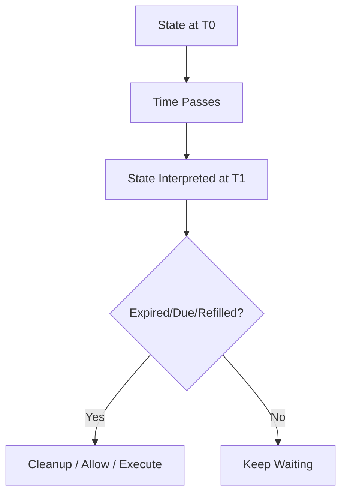
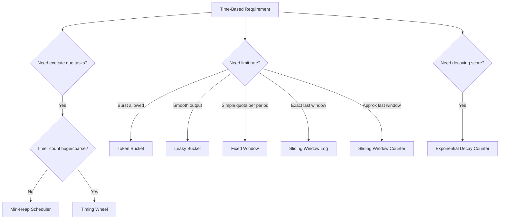
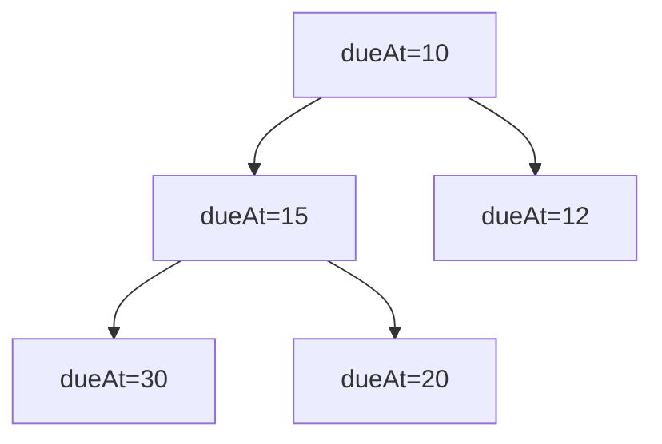
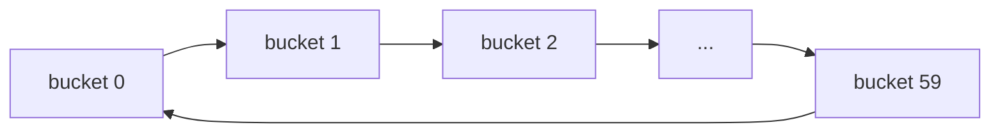
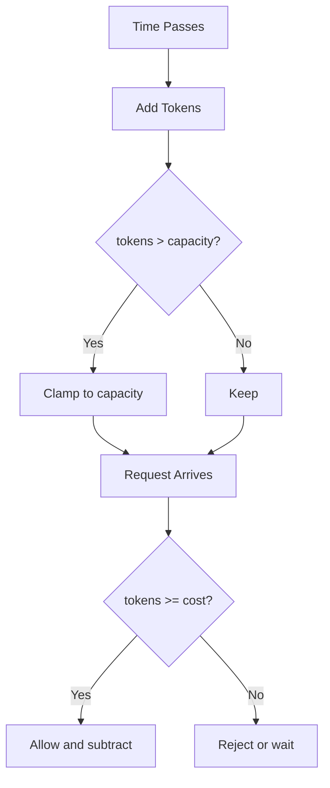

# learn-go-data-structure-algorithm-part-025.md

# Part 025 — Time, Scheduling, Rate Limiting, dan Window Algorithms

> Seri: `learn-go-data-structure-algorithm`  
> Bagian: `025 / 034`  
> Target pembaca: Java software engineer yang ingin menguasai Go data structure & algorithm sampai level production-grade  
> Fokus: struktur data dan algoritma berbasis waktu: scheduler, timer heap, timing wheel, token bucket, leaky bucket, fixed/sliding window, rolling log, exponential decay, retry/backoff queue, fairness, dan desain Go yang aman untuk production

---

## Daftar Isi

- [1. Tujuan Part Ini](#1-tujuan-part-ini)
- [2. Kenapa Waktu Membuat Struktur Data Lebih Sulit](#2-kenapa-waktu-membuat-struktur-data-lebih-sulit)
- [3. Time Model di Go untuk Algoritma](#3-time-model-di-go-untuk-algoritma)
- [4. Taxonomy Time-Based Algorithms](#4-taxonomy-time-based-algorithms)
- [5. Min-Heap Scheduler](#5-min-heap-scheduler)
- [6. Retry Queue dan Exponential Backoff](#6-retry-queue-dan-exponential-backoff)
- [7. Timing Wheel dan Bucketed Time](#7-timing-wheel-dan-bucketed-time)
- [8. Token Bucket Rate Limiter](#8-token-bucket-rate-limiter)
- [9. Leaky Bucket](#9-leaky-bucket)
- [10. Fixed Window Counter](#10-fixed-window-counter)
- [11. Sliding Window Log](#11-sliding-window-log)
- [12. Sliding Window Counter / Weighted Window](#12-sliding-window-counter--weighted-window)
- [13. Exponential Decay Counter](#13-exponential-decay-counter)
- [14. Fairness dan Multi-Key Limiting](#14-fairness-dan-multi-key-limiting)
- [15. Distributed Rate Limiting: Batasan dan Trade-Off](#15-distributed-rate-limiting-batasan-dan-trade-off)
- [16. Go API Design](#16-go-api-design)
- [17. Testing Strategy](#17-testing-strategy)
- [18. Benchmarking Strategy](#18-benchmarking-strategy)
- [19. Production Case Studies](#19-production-case-studies)
- [20. Anti-Patterns](#20-anti-patterns)
- [21. Latihan Bertahap](#21-latihan-bertahap)
- [22. Ringkasan](#22-ringkasan)
- [23. Referensi](#23-referensi)

---

## 1. Tujuan Part Ini

Banyak sistem backend bukan hanya menyimpan data, tetapi juga mengatur **kapan** sesuatu boleh terjadi.

Contoh:

```text
Request user ini boleh diproses sekarang atau harus ditolak?
Job retry berikutnya kapan?
Task mana yang due paling awal?
Berapa banyak request dalam 1 menit terakhir?
Apakah worker harus menunggu agar tidak melebihi 250 request/minute?
Bagaimana mencegah satu tenant menghabiskan seluruh kapasitas?
Bagaimana menghitung event rate tanpa menyimpan semua event?
```

Ini membutuhkan struktur data berbasis waktu:

- priority queue by due time,
- timer heap,
- timing wheel,
- token bucket,
- leaky bucket,
- fixed window counter,
- sliding window log,
- sliding window counter,
- exponential decay counter,
- backoff queue.

Part ini tidak mengulang materi concurrency. Fokusnya adalah **model data dan algoritma**. Tetapi karena time-based structure hampir selalu dipakai di sistem concurrent, kita akan tetap menandai invariants dan race-prone areas.

---

## 2. Kenapa Waktu Membuat Struktur Data Lebih Sulit

### 2.1. Data Structure Tanpa Waktu

Map biasa:

```text
key -> value
```

Query:

```text
apakah key ada?
```

State berubah hanya ketika ada operasi eksplisit.

---

### 2.2. Data Structure Dengan Waktu

TTL cache:

```text
key -> value, expiresAt
```

Query:

```text
apakah key ada DAN belum expired pada waktu now?
```

State berubah bukan hanya karena operasi, tetapi juga karena waktu berjalan.

Ini mengubah model:

```text
validity = function(state, now)
```

---

### 2.3. Time-Dependent Invariants

Contoh invariant scheduler:

```text
heap root adalah task dengan dueAt paling awal.
Task boleh dieksekusi jika dueAt <= now.
```

Contoh invariant token bucket:

```text
tokens tidak boleh lebih dari capacity.
tokens bertambah proporsional dengan elapsed time.
tokens berkurang ketika request diterima.
```

Contoh invariant sliding window:

```text
hanya event dengan timestamp > now - window yang dihitung.
```

---

### 2.4. Diagram Time-Based State



---

### 2.5. Time Makes Bugs Subtle

Common bugs:

- memakai wall clock untuk duration measurement,
- tidak handle clock jump,
- boundary salah: `<=` vs `<`,
- burst terlalu besar,
- cleanup tidak jalan,
- expired item masih dihitung,
- retry storm,
- unfairness antar key,
- distributed limiter tidak konsisten,
- time.Now sulit diuji jika tidak diinjeksi.

---

## 3. Time Model di Go untuk Algoritma

### 3.1. `time.Time` dan `time.Duration`

Go menyediakan:

```go
time.Time
time.Duration
```

`time.Duration` adalah durasi berbasis nanosecond.

Untuk algoritma:

- gunakan `time.Duration` untuk interval,
- gunakan `time.Time` untuk timestamp,
- injeksikan clock untuk testability.

---

### 3.2. Monotonic Clock

`time.Time` di Go dapat membawa monotonic clock reading ketika dibuat dari `time.Now()`.

Operasi seperti:

```go
elapsed := now.Sub(previous)
```

dapat memakai monotonic component jika tersedia.

Rule praktis:

```text
Untuk mengukur elapsed duration, gunakan time.Now() dan Sub.
Untuk persist/serialize timestamp, monotonic component tidak ikut.
```

---

### 3.3. Jangan Pakai Unix Time untuk Semua Hal

Buruk untuk elapsed:

```go
elapsed := time.Now().Unix() - previousUnix
```

Masalah:

- precision rendah,
- wall clock bisa berubah,
- leap/clock adjustment,
- testability buruk.

Lebih baik:

```go
elapsed := now.Sub(previous)
```

---

### 3.4. Clock Injection

```go
type Clock interface {
	Now() time.Time
}

type RealClock struct{}

func (RealClock) Now() time.Time {
	return time.Now()
}
```

Fake clock:

```go
type FakeClock struct {
	now time.Time
}

func NewFakeClock(t time.Time) *FakeClock {
	return &FakeClock{now: t}
}

func (c *FakeClock) Now() time.Time {
	return c.now
}

func (c *FakeClock) Advance(d time.Duration) {
	c.now = c.now.Add(d)
}
```

Clock injection membuat testing deterministic.

---

### 3.5. Boundary Convention

Untuk window, gunakan convention eksplisit.

Contoh window terakhir 1 menit pada `now`:

```text
(now - 1 minute, now]
```

atau:

```text
[now - 1 minute, now)
```

Pilih satu.

Dalam kode, half-open biasanya lebih mudah:

```text
[start, end)
```

Event valid jika:

```go
!eventTime.Before(start) && eventTime.Before(end)
```

Untuk limiter yang mengecek "last window up to now", sering lebih praktis:

```text
eventTime.After(now-window)
```

Tetapi harus konsisten.

---

## 4. Taxonomy Time-Based Algorithms

### 4.1. Keluarga Utama

| Problem | Struktur/Algoritma |
|---|---|
| Ambil task due paling awal | Min-heap scheduler |
| Banyak timer dengan coarse precision | Timing wheel |
| Rate per key dengan burst | Token bucket |
| Smooth output rate | Leaky bucket |
| Count per fixed period | Fixed window counter |
| Exact events in last N duration | Sliding window log |
| Approx smoother sliding limit | Sliding window counter |
| Decaying signal / score | Exponential decay |
| Retry after failure | Priority queue + backoff |
| Fair multi-tenant scheduling | Queue per tenant + fairness policy |

---

### 4.2. Decision Diagram



---

### 4.3. Correctness Axes

Untuk setiap algoritma berbasis waktu, tentukan:

```text
time source
window boundary
burst semantics
capacity
cleanup policy
clock jump handling
distributed or local
fairness
memory bound
```

---

## 5. Min-Heap Scheduler

### 5.1. Mental Model

Scheduler menyimpan task berdasarkan `dueAt`.

Min-heap menjamin:

```text
root = task dengan dueAt paling kecil
```

Operasi:

```text
Schedule(task, dueAt) -> push O(log n)
PeekDue(now)          -> check root O(1)
PopDue(now)           -> pop O(log n)
```

---

### 5.2. Diagram



Root selalu due paling awal.

---

### 5.3. Task Type

```go
package timealgo

import "time"

type TaskID string

type ScheduledTask[T any] struct {
	ID    TaskID
	DueAt time.Time
	Value T
	index int
}
```

---

### 5.4. Heap Implementation

```go
type taskHeap[T any] []*ScheduledTask[T]

func (h taskHeap[T]) Len() int {
	return len(h)
}

func (h taskHeap[T]) Less(i, j int) bool {
	return h[i].DueAt.Before(h[j].DueAt)
}

func (h taskHeap[T]) Swap(i, j int) {
	h[i], h[j] = h[j], h[i]
	h[i].index = i
	h[j].index = j
}

func (h *taskHeap[T]) Push(x any) {
	t := x.(*ScheduledTask[T])
	t.index = len(*h)
	*h = append(*h, t)
}

func (h *taskHeap[T]) Pop() any {
	old := *h
	n := len(old)
	t := old[n-1]
	t.index = -1
	*h = old[:n-1]
	return t
}
```

---

### 5.5. Scheduler

```go
import "container/heap"

type Scheduler[T any] struct {
	h taskHeap[T]
}

func NewScheduler[T any]() *Scheduler[T] {
	s := &Scheduler[T]{}
	heap.Init(&s.h)
	return s
}

func (s *Scheduler[T]) Schedule(id TaskID, dueAt time.Time, value T) {
	heap.Push(&s.h, &ScheduledTask[T]{
		ID:    id,
		DueAt: dueAt,
		Value: value,
	})
}

func (s *Scheduler[T]) Len() int {
	return s.h.Len()
}

func (s *Scheduler[T]) Peek() (*ScheduledTask[T], bool) {
	if s.h.Len() == 0 {
		return nil, false
	}
	return s.h[0], true
}

func (s *Scheduler[T]) PopDue(now time.Time) (*ScheduledTask[T], bool) {
	if s.h.Len() == 0 {
		return nil, false
	}

	if s.h[0].DueAt.After(now) {
		return nil, false
	}

	t := heap.Pop(&s.h).(*ScheduledTask[T])
	return t, true
}
```

---

### 5.6. Stable Ordering for Same Due Time

If same `DueAt`, heap order may be nondeterministic.

Add sequence:

```go
type ScheduledTask[T any] struct {
	ID       TaskID
	DueAt    time.Time
	Seq      uint64
	Value    T
	index    int
}
```

Comparator:

```go
func (h taskHeap[T]) Less(i, j int) bool {
	if h[i].DueAt.Equal(h[j].DueAt) {
		return h[i].Seq < h[j].Seq
	}
	return h[i].DueAt.Before(h[j].DueAt)
}
```

This improves determinism and fairness.

---

### 5.7. Cancellation and Reschedule

Cancellation by ID needs map:

```text
map[TaskID]*ScheduledTask
```

Then:

- remove from heap with `heap.Remove`,
- update dueAt with `heap.Fix`.

Caveat:

- duplicate task IDs must be defined,
- stale heap entries can be simpler than remove/fix.

---

### 5.8. Stale Entry Pattern

Instead of removing old entry:

```text
schedule new version
mark old version stale through generation
ignore stale when popped
```

Useful when update/cancel is frequent and heap.Remove complexity/state is annoying.

Trade-off:

- heap can contain garbage until popped,
- memory can grow if many reschedules far in future,
- need cleanup/compaction.

---

## 6. Retry Queue dan Exponential Backoff

### 6.1. Problem

When task fails, retry later.

Naive immediate retry:

```text
failure -> retry now -> failure -> retry now -> storm
```

Backoff:

```text
retry after increasing delay
```

---

### 6.2. Exponential Backoff

Formula:

```text
delay = base * multiplier^attempt
delay capped at maxDelay
```

Example:

```text
250ms, 500ms, 1s, 2s, 4s, max 30s
```

---

### 6.3. Jitter

Without jitter, many clients retry at same time.

Add randomness:

```text
delay = random between 0 and computedDelay
```

or bounded jitter:

```text
delay = computedDelay +/- random fraction
```

For production, jitter is often essential.

---

### 6.4. Backoff Function

```go
import (
	"math"
	"math/rand/v2"
	"time"
)

type BackoffConfig struct {
	Base       time.Duration
	Max        time.Duration
	Multiplier float64
	Jitter     float64
}

func NextBackoff(attempt int, cfg BackoffConfig, rng *rand.Rand) time.Duration {
	if attempt < 0 {
		attempt = 0
	}
	if cfg.Base <= 0 {
		cfg.Base = 100 * time.Millisecond
	}
	if cfg.Max <= 0 {
		cfg.Max = 30 * time.Second
	}
	if cfg.Multiplier < 1 {
		cfg.Multiplier = 2
	}

	delayFloat := float64(cfg.Base) * math.Pow(cfg.Multiplier, float64(attempt))
	if delayFloat > float64(cfg.Max) {
		delayFloat = float64(cfg.Max)
	}

	delay := time.Duration(delayFloat)

	if cfg.Jitter > 0 && rng != nil {
		if cfg.Jitter > 1 {
			cfg.Jitter = 1
		}
		spread := float64(delay) * cfg.Jitter
		offset := (rng.Float64()*2 - 1) * spread
		delay = time.Duration(float64(delay) + offset)
		if delay < 0 {
			delay = 0
		}
	}

	return delay
}
```

---

### 6.5. Retry Task

```go
type RetryTask[T any] struct {
	ID      TaskID
	Payload T
	Attempt int
}
```

On failure:

```go
delay := NextBackoff(task.Attempt, cfg, rng)
task.Attempt++
scheduler.Schedule(task.ID, now.Add(delay), task)
```

---

### 6.6. Retry Budget

Backoff alone is not enough.

Need:

- max attempts,
- max elapsed time,
- retryable vs non-retryable error,
- dead-letter queue,
- idempotency,
- observability.

---

### 6.7. Invariant

```text
A retry task must not be scheduled earlier than now + backoff.
A task must not exceed max attempts.
Non-retryable errors must not be retried.
```

---

## 7. Timing Wheel dan Bucketed Time

### 7.1. Problem with Heap

Heap is good general-purpose scheduler:

```text
insert O(log n)
pop O(log n)
```

But for millions of timers with coarse precision, heap overhead can be high.

Timing wheel uses buckets.

---

### 7.2. Mental Model

A timing wheel is circular array of buckets.

```text
tick duration = 100ms
wheel size = 60
covers 6 seconds per round
```

Each tick:

- process current bucket,
- move pointer,
- execute due tasks or decrement rounds.

---

### 7.3. Diagram



---

### 7.4. When Timing Wheel Fits

Good:

- many timers,
- coarse precision acceptable,
- high throughput insert/cancel,
- network timeouts,
- TTL cleanup buckets.

Bad:

- precise ordering required,
- arbitrary long deadlines without hierarchy,
- low timer volume,
- easier heap is enough.

---

### 7.5. Simplified Timing Wheel Entry

```go
type WheelTask[T any] struct {
	ID     TaskID
	Value  T
	Rounds int
}
```

Bucket:

```go
type wheelBucket[T any] []WheelTask[T]
```

---

### 7.6. Simplified Timing Wheel

Educational version:

```go
type TimingWheel[T any] struct {
	tick    time.Duration
	buckets [][]WheelTask[T]
	current int
}

func NewTimingWheel[T any](tick time.Duration, slots int) *TimingWheel[T] {
	if tick <= 0 {
		tick = time.Second
	}
	if slots <= 0 {
		slots = 60
	}
	return &TimingWheel[T]{
		tick:    tick,
		buckets: make([][]WheelTask[T], slots),
	}
}

func (w *TimingWheel[T]) Schedule(id TaskID, delay time.Duration, value T) {
	if delay < 0 {
		delay = 0
	}

	ticks := int(delay / w.tick)
	if delay%w.tick != 0 {
		ticks++
	}

	slotCount := len(w.buckets)
	slot := (w.current + ticks) % slotCount
	rounds := ticks / slotCount

	w.buckets[slot] = append(w.buckets[slot], WheelTask[T]{
		ID:     id,
		Value:  value,
		Rounds: rounds,
	})
}

func (w *TimingWheel[T]) AdvanceOneTick() []WheelTask[T] {
	w.current = (w.current + 1) % len(w.buckets)

	bucket := w.buckets[w.current]
	w.buckets[w.current] = w.buckets[w.current][:0]

	due := make([]WheelTask[T], 0)
	remaining := bucket[:0]

	for _, task := range bucket {
		if task.Rounds <= 0 {
			due = append(due, task)
		} else {
			task.Rounds--
			remaining = append(remaining, task)
		}
	}

	w.buckets[w.current] = append(w.buckets[w.current], remaining...)
	return due
}
```

This is simplified and not a complete production timing wheel.

---

### 7.7. Timing Wheel Production Challenges

- cancellation,
- rescheduling,
- long timers,
- bucket memory,
- tick drift,
- concurrent access,
- hierarchical wheels,
- task execution backpressure,
- ensuring no task is lost on shutdown.

---

## 8. Token Bucket Rate Limiter

### 8.1. Mental Model

Token bucket allows burst up to capacity, then refills at rate.

State:

```text
tokens
capacity
refillRate tokens/second
lastRefill
```

On request cost `n`:

1. refill based on elapsed time,
2. if tokens >= n, allow and subtract,
3. else reject/wait.

---

### 8.2. Diagram



---

### 8.3. Float-Based Token Bucket

```go
type TokenBucket struct {
	capacity   float64
	tokens     float64
	refillRate float64
	last       time.Time
	clock      Clock
}

func NewTokenBucket(capacity, refillRate float64, clock Clock) *TokenBucket {
	if capacity < 0 {
		capacity = 0
	}
	if refillRate < 0 {
		refillRate = 0
	}
	if clock == nil {
		clock = RealClock{}
	}

	now := clock.Now()

	return &TokenBucket{
		capacity:   capacity,
		tokens:     capacity,
		refillRate: refillRate,
		last:       now,
		clock:      clock,
	}
}

func (b *TokenBucket) Allow(cost float64) bool {
	if cost <= 0 {
		return true
	}
	b.refill()

	if b.tokens >= cost {
		b.tokens -= cost
		return true
	}

	return false
}

func (b *TokenBucket) refill() {
	now := b.clock.Now()
	elapsed := now.Sub(b.last)

	if elapsed <= 0 {
		return
	}

	b.tokens += elapsed.Seconds() * b.refillRate
	if b.tokens > b.capacity {
		b.tokens = b.capacity
	}

	b.last = now
}

func (b *TokenBucket) Tokens() float64 {
	b.refill()
	return b.tokens
}
```

---

### 8.4. Integer Token Bucket

Float is simple but can have precision issues.

Integer version:

- use nanoseconds,
- store tokens as fixed-point,
- avoid float drift.

For many backend use cases, float is acceptable if tested. For strict quota/billing, use integer/fixed-point.

---

### 8.5. Wait Time

Instead of reject, calculate delay.

```go
func (b *TokenBucket) ReserveDelay(cost float64) (time.Duration, bool) {
	if cost <= 0 {
		return 0, true
	}
	if cost > b.capacity {
		return 0, false
	}

	b.refill()

	if b.tokens >= cost {
		b.tokens -= cost
		return 0, true
	}

	missing := cost - b.tokens
	delaySeconds := missing / b.refillRate
	delay := time.Duration(delaySeconds * float64(time.Second))

	b.tokens = 0
	b.last = b.clock.Now().Add(delay)

	return delay, true
}
```

Caveat:

- this mutates future availability,
- cancellation must be handled if caller does not wait,
- reservations need cancel support for production.

---

### 8.6. Token Bucket Use Cases

Good:

- API request rate limit with burst,
- worker dispatch rate,
- external service quota,
- per-tenant limiter,
- per-key abuse throttling.

Bad:

- exact sliding count,
- fairness by itself,
- distributed exact quota without coordination.

---

## 9. Leaky Bucket

### 9.1. Mental Model

Leaky bucket smooths output rate.

Requests enter queue/bucket; bucket leaks at constant rate.

If bucket full, reject.

Where token bucket allows bursts, leaky bucket enforces smoother processing.

---

### 9.2. Conceptual State

```text
queue length / water level
leak rate
capacity
last update
```

---

### 9.3. Simple Leaky Bucket

```go
type LeakyBucket struct {
	capacity float64
	level    float64
	leakRate float64
	last     time.Time
	clock    Clock
}

func NewLeakyBucket(capacity, leakRate float64, clock Clock) *LeakyBucket {
	if clock == nil {
		clock = RealClock{}
	}
	now := clock.Now()
	return &LeakyBucket{
		capacity: capacity,
		leakRate: leakRate,
		last:     now,
		clock:    clock,
	}
}

func (b *LeakyBucket) Allow(cost float64) bool {
	if cost <= 0 {
		return true
	}
	b.leak()

	if b.level+cost > b.capacity {
		return false
	}

	b.level += cost
	return true
}

func (b *LeakyBucket) leak() {
	now := b.clock.Now()
	elapsed := now.Sub(b.last)
	if elapsed <= 0 {
		return
	}

	b.level -= elapsed.Seconds() * b.leakRate
	if b.level < 0 {
		b.level = 0
	}
	b.last = now
}
```

---

### 9.4. Token Bucket vs Leaky Bucket

| Feature | Token Bucket | Leaky Bucket |
|---|---|---|
| Burst | Allows up to capacity | Smooths/limits queue |
| State | available tokens | backlog level |
| Good for | rate limit with burst | shaping traffic |
| Reject when | not enough tokens | bucket overflow |
| Mental model | credit | queue/backlog |

---

## 10. Fixed Window Counter

### 10.1. Mental Model

Count requests in fixed period.

Example:

```text
max 100 requests per minute
```

Window:

```text
12:00:00 - 12:00:59
12:01:00 - 12:01:59
```

---

### 10.2. Implementation

```go
type FixedWindowLimiter struct {
	limit       int64
	window      time.Duration
	windowStart time.Time
	count       int64
	clock       Clock
}

func NewFixedWindowLimiter(limit int64, window time.Duration, clock Clock) *FixedWindowLimiter {
	if clock == nil {
		clock = RealClock{}
	}
	now := clock.Now()
	return &FixedWindowLimiter{
		limit:       limit,
		window:      window,
		windowStart: truncateTime(now, window),
		clock:       clock,
	}
}

func truncateTime(t time.Time, d time.Duration) time.Time {
	if d <= 0 {
		return t
	}
	return t.Truncate(d)
}

func (l *FixedWindowLimiter) Allow(cost int64) bool {
	if cost <= 0 {
		return true
	}
	now := l.clock.Now()
	start := truncateTime(now, l.window)

	if !start.Equal(l.windowStart) {
		l.windowStart = start
		l.count = 0
	}

	if l.count+cost > l.limit {
		return false
	}

	l.count += cost
	return true
}
```

---

### 10.3. Boundary Burst Problem

Fixed window allows boundary burst.

Example limit 100/min:

```text
100 requests at 12:00:59
100 requests at 12:01:00
```

Within 1 real second, 200 requests pass.

If unacceptable, use sliding window or token bucket.

---

### 10.4. Use Cases

Good:

- simple quota per calendar bucket,
- reporting counters,
- low-risk throttling,
- simple distributed counter with Redis-like expiry.

Bad:

- strict rolling rate,
- abuse prevention sensitive to boundary burst,
- fairness-critical systems.

---

## 11. Sliding Window Log

### 11.1. Mental Model

Keep timestamps of events in last window.

On request:

1. remove old timestamps,
2. if count < limit, allow and append now,
3. else reject.

Exact rolling window.

---

### 11.2. Implementation with Ring-like Slice

```go
type SlidingWindowLog struct {
	limit  int
	window time.Duration
	times  []time.Time
	head   int
	clock  Clock
}

func NewSlidingWindowLog(limit int, window time.Duration, clock Clock) *SlidingWindowLog {
	if clock == nil {
		clock = RealClock{}
	}
	return &SlidingWindowLog{
		limit:  limit,
		window: window,
		times:  make([]time.Time, 0, limit),
		clock:  clock,
	}
}

func (l *SlidingWindowLog) Allow() bool {
	now := l.clock.Now()
	cutoff := now.Add(-l.window)

	for l.head < len(l.times) && !l.times[l.head].After(cutoff) {
		l.head++
	}

	if len(l.times)-l.head >= l.limit {
		l.compactIfNeeded()
		return false
	}

	l.times = append(l.times, now)
	l.compactIfNeeded()
	return true
}

func (l *SlidingWindowLog) compactIfNeeded() {
	if l.head > 0 && l.head*2 >= len(l.times) {
		copy(l.times, l.times[l.head:])
		l.times = l.times[:len(l.times)-l.head]
		l.head = 0
	}
}
```

---

### 11.3. Complexity

Amortized:

```text
Allow: O(1)
Memory: O(limit)
```

Because each timestamp is appended once and removed once.

---

### 11.4. Exact but Memory Heavy

For each key, memory O(limit).

If:

```text
1 million users * 100 timestamps
```

memory can be large.

Use sliding counter/token bucket for approximate/lighter behavior.

---

## 12. Sliding Window Counter / Weighted Window

### 12.1. Mental Model

Approximate rolling count by blending current and previous fixed windows.

State:

```text
current window count
previous window count
current window start
```

Estimate:

```text
estimated = current + previous * overlapRatio
```

If halfway through current window, previous contributes 50%.

---

### 12.2. Implementation

```go
type SlidingWindowCounter struct {
	limit      float64
	window     time.Duration
	start      time.Time
	current    float64
	previous   float64
	clock      Clock
}

func NewSlidingWindowCounter(limit float64, window time.Duration, clock Clock) *SlidingWindowCounter {
	if clock == nil {
		clock = RealClock{}
	}
	now := clock.Now()
	return &SlidingWindowCounter{
		limit:  limit,
		window: window,
		start:  now.Truncate(window),
		clock:  clock,
	}
}

func (c *SlidingWindowCounter) Allow(cost float64) bool {
	if cost <= 0 {
		return true
	}

	now := c.clock.Now()
	c.advance(now)

	estimate := c.estimate(now)
	if estimate+cost > c.limit {
		return false
	}

	c.current += cost
	return true
}

func (c *SlidingWindowCounter) advance(now time.Time) {
	if c.window <= 0 {
		return
	}

	elapsed := now.Sub(c.start)
	if elapsed < c.window {
		return
	}

	windowsPassed := int(elapsed / c.window)

	if windowsPassed == 1 {
		c.previous = c.current
	} else {
		c.previous = 0
	}

	c.current = 0
	c.start = c.start.Add(time.Duration(windowsPassed) * c.window)
}

func (c *SlidingWindowCounter) estimate(now time.Time) float64 {
	if c.window <= 0 {
		return c.current
	}

	elapsed := now.Sub(c.start)
	if elapsed < 0 {
		elapsed = 0
	}
	if elapsed > c.window {
		elapsed = c.window
	}

	remainingRatio := float64(c.window-elapsed) / float64(c.window)
	return c.current + c.previous*remainingRatio
}
```

---

### 12.3. Trade-Off

Pros:

- lower memory than sliding log,
- smoother than fixed window,
- O(1).

Cons:

- approximate,
- can under/over-estimate depending distribution,
- boundary semantics less intuitive.

---

## 13. Exponential Decay Counter

### 13.1. Mental Model

Sometimes we want recent events to matter more than old events.

Score decays over time:

```text
score(t) = score(previous) * e^(-lambda * elapsed) + newValue
```

Use cases:

- abuse score,
- hotness score,
- adaptive admission,
- traffic trend,
- anomaly signal.

---

### 13.2. Implementation

```go
type DecayCounter struct {
	value  float64
	halflife time.Duration
	last   time.Time
	clock  Clock
}

func NewDecayCounter(halflife time.Duration, clock Clock) *DecayCounter {
	if clock == nil {
		clock = RealClock{}
	}
	return &DecayCounter{
		halflife: halflife,
		last:     clock.Now(),
		clock:    clock,
	}
}

func (c *DecayCounter) Add(x float64) {
	c.decay()
	c.value += x
}

func (c *DecayCounter) Value() float64 {
	c.decay()
	return c.value
}

func (c *DecayCounter) decay() {
	now := c.clock.Now()
	elapsed := now.Sub(c.last)
	if elapsed <= 0 {
		return
	}

	if c.halflife <= 0 {
		c.value = 0
		c.last = now
		return
	}

	factor := math.Pow(0.5, float64(elapsed)/float64(c.halflife))
	c.value *= factor
	c.last = now
}
```

---

### 13.3. Half-Life

Half-life means:

```text
after one halflife, score becomes half
```

This is easier to reason about than raw lambda.

---

### 13.4. Caveats

- floating point precision,
- not exact event count,
- harder to explain to non-technical stakeholders,
- not suitable for exact quota,
- clock behavior matters.

---

## 14. Fairness dan Multi-Key Limiting

### 14.1. Per-Key Limiters

Most production rate limiters are keyed:

```text
userID
tenantID
IP
API key
route
method
region
```

Map:

```go
map[K]*TokenBucket
```

Problem:

- map grows unbounded,
- inactive keys remain,
- cleanup needed.

---

### 14.2. Multi-Key Limiter

```go
type KeyedTokenLimiter[K comparable] struct {
	buckets map[K]*TokenBucket
	capacity float64
	rate     float64
	clock    Clock
}

func NewKeyedTokenLimiter[K comparable](capacity, rate float64, clock Clock) *KeyedTokenLimiter[K] {
	if clock == nil {
		clock = RealClock{}
	}
	return &KeyedTokenLimiter[K]{
		buckets:  make(map[K]*TokenBucket),
		capacity: capacity,
		rate:     rate,
		clock:    clock,
	}
}

func (l *KeyedTokenLimiter[K]) Allow(key K, cost float64) bool {
	b := l.buckets[key]
	if b == nil {
		b = NewTokenBucket(l.capacity, l.rate, l.clock)
		l.buckets[key] = b
	}
	return b.Allow(cost)
}
```

Needs eviction/TTL for inactive buckets.

---

### 14.3. Hierarchical Limits

Often need multiple limits:

```text
global limit
tenant limit
user limit
route limit
```

Request allowed only if all allow.

But order matters if `Allow` mutates.

Bad:

```text
global consumes token, tenant later rejects
```

Need reservation/cancel or check-then-commit.

Simpler but conservative:

- check all with dry-run,
- commit all if pass,
- implement `Reserve` with cancel.

---

### 14.4. Fair Scheduling

If multiple tenants have queued work, FIFO can be unfair.

Options:

- round-robin per tenant,
- weighted round-robin,
- deficit round-robin,
- priority queue by virtual finish time.

This belongs to scheduling, not just rate limiting.

---

### 14.5. Deficit Round Robin Intuition

Each tenant gets quantum.

```text
deficit[tenant] += quantum
while tenant queue head cost <= deficit:
    run task
    deficit -= cost
```

Good for variable cost tasks and fairness.

---

## 15. Distributed Rate Limiting: Batasan dan Trade-Off

### 15.1. Local Limiter

Each instance has local limiter.

Pros:

- fast,
- no network call,
- resilient.

Cons:

- global limit approximate,
- total allowed = instances * local limit unless divided.

---

### 15.2. Centralized Limiter

Use shared store/service.

Pros:

- global consistency better.

Cons:

- network latency,
- availability dependency,
- hotspot,
- fail-open/fail-closed decision.

---

### 15.3. Sharded Distributed Limiter

Keys distributed across shards.

Pros:

- scalable.

Cons:

- cross-key/global limit harder,
- rebalancing,
- partial failure.

---

### 15.4. Token Preallocation

Central authority gives each node token budget periodically.

Pros:

- fewer central calls,
- bounded approximate global usage.

Cons:

- unused tokens,
- burst mismatch,
- complexity.

---

### 15.5. Production Decision

Ask:

```text
Is global exactness required?
What happens if limiter store is down?
Can system fail open?
Can users tolerate false reject?
Is limit for protection or billing/compliance?
```

For protection, approximate local limiter may be fine. For billing/compliance, exact accounting is needed elsewhere.

---

## 16. Go API Design

### 16.1. Limiter Interface

```go
type Limiter interface {
	Allow() bool
}
```

Weighted:

```go
type WeightedLimiter interface {
	AllowN(n int) bool
}
```

With delay:

```go
type DelayLimiter interface {
	ReserveN(n int) (delay time.Duration, ok bool)
}
```

---

### 16.2. Scheduler Interface

```go
type TimeScheduler[T any] interface {
	Schedule(id TaskID, dueAt time.Time, value T)
	PopDue(now time.Time) (*ScheduledTask[T], bool)
	Len() int
}
```

---

### 16.3. Context-Aware Waiting

A blocking wait API should accept context.

```go
func Wait(ctx context.Context, d time.Duration) error {
	timer := time.NewTimer(d)
	defer timer.Stop()

	select {
	case <-ctx.Done():
		return ctx.Err()
	case <-timer.C:
		return nil
	}
}
```

Import:

```go
import "context"
```

---

### 16.4. Do Not Sleep Inside Data Structure by Default

A limiter data structure should usually calculate allow/delay.

The caller decides:

- reject,
- wait,
- queue,
- retry later.

This keeps structure composable.

---

### 16.5. Observability

Expose stats:

```text
allowed
rejected
delayed
queued
executed
expired
retryScheduled
maxQueueDepth
tokensAvailable
activeKeys
```

Do not log every reject in hot path; use metrics.

---

## 17. Testing Strategy

### 17.1. Fake Clock Tests

Never rely on real sleep for algorithm tests.

Bad:

```go
time.Sleep(time.Second)
```

Better:

```go
clock.Advance(time.Second)
```

---

### 17.2. Token Bucket Test

```go
func TestTokenBucketRefill(t *testing.T) {
	start := time.Unix(1000, 0)
	clock := NewFakeClock(start)

	b := NewTokenBucket(10, 1, clock)

	for i := 0; i < 10; i++ {
		if !b.Allow(1) {
			t.Fatalf("expected allow %d", i)
		}
	}

	if b.Allow(1) {
		t.Fatalf("expected reject")
	}

	clock.Advance(5 * time.Second)

	if !b.Allow(5) {
		t.Fatalf("expected refill allow")
	}

	if b.Allow(1) {
		t.Fatalf("expected no more token")
	}
}
```

---

### 17.3. Fixed Window Boundary Test

Test boundary burst intentionally.

```text
allow at end of window
allow at start of next window
```

This documents behavior.

---

### 17.4. Sliding Log Test

Test:

- exactly limit events allowed,
- next rejected,
- after window passes, allowed,
- boundary event expiration.

---

### 17.5. Scheduler Test

Test:

- pop due order,
- not pop future,
- equal time stable order if sequence used,
- reschedule/cancel if supported,
- stale entry ignored.

---

### 17.6. Backoff Test

Test:

- increasing delay,
- cap applied,
- jitter within bounds,
- non-retryable not scheduled,
- max attempts.

Use deterministic RNG seed.

---

## 18. Benchmarking Strategy

### 18.1. Benchmark Hot Path

For limiters:

```text
Allow should be fast and allocation-free.
```

Benchmark:

- allowed path,
- rejected path,
- refill path,
- many keys,
- same hot key,
- concurrent access if locked wrapper.

---

### 18.2. Benchmark Scheduler

Workloads:

- insert N tasks,
- pop all due,
- mixed schedule/pop,
- many reschedules,
- stale entry cleanup,
- equal due time.

Heap performance depends on N and operation mix.

---

### 18.3. Benchmark Sliding Log

Test memory and cost as limit grows.

Sliding log memory O(limit) per key.

---

### 18.4. `b.RunParallel`

For concurrent limiter wrappers:

```go
func BenchmarkTokenBucketAllow(b *testing.B) {
	clock := RealClock{}
	tb := NewTokenBucket(1000, 1000, clock)

	b.ReportAllocs()
	b.RunParallel(func(pb *testing.PB) {
		for pb.Next() {
			tb.Allow(1)
		}
	})
}
```

But this version is not thread-safe. For real parallel benchmark, wrap with mutex or design atomic limiter.

---

## 19. Production Case Studies

### 19.1. External API Rate Limit

Requirement:

```text
Max 300 requests/minute to external API.
Need avoid bursts beyond provider limit.
```

Options:

- token bucket with rate 5/sec and capacity maybe 5-20,
- worker pool dispatches only when allowed,
- centralized limiter if multiple app instances share same credential.

If provider rate limit is hard global across instances, local limiter per pod can exceed total.

---

### 19.2. Retry Scheduler for Failed Jobs

Requirement:

```text
Failed jobs retried with exponential backoff.
```

Use:

- min-heap scheduler by dueAt,
- max attempts,
- jitter,
- dead-letter,
- idempotent job execution.

Avoid immediate retry loops.

---

### 19.3. Login Attempt Limiter

Requirement:

```text
Limit failed login attempts per user/IP.
```

Use:

- sliding window log for exact small limit,
- fixed window if simple,
- token bucket for smoother behavior,
- key includes user and IP dimensions.

Caution:

- user enumeration,
- NAT/shared IP,
- distributed consistency,
- lockout abuse.

---

### 19.4. Per-Tenant Fair Worker

Requirement:

```text
Many tenants submit jobs.
No tenant should starve others.
```

Use:

- queue per tenant,
- round-robin or deficit round-robin,
- global worker pool,
- per-tenant rate limiter.

FIFO global queue can be unfair.

---

### 19.5. Abuse Score

Requirement:

```text
Recent bad events should matter more.
Old events should fade.
```

Use:

- exponential decay counter,
- threshold decisions,
- exact audit log retained separately.

Do not use decayed score as only evidence for irreversible action.

---

### 19.6. TTL Cleanup

Requirement:

```text
Millions of sessions expire.
```

Options:

- min-heap if precise expiry needed,
- timing wheel/buckets if coarse expiry acceptable,
- lazy expiration if access-driven,
- background cleanup with budget.

Cleanup must not pause service for too long.

---

## 20. Anti-Patterns

### 20.1. Real Sleep in Unit Tests

Slow and flaky.

Use fake clock.

---

### 20.2. Wall Clock for Elapsed Time

Use `time.Sub` with values from `time.Now()` to benefit from monotonic component.

---

### 20.3. Unbounded Per-Key Limiters

```go
map[userID]*Limiter
```

without cleanup becomes memory leak.

---

### 20.4. Local Limiter Treated as Global

If 10 instances each allow 100/s, global can be 1000/s.

---

### 20.5. Fixed Window for Strict Rolling Limit

Fixed window permits boundary burst.

---

### 20.6. Retrying Non-Retryable Errors

Backoff does not fix invalid input or permanent failure.

---

### 20.7. No Jitter

Many clients retry simultaneously, causing synchronized storm.

---

### 20.8. Sleeping While Holding Lock

Bad:

```go
mu.Lock()
time.Sleep(delay)
mu.Unlock()
```

Blocks unrelated operations.

---

### 20.9. Timer Leak

Creating timers in loop without stopping/draining correctly can leak resources.

Use timer carefully or simpler caller-managed sleep.

---

## 21. Latihan Bertahap

### 21.1. Level 1 — Clock and Scheduler

Implement:

1. `Clock`,
2. `FakeClock`,
3. min-heap scheduler,
4. stable ordering with sequence,
5. cancellation by ID.

---

### 21.2. Level 2 — Backoff Queue

Implement:

1. exponential backoff,
2. max delay,
3. jitter,
4. retry task,
5. dead-letter after max attempts.

---

### 21.3. Level 3 — Rate Limiters

Implement:

1. token bucket,
2. leaky bucket,
3. fixed window,
4. sliding window log,
5. sliding window counter.

Compare behavior with same input timeline.

---

### 21.4. Level 4 — Multi-Key Limiter

Implement:

1. per-key limiter,
2. cleanup inactive key,
3. max active keys,
4. sharding with locks,
5. metrics.

---

### 21.5. Level 5 — Fair Scheduler

Implement:

1. queue per tenant,
2. round-robin,
3. weighted round-robin,
4. deficit round-robin,
5. benchmark fairness.

---

### 21.6. Level 6 — Production Exercise

Design external API dispatcher:

```text
Limit: 300/minute
Burst: max 10
Retries: exponential backoff with jitter
Multiple workers
Per-tenant fairness
Observable metrics
Graceful shutdown
```

Deliver:

- data structures,
- invariants,
- failure modes,
- tests,
- benchmark plan.

---

## 22. Ringkasan

Time-based algorithms combine data structures with temporal semantics.

Key takeaways:

- Min-heap scheduler:
  - best general-purpose due-time queue,
  - O(log n) insert/pop,
  - deterministic ordering needs sequence.

- Retry queue:
  - scheduler + backoff + jitter + retry budget,
  - prevents retry storm.

- Timing wheel:
  - high-scale coarse timer structure,
  - faster for many timers,
  - more complex.

- Token bucket:
  - rate limit with burst,
  - good default for API limiting.

- Leaky bucket:
  - smooths output rate,
  - models backlog.

- Fixed window:
  - simple but boundary burst.

- Sliding window log:
  - exact rolling window,
  - memory O(limit) per key.

- Sliding window counter:
  - approximate rolling window,
  - O(1) memory.

- Exponential decay:
  - recent events matter more,
  - not exact count.

Production mental model:

```text
Whenever time is part of the structure, define:
- time source,
- boundary semantics,
- cleanup behavior,
- capacity,
- fairness,
- distributed consistency,
- failure mode.
```

---

## 23. Referensi

Referensi utama yang relevan untuk part ini:

- Go 1.26 Release Notes — `https://go.dev/doc/go1.26`
- Go Release History — `https://go.dev/doc/devel/release`
- Go Language Specification — `https://go.dev/ref/spec`
- Package `time` — `https://pkg.go.dev/time`
- Package `container/heap` — `https://pkg.go.dev/container/heap`
- Package `context` — `https://pkg.go.dev/context`
- Package `sync` — `https://pkg.go.dev/sync`
- Package `math` — `https://pkg.go.dev/math`
- Package `math/rand/v2` — `https://pkg.go.dev/math/rand/v2`
- Package `testing` — `https://pkg.go.dev/testing`

---

# Status Seri

Selesai:

- Part 000 — Roadmap, Mental Model, dan Batasan Seri
- Part 001 — Complexity Model yang Realistis di Go
- Part 002 — Arrays, Slices, dan Sequence Design
- Part 003 — Maps, Hash Tables, dan Associative Data
- Part 004 — Sorting, Ordering, Comparison, dan Search
- Part 005 — Stack, Queue, Deque, dan Worklist Algorithms
- Part 006 — Linked List, Intrusive List, dan Pointer-Chasing Trade-off
- Part 007 — Heap, Priority Queue, dan Scheduling Algorithms
- Part 008 — Sets, Multisets, Bag, dan Membership Models
- Part 009 — Strings, Bytes, Runes, Tokenization, dan Text Algorithms
- Part 010 — Recursion, Iteration, Backtracking, dan State Space Search
- Part 011 — Hashing, Fingerprint, Checksums, dan Equality Strategy
- Part 012 — Trees: Binary Tree, BST, Traversal, dan Structural Invariants
- Part 013 — Balanced Trees: AVL, Red-Black, Treap, dan Ordered Index
- Part 014 — B-Tree, B+Tree, Page-Oriented Structure, dan Storage-Aware Index
- Part 015 — Trie, Radix Tree, Patricia Tree, dan Prefix Index
- Part 016 — Graph Fundamentals: Representation, Traversal, dan Modelling
- Part 017 — Graph Algorithms for Production Systems
- Part 018 — Dynamic Programming: Memoization, Tabulation, dan State Compression
- Part 019 — Greedy Algorithms, Exchange Argument, dan Approximation Thinking
- Part 020 — Divide and Conquer, Selection, dan Search Space Reduction
- Part 021 — Range Query Structures: Prefix Sum, Fenwick Tree, Segment Tree
- Part 022 — Disjoint Set Union, Connectivity, dan Merge Semantics
- Part 023 — Probabilistic Data Structures
- Part 024 — Cache Data Structures: LRU, LFU, ARC-like Thinking, TTL Index
- Part 025 — Time, Scheduling, Rate Limiting, dan Window Algorithms

Berikutnya:

- Part 026 — Concurrent Data Structures in Go: Correctness Before Performance

<!-- NAVIGATION_FOOTER -->
<div class="page-nav">
<a href="./learn-go-data-structure-algorithm-part-024.md">⬅️ Part 024 — Cache Data Structures: LRU, LFU, ARC-like Thinking, TTL Index</a>
<a href="./index.md">📚 Kategori</a>
<a href="../../index.md">🏠 Home</a>
<a href="./learn-go-data-structure-algorithm-part-026.md">Part 026 — Concurrent Data Structures in Go: Correctness Before Performance ➡️</a>
</div>
