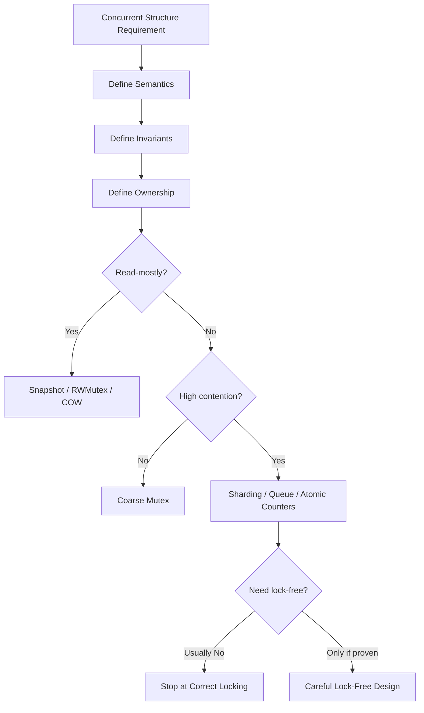
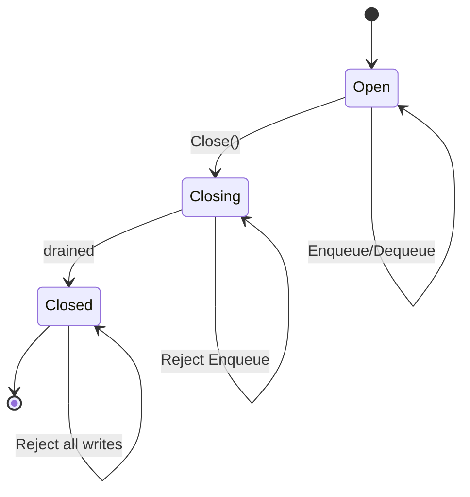

# learn-go-data-structure-algorithm-part-026.md

# Part 026 — Concurrent Data Structures in Go: Correctness Before Performance

> Seri: `learn-go-data-structure-algorithm`  
> Bagian: `026 / 034`  
> Target pembaca: Java software engineer yang ingin menguasai Go data structure & algorithm sampai level production-grade  
> Fokus: desain struktur data concurrent di Go dari perspektif invariant, ownership, publication, locking strategy, sharding, copy-on-write, immutable snapshot, atomic pointer, `sync.Map`, queue semantics, testing, benchmark, dan failure modelling  
> Catatan: bagian ini tidak mengulang seri concurrency-parallelism. Kita hanya memakai konsep concurrency sejauh diperlukan untuk mendesain struktur data yang benar.

---

## Daftar Isi

- [1. Tujuan Part Ini](#1-tujuan-part-ini)
- [2. Prinsip Utama: Correctness Before Performance](#2-prinsip-utama-correctness-before-performance)
- [3. Data Race vs Logical Race](#3-data-race-vs-logical-race)
- [4. Invariant dalam Struktur Data Concurrent](#4-invariant-dalam-struktur-data-concurrent)
- [5. Ownership dan Mutation Boundary](#5-ownership-dan-mutation-boundary)
- [6. Safe Publication](#6-safe-publication)
- [7. Coarse-Grained Locking](#7-coarse-grained-locking)
- [8. Read-Write Locking](#8-read-write-locking)
- [9. Sharded Structures](#9-sharded-structures)
- [10. Copy-on-Write dan Immutable Snapshot](#10-copy-on-write-dan-immutable-snapshot)
- [11. Atomic Pointer Snapshot](#11-atomic-pointer-snapshot)
- [12. `sync.Map`: Kapan Cocok dan Kapan Tidak](#12-syncmap-kapan-cocok-dan-kapan-tidak)
- [13. Atomic Counters dan Striped Counters](#13-atomic-counters-dan-striped-counters)
- [14. Concurrent Queue Semantics](#14-concurrent-queue-semantics)
- [15. MPSC/SPSC Queue Intuition](#15-mspsc-queue-intuition)
- [16. Lock-Free Caveat dan ABA Problem](#16-lock-free-caveat-dan-aba-problem)
- [17. Lifecycle: Close, Drain, Shutdown](#17-lifecycle-close-drain-shutdown)
- [18. Go API Design untuk Concurrent Structures](#18-go-api-design-untuk-concurrent-structures)
- [19. Testing Strategy](#19-testing-strategy)
- [20. Benchmarking Strategy](#20-benchmarking-strategy)
- [21. Production Case Studies](#21-production-case-studies)
- [22. Anti-Patterns](#22-anti-patterns)
- [23. Latihan Bertahap](#23-latihan-bertahap)
- [24. Ringkasan](#24-ringkasan)
- [25. Referensi](#25-referensi)

---

## 1. Tujuan Part Ini

Struktur data concurrent bukan sekadar struktur data biasa yang diberi `mutex`.

Pertanyaan sebenarnya:

```text
Invariant apa yang harus tetap benar saat banyak goroutine membaca/menulis?
Siapa pemilik data?
Kapan mutation boleh terjadi?
Apakah reader melihat snapshot konsisten atau state live?
Apakah operasi harus linearizable?
Apakah operasi boleh eventually consistent?
Apa yang terjadi saat Close/Shutdown?
Apakah data race sudah hilang tetapi logical race masih ada?
```

Part ini membahas desain struktur data concurrent di Go dengan prinsip:

```text
Correctness first.
Performance second.
Lock-free last.
```

Kita akan membahas:

- coarse lock,
- RWMutex,
- sharding,
- copy-on-write,
- immutable snapshot,
- atomic pointer,
- `sync.Map`,
- atomic counters,
- queue semantics,
- lock-free caveat,
- lifecycle,
- testing dan benchmark.

---

## 2. Prinsip Utama: Correctness Before Performance

### 2.1. Mengapa Ini Penting

Struktur data concurrent yang salah sering gagal secara tidak deterministik:

- hanya terjadi di production,
- hanya saat load tinggi,
- hilang ketika diberi log,
- sulit direproduksi,
- race detector tidak selalu menangkap logical race,
- benchmark bisa terlihat cepat padahal salah.

Contoh:

```go
if cache.Get(k) == nil {
	cache.Set(k, load(k))
}
```

Ini bisa race secara logical walau setiap `Get` dan `Set` thread-safe.

Banyak goroutine bisa load key yang sama.

---

### 2.2. Urutan Desain

Urutan yang sehat:

```text
1. Define semantics.
2. Define invariants.
3. Choose ownership model.
4. Choose synchronization strategy.
5. Implement simplest correct version.
6. Test with race detector and randomized workloads.
7. Benchmark realistic contention.
8. Optimize only if necessary.
```

Bukan:

```text
1. Langsung pakai atomic.
2. Langsung pakai lock-free.
3. Baru pikir semantics.
```

---

### 2.3. Diagram Design Flow



---

## 3. Data Race vs Logical Race

### 3.1. Data Race

Data race terjadi ketika:

```text
dua goroutine mengakses memory sama,
setidaknya satu write,
tanpa synchronization yang benar.
```

Contoh:

```go
var x int

go func() {
	x++
}()

go func() {
	_ = x
}()
```

Ini data race.

---

### 3.2. Logical Race

Logical race terjadi ketika operasi individual thread-safe, tetapi komposisi operasi tidak atomic secara semantik.

Contoh:

```go
if !set.Contains(k) {
	set.Add(k)
	process(k)
}
```

Jika dua goroutine berjalan bersamaan, keduanya bisa melihat `Contains=false`, lalu keduanya `process(k)`.

Tidak ada data race jika `Contains` dan `Add` masing-masing lock, tetapi logic tetap race.

Butuh operasi atomik semantik:

```go
added := set.AddIfAbsent(k)
if added {
	process(k)
}
```

---

### 3.3. Data Race vs Logical Race Table

| Aspek | Data Race | Logical Race |
|---|---|---|
| Terdeteksi race detector | sering ya | sering tidak |
| Penyebab | unsafe memory access | operasi tidak atomic secara domain |
| Solusi | synchronization | desain operasi yang tepat |
| Contoh | concurrent map write | check-then-act |
| Severity | undefined behavior/data corruption | duplicate processing/wrong state |

---

### 3.4. Production Lesson

Thread-safe method tidak cukup.

Pertanyaan yang benar:

```text
Apakah operasi yang dibutuhkan oleh domain atomic?
```

---

## 4. Invariant dalam Struktur Data Concurrent

### 4.1. Invariant Harus Tetap Benar di Semua Interleaving

Contoh LRU cache:

```text
1. Setiap key di map punya node di list.
2. Setiap node di list punya key di map.
3. Tidak ada duplicate node untuk key yang sama.
4. Len map == len list.
5. Head paling recent, tail paling old.
```

Dalam concurrent LRU, invariant ini harus benar di setiap titik yang bisa diamati oleh operasi lain.

Solusi sederhana:

```text
Lock melindungi seluruh map + list.
```

Jangan lock map dan list terpisah kecuali invariant cross-structure tetap aman.

---

### 4.2. Invariant Scope

Tentukan scope lock:

```text
mutex protects:
- map
- linked list
- size counter
- stats?
```

Jika stats atomic terpisah, dokumentasikan.

---

### 4.3. Invariant Comment

Gunakan comment di struct:

```go
type SafeLRU[K comparable, V any] struct {
	mu sync.Mutex

	// mu protects all fields below.
	items map[K]*node[K,V]
	head  *node[K,V]
	tail  *node[K,V]
	size  int
}
```

Ini bukan kosmetik. Ini dokumentasi correctness.

---

### 4.4. Composite Invariant Example

For sharded map:

```text
A key must live in exactly one shard determined by hash(key).
Each shard lock protects only that shard.
Global length is sum of shard lengths or approximate atomic counter.
```

If global length is maintained separately:

```text
length counter must be updated exactly once per successful insert/delete.
```

---

## 5. Ownership dan Mutation Boundary

### 5.1. Mutable Value Problem

Thread-safe map:

```go
type SafeMap[K comparable, V any] struct {
	mu sync.RWMutex
	m  map[K]V
}
```

If `V` is pointer/map/slice:

```go
v, _ := sm.Get(k)
v.Mutate()
```

The map is safe, but value may not be.

---

### 5.2. Ownership Models

| Model | Meaning |
|---|---|
| Store by value | cache owns copy |
| Store pointer | caller and cache may share object |
| Copy on set | cache owns independent copy |
| Copy on get | caller cannot mutate internal |
| Immutable value | safe sharing |
| Borrowed view | caller must not retain/mutate |

Go does not enforce immutable slice/map.

You must document or copy.

---

### 5.3. Example: Copy on Get for Slice

```go
type SafeBytesMap[K comparable] struct {
	mu sync.RWMutex
	m  map[K][]byte
}

func NewSafeBytesMap[K comparable]() *SafeBytesMap[K] {
	return &SafeBytesMap[K]{m: make(map[K][]byte)}
}

func (s *SafeBytesMap[K]) Set(k K, v []byte) {
	cp := append([]byte(nil), v...)

	s.mu.Lock()
	defer s.mu.Unlock()

	s.m[k] = cp
}

func (s *SafeBytesMap[K]) Get(k K) ([]byte, bool) {
	s.mu.RLock()
	v, ok := s.m[k]
	s.mu.RUnlock()

	if !ok {
		return nil, false
	}

	return append([]byte(nil), v...), true
}
```

Trade-off:

- safe,
- allocates on get/set,
- may be too expensive for hot path.

Alternative: document immutable byte slices.

---

### 5.4. Immutability as Design Tool

Concurrent structures become simpler if values are immutable.

Pattern:

```text
Build new immutable object.
Publish pointer atomically.
Readers never mutate.
```

This works well for:

- routing table,
- config snapshot,
- policy snapshot,
- feature flag table,
- compiled regex/rules,
- lookup index.

---

## 6. Safe Publication

### 6.1. What Is Safe Publication?

Safe publication means one goroutine constructs data and another goroutine reads it with proper synchronization.

Unsafe pattern:

```go
var global *Config

func writer() {
	global = &Config{...}
}

func reader() {
	_ = global.Value
}
```

This can race.

---

### 6.2. Safe Publication with Mutex

```go
type ConfigStore struct {
	mu sync.RWMutex
	cfg *Config
}

func (s *ConfigStore) Set(cfg *Config) {
	s.mu.Lock()
	defer s.mu.Unlock()
	s.cfg = cfg
}

func (s *ConfigStore) Get() *Config {
	s.mu.RLock()
	defer s.mu.RUnlock()
	return s.cfg
}
```

But if `Config` is mutable, caller can still mutate it.

---

### 6.3. Safe Publication with Atomic Pointer

```go
import "sync/atomic"

type AtomicConfigStore struct {
	ptr atomic.Pointer[Config]
}

func (s *AtomicConfigStore) Store(cfg *Config) {
	s.ptr.Store(cfg)
}

func (s *AtomicConfigStore) Load() *Config {
	return s.ptr.Load()
}
```

This is safe if:

```text
cfg is fully initialized before Store.
cfg is immutable after Store.
```

---

### 6.4. Publication Does Not Freeze Object

Atomic store publishes pointer safely.

It does not prevent mutation.

Bad:

```go
cfg := &Config{Routes: map[string]string{}}
store.Store(cfg)
cfg.Routes["x"] = "y" // unsafe if readers access concurrently
```

Build complete immutable snapshot first.

---

## 7. Coarse-Grained Locking

### 7.1. Mental Model

One mutex protects the whole structure.

```go
type SafeSet[T comparable] struct {
	mu sync.Mutex
	m  map[T]struct{}
}
```

Pros:

- simple,
- easy invariant,
- low bug risk,
- good enough surprisingly often.

Cons:

- contention under high concurrency,
- long operations block all,
- no parallel reads unless RWMutex.

---

### 7.2. Safe Set

```go
type SafeSet[T comparable] struct {
	mu sync.Mutex
	m  map[T]struct{}
}

func NewSafeSet[T comparable]() *SafeSet[T] {
	return &SafeSet[T]{m: make(map[T]struct{})}
}

func (s *SafeSet[T]) Add(v T) bool {
	s.mu.Lock()
	defer s.mu.Unlock()

	if _, ok := s.m[v]; ok {
		return false
	}

	s.m[v] = struct{}{}
	return true
}

func (s *SafeSet[T]) Contains(v T) bool {
	s.mu.Lock()
	defer s.mu.Unlock()

	_, ok := s.m[v]
	return ok
}

func (s *SafeSet[T]) Delete(v T) bool {
	s.mu.Lock()
	defer s.mu.Unlock()

	if _, ok := s.m[v]; !ok {
		return false
	}

	delete(s.m, v)
	return true
}

func (s *SafeSet[T]) Len() int {
	s.mu.Lock()
	defer s.mu.Unlock()

	return len(s.m)
}
```

---

### 7.3. AddIfAbsent Solves Logical Race

`Add` returns whether it inserted.

```go
if set.Add(k) {
	process(k)
}
```

This is atomic semantically.

---

### 7.4. Snapshot Iteration

Never iterate map while allowing mutation.

Provide snapshot:

```go
func (s *SafeSet[T]) Snapshot() []T {
	s.mu.Lock()
	defer s.mu.Unlock()

	out := make([]T, 0, len(s.m))
	for v := range s.m {
		out = append(out, v)
	}
	return out
}
```

Trade-off:

- allocation,
- consistent snapshot,
- caller can iterate without lock.

Alternative: callback under lock, but dangerous if callback blocks/calls back.

---

### 7.5. Do Not Call User Function Under Lock

Bad:

```go
func (s *SafeSet[T]) ForEach(fn func(T)) {
	s.mu.Lock()
	defer s.mu.Unlock()

	for v := range s.m {
		fn(v)
	}
}
```

If `fn` blocks or calls `s.Delete`, deadlock or long lock.

Better snapshot first.

---

## 8. Read-Write Locking

### 8.1. RWMutex

`sync.RWMutex` allows multiple readers or one writer.

Use when:

- many reads,
- few writes,
- read critical section non-trivial,
- contention exists.

Do not assume RWMutex always faster than Mutex.

---

### 8.2. Safe Map with RWMutex

```go
type SafeMap[K comparable, V any] struct {
	mu sync.RWMutex
	m  map[K]V
}

func NewSafeMap[K comparable, V any]() *SafeMap[K, V] {
	return &SafeMap[K, V]{m: make(map[K]V)}
}

func (s *SafeMap[K, V]) Get(k K) (V, bool) {
	s.mu.RLock()
	defer s.mu.RUnlock()

	v, ok := s.m[k]
	return v, ok
}

func (s *SafeMap[K, V]) Set(k K, v V) {
	s.mu.Lock()
	defer s.mu.Unlock()

	s.m[k] = v
}

func (s *SafeMap[K, V]) Delete(k K) bool {
	s.mu.Lock()
	defer s.mu.Unlock()

	if _, ok := s.m[k]; !ok {
		return false
	}

	delete(s.m, k)
	return true
}
```

---

### 8.3. Upgrade Problem

Do not try to upgrade RLock to Lock.

Bad:

```go
s.mu.RLock()
if _, ok := s.m[k]; !ok {
    s.mu.Lock() // deadlock risk
}
```

Correct pattern:

```go
s.mu.RLock()
_, ok := s.m[k]
s.mu.RUnlock()

if !ok {
	s.mu.Lock()
	defer s.mu.Unlock()

	if _, ok := s.m[k]; !ok {
		s.m[k] = v
	}
}
```

This is double-check locking. It must be carefully designed.

---

### 8.4. GetOrSet

```go
func (s *SafeMap[K, V]) GetOrSet(k K, create func() V) (V, bool) {
	s.mu.RLock()
	v, ok := s.m[k]
	s.mu.RUnlock()

	if ok {
		return v, false
	}

	s.mu.Lock()
	defer s.mu.Unlock()

	if v, ok := s.m[k]; ok {
		return v, false
	}

	v = create()
	s.m[k] = v
	return v, true
}
```

Caveat:

```text
create is called under write lock.
```

If create is slow or calls external service, bad.

Alternative: singleflight-style loader outside lock.

---

### 8.5. RWMutex Pitfalls

- read lock still has overhead,
- write can be blocked by long readers,
- callbacks under RLock still dangerous,
- many short reads may not benefit,
- `defer` overhead may matter in ultra hot loops but usually acceptable.

Benchmark.

---

## 9. Sharded Structures

### 9.1. Mental Model

Split map/set into shards.

Each shard has its own lock.

```text
shard = hash(key) % N
```

Benefits:

- lower contention,
- parallel writes to different shards,
- smaller map per lock.

Costs:

- more complexity,
- capacity per shard,
- global operations harder,
- hash function needed.

---

### 9.2. Sharded Map for String Keys

```go
import "hash/maphash"

type stringShard[V any] struct {
	mu sync.RWMutex
	m  map[string]V
}

type ShardedStringMap[V any] struct {
	seed   maphash.Seed
	shards []stringShard[V]
}

func NewShardedStringMap[V any](n int) *ShardedStringMap[V] {
	if n <= 0 {
		n = 16
	}

	shards := make([]stringShard[V], n)
	for i := range shards {
		shards[i].m = make(map[string]V)
	}

	return &ShardedStringMap[V]{
		seed:   maphash.MakeSeed(),
		shards: shards,
	}
}

func (s *ShardedStringMap[V]) shard(key string) *stringShard[V] {
	h := maphash.String(s.seed, key)
	return &s.shards[h%uint64(len(s.shards))]
}

func (s *ShardedStringMap[V]) Get(key string) (V, bool) {
	sh := s.shard(key)
	sh.mu.RLock()
	defer sh.mu.RUnlock()

	v, ok := sh.m[key]
	return v, ok
}

func (s *ShardedStringMap[V]) Set(key string, value V) {
	sh := s.shard(key)
	sh.mu.Lock()
	defer sh.mu.Unlock()

	sh.m[key] = value
}

func (s *ShardedStringMap[V]) Delete(key string) bool {
	sh := s.shard(key)
	sh.mu.Lock()
	defer sh.mu.Unlock()

	if _, ok := sh.m[key]; !ok {
		return false
	}

	delete(sh.m, key)
	return true
}
```

---

### 9.3. Len Across Shards

Exact len:

```go
func (s *ShardedStringMap[V]) Len() int {
	total := 0

	for i := range s.shards {
		sh := &s.shards[i]
		sh.mu.RLock()
		total += len(sh.m)
		sh.mu.RUnlock()
	}

	return total
}
```

This is not a single atomic snapshot unless all shards locked simultaneously.

Usually acceptable for metrics.

If exact snapshot needed, lock all shards in stable order.

---

### 9.4. Lock Ordering

If operation needs multiple shards, lock in deterministic order to avoid deadlock.

```text
lock lower shard index first
then higher shard index
```

Example move key A to B across shards.

---

### 9.5. Capacity Fragmentation

If capacity divided per shard, one hot shard may evict while other shards empty.

Global capacity with sharding is harder.

Options:

- per-shard capacity,
- global approximate counter,
- rebalance,
- centralized eviction,
- accept fragmentation.

---

## 10. Copy-on-Write dan Immutable Snapshot

### 10.1. Mental Model

Copy-on-write:

```text
Readers read immutable snapshot.
Writers copy, modify, publish new snapshot.
```

Good for:

- read-heavy,
- small/medium data,
- infrequent writes,
- need lock-free reads.

Bad for:

- frequent writes,
- huge data,
- large copy cost,
- mutable values.

---

### 10.2. Copy-on-Write Map with Mutex

```go
type COWMap[K comparable, V any] struct {
	mu sync.Mutex
	m  map[K]V
}

func NewCOWMap[K comparable, V any]() *COWMap[K, V] {
	return &COWMap[K, V]{m: make(map[K]V)}
}

func (c *COWMap[K, V]) Snapshot() map[K]V {
	c.mu.Lock()
	defer c.mu.Unlock()

	return c.m
}

func (c *COWMap[K, V]) Set(k K, v V) {
	c.mu.Lock()
	defer c.mu.Unlock()

	next := make(map[K]V, len(c.m)+1)
	for k0, v0 := range c.m {
		next[k0] = v0
	}

	next[k] = v
	c.m = next
}
```

This is not safe for readers without lock if `Snapshot` just returns map and writers replace under lock? The old map is immutable after publication if no one mutates it. But `Snapshot` itself needs safe publication. Better with atomic pointer.

---

### 10.3. Immutable Snapshot Discipline

Once map snapshot is published:

```text
Never mutate it.
```

If a caller receives the map and mutates it, invariant breaks.

Therefore do not expose mutable map unless trusted internal code.

Better:

- expose lookup methods,
- expose copied snapshot,
- use unexported map in snapshot struct.

---

## 11. Atomic Pointer Snapshot

### 11.1. Pattern

Atomic pointer to immutable snapshot.

```go
type RouteSnapshot struct {
	routes map[string]string
}

type RouteTable struct {
	ptr atomic.Pointer[RouteSnapshot]
}
```

Readers:

```go
snap := rt.ptr.Load()
route := snap.routes[path]
```

Writers:

```go
old := rt.ptr.Load()
new := copy old
modify new
rt.ptr.Store(new)
```

---

### 11.2. Implementation

```go
type SnapshotMap[K comparable, V any] struct {
	data map[K]V
}

func NewSnapshotMap[K comparable, V any](data map[K]V) *SnapshotMap[K, V] {
	cp := make(map[K]V, len(data))
	for k, v := range data {
		cp[k] = v
	}
	return &SnapshotMap[K, V]{data: cp}
}

func (s *SnapshotMap[K, V]) Get(k K) (V, bool) {
	v, ok := s.data[k]
	return v, ok
}

type AtomicSnapshotMap[K comparable, V any] struct {
	ptr atomic.Pointer[SnapshotMap[K, V]]
	mu  sync.Mutex
}

func NewAtomicSnapshotMap[K comparable, V any]() *AtomicSnapshotMap[K, V] {
	m := &AtomicSnapshotMap[K, V]{}
	m.ptr.Store(NewSnapshotMap[K, V](nil))
	return m
}

func (m *AtomicSnapshotMap[K, V]) Get(k K) (V, bool) {
	snap := m.ptr.Load()
	return snap.Get(k)
}

func (m *AtomicSnapshotMap[K, V]) Set(k K, v V) {
	m.mu.Lock()
	defer m.mu.Unlock()

	old := m.ptr.Load()
	nextData := make(map[K]V, len(old.data)+1)
	for k0, v0 := range old.data {
		nextData[k0] = v0
	}
	nextData[k] = v

	m.ptr.Store(&SnapshotMap[K, V]{data: nextData})
}

func (m *AtomicSnapshotMap[K, V]) Delete(k K) {
	m.mu.Lock()
	defer m.mu.Unlock()

	old := m.ptr.Load()
	if _, ok := old.data[k]; !ok {
		return
	}

	nextData := make(map[K]V, len(old.data)-1)
	for k0, v0 := range old.data {
		if k0 != k {
			nextData[k0] = v0
		}
	}

	m.ptr.Store(&SnapshotMap[K, V]{data: nextData})
}
```

---

### 11.3. Why Writer Mutex Still Needed?

Atomic pointer protects publication.

Writer mutex prevents lost updates.

Without writer mutex:

```text
writer A loads snapshot S
writer B loads snapshot S
writer A stores S+A
writer B stores S+B
A is lost
```

Need CAS loop or writer mutex.

Mutex simpler.

---

### 11.4. Read Path

Read path:

- no lock,
- one atomic load,
- map read from immutable map.

This is excellent for read-mostly workloads.

---

### 11.5. Memory Retention

Old snapshots remain alive while readers hold references.

Usually short-lived.

If snapshots huge and readers slow, memory can spike.

---

## 12. `sync.Map`: Kapan Cocok dan Kapan Tidak

### 12.1. What Is `sync.Map`

Go standard library provides `sync.Map`, a concurrent map optimized for certain use cases.

It is not a drop-in replacement for every map.

---

### 12.2. Good Use Cases

`sync.Map` can be good when:

- entries written once, read many times,
- many goroutines access disjoint key sets,
- cache-like grow-only or mostly-read pattern,
- avoiding one global lock is useful.

---

### 12.3. Bad Use Cases

Avoid by default when:

- you need type safety without wrappers,
- you need consistent snapshot,
- you need compound operations with invariants,
- frequent updates to same keys,
- need Len often,
- need eviction policy,
- key/value ownership complex.

---

### 12.4. Typed Wrapper

```go
type TypedSyncMap[K comparable, V any] struct {
	m sync.Map
}

func (m *TypedSyncMap[K, V]) Load(k K) (V, bool) {
	v, ok := m.m.Load(k)
	if !ok {
		var zero V
		return zero, false
	}

	out, ok := v.(V)
	if !ok {
		var zero V
		return zero, false
	}

	return out, true
}

func (m *TypedSyncMap[K, V]) Store(k K, v V) {
	m.m.Store(k, v)
}

func (m *TypedSyncMap[K, V]) LoadOrStore(k K, v V) (V, bool) {
	actual, loaded := m.m.LoadOrStore(k, v)
	out, ok := actual.(V)
	if !ok {
		var zero V
		return zero, loaded
	}
	return out, loaded
}

func (m *TypedSyncMap[K, V]) Delete(k K) {
	m.m.Delete(k)
}
```

Caveat:

- type assertion overhead,
- if wrapper misused internally, type mismatch possible,
- `Range` does not give stable snapshot.

---

### 12.5. `LoadOrStore` for AddIfAbsent

`sync.Map.LoadOrStore` is useful for logical atomicity:

```go
actual, loaded := m.LoadOrStore(key, value)
if !loaded {
    // inserted
}
```

But if creating value is expensive, do not create it before `LoadOrStore` unless acceptable.

Need singleflight/lazy creation if expensive.

---

### 12.6. Range Semantics

`sync.Map.Range` does not necessarily correspond to one consistent snapshot if map is concurrently modified.

Do not use for strong snapshot semantics.

---

## 13. Atomic Counters dan Striped Counters

### 13.1. Atomic Counter

```go
type AtomicCounter struct {
	v atomic.Int64
}

func (c *AtomicCounter) Add(delta int64) int64 {
	return c.v.Add(delta)
}

func (c *AtomicCounter) Load() int64 {
	return c.v.Load()
}
```

Good for:

- stats,
- approximate counters,
- simple monotonic metrics.

---

### 13.2. Atomic Is Not Transaction

This is not atomic as a bounded counter:

```go
if c.v.Load() < limit {
	c.v.Add(1)
}
```

Two goroutines can exceed limit.

Need CAS loop:

```go
func (c *AtomicCounter) TryAdd(limit, delta int64) bool {
	for {
		old := c.v.Load()
		if old+delta > limit {
			return false
		}
		if c.v.CompareAndSwap(old, old+delta) {
			return true
		}
	}
}
```

---

### 13.3. Striped Counter

Under heavy contention, one atomic counter can be hotspot.

Striped counter:

```text
multiple counters
goroutine/key chooses stripe
sum stripes for total
```

```go
type StripedCounter struct {
	stripes []atomic.Int64
}

func NewStripedCounter(n int) *StripedCounter {
	if n <= 0 {
		n = 16
	}
	return &StripedCounter{stripes: make([]atomic.Int64, n)}
}

func (c *StripedCounter) Add(stripe uint64, delta int64) {
	i := stripe % uint64(len(c.stripes))
	c.stripes[i].Add(delta)
}

func (c *StripedCounter) Sum() int64 {
	var total int64
	for i := range c.stripes {
		total += c.stripes[i].Load()
	}
	return total
}
```

Trade-off:

- Add less contended,
- Sum O(stripes),
- Sum is not atomic snapshot across all stripes.

---

### 13.4. Counter Invariants

For metrics, approximate sum is often okay.

For quota/enforcement, approximate counter may be wrong.

Do not use striped approximate sum for exact enforcement unless semantics allow.

---

## 14. Concurrent Queue Semantics

### 14.1. Queue Questions

A concurrent queue must define:

```text
bounded or unbounded?
blocking or non-blocking?
single producer or multiple producer?
single consumer or multiple consumer?
close behavior?
ordering guarantee?
backpressure?
drop policy?
```

Without these, "queue" is underspecified.

---

### 14.2. Channel as Queue

Go channel is often the simplest concurrent queue.

```go
jobs := make(chan Job, 1024)
```

Pros:

- built-in synchronization,
- blocking send/receive,
- close semantics,
- select support.

Cons:

- fixed capacity,
- no peek,
- no priority,
- no remove arbitrary,
- no length as strong signal,
- close ownership must be clear.

---

### 14.3. Bounded Blocking Queue with Channel

```go
type ChannelQueue[T any] struct {
	ch chan T
}

func NewChannelQueue[T any](capacity int) *ChannelQueue[T] {
	return &ChannelQueue[T]{ch: make(chan T, capacity)}
}

func (q *ChannelQueue[T]) Enqueue(v T) {
	q.ch <- v
}

func (q *ChannelQueue[T]) TryEnqueue(v T) bool {
	select {
	case q.ch <- v:
		return true
	default:
		return false
	}
}

func (q *ChannelQueue[T]) Dequeue() (T, bool) {
	v, ok := <-q.ch
	return v, ok
}

func (q *ChannelQueue[T]) TryDequeue() (T, bool) {
	select {
	case v, ok := <-q.ch:
		return v, ok
	default:
		var zero T
		return zero, false
	}
}

func (q *ChannelQueue[T]) Close() {
	close(q.ch)
}
```

---

### 14.4. Close Ownership

Only sender/owner should close channel.

If multiple producers call `Close`, panic risk.

Use `sync.Once` if needed:

```go
type SafeCloseQueue[T any] struct {
	ch   chan T
	once sync.Once
}

func (q *SafeCloseQueue[T]) Close() {
	q.once.Do(func() {
		close(q.ch)
	})
}
```

---

### 14.5. Mutex Queue

For custom behavior:

```go
type MutexQueue[T any] struct {
	mu     sync.Mutex
	items  []T
	closed bool
}

func (q *MutexQueue[T]) Enqueue(v T) bool {
	q.mu.Lock()
	defer q.mu.Unlock()

	if q.closed {
		return false
	}

	q.items = append(q.items, v)
	return true
}

func (q *MutexQueue[T]) TryDequeue() (T, bool) {
	q.mu.Lock()
	defer q.mu.Unlock()

	if len(q.items) == 0 {
		var zero T
		return zero, false
	}

	v := q.items[0]
	var zero T
	q.items[0] = zero
	q.items = q.items[1:]
	return v, true
}

func (q *MutexQueue[T]) Close() {
	q.mu.Lock()
	defer q.mu.Unlock()

	q.closed = true
}
```

Problem:

- `q.items = q.items[1:]` can retain backing array.
- Use ring buffer for long-lived queue.

---

### 14.6. Ring Buffer Queue with Mutex

```go
type RingQueue[T any] struct {
	mu     sync.Mutex
	buf    []T
	head   int
	tail   int
	size   int
	closed bool
}

func NewRingQueue[T any](capacity int) *RingQueue[T] {
	if capacity <= 0 {
		capacity = 1
	}
	return &RingQueue[T]{buf: make([]T, capacity)}
}

func (q *RingQueue[T]) TryEnqueue(v T) bool {
	q.mu.Lock()
	defer q.mu.Unlock()

	if q.closed || q.size == len(q.buf) {
		return false
	}

	q.buf[q.tail] = v
	q.tail = (q.tail + 1) % len(q.buf)
	q.size++
	return true
}

func (q *RingQueue[T]) TryDequeue() (T, bool) {
	q.mu.Lock()
	defer q.mu.Unlock()

	if q.size == 0 {
		var zero T
		return zero, false
	}

	v := q.buf[q.head]
	var zero T
	q.buf[q.head] = zero
	q.head = (q.head + 1) % len(q.buf)
	q.size--
	return v, true
}
```

---

### 14.7. Queue Backpressure

Bounded queue provides backpressure:

```text
when full, producers block/reject/drop
```

Define policy:

- block,
- reject,
- drop newest,
- drop oldest,
- priority drop,
- spill to disk.

Each policy has business meaning.

---

## 15. MPSC/SPSC Queue Intuition

### 15.1. Terms

| Term | Meaning |
|---|---|
| SPSC | single producer, single consumer |
| MPSC | multiple producer, single consumer |
| SPMC | single producer, multiple consumer |
| MPMC | multiple producer, multiple consumer |

Simpler constraints allow faster structures.

---

### 15.2. SPSC Ring Buffer

If exactly one producer and one consumer, a lock-free ring can be simpler.

State:

```text
producer writes tail
consumer writes head
```

But in Go, correct lock-free implementation still needs atomics and memory ordering.

---

### 15.3. MPSC Queue

Multiple producers contend to enqueue.

Single consumer drains.

Common in logging/metrics/event loops.

Simpler production option:

```text
channel
```

or:

```text
mutex-protected ring
```

before lock-free.

---

### 15.4. Why Not Jump to Lock-Free?

Lock-free queue requires:

- atomic operations,
- memory ordering correctness,
- ABA handling,
- safe reclamation,
- careful benchmark,
- deep tests.

Go channels and mutexes are often fast enough and much safer.

---

## 16. Lock-Free Caveat dan ABA Problem

### 16.1. Lock-Free Is Not Wait-Free

Terms:

| Term | Meaning |
|---|---|
| Blocking | goroutine can block on lock/channel |
| Lock-free | system as a whole makes progress |
| Wait-free | every goroutine completes in bounded steps |

Lock-free does not mean simpler or always faster.

---

### 16.2. CAS Loop

Atomic compare-and-swap:

```go
for {
	old := ptr.Load()
	new := transform(old)
	if ptr.CompareAndSwap(old, new) {
		break
	}
}
```

Problem:

- transform may be expensive,
- high contention spins,
- starvation possible,
- object identity issues.

---

### 16.3. ABA Problem

ABA:

```text
Thread 1 sees pointer A.
Thread 2 changes A -> B -> A.
Thread 1 CAS sees A and thinks nothing changed.
```

But state changed in between.

Solutions:

- version tags,
- hazard pointers,
- epoch reclamation,
- garbage collection helps memory reclamation but not all logical ABA.

Go GC reduces some memory reuse hazards, but ABA can still be logical.

---

### 16.4. Practical Guidance

Use lock-free only when:

```text
1. simple lock/sharding is proven insufficient,
2. contention profile is known,
3. semantics are simple,
4. tests include stress/race/linearizability,
5. team can maintain it.
```

Most business systems should not implement custom lock-free structures.

---

## 17. Lifecycle: Close, Drain, Shutdown

### 17.1. Lifecycle Is Part of Data Structure

Concurrent structures often need lifecycle:

```text
open
closing
closed
draining
```

Examples:

- queue,
- scheduler,
- worker buffer,
- subscription registry,
- cache with background cleanup.

---

### 17.2. Close Semantics Questions

```text
Can enqueue after close?
Can dequeue remaining items after close?
Does close unblock waiters?
Can close be called multiple times?
Does close cancel in-flight operations?
```

---

### 17.3. Queue Close Semantics

Common semantics:

```text
Enqueue after close returns false.
Dequeue continues until queue empty.
Then Dequeue returns ok=false.
Close is idempotent.
```

---

### 17.4. State Machine



---

### 17.5. Background Goroutines

If structure starts goroutines, it needs:

- `Close`,
- context cancellation,
- WaitGroup,
- no goroutine leak,
- predictable shutdown.

For pure data structures, avoid hidden goroutines unless necessary.

---

## 18. Go API Design untuk Concurrent Structures

### 18.1. Name Should Signal Safety

Options:

```go
type Map[K comparable, V any] struct { ... }      // not clear
type SafeMap[K comparable, V any] struct { ... }  // signals concurrent-safe
type LockedMap[K comparable, V any] struct { ... }
```

Document:

```text
Safe for concurrent use by multiple goroutines.
```

or:

```text
Not safe for concurrent use.
```

---

### 18.2. Avoid Returning Internal Mutable State

Bad:

```go
func (m *SafeMap[K,V]) Raw() map[K]V
```

This breaks safety.

Return copy or snapshot object with immutable contract.

---

### 18.3. Compound Operations

Expose domain-level atomic operations:

```go
AddIfAbsent
GetOrSet
CompareAndDelete
Update
Swap
```

But beware user callback under lock.

---

### 18.4. Update Function Pattern

```go
func (m *SafeMap[K, V]) Update(k K, fn func(old V, exists bool) (V, bool)) {
	m.mu.Lock()
	defer m.mu.Unlock()

	old, exists := m.m[k]
	next, keep := fn(old, exists)
	if keep {
		m.m[k] = next
	} else {
		delete(m.m, k)
	}
}
```

Caveat:

```text
fn runs under lock.
```

Only safe if function is fast, pure, and does not call back.

Alternative: CAS-like retry with immutable snapshot.

---

### 18.5. Context in Blocking APIs

Blocking operations should accept context:

```go
Enqueue(ctx context.Context, v T) error
Dequeue(ctx context.Context) (T, error)
```

Do not create uninterruptible blocking calls in services.

---

## 19. Testing Strategy

### 19.1. Race Detector

Run:

```text
go test -race ./...
```

Race detector finds many data races but not logical races.

Use it as baseline, not proof of correctness.

---

### 19.2. Invariant Tests

For LRU:

```text
map/list consistency
no duplicate nodes
len match
head/tail links
capacity not exceeded
```

Expose internal check in test package or build tag.

---

### 19.3. Concurrent Stress Test

Example SafeSet:

```go
func TestSafeSetConcurrentAdd(t *testing.T) {
	s := NewSafeSet[int]()

	var wg sync.WaitGroup
	for g := 0; g < 100; g++ {
		wg.Add(1)
		go func(offset int) {
			defer wg.Done()
			for i := 0; i < 1000; i++ {
				s.Add(offset*1000 + i)
			}
		}(g)
	}

	wg.Wait()

	if got := s.Len(); got != 100_000 {
		t.Fatalf("len=%d want %d", got, 100_000)
	}
}
```

---

### 19.4. Logical Race Test

For `AddIfAbsent`:

```go
func TestAddIfAbsentProcessesOnce(t *testing.T) {
	s := NewSafeSet[string]()

	var processed atomic.Int64
	var wg sync.WaitGroup

	for i := 0; i < 100; i++ {
		wg.Add(1)
		go func() {
			defer wg.Done()
			if s.Add("same-key") {
				processed.Add(1)
			}
		}()
	}

	wg.Wait()

	if got := processed.Load(); got != 1 {
		t.Fatalf("processed=%d want 1", got)
	}
}
```

---

### 19.5. Linearizability Intuition

For concurrent data structures, sometimes we need to prove every operation appears atomic at some point between start and end.

This is linearizability.

Testing linearizability thoroughly is advanced, but for critical structures:

- record operation histories,
- compare with sequential model,
- use randomized schedules,
- keep operations small.

---

### 19.6. Fuzz + Concurrency

Go fuzzing is not primarily a scheduler fuzzer, but can generate operation sequences.

For deterministic model:

```text
generate operations
apply sequential to model
apply concurrent carefully to structure
compare final invariants
```

---

## 20. Benchmarking Strategy

### 20.1. Benchmark Under Real Contention

Benchmark variants:

- single goroutine,
- many readers,
- many writers,
- mixed read/write,
- hot key,
- random keys,
- skewed Zipf keys,
- many shards.

---

### 20.2. `RunParallel`

```go
func BenchmarkSafeMapGetParallel(b *testing.B) {
	m := NewSafeMap[int, int]()
	for i := 0; i < 100_000; i++ {
		m.Set(i, i)
	}

	b.ReportAllocs()
	b.RunParallel(func(pb *testing.PB) {
		i := 0
		for pb.Next() {
			m.Get(i % 100_000)
			i++
		}
	})
}
```

---

### 20.3. Beware Misleading Benchmarks

A benchmark with random uniform keys may show low contention.

Production may have hot keys.

Test:

```text
all goroutines same key
80/20 hot distribution
Zipfian distribution
```

---

### 20.4. Measure Correct Thing

Metrics:

- throughput,
- p95/p99 latency,
- lock contention,
- allocations,
- memory,
- CPU,
- fairness,
- tail latency under writer bursts,
- GC impact.

---

### 20.5. Compare Simpler Baselines

Always compare:

- coarse mutex,
- RWMutex,
- sharded,
- sync.Map,
- atomic snapshot if read-mostly.

Often coarse lock is good enough and easier to maintain.

---

## 21. Production Case Studies

### 21.1. Read-Mostly Routing Table

Requirement:

```text
Millions of reads.
Rare route updates.
Readers need consistent snapshot.
```

Best fit:

```text
atomic pointer to immutable snapshot
```

Why:

- lock-free reads,
- consistent snapshot,
- updates copy and publish.

Avoid:

- sync.Map if route table needs coherent version,
- mutable map with RLock if update frequency low and read latency critical.

---

### 21.2. High-Write Metrics Counter

Requirement:

```text
Many goroutines increment counters.
Periodic scrape reads totals.
```

Options:

- atomic counters per metric,
- striped counters for hot metric,
- sharded map for dynamic labels.

Do not use one global mutex around all metrics if hot.

---

### 21.3. Concurrent TTL Cache

Requirement:

```text
Read/write cache from many goroutines.
Need eviction and TTL.
```

Simplest:

```text
mutex protects map + list/heap
```

If contention high:

```text
shard by key
```

Be careful:

- per-shard capacity,
- cleanup per shard,
- value ownership,
- loader singleflight.

---

### 21.4. Work Queue

Requirement:

```text
Multiple producers, multiple consumers.
Bounded memory.
Backpressure.
Shutdown.
```

Best default:

```text
channel
```

If need priority:

```text
mutex + heap + condition variable/channel signal
```

If need extremely high throughput:

```text
specialized queue only after measurement
```

---

### 21.5. Config Store

Requirement:

```text
Config updated every few minutes.
Read on every request.
```

Use:

```text
atomic immutable snapshot
```

Add:

- version,
- validation before publish,
- rollback to previous snapshot if invalid,
- metrics.

---

### 21.6. Dedup Set

Requirement:

```text
Process key once across goroutines.
```

Expose:

```go
AddIfAbsent(key) bool
```

not separate `Contains` then `Add`.

---

## 22. Anti-Patterns

### 22.1. Protecting Individual Fields, Not Invariant

Bad:

```text
one lock for map
one lock for list
```

if invariant spans both.

Use one lock unless split is proven safe.

---

### 22.2. Check-Then-Act with Separate Calls

Bad:

```go
if !m.Contains(k) {
	m.Set(k, v)
}
```

Use atomic compound operation.

---

### 22.3. Returning Mutable Internal State

Breaks thread safety.

---

### 22.4. Holding Lock While Calling External Service

Bad:

```go
mu.Lock()
v := callDB()
m[k] = v
mu.Unlock()
```

Blocks all operations and risks deadlock.

---

### 22.5. Assuming `sync.Map` Is Always Faster

It is optimized for specific patterns. Benchmark.

---

### 22.6. Atomic Everything

Atomic operations do not compose automatically into correct data structure.

---

### 22.7. Lock-Free for Prestige

Complex, fragile, hard to maintain.

---

### 22.8. Ignoring Shutdown

Queues/schedulers/caches with goroutines need lifecycle.

---

### 22.9. Concurrent Reads of Ordinary Map During Write

Go map is not safe for concurrent read/write.

Use synchronization.

---

## 23. Latihan Bertahap

### 23.1. Level 1 — Safe Set

Implement:

1. `Add`,
2. `Delete`,
3. `Contains`,
4. `AddIfAbsent`,
5. `Snapshot`,
6. concurrent tests.

---

### 23.2. Level 2 — Safe Map

Implement:

1. `Get`,
2. `Set`,
3. `Delete`,
4. `GetOrSet`,
5. `Update`,
6. avoid user callback under lock or document constraint.

---

### 23.3. Level 3 — Sharded Map

Implement:

1. string-key sharded map,
2. stable shard selection,
3. exact `Len`,
4. snapshot,
5. lock ordering for multi-key operation.

---

### 23.4. Level 4 — Atomic Snapshot Table

Implement:

1. immutable snapshot,
2. atomic pointer load/store,
3. writer mutex,
4. versioned snapshot,
5. benchmark vs RWMutex.

---

### 23.5. Level 5 — Concurrent Queue

Implement:

1. bounded ring queue with mutex,
2. channel queue,
3. close semantics,
4. context-aware blocking operation,
5. invariant tests.

---

### 23.6. Level 6 — Production Review

Pick one structure:

```text
concurrent LRU
concurrent config table
dedup set
work queue
metrics registry
```

Write:

- semantics,
- invariants,
- ownership,
- lock policy,
- lifecycle,
- tests,
- benchmark plan,
- failure modes.

---

## 24. Ringkasan

Concurrent data structures require more than adding locks.

Key takeaways:

- data race and logical race are different,
- method-level thread safety is not enough,
- define domain-level atomic operations,
- lock the invariant, not just fields,
- values returned from concurrent structures may still be mutable and unsafe,
- safe publication requires synchronization,
- immutable snapshots are powerful for read-mostly structures,
- sharding reduces contention but complicates global operations,
- `sync.Map` is useful for specific patterns, not universal,
- atomic counters are not transactions,
- queues must define boundedness, blocking, close, and backpressure,
- lock-free structures are last resort.

Production mental model:

```text
A concurrent structure is correct only when every operation preserves invariant under every allowed interleaving.
```

Performance matters, but only after correctness is explicit and tested.

---

## 25. Referensi

Referensi utama yang relevan untuk part ini:

- Go 1.26 Release Notes — `https://go.dev/doc/go1.26`
- Go Release History — `https://go.dev/doc/devel/release`
- Go Language Specification — `https://go.dev/ref/spec`
- Package `sync` — `https://pkg.go.dev/sync`
- Package `sync/atomic` — `https://pkg.go.dev/sync/atomic`
- Package `hash/maphash` — `https://pkg.go.dev/hash/maphash`
- Package `context` — `https://pkg.go.dev/context`
- Package `testing` — `https://pkg.go.dev/testing`
- Go Data Race Detector — `https://go.dev/doc/articles/race_detector`

---

# Status Seri

Selesai:

- Part 000 — Roadmap, Mental Model, dan Batasan Seri
- Part 001 — Complexity Model yang Realistis di Go
- Part 002 — Arrays, Slices, dan Sequence Design
- Part 003 — Maps, Hash Tables, dan Associative Data
- Part 004 — Sorting, Ordering, Comparison, dan Search
- Part 005 — Stack, Queue, Deque, dan Worklist Algorithms
- Part 006 — Linked List, Intrusive List, dan Pointer-Chasing Trade-off
- Part 007 — Heap, Priority Queue, dan Scheduling Algorithms
- Part 008 — Sets, Multisets, Bag, dan Membership Models
- Part 009 — Strings, Bytes, Runes, Tokenization, dan Text Algorithms
- Part 010 — Recursion, Iteration, Backtracking, dan State Space Search
- Part 011 — Hashing, Fingerprint, Checksums, dan Equality Strategy
- Part 012 — Trees: Binary Tree, BST, Traversal, dan Structural Invariants
- Part 013 — Balanced Trees: AVL, Red-Black, Treap, dan Ordered Index
- Part 014 — B-Tree, B+Tree, Page-Oriented Structure, dan Storage-Aware Index
- Part 015 — Trie, Radix Tree, Patricia Tree, dan Prefix Index
- Part 016 — Graph Fundamentals: Representation, Traversal, dan Modelling
- Part 017 — Graph Algorithms for Production Systems
- Part 018 — Dynamic Programming: Memoization, Tabulation, dan State Compression
- Part 019 — Greedy Algorithms, Exchange Argument, dan Approximation Thinking
- Part 020 — Divide and Conquer, Selection, dan Search Space Reduction
- Part 021 — Range Query Structures: Prefix Sum, Fenwick Tree, Segment Tree
- Part 022 — Disjoint Set Union, Connectivity, dan Merge Semantics
- Part 023 — Probabilistic Data Structures
- Part 024 — Cache Data Structures: LRU, LFU, ARC-like Thinking, TTL Index
- Part 025 — Time, Scheduling, Rate Limiting, dan Window Algorithms
- Part 026 — Concurrent Data Structures in Go: Correctness Before Performance

Berikutnya:

- Part 027 — Persistent, Immutable, dan Versioned Data Structures

<!-- NAVIGATION_FOOTER -->
<div class="page-nav">
<a href="./learn-go-data-structure-algorithm-part-025.md">⬅️ Part 025 — Time, Scheduling, Rate Limiting, dan Window Algorithms</a>
<a href="./index.md">📚 Kategori</a>
<a href="../../index.md">🏠 Home</a>
<a href="./learn-go-data-structure-algorithm-part-027.md">Part 027 — Persistent, Immutable, dan Versioned Data Structures ➡️</a>
</div>
