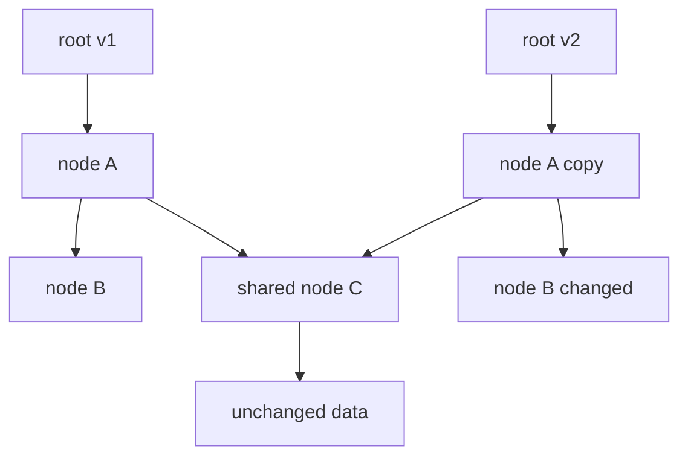
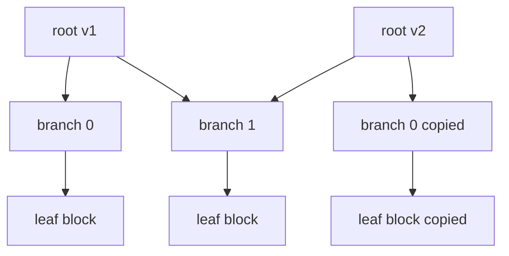
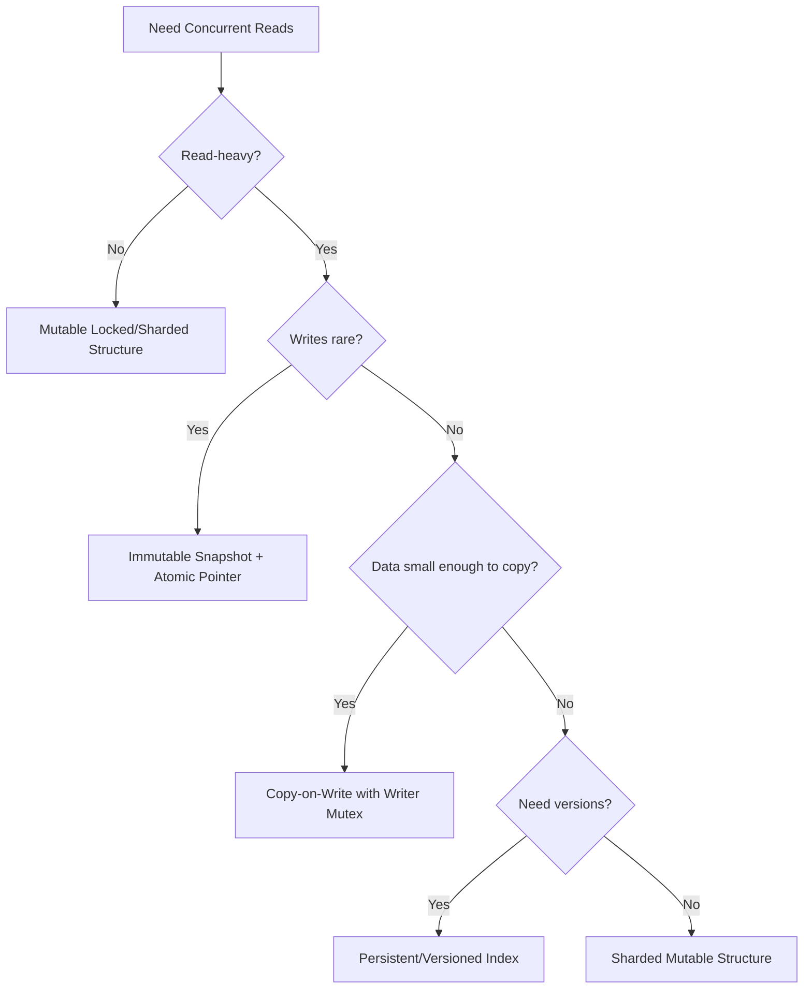

# learn-go-data-structure-algorithm-part-027.md

# Part 027 — Persistent, Immutable, dan Versioned Data Structures

> Seri: `learn-go-data-structure-algorithm`  
> Bagian: `027 / 034`  
> Target pembaca: Java software engineer yang ingin menguasai Go data structure & algorithm sampai level production-grade  
> Fokus: persistent data structures, immutability, structural sharing, copy-on-write, immutable snapshot, versioned index, MVCC-like thinking, snapshot consistency, atomic publication, memory retention, dan desain Go yang realistis

---

## Daftar Isi

- [1. Tujuan Part Ini](#1-tujuan-part-ini)
- [2. Terminologi: Immutable vs Persistent vs Versioned](#2-terminologi-immutable-vs-persistent-vs-versioned)
- [3. Kenapa Struktur Immutable Penting di Go](#3-kenapa-struktur-immutable-penting-di-go)
- [4. Mental Model Structural Sharing](#4-mental-model-structural-sharing)
- [5. Copy-on-Write sebagai Versi Paling Praktis](#5-copy-on-write-sebagai-versi-paling-praktis)
- [6. Immutable Snapshot dengan Atomic Pointer](#6-immutable-snapshot-dengan-atomic-pointer)
- [7. Persistent Vector Intuition](#7-persistent-vector-intuition)
- [8. Persistent Map Intuition](#8-persistent-map-intuition)
- [9. Versioned Index dan MVCC-like Thinking](#9-versioned-index-dan-mvcc-like-thinking)
- [10. Snapshot Reads](#10-snapshot-reads)
- [11. Version Lifecycle dan Garbage Collection](#11-version-lifecycle-dan-garbage-collection)
- [12. Memory Retention Risk](#12-memory-retention-risk)
- [13. API Design di Go](#13-api-design-di-go)
- [14. Testing Strategy](#14-testing-strategy)
- [15. Benchmarking Strategy](#15-benchmarking-strategy)
- [16. Production Case Studies](#16-production-case-studies)
- [17. Anti-Patterns](#17-anti-patterns)
- [18. Decision Framework](#18-decision-framework)
- [19. Latihan Bertahap](#19-latihan-bertahap)
- [20. Ringkasan](#20-ringkasan)
- [21. Referensi](#21-referensi)

---

## 1. Tujuan Part Ini

Struktur data persistent/immutable menjawab kebutuhan yang sering muncul di sistem production:

```text
Banyak reader harus melihat data konsisten.
Writer sesekali update data.
Reader tidak boleh terblokir lama.
Reader tidak boleh melihat state setengah jadi.
Versi lama masih perlu dipakai sementara.
Update harus bisa dipublish atomically.
```

Contoh nyata:

- routing table,
- config snapshot,
- policy table,
- feature flag state,
- authorization rule set,
- pricing table,
- lookup index,
- compiled workflow definition,
- in-memory projection,
- read-mostly dictionary.

Kita tidak akan mencoba membuat persistent collections akademik yang sempurna seperti di functional language. Fokusnya adalah:

```text
Bagaimana menggunakan immutability dan versioning secara pragmatis di Go.
```

---

## 2. Terminologi: Immutable vs Persistent vs Versioned

### 2.1. Immutable

Immutable berarti setelah dibuat, object tidak dimutasi.

```text
create -> publish -> read many times -> never mutate
```

Contoh:

```go
type ConfigSnapshot struct {
	Version int64
	Routes  map[string]string // harus dianggap immutable setelah publish
}
```

Catatan penting:

```text
Go tidak punya immutable map/slice.
Immutability adalah contract, bukan enforcement bahasa.
```

---

### 2.2. Persistent Data Structure

Persistent data structure adalah struktur data yang mempertahankan versi lama setelah update.

Update menghasilkan versi baru.

```text
v1 = set(v0, "a", 1)
v2 = set(v1, "b", 2)

v0 masih valid
v1 masih valid
v2 valid
```

Persistent bukan berarti disimpan di disk. Dalam konteks struktur data, "persistent" berarti versi lama tetap tersedia.

---

### 2.3. Structural Sharing

Persistent structure tidak menyalin semua data setiap update.

Ia menyalin hanya path yang berubah, lalu berbagi bagian yang tidak berubah.

```text
old root -> A -> B -> C
new root -> A' -> B' -> C
```

Bagian `C` bisa dibagi jika tidak berubah.

---

### 2.4. Versioned Structure

Versioned structure menyimpan beberapa versi state.

Bisa immutable snapshot, bisa MVCC-like.

Contoh:

```text
version 10: policy table lama
version 11: policy table baru
version 12: policy table baru lagi
```

Reader bisa memilih versi:

```text
read at version 11
```

---

### 2.5. Comparison

| Concept | Meaning | Typical Use |
|---|---|---|
| Immutable | tidak dimutasi setelah dibuat | safe read sharing |
| Persistent | update menghasilkan versi baru, versi lama masih valid | undo/snapshot/read consistency |
| Versioned | state diberi nomor versi/timestamp | MVCC, policy versioning |
| Copy-on-write | copy sebelum mutate | pragmatic immutability |
| Structural sharing | berbagi bagian yang tidak berubah | memory-efficient persistence |

---

## 3. Kenapa Struktur Immutable Penting di Go

### 3.1. Concurrency Simplification

Jika object immutable:

```text
banyak goroutine bisa membaca tanpa lock
```

Selama object dipublish dengan aman.

Ini menghilangkan banyak masalah:

- data race,
- read lock contention,
- reader melihat state setengah update,
- long reader blocking writer.

---

### 3.2. Snapshot Consistency

Mutable map dengan lock:

```text
reader melihat state saat lock dipegang
```

Immutable snapshot:

```text
reader memegang pointer ke versi tertentu
reader melihat versi konsisten walaupun writer publish versi baru
```

---

### 3.3. Rollback dan Audit

Versioned state membuat rollback lebih mudah:

```text
current -> version 12
rollback -> version 11
```

Untuk audit:

```text
decision was made using policy version 42
```

Ini penting untuk sistem defensible.

---

### 3.4. Failure Isolation

Update bisa dibangun dan divalidasi di luar state live.

```text
build candidate snapshot
validate
if valid, publish atomically
if invalid, discard
```

Reader tidak pernah melihat candidate invalid.

---

### 3.5. Cost

Immutable/persistent approach tidak gratis.

Biaya:

- copy cost saat write,
- memory sementara untuk versi lama+baru,
- retention jika reader lama hidup lama,
- discipline agar tidak ada mutation setelah publish,
- API harus mencegah accidental mutation.

---

## 4. Mental Model Structural Sharing

### 4.1. Full Copy vs Structural Sharing

Full copy:

```text
update one key -> copy all entries
```

Structural sharing:

```text
update one key -> copy nodes along path only
```

---

### 4.2. Diagram



---

### 4.3. Structural Sharing Requirements

To share safely:

```text
shared nodes must be immutable
```

If shared node is mutated, both old and new versions change.

This destroys persistence.

---

### 4.4. Persistent Trees

Trees naturally support structural sharing.

Update path:

```text
root -> child -> child -> leaf
```

Only nodes on this path are copied.

Unchanged subtrees are shared.

This is why persistent maps/vectors often use tree/trie structures.

---

### 4.5. Go Practicality

Implementing full HAMT/vector trie is possible but complex.

In Go backend systems, the common practical pattern is:

```text
copy-on-write whole map for small/medium read-mostly data
or
versioned indexes with immutable slices/maps
or
tree path-copying for specialized structures
```

---

## 5. Copy-on-Write sebagai Versi Paling Praktis

### 5.1. Copy-on-Write Map

For small/medium map and infrequent writes:

```text
read: atomic pointer load
write: copy whole map, mutate copy, publish
```

This is often enough.

---

### 5.2. Basic Snapshot Map

```go
package versioned

type MapSnapshot[K comparable, V any] struct {
	version int64
	data    map[K]V
}

func NewMapSnapshot[K comparable, V any](version int64, data map[K]V) *MapSnapshot[K, V] {
	cp := make(map[K]V, len(data))
	for k, v := range data {
		cp[k] = v
	}
	return &MapSnapshot[K, V]{
		version: version,
		data:    cp,
	}
}

func (s *MapSnapshot[K, V]) Version() int64 {
	return s.version
}

func (s *MapSnapshot[K, V]) Get(k K) (V, bool) {
	v, ok := s.data[k]
	return v, ok
}

func (s *MapSnapshot[K, V]) Len() int {
	return len(s.data)
}
```

Important:

```text
data must never be mutated after snapshot creation.
```

Since `data` is unexported, caller cannot directly mutate it.

But if `V` is mutable pointer/slice/map, value itself can still mutate.

---

### 5.3. Snapshot Update

```go
func (s *MapSnapshot[K, V]) WithSet(version int64, k K, v V) *MapSnapshot[K, V] {
	next := make(map[K]V, len(s.data)+1)
	for k0, v0 := range s.data {
		next[k0] = v0
	}
	next[k] = v

	return &MapSnapshot[K, V]{
		version: version,
		data:    next,
	}
}

func (s *MapSnapshot[K, V]) WithDelete(version int64, k K) *MapSnapshot[K, V] {
	if _, ok := s.data[k]; !ok {
		return &MapSnapshot[K, V]{
			version: version,
			data:    s.data,
		}
	}

	next := make(map[K]V, len(s.data)-1)
	for k0, v0 := range s.data {
		if k0 != k {
			next[k0] = v0
		}
	}

	return &MapSnapshot[K, V]{
		version: version,
		data:    next,
	}
}
```

Caveat:

`WithDelete` reusing same `data` map when key missing is safe only if data immutable.

---

### 5.4. Batch Update

Full copy per single update is expensive if applying many changes.

Use batch builder:

```go
type MapPatch[K comparable, V any] struct {
	Set    map[K]V
	Delete []K
}

func (s *MapSnapshot[K, V]) WithPatch(version int64, patch MapPatch[K, V]) *MapSnapshot[K, V] {
	next := make(map[K]V, len(s.data)+len(patch.Set))
	for k, v := range s.data {
		next[k] = v
	}

	for _, k := range patch.Delete {
		delete(next, k)
	}

	for k, v := range patch.Set {
		next[k] = v
	}

	return &MapSnapshot[K, V]{
		version: version,
		data:    next,
	}
}
```

This reduces copy cost:

```text
many changes -> one copy
```

---

### 5.5. When Copy-on-Write Map Works

Good:

- map size small/medium,
- writes rare,
- reads frequent,
- snapshot consistency important,
- update can be batched.

Bad:

- very large map,
- writes frequent,
- values mutable,
- latency-sensitive writes,
- memory budget tight.

---

## 6. Immutable Snapshot dengan Atomic Pointer

### 6.1. Publication Pattern

We store current snapshot in atomic pointer.

```go
import "sync/atomic"

type AtomicMap[K comparable, V any] struct {
	current atomic.Pointer[MapSnapshot[K, V]]
}
```

---

### 6.2. Constructor

```go
func NewAtomicMap[K comparable, V any](initial map[K]V) *AtomicMap[K, V] {
	m := &AtomicMap[K, V]{}
	m.current.Store(NewMapSnapshot[K, V](1, initial))
	return m
}
```

---

### 6.3. Read

```go
func (m *AtomicMap[K, V]) Snapshot() *MapSnapshot[K, V] {
	return m.current.Load()
}

func (m *AtomicMap[K, V]) Get(k K) (V, bool) {
	s := m.current.Load()
	return s.Get(k)
}
```

Reads:

- no lock,
- consistent per snapshot,
- very fast.

---

### 6.4. Write with Mutex

Atomic pointer alone does not prevent lost updates.

Use writer mutex.

```go
import "sync"

type AtomicMapStore[K comparable, V any] struct {
	mu      sync.Mutex
	current atomic.Pointer[MapSnapshot[K, V]]
	nextVer atomic.Int64
}

func NewAtomicMapStore[K comparable, V any](initial map[K]V) *AtomicMapStore[K, V] {
	s := &AtomicMapStore[K, V]{}
	s.nextVer.Store(1)
	s.current.Store(NewMapSnapshot[K, V](1, initial))
	return s
}

func (s *AtomicMapStore[K, V]) Snapshot() *MapSnapshot[K, V] {
	return s.current.Load()
}

func (s *AtomicMapStore[K, V]) Get(k K) (V, bool) {
	return s.Snapshot().Get(k)
}

func (s *AtomicMapStore[K, V]) Set(k K, v V) int64 {
	s.mu.Lock()
	defer s.mu.Unlock()

	old := s.current.Load()
	version := s.nextVer.Add(1)

	next := old.WithSet(version, k, v)
	s.current.Store(next)

	return version
}

func (s *AtomicMapStore[K, V]) ApplyPatch(patch MapPatch[K, V]) int64 {
	s.mu.Lock()
	defer s.mu.Unlock()

	old := s.current.Load()
	version := s.nextVer.Add(1)

	next := old.WithPatch(version, patch)
	s.current.Store(next)

	return version
}
```

---

### 6.5. Why `atomic.Pointer` + `sync.Mutex`

Read path:

```text
atomic load only
```

Write path:

```text
mutex serializes writers
copy snapshot
atomic publish
```

This is a very practical pattern.

---

### 6.6. Lost Update Without Writer Mutex

Bad pattern:

```go
old := current.Load()
next := old.WithSet(...)
current.Store(next)
```

If two writers do this concurrently, one update can overwrite the other.

CAS loop can fix, but copying may repeat under contention.

Writer mutex is simpler.

---

### 6.7. Validation Before Publish

```go
func (s *AtomicMapStore[K, V]) ReplaceIfValid(candidate map[K]V, validate func(*MapSnapshot[K, V]) error) (int64, error) {
	s.mu.Lock()
	defer s.mu.Unlock()

	version := s.nextVer.Add(1)
	next := NewMapSnapshot[K, V](version, candidate)

	if err := validate(next); err != nil {
		return 0, err
	}

	s.current.Store(next)
	return version, nil
}
```

Reader never sees invalid candidate.

---

## 7. Persistent Vector Intuition

### 7.1. Problem with Copying Slice

A slice update by copy:

```go
next := append([]T(nil), old...)
next[i] = v
```

Cost:

```text
O(n)
```

For large vectors with frequent updates, persistent vector improves by tree structural sharing.

---

### 7.2. Vector Trie Intuition

Persistent vector often uses a wide tree.

Example branching factor 32.

Index bits choose path:

```text
level 1 -> level 2 -> leaf
```

Update copies only nodes on path.

Complexity:

```text
lookup: O(log_B n)
update: O(log_B n)
append: amortized O(log_B n)
```

With B=32, depth is small.

---

### 7.3. Diagram



Only updated path copied.

---

### 7.4. Why Not Implement Full Persistent Vector Here?

Because production-quality persistent vector requires:

- tree branching,
- tail optimization,
- bounds,
- append logic,
- memory layout tuning,
- iterator,
- tests,
- benchmark.

For Go backend systems, simpler alternatives often suffice:

- immutable slice snapshot,
- chunked immutable slices,
- copy-on-write for small data,
- append-only versioned log,
- sorted immutable slice + binary search.

---

### 7.5. Chunked Immutable Slice

A pragmatic compromise:

```text
data stored in chunks
update/append creates new chunk or copies one chunk
old chunks shared
```

Useful when:

- append-heavy,
- snapshot reads,
- batch updates.

---

## 8. Persistent Map Intuition

### 8.1. HAMT Intuition

Hash Array Mapped Trie uses hash bits to navigate tree.

Each level consumes some bits.

Update copies path to changed leaf.

Old version shares unchanged branches.

---

### 8.2. Why It Matters

Persistent map gives:

```text
lookup: near O(1)
update: near O(1) with structural sharing
versions: cheap
```

But implementation is complex.

Go standard library map is mutable and not persistent.

---

### 8.3. Practical Go Alternatives

Use one of:

1. copy-on-write map,
2. immutable sorted slice + binary search,
3. B-tree style path-copying for large ordered index,
4. third-party persistent collection if policy permits,
5. custom HAMT only if justified.

---

### 8.4. Immutable Sorted Slice Map

For read-mostly lookup:

```go
type Pair[K any, V any] struct {
	Key   K
	Value V
}
```

Sorted by key.

Lookup via binary search.

Pros:

- compact,
- cache-friendly,
- immutable,
- easy snapshot,
- no map random iteration nondeterminism.

Cons:

- update copy O(n),
- lookup O(log n),
- key comparator needed.

---

### 8.5. Implementation

```go
import "cmp"

type SortedSnapshotMap[K cmp.Ordered, V any] struct {
	version int64
	items   []Pair[K, V]
}

func NewSortedSnapshotMap[K cmp.Ordered, V any](version int64, input map[K]V) *SortedSnapshotMap[K, V] {
	items := make([]Pair[K, V], 0, len(input))
	for k, v := range input {
		items = append(items, Pair[K, V]{Key: k, Value: v})
	}

	slices.SortFunc(items, func(a, b Pair[K, V]) int {
		return cmp.Compare(a.Key, b.Key)
	})

	return &SortedSnapshotMap[K, V]{
		version: version,
		items:   items,
	}
}

func (s *SortedSnapshotMap[K, V]) Get(k K) (V, bool) {
	i, found := slices.BinarySearchFunc(s.items, k, func(p Pair[K, V], target K) int {
		return cmp.Compare(p.Key, target)
	})
	if !found {
		var zero V
		return zero, false
	}
	return s.items[i].Value, true
}
```

Imports:

```go
import (
	"cmp"
	"slices"
)
```

---

### 8.6. Sorted Slice vs Map Snapshot

| Factor | Map Snapshot | Sorted Slice Snapshot |
|---|---|---|
| Lookup | average O(1) | O(log n) |
| Iteration order | random | deterministic |
| Memory locality | less predictable | good |
| Range query | poor | good |
| Update copy | O(n) | O(n) |
| Build | O(n) | O(n log n) |
| JSON/debug determinism | less | better |

---

## 9. Versioned Index dan MVCC-like Thinking

### 9.1. MVCC Intuition

MVCC means Multi-Version Concurrency Control.

Readers see a version/snapshot.

Writers create new version.

Old versions remain until no reader needs them.

In database:

```text
read transaction sees snapshot at timestamp T
write creates newer version
```

In in-memory Go structure:

```text
reader holds *Snapshot version 42
writer publishes version 43
reader continues with version 42
```

---

### 9.2. Versioned Store

```go
type VersionedStore[T any] struct {
	mu       sync.Mutex
	current  atomic.Pointer[VersionedSnapshot[T]]
	nextVer  atomic.Int64
	retained []*VersionedSnapshot[T]
}

type VersionedSnapshot[T any] struct {
	Version int64
	Value   T
}
```

---

### 9.3. Basic Publish

```go
func NewVersionedStore[T any](initial T) *VersionedStore[T] {
	s := &VersionedStore[T]{}
	s.nextVer.Store(1)
	s.current.Store(&VersionedSnapshot[T]{
		Version: 1,
		Value:   initial,
	})
	return s
}

func (s *VersionedStore[T]) Current() *VersionedSnapshot[T] {
	return s.current.Load()
}

func (s *VersionedStore[T]) Publish(value T) int64 {
	s.mu.Lock()
	defer s.mu.Unlock()

	version := s.nextVer.Add(1)
	snap := &VersionedSnapshot[T]{
		Version: version,
		Value:   value,
	}

	s.retained = append(s.retained, s.current.Load())
	s.current.Store(snap)

	return version
}
```

This retains old snapshots forever unless cleaned.

---

### 9.4. Reader Tracking

For explicit lifecycle, reader can acquire/release snapshot.

```go
type Lease[T any] struct {
	snap *VersionedSnapshot[T]
	done func()
}

func (l Lease[T]) Snapshot() *VersionedSnapshot[T] {
	return l.snap
}

func (l Lease[T]) Release() {
	if l.done != nil {
		l.done()
		l.done = nil
	}
}
```

Full safe reader tracking is non-trivial. Often Go GC is enough if old snapshots are not kept in explicit retained list.

---

### 9.5. Simpler Approach

For many systems:

```text
Do not retain old snapshots in store.
Let readers holding pointer keep old snapshot alive via GC.
Publish new snapshot atomically.
Old snapshots are collected when no reader references them.
```

This is simple and powerful.

---

### 9.6. When Explicit Version Retention Needed

Need explicit retention if:

- reader requests specific historical version,
- audit replay,
- rollback,
- long-running jobs need pinned version,
- external API exposes versioned reads.

Then design:

- max retained versions,
- min active version,
- retention window,
- disk/archive if needed.

---

## 10. Snapshot Reads

### 10.1. Snapshot Read Contract

A snapshot read guarantees:

```text
All reads during operation observe same version.
```

Example:

```go
snap := store.Snapshot()
a := snap.Get("a")
b := snap.Get("b")
```

Both from same version.

Without snapshot:

```go
a := store.Get("a") // version 10
b := store.Get("b") // version 11
```

This can violate consistency.

---

### 10.2. Example Bug

Policy check:

```text
rule A from version 10
rule B from version 11
```

Decision may be invalid because rule set versions mixed.

Solution:

```go
snap := policyStore.Snapshot()
decision := evaluate(snap, request)
```

---

### 10.3. Snapshot API

```go
type PolicyStore struct {
	current atomic.Pointer[PolicySnapshot]
}

func (s *PolicyStore) Snapshot() *PolicySnapshot {
	return s.current.Load()
}
```

Evaluation takes snapshot:

```go
func EvaluatePolicy(snap *PolicySnapshot, req Request) Decision {
	// all lookup through snap
	return Decision{}
}
```

---

### 10.4. Snapshot Version in Result

For audit:

```go
type Decision struct {
	Allowed       bool
	PolicyVersion int64
	Reason        string
}
```

Always include version used.

---

### 10.5. Snapshot Isolation vs Freshness

Snapshot consistency means coherent, not necessarily latest.

A reader may use version 42 while version 43 already published.

This is usually acceptable if read operation started before/around update.

If latest is required, define stronger synchronization.

---

## 11. Version Lifecycle dan Garbage Collection

### 11.1. Natural GC

If old snapshots are only referenced by readers:

```text
GC collects old snapshots after readers release references.
```

No explicit lifecycle needed.

---

### 11.2. Retained Version List

If store keeps old versions:

```go
versions map[int64]*Snapshot
```

Need cleanup.

Policies:

- keep last N versions,
- keep versions for duration,
- keep versions >= oldest active reader,
- keep versions referenced by jobs,
- explicit release.

---

### 11.3. Version Cleanup

```go
type RetainedStore[T any] struct {
	mu       sync.Mutex
	current  atomic.Pointer[VersionedSnapshot[T]]
	history  map[int64]*VersionedSnapshot[T]
	maxKeep  int
}
```

Cleanup last N:

```go
func (s *RetainedStore[T]) cleanupLocked() {
	if s.maxKeep <= 0 || len(s.history) <= s.maxKeep {
		return
	}

	// In real implementation, keep ordered versions.
	// Map alone is not enough for efficient cleanup.
}
```

Need ordered index of versions.

---

### 11.4. Active Reader Tracking

If retaining based on active readers:

```text
reader acquire version
reader release version
cleanup versions older than min active version
```

This is like epoch-based reclamation.

Complexity increases.

For Go, prefer relying on GC unless explicit historical reads are required.

---

## 12. Memory Retention Risk

### 12.1. Large Snapshot Spike

Publishing new large snapshot:

```text
old snapshot 1GB
new snapshot 1GB
temporary memory 2GB+
```

If multiple old readers:

```text
3 old snapshots + new snapshot
```

Memory spike can be severe.

---

### 12.2. Slow Reader Problem

A slow reader holding old snapshot prevents GC of entire object graph.

Example:

```go
snap := store.Snapshot()
time.Sleep(10 * time.Minute)
_ = snap
```

Old snapshot lives 10 minutes.

---

### 12.3. Partial Sharing Retention

Structural sharing can retain large old subtrees.

If a small object references large backing array, old memory remains.

This is similar to slice retained backing array issue.

---

### 12.4. Mitigation

- limit snapshot size,
- batch updates,
- avoid huge full copies,
- use structural sharing/chunking,
- avoid long-lived snapshot references,
- expose read function that does not leak snapshot,
- monitor memory after publish,
- use version TTL/lease for explicit retention.

---

### 12.5. Read Function Pattern

Instead of returning snapshot:

```go
func (s *Store) WithSnapshot(fn func(*Snapshot)) {
	snap := s.current.Load()
	fn(snap)
}
```

Caveat:

- callback should not retain snapshot,
- cannot enforce,
- do not call unknown slow callback under lock; atomic snapshot callback has no lock.

---

## 13. API Design di Go

### 13.1. Immutable Snapshot Type

```go
type Snapshot interface {
	Version() int64
}
```

Keep fields unexported.

Expose methods only.

---

### 13.2. Builder Pattern

To avoid mutating snapshot directly:

```go
type PolicyBuilder struct {
	rules map[string]Rule
}

func NewPolicyBuilder(base *PolicySnapshot) *PolicyBuilder {
	rules := make(map[string]Rule, len(base.rules))
	for k, v := range base.rules {
		rules[k] = v
	}
	return &PolicyBuilder{rules: rules}
}

func (b *PolicyBuilder) SetRule(id string, rule Rule) {
	b.rules[id] = rule
}

func (b *PolicyBuilder) Build(version int64) *PolicySnapshot {
	return NewPolicySnapshot(version, b.rules)
}
```

Builder mutable, snapshot immutable.

---

### 13.3. Snapshot Value Ownership

If values are mutable:

```go
type Rule struct {
	Conditions []Condition
}
```

Need deep copy or immutable contract.

```go
func cloneRule(r Rule) Rule {
	r.Conditions = append([]Condition(nil), r.Conditions...)
	return r
}
```

---

### 13.4. Publishing API

```go
func (s *Store) Publish(candidate *Snapshot) error
```

Validate before publish:

```go
func (s *Store) Publish(candidate *Snapshot) error {
	if err := candidate.Validate(); err != nil {
		return err
	}
	s.current.Store(candidate)
	return nil
}
```

If multiple writers, serialize with mutex.

---

### 13.5. Avoid Exposing Mutable Maps/Slices

Bad:

```go
func (s *Snapshot) Rules() map[string]Rule
```

Better:

```go
func (s *Snapshot) Rule(id string) (Rule, bool)
func (s *Snapshot) RuleIDs() []string // copy
```

If `Rule` contains slices/maps, return clone or document immutable.

---

### 13.6. Version Comparison

Use monotonic version:

```text
1,2,3,4
```

or content hash.

Monotonic version good for:

- ordering,
- audit,
- freshness check.

Content hash good for:

- equality,
- dedup,
- reproducibility.

Can use both.

---

## 14. Testing Strategy

### 14.1. Immutability Tests

Test that modifying input after snapshot creation does not mutate snapshot.

```go
func TestMapSnapshotCopiesInput(t *testing.T) {
	input := map[string]int{"a": 1}
	snap := NewMapSnapshot[string, int](1, input)

	input["a"] = 99

	got, _ := snap.Get("a")
	if got != 1 {
		t.Fatalf("snapshot mutated through input, got %d", got)
	}
}
```

---

### 14.2. Old Version Still Valid

```go
func TestOldSnapshotStillValid(t *testing.T) {
	store := NewAtomicMapStore[string, int](map[string]int{"a": 1})

	old := store.Snapshot()
	store.Set("a", 2)
	newSnap := store.Snapshot()

	oldVal, _ := old.Get("a")
	newVal, _ := newSnap.Get("a")

	if oldVal != 1 || newVal != 2 {
		t.Fatalf("old=%d new=%d", oldVal, newVal)
	}
}
```

---

### 14.3. Snapshot Consistency Test

```go
func TestSnapshotConsistency(t *testing.T) {
	store := NewAtomicMapStore[string, int](map[string]int{
		"a": 1,
		"b": 1,
	})

	snap := store.Snapshot()

	store.ApplyPatch(MapPatch[string, int]{
		Set: map[string]int{"a": 2, "b": 2},
	})

	a, _ := snap.Get("a")
	b, _ := snap.Get("b")

	if a != 1 || b != 1 {
		t.Fatalf("mixed snapshot: a=%d b=%d", a, b)
	}
}
```

---

### 14.4. Race Test

Run:

```text
go test -race ./...
```

Concurrent read/write test:

```go
func TestAtomicMapConcurrent(t *testing.T) {
	store := NewAtomicMapStore[int, int](map[int]int{})

	var wg sync.WaitGroup

	for g := 0; g < 10; g++ {
		wg.Add(1)
		go func(id int) {
			defer wg.Done()
			for i := 0; i < 1000; i++ {
				store.Get(i)
				_ = store.Snapshot().Len()
			}
		}(g)
	}

	for i := 0; i < 100; i++ {
		store.Set(i, i)
	}

	wg.Wait()
}
```

---

### 14.5. Version Monotonicity Test

```go
func TestVersionMonotonic(t *testing.T) {
	store := NewAtomicMapStore[string, int](nil)

	v1 := store.Set("a", 1)
	v2 := store.Set("b", 2)

	if v2 <= v1 {
		t.Fatalf("versions not increasing: %d %d", v1, v2)
	}
}
```

---

### 14.6. Deep Copy Tests

If values contain slices/maps, test mutation after set does not leak if API promises copy.

---

## 15. Benchmarking Strategy

### 15.1. Read Path Benchmark

```go
func BenchmarkAtomicMapGet(b *testing.B) {
	initial := make(map[int]int, 100_000)
	for i := 0; i < 100_000; i++ {
		initial[i] = i
	}

	store := NewAtomicMapStore[int, int](initial)

	b.ReportAllocs()
	b.ResetTimer()

	var sink int
	for i := 0; i < b.N; i++ {
		v, _ := store.Get(i % 100_000)
		sink += v
	}
	_ = sink
}
```

Read path should allocate zero.

---

### 15.2. Write Path Benchmark

```go
func BenchmarkAtomicMapSet(b *testing.B) {
	initial := make(map[int]int, 10_000)
	for i := 0; i < 10_000; i++ {
		initial[i] = i
	}

	store := NewAtomicMapStore[int, int](initial)

	b.ReportAllocs()
	b.ResetTimer()

	for i := 0; i < b.N; i++ {
		store.Set(i%10_000, i)
	}
}
```

This reveals copy cost.

---

### 15.3. Compare Against RWMutex Map

Benchmark:

- read-only,
- 99% read / 1% write,
- 90% read / 10% write,
- hot keys,
- map size variations.

Expected:

- atomic snapshot wins read-heavy,
- RWMutex may win when writes frequent,
- copy-on-write becomes bad for large frequent updates.

---

### 15.4. Memory Benchmark

Measure memory spike when publishing large snapshot.

Use runtime metrics carefully.

Watch:

- heap allocation,
- retained old snapshots,
- GC cycles,
- write latency.

---

## 16. Production Case Studies

### 16.1. Config Snapshot

Requirement:

```text
Config read on every request.
Config updated every few minutes.
Readers need coherent version.
```

Use:

```text
atomic pointer to immutable config snapshot
```

Design:

- parse config,
- validate,
- build snapshot,
- publish,
- include version,
- expose current version metric.

---

### 16.2. Authorization Policy Table

Requirement:

```text
Policy rules updated by admin.
Every decision must be auditable.
Decision must use one coherent policy version.
```

Use:

```text
versioned immutable policy snapshot
```

Decision result includes:

```text
policyVersion
ruleIDs evaluated
decision reason
```

Avoid mixing rules from different versions.

---

### 16.3. Routing Table

Requirement:

```text
High-QPS router.
Route updates rare.
Readers must not lock.
```

Use:

```text
compiled immutable route trie/table
atomic publish
```

Writers build new route table off-path.

---

### 16.4. Feature Flags

Requirement:

```text
Flags read often.
Updates periodic.
Need consistent evaluation.
```

Use snapshot:

```text
flag definitions
segments
rules
version
```

A single evaluation uses one snapshot.

---

### 16.5. Workflow Definition

Requirement:

```text
Case/workflow state machine definitions versioned.
Existing case may need original workflow version.
```

Use:

```text
versioned definitions retained by version
```

Important:

- do not mutate old definition,
- case references workflow version,
- migration explicitly changes version.

---

### 16.6. In-Memory Search Index

Requirement:

```text
Read-heavy lookup index.
Periodic rebuild from DB/event log.
```

Use:

```text
build full index in background
validate
atomic swap
old index GC after readers finish
```

Avoid incremental mutation unless required.

---

## 17. Anti-Patterns

### 17.1. "Immutable" Snapshot with Exported Map

Bad:

```go
type Snapshot struct {
	Rules map[string]Rule
}
```

Caller can mutate.

Keep fields unexported.

---

### 17.2. Atomic Pointer to Mutable Object

Bad:

```go
store.Store(ptr)
ptr.Map["x"] = y
```

Atomic publication does not make object immutable.

---

### 17.3. Copy-on-Write for High Write Rate Huge Map

This can destroy memory and CPU.

Use sharded mutable map or real persistent structure.

---

### 17.4. Returning Internal Slice

Bad:

```go
func (s *Snapshot) Items() []Item {
	return s.items
}
```

Caller can mutate.

Return copy or iterator/callback with immutable contract.

---

### 17.5. No Version in Decision

If decision uses snapshot but result does not record version, audit becomes weaker.

---

### 17.6. Long-Lived Snapshot Leak

Holding snapshot in goroutine/global cache can retain huge old state.

---

### 17.7. CAS Loop with Expensive Copy

Under contention, CAS failures can repeat expensive copy.

Use writer mutex unless strong reason.

---

## 18. Decision Framework

### 18.1. Ask These Questions

```text
1. Is workload read-heavy?
2. How large is the data?
3. How frequent are writes?
4. Do readers need coherent multi-key snapshot?
5. Do old versions need to remain accessible?
6. Are values deeply immutable?
7. What is memory spike during publish?
8. How long can readers hold snapshots?
9. Is audit/version important?
10. Is update built from batch or single mutation?
```

---

### 18.2. Decision Table

| Requirement | Recommended |
|---|---|
| Small map, rare writes, many reads | copy-on-write map + atomic pointer |
| Large read-only table rebuilt periodically | immutable snapshot + atomic swap |
| Frequent writes | mutable locked/sharded structure |
| Need old versions by ID | retained versioned store |
| Need rollback | keep previous snapshots or event log |
| Need range query immutable data | sorted slice/B-tree snapshot |
| Need per-request consistent policy | snapshot evaluation |
| Need exact latest every read | lock or transactional model |

---

### 18.3. Flowchart



---

## 19. Latihan Bertahap

### 19.1. Level 1 — Immutable Snapshot Map

Implement:

1. snapshot constructor with copy,
2. `Get`,
3. `Len`,
4. `WithSet`,
5. `WithDelete`,
6. immutability tests.

---

### 19.2. Level 2 — Atomic Snapshot Store

Implement:

1. atomic current pointer,
2. writer mutex,
3. version increment,
4. patch apply,
5. concurrent tests.

---

### 19.3. Level 3 — Sorted Snapshot Map

Implement:

1. build sorted pairs,
2. binary search lookup,
3. deterministic iteration,
4. range query,
5. compare with map snapshot.

---

### 19.4. Level 4 — Policy Snapshot

Design:

```text
PolicySnapshot
PolicyBuilder
PolicyStore
Decision with PolicyVersion
```

Add validation before publish.

---

### 19.5. Level 5 — Version Retention

Implement:

1. keep last N versions,
2. lookup by version,
3. cleanup,
4. rollback to version,
5. memory tests.

---

### 19.6. Level 6 — Production Exercise

Design versioned workflow definition store:

```text
- definitions immutable
- case references definition version
- new version publish
- old version retained
- migration explicit
- audit records version
```

Document invariants and failure modes.

---

## 20. Ringkasan

Persistent, immutable, dan versioned data structures adalah alat penting untuk read-heavy, audit-sensitive, dan concurrency-sensitive systems.

Key takeaways:

- Immutable means no mutation after creation.
- Persistent means old versions remain valid after update.
- Structural sharing avoids full copy by sharing unchanged parts.
- Copy-on-write map is pragmatic for small/medium read-mostly data.
- Atomic pointer to immutable snapshot gives fast lock-free reads.
- Writer mutex prevents lost updates.
- Snapshot read ensures coherent multi-key view.
- Version number is critical for audit and reproducibility.
- Go does not enforce immutability for maps/slices; API must protect it.
- Old snapshots can retain large memory if readers hold references.

Production mental model:

```text
Mutable concurrent structures coordinate access.
Immutable versioned structures avoid coordination on reads by making state unchangeable.
```

Choose immutable snapshots when read consistency and low read latency matter more than write cost.

---

## 21. Referensi

Referensi utama yang relevan untuk part ini:

- Go 1.26 Release Notes — `https://go.dev/doc/go1.26`
- Go Release History — `https://go.dev/doc/devel/release`
- Go Language Specification — `https://go.dev/ref/spec`
- Package `sync` — `https://pkg.go.dev/sync`
- Package `sync/atomic` — `https://pkg.go.dev/sync/atomic`
- Package `cmp` — `https://pkg.go.dev/cmp`
- Package `slices` — `https://pkg.go.dev/slices`
- Package `testing` — `https://pkg.go.dev/testing`
- Go Data Race Detector — `https://go.dev/doc/articles/race_detector`

---

# Status Seri

Selesai:

- Part 000 — Roadmap, Mental Model, dan Batasan Seri
- Part 001 — Complexity Model yang Realistis di Go
- Part 002 — Arrays, Slices, dan Sequence Design
- Part 003 — Maps, Hash Tables, dan Associative Data
- Part 004 — Sorting, Ordering, Comparison, dan Search
- Part 005 — Stack, Queue, Deque, dan Worklist Algorithms
- Part 006 — Linked List, Intrusive List, dan Pointer-Chasing Trade-off
- Part 007 — Heap, Priority Queue, dan Scheduling Algorithms
- Part 008 — Sets, Multisets, Bag, dan Membership Models
- Part 009 — Strings, Bytes, Runes, Tokenization, dan Text Algorithms
- Part 010 — Recursion, Iteration, Backtracking, dan State Space Search
- Part 011 — Hashing, Fingerprint, Checksums, dan Equality Strategy
- Part 012 — Trees: Binary Tree, BST, Traversal, dan Structural Invariants
- Part 013 — Balanced Trees: AVL, Red-Black, Treap, dan Ordered Index
- Part 014 — B-Tree, B+Tree, Page-Oriented Structure, dan Storage-Aware Index
- Part 015 — Trie, Radix Tree, Patricia Tree, dan Prefix Index
- Part 016 — Graph Fundamentals: Representation, Traversal, dan Modelling
- Part 017 — Graph Algorithms for Production Systems
- Part 018 — Dynamic Programming: Memoization, Tabulation, dan State Compression
- Part 019 — Greedy Algorithms, Exchange Argument, dan Approximation Thinking
- Part 020 — Divide and Conquer, Selection, dan Search Space Reduction
- Part 021 — Range Query Structures: Prefix Sum, Fenwick Tree, Segment Tree
- Part 022 — Disjoint Set Union, Connectivity, dan Merge Semantics
- Part 023 — Probabilistic Data Structures
- Part 024 — Cache Data Structures: LRU, LFU, ARC-like Thinking, TTL Index
- Part 025 — Time, Scheduling, Rate Limiting, dan Window Algorithms
- Part 026 — Concurrent Data Structures in Go: Correctness Before Performance
- Part 027 — Persistent, Immutable, dan Versioned Data Structures

Berikutnya:

- Part 028 — Serialization-Aware and Layout-Aware Data Structures


<!-- NAVIGATION_FOOTER -->
<div class="page-nav">
<a href="./learn-go-data-structure-algorithm-part-026.md">⬅️ Part 026 — Concurrent Data Structures in Go: Correctness Before Performance</a>
<a href="./index.md">📚 Kategori</a>
<a href="../../index.md">🏠 Home</a>
<a href="./learn-go-data-structure-algorithm-part-028.md">Part 028 — Serialization-Aware and Layout-Aware Data Structures ➡️</a>
</div>
