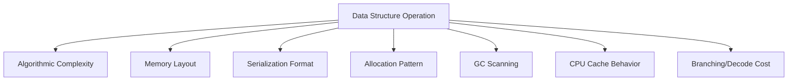
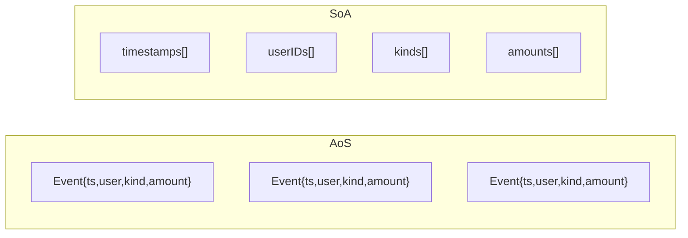
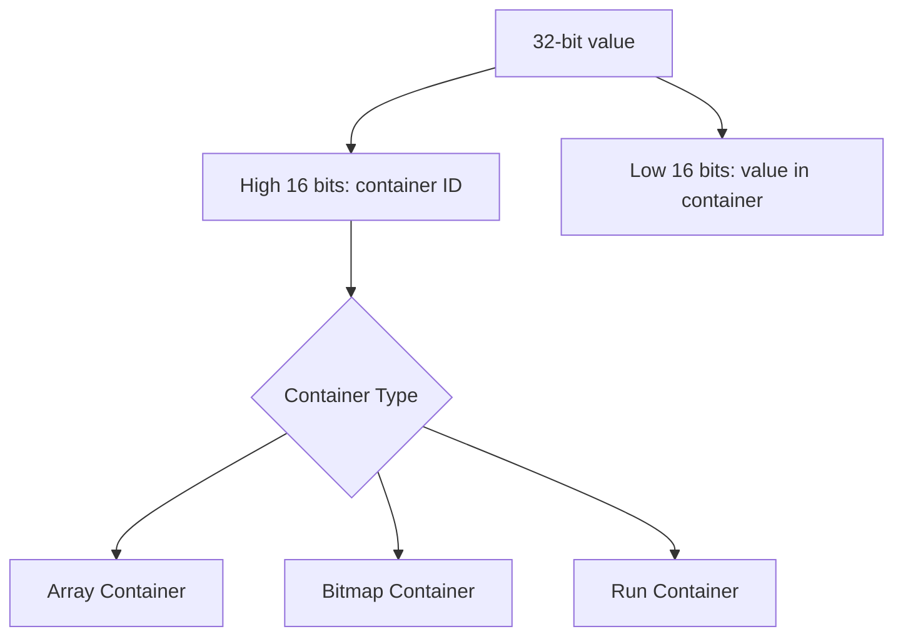
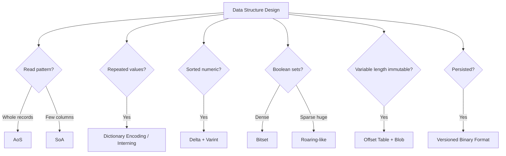

# learn-go-data-structure-algorithm-part-028.md

# Part 028 — Serialization-Aware and Layout-Aware Data Structures

> Seri: `learn-go-data-structure-algorithm`  
> Bagian: `028 / 034`  
> Target pembaca: Java software engineer yang ingin menguasai Go data structure & algorithm sampai level production-grade  
> Fokus: struktur data yang sadar layout dan serialization: in-memory vs wire layout, AoS vs SoA, packed data, offset table, string interning, dictionary encoding, varint, delta encoding, RLE, bitmap, roaring bitmap intuition, zero-copy read, cache locality, GC scanning, dan production trade-off

---

## Daftar Isi

- [1. Tujuan Part Ini](#1-tujuan-part-ini)
- [2. Mental Model: Big-O Tidak Cukup](#2-mental-model-big-o-tidak-cukup)
- [3. In-Memory Layout vs Wire Layout vs Disk Layout](#3-in-memory-layout-vs-wire-layout-vs-disk-layout)
- [4. Struct Layout, Padding, dan Alignment](#4-struct-layout-padding-dan-alignment)
- [5. Array of Structs vs Struct of Arrays](#5-array-of-structs-vs-struct-of-arrays)
- [6. Packed Data dan Compact Representation](#6-packed-data-dan-compact-representation)
- [7. Offset Table untuk Variable-Length Data](#7-offset-table-untuk-variable-length-data)
- [8. String Interning dan Symbol Table](#8-string-interning-dan-symbol-table)
- [9. Dictionary Encoding](#9-dictionary-encoding)
- [10. Varint dan Integer Encoding](#10-varint-dan-integer-encoding)
- [11. Delta Encoding](#11-delta-encoding)
- [12. Run-Length Encoding](#12-run-length-encoding)
- [13. Bitmap dan Bitset](#13-bitmap-dan-bitset)
- [14. Roaring Bitmap Intuition](#14-roaring-bitmap-intuition)
- [15. Zero-Copy Read Model](#15-zero-copy-read-model)
- [16. GC-Aware Layout](#16-gc-aware-layout)
- [17. Serialization-Aware Index Design](#17-serialization-aware-index-design)
- [18. Go API Design](#18-go-api-design)
- [19. Testing Strategy](#19-testing-strategy)
- [20. Benchmarking Strategy](#20-benchmarking-strategy)
- [21. Production Case Studies](#21-production-case-studies)
- [22. Anti-Patterns](#22-anti-patterns)
- [23. Decision Framework](#23-decision-framework)
- [24. Latihan Bertahap](#24-latihan-bertahap)
- [25. Ringkasan](#25-ringkasan)
- [26. Referensi](#26-referensi)

---

## 1. Tujuan Part Ini

Pada banyak sistem production, performa struktur data tidak hanya ditentukan oleh kompleksitas algoritmik.

Dua struktur sama-sama `O(log n)` bisa berbeda jauh karena:

```text
cache locality
jumlah pointer
jumlah allocation
GC scanning
branch predictability
ukuran data
format serialization
copy antar layer
endianness
encoding integer/string
layout disk/network
```

Part ini membahas cara berpikir:

```text
Data structure bukan hanya operasi.
Data structure adalah layout + encoding + access pattern.
```

Contoh:

- `[]struct{...}` vs beberapa `[]int64`
- map string besar vs dictionary encoded integer ID
- slice of pointers vs packed arrays
- `[]bool` vs bitset
- JSON-like object per row vs columnar arrays
- decode full object vs offset-based zero-copy reader
- repeated string values vs string interning
- sorted timestamps raw int64 vs delta-varint

Materi ini penting untuk:

- high-throughput services,
- analytics,
- log/event processing,
- compact indexes,
- permission/feature bitmap,
- cache memory reduction,
- file-backed index,
- serialization boundary,
- low-latency lookup.

---

## 2. Mental Model: Big-O Tidak Cukup

### 2.1. Big-O Menyembunyikan Constant Factor

Contoh:

```text
Algorithm A: O(n), contiguous scan of []int64
Algorithm B: O(n), pointer chasing through linked nodes
```

Keduanya O(n), tetapi A bisa jauh lebih cepat karena:

- memory contiguous,
- CPU prefetch lebih efektif,
- fewer cache misses,
- no pointer dereference chain,
- lower GC overhead.

---

### 2.2. Real Cost Components

| Cost | Dampak |
|---|---|
| Pointer chasing | cache miss, latency tinggi |
| Allocation | GC pressure, allocator overhead |
| Boxing/interface | dynamic dispatch/type assertion |
| Serialization | CPU copy/decode |
| Padding | memory waste |
| Branches | branch misprediction |
| Compression | CPU vs memory trade-off |
| Encoding | variable decode cost |
| Copy | memory bandwidth |
| GC scanning | pause/assist CPU |

---

### 2.3. Diagram Cost Stack



---

### 2.4. Top-Tier Engineering Question

Jangan hanya bertanya:

```text
Apa kompleksitasnya?
```

Tanya juga:

```text
Berapa byte per item?
Berapa pointer per item?
Apakah data contiguous?
Apakah reader butuh full decode?
Apakah field yang jarang dipakai tetap dibaca?
Apakah format sama untuk memory dan wire?
Apakah GC harus scan jutaan object?
Apakah bisa pakai ID kecil daripada string?
```

---

## 3. In-Memory Layout vs Wire Layout vs Disk Layout

### 3.1. Tiga Bentuk Data

Satu entity bisa punya tiga layout:

```text
In-memory layout: optimal untuk CPU/runtime
Wire layout: optimal untuk network/interoperability
Disk layout: optimal untuk durability/scan/random access
```

Contoh:

```go
type User struct {
	ID        int64
	Name      string
	Email     string
	CreatedAt int64
	Active    bool
}
```

Wire JSON:

```json
{"id":1,"name":"A","email":"a@example.com","createdAt":123,"active":true}
```

Disk compact:

```text
fixed header + offset table + byte blob
```

Jangan memaksa satu layout untuk semua kebutuhan.

---

### 3.2. Object Layout vs Query Layout

Jika query sering:

```text
count active users by createdAt range
```

Maka layout object full user tidak optimal.

Lebih baik:

```text
createdAt[] int64
active[] bool/bitset
```

Ini column-oriented.

---

### 3.3. Serialization Boundary

Crossing boundary:

```text
network -> bytes -> decode -> struct -> process -> encode -> bytes
```

Setiap decode/copy ada cost.

Optimization options:

- decode only needed fields,
- lazy decode,
- offset table,
- zero-copy slices,
- compact binary format,
- dictionary encoding,
- keep hot fields separate.

---

### 3.4. Wire Layout Is a Contract

Wire format must consider:

- compatibility,
- versioning,
- endianness,
- missing fields,
- unknown fields,
- schema evolution,
- validation,
- security.

In-memory layout can change more freely.

---

## 4. Struct Layout, Padding, dan Alignment

### 4.1. Padding

Go struct fields are aligned.

Example:

```go
type Bad struct {
	A bool
	B int64
	C bool
}
```

This may have padding.

Better:

```go
type Better struct {
	B int64
	A bool
	C bool
}
```

Ordering fields from larger alignment to smaller can reduce size.

---

### 4.2. Measuring Size

Use `unsafe.Sizeof` for understanding layout.

```go
package main

import (
	"fmt"
	"unsafe"
)

type Bad struct {
	A bool
	B int64
	C bool
}

type Better struct {
	B int64
	A bool
	C bool
}

func main() {
	fmt.Println(unsafe.Sizeof(Bad{}))
	fmt.Println(unsafe.Sizeof(Better{}))
}
```

Caveat:

- `unsafe.Sizeof` for string/slice/map only includes header, not backing data.
- Do not use unsafe casually in production logic.

---

### 4.3. Struct Field Reordering Trade-Off

Do not reorder fields blindly if:

- readability suffers,
- wire serialization depends on field order in custom binary format,
- atomic alignment requirements exist,
- generated code expects layout.

But for large arrays of structs, size matters.

---

### 4.4. Pointer Fields and GC

Struct with pointer fields must be scanned by GC.

```go
type WithPointers struct {
	Name string
	Data []byte
	Next *Node
}
```

String/slice headers contain pointers.

Pointer-free struct:

```go
type Packed struct {
	ID     uint64
	Score  uint32
	Flags  uint32
	Offset uint32
	Length uint32
}
```

Pointer-free large arrays reduce GC scanning cost.

---

### 4.5. Hot/Cold Field Splitting

If some fields are frequently read and others rarely read:

```go
type User struct {
	ID    int64
	State int32
	// many cold fields
}
```

Split:

```go
type UserHot struct {
	ID    int64
	State int32
	ColdIndex int32
}

type UserCold struct {
	Name  string
	Email string
	Metadata map[string]string
}
```

Hot path scans compact pointer-light data.

Cold data loaded only when needed.

---

## 5. Array of Structs vs Struct of Arrays

### 5.1. Array of Structs

AoS:

```go
type Event struct {
	Timestamp int64
	UserID    int64
	Kind      uint16
	Amount    int64
}

events := []Event{}
```

Good when processing whole object.

---

### 5.2. Struct of Arrays

SoA:

```go
type EventColumns struct {
	Timestamps []int64
	UserIDs    []int64
	Kinds      []uint16
	Amounts    []int64
}
```

Good when processing one/few columns.

---

### 5.3. Example Query

Query:

```text
sum Amount where Kind == 7
```

AoS reads:

```text
Timestamp, UserID, Kind, Amount
```

SoA reads:

```text
Kinds and Amounts only
```

This can improve cache efficiency.

---

### 5.4. Diagram



---

### 5.5. AoS Implementation

```go
type Event struct {
	Timestamp int64
	UserID    int64
	Kind      uint16
	Amount    int64
}

func SumAmountByKindAoS(events []Event, kind uint16) int64 {
	var sum int64
	for _, e := range events {
		if e.Kind == kind {
			sum += e.Amount
		}
	}
	return sum
}
```

---

### 5.6. SoA Implementation

```go
type EventColumns struct {
	Timestamps []int64
	UserIDs    []int64
	Kinds      []uint16
	Amounts    []int64
}

func (c EventColumns) Len() int {
	return len(c.Kinds)
}

func (c EventColumns) Valid() bool {
	n := len(c.Kinds)
	return len(c.Timestamps) == n &&
		len(c.UserIDs) == n &&
		len(c.Amounts) == n
}

func SumAmountByKindSoA(c EventColumns, kind uint16) (int64, bool) {
	if !c.Valid() {
		return 0, false
	}

	var sum int64
	for i, k := range c.Kinds {
		if k == kind {
			sum += c.Amounts[i]
		}
	}

	return sum, true
}
```

---

### 5.7. Trade-Off

| Factor | AoS | SoA |
|---|---|---|
| Whole object access | good | less convenient |
| Column scan | less optimal | good |
| Cache locality for one field | lower | higher |
| API ergonomics | simpler | more complex |
| Mutation consistency | easy | must keep lengths aligned |
| Serialization to row JSON | easy | needs assembly |
| Analytics style | less ideal | ideal |

---

### 5.8. Hybrid Layout

Often best:

```text
hot columns separately
cold object map by ID
```

Example:

```go
type CaseIndex struct {
	IDs       []int64
	Status   []uint16
	Severity []uint8
	Cold     map[int64]CaseDetails
}
```

---

## 6. Packed Data dan Compact Representation

### 6.1. Why Pack?

If fields have small domains:

```text
status: 0..15
severity: 0..7
flags: boolean set
```

Do not store each as `int`.

Pack into bits.

---

### 6.2. Flags

```go
type Flags uint32

const (
	FlagActive Flags = 1 << iota
	FlagVerified
	FlagLocked
	FlagDeleted
)

func (f Flags) Has(flag Flags) bool {
	return f&flag != 0
}

func (f *Flags) Set(flag Flags) {
	*f |= flag
}

func (f *Flags) Clear(flag Flags) {
	*f &^= flag
}
```

---

### 6.3. Packed Status

```go
type PackedMeta uint32

const (
	statusMask   uint32 = 0xF
	severityMask uint32 = 0x7
)

func PackMeta(status uint8, severity uint8, flags uint16) PackedMeta {
	var x uint32
	x |= uint32(status) & statusMask
	x |= (uint32(severity) & severityMask) << 4
	x |= uint32(flags) << 8
	return PackedMeta(x)
}

func (m PackedMeta) Status() uint8 {
	return uint8(uint32(m) & statusMask)
}

func (m PackedMeta) Severity() uint8 {
	return uint8((uint32(m) >> 4) & severityMask)
}

func (m PackedMeta) Flags() uint16 {
	return uint16(uint32(m) >> 8)
}
```

---

### 6.4. Trade-Off

Packing improves:

- memory,
- cache locality,
- serialization compactness.

But hurts:

- readability,
- debuggability,
- schema evolution,
- range validation,
- accidental bit overlap risk.

Use for hot/large data, not everywhere.

---

### 6.5. Validate Before Pack

```go
func PackMetaChecked(status uint8, severity uint8, flags uint16) (PackedMeta, bool) {
	if status > 15 || severity > 7 {
		return 0, false
	}
	return PackMeta(status, severity, flags), true
}
```

---

## 7. Offset Table untuk Variable-Length Data

### 7.1. Problem

Variable-length strings/bytes stored as Go strings/slices produce many headers/pointers.

Alternative:

```text
one byte blob + offset table
```

---

### 7.2. Layout

```text
offsets: [0, 5, 9, 20]
blob:    "alicebob charlie..."
```

String i:

```text
blob[offsets[i]:offsets[i+1]]
```

---

### 7.3. Implementation

```go
type StringBlock struct {
	offsets []uint32
	data    []byte
}

func NewStringBlock(values []string) (StringBlock, bool) {
	offsets := make([]uint32, len(values)+1)

	var total uint64
	for _, s := range values {
		total += uint64(len(s))
		if total > uint64(^uint32(0)) {
			return StringBlock{}, false
		}
	}

	data := make([]byte, 0, total)

	for i, s := range values {
		offsets[i] = uint32(len(data))
		data = append(data, s...)
	}
	offsets[len(values)] = uint32(len(data))

	return StringBlock{
		offsets: offsets,
		data:    data,
	}, true
}

func (b StringBlock) Len() int {
	if len(b.offsets) == 0 {
		return 0
	}
	return len(b.offsets) - 1
}

func (b StringBlock) Bytes(i int) ([]byte, bool) {
	if i < 0 || i >= b.Len() {
		return nil, false
	}

	start := b.offsets[i]
	end := b.offsets[i+1]
	return b.data[start:end], true
}

func (b StringBlock) String(i int) (string, bool) {
	v, ok := b.Bytes(i)
	if !ok {
		return "", false
	}
	return string(v), true
}
```

---

### 7.4. Zero-Copy String Caveat

`string(v)` copies bytes in safe Go.

Unsafe conversion can avoid copy but is dangerous because string immutability can be violated if backing bytes mutate.

Production default:

```text
copy unless you fully control immutability and lifetime
```

---

### 7.5. Benefits

Offset table gives:

- one allocation for data,
- fewer pointers,
- compact serialization,
- good scan locality,
- easy file layout.

Costs:

- random access needs offset,
- conversion to string may copy,
- update expensive,
- max offset if uint32.

---

### 7.6. Use Cases

- columnar strings,
- dictionary values,
- log fields,
- symbol table,
- immutable snapshot,
- file-backed string store.

---

## 8. String Interning dan Symbol Table

### 8.1. Problem

Repeated strings waste memory.

Example:

```text
status = "OPEN" repeated 10 million times
module = "CASE" repeated millions
```

Interning maps string to integer ID.

---

### 8.2. Symbol Table

```go
type SymbolTable struct {
	toID map[string]uint32
	values []string
}

func NewSymbolTable() *SymbolTable {
	return &SymbolTable{
		toID: make(map[string]uint32),
	}
}

func (s *SymbolTable) Intern(value string) uint32 {
	if id, ok := s.toID[value]; ok {
		return id
	}

	id := uint32(len(s.values))
	s.toID[value] = id
	s.values = append(s.values, value)
	return id
}

func (s *SymbolTable) Value(id uint32) (string, bool) {
	if int(id) >= len(s.values) {
		return "", false
	}
	return s.values[id], true
}

func (s *SymbolTable) Len() int {
	return len(s.values)
}
```

---

### 8.3. Immutable Symbol Table

For concurrent read:

```text
build mutable symbol table
freeze/publish immutable snapshot
```

After publish, do not intern new values.

---

### 8.4. Memory Trade-Off

Interning helps when:

```text
many repeated strings
```

Hurts when:

```text
mostly unique strings
```

because map and table overhead add cost.

---

### 8.5. ID Width

Choose ID type based on cardinality:

| Cardinality | ID Type |
|---:|---|
| <= 255 | uint8 |
| <= 65535 | uint16 |
| <= 4B | uint32 |
| more | uint64 |

Validate overflow.

---

## 9. Dictionary Encoding

### 9.1. Mental Model

Dictionary encoding separates unique values from column references.

```text
dictionary: ["OPEN", "CLOSED", "PENDING"]
data:       [0, 0, 2, 1, 0, 2]
```

This is string interning applied to a column.

---

### 9.2. Encoded Column

```go
type DictColumn struct {
	dict []string
	ids  []uint32
}

func NewDictColumn(values []string) DictColumn {
	toID := make(map[string]uint32)
	dict := make([]string, 0)
	ids := make([]uint32, len(values))

	for i, v := range values {
		id, ok := toID[v]
		if !ok {
			id = uint32(len(dict))
			toID[v] = id
			dict = append(dict, v)
		}
		ids[i] = id
	}

	return DictColumn{
		dict: dict,
		ids:  ids,
	}
}

func (c DictColumn) Len() int {
	return len(c.ids)
}

func (c DictColumn) Value(i int) (string, bool) {
	if i < 0 || i >= len(c.ids) {
		return "", false
	}
	id := c.ids[i]
	if int(id) >= len(c.dict) {
		return "", false
	}
	return c.dict[id], true
}
```

---

### 9.3. Fast Filtering

Instead of comparing strings repeatedly:

```go
func (c DictColumn) FindID(value string) (uint32, bool) {
	for i, v := range c.dict {
		if v == value {
			return uint32(i), true
		}
	}
	return 0, false
}
```

Better store reverse map if needed.

```go
type DictColumnIndexed struct {
	dict []string
	ids  []uint32
	lookup map[string]uint32
}
```

Filter:

```go
func (c DictColumnIndexed) Count(value string) int {
	id, ok := c.lookup[value]
	if !ok {
		return 0
	}

	count := 0
	for _, x := range c.ids {
		if x == id {
			count++
		}
	}
	return count
}
```

---

### 9.4. Dictionary Encoding Benefits

- smaller memory,
- faster equality compare,
- better cache locality,
- compact serialization,
- enables bitmap indexes per dictionary value.

---

### 9.5. Caveats

- dictionary build cost,
- dynamic updates harder,
- high cardinality reduces benefit,
- dictionary IDs not stable across different blocks unless coordinated,
- reverse lookup map memory.

---

## 10. Varint dan Integer Encoding

### 10.1. Fixed-Length vs Variable-Length

Fixed int64:

```text
always 8 bytes
```

Varint:

```text
small numbers use fewer bytes
```

Go standard library provides varint functions in `encoding/binary`.

---

### 10.2. Uvarint Encoding

```go
import "encoding/binary"

func EncodeUvarints(values []uint64) []byte {
	buf := make([]byte, 0, len(values)*2)
	var tmp [binary.MaxVarintLen64]byte

	for _, v := range values {
		n := binary.PutUvarint(tmp[:], v)
		buf = append(buf, tmp[:n]...)
	}

	return buf
}
```

---

### 10.3. Decode Uvarints

```go
func DecodeUvarints(data []byte) ([]uint64, bool) {
	out := make([]uint64, 0)

	for len(data) > 0 {
		v, n := binary.Uvarint(data)
		if n <= 0 {
			return nil, false
		}
		out = append(out, v)
		data = data[n:]
	}

	return out, true
}
```

---

### 10.4. Signed Varint

Use zigzag-style encoding for signed values. Go's `binary.PutVarint` and `binary.Varint` handle signed varint.

```go
func EncodeVarints(values []int64) []byte {
	buf := make([]byte, 0, len(values)*2)
	var tmp [binary.MaxVarintLen64]byte

	for _, v := range values {
		n := binary.PutVarint(tmp[:], v)
		buf = append(buf, tmp[:n]...)
	}

	return buf
}
```

---

### 10.5. Trade-Off

Varint good when:

- values usually small,
- storage/network size matters,
- decode CPU acceptable.

Bad when:

- random access needed,
- values mostly large,
- branch-heavy decode bottleneck,
- fixed offsets required.

---

### 10.6. Offset for Random Access

Varint stream is sequential.

For random access, add offset table:

```text
offsets[i] -> byte position of encoded value i
```

But offset table adds memory.

---

## 11. Delta Encoding

### 11.1. Mental Model

If sorted numbers are close, store differences.

Example timestamps:

```text
1000, 1005, 1009, 1010
```

Delta:

```text
1000, 5, 4, 1
```

Deltas are smaller and compress well with varint.

---

### 11.2. Delta Encode

```go
func DeltaEncode(xs []uint64) []uint64 {
	if len(xs) == 0 {
		return nil
	}

	out := make([]uint64, len(xs))
	out[0] = xs[0]

	for i := 1; i < len(xs); i++ {
		out[i] = xs[i] - xs[i-1]
	}

	return out
}
```

Requires non-decreasing input to avoid underflow.

Checked:

```go
func DeltaEncodeChecked(xs []uint64) ([]uint64, bool) {
	if len(xs) == 0 {
		return nil, true
	}

	out := make([]uint64, len(xs))
	out[0] = xs[0]

	for i := 1; i < len(xs); i++ {
		if xs[i] < xs[i-1] {
			return nil, false
		}
		out[i] = xs[i] - xs[i-1]
	}

	return out, true
}
```

---

### 11.3. Delta Decode

```go
func DeltaDecode(deltas []uint64) ([]uint64, bool) {
	if len(deltas) == 0 {
		return nil, true
	}

	out := make([]uint64, len(deltas))
	out[0] = deltas[0]

	for i := 1; i < len(deltas); i++ {
		next := out[i-1] + deltas[i]
		if next < out[i-1] {
			return nil, false
		}
		out[i] = next
	}

	return out, true
}
```

---

### 11.4. Delta + Varint

```go
func EncodeSortedUint64(xs []uint64) ([]byte, bool) {
	deltas, ok := DeltaEncodeChecked(xs)
	if !ok {
		return nil, false
	}
	return EncodeUvarints(deltas), true
}
```

---

### 11.5. Use Cases

- timestamps,
- sorted IDs,
- posting lists,
- offsets,
- sequence numbers,
- event log positions.

---

## 12. Run-Length Encoding

### 12.1. Mental Model

RLE compresses repeated runs.

```text
A A A B B C C C C
```

Encoded:

```text
(A,3), (B,2), (C,4)
```

---

### 12.2. Generic RLE

```go
type Run[T comparable] struct {
	Value T
	Count uint32
}

func EncodeRLE[T comparable](xs []T) []Run[T] {
	if len(xs) == 0 {
		return nil
	}

	out := make([]Run[T], 0)
	cur := xs[0]
	count := uint32(1)

	for i := 1; i < len(xs); i++ {
		if xs[i] == cur && count < ^uint32(0) {
			count++
			continue
		}

		out = append(out, Run[T]{Value: cur, Count: count})
		cur = xs[i]
		count = 1
	}

	out = append(out, Run[T]{Value: cur, Count: count})
	return out
}

func DecodeRLE[T comparable](runs []Run[T]) []T {
	var total uint64
	for _, r := range runs {
		total += uint64(r.Count)
	}

	out := make([]T, 0, total)
	for _, r := range runs {
		for i := uint32(0); i < r.Count; i++ {
			out = append(out, r.Value)
		}
	}

	return out
}
```

---

### 12.3. When RLE Works

Good:

- sorted/grouped values,
- status columns,
- sparse flags,
- repeated nulls,
- repeated dictionary IDs.

Bad:

- random high-entropy data,
- frequent alternating values.

---

### 12.4. Query Over RLE

Count value without full decode:

```go
func CountRLE[T comparable](runs []Run[T], value T) uint64 {
	var total uint64
	for _, r := range runs {
		if r.Value == value {
			total += uint64(r.Count)
		}
	}
	return total
}
```

This shows layout-aware algorithm:

```text
operate on compressed representation directly
```

---

## 13. Bitmap dan Bitset

### 13.1. Why Bitmap?

`[]bool` is not bit-packed in Go.

For millions of booleans, use bitset.

Bitset uses:

```text
1 bit per item
```

instead of one byte or more.

---

### 13.2. Bitset Implementation

```go
type Bitset struct {
	words []uint64
	nbits int
}

func NewBitset(nbits int) Bitset {
	if nbits < 0 {
		nbits = 0
	}
	return Bitset{
		words: make([]uint64, (nbits+63)/64),
		nbits: nbits,
	}
}

func (b Bitset) Len() int {
	return b.nbits
}

func (b Bitset) valid(i int) bool {
	return i >= 0 && i < b.nbits
}

func (b *Bitset) Set(i int) bool {
	if !b.valid(i) {
		return false
	}
	b.words[i/64] |= uint64(1) << uint(i%64)
	return true
}

func (b *Bitset) Clear(i int) bool {
	if !b.valid(i) {
		return false
	}
	b.words[i/64] &^= uint64(1) << uint(i%64)
	return true
}

func (b Bitset) Get(i int) (bool, bool) {
	if !b.valid(i) {
		return false, false
	}
	return b.words[i/64]&(uint64(1)<<uint(i%64)) != 0, true
}
```

---

### 13.3. Bit Operations

```go
func (b *Bitset) Or(other Bitset) bool {
	if b.nbits != other.nbits {
		return false
	}
	for i := range b.words {
		b.words[i] |= other.words[i]
	}
	return true
}

func (b *Bitset) And(other Bitset) bool {
	if b.nbits != other.nbits {
		return false
	}
	for i := range b.words {
		b.words[i] &= other.words[i]
	}
	return true
}
```

---

### 13.4. Count Bits

```go
import "math/bits"

func (b Bitset) Count() int {
	total := 0
	for _, w := range b.words {
		total += bits.OnesCount64(w)
	}
	return total
}
```

---

### 13.5. Bitmap Index

For dictionary encoded column:

```text
status OPEN   -> bitset rows where status=OPEN
status CLOSED -> bitset rows where status=CLOSED
```

Query:

```text
status=OPEN AND severity=HIGH
```

Use bitset AND.

This can be extremely fast.

---

### 13.6. Example Bitmap Index

```go
type BitmapIndex struct {
	bits map[uint32]Bitset
	n    int
}

func NewBitmapIndex(ids []uint32) BitmapIndex {
	idx := BitmapIndex{
		bits: make(map[uint32]Bitset),
		n:    len(ids),
	}

	for row, id := range ids {
		b := idx.bits[id]
		if b.Len() == 0 {
			b = NewBitset(len(ids))
		}
		b.Set(row)
		idx.bits[id] = b
	}

	return idx
}

func (i BitmapIndex) Rows(id uint32) (Bitset, bool) {
	b, ok := i.bits[id]
	return b, ok
}
```

Caveat:

- returning Bitset by value still shares underlying words slice.
- For immutability, return copy or document read-only.

---

## 14. Roaring Bitmap Intuition

### 14.1. Problem

Plain bitset is great for dense universe.

If universe is huge and sparse:

```text
max ID = 4 billion
only 10k IDs set
```

Plain bitset wasteful.

Roaring bitmap splits integer space into chunks and chooses compact container per chunk.

---

### 14.2. High-Level Model

For 32-bit integers:

```text
high 16 bits -> chunk key
low 16 bits  -> value inside chunk
```

Each chunk container can be:

- array container for sparse values,
- bitmap container for dense values,
- run container for long runs.

---

### 14.3. Diagram



---

### 14.4. Why It Works

Roaring adapts representation per chunk:

```text
sparse chunk -> sorted uint16 array
dense chunk -> 65536-bit bitmap
run-heavy chunk -> run encoding
```

This gives good performance and compression for many real datasets.

---

### 14.5. Production Guidance

Roaring bitmap is useful for:

- inverted indexes,
- permission sets,
- analytics filters,
- large ID sets,
- intersections/unions.

Implementing production roaring bitmap from scratch is substantial. Use conceptually or rely on vetted library if allowed.

---

## 15. Zero-Copy Read Model

### 15.1. What Is Zero-Copy?

Zero-copy read means reader references existing bytes instead of copying into new object.

Example:

```text
file/network buffer -> parse offsets -> return views
```

---

### 15.2. Safe Go Constraint

Go safe string/slice conversion usually copies in some direction.

Returning `[]byte` view is possible:

```go
func (b StringBlock) Bytes(i int) ([]byte, bool)
```

But caller can mutate returned bytes unless copy or read-only contract.

---

### 15.3. Immutable Byte Buffer

If buffer is immutable after construction, returning views is safer by convention.

```go
type ByteBlock struct {
	data []byte // immutable after construction
}
```

Still cannot enforce read-only `[]byte`.

Alternative:

- return string copy,
- return custom view with methods,
- return `io.Reader`,
- use unsafe only with strict controls.

---

### 15.4. Custom View

```go
type BytesView struct {
	data []byte
}

func (v BytesView) Len() int {
	return len(v.data)
}

func (v BytesView) At(i int) (byte, bool) {
	if i < 0 || i >= len(v.data) {
		return 0, false
	}
	return v.data[i], true
}

func (v BytesView) Copy() []byte {
	return append([]byte(nil), v.data...)
}
```

This avoids exposing mutation methods, but `data` is still inside struct. Since field unexported, external packages cannot mutate it directly.

---

### 15.5. Lifetime

Zero-copy view is valid only while backing buffer remains alive and unchanged.

If buffer reused from pool:

```text
view becomes invalid/corrupt after reuse
```

Do not return views into pooled buffers beyond request scope.

---

### 15.6. Security

Zero-copy parsers must validate bounds carefully.

Never trust offset/length from untrusted input.

---

## 16. GC-Aware Layout

### 16.1. GC Scanning Cost

Go GC scans pointer-containing objects.

Large structures with many pointers increase GC work.

Example expensive:

```go
[]*Node
map[string]*Value
[]struct{ Name string; Data []byte }
```

More pointer fields = more scanning.

---

### 16.2. Pointer-Free Arrays

Prefer pointer-free packed arrays for large hot datasets:

```go
type Row struct {
	ID     uint64
	Flags  uint32
	Offset uint32
	Len    uint32
}
```

Then store variable data in one `[]byte`.

---

### 16.3. Map Overhead

Go map is powerful but expensive per entry compared to packed sorted arrays.

For immutable lookup table:

```text
sorted []Pair + binary search
```

may be more memory-efficient and deterministic.

---

### 16.4. Object Count

Millions of small objects hurt GC and allocator.

Prefer:

- slices of structs,
- arenas/pools carefully,
- packed arrays,
- offset blocks,
- fewer maps,
- fewer pointers.

---

### 16.5. Pooling Caution

`sync.Pool` can reduce allocation for temporary objects, but:

- not a cache,
- items can disappear anytime,
- can hide ownership bugs,
- retaining pooled buffer in zero-copy view is dangerous.

Use for temporary scratch buffers, not long-lived ownership.

---

## 17. Serialization-Aware Index Design

### 17.1. Index Over Encoded Data

Instead of decoding all records:

```text
offset index -> record bytes
secondary index -> row IDs
dictionary -> value IDs
bitmap index -> filters
```

Query can operate on indexes first.

---

### 17.2. File-Like Layout

Example immutable block:

```text
Header
Dictionary Section
Column Metadata
Offset Table
Data Blob
Checksum
```

In memory:

```go
type Block struct {
	header BlockHeader
	dict   StringBlock
	offsets []uint32
	data []byte
}
```

---

### 17.3. Record Access

```go
func (b Block) RecordBytes(i int) ([]byte, bool) {
	if i < 0 || i+1 >= len(b.offsets) {
		return nil, false
	}
	start := b.offsets[i]
	end := b.offsets[i+1]
	if end < start || int(end) > len(b.data) {
		return nil, false
	}
	return b.data[start:end], true
}
```

Bounds validation is critical.

---

### 17.4. Index Compression

For sorted row IDs:

```text
delta + varint
```

For dense row IDs:

```text
bitmap
```

For repeated values:

```text
RLE
```

Choose per distribution.

---

### 17.5. Query Planning

Layout-aware query:

```text
1. convert predicate value to dictionary ID
2. get bitmap for dictionary ID
3. AND with other predicate bitmap
4. iterate set bits
5. decode only matching records
```

This avoids full scan/decode.

---

## 18. Go API Design

### 18.1. Separate Builder and Frozen Structure

Builder mutable:

```go
type BlockBuilder struct {
	values []string
}
```

Frozen block immutable:

```go
type Block struct {
	offsets []uint32
	data    []byte
}
```

After build, block should not mutate.

---

### 18.2. Builder Example

```go
type StringBlockBuilder struct {
	values []string
}

func (b *StringBlockBuilder) Add(s string) {
	b.values = append(b.values, s)
}

func (b *StringBlockBuilder) Build() (StringBlock, bool) {
	return NewStringBlock(b.values)
}
```

---

### 18.3. Avoid Exposing Mutable Internals

Bad:

```go
func (b StringBlock) Data() []byte {
	return b.data
}
```

Better:

```go
func (b StringBlock) Bytes(i int) ([]byte, bool) // view with documented immutability
func (b StringBlock) CopyBytes(i int) ([]byte, bool)
```

Copy variant:

```go
func (b StringBlock) CopyBytes(i int) ([]byte, bool) {
	v, ok := b.Bytes(i)
	if !ok {
		return nil, false
	}
	return append([]byte(nil), v...), true
}
```

---

### 18.4. Versioning Format

For serialized blocks:

```go
type Header struct {
	Magic   [4]byte
	Version uint16
	Flags   uint16
	Rows    uint32
}
```

Validate:

- magic,
- version,
- section sizes,
- offsets monotonic,
- checksum if present.

---

### 18.5. Endianness

Use explicit endianness:

```go
binary.LittleEndian.PutUint64(buf, v)
```

Do not depend on machine endianness.

---

### 18.6. Error vs Bool

For internal hot path:

```go
(value, ok)
```

For parsing untrusted serialized data:

```go
(value, error)
```

Because you need explain invalid format.

---

## 19. Testing Strategy

### 19.1. Round-Trip Tests

For encoding:

```text
decode(encode(x)) == x
```

Example:

```go
func TestDeltaRoundTrip(t *testing.T) {
	input := []uint64{10, 12, 15, 20}

	d, ok := DeltaEncodeChecked(input)
	if !ok {
		t.Fatal("unexpected encode fail")
	}

	got, ok := DeltaDecode(d)
	if !ok {
		t.Fatal("unexpected decode fail")
	}

	if !slices.Equal(got, input) {
		t.Fatalf("got %v want %v", got, input)
	}
}
```

---

### 19.2. Bounds Tests

Test:

- empty data,
- one item,
- invalid offset,
- offset decreasing,
- offset beyond data length,
- varint truncated,
- integer overflow,
- dictionary ID out of range.

---

### 19.3. Fuzz Parsers

Fuzz serialized readers heavily.

```go
func FuzzDecodeUvarints(f *testing.F) {
	f.Add([]byte{1, 2, 3})

	f.Fuzz(func(t *testing.T, data []byte) {
		_, _ = DecodeUvarints(data)
	})
}
```

Parser must not panic on arbitrary bytes.

---

### 19.4. Immutability Tests

If structure promises immutable snapshot, test input mutation after build.

```go
func TestStringBlockCopiesInput(t *testing.T) {
	values := []string{"a", "b"}
	block, ok := NewStringBlock(values)
	if !ok {
		t.Fatal("build failed")
	}

	values[0] = "changed"

	got, _ := block.String(0)
	if got != "a" {
		t.Fatalf("got %q", got)
	}
}
```

---

### 19.5. Compression Correctness

For each encoding:

- raw -> encoded -> decoded,
- encoded size expected for sample,
- invalid data rejected,
- random round-trip.

---

## 20. Benchmarking Strategy

### 20.1. Benchmark Layout, Not Just Algorithm

Compare:

- AoS vs SoA,
- raw string vs dictionary ID,
- `[]bool` vs bitset,
- map lookup vs sorted slice binary search,
- JSON decode full vs offset view,
- raw int64 vs delta-varint.

---

### 20.2. Example AoS vs SoA Benchmark

```go
func BenchmarkSumAoS(b *testing.B) {
	events := make([]Event, 1_000_000)
	for i := range events {
		events[i] = Event{Kind: uint16(i % 8), Amount: int64(i)}
	}

	b.ReportAllocs()
	b.ResetTimer()

	var sink int64
	for i := 0; i < b.N; i++ {
		sink += SumAmountByKindAoS(events, 3)
	}
	_ = sink
}

func BenchmarkSumSoA(b *testing.B) {
	c := EventColumns{
		Timestamps: make([]int64, 1_000_000),
		UserIDs:    make([]int64, 1_000_000),
		Kinds:      make([]uint16, 1_000_000),
		Amounts:    make([]int64, 1_000_000),
	}
	for i := range c.Kinds {
		c.Kinds[i] = uint16(i % 8)
		c.Amounts[i] = int64(i)
	}

	b.ReportAllocs()
	b.ResetTimer()

	var sink int64
	for i := 0; i < b.N; i++ {
		v, _ := SumAmountByKindSoA(c, 3)
		sink += v
	}
	_ = sink
}
```

---

### 20.3. Benchmark Memory

Use:

```text
go test -bench=. -benchmem
```

Watch:

- B/op,
- allocs/op,
- heap profiles,
- GC frequency,
- pprof.

---

### 20.4. Dataset Distribution

Compression depends on distribution.

Benchmark:

- low cardinality,
- high cardinality,
- sorted,
- random,
- repeated runs,
- sparse IDs,
- dense IDs,
- small strings,
- large strings.

---

### 20.5. Avoid Misleading Microbenchmarks

Ensure:

- prevent compiler eliminating result,
- include realistic parsing/lookup,
- separate build cost and query cost,
- benchmark cold and warm paths,
- measure memory, not just ns/op.

---

## 21. Production Case Studies

### 21.1. Permission Bitmap

Requirement:

```text
Check if user has permission among thousands.
```

Options:

- map[string]bool,
- map[PermissionID]bool,
- bitset by permission ID.

If permission universe stable and small enough:

```text
bitset is compact and fast
```

Operations:

- union roles: OR bitsets,
- check permission: get bit,
- intersection: AND.

---

### 21.2. Audit/Event Compact Index

Requirement:

```text
Large audit events with repeated module/status/user fields.
Need filter by module/status.
```

Use:

- dictionary encoding for module/status,
- bitmap index per value,
- offset table for event payload,
- decode payload only for matching rows.

---

### 21.3. Time-Series Timestamps

Requirement:

```text
Store sorted timestamps.
```

Use:

- delta encoding,
- varint,
- block-level base timestamp,
- offset index if random access needed.

---

### 21.4. Log Analytics

Requirement:

```text
Scan billions of rows for simple predicates.
```

Use:

- columnar layout,
- dictionary encoding,
- bitmaps,
- RLE,
- block pruning.

Avoid decoding full JSON per row if only one field is needed.

---

### 21.5. Large Lookup Table

Requirement:

```text
Read-only lookup table loaded at startup.
```

Options:

- map for fastest average lookup,
- sorted slice if memory/deterministic iteration matters,
- perfect hash if static and specialized,
- compact offset block for strings.

---

### 21.6. API Response Cache Memory Reduction

Requirement:

```text
Cache many responses with repeated metadata.
```

Use:

- dictionary for repeated headers/status,
- byte blob for body,
- offsets,
- max bytes accounting.

---

## 22. Anti-Patterns

### 22.1. Using JSON as Internal Hot Layout

JSON is great for interoperability, not hot in-memory layout.

Avoid repeatedly decoding JSON for hot queries.

---

### 22.2. Pointer-Rich Graph for Flat Data

Millions of small pointer objects cause GC and cache pain.

Use slices/packed arrays when data is tabular.

---

### 22.3. Premature Unsafe Zero-Copy

Unsafe conversion can create subtle mutation/lifetime bugs.

Use safe copies unless profiling proves need.

---

### 22.4. Compression Without Query Plan

Compression that requires full decode for every query may hurt latency.

Operate on compressed representation when possible.

---

### 22.5. Dictionary Encoding High-Cardinality Data

If almost every value unique, dictionary encoding may add overhead.

---

### 22.6. Ignoring Offset Validation

Untrusted serialized offsets can panic or expose invalid memory ranges.

Validate all offsets.

---

### 22.7. Using `int` in Persisted Format

`int` size depends on architecture.

Use fixed-width types in serialized formats:

```go
uint32
uint64
int64
```

---

### 22.8. Assuming Map Iteration Order

Map iteration order is not stable. For deterministic serialization, sort keys or use sorted structure.

---

## 23. Decision Framework

### 23.1. Questions

```text
1. Is workload row-oriented or column-oriented?
2. Are values repeated?
3. Is data mutable or immutable?
4. Is query mostly equality/filter/range?
5. Is random access required?
6. Is full decode necessary?
7. What is memory per item?
8. How many pointers per item?
9. Can GC scanning become bottleneck?
10. Is format persisted/shared across versions?
```

---

### 23.2. Decision Table

| Situation | Layout/Encoding |
|---|---|
| Process whole object | AoS |
| Scan few fields across many rows | SoA |
| Many repeated strings | interning/dictionary |
| Sorted close integers | delta + varint |
| Many repeated runs | RLE |
| Boolean membership large dense | bitset |
| Huge sparse integer sets | roaring bitmap-like |
| Variable-length immutable data | offset table + blob |
| Read-only lookup memory-sensitive | sorted slice / compact block |
| Hot mutable map | normal map/sharded map |
| Persisted binary format | fixed-width + explicit endian + version |

---

### 23.3. Flowchart



---

## 24. Latihan Bertahap

### 24.1. Level 1 — Struct Layout

Create structs with different field order.

Measure:

- `unsafe.Sizeof`,
- slice memory,
- benchmark scan.

---

### 24.2. Level 2 — AoS vs SoA

Implement event table both ways.

Benchmark:

- sum by kind,
- filter by user,
- full object iteration.

---

### 24.3. Level 3 — String Block

Implement:

- offset table,
- blob,
- get bytes,
- copy bytes,
- validation,
- round-trip tests.

---

### 24.4. Level 4 — Dictionary Column

Implement:

- dictionary build,
- ID column,
- reverse lookup,
- count by value,
- bitmap index per value.

---

### 24.5. Level 5 — Numeric Encoding

Implement:

- delta encode/decode,
- uvarint encode/decode,
- delta-varint combined,
- fuzz tests.

---

### 24.6. Level 6 — Mini Columnar Block

Design a block for events:

```text
timestamp: delta-varint
module: dictionary ID
status: dictionary ID
amount: int64 column
payload: offset blob
```

Implement:

- builder,
- immutable block,
- query by module/status,
- decode payload only for matches,
- benchmark vs []Event.

---

## 25. Ringkasan

Serialization-aware and layout-aware structures optimize not only operations but also representation.

Key takeaways:

- Big-O is not enough; layout controls cache, GC, and copy cost.
- In-memory, wire, and disk layouts have different goals.
- Struct padding can waste memory.
- AoS is good for whole objects; SoA is good for column scans.
- Packed fields reduce memory but increase complexity.
- Offset table + blob is powerful for immutable variable-length data.
- String interning and dictionary encoding reduce repeated value cost.
- Varint saves space for small integers but hurts random access.
- Delta encoding works well for sorted close numbers.
- RLE works for repeated runs.
- Bitmaps enable fast set/filter operations.
- Roaring bitmap adapts between sparse and dense chunks.
- Zero-copy reads require strict lifetime and immutability discipline.
- Pointer-light layouts reduce GC scanning.

Production mental model:

```text
Choose layout based on access pattern.
A data structure that matches CPU/cache/GC behavior can outperform a theoretically similar structure by orders of magnitude.
```

---

## 26. Referensi

Referensi utama yang relevan untuk part ini:

- Go 1.26 Release Notes — `https://go.dev/doc/go1.26`
- Go Release History — `https://go.dev/doc/devel/release`
- Go Language Specification — `https://go.dev/ref/spec`
- Package `encoding/binary` — `https://pkg.go.dev/encoding/binary`
- Package `math/bits` — `https://pkg.go.dev/math/bits`
- Package `unsafe` — `https://pkg.go.dev/unsafe`
- Package `cmp` — `https://pkg.go.dev/cmp`
- Package `slices` — `https://pkg.go.dev/slices`
- Package `testing` — `https://pkg.go.dev/testing`
- Package `runtime/pprof` — `https://pkg.go.dev/runtime/pprof`

---

# Status Seri

Selesai:

- Part 000 — Roadmap, Mental Model, dan Batasan Seri
- Part 001 — Complexity Model yang Realistis di Go
- Part 002 — Arrays, Slices, dan Sequence Design
- Part 003 — Maps, Hash Tables, dan Associative Data
- Part 004 — Sorting, Ordering, Comparison, dan Search
- Part 005 — Stack, Queue, Deque, dan Worklist Algorithms
- Part 006 — Linked List, Intrusive List, dan Pointer-Chasing Trade-off
- Part 007 — Heap, Priority Queue, dan Scheduling Algorithms
- Part 008 — Sets, Multisets, Bag, dan Membership Models
- Part 009 — Strings, Bytes, Runes, Tokenization, dan Text Algorithms
- Part 010 — Recursion, Iteration, Backtracking, dan State Space Search
- Part 011 — Hashing, Fingerprint, Checksums, dan Equality Strategy
- Part 012 — Trees: Binary Tree, BST, Traversal, dan Structural Invariants
- Part 013 — Balanced Trees: AVL, Red-Black, Treap, dan Ordered Index
- Part 014 — B-Tree, B+Tree, Page-Oriented Structure, dan Storage-Aware Index
- Part 015 — Trie, Radix Tree, Patricia Tree, dan Prefix Index
- Part 016 — Graph Fundamentals: Representation, Traversal, dan Modelling
- Part 017 — Graph Algorithms for Production Systems
- Part 018 — Dynamic Programming: Memoization, Tabulation, dan State Compression
- Part 019 — Greedy Algorithms, Exchange Argument, dan Approximation Thinking
- Part 020 — Divide and Conquer, Selection, dan Search Space Reduction
- Part 021 — Range Query Structures: Prefix Sum, Fenwick Tree, Segment Tree
- Part 022 — Disjoint Set Union, Connectivity, dan Merge Semantics
- Part 023 — Probabilistic Data Structures
- Part 024 — Cache Data Structures: LRU, LFU, ARC-like Thinking, TTL Index
- Part 025 — Time, Scheduling, Rate Limiting, dan Window Algorithms
- Part 026 — Concurrent Data Structures in Go: Correctness Before Performance
- Part 027 — Persistent, Immutable, dan Versioned Data Structures
- Part 028 — Serialization-Aware and Layout-Aware Data Structures

Berikutnya:

- Part 029 — External Memory Algorithms and File-Backed Structures

<!-- NAVIGATION_FOOTER -->
<div class="page-nav">
<a href="./learn-go-data-structure-algorithm-part-027.md">⬅️ Part 027 — Persistent, Immutable, dan Versioned Data Structures</a>
<a href="./index.md">📚 Kategori</a>
<a href="../../index.md">🏠 Home</a>
<a href="./learn-go-data-structure-algorithm-part-029.md">Part 029 — External Memory Algorithms and File-Backed Structures ➡️</a>
</div>
