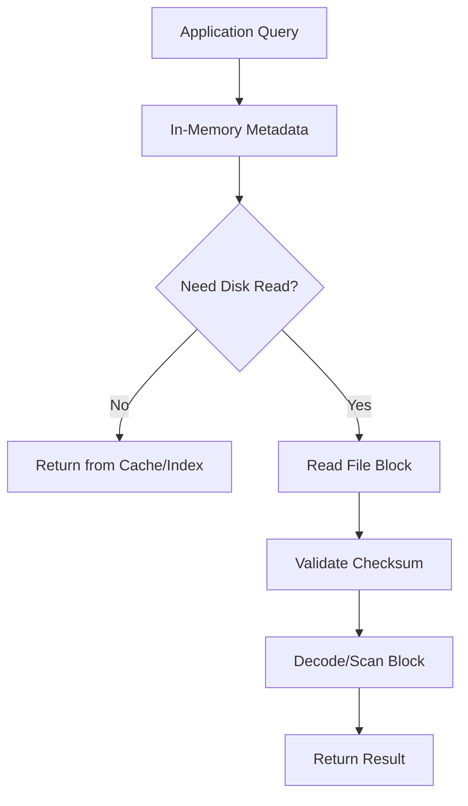
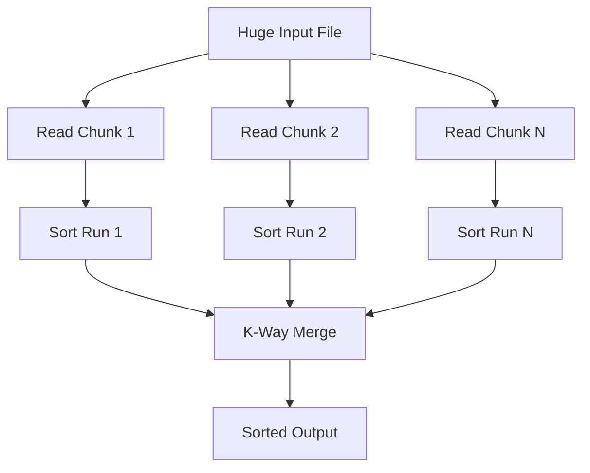
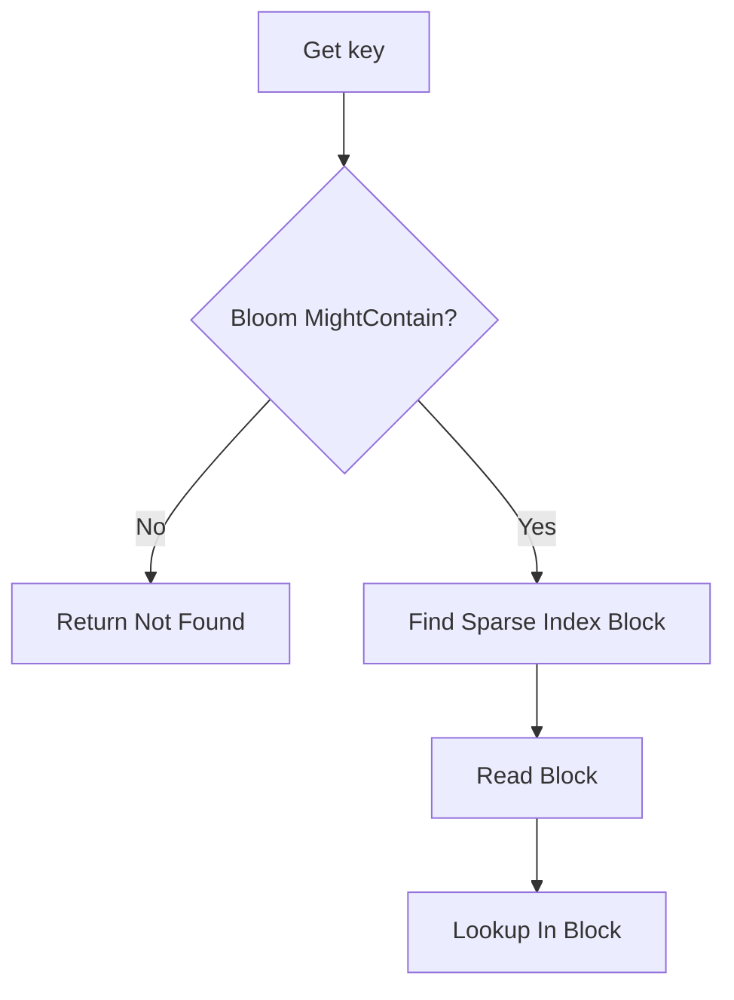
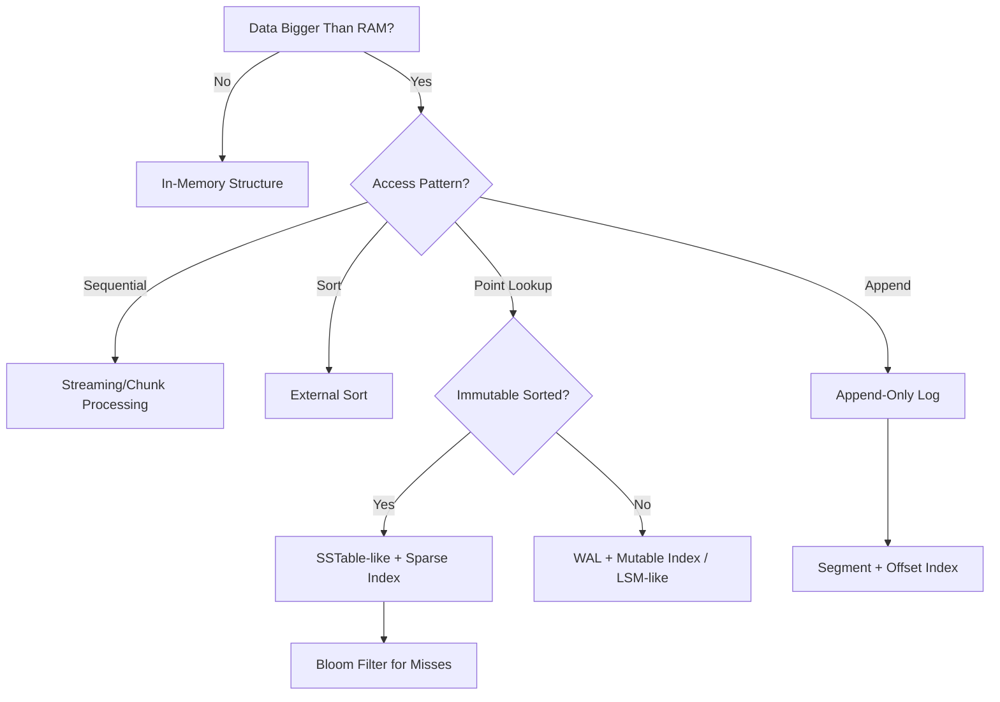

# learn-go-data-structure-algorithm-part-029.md

# Part 029 — External Memory Algorithms and File-Backed Structures

> Seri: `learn-go-data-structure-algorithm`  
> Bagian: `029 / 034`  
> Target pembaca: Java software engineer yang ingin menguasai Go data structure & algorithm sampai level production-grade  
> Fokus: algoritma dan struktur data ketika data tidak muat di RAM: block/page model, buffered I/O, external sorting, k-way merge, file-backed index, append-only log, SSTable-like immutable file, sparse index, page cache, mmap caveat, crash consistency, checksums, versioned file format, dan desain Go yang aman

---

## Daftar Isi

- [1. Tujuan Part Ini](#1-tujuan-part-ini)
- [2. Mental Model: RAM Bukan Satu-Satunya Tempat Struktur Data Hidup](#2-mental-model-ram-bukan-satu-satunya-tempat-struktur-data-hidup)
- [3. External Memory Model](#3-external-memory-model)
- [4. Cost Model: CPU vs Memory vs Disk I/O](#4-cost-model-cpu-vs-memory-vs-disk-io)
- [5. Block, Page, dan Chunk](#5-block-page-dan-chunk)
- [6. Buffered I/O di Go](#6-buffered-io-di-go)
- [7. Append-Only Log](#7-append-only-log)
- [8. Offset Index](#8-offset-index)
- [9. External Sorting](#9-external-sorting)
- [10. K-Way Merge](#10-k-way-merge)
- [11. File-Backed Sorted Table / SSTable-like Layout](#11-file-backed-sorted-table--sstable-like-layout)
- [12. Sparse Index](#12-sparse-index)
- [13. Bloom Filter untuk File-Backed Lookup](#13-bloom-filter-untuk-file-backed-lookup)
- [14. Page Cache dan Read Pattern](#14-page-cache-dan-read-pattern)
- [15. mmap Caveat](#15-mmap-caveat)
- [16. Crash Consistency](#16-crash-consistency)
- [17. Checksums, Magic, Version, dan Footer](#17-checksums-magic-version-dan-footer)
- [18. Compaction dan File Lifecycle](#18-compaction-dan-file-lifecycle)
- [19. Go API Design](#19-go-api-design)
- [20. Testing Strategy](#20-testing-strategy)
- [21. Benchmarking Strategy](#21-benchmarking-strategy)
- [22. Production Case Studies](#22-production-case-studies)
- [23. Anti-Patterns](#23-anti-patterns)
- [24. Decision Framework](#24-decision-framework)
- [25. Latihan Bertahap](#25-latihan-bertahap)
- [26. Ringkasan](#26-ringkasan)
- [27. Referensi](#27-referensi)

---

## 1. Tujuan Part Ini

Sampai bagian sebelumnya, mayoritas struktur data hidup di RAM.

Tetapi production system sering menghadapi kondisi:

```text
data terlalu besar untuk memory
data harus survive restart
data harus diproses streaming
data harus di-sort lebih besar dari RAM
index harus disimpan di file
read harus random-access tapi data di disk
write harus crash-safe
```

Part ini membahas **external memory algorithms** dan **file-backed structures**, yaitu cara mendesain struktur data ketika storage utama adalah file/disk/SSD/object-like stream, bukan hanya memory.

Contoh:

- external sort untuk file 500GB,
- append-only event log,
- file-backed key-value index,
- immutable sorted table,
- sparse index,
- k-way merge,
- disk block/page layout,
- checksum dan recovery,
- compaction,
- page-cache-aware read pattern.

---

## 2. Mental Model: RAM Bukan Satu-Satunya Tempat Struktur Data Hidup

### 2.1. In-Memory Structure

In-memory map:

```go
map[string][]byte
```

Kelebihan:

- cepat,
- API sederhana,
- random access mudah.

Kekurangan:

- hilang saat restart,
- memory terbatas,
- GC overhead,
- startup load bisa mahal,
- tidak cocok untuk data sangat besar.

---

### 2.2. File-Backed Structure

File-backed structure menyimpan data utama di file.

RAM menyimpan:

- cache,
- index kecil,
- metadata,
- buffer,
- bloom filter,
- sparse index.

Data besar tetap di disk.

---

### 2.3. Diagram



---

### 2.4. External Memory Thinking

In RAM, cost model sering:

```text
operation count
```

Di external memory:

```text
number of I/O operations
sequential vs random access
block size
buffering
page cache behavior
write amplification
fsync cost
crash recovery
```

---

## 3. External Memory Model

### 3.1. Block Model

External memory model memandang storage sebagai block.

```text
RAM can hold M items.
Disk transfers B items per I/O.
Cost = number of block transfers.
```

Tujuan:

```text
minimize random I/O
maximize sequential I/O
process in chunks
```

---

### 3.2. Sequential vs Random I/O

Sequential read:

```text
read file from start to end
```

Random read:

```text
seek to offset, read small chunk
```

SSD membuat random I/O lebih baik daripada HDD, tetapi sequential I/O tetap sering lebih efisien untuk throughput besar.

---

### 3.3. Page Cache

Operating system caches file pages in memory.

If you read file repeatedly:

```text
first read may hit disk
next read may hit page cache
```

Benchmark harus membedakan:

- cold cache,
- warm cache,
- memory-mapped,
- buffered I/O,
- direct I/O-like behavior if relevant.

---

### 3.4. Disk Layout Matters

Good file layout:

```text
Header
Data blocks
Index blocks
Filter blocks
Footer
```

Bad layout:

```text
many tiny files
random small reads everywhere
unversioned raw bytes
no checksum
no footer pointer
```

---

## 4. Cost Model: CPU vs Memory vs Disk I/O

### 4.1. Cost Table

| Operation | Typical Concern |
|---|---|
| Sequential read | throughput, buffer size |
| Random read | latency, page cache miss |
| Small write | syscall overhead, fsync cost |
| Append write | efficient, log-friendly |
| Rewrite middle | crash consistency complex |
| Sort large file | temp disk space, merge passes |
| Many files | file descriptor, directory overhead |
| Checksums | CPU cost but corruption detection |
| Compression | CPU vs I/O trade-off |

---

### 4.2. I/O Amplification

I/O amplification:

```text
logical data processed vs physical bytes read/written
```

Example:

```text
read 100 bytes but must read 4KB page
write 10 bytes but rewrite 64KB block
compact 1GB to remove 10MB deleted data
```

---

### 4.3. Write Amplification

In LSM-like structures, data may be rewritten during compaction.

```text
write once to log
write to table
rewrite during compaction
```

This improves read/query shape but increases writes.

---

### 4.4. Memory Amplification

Index, bloom filter, cache, buffers consume memory.

A file-backed structure is not memory-free.

---

## 5. Block, Page, dan Chunk

### 5.1. Why Blocks?

Reading/writing one record at a time causes many syscalls and poor throughput.

Batch into blocks:

```text
Block = many records + metadata + checksum
```

Benefits:

- sequential read,
- fewer syscalls,
- checksum per block,
- compression per block,
- sparse index per block.

---

### 5.2. Block Layout

```text
+----------------+
| block magic    |
| record count   |
| payload length |
| payload bytes  |
| checksum       |
+----------------+
```

---

### 5.3. Fixed vs Variable Block

Fixed-size block:

- easier random access,
- can waste space,
- simpler page cache behavior.

Variable-size block:

- better compression,
- variable offset table needed,
- index required.

---

### 5.4. Block Size Trade-Off

Small block:

- less read amplification,
- more metadata/index overhead,
- more syscalls/random I/O.

Large block:

- better sequential throughput,
- better compression,
- more read amplification,
- more memory per read.

Common starting points:

```text
4KB, 16KB, 32KB, 64KB, 256KB
```

Choose by workload and benchmark.

---

## 6. Buffered I/O di Go

### 6.1. Direct `os.File` Reads/Writes

```go
f, err := os.Open("data.bin")
if err != nil {
	return err
}
defer f.Close()
```

`os.File` supports `Read`, `Write`, `ReadAt`, `WriteAt`, `Seek`.

---

### 6.2. Buffered Writer

```go
import (
	"bufio"
	"os"
)

func WriteLines(path string, lines []string) error {
	f, err := os.Create(path)
	if err != nil {
		return err
	}
	defer f.Close()

	w := bufio.NewWriterSize(f, 1<<20)

	for _, line := range lines {
		if _, err := w.WriteString(line); err != nil {
			return err
		}
		if err := w.WriteByte('\n'); err != nil {
			return err
		}
	}

	if err := w.Flush(); err != nil {
		return err
	}

	return f.Sync()
}
```

---

### 6.3. Buffered Reader

```go
func ReadLines(path string, fn func(string) error) error {
	f, err := os.Open(path)
	if err != nil {
		return err
	}
	defer f.Close()

	scanner := bufio.NewScanner(f)
	buf := make([]byte, 0, 1024*1024)
	scanner.Buffer(buf, 64*1024*1024)

	for scanner.Scan() {
		if err := fn(scanner.Text()); err != nil {
			return err
		}
	}

	return scanner.Err()
}
```

Caveat:

- `bufio.Scanner` has token size limits unless configured.
- For huge records, use `bufio.Reader`.

---

### 6.4. `ReadAt` for Random Access

```go
func ReadRecordAt(f *os.File, offset int64, size int) ([]byte, error) {
	buf := make([]byte, size)
	_, err := f.ReadAt(buf, offset)
	if err != nil {
		return nil, err
	}
	return buf, nil
}
```

`ReadAt` does not change file offset and is useful for concurrent random reads.

---

### 6.5. `io.ReaderAt` Abstraction

Use interface:

```go
type ReaderAt interface {
	ReadAt(p []byte, off int64) (n int, err error)
}
```

This supports:

- `*os.File`,
- bytes reader,
- custom readers,
- tests.

---

## 7. Append-Only Log

### 7.1. Mental Model

Append-only log writes records only at end.

Benefits:

- simple write path,
- sequential writes,
- crash recovery easier,
- old data retained for replay,
- natural event sourcing.

---

### 7.2. Record Format

A simple record:

```text
length uint32
payload bytes
crc32 uint32
```

---

### 7.3. Write Record

```go
package fileds

import (
	"encoding/binary"
	"hash/crc32"
	"io"
)

func WriteRecord(w io.Writer, payload []byte) error {
	if len(payload) > int(^uint32(0)) {
		return ErrRecordTooLarge
	}

	var header [4]byte
	binary.LittleEndian.PutUint32(header[:], uint32(len(payload)))

	if _, err := w.Write(header[:]); err != nil {
		return err
	}
	if _, err := w.Write(payload); err != nil {
		return err
	}

	var trailer [4]byte
	sum := crc32.ChecksumIEEE(payload)
	binary.LittleEndian.PutUint32(trailer[:], sum)

	_, err := w.Write(trailer[:])
	return err
}
```

Error:

```go
import "errors"

var ErrRecordTooLarge = errors.New("record too large")
```

---

### 7.4. Read Record

```go
var ErrCorruptRecord = errors.New("corrupt record")

func ReadRecord(r io.Reader) ([]byte, error) {
	var header [4]byte
	if _, err := io.ReadFull(r, header[:]); err != nil {
		return nil, err
	}

	n := binary.LittleEndian.Uint32(header[:])
	payload := make([]byte, n)

	if _, err := io.ReadFull(r, payload); err != nil {
		return nil, err
	}

	var trailer [4]byte
	if _, err := io.ReadFull(r, trailer[:]); err != nil {
		return nil, err
	}

	want := binary.LittleEndian.Uint32(trailer[:])
	got := crc32.ChecksumIEEE(payload)
	if got != want {
		return nil, ErrCorruptRecord
	}

	return payload, nil
}
```

---

### 7.5. Recovery

On startup:

```text
read record by record
if EOF at clean boundary -> ok
if partial tail -> truncate to last good offset
if checksum mismatch -> stop and investigate/truncate depending policy
```

---

### 7.6. Append Log Limitations

Append-only log grows forever.

Need:

- segment files,
- compaction,
- snapshot,
- retention policy,
- index rebuild,
- fsync policy.

---

## 8. Offset Index

### 8.1. Why Offset Index?

If records are variable-length, record N is not at fixed offset.

Offset index maps:

```text
key -> file offset
```

or:

```text
record number -> file offset
```

---

### 8.2. In-Memory Offset Index

```go
type OffsetIndex[K comparable] struct {
	offsets map[K]int64
}

func NewOffsetIndex[K comparable]() *OffsetIndex[K] {
	return &OffsetIndex[K]{offsets: make(map[K]int64)}
}

func (i *OffsetIndex[K]) Set(k K, off int64) {
	i.offsets[k] = off
}

func (i *OffsetIndex[K]) Get(k K) (int64, bool) {
	off, ok := i.offsets[k]
	return off, ok
}
```

---

### 8.3. File-Backed Offset Index

For large indexes, keep index file sorted by key:

```text
key, offset
key, offset
key, offset
```

Then binary search if fixed-size keys or block index if variable.

---

### 8.4. Dense Record Offset Table

For record number:

```go
type DenseOffsetTable struct {
	offsets []int64
}

func (t DenseOffsetTable) Offset(i int) (int64, bool) {
	if i < 0 || i >= len(t.offsets) {
		return 0, false
	}
	return t.offsets[i], true
}
```

Memory:

```text
8 bytes * records
```

For 1 billion records:

```text
8GB just for offsets
```

Need sparse index/blocking.

---

## 9. External Sorting

### 9.1. Problem

Sort file bigger than memory.

External sort:

1. read chunks that fit memory,
2. sort each chunk in memory,
3. write sorted runs,
4. merge sorted runs.

---

### 9.2. Diagram



---

### 9.3. Chunk Sort Skeleton

Assume line-based records.

```go
func WriteSortedRun(lines []string, dir string, runID int) (string, error) {
	slices.Sort(lines)

	path := filepath.Join(dir, fmt.Sprintf("run-%06d.txt", runID))
	f, err := os.Create(path)
	if err != nil {
		return "", err
	}
	defer f.Close()

	w := bufio.NewWriterSize(f, 1<<20)
	for _, line := range lines {
		if _, err := w.WriteString(line); err != nil {
			return "", err
		}
		if err := w.WriteByte('\n'); err != nil {
			return "", err
		}
	}

	if err := w.Flush(); err != nil {
		return "", err
	}

	return path, f.Sync()
}
```

Imports:

```go
import (
	"bufio"
	"fmt"
	"os"
	"path/filepath"
	"slices"
)
```

---

### 9.4. Chunk Sizing

Chunk size should consider:

- memory limit,
- record overhead,
- sort memory,
- output buffer,
- GC overhead.

Do not load exactly max memory.

Leave headroom.

---

### 9.5. External Sort Complexity

If each pass reads and writes all data:

```text
I/O cost = number of passes * data size
```

K-way merge reduces number of passes but uses more file descriptors and buffers.

---

## 10. K-Way Merge

### 10.1. Problem

Merge many sorted runs into one sorted output.

Use min-heap containing current item from each run.

---

### 10.2. Heap Item

```go
type mergeItem struct {
	value string
	run   int
}

type mergeHeap []mergeItem

func (h mergeHeap) Len() int { return len(h) }

func (h mergeHeap) Less(i, j int) bool {
	return h[i].value < h[j].value
}

func (h mergeHeap) Swap(i, j int) {
	h[i], h[j] = h[j], h[i]
}

func (h *mergeHeap) Push(x any) {
	*h = append(*h, x.(mergeItem))
}

func (h *mergeHeap) Pop() any {
	old := *h
	n := len(old)
	x := old[n-1]
	*h = old[:n-1]
	return x
}
```

---

### 10.3. Run Reader

```go
type lineRunReader struct {
	scanner *bufio.Scanner
	file    *os.File
}

func openLineRun(path string) (*lineRunReader, error) {
	f, err := os.Open(path)
	if err != nil {
		return nil, err
	}

	scanner := bufio.NewScanner(f)
	scanner.Buffer(make([]byte, 0, 1024*1024), 64*1024*1024)

	return &lineRunReader{
		scanner: scanner,
		file:    f,
	}, nil
}

func (r *lineRunReader) Next() (string, bool, error) {
	if r.scanner.Scan() {
		return r.scanner.Text(), true, nil
	}
	if err := r.scanner.Err(); err != nil {
		return "", false, err
	}
	return "", false, nil
}

func (r *lineRunReader) Close() error {
	return r.file.Close()
}
```

---

### 10.4. Merge Runs

```go
func MergeRuns(paths []string, outPath string) error {
	readers := make([]*lineRunReader, len(paths))
	defer func() {
		for _, r := range readers {
			if r != nil {
				_ = r.Close()
			}
		}
	}()

	h := &mergeHeap{}
	heap.Init(h)

	for i, path := range paths {
		r, err := openLineRun(path)
		if err != nil {
			return err
		}
		readers[i] = r

		v, ok, err := r.Next()
		if err != nil {
			return err
		}
		if ok {
			heap.Push(h, mergeItem{value: v, run: i})
		}
	}

	out, err := os.Create(outPath)
	if err != nil {
		return err
	}
	defer out.Close()

	w := bufio.NewWriterSize(out, 1<<20)

	for h.Len() > 0 {
		item := heap.Pop(h).(mergeItem)

		if _, err := w.WriteString(item.value); err != nil {
			return err
		}
		if err := w.WriteByte('\n'); err != nil {
			return err
		}

		next, ok, err := readers[item.run].Next()
		if err != nil {
			return err
		}
		if ok {
			heap.Push(h, mergeItem{value: next, run: item.run})
		}
	}

	if err := w.Flush(); err != nil {
		return err
	}
	return out.Sync()
}
```

---

### 10.5. File Descriptor Limit

If thousands of runs, cannot open all at once.

Use multi-pass merge:

```text
merge groups of K runs
produce intermediate runs
merge again
```

K chosen based on:

- file descriptor limit,
- memory buffers,
- throughput.

---

## 11. File-Backed Sorted Table / SSTable-like Layout

### 11.1. Mental Model

An immutable sorted table stores key-value records sorted by key.

Write once:

```text
records sorted by key
block them
write data blocks
write index
write footer
```

Read:

```text
use index to find block
read block
binary search/scan inside block
```

---

### 11.2. Layout

```text
+------------------+
| Data Block 0     |
+------------------+
| Data Block 1     |
+------------------+
| Data Block N     |
+------------------+
| Index Block      |
+------------------+
| Bloom Filter     |
+------------------+
| Footer           |
+------------------+
```

Footer contains offsets to index/filter.

---

### 11.3. Record Format Inside Block

Simplified:

```text
keyLen uint32
valueLen uint32
key bytes
value bytes
```

Block can have:

- record count,
- restart points,
- checksum,
- compression.

---

### 11.4. Writer Invariant

```text
keys must be written in strictly increasing order
table is immutable after finish
footer is written last
file is only considered valid if footer exists and checksum passes
```

---

### 11.5. Simple Sorted Table Record

```go
type KV struct {
	Key   []byte
	Value []byte
}

func CompareBytes(a, b []byte) int {
	return bytes.Compare(a, b)
}
```

Import:

```go
import "bytes"
```

---

### 11.6. Block Builder

```go
type BlockBuilder struct {
	buf   []byte
	count uint32
}

func (b *BlockBuilder) Add(key, value []byte) bool {
	if len(key) > int(^uint32(0)) || len(value) > int(^uint32(0)) {
		return false
	}

	var tmp [8]byte
	binary.LittleEndian.PutUint32(tmp[0:4], uint32(len(key)))
	binary.LittleEndian.PutUint32(tmp[4:8], uint32(len(value)))

	b.buf = append(b.buf, tmp[:]...)
	b.buf = append(b.buf, key...)
	b.buf = append(b.buf, value...)
	b.count++

	return true
}

func (b *BlockBuilder) Bytes() []byte {
	out := make([]byte, len(b.buf))
	copy(out, b.buf)
	return out
}

func (b *BlockBuilder) Reset() {
	b.buf = b.buf[:0]
	b.count = 0
}

func (b *BlockBuilder) Len() int {
	return len(b.buf)
}
```

---

### 11.7. Block Scan Lookup

```go
func LookupInBlock(block []byte, target []byte) ([]byte, bool, error) {
	for len(block) > 0 {
		if len(block) < 8 {
			return nil, false, ErrCorruptRecord
		}

		keyLen := binary.LittleEndian.Uint32(block[0:4])
		valLen := binary.LittleEndian.Uint32(block[4:8])
		block = block[8:]

		total := uint64(keyLen) + uint64(valLen)
		if total > uint64(len(block)) {
			return nil, false, ErrCorruptRecord
		}

		key := block[:keyLen]
		value := block[keyLen:total]

		cmp := bytes.Compare(key, target)
		if cmp == 0 {
			return append([]byte(nil), value...), true, nil
		}
		if cmp > 0 {
			return nil, false, nil
		}

		block = block[total:]
	}

	return nil, false, nil
}
```

---

### 11.8. Immutable Table Advantages

- simple concurrency,
- safe sharing,
- sequential write,
- binary-searchable,
- easy checksum,
- compaction-friendly.

Disadvantages:

- updates require new table,
- deletion via tombstone/compaction,
- multiple table lookup if LSM-like,
- index/filter memory.

---

## 12. Sparse Index

### 12.1. Full Index

Full index:

```text
key -> offset for every key
```

Memory heavy.

Sparse index:

```text
first key of each block -> block offset
```

Lookup:

1. find last index key <= target,
2. read block at offset,
3. scan/search block.

---

### 12.2. Sparse Index Entry

```go
type IndexEntry struct {
	FirstKey []byte
	Offset   int64
	Size     int
}
```

---

### 12.3. Lookup Block

```go
func FindBlock(index []IndexEntry, key []byte) (IndexEntry, bool) {
	i := sort.Search(len(index), func(i int) bool {
		return bytes.Compare(index[i].FirstKey, key) > 0
	})

	if i == 0 {
		return IndexEntry{}, false
	}

	return index[i-1], true
}
```

Import:

```go
import "sort"
```

---

### 12.4. Sparse Index Trade-Off

Larger block:

- smaller index,
- more scan/read amplification.

Smaller block:

- larger index,
- less read amplification.

---

### 12.5. Index Key Copy

Index stores keys. Must copy key bytes.

Bad:

```go
entry.FirstKey = key
```

if key buffer reused.

Good:

```go
entry.FirstKey = append([]byte(nil), key...)
```

---

## 13. Bloom Filter untuk File-Backed Lookup

### 13.1. Why Bloom Filter?

If key not in table, avoid disk read.

```text
if bloom says definitely no:
    return not found
else:
    read block/index
```

---

### 13.2. Placement

Bloom filter can be:

- per table,
- per block,
- partitioned by key range.

Per-block filter can reduce read amplification more but costs more metadata.

---

### 13.3. False Positive Cost

Bloom false positive causes extra disk read.

False positive is acceptable because lookup verifies in block.

False negative is not acceptable.

---

### 13.4. Integration

Read path:



---

## 14. Page Cache dan Read Pattern

### 14.1. OS Page Cache

The OS caches file pages.

If your structure has good locality:

- repeated block reads become memory reads,
- sequential scans are efficient,
- random reads may still benefit if hot.

---

### 14.2. Access Pattern

Patterns:

| Pattern | Notes |
|---|---|
| Sequential scan | best throughput |
| Random point lookup | index/filter important |
| Range scan | sorted layout helps |
| Hot key lookup | cache block/value |
| Cold random lookup | latency sensitive |

---

### 14.3. Application Cache vs Page Cache

You may have:

- OS page cache,
- block cache,
- object cache,
- query cache.

Too many caches can waste memory.

Ask:

```text
What level should be cached?
raw block?
decoded record?
query result?
```

---

### 14.4. Read Amplification

If one key lookup reads 64KB block:

```text
logical read = one value
physical read = 64KB
```

This is read amplification.

May be acceptable if values nearby are also used.

---

## 15. mmap Caveat

### 15.1. What mmap Does

Memory mapping maps file pages into virtual memory.

Program accesses bytes like memory; OS loads pages on demand.

Go standard library does not provide high-level mmap API; usually platform-specific syscall or external package.

---

### 15.2. Benefits

- zero-copy-like file access,
- OS handles paging,
- convenient random access,
- good for immutable files.

---

### 15.3. Risks

- page faults can happen at access time,
- SIGBUS-like failure if file truncated depending OS/package,
- lifecycle/unmap complexity,
- platform-specific behavior,
- memory accounting confusing,
- unsafe interactions if converting bytes to structs.

---

### 15.4. Guidance

mmap is useful for:

- immutable indexes,
- large read-only tables,
- controlled environment.

But start with:

```text
os.File + ReadAt + buffering
```

Then benchmark.

---

## 16. Crash Consistency

### 16.1. Problem

Crash can happen between writes.

Example:

```text
write data block
write index
write footer
```

If crash before footer, file should be treated incomplete.

---

### 16.2. Atomic File Replace

Write new file to temp path:

```text
data.tmp
```

fsync file, close, rename to final:

```text
data.sst
```

On many filesystems, rename within same directory is atomic.

Also fsync directory if strict durability required.

---

### 16.3. Commit Marker

Footer can act as commit marker.

Valid file:

```text
footer exists
magic ok
checksum ok
index offset valid
```

Invalid/incomplete file ignored or recovered.

---

### 16.4. fsync Policy

`Write` does not guarantee durable data on disk.

Use `File.Sync()` when durability matters.

Trade-off:

- more safety,
- higher latency.

Batch fsync for throughput if semantics allow.

---

### 16.5. WAL Pattern

For mutable file-backed structure:

1. write intent/update to WAL,
2. fsync WAL,
3. apply to data/index,
4. checkpoint/compact later.

WAL enables recovery after crash.

---

## 17. Checksums, Magic, Version, dan Footer

### 17.1. File Header

Header helps identify file.

```go
type FileHeader struct {
	Magic   [4]byte
	Version uint16
	Flags   uint16
}
```

---

### 17.2. Magic

Example:

```text
"GDSA"
```

Magic prevents reading wrong file type.

---

### 17.3. Version

Version supports format evolution.

On read:

```text
if version unsupported -> error
```

---

### 17.4. Footer

Footer written last.

Contains:

```text
index offset
index length
filter offset
filter length
data checksum
magic
```

Footer fixed-size makes it easy to read from end.

---

### 17.5. Checksum

Use checksum per block.

```go
func AppendChecksum(payload []byte) []byte {
	sum := crc32.ChecksumIEEE(payload)
	var tmp [4]byte
	binary.LittleEndian.PutUint32(tmp[:], sum)
	out := make([]byte, 0, len(payload)+4)
	out = append(out, payload...)
	out = append(out, tmp[:]...)
	return out
}
```

---

### 17.6. Validate Before Trust

Never trust offsets/lengths before validation.

Validation checklist:

- file size >= minimum,
- magic ok,
- version supported,
- offsets non-negative,
- sections within file,
- lengths not overflow,
- checksum matches,
- index sorted,
- block boundaries valid.

---

## 18. Compaction dan File Lifecycle

### 18.1. Why Compaction?

Append-only and immutable tables accumulate:

- duplicate keys,
- old versions,
- tombstones,
- deleted data,
- many small files.

Compaction rewrites data into cleaner files.

---

### 18.2. Compaction Process

```text
read old files
merge by key/version
drop obsolete records
write new file
fsync
atomic publish manifest
delete old files later
```

---

### 18.3. Manifest

A manifest lists active files.

```text
MANIFEST:
table-001.sst
table-002.sst
```

Update manifest atomically.

---

### 18.4. Tombstones

Deletion in immutable table often represented as tombstone.

```text
key -> deleted marker
```

Compaction eventually removes old value and tombstone if safe.

---

### 18.5. File Deletion Safety

Do not delete old files while readers may still use them.

Options:

- reference counting,
- epoch-based cleanup,
- delay deletion,
- reopen by manifest per query,
- immutable snapshot of file set.

---

## 19. Go API Design

### 19.1. Reader Interfaces

```go
type KVReader interface {
	Get(key []byte) ([]byte, bool, error)
	Close() error
}
```

Decide ownership:

```text
Does returned []byte need copying?
Is it valid after next call?
Can caller mutate it?
```

Production default:

```text
return copy unless documented otherwise
```

---

### 19.2. Writer Interfaces

```go
type KVWriter interface {
	Add(key, value []byte) error
	Finish() error
	Abort() error
}
```

For sorted table writer:

```text
Add keys in increasing order
```

Document and enforce.

---

### 19.3. Options

```go
type TableOptions struct {
	BlockSize int
	SyncOnFinish bool
	UseBloom bool
}
```

Validate options.

---

### 19.4. Errors

Use explicit errors:

```go
var (
	ErrKeyOutOfOrder = errors.New("key out of order")
	ErrClosed        = errors.New("closed")
	ErrCorruptFile   = errors.New("corrupt file")
	ErrNotFound      = errors.New("not found")
)
```

For `Get`, prefer `(value, found, error)` so not-found is not exceptional.

---

### 19.5. Close Semantics

File-backed structures own file descriptors.

Need:

- `Close` idempotent or documented,
- no read after close,
- background goroutines stopped,
- buffers flushed.

---

## 20. Testing Strategy

### 20.1. Round-Trip Tests

```text
write records
close
open
read records
compare
```

---

### 20.2. Corruption Tests

Manually corrupt:

- magic,
- version,
- checksum,
- footer offset,
- block length,
- truncated tail.

Reader must return error, not panic.

---

### 20.3. Crash Simulation

Simulate crash at points:

- before data write complete,
- after data before index,
- after index before footer,
- after footer before rename,
- after rename.

Use temp directories.

---

### 20.4. External Sort Test

Generate random data bigger than chunk size.

Sort externally.

Compare to in-memory sorted result for test-sized data.

---

### 20.5. Fuzz Decoders

Fuzz block reader and footer parser.

Parser must not panic for arbitrary bytes.

---

### 20.6. Golden Files

For versioned file format, keep golden test files.

Ensure new reader can read old version if compatibility promised.

---

## 21. Benchmarking Strategy

### 21.1. Separate Build and Query

Benchmark separately:

- write/build table,
- open table,
- point lookup hit,
- point lookup miss,
- range scan,
- full scan,
- compaction.

---

### 21.2. Cold vs Warm Cache

Warm cache benchmark may measure memory/page cache, not disk.

Cold cache is harder to benchmark reliably and OS-specific.

At least label results clearly.

---

### 21.3. Dataset Shape

Benchmark with:

- small values,
- large values,
- sorted inserts,
- random keys,
- prefix-compressible keys,
- high miss rate,
- hot key distribution,
- range scans.

---

### 21.4. Metrics

Track:

- ns/op,
- allocs/op,
- bytes read,
- syscalls if possible,
- throughput MB/s,
- p95/p99 lookup latency,
- file size,
- index memory,
- bloom false positive rate,
- compaction write amplification.

---

### 21.5. Avoid Benchmarking Scanner Accidentally

`bufio.Scanner` can be convenient but not always fastest or suitable for huge tokens.

For serious file processing, compare:

- scanner,
- reader ReadSlice/ReadBytes,
- manual buffer,
- binary block format.

---

## 22. Production Case Studies

### 22.1. Large CSV/Log External Sort

Requirement:

```text
Sort 200GB log file by timestamp.
Memory limit 4GB.
```

Use:

- chunk read,
- parse key,
- sort chunks,
- write runs,
- k-way merge,
- bounded open files,
- temp disk capacity check.

---

### 22.2. Immutable Lookup Table

Requirement:

```text
Read-only mapping loaded from daily export.
Too large for full map memory.
```

Use:

- sorted file-backed table,
- sparse index in memory,
- bloom filter,
- block cache.

---

### 22.3. Event Store Segment

Requirement:

```text
Append events durably.
Replay by offset.
```

Use:

- append-only segment,
- length + payload + checksum,
- offset index,
- segment roll,
- fsync policy,
- recovery truncates partial tail.

---

### 22.4. LSM-like KV Store

Requirement:

```text
High write throughput.
Point lookup by key.
```

Use:

- memtable,
- WAL,
- immutable sorted table flush,
- bloom filter,
- sparse index,
- compaction.

This is complex but core to many storage engines.

---

### 22.5. Audit Archive

Requirement:

```text
Historical audit records mostly append, rarely updated.
Need range scan by date and occasional lookup.
```

Use:

- partition by date,
- block files,
- offset index,
- compressed immutable blocks,
- manifest.

---

## 23. Anti-Patterns

### 23.1. Loading Huge File Fully Into Memory by Accident

```go
data, _ := os.ReadFile(path)
```

for multi-GB files can OOM.

Use streaming/chunked processing.

---

### 23.2. One File per Tiny Record

Millions of tiny files cause metadata overhead and poor performance.

Batch into segments/blocks.

---

### 23.3. No Checksum

Silent corruption becomes wrong answers.

Add checksum for blocks/records.

---

### 23.4. No Format Version

You cannot evolve safely.

---

### 23.5. Trusting File Offsets

Corrupt/untrusted file can cause panic or invalid read.

Validate.

---

### 23.6. fsync Everywhere Without Batching

Durability improves but throughput collapses.

Define durability policy.

---

### 23.7. Ignoring File Descriptor Limits

K-way merge with thousands of files can fail.

Use multi-pass merge.

---

### 23.8. Treating mmap as Magic Performance

mmap changes failure modes and measurement. Benchmark and understand lifecycle.

---

## 24. Decision Framework

### 24.1. Questions

```text
1. Does data fit in memory with headroom?
2. Is data mutable or immutable?
3. Is access sequential, random, or range?
4. Is write append-only or update-in-place?
5. What durability guarantee is required?
6. Is crash recovery required?
7. Is lookup hit/miss ratio known?
8. Can bloom filter avoid disk reads?
9. How much index can be kept in RAM?
10. What is compaction/retention policy?
```

---

### 24.2. Decision Table

| Requirement | Design |
|---|---|
| Stream process huge file | buffered chunk scan |
| Sort bigger than RAM | external sort |
| Append durable events | append-only log + checksum |
| Random record by number | dense/sparse offset table |
| Point lookup sorted immutable data | SSTable-like table |
| Frequent writes + reads | WAL + memtable + table flush |
| High miss rate lookup | bloom filter |
| Range scan | sorted block layout |
| Many old versions/deletes | compaction |
| Strict crash safety | WAL/fsync/atomic rename |

---

### 24.3. Flowchart



---

## 25. Latihan Bertahap

### 25.1. Level 1 — Append Log

Implement:

1. record format length + payload + checksum,
2. append,
3. read sequential,
4. recover partial tail,
5. tests for corruption.

---

### 25.2. Level 2 — Offset Index

Implement:

1. record ID -> offset,
2. random read by offset,
3. sparse offset every N records,
4. benchmark dense vs sparse.

---

### 25.3. Level 3 — External Sort

Implement:

1. chunk reader,
2. in-memory chunk sort,
3. run writer,
4. k-way merge,
5. file descriptor limit handling.

---

### 25.4. Level 4 — Sorted Table

Implement:

1. sorted writer requiring increasing keys,
2. block builder,
3. sparse index,
4. footer,
5. block lookup.

---

### 25.5. Level 5 — Bloom + Table

Add:

1. bloom filter per table,
2. miss fast path,
3. false positive metric,
4. benchmark hit/miss.

---

### 25.6. Level 6 — Crash-Safe Build

Implement:

1. write to temp file,
2. sync,
3. atomic rename,
4. manifest update,
5. recovery after simulated crash.

---

## 26. Ringkasan

External memory algorithms and file-backed structures are about designing around I/O, not just CPU complexity.

Key takeaways:

- Data may not fit in RAM; process in blocks/chunks.
- Sequential I/O is often much cheaper than random I/O.
- Buffered I/O reduces syscall overhead.
- Append-only logs simplify durable writes and recovery.
- Offset indexes make variable-length records randomly accessible.
- External sort uses sorted runs + k-way merge.
- SSTable-like layout uses immutable sorted blocks, sparse index, bloom filter, and footer.
- Checksums detect corruption.
- Footer/magic/version make files self-describing and recoverable.
- Crash consistency requires temp files, fsync policy, atomic rename, or WAL.
- Compaction manages old versions, tombstones, and file growth.
- mmap can help but changes failure modes.

Production mental model:

```text
When data leaves RAM, the core unit of design becomes the block.
Minimize I/O, validate bytes, version formats, and design for crash/recovery from day one.
```

---

## 27. Referensi

Referensi utama yang relevan untuk part ini:

- Go 1.26 Release Notes — `https://go.dev/doc/go1.26`
- Go Release History — `https://go.dev/doc/devel/release`
- Go Language Specification — `https://go.dev/ref/spec`
- Package `os` — `https://pkg.go.dev/os`
- Package `io` — `https://pkg.go.dev/io`
- Package `bufio` — `https://pkg.go.dev/bufio`
- Package `encoding/binary` — `https://pkg.go.dev/encoding/binary`
- Package `hash/crc32` — `https://pkg.go.dev/hash/crc32`
- Package `container/heap` — `https://pkg.go.dev/container/heap`
- Package `bytes` — `https://pkg.go.dev/bytes`
- Package `sort` — `https://pkg.go.dev/sort`
- Package `slices` — `https://pkg.go.dev/slices`
- Package `path/filepath` — `https://pkg.go.dev/path/filepath`
- Package `testing` — `https://pkg.go.dev/testing`

---

# Status Seri

Selesai:

- Part 000 — Roadmap, Mental Model, dan Batasan Seri
- Part 001 — Complexity Model yang Realistis di Go
- Part 002 — Arrays, Slices, dan Sequence Design
- Part 003 — Maps, Hash Tables, dan Associative Data
- Part 004 — Sorting, Ordering, Comparison, dan Search
- Part 005 — Stack, Queue, Deque, dan Worklist Algorithms
- Part 006 — Linked List, Intrusive List, dan Pointer-Chasing Trade-off
- Part 007 — Heap, Priority Queue, dan Scheduling Algorithms
- Part 008 — Sets, Multisets, Bag, dan Membership Models
- Part 009 — Strings, Bytes, Runes, Tokenization, dan Text Algorithms
- Part 010 — Recursion, Iteration, Backtracking, dan State Space Search
- Part 011 — Hashing, Fingerprint, Checksums, dan Equality Strategy
- Part 012 — Trees: Binary Tree, BST, Traversal, dan Structural Invariants
- Part 013 — Balanced Trees: AVL, Red-Black, Treap, dan Ordered Index
- Part 014 — B-Tree, B+Tree, Page-Oriented Structure, dan Storage-Aware Index
- Part 015 — Trie, Radix Tree, Patricia Tree, dan Prefix Index
- Part 016 — Graph Fundamentals: Representation, Traversal, dan Modelling
- Part 017 — Graph Algorithms for Production Systems
- Part 018 — Dynamic Programming: Memoization, Tabulation, dan State Compression
- Part 019 — Greedy Algorithms, Exchange Argument, dan Approximation Thinking
- Part 020 — Divide and Conquer, Selection, dan Search Space Reduction
- Part 021 — Range Query Structures: Prefix Sum, Fenwick Tree, Segment Tree
- Part 022 — Disjoint Set Union, Connectivity, dan Merge Semantics
- Part 023 — Probabilistic Data Structures
- Part 024 — Cache Data Structures: LRU, LFU, ARC-like Thinking, TTL Index
- Part 025 — Time, Scheduling, Rate Limiting, dan Window Algorithms
- Part 026 — Concurrent Data Structures in Go: Correctness Before Performance
- Part 027 — Persistent, Immutable, dan Versioned Data Structures
- Part 028 — Serialization-Aware and Layout-Aware Data Structures
- Part 029 — External Memory Algorithms and File-Backed Structures

Berikutnya:

- Part 030 — API Design for Reusable Data Structures in Go

<!-- NAVIGATION_FOOTER -->
<div class="page-nav">
<a href="./learn-go-data-structure-algorithm-part-028.md">⬅️ Part 028 — Serialization-Aware and Layout-Aware Data Structures</a>
<a href="./index.md">📚 Kategori</a>
<a href="../../index.md">🏠 Home</a>
<a href="./learn-go-data-structure-algorithm-part-030.md">Part 030 — API Design for Reusable Data Structures in Go ➡️</a>
</div>
