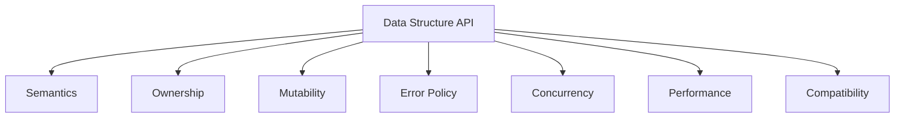
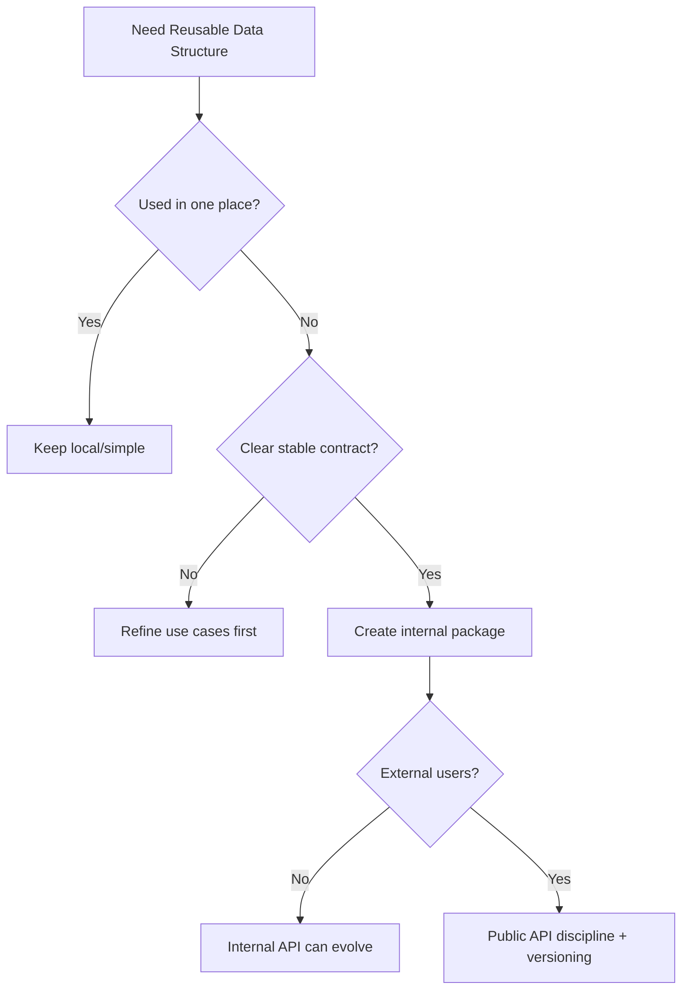

# learn-go-data-structure-algorithm-part-030.md

# Part 030 — API Design for Reusable Data Structures in Go

> Seri: `learn-go-data-structure-algorithm`  
> Bagian: `030 / 034`  
> Target pembaca: Java software engineer yang ingin menguasai Go data structure & algorithm sampai level production-grade  
> Fokus: desain API/package untuk struktur data reusable di Go: generics, constraints, ownership, mutability, zero value, constructors, options, iterator, error policy, concurrency contract, documentation, compatibility, tests, benchmarks, dan anti-abstraction

---

## Daftar Isi

- [1. Tujuan Part Ini](#1-tujuan-part-ini)
- [2. API Adalah Bagian dari Data Structure](#2-api-adalah-bagian-dari-data-structure)
- [3. Go Philosophy untuk Library Kecil](#3-go-philosophy-untuk-library-kecil)
- [4. Menentukan Scope Package](#4-menentukan-scope-package)
- [5. Naming dan Package Boundary](#5-naming-dan-package-boundary)
- [6. Generics: Kapan Dipakai, Kapan Tidak](#6-generics-kapan-dipakai-kapan-tidak)
- [7. Constraints dan Comparator Design](#7-constraints-dan-comparator-design)
- [8. Mutability dan Ownership Contract](#8-mutability-dan-ownership-contract)
- [9. Zero Value, Constructor, dan Options](#9-zero-value-constructor-dan-options)
- [10. Error Policy: panic, bool, error](#10-error-policy-panic-bool-error)
- [11. Iterator dan Range API](#11-iterator-dan-range-api)
- [12. Snapshot, Copy, Clone, dan Views](#12-snapshot-copy-clone-dan-views)
- [13. Concurrency Contract](#13-concurrency-contract)
- [14. Memory dan Capacity API](#14-memory-dan-capacity-api)
- [15. Serialization dan Persistence API](#15-serialization-dan-persistence-api)
- [16. Observability dan Stats](#16-observability-dan-stats)
- [17. Documentation yang Production-Grade](#17-documentation-yang-production-grade)
- [18. Testing Public Contract](#18-testing-public-contract)
- [19. Benchmark as API Guardrail](#19-benchmark-as-api-guardrail)
- [20. Compatibility dan Versioning](#20-compatibility-dan-versioning)
- [21. Case Study: Reusable LRU Package](#21-case-study-reusable-lru-package)
- [22. Case Study: Reusable Fenwick Package](#22-case-study-reusable-fenwick-package)
- [23. Case Study: Reusable Immutable Snapshot Map](#23-case-study-reusable-immutable-snapshot-map)
- [24. Anti-Patterns](#24-anti-patterns)
- [25. Decision Framework](#25-decision-framework)
- [26. Latihan Bertahap](#26-latihan-bertahap)
- [27. Ringkasan](#27-ringkasan)
- [28. Referensi](#28-referensi)

---

## 1. Tujuan Part Ini

Sampai part sebelumnya, kita sudah membahas banyak struktur data dan algoritma:

- slice,
- map,
- heap,
- tree,
- trie,
- graph,
- DP,
- range query,
- DSU,
- probabilistic structures,
- cache,
- time-based structures,
- concurrent structures,
- immutable/versioned structures,
- file-backed structures.

Part ini menjawab pertanyaan penting:

```text
Bagaimana mengubah struktur data menjadi package Go yang reusable,
jelas contract-nya,
mudah dipakai,
sulit disalahgunakan,
mudah dites,
mudah di-benchmark,
dan maintainable untuk jangka panjang?
```

Banyak engineer bisa menulis struktur data yang bekerja untuk satu kasus. Lebih sulit menulis API yang:

- tidak over-engineered,
- tidak under-specified,
- tidak membocorkan internal state,
- kompatibel dengan idiom Go,
- jelas tentang mutability dan ownership,
- memiliki error semantics yang konsisten,
- tidak mengorbankan performance secara tidak sadar.

---

## 2. API Adalah Bagian dari Data Structure

### 2.1. Struktur Data Tidak Hanya Internal Representation

Contoh LRU:

Internal:

```text
map + doubly linked list
```

API:

```go
Get(key) (value, ok)
Set(key, value)
Delete(key)
Len()
```

Tetapi API juga menentukan:

```text
Apakah Get mengubah recency?
Apakah Set meng-evict?
Apakah value yang dikembalikan boleh dimutasi?
Apakah concurrent-safe?
Apakah capacity 0 valid?
Apakah key/value nil valid?
Apakah eviction callback dipanggil saat update?
```

Jika tidak ditentukan, user akan menebak. Tebakan user menjadi bug.

---

### 2.2. API Menentukan Correctness Boundary

Data structure internal bisa benar, tetapi API bisa salah.

Contoh:

```go
func (c *Cache[K,V]) Contains(k K) bool
func (c *Cache[K,V]) Set(k K, v V)
```

User menulis:

```go
if !c.Contains(k) {
	c.Set(k, load(k))
}
```

Ini logical race pada concurrent context.

API yang lebih tepat:

```go
GetOrLoad
SetIfAbsent
```

atau dokumentasi bahwa operasi compound harus dilindungi caller.

---

### 2.3. API Menentukan Performance Boundary

Contoh:

```go
func (s *Set[T]) Items() []T
```

Apakah ini:

- copy O(n)?
- view internal O(1)?
- sorted?
- deterministic?
- safe setelah mutation?
- safe untuk concurrent use?

Nama `Items` tidak cukup.

---

### 2.4. Diagram API Contract



---

## 3. Go Philosophy untuk Library Kecil

### 3.1. Prefer Simple, Explicit API

Go library yang baik biasanya:

- kecil,
- jelas,
- composable,
- tidak terlalu banyak abstraction,
- dokumentasi kuat,
- error explicit,
- tidak magic.

Jangan membawa gaya Java collection framework secara mentah ke Go.

---

### 3.2. Avoid Framework-Like Data Structure API

Buruk:

```go
type Collection[T any] interface {
	Add(T)
	Remove(T)
	Contains(T) bool
	Iterator() Iterator[T]
	Stream() Stream[T]
	Filter(...)
	Map(...)
	Reduce(...)
}
```

Ini sering terlalu abstrak untuk Go.

Lebih baik:

```go
type Set[T comparable] struct { ... }

func (s *Set[T]) Add(v T) bool
func (s *Set[T]) Delete(v T) bool
func (s *Set[T]) Contains(v T) bool
```

---

### 3.3. Interfaces Are Accepted, Not Returned

Go idiom:

```text
Accept interfaces when you need behavior.
Return concrete types when you provide implementation.
```

Example:

```go
func WriteTo(w io.Writer) error
```

Good.

But returning large custom interface often hides useful methods and complicates compatibility.

---

### 3.4. No Premature Generic Abstraction

Do not make every structure generic if domain-specific type is clearer.

Example:

```go
type UserIDSet struct { ... }
```

may be better than:

```go
type Set[T comparable] struct { ... }
```

if it embeds domain validation/serialization.

---

## 4. Menentukan Scope Package

### 4.1. Package Should Have One Cohesive Purpose

Bad package:

```text
utils
common
helpers
collections
```

Often becomes dumping ground.

Better:

```text
lru
fenwick
bitset
rangeq
snapshot
scheduler
```

---

### 4.2. Package Naming

Go package names should be:

- short,
- lowercase,
- no underscore,
- not stuttering.

Good:

```go
package lru
```

Then use:

```go
cache := lru.New[string, User](1000)
```

Avoid:

```go
package lrucache
```

if usage becomes:

```go
lrucache.NewLRUCache()
```

Stutter.

---

### 4.3. Internal Package

If structure is only for your module:

```text
/internal/lru
/internal/rangeq
```

This prevents external dependency.

---

### 4.4. Public Package Requires More Discipline

If package exported publicly, you need:

- stable API,
- docs,
- examples,
- semantic versioning,
- compatibility promise,
- careful naming,
- no casual breaking changes.

Internal package can evolve faster.

---

### 4.5. Suggested Layout

```text
myproject/
  internal/
    lru/
      lru.go
      lru_test.go
      lru_bench_test.go
    rangeq/
      fenwick.go
      segment_tree.go
  pkg/
    bitset/
      bitset.go
```

Use `pkg` only if you intentionally expose for external use. It is not required by Go.

---

## 5. Naming dan Package Boundary

### 5.1. Exported vs Unexported

Export only what users need.

```go
type Cache[K comparable, V any] struct { ... } // exported
type entry[K comparable, V any] struct { ... } // unexported
```

Unexported internals allow refactoring.

---

### 5.2. Constructor Naming

Common:

```go
New
NewWithOptions
NewFrom
```

Example:

```go
func New[K comparable, V any](capacity int) *Cache[K,V]
func NewWithOptions[K comparable, V any](opts Options[K,V]) (*Cache[K,V], error)
```

---

### 5.3. Method Naming

Prefer Go-simple names:

```go
Get
Set
Add
Delete
Len
Clear
Reset
Clone
Snapshot
```

Avoid Java-style:

```go
PutElement
RetrieveValue
RemoveItemFromCollection
```

---

### 5.4. Bool Return Naming

For set add:

```go
func (s *Set[T]) Add(v T) bool
```

Document:

```text
Add returns true if v was not already present.
```

For delete:

```go
func (s *Set[T]) Delete(v T) bool
```

Document:

```text
Delete returns true if v was present.
```

---

### 5.5. Avoid Ambiguous Names

Ambiguous:

```go
Items()
Data()
Values()
Raw()
```

Better:

```go
Snapshot()
Clone()
ValuesCopy()
UnsafeView()
```

If unsafe view, name should scare user.

---

## 6. Generics: Kapan Dipakai, Kapan Tidak

### 6.1. Good Use Cases

Generics are useful for:

- set,
- stack,
- queue,
- heap wrapper,
- tree,
- LRU,
- optional value,
- pair,
- range structures over numeric types.

Example:

```go
type Stack[T any] struct {
	items []T
}
```

---

### 6.2. Bad Use Cases

Avoid generics when:

- type behavior needs complex domain rules,
- serialization/hashing unclear,
- generic API becomes hard to read,
- performance depends on specialized representation,
- only one type is used.

---

### 6.3. Comparable Constraint

Maps require comparable keys.

```go
type Set[T comparable] struct {
	m map[T]struct{}
}
```

---

### 6.4. Ordered Constraint

Use `cmp.Ordered` for ordered built-in types.

```go
type OrderedSet[T cmp.Ordered] struct { ... }
```

But many domain types need custom comparator.

---

### 6.5. Avoid Over-General Type Parameters

Bad:

```go
type Cache[K any, V any, H Hasher[K], E Evictor[K,V], C Clock] struct { ... }
```

This can become unreadable.

Prefer options with functions if needed.

---

### 6.6. Specialized Hot Path

For performance-critical structures, specialized version can be better.

Example:

```go
type IntFenwick struct { ... }
```

instead of generic numeric Fenwick if it avoids abstraction and supports optimized semantics.

---

## 7. Constraints dan Comparator Design

### 7.1. Ordered vs Comparator

Ordered:

```go
func LowerBound[T cmp.Ordered](xs []T, target T) int
```

Comparator:

```go
func LowerBoundFunc[T any](xs []T, target T, cmp func(a, b T) int) int
```

---

### 7.2. Comparator Contract

Comparator must define strict ordering.

For `cmp(a,b)`:

```text
<0: a < b
 0: a == b
>0: a > b
```

Must be:

- deterministic,
- transitive,
- consistent with equality semantics used by structure,
- no side effects.

---

### 7.3. Comparator Stored in Structure

Tree needs comparator:

```go
type Tree[T any] struct {
	root *node[T]
	cmp  func(a, b T) int
}
```

Constructor:

```go
func NewTree[T any](cmp func(a, b T) int) (*Tree[T], error) {
	if cmp == nil {
		return nil, errors.New("nil comparator")
	}
	return &Tree[T]{cmp: cmp}, nil
}
```

---

### 7.4. Comparator Function Cost

Comparator call can dominate in hot paths.

For simple ordered types, generic ordered version may be faster.

Offer both if justified:

```go
NewOrdered[T cmp.Ordered]()
NewFunc[T any](cmp func(a,b T) int)
```

---

### 7.5. Equality and Hashing

If key is not comparable or needs custom equality/hash, Go map cannot use it directly.

Options:

- canonicalize key to string/uint64,
- use comparable key type,
- store hash buckets manually,
- require caller to provide key ID,
- avoid generic custom hash map unless necessary.

---

## 8. Mutability dan Ownership Contract

### 8.1. Contract Must Be Explicit

For every `Get`/`Set` involving slices/maps/pointers, document ownership.

Example:

```go
// Set stores a copy of value.
func (c *Cache[K]) Set(key K, value []byte)
```

or:

```go
// Set stores value by reference. Callers must not mutate value while it is cached.
func (c *Cache[K]) Set(key K, value *Value)
```

---

### 8.2. Copy on Set

```go
func (s *BytesStore[K]) Set(k K, v []byte) {
	cp := append([]byte(nil), v...)
	s.m[k] = cp
}
```

Pros:

- safe from caller mutation.

Cons:

- allocation/copy.

---

### 8.3. Copy on Get

```go
func (s *BytesStore[K]) Get(k K) ([]byte, bool) {
	v, ok := s.m[k]
	if !ok {
		return nil, false
	}
	return append([]byte(nil), v...), true
}
```

Pros:

- caller cannot mutate internal.

Cons:

- allocation/copy per read.

---

### 8.4. View API

If performance needs no copy:

```go
func (s *BytesStore[K]) View(k K) ([]byte, bool)
```

Document:

```text
The returned slice aliases internal storage.
The caller must not mutate it.
The slice is invalid after the next mutation to the store.
```

Better name:

```go
UnsafeView
```

if risk is high.

---

### 8.5. Clone Method

```go
func (s *Set[T]) Clone() *Set[T] {
	out := NewSet[T]()
	for v := range s.m {
		out.m[v] = struct{}{}
	}
	return out
}
```

Clone should create independent structure.

---

### 8.6. Immutable Values

If API expects immutable values, say it.

```go
// Values stored in Snapshot must be immutable after publication.
```

This is common in high-performance Go because deep-copying arbitrary generic values is not possible.

---

## 9. Zero Value, Constructor, dan Options

### 9.1. Zero Value Usability

Go values often aim to be useful zero value.

Example:

```go
var b bytes.Buffer
b.WriteString("ok")
```

But not every structure should be zero-value usable.

---

### 9.2. Zero Value Good Fit

Good for:

- stack,
- simple queue,
- counter,
- builder.

Example:

```go
type Stack[T any] struct {
	items []T
}

func (s *Stack[T]) Push(v T) {
	s.items = append(s.items, v)
}
```

Zero value works.

---

### 9.3. Constructor Required

Need constructor when:

- capacity must be validated,
- map must be initialized,
- comparator required,
- options required,
- goroutine/resource started,
- file opened,
- hash seed created.

Example:

```go
func NewLRU[K comparable, V any](capacity int) (*LRU[K,V], error)
```

---

### 9.4. Options Struct

For many optional settings:

```go
type Options[K comparable, V any] struct {
	Capacity int
	OnEvict  func(K, V)
}
```

Constructor:

```go
func NewWithOptions[K comparable, V any](opts Options[K,V]) (*Cache[K,V], error)
```

---

### 9.5. Functional Options

Common but can be overused.

```go
type Option[K comparable, V any] func(*Options[K,V])

func WithCapacity[K comparable, V any](n int) Option[K,V] {
	return func(o *Options[K,V]) {
		o.Capacity = n
	}
}
```

Downside:

- more indirection,
- harder docs sometimes,
- generic options can be verbose.

Use Options struct unless functional options clearly help.

---

### 9.6. Validation

Constructor should reject invalid options:

```go
if opts.Capacity < 0 {
	return nil, errors.New("capacity must be non-negative")
}
```

Decide if capacity zero is valid.

---

## 10. Error Policy: panic, bool, error

### 10.1. Three Common Patterns

| Pattern | Use For |
|---|---|
| `(v, ok)` | absence/invalid simple query |
| `error` | I/O, parsing, external failure, invalid config |
| `panic` | programmer bug/invariant violation, sometimes index out of range |

---

### 10.2. `(value, ok)`

Map-like:

```go
func (s *Set[T]) Contains(v T) bool
func (m *Map[K,V]) Get(k K) (V, bool)
```

Good for normal absence.

---

### 10.3. `error`

Use when caller needs reason.

```go
func Open(path string) (*Table, error)
func (t *Table) Get(key []byte) ([]byte, bool, error)
```

File-backed get has error because read/corruption can fail.

---

### 10.4. `panic`

Use sparingly.

Example internal invariant:

```go
if node == nil {
	panic("lru: nil node in list")
}
```

For public API invalid input, prefer error/bool unless matching Go convention.

---

### 10.5. Index Access

Options:

```go
At(i int) (T, bool)
MustAt(i int) T // panics
```

Document.

Do not surprise.

---

### 10.6. Error Variables

```go
var (
	ErrClosed = errors.New("closed")
	ErrFull   = errors.New("full")
)
```

Use wrapping for context:

```go
return fmt.Errorf("open table %s: %w", path, err)
```

---

## 11. Iterator dan Range API

### 11.1. Iteration Questions

For any iterable structure:

```text
Order?
Snapshot or live?
Can mutate during iteration?
Can stop early?
Does iteration allocate?
Is it safe concurrent?
```

---

### 11.2. Callback Iterator

```go
func (s *Set[T]) Range(fn func(T) bool) {
	for v := range s.m {
		if !fn(v) {
			return
		}
	}
}
```

Contract:

```text
fn returns false to stop.
Order unspecified.
Mutation during Range not allowed unless documented.
```

---

### 11.3. Snapshot Iterator

```go
func (s *Set[T]) Values() []T {
	out := make([]T, 0, len(s.m))
	for v := range s.m {
		out = append(out, v)
	}
	return out
}
```

This allocates but safe to use after mutation.

Name `Values` should document copy.

Maybe better:

```go
ValuesCopy()
```

---

### 11.4. Ordered Iterator

For tree/sorted slice:

```go
func (t *Tree[T]) Ascend(fn func(T) bool)
func (t *Tree[T]) Descend(fn func(T) bool)
func (t *Tree[T]) Range(from, to T, fn func(T) bool)
```

---

### 11.5. Iterator Object

For file-backed or resumable iteration:

```go
type Iterator[T any] interface {
	Next() bool
	Value() T
	Err() error
	Close() error
}
```

Useful when iteration can fail.

---

### 11.6. Resource Ownership

If iterator holds file/buffer/lock, it needs `Close`.

Document:

```text
Caller must call Close.
```

---

## 12. Snapshot, Copy, Clone, dan Views

### 12.1. Terms

| Term | Meaning |
|---|---|
| Copy | duplicate data |
| Clone | independent structure |
| Snapshot | consistent view at point in time |
| View | references existing data |
| UnsafeView | view with mutation/lifetime risk |

---

### 12.2. Snapshot Example

```go
func (m *SafeMap[K,V]) Snapshot() map[K]V {
	m.mu.RLock()
	defer m.mu.RUnlock()

	out := make(map[K]V, len(m.m))
	for k, v := range m.m {
		out[k] = v
	}
	return out
}
```

This is shallow copy. If `V` mutable, not deep.

---

### 12.3. Deep Copy Cannot Be Generic

Go generics cannot deep-copy arbitrary `T`.

Options:

- require immutable `V`,
- accept `Clone func(V) V`,
- specialize type,
- document shallow copy.

---

### 12.4. Clone Function Option

```go
type CloneFunc[V any] func(V) V

type BytesMap[K comparable] struct {
	m map[K][]byte
}
```

For generic:

```go
type CopyingMap[K comparable, V any] struct {
	m     map[K]V
	clone CloneFunc[V]
}
```

---

### 12.5. View Lifetime

If view invalid after mutation, document.

```go
// View returns a view into internal storage.
// The view is valid until the next mutation to b.
func (b *Buffer) View() []byte
```

---

## 13. Concurrency Contract

### 13.1. State It Explicitly

Every exported type should say one of:

```text
Safe for concurrent use by multiple goroutines.
```

or:

```text
Not safe for concurrent use.
```

or:

```text
Safe for concurrent readers, but writes require external synchronization.
```

---

### 13.2. Examples

```go
// Cache is safe for concurrent use by multiple goroutines.
type Cache[K comparable, V any] struct { ... }
```

```go
// Builder is not safe for concurrent use.
type Builder struct { ... }
```

```go
// Snapshot is immutable and safe for concurrent use.
type Snapshot struct { ... }
```

---

### 13.3. Internal vs External Locking

Some APIs intentionally require external lock for performance.

Then say:

```text
The caller must not call methods concurrently.
```

Do not leave it implicit.

---

### 13.4. Callback Under Lock

If callback is called under lock, document strongly.

Better avoid.

---

### 13.5. Deadlock Risk

Do not call user-provided callbacks while holding internal locks unless absolutely necessary.

Eviction callback example:

```go
func (c *Cache[K,V]) evict() {
	// remove under lock
	// then call callback after unlock
}
```

But callback after unlock may observe new state. Document ordering.

---

## 14. Memory dan Capacity API

### 14.1. Len vs Cap

```go
Len() int
Cap() int
```

For cache:

```go
Len = current entries
Cap = max entries
```

For weighted cache:

```go
Weight() int64
MaxWeight() int64
```

---

### 14.2. Memory Accounting

Do not claim exact bytes unless exact.

Use `Weight` if logical.

```go
type Weigher[K comparable, V any] func(K, V) int64
```

---

### 14.3. Clear vs Reset

Common semantics:

```go
Clear: remove all entries, keep capacity/resources.
Reset: return to initial zero-ish state, maybe release resources.
```

Document.

---

### 14.4. Shrink

For long-lived large structures, user may want memory release.

```go
func (s *Set[T]) Clear()
func (s *Set[T]) Reset()
```

`Clear` can reuse map:

```go
clear(s.m)
```

`Reset` can release:

```go
s.m = make(map[T]struct{})
```

---

### 14.5. Go `clear` Builtin

Go has `clear` for maps/slices.

For map:

```go
clear(m)
```

removes entries but may retain allocated buckets.

This is good for reuse, not memory release.

---

## 15. Serialization dan Persistence API

### 15.1. Separate In-Memory from Serialized Contract

Do not serialize internal struct layout directly.

Bad:

```go
binary.Write(w, binary.LittleEndian, internalStruct)
```

if struct layout can change.

Better explicit format.

---

### 15.2. Marshal/Unmarshal

```go
func (b Bitset) MarshalBinary() ([]byte, error)
func (b *Bitset) UnmarshalBinary(data []byte) error
```

If implementing standard interfaces, follow contract.

---

### 15.3. Versioned Format

Serialized data should include:

- magic,
- version,
- length,
- checksum if needed,
- endianness,
- flags.

---

### 15.4. Reader/Writer API

For large data, avoid returning huge `[]byte`.

```go
func (t *Table) WriteTo(w io.Writer) (int64, error)
func ReadTable(r io.ReaderAt, size int64) (*Table, error)
```

---

### 15.5. Ownership of Bytes

For `UnmarshalBinary(data []byte)`:

- does structure copy data?
- does it retain data slice?
- can caller reuse/mutate data after call?

Document.

---

## 16. Observability dan Stats

### 16.1. Stats as Contract

For cache/limiter/index:

```go
type Stats struct {
	Hits      uint64
	Misses    uint64
	Evictions uint64
}
```

---

### 16.2. Snapshot Stats

Return by value:

```go
func (c *Cache[K,V]) Stats() Stats
```

Do not expose internal counters.

---

### 16.3. Atomic Stats

If concurrent:

```go
type stats struct {
	hits atomic.Uint64
}
```

Public:

```go
func (s *stats) Snapshot() Stats {
	return Stats{Hits: s.hits.Load()}
}
```

---

### 16.4. Approximate Stats

Some stats under concurrency may be approximate.

Document.

---

### 16.5. Avoid Logging in Core Structure

Data structure should not log per operation.

Expose stats/hooks; caller decides.

---

## 17. Documentation yang Production-Grade

### 17.1. Minimum Doc for Exported Type

For each exported type:

```text
What it does.
Big-O basics.
Concurrency safety.
Mutation/ownership.
Zero value behavior.
```

Example:

```go
// Cache is a fixed-capacity LRU cache.
// Get and Set are O(1) amortized.
// Cache is safe for concurrent use.
// Values are stored by reference; callers must not mutate shared values unless safe.
type Cache[K comparable, V any] struct { ... }
```

---

### 17.2. Method Docs

For ambiguous methods:

```go
// Get returns the value for key and marks it as recently used.
func (c *Cache[K,V]) Get(key K) (V, bool)
```

---

### 17.3. Examples

Go examples are executable tests.

```go
func ExampleCache() {
	c := New[string, int](2)
	c.Set("a", 1)
	v, ok := c.Get("a")
	fmt.Println(v, ok)
	// Output: 1 true
}
```

---

### 17.4. Complexity Docs

Document important complexities:

```text
Add is O(log n).
Get is O(1) average.
Snapshot is O(n) and allocates.
```

---

### 17.5. Failure Mode Docs

For probabilistic structures:

```text
MightContain can return false positives but not false negatives.
```

For cache:

```text
Items may be evicted at any Set if capacity exceeded.
```

---

## 18. Testing Public Contract

### 18.1. Test Behavior, Not Internals

Public tests should assert API contract.

Internal invariant tests can exist in same package.

---

### 18.2. Table-Driven Tests

```go
func TestSetAddDelete(t *testing.T) {
	s := NewSet[int]()

	if !s.Add(1) {
		t.Fatal("first add should return true")
	}
	if s.Add(1) {
		t.Fatal("second add should return false")
	}
	if !s.Contains(1) {
		t.Fatal("should contain 1")
	}
	if !s.Delete(1) {
		t.Fatal("delete should return true")
	}
}
```

---

### 18.3. Contract Tests for Implementations

If multiple implementations share API, define test helper.

```go
func testSetContract(t *testing.T, newSet func() *Set[int]) {
	t.Helper()
	s := newSet()
	// common tests
}
```

---

### 18.4. Fuzz Tests

For parsers/encoders:

```text
must not panic
round trip valid data
reject invalid data
```

For data structures:

```text
random operations vs simple model
```

---

### 18.5. Race Tests

For concurrent-safe structures:

```text
go test -race
```

Also test logical atomic methods like `AddIfAbsent`.

---

## 19. Benchmark as API Guardrail

### 19.1. Benchmarks Protect Design

Benchmarks reveal:

- hidden allocations,
- expensive callbacks,
- poor generics/comparator overhead,
- lock contention,
- copy-on-get cost,
- snapshot cost.

---

### 19.2. Include Allocation Expectations

```go
func BenchmarkSetContains(b *testing.B) {
	s := NewSet[int]()
	for i := 0; i < 1000; i++ {
		s.Add(i)
	}

	b.ReportAllocs()
	b.ResetTimer()

	var ok bool
	for i := 0; i < b.N; i++ {
		ok = s.Contains(i % 1000)
	}
	_ = ok
}
```

---

### 19.3. Benchmark API Variants

Compare:

- copy vs view,
- comparator vs ordered,
- mutex vs sharded,
- map vs sorted slice,
- interface iterator vs callback iterator.

---

### 19.4. Avoid Benchmark-Driven Bad API

Do not make API unsafe only to win microbenchmark unless caller truly needs it.

Provide safe default and explicit unsafe/performance API if justified.

---

## 20. Compatibility dan Versioning

### 20.1. Public API Changes

Breaking changes include:

- removing exported method/type,
- changing method signature,
- changing semantics,
- changing error behavior,
- changing concurrency guarantee,
- changing serialization format without versioning.

---

### 20.2. Additive Changes

Usually safe:

- new method,
- new option field if zero value preserves behavior,
- new error wrapping if `errors.Is` still works,
- new implementation preserving semantics.

---

### 20.3. Option Defaults

Adding option must preserve zero-value default.

```go
type Options struct {
	Capacity int
	// New field defaults to false and preserves previous behavior.
	TrackStats bool
}
```

---

### 20.4. Serialization Compatibility

If bytes written by v1 must be read by v2, test with golden files.

Version your format.

---

### 20.5. Semver

For public Go modules, use semantic import versioning for v2+.

Internal packages can evolve without this burden.

---

## 21. Case Study: Reusable LRU Package

### 21.1. Requirements

```text
Fixed capacity.
O(1) Get/Set/Delete.
Get updates recency.
Optional eviction callback.
Not safe for concurrent use by default.
```

Why not concurrent by default?

- simpler,
- lower overhead,
- caller can wrap,
- explicit `SafeCache` can exist.

---

### 21.2. API

```go
package lru

type Cache[K comparable, V any] struct { ... }

type Options[K comparable, V any] struct {
	Capacity int
	OnEvict  func(K, V)
}

func New[K comparable, V any](capacity int) (*Cache[K,V], error)
func NewWithOptions[K comparable, V any](opts Options[K,V]) (*Cache[K,V], error)

func (c *Cache[K,V]) Get(K) (V, bool)
func (c *Cache[K,V]) Set(K, V)
func (c *Cache[K,V]) Delete(K) bool
func (c *Cache[K,V]) Len() int
func (c *Cache[K,V]) Cap() int
func (c *Cache[K,V]) Clear()
```

---

### 21.3. Contract Details

Docs:

```text
Cache is not safe for concurrent use.
Get marks the key as recently used.
Set inserts or replaces a value and marks it as recently used.
If capacity is exceeded, the least recently used item is evicted.
OnEvict is called after the item is removed.
Values are stored as provided; Cache does not clone values.
```

---

### 21.4. Eviction Callback Locking

If not concurrent, no lock issue.

If safe wrapper exists, avoid callback under lock.

---

### 21.5. Safe Wrapper

```go
type SafeCache[K comparable, V any] struct {
	mu sync.Mutex
	c  *Cache[K,V]
}
```

This keeps core cache simple.

---

## 22. Case Study: Reusable Fenwick Package

### 22.1. Requirements

```text
Point add.
Prefix sum.
Range sum.
0-based public index.
int64 values.
Invalid range returns false.
```

---

### 22.2. API

```go
package fenwick

type Tree struct { ... }

func New(n int) (*Tree, error)
func From(values []int64) *Tree
func FromLinear(values []int64) *Tree

func (t *Tree) Len() int
func (t *Tree) Add(index int, delta int64) bool
func (t *Tree) Prefix(count int) (int64, bool)
func (t *Tree) Sum(l, r int) (int64, bool)
```

---

### 22.3. Why Not Generic Numeric?

Could be generic, but `int64` is simple and common.

If need unsigned/float variants, add later.

---

### 22.4. Docs

```text
All ranges are half-open [l,r).
Tree is not safe for concurrent mutation.
Add and Prefix are O(log n).
```

---

### 22.5. Testing

- invalid indexes,
- empty tree,
- single element,
- random operations vs naive,
- overflow policy documented.

---

## 23. Case Study: Reusable Immutable Snapshot Map

### 23.1. Requirements

```text
Read-mostly.
Atomic snapshot publication.
Readers lock-free.
Writers serialized.
Values assumed immutable.
```

---

### 23.2. API

```go
package snapshotmap

type Store[K comparable, V any] struct { ... }
type Snapshot[K comparable, V any] struct { ... }

func New[K comparable, V any](initial map[K]V) *Store[K,V]

func (s *Store[K,V]) Snapshot() *Snapshot[K,V]
func (s *Store[K,V]) Get(K) (V, bool)
func (s *Store[K,V]) Set(K, V) int64
func (s *Store[K,V]) Apply(Patch[K,V]) int64

func (s *Snapshot[K,V]) Version() int64
func (s *Snapshot[K,V]) Get(K) (V, bool)
func (s *Snapshot[K,V]) Len() int
```

---

### 23.3. Contract

```text
Snapshot is immutable and safe for concurrent use.
Store is safe for concurrent use.
Values must be immutable or externally synchronized.
Snapshot reads are consistent for one version.
```

---

### 23.4. Avoid Exposing Map

No:

```go
func (s *Snapshot[K,V]) Map() map[K]V
```

unless copy:

```go
func (s *Snapshot[K,V]) MapCopy() map[K]V
```

---

## 24. Anti-Patterns

### 24.1. `utils` Package

Dumping all structures into `utils` destroys discoverability and cohesion.

---

### 24.2. Over-Abstracting Early

Do not invent a universal collection hierarchy unless there are real multiple implementations and contracts.

---

### 24.3. Hidden Copies

A method that looks O(1) but copies O(n) surprises users.

Name/document it.

---

### 24.4. Hidden Mutation

A method named `Get` that mutates recency is okay for LRU, but document it.

---

### 24.5. Returning Internal Mutable State

Breaks invariants.

---

### 24.6. No Concurrency Documentation

Users will assume wrong thing.

---

### 24.7. Callback Under Lock

Deadlock and latency risk.

---

### 24.8. Generic API with Unclear Equality

If equality/hash/comparison semantics unclear, bugs follow.

---

### 24.9. Error Semantics Inconsistent

Some invalid ranges panic, some return false, some error without clear reason.

Pick consistent policy.

---

### 24.10. Public Struct Fields for Invariants

If users can mutate fields, you cannot maintain invariant.

---

## 25. Decision Framework

### 25.1. API Design Questions

```text
1. What exact problem does this package solve?
2. Is it internal or public?
3. What are the invariants?
4. Is zero value useful?
5. Are values copied or referenced?
6. Is it concurrent-safe?
7. What operations are atomic semantically?
8. What are Big-O and allocation expectations?
9. What errors can happen?
10. What can change without breaking users?
```

---

### 25.2. Package Design Checklist

```text
[ ] Package name is short and cohesive.
[ ] Exported types have docs.
[ ] Concurrency contract documented.
[ ] Mutability/ownership documented.
[ ] Ranges use consistent convention.
[ ] Error policy consistent.
[ ] Internal fields unexported.
[ ] No callbacks under lock unless documented.
[ ] Tests cover public contract.
[ ] Benchmarks cover hot operations.
[ ] Examples show intended use.
```

---

### 25.3. Flowchart



---

## 26. Latihan Bertahap

### 26.1. Level 1 — Set Package

Design package:

```go
package set
```

Implement:

- `Add`,
- `Delete`,
- `Contains`,
- `Len`,
- `Clear`,
- `ValuesCopy`,
- docs,
- tests.

---

### 26.2. Level 2 — LRU Package

Implement:

- capacity,
- get updates recency,
- eviction callback,
- clear,
- no concurrent safety by default,
- safe wrapper optional.

---

### 26.3. Level 3 — Fenwick Package

Implement:

- half-open range docs,
- invalid input policy,
- random tests vs naive,
- benchmark.

---

### 26.4. Level 4 — Snapshot Map Package

Implement:

- atomic snapshot,
- immutable snapshot,
- writer mutex,
- version,
- docs about value immutability,
- race tests.

---

### 26.5. Level 5 — Iterator API

For tree or sorted set, design:

- `Ascend`,
- `Descend`,
- `Range`,
- early stop,
- mutation rule during iteration.

---

### 26.6. Level 6 — API Review

Take one package and write a README section:

```text
Overview
Installation/internal usage
Concurrency
Ownership
Complexities
Examples
Failure modes
Benchmarks
```

---

## 27. Ringkasan

Reusable data structure API is about more than method names.

Key takeaways:

- API is part of the data structure.
- Package scope should be cohesive.
- Use generics when they clarify, not when they obscure.
- Comparator/equality semantics must be explicit.
- Ownership and mutability must be documented.
- Zero value is good when natural, constructor required when invariants/options needed.
- Choose consistent error policy: bool, error, or panic.
- Iteration must define order, snapshot/live semantics, mutation rules, and resource ownership.
- Concurrency contract must be explicit.
- Serialization format should not be internal memory layout.
- Stats and observability should not compromise core invariants.
- Documentation, tests, and benchmarks are part of production readiness.
- Avoid over-abstraction; local simple code often beats premature reusable framework.

Production mental model:

```text
A reusable data structure is a contract.
The implementation can change only if the contract remains true.
```

---

## 28. Referensi

Referensi utama yang relevan untuk part ini:

- Go 1.26 Release Notes — `https://go.dev/doc/go1.26`
- Go Release History — `https://go.dev/doc/devel/release`
- Go Language Specification — `https://go.dev/ref/spec`
- Effective Go — `https://go.dev/doc/effective_go`
- Package `cmp` — `https://pkg.go.dev/cmp`
- Package `slices` — `https://pkg.go.dev/slices`
- Package `sync` — `https://pkg.go.dev/sync`
- Package `sync/atomic` — `https://pkg.go.dev/sync/atomic`
- Package `io` — `https://pkg.go.dev/io`
- Package `encoding` — `https://pkg.go.dev/encoding`
- Package `testing` — `https://pkg.go.dev/testing`
- Go Data Race Detector — `https://go.dev/doc/articles/race_detector`

---

# Status Seri

Selesai:

- Part 000 — Roadmap, Mental Model, dan Batasan Seri
- Part 001 — Complexity Model yang Realistis di Go
- Part 002 — Arrays, Slices, dan Sequence Design
- Part 003 — Maps, Hash Tables, dan Associative Data
- Part 004 — Sorting, Ordering, Comparison, dan Search
- Part 005 — Stack, Queue, Deque, dan Worklist Algorithms
- Part 006 — Linked List, Intrusive List, dan Pointer-Chasing Trade-off
- Part 007 — Heap, Priority Queue, dan Scheduling Algorithms
- Part 008 — Sets, Multisets, Bag, dan Membership Models
- Part 009 — Strings, Bytes, Runes, Tokenization, dan Text Algorithms
- Part 010 — Recursion, Iteration, Backtracking, dan State Space Search
- Part 011 — Hashing, Fingerprint, Checksums, dan Equality Strategy
- Part 012 — Trees: Binary Tree, BST, Traversal, dan Structural Invariants
- Part 013 — Balanced Trees: AVL, Red-Black, Treap, dan Ordered Index
- Part 014 — B-Tree, B+Tree, Page-Oriented Structure, dan Storage-Aware Index
- Part 015 — Trie, Radix Tree, Patricia Tree, dan Prefix Index
- Part 016 — Graph Fundamentals: Representation, Traversal, dan Modelling
- Part 017 — Graph Algorithms for Production Systems
- Part 018 — Dynamic Programming: Memoization, Tabulation, dan State Compression
- Part 019 — Greedy Algorithms, Exchange Argument, dan Approximation Thinking
- Part 020 — Divide and Conquer, Selection, dan Search Space Reduction
- Part 021 — Range Query Structures: Prefix Sum, Fenwick Tree, Segment Tree
- Part 022 — Disjoint Set Union, Connectivity, dan Merge Semantics
- Part 023 — Probabilistic Data Structures
- Part 024 — Cache Data Structures: LRU, LFU, ARC-like Thinking, TTL Index
- Part 025 — Time, Scheduling, Rate Limiting, dan Window Algorithms
- Part 026 — Concurrent Data Structures in Go: Correctness Before Performance
- Part 027 — Persistent, Immutable, dan Versioned Data Structures
- Part 028 — Serialization-Aware and Layout-Aware Data Structures
- Part 029 — External Memory Algorithms and File-Backed Structures
- Part 030 — API Design for Reusable Data Structures in Go

Berikutnya:

- Part 031 — Correctness Testing: Invariants, Fuzzing, Property Testing, Differential Testing

<!-- NAVIGATION_FOOTER -->
<div class="page-nav">
<a href="./learn-go-data-structure-algorithm-part-029.md">⬅️ Part 029 — External Memory Algorithms and File-Backed Structures</a>
<a href="./index.md">📚 Kategori</a>
<a href="../../index.md">🏠 Home</a>
<a href="./learn-go-data-structure-algorithm-part-031.md">Part 031 — Correctness Testing: Invariants, Fuzzing, Property Testing, Differential Testing ➡️</a>
</div>
