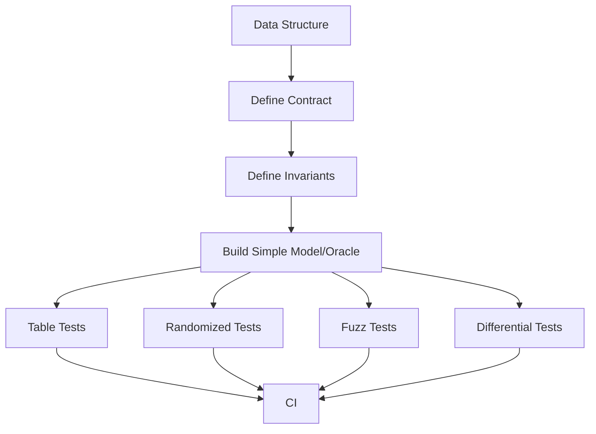
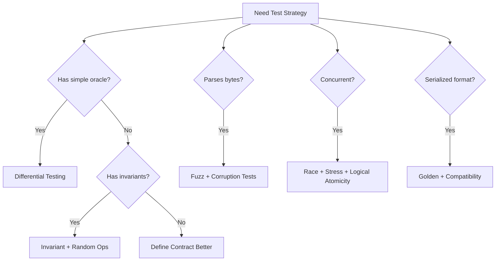

# learn-go-data-structure-algorithm-part-031.md

# Part 031 — Correctness Testing: Invariants, Fuzzing, Property Testing, Differential Testing

> Seri: `learn-go-data-structure-algorithm`  
> Bagian: `031 / 034`  
> Target pembaca: Java software engineer yang ingin menguasai Go data structure & algorithm sampai level production-grade  
> Fokus: correctness testing untuk struktur data dan algoritma di Go: invariants, table-driven tests, edge cases, randomized tests, fuzzing, property-based thinking, differential testing, model-based testing, metamorphic testing, race tests, concurrency stress, persistence/corruption tests, dan CI strategy

---

## Daftar Isi

- [1. Tujuan Part Ini](#1-tujuan-part-ini)
- [2. Correctness Bukan Sekadar “Test Case Lulus”](#2-correctness-bukan-sekadar-test-case-lulus)
- [3. Testing Pyramid untuk Data Structure](#3-testing-pyramid-untuk-data-structure)
- [4. Invariant-Based Testing](#4-invariant-based-testing)
- [5. Table-Driven Tests](#5-table-driven-tests)
- [6. Edge Case Matrix](#6-edge-case-matrix)
- [7. Golden Tests dan Contract Tests](#7-golden-tests-dan-contract-tests)
- [8. Randomized Testing](#8-randomized-testing)
- [9. Property-Based Thinking](#9-property-based-thinking)
- [10. Fuzzing di Go](#10-fuzzing-di-go)
- [11. Differential Testing](#11-differential-testing)
- [12. Model-Based Testing](#12-model-based-testing)
- [13. Metamorphic Testing](#13-metamorphic-testing)
- [14. Testing Serialization dan Persistence](#14-testing-serialization-dan-persistence)
- [15. Testing Concurrent Data Structures](#15-testing-concurrent-data-structures)
- [16. Race Detector dan Batasannya](#16-race-detector-dan-batasannya)
- [17. Testing Performance-Sensitive Correctness](#17-testing-performance-sensitive-correctness)
- [18. Test Helpers dan Invariant Hooks](#18-test-helpers-dan-invariant-hooks)
- [19. CI Strategy](#19-ci-strategy)
- [20. Case Study: Testing LRU Cache](#20-case-study-testing-lru-cache)
- [21. Case Study: Testing Fenwick Tree](#21-case-study-testing-fenwick-tree)
- [22. Case Study: Testing Segment Tree](#22-case-study-testing-segment-tree)
- [23. Case Study: Testing File-Backed Table](#23-case-study-testing-file-backed-table)
- [24. Anti-Patterns](#24-anti-patterns)
- [25. Decision Framework](#25-decision-framework)
- [26. Latihan Bertahap](#26-latihan-bertahap)
- [27. Ringkasan](#27-ringkasan)
- [28. Referensi](#28-referensi)

---

## 1. Tujuan Part Ini

Top 1% engineer tidak hanya bisa menulis struktur data.

Ia bisa menjawab:

```text
Bagaimana saya tahu struktur data ini benar?
Apa invariant-nya?
Apa oracle pembandingnya?
Apa edge case paling berbahaya?
Apakah random operation sequence tetap konsisten?
Apakah parser tahan input rusak?
Apakah concurrent method bebas data race dan logical race?
Apakah serialized format backward-compatible?
Apakah benchmark tidak mengubah correctness?
```

Part ini membahas correctness testing yang kuat untuk data structure dan algorithm di Go.

Kita akan memakai pola:

- invariant testing,
- table-driven testing,
- edge case matrix,
- randomized operation testing,
- fuzzing,
- differential testing,
- model-based testing,
- metamorphic testing,
- concurrency stress,
- race detector,
- corruption tests.

---

## 2. Correctness Bukan Sekadar “Test Case Lulus”

### 2.1. Test Case Spesifik Itu Perlu, Tapi Tidak Cukup

Contoh Fenwick Tree:

```go
xs := []int64{1, 2, 3}
sum(0, 3) == 6
```

Ini bagus, tetapi tidak cukup.

Bug bisa muncul pada:

- empty array,
- single element,
- negative delta,
- random update sequence,
- invalid range,
- overflow,
- repeated update same index,
- `l == r`,
- `r < l`,
- large n.

---

### 2.2. Correctness Lebih Dekat ke Invariant

Daripada hanya menguji output satu kasus, cari invariant.

Fenwick invariant:

```text
RangeSum(l,r) harus sama dengan naive sum atas array model.
```

LRU invariant:

```text
Len <= capacity.
Every map entry has exactly one list node.
Every list node has matching map entry.
Get existing key moves it to front.
Eviction removes least recently used key.
```

Parser invariant:

```text
Valid encoded data round-trips.
Invalid arbitrary bytes never panic.
Checksum mismatch returns error.
```

---

### 2.3. Diagram Correctness Strategy



---

## 3. Testing Pyramid untuk Data Structure

### 3.1. Layers

| Layer | Purpose |
|---|---|
| Example tests | documentation and simple behavior |
| Table tests | known edge cases |
| Invariant tests | internal consistency |
| Randomized tests | operation sequences |
| Differential tests | compare to simple oracle |
| Fuzz tests | adversarial input |
| Race/stress tests | concurrency safety |
| Golden tests | compatibility/format |
| Bench correctness guard | ensure optimization preserves behavior |

---

### 3.2. Why Multiple Layers?

Different tests catch different bugs.

| Bug Type | Best Caught By |
|---|---|
| Off-by-one | edge/table/random |
| Parser panic | fuzz |
| Wrong eviction order | invariant/table |
| Incorrect update sequence | differential |
| Data race | race detector |
| Logical race | concurrency model tests |
| Serialization break | golden tests |
| Comparator inconsistency | property/random tests |
| File corruption handling | corruption tests |

---

### 3.3. Minimal Production Test Suite

For reusable data structure:

```text
unit tests
edge cases
random operations vs oracle
invariant checks
fuzz for parsers
race tests if concurrent
benchmarks for hot path
examples for docs
```

---

## 4. Invariant-Based Testing

### 4.1. What Is an Invariant?

Invariant adalah kondisi yang harus selalu benar.

Example stack:

```text
Len equals number of pushed minus popped elements.
Pop returns most recently pushed item not yet popped.
Empty stack Pop returns ok=false.
```

Example heap:

```text
For every node i, parent <= child.
```

Example tree:

```text
In-order traversal sorted.
BST left < node < right.
Height/rank constraints valid for balanced tree.
```

---

### 4.2. Invariant Function

Expose internal check in test file or unexported method.

```go
func (c *Cache[K,V]) checkInvariants() error {
	if c.capacity < 0 {
		return fmt.Errorf("negative capacity")
	}
	if len(c.items) > c.capacity {
		return fmt.Errorf("len exceeds capacity")
	}
	// more checks...
	return nil
}
```

For production, keep it behind build tag or test-only file if expensive.

---

### 4.3. Invariant After Every Operation

Random operation tests should call invariant after each operation.

```go
for step := 0; step < 10_000; step++ {
	applyRandomOperation()
	if err := structure.checkInvariants(); err != nil {
		t.Fatalf("step=%d invariant failed: %v", step, err)
	}
}
```

This localizes failure.

---

### 4.4. Example: Heap Invariant

```go
func checkMinHeap(xs []int) error {
	for i := 1; i < len(xs); i++ {
		parent := (i - 1) / 2
		if xs[parent] > xs[i] {
			return fmt.Errorf("heap violation parent=%d child=%d", parent, i)
		}
	}
	return nil
}
```

---

### 4.5. Invariant Is Not Always Public

Internal invariants may mention implementation:

```text
red node cannot have red child
black height equal
map/list consistency
lazy tag consistency
```

Public contract tests should not depend on internals. But internal invariant tests are valuable.

---

## 5. Table-Driven Tests

### 5.1. Go Idiom

Table-driven tests are idiomatic Go.

```go
func TestRangeSum(t *testing.T) {
	tests := []struct {
		name string
		xs   []int64
		l, r int
		want int64
		ok   bool
	}{
		{"empty range", []int64{1, 2, 3}, 1, 1, 0, true},
		{"full range", []int64{1, 2, 3}, 0, 3, 6, true},
		{"invalid negative", []int64{1}, -1, 1, 0, false},
		{"invalid reversed", []int64{1}, 1, 0, 0, false},
	}

	for _, tc := range tests {
		t.Run(tc.name, func(t *testing.T) {
			ps := NewPrefixSum(tc.xs)
			got, ok := ps.Sum(tc.l, tc.r)
			if ok != tc.ok || got != tc.want {
				t.Fatalf("got (%d,%v), want (%d,%v)", got, ok, tc.want, tc.ok)
			}
		})
	}
}
```

---

### 5.2. Table Tests Are Great For Edge Cases

Use table tests for:

- empty input,
- nil input,
- duplicate keys,
- invalid ranges,
- capacity zero,
- boundary timestamps,
- overflow conditions,
- deletion missing key,
- repeated update.

---

### 5.3. Do Not Overuse Huge Tables

Large tables can become unreadable.

For many generated cases, use loop/random/differential tests.

---

## 6. Edge Case Matrix

### 6.1. Common Edge Cases

For most structures, consider:

| Category | Cases |
|---|---|
| Size | nil, empty, one, two, many |
| Duplicates | all same, repeated key, repeated value |
| Ordering | sorted, reverse, random |
| Range | l=0, r=n, l=r, r<l, out of bounds |
| Capacity | zero, one, full, over capacity |
| Values | zero, negative, max, min |
| Mutation | update existing, delete missing, clear |
| Time | now exactly expiry, before, after |
| Serialization | empty payload, truncated, corrupt |
| Concurrency | same key, disjoint keys, close while active |

---

### 6.2. Edge Matrix Example for Cache

```text
capacity = 0
capacity = 1
set same key twice
get updates recency
delete existing
delete missing
clear after entries
eviction callback
callback not called on update? depending contract
```

---

### 6.3. Edge Matrix Example for Range Query

```text
n=0
n=1
sum(0,0)
sum(0,1)
sum(1,1)
sum(-1,0)
sum(0,2)
update invalid index
negative delta
large values
```

---

## 7. Golden Tests dan Contract Tests

### 7.1. Golden Tests

Golden tests compare output to stored expected output.

Good for:

- serialization format,
- generated text,
- encoded files,
- stable deterministic output.

For binary format, keep small golden files.

---

### 7.2. Golden Test Pattern

```go
func TestMarshalGolden(t *testing.T) {
	got, err := MarshalExample()
	if err != nil {
		t.Fatal(err)
	}

	want, err := os.ReadFile("testdata/example.golden")
	if err != nil {
		t.Fatal(err)
	}

	if !bytes.Equal(got, want) {
		t.Fatalf("golden mismatch")
	}
}
```

---

### 7.3. Contract Tests

If multiple implementations share contract:

```go
type SetLike[T comparable] interface {
	Add(T) bool
	Delete(T) bool
	Contains(T) bool
	Len() int
}
```

Test helper:

```go
func testSetContract(t *testing.T, newSet func() SetLike[int]) {
	t.Helper()

	s := newSet()

	if !s.Add(1) {
		t.Fatal("first add should insert")
	}
	if s.Add(1) {
		t.Fatal("second add should not insert")
	}
	if !s.Contains(1) {
		t.Fatal("contains failed")
	}
	if !s.Delete(1) {
		t.Fatal("delete failed")
	}
	if s.Contains(1) {
		t.Fatal("should not contain after delete")
	}
}
```

---

### 7.4. Compatibility

Golden tests are especially important if you promise:

```text
old data can be read by new code
```

---

## 8. Randomized Testing

### 8.1. Why Random?

Random operation sequences reveal bugs humans do not anticipate.

Example:

```text
Set A
Set B
Delete A
Set A
Get B
Clear
Set C
Delete B
```

For cache/tree/range structures, sequence matters.

---

### 8.2. Deterministic Randomness

Always seed deterministically unless intentionally long-running.

```go
rng := rand.New(rand.NewPCG(1, 2))
```

If failure occurs, print seed.

---

### 8.3. Random Test Against Naive Model

Example set:

```go
func TestSetRandomAgainstMap(t *testing.T) {
	rng := rand.New(rand.NewPCG(1, 2))

	s := NewSet[int]()
	model := map[int]struct{}{}

	for step := 0; step < 10_000; step++ {
		x := int(rng.Uint64N(100))
		op := rng.Uint64N(3)

		switch op {
		case 0:
			got := s.Add(x)
			_, existed := model[x]
			model[x] = struct{}{}
			if got != !existed {
				t.Fatalf("step=%d Add(%d) got %v", step, x, got)
			}
		case 1:
			got := s.Delete(x)
			_, existed := model[x]
			delete(model, x)
			if got != existed {
				t.Fatalf("step=%d Delete(%d) got %v", step, x, got)
			}
		case 2:
			got := s.Contains(x)
			_, want := model[x]
			if got != want {
				t.Fatalf("step=%d Contains(%d) got %v want %v", step, x, got, want)
			}
		}

		if s.Len() != len(model) {
			t.Fatalf("step=%d len got %d want %d", step, s.Len(), len(model))
		}
	}
}
```

Imports:

```go
import "math/rand/v2"
```

---

### 8.4. Operation Log

When random test fails, include operation log.

```go
ops := make([]string, 0, steps)
ops = append(ops, fmt.Sprintf("Add(%d)", x))
```

On failure print recent operations.

This helps reproduce.

---

### 8.5. Bound Random Space

Random tests should include repeats.

If key space too large:

```text
almost no duplicates
```

Many bugs around duplicates will not trigger.

Use small key space for high collision/repetition.

---

## 9. Property-Based Thinking

### 9.1. Property vs Example

Example:

```text
sort([3,1,2]) = [1,2,3]
```

Property:

```text
output is sorted
output is permutation of input
```

Properties generalize.

---

### 9.2. Common Properties

| Structure | Property |
|---|---|
| Sort | sorted + same multiset |
| Set | no duplicates, contains after add |
| Stack | LIFO |
| Queue | FIFO |
| Heap | repeated pop yields sorted order |
| Prefix sum | sum(l,r)=sum(0,r)-sum(0,l) |
| Fenwick | equals naive model |
| DSU | connected relation is reflexive/symmetric/transitive |
| Bloom | no false negative for inserted keys |
| Encoding | decode(encode(x)) == x |
| Compression | decompress(compress(x)) == x |
| Cache | Len <= capacity |

---

### 9.3. Property: Sort

```go
func isSorted(xs []int) bool {
	for i := 1; i < len(xs); i++ {
		if xs[i-1] > xs[i] {
			return false
		}
	}
	return true
}

func sameMultiset(a, b []int) bool {
	if len(a) != len(b) {
		return false
	}
	counts := map[int]int{}
	for _, x := range a {
		counts[x]++
	}
	for _, x := range b {
		counts[x]--
	}
	for _, c := range counts {
		if c != 0 {
			return false
		}
	}
	return true
}
```

---

### 9.4. Property: Encoding

```go
func TestUvarintRoundTripRandom(t *testing.T) {
	rng := rand.New(rand.NewPCG(1, 2))

	for step := 0; step < 1000; step++ {
		n := int(rng.Uint64N(1000))
		xs := make([]uint64, n)
		for i := range xs {
			xs[i] = rng.Uint64()
		}

		encoded := EncodeUvarints(xs)
		got, ok := DecodeUvarints(encoded)
		if !ok {
			t.Fatalf("decode failed")
		}
		if !slices.Equal(got, xs) {
			t.Fatalf("round trip mismatch")
		}
	}
}
```

---

### 9.5. Property Limitations

Properties can be wrong or incomplete.

Example sort property:

```text
output sorted
```

alone is not enough because empty output is sorted. Need same multiset.

---

## 10. Fuzzing di Go

### 10.1. What Fuzzing Does

Fuzzing generates inputs automatically to find:

- panics,
- crashes,
- parser bugs,
- unexpected errors,
- invariant violations.

Go supports fuzzing in `testing`.

---

### 10.2. Basic Fuzz Test

```go
func FuzzDecodeUvarints(f *testing.F) {
	f.Add([]byte{1, 2, 3})
	f.Add([]byte{})
	f.Add([]byte{0xff, 0xff, 0xff})

	f.Fuzz(func(t *testing.T, data []byte) {
		_, _ = DecodeUvarints(data)
	})
}
```

This checks no panic.

Run:

```text
go test -fuzz=FuzzDecodeUvarints
```

---

### 10.3. Fuzz Round Trip

```go
func FuzzUvarintRoundTrip(f *testing.F) {
	f.Add(uint64(0))
	f.Add(uint64(1))
	f.Add(uint64(1 << 63))

	f.Fuzz(func(t *testing.T, x uint64) {
		encoded := EncodeUvarints([]uint64{x})
		decoded, ok := DecodeUvarints(encoded)
		if !ok {
			t.Fatalf("decode failed")
		}
		if len(decoded) != 1 || decoded[0] != x {
			t.Fatalf("got %v want %d", decoded, x)
		}
	})
}
```

---

### 10.4. Fuzz Parser with Bounds

For file/block parser:

```go
func FuzzLookupInBlock(f *testing.F) {
	f.Add([]byte{}, []byte("key"))
	f.Add([]byte{1, 0, 0, 0}, []byte("x"))

	f.Fuzz(func(t *testing.T, block []byte, key []byte) {
		_, _, _ = LookupInBlock(block, key)
	})
}
```

Goal:

```text
No panic, no out-of-bounds, returns error for corrupt data.
```

---

### 10.5. Fuzzing Stateful Structures

Fuzz byte input as operation sequence.

```go
func FuzzStackOps(f *testing.F) {
	f.Add([]byte{0, 1, 0, 1})

	f.Fuzz(func(t *testing.T, data []byte) {
		var s Stack[byte]
		model := []byte{}

		for _, op := range data {
			switch op % 3 {
			case 0:
				s.Push(op)
				model = append(model, op)
			case 1:
				got, ok := s.Pop()
				if len(model) == 0 {
					if ok {
						t.Fatalf("pop ok on empty")
					}
					continue
				}
				want := model[len(model)-1]
				model = model[:len(model)-1]
				if !ok || got != want {
					t.Fatalf("pop got (%v,%v) want (%v,true)", got, ok, want)
				}
			case 2:
				if s.Len() != len(model) {
					t.Fatalf("len mismatch")
				}
			}
		}
	})
}
```

---

### 10.6. Fuzzing Tips

- Seed with edge cases.
- Keep fuzz target fast.
- Avoid network/file system unless specifically fuzzing parser.
- Make failure deterministic.
- Minimized failing input is valuable.
- Add regression test for found bug.

---

## 11. Differential Testing

### 11.1. What Is Differential Testing?

Compare implementation under test against simpler trusted implementation.

Example:

```text
Fenwick Tree vs naive []int64
Segment Tree vs naive scan
Custom Set vs map[T]struct{}
External sort vs slices.Sort for small data
File table vs in-memory map
```

---

### 11.2. Why It Works

The simple model may be slow but easy to trust.

For tests, performance is less important.

---

### 11.3. Fenwick Differential Test

```go
func TestFenwickDifferential(t *testing.T) {
	rng := rand.New(rand.NewPCG(1, 2))

	const n = 100
	tree := NewFenwick(n)
	model := make([]int64, n)

	for step := 0; step < 10_000; step++ {
		if rng.Uint64N(2) == 0 {
			i := int(rng.Uint64N(n))
			delta := int64(rng.Uint64N(200)) - 100
			tree.Add(i, delta)
			model[i] += delta
		} else {
			l := int(rng.Uint64N(n + 1))
			r := int(rng.Uint64N(n + 1))
			if r < l {
				l, r = r, l
			}

			got, ok := tree.RangeSum(l, r)
			if !ok {
				t.Fatalf("unexpected invalid range")
			}

			var want int64
			for i := l; i < r; i++ {
				want += model[i]
			}

			if got != want {
				t.Fatalf("step=%d sum(%d,%d) got=%d want=%d", step, l, r, got, want)
			}
		}
	}
}
```

---

### 11.4. LRU Differential Model

Naive model can be:

```text
map key->value
slice recency most recent first
```

Slow but clear.

Compare after each operation.

---

### 11.5. Differential Testing File Table

For small test data:

```text
write file-backed table
also keep map in memory
random get keys
compare table result with map result
```

---

### 11.6. Beware Oracle Bugs

The model can have bugs too.

Keep model simple.

Do not copy same algorithm into model. That defeats purpose.

---

## 12. Model-Based Testing

### 12.1. Model-Based vs Differential

Differential testing uses another implementation as oracle.

Model-based testing defines abstract state and transitions.

Example stack model:

```text
state = list
Push(x): append
Pop(): remove last
```

Implementation must match model after every operation.

---

### 12.2. Model for Cache

Model:

```text
capacity
map key->value
recency list most recent first
```

Operations:

- Get:
  - if exists, move key front.
- Set:
  - if exists update and move front.
  - else insert front and evict tail if over capacity.
- Delete:
  - remove from map/list.

---

### 12.3. Model Step

```go
type lruModel[K comparable, V comparable] struct {
	capacity int
	values   map[K]V
	recency  []K
}
```

This is not optimized; it is a correctness oracle.

---

### 12.4. Model Invariant

```text
len(values) == len(recency)
no duplicate keys in recency
every recency key exists in values
len <= capacity
```

---

### 12.5. State Machine Testing

For structures with lifecycle:

```text
Open -> Closing -> Closed
```

Model should include state.

Operations after close should return expected error.

---

## 13. Metamorphic Testing

### 13.1. What Is Metamorphic Testing?

Sometimes exact output is hard to know, but relationships between inputs/outputs are known.

Example:

```text
Sorting twice gives same result.
Adding duplicate to set does not change length after first add.
Prefix sum shifted by adding 0 changes nothing.
Graph connected components independent of edge order.
```

---

### 13.2. Examples

Sorting:

```text
sort(sort(xs)) == sort(xs)
```

Set:

```text
Add(x); Add(x) -> Len increases once
```

DSU:

```text
Union edges in different order -> same connectivity
```

Bloom filter:

```text
After adding more keys, existing keys still MightContain
```

External sort:

```text
sort(A+B) == merge(sort(A), sort(B))
```

---

### 13.3. DSU Metamorphic Test

```go
func TestDSUEdgeOrderIndependence(t *testing.T) {
	edges := [][2]int{{0,1}, {1,2}, {3,4}, {2,4}}

	build := func(order [][2]int) *DSU {
		d := New(5)
		for _, e := range order {
			d.Union(e[0], e[1])
		}
		return d
	}

	d1 := build(edges)

	reversed := append([][2]int(nil), edges...)
	slices.Reverse(reversed)
	d2 := build(reversed)

	for i := 0; i < 5; i++ {
		for j := 0; j < 5; j++ {
			a, _ := d1.Connected(i, j)
			b, _ := d2.Connected(i, j)
			if a != b {
				t.Fatalf("connectivity mismatch %d %d", i, j)
			}
		}
	}
}
```

---

### 13.4. Use When Oracle Hard

Metamorphic tests are great when:

- exact oracle expensive,
- algorithm nondeterministic,
- output has many valid forms,
- approximate/probabilistic structure.

---

## 14. Testing Serialization dan Persistence

### 14.1. Round Trip

Core property:

```text
read(write(x)) == x
```

---

### 14.2. Compatibility

If format versioned:

```text
reader v2 reads golden file from writer v1
```

---

### 14.3. Corruption Testing

Corrupt:

- magic,
- version,
- length,
- checksum,
- offset,
- footer,
- payload.

Reader should return error, not panic.

---

### 14.4. Truncation Testing

File-backed structures must handle truncated files.

```go
func TestReadRecordTruncated(t *testing.T) {
	data := []byte{10, 0, 0, 0, 1, 2}
	_, err := ReadRecord(bytes.NewReader(data))
	if err == nil {
		t.Fatal("expected error")
	}
}
```

---

### 14.5. Temp Directory

Use:

```go
dir := t.TempDir()
```

This isolates files and cleans up automatically.

---

### 14.6. Crash Simulation

For crash-safe writer, simulate stopping after each phase.

Example phases:

```text
write data
write index
write footer
sync
rename
```

Open/recover should behave according to contract.

---

## 15. Testing Concurrent Data Structures

### 15.1. What to Test

Concurrent structures need:

- no data race,
- no deadlock,
- logical atomicity,
- invariants after concurrent operations,
- close/shutdown behavior,
- fairness if promised.

---

### 15.2. Concurrent AddIfAbsent

```go
func TestAddIfAbsentConcurrent(t *testing.T) {
	s := NewSafeSet[string]()

	var processed atomic.Int64
	var wg sync.WaitGroup

	for i := 0; i < 100; i++ {
		wg.Add(1)
		go func() {
			defer wg.Done()
			if s.Add("key") {
				processed.Add(1)
			}
		}()
	}

	wg.Wait()

	if got := processed.Load(); got != 1 {
		t.Fatalf("processed=%d want 1", got)
	}
}
```

---

### 15.3. Stress with Timeouts

Use timeout to detect deadlock.

```go
done := make(chan struct{})

go func() {
	defer close(done)
	// concurrent test body
}()

select {
case <-done:
case <-time.After(5 * time.Second):
	t.Fatal("timeout, possible deadlock")
}
```

---

### 15.4. Close Race

Test closing while producers/consumers active.

Define expected behavior clearly:

```text
enqueue after close returns false
dequeue drains remaining
close idempotent
```

---

### 15.5. Avoid Flaky Tests

Concurrency tests can be flaky if they depend on timing.

Prefer synchronization primitives over sleeps.

Use sleeps only when testing timeout behavior and keep generous.

---

## 16. Race Detector dan Batasannya

### 16.1. Run Race Detector

```text
go test -race ./...
```

Use in CI at least on important packages.

---

### 16.2. Race Detector Finds Data Races

It can catch:

- unsynchronized map access,
- unsynchronized field mutation,
- unsafe shared slice mutation.

---

### 16.3. It Does Not Prove Correctness

It may not catch:

- logical races,
- missing atomic compound operation,
- deadlock,
- starvation,
- invariant violation with synchronized but wrong logic,
- races not executed by test.

---

### 16.4. Race Detector Cost

Race tests are slower and use more memory.

Run:

- on CI subset,
- nightly full,
- pre-release,
- critical packages.

---

## 17. Testing Performance-Sensitive Correctness

### 17.1. Optimizations Can Break Correctness

Examples:

- avoiding copy returns mutable internal slice,
- pooling buffer invalidates zero-copy view,
- lazy deletion returns expired item,
- lock-free optimization loses update,
- comparator shortcut breaks ordering.

Every optimization needs correctness tests.

---

### 17.2. Benchmark with Correctness Guard

Inside benchmark, do minimal correctness sink.

But do not make benchmark dominated by checks.

Use separate tests for correctness.

---

### 17.3. Allocation Tests

Sometimes correctness includes allocation contract.

Example hot method must not allocate.

You can use:

```go
allocs := testing.AllocsPerRun(1000, func() {
	_, _ = cache.Get("key")
})
if allocs != 0 {
	t.Fatalf("allocs=%v want 0", allocs)
}
```

Use cautiously; compiler/runtime changes can affect.

---

### 17.4. Escape Analysis Awareness

A seemingly innocent API can force heap allocation.

Benchmarks with `-benchmem` reveal.

---

## 18. Test Helpers dan Invariant Hooks

### 18.1. Test Helper

Use `t.Helper()`.

```go
func requireEqual[T comparable](t *testing.T, got, want T) {
	t.Helper()
	if got != want {
		t.Fatalf("got %v want %v", got, want)
	}
}
```

---

### 18.2. Invariant Hook in `_test.go`

In same package:

```go
func (c *Cache[K,V]) checkInvariantsForTest() error {
	// access unexported fields
	return nil
}
```

Only compiled in tests.

---

### 18.3. Build Tags for Expensive Checks

For debug builds:

```go
//go:build debug
```

Can include heavy invariant checks.

---

### 18.4. Operation Trace

```go
type Op struct {
	Name string
	Key  int
	Val  int
}
```

When failure:

```go
t.Fatalf("failed after ops: %+v", ops[max(0,len(ops)-20):])
```

---

## 19. CI Strategy

### 19.1. Fast CI

On every PR:

```text
go test ./...
go test -race ./critical/...
go test ./... -run Fuzz -fuzztime=1s? optional lightweight
go vet ./...
```

---

### 19.2. Nightly CI

Nightly:

```text
long randomized tests
long fuzzing
race all packages
bench smoke
corruption tests
compatibility golden tests
```

---

### 19.3. Reproducibility

For randomized tests:

- fixed seed by default,
- allow seed override via env var,
- print seed on failure.

---

### 19.4. Regression Tests

When fuzz/random finds bug:

1. save minimized input,
2. add deterministic unit test,
3. fix bug,
4. keep fuzz test.

---

## 20. Case Study: Testing LRU Cache

### 20.1. Contract

```text
capacity fixed
Get existing moves to front
Set existing updates and moves to front
Set new may evict least recently used
Delete removes
Len <= capacity
```

---

### 20.2. Table Test

```go
func TestLRUGetUpdatesRecency(t *testing.T) {
	c, err := NewLRU[string, int](2)
	if err != nil {
		t.Fatal(err)
	}

	c.Set("a", 1)
	c.Set("b", 2)

	if _, ok := c.Get("a"); !ok {
		t.Fatal("expected a")
	}

	c.Set("c", 3)

	if _, ok := c.Get("b"); ok {
		t.Fatal("b should be evicted")
	}
	if v, ok := c.Get("a"); !ok || v != 1 {
		t.Fatalf("a should remain")
	}
}
```

---

### 20.3. Invariant

```text
map/list consistency
no duplicate keys
len <= capacity
```

---

### 20.4. Random Model Test

Use naive model:

```text
map + recency slice
```

Compare after random operations.

---

## 21. Case Study: Testing Fenwick Tree

### 21.1. Contract

```text
Add(i, delta)
Prefix(count)
Sum(l,r) = Prefix(r)-Prefix(l)
```

---

### 21.2. Edge Tests

```text
n=0
n=1
invalid index
empty range
negative delta
large delta
```

---

### 21.3. Differential Oracle

Naive array.

After every Add, update model.

For every Sum, scan model.

---

### 21.4. Metamorphic Properties

```text
Sum(l,r)+Sum(r,s)=Sum(l,s)
Prefix(0)=0
Sum(i,i)=0
```

---

## 22. Case Study: Testing Segment Tree

### 22.1. Contract

```text
Build from values.
Query [l,r).
Set index.
Associative merge.
Identity for empty.
```

---

### 22.2. Test Non-Commutative Operation

If generic segment tree claims only associativity, test non-commutative operation like string concatenation.

```go
func TestSegmentTreeNonCommutative(t *testing.T) {
	st := NewSegmentTree([]string{"a","b","c"}, "", func(a,b string) string {
		return a + b
	})

	got, ok := st.Query(0, 3)
	if !ok || got != "abc" {
		t.Fatalf("got %q ok=%v", got, ok)
	}
}
```

This catches wrong merge order.

---

### 22.3. Random Against Naive

For sum/min/max, compare to naive scan.

For custom operation, model with same merge over slice.

---

### 22.4. Lazy Segment Tree

Test with random range updates and range queries.

Naive model applies update to every element.

Call invariant if available.

---

## 23. Case Study: Testing File-Backed Table

### 23.1. Tests

- write/read empty table,
- one record,
- many records,
- duplicate key policy,
- key order enforcement,
- lookup miss,
- lookup hit,
- corrupted footer,
- truncated block,
- checksum mismatch,
- old golden file.

---

### 23.2. Differential Oracle

In test:

```text
map[string][]byte
```

For sorted table, generate random unique keys, sort, write, then compare lookups.

---

### 23.3. Corrupt Helper

```go
func corruptByte(t *testing.T, path string, offset int64) {
	t.Helper()

	f, err := os.OpenFile(path, os.O_RDWR, 0)
	if err != nil {
		t.Fatal(err)
	}
	defer f.Close()

	var b [1]byte
	if _, err := f.ReadAt(b[:], offset); err != nil {
		t.Fatal(err)
	}
	b[0] ^= 0xff
	if _, err := f.WriteAt(b[:], offset); err != nil {
		t.Fatal(err)
	}
}
```

---

### 23.4. No Panic Rule

Parser/reader should return error, not panic, on corrupt bytes.

Fuzz this.

---

## 24. Anti-Patterns

### 24.1. Only Testing Happy Path

Happy path tests do not validate robustness.

---

### 24.2. Random Tests Without Seed

Failure cannot be reproduced.

---

### 24.3. Random Key Space Too Large

No duplicates means many bugs around update/delete duplicate are missed.

---

### 24.4. Fuzz Target Too Slow

Slow fuzzing explores fewer cases.

---

### 24.5. Testing Implementation Details Only

If refactor breaks tests but not contract, tests are too coupled.

Balance public contract and internal invariant tests.

---

### 24.6. Ignoring Invalid Input

Public API and parsers must handle invalid input according to contract.

---

### 24.7. Race Detector as Only Concurrency Test

Race detector does not catch logical races.

---

### 24.8. Flaky Time-Based Tests

Avoid real sleep. Use fake clock.

---

### 24.9. No Regression for Fuzz Bug

If fuzz finds bug and you only fix code, bug can return.

Add regression.

---

## 25. Decision Framework

### 25.1. What Testing Method to Use?

| Structure | Must-Have Tests |
|---|---|
| Set/Map | differential vs built-in map |
| Heap | heap invariant + pop sorted |
| Tree | sorted traversal + invariants |
| Fenwick/Segment | random vs naive |
| Cache | model-based recency/eviction |
| Parser | fuzz + corruption |
| File-backed | round-trip + golden + corruption |
| Concurrent | race + stress + logical atomicity |
| Probabilistic | no false negative + statistical bound |
| Time-based | fake clock edge tests |

---

### 25.2. Testing Checklist

```text
[ ] Public contract tests
[ ] Edge case matrix
[ ] Invariant checks
[ ] Randomized operation sequence
[ ] Simple oracle/differential model
[ ] Fuzzing for parsers/encoded input
[ ] Race tests for concurrent structures
[ ] Golden files for serialized compatibility
[ ] Regression tests for found bugs
[ ] Benchmarks for hot operations
```

---

### 25.3. Flowchart



---

## 26. Latihan Bertahap

### 26.1. Level 1 — Edge Matrix

Pick one structure from previous parts.

Write an edge case matrix before writing tests.

---

### 26.2. Level 2 — Invariant Hook

Implement invariant check for:

- LRU,
- heap,
- tree,
- segment tree,
- file block parser.

---

### 26.3. Level 3 — Differential Test

Implement random test against naive model for:

- Fenwick,
- Segment Tree,
- DSU,
- LRU,
- external sort.

---

### 26.4. Level 4 — Fuzz Parser

Fuzz:

- varint decoder,
- block parser,
- record reader,
- serialized bitset.

---

### 26.5. Level 5 — Concurrent Test

Test:

- `AddIfAbsent`,
- concurrent queue close,
- atomic snapshot map,
- sharded map.

Run with `-race`.

---

### 26.6. Level 6 — CI Plan

Design CI commands for a reusable data structure module:

```text
fast PR checks
race checks
nightly fuzz
benchmark trend
golden compatibility
```

---

## 27. Ringkasan

Correctness testing for data structures requires more than hand-picked examples.

Key takeaways:

- Start with contract and invariants.
- Table-driven tests cover known edge cases.
- Randomized tests reveal operation-sequence bugs.
- Property-based thinking generalizes expected behavior.
- Fuzzing is essential for parsers and byte formats.
- Differential testing compares against simple trusted model.
- Model-based testing is excellent for stateful structures.
- Metamorphic testing helps when exact oracle is hard.
- Concurrent structures need race tests and logical atomicity tests.
- File-backed structures need corruption, truncation, golden, and recovery tests.
- Benchmarks protect performance expectations but do not replace correctness tests.
- Every fuzz/random bug should become deterministic regression test.

Production mental model:

```text
A data structure is not production-ready until its invariants are tested under realistic operation sequences and invalid inputs.
```

---

## 28. Referensi

Referensi utama yang relevan untuk part ini:

- Go 1.26 Release Notes — `https://go.dev/doc/go1.26`
- Go Release History — `https://go.dev/doc/devel/release`
- Go Language Specification — `https://go.dev/ref/spec`
- Package `testing` — `https://pkg.go.dev/testing`
- Go Fuzzing — `https://go.dev/doc/security/fuzz`
- Go Data Race Detector — `https://go.dev/doc/articles/race_detector`
- Package `math/rand/v2` — `https://pkg.go.dev/math/rand/v2`
- Package `sync` — `https://pkg.go.dev/sync`
- Package `sync/atomic` — `https://pkg.go.dev/sync/atomic`
- Package `bytes` — `https://pkg.go.dev/bytes`
- Package `os` — `https://pkg.go.dev/os`
- Package `slices` — `https://pkg.go.dev/slices`

---

# Status Seri

Selesai:

- Part 000 — Roadmap, Mental Model, dan Batasan Seri
- Part 001 — Complexity Model yang Realistis di Go
- Part 002 — Arrays, Slices, dan Sequence Design
- Part 003 — Maps, Hash Tables, dan Associative Data
- Part 004 — Sorting, Ordering, Comparison, dan Search
- Part 005 — Stack, Queue, Deque, dan Worklist Algorithms
- Part 006 — Linked List, Intrusive List, dan Pointer-Chasing Trade-off
- Part 007 — Heap, Priority Queue, dan Scheduling Algorithms
- Part 008 — Sets, Multisets, Bag, dan Membership Models
- Part 009 — Strings, Bytes, Runes, Tokenization, dan Text Algorithms
- Part 010 — Recursion, Iteration, Backtracking, dan State Space Search
- Part 011 — Hashing, Fingerprint, Checksums, dan Equality Strategy
- Part 012 — Trees: Binary Tree, BST, Traversal, dan Structural Invariants
- Part 013 — Balanced Trees: AVL, Red-Black, Treap, dan Ordered Index
- Part 014 — B-Tree, B+Tree, Page-Oriented Structure, dan Storage-Aware Index
- Part 015 — Trie, Radix Tree, Patricia Tree, dan Prefix Index
- Part 016 — Graph Fundamentals: Representation, Traversal, dan Modelling
- Part 017 — Graph Algorithms for Production Systems
- Part 018 — Dynamic Programming: Memoization, Tabulation, dan State Compression
- Part 019 — Greedy Algorithms, Exchange Argument, dan Approximation Thinking
- Part 020 — Divide and Conquer, Selection, dan Search Space Reduction
- Part 021 — Range Query Structures: Prefix Sum, Fenwick Tree, Segment Tree
- Part 022 — Disjoint Set Union, Connectivity, dan Merge Semantics
- Part 023 — Probabilistic Data Structures
- Part 024 — Cache Data Structures: LRU, LFU, ARC-like Thinking, TTL Index
- Part 025 — Time, Scheduling, Rate Limiting, dan Window Algorithms
- Part 026 — Concurrent Data Structures in Go: Correctness Before Performance
- Part 027 — Persistent, Immutable, dan Versioned Data Structures
- Part 028 — Serialization-Aware and Layout-Aware Data Structures
- Part 029 — External Memory Algorithms and File-Backed Structures
- Part 030 — API Design for Reusable Data Structures in Go
- Part 031 — Correctness Testing: Invariants, Fuzzing, Property Testing, Differential Testing

Berikutnya:

- Part 032 — Benchmarking and Profiling Data Structures

<!-- NAVIGATION_FOOTER -->
<div class="page-nav">
<a href="./learn-go-data-structure-algorithm-part-030.md">⬅️ Part 030 — API Design for Reusable Data Structures in Go</a>
<a href="./index.md">📚 Kategori</a>
<a href="../../index.md">🏠 Home</a>
<a href="./learn-go-data-structure-algorithm-part-032.md">Part 032 — Benchmarking and Profiling Data Structures ➡️</a>
</div>
