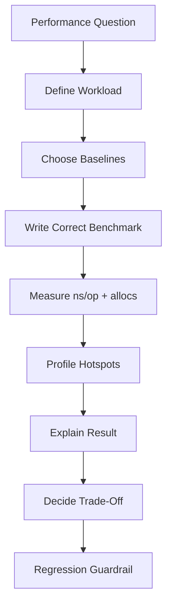
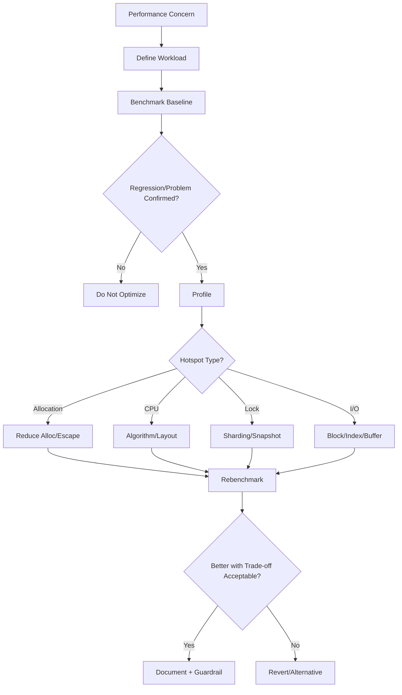

# learn-go-data-structure-algorithm-part-032.md

# Part 032 — Benchmarking and Profiling Data Structures

> Seri: `learn-go-data-structure-algorithm`  
> Bagian: `032 / 034`  
> Target pembaca: Java software engineer yang ingin menguasai Go data structure & algorithm sampai level production-grade  
> Fokus: benchmarking dan profiling struktur data di Go: `testing.B`, `benchmem`, pprof CPU/heap/alloc/block/mutex, escape analysis, allocation control, micro vs macro benchmark, workload modelling, cache effects, concurrency benchmark, regression guardrail, dan performance decision-making

---

## Daftar Isi

- [1. Tujuan Part Ini](#1-tujuan-part-ini)
- [2. Benchmark Bukan Sekadar Angka ns/op](#2-benchmark-bukan-sekadar-angka-nsop)
- [3. Mental Model Performance untuk Data Structure](#3-mental-model-performance-untuk-data-structure)
- [4. `testing.B` Dasar](#4-testingb-dasar)
- [5. Menghindari Compiler Elimination](#5-menghindari-compiler-elimination)
- [6. `benchmem`: Allocation, Bytes, dan Hidden Cost](#6-benchmem-allocation-bytes-dan-hidden-cost)
- [7. Setup Cost vs Operation Cost](#7-setup-cost-vs-operation-cost)
- [8. Workload Shape](#8-workload-shape)
- [9. Microbenchmark vs Macrobenchmark](#9-microbenchmark-vs-macrobenchmark)
- [10. Benchmark Variants dan Baseline](#10-benchmark-variants-dan-baseline)
- [11. Profiling CPU dengan pprof](#11-profiling-cpu-dengan-pprof)
- [12. Profiling Memory dan Allocation](#12-profiling-memory-dan-allocation)
- [13. Escape Analysis](#13-escape-analysis)
- [14. Block dan Mutex Profiling](#14-block-dan-mutex-profiling)
- [15. Concurrency Benchmark](#15-concurrency-benchmark)
- [16. Cache Locality dan Layout Benchmark](#16-cache-locality-dan-layout-benchmark)
- [17. I/O Benchmark untuk File-Backed Structures](#17-io-benchmark-untuk-file-backed-structures)
- [18. Statistical Discipline](#18-statistical-discipline)
- [19. Regression Guardrail](#19-regression-guardrail)
- [20. Case Study: LRU Cache Benchmark](#20-case-study-lru-cache-benchmark)
- [21. Case Study: Fenwick vs Segment Tree](#21-case-study-fenwick-vs-segment-tree)
- [22. Case Study: Map vs Sorted Slice](#22-case-study-map-vs-sorted-slice)
- [23. Case Study: Concurrent Map Strategies](#23-case-study-concurrent-map-strategies)
- [24. Anti-Patterns](#24-anti-patterns)
- [25. Decision Framework](#25-decision-framework)
- [26. Latihan Bertahap](#26-latihan-bertahap)
- [27. Ringkasan](#27-ringkasan)
- [28. Referensi](#28-referensi)

---

## 1. Tujuan Part Ini

Benchmarking dan profiling adalah skill wajib untuk engineer yang ingin mengoptimasi struktur data secara benar.

Tanpa benchmark yang benar, kita mudah jatuh ke:

```text
optimasi berdasarkan perasaan
mengubah API jadi unsafe demi microbenchmark palsu
membandingkan workload yang tidak realistis
mengukur setup cost, bukan operation cost
membiarkan compiler menghapus kerja
mengabaikan allocation
mengabaikan tail latency
mengabaikan lock contention
mengabaikan page cache
```

Part ini membahas cara mengukur performa struktur data di Go dengan disiplin:

- menulis benchmark yang valid,
- membaca `ns/op`, `B/op`, `allocs/op`,
- memisahkan setup dan operation,
- membuat workload realistis,
- memakai pprof CPU/heap/block/mutex,
- membaca escape analysis,
- menguji concurrency,
- membuat regression guardrail.

Target akhirnya:

```text
Bukan "struktur X lebih cepat".
Tetapi "struktur X lebih cepat untuk workload Y, dengan memory Z, allocation W, dan trade-off Q".
```

---

## 2. Benchmark Bukan Sekadar Angka ns/op

### 2.1. Angka Tanpa Konteks Bisa Menyesatkan

Contoh:

```text
Map lookup: 20 ns/op
Sorted slice lookup: 80 ns/op
```

Kesimpulan cepat:

```text
map selalu lebih baik
```

Belum tentu.

Jika sorted slice:

- jauh lebih hemat memory,
- deterministic iteration,
- lebih cache-friendly untuk scan,
- tidak butuh hash string mahal,
- cocok untuk immutable small table,

maka sorted slice bisa lebih baik secara system-level.

---

### 2.2. Benchmark Harus Menjawab Pertanyaan

Pertanyaan buruk:

```text
Mana yang lebih cepat?
```

Pertanyaan baik:

```text
Untuk 1 juta key string, 99% read, 1% rebuild per menit,
apakah map snapshot atau sorted slice snapshot memberi latency dan memory lebih baik?
```

---

### 2.3. Performance Dimension

| Dimensi | Contoh |
|---|---|
| Throughput | ops/sec |
| Latency | ns/op, p95/p99 |
| Allocation | allocs/op, B/op |
| Memory footprint | bytes per entry |
| CPU profile | hot functions |
| GC impact | heap, scan, alloc rate |
| Contention | mutex/block profile |
| I/O | bytes read/write, random vs sequential |
| Tail behavior | spikes under resize/compaction |
| Correctness trade-off | stale/approx/unsafe view |

---

### 2.4. Diagram Benchmark Thinking



---

## 3. Mental Model Performance untuk Data Structure

### 3.1. Cost Components

A data structure operation may cost:

```text
CPU instructions
pointer chasing
hashing
comparison
allocation
copying
branching
lock waiting
syscalls
GC scanning
cache miss
page fault
```

Big-O hides many of these.

---

### 3.2. Example: `map[string]V`

`Get` cost includes:

- hash string,
- map bucket lookup,
- key comparison,
- possible cache miss,
- possible evacuation if map growing? mostly on writes,
- value copy.

---

### 3.3. Example: LRU Get

LRU `Get` cost includes:

- map lookup,
- linked list node pointer chasing,
- unlink/link operations,
- possible lock,
- possible interface assertion if using `container/list`.

---

### 3.4. Example: Fenwick Sum

Fenwick sum cost:

- loop `O(log n)`,
- integer arithmetic,
- contiguous slice access,
- no allocation.

Usually very fast.

---

### 3.5. Example: Segment Tree Query

Segment tree query cost:

- loop `O(log n)`,
- more branches,
- maybe merge function call,
- larger memory,
- possible generic overhead.

For sum, Fenwick may win. For custom associative operation, segment tree may be necessary.

---

## 4. `testing.B` Dasar

### 4.1. Basic Benchmark

```go
func BenchmarkSetContains(b *testing.B) {
	s := NewSet[int]()
	for i := 0; i < 1000; i++ {
		s.Add(i)
	}

	b.ResetTimer()

	var sink bool
	for i := 0; i < b.N; i++ {
		sink = s.Contains(i % 1000)
	}
	_ = sink
}
```

Run:

```text
go test -bench=BenchmarkSetContains
```

---

### 4.2. `b.N`

Go adjusts `b.N` automatically until measurement is stable enough.

Do not set `b.N`.

---

### 4.3. `b.ResetTimer`

Use after setup.

```go
setup()
b.ResetTimer()
for i := 0; i < b.N; i++ {
	operation()
}
```

---

### 4.4. `b.StopTimer` and `b.StartTimer`

Use if each iteration needs setup not included.

```go
for i := 0; i < b.N; i++ {
	b.StopTimer()
	input := makeInput()
	b.StartTimer()

	operation(input)
}
```

But too much start/stop can distort measurement.

Prefer precomputed inputs.

---

### 4.5. `b.ReportAllocs`

```go
b.ReportAllocs()
```

Shows:

```text
B/op
allocs/op
```

Always use for data structure benchmarks.

---

### 4.6. Sub-Benchmarks

```go
func BenchmarkLookupSizes(b *testing.B) {
	for _, n := range []int{10, 100, 1000, 10000, 100000} {
		b.Run(fmt.Sprintf("n=%d", n), func(b *testing.B) {
			benchmarkLookup(b, n)
		})
	}
}
```

---

## 5. Menghindari Compiler Elimination

### 5.1. Problem

Compiler may remove work if result unused.

Bad:

```go
for i := 0; i < b.N; i++ {
	s.Contains(i)
}
```

If result unused, optimizer may reduce work.

---

### 5.2. Sink Variable

Use package-level sink.

```go
var sinkBool bool
var sinkInt int
var sinkBytes []byte
```

Benchmark:

```go
func BenchmarkContains(b *testing.B) {
	s := NewSet[int]()
	s.Add(1)

	var v bool
	for i := 0; i < b.N; i++ {
		v = s.Contains(1)
	}
	sinkBool = v
}
```

---

### 5.3. Avoid `fmt` in Hot Loop

Bad:

```go
for i := 0; i < b.N; i++ {
	key := fmt.Sprintf("key-%d", i)
	m[key] = i
}
```

This benchmarks `fmt.Sprintf`.

Precompute keys.

---

### 5.4. Avoid Random in Hot Loop Unless Measuring It

Bad:

```go
for i := 0; i < b.N; i++ {
	k := rng.Int()
	m.Get(k)
}
```

This includes RNG cost.

Precompute key sequence.

---

### 5.5. Example Precomputed Keys

```go
func makeKeys(n int, keyspace int) []int {
	keys := make([]int, n)
	for i := range keys {
		keys[i] = (i * 1103515245 + 12345) % keyspace
	}
	return keys
}
```

---

## 6. `benchmem`: Allocation, Bytes, dan Hidden Cost

### 6.1. Run with Benchmem

```text
go test -bench=. -benchmem
```

Output:

```text
BenchmarkX-16    1000000    120 ns/op    32 B/op    1 allocs/op
```

---

### 6.2. Allocation Meaning

`allocs/op` tells number of heap allocations per operation.

`B/op` tells bytes allocated per operation.

For hot data structure operations, target often:

```text
0 allocs/op
```

especially:

- Get,
- Contains,
- Sum,
- Query,
- Add for preallocated structures.

Some operations naturally allocate:

- Snapshot,
- Clone,
- Encode,
- CopyBytes,
- Build.

---

### 6.3. Hidden Allocation Example

```go
func (c CountingBloomFilter) positions(key []byte) []uint64 {
	out := make([]uint64, c.k)
	// ...
	return out
}
```

This allocates per query.

Hot path should avoid.

---

### 6.4. Interface Allocation

Interface use may cause escape or allocation depending context.

Examples:

- `container/list` stores `any`,
- callbacks may capture variables,
- returning interface can allocate,
- generic type may still allocate if address escapes.

Measure.

---

### 6.5. Copy Cost vs Allocation Cost

Copying into preallocated buffer may have:

```text
0 allocs/op
```

but still cost CPU/memory bandwidth.

`benchmem` is not enough. CPU profile helps.

---

## 7. Setup Cost vs Operation Cost

### 7.1. Common Mistake

Bad:

```go
func BenchmarkSort(b *testing.B) {
	for i := 0; i < b.N; i++ {
		xs := makeRandomSlice()
		slices.Sort(xs)
	}
}
```

This includes random generation and allocation.

Sometimes intended, but if you want sort cost, precompute or copy controlled input.

---

### 7.2. Sorting Benchmark Pattern

Sorting mutates input, so each iteration needs fresh copy.

```go
func BenchmarkSortInts(b *testing.B) {
	base := make([]int, 10000)
	for i := range base {
		base[i] = len(base) - i
	}

	buf := make([]int, len(base))

	b.ReportAllocs()
	b.ResetTimer()

	for i := 0; i < b.N; i++ {
		b.StopTimer()
		copy(buf, base)
		b.StartTimer()

		slices.Sort(buf)
	}
}
```

This excludes copy cost. If copy is part of real workload, include it.

---

### 7.3. Build vs Query

For structures like prefix sum:

- build cost O(n),
- query cost O(1).

Benchmark separately:

```go
BenchmarkPrefixBuild
BenchmarkPrefixQuery
```

Do not average them unless workload ratio known.

---

### 7.4. Amortized Structures

Some operations have occasional expensive spikes:

- map growth,
- slice reallocation,
- heap resize,
- compaction,
- cache eviction callback,
- file segment roll.

Benchmark steady-state and spike behavior separately.

---

## 8. Workload Shape

### 8.1. Why Workload Shape Matters

Data structures behave differently under different access distributions.

Example cache:

- uniform random -> low hit rate,
- Zipfian -> high hit rate,
- scan -> LRU pollution,
- hot key -> lock contention.

---

### 8.2. Workload Dimensions

| Dimension | Examples |
|---|---|
| key distribution | uniform, Zipf, sequential, hot set |
| operation mix | 100% read, 90/10 read/write, 50/50 |
| size | 10, 1k, 1M, 100M |
| mutation | append-only, random update, delete-heavy |
| range length | short, long, full |
| value size | small int, large struct, bytes |
| concurrency | single goroutine, many readers, many writers |
| locality | hot cache, cold cache |
| error/miss rate | hit-heavy, miss-heavy |

---

### 8.3. Zipfian Distribution

Many real workloads are skewed.

Go `math/rand/v2` provides random generators, but for Zipf you may use `math/rand` classic or implement/precompute distribution depending Go version and project policy. Simpler approach: manually create hot/cold sequence.

---

### 8.4. Hot/Cold Key Sequence

```go
func makeHotColdKeys(total int, hotKeys int, coldKeys int) []int {
	keys := make([]int, total)

	for i := range keys {
		if i%10 < 8 {
			keys[i] = i % hotKeys
		} else {
			keys[i] = hotKeys + (i % coldKeys)
		}
	}

	return keys
}
```

This approximates 80% hot access.

---

### 8.5. Range Workloads

For segment tree/range query:

- point range `[i,i+1)`,
- short range length 8,
- medium range 1024,
- full range,
- random length.

Different structures may win.

---

## 9. Microbenchmark vs Macrobenchmark

### 9.1. Microbenchmark

Measures one operation tightly.

Example:

```text
Fenwick RangeSum
LRU Get
Bitset And
Map lookup
```

Pros:

- isolates cost,
- easy to compare,
- good regression guard.

Cons:

- may not represent real system,
- ignores setup/GC/I/O/context,
- easy to overfit.

---

### 9.2. Macrobenchmark

Measures end-to-end workload.

Example:

```text
process 10GB log using dictionary+bitmap index
serve cache with loader under 100 goroutines
build file-backed table and query it
```

Pros:

- realistic,
- captures integration cost.

Cons:

- noisy,
- harder to diagnose,
- slower.

---

### 9.3. Both Are Needed

Use microbenchmark to understand components.

Use macrobenchmark to validate system-level improvement.

---

### 9.4. Example

Optimization:

```text
replace map[string]bool permission set with bitset
```

Microbenchmark:

- permission check.

Macrobenchmark:

- full authorization decision path.

If micro improves but macro unchanged, bottleneck elsewhere.

---

## 10. Benchmark Variants dan Baseline

### 10.1. Always Have Baseline

Baseline can be:

- naive implementation,
- standard library structure,
- current production version,
- simpler locked version,
- map/slice model.

---

### 10.2. Compare Against Simple

If custom set cannot beat built-in map for your workload, why use it?

Maybe reasons:

- memory,
- deterministic iteration,
- special semantics.

But benchmark clarifies.

---

### 10.3. Benchmark Matrix

Example for cache:

```text
LRU container/list
LRU custom nodes
Sharded LRU
sync.Map + no eviction
Plain map + mutex
```

For each:

```text
read-heavy
write-heavy
hot keys
scan workload
```

---

### 10.4. Avoid Cherry-Picking

Do not only show benchmark where your structure wins.

A mature engineer documents trade-offs.

---

## 11. Profiling CPU dengan pprof

### 11.1. Generate CPU Profile from Benchmark

```text
go test -bench=BenchmarkLRUGet -cpuprofile cpu.out
```

Inspect:

```text
go tool pprof cpu.out
```

Common commands:

```text
top
list FunctionName
web
```

---

### 11.2. What CPU Profile Shows

CPU profile shows where CPU time is spent.

Examples:

- hashing,
- comparator,
- allocation,
- runtime map access,
- lock/unlock,
- list operations,
- encoding/decoding,
- checksum,
- branch-heavy parser.

---

### 11.3. Interpret Carefully

If benchmark too small/noisy, profile misleading.

Run enough iterations.

Use realistic workload.

---

### 11.4. Example pprof Interpretation

If LRU using `container/list` shows time in:

```text
runtime.assertI2I
runtime.convT
container/list
```

custom node may reduce overhead.

If sorted slice lookup shows time in comparator:

```text
bytes.Compare
```

consider key representation or prefix index.

---

## 12. Profiling Memory dan Allocation

### 12.1. Memory Profile from Benchmark

```text
go test -bench=BenchmarkBuildIndex -memprofile mem.out
go tool pprof mem.out
```

---

### 12.2. Heap vs Alloc

pprof can show:

- in-use memory,
- allocated memory.

Allocated memory may be high even if in-use low, causing GC pressure.

---

### 12.3. Common Allocation Sources

- per-operation slice creation,
- converting `[]byte` to `string`,
- `fmt.Sprintf`,
- closure capture,
- interface boxing,
- returning copied values,
- map growth,
- append reallocation,
- scanner text copy,
- decode into new object per record.

---

### 12.4. Reducing Allocation

Tools:

- preallocate slices/maps,
- reuse buffers carefully,
- avoid per-op temporary slices,
- avoid `fmt` in hot path,
- avoid unnecessary string conversion,
- use `[]byte` APIs,
- batch operations,
- use immutable snapshots.

Caution:

```text
Buffer reuse can break ownership and zero-copy safety.
```

---

### 12.5. Allocation-Free Query Contract

For reusable structures, define:

```text
Get does not allocate.
Query does not allocate.
Iterator may allocate? Document.
Snapshot allocates O(n).
```

Benchmark to enforce.

---

## 13. Escape Analysis

### 13.1. What Is Escape Analysis?

Go compiler decides whether variable can live on stack or must escape to heap.

Heap allocation increases GC pressure.

---

### 13.2. Run Escape Analysis

```text
go test -gcflags="-m" ./...
```

or more detail:

```text
go test -gcflags="-m -m" ./...
```

---

### 13.3. Common Escape Causes

- returning pointer to local,
- storing value in interface,
- closure capturing variable,
- appending pointer to long-lived slice,
- assigning to heap object,
- goroutine captures variable,
- large object may move to heap.

---

### 13.4. Example

```go
func NewNode(v int) *Node {
	n := Node{Value: v}
	return &n
}
```

`n` escapes to heap because pointer returned.

This is fine if node must outlive function.

---

### 13.5. Avoid Misusing Escape Output

Not every escape is bad.

Bad:

```text
per-operation hot path escape
```

Acceptable:

```text
one allocation per inserted node
```

depending structure.

---

## 14. Block dan Mutex Profiling

### 14.1. When Needed

If concurrent benchmark slows, CPU profile may show idle/wait.

Use block/mutex profile.

---

### 14.2. Mutex Profile

In test/benchmark, enable:

```go
runtime.SetMutexProfileFraction(1)
```

Run:

```text
go test -bench=BenchmarkConcurrentCache -mutexprofile mutex.out
go tool pprof mutex.out
```

---

### 14.3. Block Profile

Enable:

```go
runtime.SetBlockProfileRate(1)
```

Run:

```text
go test -bench=BenchmarkQueue -blockprofile block.out
go tool pprof block.out
```

---

### 14.4. What They Show

Mutex profile:

```text
time waiting for locks
```

Block profile:

```text
blocking on channel send/receive, select, mutex, cond
```

---

### 14.5. Interpret

High mutex wait:

- shard,
- reduce critical section,
- avoid callback under lock,
- use atomic snapshot for read-mostly,
- batch writes.

High channel block:

- queue capacity too small,
- consumers slow,
- backpressure working as designed,
- need drop policy.

---

## 15. Concurrency Benchmark

### 15.1. `b.RunParallel`

```go
func BenchmarkSafeMapGetParallel(b *testing.B) {
	m := NewSafeMap[int, int]()
	for i := 0; i < 100000; i++ {
		m.Set(i, i)
	}

	b.ReportAllocs()
	b.ResetTimer()

	b.RunParallel(func(pb *testing.PB) {
		i := 0
		var local int
		for pb.Next() {
			v, _ := m.Get(i % 100000)
			local += v
			i++
		}
		sinkInt = local
	})
}
```

---

### 15.2. Avoid Shared Counter in Benchmark Loop

Bad:

```go
var i atomic.Int64
for pb.Next() {
	k := int(i.Add(1))
	m.Get(k)
}
```

This benchmarks atomic counter contention.

Use per-goroutine local sequence.

---

### 15.3. Parallelism

Run with different CPU counts:

```text
go test -bench=. -cpu=1,2,4,8,16
```

This reveals scaling.

---

### 15.4. Workload Mix

For map/cache:

```text
100% read
95% read / 5% write
50% read / 50% write
hot key
random keys
```

---

### 15.5. Correctness Under Benchmark

Benchmark must not introduce data races.

If structure is not concurrent-safe, do not use `RunParallel` unless each goroutine has independent instance or external synchronization.

---

## 16. Cache Locality dan Layout Benchmark

### 16.1. Layout Matters

Compare:

- linked list vs slice,
- AoS vs SoA,
- map vs sorted slice,
- pointer nodes vs packed arrays.

---

### 16.2. AoS vs SoA Benchmark

```go
func BenchmarkScanAoS(b *testing.B) {
	events := make([]Event, 1_000_000)
	for i := range events {
		events[i].Kind = uint16(i % 8)
		events[i].Amount = int64(i)
	}

	b.ReportAllocs()
	b.ResetTimer()

	var total int64
	for i := 0; i < b.N; i++ {
		total += SumAmountByKindAoS(events, 3)
	}
	sinkInt64 = total
}
```

Package sink:

```go
var sinkInt64 int64
```

---

### 16.3. Memory Footprint

Benchmark latency is not enough.

Measure memory:

- size per entry,
- heap profile,
- allocated bytes,
- GC cycles.

A slower but 10x smaller structure may win at scale.

---

### 16.4. Cache Effects Are Hard to Isolate

Go does not directly expose CPU cache misses in standard tooling.

Use indirect signals:

- pointer-rich vs contiguous benchmark,
- pprof,
- memory bandwidth,
- external tools if allowed.

---

## 17. I/O Benchmark untuk File-Backed Structures

### 17.1. Use Temp Dir

```go
dir := b.TempDir()
```

---

### 17.2. Separate Build/Open/Get

For file-backed table:

```text
BenchmarkBuildTable
BenchmarkOpenTable
BenchmarkGetHit
BenchmarkGetMiss
BenchmarkRangeScan
```

---

### 17.3. Warm Page Cache

If benchmark builds file then reads it immediately, page cache is warm.

This is okay if labeled.

For cold cache, reliable setup is OS-specific and harder.

---

### 17.4. Avoid Measuring Random Data Generation

Precompute records before timer.

---

### 17.5. Example Skeleton

```go
func BenchmarkTableGetHit(b *testing.B) {
	dir := b.TempDir()
	path := filepath.Join(dir, "table.sst")

	records := makeRecords(100000)
	if err := BuildTable(path, records); err != nil {
		b.Fatal(err)
	}

	table, err := OpenTable(path)
	if err != nil {
		b.Fatal(err)
	}
	defer table.Close()

	keys := make([][]byte, len(records))
	for i := range records {
		keys[i] = records[i].Key
	}

	b.ReportAllocs()
	b.ResetTimer()

	var found bool
	for i := 0; i < b.N; i++ {
		_, found, err = table.Get(keys[i%len(keys)])
		if err != nil {
			b.Fatal(err)
		}
	}

	sinkBool = found
}
```

---

## 18. Statistical Discipline

### 18.1. Benchmark Noise

Benchmark results vary due to:

- CPU frequency scaling,
- background processes,
- GC,
- thermal throttling,
- scheduler,
- page cache,
- randomization,
- OS.

---

### 18.2. Run Multiple Counts

```text
go test -bench=. -benchmem -count=10
```

Compare distributions.

---

### 18.3. Use Benchstat

Common Go workflow uses `benchstat` to compare old/new benchmark outputs.

Typical:

```text
go test -bench=. -benchmem -count=10 > old.txt
go test -bench=. -benchmem -count=10 > new.txt
benchstat old.txt new.txt
```

---

### 18.4. Look for Meaningful Differences

Small changes like 1–2% may be noise.

Be skeptical unless:

- repeated,
- statistically significant,
- profile explains why,
- workload realistic.

---

### 18.5. Keep Environment Stable

- same machine,
- plugged power,
- low background load,
- consistent Go version,
- consistent GOMAXPROCS,
- avoid thermal throttling.

---

## 19. Regression Guardrail

### 19.1. Why Performance Regressions Happen

- new allocation in hot path,
- added logging,
- changed comparator,
- callback under lock,
- extra copy,
- generic abstraction,
- map growth from missing prealloc,
- debug invariant accidentally enabled.

---

### 19.2. Benchmark in CI

Full benchmark in every PR can be expensive/noisy.

Options:

- smoke benchmark,
- allocation tests,
- nightly benchmark,
- threshold-based alert,
- compare against last main branch.

---

### 19.3. Allocation Guard

```go
func TestGetNoAlloc(t *testing.T) {
	c := NewCacheForTest()

	allocs := testing.AllocsPerRun(1000, func() {
		_, _ = c.Get("key")
	})

	if allocs != 0 {
		t.Fatalf("Get allocs=%v want 0", allocs)
	}
}
```

Use only for stable hot APIs.

---

### 19.4. Performance Budget

Define:

```text
Get must be 0 alloc/op.
Snapshot may allocate O(n).
Build must finish under X for N records.
Memory per entry target < Y bytes.
```

Budgets guide decisions.

---

## 20. Case Study: LRU Cache Benchmark

### 20.1. Variants

Compare:

1. `container/list` LRU,
2. custom node LRU,
3. mutex-protected LRU,
4. sharded LRU.

---

### 20.2. Benchmarks

- Get hit,
- Get miss,
- Set existing,
- Set new no eviction,
- Set new with eviction,
- mixed 90/10 get/set,
- scan workload.

---

### 20.3. Example Get Hit

```go
func BenchmarkLRUGetHit(b *testing.B) {
	c := NewFastLRU[int, int](10000)
	for i := 0; i < 10000; i++ {
		c.Set(i, i)
	}

	keys := makeKeys(100000, 10000)

	b.ReportAllocs()
	b.ResetTimer()

	var total int
	for i := 0; i < b.N; i++ {
		v, _ := c.Get(keys[i%len(keys)])
		total += v
	}

	sinkInt = total
}
```

---

### 20.4. What to Watch

- custom node avoids interface overhead,
- linked list pointer chasing remains,
- mutex version may dominate under contention,
- sharding improves writes to disjoint keys but fragments capacity.

---

## 21. Case Study: Fenwick vs Segment Tree

### 21.1. Hypothesis

For range sum with point update:

```text
Fenwick should be faster and smaller than Segment Tree.
```

But test.

---

### 21.2. Benchmark Matrix

```text
n=1k, 1M
operation mix:
- 100% query
- 50% update/query
range length:
- short
- random
- full
```

---

### 21.3. Benchmark Query

```go
func BenchmarkFenwickRangeSum(b *testing.B) {
	const n = 1_000_000
	values := make([]int64, n)
	for i := range values {
		values[i] = int64(i % 17)
	}

	f := NewFenwickFromLinear(values)
	ranges := makeRanges(100000, n)

	b.ReportAllocs()
	b.ResetTimer()

	var total int64
	for i := 0; i < b.N; i++ {
		r := ranges[i%len(ranges)]
		v, _ := f.RangeSum(r.L, r.R)
		total += v
	}
	sinkInt64 = total
}
```

---

### 21.4. Segment Tree Is Still Needed

If operation is min/max/custom/non-invertible, Fenwick may not apply.

Benchmark does not replace capability analysis.

---

## 22. Case Study: Map vs Sorted Slice

### 22.1. Scenario

Immutable lookup table with string keys.

Variants:

- `map[string]V`,
- sorted `[]Pair[string,V]` + binary search.

---

### 22.2. Metrics

- lookup ns/op,
- memory footprint,
- build time,
- iteration order,
- range query,
- serialization determinism.

---

### 22.3. Expected Result

Map often wins point lookup.

Sorted slice can win:

- memory,
- scan,
- deterministic iteration,
- range query,
- smaller GC overhead.

---

### 22.4. Benchmark Lookup

```go
func BenchmarkSortedSliceLookup(b *testing.B) {
	pairs := makePairs(100000)
	table := NewSortedTable(pairs)
	keys := makeLookupKeys(pairs, 100000)

	b.ReportAllocs()
	b.ResetTimer()

	var total int
	for i := 0; i < b.N; i++ {
		v, _ := table.Get(keys[i%len(keys)])
		total += v
	}
	sinkInt = total
}
```

---

## 23. Case Study: Concurrent Map Strategies

### 23.1. Variants

Compare:

- `map + Mutex`,
- `map + RWMutex`,
- sharded map,
- `sync.Map`,
- atomic immutable snapshot.

---

### 23.2. Workloads

```text
read-only
99% read / 1% write
90% read / 10% write
50/50
hot key
disjoint keys
range/snapshot iteration
```

---

### 23.3. Expected Patterns

- Mutex simple and often good.
- RWMutex helps read-heavy if read sections not too tiny.
- Sharding helps write contention across keys.
- `sync.Map` helps specific read-mostly/disjoint patterns.
- Atomic snapshot excels read-mostly with rare writes and coherent snapshots.

---

### 23.4. Do Not Generalize Blindly

The best concurrent map depends heavily on workload.

Document result per workload.

---

## 24. Anti-Patterns

### 24.1. Benchmarking the Wrong Thing

Accidentally measuring:

- setup,
- random generator,
- fmt,
- logging,
- allocation,
- test assertion,
- file generation.

---

### 24.2. Ignoring Allocation

`ns/op` looks good but `allocs/op` high.

At scale, GC hurts.

---

### 24.3. No Baseline

A custom structure without comparison is hard to justify.

---

### 24.4. Unrealistic Workload

Uniform random benchmark for Zipfian production workload.

---

### 24.5. Tiny Input Only

Small `n` can hide asymptotic and memory effects.

---

### 24.6. Only Microbenchmarks

Micro improvement may not improve system.

---

### 24.7. Over-Optimizing Based on Noise

Small differences without repeated runs/profile are not evidence.

---

### 24.8. Unsafe API for Benchmark Win

Returning internal mutable slice may improve ns/op but break correctness.

---

### 24.9. Ignoring Tail Latency

Average ns/op hides occasional resize/compaction/lock spikes.

---

### 24.10. Profiling Without Hypothesis

Use profile to answer a question, not as ritual.

---

## 25. Decision Framework

### 25.1. Benchmark Design Questions

```text
1. What decision will this benchmark inform?
2. What is the real workload distribution?
3. What are the baselines?
4. Is setup excluded or included intentionally?
5. Are results used so compiler cannot remove work?
6. Are allocations measured?
7. Is concurrency realistic?
8. Is I/O warm/cold clearly labelled?
9. Are multiple runs compared?
10. Does profile explain result?
```

---

### 25.2. Optimization Decision Table

| Observation | Next Action |
|---|---|
| high allocs/op | inspect allocation profile / escape |
| CPU in comparator | optimize key representation/comparator |
| CPU in hashing | intern/dictionary/shorter keys |
| CPU in lock | shard/reduce critical section/snapshot |
| many cache misses suspected | improve layout/contiguity |
| high GC | reduce pointers/allocations |
| high read amplification | smaller blocks/bloom/sparse index |
| no macro improvement | bottleneck elsewhere |

---

### 25.3. Flowchart



---

## 26. Latihan Bertahap

### 26.1. Level 1 — Basic Benchmark

Write benchmarks for:

- stack push/pop,
- set contains,
- map lookup,
- slice binary search.

Include `b.ReportAllocs`.

---

### 26.2. Level 2 — Setup Separation

Benchmark:

- prefix sum build,
- prefix sum query,
- Fenwick build,
- Fenwick query.

---

### 26.3. Level 3 — Workload Matrix

For LRU:

- uniform lookup,
- hot/cold lookup,
- scan workload,
- mixed get/set.

---

### 26.4. Level 4 — pprof

Generate CPU and memory profiles for:

- custom LRU,
- segment tree,
- file-backed lookup.

Write a short interpretation:

```text
top 5 functions
hypothesis
optimization idea
result
```

---

### 26.5. Level 5 — Concurrency

Compare:

- Mutex map,
- RWMutex map,
- sharded map,
- sync.Map,
- atomic snapshot map.

Use:

```text
-cpu=1,2,4,8
```

---

### 26.6. Level 6 — Regression Guardrail

Add:

- allocation test for hot Get,
- benchmark output tracked in CI/nightly,
- threshold document,
- performance README.

---

## 27. Ringkasan

Benchmarking and profiling are engineering tools for making performance decisions, not rituals.

Key takeaways:

- Benchmark must answer a specific decision question.
- Always define workload shape.
- Separate setup/build cost from operation cost unless intentionally measuring end-to-end.
- Use sinks to avoid compiler elimination.
- Always measure allocations with `benchmem`.
- Use pprof to explain benchmark results.
- Escape analysis helps understand heap allocation.
- Concurrency benchmarks need realistic contention and `-cpu` variation.
- I/O benchmarks must label warm/cold cache assumptions.
- Use multiple runs and statistical comparison.
- Optimize only when result is meaningful and trade-off acceptable.
- Add regression guardrails for hot APIs.

Production mental model:

```text
A benchmark without workload context is a number.
A profile without a hypothesis is noise.
A performance optimization without correctness preservation is a bug.
```

---

## 28. Referensi

Referensi utama yang relevan untuk part ini:

- Go 1.26 Release Notes — `https://go.dev/doc/go1.26`
- Go Release History — `https://go.dev/doc/devel/release`
- Go Language Specification — `https://go.dev/ref/spec`
- Package `testing` — `https://pkg.go.dev/testing`
- Package `runtime/pprof` — `https://pkg.go.dev/runtime/pprof`
- Package `runtime` — `https://pkg.go.dev/runtime`
- Diagnostics — `https://go.dev/doc/diagnostics`
- Profiling Go Programs — `https://go.dev/blog/pprof`
- Package `sync` — `https://pkg.go.dev/sync`
- Package `sync/atomic` — `https://pkg.go.dev/sync/atomic`
- Package `path/filepath` — `https://pkg.go.dev/path/filepath`
- Package `fmt` — `https://pkg.go.dev/fmt`

---

# Status Seri

Selesai:

- Part 000 — Roadmap, Mental Model, dan Batasan Seri
- Part 001 — Complexity Model yang Realistis di Go
- Part 002 — Arrays, Slices, dan Sequence Design
- Part 003 — Maps, Hash Tables, dan Associative Data
- Part 004 — Sorting, Ordering, Comparison, dan Search
- Part 005 — Stack, Queue, Deque, dan Worklist Algorithms
- Part 006 — Linked List, Intrusive List, dan Pointer-Chasing Trade-off
- Part 007 — Heap, Priority Queue, dan Scheduling Algorithms
- Part 008 — Sets, Multisets, Bag, dan Membership Models
- Part 009 — Strings, Bytes, Runes, Tokenization, dan Text Algorithms
- Part 010 — Recursion, Iteration, Backtracking, dan State Space Search
- Part 011 — Hashing, Fingerprint, Checksums, dan Equality Strategy
- Part 012 — Trees: Binary Tree, BST, Traversal, dan Structural Invariants
- Part 013 — Balanced Trees: AVL, Red-Black, Treap, dan Ordered Index
- Part 014 — B-Tree, B+Tree, Page-Oriented Structure, dan Storage-Aware Index
- Part 015 — Trie, Radix Tree, Patricia Tree, dan Prefix Index
- Part 016 — Graph Fundamentals: Representation, Traversal, dan Modelling
- Part 017 — Graph Algorithms for Production Systems
- Part 018 — Dynamic Programming: Memoization, Tabulation, dan State Compression
- Part 019 — Greedy Algorithms, Exchange Argument, dan Approximation Thinking
- Part 020 — Divide and Conquer, Selection, dan Search Space Reduction
- Part 021 — Range Query Structures: Prefix Sum, Fenwick Tree, Segment Tree
- Part 022 — Disjoint Set Union, Connectivity, dan Merge Semantics
- Part 023 — Probabilistic Data Structures
- Part 024 — Cache Data Structures: LRU, LFU, ARC-like Thinking, TTL Index
- Part 025 — Time, Scheduling, Rate Limiting, dan Window Algorithms
- Part 026 — Concurrent Data Structures in Go: Correctness Before Performance
- Part 027 — Persistent, Immutable, dan Versioned Data Structures
- Part 028 — Serialization-Aware and Layout-Aware Data Structures
- Part 029 — External Memory Algorithms and File-Backed Structures
- Part 030 — API Design for Reusable Data Structures in Go
- Part 031 — Correctness Testing: Invariants, Fuzzing, Property Testing, Differential Testing
- Part 032 — Benchmarking and Profiling Data Structures

Berikutnya:

- Part 033 — Applied Case Studies: Building Real Backend Structures

<!-- NAVIGATION_FOOTER -->
<div class="page-nav">
<a href="./learn-go-data-structure-algorithm-part-031.md">⬅️ Part 031 — Correctness Testing: Invariants, Fuzzing, Property Testing, Differential Testing</a>
<a href="./index.md">📚 Kategori</a>
<a href="../../index.md">🏠 Home</a>
<a href="./learn-go-data-structure-algorithm-part-033.md">Part 033 — Applied Case Studies: Building Real Backend Structures ➡️</a>
</div>
