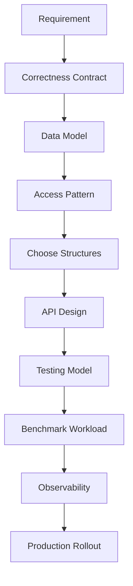
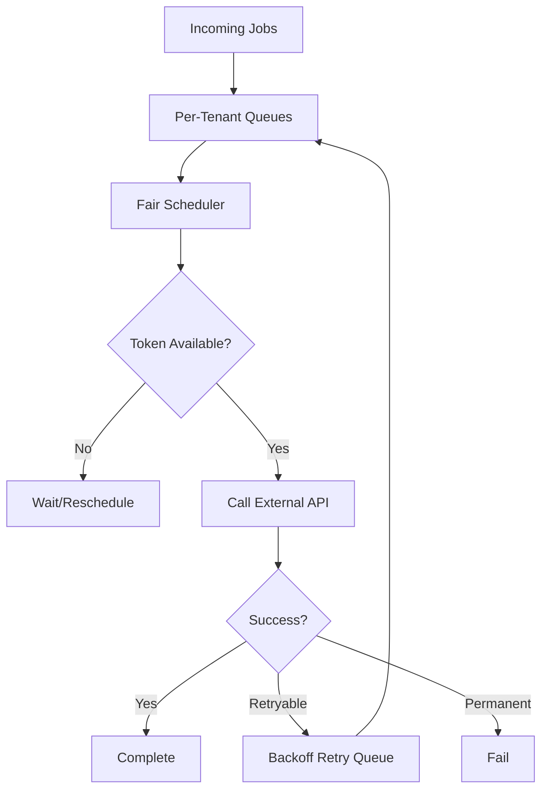
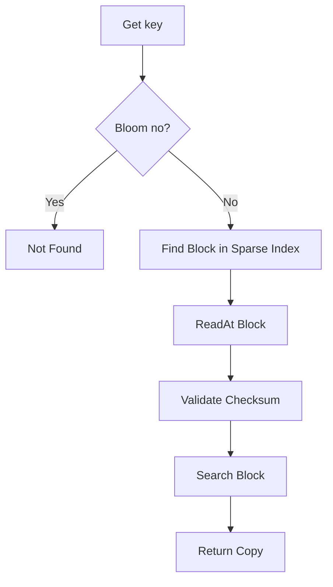
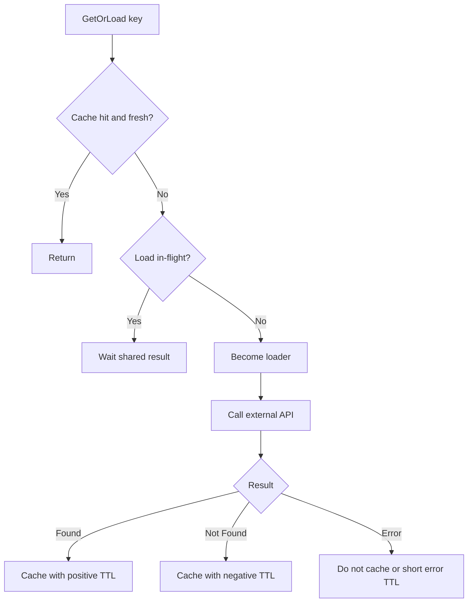
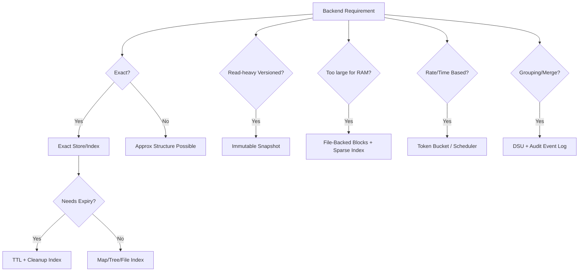

# learn-go-data-structure-algorithm-part-033.md

# Part 033 — Applied Case Studies: Building Real Backend Structures

> Seri: `learn-go-data-structure-algorithm`  
> Bagian: `033 / 034`  
> Target pembaca: Java software engineer yang ingin menguasai Go data structure & algorithm sampai level production-grade  
> Fokus: studi kasus penerapan struktur data dalam sistem backend nyata: idempotency store, permission index, rate-limited dispatcher, audit/event index, config snapshot, file-backed lookup table, cache+singleflight, data pipeline, testing, benchmark, observability, dan production trade-off

---

## Daftar Isi

- [1. Tujuan Part Ini](#1-tujuan-part-ini)
- [2. Mental Model Applied Data Structures](#2-mental-model-applied-data-structures)
- [3. Case Study 1 — Idempotency Store](#3-case-study-1--idempotency-store)
- [4. Case Study 2 — Permission/Authorization Index](#4-case-study-2--permissionauthorization-index)
- [5. Case Study 3 — External API Dispatcher dengan Rate Limit](#5-case-study-3--external-api-dispatcher-dengan-rate-limit)
- [6. Case Study 4 — Audit/Event Query Index](#6-case-study-4--auditevent-query-index)
- [7. Case Study 5 — Immutable Config/Policy Snapshot](#7-case-study-5--immutable-configpolicy-snapshot)
- [8. Case Study 6 — File-Backed Lookup Table](#8-case-study-6--file-backed-lookup-table)
- [9. Case Study 7 — Cache dengan TTL, LRU, Negative Cache, dan Singleflight](#9-case-study-7--cache-dengan-ttl-lru-negative-cache-dan-singleflight)
- [10. Case Study 8 — Work Queue dengan Retry dan Backoff](#10-case-study-8--work-queue-dengan-retry-dan-backoff)
- [11. Case Study 9 — Entity Merge / Duplicate Detection](#11-case-study-9--entity-merge--duplicate-detection)
- [12. Case Study 10 — Streaming Top-K / Hot Key Detector](#12-case-study-10--streaming-top-k--hot-key-detector)
- [13. Cross-Cutting Design Checklist](#13-cross-cutting-design-checklist)
- [14. Testing Strategy untuk Semua Case](#14-testing-strategy-untuk-semua-case)
- [15. Benchmarking Strategy untuk Semua Case](#15-benchmarking-strategy-untuk-semua-case)
- [16. Observability dan Operations](#16-observability-dan-operations)
- [17. Security dan Safety Considerations](#17-security-dan-safety-considerations)
- [18. Anti-Patterns](#18-anti-patterns)
- [19. Decision Framework](#19-decision-framework)
- [20. Latihan Bertahap](#20-latihan-bertahap)
- [21. Ringkasan](#21-ringkasan)
- [22. Referensi](#22-referensi)

---

## 1. Tujuan Part Ini

Bagian sebelumnya membahas struktur data satu per satu. Part ini menggabungkan semuanya ke problem backend nyata.

Di dunia production, jarang ada pertanyaan seperti:

```text
Pakai Fenwick Tree atau Segment Tree?
```

Yang sering muncul:

```text
Bagaimana mencegah duplicate request tanpa menolak request valid?
Bagaimana cache external API tanpa membocorkan stale authorization?
Bagaimana query audit log besar tanpa scan full table?
Bagaimana membatasi request ke provider 300/minute secara fair?
Bagaimana publish config baru tanpa reader melihat state setengah jadi?
Bagaimana build lookup table besar yang tidak muat RAM?
Bagaimana merge duplicate entity tapi tetap audit-safe?
```

Jawabannya biasanya bukan satu struktur data, tetapi komposisi:

```text
map + TTL + heap + lock + exact store + metrics
bitset + dictionary + immutable snapshot
priority queue + token bucket + backoff
file blocks + sparse index + bloom filter
DSU + event log + conflict metadata
Count-Min Sketch + heap candidate tracker
```

Target part ini:

- melatih pemilihan struktur data berdasarkan requirement,
- menjelaskan trade-off production,
- menunjukkan API skeleton Go,
- menekankan correctness, observability, dan failure mode.

---

## 2. Mental Model Applied Data Structures

### 2.1. Data Structure as a System Component

Dalam backend, struktur data bukan hanya object.

Ia punya:

```text
input source
state
operation contract
concurrency model
failure behavior
observability
lifecycle
security boundary
```

---

### 2.2. Design Flow



---

### 2.3. Requirement Dimensions

For every applied structure, ask:

```text
1. Is exactness required?
2. Is stale data allowed?
3. Is data bounded?
4. Is state durable?
5. Is concurrency required?
6. What is read/write ratio?
7. What is key cardinality?
8. What happens on restart?
9. What happens on partial failure?
10. What metrics prove it is healthy?
```

---

### 2.4. Common Composition Patterns

| Problem | Common Composition |
|---|---|
| Dedup/idempotency | exact map/store + TTL + persistence |
| Cache external lookup | LRU + TTL + negative TTL + singleflight |
| Permission check | dictionary + bitset + immutable snapshot |
| Rate-limited dispatch | queue + token bucket + scheduler |
| Retry | priority queue + exponential backoff |
| Large lookup | SSTable-like file + sparse index + bloom |
| Audit query | columnar layout + dictionary + bitmap |
| Entity merge | DSU + metadata + audit event log |
| Hot key detection | Count-Min Sketch + candidate heap |
| Read-mostly config | atomic immutable snapshot |

---

## 3. Case Study 1 — Idempotency Store

### 3.1. Problem

A backend endpoint receives requests with idempotency key.

Requirement:

```text
If the same key is submitted twice within a window,
the system must not perform side effect twice.
```

Example:

- payment request,
- create application,
- submit form,
- send notification,
- external API command.

---

### 3.2. Correctness Contract

Important:

```text
False duplicate reject may block valid request.
False missing duplicate may execute side effect twice.
```

For business-critical operation, idempotency must be exact.

Probabilistic structures like Bloom filter can be prefilter, but not source of truth.

---

### 3.3. State Model

```text
key -> record
```

Record:

```go
type IdempotencyStatus uint8

const (
	StatusProcessing IdempotencyStatus = iota + 1
	StatusSucceeded
	StatusFailed
)

type IdempotencyRecord struct {
	Key       string
	Status    IdempotencyStatus
	Response  []byte
	CreatedAt int64
	ExpiresAt int64
}
```

---

### 3.4. In-Memory Skeleton

```go
type IdempotencyStore struct {
	mu    sync.Mutex
	items map[string]IdempotencyRecord
	now   func() time.Time
	ttl   time.Duration
}

func NewIdempotencyStore(ttl time.Duration) *IdempotencyStore {
	return &IdempotencyStore{
		items: make(map[string]IdempotencyRecord),
		now:   time.Now,
		ttl:   ttl,
	}
}
```

---

### 3.5. Begin Operation

Atomic semantic operation:

```text
Begin(key):
- if absent/expired: insert Processing and return owner=true
- if Processing: return owner=false, in-progress
- if Succeeded: return cached response
- if Failed: policy-dependent
```

```go
type BeginResult struct {
	Owner    bool
	Exists   bool
	Status   IdempotencyStatus
	Response []byte
}

func (s *IdempotencyStore) Begin(key string) BeginResult {
	now := s.now()

	s.mu.Lock()
	defer s.mu.Unlock()

	if rec, ok := s.items[key]; ok {
		if now.UnixNano() < rec.ExpiresAt {
			return BeginResult{
				Owner:    false,
				Exists:   true,
				Status:   rec.Status,
				Response: append([]byte(nil), rec.Response...),
			}
		}
		delete(s.items, key)
	}

	exp := now.Add(s.ttl).UnixNano()
	s.items[key] = IdempotencyRecord{
		Key:       key,
		Status:    StatusProcessing,
		CreatedAt: now.UnixNano(),
		ExpiresAt: exp,
	}

	return BeginResult{Owner: true}
}
```

---

### 3.6. Complete Operation

```go
func (s *IdempotencyStore) Complete(key string, response []byte) bool {
	s.mu.Lock()
	defer s.mu.Unlock()

	rec, ok := s.items[key]
	if !ok || rec.Status != StatusProcessing {
		return false
	}

	rec.Status = StatusSucceeded
	rec.Response = append([]byte(nil), response...)
	s.items[key] = rec
	return true
}
```

---

### 3.7. Failure Policy

If operation fails:

Options:

1. remove key so retry can attempt again,
2. mark failed and cache failure,
3. mark failed only for non-retryable errors,
4. keep processing until timeout.

```go
func (s *IdempotencyStore) Fail(key string, cacheFailure bool, response []byte) bool {
	s.mu.Lock()
	defer s.mu.Unlock()

	rec, ok := s.items[key]
	if !ok || rec.Status != StatusProcessing {
		return false
	}

	if !cacheFailure {
		delete(s.items, key)
		return true
	}

	rec.Status = StatusFailed
	rec.Response = append([]byte(nil), response...)
	s.items[key] = rec
	return true
}
```

---

### 3.8. TTL Cleanup

In-memory map grows unless cleaned.

Options:

- lazy cleanup on access,
- background cleanup,
- min-heap by expiry,
- timing wheel,
- segmented buckets.

For exact idempotency, durable store is often needed.

---

### 3.9. Production Version

For real critical operations:

```text
Use database/Redis/durable KV with atomic insert-if-absent.
```

In-memory local store is insufficient if:

- multiple instances,
- restart loses keys,
- exactness required across cluster,
- operation side effect external.

---

### 3.10. Structures Used

| Requirement | Structure |
|---|---|
| exact key membership | map/durable unique index |
| TTL | expiry timestamp + heap/bucket cleanup |
| concurrent begin | mutex/transaction/CAS |
| response replay | byte copy/serialization |
| cleanup | min-heap/timing wheel |
| distributed exactness | DB unique constraint / Redis SETNX-like operation |

---

### 3.11. Critical Anti-Pattern

Bad:

```text
Bloom says key exists -> skip request
```

This can drop valid request due false positive.

Bloom can only say:

```text
definitely not seen by filter
possibly seen, verify exact store
```

---

## 4. Case Study 2 — Permission/Authorization Index

### 4.1. Problem

A service checks permissions very frequently.

Naive:

```go
map[string]bool
```

per user/session.

At scale:

- repeated strings,
- many checks,
- many roles,
- need fast union/intersection,
- need versioned policy.

---

### 4.2. Requirement

```text
Check if principal has permission P.
Policy updates periodically.
Decision must be auditable with policy version.
```

---

### 4.3. Data Model

Map permission names to dense IDs:

```text
"case.read"  -> 0
"case.write" -> 1
"admin"      -> 2
```

Role permission set:

```text
roleID -> bitset
```

User effective permission:

```text
OR role bitsets
```

---

### 4.4. Permission Dictionary

```go
type PermissionDictionary struct {
	toID map[string]uint32
	names []string
}

func NewPermissionDictionary(names []string) *PermissionDictionary {
	toID := make(map[string]uint32, len(names))
	copied := make([]string, 0, len(names))

	for _, name := range names {
		if _, exists := toID[name]; exists {
			continue
		}
		id := uint32(len(copied))
		toID[name] = id
		copied = append(copied, name)
	}

	return &PermissionDictionary{
		toID: toID,
		names: copied,
	}
}

func (d *PermissionDictionary) ID(name string) (uint32, bool) {
	id, ok := d.toID[name]
	return id, ok
}
```

---

### 4.5. Bitset Permission Set

```go
type PermissionSet struct {
	words []uint64
}

func NewPermissionSet(size int) PermissionSet {
	return PermissionSet{
		words: make([]uint64, (size+63)/64),
	}
}

func (s *PermissionSet) Add(id uint32) {
	i := int(id)
	s.words[i/64] |= uint64(1) << uint(i%64)
}

func (s PermissionSet) Has(id uint32) bool {
	i := int(id)
	if i/64 >= len(s.words) {
		return false
	}
	return s.words[i/64]&(uint64(1)<<uint(i%64)) != 0
}

func (s *PermissionSet) Or(other PermissionSet) bool {
	if len(s.words) != len(other.words) {
		return false
	}
	for i := range s.words {
		s.words[i] |= other.words[i]
	}
	return true
}

func (s PermissionSet) Clone() PermissionSet {
	out := PermissionSet{words: make([]uint64, len(s.words))}
	copy(out.words, s.words)
	return out
}
```

---

### 4.6. Immutable Policy Snapshot

```go
type PolicySnapshot struct {
	version int64
	dict    *PermissionDictionary
	roles   map[string]PermissionSet
}

func (p *PolicySnapshot) Version() int64 {
	return p.version
}

func (p *PolicySnapshot) Has(role string, perm string) bool {
	id, ok := p.dict.ID(perm)
	if !ok {
		return false
	}
	set, ok := p.roles[role]
	if !ok {
		return false
	}
	return set.Has(id)
}
```

---

### 4.7. Policy Store

```go
type PolicyStore struct {
	ptr atomic.Pointer[PolicySnapshot]
	mu  sync.Mutex
}

func (s *PolicyStore) Snapshot() *PolicySnapshot {
	return s.ptr.Load()
}

func (s *PolicyStore) Publish(next *PolicySnapshot) {
	s.mu.Lock()
	defer s.mu.Unlock()
	s.ptr.Store(next)
}
```

Policy snapshot must be immutable after publish.

---

### 4.8. Decision Result

```go
type AuthzDecision struct {
	Allowed       bool
	PolicyVersion int64
	Reason        string
}
```

Always record policy version.

---

### 4.9. Structures Used

| Requirement | Structure |
|---|---|
| permission name lookup | map string -> ID |
| permission set | bitset |
| role union | bitset OR |
| immutable policy | snapshot |
| fast read | atomic pointer |
| audit | versioned decision |
| update validation | builder + publish |

---

### 4.10. Production Risks

- stale allow after permission revoke,
- dictionary ID mismatch across versions,
- mutable bitset after publish,
- missing tenant dimension,
- caching final decision too long,
- no policy version in audit.

---

## 5. Case Study 3 — External API Dispatcher dengan Rate Limit

### 5.1. Problem

External provider allows:

```text
300 requests per minute
```

Your system has many workers and tenants.

Need:

- respect global/provider rate,
- avoid burst violation,
- retry transient errors,
- fair among tenants,
- observe queue depth and delay.

---

### 5.2. Structures

```text
queue per tenant
token bucket global limiter
priority queue for retry due time
deficit round-robin for fairness
singleflight optional per key
```

---

### 5.3. Dispatcher Model



---

### 5.4. Job

```go
type TenantID string

type APIJob struct {
	ID       string
	Tenant   TenantID
	Payload  []byte
	Attempt  int
	NotBefore time.Time
}
```

---

### 5.5. Per-Tenant Queue

```go
type TenantQueue struct {
	items []APIJob
	head  int
}

func (q *TenantQueue) Push(j APIJob) {
	q.items = append(q.items, j)
}

func (q *TenantQueue) Pop() (APIJob, bool) {
	if q.head >= len(q.items) {
		return APIJob{}, false
	}
	j := q.items[q.head]
	var zero APIJob
	q.items[q.head] = zero
	q.head++

	if q.head > 1024 && q.head*2 >= len(q.items) {
		copy(q.items, q.items[q.head:])
		q.items = q.items[:len(q.items)-q.head]
		q.head = 0
	}

	return j, true
}

func (q *TenantQueue) Len() int {
	return len(q.items) - q.head
}
```

---

### 5.6. Fair Round-Robin Scheduler

```go
type FairScheduler struct {
	queues map[TenantID]*TenantQueue
	order  []TenantID
	next   int
}

func NewFairScheduler() *FairScheduler {
	return &FairScheduler{
		queues: make(map[TenantID]*TenantQueue),
	}
}

func (s *FairScheduler) Enqueue(j APIJob) {
	q := s.queues[j.Tenant]
	if q == nil {
		q = &TenantQueue{}
		s.queues[j.Tenant] = q
		s.order = append(s.order, j.Tenant)
	}
	q.Push(j)
}

func (s *FairScheduler) Next() (APIJob, bool) {
	if len(s.order) == 0 {
		return APIJob{}, false
	}

	checked := 0
	for checked < len(s.order) {
		tenant := s.order[s.next]
		s.next = (s.next + 1) % len(s.order)
		checked++

		q := s.queues[tenant]
		if q == nil || q.Len() == 0 {
			continue
		}
		return q.Pop()
	}

	return APIJob{}, false
}
```

This simple version does not remove empty tenant IDs from order. Production should clean up.

---

### 5.7. Token Bucket

Use Part 025 token bucket.

```text
capacity = 10 or provider-approved burst
rate = 5 tokens/sec
```

For 300/minute:

```text
300 / 60 = 5/sec
```

---

### 5.8. Retry Priority Queue

Use min-heap by `NotBefore`.

Retry delay:

```text
base * 2^attempt + jitter
```

---

### 5.9. Production Concerns

- global limit across multiple instances needs central coordination,
- provider may rate-limit by credential/IP/tenant,
- retry must be idempotent,
- worker shutdown must preserve queued jobs if durable requirement,
- queue length must be bounded,
- backpressure policy must be explicit.

---

### 5.10. Structures Used

| Requirement | Structure |
|---|---|
| fairness | per-tenant queues + round-robin/DRR |
| rate limit | token bucket |
| retry scheduling | min-heap |
| dedup | map/singleflight/idempotency |
| bounded memory | queue capacity |
| observability | counters/gauges/histograms |

---

## 6. Case Study 4 — Audit/Event Query Index

### 6.1. Problem

Audit events are large and append-heavy.

Need queries:

```text
events by module
events by actor
events by date range
events by activity
events by status
```

Naive DB or full scan can become expensive.

---

### 6.2. Data Characteristics

Audit events often have:

- repeated module names,
- repeated activity names,
- repeated status,
- timestamps sorted by insertion,
- large JSON/metadata payload,
- mostly append-only.

This fits layout-aware structures.

---

### 6.3. Columnar Block

For each block:

```text
timestamps []int64 delta-varint
module IDs []uint16 dictionary
activity IDs []uint16 dictionary
status IDs []uint8 dictionary
payload offsets []uint32
payload blob []byte
bitmap index per module/status/activity
```

---

### 6.4. Query Plan

For query:

```text
module = "Application" AND status = "FAILED"
```

Plan:

1. dictionary lookup module ID,
2. dictionary lookup status ID,
3. get module bitset,
4. get status bitset,
5. AND bitsets,
6. iterate set bits,
7. decode only matching payloads.

---

### 6.5. Block Structures

```go
type AuditBlock struct {
	BaseTimestamp int64
	TimestampDeltas []byte

	ModuleDict []string
	ModuleIDs  []uint16

	StatusDict []string
	StatusIDs  []uint8

	PayloadOffsets []uint32
	PayloadData    []byte

	ModuleBitmap map[uint16]Bitset
	StatusBitmap map[uint8]Bitset
}
```

---

### 6.6. Bitmap Query

```go
func (b *AuditBlock) Query(moduleID uint16, statusID uint8) (Bitset, bool) {
	mb, ok := b.ModuleBitmap[moduleID]
	if !ok {
		return Bitset{}, false
	}
	sb, ok := b.StatusBitmap[statusID]
	if !ok {
		return Bitset{}, false
	}

	out := mb.Clone()
	if !out.And(sb) {
		return Bitset{}, false
	}

	return out, true
}
```

---

### 6.7. Payload Access

```go
func (b *AuditBlock) Payload(row int) ([]byte, bool) {
	if row < 0 || row+1 >= len(b.PayloadOffsets) {
		return nil, false
	}
	start := b.PayloadOffsets[row]
	end := b.PayloadOffsets[row+1]

	if end < start || int(end) > len(b.PayloadData) {
		return nil, false
	}

	return b.PayloadData[start:end], true
}
```

Return is a view; production API may copy.

---

### 6.8. Structures Used

| Requirement | Structure |
|---|---|
| repeated strings | dictionary encoding |
| filters | bitmap index |
| timestamp compression | delta-varint |
| payload storage | offset table + blob |
| file storage | block + checksum |
| range query | sorted timestamp blocks |
| memory control | block-level loading/cache |

---

### 6.9. Production Risks

- bitmap memory explosion for high-cardinality fields,
- dictionary mismatch between blocks,
- unsafe payload views,
- corrupt offset causing panic,
- full decode accidentally reintroduced,
- block size not tuned,
- no retention/partitioning strategy.

---

## 7. Case Study 5 — Immutable Config/Policy Snapshot

### 7.1. Problem

Configuration or policy is read on every request and updated periodically.

Need:

- consistent multi-field read,
- no read lock contention,
- validation before publish,
- rollback,
- audit version.

---

### 7.2. Structure

```go
type AppConfigSnapshot struct {
	Version int64
	Routes  map[string]string
	Flags   map[string]bool
	Limits  map[string]int
}
```

Keep fields unexported in real package.

---

### 7.3. Store

```go
type ConfigStore struct {
	ptr atomic.Pointer[AppConfigSnapshot]
	mu  sync.Mutex
	next atomic.Int64
}

func NewConfigStore(initial *AppConfigSnapshot) *ConfigStore {
	s := &ConfigStore{}
	if initial.Version == 0 {
		initial.Version = 1
	}
	s.next.Store(initial.Version)
	s.ptr.Store(initial)
	return s
}

func (s *ConfigStore) Snapshot() *AppConfigSnapshot {
	return s.ptr.Load()
}

func (s *ConfigStore) Publish(candidate *AppConfigSnapshot) (int64, error) {
	if err := ValidateConfig(candidate); err != nil {
		return 0, err
	}

	s.mu.Lock()
	defer s.mu.Unlock()

	v := s.next.Add(1)
	candidate.Version = v
	s.ptr.Store(candidate)
	return v, nil
}
```

---

### 7.4. Validation

```go
func ValidateConfig(c *AppConfigSnapshot) error {
	if c == nil {
		return errors.New("nil config")
	}
	for route, target := range c.Routes {
		if route == "" || target == "" {
			return errors.New("invalid route")
		}
	}
	return nil
}
```

---

### 7.5. Snapshot Read

```go
func HandleRequest(store *ConfigStore, path string) (string, bool, int64) {
	snap := store.Snapshot()
	target, ok := snap.Routes[path]
	return target, ok, snap.Version
}
```

Every decision can include config version.

---

### 7.6. Structures Used

| Requirement | Structure |
|---|---|
| read-mostly | immutable snapshot |
| fast read | atomic pointer |
| update | builder + validation |
| no lost update | writer mutex |
| audit | monotonic version |
| rollback | retain previous snapshot |

---

### 7.7. Production Risks

- maps mutated after publish,
- version not recorded in decisions,
- huge snapshot memory spike,
- slow reader retaining old snapshot,
- no validation before publish,
- partial update visible if mutable in-place.

---

## 8. Case Study 6 — File-Backed Lookup Table

### 8.1. Problem

You have large static mapping:

```text
postal code -> address metadata
product code -> product data
identity code -> metadata
```

Too large or too expensive to load into full map.

Need fast point lookup.

---

### 8.2. Design

Use immutable sorted file-backed table:

```text
data blocks sorted by key
sparse index in memory
bloom filter for misses
footer with offsets/checksum
```

---

### 8.3. Read Path



---

### 8.4. API

```go
type LookupTable struct {
	file  *os.File
	index []IndexEntry
	filter *BloomFilter
}

func (t *LookupTable) Get(key []byte) ([]byte, bool, error) {
	if t.filter != nil && !t.filter.MightContain(key) {
		return nil, false, nil
	}

	entry, ok := FindBlock(t.index, key)
	if !ok {
		return nil, false, nil
	}

	block := make([]byte, entry.Size)
	if _, err := t.file.ReadAt(block, entry.Offset); err != nil {
		return nil, false, err
	}

	return LookupInBlock(block, key)
}

func (t *LookupTable) Close() error {
	return t.file.Close()
}
```

---

### 8.5. Build Path

```text
sort input by key
write blocks
build sparse index
build bloom
write index/filter/footer
fsync
atomic rename
```

---

### 8.6. Structures Used

| Requirement | Structure |
|---|---|
| sorted lookup | sparse index + binary search |
| miss avoidance | bloom filter |
| variable records | block format |
| crash-safe publish | temp file + rename |
| corruption detection | checksum |
| range scan | sorted blocks |
| memory bound | index/filter only |

---

### 8.7. Production Risks

- no checksum,
- no versioned format,
- huge block read amplification,
- bloom seed mismatch,
- key order not enforced,
- returning internal buffer unsafe,
- file descriptor leak,
- old file deleted while reader uses it.

---

## 9. Case Study 7 — Cache dengan TTL, LRU, Negative Cache, dan Singleflight

### 9.1. Problem

Service calls expensive external API.

Need:

- cache successful response,
- cache not-found briefly,
- avoid duplicate concurrent load,
- limit memory,
- expire stale data,
- avoid returning wrong tenant/user data.

---

### 9.2. Structures

```text
map key -> entry
doubly linked list for LRU
expiry timestamp
negative result wrapper
singleflight map key -> in-flight call
mutex/shards
```

---

### 9.3. Entry

```go
type LookupResult[V any] struct {
	Value V
	Found bool
}

type CacheEntry[V any] struct {
	Result    LookupResult[V]
	ExpiresAt time.Time
	Weight    int64
}
```

---

### 9.4. Key Design

Cache key must include all dimensions:

```text
tenantID
userID if response user-specific
locale
query parameters
permission/policy version if relevant
```

Bad:

```text
postalCode only
```

if API response differs by tenant/country/version.

---

### 9.5. GetOrLoad Flow



---

### 9.6. Production Policies

```text
positive TTL: longer
negative TTL: shorter
error TTL: none or very short
max entries/weight
singleflight per key
stale fallback optional
metrics
```

---

### 9.7. Structures Used

| Requirement | Structure |
|---|---|
| fast lookup | map |
| bounded memory | LRU |
| freshness | TTL |
| not-found protection | negative cache |
| thundering herd | singleflight |
| concurrency | mutex/sharding |
| cleanup | lazy + heap/bucket optional |

---

### 9.8. Production Risks

- cache key missing security dimension,
- caching transient error as not-found,
- stale authorization/permission response,
- no singleflight causes API burst,
- no max capacity causes memory leak,
- mutable value returned and modified,
- callback under lock.

---

## 10. Case Study 8 — Work Queue dengan Retry dan Backoff

### 10.1. Problem

Background jobs need reliable-ish processing.

Need:

- enqueue jobs,
- worker consumes,
- retry failures with backoff,
- dead-letter after max attempts,
- shutdown gracefully,
- avoid unbounded memory.

---

### 10.2. Structures

```text
bounded queue
min-heap retry queue
map jobID for dedup optional
backoff function
dead-letter list/store
```

---

### 10.3. Queue Semantics

Define:

```text
Enqueue after close returns error.
Close stops accepting new jobs.
Workers drain current queue.
Retry queue stops or persists depending durability.
```

---

### 10.4. Retry Scheduler

```go
type RetryItem struct {
	Job       Job
	NotBefore time.Time
	Attempt   int
}
```

Use heap by `NotBefore`.

---

### 10.5. Backoff

```text
delay = min(maxDelay, base * 2^attempt) + jitter
```

---

### 10.6. Durable vs In-Memory

In-memory queue loses jobs on restart.

If job loss unacceptable:

- durable queue,
- database table,
- log,
- message broker,
- WAL.

---

### 10.7. Structures Used

| Requirement | Structure |
|---|---|
| ready jobs | channel/ring queue |
| delayed retry | min-heap scheduler |
| fairness | per-tenant queue |
| dedup | map/set |
| capacity | bounded queue |
| shutdown | state machine |
| durability | external persistent queue/log |

---

### 10.8. Production Risks

- retry storm without jitter,
- retrying non-retryable errors,
- unbounded queue,
- job not idempotent,
- poison message loops,
- shutdown drops in-flight jobs,
- no DLQ.

---

## 11. Case Study 9 — Entity Merge / Duplicate Detection

### 11.1. Problem

System detects that entities may represent same real-world object.

Examples:

- duplicate accounts,
- same business/person,
- duplicate cases,
- repeated external identities.

---

### 11.2. Candidate vs Decision

Important distinction:

```text
candidate duplicate != confirmed merge
```

Candidate detection may use fuzzy/probabilistic methods.

Confirmed merge should be auditable and usually exact/manual/rule-based.

---

### 11.3. DSU Role

DSU tracks connected components after merge decisions.

```text
Union(entityA, entityB)
Find(entity)
Component(entity)
```

But DSU should not be the only source of truth.

---

### 11.4. Event Log as Source of Truth

```text
merge event:
- entityA
- entityB
- evidence
- actor
- rule version
- timestamp
- conflict result
```

DSU/component table is projection.

If bad merge found:

```text
invalidate event
rebuild projection
```

---

### 11.5. Metadata

Component metadata:

```go
type EntityComponentMeta struct {
	Count       int
	CanonicalID string
	Conflict    bool
	Sources     map[string]string
}
```

Merge rule must be deterministic.

---

### 11.6. Structures Used

| Requirement | Structure |
|---|---|
| grouping | DSU |
| audit | append-only event log |
| conflict detection | component metadata |
| rebuild | replay events |
| candidate scoring | maps/sets/probabilistic prefilter |
| manual review | priority queue/worklist |

---

### 11.7. Production Risks

- treating similarity as equivalence,
- root ID used as canonical business ID,
- no unmerge strategy,
- no audit evidence,
- metadata merge hides conflicts,
- DSU used for directed relation,
- irreversible operation without review.

---

## 12. Case Study 10 — Streaming Top-K / Hot Key Detector

### 12.1. Problem

Need identify hot keys in stream:

```text
Which API keys/users/IPs are generating most traffic?
```

Exact counting all keys may be memory-heavy.

---

### 12.2. Structures

```text
Count-Min Sketch for approximate count
small candidate map/heap for top-K candidates
time window or decay
```

---

### 12.3. Candidate Tracker

CMS estimates counts, but does not list keys by itself.

Keep candidate set:

```go
type Candidate struct {
	Key   string
	Count uint64
}
```

Use min-heap of candidates by estimated count.

---

### 12.4. Simplified Flow

```text
for each key:
  cms.Add(key, 1)
  est = cms.Estimate(key)
  update candidate tracker
```

---

### 12.5. Time Window

Options:

- rotate CMS per minute,
- decay counts,
- reset periodically,
- keep ring of sketches.

---

### 12.6. Structures Used

| Requirement | Structure |
|---|---|
| approximate frequency | Count-Min Sketch |
| top candidates | min-heap + map |
| time window | ring of sketches |
| exact verify | optional map for candidate keys |
| memory bound | fixed width/depth |

---

### 12.7. Production Risks

- CMS overestimates due collision,
- no candidate tracker means cannot list top-K,
- no window means old hot keys stay,
- using approximate count for billing/quota,
- adversarial keys distort sketch,
- no seed/version consistency for merge.

---

## 13. Cross-Cutting Design Checklist

### 13.1. Correctness

```text
[ ] What exact contract is promised?
[ ] What errors are acceptable?
[ ] Is approximation allowed?
[ ] Is stale data allowed?
[ ] Are operations atomic enough?
[ ] What are invariants?
```

---

### 13.2. Data Bound

```text
[ ] Max entries?
[ ] Max bytes?
[ ] TTL/retention?
[ ] Cleanup?
[ ] Backpressure?
```

---

### 13.3. Concurrency

```text
[ ] Safe for concurrent use?
[ ] Lock scope?
[ ] Sharding?
[ ] Callback under lock?
[ ] Logical races?
```

---

### 13.4. Durability

```text
[ ] In-memory acceptable?
[ ] Restart behavior?
[ ] File/DB source of truth?
[ ] Crash consistency?
[ ] Replay/rebuild?
```

---

### 13.5. Observability

```text
[ ] Hit/miss?
[ ] Reject/allow?
[ ] Queue depth?
[ ] Eviction?
[ ] Expiration?
[ ] Retry count?
[ ] Error rate?
[ ] Memory usage?
```

---

## 14. Testing Strategy untuk Semua Case

### 14.1. General Pattern

For each applied component:

```text
1. Unit tests for edge cases.
2. Invariant tests.
3. Differential tests vs simple model.
4. Random operation sequence.
5. Concurrency race tests if concurrent.
6. Fuzz/corruption tests if parsing bytes.
7. Benchmark hot path.
```

---

### 14.2. Example Matrix

| Case | Oracle |
|---|---|
| Idempotency store | sequential model map |
| Permission bitset | map[string]bool |
| Rate limiter | fake clock model |
| Audit bitmap | naive scan |
| Snapshot store | old/new snapshot tests |
| File table | in-memory map |
| Cache | naive LRU model |
| Retry queue | sorted list by due time |
| DSU merge | naive component labels |
| Top-K | exact count for small stream |

---

### 14.3. Fake Clock

Use fake clock for:

- TTL,
- limiter,
- retry,
- scheduler,
- cache expiration.

No real sleep in unit tests.

---

### 14.4. Corruption/Fuzz

Use fuzz for:

- file block parser,
- encoded index,
- varint/delta data,
- serialized snapshot.

---

## 15. Benchmarking Strategy untuk Semua Case

### 15.1. Benchmark Hot Path

| Case | Hot Path |
|---|---|
| Idempotency | Begin/Complete |
| Permission | Has permission |
| Dispatcher | scheduling + limiter check |
| Audit index | bitmap query + payload decode |
| Config snapshot | Snapshot/Get |
| File table | Get hit/miss |
| Cache | Get hit/miss/GetOrLoad |
| Retry queue | push/pop due |
| Entity merge | Find/Union |
| Top-K | Add event |

---

### 15.2. Benchmark Workload Shape

Include:

- hit/miss ratio,
- key distribution,
- read/write mix,
- number of tenants,
- payload size,
- concurrency,
- cold/warm file cache,
- snapshot size,
- queue depth.

---

### 15.3. Benchmark Memory

For applied structures, memory often matters more than ns/op.

Track:

- bytes per key,
- bitmap size,
- index size,
- cache weight,
- queue memory,
- old snapshot retention,
- file block cache memory.

---

## 16. Observability dan Operations

### 16.1. Metrics by Component

Idempotency:

```text
begin_owner_total
duplicate_total
processing_conflict_total
expired_total
```

Permission:

```text
policy_version
decision_allowed_total
decision_denied_total
unknown_permission_total
```

Dispatcher:

```text
queue_depth
allowed_total
rate_limited_total
retry_total
dead_letter_total
```

Cache:

```text
hit_total
miss_total
eviction_total
expired_total
load_shared_total
load_error_total
```

File table:

```text
lookup_hit_total
lookup_miss_total
bloom_negative_total
block_read_total
checksum_error_total
```

---

### 16.2. Logs

Log important state transitions:

- config publish version,
- file table open/recover,
- compaction publish,
- repeated external API failures,
- corruption detected,
- entity merge decision.

Avoid per-hot-operation logs.

---

### 16.3. Debuggability

Expose debug-safe introspection:

- current version,
- approximate size,
- stats snapshot,
- health check,
- last error,
- queue depth.

Do not expose mutable internals.

---

## 17. Security dan Safety Considerations

### 17.1. Cache Key Safety

Cache key must include:

- tenant,
- user,
- role/policy version if needed,
- locale,
- request parameters,
- source version.

Missing dimension can leak data.

---

### 17.2. Authorization Staleness

Permission cache/snapshot must define staleness.

Revocation risk matters.

---

### 17.3. Parser Safety

File-backed/parser structures must validate untrusted bytes.

No panic on corrupt data.

---

### 17.4. Approximation Safety

Probabilistic data structures must not be final authority for:

- billing,
- exact quota,
- legal decision,
- security allow/deny,
- idempotency critical side effects.

---

### 17.5. Entity Merge Safety

Merge operation can be irreversible socially/business-wise.

Need audit, conflict detection, review, rebuild/unmerge strategy.

---

## 18. Anti-Patterns

### 18.1. Choosing Structure Before Requirement

Bad:

```text
Let's use Redis/Bloom/LSM/Trie
```

before defining exact contract.

---

### 18.2. Cache as Source of Truth

Unless explicitly designed durable and authoritative, cache is disposable.

---

### 18.3. Approximate Structure for Exact Decision

Bloom/CMS/HLL are not exact.

---

### 18.4. No Bound

Unbounded map/queue/cache is memory leak.

---

### 18.5. No Version

Policy/config/file format without version makes audit and migration hard.

---

### 18.6. No Observability

If you cannot see hit/miss/queue/eviction/error, you cannot operate it.

---

### 18.7. Hidden Mutable State

Returning internal slices/maps breaks invariants.

---

### 18.8. No Recovery Story

File-backed/durable structures need crash/corruption/rebuild plan.

---

### 18.9. Overengineering with Exotic Structure

A simple map+mutex may be best until workload proves otherwise.

---

## 19. Decision Framework

### 19.1. Applied Design Questions

```text
1. What must be exact?
2. What may be approximate?
3. What may be stale?
4. What must survive restart?
5. What is bounded by count/time/bytes?
6. What is the access pattern?
7. What is the concurrency model?
8. What is the simplest correct implementation?
9. What metrics prove correctness/health?
10. What test oracle can validate behavior?
```

---

### 19.2. Structure Selection Table

| Requirement | Candidate Structures |
|---|---|
| exact dedup | map/DB unique key |
| expiring membership | map + TTL heap/bucket |
| fast permission check | dictionary + bitset |
| read-mostly config | immutable snapshot + atomic pointer |
| rate limit | token bucket / sliding window |
| retry | priority queue + backoff |
| fair dispatch | per-key queues + round-robin/DRR |
| large static lookup | SSTable-like file + sparse index |
| query repeated categorical fields | dictionary + bitmap |
| duplicate grouping | DSU + event log |
| hot key approximation | CMS + candidate heap |
| approximate distinct | HLL |
| membership prefilter | Bloom filter |

---

### 19.3. Flowchart



---

## 20. Latihan Bertahap

### 20.1. Level 1 — Idempotency Store

Implement:

- `Begin`,
- `Complete`,
- `Fail`,
- TTL expiration,
- fake clock tests,
- concurrent begin test.

---

### 20.2. Level 2 — Permission Bitset

Implement:

- permission dictionary,
- role bitsets,
- effective permission union,
- immutable policy snapshot,
- decision includes version.

---

### 20.3. Level 3 — Rate-Limited Dispatcher

Implement:

- token bucket,
- per-tenant queues,
- retry heap,
- backoff with jitter,
- metrics.

---

### 20.4. Level 4 — Audit Block

Implement:

- dictionary columns,
- bitmap index,
- payload offset table,
- query by two predicates,
- naive scan differential test.

---

### 20.5. Level 5 — File-Backed Lookup

Implement:

- sorted writer,
- sparse index,
- bloom prefilter,
- checksum,
- corruption tests.

---

### 20.6. Level 6 — Integrated Mini Backend Library

Build a small Go module:

```text
/internal/idempotency
/internal/permindex
/internal/ratelimit
/internal/filetable
/internal/cache
```

For each package:

- docs,
- tests,
- fuzz where needed,
- benchmarks,
- README trade-off.

---

## 21. Ringkasan

Applied backend structures are rarely a single textbook data structure.

They are compositions of:

- exact indexes,
- approximate filters,
- queues,
- heaps,
- bitsets,
- maps,
- snapshots,
- file blocks,
- TTL cleanup,
- concurrency controls,
- metrics,
- durability protocols.

Key lessons:

- Start from correctness contract.
- Use simplest correct structure first.
- Approximate structures are prefilters, not final authority for exact decisions.
- Cache requires staleness and key-safety design.
- Rate limiting requires time semantics and fairness decisions.
- File-backed structures require format versioning, checksums, and recovery.
- Permission/index structures benefit from dictionary + bitset + immutable snapshot.
- Entity merge requires DSU plus audit and conflict semantics.
- Every applied structure needs tests, benchmarks, and observability.

Production mental model:

```text
A backend data structure is production-ready only when its correctness, lifecycle, failure behavior, and observability are as well-designed as its algorithm.
```

---

## 22. Referensi

Referensi utama yang relevan untuk part ini:

- Go 1.26 Release Notes — `https://go.dev/doc/go1.26`
- Go Release History — `https://go.dev/doc/devel/release`
- Go Language Specification — `https://go.dev/ref/spec`
- Package `sync` — `https://pkg.go.dev/sync`
- Package `sync/atomic` — `https://pkg.go.dev/sync/atomic`
- Package `time` — `https://pkg.go.dev/time`
- Package `container/heap` — `https://pkg.go.dev/container/heap`
- Package `encoding/binary` — `https://pkg.go.dev/encoding/binary`
- Package `hash/crc32` — `https://pkg.go.dev/hash/crc32`
- Package `os` — `https://pkg.go.dev/os`
- Package `testing` — `https://pkg.go.dev/testing`
- Go Data Race Detector — `https://go.dev/doc/articles/race_detector`
- Go Fuzzing — `https://go.dev/doc/security/fuzz`

---

# Status Seri

Selesai:

- Part 000 — Roadmap, Mental Model, dan Batasan Seri
- Part 001 — Complexity Model yang Realistis di Go
- Part 002 — Arrays, Slices, dan Sequence Design
- Part 003 — Maps, Hash Tables, dan Associative Data
- Part 004 — Sorting, Ordering, Comparison, dan Search
- Part 005 — Stack, Queue, Deque, dan Worklist Algorithms
- Part 006 — Linked List, Intrusive List, dan Pointer-Chasing Trade-off
- Part 007 — Heap, Priority Queue, dan Scheduling Algorithms
- Part 008 — Sets, Multisets, Bag, dan Membership Models
- Part 009 — Strings, Bytes, Runes, Tokenization, dan Text Algorithms
- Part 010 — Recursion, Iteration, Backtracking, dan State Space Search
- Part 011 — Hashing, Fingerprint, Checksums, dan Equality Strategy
- Part 012 — Trees: Binary Tree, BST, Traversal, dan Structural Invariants
- Part 013 — Balanced Trees: AVL, Red-Black, Treap, dan Ordered Index
- Part 014 — B-Tree, B+Tree, Page-Oriented Structure, dan Storage-Aware Index
- Part 015 — Trie, Radix Tree, Patricia Tree, dan Prefix Index
- Part 016 — Graph Fundamentals: Representation, Traversal, dan Modelling
- Part 017 — Graph Algorithms for Production Systems
- Part 018 — Dynamic Programming: Memoization, Tabulation, dan State Compression
- Part 019 — Greedy Algorithms, Exchange Argument, dan Approximation Thinking
- Part 020 — Divide and Conquer, Selection, dan Search Space Reduction
- Part 021 — Range Query Structures: Prefix Sum, Fenwick Tree, Segment Tree
- Part 022 — Disjoint Set Union, Connectivity, dan Merge Semantics
- Part 023 — Probabilistic Data Structures
- Part 024 — Cache Data Structures: LRU, LFU, ARC-like Thinking, TTL Index
- Part 025 — Time, Scheduling, Rate Limiting, dan Window Algorithms
- Part 026 — Concurrent Data Structures in Go: Correctness Before Performance
- Part 027 — Persistent, Immutable, dan Versioned Data Structures
- Part 028 — Serialization-Aware and Layout-Aware Data Structures
- Part 029 — External Memory Algorithms and File-Backed Structures
- Part 030 — API Design for Reusable Data Structures in Go
- Part 031 — Correctness Testing: Invariants, Fuzzing, Property Testing, Differential Testing
- Part 032 — Benchmarking and Profiling Data Structures
- Part 033 — Applied Case Studies: Building Real Backend Structures

Berikutnya:

- Part 034 — Final Handbook: Decision Framework, Anti-Patterns, dan Production Checklist

<!-- NAVIGATION_FOOTER -->
<div class="page-nav">
<a href="./learn-go-data-structure-algorithm-part-032.md">⬅️ Part 032 — Benchmarking and Profiling Data Structures</a>
<a href="./index.md">📚 Kategori</a>
<a href="../../index.md">🏠 Home</a>
<a href="./learn-go-data-structure-algorithm-part-034.md">Part 034 — Final Handbook: Decision Framework, Anti-Patterns, dan Production Checklist ➡️</a>
</div>
