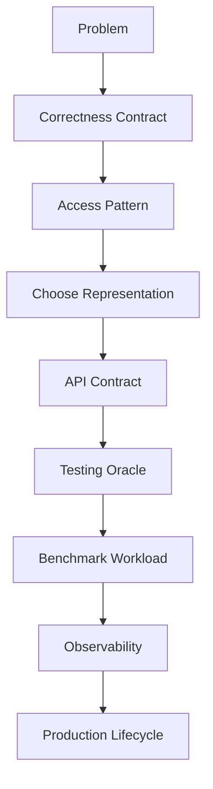
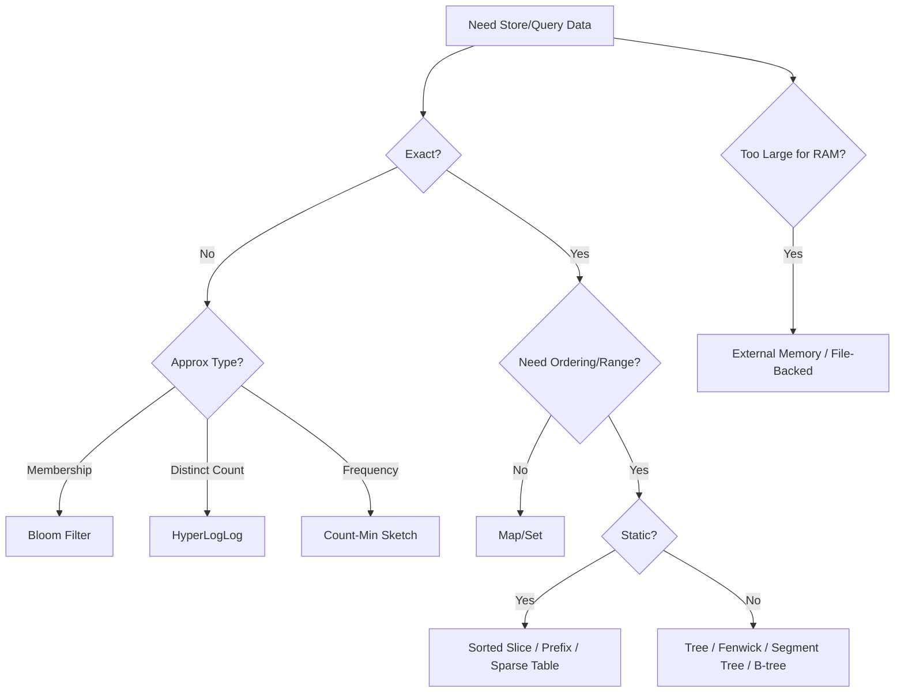

# learn-go-data-structure-algorithm-part-034.md

# Part 034 — Final Handbook: Decision Framework, Anti-Patterns, dan Production Checklist

> Seri: `learn-go-data-structure-algorithm`  
> Bagian: `034 / 034`  
> Status: **bagian terakhir seri**  
> Target pembaca: Java software engineer yang ingin menguasai Go data structure & algorithm sampai level production-grade  
> Fokus: handbook final untuk memilih, mendesain, menguji, mengoptimasi, dan mengoperasikan struktur data di Go secara production-ready

---

## Daftar Isi

- [1. Tujuan Final Handbook](#1-tujuan-final-handbook)
- [2. Mental Model Utama Seluruh Seri](#2-mental-model-utama-seluruh-seri)
- [3. Decision Framework 1 — Dari Requirement ke Struktur Data](#3-decision-framework-1--dari-requirement-ke-struktur-data)
- [4. Decision Framework 2 — Access Pattern](#4-decision-framework-2--access-pattern)
- [5. Decision Framework 3 — Correctness dan Error Model](#5-decision-framework-3--correctness-dan-error-model)
- [6. Decision Framework 4 — Memory, Layout, dan GC](#6-decision-framework-4--memory-layout-dan-gc)
- [7. Decision Framework 5 — Concurrency](#7-decision-framework-5--concurrency)
- [8. Decision Framework 6 — Time, Expiry, dan Scheduling](#8-decision-framework-6--time-expiry-dan-scheduling)
- [9. Decision Framework 7 — Persistence dan External Memory](#9-decision-framework-7--persistence-dan-external-memory)
- [10. Cheat Sheet Struktur Data](#10-cheat-sheet-struktur-data)
- [11. Production Design Checklist](#11-production-design-checklist)
- [12. Correctness Checklist](#12-correctness-checklist)
- [13. API Design Checklist](#13-api-design-checklist)
- [14. Concurrency Checklist](#14-concurrency-checklist)
- [15. Performance Checklist](#15-performance-checklist)
- [16. Persistence/File Format Checklist](#16-persistencefile-format-checklist)
- [17. Observability Checklist](#17-observability-checklist)
- [18. Security dan Safety Checklist](#18-security-dan-safety-checklist)
- [19. Anti-Patterns Besar](#19-anti-patterns-besar)
- [20. Red Flags Saat Code Review](#20-red-flags-saat-code-review)
- [21. Refactoring Playbook](#21-refactoring-playbook)
- [22. Production Readiness Review Template](#22-production-readiness-review-template)
- [23. Learning Retention: Cara Melatih Keluwesan](#23-learning-retention-cara-melatih-keluwesan)
- [24. Final Summary Seluruh Seri](#24-final-summary-seluruh-seri)
- [25. Rekomendasi Materi Lanjutan](#25-rekomendasi-materi-lanjutan)
- [26. Referensi](#26-referensi)

---

## 1. Tujuan Final Handbook

Part ini adalah handbook final untuk seluruh seri.

Tujuannya bukan mengulang semua detail, tetapi memberi peta keputusan yang bisa dipakai saat menghadapi problem nyata.

Setelah menyelesaikan seri ini, target skill yang ingin dicapai:

```text
Bukan hanya tahu banyak struktur data.
Tetapi mampu memilih, menggabungkan, menguji, mengukur, dan mengoperasikan struktur data yang sesuai dengan requirement production.
```

Top-tier engineer biasanya tidak bertanya:

```text
Apa struktur data paling cepat?
```

Ia bertanya:

```text
Apa contract yang harus benar?
Apa akses pattern-nya?
Apa bound-nya?
Apa failure mode-nya?
Apa memory layout-nya?
Apa concurrency semantics-nya?
Apa observability-nya?
Apa test oracle-nya?
Bagaimana kita tahu ini masih benar setelah optimasi?
```

---

## 2. Mental Model Utama Seluruh Seri

### 2.1. Struktur Data = Representation + Operations + Contract

Struktur data bukan hanya internal memory.

Ia adalah:

```text
Representation:
    bagaimana data disimpan

Operations:
    apa yang bisa dilakukan

Contract:
    apa yang dijamin benar

Cost model:
    CPU, memory, allocation, I/O, lock, GC

Lifecycle:
    build, mutate, snapshot, serialize, close, cleanup

Failure model:
    invalid input, concurrency, crash, corruption, stale data
```

---

### 2.2. Big-O Penting, Tapi Tidak Cukup

Big-O menjawab pertanyaan:

```text
Bagaimana cost bertumbuh terhadap n?
```

Tetapi production juga bertanya:

```text
Berapa byte per entry?
Berapa pointer?
Berapa allocation?
Apakah GC scan mahal?
Apakah cache locality baik?
Apakah disk read random atau sequential?
Apakah query meng-copy data?
Apakah lock contention tinggi?
Apakah operasi tail latency punya spike?
```

---

### 2.3. Correctness Lebih Dulu daripada Performance

Urutan sehat:

```text
1. Contract
2. Invariant
3. Naive oracle
4. Correct implementation
5. Tests
6. Benchmark
7. Profile
8. Optimize
9. Re-test
10. Document trade-off
```

Bukan:

```text
1. Pilih struktur paling fancy
2. Optimasi
3. Baru mencari bug di production
```

---

### 2.4. Diagram Mental Model Final



---

## 3. Decision Framework 1 — Dari Requirement ke Struktur Data

### 3.1. Pertanyaan Pertama

Sebelum memilih struktur data, jawab:

```text
1. Apa operasi utama?
2. Apa yang harus exact?
3. Apa yang boleh approximate?
4. Apakah data berubah atau mostly immutable?
5. Apakah butuh ordering?
6. Apakah butuh range query?
7. Apakah butuh prefix query?
8. Apakah butuh membership?
9. Apakah butuh grouping/merge?
10. Apakah data muat RAM?
```

---

### 3.2. Mapping Requirement ke Struktur

| Requirement | Kandidat |
|---|---|
| exact key-value lookup | map, sorted slice, B-tree, file index |
| membership exact | set/map |
| membership approximate | Bloom filter |
| ordering | sorted slice, heap, tree, B-tree |
| priority by min/max | heap |
| prefix lookup | trie/radix tree |
| range sum/min/max | prefix sum, Fenwick, segment tree, sparse table |
| dynamic connectivity | DSU |
| graph traversal | adjacency list/map |
| shortest path | BFS/Dijkstra depending weights |
| approximate distinct | HyperLogLog |
| approximate frequency | Count-Min Sketch |
| cache eviction | LRU/LFU/TTL/admission policy |
| time scheduling | min-heap/timing wheel |
| external large sort | external sort + k-way merge |
| file-backed lookup | SSTable-like sorted blocks |
| read-mostly config | immutable snapshot + atomic pointer |
| concurrent hot map | mutex/RWMutex/sharded/sync.Map/snapshot |

---

### 3.3. Flowchart Umum



---

## 4. Decision Framework 2 — Access Pattern

### 4.1. Access Pattern Mengalahkan Preferensi

Struktur yang bagus untuk satu workload bisa buruk untuk workload lain.

Contoh:

- LRU bagus untuk recency locality, buruk untuk scan pollution.
- LFU bagus untuk stable hot keys, buruk untuk workload berubah tanpa aging.
- Map bagus untuk point lookup, sorted slice bagus untuk deterministic scan/range memory compact.
- Fenwick bagus untuk prefix/range sum, segment tree lebih general.
- Trie bagus untuk prefix string, map lebih sederhana untuk exact string lookup.

---

### 4.2. Access Pattern Checklist

```text
[ ] Point lookup?
[ ] Range query?
[ ] Prefix query?
[ ] Full scan?
[ ] Insert-heavy?
[ ] Delete-heavy?
[ ] Update-heavy?
[ ] Append-only?
[ ] Read-mostly?
[ ] Hot-key skew?
[ ] Uniform random?
[ ] Sequential scan?
[ ] Time-windowed?
[ ] Needs ordering?
[ ] Needs top-k?
```

---

### 4.3. Table Access Pattern

| Pattern | Good Fit |
|---|---|
| point lookup, mutable | map |
| point lookup, immutable memory-sensitive | sorted slice + binary search |
| ordered iteration | tree/sorted slice |
| priority pop | heap |
| rolling recent count | sliding window / token bucket |
| full column scan | SoA/columnar layout |
| repeated categorical filter | dictionary + bitmap |
| prefix search | trie/radix tree |
| append + replay | append-only log |
| sorted immutable lookup | SSTable-like file |
| read-mostly versioned | atomic snapshot |

---

## 5. Decision Framework 3 — Correctness dan Error Model

### 5.1. Exactness

Tanyakan:

```text
Apakah jawaban salah bisa diterima?
Jika bisa, salah jenis apa?
```

Jenis error:

- false positive,
- false negative,
- overestimate,
- underestimate,
- stale read,
- duplicate processing,
- lost update,
- inconsistent snapshot.

---

### 5.2. Error Model Table

| Structure | Error Model |
|---|---|
| map/set | exact if used correctly |
| Bloom filter | false positive possible, false negative not expected |
| Count-Min Sketch | overestimate possible |
| HyperLogLog | estimation error |
| cache | stale/missing/evicted possible |
| local rate limiter | approximate global limit in multi-instance |
| immutable snapshot | consistent but may not be latest |
| file-backed table | I/O/corruption errors possible |
| concurrent structure | logical race possible even without data race |

---

### 5.3. Dangerous Exactness Cases

Do **not** use approximate structures as final authority for:

- payment idempotency,
- billing,
- legal/compliance counts,
- authorization allow/deny,
- account merge final decision,
- quota with money impact,
- permanent deletion.

Approximate structures may help as:

- prefilter,
- telemetry,
- capacity planning,
- candidate detector,
- non-critical dashboard.

---

### 5.4. Correctness Contract Template

For any structure, write:

```text
Name:
Purpose:
Exact/Approx:
Allowed error:
Disallowed error:
Concurrency:
Persistence:
Staleness:
Capacity bound:
Failure behavior:
```

Example:

```text
Bloom prefilter for DB lookup:
- Exact/Approx: approximate membership
- Allowed error: false positive causing extra DB lookup
- Disallowed error: false negative for inserted keys
- Final decision: DB lookup, not Bloom
```

---

## 6. Decision Framework 4 — Memory, Layout, dan GC

### 6.1. Memory Questions

```text
Berapa item?
Berapa bytes per item?
Berapa pointer per item?
Berapa allocation per insert/query?
Apakah GC harus scan semua?
Apakah data contiguous?
Apakah values repeated?
Apakah bisa dictionary encode?
Apakah bisa bitset?
```

---

### 6.2. Layout Choices

| Situation | Better Layout |
|---|---|
| many booleans | bitset |
| repeated strings | dictionary/symbol table |
| sorted close integers | delta + varint |
| repeated runs | RLE |
| column scans | Struct of Arrays |
| whole object processing | Array of Structs |
| read-only lookup compact | sorted slice |
| huge sparse int set | roaring-like bitmap |
| variable-length immutable bytes | offset table + blob |
| low GC pressure needed | pointer-light arrays |

---

### 6.3. GC-Aware Decision

Pointer-rich:

```go
map[string]*Node
[]*Entry
linked list
tree nodes
```

Pointer-light:

```go
[]uint64
[]struct{ ID uint64; Offset uint32; Len uint32 }
[]byte blob
bitset
```

Pointer-light structures often scale better for millions of items.

---

### 6.4. Red Flag Memory

```text
unbounded map
unbounded queue
many tiny objects
slice retains huge backing array
returning internal mutable []byte
cache values with unknown size
full decode for one-field query
```

---

## 7. Decision Framework 5 — Concurrency

### 7.1. Start with Semantics

Before lock choice:

```text
What operation must be atomic?
```

Wrong:

```text
Should I use Mutex or RWMutex?
```

Better:

```text
Does user need AddIfAbsent?
Does Get mutate recency?
Does Snapshot need consistent view?
Can readers see stale version?
Can writes be serialized?
```

---

### 7.2. Concurrency Strategy Table

| Requirement | Strategy |
|---|---|
| simple shared mutable structure | mutex |
| read-heavy, few writes | RWMutex or atomic snapshot |
| read-mostly coherent snapshot | immutable snapshot + atomic pointer |
| high write contention across keys | sharding |
| write-once read-many | sync.Map maybe |
| counters | atomic/striped counters |
| queue with backpressure | channel/ring queue |
| complex invariant across fields | one lock for invariant |
| lock-free desire | only after profiling and expertise |

---

### 7.3. Logical Race Reminder

Thread-safe methods are not enough.

Bad:

```go
if !set.Contains(k) {
	set.Add(k)
	process(k)
}
```

Good:

```go
if set.Add(k) {
	process(k)
}
```

API should expose semantic atomic operations.

---

### 7.4. Concurrency Checklist

```text
[ ] Is type safe for concurrent use?
[ ] Are values also safe or immutable?
[ ] What does lock protect?
[ ] Are compound operations atomic?
[ ] Are callbacks called under lock?
[ ] Is iteration snapshot or live?
[ ] Is Close safe/idempotent?
[ ] Can goroutines leak?
[ ] Race detector run?
[ ] Logical race tests exist?
```

---

## 8. Decision Framework 6 — Time, Expiry, dan Scheduling

### 8.1. Time-Based Structures Need Clock Contract

Ask:

```text
Wall clock or monotonic elapsed?
Fake clock for tests?
Boundary inclusive/exclusive?
What happens on clock jump?
```

---

### 8.2. Time Structure Table

| Need | Structure |
|---|---|
| execute due tasks | min-heap scheduler |
| many coarse timers | timing wheel |
| allow burst with average rate | token bucket |
| smooth output | leaky bucket |
| simple quota per period | fixed window |
| exact last N duration count | sliding window log |
| approximate rolling count | sliding window counter |
| recent score matters more | exponential decay |
| retry after failure | heap + backoff + jitter |

---

### 8.3. Time Anti-Patterns

```text
real sleep in unit tests
fixed window for strict rolling limit
no jitter in retry
unbounded per-key limiter map
local limiter treated as global
retrying permanent errors
sleeping while holding lock
```

---

## 9. Decision Framework 7 — Persistence dan External Memory

### 9.1. When RAM Is Not Enough

Ask:

```text
Does data fit RAM with headroom?
Must it survive restart?
Is access sequential or random?
Can data be immutable?
Can index fit RAM?
What is crash consistency requirement?
```

---

### 9.2. File-Backed Design Table

| Need | Structure |
|---|---|
| durable append | append-only log |
| random record by ID | offset table |
| sort bigger than RAM | external sort |
| sorted immutable lookup | SSTable-like file |
| high miss lookup | bloom filter |
| range scan | sorted blocks |
| corruption detection | checksum |
| safe publish | temp file + fsync + rename |
| old data cleanup | compaction |
| active file set | manifest |

---

### 9.3. Persistence Checklist

```text
[ ] Magic bytes
[ ] Version
[ ] Explicit endianness
[ ] Length validation
[ ] Offset validation
[ ] Checksum
[ ] Footer/commit marker
[ ] Atomic publish
[ ] Recovery behavior
[ ] Golden compatibility tests
[ ] Fuzz parser
```

---

## 10. Cheat Sheet Struktur Data

### 10.1. Core In-Memory

| Structure | Use | Avoid When |
|---|---|---|
| slice | sequence, stack, compact data | frequent middle insert/delete |
| map | exact lookup | need ordering/determinism |
| heap | priority min/max | need arbitrary search/delete often |
| linked list | O(1) node move/remove | cache locality matters |
| tree | ordered dynamic data | map/sorted slice enough |
| B-tree | page/cache/storage-aware ordered index | small/simple data |
| trie/radix | prefix search | exact lookup only |
| bitset | dense boolean set | sparse huge universe |
| DSU | merge-only connectivity | need split/delete |

---

### 10.2. Range Query

| Structure | Update | Query | Use |
|---|---:|---:|---|
| prefix sum | no | O(1) | static range sum |
| difference array | batch | O(1) after build | range updates offline |
| Fenwick | point | O(log n) | dynamic prefix/range sum |
| segment tree | point/range with lazy | O(log n) | general associative query |
| sparse table | no | O(1) idempotent | static RMQ |

---

### 10.3. Approximate

| Structure | Answer | Error |
|---|---|---|
| Bloom | membership | false positive |
| Counting Bloom | membership with delete | false positive, delete caveats |
| HLL | distinct count | estimation error |
| CMS | frequency | overestimate |
| Reservoir | sample | random sample variance |

---

### 10.4. Backend Composite

| Problem | Composite |
|---|---|
| cache | map + LRU list + TTL + singleflight |
| dispatcher | queue + token bucket + retry heap |
| policy | dictionary + bitset + snapshot |
| audit index | dictionary + bitmap + offset blob |
| file lookup | sorted blocks + sparse index + bloom |
| dedup | exact store + TTL |
| merge | DSU + event log |
| hot key | CMS + candidate heap |

---

## 11. Production Design Checklist

Use this before shipping a custom structure.

```text
[ ] Requirement is written.
[ ] Exactness/error model is written.
[ ] Capacity/memory bound is written.
[ ] API contract is documented.
[ ] Concurrency contract is documented.
[ ] Ownership/mutability is documented.
[ ] Invariants are written.
[ ] Edge cases tested.
[ ] Random/differential tests exist.
[ ] Fuzz tests exist for parsers.
[ ] Benchmarks exist for hot path.
[ ] Metrics exist for operation health.
[ ] Failure/recovery behavior exists.
[ ] Rollback/migration story exists if persistent.
```

---

## 12. Correctness Checklist

```text
[ ] What is the simplest oracle?
[ ] Can we compare against map/slice/naive scan?
[ ] What invariant must always hold?
[ ] Are edge cases covered?
[ ] Are invalid inputs handled?
[ ] Are random operation sequences tested?
[ ] Are old bugs converted to regression tests?
[ ] Are approximate error bounds tested statistically where applicable?
[ ] Does test use fake clock for time?
[ ] Does concurrent test check logical atomicity?
```

---

## 13. API Design Checklist

```text
[ ] Package name is short and cohesive.
[ ] Exported types/methods documented.
[ ] Method names reveal mutation/copy/snapshot semantics.
[ ] Zero value behavior documented.
[ ] Constructor validates required options.
[ ] Error policy consistent.
[ ] Ranges use consistent convention, preferably [l,r).
[ ] Iterator order documented.
[ ] Snapshot vs live iteration documented.
[ ] Internal mutable state not exposed.
[ ] Serialization format not tied to private struct layout.
```

---

## 14. Concurrency Checklist

```text
[ ] Safe or unsafe for concurrent use explicitly stated.
[ ] Lock protects invariant, not random fields.
[ ] Values returned are safe or ownership documented.
[ ] No user callback under lock unless unavoidable and documented.
[ ] Close is idempotent or documented.
[ ] Goroutines have shutdown path.
[ ] Race detector run.
[ ] Stress tests run.
[ ] Logical compound operations provided.
[ ] Atomic operations not used as substitute for transaction unless correct.
```

---

## 15. Performance Checklist

```text
[ ] Benchmark answers a real decision question.
[ ] Baseline exists.
[ ] Workload distribution realistic.
[ ] Setup cost separated or intentionally included.
[ ] Compiler cannot eliminate work.
[ ] benchmem used.
[ ] pprof used for hotspot.
[ ] Multiple counts run for important comparison.
[ ] Allocation budget documented.
[ ] Memory footprint measured.
[ ] Tail/spike behavior considered.
[ ] Optimization did not weaken API/correctness.
```

---

## 16. Persistence/File Format Checklist

```text
[ ] Magic bytes.
[ ] Version field.
[ ] Explicit endian.
[ ] Section offsets and lengths validated.
[ ] Checksums.
[ ] Footer/commit marker.
[ ] Partial write behavior.
[ ] Temp file + atomic rename if publishing.
[ ] fsync policy.
[ ] Recovery procedure.
[ ] Compatibility/golden tests.
[ ] Corruption/fuzz tests.
[ ] File lifecycle/compaction/retention.
```

---

## 17. Observability Checklist

```text
[ ] Size / Len / Weight.
[ ] Hit/miss.
[ ] Eviction.
[ ] Expiry.
[ ] Error count.
[ ] Queue depth.
[ ] Retry count.
[ ] Rate-limited count.
[ ] Load shared/singleflight count.
[ ] Current version.
[ ] Memory/index size.
[ ] Corruption/recovery count.
```

Avoid logging every operation in hot path. Prefer counters/histograms.

---

## 18. Security dan Safety Checklist

```text
[ ] Cache key includes tenant/user/security dimensions.
[ ] Permission decisions include policy version.
[ ] Stale authorization risk is bounded.
[ ] Approximate structure not used for exact security decision.
[ ] Parser validates untrusted bytes.
[ ] No panic on corrupt file/input.
[ ] Sensitive values not exposed through debug/metrics.
[ ] Mutable internal buffers not returned unsafely.
[ ] Entity merge has audit and rollback/rebuild strategy.
```

---

## 19. Anti-Patterns Besar

### 19.1. Fancy Structure Before Requirement

Choosing trie/B-tree/lock-free/LSM before requirement is backwards.

---

### 19.2. Unbounded Everything

Unbounded map/cache/queue is latent production incident.

---

### 19.3. API Hides Cost

Method name `Items()` that copies O(n) without docs surprises users.

---

### 19.4. Approximate as Exact

Bloom/CMS/HLL cannot be final authority for exact decisions.

---

### 19.5. Concurrency by Hope

Using map concurrently without lock, or assuming method-level safety solves logical race.

---

### 19.6. No Ownership Contract

Returning slices/maps/pointers without saying whether caller may mutate them.

---

### 19.7. Serialization Without Version

Future migration becomes painful.

---

### 19.8. Benchmark Theater

Benchmark exists but measures wrong workload, no baseline, no allocations, no profile.

---

### 19.9. Cache Key Missing Dimension

Data leak risk.

---

### 19.10. Mutation After Publish

Atomic pointer to mutable object is not immutable snapshot.

---

## 20. Red Flags Saat Code Review

Cari pola ini:

```go
var cache = map[string]Value{}
```

without bound.

```go
if !set.Contains(k) {
	set.Add(k)
}
```

logical race.

```go
func (s *Snapshot) Data() map[string]Rule
```

mutable internal exposure.

```go
time.Sleep(...) // in unit test
```

time test smell.

```go
fmt.Sprintf(...) // in hot loop
```

allocation and CPU smell.

```go
os.ReadFile(hugePath)
```

OOM risk.

```go
return internalBytes
```

ownership risk.

```go
// no version/checksum
```

file format risk.

```go
go func(){...}() // no shutdown
```

goroutine lifecycle risk.

---

## 21. Refactoring Playbook

### 21.1. Unbounded Map -> Bounded Cache

Add:

- capacity,
- TTL,
- cleanup,
- metrics,
- ownership docs.

---

### 21.2. Check-Then-Act -> Atomic Operation

Before:

```go
Contains + Add
```

After:

```go
AddIfAbsent
GetOrSet
Begin
CompareAndSwap
```

---

### 21.3. Mutable Config -> Immutable Snapshot

Before:

```text
global mutable map with RWMutex
```

After:

```text
builder -> validate -> immutable snapshot -> atomic publish
```

---

### 21.4. Full Scan Query -> Index

Before:

```text
scan all records and parse JSON
```

After:

```text
dictionary + bitmap + offset payload
```

---

### 21.5. Huge In-Memory Data -> File-Backed Blocks

Before:

```text
load all into map
```

After:

```text
sorted blocks + sparse index + bloom + block cache
```

---

### 21.6. Premature Lock-Free -> Sharded/Atomic Snapshot

Before:

```text
custom CAS structure with unclear correctness
```

After:

```text
mutex, RWMutex, sharded map, or immutable snapshot
```

---

## 22. Production Readiness Review Template

Use this as a document template.

```text
# Data Structure Production Review

## 1. Purpose
What problem does it solve?

## 2. Contract
What operations are supported?
What is guaranteed?
What is not guaranteed?

## 3. Exactness / Error Model
Exact or approximate?
False positive/negative?
Staleness?

## 4. Data Bounds
Max entries?
Max bytes?
TTL/retention?

## 5. Representation
Internal layout?
Why this structure?

## 6. Concurrency
Safe for concurrent use?
Lock/atomic/sharding model?

## 7. Persistence
In-memory only or durable?
Recovery behavior?

## 8. API Ownership
Are values copied, cloned, borrowed, or shared?

## 9. Failure Modes
Invalid input?
Corruption?
OOM?
Timeout?
Close?

## 10. Tests
Unit, edge, random, differential, fuzz, race.

## 11. Benchmarks
Workload, baseline, result, profile.

## 12. Observability
Metrics, logs, debug info.

## 13. Rollout
Feature flag?
Fallback?
Migration?

## 14. Known Trade-Offs
What was intentionally sacrificed?
```

---

## 23. Learning Retention: Cara Melatih Keluwesan

### 23.1. Drill 1 — Requirement to Structure

Ambil requirement backend nyata, lalu tulis:

```text
exactness
access pattern
data bound
candidate structures
chosen structure
why not alternatives
```

---

### 23.2. Drill 2 — Build Naive Then Optimize

Untuk setiap problem:

1. buat naive model,
2. buat correct implementation,
3. differential test,
4. benchmark,
5. profile,
6. optimize layout,
7. compare.

---

### 23.3. Drill 3 — Failure Mode Review

Untuk setiap struktur, tanyakan:

```text
Bagaimana ini gagal?
Apa yang terjadi saat input corrupt?
Apa yang terjadi saat concurrent access?
Apa yang terjadi saat memory penuh?
Apa yang terjadi saat restart?
```

---

### 23.4. Drill 4 — API Review

Ambil API sendiri lalu review:

```text
Apakah cost tersembunyi?
Apakah ownership jelas?
Apakah concurrent safety jelas?
Apakah error policy konsisten?
```

---

### 23.5. Drill 5 — Rewrite in Three Styles

Implement problem yang sama dengan:

1. simple map/slice,
2. optimized layout,
3. concurrent-safe version.

Bandingkan contract, tests, benchmark.

---

## 24. Final Summary Seluruh Seri

Seri ini membangun pemahaman dari dasar hingga production:

```text
000: Roadmap dan mental model
001: Complexity realistis di Go
002-009: Struktur dasar sequence/map/sort/queue/heap/set/string
010-011: Search space dan hashing
012-015: Trees, B-tree, trie
016-017: Graph modelling dan graph algorithms
018-020: DP, greedy, divide-and-conquer
021: Range query structures
022: DSU dan merge semantics
023: Probabilistic data structures
024: Cache structures
025: Time, scheduling, rate limiting
026: Concurrent data structures
027: Persistent/immutable/versioned structures
028: Serialization/layout-aware structures
029: External memory/file-backed structures
030: API design
031: Correctness testing
032: Benchmarking/profiling
033: Applied backend case studies
034: Final handbook
```

Core lesson:

```text
Struktur data adalah alat desain sistem.
Nilainya bukan hanya pada kompleksitas,
tetapi pada kesesuaian dengan requirement, invariant, memory, concurrency, persistence, dan observability.
```

---

## 25. Rekomendasi Materi Lanjutan

Setelah seri ini, lanjutan yang paling natural:

### 25.1. Go Storage Engine / LSM Tree Deep Dive

Materi:

- WAL,
- memtable,
- SSTable,
- bloom filter,
- compaction,
- manifest,
- crash recovery,
- block cache,
- snapshot reads.

Ini menggabungkan Part 014, 023, 027, 029, 031, 032.

---

### 25.2. Go High-Performance Cache Engineering

Materi:

- LRU/LFU/TinyLFU,
- admission policy,
- TTL/refresh,
- sharding,
- singleflight,
- memory accounting,
- stale-while-revalidate,
- distributed cache.

Ini mengembangkan Part 024, 025, 026, 032, 033.

---

### 25.3. Go Authorization/Permission Index Engineering

Materi:

- policy snapshot,
- bitset permission index,
- role hierarchy,
- ABAC/RBAC/ReBAC,
- audit version,
- invalidation,
- stale risk.

Ini relevan untuk backend enterprise.

---

### 25.4. Go Observability and Performance Engineering

Materi:

- pprof,
- trace,
- metrics,
- GC tuning,
- allocation reduction,
- benchmark methodology,
- incident profiling.

Ini memperdalam Part 032.

---

### 25.5. Go Distributed Systems Data Structures

Materi:

- consistent hashing,
- vector clocks,
- CRDT,
- quorum metadata,
- gossip membership,
- distributed rate limiting,
- sharded indexes.

---

### 25.6. Go Query Engine / Columnar Analytics Mini Project

Materi:

- columnar block,
- dictionary encoding,
- bitmap index,
- predicate pushdown,
- external sort,
- file format,
- query planner.

Ini memperdalam Part 028, 029, 033.

---

## 26. Referensi

Referensi utama yang relevan untuk final handbook:

- Go 1.26 Release Notes — `https://go.dev/doc/go1.26`
- Go Release History — `https://go.dev/doc/devel/release`
- Go Language Specification — `https://go.dev/ref/spec`
- Effective Go — `https://go.dev/doc/effective_go`
- Package `testing` — `https://pkg.go.dev/testing`
- Go Fuzzing — `https://go.dev/doc/security/fuzz`
- Go Data Race Detector — `https://go.dev/doc/articles/race_detector`
- Diagnostics — `https://go.dev/doc/diagnostics`
- Profiling Go Programs — `https://go.dev/blog/pprof`
- Package `sync` — `https://pkg.go.dev/sync`
- Package `sync/atomic` — `https://pkg.go.dev/sync/atomic`
- Package `container/heap` — `https://pkg.go.dev/container/heap`
- Package `container/list` — `https://pkg.go.dev/container/list`
- Package `encoding/binary` — `https://pkg.go.dev/encoding/binary`
- Package `hash/maphash` — `https://pkg.go.dev/hash/maphash`
- Package `math/bits` — `https://pkg.go.dev/math/bits`
- Package `slices` — `https://pkg.go.dev/slices`
- Package `cmp` — `https://pkg.go.dev/cmp`
- Package `os` — `https://pkg.go.dev/os`
- Package `io` — `https://pkg.go.dev/io`
- Package `time` — `https://pkg.go.dev/time`

---

# Status Seri

Selesai:

- Part 000 — Roadmap, Mental Model, dan Batasan Seri
- Part 001 — Complexity Model yang Realistis di Go
- Part 002 — Arrays, Slices, dan Sequence Design
- Part 003 — Maps, Hash Tables, dan Associative Data
- Part 004 — Sorting, Ordering, Comparison, dan Search
- Part 005 — Stack, Queue, Deque, dan Worklist Algorithms
- Part 006 — Linked List, Intrusive List, dan Pointer-Chasing Trade-off
- Part 007 — Heap, Priority Queue, dan Scheduling Algorithms
- Part 008 — Sets, Multisets, Bag, dan Membership Models
- Part 009 — Strings, Bytes, Runes, Tokenization, dan Text Algorithms
- Part 010 — Recursion, Iteration, Backtracking, dan State Space Search
- Part 011 — Hashing, Fingerprint, Checksums, dan Equality Strategy
- Part 012 — Trees: Binary Tree, BST, Traversal, dan Structural Invariants
- Part 013 — Balanced Trees: AVL, Red-Black, Treap, dan Ordered Index
- Part 014 — B-Tree, B+Tree, Page-Oriented Structure, dan Storage-Aware Index
- Part 015 — Trie, Radix Tree, Patricia Tree, dan Prefix Index
- Part 016 — Graph Fundamentals: Representation, Traversal, dan Modelling
- Part 017 — Graph Algorithms for Production Systems
- Part 018 — Dynamic Programming: Memoization, Tabulation, dan State Compression
- Part 019 — Greedy Algorithms, Exchange Argument, dan Approximation Thinking
- Part 020 — Divide and Conquer, Selection, dan Search Space Reduction
- Part 021 — Range Query Structures: Prefix Sum, Fenwick Tree, Segment Tree
- Part 022 — Disjoint Set Union, Connectivity, dan Merge Semantics
- Part 023 — Probabilistic Data Structures
- Part 024 — Cache Data Structures: LRU, LFU, ARC-like Thinking, TTL Index
- Part 025 — Time, Scheduling, Rate Limiting, dan Window Algorithms
- Part 026 — Concurrent Data Structures in Go: Correctness Before Performance
- Part 027 — Persistent, Immutable, dan Versioned Data Structures
- Part 028 — Serialization-Aware and Layout-Aware Data Structures
- Part 029 — External Memory Algorithms and File-Backed Structures
- Part 030 — API Design for Reusable Data Structures in Go
- Part 031 — Correctness Testing: Invariants, Fuzzing, Property Testing, Differential Testing
- Part 032 — Benchmarking and Profiling Data Structures
- Part 033 — Applied Case Studies: Building Real Backend Structures
- Part 034 — Final Handbook: Decision Framework, Anti-Patterns, dan Production Checklist

Seri **learn-go-data-structure-algorithm** sudah selesai dan mencapai bagian terakhir.

<!-- NAVIGATION_FOOTER -->
<div class="page-nav">
<a href="./learn-go-data-structure-algorithm-part-033.md">⬅️ Part 033 — Applied Case Studies: Building Real Backend Structures</a>
<a href="./index.md">📚 Kategori</a>
<a href="../../index.md">🏠 Home</a>
<span></span>
</div>
