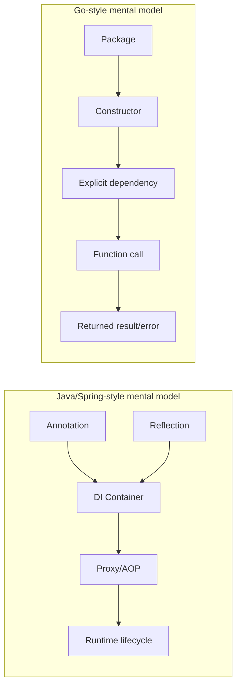
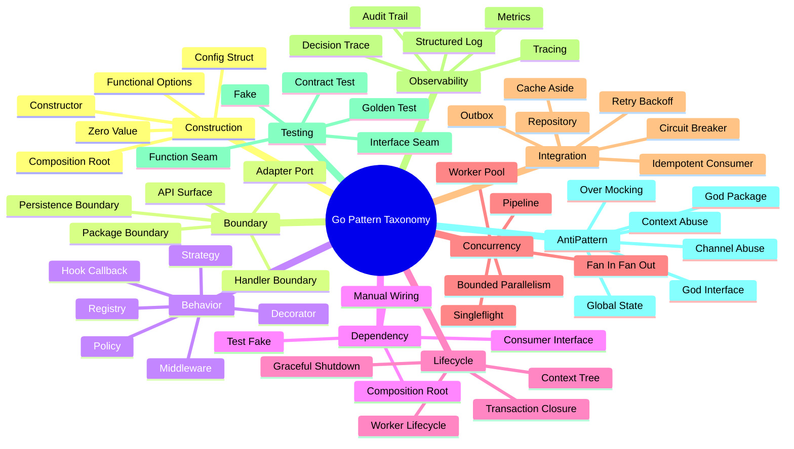
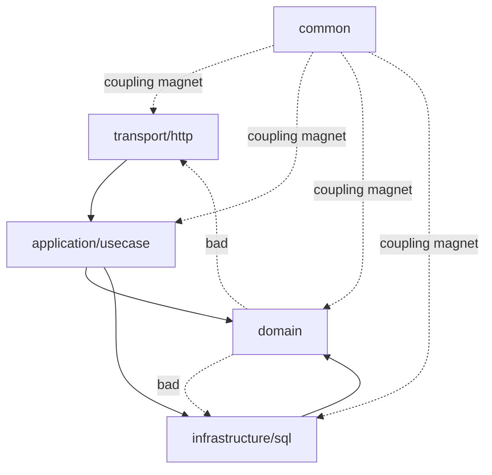
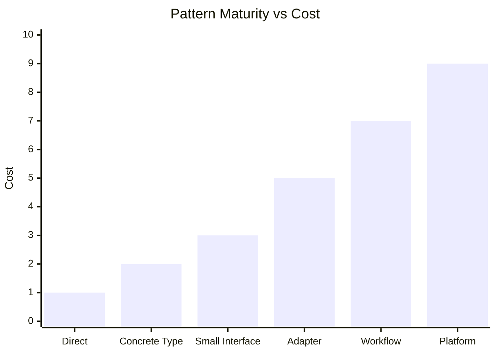
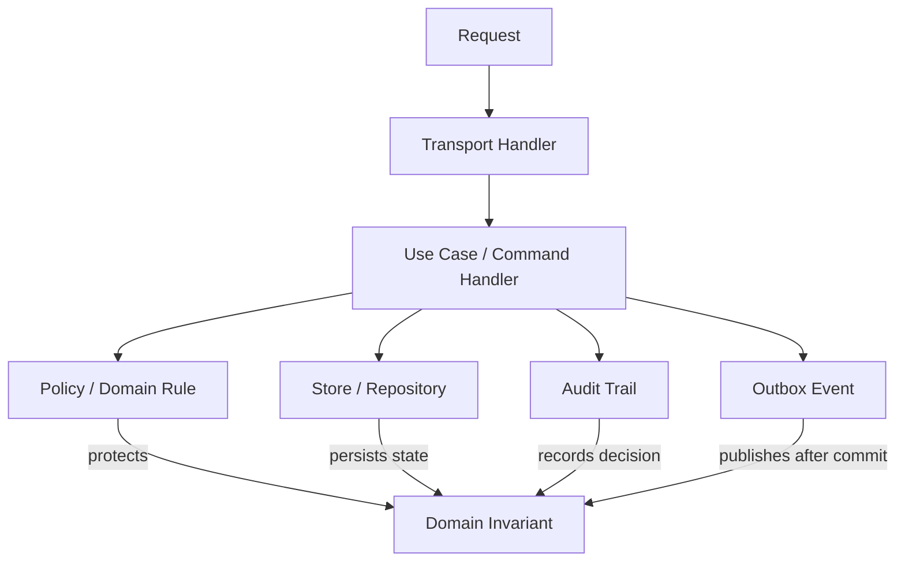
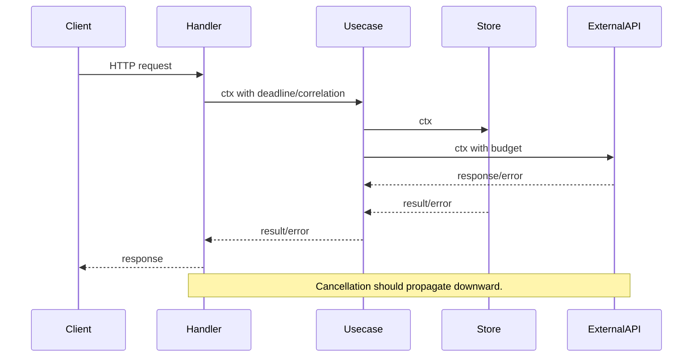
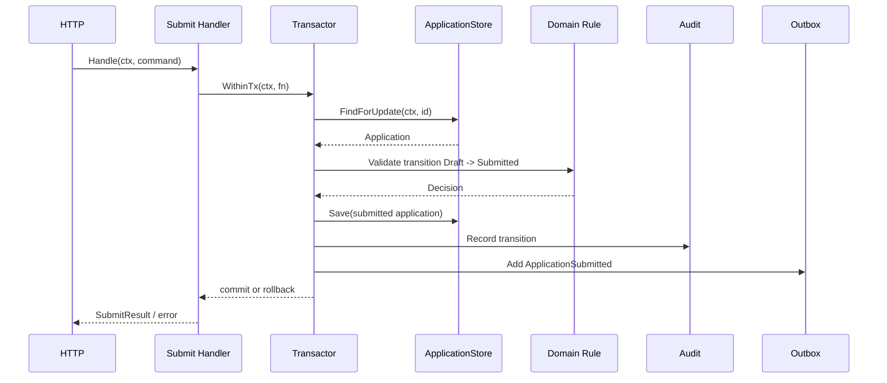

# learn-go-design-patterns-common-patterns-anti-patterns-part-000.md

# Go Design Patterns, Common Patterns, and Anti-Patterns

## Part 000 — Series Map, Design Philosophy, and Pattern Taxonomy

> Seri ini ditulis untuk Java software engineer yang ingin berpindah dari sekadar “bisa menulis Go” menuju kemampuan mendesain codebase Go production-grade: jelas, idiomatis, tahan perubahan, mudah diuji, mudah dioperasikan, dan tidak jatuh ke pola over-engineering ala enterprise Java yang tidak cocok dibawa mentah-mentah ke Go.

---

## Metadata

| Field | Value |
|---|---|
| Series | Go Design Patterns, Common Patterns, and Anti-Patterns |
| Part | 000 |
| File | `learn-go-design-patterns-common-patterns-anti-patterns-part-000.md` |
| Audience | Java software engineer, senior engineer, tech lead, backend/platform engineer |
| Target depth | Internal engineering handbook / production architecture level |
| Go baseline | Go 1.26.x |
| Latest verified patch at writing time | Go 1.26.4, released 2026-06-02 |
| Status | Opening / roadmap / conceptual foundation |
| Seri selesai? | Belum. Ini adalah part 000 dari seri panjang. |

---

## Referensi Utama yang Dipakai

Materi seri ini akan berpijak pada sumber primer Go dan style guide yang umum dipakai dalam engineering organization besar. Sumber ini bukan “template mati”, tetapi baseline untuk menilai apakah sebuah pattern selaras dengan filosofi Go.

1. Go 1.26 Release Notes — https://go.dev/doc/go1.26
2. Go Release History — https://go.dev/doc/devel/release
3. Effective Go — https://go.dev/doc/effective_go
4. Go Code Review Comments — https://go.dev/wiki/CodeReviewComments
5. Go package `context` documentation — https://pkg.go.dev/context
6. Go blog: Context — https://go.dev/blog/context
7. Go blog: Pipelines and cancellation — https://go.dev/blog/pipelines
8. Go blog: Package names — https://go.dev/blog/package-names
9. Google Go Style Decisions — https://google.github.io/styleguide/go/decisions.html
10. Go language specification — https://go.dev/ref/spec

Catatan versi: berdasarkan release history resmi, Go 1.26.4 dirilis pada 2026-06-02 dan mencakup security fixes serta bug fixes pada beberapa package/toolchain. Artinya seri ini memakai Go 1.26.x sebagai baseline, tetapi sebagian besar prinsip desain tetap stabil karena Go mempertahankan Go 1 compatibility promise.

---

# 1. Tujuan Part 000

Part ini bukan berisi daftar pattern satu per satu secara dangkal. Part ini adalah **peta mental** untuk seluruh seri.

Setelah menyelesaikan part ini, kamu harus punya kemampuan untuk:

1. Membedakan antara **design pattern**, **idiom**, **convention**, **architecture style**, dan **anti-pattern** dalam Go.
2. Memahami kenapa Go tidak boleh dipelajari sebagai “Java minus inheritance plus goroutine”.
3. Melihat pattern dari **shape of code**, bukan dari nama class/paket.
4. Menilai apakah abstraction benar-benar mengurangi kompleksitas atau hanya memindahkan kompleksitas ke tempat yang lebih sulit dibaca.
5. Memakai taxonomy pattern untuk membaca codebase besar.
6. Menghindari jebakan umum Java engineer saat masuk ke Go.
7. Menyiapkan cara belajar efisien agar seri ini tidak mengulang seri Go dasar yang sudah selesai.

---

# 2. Boundary Seri Ini

Kita sengaja tidak mengulang materi yang sudah selesai pada seri sebelumnya:

- `learn-go`
- `learn-go-data-model`
- `learn-go-reliability-error-handling`
- `learn-go-concurrency-parallelism`
- `learn-go-composition-oop-functional-reflection-codegen-modules`
- `learn-go-memory-system`
- `learn-go-data-structure-algorithm`

Maka seri ini **tidak akan mengulang secara panjang**:

- syntax dasar Go
- `struct`, method, receiver, interface dasar
- goroutine, channel, mutex dasar
- error wrapping dasar
- slice/map/string/memory dasar
- generics dasar
- reflection dasar
- module dasar
- data structure dan algorithm dasar

Yang dibahas di sini adalah lapisan berikutnya:

- bagaimana mendesain package boundary
- bagaimana menentukan interface ownership
- bagaimana membuat API surface kecil tetapi cukup kuat
- bagaimana mengelola dependency graph tanpa DI container berat
- bagaimana memodelkan lifecycle, state machine, command, event, dan worker
- bagaimana membedakan expected business rejection dari error sistem
- bagaimana mendesain transaction boundary
- bagaimana menghindari repository illusion
- bagaimana membuat handler, middleware, adapter, decorator, plugin, registry, dan strategy secara idiomatis
- bagaimana membaca anti-pattern dari import graph, package shape, dan lifecycle ownership
- bagaimana refactor codebase Go besar tanpa big bang rewrite

---

# 3. Premis Utama: Pattern di Go Bukan Terjemahan GoF dari Java

Banyak engineer yang datang dari Java membawa pertanyaan seperti:

- “Di Go, Singleton pattern bagaimana?”
- “Di Go, Abstract Factory pattern bagaimana?”
- “Di Go, Template Method pattern bagaimana tanpa inheritance?”
- “Di Go, Repository pattern yang clean architecture bagaimana?”
- “Di Go, DI container apa yang setara Spring?”

Pertanyaan-pertanyaan ini tidak salah, tetapi sering **salah framing**.

Dalam Java, banyak pattern lahir sebagai kompensasi terhadap struktur bahasa dan ekosistem:

- class hierarchy
- nominal interfaces
- inheritance
- annotation-driven framework
- exceptions
- container lifecycle
- runtime reflection
- proxy/AOP
- heavy dependency injection
- package/module style yang berbeda

Go punya tekanan desain yang berbeda:

- package adalah unit desain yang sangat penting
- interface bersifat structural dan implicit
- tidak ada inheritance class
- composition lebih natural daripada hierarchy
- error adalah value
- concurrency primitive tersedia langsung
- public/private ditentukan oleh capitalization
- cyclic imports dilarang
- zero value adalah idiom penting
- standard library sangat memengaruhi style
- tooling seperti `gofmt`, `go test`, `go vet`, `go fix`, dan `go doc` membentuk budaya desain

Jadi, banyak design pattern klasik tetap relevan sebagai **ide**, tetapi implementasinya berubah drastis.

Contoh:

| Pattern klasik | Bentuk Java umum | Bentuk Go yang sering lebih idiomatis |
|---|---|---|
| Strategy | interface + class implementation + DI | small interface atau function value |
| Factory | abstract factory hierarchy | constructor function, config struct, registry kecil |
| Adapter | class implements target interface | struct wrapper, function adapter, consumer-owned interface |
| Decorator | inheritance/interface chain | wrapper struct atau higher-order function |
| Template Method | abstract base class + hooks | function parameter, callback, hook interface, explicit workflow |
| Singleton | static global instance | explicit dependency, `sync.Once` hanya bila justified |
| Repository | generic CRUD abstraction | domain/query-specific persistence boundary |
| Service Layer | many `XService` classes | use-case package/function/object dengan dependency eksplisit |
| Command | class per command | request struct + handler function/type + result |
| Observer/Event | listener registry | explicit event/outbox/consumer boundary |

Mental model utama:

> Di Go, pattern yang baik biasanya terlihat lebih kecil, lebih eksplisit, lebih dekat ke call site, dan lebih sedikit membutuhkan framework.

---

# 4. Apa Itu “Pattern” dalam Seri Ini?

Kita akan memakai definisi praktis.

## 4.1 Design Pattern

Design pattern adalah **bentuk solusi berulang untuk masalah desain berulang**, dengan trade-off yang dipahami.

Sebuah pattern bukan hanya potongan kode. Pattern harus menjawab:

1. Masalah apa yang diselesaikan?
2. Dalam konteks apa pattern ini relevan?
3. Apa constraint-nya?
4. Apa bentuk implementasi minimalnya?
5. Apa failure mode-nya?
6. Bagaimana pattern ini diuji?
7. Bagaimana pattern ini dioperasikan di production?
8. Kapan pattern ini menjadi anti-pattern?

Contoh pattern:

- functional options pattern
- adapter/port pattern
- transaction closure pattern
- outbox pattern
- middleware chain
- worker pool
- singleflight cache protection
- command handler
- state transition table

## 4.2 Idiom

Idiom adalah cara yang dianggap natural oleh komunitas Go untuk menulis sesuatu.

Contoh idiom:

- error sebagai return value
- `ctx context.Context` sebagai parameter pertama untuk operasi request-scoped / cancelable
- small interface seperti `io.Reader`, `io.Writer`
- constructor `NewX`
- package name singkat, lowercase, tanpa underscore
- zero-value-friendly type jika masuk akal
- `defer` untuk cleanup lokal
- `comma, ok` untuk type assertion atau map lookup

Idiom biasanya lebih kecil daripada design pattern.

## 4.3 Convention

Convention adalah kesepakatan bentuk yang membuat codebase konsisten.

Contoh:

- nama file test `*_test.go`
- exported identifier punya doc comment
- package name singkat
- tidak memakai `Get` untuk getter biasa
- interface satu method sering bernama `-er`, misalnya `Reader`, `Writer`, `Formatter`
- `gofmt` menentukan format kode, bukan preferensi tim

Convention tidak selalu menyelesaikan masalah arsitektur, tetapi mengurangi friction komunikasi.

## 4.4 Architecture Style

Architecture style adalah pola struktur besar.

Contoh:

- layered architecture
- hexagonal architecture
- vertical slice architecture
- clean architecture
- event-driven architecture
- modular monolith
- microservices
- pipeline architecture

Di Go, architecture style harus diterjemahkan ke package/import graph nyata. Kalau diagram arsitektur tidak tercermin pada import graph, maka diagram itu hanya dekorasi.

## 4.5 Anti-Pattern

Anti-pattern adalah solusi yang terlihat familiar atau “rapi” di awal, tetapi menciptakan biaya jangka panjang.

Contoh anti-pattern Go:

- package `common`, `utils`, `helpers` yang jadi tempat sampah
- interface dibuat oleh provider sebelum ada consumer
- `IUserService` ala Java
- global config singleton
- service locator
- repository generic untuk semua entity
- business logic di HTTP handler
- context dipakai sebagai dependency bag
- goroutine tanpa owner lifecycle
- channel dipakai untuk semua masalah concurrency
- middleware menyembunyikan business behavior
- error string matching
- logging and returning same error everywhere
- over-mocking
- generic abstraction sebelum domain stabil

Anti-pattern bukan berarti “selalu salah”. Ia berarti: **default-nya berbahaya, kecuali ada alasan eksplisit dan kontrol risiko**.

---

# 5. Mental Model Besar: Go Design Is About Local Reasoning

Salah satu kualitas codebase Go yang baik adalah **local reasoning**.

Local reasoning berarti engineer bisa memahami efek dari sebuah fungsi/package tanpa harus membuka terlalu banyak file, framework configuration, annotation magic, generated proxy, atau runtime container behavior.

Dalam codebase Java/Spring besar, call graph sering tersembunyi di balik:

- annotation
- reflection
- proxy
- AOP
- lifecycle container
- interceptor global
- transaction annotation
- event listener auto-discovery
- conditional bean
- runtime injection

Di Go, desain idiomatis cenderung memindahkan informasi penting ke tempat yang eksplisit:

- constructor menerima dependency
- function menerima context
- transaction terlihat di boundary
- error dikembalikan sebagai value
- goroutine dibuat dengan owner
- package import graph terlihat di compiler
- interface kecil dan dekat dengan consumer
- middleware chain dibuat eksplisit
- configuration dibaca di composition root

## 5.1 Diagram: Dari Hidden Runtime Graph ke Explicit Dependency Graph



Go bukan anti-abstraction. Go anti terhadap abstraction yang tidak membayar biaya kompleksitasnya.

---

# 6. Cost Model Abstraction di Go

Sebelum memakai pattern, tanyakan: **biaya apa yang ditambahkan oleh pattern ini?**

Setiap abstraction punya biaya:

| Biaya | Pertanyaan |
|---|---|
| Cognitive cost | Apakah pembaca harus membuka lebih banyak file? |
| Indirection cost | Apakah call path makin sulit dilacak? |
| API cost | Apakah public API makin besar dan sulit diubah? |
| Testing cost | Apakah test menjadi mock-heavy dan brittle? |
| Performance cost | Apakah ada allocation, interface dispatch, reflection, contention, atau buffering tidak perlu? |
| Operational cost | Apakah failure mode makin tersembunyi? |
| Evolution cost | Apakah abstraction ini mengunci model yang belum stabil? |
| Debugging cost | Apakah stack trace/log makin sulit dikaitkan ke behavior nyata? |

Pattern yang baik harus membayar biaya ini dengan manfaat nyata:

- mengurangi coupling
- menstabilkan boundary
- mempermudah test
- mempermudah observability
- memisahkan policy dari mechanism
- mengisolasi external system
- membuat lifecycle eksplisit
- membuat failure mode terkontrol
- membuat perubahan masa depan lebih murah

Jika pattern hanya membuat kode “terlihat enterprise”, tetapi tidak memberi manfaat di atas, kemungkinan besar itu ceremony.

---

# 7. Pattern Sebagai Decision Record, Bukan Template

Cara pemula memakai pattern:

> “Saya tahu pattern X, mari cari tempat untuk memakainya.”

Cara senior memakai pattern:

> “Saya punya masalah desain dengan constraint tertentu. Pattern mana yang trade-off-nya paling sesuai?”

Cara staff/principal engineer memakai pattern:

> “Saya perlu boundary yang menjaga invariant, failure mode, operability, dan evolvability. Pattern ini hanya salah satu konsekuensi dari decision model.”

Dalam seri ini, setiap pattern akan dibahas sebagai **decision record**:

```text
Problem:
  Apa masalah konkret?

Forces:
  Constraint apa yang saling tarik-menarik?

Decision:
  Bentuk pattern apa yang dipilih?

Consequences:
  Apa yang jadi lebih mudah?
  Apa yang jadi lebih sulit?

Failure Modes:
  Bagaimana pattern ini bisa rusak?

Fitness Function:
  Bagaimana kita tahu pattern ini masih sehat setelah codebase berkembang?
```

---

# 8. Taxonomy Pattern dalam Seri Ini

Kita akan mengelompokkan pattern berdasarkan masalah yang diselesaikan, bukan berdasarkan kategori GoF klasik.

## 8.1 Construction Patterns

Pattern untuk membangun object/dependency dengan lifecycle jelas.

Contoh:

- constructor `NewX`
- zero-value-friendly type
- config struct
- functional options
- builder-like setup terbatas
- explicit dependency wiring
- composition root
- `sync.Once` guarded initialization

Pertanyaan desain:

- Dependency mana yang required?
- Dependency mana yang optional?
- Apakah constructor boleh melakukan I/O?
- Siapa pemilik lifecycle?
- Apakah object valid setelah dibuat?
- Apakah zero value bisa dipakai?

Failure mode:

- partially initialized object
- hidden dependency
- global mutable singleton
- constructor melakukan network call diam-diam
- goroutine dimulai tanpa shutdown path

## 8.2 Boundary Patterns

Pattern untuk membatasi antar bagian sistem.

Contoh:

- package boundary
- API surface
- adapter/port
- anti-corruption layer
- DTO mapping boundary
- transport handler boundary
- persistence boundary
- event boundary

Pertanyaan desain:

- Data apa yang boleh lewat boundary?
- Error apa yang boleh keluar?
- Dependency arah mana yang benar?
- Apakah domain tahu detail external system?
- Apakah import graph cocok dengan architecture diagram?

Failure mode:

- transport DTO bocor ke domain
- SQL/vendor error bocor ke API
- external schema mengontrol domain model
- cyclic dependency
- package `common` menjadi coupling magnet

## 8.3 Behavior Patterns

Pattern untuk memilih atau menyusun perilaku.

Contoh:

- strategy via interface
- strategy via function
- decorator
- middleware chain
- hook/callback
- registry
- policy object
- command handler
- state transition table

Pertanyaan desain:

- Perilaku mana yang bervariasi?
- Variasi itu runtime atau compile-time?
- Apakah variasi butuh state?
- Apakah ordering penting?
- Apakah behavior perlu observable?

Failure mode:

- interface terlalu besar
- callback hell
- decorator mengubah semantic contract
- middleware order tidak jelas
- registry global berubah dari mana saja

## 8.4 Dependency Patterns

Pattern untuk mengelola graph dependency.

Contoh:

- manual DI
- composition root
- feature module wiring
- consumer-owned interface
- test fake injection
- adapter injection

Pertanyaan desain:

- Siapa pemilik abstraction?
- Siapa yang membuat concrete implementation?
- Siapa yang mengatur lifecycle?
- Apakah dependency graph bisa dibaca dari `main`/composition root?
- Apakah test bisa mengganti dependency tanpa reflection?

Failure mode:

- service locator
- global registry
- circular service dependency
- interface dibuat demi mock saja
- reflection container untuk problem kecil

## 8.5 Lifecycle Patterns

Pattern untuk object/process yang punya start, run, stop, cleanup.

Contoh:

- worker lifecycle
- background job manager
- graceful shutdown
- resource owner
- closer group
- context cancellation tree
- transaction closure
- server lifecycle

Pertanyaan desain:

- Siapa yang memulai?
- Siapa yang menghentikan?
- Apa yang terjadi saat cancel?
- Apa yang terjadi saat error sebagian?
- Cleanup dilakukan di mana?
- Apakah ada goroutine leak?

Failure mode:

- goroutine tanpa owner
- channel tidak ditutup oleh owner yang benar
- shutdown menggantung
- retry tetap berjalan setelah request canceled
- resource leak karena cleanup tersebar

## 8.6 Concurrency Orchestration Patterns

Pattern untuk mengatur kerja paralel secara terkendali.

Contoh:

- worker pool
- pipeline
- fan-out/fan-in
- bounded parallelism
- errgroup-like orchestration
- rate-limited workers
- singleflight/in-flight deduplication
- semaphore

Pertanyaan desain:

- Apa batas concurrency?
- Apa unit kerja?
- Apakah ordering penting?
- Bagaimana error membatalkan pekerjaan lain?
- Bagaimana backpressure terjadi?
- Siapa yang menutup channel?

Failure mode:

- unbounded goroutine
- channel leak
- goroutine leak
- deadlock
- retry storm
- no cancellation propagation

## 8.7 Integration Patterns

Pattern untuk berhubungan dengan external system.

Contoh:

- client adapter
- repository
- query object
- transaction boundary
- outbox
- idempotent consumer
- retry/backoff
- circuit breaker
- bulkhead
- cache-aside

Pertanyaan desain:

- Apa yang terjadi saat dependency lambat?
- Apa yang terjadi saat dependency gagal sebagian?
- Error mana yang retryable?
- Bagaimana idempotency dijamin?
- Apa consistency model-nya?
- Apakah event dipublish sebelum atau sesudah commit?

Failure mode:

- transaction mencakup network call
- publish event sebelum commit
- retry tanpa timeout
- cache menjadi accidental source of truth
- consumer tidak idempotent

## 8.8 Observability Patterns

Pattern untuk membuat behavior dapat dilihat dan diaudit.

Contoh:

- structured logging
- metrics boundary
- tracing propagation
- correlation ID
- audit trail
- decision trace
- error classification
- domain event log

Pertanyaan desain:

- Apa event penting yang harus terlihat?
- Apa beda log, metric, trace, dan audit?
- Apakah error punya classification?
- Apakah business decision bisa dijelaskan ulang?
- Apakah sensitive data bocor?

Failure mode:

- logging everywhere tanpa event model
- high-cardinality metrics
- trace tidak propagate
- audit disamakan dengan debug log
- PII/secret masuk log

## 8.9 Testing Seam Patterns

Pattern untuk membuat unit, integration, dan contract test feasible.

Contoh:

- interface seam
- function seam
- fake implementation
- contract test
- golden test
- table-driven test
- test package strategy
- dependency injection for test

Pertanyaan desain:

- Apa behavior yang diuji?
- Dependency mana yang perlu diganti?
- Apakah mock menguji contract atau implementation detail?
- Apakah integration test menutup risiko yang tidak bisa ditangkap unit test?
- Apakah fake tetap faithful terhadap behavior production?

Failure mode:

- over-mocking
- brittle test
- interface dibuat hanya untuk mock
- test tidak menangkap transaction/concurrency behavior
- fake tidak realistis

## 8.10 Anti-Pattern Taxonomy

Anti-pattern akan dibaca dari beberapa sinyal:

| Sinyal | Contoh |
|---|---|
| Naming smell | `common`, `utils`, `manager`, `processor`, `helper` terlalu luas |
| Import smell | package domain import transport/infra |
| Interface smell | interface besar, dibuat sebelum ada consumer |
| Lifecycle smell | goroutine dimulai tanpa stop path |
| Error smell | string matching, lost cause, no classification |
| Context smell | context disimpan di struct, dipakai untuk optional params |
| Config smell | env dibaca di banyak tempat |
| Testing smell | mock lebih banyak daripada production logic |
| Concurrency smell | channel dipakai tanpa ownership jelas |
| Persistence smell | generic repository menyembunyikan query penting |

---

# 9. Diagram Taxonomy Besar



---

# 10. Java Mindset vs Go Mindset

## 10.1 Object Model

Java default mental model:

```text
System = classes + objects + inheritance/interface hierarchy + framework runtime
```

Go default mental model:

```text
System = packages + concrete types + small behavior interfaces + explicit function calls
```

Dalam Java, kamu sering mendesain dari noun hierarchy:

```text
BaseService
  UserServiceImpl
  AdminUserServiceImpl
  CachedUserServiceImpl
```

Dalam Go, kamu lebih sering mendesain dari behavior yang dibutuhkan consumer:

```go
// Consumer owns the shape it needs.
type UserFinder interface {
    FindUser(ctx context.Context, id UserID) (User, error)
}
```

Kemudian concrete implementation boleh tetap concrete:

```go
type SQLUsers struct {
    db *sql.DB
}

func (s *SQLUsers) FindUser(ctx context.Context, id UserID) (User, error) {
    // query-specific implementation
}
```

## 10.2 Framework Model

Java/Spring sering membuat lifecycle implicit:

```java
@Service
@Transactional
public class OrderService {
    @Autowired PaymentClient paymentClient;
}
```

Go lebih menyukai lifecycle explicit:

```go
type OrderService struct {
    payments PaymentAuthorizer
    orders   OrderStore
}

func NewOrderService(payments PaymentAuthorizer, orders OrderStore) *OrderService {
    return &OrderService{
        payments: payments,
        orders:   orders,
    }
}
```

Bukan berarti Go tidak boleh punya framework. Tetapi framework sebaiknya tidak menyembunyikan keputusan domain, transaction, retry, authorization, dan lifecycle yang perlu dibaca engineer.

## 10.3 Exception vs Error Value

Java exception sering memisahkan happy path dari failure path secara syntactic.

Go membuat failure path eksplisit:

```go
user, err := users.FindUser(ctx, id)
if err != nil {
    return Result{}, fmt.Errorf("find user: %w", err)
}
```

Implikasi desain:

- error taxonomy menjadi bagian dari API
- boundary harus menerjemahkan error
- retryability tidak boleh ditebak dari string
- expected business rejection tidak selalu cocok dimodelkan sebagai `error`

## 10.4 Inheritance vs Composition

Java sering memakai inheritance untuk reuse dan variation.

Go memakai:

- struct composition
- embedding terbatas
- interface behavior
- function parameter
- decorator/wrapper
- explicit delegation

Inheritance Template Method:

```java
abstract class ImportJob {
    final void run() {
        validate();
        parse();
        persist();
    }
    abstract void parse();
}
```

Go equivalent sering lebih jelas sebagai workflow dengan hook eksplisit:

```go
type ImportHooks struct {
    Validate func(context.Context) error
    Parse    func(context.Context) ([]Record, error)
    Persist  func(context.Context, []Record) error
}

func RunImport(ctx context.Context, hooks ImportHooks) error {
    if err := hooks.Validate(ctx); err != nil {
        return fmt.Errorf("validate: %w", err)
    }
    records, err := hooks.Parse(ctx)
    if err != nil {
        return fmt.Errorf("parse: %w", err)
    }
    if err := hooks.Persist(ctx, records); err != nil {
        return fmt.Errorf("persist: %w", err)
    }
    return nil
}
```

---

# 11. Cara Membaca Pattern dari Shape of Code

Jangan mencari nama pattern lebih dulu. Baca bentuknya.

## 11.1 Pertanyaan Pembacaan Codebase

Saat membuka package Go, tanyakan:

1. Apa nama package-nya? Apakah nama itu menjelaskan capability?
2. Apa exported API-nya?
3. Apakah package ini punya satu alasan untuk berubah?
4. Apakah package ini import dependency yang masuk akal?
5. Apakah ada package `common`, `util`, `helper`, `model`, `types`?
6. Apakah interface didefinisikan di sisi consumer atau provider?
7. Apakah constructor menerima dependency secara eksplisit?
8. Apakah context dipakai sebagai parameter, bukan disimpan?
9. Apakah error diterjemahkan di boundary?
10. Apakah goroutine/channel punya owner?
11. Apakah transaction boundary terlihat?
12. Apakah test memakai fake yang meaningful atau mock yang brittle?

## 11.2 Import Graph sebagai Architecture Truth

Diagram arsitektur boleh indah, tetapi compiler melihat import graph.

Jika kamu menggambar:

```text
transport -> application -> domain
infrastructure -> application
```

Tetapi import graph nyata:

```text
domain -> transport
domain -> sql
application -> http
common -> everything
everything -> common
```

Maka arsitektur yang benar adalah import graph, bukan slide.



Anti-pattern penting:

> Package `common` sering bukan tanda reuse, tetapi tanda tim belum menemukan boundary domain yang benar.

---

# 12. Design Forces: Tarikan yang Harus Diseimbangkan

Pattern dipilih karena ada forces yang saling tarik-menarik.

## 12.1 Simplicity vs Extensibility

Kode paling sederhana hari ini mungkin sulit diperluas besok. Tetapi abstraction untuk “kemungkinan besok” sering merusak readability hari ini.

Pertanyaan:

- Apakah variasi ini sudah nyata atau masih spekulasi?
- Berapa banyak implementation yang benar-benar ada?
- Apakah cost perubahan nanti lebih mahal daripada cost abstraction sekarang?

Rule of thumb:

> Jangan membuat interface untuk satu implementation hanya karena “mungkin nanti ada yang lain”, kecuali interface itu dimiliki consumer sebagai seam yang nyata.

## 12.2 Explicitness vs Boilerplate

Go menerima sedikit boilerplate untuk membuat control flow jelas.

Contoh error handling eksplisit terlihat repetitif, tetapi memberi lokasi keputusan yang jelas.

Pertanyaan:

- Apakah helper menghilangkan noise atau menyembunyikan decision?
- Apakah abstraction membuat error handling lebih sulit dilacak?
- Apakah readability meningkat di call site?

## 12.3 Local Reasoning vs Central Policy

Tidak semua policy harus tersebar. Auth, logging, tracing, metrics, timeout, dan error response mapping bisa butuh centralization.

Namun centralization bisa menjadi black box.

Pertanyaan:

- Policy apa yang harus konsisten secara global?
- Policy apa yang domain-specific?
- Apakah middleware/decorator hanya menambahkan concern teknis, atau mengubah business semantics?

## 12.4 Testability vs Over-Abstraction

Testability bukan berarti semua dependency harus interface.

Pertanyaan:

- Bisa pakai real implementation dengan test container/in-memory fake?
- Apakah interface ini menggambarkan behavior stabil?
- Apakah mock mengunci implementation detail?

## 12.5 Performance vs Generality

Go sering dipakai untuk service high-throughput. Abstraction yang terlalu generic bisa menambah allocation, interface dispatch, reflection, buffering, dan contention.

Pertanyaan:

- Apakah hot path membutuhkan concrete type?
- Apakah generic helper membuat escape/allocation lebih buruk?
- Apakah interface di hot loop justified?
- Apakah context/logging/metrics menambah cardinality atau allocation berlebihan?

## 12.6 Operational Safety vs Developer Convenience

Pattern production-grade harus mempertimbangkan:

- timeout
- cancellation
- retry budget
- backpressure
- shutdown
- observability
- idempotency
- partial failure
- data consistency

Kode yang enak ditulis tetapi buruk dioperasikan bukan design yang baik.

---

# 13. Pattern Evaluation Framework

Untuk setiap pattern di seri ini, gunakan framework berikut.

## 13.1 Problem Fit

Pattern harus menjawab masalah nyata.

Checklist:

- Apakah problem-nya sudah terjadi?
- Apakah variasinya nyata?
- Apakah boundary-nya stabil?
- Apakah abstraction ini membuat perubahan lebih murah?
- Apakah ada solusi lebih sederhana?

## 13.2 API Fit

Pattern harus menghasilkan API yang kecil dan jelas.

Checklist:

- Apakah exported API minimal?
- Apakah nama package/type/function natural?
- Apakah caller bisa memakai tanpa membaca implementation?
- Apakah error surface jelas?
- Apakah context ownership jelas?

## 13.3 Dependency Fit

Pattern harus menjaga dependency direction.

Checklist:

- Apakah dependency mengarah dari outer ke inner atau dari consumer ke capability?
- Apakah domain bebas dari transport/infra detail?
- Apakah interface berada di tempat yang membutuhkan?
- Apakah wiring bisa dibaca dari composition root?

## 13.4 Lifecycle Fit

Pattern harus punya owner lifecycle.

Checklist:

- Siapa membuat resource?
- Siapa menutup resource?
- Apa yang terjadi saat context canceled?
- Apakah goroutine punya stop path?
- Apakah shutdown bounded?

## 13.5 Failure Fit

Pattern harus membuat failure mode eksplisit.

Checklist:

- Error mana yang retryable?
- Error mana yang business rejection?
- Error mana yang harus di-log?
- Error mana yang harus diterjemahkan?
- Apakah partial failure aman?

## 13.6 Observability Fit

Pattern harus bisa diamati.

Checklist:

- Apakah ada log event yang meaningful?
- Apakah ada metric yang stabil cardinality-nya?
- Apakah trace/correlation ID propagate?
- Apakah audit/decision trace tersedia untuk workflow penting?

## 13.7 Evolution Fit

Pattern harus bisa berubah.

Checklist:

- Apakah abstraction ini mengunci domain terlalu dini?
- Apakah public API terlalu luas?
- Apakah package bisa dipecah tanpa rewrite besar?
- Apakah test membantu refactor atau menghambat?

---

# 14. Pattern Maturity Levels

Tidak semua pattern perlu dipakai sejak awal. Gunakan maturity model.

## Level 0 — Direct Code

Cocok saat:

- problem kecil
- variasi belum nyata
- code masih lokal
- belum ada external boundary kompleks

Contoh:

```go
func CalculateTotal(items []Item) Money {
    var total Money
    for _, item := range items {
        total = total.Add(item.Price)
    }
    return total
}
```

Jangan buru-buru membuat `CalculatorService`, `CalculatorStrategy`, atau `CalculatorFactory`.

## Level 1 — Named Function / Concrete Type

Cocok saat behavior mulai punya nama domain.

```go
type Pricer struct {
    tax TaxTable
}

func (p *Pricer) Price(order Order) Money {
    // domain-specific pricing
}
```

## Level 2 — Small Interface at Consumer

Cocok saat consumer butuh seam.

```go
type PriceCalculator interface {
    Price(Order) Money
}
```

Interface muncul karena consumer punya kebutuhan, bukan karena provider ingin terlihat abstract.

## Level 3 — Boundary Adapter

Cocok saat ada external system atau infrastructure detail.

```go
type TaxClient struct {
    http *http.Client
    baseURL string
}
```

Domain/application tidak perlu tahu HTTP detail.

## Level 4 — Policy / Workflow Pattern

Cocok saat behavior punya lifecycle, decision, audit, state transition, atau consistency requirement.

```go
type SubmitApplicationHandler struct {
    apps   ApplicationStore
    policy SubmissionPolicy
    audit  AuditTrail
}
```

## Level 5 — Platform Pattern

Cocok saat pattern dipakai lintas service/team dan butuh standardisasi.

Contoh:

- observability middleware
- idempotency library
- outbox package
- config loader
- transaction helper
- worker framework internal

Risiko level 5: library internal bisa menjadi platform bottleneck jika terlalu generic.

---

# 15. Diagram: Maturity vs Cost



Interpretasi:

- Semakin tinggi maturity pattern, semakin besar biaya desain dan operasional.
- Jangan naik level tanpa tekanan nyata.
- Tetapi jangan bertahan di level rendah ketika domain sudah punya complexity yang perlu dikendalikan.

---

# 16. “Simple” Tidak Sama dengan “Naive”

Go sering disebut simple. Banyak orang salah paham lalu menulis kode yang naive.

Simple berarti:

- dependency jelas
- flow jelas
- state jelas
- error jelas
- ownership jelas
- lifecycle jelas
- API kecil
- import graph sehat

Naive berarti:

- semua logic di handler
- SQL tersebar di banyak tempat
- tidak ada transaction boundary
- error string matching
- global variable everywhere
- context diabaikan
- goroutine tidak bisa dihentikan
- tidak ada idempotency
- retry tanpa budget
- logging random

Kode simple production-grade sering lebih sulit didesain daripada kode abstract-heavy, karena kamu harus memilih abstraction yang benar-benar perlu.

---

# 17. Pattern dan Invariant

Di codebase serius, pattern bukan soal estetika. Pattern menjaga invariant.

Invariant adalah kondisi yang harus selalu benar.

Contoh invariant:

- Application hanya bisa `Submitted` jika semua mandatory document valid.
- Payment tidak boleh captured dua kali.
- Event tidak boleh dipublish sebelum transaction commit.
- Audit trail harus tercatat untuk setiap state transition penting.
- External API call harus punya timeout.
- Worker retry tidak boleh infinite tanpa backoff.
- Cache tidak boleh menjadi source of truth untuk decision regulasi.
- PII tidak boleh masuk log.

Pattern yang baik membuat invariant sulit dilanggar.

Pattern yang buruk membuat invariant tersebar di banyak tempat.

## 17.1 Diagram: Invariant Ownership



Dalam desain yang defensible, invariant tidak hanya berada di komentar. Ia terlihat di type, function boundary, transaction boundary, dan test.

---

# 18. Pattern dan Failure Modeling

Go production design harus selalu bertanya: **bagaimana ini gagal?**

Setiap pattern punya failure model.

## 18.1 Failure Questions

Untuk setiap komponen:

1. Bisa gagal karena input buruk?
2. Bisa gagal karena state tidak valid?
3. Bisa gagal karena dependency lambat?
4. Bisa gagal karena dependency unavailable?
5. Bisa gagal sebagian?
6. Bisa dieksekusi dua kali?
7. Bisa timeout?
8. Bisa canceled?
9. Bisa overload?
10. Bisa menghasilkan data yang harus diaudit?

## 18.2 Failure Classification

Gunakan classification yang desainnya jelas:

| Kategori | Contoh | Perlakuan |
|---|---|---|
| Validation rejection | field invalid | return decision/result, HTTP 400/422 |
| Business rejection | illegal transition | return domain decision, audit jika perlu |
| Not found | entity tidak ada | typed/sentinel error, map ke 404 jika transport HTTP |
| Conflict | version mismatch/idempotency conflict | map ke 409, bisa retry oleh caller tertentu |
| Dependency timeout | DB/API lambat | retry terbatas jika aman, emit metric |
| Dependency unavailable | external down | circuit/bulkhead/backoff |
| Programmer bug | nil unexpected, invariant breach | fail fast/panic di boundary tertentu, fix code |
| Security rejection | unauthorized/forbidden | no sensitive detail, audit jika penting |

Seri ini akan sering membedakan:

```text
expected business outcome != system error
```

Ini penting terutama untuk sistem regulasi, enforcement lifecycle, case management, workflow, approval, appeal, dan auditability.

---

# 19. Pattern dan Observability

Pattern yang tidak observable sulit dioperasikan.

Minimal ada empat dimensi:

## 19.1 Logs

Logs menjawab:

- apa yang terjadi?
- pada request/correlation mana?
- pada entity mana?
- outcome-nya apa?
- error classification-nya apa?

## 19.2 Metrics

Metrics menjawab:

- seberapa sering?
- seberapa lambat?
- seberapa banyak error?
- queue backlog berapa?
- retry berapa?
- timeout berapa?

## 19.3 Traces

Traces menjawab:

- call path melewati service/dependency mana?
- latency habis di mana?
- span mana yang gagal?

## 19.4 Audit / Decision Trace

Audit menjawab:

- siapa melakukan apa?
- terhadap entity apa?
- kapan?
- dari state apa ke state apa?
- rule/policy apa yang menyebabkan decision?
- evidence apa yang dipakai?

Debug log bukan audit trail. Audit trail punya meaning domain/legal/regulatory.

---

# 20. Pattern dan Package Design

Package adalah unit desain utama di Go.

Effective Go dan Go style guide menekankan package name yang singkat, lowercase, dan tidak memakai underscore/mixedCaps. Ini bukan hanya style. Package name muncul di setiap call site.

Contoh baik:

```go
orders.Submit(...)
audit.Record(...)
payment.Authorize(...)
```

Contoh buruk:

```go
common.SubmitOrder(...)
utils.RecordAudit(...)
models.PaymentAuthorizationRequest{}
helpers.DoPaymentThing(...)
```

## 20.1 Package Menjawab “Capability”, Bukan Layer Generik

Package yang baik biasanya menjawab:

- package ini menyediakan capability apa?
- caller akan membacanya sebagai apa?
- apakah nama package + exported symbol membentuk kalimat yang natural?

Contoh:

```go
validator.ValidateApplication(app)
```

Mungkin terlalu generic.

Lebih domain-specific:

```go
submission.Validate(app)
```

Atau:

```go
eligibility.Check(applicant)
```

## 20.2 Package Smell

Nama berikut sering menjadi smell:

- `common`
- `utils`
- `helpers`
- `shared`
- `models`
- `types`
- `interfaces`
- `managers`
- `processors`
- `services`

Bukan berarti selalu salah. Tetapi nama seperti ini sering tidak menjelaskan boundary.

Pertanyaan review:

> Kalau package ini bernama `common`, common untuk siapa? Apakah isinya punya satu alasan untuk berubah? Apakah ia coupling magnet?

---

# 21. Pattern dan Interface Design

Interface Go berbeda secara fundamental dari interface Java.

Di Java:

- class secara eksplisit `implements Interface`
- interface sering menjadi contract provider
- interface dipakai untuk DI/proxy/mock
- interface naming sering `UserService`, `UserRepository`, `PaymentGateway`

Di Go:

- implementasi interface implicit
- consumer bisa mendefinisikan interface kecil yang dibutuhkan
- satu atau dua method interface umum
- concrete type sering dikembalikan dari constructor
- interface tidak perlu dibuat sebelum ada variasi nyata/seam nyata

## 21.1 Consumer-Owned Interface

Contoh:

```go
package submit

type ApplicationStore interface {
    Find(ctx context.Context, id ApplicationID) (Application, error)
    Save(ctx context.Context, app Application) error
}

type Handler struct {
    apps ApplicationStore
}
```

Package `submit` mendefinisikan apa yang dia butuhkan. SQL implementation tidak perlu memaksakan interface global.

## 21.2 Provider-Owned Interface yang Valid

Ada kasus interface dikembalikan provider, misalnya ketika concrete type tidak penting dan behavior contract adalah API utama. Effective Go memberi contoh interface seperti `hash.Hash32` atau streaming cipher interface.

Tetapi ini bukan default untuk setiap constructor.

Default sehat:

```go
func NewSQLStore(db *sql.DB) *SQLStore
```

Bukan otomatis:

```go
func NewSQLStore(db *sql.DB) StoreInterface
```

Gunakan provider-returned interface jika:

- implementation detail benar-benar tidak perlu diekspos
- contract behavior stabil
- caller tidak membutuhkan method lain
- ada substitusi nyata
- interface adalah API utama package

---

# 22. Pattern dan Context

`context.Context` adalah salah satu boundary paling penting di Go service.

Dokumentasi package `context` menekankan bahwa context values hanya untuk request-scoped data yang melewati process/API boundary, bukan untuk optional parameter. Context aman dipakai oleh beberapa goroutine secara bersamaan.

## 22.1 Context untuk Cancellation dan Deadline

Context membawa:

- cancellation signal
- deadline/timeout
- request-scoped values terbatas

Context bukan:

- dependency injection container
- logger bag
- config carrier
- user session mutable store
- optional parameter map

## 22.2 Context Ownership

Rule umum:

```go
func Do(ctx context.Context, input Input) (Output, error)
```

Anti-pattern:

```go
type Service struct {
    ctx context.Context // bad in most cases
}
```

Kenapa buruk?

- lifetime context biasanya request-scoped, bukan service-scoped
- cancellation bisa salah scope
- test dan reuse menjadi membingungkan
- dependency lifecycle jadi kabur

## 22.3 Context Boundary Diagram



---

# 23. Pattern dan Error Boundary

Go error design bukan sekadar `if err != nil`.

Error adalah bagian dari API dan boundary.

## 23.1 Error Boundary Levels

```text
Infrastructure error
  ↓ translated/wrapped
Application error
  ↓ classified
Transport response
```

Contoh:

```go
var ErrApplicationNotFound = errors.New("application not found")

type ConflictError struct {
    Resource string
    ID       string
    Cause    error
}

func (e *ConflictError) Error() string {
    return e.Resource + " conflict: " + e.ID
}

func (e *ConflictError) Unwrap() error {
    return e.Cause
}
```

Boundary HTTP tidak boleh perlu tahu error PostgreSQL/Oracle/MySQL secara langsung.

## 23.2 Expected Rejection Bukan Selalu Error

Untuk domain decision:

```go
type SubmitDecision struct {
    Accepted bool
    Reasons  []RejectionReason
}
```

Ini bisa lebih baik daripada:

```go
return errors.New("cannot submit")
```

Terutama jika sistem membutuhkan auditability.

---

# 24. Pattern dan Transaction Ownership

Transaction boundary adalah salah satu tempat pattern sering salah.

Anti-pattern umum:

```go
func (r *UserRepository) Save(ctx context.Context, user User) error {
    tx, _ := r.db.BeginTx(ctx, nil)
    defer tx.Rollback()
    // save user
    return tx.Commit()
}
```

Ini terlihat praktis, tetapi bermasalah jika use case harus menyimpan beberapa aggregate dalam satu transaction.

Pattern yang lebih eksplisit:

```go
type Transactor interface {
    WithinTx(ctx context.Context, fn func(ctx context.Context, tx Tx) error) error
}
```

Atau repository menerima handle yang transaction-aware.

Pertanyaan penting:

- Siapa pemilik commit?
- Apakah transaction mencakup external API call?
- Apakah event publish terjadi setelah commit?
- Apakah retry transaction aman?
- Apakah idempotency key ikut transaction?

---

# 25. Pattern dan State Machine

Untuk workflow/case/enforcement/regulatory system, state machine bukan optional decoration. Ia sering menjadi pusat defensibility.

## 25.1 Scattered State Anti-Pattern

```go
if app.Status == "draft" {
    app.Status = "submitted"
}
```

Jika tersebar di banyak handler/service, maka lifecycle tidak bisa diaudit dan sulit dijamin.

## 25.2 Explicit Transition Pattern

```go
type Status string

const (
    StatusDraft     Status = "draft"
    StatusSubmitted Status = "submitted"
    StatusApproved  Status = "approved"
    StatusRejected  Status = "rejected"
)

type Transition struct {
    From Status
    To   Status
    Name string
}

func CanTransition(from, to Status) bool {
    switch from {
    case StatusDraft:
        return to == StatusSubmitted
    case StatusSubmitted:
        return to == StatusApproved || to == StatusRejected
    default:
        return false
    }
}
```

Di seri state machine part nanti, kita akan masuk jauh lebih detail:

- guard
- transition command
- audit
- event
- idempotency
- illegal transition
- persistence consistency
- concurrent transition race

---

# 26. Pattern dan Event/Outbox

Event pattern sering dipakai salah.

## 26.1 Bad Event Thinking

```text
Something happened, publish JSON of entire DB row.
```

Masalah:

- schema bocor
- versioning tidak jelas
- consumer coupling tinggi
- data sensitif bisa bocor
- event tidak punya semantic meaning

## 26.2 Better Event Thinking

Event harus menjawab:

- apa business fact yang terjadi?
- siapa producer-nya?
- kapan terjadi?
- schema version berapa?
- aggregate/entity ID apa?
- apakah event dipublish setelah commit?
- apakah consumer idempotent?

Contoh:

```go
type ApplicationSubmitted struct {
    EventID       string
    Version       int
    ApplicationID string
    SubmittedAt   time.Time
    SubmittedBy   string
}
```

Outbox pattern menjaga consistency antara state change dan event publication.

---

# 27. Pattern dan Testing Strategy

Testing di Go sering terasa sederhana, tetapi design seam tetap penting.

## 27.1 Jangan Interface Semua Hal Demi Mock

Bad:

```go
type UserServiceInterface interface {
    CreateUser(ctx context.Context, req CreateUserRequest) (*CreateUserResponse, error)
    UpdateUser(ctx context.Context, req UpdateUserRequest) (*UpdateUserResponse, error)
    DeleteUser(ctx context.Context, id string) error
    FindUser(ctx context.Context, id string) (*UserDTO, error)
    ListUsers(ctx context.Context, filter UserFilter) ([]UserDTO, error)
}
```

Better:

```go
type UserFinder interface {
    FindUser(ctx context.Context, id UserID) (User, error)
}
```

Atau gunakan fake concrete untuk boundary tertentu.

## 27.2 Test Seams Berdasarkan Risk

| Risk | Test style |
|---|---|
| Pure domain rule | unit test table-driven |
| Boundary mapping | unit/integration test |
| SQL query | integration test dengan DB test environment |
| External API adapter | contract test / fake server |
| Worker retry | deterministic test dengan fake clock/backoff |
| State transition | table-driven transition matrix |
| Outbox | transaction integration test |

---

# 28. Pattern dan Refactoring

Pattern juga berguna sebagai target refactoring.

## 28.1 Refactoring Tanpa Big Bang

Strategi umum:

1. Identifikasi smell.
2. Tambahkan characterization test untuk behavior penting.
3. Buat boundary kecil di sisi consumer.
4. Pindahkan logic satu use case dahulu.
5. Pertahankan old API sebagai adapter sementara.
6. Ukur import graph dan test coverage behavior.
7. Hapus old path setelah usage pindah.

## 28.2 Example: Handler Gemuk ke Use Case

Sebelum:

```go
func SubmitHandler(w http.ResponseWriter, r *http.Request) {
    // decode JSON
    // validate
    // query DB
    // check status
    // update DB
    // insert audit
    // publish event
    // write response
}
```

Sesudah:

```go
func SubmitHandler(h *submit.Handler) http.HandlerFunc {
    return func(w http.ResponseWriter, r *http.Request) {
        cmd, err := decodeSubmitCommand(r)
        if err != nil {
            writeError(w, err)
            return
        }

        result, err := h.Handle(r.Context(), cmd)
        if err != nil {
            writeError(w, err)
            return
        }

        writeJSON(w, result)
    }
}
```

Use case menjadi tempat invariant, transaction, audit, dan event.

---

# 29. Seri Roadmap Lengkap

Berikut peta final seri.

## Part 000 — Series Map, Design Philosophy, and Pattern Taxonomy

File:

```text
learn-go-design-patterns-common-patterns-anti-patterns-part-000.md
```

Fokus:

- filosofi desain Go
- taxonomy pattern
- boundary seri
- mental model Java-to-Go
- pattern evaluation framework

## Part 001 — Java-to-Go Pattern Reframing

File:

```text
learn-go-design-patterns-common-patterns-anti-patterns-part-001.md
```

Fokus:

- class hierarchy vs behavior interface
- DI container vs explicit wiring
- exception vs error value
- annotation magic vs local reasoning
- enterprise Java ceremony yang perlu ditinggalkan

## Part 002 — Idiomatic Simplicity as a Design Pattern

File:

```text
learn-go-design-patterns-common-patterns-anti-patterns-part-002.md
```

Fokus:

- simplicity as engineering discipline
- abstraction cost model
- duplication vs premature abstraction
- local reasoning
- helper/util anti-pattern

## Part 003 — Package-Oriented Design Pattern

File:

```text
learn-go-design-patterns-common-patterns-anti-patterns-part-003.md
```

Fokus:

- package cohesion
- package name
- internal package
- import graph
- package cycle avoidance
- `common/utils/models` anti-pattern

## Part 004 — API Surface Pattern

File:

```text
learn-go-design-patterns-common-patterns-anti-patterns-part-004.md
```

Fokus:

- exported API
- public type/function design
- concrete vs interface return
- error surface
- compatibility
- API minimization

## Part 005 — Interface Placement Pattern

File:

```text
learn-go-design-patterns-common-patterns-anti-patterns-part-005.md
```

Fokus:

- consumer-owned interface
- small interface
- provider-owned interface exception
- capability interface
- interface pollution

## Part 006 — Constructor and Initialization Patterns

File:

```text
learn-go-design-patterns-common-patterns-anti-patterns-part-006.md
```

Fokus:

- `NewX`
- zero value
- constructor validation
- lazy initialization
- `init()` risk
- hidden dependency

## Part 007 — Functional Options Pattern, Properly Used

File:

```text
learn-go-design-patterns-common-patterns-anti-patterns-part-007.md
```

Fokus:

- functional options
- config struct comparison
- option validation
- option conflict
- required vs optional

## Part 008 — Configuration Pattern

File:

```text
learn-go-design-patterns-common-patterns-anti-patterns-part-008.md
```

Fokus:

- config loading vs config representation
- env/file/flag/secret source
- validation/defaulting
- immutable vs reloadable config
- global config anti-pattern

## Part 009 — Dependency Wiring Pattern Without DI Container

File:

```text
learn-go-design-patterns-common-patterns-anti-patterns-part-009.md
```

Fokus:

- manual wiring
- composition root
- dependency lifetime
- test wiring
- service locator anti-pattern

## Part 010 — Adapter and Port Pattern in Go

File:

```text
learn-go-design-patterns-common-patterns-anti-patterns-part-010.md
```

Fokus:

- hexagonal architecture in Go
- port as consumer interface
- adapter as concrete implementation
- anti-corruption boundary

## Part 011 — Repository Pattern: Useful, Dangerous, and Often Misused

File:

```text
learn-go-design-patterns-common-patterns-anti-patterns-part-011.md
```

Fokus:

- repository vs DAO/query object
- aggregate repository
- transaction issue
- generic repository anti-pattern

## Part 012 — Unit of Work and Transaction Boundary Pattern

File:

```text
learn-go-design-patterns-common-patterns-anti-patterns-part-012.md
```

Fokus:

- explicit transaction
- transaction closure
- nested transaction problem
- retryable transaction
- commit ownership

## Part 013 — Service Layer Pattern in Go

File:

```text
learn-go-design-patterns-common-patterns-anti-patterns-part-013.md
```

Fokus:

- application service
- domain service
- infrastructure service
- use-case-oriented service
- god service anti-pattern

## Part 014 — Handler Pattern: HTTP, CLI, Worker, Consumer

File:

```text
learn-go-design-patterns-common-patterns-anti-patterns-part-014.md
```

Fokus:

- handler as boundary adapter
- request decoding
- response encoding
- queue/cron/CLI handler
- business logic in handler anti-pattern

## Part 015 — Middleware and Interceptor Pattern

File:

```text
learn-go-design-patterns-common-patterns-anti-patterns-part-015.md
```

Fokus:

- chain of responsibility
- HTTP middleware
- gRPC interceptor
- ordering
- context value abuse

## Part 016 — Context Propagation Pattern

File:

```text
learn-go-design-patterns-common-patterns-anti-patterns-part-016.md
```

Fokus:

- cancellation
- deadline
- request-scoped value
- context across goroutines
- storing context in struct anti-pattern

## Part 017 — Error Translation and Boundary Error Pattern

File:

```text
learn-go-design-patterns-common-patterns-anti-patterns-part-017.md
```

Fokus:

- sentinel/typed/wrapped error
- boundary error translation
- retryability classification
- error observability

## Part 018 — Result, Decision, and Policy Pattern

File:

```text
learn-go-design-patterns-common-patterns-anti-patterns-part-018.md
```

Fokus:

- when error is not enough
- business decision result
- rejection reason
- decision trace
- policy evaluation

## Part 019 — Validation Pattern

File:

```text
learn-go-design-patterns-common-patterns-anti-patterns-part-019.md
```

Fokus:

- syntactic vs semantic validation
- cross-entity validation
- fail-fast vs collect-all
- domain invariant

## Part 020 — State Machine Pattern in Go

File:

```text
learn-go-design-patterns-common-patterns-anti-patterns-part-020.md
```

Fokus:

- lifecycle modeling
- transition table
- guard
- transition event
- audit trail

## Part 021 — Command Pattern and Use Case Pattern

File:

```text
learn-go-design-patterns-common-patterns-anti-patterns-part-021.md
```

Fokus:

- command input boundary
- handler
- authorization
- idempotency
- command result

## Part 022 — Event Pattern: Domain Event, Integration Event, Outbox

File:

```text
learn-go-design-patterns-common-patterns-anti-patterns-part-022.md
```

Fokus:

- domain event
- integration event
- event versioning
- outbox
- idempotent consumer

## Part 023 — Worker, Job, and Background Processing Pattern

File:

```text
learn-go-design-patterns-common-patterns-anti-patterns-part-023.md
```

Fokus:

- worker lifecycle
- retry/backoff
- poison message
- DLQ
- graceful shutdown

## Part 024 — Pipeline, Fan-Out/Fan-In, and Bounded Parallelism Pattern

File:

```text
learn-go-design-patterns-common-patterns-anti-patterns-part-024.md
```

Fokus:

- pipeline
- bounded worker pool
- backpressure
- cancellation
- error propagation

## Part 025 — Rate Limiting, Bulkhead, Circuit Breaker, and Resilience Patterns

File:

```text
learn-go-design-patterns-common-patterns-anti-patterns-part-025.md
```

Fokus:

- timeout
- retry
- backoff/jitter
- rate limiting
- bulkhead
- circuit breaker

## Part 026 — Cache Pattern

File:

```text
learn-go-design-patterns-common-patterns-anti-patterns-part-026.md
```

Fokus:

- cache-aside
- read-through/write-through
- TTL
- negative cache
- stampede protection

## Part 027 — Plugin, Registry, and Strategy Pattern

File:

```text
learn-go-design-patterns-common-patterns-anti-patterns-part-027.md
```

Fokus:

- strategy via function/interface
- registry
- factory registry
- plugin constraints
- global registry risk

## Part 028 — Decorator Pattern in Go

File:

```text
learn-go-design-patterns-common-patterns-anti-patterns-part-028.md
```

Fokus:

- wrapper struct
- function decorator
- client/repository/handler decorator
- ordering and semantic contract

## Part 029 — Template Method, Hook, and Callback Pattern Without Inheritance

File:

```text
learn-go-design-patterns-common-patterns-anti-patterns-part-029.md
```

Fokus:

- template method replacement
- higher-order function
- hook interface
- lifecycle callback

## Part 030 — Generics-Based Pattern Design

File:

```text
learn-go-design-patterns-common-patterns-anti-patterns-part-030.md
```

Fokus:

- when generics help
- when interface is better
- constraint design
- generic anti-pattern

## Part 031 — Observability Pattern: Logs, Metrics, Traces, and Audit

File:

```text
learn-go-design-patterns-common-patterns-anti-patterns-part-031.md
```

Fokus:

- structured logging
- metrics
- tracing
- audit trail
- decision trace
- sensitive data

## Part 032 — Testing Seam Pattern

File:

```text
learn-go-design-patterns-common-patterns-anti-patterns-part-032.md
```

Fokus:

- interface seam
- function seam
- fake/mock/stub
- contract test
- golden test

## Part 033 — Codebase Architecture Pattern for Large Go Services

File:

```text
learn-go-design-patterns-common-patterns-anti-patterns-part-033.md
```

Fokus:

- large service layout
- vertical slice vs layered package
- internal platform package
- shared library risk

## Part 034 — Anti-Pattern Catalog and Refactoring Playbook

File:

```text
learn-go-design-patterns-common-patterns-anti-patterns-part-034.md
```

Fokus:

- anti-pattern catalog
- symptoms/root cause
- refactoring strategy
- migration without big bang

## Part 035 — Capstone: Designing a Production-Grade Go Service from Zero

File:

```text
learn-go-design-patterns-common-patterns-anti-patterns-part-035.md
```

Fokus:

- end-to-end service design
- requirements
- domain/usecase/repository/event/worker/handler/middleware/config/observability/testing
- final checklist
- seri selesai

---

# 30. Diagram Roadmap Seri

```mermaid
flowchart TD
    P000[000 Roadmap & Taxonomy]
    P001[001 Java-to-Go Reframing]
    P002[002 Idiomatic Simplicity]
    P003[003 Package Design]
    P004[004 API Surface]
    P005[005 Interface Placement]
    P006[006 Constructor Init]
    P007[007 Functional Options]
    P008[008 Configuration]
    P009[009 Dependency Wiring]
    P010[010 Adapter Port]
    P011[011 Repository]
    P012[012 Transaction]
    P013[013 Service Layer]
    P014[014 Handler]
    P015[015 Middleware]
    P016[016 Context]
    P017[017 Error Boundary]
    P018[018 Decision Policy]
    P019[019 Validation]
    P020[020 State Machine]
    P021[021 Command Use Case]
    P022[022 Event Outbox]
    P023[023 Worker Job]
    P024[024 Pipeline]
    P025[025 Resilience]
    P026[026 Cache]
    P027[027 Plugin Strategy]
    P028[028 Decorator]
    P029[029 Hook Callback]
    P030[030 Generics Patterns]
    P031[031 Observability]
    P032[032 Testing Seam]
    P033[033 Large Codebase]
    P034[034 Anti-Pattern Catalog]
    P035[035 Capstone]

    P000 --> P001 --> P002 --> P003 --> P004 --> P005 --> P006
    P006 --> P007 --> P008 --> P009 --> P010 --> P011 --> P012 --> P013
    P013 --> P014 --> P015 --> P016 --> P017 --> P018 --> P019
    P019 --> P020 --> P021 --> P022 --> P023
    P023 --> P024 --> P025 --> P026 --> P027 --> P028 --> P029 --> P030
    P030 --> P031 --> P032 --> P033 --> P034 --> P035
```



---

# 31. Struktur Tiap Part

Setiap part akan menggunakan struktur handbook berikut.

## 31.1 Header

- nama file
- part number
- topic
- target outcome
- prerequisite
- non-goals

## 31.2 Problem Statement

Menjelaskan masalah desain nyata yang diselesaikan.

Contoh:

```text
Kita memiliki service yang harus menyimpan state perubahan case, menulis audit trail, dan publish event. Bagaimana memastikan event tidak terkirim jika transaction gagal?
```

## 31.3 Mental Model

Membentuk cara pikir sebelum kode.

Contoh:

```text
Transaction bukan detail repository. Transaction adalah consistency boundary milik use case.
```

## 31.4 Java Mindset vs Go Mindset

Membandingkan kebiasaan Java dan bentuk idiomatis Go.

## 31.5 Pattern Shape

Menjelaskan bentuk package/type/function/interface.

## 31.6 Production Example

Contoh kode realistis, bukan toy example semata.

## 31.7 Failure Modes

Apa yang rusak jika pattern dipakai salah.

## 31.8 Testing Strategy

Cara menguji behavior dan boundary.

## 31.9 Observability

Log/metric/trace/audit apa yang relevan.

## 31.10 Refactoring Playbook

Cara memperbaiki codebase yang sudah salah shape.

## 31.11 Review Checklist

Checklist untuk code review.

## 31.12 Exercises

Latihan untuk menginternalisasi pattern.

---

# 32. Internal Engineering Handbook Standard

Seri ini akan menggunakan standar pembahasan seperti handbook engineering internal.

Artinya setiap pattern tidak hanya menjawab “bagaimana menulis kode”, tetapi juga:

- bagaimana pattern berevolusi saat codebase membesar
- bagaimana pattern gagal di production
- bagaimana pattern memengaruhi on-call/debugging
- bagaimana pattern memengaruhi onboarding engineer baru
- bagaimana pattern memengaruhi review PR
- bagaimana pattern memengaruhi testing strategy
- bagaimana pattern memengaruhi security/compliance/auditability
- bagaimana pattern berinteraksi dengan package graph

## 32.1 Engineering Decision Quality

Pattern dianggap berkualitas jika:

1. Problem-nya eksplisit.
2. Boundary-nya jelas.
3. Dependency direction sehat.
4. API surface minimal.
5. Failure mode bisa dijelaskan.
6. Test bisa membuktikan behavior penting.
7. Observability tidak ditambahkan belakangan secara acak.
8. Refactor path tersedia.
9. Code tetap bisa dibaca oleh engineer baru.
10. Pattern tidak lebih kompleks dari problem-nya.

---

# 33. Anti-Pattern Besar yang Akan Terus Kita Lawan

## 33.1 Java-in-Go Architecture

Gejala:

```text
controllers/
services/
repositories/
models/
dtos/
interfaces/
utils/
```

Masalah:

- package berdasarkan layer generik, bukan capability
- semua service saling panggil
- domain behavior tersebar
- repository generic
- DTO mapping chaos
- interface dibuat untuk semua service

Tidak selalu salah, tetapi sering menjadi tanda copy-paste mental model.

## 33.2 Interface Everywhere

Gejala:

```go
type UserService interface { ... }
type userServiceImpl struct { ... }
```

Masalah:

- tidak ada manfaat structural typing
- interface jadi mirror concrete type
- test menjadi mock-heavy
- API berubah dua kali
- caller tidak punya seam spesifik

## 33.3 Common Package Gravity Well

Gejala:

```text
common/
  constants.go
  errors.go
  utils.go
  models.go
  validators.go
```

Masalah:

- dependency semua arah
- domain boundary kabur
- cycle avoidance dilakukan dengan dumping
- sulit refactor

## 33.4 Hidden Lifecycle

Gejala:

```go
func NewClient() *Client {
    c := &Client{}
    go c.refreshTokenForever()
    return c
}
```

Masalah:

- caller tidak tahu ada goroutine
- tidak ada stop path
- test leak
- shutdown tidak deterministic

## 33.5 Context Abuse

Gejala:

```go
ctx = context.WithValue(ctx, "db", db)
ctx = context.WithValue(ctx, "logger", logger)
ctx = context.WithValue(ctx, "config", cfg)
```

Masalah:

- context menjadi service locator
- dependency tidak terlihat di signature
- type safety hilang
- lifecycle kabur

## 33.6 Repository Illusion

Gejala:

```go
type Repository[T any] interface {
    Create(ctx context.Context, t T) error
    Update(ctx context.Context, t T) error
    Delete(ctx context.Context, id string) error
    FindByID(ctx context.Context, id string) (T, error)
}
```

Masalah:

- query penting disembunyikan
- transaction semantics tidak jelas
- aggregate boundary palsu
- domain behavior menjadi CRUD-centric
- optimization sulit

## 33.7 Event as Row Dump

Gejala:

```json
{
  "table": "applications",
  "operation": "update",
  "row": { "...": "..." }
}
```

Masalah:

- consumer coupling ke DB schema
- tidak ada business meaning
- versioning buruk
- sensitive data risk

## 33.8 Over-Generic Platform Library

Gejala:

```go
func Execute[TInput any, TOutput any](ctx context.Context, input TInput, opts ...Option) (TOutput, error)
```

Masalah:

- abstraction terlalu jauh dari domain
- debugging sulit
- stack trace generik
- error classification lemah
- perubahan kecil harus lewat platform team

---

# 34. Pattern Selection Cheatsheet

| Masalah | Pattern kandidat | Jangan langsung pakai |
|---|---|---|
| Banyak optional constructor args | config struct / functional options | builder kompleks |
| External API harus diisolasi | adapter + consumer interface | global client singleton |
| Use case butuh transaction multi-repo | transaction closure/unit of work | transaction hidden in repository |
| Business rejection butuh reason | decision/result object | plain error string |
| Workflow punya state legal | state machine | scattered if/else |
| Publish event setelah DB update | outbox | publish before commit |
| Banyak request sama ke dependency | singleflight/cache | unbounded goroutines |
| Behavior bervariasi kecil | function strategy | giant strategy interface |
| Cross-cutting technical concern | middleware/decorator | business logic in middleware |
| Need test external dependency | fake server/contract test | mock every method |
| Need shared helper | package by capability | `utils` dumping ground |
| Need global config | composition root injection | context/global singleton |

---

# 35. Practical Review Checklist untuk Semua Part

Saat kamu membaca atau menulis Go production code, pakai checklist ini.

## 35.1 Package

- [ ] Nama package singkat dan menjelaskan capability.
- [ ] Tidak memakai `common`, `utils`, `helpers` tanpa alasan kuat.
- [ ] Exported API minimal.
- [ ] Import graph sesuai architecture boundary.
- [ ] Tidak ada cyclic dependency workaround yang mencurigakan.

## 35.2 Interface

- [ ] Interface berada di sisi consumer jika itu seam dependency.
- [ ] Interface kecil dan behavior-oriented.
- [ ] Tidak ada interface mirror dari concrete type.
- [ ] Constructor tidak otomatis return interface tanpa alasan.
- [ ] Interface tidak dibuat hanya karena mocking framework.

## 35.3 Constructor / Wiring

- [ ] Dependency required terlihat di constructor.
- [ ] Constructor tidak melakukan network I/O berat tanpa jelas.
- [ ] Constructor tidak memulai goroutine tersembunyi.
- [ ] Lifecycle resource punya `Close`/shutdown path jika perlu.
- [ ] Composition root bisa dibaca.

## 35.4 Context

- [ ] `context.Context` dipakai untuk cancel/deadline/request-scoped data.
- [ ] Context tidak disimpan di struct service.
- [ ] Context bukan optional parameter bag.
- [ ] Cancellation dipropagate ke dependency.
- [ ] Deadline budget dipikirkan.

## 35.5 Error / Result

- [ ] Error di-wrap dengan konteks yang membantu.
- [ ] Error classification jelas.
- [ ] Boundary menerjemahkan error ke response/event/log yang sesuai.
- [ ] Expected business rejection tidak dipaksa menjadi opaque error.
- [ ] Tidak ada string matching error.

## 35.6 Transaction / Consistency

- [ ] Commit ownership jelas.
- [ ] Transaction tidak mencakup network call yang tidak perlu.
- [ ] Event publish konsisten dengan commit.
- [ ] Retry aman/idempotent jika diterapkan.
- [ ] Partial failure punya handling.

## 35.7 Concurrency / Lifecycle

- [ ] Goroutine punya owner.
- [ ] Channel ownership jelas.
- [ ] Ada cancellation/shutdown path.
- [ ] Concurrency bounded.
- [ ] Error propagation jelas.

## 35.8 Observability

- [ ] Log event meaningful, bukan noise.
- [ ] Metrics cardinality aman.
- [ ] Trace/correlation propagate.
- [ ] Audit trail terpisah dari debug log.
- [ ] Sensitive data tidak bocor.

## 35.9 Testing

- [ ] Test membuktikan behavior, bukan implementation detail.
- [ ] Fake/mock sesuai risk.
- [ ] Contract external boundary diuji.
- [ ] State transition matrix diuji jika ada workflow.
- [ ] Transaction/outbox behavior diuji secara integration bila penting.

---

# 36. Mini Case Study: Membaca Pattern dari Use Case Submit Application

Kita pakai contoh domain yang sengaja mirip sistem workflow/regulatory.

## 36.1 Requirement

```text
User submit application.
System must:
1. validate input
2. load application
3. ensure application is in Draft state
4. check required documents
5. change state to Submitted
6. write audit trail
7. persist changes transactionally
8. create outbox event ApplicationSubmitted
9. return decision/result
```

## 36.2 Naive Handler-Centric Design

```go
func SubmitApplication(w http.ResponseWriter, r *http.Request) {
    // decode
    // validate
    // db query
    // if status != draft
    // update status
    // insert audit
    // insert event
    // commit
    // write response
}
```

Ini cepat dibuat, tetapi masalah:

- handler tahu terlalu banyak
- transaction boundary tercampur transport
- state transition tersebar
- audit bisa terlewat
- testing sulit
- event consistency rawan
- error mapping kacau

## 36.3 Pattern-Oriented Design

```text
transport/http
  decode request
  call usecase
  map result/error to response

application/submit
  command handler
  validation orchestration
  state transition
  transaction boundary
  audit append
  outbox append

domain/application
  state/invariant/transition rule

infrastructure/sqlstore
  persistence implementation
```

## 36.4 Shape

```go
type SubmitCommand struct {
    ApplicationID string
    ActorID       string
    IdempotencyKey string
}

type SubmitResult struct {
    ApplicationID string
    Status        string
    Accepted      bool
    Reasons       []string
}

type ApplicationStore interface {
    FindForUpdate(ctx context.Context, id string) (Application, error)
    Save(ctx context.Context, app Application) error
}

type AuditTrail interface {
    Record(ctx context.Context, entry AuditEntry) error
}

type Outbox interface {
    Add(ctx context.Context, event Event) error
}

type Transactor interface {
    WithinTx(ctx context.Context, fn func(ctx context.Context) error) error
}

type Handler struct {
    tx     Transactor
    apps   ApplicationStore
    audit  AuditTrail
    outbox Outbox
}
```

Catatan: ini belum final pattern. Part selanjutnya akan memperbaiki detail seperti transaction-aware dependency dan idempotency.

## 36.5 Flow



## 36.6 Pattern yang Terlihat

| Concern | Pattern |
|---|---|
| HTTP boundary | Handler pattern |
| Use case | Command handler pattern |
| Domain lifecycle | State machine pattern |
| Persistence | Repository/store pattern |
| Consistency | Transaction closure pattern |
| Audit | Audit/decision trace pattern |
| Eventing | Outbox pattern |
| Error/result | Decision result pattern |
| Dependency | Consumer-owned interfaces |
| Testing | Fake store + transition table + transaction integration |

Inilah cara seri ini akan membaca pattern: dari masalah, boundary, invariant, dan failure mode.

---

# 37. Hal yang Sengaja Tidak Akan Kita Lakukan

Seri ini tidak akan:

1. Mengajarkan pattern sebagai hafalan nama.
2. Meng-copy GoF Java pattern secara literal.
3. Membuat semua hal jadi interface.
4. Membuat framework mini tanpa kebutuhan nyata.
5. Menganggap clean architecture selalu benar.
6. Menganggap no-architecture selalu benar.
7. Mengabaikan operability.
8. Mengabaikan performance hot path.
9. Menganggap unit test dengan mock sebagai bukti desain baik.
10. Menganggap package layout populer sebagai hukum universal.

---

# 38. Latihan Awal

Sebelum lanjut ke part 001, kerjakan latihan ini secara mental atau di repo kecil.

## Exercise 1 — Identify Package Smell

Ambil salah satu codebase Go. Cari package bernama:

- `common`
- `utils`
- `helpers`
- `models`
- `services`
- `interfaces`

Untuk tiap package, jawab:

1. Apa alasan package ini berubah?
2. Siapa caller utamanya?
3. Apakah isinya bisa dipisah berdasarkan capability?
4. Apakah package ini menyebabkan dependency aneh?

## Exercise 2 — Interface Audit

Cari interface dengan lebih dari 3 method.

Jawab:

1. Siapa consumer interface ini?
2. Apakah semua method dipakai oleh setiap consumer?
3. Apakah interface ini mirror concrete type?
4. Apakah bisa dipecah menjadi capability interface?

## Exercise 3 — Lifecycle Audit

Cari semua `go func()`.

Jawab:

1. Siapa owner goroutine?
2. Apa stop condition-nya?
3. Apakah context cancellation dipakai?
4. Bagaimana error dilaporkan?
5. Bagaimana test memastikan tidak leak?

## Exercise 4 — Transaction Audit

Cari semua `BeginTx`.

Jawab:

1. Siapa commit owner?
2. Apakah transaction mencakup network call?
3. Apakah event/log/audit terjadi sebelum atau sesudah commit?
4. Apakah rollback selalu aman?
5. Apakah retry bisa menyebabkan duplicate side effect?

## Exercise 5 — Error Boundary Audit

Cari error yang dikembalikan dari infrastructure ke handler.

Jawab:

1. Apakah error vendor bocor ke transport?
2. Apakah error punya classification?
3. Apakah handler melakukan string matching?
4. Apakah expected business rejection dimodelkan sebagai error atau decision?

---

# 39. Ringkasan Part 000

Hal utama yang perlu diingat:

1. Pattern di Go bukan terjemahan literal GoF/Java.
2. Package adalah unit desain utama.
3. Interface Go sebaiknya kecil, behavior-oriented, dan sering dimiliki consumer.
4. Abstraction punya biaya; gunakan hanya jika membayar biaya itu.
5. Local reasoning adalah kualitas desain penting.
6. Pattern harus menjaga invariant, bukan sekadar membuat kode terlihat rapi.
7. Failure modeling, lifecycle ownership, dan observability adalah bagian dari desain, bukan tambahan belakangan.
8. Import graph adalah arsitektur nyata yang dilihat compiler.
9. Anti-pattern sering muncul sebagai nama package/type yang terlalu generic, dependency tersembunyi, lifecycle kabur, dan interface berlebihan.
10. Seri ini akan bergerak dari mental model Java-to-Go, package/API/interface, wiring, boundary, transaction, workflow, event, worker, resilience, cache, observability, testing, sampai capstone production service.

---

# 40. Status Seri

Ini adalah:

```text
Part 000 dari 035
```

Seri **belum selesai**.

Part berikutnya:

```text
learn-go-design-patterns-common-patterns-anti-patterns-part-001.md
```

Topik berikutnya:

```text
Java-to-Go Pattern Reframing
```

Fokus part berikutnya adalah membongkar kebiasaan desain Java yang sering terbawa ke Go, lalu menerjemahkannya menjadi mental model Go yang lebih idiomatis, eksplisit, kecil, dan production-friendly.


<!-- NAVIGATION_FOOTER -->
<div class="page-nav">
<span></span>
<a href="./index.md">📚 Kategori</a>
<a href="../../index.md">🏠 Home</a>
<a href="./learn-go-design-patterns-common-patterns-anti-patterns-part-001.md">Part 001 — Java-to-Go Pattern Reframing ➡️</a>
</div>
