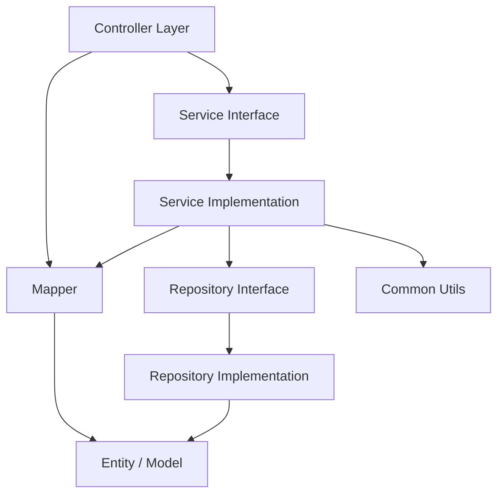
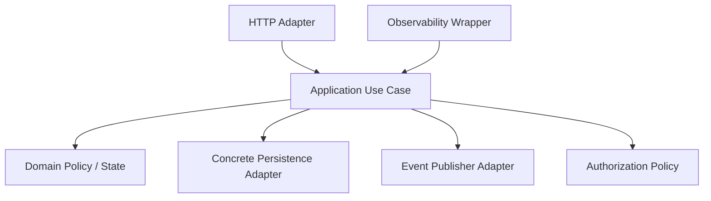
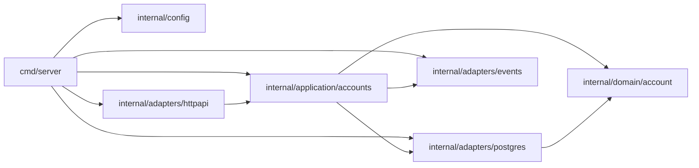
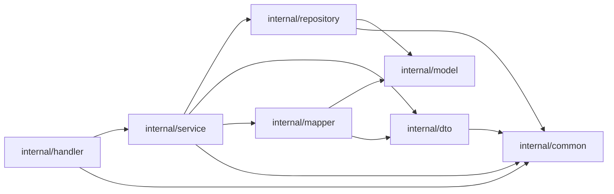
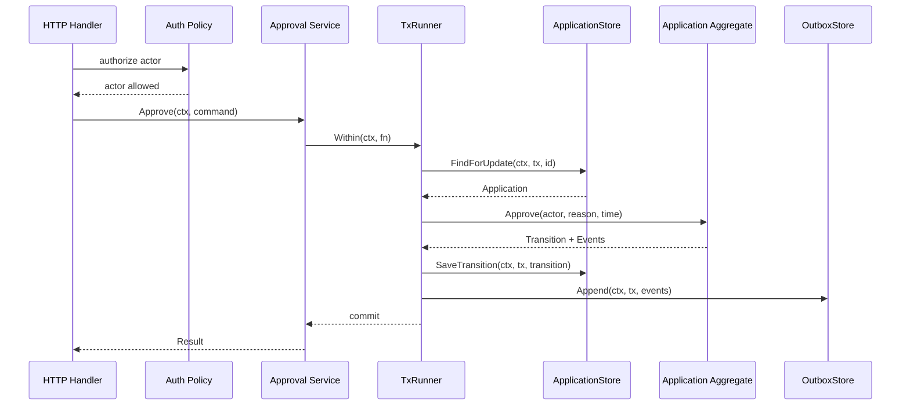

# learn-go-design-patterns-common-patterns-anti-patterns-part-001.md

# Part 001 — Java-to-Go Pattern Reframing

> Seri: **Go Design Patterns, Common Patterns, and Anti-Patterns**  
> Target pembaca: **Java software engineer / tech lead yang ingin berpikir idiomatis di Go**  
> Baseline bahasa: **Go 1.26.x**  
> Fokus part ini: **mengubah cara membaca dan merancang pattern dari mindset Java ke mindset Go**

---

## 0. Posisi Part Ini Dalam Seri

Part 000 sebelumnya adalah peta besar: taxonomy pattern, filosofi desain, dan batasan agar seri ini tidak mengulang materi Go dasar.

Part 001 ini adalah jembatan penting sebelum masuk ke pattern spesifik.

Banyak engineer yang sudah kuat di Java biasanya membawa kebiasaan desain berikut ke Go:

- class hierarchy
- interface per service
- DTO/entity/service/repository/controller berlapis secara otomatis
- dependency injection container
- annotation-driven behavior
- exception-based control flow
- framework-centered architecture
- generic repository
- abstract factory / provider / manager / handler berlebihan
- package seperti `common`, `utils`, `models`, `services`

Sebagian kebiasaan itu masuk akal dalam ekosistem Java. Namun jika dibawa mentah-mentah ke Go, hasilnya sering menjadi codebase yang terlihat “enterprise”, tetapi buruk secara Go:

- terlalu banyak interface
- terlalu banyak package kecil tanpa cohesion
- terlalu banyak indirection
- sulit dibaca lokal
- dependency graph berputar
- testing bergantung mock berlebihan
- error kehilangan konteks
- lifecycle goroutine tidak jelas
- package API terlalu bocor
- domain logic tersebar di handler/service/repository

Part ini akan membangun ulang mental model tersebut.

Tujuannya bukan mengatakan Java buruk. Tujuannya adalah memahami bahwa **Java dan Go mengoptimalkan desain untuk pressure yang berbeda**.

---

## 1. Tujuan Pembelajaran

Setelah menyelesaikan part ini, kamu harus mampu:

1. Menjelaskan kenapa Go tidak boleh diperlakukan sebagai “Java tanpa class”.
2. Membedakan pattern yang memang portable dari Java ke Go dan pattern yang harus diterjemahkan ulang.
3. Mendesain abstraction berdasarkan kebutuhan caller, bukan berdasarkan taxonomy class.
4. Memahami kenapa Go lebih menyukai package-level design daripada class-level architecture.
5. Menghindari interface pollution, service explosion, utility dumping ground, dan framework-shaped design.
6. Membaca codebase Go dari import graph, exported API, constructor shape, dan ownership boundary.
7. Menerjemahkan konsep Java seperti service, repository, strategy, factory, DI, exception, annotation, dan inheritance ke bentuk Go yang lebih idiomatis.

---

## 2. Prinsip Besar: Pattern Tidak Sama Dengan Bentuk Kode

Di Java, pattern sering dikenali dari bentuk struktural:

- `interface PaymentService`
- `class DefaultPaymentService implements PaymentService`
- `PaymentServiceFactory`
- `AbstractPaymentProcessor`
- `@Transactional`
- `@Service`
- `@Repository`
- `@Autowired`

Di Go, pattern lebih sering dikenali dari **relasi kepemilikan dan arah dependency**:

- siapa caller-nya?
- siapa owner interface-nya?
- siapa yang mengontrol lifecycle?
- siapa yang boleh tahu concrete implementation?
- package mana yang menjadi boundary?
- apakah dependency terlihat dari constructor?
- apakah cancellation dan timeout punya owner jelas?
- apakah error diterjemahkan di boundary yang benar?
- apakah API bisa dibaca tanpa membuka seluruh framework?

Dengan kata lain:

> Di Java, pattern sering tampak sebagai struktur tipe.  
> Di Go, pattern sering tampak sebagai bentuk API, package boundary, dan dependency direction.

---

## 3. Java dan Go Mengoptimalkan Hal Yang Berbeda

### 3.1 Java Banyak Mengandalkan Nominal Design

Java adalah bahasa object-oriented nominal yang kuat:

```java
public interface PaymentGateway {
    PaymentResult charge(PaymentRequest request);
}

public class StripePaymentGateway implements PaymentGateway {
    @Override
    public PaymentResult charge(PaymentRequest request) {
        // ...
    }
}
```

Relasi tipe sering dideklarasikan eksplisit:

- class mengimplementasikan interface
- class menurunkan abstract class
- annotation memberi behavior runtime
- framework memindai classpath
- container membuat object graph

Banyak desain Java tumbuh dari kebutuhan:

- enterprise framework
- compile-time contract berbasis class/interface
- runtime metadata via annotation/reflection
- injection lifecycle
- AOP/proxy
- runtime transaction boundary
- classpath scanning

### 3.2 Go Banyak Mengandalkan Structural Behavior

Go tidak membutuhkan deklarasi eksplisit `implements`.

```go
type PaymentGateway interface {
    Charge(ctx context.Context, req ChargeRequest) (ChargeResult, error)
}

type StripeGateway struct {
    client *http.Client
}

func (g *StripeGateway) Charge(ctx context.Context, req ChargeRequest) (ChargeResult, error) {
    // ...
}
```

`*StripeGateway` memenuhi `PaymentGateway` karena method set-nya cocok.

Implikasinya besar:

- interface bisa kecil
- interface bisa didefinisikan oleh consumer
- concrete type tidak perlu tahu semua interface yang ia penuhi
- abstraction bisa ditunda sampai ada kebutuhan nyata
- code tidak perlu class hierarchy untuk reuse
- behavior dapat dikomposisi lewat function, struct, interface kecil, package boundary

### 3.3 Ringkasan Perbedaan

| Area | Java Bias | Go Bias |
|---|---|---|
| Unit desain utama | class | package + function + small type |
| Polymorphism | explicit `implements` | implicit structural interface |
| Reuse | inheritance/composition/framework | composition/function/package |
| Dependency injection | container, annotation | constructor/manual wiring |
| Error flow | exception | explicit `error` return |
| Runtime behavior | annotation/reflection/proxy | explicit calls/wrappers |
| Architecture | layers/classes | package boundaries/import graph |
| Testing seam | mock interfaces/classes | consumer-owned small interfaces/fakes |
| Abstraction timing | often early | usually after concrete need appears |

---

## 4. Mindset Shift Utama

### 4.1 Dari “Type Hierarchy” ke “Capability Boundary”

Java sering mendorong pertanyaan:

> Entity ini termasuk class apa? Turun dari base class mana? Mengimplementasikan interface apa?

Go lebih sering mendorong pertanyaan:

> Caller ini butuh capability apa? Package mana yang boleh tahu detailnya? Apakah behavior cukup diwakili method kecil?

Contoh Java-style yang sering terbawa:

```go
type UserService interface {
    CreateUser(ctx context.Context, req CreateUserRequest) (*User, error)
    UpdateUser(ctx context.Context, req UpdateUserRequest) (*User, error)
    DeleteUser(ctx context.Context, id string) error
    GetUser(ctx context.Context, id string) (*User, error)
    ListUsers(ctx context.Context, filter UserFilter) ([]User, error)
}

type DefaultUserService struct {
    repo UserRepository
}
```

Masalah:

- interface terlalu besar
- interface kemungkinan dibuat sebelum ada banyak implementation
- nama `DefaultUserService` menandakan pattern Java, bukan kebutuhan Go
- caller kecil dipaksa bergantung pada seluruh service contract
- test menjadi mock besar

Go-style lebih sering dimulai dari concrete type:

```go
type UserService struct {
    users *UserStore
    clock Clock
}

func NewUserService(users *UserStore, clock Clock) *UserService {
    return &UserService{users: users, clock: clock}
}

func (s *UserService) Create(ctx context.Context, cmd CreateUserCommand) (CreateUserResult, error) {
    // ...
}
```

Lalu interface muncul di consumer yang butuh subset:

```go
type UserCreator interface {
    Create(ctx context.Context, cmd CreateUserCommand) (CreateUserResult, error)
}

type SignupHandler struct {
    users UserCreator
}
```

Mental model:

> Jangan mulai dari “semua yang bisa dilakukan service”.  
> Mulai dari “capability minimum yang dibutuhkan caller”.

---

### 4.2 Dari “Framework Owns Flow” ke “Your Code Owns Flow”

Dalam Java/Spring, banyak flow dimiliki framework:

```java
@RestController
@RequiredArgsConstructor
public class UserController {
    private final UserService service;

    @PostMapping("/users")
    @Transactional
    public UserResponse create(@RequestBody CreateUserRequest request) {
        return mapper.toResponse(service.create(request));
    }
}
```

Beberapa behavior tersembunyi:

- dependency injection
- transaction boundary
- validation binding
- JSON binding
- exception mapping
- security context
- metrics interceptor
- logging filter

Di Go, pendekatan umum adalah explicit composition:

```go
type CreateUserHandler struct {
    users *UserService
    tx    *TxRunner
    log   *slog.Logger
}

func (h *CreateUserHandler) ServeHTTP(w http.ResponseWriter, r *http.Request) {
    ctx := r.Context()

    var req CreateUserRequest
    if err := json.NewDecoder(r.Body).Decode(&req); err != nil {
        writeError(w, ErrBadRequest)
        return
    }

    result, err := h.tx.Within(ctx, func(ctx context.Context, tx Tx) (CreateUserResult, error) {
        return h.users.Create(ctx, tx, req.ToCommand())
    })
    if err != nil {
        writeError(w, translateCreateUserError(err))
        return
    }

    writeJSON(w, http.StatusCreated, result)
}
```

Ini lebih verbose, tetapi lebih jelas:

- transaction terlihat
- error mapping terlihat
- decode boundary terlihat
- handler dependency terlihat
- test seam terlihat
- lifecycle tidak disembunyikan annotation

Go bukan anti-framework. Go hanya menolak menjadikan framework sebagai pusat pemahaman code.

---

### 4.3 Dari “Layer by Default” ke “Boundary by Reason”

Java enterprise sering otomatis membentuk struktur:

```text
controller/
service/
repository/
entity/
dto/
mapper/
config/
util/
```

Struktur seperti ini tampak rapi, tetapi sering memecah satu use case ke banyak package berdasarkan jenis teknis, bukan berdasarkan cohesion bisnis.

Dalam Go, package sebaiknya mewakili capability/cohesion, bukan hanya layer generik.

Contoh kurang baik:

```text
internal/
  controller/
    user_controller.go
  service/
    user_service.go
  repository/
    user_repository.go
  model/
    user.go
  dto/
    user_request.go
  mapper/
    user_mapper.go
  util/
    string_util.go
```

Alternatif yang lebih Go-friendly:

```text
internal/
  user/
    command.go
    service.go
    store.go
    errors.go
    validate.go
    http.go
  platform/
    postgres/
    httpserver/
    config/
```

Atau untuk service besar:

```text
internal/
  application/
    users/
      create.go
      suspend.go
      query.go
  domain/
    account/
      account.go
      state.go
      policy.go
  adapters/
    httpapi/
    postgres/
    events/
```

Kuncinya bukan nama folder. Kuncinya adalah:

- dependency direction jelas
- package punya cohesion
- public API minimal
- tidak ada cycle
- use case mudah dilacak
- boundary domain/infrastructure tidak bocor

---

## 5. Pattern Translation Map: Java ke Go

Bagian ini adalah peta cepat. Tiap pattern akan dibahas lebih dalam di part berikutnya.

| Java Concept | Bias Umum di Java | Terjemahan Go yang Lebih Tepat |
|---|---|---|
| Interface per service | `UserService` + `UserServiceImpl` | concrete service dulu; interface kecil di consumer |
| Abstract class | shared base behavior | composition, embedded struct dengan hati-hati, helper function |
| Inheritance template method | base class dengan hook | higher-order function, small hook interface |
| DI container | annotation injection | manual constructor wiring, composition root |
| Spring bean lifecycle | framework-owned lifecycle | explicit `Start`, `Stop`, `Close`, context cancellation |
| Annotation validation | declarative constraint | explicit validation function / validation result |
| Exception hierarchy | typed exception | sentinel/typed/wrapped error, decision result |
| AOP transaction | `@Transactional` | transaction runner / explicit closure pattern |
| Repository per entity | CRUD repository | persistence adapter shaped by aggregate/use case/query |
| DTO mapper framework | generated/reflection mapper | explicit mapping at boundary |
| Utility class | static helper | small package with meaningful name or unexported function |
| Strategy class hierarchy | interface + many classes | function type or small interface |
| Factory bean | framework factory | constructor or small factory function |
| Enum with behavior | enum class | typed constants + methods or state table |
| Global config bean | application context | immutable config passed at wiring boundary |

---

## 6. Java Pattern Yang Aman Dibawa ke Go

Tidak semua Java pattern harus ditinggalkan. Banyak konsep tetap valid jika diterjemahkan dengan benar.

### 6.1 Strategy

Java:

```java
interface PricingStrategy {
    Money calculate(Order order);
}
```

Go:

```go
type PricingStrategy interface {
    Calculate(order Order) Money
}
```

Atau kalau behavior kecil:

```go
type PricingFunc func(Order) Money

func (f PricingFunc) Calculate(order Order) Money {
    return f(order)
}
```

Gunakan interface jika:

- ada beberapa implementation nyata
- caller perlu contract stabil
- dependency perlu diganti dalam test
- behavior cukup kecil

Gunakan function jika:

- behavior satu method
- tidak butuh state kompleks
- composition ringan lebih penting daripada object identity

---

### 6.2 Adapter

Konsep adapter sangat cocok di Go.

```go
type EmailSender interface {
    Send(ctx context.Context, msg EmailMessage) error
}

type SESClient struct {
    client *ses.Client
}

func (c *SESClient) Send(ctx context.Context, msg EmailMessage) error {
    // translate domain message to AWS SES request
}
```

Kuncinya:

- interface dimiliki package application/domain yang membutuhkan email sending
- concrete adapter berada di package infrastructure
- AWS SDK type tidak bocor ke domain

---

### 6.3 Decorator

Decorator juga sangat Go-friendly.

```go
type UserStore interface {
    FindByID(ctx context.Context, id UserID) (User, error)
}

type ObservedUserStore struct {
    next UserStore
    log  *slog.Logger
}

func (s *ObservedUserStore) FindByID(ctx context.Context, id UserID) (User, error) {
    start := time.Now()
    user, err := s.next.FindByID(ctx, id)
    s.log.InfoContext(ctx, "user_store.find_by_id", "duration", time.Since(start), "err", err)
    return user, err
}
```

Namun hati-hati:

- decorator tidak boleh mengubah semantic contract tanpa jelas
- ordering decorator harus eksplisit
- jangan membuat stack wrapper yang sulit ditelusuri

---

### 6.4 Factory

Factory di Go biasanya cukup function.

```go
func NewPaymentGateway(cfg PaymentConfig, client *http.Client) (*PaymentGateway, error) {
    if cfg.Endpoint == "" {
        return nil, errors.New("payment endpoint is required")
    }
    return &PaymentGateway{endpoint: cfg.Endpoint, client: client}, nil
}
```

Tidak perlu `PaymentGatewayFactory` jika function sudah cukup.

Gunakan factory object hanya jika:

- factory menyimpan state
- factory memilih implementation runtime
- factory perlu dependency kompleks
- factory dipakai berkali-kali setelah app berjalan

---

## 7. Java Pattern Yang Perlu Dicurigai Saat Dibawa ke Go

### 7.1 Interface Per Concrete Type

Anti-pattern:

```go
type OrderService interface {
    Create(ctx context.Context, cmd CreateOrderCommand) (Order, error)
    Cancel(ctx context.Context, id OrderID) error
}

type OrderServiceImpl struct {
    repo OrderRepository
}
```

Kenapa bermasalah:

- satu implementation saja
- interface berada di package provider
- nama `Impl` tidak memberi informasi domain
- caller dipaksa tahu seluruh contract
- mocking mendorong design palsu

Lebih baik:

```go
type Service struct {
    orders *Store
}

func (s *Service) Create(ctx context.Context, cmd CreateCommand) (CreateResult, error) {
    // ...
}
```

Jika handler hanya butuh create:

```go
type OrderCreator interface {
    Create(ctx context.Context, cmd CreateCommand) (CreateResult, error)
}
```

---

### 7.2 Abstract Base Service

Anti-pattern:

```go
type BaseService struct {
    log *slog.Logger
    db  *sql.DB
}

type UserService struct {
    BaseService
}

type OrderService struct {
    BaseService
}
```

Masalah:

- dependency tidak eksplisit di constructor service
- inheritance mental model terselubung
- field base bisa menjadi dumping ground
- lifecycle tidak jelas
- sulit tahu service benar-benar memakai dependency mana

Lebih baik:

```go
type UserService struct {
    users *UserStore
    log   *slog.Logger
}

type OrderService struct {
    orders *OrderStore
    log    *slog.Logger
}
```

Duplikasi kecil di constructor lebih murah daripada shared base abstraction yang salah.

---

### 7.3 Generic Repository

Anti-pattern:

```go
type Repository[T any, ID comparable] interface {
    Save(ctx context.Context, entity T) error
    FindByID(ctx context.Context, id ID) (T, error)
    Delete(ctx context.Context, id ID) error
}
```

Masalah:

- semua aggregate dianggap sama
- query semantics disembunyikan
- transaction semantics kabur
- partial update, locking, pagination, soft delete, eventing, audit berbeda per domain
- abstraction terlalu umum untuk problem yang sangat spesifik

Lebih baik:

```go
type AccountStore struct {
    db *sql.DB
}

func (s *AccountStore) FindForUpdate(ctx context.Context, tx Tx, id AccountID) (Account, error) {
    // SELECT ... FOR UPDATE
}

func (s *AccountStore) SaveTransition(ctx context.Context, tx Tx, change AccountTransition) error {
    // persist state transition and audit trail atomically
}
```

Repository yang baik tidak menyembunyikan semantic penting.

---

### 7.4 Annotation Mindset

Di Java:

```java
@Transactional
@PreAuthorize("hasRole('ADMIN')")
@Timed
public void approve(String id) { ... }
```

Di Go, lebih baik flow penting terlihat:

```go
func (h *ApproveHandler) ServeHTTP(w http.ResponseWriter, r *http.Request) {
    ctx := r.Context()

    actor, err := h.auth.RequireRole(ctx, "ADMIN")
    if err != nil {
        writeError(w, err)
        return
    }

    result, err := h.tx.Within(ctx, func(ctx context.Context, tx Tx) (ApproveResult, error) {
        return h.approvals.Approve(ctx, tx, actor, parseApproveCommand(r))
    })
    if err != nil {
        writeError(w, err)
        return
    }

    writeJSON(w, http.StatusOK, result)
}
```

Bukan berarti middleware/decorator tidak boleh. Namun decision-critical behavior seperti authorization, transaction, and state transition harus mudah ditemukan.

---

## 8. Deep Mental Model: Go Design Is About Ownership

Jika harus memilih satu kata untuk membedakan desain Go dari Java enterprise, kata itu adalah:

> **ownership**

Pertanyaan ownership yang selalu harus ditanyakan:

1. Siapa owner object ini?
2. Siapa owner goroutine ini?
3. Siapa owner context cancellation ini?
4. Siapa owner transaction ini?
5. Siapa owner error translation ini?
6. Siapa owner interface ini?
7. Siapa owner config ini?
8. Siapa owner lifecycle resource ini?
9. Siapa owner schema/event contract ini?
10. Siapa owner package API ini?

Code Go yang buruk sering bukan buruk karena syntax-nya. Ia buruk karena ownership kabur.

---

## 9. Diagram: Java-Style Dependency Shape vs Go-Style Dependency Shape

### 9.1 Java-Style Layered Shape Yang Sering Terbawa



Masalah umum jika dipindahkan mentah-mentah ke Go:

- terlalu banyak interface provider-owned
- dependency direction tampak bersih tetapi semu
- banyak type hanya meneruskan data
- package generik menjadi dumping ground
- flow use case sulit dibaca dari satu tempat

### 9.2 Go-Style Use-Case-Centered Shape



Catatan:

- `HTTP` tahu cara decode/encode transport.
- `App` mengorkestrasi use case.
- `Domain` memegang invariant dan policy.
- `Store` concrete boleh langsung dipakai jika tidak perlu abstraction.
- Interface kecil dibuat bila caller butuh boundary.
- Observability dapat berupa middleware/decorator, tetapi semantic tidak disembunyikan.

---

## 10. Package Boundary Lebih Penting Daripada Class Diagram

Di Java, class diagram sering menjadi alat utama menjelaskan design.

Di Go, import graph sering lebih jujur.

Contoh import graph yang sehat:



Import graph yang mulai berbahaya:



Tanda bahaya:

- `common` diimpor semua package
- `dto` dipakai jauh di dalam domain
- `mapper` menjadi dependency lintas layer
- `model` tidak jelas milik domain atau database
- service menjadi pusat semua arah dependency

---

## 11. “Small Interface” Bukan Berarti “Banyak Interface”

Salah satu salah paham besar:

> Karena Go menyukai small interface, maka kita harus membuat interface untuk semua hal.

Itu salah.

Yang benar:

> Buat interface kecil hanya ketika ada boundary nyata.

Boundary nyata misalnya:

- external dependency yang ingin diganti
- test seam yang tidak bisa lebih sederhana
- package consumer hanya butuh subset kecil
- plugin/strategy runtime
- multiple implementation nyata
- adapter untuk infrastruktur
- contract antar package yang stabil

Tidak perlu interface jika:

- hanya ada satu implementation
- concrete type lebih informatif
- package yang sama memakai type tersebut
- interface hanya untuk mock
- interface meniru class hierarchy
- interface memuat semua method dari concrete type

---

## 12. Error Flow: Dari Exception ke Explicit Decision

### 12.1 Java Exception Mindset

Dalam Java, error flow sering seperti ini:

```java
try {
    service.approve(request);
} catch (NotFoundException e) {
    return Response.status(404).build();
} catch (InvalidTransitionException e) {
    return Response.status(409).build();
}
```

Exception bisa lompat melewati banyak stack frame.

### 12.2 Go Explicit Error Mindset

Go memaksa caller melihat error:

```go
result, err := approvals.Approve(ctx, cmd)
if err != nil {
    writeError(w, translateApprovalError(err))
    return
}
```

Namun Go yang baik tidak hanya `return err` membabi buta.

Di boundary penting, error perlu diterjemahkan:

```go
func translateApprovalError(err error) APIError {
    switch {
    case errors.Is(err, ErrApplicationNotFound):
        return APIError{Status: http.StatusNotFound, Code: "APPLICATION_NOT_FOUND"}
    case errors.Is(err, ErrInvalidTransition):
        return APIError{Status: http.StatusConflict, Code: "INVALID_TRANSITION"}
    default:
        return APIError{Status: http.StatusInternalServerError, Code: "INTERNAL_ERROR"}
    }
}
```

Mental model:

- error bukan exception hierarchy
- error adalah value
- boundary menentukan makna error
- expected business rejection kadang lebih cocok sebagai result, bukan error
- infrastructure error jangan bocor ke API/domain

---

## 13. Transaction Flow: Dari `@Transactional` ke Explicit Transaction Ownership

Di Java/Spring:

```java
@Transactional
public void approve(String id) {
    var app = repository.findById(id).orElseThrow();
    app.approve();
    repository.save(app);
    publisher.publish(new ApprovedEvent(id));
}
```

Transaction boundary terlihat kecil, tetapi behavior aslinya bergantung proxy/framework.

Di Go, salah satu bentuk yang jelas:

```go
type TxRunner struct {
    db *sql.DB
}

func (r *TxRunner) Within(ctx context.Context, fn func(context.Context, Tx) error) error {
    tx, err := r.db.BeginTx(ctx, nil)
    if err != nil {
        return err
    }

    if err := fn(ctx, tx); err != nil {
        _ = tx.Rollback()
        return err
    }

    return tx.Commit()
}
```

Use case:

```go
func (s *ApprovalService) Approve(ctx context.Context, cmd ApproveCommand) error {
    return s.tx.Within(ctx, func(ctx context.Context, tx Tx) error {
        app, err := s.apps.FindForUpdate(ctx, tx, cmd.ApplicationID)
        if err != nil {
            return err
        }

        transition, err := app.Approve(cmd.Actor, cmd.Now)
        if err != nil {
            return err
        }

        if err := s.apps.SaveTransition(ctx, tx, transition); err != nil {
            return err
        }

        return s.outbox.Append(ctx, tx, transition.Events())
    })
}
```

Keuntungan:

- commit owner jelas
- rollback owner jelas
- event publish bisa di-outbox dalam transaksi
- tidak ada network call tersembunyi dalam transaction
- mudah diuji
- dependency eksplisit

---

## 14. Lifecycle Flow: Dari Container Lifecycle ke Explicit Resource Lifecycle

Java framework sering mengelola lifecycle bean.

Go lebih eksplisit:

```go
type Server struct {
    http *http.Server
    log  *slog.Logger
}

func (s *Server) Start() error {
    s.log.Info("server starting", "addr", s.http.Addr)
    return s.http.ListenAndServe()
}

func (s *Server) Shutdown(ctx context.Context) error {
    s.log.Info("server shutting down")
    return s.http.Shutdown(ctx)
}
```

Untuk worker:

```go
type Worker struct {
    jobs JobSource
    log  *slog.Logger
}

func (w *Worker) Run(ctx context.Context) error {
    for {
        job, err := w.jobs.Next(ctx)
        if err != nil {
            if errors.Is(err, context.Canceled) {
                return nil
            }
            return err
        }

        if err := w.handle(ctx, job); err != nil {
            w.log.ErrorContext(ctx, "job failed", "err", err)
        }
    }
}
```

Anti-pattern:

```go
func NewWorker(jobs JobSource) *Worker {
    w := &Worker{jobs: jobs}
    go w.loop() // hidden lifecycle
    return w
}
```

Masalah:

- siapa yang menghentikan goroutine?
- bagaimana error dilaporkan?
- bagaimana readiness diketahui?
- bagaimana test mengontrol lifecycle?
- bagaimana shutdown graceful?

---

## 15. DTO, Entity, Model: Jangan Membawa Kekacauan Istilah

Java codebase sering punya:

```text
UserEntity
UserDTO
UserRequest
UserResponse
UserModel
UserView
UserProjection
```

Di Go, nama harus mengikuti boundary dan makna.

Contoh lebih jelas:

```go
// Transport input.
type CreateUserRequest struct {
    Email string `json:"email"`
    Name  string `json:"name"`
}

// Application command.
type CreateUserCommand struct {
    Email Email
    Name  string
    Actor Actor
}

// Domain entity / aggregate.
type User struct {
    id    UserID
    email Email
    name  string
    state UserState
}

// Transport output.
type CreateUserResponse struct {
    ID    string `json:"id"`
    Email string `json:"email"`
}
```

Jangan membuat `model.User` yang dipakai untuk:

- JSON API
- database row
- domain invariant
- event payload
- cache payload
- test fixture

Itu bukan reuse. Itu coupling.

---

## 16. Utility Class Mindset vs Package Cohesion

Java:

```java
public final class StringUtils {
    public static boolean isBlank(String s) { ... }
}
```

Go anti-pattern:

```go
package utils

func IsBlank(s string) bool { ... }
func ParseDate(s string) (time.Time, error) { ... }
func SendEmail(...) error { ... }
func Retry(...) error { ... }
```

Masalah:

- nama package tidak memberi makna
- package menjadi dependency semua orang
- sulit menjaga ownership
- mudah membuat cycle tidak langsung
- fungsi tidak punya domain context

Lebih baik:

```text
internal/textnorm
internal/clock
internal/retry
internal/mail
internal/postalcode
```

Atau jika hanya dipakai satu package, jadikan unexported helper:

```go
func normalizeEmail(s string) string {
    return strings.ToLower(strings.TrimSpace(s))
}
```

---

## 17. Framework-Centered vs Domain/Application-Centered

Java enterprise sering dimulai dari framework:

- Spring Boot project structure
- controller/service/repository
- JPA entity
- annotation config
- framework transaction
- framework validation

Go production service sebaiknya dimulai dari flow:

1. Apa use case utama?
2. Apa command/query-nya?
3. Apa invariant domain-nya?
4. Apa boundary external-nya?
5. Apa failure mode-nya?
6. Apa transaction boundary-nya?
7. Apa observability event-nya?
8. Apa lifecycle resource-nya?
9. Apa testing seam-nya?
10. Baru pilih library/framework.

Framework adalah detail implementasi, bukan kerangka berpikir utama.

---

## 18. Design Smell: “Looks Enterprise, Behaves Fragile”

Code Go yang terlalu Java-like sering tampak rapi di awal:

```text
internal/controller
internal/service
internal/repository
internal/entity
internal/dto
internal/mapper
internal/config
internal/common
```

Namun setelah 6–12 bulan, gejalanya muncul:

- setiap feature menyentuh 8 package
- service saling memanggil
- repository interface tidak merepresentasikan query nyata
- DTO dipakai lintas layer
- domain invariant tersebar
- test mock terlalu banyak
- error mapping inkonsisten
- context dipakai sebagai bag dependency
- transaction kadang di service, kadang repository
- handler berisi business logic karena service abstraction tidak cocok
- package `common` makin besar

Ini disebut dalam seri ini sebagai:

> **enterprise-shaped fragility**

Bentuknya terlihat familiar, tetapi sistemnya rapuh.

---

## 19. Better Design Heuristic: “Can I Delete This Abstraction?”

Saat membuat abstraction di Go, tanyakan:

1. Apakah ada dua implementation nyata?
2. Apakah caller hanya butuh subset kecil?
3. Apakah abstraction ini mengurangi dependency antar package?
4. Apakah abstraction ini membuat testing lebih realistis?
5. Apakah abstraction ini menyembunyikan detail yang memang harus disembunyikan?
6. Apakah abstraction ini menjaga semantic penting tetap terlihat?
7. Apakah abstraction ini punya nama domain yang kuat?
8. Apakah abstraction ini bisa dijelaskan dalam satu kalimat?
9. Apakah abstraction ini bisa dihapus tanpa mengubah behavior?
10. Apakah abstraction ini dibuat karena kebutuhan nyata atau kebiasaan Java?

Jika mayoritas jawabannya lemah, jangan buat dulu.

---

## 20. Case Study: Java-Style Approval Service ke Go-Style Use Case

### 20.1 Java-Style Go Yang Kurang Ideal

```go
package service

type ApprovalService interface {
    Approve(ctx context.Context, request dto.ApproveRequest) (*dto.ApproveResponse, error)
}

type ApprovalServiceImpl struct {
    approvalRepository repository.ApprovalRepository
    applicationRepository repository.ApplicationRepository
    auditRepository repository.AuditRepository
    notificationService NotificationService
}

func (s *ApprovalServiceImpl) Approve(ctx context.Context, request dto.ApproveRequest) (*dto.ApproveResponse, error) {
    app, err := s.applicationRepository.FindByID(ctx, request.ApplicationID)
    if err != nil {
        return nil, err
    }

    if app.Status != "PENDING" {
        return nil, errors.New("invalid status")
    }

    app.Status = "APPROVED"

    if err := s.applicationRepository.Save(ctx, app); err != nil {
        return nil, err
    }

    if err := s.auditRepository.Save(ctx, "approved"); err != nil {
        return nil, err
    }

    if err := s.notificationService.SendApproved(ctx, app.ID); err != nil {
        return nil, err
    }

    return &dto.ApproveResponse{ID: app.ID}, nil
}
```

Problems:

- interface provider-owned
- `Impl` naming
- DTO masuk service internal
- status string raw
- no explicit transaction
- audit and save consistency unclear
- notification inside same flow may break transaction semantics
- business invalid transition modeled as generic error
- repository abstraction too vague

### 20.2 Go-Style Refactoring

```go
package approval

type Command struct {
    ApplicationID ApplicationID
    Actor         Actor
    Reason        string
    RequestedAt   time.Time
    IdempotencyKey string
}

type Result struct {
    ApplicationID ApplicationID
    NewState      ApplicationState
    TransitionID  TransitionID
}

type Service struct {
    tx      TxRunner
    apps    *ApplicationStore
    outbox  *OutboxStore
    policy  ApprovalPolicy
}

func NewService(tx TxRunner, apps *ApplicationStore, outbox *OutboxStore, policy ApprovalPolicy) *Service {
    return &Service{tx: tx, apps: apps, outbox: outbox, policy: policy}
}

func (s *Service) Approve(ctx context.Context, cmd Command) (Result, error) {
    var result Result

    err := s.tx.Within(ctx, func(ctx context.Context, tx Tx) error {
        app, err := s.apps.FindForUpdate(ctx, tx, cmd.ApplicationID)
        if err != nil {
            return err
        }

        decision := s.policy.CanApprove(app, cmd.Actor, cmd.RequestedAt)
        if !decision.Allowed {
            return decision.AsError()
        }

        transition, err := app.Approve(cmd.Actor, cmd.Reason, cmd.RequestedAt)
        if err != nil {
            return err
        }

        if err := s.apps.SaveTransition(ctx, tx, transition); err != nil {
            return err
        }

        if err := s.outbox.Append(ctx, tx, transition.Events()...); err != nil {
            return err
        }

        result = Result{
            ApplicationID: app.ID(),
            NewState:      app.State(),
            TransitionID:  transition.ID,
        }
        return nil
    })
    if err != nil {
        return Result{}, err
    }

    return result, nil
}
```

Improvement:

- command bukan transport DTO
- transaction owner eksplisit
- policy terlihat
- state transition domain-owned
- event publish via outbox
- result bermakna
- dependency jelas
- no fake `Impl`
- no generic repository
- no notification network call inside transaction

---

## 21. Diagram: Approval Flow Boundary



Key design message:

- HTTP tidak mengatur domain transition.
- Domain tidak tahu HTTP.
- Store tidak menentukan policy.
- Outbox menjaga consistency event.
- Transaction boundary terlihat.

---

## 22. Checklist: Mendeteksi Java Mindset di Go Code Review

Gunakan checklist ini saat review Go code dari engineer Java.

### 22.1 Naming Smell

Waspadai nama:

- `IUserService`
- `UserServiceImpl`
- `BaseService`
- `AbstractProcessor`
- `CommonUtil`
- `GenericRepository`
- `Manager`
- `Helper`
- `ProviderFactory`
- `EntityDTOMapper`

Tidak semua nama ini pasti salah, tetapi semuanya perlu ditanya ulang.

### 22.2 Package Smell

Waspadai package:

- `utils`
- `common`
- `models`
- `dto`
- `services`
- `repositories`
- `managers`
- `helpers`

Pertanyaan review:

- package ini menyediakan capability apa?
- siapa konsumennya?
- apakah nama package muncul natural saat dipakai?
- apakah package ini punya owner jelas?
- apakah package ini mendorong import cycle?

### 22.3 Interface Smell

Waspadai interface yang:

- punya satu implementation
- berada di package provider
- terlalu besar
- dinamai seperti concrete type
- dibuat hanya untuk mock
- mencerminkan CRUD lengkap
- tidak punya consumer spesifik

### 22.4 Flow Smell

Waspadai flow yang:

- transaction boundary tidak jelas
- goroutine dimulai diam-diam
- context dibuat deep dalam call chain
- error hanya diteruskan tanpa klasifikasi
- business rejection memakai generic error string
- event dipublish sebelum commit
- external call terjadi dalam transaction
- config dibaca di banyak tempat

---

## 23. Refactoring Playbook: Dari Java-Like ke Go-Like

### Step 1 — Temukan Use Case Utama

Jangan mulai dari package. Mulai dari use case:

- Create user
- Approve application
- Submit appeal
- Cancel order
- Recalculate eligibility
- Sync external status

### Step 2 — Pisahkan Transport DTO dari Command

Transport DTO:

```go
type ApproveRequest struct {
    Reason string `json:"reason"`
}
```

Application command:

```go
type ApproveCommand struct {
    ApplicationID ApplicationID
    Actor         Actor
    Reason        string
    RequestedAt   time.Time
}
```

### Step 3 — Buang Interface Provider-Owned Yang Tidak Perlu

Sebelum:

```go
type ApprovalService interface { ... }
type ApprovalServiceImpl struct { ... }
```

Sesudah:

```go
type Service struct { ... }
func (s *Service) Approve(...) (..., error)
```

Interface baru dibuat nanti di consumer jika perlu.

### Step 4 — Jadikan Dependency Eksplisit

Constructor harus menunjukkan kebutuhan nyata:

```go
func NewService(tx TxRunner, apps *ApplicationStore, outbox *OutboxStore, policy ApprovalPolicy) *Service
```

### Step 5 — Pindahkan Invariant ke Domain

Jangan simpan state transition di handler/service sebagai if/else string tersebar.

```go
func (a *Application) Approve(actor Actor, reason string, now time.Time) (Transition, error)
```

### Step 6 — Buat Boundary Error

```go
var ErrInvalidTransition = errors.New("invalid transition")
```

Atau typed error:

```go
type InvalidTransitionError struct {
    From ApplicationState
    To   ApplicationState
}
```

### Step 7 — Tinjau Import Graph

Pastikan:

- domain tidak import transport
- application tidak import HTTP framework
- adapter boleh import application/domain
- shared package tidak menjadi dumping ground

### Step 8 — Tambahkan Test Seams Secara Selektif

Gunakan fake concrete jika cukup. Jangan mock semua hal.

---

## 24. Exercise 1 — Deteksi Smell

Perhatikan code berikut:

```go
package service

type CustomerService interface {
    Create(ctx context.Context, req dto.CreateCustomerRequest) (*dto.CustomerResponse, error)
    Update(ctx context.Context, req dto.UpdateCustomerRequest) (*dto.CustomerResponse, error)
    Delete(ctx context.Context, id string) error
    Find(ctx context.Context, id string) (*dto.CustomerResponse, error)
}

type CustomerServiceImpl struct {
    customerRepository repository.CustomerRepository
    emailService       EmailService
    logger             *slog.Logger
}
```

Pertanyaan:

1. Apa smell utamanya?
2. Siapa owner interface ini?
3. Apakah DTO seharusnya masuk service?
4. Apakah method CRUD ini merepresentasikan use case atau hanya table operation?
5. Bagaimana bentuk Go-style awalnya?

Jawaban yang diharapkan:

- interface terlalu besar dan provider-owned
- `Impl` smell
- DTO transport bocor ke application layer
- service terlalu CRUD-shaped
- lebih baik mulai dari concrete `customer.Service` dengan command/result per use case

---

## 25. Exercise 2 — Refactor Package Layout

Layout awal:

```text
internal/
  controller/
  service/
  repository/
  model/
  dto/
  mapper/
  common/
```

Refactor untuk domain `application approval`.

Salah satu jawaban:

```text
internal/
  approval/
    command.go
    result.go
    service.go
    policy.go
    errors.go
    http.go
  application/
    aggregate.go
    state.go
    transition.go
  postgres/
    application_store.go
    outbox_store.go
  platform/
    tx.go
    config.go
    httpserver.go
```

Atau versi lebih layered:

```text
internal/
  domain/
    application/
      aggregate.go
      state.go
      transition.go
      policy.go
  application/
    approval/
      command.go
      service.go
      result.go
      errors.go
  adapters/
    httpapi/
      approval_handler.go
    postgres/
      application_store.go
      outbox_store.go
```

Yang penting bukan nama foldernya, tetapi dependency direction-nya.

---

## 26. Practical Review Rubric

Saat melihat design Go, beri skor 1–5 untuk area ini:

| Area | Pertanyaan |
|---|---|
| Local reasoning | Bisakah flow utama dibaca tanpa membuka 12 file? |
| Dependency clarity | Apakah constructor menunjukkan dependency nyata? |
| Interface hygiene | Apakah interface kecil, consumer-owned, dan dibutuhkan? |
| Package cohesion | Apakah package punya alasan eksis yang jelas? |
| Error semantics | Apakah error punya klasifikasi boundary? |
| Lifecycle ownership | Apakah goroutine/resource punya owner jelas? |
| Transaction ownership | Apakah commit/rollback owner jelas? |
| Domain invariant | Apakah invariant berada dekat domain? |
| Observability | Apakah event penting bisa dilacak? |
| Test seam | Apakah test seam realistis, bukan mock theater? |

Jika banyak skor rendah, masalahnya biasanya bukan kurang pattern. Masalahnya pattern yang dipakai tidak cocok dengan Go.

---

## 27. Common Anti-Patterns Dari Java Engineer di Go

### 27.1 `Impl` Everywhere

```go
type UserServiceImpl struct {}
```

Biasanya tanda interface dibuat terlalu awal.

### 27.2 `Base` Struct Everywhere

```go
type BaseRepository struct { db *sql.DB }
```

Kadang valid, tetapi sering menyembunyikan dependency dan mendorong pseudo-inheritance.

### 27.3 `common` As Architecture Sink

Semua hal masuk `common`, lalu semua package import `common`.

### 27.4 DTO Reuse Across Boundaries

Satu struct dipakai untuk JSON, DB, domain, event.

### 27.5 Mock-First Design

Interface dibuat agar mocking mudah, bukan karena boundary desain nyata.

### 27.6 Transaction Hidden in Repository

Repository memulai dan commit transaction sendiri, sementara use case butuh atomicity lintas repository.

### 27.7 Context as Dependency Bag

```go
ctx = context.WithValue(ctx, "db", db)
ctx = context.WithValue(ctx, "logger", logger)
```

Context bukan service locator.

### 27.8 Framework Before Flow

Memilih framework dulu, lalu domain dipaksa mengikuti framework.

### 27.9 Over-Generic Domain

Generic repository, generic service, generic handler, generic mapper, padahal semantic domain berbeda.

### 27.10 Excessive Mapper Layer

Mapping layer menjadi ceremony, bukan boundary protection.

---

## 28. Go Design Reframing Table

| Pertanyaan Java-ish | Pertanyaan Go-ish |
|---|---|
| Interface apa yang harus dibuat? | Caller butuh capability apa? |
| Layer apa yang harus ditambahkan? | Boundary apa yang perlu dijaga? |
| Base class apa yang bisa dipakai? | Dependency/behavior apa yang bisa dikomposisi? |
| Annotation apa yang mengaktifkan behavior? | Di mana flow itu terlihat eksplisit? |
| Bagaimana DI container menemukan bean? | Di mana composition root membuat object graph? |
| Exception apa yang dilempar? | Error/result apa yang dikembalikan dan diterjemahkan di boundary mana? |
| Entity ini punya repository apa? | Use case ini butuh persistence semantic apa? |
| DTO apa yang bisa dipakai ulang? | Boundary mana yang butuh representation berbeda? |
| Package layer mana? | Package ini menyediakan capability apa? |
| Bagaimana mock semua dependency? | Test seam minimum apa yang realistis? |

---

## 29. Final Mental Model

Go design yang baik biasanya memiliki sifat berikut:

1. **Concrete first**  
   Mulai dari concrete type yang jelas. Interface muncul karena kebutuhan caller.

2. **Small surface**  
   Export hanya yang perlu. Public API adalah kontrak jangka panjang.

3. **Explicit flow**  
   Transaction, authorization, cancellation, retry, dan error mapping tidak boleh terlalu tersembunyi.

4. **Package cohesion**  
   Package bukan folder layer generik, tetapi unit capability.

5. **Ownership clarity**  
   Setiap resource, goroutine, transaction, context, dan dependency punya owner.

6. **Boundary-specific representation**  
   JSON request, DB row, domain entity, event payload tidak otomatis satu struct.

7. **Abstraction as consequence**  
   Abstraction dibuat setelah ada pressure nyata, bukan karena template arsitektur.

8. **Operational awareness**  
   Pattern harus mempertimbangkan observability, failure, shutdown, retry, idempotency, dan auditability.

---

## 30. Ringkasan

Part ini membahas cara menerjemahkan mindset Java ke desain Go yang lebih idiomatis.

Inti pembelajaran:

- Go bukan Java tanpa class.
- Pattern Go lebih banyak hidup di package boundary, API shape, dependency direction, dan ownership.
- Interface di Go sebaiknya kecil, consumer-owned, dan dibuat karena kebutuhan nyata.
- Manual wiring bukan kemunduran; ia membuat object graph lebih eksplisit.
- Annotation/proxy magic dari Java perlu diterjemahkan menjadi flow yang terlihat.
- Repository, service, factory, strategy, adapter, decorator tetap berguna, tetapi bentuknya harus disesuaikan.
- Codebase Go yang baik mudah dibaca secara lokal, dependency-nya jelas, lifecycle-nya eksplisit, dan abstraction-nya hemat.

Kalimat paling penting dari part ini:

> Jangan membawa bentuk pattern Java ke Go. Bawa problem yang diselesaikan pattern tersebut, lalu bentuk ulang dengan constraint dan idiom Go.

---

## 31. Referensi Resmi dan Bacaan Pendukung

Sumber utama yang relevan untuk part ini:

1. Go 1.26 Release Notes — https://go.dev/doc/go1.26
2. Go Release History — https://go.dev/doc/devel/release
3. Effective Go — https://go.dev/doc/effective_go
4. Go Code Review Comments — https://go.dev/wiki/CodeReviewComments
5. Package names — https://go.dev/blog/package-names
6. Package context — https://pkg.go.dev/context
7. Google Go Style Guide — https://google.github.io/styleguide/go/
8. Google Go Style Decisions — https://google.github.io/styleguide/go/decisions.html
9. Google Go Style Best Practices — https://google.github.io/styleguide/go/best-practices.html

---

## 32. Status Seri

- Part ini: **Part 001 — Java-to-Go Pattern Reframing**
- Status: **selesai**
- Seri: **belum selesai**
- Berikutnya: **Part 002 — Idiomatic Simplicity as a Design Pattern**


<!-- NAVIGATION_FOOTER -->
<div class="page-nav">
<a href="./learn-go-design-patterns-common-patterns-anti-patterns-part-000.md">⬅️ Go Design Patterns, Common Patterns, and Anti-Patterns</a>
<a href="./index.md">📚 Kategori</a>
<a href="../../index.md">🏠 Home</a>
<a href="./learn-go-design-patterns-common-patterns-anti-patterns-part-002.md">Part 002 — Idiomatic Simplicity as a Design Pattern ➡️</a>
</div>
