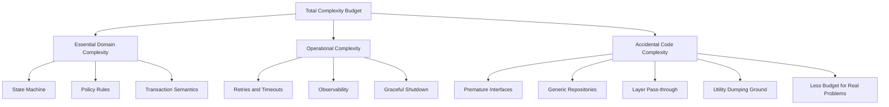
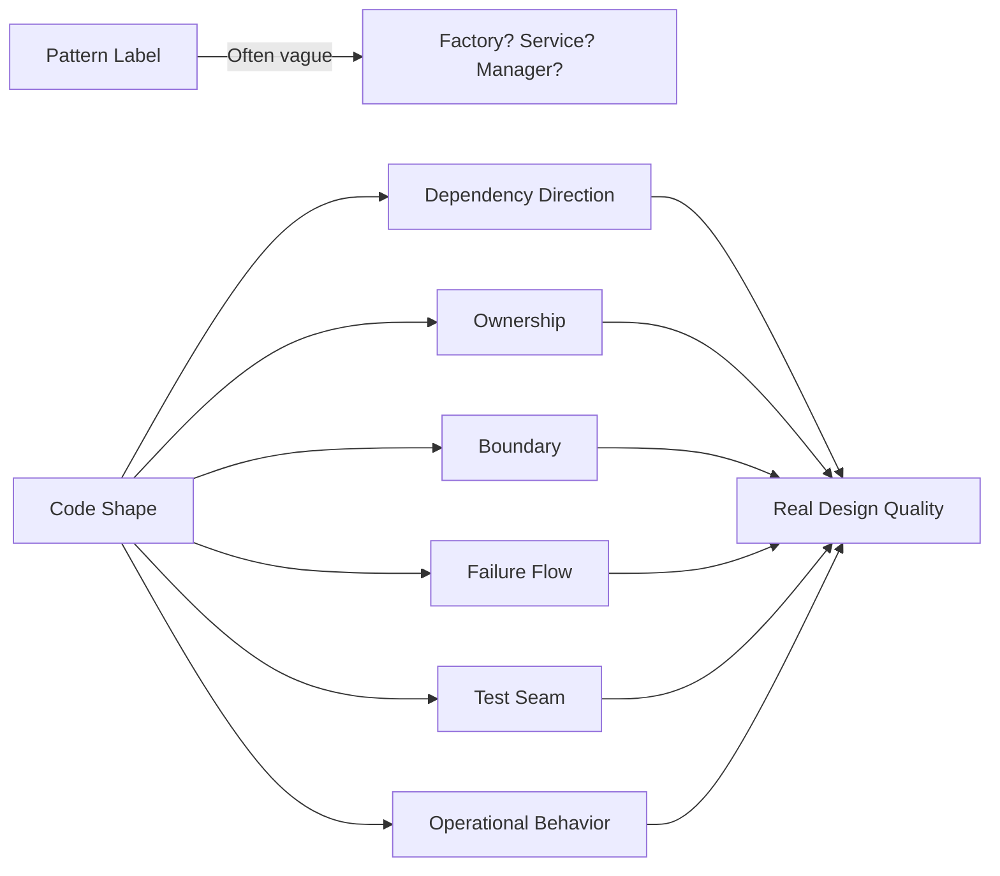
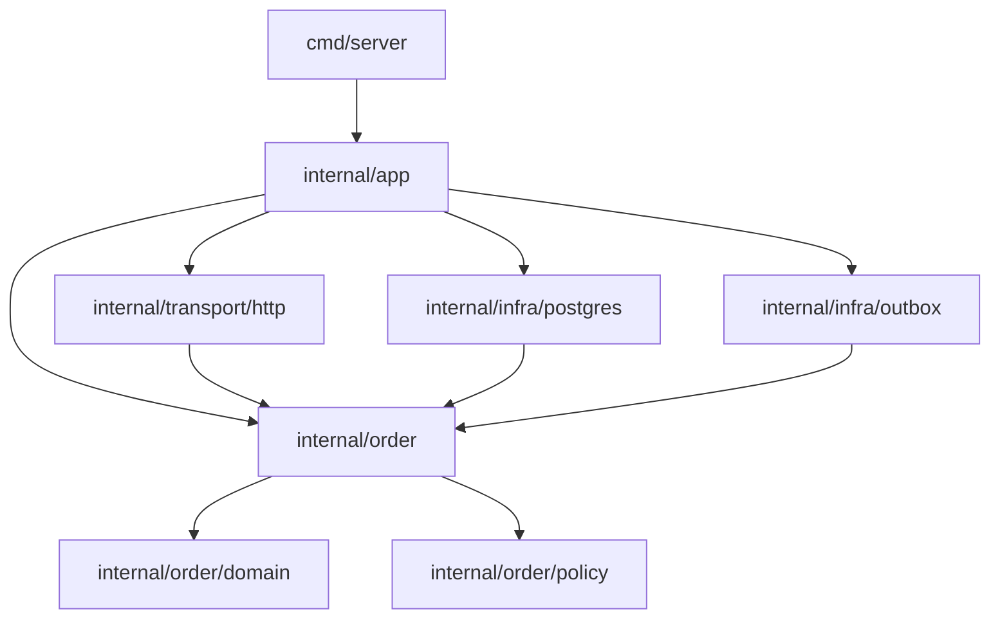
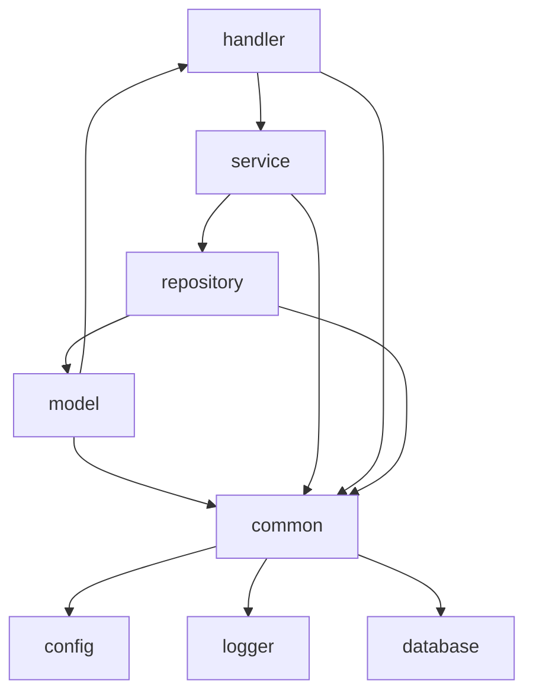
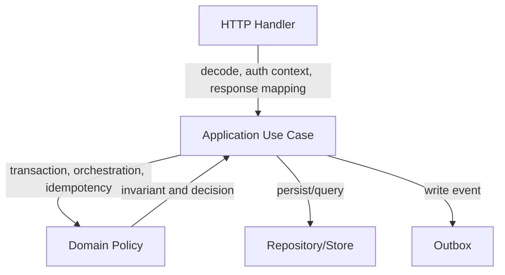
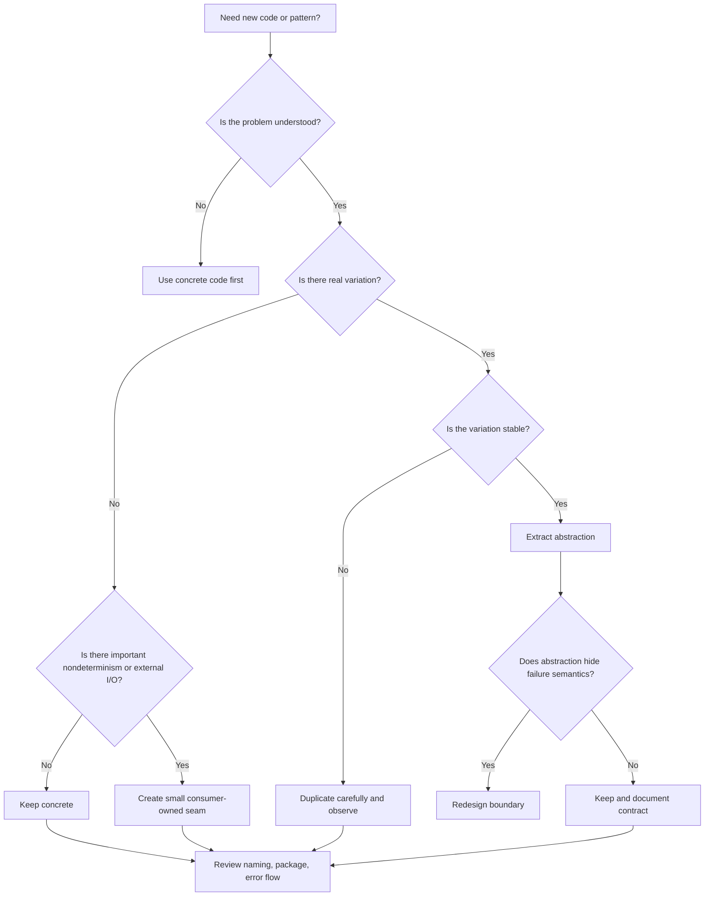

# learn-go-design-patterns-common-patterns-anti-patterns-part-002.md

# Part 002 — Idiomatic Simplicity as a Design Pattern

> Seri: **Go Design Patterns, Common Patterns, and Anti-Patterns**  
> Target pembaca: **Java software engineer / tech lead** yang ingin membangun keluwesan desain Go untuk codebase production.  
> Baseline bahasa: **Go 1.26.x**  
> Fokus bagian ini: menjadikan **simplicity** sebagai strategi desain, bukan sekadar gaya coding minimalis.

---

## 0. Posisi Part Ini dalam Seri

Pada part sebelumnya, kita membongkar perbedaan besar antara pola pikir Java dan Go. Java sering mendorong engineer untuk berpikir melalui:

- hierarchy,
- framework contract,
- annotation,
- container lifecycle,
- proxy/interceptor,
- abstract service,
- abstract repository,
- domain object dengan banyak machinery.

Go tidak melarang abstraction. Tetapi Go memaksa kita bertanya lebih awal:

> “Apakah abstraction ini benar-benar mengurangi kompleksitas, atau hanya memindahkan kompleksitas ke tempat yang lebih sulit dilihat?”

Bagian ini membahas simplicity sebagai **design pattern tingkat tinggi**. Bukan simplicity dalam arti “kode pendek”, “fitur sedikit”, atau “tanpa arsitektur”. Yang dimaksud adalah:

> desain yang membuat perilaku sistem bisa dipahami secara lokal, diuji secara eksplisit, dimodifikasi dengan risiko terkendali, dan dioperasikan dalam production tanpa kejutan tersembunyi.

Dalam Go, simplicity adalah pola desain karena ia menentukan bentuk:

- package,
- API,
- interface,
- constructor,
- dependency graph,
- error flow,
- context propagation,
- concurrency ownership,
- testing seam,
- refactoring strategy.

Jika bagian ini dikuasai, part-part berikutnya akan terasa lebih masuk akal. Kalau tidak, pattern seperti repository, service layer, middleware, plugin, decorator, event, worker, dan generic abstraction mudah berubah menjadi ceremony.

---

## 1. Tujuan Pembelajaran

Setelah menyelesaikan part ini, kamu seharusnya mampu:

1. Membedakan **simple**, **simplistic**, dan **clever** dalam desain Go.
2. Mengukur biaya abstraction sebelum membuat interface, layer, helper, generic, atau framework internal.
3. Mendesain kode agar mudah dibaca dari import graph, package boundary, dan function call path.
4. Menentukan kapan duplikasi kecil lebih sehat daripada abstraction prematur.
5. Mengenali anti-pattern seperti `utils`, `common`, `BaseService`, `Manager`, `Processor`, `Helper`, dan abstraction yang dibuat hanya karena kebiasaan Java.
6. Menulis code review comment yang menilai desain berdasarkan cognitive load, ownership, failure mode, dan evolvability.
7. Membuat refactoring plan dari codebase yang terlalu abstrak menuju desain Go yang lebih eksplisit.

---

## 2. Apa Itu Simplicity dalam Go?

Simplicity di Go bukan berarti “tidak ada desain”. Justru sebaliknya: simplicity adalah hasil dari desain yang disiplin.

### 2.1 Simple

Kode disebut **simple** ketika:

- tanggung jawabnya jelas,
- dependency terlihat dari signature atau constructor,
- failure mode terlihat dari return value,
- lifecycle terlihat dari pemilik objek,
- package boundary mudah dibaca,
- perilaku bisa dipahami tanpa membuka 12 file abstraction,
- test bisa dibuat tanpa membangun dunia palsu.

Contoh karakter simple:

```go
func CreateOrder(ctx context.Context, db *sql.DB, cmd CreateOrderCommand) (OrderID, error) {
    if err := cmd.Validate(); err != nil {
        return "", err
    }

    tx, err := db.BeginTx(ctx, nil)
    if err != nil {
        return "", err
    }
    defer tx.Rollback()

    id, err := insertOrder(ctx, tx, cmd)
    if err != nil {
        return "", err
    }

    if err := insertOutboxEvent(ctx, tx, id); err != nil {
        return "", err
    }

    if err := tx.Commit(); err != nil {
        return "", err
    }

    return id, nil
}
```

Ini bukan selalu bentuk final terbaik untuk sistem besar, tetapi alurnya mudah dibaca:

1. validate,
2. begin transaction,
3. insert order,
4. insert event,
5. commit,
6. return.

Kalau nanti kompleksitas tumbuh, kita bisa mengekstrak dependency dengan alasan jelas.

### 2.2 Simplistic

Kode disebut **simplistic** ketika terlihat sederhana di permukaan, tetapi menyembunyikan kompleksitas penting.

Contoh:

```go
func CreateOrder(cmd CreateOrderCommand) error {
    Save(cmd)
    Publish("order.created", cmd)
    return nil
}
```

Terlihat pendek, tetapi banyak pertanyaan production hilang:

- `Save` pakai context atau tidak?
- timeout dari mana?
- transaction boundary di mana?
- publish terjadi sebelum atau sesudah commit?
- publish retry bagaimana?
- error dari `Save` dan `Publish` ke mana?
- kalau publish sukses tetapi save rollback bagaimana?
- observability ada di mana?
- idempotency ada atau tidak?

Kode simplistic sering terasa “clean” di demo, tetapi rapuh di production.

### 2.3 Clever

Kode disebut **clever** ketika ia mengurangi jumlah baris dengan cara yang menaikkan beban memahami sistem.

Contoh:

```go
func Must[T any](v T, err error) T {
    if err != nil {
        panic(err)
    }
    return v
}

var db = Must(sql.Open("postgres", os.Getenv("DATABASE_URL")))
```

Masalahnya bukan generic-nya. Masalahnya:

- initialization global,
- panic untuk error konfigurasi runtime,
- dependency tersembunyi,
- lifecycle tidak jelas,
- sulit dites,
- sulit graceful shutdown,
- sulit inject alternate DB.

Cleverness sering mengubah error eksplisit menjadi kejutan runtime.

---

## 3. Mengapa Go Mengutamakan Simplicity?

Go lahir dari kebutuhan engineering skala besar: banyak engineer, banyak codebase, banyak service, banyak build, banyak maintenance. Nilai utamanya bukan membuat syntax paling ekspresif, tetapi membuat sistem yang tetap bisa dikelola.

Dalam praktik, simplicity di Go muncul dari beberapa prinsip:

1. **Explicit over implicit**  
   Dependency, error, cancellation, dan ownership sebaiknya terlihat.

2. **Composition over inheritance**  
   Struct embedding, interface kecil, dan fungsi biasa lebih sering cukup daripada hierarchy.

3. **Local reasoning**  
   Membaca satu function/package harus memberi cukup informasi untuk memahami perilaku utama.

4. **Small surface area**  
   Public API yang kecil lebih mudah dijaga daripada banyak exported type/function.

5. **Concrete first, abstraction later**  
   Jangan membuat interface sebelum ada kebutuhan nyata dari consumer.

6. **Boring is good**  
   Kode yang membosankan sering lebih stabil daripada kode yang “pintar”.

7. **Toolability**  
   Go mengandalkan formatter, static analysis, doc generation, test tooling, module tooling, dan import graph yang relatif mudah dianalisis.

Simplicity adalah cara menjaga agar semua prinsip ini tetap berjalan ketika sistem membesar.

---

## 4. Mental Model: Complexity Budget

Setiap codebase punya **complexity budget**. Budget ini terbatas. Kamu bisa menghabiskannya untuk hal yang memang rumit, seperti:

- distributed transaction,
- idempotency,
- authorization policy,
- state machine,
- audit trail,
- rate limiting,
- cache consistency,
- data migration,
- graceful shutdown,
- schema evolution,
- retry and timeout budget,
- observability.

Atau kamu bisa menghabiskannya untuk ceremony internal:

- interface untuk semua struct,
- generic repository,
- five-layer pass-through,
- custom DI framework,
- package `common`,
- helper yang terlalu umum,
- inheritance simulation,
- reflection registry,
- lifecycle hook framework,
- callback abstraction sebelum ada variasi nyata.

Engineer senior yang kuat bukan hanya bisa membuat abstraction. Ia tahu **di mana abstraction tidak layak menghabiskan complexity budget**.

### Diagram: Complexity Budget



Target desain Go yang baik bukan menghilangkan kompleksitas. Targetnya adalah:

> complexity harus berada pada tempat yang memang membutuhkan keputusan bisnis/teknis, bukan tersebar dalam machinery internal yang tidak memberi leverage.

---

## 5. Local Reasoning sebagai Tujuan Desain

Salah satu ukuran terbaik untuk desain Go adalah:

> “Berapa banyak file yang harus saya buka untuk memahami satu perubahan?”

Jika untuk memahami `CreateOrder` kamu harus membuka:

- `OrderController`,
- `OrderService`,
- `OrderServiceImpl`,
- `IOrderService`,
- `BaseService`,
- `OrderManager`,
- `OrderProcessor`,
- `OrderRepository`,
- `GenericRepository`,
- `TransactionTemplate`,
- `EventPublisher`,
- `ApplicationContext`,
- `CommonUtils`,

maka local reasoning buruk.

Di Go, local reasoning ditingkatkan dengan:

- dependency eksplisit,
- function kecil tapi tidak over-fragmented,
- package cohesive,
- interface kecil di sisi consumer,
- error return eksplisit,
- context passed explicitly,
- transaction ownership jelas,
- lifecycle object jelas.

### Contoh Local Reasoning Buruk

```go
type OrderService interface {
    Create(ctx context.Context, req CreateOrderRequest) (*CreateOrderResponse, error)
}

type orderService struct {
    manager OrderManager
}

func (s *orderService) Create(ctx context.Context, req CreateOrderRequest) (*CreateOrderResponse, error) {
    return s.manager.Process(ctx, req)
}

type OrderManager interface {
    Process(ctx context.Context, req CreateOrderRequest) (*CreateOrderResponse, error)
}

type orderManager struct {
    processor OrderProcessor
}

func (m *orderManager) Process(ctx context.Context, req CreateOrderRequest) (*CreateOrderResponse, error) {
    return m.processor.Execute(ctx, req)
}
```

Masalahnya bukan interface. Masalahnya adalah pass-through layer yang tidak menambah keputusan.

### Refactor Lebih Sederhana

```go
type OrderCreator struct {
    db       *sql.DB
    outbox   *OutboxWriter
    clock    Clock
    idgen    IDGenerator
}

func (c *OrderCreator) Create(ctx context.Context, cmd CreateOrderCommand) (CreateOrderResult, error) {
    if err := cmd.Validate(); err != nil {
        return CreateOrderResult{}, err
    }

    return withTx(ctx, c.db, func(tx *sql.Tx) (CreateOrderResult, error) {
        order, err := newOrder(cmd, c.clock.Now(), c.idgen.NewID())
        if err != nil {
            return CreateOrderResult{}, err
        }

        if err := insertOrder(ctx, tx, order); err != nil {
            return CreateOrderResult{}, err
        }

        if err := c.outbox.Write(ctx, tx, OrderCreatedEventFrom(order)); err != nil {
            return CreateOrderResult{}, err
        }

        return CreateOrderResult{OrderID: order.ID}, nil
    })
}
```

Kita masih punya abstraction:

- `OrderCreator`,
- `OutboxWriter`,
- `Clock`,
- `IDGenerator`,
- `withTx`.

Tetapi setiap abstraction punya alasan:

- `OrderCreator`: use case boundary,
- `OutboxWriter`: externalized side-effect boundary,
- `Clock`: deterministic testing,
- `IDGenerator`: deterministic testing/id policy,
- `withTx`: transaction ownership helper.

Inilah simplicity yang matang: bukan tanpa abstraction, tetapi abstraction yang masing-masing punya decision value.

---

## 6. Abstraction Harus Membayar Sewa

Setiap abstraction dalam Go harus “membayar sewa”. Artinya, ia harus memberi manfaat nyata yang lebih besar daripada biaya cognitive load-nya.

### 6.1 Biaya Abstraction

Abstraction membawa biaya:

1. **Naming cost**  
   Kamu harus memberi nama yang tepat. Nama buruk seperti `Manager`, `Helper`, `Processor`, `Common`, `Util` menambah kabut.

2. **Navigation cost**  
   Pembaca harus lompat ke tempat lain.

3. **Indirection cost**  
   Perilaku nyata tidak terlihat dari call site.

4. **Testing cost**  
   Test bisa menjadi mock-heavy dan tidak lagi menguji contract nyata.

5. **Evolution cost**  
   Public interface sulit diubah.

6. **Performance cost**  
   Biasanya kecil, tetapi bisa relevan pada hot path: allocation, interface dispatch, closure capture, reflection, generic instantiation shape, atau escaping.

7. **Operational cost**  
   Error/log/metric bisa tersebar di layer yang tidak tepat.

### 6.2 Manfaat Abstraction

Abstraction layak jika memberi salah satu dari ini:

1. **Variation isolation**  
   Ada beberapa implementasi nyata atau kemungkinan variasi yang sudah jelas.

2. **Dependency inversion**  
   Core logic tidak boleh bergantung pada detail eksternal.

3. **Testing seam**  
   Test membutuhkan kontrol deterministik terhadap waktu, ID, I/O, random, external service.

4. **Policy separation**  
   Aturan bisa berganti tanpa mengubah flow utama.

5. **Operational control**  
   Timeout, retry, metrics, tracing, dan circuit breaker bisa dipasang di boundary yang tepat.

6. **Public API stability**  
   Library perlu menyembunyikan detail agar konsumen tidak tergantung pada internals.

7. **Complexity compression**  
   Detail rumit disembunyikan karena caller memang tidak perlu tahu.

### 6.3 Rule of Thumb

Sebelum membuat abstraction, jawab:

1. Apa variasi nyata yang sedang saya lindungi?
2. Siapa consumer abstraction ini?
3. Apakah consumer membutuhkan interface ini, atau provider hanya ingin terlihat clean?
4. Apakah abstraction ini menyembunyikan detail yang memang irrelevant, atau menyembunyikan decision penting?
5. Apakah abstraction ini mengurangi jumlah konsep, atau menambah konsep baru?
6. Apakah test menjadi lebih meaningful, atau hanya lebih banyak mock?
7. Kalau abstraction ini dihapus, apa yang benar-benar menjadi lebih buruk?

Jika jawaban tidak jelas, jangan abstraksikan dulu.

---

## 7. Concrete First, Abstract Later

Salah satu pattern paling kuat di Go:

> Mulai dengan concrete implementation. Ekstrak interface hanya ketika consumer membutuhkannya.

### 7.1 Versi Prematur

```go
type UserRepository interface {
    FindByID(ctx context.Context, id string) (*User, error)
    Save(ctx context.Context, user *User) error
}

type UserService interface {
    GetUser(ctx context.Context, id string) (*UserDTO, error)
}

type UserServiceImpl struct {
    repo UserRepository
}
```

Untuk Java engineer, ini terlihat normal. Tetapi di Go, pertanyaannya:

- Ada berapa implementasi `UserService`?
- Siapa yang butuh interface `UserService`?
- Kenapa return pointer DTO?
- Kenapa repository interface didefinisikan oleh package repository, bukan consumer?
- Apakah `Save` benar-benar abstraction domain, atau hanya wrapper SQL?

### 7.2 Versi Concrete First

```go
type UserStore struct {
    db *sql.DB
}

func NewUserStore(db *sql.DB) *UserStore {
    return &UserStore{db: db}
}

func (s *UserStore) FindByID(ctx context.Context, id UserID) (User, error) {
    // SQL implementation
}

func (s *UserStore) Save(ctx context.Context, user User) error {
    // SQL implementation
}

type UserReader interface {
    FindByID(ctx context.Context, id UserID) (User, error)
}

type UserViewer struct {
    users UserReader
}
```

Interface `UserReader` muncul di consumer `UserViewer`, karena consumer hanya butuh kemampuan membaca user. Ini lebih kecil dan lebih stabil.

### 7.3 Kapan Concrete First Tidak Cukup?

Concrete first bukan dogma. Interface lebih awal bisa masuk akal jika:

- kamu mendesain public library,
- kamu membuat boundary terhadap external system,
- kamu punya lebih dari satu implementation sejak awal,
- kamu perlu contract untuk plugin/adapter,
- kamu perlu testing seam terhadap nondeterministic dependency seperti time, random, network, filesystem.

Tetapi default sehatnya tetap:

> jangan membuat interface hanya karena ada struct.

---

## 8. Duplikasi Kecil vs Abstraction Prematur

Di Java enterprise codebase, duplikasi sering langsung dianggap buruk. Di Go, duplikasi perlu dinilai dengan lebih hati-hati.

Tidak semua duplikasi sama.

### 8.1 Duplikasi yang Buruk

Duplikasi buruk ketika:

- logic bisnis sama tersebar di banyak tempat,
- bug fix harus dilakukan di banyak lokasi,
- invariant penting bisa divergen,
- policy security/authorization terduplikasi,
- validation domain tidak konsisten,
- transaction behavior berbeda tanpa alasan.

Contoh buruk:

```go
if user.Role != "admin" && user.Role != "supervisor" {
    return ErrForbidden
}
```

Tersebar di 20 handler. Ini harus diekstrak ke policy.

### 8.2 Duplikasi yang Dapat Diterima

Duplikasi dapat diterima ketika:

- hanya shape mekanis kecil,
- konteks berbeda dan belum jelas abstraction stabilnya,
- abstraction akan lebih sulit dibaca daripada duplikasi,
- perubahan kedua tempat kemungkinan tidak selalu sama,
- domain vocabulary belum matang.

Contoh:

```go
func decodeCreateOrder(r *http.Request) (CreateOrderCommand, error) { ... }
func decodeCancelOrder(r *http.Request) (CancelOrderCommand, error) { ... }
```

Bisa saja ada kemiripan decoding JSON. Tetapi membuat generic `DecodeAndValidateRequest[T]` terlalu awal mungkin menyembunyikan detail response, validation, error mapping, size limit, unknown fields, dan field-specific semantics.

### 8.3 Duplication Rule

Gunakan pertanyaan ini:

> “Apakah dua potongan kode ini sama karena kebetulan bentuknya mirip, atau karena mereka merepresentasikan keputusan yang sama?”

Jika keputusan sama, ekstrak.

Jika hanya bentuk mirip, tunggu.

---

## 9. Boring Code as Strategic Advantage

Kode boring sering diremehkan oleh engineer yang suka pattern. Namun dalam Go, boring code adalah aset:

- mudah dibaca engineer baru,
- mudah direview,
- mudah di-debug saat incident,
- mudah diinstrumentasi,
- mudah diprofiling,
- mudah direfactor secara bertahap,
- tidak tergantung framework magic,
- tidak membuat production behavior sulit ditebak.

### 9.1 Boring Tidak Sama dengan Naif

Kode boring bisa tetap sangat matang:

```go
type PaymentAuthorizer struct {
    payments PaymentGateway
    limits   LimitPolicy
    audit    AuditWriter
    clock    Clock
}

func (a *PaymentAuthorizer) Authorize(ctx context.Context, cmd AuthorizePaymentCommand) (AuthorizePaymentResult, error) {
    if err := cmd.Validate(); err != nil {
        return AuthorizePaymentResult{}, err
    }

    decision := a.limits.Evaluate(cmd.CustomerID, cmd.Amount, a.clock.Now())
    if !decision.Allowed {
        if err := a.audit.Write(ctx, AuditEventFromDecision(cmd, decision)); err != nil {
            return AuthorizePaymentResult{}, err
        }
        return AuthorizePaymentResult{Rejected: true, Reason: decision.Reason}, nil
    }

    auth, err := a.payments.Authorize(ctx, PaymentRequestFrom(cmd))
    if err != nil {
        return AuthorizePaymentResult{}, err
    }

    if err := a.audit.Write(ctx, AuditEventFromAuthorization(cmd, auth)); err != nil {
        return AuthorizePaymentResult{}, err
    }

    return AuthorizePaymentResult{AuthorizationID: auth.ID}, nil
}
```

Tidak ada framework ajaib. Tetapi secara desain:

- validation eksplisit,
- policy eksplisit,
- rejection bukan error teknis,
- external dependency ada interface kecil,
- audit eksplisit,
- time injectable,
- result membawa decision.

Ini boring, tetapi production-grade.

### 9.2 Clever Alternative yang Lebih Berisiko

```go
func AuthorizePayment(ctx context.Context, cmd AuthorizePaymentCommand) (AuthorizePaymentResult, error) {
    return pipeline.Run(ctx, cmd,
        validate,
        policy("limit"),
        authorize("payment-gateway"),
        audit("payment.authorization"),
    )
}
```

Bisa valid dalam framework internal matang. Tetapi sebelum itu, banyak pertanyaan:

- bagaimana type safety-nya?
- bagaimana error classification?
- bagaimana partial result?
- bagaimana audit untuk rejected decision?
- bagaimana observability per stage?
- bagaimana test stage composition?
- bagaimana panic recovery?
- bagaimana context cancellation?
- bagaimana dependency injection?

Jika belum ada jawaban kuat, versi boring lebih baik.

---

## 10. Nama adalah Desain

Dalam Go, nama sangat penting karena tidak ada banyak ceremony. Package, type, function, dan method name adalah arsitektur.

### 10.1 Nama Buruk yang Sering Menyembunyikan Desain Lemah

Waspadai nama:

- `common`,
- `utils`,
- `helper`,
- `manager`,
- `processor`,
- `service`,
- `base`,
- `core`,
- `shared`,
- `misc`,
- `types`,
- `interfaces`,
- `impl`.

Nama-nama ini tidak selalu salah, tetapi sering menjadi tanda bahwa ownership belum jelas.

### 10.2 Contoh Perbaikan Nama

Buruk:

```go
package common

func Process(data any) error
```

Lebih baik:

```go
package invoice

func ValidateBatch(batch Batch) error
```

Buruk:

```go
type UserManager struct {}
```

Lebih jelas:

```go
type UserRegistrar struct {}
type PasswordResetter struct {}
type UserSuspender struct {}
type UserProfileReader struct {}
```

Nama yang baik mempersempit tanggung jawab.

### 10.3 Naming Heuristic

Jika kamu kesulitan memberi nama, biasanya salah satu dari ini terjadi:

1. object melakukan terlalu banyak hal,
2. package mencampur domain berbeda,
3. abstraction terlalu dini,
4. interface terlalu luas,
5. function menyembunyikan side effect,
6. kamu belum memahami domain vocabulary.

Jangan cari nama generik. Perbaiki desainnya.

---

## 11. Shape Code Lebih Penting daripada Label Pattern

Di Go, jangan terlalu terobsesi dengan nama pattern seperti:

- Factory,
- Strategy,
- Adapter,
- Decorator,
- Template Method,
- Command,
- Repository,
- Unit of Work,
- Observer.

Yang lebih penting adalah shape:

- siapa memanggil siapa,
- dependency mengarah ke mana,
- siapa pemilik lifecycle,
- siapa pemilik transaction,
- siapa pemilik cancellation,
- siapa pemilik error translation,
- siapa pemilik observability,
- data type apa yang melewati boundary,
- interface dimiliki siapa,
- package mana yang boleh tahu detail eksternal.

### Diagram: Pattern Label vs Code Shape



Dua kode bisa sama-sama disebut “repository”, tetapi kualitas desainnya sangat berbeda.

Repository yang baik:

- jelas aggregate/query boundary,
- jelas transaction interaction,
- tidak menyembunyikan consistency semantics,
- tidak generik buta,
- tidak menghilangkan power SQL,
- tidak memaksa domain mengikuti table structure.

Repository yang buruk:

- CRUD per table,
- generic `FindAll`, `FindByID`, `Save`, `Delete`,
- interface dibuat oleh provider,
- transaction disembunyikan,
- query performance tidak terlihat,
- domain dianggap sama dengan schema.

Label sama. Shape berbeda.

---

## 12. Simplicity dan Import Graph

Dalam Go, import graph adalah salah satu alat terbaik untuk melihat desain.

Pertanyaan penting:

1. Apakah package domain import package transport?
2. Apakah package core import database driver?
3. Apakah package repository import HTTP DTO?
4. Apakah package handler import SQL detail?
5. Apakah package `common` diimport semua package?
6. Apakah ada cyclic dependency yang diputus dengan interface palsu?
7. Apakah test memaksa membuka package internals?

### Diagram: Import Graph Sehat



Catatan:

- `cmd/server` dan `internal/app` menjadi composition root/wiring.
- Transport dan infrastructure boleh bergantung pada application/domain contracts.
- Domain tidak perlu tahu HTTP, SQL driver, Kafka, Redis, framework.

### Diagram: Import Graph Bermasalah



Masalah:

- `common` menjadi dependency magnet.
- Boundary menjadi kabur.
- Model tahu handler.
- Repository mungkin bergantung pada config/logger/database global.
- Perubahan kecil bisa ripple luas.

---

## 13. Explicitness dan Production Failure

Simplicity harus diuji bukan hanya saat membaca happy path, tetapi saat failure.

Desain Go yang simple membuat pertanyaan production bisa dijawab cepat:

- Apa yang terjadi saat context canceled?
- Apa yang terjadi saat DB timeout?
- Apa yang terjadi saat external API return 429?
- Apa yang terjadi saat retry habis?
- Apa yang terjadi saat transaction commit gagal?
- Apakah error logged sekali atau berkali-kali?
- Apakah metric punya label cardinality aman?
- Apakah audit tetap tercatat pada rejection?
- Apakah goroutine berhenti saat shutdown?
- Apakah config invalid gagal cepat?

Jika abstraction menyembunyikan jawaban ini, abstraction tersebut membahayakan.

### Contoh Abstraction yang Menyembunyikan Failure

```go
type Client interface {
    Do(req Request) (Response, error)
}
```

Terlalu sedikit informasi:

- timeout dari mana?
- context ada atau tidak?
- retry siapa yang melakukan?
- error bisa diklasifikasikan atau tidak?
- response body harus ditutup atau tidak?
- rate limit terlihat atau tidak?

Lebih baik:

```go
type PaymentGateway interface {
    Authorize(ctx context.Context, req PaymentAuthorizationRequest) (PaymentAuthorization, error)
}
```

Lebih domain-specific. Context eksplisit. Operation jelas. Error bisa didefinisikan pada boundary ini.

---

## 14. Helper Hell

`helper` sering dimulai dengan niat baik. Lama-lama berubah menjadi tempat pembuangan.

### 14.1 Gejala Helper Hell

- package `helper` punya ratusan function,
- tidak ada cohesion domain,
- function saling tidak berhubungan,
- banyak dependency tersembunyi,
- semua package import helper,
- perubahan helper berdampak luas,
- helper melakukan I/O tanpa terlihat dari nama,
- helper menjadi mini framework.

Contoh:

```go
package helper

func ParseDate(s string) (time.Time, error) { ... }
func SendEmail(to string, body string) error { ... }
func ValidateUserRole(role string) bool { ... }
func GetDB() *sql.DB { ... }
func Retry(fn func() error) error { ... }
func MapOrderStatus(s string) string { ... }
```

Masalahnya bukan function kecil. Masalahnya ownership tidak jelas.

### 14.2 Refactor Helper Hell

Pisahkan berdasarkan domain/concern:

```text
internal/timefmt
internal/mail
internal/authz
internal/postgres
internal/retry
internal/order/status
```

Atau lebih baik, tempatkan dekat owner:

```text
internal/order/status.go
internal/order/validation.go
internal/notification/email_sender.go
internal/platform/retry/retry.go
```

### 14.3 Rule

> Function kecil boleh diekstrak. Tetapi package generik tanpa cohesion adalah design debt.

---

## 15. Utility Dumping Ground

`utils` mirip `helper`, tetapi sering lebih parah karena namanya secara eksplisit menyatakan “tidak ada domain”.

### 15.1 Kapan Utility Masih Masuk Akal?

Utility kecil bisa masuk akal jika:

- benar-benar general-purpose,
- tidak punya dependency domain,
- tidak punya side effect tersembunyi,
- stabil,
- kecil,
- namanya spesifik.

Contoh package yang lebih baik daripada `utils`:

- `stringsx`,
- `slicesx`,
- `timefmt`,
- `retry`,
- `backoff`,
- `httperr`,
- `jsonx`.

Namun hati-hati: suffix `x` bukan izin membuat tempat sampah baru.

### 15.2 Utility yang Buruk

```go
package utils

func IsValidApplicationStatus(status string) bool
func ConvertApplicationToCase(app Application) Case
func SendApprovalEmail(app Application) error
func GetCurrentUser(ctx context.Context) User
```

Ini bukan utility. Ini domain/application logic yang kehilangan rumah.

---

## 16. Layer Pass-through Anti-Pattern

Layer pass-through terjadi ketika setiap layer hanya meneruskan parameter ke layer berikutnya tanpa menambah keputusan.

```go
func (h *Handler) Create(w http.ResponseWriter, r *http.Request) {
    req := decode(r)
    resp, err := h.service.Create(r.Context(), req)
    encode(w, resp, err)
}

func (s *Service) Create(ctx context.Context, req CreateRequest) (CreateResponse, error) {
    return s.manager.Create(ctx, req)
}

func (m *Manager) Create(ctx context.Context, req CreateRequest) (CreateResponse, error) {
    return m.processor.Process(ctx, req)
}

func (p *Processor) Process(ctx context.Context, req CreateRequest) (CreateResponse, error) {
    return p.repo.Insert(ctx, req)
}
```

Layer ini terlihat enterprise, tetapi sebenarnya hanya menambah jarak.

### 16.1 Layer yang Valid

Layer valid jika menambah decision value:

- transport layer: decode/encode/auth/error mapping,
- application layer: use case orchestration/transaction/idempotency,
- domain layer: invariant/policy/state transition,
- infra layer: external I/O/database/messaging,
- observability boundary: log/metric/trace/audit.

Jika tidak menambah decision, gabungkan.

### Diagram: Decision Value per Layer



Setiap node punya alasan eksis.

---

## 17. Interface Pollution

Interface pollution terjadi ketika codebase penuh interface yang tidak memiliki consumer nyata.

### 17.1 Gejala

- setiap struct punya interface pasangan,
- nama interface mengikuti nama struct,
- interface berada di package provider,
- interface terlalu besar,
- hanya ada satu implementation,
- hanya digunakan untuk mock,
- perubahan method sering ripple ke banyak mock,
- test lebih banyak setup daripada assertion.

Contoh:

```go
type OrderService interface {
    Create(ctx context.Context, req CreateRequest) (CreateResponse, error)
    Update(ctx context.Context, req UpdateRequest) (UpdateResponse, error)
    Cancel(ctx context.Context, req CancelRequest) (CancelResponse, error)
    Approve(ctx context.Context, req ApproveRequest) (ApproveResponse, error)
    Reject(ctx context.Context, req RejectRequest) (RejectResponse, error)
    Find(ctx context.Context, id string) (OrderDTO, error)
    Search(ctx context.Context, req SearchRequest) (SearchResponse, error)
}
```

Consumer biasanya tidak butuh semuanya.

### 17.2 Interface yang Lebih Sehat

```go
type OrderReader interface {
    Find(ctx context.Context, id OrderID) (Order, error)
}

type OrderCanceller interface {
    Cancel(ctx context.Context, cmd CancelOrderCommand) (CancelOrderResult, error)
}
```

Interface kecil mengikuti kebutuhan consumer.

---

## 18. Global State adalah Simplicity Palsu

Global state sering terlihat simple karena caller tidak perlu membawa dependency.

```go
var DB *sql.DB
var Logger *slog.Logger
var Config Config

func CreateUser(ctx context.Context, cmd CreateUserCommand) error {
    _, err := DB.ExecContext(ctx, `insert into users ...`)
    Logger.Info("user created")
    return err
}
```

Tetapi global state merusak:

- test isolation,
- dependency visibility,
- concurrency safety,
- lifecycle management,
- multi-tenant config,
- graceful shutdown,
- parallel tests,
- local reasoning.

Lebih baik:

```go
type UserCreator struct {
    db     *sql.DB
    logger *slog.Logger
}

func NewUserCreator(db *sql.DB, logger *slog.Logger) *UserCreator {
    return &UserCreator{db: db, logger: logger}
}
```

Global boleh untuk:

- constants,
- immutable lookup table kecil,
- package-level sentinel error,
- `sync.Once` untuk resource yang benar-benar process-wide dan lifecycle-nya jelas.

Tetapi default untuk dependency production adalah explicit wiring.

---

## 19. “Framework Internal” Terlalu Awal

Engineer senior kadang tergoda membuat framework internal:

- command bus,
- generic repository,
- validation framework,
- middleware framework,
- event dispatcher,
- plugin registry,
- lifecycle manager,
- custom DI,
- annotation-like struct tag engine,
- reflection-based router.

Framework internal valid jika masalahnya benar-benar berulang, stabil, dan bernilai besar. Tetapi terlalu awal, ia menjadi beban.

### 19.1 Tanda Framework Internal Belum Layak

- belum ada tiga contoh nyata,
- variasi requirement belum stabil,
- banyak `any`, reflection, map string,
- error flow tidak jelas,
- sulit debug,
- test butuh framework setup,
- package domain harus mengikuti framework,
- caller kehilangan type safety,
- framework lebih sulit dipahami daripada problem awal.

### 19.2 Better Path

1. Tulis 2–3 implementasi konkret.
2. Biarkan duplikasi kecil muncul.
3. Tandai bagian yang benar-benar sama secara keputusan.
4. Ekstrak helper kecil lokal.
5. Baru ekstrak package reusable jika contract stabil.
6. Tambahkan abstraction hanya pada boundary yang punya variasi nyata.

---

## 20. Simplicity dan Testability

Kode simple biasanya mudah dites karena dependency dan side effect terlihat.

### 20.1 Testability yang Baik

```go
type Clock interface {
    Now() time.Time
}

type PasswordResetter struct {
    users  UserStore
    emails EmailSender
    clock  Clock
    tokens TokenGenerator
}
```

Test bisa mengontrol:

- user store,
- email sender,
- waktu,
- token generator.

Interface kecil dan spesifik.

### 20.2 Over-Testability

Kadang engineer membuat semuanya interface agar mudah mock.

```go
type Validator interface { Validate(any) error }
type Mapper interface { Map(any) any }
type Processor interface { Process(any) error }
type Handler interface { Handle(any) (any, error) }
```

Ini bukan testability. Ini kehilangan type information.

Testability yang baik bukan berarti semua dependency dimock. Testability yang baik berarti:

- side effect bisa dikendalikan,
- nondeterminism bisa dikendalikan,
- contract bisa diverifikasi,
- behavior penting bisa diuji tanpa environment production,
- test tetap membaca domain, bukan membaca mock script.

---

## 21. Simplicity dan Observability

Observability membutuhkan explicit design.

Kode yang terlalu abstrak sering membuat observability kabur:

```go
return executor.Execute(ctx, job)
```

Apa operation name-nya?  
Apa metric label-nya?  
Apa retry count-nya?  
Apa error class-nya?  
Apa audit event-nya?  
Apa trace span boundary-nya?

Kode yang simple memberi boundary jelas:

```go
func (c *CaseApprover) Approve(ctx context.Context, cmd ApproveCaseCommand) (ApproveCaseResult, error) {
    ctx, span := c.tracer.Start(ctx, "case.approve")
    defer span.End()

    decision, err := c.policy.CanApprove(ctx, cmd.ActorID, cmd.CaseID)
    if err != nil {
        return ApproveCaseResult{}, err
    }
    if !decision.Allowed {
        c.metrics.DecisionRejected("case.approve", decision.Reason)
        return ApproveCaseResult{Rejected: true, Reason: decision.Reason}, nil
    }

    // transition + audit + persist
}
```

Observability menjadi bagian dari use case, bukan tempelan acak.

---

## 22. Simplicity dan Performance

Simplicity sering membantu performance karena alur lebih mudah diprofiling.

Over-abstraction bisa menyulitkan performance analysis:

- banyak small interface call di hot path,
- banyak closure allocation,
- generic helper yang membuat escape tidak terlihat,
- reflection untuk mapping,
- `any` menyebabkan type assertion dan allocation,
- middleware/decorator stack terlalu panjang,
- logging tersebar tanpa sampling,
- context value dipakai sebagai dependency bag.

Namun jangan salah paham: performance bukan alasan untuk menghindari semua abstraction. Banyak abstraction di Go sangat murah. Yang penting:

> hot path harus bisa dibaca, diukur, dan diprofiling tanpa menebak-nebak framework internal.

### 22.1 Performance Simplicity Checklist

Untuk kode hot path:

- Hindari reflection jika type-safe code cukup.
- Hindari `any` jika generic/type konkret cukup.
- Jangan menyimpan data besar di interface jika menyebabkan allocation tidak perlu.
- Jangan membuat closure di loop panas tanpa sadar.
- Jangan log setiap item pada batch besar.
- Jangan membungkus error berkali-kali pada path sangat panas tanpa manfaat diagnosa.
- Benchmark sebelum membuat micro-optimization.
- Gunakan pprof/trace/JFR-equivalent Go tooling sebelum menyimpulkan.

---

## 23. Simplicity dan Evolvability

Desain simple lebih mudah berubah karena concept count rendah.

Perubahan production biasanya berbentuk:

- tambah field request,
- ubah validation,
- tambah policy,
- tambah external call,
- tambah audit event,
- ubah transaction boundary,
- tambah retry,
- ubah error mapping,
- tambah cache,
- ubah authorization,
- ubah schema,
- tambah asynchronous event.

Jika codebase simple, perubahan ini punya tempat alami.

Jika codebase over-abstracted, engineer bingung:

- taruh logic di service, manager, processor, atau helper?
- error mapping di handler, middleware, atau executor?
- audit di decorator, use case, atau repository?
- transaction di repository atau service?
- validation di DTO, domain, atau command?

Simplicity bukan hanya memudahkan membaca hari ini. Ia membuat perubahan besok punya alamat yang jelas.

---

## 24. Anti-Pattern: Abstracting Because “Future”

Alasan paling umum abstraction prematur:

> “Nanti mungkin butuh implementation lain.”

Mungkin benar. Tetapi future yang belum jelas sering menghasilkan abstraction yang salah.

### 24.1 Contoh

```go
type NotificationService interface {
    Send(ctx context.Context, n Notification) error
}
```

Terlihat fleksibel. Tetapi setelah requirement nyata muncul, ternyata variasinya:

- email butuh template,
- SMS butuh rate limit,
- push notification butuh device token,
- webhook butuh signing,
- in-app notification butuh persistence,
- beberapa channel butuh retry berbeda,
- beberapa channel harus masuk outbox.

Interface `Send(Notification)` terlalu umum dan salah bentuk.

### 24.2 Better Approach

Mulai dari concrete use case:

```go
type PasswordResetEmailSender struct {
    smtp      SMTPClient
    templates TemplateRenderer
}

func (s *PasswordResetEmailSender) SendPasswordReset(ctx context.Context, msg PasswordResetEmail) error {
    // explicit behavior
}
```

Ketika variasi nyata muncul, ekstrak interface yang benar:

```go
type PasswordResetNotifier interface {
    NotifyPasswordReset(ctx context.Context, user User, token ResetToken) error
}
```

Abstraction berdasarkan use case, bukan spekulasi channel generik.

---

## 25. Anti-Pattern: One Function to Rule Them All

Kadang simplicity disalahartikan sebagai “satu function besar saja”. Ini juga buruk.

```go
func ProcessApplication(ctx context.Context, req Request) (Response, error) {
    // 800 lines:
    // decode
    // validate
    // auth
    // query
    // calculate
    // update
    // send email
    // audit
    // publish event
    // map response
}
```

Masalah:

- sulit dites per decision,
- sulit melihat invariant,
- sulit reuse policy,
- sulit review,
- mudah conflict saat banyak engineer bekerja,
- error handling bercampur,
- observability berantakan.

### 25.1 Ekstraksi yang Sehat

Ekstrak berdasarkan decision boundary:

- `ValidateApplicationCommand`,
- `AuthorizeApplicationAction`,
- `EvaluateApplicationPolicy`,
- `TransitionApplicationState`,
- `WriteApplicationAudit`,
- `PublishApplicationEvent`,
- `MapApplicationResponse`.

Jangan ekstrak berdasarkan baris semata. Ekstrak berdasarkan konsep.

---

## 26. Decision Table: Kapan Membuat Abstraction?

| Situasi | Buat abstraction? | Bentuk yang disarankan |
|---|---:|---|
| Baru ada satu implementation, belum ada variasi | Biasanya tidak | concrete struct/function |
| Consumer hanya butuh subset method | Ya | small consumer-owned interface |
| External I/O perlu diganti saat test | Ya | domain-specific interface |
| Logic domain rumit dan reusable | Ya | package/function dengan nama domain |
| Hanya ingin mengurangi 5 baris duplikasi | Belum tentu | tunggu sampai pola stabil |
| Banyak handler butuh error mapping sama | Ya | transport error mapper |
| Banyak use case butuh transaction closure | Ya | `withTx` helper kecil |
| Banyak repository punya CRUD mirip | Hati-hati | jangan generic repository dulu |
| Banyak strategy policy nyata | Ya | strategy interface/function |
| Belum jelas requirement masa depan | Tidak dulu | concrete first |
| Public library perlu stabilitas API | Ya | careful exported API/interface |
| Hot path performance sensitif | Hati-hati | benchmark dulu |

---

## 27. Refactoring Playbook: Dari Over-Abstracted ke Simple

Misal codebase punya shape:

```text
handler -> service interface -> service impl -> manager -> processor -> repository interface -> repository impl -> generic db helper
```

### Step 1 — Gambar Call Graph

Tuliskan call path nyata untuk satu use case.

```text
POST /orders
  -> OrderHandler.Create
  -> OrderService.Create
  -> OrderManager.ProcessCreate
  -> OrderProcessor.Execute
  -> OrderRepository.Save
  -> GenericRepository.Insert
```

### Step 2 — Tandai Layer yang Menambah Decision

| Layer | Decision nyata? | Catatan |
|---|---|---|
| Handler | Ya | decode, response mapping |
| Service | Mungkin | use case orchestration |
| Manager | Tidak | pass-through |
| Processor | Tidak / campur | rename atau merge |
| Repository | Ya | persistence |
| GenericRepository | Mungkin buruk | hides SQL semantics |

### Step 3 — Inline Pass-through Layer

Gabungkan manager/processor jika tidak memberi decision.

### Step 4 — Pindahkan Interface ke Consumer

Jika interface provider hanya punya satu impl, hapus dulu. Tambahkan interface kecil di consumer yang butuh seam.

### Step 5 — Perjelas Transaction Boundary

Pastikan commit/rollback ownership terlihat.

### Step 6 — Perjelas Error Boundary

Map infra error ke domain/application/transport secara eksplisit.

### Step 7 — Tambahkan Test pada Behavior, Bukan Mock Script

Sebelum refactor besar, tulis characterization test untuk behavior penting.

### Step 8 — Refactor Bertahap

Jangan big bang. Potong satu use case dulu.

---

## 28. Code Review Checklist untuk Simplicity

Saat review Go code, gunakan checklist ini.

### 28.1 Abstraction

- Apakah abstraction punya consumer nyata?
- Apakah interface terlalu besar?
- Apakah abstraction menyembunyikan decision penting?
- Apakah nama abstraction spesifik?
- Apakah abstraction membuat test lebih meaningful atau hanya lebih mock-heavy?

### 28.2 Package

- Apakah package punya cohesion?
- Apakah nama package bermakna?
- Apakah ada `common`, `utils`, `helper`, `types`, `interfaces` yang tumbuh liar?
- Apakah import graph masuk akal?
- Apakah domain bergantung pada infra/transport tanpa alasan?

### 28.3 Error and Failure

- Apakah error flow terlihat?
- Apakah context dipropagasikan?
- Apakah timeout/retry/cancellation jelas?
- Apakah transaction boundary jelas?
- Apakah logging dilakukan di boundary yang tepat?

### 28.4 Testability

- Apakah dependency nondeterministic bisa dikontrol?
- Apakah test membaca behavior domain?
- Apakah mock terlalu banyak?
- Apakah interface dibuat hanya karena mock generator?

### 28.5 Evolvability

- Kalau requirement berubah, tempat perubahan jelas atau tidak?
- Apakah public API terlalu luas?
- Apakah type terlalu generic sehingga domain hilang?
- Apakah ada layer pass-through?

---

## 29. Latihan Mental Model

### Exercise 1 — Hapus Interface Prematur

Diberikan:

```go
type ProductService interface {
    Create(ctx context.Context, req CreateProductRequest) (CreateProductResponse, error)
}

type productService struct {
    repo ProductRepository
}
```

Pertanyaan:

1. Siapa consumer `ProductService`?
2. Ada berapa implementation?
3. Apakah handler perlu interface atau concrete pointer cukup?
4. Interface kecil apa yang sebenarnya dibutuhkan untuk test?
5. Apakah `CreateProductRequest` transport DTO atau command aplikasi?

### Exercise 2 — Deteksi Utility Dumping Ground

Diberikan package:

```text
internal/common
  date.go
  email.go
  user_role.go
  db.go
  retry.go
  application_status.go
```

Tugas:

- pisahkan menjadi package yang cohesive,
- tentukan mana yang domain-specific,
- tentukan mana yang platform-level,
- tentukan mana yang seharusnya method/function dekat owner.

### Exercise 3 — Nilai Abstraction

Untuk setiap abstraction, beri skor 0–2:

| Pertanyaan | Skor |
|---|---:|
| Ada lebih dari satu implementation nyata | 0/1/2 |
| Consumer hanya butuh subset behavior | 0/1/2 |
| Mengurangi coupling ke external system | 0/1/2 |
| Membantu test behavior penting | 0/1/2 |
| Menyembunyikan detail irrelevant | 0/1/2 |
| Tidak menyembunyikan failure penting | 0/1/2 |
| Nama jelas dan domain-specific | 0/1/2 |

Jika total rendah, kemungkinan abstraction belum layak.

---

## 30. Mermaid Summary: Simplicity Decision Flow



---

## 31. Ringkasan

Simplicity dalam Go adalah strategi desain production.

Hal yang harus diingat:

1. Simple bukan simplistic.
2. Boring code sering lebih kuat daripada clever abstraction.
3. Abstraction harus membayar sewa.
4. Concrete first, abstract later adalah default sehat.
5. Interface sebaiknya kecil dan dimiliki consumer.
6. Duplikasi kecil bisa lebih baik daripada abstraction prematur.
7. Nama package/type/function adalah bagian dari desain.
8. Import graph menunjukkan arsitektur sebenarnya.
9. Global state adalah simplicity palsu.
10. Helper/common/utils sering menjadi tanda ownership kabur.
11. Layer valid hanya jika menambah decision value.
12. Testability bukan berarti semua hal dimock.
13. Observability dan failure mode harus terlihat, bukan disembunyikan framework internal.
14. Refactoring menuju simplicity sebaiknya bertahap dan berbasis use case.

Prinsip akhirnya:

> Jangan mengukur desain Go dari seberapa banyak pattern yang terlihat. Ukur dari seberapa mudah sistem dipahami, diubah, diuji, dioperasikan, dan gagal secara terkendali.

---

## 32. Koneksi ke Part Berikutnya

Part berikutnya adalah:

# Part 003 — Package-Oriented Design Pattern

Kita akan masuk ke unit desain paling penting di Go: **package**.

Topik berikutnya akan membahas:

- package sebagai boundary,
- package cohesion,
- public/private surface,
- import graph,
- `internal`,
- naming,
- menghindari `common/utils/models/services`,
- package structure untuk service besar,
- cara membedakan package domain, application, infra, transport, dan platform.

Part 002 belum menyelesaikan seri. Seri masih berlanjut sampai part 035.

---

## 33. Referensi Resmi dan Rujukan Utama

Referensi utama yang relevan untuk part ini:

1. Go documentation — Effective Go  
   https://go.dev/doc/effective_go

2. Go Wiki — Go Code Review Comments  
   https://go.dev/wiki/CodeReviewComments

3. Go Blog — Package names  
   https://go.dev/blog/package-names

4. Go documentation — Organizing a Go module  
   https://go.dev/doc/modules/layout

5. Go documentation — Context package  
   https://pkg.go.dev/context

6. Google Go Style Guide  
   https://google.github.io/styleguide/go/guide

7. Google Go Style Decisions  
   https://google.github.io/styleguide/go/decisions

8. Google Go Style Best Practices  
   https://google.github.io/styleguide/go/best-practices

9. Go at Google: Language Design in the Service of Software Engineering  
   https://go.dev/talks/2012/splash.article

10. Go release history  
    https://go.dev/doc/devel/release


<!-- NAVIGATION_FOOTER -->
<div class="page-nav">
<a href="./learn-go-design-patterns-common-patterns-anti-patterns-part-001.md">⬅️ Part 001 — Java-to-Go Pattern Reframing</a>
<a href="./index.md">📚 Kategori</a>
<a href="../../index.md">🏠 Home</a>
<a href="./learn-go-design-patterns-common-patterns-anti-patterns-part-003.md">Part 003 — Package-Oriented Design Pattern ➡️</a>
</div>
