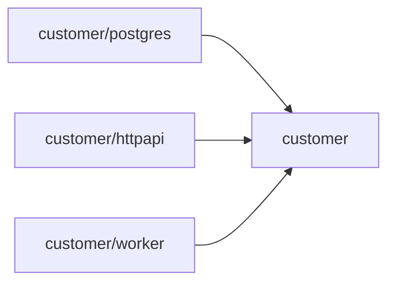
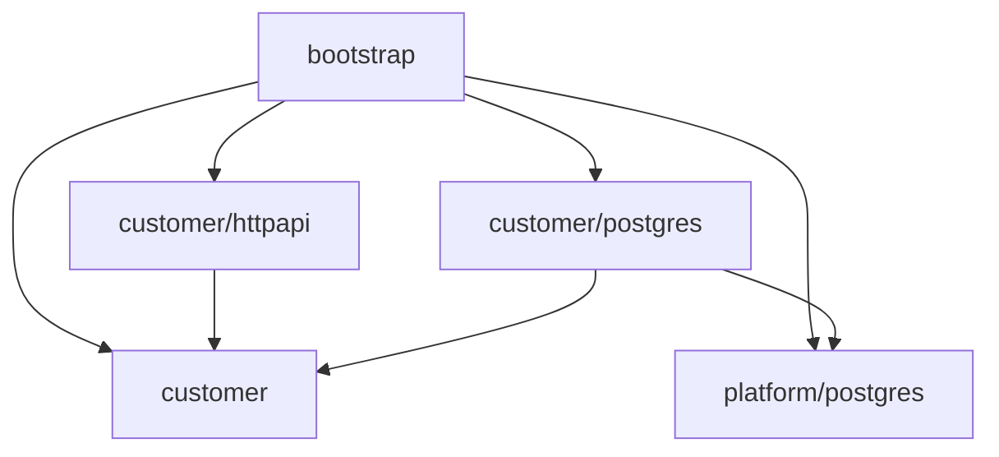
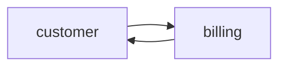
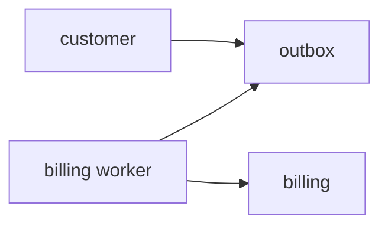
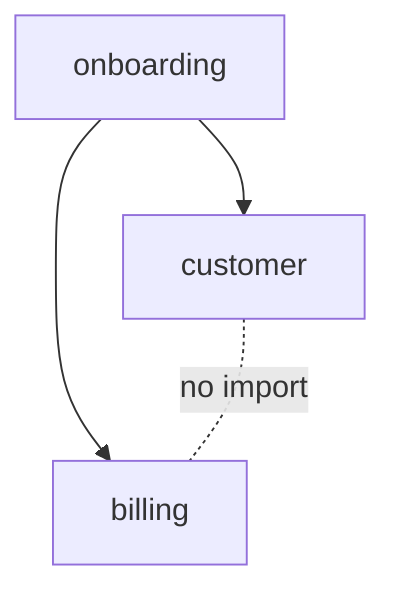
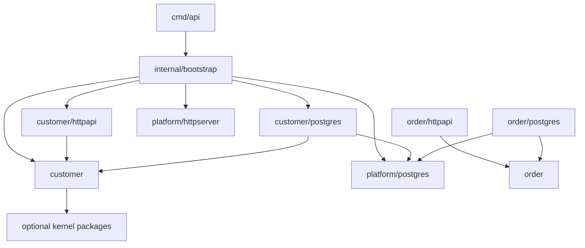
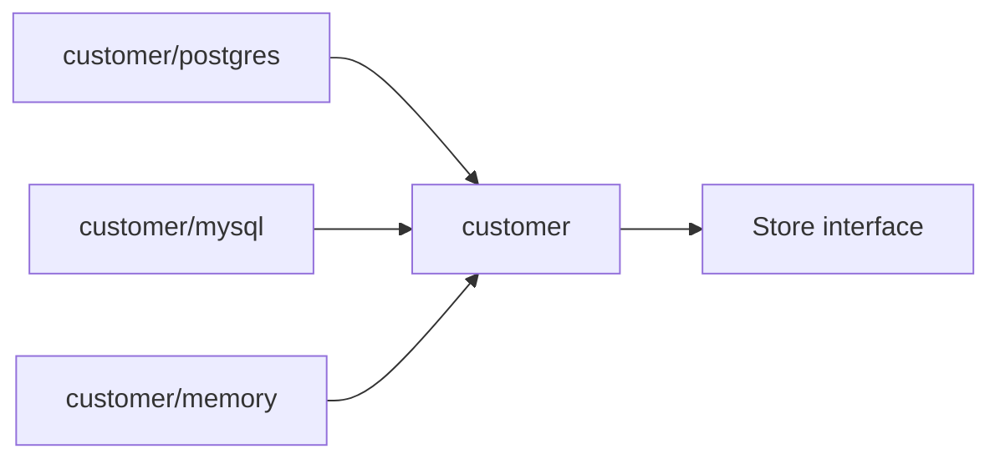
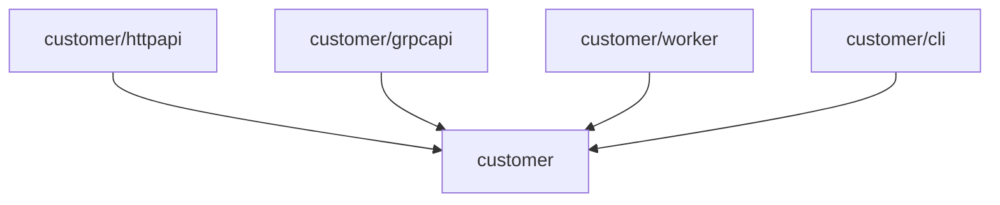
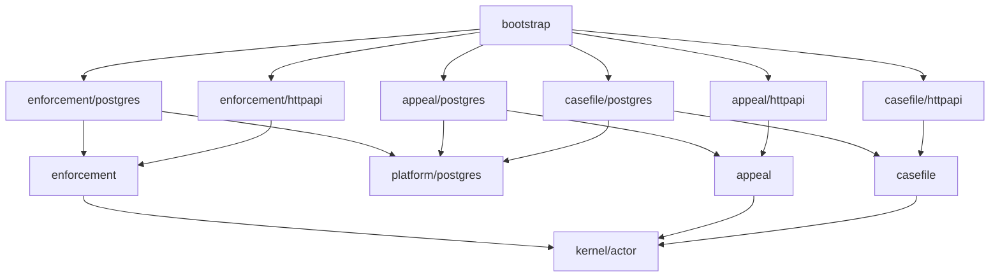

# learn-go-design-patterns-common-patterns-anti-patterns-part-003.md

# Part 003 — Package-Oriented Design Pattern

> Seri: **Go Design Patterns, Common Patterns, and Anti-Patterns**  
> Target pembaca: **Java software engineer yang ingin mendesain codebase Go production-grade**  
> Fokus part ini: **package sebagai unit desain utama Go**  
> Baseline: **Go 1.26.x**, dengan prinsip idiomatik yang tetap berakar pada Go 1 compatibility, Effective Go, Go Code Review Comments, Go module layout, Go package naming guidance, dan Google Go Style Guide.

---

## 0. Posisi Part Ini Dalam Seri

Pada part sebelumnya kita membahas bahwa desain Go yang baik sering dimulai dari **simplicity**, bukan dari abstraction hierarchy. Part ini melanjutkan fondasi itu ke unit desain yang paling penting dalam Go: **package**.

Bagi Java engineer, package sering dianggap sebagai folder namespace:

```text
com.company.project.user.service
com.company.project.user.repository
com.company.project.user.controller
com.company.project.user.dto
```

Dalam Go, package bukan sekadar folder namespace. Package adalah:

1. **unit kompilasi**,
2. **unit visibility**,
3. **unit API surface**,
4. **unit ownership**,
5. **unit testing**,
6. **unit dependency direction**,
7. **unit readability**,
8. **unit architectural pressure**.

Go tidak punya `public/private/protected` ala Java. Go tidak punya class-level package namespace panjang. Go tidak punya annotation-heavy framework yang menyembunyikan dependency graph. Karena itu, **package design di Go menjadi arsitektur yang benar-benar terlihat di source code**.

Kalau package design buruk, seluruh codebase akan cepat membusuk walaupun tiap function terlihat sederhana.

---

## 1. Tujuan Pembelajaran

Setelah menyelesaikan part ini, kamu harus mampu:

1. Mendesain package sebagai boundary perilaku, bukan sekadar folder kategori.
2. Membaca import graph sebagai indikator arsitektur.
3. Membedakan package yang cohesive vs package yang hanya menjadi dumping ground.
4. Menentukan kapan memakai root package, sub-package, dan `internal` package.
5. Menghindari package cycle tanpa memindahkan semua hal ke `common`.
6. Memilih package name yang idiomatis dan tidak redundant.
7. Menentukan API surface package secara sadar.
8. Menghindari anti-pattern seperti `utils`, `common`, `models`, `services`, `repositories`, dan layered package yang meniru Java secara mentah.
9. Mendesain package untuk service Go besar yang tetap mudah dites, diobservasi, dan direfaktor.

---

## 2. Core Mental Model

### 2.1 Package adalah “small product”

Anggap setiap package sebagai produk kecil.

Sebuah package yang baik punya:

- tujuan jelas,
- vocabulary jelas,
- public API minimal,
- internal implementation tersembunyi,
- dependency yang masuk akal,
- test yang mengunci contract,
- nama yang menjelaskan apa yang diberikan package tersebut.

Sebuah package yang buruk biasanya punya gejala:

- namanya generik,
- isinya campur aduk,
- banyak exported symbol tanpa alasan,
- dependency melebar,
- package lain terlalu banyak tahu detail internalnya,
- sulit dites tanpa membawa separuh aplikasi,
- menjadi tempat “numpang taruh” kode.

---

### 2.2 Package bukan layer otomatis

Di Java/Spring, lazim ada struktur:

```text
controller/
service/
repository/
dto/
entity/
config/
exception/
```

Struktur itu sering masuk akal dalam ekosistem Java karena banyak framework, annotation scanning, dependency injection container, ORM, dan convention-nya memang mengarah ke sana.

Di Go, struktur seperti itu sering menghasilkan package yang tidak cohesive:

```text
internal/controller
internal/service
internal/repository
internal/model
internal/dto
```

Masalahnya:

- semua controller dari semua fitur bercampur,
- semua service dari semua domain bercampur,
- semua repository dari semua aggregate bercampur,
- package `model` menjadi tempat semua type,
- dependency antar fitur menjadi kabur,
- perubahan satu fitur sering menyentuh package global.

Dalam Go, sering lebih baik mendesain package berdasarkan **capability/domain/feature boundary**, bukan berdasarkan stereotype layer.

Contoh lebih sehat:

```text
internal/customer
internal/customer/httpapi
internal/customer/postgres
internal/customer/worker
internal/billing
internal/billing/httpapi
internal/billing/postgres
internal/billing/outbox
```

Atau untuk sistem kecil:

```text
internal/customer
internal/billing
internal/platform/postgres
internal/platform/httpserver
```

Yang penting bukan nama foldernya, tetapi **arah dependency dan ownership-nya jelas**.

---

### 2.3 Import graph adalah arsitektur nyata

Diagram arsitektur bisa indah, tetapi di Go, arsitektur yang benar-benar berjalan adalah **import graph**.

Kalau package `domain` mengimpor `postgres`, berarti domain bergantung pada database adapter.

Kalau package `billing` mengimpor `customer`, berarti billing mengetahui customer secara langsung.

Kalau `internal/common` diimpor semua package, maka `common` menjadi shared kernel tanpa governance.

Kalau `internal/service` mengimpor `internal/repository`, lalu `internal/repository` mengimpor `internal/service`, compiler akan menolak karena import cycle. Ini bukan kelemahan Go. Ini alarm desain.

Go sengaja membuat dependency cycle sebagai error kompilasi agar dependency graph tetap acyclic.

---

## 3. Package Dalam Go: Fakta Dasar yang Penting Untuk Desain

### 3.1 Satu directory biasanya satu package

Dalam Go, file-file `.go` dalam satu directory biasanya memiliki deklarasi package yang sama:

```go
package customer
```

Artinya, directory bukan hanya folder organisasi; directory adalah package boundary.

Konsekuensi desain:

- semua file dalam package bisa mengakses unexported symbol satu sama lain,
- exported symbol menjadi API untuk package lain,
- test bisa berada dalam package yang sama atau external test package,
- dependency package adalah dependency semua file di package itu.

---

### 3.2 Exported vs unexported ditentukan oleh kapitalisasi

```go
type Customer struct {}

type customerRecord struct {}
```

`Customer` exported. `customerRecord` unexported.

Ini berbeda dari Java:

```java
public class Customer {}
class CustomerRecord {}
private class Something {} // not top-level in normal Java style
```

Di Go, visibility utama berada pada **package boundary**, bukan class boundary.

Karena itu, package yang terlalu besar membuat terlalu banyak hal saling terlihat. Package yang terlalu kecil membuat dependency graph terlalu berisik.

Desain package adalah seni memilih ukuran boundary.

---

### 3.3 Nama package adalah bagian dari call site

Di Go, nama package muncul di code pengguna:

```go
customer.NewService(...)
postgres.NewCustomerStore(...)
authz.Authorize(...)
```

Karena itu nama package harus dipilih berdasarkan bagaimana ia dibaca di call site.

Buruk:

```go
utils.ParseCustomerID(s)
common.ValidateEmail(email)
service.NewCustomerService(...)
models.Customer{}
```

Lebih baik:

```go
customer.ParseID(s)
email.Parse(addr)
customer.NewService(...)
customer.Customer{}
```

Package name memberi konteks. Type/function di dalam package tidak perlu mengulang nama package secara berlebihan.

Buruk:

```go
customer.CustomerService
customer.CustomerRepository
customer.CustomerValidator
```

Kadang boleh, tetapi sering redundant.

Lebih baik bila konteks sudah jelas:

```go
customer.Service
customer.Store
customer.Validator
```

Namun jangan dogmatis. Kalau `customer.Service` terlalu generik di call site tertentu, nama yang lebih spesifik bisa dipakai:

```go
customer.RegistrationService
customer.RiskEvaluator
customer.ProfileStore
```

Prinsipnya: **nama dibaca bersama package qualifier**.

---

### 3.4 Package comment adalah contract pembuka

Untuk package publik atau package penting, berikan package comment.

Contoh:

```go
// Package customer implements customer lifecycle use cases.
//
// The package owns customer registration, profile update, suspension,
// reactivation, and lifecycle transition rules. It does not own HTTP
// transport, database schema details, or external identity provider clients.
package customer
```

Package comment bukan formalitas. Ia menjawab:

- package ini mengerjakan apa,
- package ini tidak mengerjakan apa,
- konsep utama apa yang dimiliki package ini,
- dependency boundary-nya bagaimana.

Untuk package besar, package comment bisa menjadi mini architecture decision record.

---

## 4. Java Package Mindset vs Go Package Mindset

### 4.1 Java package sering namespace; Go package sering boundary

Java:

```text
com.company.app.customer.service.CustomerService
com.company.app.customer.repository.CustomerRepository
com.company.app.customer.dto.CustomerRequest
```

Package terutama menghindari collision dan membantu framework scanning.

Go:

```text
internal/customer
internal/customer/postgres
internal/customer/httpapi
```

Package menentukan:

- siapa bisa melihat symbol,
- siapa boleh mengimpor siapa,
- contract apa yang stabil,
- bagaimana test ditulis,
- bagaimana dependency dikelola.

---

### 4.2 Java layer package sering horizontal; Go package sering vertical/cohesive

Horizontal layer:

```text
controller/customer_controller.go
controller/order_controller.go
controller/payment_controller.go
service/customer_service.go
service/order_service.go
service/payment_service.go
repository/customer_repository.go
repository/order_repository.go
repository/payment_repository.go
```

Masalah:

- satu fitur tersebar di banyak package,
- package tidak punya domain cohesion,
- import antar layer menjadi generic,
- perubahan fitur menyentuh banyak tempat,
- boundary antar fitur kabur.

Vertical/cohesive package:

```text
customer/
  service.go
  command.go
  decision.go
  transition.go
  errors.go
  httpapi/
    handler.go
  postgres/
    store.go

payment/
  service.go
  command.go
  decision.go
  outbox.go
  httpapi/
    handler.go
  postgres/
    store.go
```

Kelebihan:

- fitur lebih mudah dipahami,
- ownership lebih jelas,
- dependency lebih terkontrol,
- refactoring lebih lokal,
- test bisa fokus pada package boundary.

---

### 4.3 Java “model package” sering menjadi masalah di Go

Java sering punya:

```text
model/
  Customer.java
  Order.java
  Payment.java
  Address.java
```

Di Go, package `model` sering menjadi anti-pattern karena:

- semua domain type bercampur,
- semua package mengimpor `model`,
- business rule tersebar ke luar model,
- package `model` tidak punya behavior ownership,
- data type menjadi global schema, bukan domain boundary.

Lebih baik:

```text
customer/
  customer.go
  address.go
  lifecycle.go

order/
  order.go
  line.go
  pricing.go

payment/
  payment.go
  settlement.go
```

Type hidup di dekat behavior yang menggunakannya.

---

### 4.4 Java “service package” sering menjadi god layer di Go

Struktur ini terlihat rapi:

```text
service/
  customer_service.go
  order_service.go
  payment_service.go
  notification_service.go
```

Tapi package `service` tidak menjawab domain apa yang dimiliki. Ia hanya menjawab stereotype teknis.

Akibatnya:

- semua service bisa melihat unexported symbol satu sama lain bila satu package,
- package terlalu besar,
- dependency semua service tercampur,
- test menjadi berat,
- boundary ownership hilang.

Lebih baik:

```text
customer/service.go
order/service.go
payment/service.go
notification/service.go
```

Atau bila ingin kata `service` tetap muncul, jadikan ia type, bukan package global:

```go
package customer

type Service struct {
    store Store
    clock Clock
}
```

---

## 5. Taxonomy Package Dalam Codebase Go Production

Tidak ada satu layout universal. Tetapi package dalam codebase Go besar biasanya masuk kategori berikut.

---

### 5.1 Command package

Biasanya berada di `cmd/<binary-name>`.

Contoh:

```text
cmd/api/main.go
cmd/worker/main.go
cmd/migrate/main.go
```

Tugas:

- parse flags/env minimal,
- load config,
- wire dependency graph,
- start process,
- handle shutdown.

Bukan tempat:

- business logic,
- SQL detail,
- HTTP handler detail,
- domain rule.

Contoh sehat:

```go
package main

func main() {
    ctx := signalContext()

    cfg := config.MustLoad()
    app, cleanup, err := bootstrap.NewAPI(cfg)
    if err != nil {
        log.Fatal(err)
    }
    defer cleanup()

    if err := app.Run(ctx); err != nil {
        log.Fatal(err)
    }
}
```

`main` adalah composition root, bukan application layer.

---

### 5.2 Domain/capability package

Contoh:

```text
internal/customer
internal/casefile
internal/licensing
internal/appeal
internal/compliance
```

Tugas:

- menyimpan vocabulary domain,
- mendefinisikan command/use case,
- memegang invariant,
- mendefinisikan consumer-owned interface untuk dependency yang dibutuhkan,
- menghasilkan decision/result/error domain.

Contoh:

```go
package licensing

type Store interface {
    FindApplication(ctx context.Context, id ApplicationID) (Application, error)
    SaveApplication(ctx context.Context, app Application) error
}

type Service struct {
    store Store
    clock Clock
}

func (s *Service) Approve(ctx context.Context, cmd ApproveCommand) (Decision, error) {
    // domain/application orchestration
}
```

Package ini boleh tahu abstraction dependency, tetapi tidak harus tahu implementasi database.

---

### 5.3 Adapter package

Contoh:

```text
internal/licensing/postgres
internal/licensing/httpapi
internal/licensing/kafka
internal/licensing/s3docs
```

Tugas:

- menerjemahkan external representation ke internal command/type,
- menerjemahkan internal result/error ke external response,
- mengimplementasikan interface yang dibutuhkan domain/application package,
- menyimpan detail vendor/protocol.

Contoh:

```go
package postgres

type Store struct {
    db *sql.DB
}

func (s *Store) FindApplication(ctx context.Context, id licensing.ApplicationID) (licensing.Application, error) {
    // SQL detail lives here
}
```

Adapter boleh mengimpor domain package. Domain package tidak mengimpor adapter.

---

### 5.4 Platform package

Contoh:

```text
internal/platform/postgres
internal/platform/httpserver
internal/platform/redis
internal/platform/otel
internal/platform/clock
```

Tugas:

- menyediakan reusable technical building blocks,
- tidak tahu domain spesifik,
- tidak menjadi dumping ground,
- punya API kecil dan jelas.

Contoh:

```go
package postgres

func Open(ctx context.Context, cfg Config) (*sql.DB, error) {
    // connection setup, ping, pool tuning
}
```

Platform package berbahaya bila berubah menjadi `common` dengan nama lebih keren. Jaga agar isinya benar-benar cross-domain dan stabil.

---

### 5.5 Shared kernel package

Kadang ada konsep yang memang shared lintas domain.

Contoh:

```text
internal/kernel/tenant
internal/kernel/money
internal/kernel/identity
internal/kernel/audit
```

Namun shared kernel harus dikelola ketat.

Syarat shared kernel sehat:

- konsepnya benar-benar universal dalam sistem,
- vocabulary-nya stabil,
- dependency-nya sangat kecil,
- tidak mengimpor domain spesifik,
- ownership jelas,
- perubahan harus dianggap berdampak luas.

Contoh buruk:

```text
internal/common
  customer.go
  payment.go
  validation.go
  string.go
  retry.go
  audit.go
  http.go
```

Contoh lebih baik:

```text
internal/kernel/tenant
internal/kernel/money
internal/platform/retry
internal/platform/httpclient
```

---

### 5.6 Test support package

Contoh:

```text
internal/testsupport
internal/customer/customertest
internal/platform/postgrestest
```

Tugas:

- fixture builder,
- fake implementation,
- test container helper,
- golden file loader,
- assertion helper.

Hati-hati: test support package bisa menjadi `utils` versi test.

Lebih baik membuat test helper dekat package yang membutuhkan.

Contoh:

```text
internal/customer/customertest
```

Daripada:

```text
testutils
```

---

## 6. Package Cohesion

Package yang baik punya cohesion. Cohesion berarti isi package berubah untuk alasan yang sama.

---

### 6.1 Cohesion by behavior

Package cohesive bila file-file di dalamnya mendukung behavior yang sama.

Contoh:

```text
internal/appeal
  appeal.go
  command.go
  decision.go
  transition.go
  store.go
  errors.go
```

Semua berhubungan dengan lifecycle appeal.

---

### 6.2 Cohesion by protocol adapter

```text
internal/appeal/httpapi
  handler.go
  request.go
  response.go
  errors.go
  routes.go
```

Semua berhubungan dengan HTTP representation untuk appeal.

---

### 6.3 Cohesion by infrastructure capability

```text
internal/platform/postgres
  config.go
  open.go
  transaction.go
  health.go
```

Semua berhubungan dengan PostgreSQL platform capability.

---

### 6.4 Low cohesion symptoms

Package kemungkinan tidak cohesive bila:

- namanya terlalu generik,
- file di dalamnya tidak saling berkaitan,
- banyak function tidak memakai type utama package,
- package punya terlalu banyak alasan untuk berubah,
- dependency list sangat panjang,
- package sulit dijelaskan dalam satu kalimat,
- package comment harus menggunakan kata “various”, “common”, “shared”, “misc”, atau “helper”.

Contoh:

```go
// Package common contains shared utilities used by the application.
package common
```

Ini bukan contract. Ini pengakuan bahwa boundary belum ditemukan.

---

## 7. Package API Surface

Package API surface adalah semua exported symbol:

- exported types,
- exported functions,
- exported variables,
- exported constants,
- exported methods,
- exported fields.

Semakin besar API surface, semakin sulit package berubah.

---

### 7.1 Public API harus sengaja

Buruk:

```go
package customer

type Customer struct {
    ID        string
    Status    string
    CreatedAt time.Time
    UpdatedAt time.Time
}

func ValidateCustomer(c Customer) error { ... }
func NormalizeCustomer(c *Customer) { ... }
func BuildCustomerFromDBRow(...) Customer { ... }
func ConvertCustomerToHTTPResponse(...) Response { ... }
```

Masalah:

- semua field exposed,
- semua operation exposed,
- DB dan HTTP concern bocor ke package domain,
- tidak jelas contract stabilnya apa.

Lebih baik:

```go
package customer

type ID string

type Status string

const (
    StatusPending  Status = "pending"
    StatusActive   Status = "active"
    StatusSuspended Status = "suspended"
)

type Customer struct {
    id        ID
    status    Status
    createdAt time.Time
    updatedAt time.Time
}

func Register(cmd RegisterCommand, now time.Time) (Customer, Decision, error) {
    // invariant lives here
}

func (c Customer) ID() ID { return c.id }
func (c Customer) Status() Status { return c.status }
```

Ini lebih ketat. Namun jangan selalu membuat semua field private secara dogmatis. Untuk DTO transport sederhana, exported field bisa normal karena encoding/json membutuhkannya.

Kuncinya adalah ownership:

- domain object: jaga invariant,
- DTO: representasi data,
- config struct: boleh exported field,
- database row struct: biasanya adapter-private.

---

### 7.2 Exported variable hampir selalu dicurigai

Buruk:

```go
package config

var Current Config
```

Masalah:

- global mutable state,
- test interference,
- concurrency risk,
- hidden dependency.

Lebih baik:

```go
func Load() (Config, error)
```

Lalu dependency disuntikkan lewat constructor.

---

### 7.3 Exported interface harus punya alasan kuat

Buruk:

```go
package customer

type CustomerService interface {
    Register(ctx context.Context, req RegisterRequest) error
    Update(ctx context.Context, req UpdateRequest) error
    Delete(ctx context.Context, id string) error
    Search(ctx context.Context, q Query) ([]Customer, error)
}
```

Kalau package ini juga menyediakan implementasi utama, interface ini mungkin hanya ceremony.

Lebih baik:

```go
package customer

type Service struct {
    store Store
}
```

Interface dibuat di sisi consumer saat benar-benar dibutuhkan.

---

### 7.4 Exported error dan constant adalah bagian contract

```go
var ErrNotFound = errors.New("customer not found")
```

Begitu exported, package lain mungkin melakukan:

```go
errors.Is(err, customer.ErrNotFound)
```

Artinya kamu berkomitmen pada semantic error itu.

Kalau error hanya implementation detail, jangan exported.

---

## 8. Package Naming Pattern

Nama package adalah desain API.

---

### 8.1 Nama package harus pendek, lowercase, tidak memakai underscore

Idiomatic:

```text
customer
billing
authz
httpapi
postgres
redis
outbox
workflow
```

Tidak idiomatic:

```text
customer_service
CustomerService
customerService
customer_services
```

---

### 8.2 Hindari nama yang hanya kategori kosong

Buruk:

```text
common
utils
helpers
shared
base
core
lib
misc
```

Kenapa buruk?

Karena nama itu tidak menjelaskan responsibility.

Daripada:

```go
common.ParseEmail(s)
utils.Retry(ctx, fn)
helpers.NowUTC()
```

Lebih baik:

```go
email.Parse(s)
retry.Do(ctx, policy, fn)
clock.NowUTC()
```

Nama package harus menjawab “apa capability yang disediakan?”

---

### 8.3 `core` juga sering bermasalah

Banyak codebase membuat:

```text
internal/core
```

Kadang valid, tetapi sering berarti “kami belum tahu boundary domain-nya”.

Masalah `core`:

- terlalu abstrak,
- menjadi magnet untuk semua hal penting,
- sering diimpor semua package,
- sulit dipisah saat sistem tumbuh.

Lebih baik gunakan nama domain/capability nyata:

```text
internal/licensing
internal/casefile
internal/compliance
internal/audit
```

Kalau memang ada kernel bersama, namai berdasarkan konsep:

```text
internal/kernel/tenant
internal/kernel/money
```

---

### 8.4 Nama package tidak perlu mengulang parent path

Kalau path:

```text
internal/customer/store
```

Package name tidak harus `customerstore`.

Namun call site harus tetap jelas:

```go
store.New(...)
```

Ini bisa terlalu generik jika banyak `store` package di file yang sama.

Alternatif:

```text
internal/customer/postgres
```

Call site:

```go
customerstore := postgres.NewStore(db)
```

Atau rename import bila collision benar-benar terjadi:

```go
customerpg "myapp/internal/customer/postgres"
orderpg "myapp/internal/order/postgres"
```

Namun jika banyak rename import diperlukan, itu tanda naming/path perlu dievaluasi.

---

## 9. `internal` Package Pattern

Go memiliki mekanisme khusus `internal` package.

Jika path package mengandung directory bernama `internal`, package tersebut hanya bisa diimpor oleh code yang berada di subtree parent dari `internal` tersebut.

Contoh:

```text
myapp/
  go.mod
  internal/
    customer/
    billing/
  cmd/
    api/
```

Package di dalam `myapp/internal/...` tidak bisa diimpor oleh module lain.

Ini sangat berguna untuk aplikasi/service.

---

### 9.1 Kapan memakai `internal`

Gunakan `internal` untuk:

- implementation package aplikasi,
- domain package service yang tidak dimaksudkan sebagai library publik,
- adapter database,
- transport handler,
- bootstrap wiring,
- platform internal.

Contoh:

```text
cmd/api
internal/bootstrap
internal/customer
internal/customer/httpapi
internal/customer/postgres
internal/platform/postgres
```

---

### 9.2 Kapan tidak memakai `internal`

Jangan memakai `internal` untuk package yang memang library publik reusable.

Contoh library publik:

```text
module github.com/acme/retry

retry.go
policy.go
```

Jika package dimaksudkan untuk digunakan module lain, jangan sembunyikan di `internal`.

---

### 9.3 Multiple internal boundary

Kamu bisa punya beberapa `internal` dengan scope berbeda.

Contoh:

```text
repo/
  service-a/
    internal/
      customer/
  service-b/
    internal/
      billing/
  shared/
    money/
```

Atau:

```text
internal/platform/postgres/internal/migrationhelper
```

Namun jangan terlalu kompleks. Terlalu banyak nested `internal` bisa membuat struktur sulit dibaca.

---

## 10. Import Direction Pattern

Import direction adalah aturan arsitektur yang paling konkret di Go.

---

### 10.1 Domain should not import adapter

Buruk:

```go
package customer

import "myapp/internal/customer/postgres"
```

Ini membuat domain bergantung pada PostgreSQL.

Lebih baik:

```go
package customer

type Store interface {
    Find(ctx context.Context, id ID) (Customer, error)
    Save(ctx context.Context, c Customer) error
}
```

Adapter:

```go
package postgres

import "myapp/internal/customer"

type Store struct { db *sql.DB }

func (s *Store) Find(ctx context.Context, id customer.ID) (customer.Customer, error) {
    // SQL implementation
}
```

Import direction:



Application/domain package tidak tahu implementasi luar.

---

### 10.2 Transport should import application/domain, not the reverse

Buruk:

```go
package customer

import "net/http"

func (s *Service) ServeHTTP(w http.ResponseWriter, r *http.Request) { ... }
```

Domain/service sekarang menjadi HTTP adapter.

Lebih baik:

```go
package httpapi

import "myapp/internal/customer"

type Handler struct {
    service *customer.Service
}
```

---

### 10.3 Platform package should not import domain package

Buruk:

```go
package postgres

import "myapp/internal/customer"

func OpenCustomerStore(...) *customer.Store { ... }
```

Package platform PostgreSQL seharusnya technical generic.

Lebih baik:

```go
package postgres

func Open(ctx context.Context, cfg Config) (*sql.DB, error) { ... }
```

Domain-specific PostgreSQL adapter hidup di:

```text
internal/customer/postgres
```

---

### 10.4 Bootstrap imports everything

Composition root boleh mengimpor banyak package karena tugasnya memang wiring.

```go
package bootstrap

import (
    "myapp/internal/customer"
    customerhttp "myapp/internal/customer/httpapi"
    customerpg "myapp/internal/customer/postgres"
    "myapp/internal/platform/postgres"
)
```

Bootstrap berada di pinggir graph.



Bootstrap yang import banyak package tidak selalu buruk. Yang buruk adalah business package import banyak hal yang tidak seharusnya.

---

## 11. Package Cycle: Alarm Desain

Go melarang import cycle.

Contoh cycle:



Atau:

```text
customer imports billing
billing imports customer
```

Compiler akan menolak.

Ini bukan sekadar masalah teknis. Ini pertanyaan desain:

> Siapa sebenarnya pemilik konsep yang dipakai bersama?

---

### 11.1 Penyebab umum cycle

1. Dua domain saling memanggil service.
2. Shared type diletakkan di salah satu package domain.
3. Interface diletakkan di provider, bukan consumer.
4. DTO global diletakkan di package yang bergantung balik ke user-nya.
5. Layer horizontal saling tahu terlalu banyak.
6. Event/command diletakkan di package yang salah.

---

### 11.2 Cara memutus cycle: pindahkan interface ke consumer

Buruk:

```go
package billing

type CustomerService interface {
    GetCustomer(ctx context.Context, id string) (Customer, error)
}
```

Jika `customer` juga import `billing`, cycle terjadi.

Lebih baik, jika `billing` butuh membaca customer, `billing` mendefinisikan kebutuhan minimalnya sendiri:

```go
package billing

type CustomerReader interface {
    FindCustomerForBilling(ctx context.Context, id CustomerID) (CustomerSnapshot, error)
}
```

Lalu package `customer` atau adapter lain mengimplementasikan.

---

### 11.3 Cara memutus cycle: shared value object

Jika `CustomerID` dipakai banyak package, jangan otomatis taruh semua di `customer` bila menyebabkan semua package bergantung ke `customer`.

Opsi:

```text
internal/kernel/identity
```

```go
package identity

type CustomerID string
```

Namun jangan terlalu cepat membuat shared kernel. Pastikan konsep itu benar-benar stabil.

---

### 11.4 Cara memutus cycle: event boundary

Daripada `customer` langsung memanggil `billing`, gunakan event/outbox bila hubungan bersifat asynchronous.



Customer tidak perlu import billing.

---

### 11.5 Cara memutus cycle: orchestration package

Jika dua capability perlu dikoordinasikan synchronous, buat package orchestration/use case yang mengimpor keduanya.

```text
internal/onboarding
```



Ini membuat dependency direction jelas:

- `customer` tetap fokus customer,
- `billing` tetap fokus billing,
- `onboarding` memiliki orchestration lintas capability.

---

## 12. Layout Pattern Untuk Service Go

Tidak ada layout universal. Berikut beberapa pola yang sering sehat.

---

### 12.1 Small service layout

Cocok untuk service kecil sampai sedang.

```text
myapp/
  go.mod
  cmd/
    api/
      main.go
  internal/
    config/
      config.go
    bootstrap/
      api.go
    customer/
      service.go
      command.go
      decision.go
      store.go
      errors.go
      httpapi/
        handler.go
        request.go
        response.go
      postgres/
        store.go
    platform/
      postgres/
        open.go
      httpserver/
        server.go
```

Kelebihan:

- mudah dipahami,
- package domain jelas,
- adapter dekat domain,
- platform reusable tapi terbatas.

Kekurangan:

- bila domain banyak, tree bisa panjang,
- perlu disiplin agar platform tidak jadi common.

---

### 12.2 Vertical slice layout

Cocok untuk aplikasi business besar dengan banyak feature.

```text
internal/
  licensing/
    application.go
    commands.go
    decisions.go
    state.go
    ports.go
    httpapi/
    postgres/
    worker/
  appeal/
    application.go
    commands.go
    decisions.go
    state.go
    ports.go
    httpapi/
    postgres/
  compliance/
    application.go
    commands.go
    decisions.go
    rules.go
    ports.go
    httpapi/
    postgres/
```

Kelebihan:

- ownership fitur kuat,
- perubahan lokal,
- mudah untuk team ownership,
- cocok untuk domain kompleks.

Kekurangan:

- potensi duplikasi adapter pattern,
- perlu shared platform yang rapi,
- lintas-feature use case harus didesain hati-hati.

---

### 12.3 Layered layout terbatas

Kadang layout layer masih cocok untuk service sederhana.

```text
internal/
  httpapi/
  app/
  postgres/
```

Ini bisa sehat jika domain kecil dan coupling antar konsep rendah.

Namun untuk sistem besar, package horizontal seperti ini sering tumbuh menjadi bottleneck.

---

### 12.4 Library module layout

Untuk library, root package biasanya adalah package utama.

```text
retry/
  go.mod
  retry.go
  policy.go
  backoff.go
  jitter.go
  internal/
    clock/
```

Public API harus sangat hati-hati karena digunakan module lain.

---

### 12.5 Monorepo multi-service layout

```text
repo/
  services/
    licensing/
      go.mod
      cmd/api/main.go
      internal/...
    notification/
      go.mod
      cmd/worker/main.go
      internal/...
  libraries/
    retry/
      go.mod
    money/
      go.mod
```

Atau single module:

```text
repo/
  go.mod
  cmd/licensing-api
  cmd/notification-worker
  internal/licensing
  internal/notification
  internal/platform
```

Trade-off:

- single module lebih mudah untuk refactor internal,
- multi-module lebih jelas dependency/version boundary,
- multi-module lebih mahal koordinasinya.

Jangan pilih multi-module hanya karena terlihat enterprise. Pilih karena ada kebutuhan versioning, ownership, release cadence, atau dependency isolation.

---

## 13. Designing Package Boundary Step by Step

Gunakan proses berikut saat membuat package baru.

---

### Step 1 — Tulis kalimat ownership

Sebelum membuat folder, tulis:

> Package ini memiliki responsibility untuk ...

Contoh baik:

> Package `appeal` owns appeal lifecycle commands, transition rules, and decision records.

Contoh buruk:

> Package `common` contains shared code used everywhere.

Jika tidak bisa menulis kalimat ownership yang jelas, package belum layak dibuat.

---

### Step 2 — Tentukan vocabulary utama

Contoh package `appeal`:

- Appeal
- AppealID
- Status
- SubmitCommand
- ApproveCommand
- RejectCommand
- Decision
- Store
- Service

Jika vocabulary terlalu banyak dan tidak cohesive, mungkin package perlu dipecah.

---

### Step 3 — Tentukan dependency yang dibutuhkan

Jangan mulai dari implementasi. Mulai dari kebutuhan.

```go
type Store interface {
    Find(ctx context.Context, id ID) (Appeal, error)
    Save(ctx context.Context, appeal Appeal) error
}

type Clock interface {
    Now() time.Time
}
```

Interface kecil ini tinggal di package consumer.

---

### Step 4 — Tentukan exported API minimum

Pertanyaan:

- type mana yang harus dipakai package lain?
- function mana yang menjadi entry point?
- error mana yang harus bisa dikenali caller?
- field mana yang harus dibaca langsung?
- apakah constructor perlu exported?

Mulai dari minimum.

---

### Step 5 — Tentukan adapter package

Jika butuh HTTP:

```text
appeal/httpapi
```

Jika butuh PostgreSQL:

```text
appeal/postgres
```

Jika butuh Kafka:

```text
appeal/kafka
```

Adapter mengimpor package core:

```go
import "myapp/internal/appeal"
```

Bukan sebaliknya.

---

### Step 6 — Tentukan test boundary

Test apa yang harus ada?

- unit test package core,
- adapter test dengan fake DB/server,
- external test package untuk API behavior,
- contract test untuk interface penting.

---

### Step 7 — Review import graph

Jalankan mental check:

- Apakah domain import adapter?
- Apakah platform import domain?
- Apakah package terlalu banyak import?
- Apakah ada package yang diimpor semua orang?
- Apakah `common` mulai muncul?

---

## 14. Example: Bad Java-Style Layout to Go-Oriented Layout

### 14.1 Layout awal yang bermasalah

```text
internal/
  controller/
    customer_controller.go
    order_controller.go
    payment_controller.go
  service/
    customer_service.go
    order_service.go
    payment_service.go
  repository/
    customer_repository.go
    order_repository.go
    payment_repository.go
  model/
    customer.go
    order.go
    payment.go
  dto/
    customer_request.go
    order_request.go
    payment_request.go
  common/
    errors.go
    validation.go
    date.go
    string.go
```

Masalah:

1. Package `service` terlalu besar.
2. Package `model` menjadi global schema.
3. Package `dto` menjadi tempat semua transport shape.
4. Package `common` tidak punya ownership.
5. Feature ownership tersebar.
6. Import graph tidak mencerminkan domain boundary.
7. Satu perubahan customer menyentuh `controller`, `service`, `repository`, `model`, `dto`, `common`.

---

### 14.2 Layout hasil refactor

```text
internal/
  customer/
    customer.go
    command.go
    decision.go
    service.go
    store.go
    errors.go
    httpapi/
      handler.go
      request.go
      response.go
    postgres/
      store.go
  order/
    order.go
    command.go
    decision.go
    service.go
    store.go
    httpapi/
      handler.go
    postgres/
      store.go
  payment/
    payment.go
    command.go
    decision.go
    service.go
    store.go
    outbox.go
    httpapi/
      handler.go
    postgres/
      store.go
  platform/
    postgres/
      open.go
      tx.go
    httpserver/
      server.go
    validation/
      email.go
```

Kelebihan:

1. Customer behavior dekat customer data.
2. HTTP DTO dekat HTTP handler.
3. SQL row detail dekat PostgreSQL adapter.
4. Shared technical code masuk platform package spesifik.
5. Import direction lebih jelas.
6. Testing lebih lokal.
7. Ownership per feature lebih mudah.

---

### 14.3 Import graph target



Rule utama:

- adapter mengimpor core,
- core tidak mengimpor adapter,
- bootstrap boleh mengimpor banyak,
- platform tidak mengimpor domain,
- shared kernel dijaga minimal.

---

## 15. The `common`, `utils`, and `helpers` Anti-Pattern

### 15.1 Kenapa `common` muncul?

Biasanya karena:

- developer ingin menghindari duplikasi,
- belum jelas owner dari sebuah helper,
- package cycle ingin diputus cepat,
- ada logic yang dipakai banyak tempat,
- deadline pendek,
- reviewer hanya melihat “reuse”, bukan boundary.

---

### 15.2 Masalah `common`

`common` membuat code tampak rapi pada awalnya, tetapi dalam jangka panjang:

1. Menjadi magnet semua hal.
2. Tidak punya cohesion.
3. Sulit dites secara bermakna.
4. Membuat dependency global.
5. Mengaburkan ownership.
6. Membuat breaking change berdampak luas.
7. Sering menyembunyikan domain concept yang harusnya punya package sendiri.

---

### 15.3 Cara membongkar `common`

Misalnya ada:

```text
common/
  email.go
  retry.go
  money.go
  tenant.go
  customer.go
  date.go
  string.go
  errors.go
```

Refactor:

```text
email/
  email.go
platform/retry/
  retry.go
kernel/money/
  money.go
kernel/tenant/
  tenant.go
customer/
  customer.go
clock/
  clock.go
```

Atau bila helper terlalu kecil dan hanya dipakai satu package, pindahkan ke package tersebut sebagai unexported function.

---

### 15.4 Rule of thumb

Sebelum membuat `common`, tanyakan:

1. Apakah konsep ini punya nama domain/technical yang lebih spesifik?
2. Apakah semua pengguna benar-benar butuh semantic yang sama?
3. Apakah package ini akan tetap cohesive setelah 6 bulan?
4. Apakah ini hanya cara cepat menghindari import cycle?
5. Apakah duplikasi kecil lebih murah daripada shared abstraction?

Jika ragu, jangan buat `common`.

---

## 16. The `models` Anti-Pattern

### 16.1 Gejala

```text
models/
  customer.go
  order.go
  payment.go
  invoice.go
  audit.go
```

Semua package mengimpor `models`.

```go
func (s *CustomerService) Register(ctx context.Context, req models.CustomerRequest) (*models.Customer, error)
```

Masalah:

- model menjadi global dependency,
- behavior terpisah dari data,
- domain invariant sulit dikontrol,
- transport/database/domain shape bercampur,
- type menjadi terlalu umum.

---

### 16.2 Pecah berdasarkan ownership

```text
customer/
  customer.go
  command.go
  decision.go

customer/httpapi/
  request.go
  response.go

customer/postgres/
  row.go
```

Contoh:

```go
package httpapi

type registerRequest struct {
    Name  string `json:"name"`
    Email string `json:"email"`
}

func (r registerRequest) command() (customer.RegisterCommand, error) {
    return customer.RegisterCommand{
        Name:  r.Name,
        Email: r.Email,
    }, nil
}
```

DTO transport tidak perlu menjadi model global.

---

## 17. The `services` Anti-Pattern

### 17.1 Gejala

```text
services/
  user_service.go
  notification_service.go
  billing_service.go
  audit_service.go
```

Package ini sering menjadi god package.

Semua service bisa mengakses unexported helper satu sama lain. Dependency package gabungan menjadi besar. Unit test untuk satu service membawa dependency service lain.

---

### 17.2 Refactor

Dari:

```go
package services

type CustomerService struct { ... }
type BillingService struct { ... }
```

Ke:

```go
package customer

type Service struct { ... }
```

```go
package billing

type Service struct { ... }
```

Kalau perlu orchestration lintas service:

```go
package onboarding

type Service struct {
    customers CustomerRegistrar
    billing   BillingAccountCreator
}
```

---

## 18. The `repositories` Anti-Pattern

### 18.1 Gejala

```text
repositories/
  customer_repository.go
  order_repository.go
  payment_repository.go
```

Package repository global membuat persistence semua domain bercampur.

Lebih buruk lagi kalau repository package juga memegang transaction, SQL helper, domain conversion, dan query semua fitur.

---

### 18.2 Refactor

```text
customer/postgres/store.go
order/postgres/store.go
payment/postgres/store.go
platform/postgres/tx.go
```

Domain package mendefinisikan kebutuhan:

```go
package customer

type Store interface {
    Find(ctx context.Context, id ID) (Customer, error)
    Save(ctx context.Context, c Customer) error
}
```

Adapter mengimplementasikan:

```go
package postgres

type Store struct { db *sql.DB }
```

---

## 19. Package Size: Too Big vs Too Small

### 19.1 Package terlalu besar

Gejala:

- terlalu banyak file,
- terlalu banyak exported symbol,
- terlalu banyak dependency,
- package comment tidak spesifik,
- test suite lambat dan tidak fokus,
- developer takut mengubah package,
- unrelated changes sering konflik.

Solusi:

- pisah adapter,
- pisah capability,
- pisah platform concern,
- kecilkan API surface,
- pindahkan helper yang tidak cohesive.

---

### 19.2 Package terlalu kecil

Gejala:

- satu package hanya satu type trivial,
- banyak import untuk memahami satu feature,
- unexported tidak bisa dipakai sehingga semua menjadi exported,
- package name terlalu generik,
- call chain penuh ceremony.

Contoh over-fragmentation:

```text
customerid/
customerstatus/
customercommand/
customerdecision/
customerservice/
customerstore/
```

Lebih baik:

```text
customer/
```

Dengan file terpisah di dalam package:

```text
customer/id.go
customer/status.go
customer/command.go
customer/decision.go
customer/service.go
customer/store.go
```

---

### 19.3 Rule of thumb ukuran package

Package sehat bila:

- bisa dijelaskan dalam satu kalimat,
- exported API bisa dibaca dalam beberapa menit,
- dependency list masuk akal,
- test bisa fokus,
- file-file berubah untuk alasan yang sama,
- package name membantu call site.

Tidak ada angka file maksimal universal. Ukuran dinilai dari cohesion dan API surface, bukan jumlah file semata.

---

## 20. Package and Testing Strategy

### 20.1 Same-package test

```go
package customer
```

Kelebihan:

- bisa mengakses unexported symbol,
- cocok untuk internal invariant,
- mudah test helper internal.

Kekurangan:

- bisa terlalu mengunci implementation detail,
- tidak menguji package dari perspektif consumer.

---

### 20.2 External package test

```go
package customer_test
```

Kelebihan:

- menguji public API seperti consumer,
- membantu menjaga API surface,
- mencegah test terlalu bergantung detail internal.

Kekurangan:

- tidak bisa akses unexported helper,
- kadang perlu builder/test fixture.

---

### 20.3 Kombinasi sehat

Gunakan:

- same-package test untuk invariant internal yang kompleks,
- external-package test untuk public contract,
- adapter integration test untuk database/HTTP,
- test support package bila benar-benar diperlukan.

Contoh:

```text
internal/customer/
  service.go
  service_test.go          // package customer
  contract_test.go         // package customer_test
  customertest/
    builder.go
```

---

## 21. Package and Observability

Package boundary juga mempengaruhi observability.

Pertanyaan desain:

- package mana yang membuat log event?
- package mana yang menambahkan metric?
- package mana yang mengetahui trace span?
- package mana yang menyimpan audit record?

Rule umum:

1. Transport adapter boleh log request/response metadata.
2. Application/domain service boleh menghasilkan decision/audit event.
3. Infrastructure adapter boleh metric latency/error vendor.
4. Platform middleware boleh inject correlation/trace.
5. Jangan semua package logging sembarangan.

Contoh sehat:

```text
customer/
  decision.go       // domain decision reason
  service.go        // emits audit event object, not necessarily writes log directly
customer/httpapi/
  handler.go        // maps request and response, records HTTP metric
customer/postgres/
  store.go          // records DB latency metric
platform/otel/
  tracing.go        // setup tracing
```

Anti-pattern:

```go
func (s *Store) Save(...) error {
    log.Printf("customer saved")
    audit.Write("customer saved")
    metrics.Inc("business_success")
}
```

Database adapter tidak seharusnya menentukan business audit semantics.

---

## 22. Package and Performance

Package design mempengaruhi performance secara tidak langsung.

### 22.1 Compile-time and dependency weight

Package dengan dependency berat membuat build/test lebih lambat.

Jika domain package mengimpor HTTP framework, SQL driver, cloud SDK, atau tracing SDK secara langsung, maka test domain ikut membawa dependency tersebut.

Lebih baik domain package kecil dan adapter package yang membawa dependency berat.

---

### 22.2 Allocation and abstraction

Package boundary sendiri bukan runtime boundary. Memanggil function dari package lain tidak otomatis mahal.

Yang bisa mahal:

- interface indirection yang tidak perlu,
- excessive conversion antar DTO/model/row,
- reflection-heavy helper di shared package,
- generic abstraction yang membuat API sulit dioptimalkan,
- global locks di common package.

Jangan desain package berdasarkan micro-performance dulu. Desain berdasarkan ownership dan dependency. Optimasi setelah bottleneck nyata terlihat.

---

### 22.3 Avoid framework dependency in core package

Jika core package mengimpor framework besar, performance test dan benchmark core menjadi lebih berat.

Contoh buruk:

```go
package customer

import "github.com/gin-gonic/gin"
```

Lebih baik:

```go
package customer
// no HTTP framework dependency
```

```go
package httpapi
import "github.com/gin-gonic/gin"
```

---

## 23. Package and Evolvability

Package design yang baik memungkinkan perubahan tanpa ledakan dampak.

---

### 23.1 Change scenario: switch database

Jika domain package tidak mengimpor PostgreSQL, mengganti adapter lebih mudah.



---

### 23.2 Change scenario: add new transport

Jika service tidak tahu HTTP, kamu bisa menambah worker/CLI/gRPC.



---

### 23.3 Change scenario: split service later

Package yang vertical dan cohesive lebih mudah diekstrak menjadi service terpisah.

Jika semua domain bercampur di `services`, ekstraksi akan mahal.

Jika package `licensing` sudah jelas boundary-nya, ekstraksi lebih realistis.

---

## 24. Decision Matrix: Package Boundary

Gunakan matrix ini saat menentukan apakah code perlu package baru.

| Pertanyaan | Jika Ya | Jika Tidak |
|---|---|---|
| Apakah punya responsibility berbeda? | Pertimbangkan package baru | Tetap di package lama |
| Apakah punya dependency berat yang tidak dibutuhkan core? | Pisahkan adapter/platform package | Tidak perlu split |
| Apakah API-nya akan digunakan banyak package? | Desain exported API hati-hati | Unexported cukup |
| Apakah hanya helper kecil untuk satu package? | Jangan buat shared package | Letakkan unexported lokal |
| Apakah menyebabkan import cycle? | Evaluasi ownership/interface/event/orchestrator | Tidak perlu split karena cycle |
| Apakah nama package bisa spesifik? | Mungkin layak | Jangan buat `common` |
| Apakah perubahan code ini punya alasan berubah yang sama? | Cohesive | Split atau pindahkan |

---

## 25. Review Checklist

Gunakan checklist ini dalam code review package design.

### 25.1 Naming

- [ ] Nama package lowercase, singkat, dan tidak pakai underscore.
- [ ] Nama package menjelaskan capability, bukan kategori kosong.
- [ ] Call site terbaca natural.
- [ ] Type/function tidak mengulang nama package secara berlebihan.
- [ ] Tidak ada package baru bernama `common`, `utils`, `helpers`, `misc`, `base` tanpa justifikasi kuat.

### 25.2 Cohesion

- [ ] Package bisa dijelaskan dalam satu kalimat.
- [ ] File-file di dalamnya berubah untuk alasan yang sama.
- [ ] Tidak ada campuran domain, transport, database, dan platform tanpa alasan.
- [ ] Package tidak menjadi dumping ground.

### 25.3 API surface

- [ ] Exported symbol minimal.
- [ ] Exported type/function memang diperlukan caller.
- [ ] Exported error/constant adalah contract yang sengaja.
- [ ] Tidak ada exported mutable global state.
- [ ] Package comment ada untuk package penting.

### 25.4 Dependency direction

- [ ] Domain/application tidak import adapter.
- [ ] Platform tidak import domain.
- [ ] Transport adapter import service/domain, bukan sebaliknya.
- [ ] Bootstrap/composition root boleh import banyak package.
- [ ] Tidak ada package yang menjadi dependency global tanpa governance.

### 25.5 Testability

- [ ] Core package bisa dites tanpa database/network/framework.
- [ ] Adapter package punya integration/contract test yang sesuai.
- [ ] Test helper tidak menjadi dumping ground.
- [ ] External package test dipakai untuk public API bila relevan.

### 25.6 Evolvability

- [ ] Package bisa berubah tanpa menyentuh banyak fitur lain.
- [ ] Adapter bisa diganti tanpa mengubah core.
- [ ] Transport baru bisa ditambah tanpa mengubah domain.
- [ ] Shared package punya ownership dan semantic stabil.

---

## 26. Refactoring Playbook

### 26.1 Dari `common` ke package spesifik

Langkah:

1. List semua symbol di `common`.
2. Kelompokkan berdasarkan semantic.
3. Hitung pengguna tiap symbol.
4. Pindahkan helper single-use ke package pengguna.
5. Buat package spesifik untuk konsep stabil.
6. Deprecate symbol lama bila public.
7. Ubah import bertahap.
8. Hapus `common` setelah kosong.

---

### 26.2 Dari horizontal layer ke vertical package

Langkah:

1. Pilih satu feature kecil.
2. Pindahkan model/DTO/service/repository terkait ke package feature.
3. Buat adapter sub-package.
4. Jaga API compatibility sementara bila perlu.
5. Update bootstrap wiring.
6. Tambahkan test package boundary.
7. Ulangi feature berikutnya.

Jangan big bang jika codebase production.

---

### 26.3 Dari package cycle ke clean boundary

Langkah:

1. Gambar cycle.
2. Identifikasi shared concept.
3. Tentukan owner sebenarnya.
4. Coba pindahkan interface ke consumer.
5. Jika shared value object stabil, ekstrak ke kernel package kecil.
6. Jika flow synchronous lintas capability, buat orchestration package.
7. Jika flow asynchronous, gunakan event boundary.
8. Jangan memindahkan semuanya ke `common`.

---

### 26.4 Dari exported sprawl ke minimal API

Langkah:

1. Jalankan `go doc` atau baca exported symbol.
2. Tandai symbol yang hanya dipakai internal package.
3. Unexport bila aman.
4. Pisahkan DTO/row internal adapter.
5. Buat constructor atau method yang menjaga invariant.
6. Tambahkan package comment.
7. Tambahkan external package tests untuk contract.

---

## 27. Production Example: Regulatory Case Management Service

Misalnya kita membangun service case management untuk regulatory workflow.

Kebutuhan:

- case lifecycle,
- appeal,
- enforcement action,
- audit trail,
- document attachment,
- notification,
- screening engine,
- report.

Layout buruk ala horizontal:

```text
controller/
service/
repository/
model/
dto/
common/
```

Layout lebih domain-oriented:

```text
internal/
  casefile/
    case.go
    command.go
    transition.go
    decision.go
    store.go
    audit.go
    httpapi/
      handler.go
      request.go
      response.go
    postgres/
      store.go
  appeal/
    appeal.go
    command.go
    transition.go
    decision.go
    store.go
    httpapi/
    postgres/
  enforcement/
    action.go
    command.go
    decision.go
    policy.go
    store.go
    httpapi/
    postgres/
  document/
    document.go
    service.go
    store.go
    s3/
    httpapi/
  notification/
    message.go
    service.go
    worker/
    smtp/
  audit/
    record.go
    writer.go
    postgres/
  platform/
    postgres/
    httpserver/
    otel/
    clock/
  kernel/
    tenant/
    actor/
    reference/
```

Kenapa ini lebih baik?

- `casefile` punya lifecycle case.
- `appeal` punya lifecycle appeal.
- `enforcement` punya policy enforcement.
- `audit` punya audit record, bukan debug log.
- `document` punya external storage adapter.
- `platform` hanya technical capability.
- `kernel` hanya konsep lintas domain yang stabil.

Import graph bisa dijaga:



---

## 28. Common Failure Modes

### 28.1 Package grows because nobody owns deletion

Banyak package membusuk bukan karena penambahan pertama, tetapi karena tidak ada yang menghapus atau memindahkan saat responsibility berubah.

Mitigasi:

- package ownership,
- review checklist,
- periodic API surface review,
- delete unused exported helper.

---

### 28.2 Package name survives after responsibility changes

Package awalnya `email`, lalu berisi SMS, push notification, template, retry, audit.

Nama tidak lagi sesuai.

Mitigasi:

- rename/split package,
- jangan biarkan nama lama menjadi kebohongan.

---

### 28.3 Shared package becomes policy package accidentally

Contoh:

```go
common.CanApproveCase(user, case) bool
```

Ini bukan common helper. Ini policy domain.

Harusnya:

```go
casefile.CanApprove(actor, case)
```

Atau:

```go
enforcement.Policy.Evaluate(...)
```

---

### 28.4 Package API follows database schema

Buruk:

```go
type CustomerTable struct {
    CustomerID string
    CustomerNm string
    CustomerSts string
}
```

Jika type ini menyebar ke service dan HTTP, schema database menjadi domain API.

Mitigasi:

- row struct private di adapter,
- domain type terpisah,
- explicit mapping.

---

### 28.5 Package API follows HTTP DTO

Buruk:

```go
func (s *Service) Register(ctx context.Context, req RegisterHTTPRequest) error
```

Domain service menjadi tergantung HTTP representation.

Mitigasi:

- HTTP request dikonversi ke command,
- service menerima command domain/application.

---

## 29. Exercises

### Exercise 1 — Diagnose package cohesion

Diberikan layout:

```text
internal/
  common/
    email.go
    date.go
    case_status.go
    retry.go
    audit.go
    user_role.go
```

Tugas:

1. Kelompokkan file berdasarkan semantic owner.
2. Tentukan mana yang harus pindah ke domain package.
3. Tentukan mana yang layak menjadi platform package.
4. Tentukan mana yang lebih baik tetap unexported di caller.

---

### Exercise 2 — Break import cycle

Diberikan:

```text
casefile imports notification
notification imports casefile
```

Tugas:

1. Gambar dependency cycle.
2. Tentukan apakah notification harus synchronous atau asynchronous.
3. Desain ulang dengan consumer-owned interface atau event boundary.
4. Tulis package layout baru.

---

### Exercise 3 — Refactor Java-style layout

Diberikan:

```text
controller/
service/
repository/
model/
dto/
```

Untuk domain:

- customer,
- order,
- payment.

Tugas:

1. Buat layout Go-oriented.
2. Tentukan import direction.
3. Tentukan package mana yang boleh import database driver.
4. Tentukan package mana yang boleh import HTTP framework.

---

### Exercise 4 — Review API surface

Diberikan package:

```go
package customer

var DefaultStore Store

const CustomerStatusActive = "active"

func ValidateCustomer(c Customer) error
func NormalizeCustomer(c *Customer)
func BuildCustomerResponse(c Customer) CustomerResponse
func QueryCustomerFromDB(db *sql.DB, id string) (Customer, error)
```

Tugas:

1. Identifikasi exported symbol yang mencurigakan.
2. Tentukan mana yang harus unexported.
3. Tentukan mana yang harus pindah ke adapter.
4. Desain ulang API surface.

---

## 30. Summary

Package-oriented design adalah salah satu kemampuan paling penting dalam Go production engineering.

Prinsip utama:

1. Package adalah boundary, bukan hanya folder.
2. Package harus punya ownership jelas.
3. Nama package harus spesifik dan terbaca di call site.
4. API surface harus minimal dan sengaja.
5. Import graph adalah arsitektur nyata.
6. `internal` adalah alat penting untuk membatasi API aplikasi.
7. Domain/application tidak boleh bergantung pada adapter.
8. Platform package tidak boleh bergantung pada domain.
9. `common`, `utils`, `helpers`, `models`, `services`, dan `repositories` sering menjadi anti-pattern bila dipakai sebagai kategori kosong.
10. Import cycle adalah alarm desain, bukan sekadar error teknis.
11. Package yang baik memudahkan testing, observability, performance isolation, dan evolvability.
12. Package design harus dievaluasi berdasarkan cohesion, dependency direction, API surface, dan ownership.

Jika part sebelumnya mengajarkan bahwa simplicity adalah pattern, maka part ini menunjukkan **di mana simplicity itu hidup secara struktural**: di package boundary.

---

## 31. Referensi

- Go Documentation — Organizing a Go module: https://go.dev/doc/modules/layout
- Go Blog — Package names: https://go.dev/blog/package-names
- Effective Go: https://go.dev/doc/effective_go
- Go Wiki — Go Code Review Comments: https://go.dev/wiki/CodeReviewComments
- Go Doc Comments: https://go.dev/doc/comment
- Go 1.4 Release Notes — Internal packages: https://go.dev/doc/go1.4
- Go command documentation: https://pkg.go.dev/cmd/go
- Google Go Style Guide: https://google.github.io/styleguide/go/
- Google Go Style Decisions — Package names: https://google.github.io/styleguide/go/decisions.html
- Google Go Style Best Practices — Util packages: https://google.github.io/styleguide/go/best-practices.html

---

## 32. Status Seri

Seri belum selesai.

Part yang sudah dibuat:

- Part 000 — Series Map, Design Philosophy, and Pattern Taxonomy
- Part 001 — Java-to-Go Pattern Reframing
- Part 002 — Idiomatic Simplicity as a Design Pattern
- Part 003 — Package-Oriented Design Pattern

Part berikutnya:

- Part 004 — API Surface Pattern


<!-- NAVIGATION_FOOTER -->
<div class="page-nav">
<a href="./learn-go-design-patterns-common-patterns-anti-patterns-part-002.md">⬅️ Part 002 — Idiomatic Simplicity as a Design Pattern</a>
<a href="./index.md">📚 Kategori</a>
<a href="../../index.md">🏠 Home</a>
<a href="./learn-go-design-patterns-common-patterns-anti-patterns-part-004.md">Part 004 — API Surface Pattern ➡️</a>
</div>
