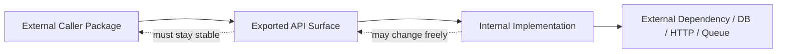
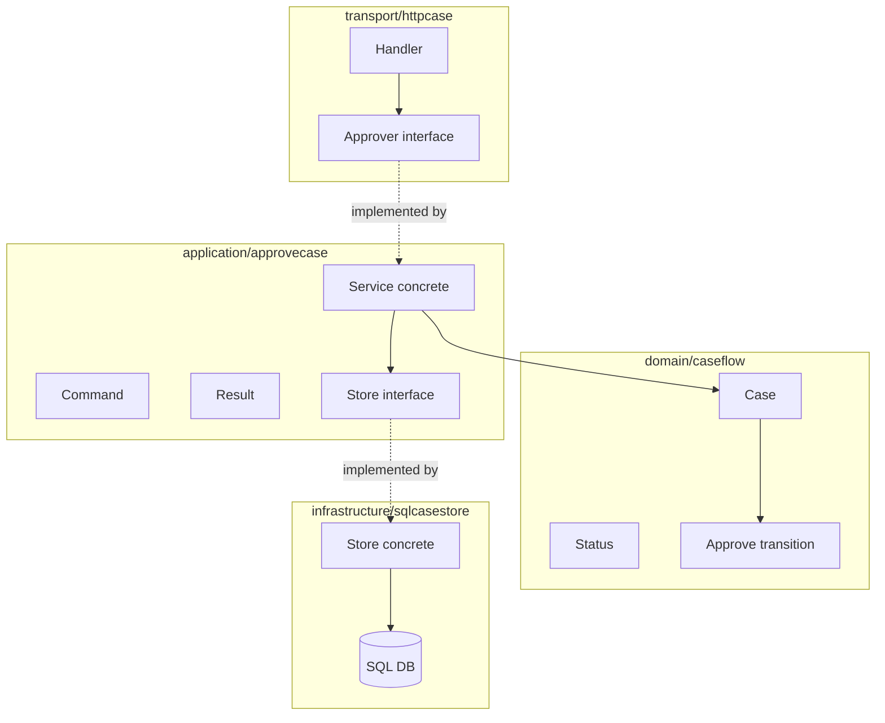

# learn-go-design-patterns-common-patterns-anti-patterns-part-004.md

# Part 004 — API Surface Pattern

> Seri: **Go Design Patterns, Common Patterns, and Anti-Patterns**  
> Target pembaca: **Java software engineer yang ingin berpikir idiomatis dan production-grade di Go**  
> Fokus part ini: **mendesain permukaan API package Go yang kecil, stabil, jelas, evolvable, dan tidak membocorkan detail internal**  
> Baseline: **Go 1.26.x**, dengan prinsip kompatibilitas Go 1, idiom dari Effective Go, Go Code Review Comments, dan Go style guidance.

---

## 1. Tujuan Part Ini

Di Go, desain API bukan hanya soal membuat function bisa dipanggil. API adalah **kontrak jangka panjang** antara package kamu dan pemakainya.

Begitu sebuah identifier diexport:

```go
type Client struct {}
func NewClient(...) *Client
func (c *Client) Do(...) error
```

maka kamu sedang membuat janji:

- nama itu akan tetap bermakna,
- behavior-nya konsisten,
- error semantics-nya bisa diandalkan,
- dependency-nya jelas,
- perubahan di masa depan tidak mematahkan caller,
- detail internal tidak ikut menjadi bagian dari kontrak.

Part ini akan membangun mental model untuk menjawab pertanyaan desain seperti:

- Kapan sebuah type/function harus diexport?
- Apakah constructor harus return struct atau interface?
- Kapan memakai parameter biasa, config struct, atau functional options?
- Bagaimana mendesain error surface yang stabil?
- Apakah `context.Context` harus ada di semua method?
- Bagaimana mencegah package API tumbuh menjadi terlalu besar?
- Bagaimana menjaga compatibility saat requirement berubah?
- Bagaimana membuat API mudah dites tanpa membuat interface palsu di mana-mana?

Intinya: **API surface adalah architecture boundary terkecil yang paling sering diremehkan.**

---

## 2. Apa Itu API Surface di Go?

API surface adalah seluruh bagian package yang dapat dipakai oleh package lain.

Dalam Go, API surface terutama terdiri dari:

| Elemen | Contoh | Risiko Jika Buruk |
|---|---|---|
| Exported package name | `package audit` | Nama kabur membuat import tidak ekspresif |
| Exported type | `type Store struct` | Type menjadi kontrak jangka panjang |
| Exported interface | `type Reader interface` | Interface terlalu besar membekukan desain salah |
| Exported function | `func Parse(...)` | Signature buruk sulit diubah |
| Exported method | `func (s *Store) Save(...)` | Behavior method menjadi public contract |
| Exported field | `type Config struct { Timeout time.Duration }` | Field tidak bisa divalidasi saat set langsung |
| Exported variable | `var DefaultClient` | Global state sulit dikontrol |
| Exported constant | `const StatusOpen = "open"` | Nilai menjadi bagian dari interoperability contract |
| Error value/type | `var ErrNotFound` | Error semantics menjadi contract |
| Documentation comment | `// Save persists...` | Doc buruk membuat contract ambigu |

Dalam Go, sesuatu diexport kalau namanya diawali huruf besar:

```go
type user struct {} // private to package

type User struct {} // exported
```

Ini terlihat sederhana, tetapi konsekuensinya besar. Exporting bukan kosmetik. Exporting berarti kamu membuka pintu dependency dari luar.

---

## 3. Mental Model Utama: API Surface Adalah Boundary of Promise

Setiap API public harus dianggap sebagai **promise boundary**.



Bagian internal boleh berubah agresif. API public harus berubah hati-hati.

Karena itu, desain API surface Go yang baik biasanya punya karakter:

1. **Small** — hanya expose yang benar-benar perlu.
2. **Specific** — nama dan behavior jelas.
3. **Composable** — mudah dipakai bersama package lain.
4. **Stable** — tidak mudah berubah saat internal berubah.
5. **Testable** — caller bisa mengetes tanpa hack.
6. **Observable** — error dan behavior bisa dipahami.
7. **Low surprise** — sesuai idiom Go.

---

## 4. Java Mindset vs Go Mindset

### 4.1 Java Mindset yang Sering Terbawa

Java engineer sering terbiasa dengan:

```java
public interface UserService {
    UserDto createUser(CreateUserRequest request);
    UserDto updateUser(UpdateUserRequest request);
    void deleteUser(String id);
}

@Service
public class UserServiceImpl implements UserService { ... }
```

Lalu diterjemahkan ke Go menjadi:

```go
type UserService interface {
    CreateUser(ctx context.Context, req CreateUserRequest) (*UserDTO, error)
    UpdateUser(ctx context.Context, req UpdateUserRequest) (*UserDTO, error)
    DeleteUser(ctx context.Context, id string) error
}

type userService struct { ... }

func NewUserService(...) UserService {
    return &userService{...}
}
```

Ini tidak selalu salah, tetapi sering menjadi tanda bahwa desain masih berpikir Java:

- interface dibuat oleh provider, bukan consumer,
- implementation disembunyikan tanpa alasan kuat,
- semua service diberi interface,
- caller kehilangan akses ke concrete behavior yang sah,
- test memaksa mocking besar,
- API membesar sebelum requirement matang.

### 4.2 Go Mindset

Di Go, default yang sering lebih baik:

```go
type Service struct {
    users UserStore
    clock Clock
}

func NewService(users UserStore, clock Clock) *Service {
    return &Service{users: users, clock: clock}
}

func (s *Service) CreateUser(ctx context.Context, cmd CreateUserCommand) (CreateUserResult, error) {
    // ...
}
```

Kemudian consumer yang butuh subset behavior boleh mendefinisikan interface sendiri:

```go
type UserCreator interface {
    CreateUser(ctx context.Context, cmd CreateUserCommand) (CreateUserResult, error)
}
```

Prinsipnya:

> **Provider biasanya expose concrete type. Consumer mendefinisikan interface sesuai kebutuhan.**

Ini membuat API surface lebih jujur: package menyediakan behavior konkret, bukan pura-pura abstraction.

---

## 5. Exported vs Unexported: Pertanyaan Pertama API Design

Sebelum mendesain signature, tanyakan:

> Apakah identifier ini benar-benar perlu diketahui package lain?

### 5.1 Default: Unexported

Go mendorong desain package yang punya private implementation.

```go
type validator struct {
    rules []rule
}

func (v *validator) validate(cmd CreateCaseCommand) []Violation {
    // ...
}
```

Kalau hanya dipakai di package yang sama, jangan export.

### 5.2 Export Kalau Menjadi Contract

Export ketika caller perlu:

- membangun instance,
- memanggil behavior,
- memeriksa result,
- membuat implementation custom,
- menangani error tertentu,
- mengonfigurasi package,
- melakukan integration.

Contoh:

```go
type Store struct {
    db *sql.DB
}

func NewStore(db *sql.DB) *Store {
    return &Store{db: db}
}

func (s *Store) FindByID(ctx context.Context, id CaseID) (Case, error) {
    // ...
}
```

`Store` dan `NewStore` diexport karena caller perlu membuat dan memakai repository/adapter itu.

### 5.3 Jangan Export karena “Mungkin Berguna”

Anti-pattern:

```go
type InternalPayloadBuilder struct {}
func BuildInternalValidationContext(...) ...
func NormalizeInternalStatus(...) ...
```

Masalah:

- caller mulai bergantung pada detail internal,
- refactoring jadi mahal,
- package kehilangan freedom,
- public API jadi penuh noise.

Rule praktis:

> Export hanya jika kamu siap mendokumentasikan, mengetes, dan menjaga compatibility behavior-nya.

---

## 6. Designing Exported Types

### 6.1 Exported Type Harus Memiliki Alasan Kuat

Exported type biasanya mewakili salah satu dari:

1. **Domain concept**
2. **Configuration**
3. **Client/adapter**
4. **Result/decision**
5. **Error classification**
6. **Capability contract**

Contoh domain concept:

```go
type CaseID string

type CaseStatus string

const (
    CaseStatusDraft     CaseStatus = "draft"
    CaseStatusSubmitted CaseStatus = "submitted"
    CaseStatusApproved  CaseStatus = "approved"
    CaseStatusRejected  CaseStatus = "rejected"
)
```

Ini layak diexport jika status dipakai lintas package.

### 6.2 Hindari Type yang Menjadi Dumping Ground

Buruk:

```go
type UserData struct {
    ID        string
    Name      string
    Email     string
    Role      string
    CreatedAt time.Time
    UpdatedAt time.Time
    DeletedAt *time.Time
    Metadata  map[string]any
    Extra     map[string]any
}
```

Nama `UserData` tidak menjelaskan contract. Field-nya campur:

- domain,
- persistence,
- transport,
- audit,
- extension bag.

Lebih baik pisahkan sesuai boundary:

```go
type User struct {
    ID    UserID
    Name  string
    Email Email
    Role  Role
}

type UserRecord struct {
    ID        string
    Name      string
    Email     string
    Role      string
    CreatedAt time.Time
    UpdatedAt time.Time
    DeletedAt sql.NullTime
}

type UserResponse struct {
    ID    string `json:"id"`
    Name  string `json:"name"`
    Email string `json:"email"`
    Role  string `json:"role"`
}
```

API surface yang baik tidak memaksa satu type menjadi semua bentuk data.

---

## 7. Exported Fields vs Unexported Fields

### 7.1 Exported Fields Cocok untuk Data Bag Sederhana

Config struct sering memakai exported fields:

```go
type Config struct {
    Endpoint string
    Timeout  time.Duration
    Retries  int
}
```

Ini idiomatis jika:

- field tidak punya invariant kompleks,
- caller memang perlu mengisi langsung,
- validation dilakukan saat construction,
- field merupakan input config, bukan mutable runtime state.

```go
func NewClient(cfg Config) (*Client, error) {
    if cfg.Endpoint == "" {
        return nil, errors.New("endpoint is required")
    }
    if cfg.Timeout <= 0 {
        cfg.Timeout = 5 * time.Second
    }
    if cfg.Retries < 0 {
        return nil, errors.New("retries must be non-negative")
    }

    return &Client{cfg: cfg}, nil
}
```

### 7.2 Unexported Fields Cocok untuk Object dengan Invariant

```go
type RateLimiter struct {
    mu       sync.Mutex
    capacity int
    tokens   int
    refill   time.Duration
}
```

Jangan expose fields yang bisa merusak invariant:

```go
type RateLimiter struct {
    Capacity int
    Tokens   int
    Refill   time.Duration
}
```

Caller bisa melakukan:

```go
limiter.Tokens = -999
```

Kalau type punya lifecycle, synchronization, atau invariant, field sebaiknya private.

### 7.3 Exported Field Adalah Compatibility Commitment

Jika kamu expose:

```go
type Config struct {
    Timeout time.Duration
}
```

Maka field `Timeout` menjadi bagian dari API. Kamu tidak bisa mudah mengganti menjadi:

```go
type Config struct {
    timeoutMillis int
}
```

Tanpa mematahkan caller.

---

## 8. Designing Exported Functions

### 8.1 Function Harus Punya Nama yang Menjawab “Apa”

Baik:

```go
func ParseCaseID(s string) (CaseID, error)
func ValidateCommand(cmd CreateCaseCommand) []Violation
func NewClient(cfg Config) (*Client, error)
```

Buruk:

```go
func Process(data any) any
func Handle(input any) error
func DoStuff(x string) string
func Execute(req Request) Response
```

Nama generic membuat caller harus membaca implementation untuk paham behavior.

### 8.2 Function Signature Harus Menyampaikan Contract

Buruk:

```go
func Create(ctx context.Context, data map[string]any) (map[string]any, error)
```

Masalah:

- input tidak jelas,
- output tidak jelas,
- validation tidak obvious,
- caller bisa salah key,
- refactoring sulit,
- documentation harus mengganti type safety.

Lebih baik:

```go
type CreateCaseCommand struct {
    ApplicantID ApplicantID
    Category    CaseCategory
    Description string
}

type CreateCaseResult struct {
    CaseID CaseID
    Status CaseStatus
}

func (s *Service) CreateCase(ctx context.Context, cmd CreateCaseCommand) (CreateCaseResult, error)
```

Signature yang baik adalah dokumentasi executable.

---

## 9. Return Concrete Type vs Interface

Ini salah satu decision paling penting di Go.

### 9.1 Default yang Baik: Return Concrete Type

```go
func NewClient(cfg Config) (*Client, error) {
    return &Client{cfg: cfg}, nil
}
```

Keuntungan:

- caller tahu apa yang diterima,
- method set jelas,
- dokumentasi mudah,
- extension lebih mudah,
- tidak membuat interface premature,
- consumer tetap bisa mendefinisikan interface sendiri.

### 9.2 Return Interface Kalau Ada Alasan Kuat

Return interface bisa tepat jika:

1. implementation benar-benar interchangeable,
2. caller tidak boleh bergantung pada concrete type,
3. ada multiple implementations yang meaningful,
4. package memang mendefinisikan abstraction boundary,
5. constructor memilih implementation berdasarkan config.

Contoh:

```go
type Store interface {
    Get(ctx context.Context, key string) ([]byte, error)
    Put(ctx context.Context, key string, value []byte) error
}

func OpenStore(cfg StoreConfig) (Store, error) {
    switch cfg.Kind {
    case "memory":
        return newMemoryStore(cfg), nil
    case "disk":
        return newDiskStore(cfg)
    default:
        return nil, fmt.Errorf("unsupported store kind %q", cfg.Kind)
    }
}
```

Ini masuk akal jika caller memang tidak perlu tahu implementation.

### 9.3 Anti-Pattern: Constructor Return Interface Tanpa Need

Buruk:

```go
type UserService interface {
    Create(ctx context.Context, cmd CreateUserCommand) (User, error)
}

type userService struct { ... }

func NewUserService(...) UserService {
    return &userService{...}
}
```

Jika hanya ada satu implementation dan interface dibuat oleh provider, ini biasanya premature.

Lebih baik:

```go
type UserService struct { ... }

func NewUserService(...) *UserService {
    return &UserService{...}
}
```

Consumer yang butuh mock dapat membuat interface kecil:

```go
type UserCreator interface {
    Create(ctx context.Context, cmd CreateUserCommand) (User, error)
}
```

---

## 10. Parameter Design Pattern

Signature function adalah API contract paling keras. Salah memilih parameter bisa membuat API sulit berkembang.

### 10.1 Plain Parameters

Cocok untuk fungsi kecil dengan sedikit parameter jelas:

```go
func ParseCaseID(raw string) (CaseID, error)

func NewToken(subject string, issuedAt time.Time, ttl time.Duration) Token
```

Masalah muncul ketika parameter terlalu banyak:

```go
func NewClient(endpoint string, timeout time.Duration, retries int, tls bool, userAgent string, logger *slog.Logger) (*Client, error)
```

Caller sulit membaca:

```go
client, err := NewClient("https://api", 5*time.Second, 3, true, "case-service", logger)
```

Apa arti `3`? Apa arti `true`?

### 10.2 Config Struct

Cocok untuk construction dengan banyak opsi:

```go
type ClientConfig struct {
    Endpoint  string
    Timeout   time.Duration
    Retries   int
    TLS       bool
    UserAgent string
    Logger    *slog.Logger
}

func NewClient(cfg ClientConfig) (*Client, error) {
    // validate + default
}
```

Caller lebih jelas:

```go
client, err := NewClient(ClientConfig{
    Endpoint:  "https://api",
    Timeout:   5 * time.Second,
    Retries:   3,
    TLS:       true,
    UserAgent: "case-service",
    Logger:    logger,
})
```

### 10.3 Functional Options

Cocok ketika:

- ada banyak optional behavior,
- default cukup kuat,
- backward compatibility penting,
- options jarang semua dipakai,
- constructor harus nyaman untuk common case.

```go
type ClientOption func(*clientOptions)

type clientOptions struct {
    timeout   time.Duration
    retries   int
    userAgent string
    logger    *slog.Logger
}

func WithTimeout(timeout time.Duration) ClientOption {
    return func(o *clientOptions) {
        o.timeout = timeout
    }
}

func WithRetries(retries int) ClientOption {
    return func(o *clientOptions) {
        o.retries = retries
    }
}

func NewClient(endpoint string, opts ...ClientOption) (*Client, error) {
    options := clientOptions{
        timeout: 5 * time.Second,
        retries: 2,
    }

    for _, opt := range opts {
        opt(&options)
    }

    if endpoint == "" {
        return nil, errors.New("endpoint is required")
    }
    if options.timeout <= 0 {
        return nil, errors.New("timeout must be positive")
    }
    if options.retries < 0 {
        return nil, errors.New("retries must be non-negative")
    }

    return &Client{
        endpoint: endpoint,
        options:  options,
    }, nil
}
```

Caller:

```go
client, err := NewClient(
    "https://api",
    WithTimeout(10*time.Second),
    WithRetries(5),
)
```

### 10.4 Decision Table

| Situation | Best Fit |
|---|---|
| 1–3 obvious required parameters | Plain parameters |
| Many related configuration fields | Config struct |
| Many optional settings with defaults | Functional options |
| Public library needing backward-compatible extension | Functional options or config struct with added fields |
| Request/use-case input | Command struct |
| Complex query criteria | Query struct |
| Behavior dependency | Interface/function parameter |

---

## 11. Command/Request Struct as API Surface

Untuk application/service boundary, command struct sering lebih baik daripada long parameter list.

Buruk:

```go
func (s *Service) SubmitApplication(
    ctx context.Context,
    applicantID string,
    licenseType string,
    documents []string,
    submittedBy string,
    submittedAt time.Time,
) (string, error) {
    // ...
}
```

Lebih baik:

```go
type SubmitApplicationCommand struct {
    ApplicantID ApplicantID
    LicenseType LicenseType
    Documents   []DocumentID
    SubmittedBy UserID
    SubmittedAt time.Time
}

type SubmitApplicationResult struct {
    ApplicationID ApplicationID
    Status        ApplicationStatus
}

func (s *Service) SubmitApplication(ctx context.Context, cmd SubmitApplicationCommand) (SubmitApplicationResult, error) {
    // ...
}
```

Keuntungan:

- lebih mudah ditambah field,
- caller lebih jelas,
- validation bisa terpusat,
- logging/audit lebih rapi,
- testing lebih mudah,
- command bisa menjadi input boundary.

Tetapi command struct juga bisa disalahgunakan.

Anti-pattern:

```go
type Request struct {
    Data map[string]any
}
```

Ini hanya memindahkan ketidakjelasan dari parameter ke struct.

---

## 12. Result Struct as API Surface

Jika result lebih dari satu nilai konseptual, gunakan struct.

```go
type AuthorizeResult struct {
    Allowed bool
    Reason  DenyReason
    Policy  PolicyID
}
```

Daripada:

```go
func Authorize(...) (bool, string, string, error)
```

Result struct baik jika:

- caller perlu inspect banyak informasi,
- ada decision metadata,
- result bisa berkembang,
- audit/trace butuh alasan,
- output bukan hanya value sederhana.

Untuk regulatory system, result struct sering lebih defensible:

```go
type TransitionDecision struct {
    Allowed      bool
    From         CaseStatus
    To           CaseStatus
    Violations   []Violation
    EvaluatedBy  UserID
    EvaluatedAt  time.Time
    PolicyVersion string
}
```

Ini lebih baik daripada:

```go
func CanTransition(from, to string) bool
```

Karena sistem nyata tidak hanya butuh jawaban; ia butuh alasan.

---

## 13. Context as API Boundary

### 13.1 Kapan API Harus Menerima `context.Context`?

Gunakan `context.Context` pada function/method yang:

- melakukan I/O,
- bisa blocking,
- melakukan network call,
- melakukan database call,
- menjalankan operasi panjang,
- perlu cancellation,
- perlu deadline,
- membawa request-scoped metadata.

Contoh:

```go
func (s *Store) FindByID(ctx context.Context, id CaseID) (Case, error)
func (c *Client) Submit(ctx context.Context, req SubmitRequest) (SubmitResponse, error)
func (w *Worker) Run(ctx context.Context) error
```

### 13.2 Context Biasanya Parameter Pertama

Idiomatic Go:

```go
func (s *Service) CreateCase(ctx context.Context, cmd CreateCaseCommand) (CreateCaseResult, error)
```

Bukan:

```go
func (s *Service) CreateCase(cmd CreateCaseCommand, ctx context.Context) (CreateCaseResult, error)
```

### 13.3 Jangan Simpan Context di Struct

Buruk:

```go
type Service struct {
    ctx context.Context
    db  *sql.DB
}
```

Masalah:

- lifecycle context tidak jelas,
- cancellation bisa memengaruhi request lain,
- deadline lama bisa bocor,
- service menjadi request-scoped secara diam-diam.

Lebih baik:

```go
type Service struct {
    db *sql.DB
}

func (s *Service) Create(ctx context.Context, cmd CreateCommand) error {
    // use ctx here
}
```

### 13.4 Jangan Pakai Context untuk Dependency Bag

Buruk:

```go
func Handler(w http.ResponseWriter, r *http.Request) {
    logger := r.Context().Value("logger").(*slog.Logger)
    db := r.Context().Value("db").(*sql.DB)
    service := r.Context().Value("service").(*Service)
    // ...
}
```

Context value cocok untuk request-scoped metadata, bukan dependency injection.

Contoh yang masuk akal:

- request ID,
- trace ID,
- authenticated principal,
- locale,
- tenant ID jika memang request-scoped.

---

## 14. Error Surface as API

Error bukan detail kecil. Error adalah bagian dari API contract.

### 14.1 Error Surface Harus Bisa Dijawab Caller

Caller biasanya perlu tahu:

- apakah operasi gagal karena input invalid?
- apakah resource tidak ditemukan?
- apakah conflict?
- apakah unauthorized?
- apakah dependency timeout?
- apakah retryable?
- apakah failure internal?

Kalau API hanya mengembalikan string bebas:

```go
return fmt.Errorf("failed to get user: %v", err)
```

Caller sulit mengambil keputusan.

### 14.2 Sentinel Error untuk Kategori Stabil

```go
var ErrNotFound = errors.New("not found")

func (s *Store) FindByID(ctx context.Context, id CaseID) (Case, error) {
    // ...
    return Case{}, ErrNotFound
}
```

Caller:

```go
caseData, err := store.FindByID(ctx, id)
if errors.Is(err, store.ErrNotFound) {
    // handle not found
}
```

### 14.3 Typed Error untuk Metadata

```go
type ValidationError struct {
    Violations []Violation
}

func (e *ValidationError) Error() string {
    return "validation failed"
}
```

Caller:

```go
var validationErr *ValidationError
if errors.As(err, &validationErr) {
    // use validationErr.Violations
}
```

### 14.4 Error Wrapping untuk Causality

```go
if err := repo.Save(ctx, app); err != nil {
    return SubmitApplicationResult{}, fmt.Errorf("save application %s: %w", app.ID, err)
}
```

Wrapping penting untuk observability, tetapi jangan membocorkan error vendor melewati boundary yang salah.

### 14.5 Boundary Error Translation

Infrastructure boundary:

```go
func (s *SQLStore) FindByID(ctx context.Context, id CaseID) (Case, error) {
    row := s.db.QueryRowContext(ctx, `select ... where id = ?`, id)

    var record caseRecord
    if err := row.Scan(&record.ID, &record.Status); err != nil {
        if errors.Is(err, sql.ErrNoRows) {
            return Case{}, ErrNotFound
        }
        return Case{}, fmt.Errorf("scan case %s: %w", id, err)
    }

    return record.toDomain(), nil
}
```

Application boundary:

```go
caseData, err := s.cases.FindByID(ctx, cmd.CaseID)
if err != nil {
    if errors.Is(err, casestore.ErrNotFound) {
        return ApproveCaseResult{}, ErrCaseNotFound
    }
    return ApproveCaseResult{}, fmt.Errorf("find case: %w", err)
}
```

Transport boundary maps app error to HTTP/gRPC response.

---

## 15. Constants and Enums as API Surface

Go tidak punya enum seperti Java. Biasanya memakai typed constants.

```go
type CaseStatus string

const (
    CaseStatusDraft     CaseStatus = "draft"
    CaseStatusSubmitted CaseStatus = "submitted"
    CaseStatusApproved  CaseStatus = "approved"
    CaseStatusRejected  CaseStatus = "rejected"
)
```

### 15.1 Typed Constants Lebih Baik dari Raw String

Buruk:

```go
func Transition(from string, to string) error
```

Lebih baik:

```go
func Transition(from CaseStatus, to CaseStatus) error
```

### 15.2 Jangan Terlalu Cepat Membuat Stringly-Typed API

Buruk:

```go
type Event struct {
    Type string
    Data map[string]any
}
```

Lebih baik jika event contract stabil:

```go
type EventType string

const (
    EventTypeCaseSubmitted EventType = "case.submitted"
    EventTypeCaseApproved  EventType = "case.approved"
)

type CaseSubmittedEvent struct {
    CaseID      CaseID
    SubmittedBy UserID
    SubmittedAt time.Time
}
```

---

## 16. Documentation Is Part of API

Di Go, exported identifier sebaiknya punya doc comment.

Baik:

```go
// Client submits applications to the licensing API.
type Client struct {
    // ...
}

// SubmitApplication submits an application and returns its assigned ID.
//
// SubmitApplication returns ErrInvalidApplication if the request fails
// validation. It returns an error matching context.DeadlineExceeded if the
// operation exceeds the deadline in ctx.
func (c *Client) SubmitApplication(ctx context.Context, req SubmitApplicationRequest) (SubmitApplicationResponse, error) {
    // ...
}
```

Doc harus menjelaskan:

- apa behavior-nya,
- apa ownership input/output,
- apakah safe untuk concurrent use,
- error apa yang bisa dipakai caller,
- apakah caller boleh mutate returned value,
- lifecycle expectation.

### 16.1 Document Concurrency Safety

```go
// Client is safe for concurrent use by multiple goroutines.
type Client struct { ... }
```

Atau:

```go
// Builder is not safe for concurrent use.
type Builder struct { ... }
```

Ini penting karena concurrency safety adalah bagian dari contract.

### 16.2 Document Ownership

Untuk slice/map/pointer, jelaskan ownership.

```go
// Headers returns a copy of the client's default headers.
func (c *Client) Headers() map[string]string
```

Atau:

```go
// Bytes returns a read-only view of the underlying buffer. The returned slice
// is valid until the next call to Reset.
func (b *Buffer) Bytes() []byte
```

Tanpa dokumentasi, caller bisa salah asumsi.

---

## 17. API Surface and Compatibility

### 17.1 Additive Changes Lebih Aman

Biasanya aman:

- menambah unexported field,
- menambah exported method pada concrete type,
- menambah field pada config struct jika caller memakai named fields,
- menambah new constructor,
- menambah new option,
- menambah new sentinel error.

Berisiko/mematahkan:

- rename exported identifier,
- menghapus exported field,
- mengubah type field,
- mengubah return type,
- mengubah interface dengan menambah method,
- mengubah error semantics,
- mengubah nil behavior,
- mengubah concurrency safety.

### 17.2 Menambah Method ke Interface Adalah Breaking Change

```go
type Store interface {
    Get(ctx context.Context, key string) ([]byte, error)
}
```

Jika nanti diubah menjadi:

```go
type Store interface {
    Get(ctx context.Context, key string) ([]byte, error)
    Put(ctx context.Context, key string, value []byte) error
}
```

Semua implementation external rusak.

Ini alasan interface public harus sangat hati-hati.

### 17.3 Config Struct Compatibility

Menambah field biasanya aman:

```go
type ClientConfig struct {
    Endpoint string
    Timeout  time.Duration
    Retries  int // new
}
```

Tetapi ada risiko jika caller menggunakan positional composite literal dari package yang sama. Untuk external package, unkeyed literal pada exported struct dari package lain bisa dilakukan jika field exported, tetapi style Go mendorong keyed fields.

Caller baik:

```go
cfg := ClientConfig{
    Endpoint: "https://api",
    Timeout:  5 * time.Second,
}
```

Caller buruk:

```go
cfg := ClientConfig{"https://api", 5 * time.Second}
```

Untuk public API, doc dan examples harus mendorong keyed fields.

---

## 18. Nil Semantics as API

Nil behavior harus jelas.

### 18.1 Apakah Nil Config Valid?

```go
func NewClient(cfg *Config) (*Client, error)
```

Jika pointer config menerima nil, apa artinya?

```go
client, err := NewClient(nil)
```

Ada dua pilihan:

1. nil berarti default config,
2. nil invalid.

Keduanya boleh, tetapi harus eksplisit.

Sering lebih sederhana:

```go
func NewClient(cfg Config) (*Client, error)
```

Value config menghindari pertanyaan nil.

### 18.2 Nil Interface Trap

Hati-hati dengan interface return.

```go
type NotFoundError struct{}

func (e *NotFoundError) Error() string { return "not found" }

func find() error {
    var err *NotFoundError = nil
    return err
}
```

`find()` mengembalikan interface `error` yang tidak nil, karena dynamic type ada meskipun value nil.

API design harus menghindari pola yang membingungkan caller.

Benar:

```go
func find() error {
    var err *NotFoundError
    if err == nil {
        return nil
    }
    return err
}
```

Atau lebih sederhana: jangan membuat typed nil error.

---

## 19. Method Receiver API Pattern

### 19.1 Pointer Receiver untuk Mutable atau Large Type

```go
type Client struct {
    transport http.RoundTripper
    timeout   time.Duration
}

func (c *Client) Do(ctx context.Context, req Request) (Response, error) {
    // ...
}
```

Pointer receiver cocok jika:

- method mutate state,
- type besar,
- type punya mutex,
- identity penting,
- ingin consistent method set.

### 19.2 Value Receiver untuk Small Immutable Value

```go
type Money struct {
    amount   int64
    currency string
}

func (m Money) Add(other Money) (Money, error) {
    // ...
}
```

Value receiver cocok jika:

- type kecil,
- immutable-ish,
- tidak punya mutex,
- copy murah,
- behavior value semantics.

### 19.3 Jangan Copy Type yang Punya Mutex

Buruk:

```go
type Cache struct {
    mu sync.Mutex
    m  map[string]string
}

func (c Cache) Get(key string) string {
    c.mu.Lock()
    defer c.mu.Unlock()
    return c.m[key]
}
```

Value receiver menyalin mutex. Ini bug desain.

Benar:

```go
func (c *Cache) Get(key string) string {
    c.mu.Lock()
    defer c.mu.Unlock()
    return c.m[key]
}
```

Receiver choice adalah bagian dari API semantics.

---

## 20. Public Interface Design

### 20.1 Interface Kecil

Baik:

```go
type Clock interface {
    Now() time.Time
}

type CaseStore interface {
    FindByID(ctx context.Context, id CaseID) (Case, error)
    Save(ctx context.Context, c Case) error
}
```

Buruk:

```go
type CaseService interface {
    Create(...)
    Update(...)
    Delete(...)
    Approve(...)
    Reject(...)
    Assign(...)
    Escalate(...)
    Search(...)
    Export(...)
    Import(...)
}
```

Giant interface membuat caller harus implement banyak method yang tidak diperlukan.

### 20.2 Interface Should Describe Behavior, Not Implementation Role

Buruk:

```go
type UserServiceInterface interface { ... }
type IUserRepository interface { ... }
```

Lebih Go-like:

```go
type UserFinder interface {
    FindUser(ctx context.Context, id UserID) (User, error)
}

type UserSaver interface {
    SaveUser(ctx context.Context, user User) error
}
```

Nama interface sering berakhiran `-er` jika kecil dan behavioral:

- `Reader`
- `Writer`
- `Closer`
- `Finder`
- `Validator`
- `Authorizer`

Tetapi jangan memaksa `-er` jika nama domain lebih jelas.

---

## 21. API Surface of Package Variables

Package-level variables adalah API surface yang berbahaya.

Buruk:

```go
var DB *sql.DB
var Logger *slog.Logger
var Config AppConfig
```

Masalah:

- hidden dependency,
- test sulit,
- initialization order risk,
- race risk,
- multi-tenant sulit,
- lifecycle tidak jelas.

Lebih baik:

```go
type Service struct {
    db     *sql.DB
    logger *slog.Logger
    cfg    Config
}
```

Package var boleh untuk immutable-ish sentinel:

```go
var ErrNotFound = errors.New("not found")
```

Atau default yang jelas dan safe:

```go
var DefaultTransport http.RoundTripper = http.DefaultTransport
```

Tapi mutable global harus sangat dibatasi.

---

## 22. API Surface and Logging

Jangan membuat public API bergantung pada logging global.

Buruk:

```go
func Process(ctx context.Context, req Request) error {
    log.Printf("processing %s", req.ID)
    // ...
}
```

Lebih baik untuk library/service reusable:

```go
type Service struct {
    logger *slog.Logger
}

func NewService(deps Dependencies) *Service {
    logger := deps.Logger
    if logger == nil {
        logger = slog.Default()
    }
    return &Service{logger: logger}
}
```

Atau gunakan no-op/default logger sesuai kebutuhan.

Logging policy adalah bagian dari API karena memengaruhi observability dan operability.

---

## 23. API Surface and Observability

API yang production-grade biasanya perlu memberi caller kemampuan untuk:

- set logger,
- set metrics recorder,
- set tracer/propagator,
- inject clock,
- set retry policy,
- set timeout/deadline,
- classify errors.

Tetapi jangan expose terlalu banyak low-level detail.

Buruk:

```go
type ClientConfig struct {
    Logger         *slog.Logger
    Metrics        any
    Tracer         any
    RetryCounter   *int64
    InternalBuffer []byte
    DebugHook      func(any)
}
```

Lebih baik:

```go
type ClientConfig struct {
    Endpoint string
    Timeout  time.Duration
    Logger   *slog.Logger
    Metrics  MetricsRecorder
}

type MetricsRecorder interface {
    ObserveRequest(ctx context.Context, name string, duration time.Duration, err error)
}
```

Tetap kecil dan behavioral.

---

## 24. API Surface and Testing

API yang baik tidak selalu berarti semua harus interface.

### 24.1 Test Seam via Constructor Dependency

```go
type Service struct {
    store Store
    clock Clock
}

type Store interface {
    Save(ctx context.Context, c Case) error
}

type Clock interface {
    Now() time.Time
}

func NewService(store Store, clock Clock) *Service {
    return &Service{store: store, clock: clock}
}
```

Di sini interface berada di consumer package `service`, karena service hanya butuh behavior kecil.

### 24.2 Public API Tidak Harus Dibengkokkan untuk Test Internal

Buruk:

```go
func NewServiceForTest(...) *Service
func SetGlobalDBForTest(db *sql.DB)
func EnableTestMode()
```

Lebih baik:

- dependency injection via constructor,
- unexported helper tested indirectly,
- internal test package jika perlu,
- fake implementation kecil.

### 24.3 Test Package Strategy

Ada dua gaya:

```go
package caseapp
```

Test ini bisa akses unexported identifiers.

```go
package caseapp_test
```

Test ini hanya akses public API, seperti external caller.

Untuk API surface, external test package sangat berguna karena memaksa kamu melihat API dari sisi consumer.

---

## 25. API Surface Smells

Gunakan daftar ini saat code review.

### 25.1 Too Many Exported Identifiers

Gejala:

```go
package caseapp

func ValidateStatus(...)
func NormalizeStatus(...)
func BuildContext(...)
func ConvertRecord(...)
func MapStatus(...)
func InternalParse(...)
func HelperCreate(...)
```

Pertanyaan review:

- Apakah caller benar-benar butuh semua ini?
- Apakah ini bocor dari implementation?
- Bisa dibuat unexported?
- Bisa dipindah ke package internal?

### 25.2 Weak Names

Nama buruk:

- `Manager`
- `Processor`
- `Handler`
- `Helper`
- `Util`
- `Data`
- `Common`
- `Base`
- `Impl`

Nama ini tidak selalu salah, tapi sering kabur.

Nama lebih baik biasanya menunjukkan domain atau capability:

- `Transitioner`
- `Authorizer`
- `PolicyEvaluator`
- `OutboxPublisher`
- `CaseStore`
- `ApplicationSubmitter`

### 25.3 Any Everywhere

Buruk:

```go
func Execute(ctx context.Context, input any) (any, error)
```

Ini mungkin cocok untuk framework internal tertentu, tetapi buruk untuk application API biasa.

`any` menghapus contract compile-time.

### 25.4 Map String Any as Public API

Buruk:

```go
type Payload map[string]any
```

Masalah:

- tidak ada schema,
- validation runtime semua,
- refactoring sulit,
- caller salah key,
- documentation membengkak.

Gunakan typed struct jika schema diketahui.

### 25.5 Context Optional

Buruk:

```go
func (c *Client) Do(req Request) (Response, error)
func (c *Client) DoWithContext(ctx context.Context, req Request) (Response, error)
```

Untuk API baru, biasanya langsung gunakan context:

```go
func (c *Client) Do(ctx context.Context, req Request) (Response, error)
```

---

## 26. API Evolution Pattern

API yang baik harus bisa berevolusi.

### 26.1 Dari Parameter List ke Command Struct

Sebelum:

```go
func Submit(ctx context.Context, applicantID string, category string) (string, error)
```

Setelah:

```go
type SubmitCommand struct {
    ApplicantID ApplicantID
    Category    Category
}

func Submit(ctx context.Context, cmd SubmitCommand) (SubmitResult, error)
```

Kalau package masih internal, refactor langsung. Kalau sudah public, buat method baru dan deprecate lama.

### 26.2 Deprecation Comment

```go
// Submit creates a new application.
//
// Deprecated: use SubmitApplication instead.
func Submit(ctx context.Context, applicantID string, category string) (string, error) {
    return SubmitApplication(ctx, SubmitApplicationCommand{
        ApplicantID: ApplicantID(applicantID),
        Category:    Category(category),
    })
}
```

Go tooling mengenali komentar `Deprecated:`.

### 26.3 Adapter Compatibility

Untuk menghindari breaking change pada interface, buat interface baru:

```go
type Store interface {
    Get(ctx context.Context, key string) ([]byte, error)
}

type WritableStore interface {
    Store
    Put(ctx context.Context, key string, value []byte) error
}
```

Jangan menambah method ke `Store` jika external implementation ada.

---

## 27. Layered API Surface Example

Misalnya kita mendesain feature case approval.

### 27.1 Domain Package

```go
package caseflow

type CaseID string

type Status string

const (
    StatusSubmitted Status = "submitted"
    StatusApproved  Status = "approved"
    StatusRejected  Status = "rejected"
)

type Case struct {
    id     CaseID
    status Status
}

func NewCase(id CaseID, status Status) (Case, error) {
    if id == "" {
        return Case{}, errors.New("case id is required")
    }
    switch status {
    case StatusSubmitted, StatusApproved, StatusRejected:
    default:
        return Case{}, fmt.Errorf("invalid status %q", status)
    }
    return Case{id: id, status: status}, nil
}

func (c Case) ID() CaseID { return c.id }
func (c Case) Status() Status { return c.status }

func (c Case) Approve() (Case, error) {
    if c.status != StatusSubmitted {
        return Case{}, ErrInvalidTransition
    }
    c.status = StatusApproved
    return c, nil
}

var ErrInvalidTransition = errors.New("invalid transition")
```

Domain API kecil:

- expose concept,
- hide fields,
- expose behavior,
- preserve invariant.

### 27.2 Application Package

```go
package approvecase

type Store interface {
    FindByID(ctx context.Context, id caseflow.CaseID) (caseflow.Case, error)
    Save(ctx context.Context, c caseflow.Case) error
}

type Command struct {
    CaseID     caseflow.CaseID
    ApprovedBy UserID
}

type Result struct {
    CaseID caseflow.CaseID
    Status caseflow.Status
}

type Service struct {
    store Store
    clock Clock
}

func NewService(store Store, clock Clock) *Service {
    return &Service{store: store, clock: clock}
}

func (s *Service) Approve(ctx context.Context, cmd Command) (Result, error) {
    c, err := s.store.FindByID(ctx, cmd.CaseID)
    if err != nil {
        return Result{}, fmt.Errorf("find case: %w", err)
    }

    c, err = c.Approve()
    if err != nil {
        return Result{}, fmt.Errorf("approve case: %w", err)
    }

    if err := s.store.Save(ctx, c); err != nil {
        return Result{}, fmt.Errorf("save case: %w", err)
    }

    return Result{CaseID: c.ID(), Status: c.Status()}, nil
}
```

Application API:

- command/result explicit,
- store interface consumer-owned,
- service concrete,
- context at boundary.

### 27.3 Infrastructure Package

```go
package sqlcasestore

type Store struct {
    db *sql.DB
}

func New(db *sql.DB) *Store {
    return &Store{db: db}
}

func (s *Store) FindByID(ctx context.Context, id caseflow.CaseID) (caseflow.Case, error) {
    // SQL implementation
}

func (s *Store) Save(ctx context.Context, c caseflow.Case) error {
    // SQL implementation
}
```

Infrastructure API:

- concrete store,
- no provider-owned interface,
- implementation satisfies application interface implicitly.

### 27.4 Transport Package

```go
package httpcase

type Approver interface {
    Approve(ctx context.Context, cmd approvecase.Command) (approvecase.Result, error)
}

type Handler struct {
    approver Approver
}

func NewHandler(approver Approver) *Handler {
    return &Handler{approver: approver}
}

func (h *Handler) ServeHTTP(w http.ResponseWriter, r *http.Request) {
    // decode request
    // call approver.Approve
    // map result/error to HTTP
}
```

Transport API:

- depends on use-case capability,
- does not know SQL,
- error mapping at boundary.

---

## 28. Diagram: API Surface Across Boundaries



Poin penting:

- Interface didefinisikan oleh consumer.
- Concrete type dikembalikan oleh provider.
- Domain tidak tahu transport/infrastructure.
- API surface per package kecil dan spesifik.

---

## 29. Public API Review Checklist

Gunakan checklist ini sebelum export identifier.

### 29.1 Naming

- Apakah nama menjelaskan domain/capability?
- Apakah nama tidak redundan dengan package name?
- Apakah nama tidak generic seperti `Manager`, `Helper`, `Util`?
- Apakah caller akan nyaman membaca `package.Name`?

Contoh:

```go
caseflow.Case
caseflow.Status
approvecase.Service
sqlcasestore.Store
```

Bukan:

```go
caseflow.CaseFlowCase
caseflow.StatusData
approvecase.Manager
sqlcasestore.SQLStoreImpl
```

### 29.2 Export Decision

- Apakah caller benar-benar butuh identifier ini?
- Apakah behavior siap dijaga compatibility-nya?
- Apakah bisa tetap unexported?
- Apakah lebih tepat berada di `internal`?

### 29.3 Signature

- Apakah parameter terlalu banyak?
- Apakah command/config struct lebih jelas?
- Apakah context diperlukan?
- Apakah context berada di parameter pertama?
- Apakah result harus struct?
- Apakah error semantics jelas?

### 29.4 Type Design

- Apakah fields perlu exported?
- Apakah invariant bisa dirusak caller?
- Apakah nil behavior jelas?
- Apakah receiver pointer/value tepat?
- Apakah concurrency safety didokumentasikan?

### 29.5 Interface Design

- Apakah interface terlalu besar?
- Apakah interface didefinisikan oleh consumer?
- Apakah constructor return interface tanpa alasan?
- Apakah menambah method nanti akan mematahkan external implementation?

### 29.6 Evolution

- Apakah API mudah ditambah tanpa breaking change?
- Apakah config/options bisa berkembang?
- Apakah error category stabil?
- Apakah ada deprecation path jika berubah?

---

## 30. Anti-Pattern Catalog

### 30.1 Export Everything

Gejala:

```go
type UserService struct {}
type UserServiceImpl struct {}
type UserServiceConfig struct {}
type UserServiceHelper struct {}
type UserServiceUtil struct {}
```

Dampak:

- API surface bengkak,
- caller bingung,
- refactoring susah,
- internal detail bocor.

Refactor:

- export hanya constructor dan type utama,
- unexport helper,
- pindahkan internal detail ke file/package private.

### 30.2 Interface-First API

Gejala:

```go
type PaymentService interface { ... }
func NewPaymentService(...) PaymentService
```

Padahal hanya ada satu implementation.

Dampak:

- abstraction palsu,
- method set membeku,
- caller sulit memakai concrete capability,
- mock menjadi driver desain.

Refactor:

```go
type PaymentService struct { ... }
func NewPaymentService(...) *PaymentService
```

Consumer yang butuh interface mendefinisikan sendiri.

### 30.3 Generic Request/Response Everywhere

Gejala:

```go
type Request struct {
    Action string
    Data map[string]any
}

type Response struct {
    Success bool
    Data map[string]any
}
```

Dampak:

- type safety hilang,
- validation runtime semua,
- caller tidak tahu contract,
- documentation mengganti compiler.

Refactor ke typed command/result.

### 30.4 Context Stored in Struct

Gejala:

```go
type Client struct {
    ctx context.Context
}
```

Dampak:

- cancellation ownership kacau,
- request state bocor,
- concurrent use berbahaya.

Refactor: context sebagai parameter method.

### 30.5 Error String Contract

Gejala:

```go
if strings.Contains(err.Error(), "not found") { ... }
```

Dampak:

- fragile,
- localization/logging change bisa break logic,
- caller bergantung pada text.

Refactor: sentinel/typed error + `errors.Is`/`errors.As`.

### 30.6 Public Struct with Mutable Invariant

Gejala:

```go
type Account struct {
    Balance int64
    Status string
}
```

Caller bisa:

```go
account.Balance = -100000
account.Status = "whatever"
```

Refactor:

```go
type Account struct {
    balance Money
    status  AccountStatus
}

func (a Account) Withdraw(amount Money) (Account, error) { ... }
```

---

## 31. Refactoring Playbook

### Step 1: Inventory Public API

Jalankan secara mental atau dengan tooling:

- apa saja exported type/function/var/const?
- siapa caller-nya?
- mana yang hanya dipakai internal?
- mana yang tidak terdokumentasi?

### Step 2: Classify API

Kelompokkan:

- core contract,
- construction,
- config,
- command/result,
- adapter,
- error,
- internal leak.

### Step 3: Shrink Surface

Untuk internal leak:

- rename jadi unexported,
- pindah ke `internal`,
- inline jika terlalu kecil,
- gabungkan jika terlalu fragmented.

### Step 4: Strengthen Signature

Ubah:

- `map[string]any` → typed struct,
- long params → command/config,
- string status → typed constant,
- bool result → decision result,
- string error → typed/sentinel error.

### Step 5: Stabilize Error Semantics

Tentukan:

- not found,
- invalid input,
- conflict,
- unauthorized,
- dependency failure,
- retryable failure,
- internal failure.

### Step 6: Add Documentation

Untuk setiap exported identifier:

- behavior,
- ownership,
- nil semantics,
- concurrency safety,
- error semantics.

### Step 7: Protect with Tests

Tambahkan external package tests:

```go
package yourpkg_test
```

Ini memastikan API nyaman dipakai dari luar.

---

## 32. Production Example: Designing a Client API

### 32.1 Bad Version

```go
package notification

var Endpoint string
var Timeout time.Duration

func Send(data map[string]any) (map[string]any, error) {
    // reads globals
    // validates dynamic payload
    // performs HTTP
    // returns dynamic response
}
```

Masalah:

- global config,
- no context,
- no cancellation,
- dynamic payload,
- dynamic response,
- no error taxonomy,
- no test seam,
- no concurrency contract.

### 32.2 Better Version

```go
package notification

type Client struct {
    endpoint string
    timeout  time.Duration
    http     HTTPClient
    logger   *slog.Logger
}

type HTTPClient interface {
    Do(req *http.Request) (*http.Response, error)
}

type Config struct {
    Endpoint string
    Timeout  time.Duration
    HTTP     HTTPClient
    Logger   *slog.Logger
}

type SendCommand struct {
    Recipient Recipient
    Template  TemplateID
    Variables map[string]string
}

type SendResult struct {
    MessageID MessageID
    Accepted  bool
}

var ErrRejected = errors.New("notification rejected")

func NewClient(cfg Config) (*Client, error) {
    if cfg.Endpoint == "" {
        return nil, errors.New("endpoint is required")
    }
    if cfg.Timeout <= 0 {
        cfg.Timeout = 5 * time.Second
    }
    if cfg.HTTP == nil {
        cfg.HTTP = http.DefaultClient
    }
    if cfg.Logger == nil {
        cfg.Logger = slog.Default()
    }

    return &Client{
        endpoint: cfg.Endpoint,
        timeout:  cfg.Timeout,
        http:     cfg.HTTP,
        logger:   cfg.Logger,
    }, nil
}

func (c *Client) Send(ctx context.Context, cmd SendCommand) (SendResult, error) {
    if cmd.Recipient == "" {
        return SendResult{}, &ValidationError{
            Violations: []Violation{{Field: "recipient", Reason: "required"}},
        }
    }

    ctx, cancel := context.WithTimeout(ctx, c.timeout)
    defer cancel()

    // build request, call HTTP, translate errors
    return SendResult{}, nil
}
```

Keuntungan:

- construction explicit,
- config validated,
- context supported,
- HTTP dependency injectable,
- request typed,
- result typed,
- error classifiable,
- no global mutable state.

---

## 33. Production API Design Invariants

Untuk API Go production-grade, pertahankan invariants berikut:

1. **No accidental export**  
   Public API harus sengaja.

2. **No hidden dependency**  
   Dependency penting masuk lewat constructor/config.

3. **No ambiguous ownership**  
   Slice/map/pointer ownership harus jelas.

4. **No unclear cancellation**  
   Operasi blocking menerima context.

5. **No stringly decision**  
   Gunakan typed status/error/result untuk decision penting.

6. **No provider-owned interface by default**  
   Return concrete type kecuali ada alasan kuat.

7. **No giant interface**  
   Interface harus kecil dan behavioral.

8. **No public mutable invariant**  
   Jangan expose field yang bisa merusak state.

9. **No compatibility trap**  
   Pikirkan bagaimana API akan berevolusi.

10. **No documentation debt for exported API**  
    Exported identifier tanpa doc adalah contract yang kabur.

---

## 34. Exercises

### Exercise 1 — Shrink API Surface

Diberikan package:

```go
package billing

type BillingService interface {
    CreateInvoice(ctx context.Context, req CreateInvoiceRequest) (*InvoiceDTO, error)
    UpdateInvoice(ctx context.Context, req UpdateInvoiceRequest) (*InvoiceDTO, error)
    DeleteInvoice(ctx context.Context, id string) error
    SendInvoice(ctx context.Context, id string) error
    CalculateTax(ctx context.Context, amount float64, country string) (float64, error)
}

type BillingServiceImpl struct { ... }

func NewBillingService(...) BillingService { ... }

func BillingHelperNormalizeCurrency(s string) string { ... }
func BillingUtilRound(v float64) float64 { ... }
```

Tugas:

- identifikasi exported identifier yang tidak perlu,
- pecah interface jika perlu,
- ubah constructor return concrete,
- ubah helper menjadi unexported,
- desain command/result yang lebih baik.

### Exercise 2 — Error Surface Design

Desain error taxonomy untuk API:

```go
func (s *Service) ApproveCase(ctx context.Context, cmd ApproveCommand) (ApproveResult, error)
```

Kategori minimal:

- case not found,
- invalid transition,
- unauthorized approver,
- stale version/conflict,
- database timeout,
- audit write failure.

Tentukan mana yang:

- sentinel error,
- typed error,
- wrapped infra error,
- mapped to transport status.

### Exercise 3 — Config vs Functional Options

Untuk client berikut:

- endpoint required,
- API key required,
- timeout optional,
- retry count optional,
- logger optional,
- metrics optional,
- custom HTTP transport optional,
- default user agent optional.

Desain dua versi API:

1. config struct,
2. functional options.

Bandingkan trade-off.

---

## 35. Summary

API surface pattern adalah pola desain untuk mengontrol **apa yang diketahui dunia luar tentang package kamu**.

Di Go, API surface yang baik biasanya:

- kecil,
- jelas,
- concrete-first,
- consumer-oriented untuk interface,
- explicit untuk dependency,
- context-aware untuk operasi blocking,
- typed untuk command/result/error penting,
- terdokumentasi,
- stabil terhadap perubahan internal.

Kesalahan umum Java engineer saat masuk Go adalah membawa pola:

- interface untuk semua service,
- constructor return interface tanpa kebutuhan,
- DTO generic,
- package `common/utils/models/services`,
- global config,
- hidden dependency,
- stringly typed error/status,
- over-layered API.

Go production-grade bukan berarti API kompleks. Justru API yang kuat sering terlihat sederhana karena complexity-nya ditempatkan di boundary yang benar.

> **Good Go API design is not about exposing many possibilities. It is about exposing the smallest stable contract that lets callers do the right thing without knowing your internals.**

---

## 36. Checklist Cepat

Sebelum merge API public baru, tanya:

- Apakah identifier ini harus exported?
- Apakah nama jelas saat dipakai dari package lain?
- Apakah signature cukup typed?
- Apakah context diperlukan?
- Apakah error bisa dipakai caller untuk decision?
- Apakah return concrete lebih baik daripada interface?
- Apakah fields aman untuk diexpose?
- Apakah nil behavior jelas?
- Apakah concurrency safety jelas?
- Apakah API bisa berkembang tanpa breaking change?
- Apakah doc comment menjelaskan contract?
- Apakah ada external test yang memakai API seperti caller nyata?

Jika banyak jawaban “tidak tahu”, API belum siap diexport.

---

# Status Seri

- Part saat ini: **Part 004 — API Surface Pattern**
- Status seri: **belum selesai**
- Berikutnya: **Part 005 — Interface Placement Pattern**

<!-- NAVIGATION_FOOTER -->
<div class="page-nav">
<a href="./learn-go-design-patterns-common-patterns-anti-patterns-part-003.md">⬅️ Part 003 — Package-Oriented Design Pattern</a>
<a href="./index.md">📚 Kategori</a>
<a href="../../index.md">🏠 Home</a>
<a href="./learn-go-design-patterns-common-patterns-anti-patterns-part-005.md">Part 005 — Interface Placement Pattern ➡️</a>
</div>
