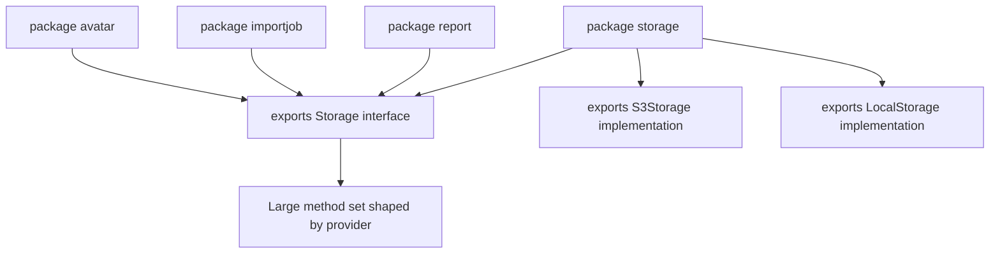
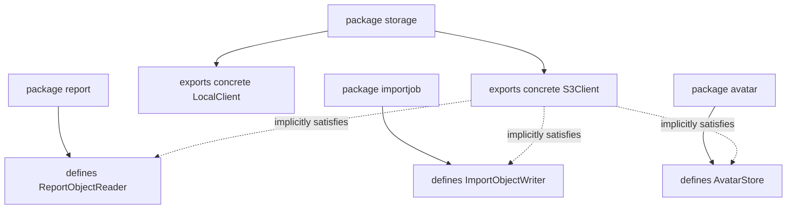
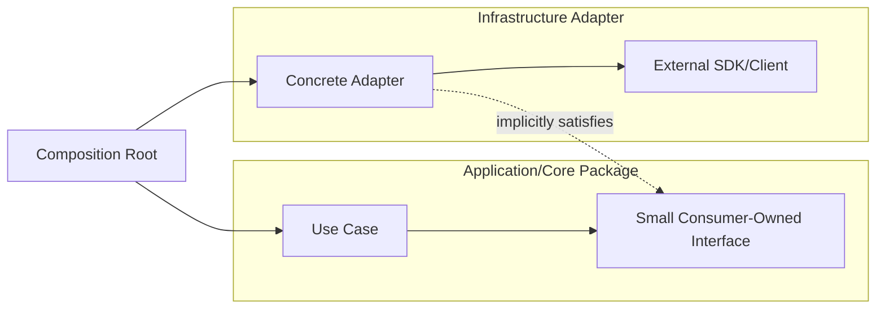

# learn-go-design-patterns-common-patterns-anti-patterns-part-005.md

# Part 005 — Interface Placement Pattern

Seri: **Go Design Patterns, Common Patterns, and Anti-Patterns**  
Target pembaca: **Java software engineer yang ingin mendesain Go codebase production-grade**  
Fokus: **di mana interface seharusnya didefinisikan, kapan interface perlu ada, kapan interface justru merusak desain, dan bagaimana interface membentuk boundary package yang stabil**

> Status seri: **belum selesai**. Ini adalah **Part 005 dari 035**.

---

## 1. Tujuan Part Ini

Part ini membahas salah satu sumber kesalahan desain terbesar bagi engineer yang datang dari Java ke Go: **membuat interface terlalu cepat, terlalu besar, dan di tempat yang salah**.

Di Java, interface sering menjadi default abstraction:

```java
public interface UserService {
    User getUserById(String id);
    void createUser(CreateUserRequest request);
}

public class UserServiceImpl implements UserService {
    ...
}
```

Di Go, pattern seperti itu sering menjadi noise:

```go
type UserService interface {
    GetUserByID(ctx context.Context, id string) (User, error)
    CreateUser(ctx context.Context, req CreateUserRequest) error
}

type userService struct {
    ...
}
```

Bukan berarti Go tidak memakai interface. Justru Go sangat kuat karena interface-nya **implicit**, kecil, composable, dan structural. Masalahnya: kekuatan itu sering disalahgunakan ketika kita membawa mental model Java secara langsung.

Tujuan part ini:

1. Memahami **interface as consumer contract**, bukan provider ceremony.
2. Mengetahui kapan interface sebaiknya dibuat.
3. Mengetahui kapan concrete type lebih baik.
4. Mendesain interface kecil berbasis capability.
5. Menghindari interface pollution.
6. Menghindari provider-owned interface yang tidak punya value.
7. Membuat testing seam tanpa over-mocking.
8. Membaca package boundary dari interface placement.
9. Mendesain interface untuk production codebase: evolvable, testable, observable, dan tidak over-engineered.

---

## 2. Core Thesis

> Di Go, interface biasanya lebih sehat jika didefinisikan oleh package yang **menggunakan behavior**, bukan package yang **menyediakan implementation**.

Dengan kata lain:

```text
Provider package exports concrete behavior.
Consumer package defines the small capability it needs.
```

Contoh:

```go
// package smtpclient
package smtpclient

type Client struct {
    // concrete implementation detail
}

func New(config Config) (*Client, error) {
    ...
}

func (c *Client) Send(ctx context.Context, msg Message) error {
    ...
}
```

Lalu consumer mendefinisikan interface sesuai kebutuhan:

```go
// package notification
package notification

type MailSender interface {
    Send(ctx context.Context, msg smtpclient.Message) error
}

type Service struct {
    mail MailSender
}
```

Mengapa lebih baik?

Karena consumer tidak peduli bahwa provider punya 10 method lain. Consumer hanya peduli capability kecil yang dipakai.

---

## 3. Java Mindset vs Go Mindset

### 3.1 Java Mindset

Dalam Java, interface sering dipakai untuk:

- polymorphism eksplisit,
- dependency injection container,
- mocking,
- implementation swapping,
- contract formal,
- framework proxy,
- annotation-driven behavior,
- AOP,
- testing isolation,
- future extensibility.

Akibatnya, Java codebase sering punya pola:

```text
UserController
  -> UserService interface
      -> UserServiceImpl
          -> UserRepository interface
              -> JdbcUserRepository
```

Pattern ini tidak otomatis buruk di Java karena ekosistem Java memang sering mengandalkan explicit abstraction, reflection, proxy, annotation, runtime wiring, dan DI container.

### 3.2 Go Mindset

Dalam Go:

- interface implementation bersifat implicit,
- tidak perlu menulis `implements`,
- interface kecil lebih idiomatis,
- concrete type sering lebih jelas,
- package boundary lebih penting dari class hierarchy,
- explicit wiring lebih umum daripada DI container,
- test seam bisa dibuat dengan interface kecil, fake, function, atau concrete test helper,
- abstraction dibuat saat ada tekanan nyata, bukan sebagai default.

Go lebih sering memakai pola:

```text
handler
  -> application concrete service
      -> small consumer-owned interface for dependency it needs
          -> concrete adapter
```

Bukan:

```text
interface for every service
interface for every repository
interface for every client
interface for every manager
```

---

## 4. Mental Model: Interface adalah Shape of Need

Interface Go sebaiknya dipahami sebagai:

> **Shape of need**, bukan shape of provider.

Provider mungkin bisa melakukan banyak hal:

```go
type S3Client struct{}

func (c *S3Client) PutObject(ctx context.Context, key string, body io.Reader) error { ... }
func (c *S3Client) GetObject(ctx context.Context, key string) (io.ReadCloser, error) { ... }
func (c *S3Client) DeleteObject(ctx context.Context, key string) error { ... }
func (c *S3Client) ListObjects(ctx context.Context, prefix string) ([]Object, error) { ... }
func (c *S3Client) CopyObject(ctx context.Context, from, to string) error { ... }
```

Tetapi satu use case mungkin hanya perlu menyimpan file:

```go
type ObjectWriter interface {
    PutObject(ctx context.Context, key string, body io.Reader) error
}
```

Use case lain hanya perlu membaca:

```go
type ObjectReader interface {
    GetObject(ctx context.Context, key string) (io.ReadCloser, error)
}
```

Use case lain perlu membaca dan menulis:

```go
type ObjectStore interface {
    ObjectReader
    ObjectWriter
}
```

Ini membuat dependency lebih tajam:

```text
Bad dependency:  use case depends on everything provider can do
Good dependency: use case depends only on behavior it needs
```

---

## 5. Diagram: Provider-Owned vs Consumer-Owned Interface

### 5.1 Provider-Owned Interface



Masalah umum:

- semua consumer dipaksa menerima method yang tidak dipakai,
- interface tumbuh karena kebutuhan banyak caller,
- test fake menjadi berat,
- perubahan satu method memecahkan banyak package,
- dependency menjadi lebih lebar dari kebutuhan.

### 5.2 Consumer-Owned Interface



Keuntungan:

- setiap consumer punya contract minimal,
- fake test kecil,
- provider bebas berevolusi,
- import direction lebih bersih,
- capability boundary lebih jelas.

---

## 6. Rule of Thumb: Accept Interfaces, Return Structs

Salah satu idiom populer Go:

> **Accept interfaces, return structs.**

Artinya:

- function/constructor yang menerima dependency boleh menerima interface kecil,
- constructor biasanya mengembalikan concrete type.

Contoh baik:

```go
type Clock interface {
    Now() time.Time
}

type Service struct {
    clock Clock
}

func NewService(clock Clock) *Service {
    return &Service{clock: clock}
}
```

Provider mengembalikan concrete type:

```go
type SystemClock struct{}

func NewSystemClock() *SystemClock {
    return &SystemClock{}
}

func (SystemClock) Now() time.Time {
    return time.Now()
}
```

Kenapa constructor tidak mengembalikan interface?

```go
// Usually avoid this.
func NewSystemClock() Clock {
    return SystemClock{}
}
```

Masalahnya:

1. Caller kehilangan akses ke method concrete yang mungkin valid.
2. Provider memaksakan interface miliknya sendiri.
3. Testing tidak lebih mudah.
4. Public API menjadi lebih sempit secara tidak perlu.
5. Evolution lebih sulit jika interface harus berubah.

Namun rule ini bukan hukum absolut. Ada kasus return interface valid, misalnya:

- package memang mendefinisikan abstraction utama,
- implementation sengaja disembunyikan,
- caller hanya boleh memakai contract tertentu,
- plugin/factory memilih implementation runtime,
- package standard library style seperti `io.Reader`, `hash.Hash`, `cipher.Block`.

Tapi default yang sehat untuk application code:

```text
Constructor returns concrete type unless there is a strong reason not to.
```

---

## 7. Kapan Interface Perlu Ada?

Interface di Go layak dibuat jika minimal satu dari kondisi ini benar.

### 7.1 Ada lebih dari satu implementation nyata

Contoh:

```go
type TokenSigner interface {
    Sign(ctx context.Context, claims Claims) (string, error)
}
```

Implementation:

```text
HMAC signer
RSA signer
KMS signer
Fake signer for tests
```

Interface masuk akal karena behavior punya variasi implementation nyata.

### 7.2 Consumer hanya butuh subset kecil dari concrete type

Contoh:

```go
type UserLookup interface {
    FindByID(ctx context.Context, id UserID) (User, error)
}
```

Concrete repository mungkin punya banyak method, tapi use case hanya butuh lookup.

### 7.3 Interface diperlukan untuk test seam

Contoh:

```go
type EmailSender interface {
    Send(ctx context.Context, email Email) error
}
```

Test bisa memakai fake:

```go
type fakeEmailSender struct {
    sent []Email
}

func (f *fakeEmailSender) Send(ctx context.Context, email Email) error {
    f.sent = append(f.sent, email)
    return nil
}
```

Namun hati-hati: interface hanya untuk mock tidak selalu perlu. Kadang fake concrete, test server, atau function seam lebih baik.

### 7.4 Interface mewakili external boundary

External dependency sering baik dibungkus dengan interface kecil di sisi consumer:

- payment gateway,
- email provider,
- object storage,
- identity provider,
- external HTTP API,
- queue publisher,
- clock,
- UUID generator,
- feature flag,
- secret store.

Alasannya:

- failure mode harus dikendalikan,
- retry/error classification perlu distandarkan,
- test tidak boleh tergantung provider nyata,
- domain tidak boleh bocor dependency vendor.

### 7.5 Interface mewakili capability yang stabil

Contoh standard library:

```go
type Reader interface {
    Read(p []byte) (n int, err error)
}
```

`io.Reader` kuat karena:

- method-nya sangat kecil,
- behavior-nya sangat general,
- namanya capability,
- tidak terikat implementation,
- composition-nya luas.

### 7.6 Interface digunakan untuk policy injection

Contoh:

```go
type AuthorizationPolicy interface {
    CanApprove(ctx context.Context, actor Actor, application Application) Decision
}
```

Policy bisa berubah berdasarkan:

- role,
- agency,
- workflow state,
- product line,
- experiment,
- regulation version.

Interface masuk akal karena policy adalah replaceable behavior.

---

## 8. Kapan Interface Tidak Perlu Ada?

### 8.1 Hanya ada satu implementation dan tidak ada consumer yang butuh abstraction

Buruk:

```go
type UserService interface {
    Create(ctx context.Context, req CreateUserRequest) error
}

type userService struct{}

func NewUserService() UserService {
    return &userService{}
}
```

Jika hanya satu implementation, tidak ada behavior variance, dan tidak ada caller yang butuh seam, gunakan concrete:

```go
type UserService struct{}

func NewUserService() *UserService {
    return &UserService{}
}
```

### 8.2 Interface hanya mirror dari struct

Buruk:

```go
type OrderService interface {
    CreateOrder(ctx context.Context, req CreateOrderRequest) (OrderID, error)
    CancelOrder(ctx context.Context, id OrderID) error
    ApproveOrder(ctx context.Context, id OrderID) error
    RejectOrder(ctx context.Context, id OrderID, reason string) error
    ListOrders(ctx context.Context, filter OrderFilter) ([]Order, error)
}

type orderService struct{}
```

Jika interface 1:1 dengan concrete implementation, tanya:

```text
Siapa consumer yang benar-benar butuh semua method ini?
```

Sering jawabannya: tidak ada.

### 8.3 Interface dibuat supaya “nanti bisa diganti”

Ini speculative abstraction.

Pertanyaan yang lebih sehat:

1. Apa tekanan perubahan yang sudah terlihat?
2. Berapa biaya menambahkan interface nanti?
3. Apakah concrete API sekarang menghalangi perubahan?
4. Apakah interface sekarang memperjelas atau mengaburkan desain?

Di Go, karena interface implicit, menambahkan interface di sisi consumer nanti biasanya mudah.

### 8.4 Interface hanya untuk mengikuti pattern Java

Buruk:

```go
type IUserRepository interface {
    Save(ctx context.Context, user User) error
}

type UserRepositoryImpl struct{}
```

Go tidak perlu `I` prefix, tidak perlu `Impl`, dan tidak perlu interface hanya untuk meniru class hierarchy.

### 8.5 Interface besar untuk semua operasi

Buruk:

```go
type Storage interface {
    Put(ctx context.Context, key string, r io.Reader) error
    Get(ctx context.Context, key string) (io.ReadCloser, error)
    Delete(ctx context.Context, key string) error
    List(ctx context.Context, prefix string) ([]Object, error)
    Copy(ctx context.Context, from, to string) error
    Move(ctx context.Context, from, to string) error
    PresignGet(ctx context.Context, key string) (string, error)
    PresignPut(ctx context.Context, key string) (string, error)
}
```

Lebih baik pecah capability:

```go
type ObjectWriter interface {
    Put(ctx context.Context, key string, r io.Reader) error
}

type ObjectReader interface {
    Get(ctx context.Context, key string) (io.ReadCloser, error)
}

type ObjectDeleter interface {
    Delete(ctx context.Context, key string) error
}
```

---

## 9. Interface Size: Semakin Kecil Semakin Tajam

Interface kecil memberi banyak keuntungan:

1. Mudah diimplementasikan.
2. Mudah dibuat fake.
3. Lebih stabil.
4. Lebih mudah dipahami.
5. Lebih jelas dependency-nya.
6. Lebih sedikit ripple effect.
7. Lebih rendah coupling.

Bandingkan:

```go
type UserRepository interface {
    Create(ctx context.Context, user User) error
    Update(ctx context.Context, user User) error
    Delete(ctx context.Context, id UserID) error
    FindByID(ctx context.Context, id UserID) (User, error)
    FindByEmail(ctx context.Context, email string) (User, error)
    List(ctx context.Context, filter UserFilter) ([]User, error)
    Count(ctx context.Context, filter UserFilter) (int, error)
}
```

Dengan:

```go
type UserFinder interface {
    FindByID(ctx context.Context, id UserID) (User, error)
}

type UserCreator interface {
    Create(ctx context.Context, user User) error
}
```

Jika sebuah service hanya butuh `FindByID`, ia tidak perlu tahu kemampuan `Delete`, `List`, atau `Count`.

---

## 10. Capability Interface Pattern

Capability interface adalah interface yang dinamai berdasarkan kemampuan, bukan role organisasi.

### 10.1 Naming yang Baik

Baik:

```go
type Reader interface { Read([]byte) (int, error) }
type Writer interface { Write([]byte) (int, error) }
type Closer interface { Close() error }
type Flusher interface { Flush() error }
type Validator interface { Validate() error }
type Authorizer interface { Authorize(ctx context.Context, req Request) Decision }
type Publisher interface { Publish(ctx context.Context, event Event) error }
type Signer interface { Sign(ctx context.Context, payload []byte) ([]byte, error) }
```

Kurang baik:

```go
type Manager interface { ... }
type Processor interface { ... }
type Service interface { ... }
type Handler interface { ... }
type Helper interface { ... }
type Util interface { ... }
```

Bukan berarti `Processor` atau `Handler` selalu buruk. Tetapi nama generik sering menandakan behavior belum dipahami cukup tajam.

### 10.2 Single-Method Interface

Single-method interface sering sangat kuat di Go.

Contoh:

```go
type Clock interface {
    Now() time.Time
}
```

```go
type IDGenerator interface {
    NewID() string
}
```

```go
type PasswordHasher interface {
    Hash(password string) (string, error)
}
```

```go
type PasswordVerifier interface {
    Verify(hash string, password string) error
}
```

Keuntungannya:

- dependency sangat jelas,
- fake sangat kecil,
- behavior mudah diuji,
- contract stabil,
- tidak memaksa caller bergantung pada method lain.

---

## 11. Interface Composition Pattern

Go memungkinkan interface disusun dari interface kecil.

```go
type Reader interface {
    Read(p []byte) (n int, err error)
}

type Writer interface {
    Write(p []byte) (n int, err error)
}

type ReadWriter interface {
    Reader
    Writer
}
```

Dalam application code:

```go
type UserReader interface {
    FindByID(ctx context.Context, id UserID) (User, error)
}

type UserWriter interface {
    Save(ctx context.Context, user User) error
}

type UserStore interface {
    UserReader
    UserWriter
}
```

Gunakan composition ketika:

- beberapa consumer butuh subset berbeda,
- capability bisa berdiri sendiri,
- gabungan capability punya makna domain yang jelas.

Jangan gunakan composition untuk membuat interface besar secara bertahap tanpa tujuan:

```go
type Everything interface {
    UserReader
    UserWriter
    UserDeleter
    UserLister
    UserCounter
    UserReporter
    UserExporter
}
```

Jika gabungan tidak punya meaning, itu hanya god interface dengan langkah tambahan.

---

## 12. Consumer-Owned Interface: Pattern Detail

Misalkan package `billing` perlu memanggil payment gateway.

### 12.1 Provider Package

```go
package stripeclient

type Client struct {
    apiKey string
}

func New(apiKey string) *Client {
    return &Client{apiKey: apiKey}
}

func (c *Client) CreateCharge(ctx context.Context, req ChargeRequest) (ChargeResponse, error) {
    ...
}

func (c *Client) RefundCharge(ctx context.Context, req RefundRequest) (RefundResponse, error) {
    ...
}

func (c *Client) GetCharge(ctx context.Context, id string) (ChargeResponse, error) {
    ...
}
```

Provider tidak perlu export interface `ClientInterface`.

### 12.2 Consumer Package

```go
package billing

type Charger interface {
    CreateCharge(ctx context.Context, req stripeclient.ChargeRequest) (stripeclient.ChargeResponse, error)
}

type Service struct {
    charger Charger
}

func NewService(charger Charger) *Service {
    return &Service{charger: charger}
}
```

`billing.Service` hanya bergantung pada capability `CreateCharge`.

Jika nanti billing tidak mau bocor tipe `stripeclient`, buat anti-corruption adapter:

```go
package billing

type ChargeRequest struct {
    AccountID string
    AmountCents int64
    Currency string
}

type ChargeResult struct {
    ProviderChargeID string
}

type Charger interface {
    Charge(ctx context.Context, req ChargeRequest) (ChargeResult, error)
}
```

Lalu adapter:

```go
package paymentadapter

type StripeCharger struct {
    client *stripeclient.Client
}

func NewStripeCharger(client *stripeclient.Client) *StripeCharger {
    return &StripeCharger{client: client}
}

func (s *StripeCharger) Charge(ctx context.Context, req billing.ChargeRequest) (billing.ChargeResult, error) {
    resp, err := s.client.CreateCharge(ctx, stripeclient.ChargeRequest{
        AccountID: req.AccountID,
        Amount:    req.AmountCents,
        Currency:  req.Currency,
    })
    if err != nil {
        return billing.ChargeResult{}, translateStripeError(err)
    }
    return billing.ChargeResult{ProviderChargeID: resp.ID}, nil
}
```

Di sini interface tetap milik consumer/domain/application boundary.

---

## 13. Diagram: Dependency Direction



Hal penting:

- core tidak import provider SDK jika tidak perlu,
- adapter bergantung ke core interface/type jika mengikuti port-adapter style,
- composition root menghubungkan concrete adapter ke use case,
- interface tidak harus berada di package provider.

---

## 14. Interface Placement Berdasarkan Layer

### 14.1 Transport Layer

HTTP handler biasanya tidak perlu interface untuk dirinya sendiri.

```go
type Handler struct {
    app *application.Service
}
```

Atau jika handler hanya butuh capability kecil:

```go
type ApplicationCreator interface {
    SubmitApplication(ctx context.Context, cmd SubmitApplicationCommand) (SubmitApplicationResult, error)
}

type Handler struct {
    creator ApplicationCreator
}
```

Interface berada di package handler jika tujuannya membatasi dependency handler.

### 14.2 Application Layer

Application service sering mendefinisikan interface untuk dependency eksternal:

```go
type ApplicationRepository interface {
    FindByID(ctx context.Context, id ApplicationID) (Application, error)
    Save(ctx context.Context, app Application) error
}

type EventPublisher interface {
    Publish(ctx context.Context, event Event) error
}

type Clock interface {
    Now() time.Time
}
```

Ini sehat jika interface tersebut adalah requirement use case.

### 14.3 Infrastructure Layer

Infrastructure package biasanya export concrete type:

```go
type PostgresApplicationRepository struct {
    db *sql.DB
}

func NewPostgresApplicationRepository(db *sql.DB) *PostgresApplicationRepository {
    return &PostgresApplicationRepository{db: db}
}
```

Tidak perlu:

```go
type PostgresApplicationRepositoryInterface interface { ... }
```

### 14.4 Shared Platform Package

Platform package bisa export interface jika memang abstraction-nya reusable dan stabil.

Contoh:

```go
type Logger interface {
    Info(ctx context.Context, msg string, attrs ...Attr)
    Error(ctx context.Context, msg string, attrs ...Attr)
}
```

Namun ini berisiko menjadi terlalu besar. Untuk logging, sering lebih baik menggunakan concrete logger atau interface kecil sesuai boundary.

---

## 15. Testing Seam Without Interface Pollution

Interface sering dibuat “agar bisa di-mock”. Ini kadang benar, tapi sering berlebihan.

### 15.1 Bad: Interface Hanya Karena Mocking Habit

```go
type UserValidator interface {
    Validate(user User) error
}

type DefaultUserValidator struct{}
```

Jika validator pure dan deterministic, cukup pakai concrete:

```go
type UserValidator struct{}

func (v UserValidator) Validate(user User) error {
    ...
}
```

Test langsung:

```go
func TestUserValidator_Validate(t *testing.T) {
    v := UserValidator{}
    err := v.Validate(User{})
    ...
}
```

### 15.2 Good: Interface untuk External Side Effect

```go
type EmailSender interface {
    Send(ctx context.Context, email Email) error
}
```

Karena email sender:

- melakukan network I/O,
- bisa gagal,
- mahal,
- tidak deterministic,
- tidak cocok dipanggil unit test.

### 15.3 Function Seam Alternative

Tidak semua seam perlu interface. Kadang function field cukup.

```go
type Service struct {
    now func() time.Time
}

func NewService() *Service {
    return &Service{now: time.Now}
}
```

Test:

```go
svc := &Service{
    now: func() time.Time {
        return time.Date(2026, 1, 1, 0, 0, 0, 0, time.UTC)
    },
}
```

Namun jangan berlebihan memakai function field untuk banyak dependency. Jika behavior punya identity dan banyak method terkait, interface lebih jelas.

### 15.4 Fake Instead of Mock

Fake sering lebih baik daripada mock yang terlalu interaction-based.

```go
type fakeUserStore struct {
    users map[UserID]User
}

func (f *fakeUserStore) FindByID(ctx context.Context, id UserID) (User, error) {
    user, ok := f.users[id]
    if !ok {
        return User{}, ErrUserNotFound
    }
    return user, nil
}
```

Mock berbasis expectation bisa membuat test rapuh jika test terlalu peduli urutan panggilan internal.

---

## 16. Compile-Time Interface Assertion

Kadang kita ingin memastikan concrete type memenuhi interface tertentu.

```go
var _ billing.Charger = (*StripeCharger)(nil)
```

Maknanya:

```text
At compile time, *StripeCharger must satisfy billing.Charger.
```

Gunakan ketika:

- adapter dimaksudkan memenuhi port tertentu,
- refactor method signature berisiko diam-diam memutus contract,
- interface berada di package lain dan relation-nya penting.

Jangan gunakan secara berlebihan untuk semua type.

Contoh:

```go
var _ io.Reader = (*Buffer)(nil)
```

Jika `Buffer` tidak lagi punya method `Read([]byte) (int, error)`, compile gagal.

---

## 17. Nil Interface Trap

Interface di Go menyimpan dua hal:

```text
(dynamic type, dynamic value)
```

Ini membuat kasus berikut berbahaya:

```go
type Notifier interface {
    Notify(ctx context.Context, msg string) error
}

type EmailNotifier struct{}

func (e *EmailNotifier) Notify(ctx context.Context, msg string) error {
    return nil
}

func NewNotifier(disabled bool) Notifier {
    if disabled {
        var n *EmailNotifier = nil
        return n
    }
    return &EmailNotifier{}
}
```

Caller:

```go
n := NewNotifier(true)
if n == nil {
    // This will not run.
}
```

Kenapa?

```text
n = (*EmailNotifier, nil)
```

Interface-nya tidak nil karena dynamic type ada.

Lebih baik:

```go
func NewNotifier(disabled bool) Notifier {
    if disabled {
        return nil
    }
    return &EmailNotifier{}
}
```

Atau gunakan no-op implementation:

```go
type NoopNotifier struct{}

func (NoopNotifier) Notify(ctx context.Context, msg string) error {
    return nil
}
```

Lalu:

```go
func NewNotifier(disabled bool) Notifier {
    if disabled {
        return NoopNotifier{}
    }
    return &EmailNotifier{}
}
```

Pattern no-op sering lebih aman daripada optional nil dependency.

---

## 18. Nil Dependency Design

Jika struct menerima interface dependency:

```go
type Service struct {
    publisher EventPublisher
}
```

Jangan biarkan nil dependency meledak jauh di runtime.

Buruk:

```go
func NewService(publisher EventPublisher) *Service {
    return &Service{publisher: publisher}
}
```

Lebih baik validate:

```go
func NewService(publisher EventPublisher) (*Service, error) {
    if publisher == nil {
        return nil, errors.New("publisher is required")
    }
    return &Service{publisher: publisher}, nil
}
```

Atau jika dependency optional, gunakan no-op:

```go
type NoopPublisher struct{}

func (NoopPublisher) Publish(ctx context.Context, event Event) error {
    return nil
}

func NewService(publisher EventPublisher) *Service {
    if publisher == nil {
        publisher = NoopPublisher{}
    }
    return &Service{publisher: publisher}
}
```

Pilih salah satu:

```text
Required dependency -> reject nil early.
Optional dependency -> replace with explicit no-op.
```

Jangan ambiguous.

---

## 19. Interface and Pointer Receiver

Concrete type dengan pointer receiver hanya satisfy interface sebagai pointer.

```go
type Counter struct {
    n int
}

func (c *Counter) Inc() {
    c.n++
}

type Incrementer interface {
    Inc()
}
```

Ini valid:

```go
var i Incrementer = &Counter{}
```

Ini tidak valid:

```go
var i Incrementer = Counter{}
```

Karena `Inc` ada pada `*Counter`, bukan `Counter`.

Implication design:

- jika method mutates receiver, pointer receiver wajar,
- jika method tidak mutates dan type kecil, value receiver bisa cukup,
- interface satisfaction dipengaruhi receiver set,
- jangan asal mencampur pointer/value receiver tanpa alasan.

---

## 20. Interface Method Signature Design

Interface method signature adalah contract. Buat dengan serius.

### 20.1 Context Placement

Untuk operation yang bisa blocking, I/O, atau butuh cancellation:

```go
type UserFinder interface {
    FindByID(ctx context.Context, id UserID) (User, error)
}
```

Jangan:

```go
type UserFinder interface {
    FindByID(id UserID) (User, error)
}
```

Jika implementation memakai DB/network, tanpa context caller tidak bisa membatalkan operation.

Namun jangan pakai context untuk pure in-memory deterministic function hanya karena semua method harus seragam.

### 20.2 Return Shape

Hindari ambiguity:

```go
FindByID(ctx context.Context, id UserID) (*User, error)
```

Jika not found:

- apakah `nil, nil`?
- apakah `nil, ErrNotFound`?
- apakah `&User{}, nil`?

Lebih eksplisit:

```go
FindByID(ctx context.Context, id UserID) (User, error)
```

Dengan:

```go
var ErrUserNotFound = errors.New("user not found")
```

Atau:

```go
FindByID(ctx context.Context, id UserID) (User, bool, error)
```

Jika not-found bukan exceptional condition.

### 20.3 Avoid Boolean Mystery

Buruk:

```go
Authorize(ctx context.Context, user User, action string) (bool, error)
```

Lebih baik untuk domain penting:

```go
type Decision struct {
    Allowed bool
    Reason  string
    RuleID  string
}

type Authorizer interface {
    Authorize(ctx context.Context, req AuthorizationRequest) (Decision, error)
}
```

Especially untuk regulatory/workflow system, decision trace lebih penting daripada boolean.

### 20.4 Avoid Stringly Typed Contract

Buruk:

```go
Publish(ctx context.Context, topic string, payload []byte) error
```

Lebih baik jika domain event penting:

```go
type EventPublisher interface {
    PublishApplicationApproved(ctx context.Context, event ApplicationApproved) error
}
```

Atau generic envelope:

```go
type Event struct {
    Type    EventType
    Version int
    Key     string
    Payload []byte
}

type EventPublisher interface {
    Publish(ctx context.Context, event Event) error
}
```

Tergantung kebutuhan extensibility.

---

## 21. Anti-Pattern: Interface Pollution

Interface pollution terjadi ketika codebase penuh interface yang tidak memberi value desain.

Gejala:

```text
Every concrete type has a matching interface.
Every package exports interfaces and impl structs.
Most interfaces have exactly one implementation.
Tests mock everything.
Navigation requires jumping interface -> impl -> wrapper -> decorator.
Changing one method causes widespread fake/mock updates.
```

Contoh buruk:

```go
type UserControllerInterface interface { ... }
type UserServiceInterface interface { ... }
type UserRepositoryInterface interface { ... }
type UserValidatorInterface interface { ... }
type UserMapperInterface interface { ... }
type UserFactoryInterface interface { ... }
```

Root cause:

- Java/Spring mental model,
- fear of concrete dependency,
- mock-first testing,
- speculative extensibility,
- misunderstanding Go implicit interfaces,
- desire to look “architected”.

Refactoring:

1. Cari interface dengan satu implementation.
2. Cari interface yang hanya dipakai oleh constructor return type.
3. Cari interface yang tidak dipakai sebagai dependency oleh consumer.
4. Inline interface menjadi concrete type.
5. Buat interface kecil di consumer yang benar-benar membutuhkan seam.
6. Replace mocks with fakes or real concrete tests.

---

## 22. Anti-Pattern: Provider-Owned Mega Interface

Buruk:

```go
package userrepo

type Repository interface {
    Create(ctx context.Context, user User) error
    Update(ctx context.Context, user User) error
    Delete(ctx context.Context, id UserID) error
    FindByID(ctx context.Context, id UserID) (User, error)
    FindByEmail(ctx context.Context, email string) (User, error)
    List(ctx context.Context, filter Filter) ([]User, error)
    Count(ctx context.Context, filter Filter) (int, error)
    Exists(ctx context.Context, id UserID) (bool, error)
    Lock(ctx context.Context, id UserID) error
    Unlock(ctx context.Context, id UserID) error
}
```

Masalah:

- semua use case tergantung ke semua method,
- fake menjadi berat,
- method tambahan memaksa banyak test update,
- repository package menjadi pusat coupling,
- interface merepresentasikan provider, bukan kebutuhan.

Lebih baik di consumer:

```go
package approveapplication

type ApplicationLoader interface {
    FindByID(ctx context.Context, id ApplicationID) (Application, error)
}

type ApplicationSaver interface {
    Save(ctx context.Context, app Application) error
}
```

Atau gabungan kecil:

```go
type ApplicationStore interface {
    ApplicationLoader
    ApplicationSaver
}
```

---

## 23. Anti-Pattern: Interface Returning Constructor

Buruk:

```go
type Service interface {
    Submit(ctx context.Context, cmd SubmitCommand) (SubmitResult, error)
}

type service struct {
    repo Repository
}

func NewService(repo Repository) Service {
    return &service{repo: repo}
}
```

Kapan ini buruk?

- interface hanya punya satu implementation,
- interface berada di provider package,
- caller tidak membutuhkan abstraction,
- test bisa memakai concrete,
- tidak ada variasi implementation.

Lebih baik:

```go
type Service struct {
    repo Repository
}

func NewService(repo Repository) *Service {
    return &Service{repo: repo}
}
```

Jika consumer butuh subset:

```go
package handler

type Submitter interface {
    Submit(ctx context.Context, cmd application.SubmitCommand) (application.SubmitResult, error)
}
```

Handler menerima interface kecil, application tetap expose concrete service.

---

## 24. Anti-Pattern: `Impl` Naming

Buruk:

```go
type UserService interface { ... }
type UserServiceImpl struct { ... }
```

Nama `Impl` tidak menjelaskan behavior. Ia hanya menjelaskan bahwa type adalah implementation dari interface.

Lebih baik:

```go
type Service struct { ... }
```

Atau jika ada beberapa implementation:

```go
type PostgresUserStore struct { ... }
type MemoryUserStore struct { ... }
type CachedUserStore struct { ... }
```

Nama concrete type sebaiknya menjelaskan strategy/technology/behavior.

---

## 25. Anti-Pattern: `I` Prefix

Buruk:

```go
type IUserStore interface { ... }
```

Go convention tidak memakai `I` prefix.

Lebih baik:

```go
type UserStore interface { ... }
```

Atau lebih tajam:

```go
type UserFinder interface { ... }
type UserSaver interface { ... }
```

Nama interface satu method sering menggunakan suffix `-er`:

```go
Reader
Writer
Closer
Flusher
Validator
Signer
Publisher
Authorizer
```

---

## 26. Anti-Pattern: Empty Interface as Escape Hatch

Sebelum Go 1.18, `interface{}` sering dipakai untuk any value. Sekarang ada alias `any`, tapi masalah desain tetap sama.

Buruk:

```go
func Process(input interface{}) error {
    switch v := input.(type) {
    case string:
        ...
    case []byte:
        ...
    case map[string]any:
        ...
    default:
        return errors.New("unsupported input")
    }
}
```

Masalah:

- type safety hilang,
- caller tidak tahu contract,
- runtime error meningkat,
- test matrix membesar,
- API sulit dipahami.

Lebih baik:

```go
func ProcessBytes(input []byte) error
func ProcessString(input string) error
func ProcessDocument(input Document) error
```

Atau generics jika benar-benar algorithmic:

```go
func Contains[T comparable](items []T, target T) bool
```

Gunakan `any` untuk boundary yang memang untyped:

- JSON arbitrary payload,
- generic container internal,
- logging attributes,
- plugin boundary,
- reflection-heavy adapter.

Jangan jadikan `any` sebagai pengganti desain type.

---

## 27. Anti-Pattern: Context as Interface Replacement

Buruk:

```go
func Process(ctx context.Context, req Request) error {
    db := ctx.Value("db").(*sql.DB)
    logger := ctx.Value("logger").(Logger)
    config := ctx.Value("config").(Config)
    ...
}
```

Ini menyembunyikan dependency.

Lebih baik:

```go
type Service struct {
    db     *sql.DB
    logger *slog.Logger
    config Config
}

func (s *Service) Process(ctx context.Context, req Request) error {
    ...
}
```

Context boleh membawa request-scoped data seperti:

- cancellation,
- deadline,
- trace ID,
- auth principal jika boundary jelas,
- request metadata.

Context tidak boleh menjadi service locator.

---

## 28. Anti-Pattern: Mock-Driven Architecture

Mock-driven architecture terjadi ketika shape production code ditentukan oleh kenyamanan mocking, bukan kebutuhan domain.

Gejala:

- setiap dependency interface,
- setiap method punya mock expectation,
- test gagal karena urutan call berubah padahal behavior tetap benar,
- refactor internal mahal,
- domain test lebih banyak setup daripada assertion.

Buruk:

```go
repo.EXPECT().FindByID(ctx, id).Return(user, nil)
auth.EXPECT().CanApprove(ctx, actor, user).Return(true, nil)
repo.EXPECT().Save(ctx, approvedUser).Return(nil)
pub.EXPECT().Publish(ctx, event).Return(nil)
```

Test ini terlalu peduli choreography internal.

Lebih sehat:

- fake repository in-memory,
- fake publisher yang menyimpan events,
- assert final state dan emitted events,
- mock hanya untuk tricky external side effect/failure.

Contoh:

```go
store := newFakeApplicationStore()
publisher := newFakePublisher()
svc := NewApproveService(store, publisher, fixedClock)

result, err := svc.Approve(ctx, ApproveCommand{ID: appID, ActorID: actorID})

require.NoError(t, err)
require.True(t, result.Approved)
require.Equal(t, StatusApproved, store.mustGet(appID).Status)
require.Len(t, publisher.events, 1)
```

---

## 29. Interface and Error Semantics

Interface method harus jelas tentang error behavior.

Buruk:

```go
type UserFinder interface {
    Find(ctx context.Context, id string) (*User, error)
}
```

Tanpa contract:

- not found error apa?
- context cancellation dibungkus atau diteruskan?
- validation error dari mana?
- retryable error bisa dikenali?
- partial result mungkin?

Lebih baik dokumentasikan:

```go
// UserFinder loads users by ID.
// It returns ErrUserNotFound when no user exists for the given ID.
// It returns context.Canceled or context.DeadlineExceeded when ctx is canceled.
// Other errors indicate infrastructure failure and may be retryable depending on classification.
type UserFinder interface {
    FindByID(ctx context.Context, id UserID) (User, error)
}
```

Interface bukan hanya method set. Interface adalah semantic contract.

---

## 30. Interface and Observability

Interface boundary sering menjadi titik bagus untuk observability.

Contoh dependency external:

```go
type PaymentGateway interface {
    Charge(ctx context.Context, req ChargeRequest) (ChargeResult, error)
}
```

Di boundary ini, kita bisa menambahkan decorator:

```go
type ObservedPaymentGateway struct {
    next PaymentGateway
    log  *slog.Logger
}

func (g *ObservedPaymentGateway) Charge(ctx context.Context, req ChargeRequest) (ChargeResult, error) {
    start := time.Now()
    result, err := g.next.Charge(ctx, req)
    duration := time.Since(start)

    if err != nil {
        g.log.ErrorContext(ctx, "payment charge failed",
            "duration_ms", duration.Milliseconds(),
            "amount_cents", req.AmountCents,
            "currency", req.Currency,
            "error", err,
        )
        return ChargeResult{}, err
    }

    g.log.InfoContext(ctx, "payment charge succeeded",
        "duration_ms", duration.Milliseconds(),
        "amount_cents", req.AmountCents,
        "currency", req.Currency,
    )
    return result, nil
}
```

Namun hati-hati: jangan membuat interface hanya supaya bisa decorator. Jika concrete type cukup, decorator bisa concrete wrapper. Interface memberi value jika ada boundary behavior yang memang stabil.

---

## 31. Interface and Performance

Interface call di Go punya dynamic dispatch. Biasanya overhead kecil dibanding I/O, tetapi bisa penting di hot path.

Pertimbangkan concrete type jika:

- function dipanggil sangat sering di tight loop,
- method sangat kecil,
- allocation/interface boxing terjadi,
- generic/concrete code bisa di-inline lebih baik,
- profiling menunjukkan overhead nyata.

Contoh hot path:

```go
func Sum(xs []int, adder Adder) int {
    total := 0
    for _, x := range xs {
        total = adder.Add(total, x)
    }
    return total
}
```

Jika ini dipanggil jutaan kali di CPU-bound path, interface mungkin tidak ideal.

Tapi untuk external boundary:

```go
PaymentGateway.Charge(...)
UserRepository.FindByID(...)
EventPublisher.Publish(...)
```

Overhead interface hampir selalu tidak signifikan dibanding network/DB/serialization.

Rule:

```text
Do not optimize away interfaces preemptively.
But do not put interface dispatch in hot loops blindly.
Measure if performance matters.
```

---

## 32. Interface and Generics

Generics bukan pengganti semua interface.

Gunakan interface jika butuh behavior polymorphism:

```go
type Signer interface {
    Sign(ctx context.Context, payload []byte) ([]byte, error)
}
```

Gunakan generics jika butuh type-safe algorithm/data transformation:

```go
func Map[T any, U any](items []T, f func(T) U) []U {
    out := make([]U, 0, len(items))
    for _, item := range items {
        out = append(out, f(item))
    }
    return out
}
```

Jangan membuat generic abstraction untuk domain yang belum stabil:

```go
// Often suspicious.
type Repository[T any, ID comparable] interface {
    Save(ctx context.Context, entity T) error
    FindByID(ctx context.Context, id ID) (T, error)
    Delete(ctx context.Context, id ID) error
}
```

Generic repository terlihat elegan tetapi sering menyembunyikan fakta bahwa tiap aggregate punya query, invariant, transaction, lock, consistency, dan error semantics berbeda.

---

## 33. Case Study: Approval Workflow Service

Kita desain use case approval application.

### 33.1 Naive Java-Style Design

```go
type ApplicationService interface {
    Submit(ctx context.Context, req SubmitRequest) (SubmitResponse, error)
    Approve(ctx context.Context, req ApproveRequest) (ApproveResponse, error)
    Reject(ctx context.Context, req RejectRequest) (RejectResponse, error)
    Cancel(ctx context.Context, req CancelRequest) (CancelResponse, error)
    Get(ctx context.Context, id string) (ApplicationDTO, error)
    List(ctx context.Context, filter ApplicationFilter) ([]ApplicationDTO, error)
}

type ApplicationServiceImpl struct {
    repo ApplicationRepository
}
```

Masalah:

- interface terlalu besar,
- semua caller tergantung semua use case,
- DTO transport bercampur dengan application service,
- implementation naming buruk,
- testing seam terlalu lebar.

### 33.2 Better Go Shape

```go
type ApproveCommand struct {
    ApplicationID ApplicationID
    ActorID       ActorID
    Comment       string
    IdempotencyKey string
}

type ApproveResult struct {
    ApplicationID ApplicationID
    PreviousState State
    CurrentState  State
    DecisionTrace DecisionTrace
}

type ApplicationLoader interface {
    FindByID(ctx context.Context, id ApplicationID) (Application, error)
}

type ApplicationSaver interface {
    Save(ctx context.Context, app Application) error
}

type ApplicationStore interface {
    ApplicationLoader
    ApplicationSaver
}

type Authorizer interface {
    CanApprove(ctx context.Context, actor ActorID, app Application) Decision
}

type EventPublisher interface {
    Publish(ctx context.Context, event Event) error
}

type Clock interface {
    Now() time.Time
}

type ApproveService struct {
    store     ApplicationStore
    authz     Authorizer
    publisher EventPublisher
    clock     Clock
}
```

Use case:

```go
func (s *ApproveService) Approve(ctx context.Context, cmd ApproveCommand) (ApproveResult, error) {
    app, err := s.store.FindByID(ctx, cmd.ApplicationID)
    if err != nil {
        return ApproveResult{}, err
    }

    decision := s.authz.CanApprove(ctx, cmd.ActorID, app)
    if !decision.Allowed {
        return ApproveResult{
            ApplicationID: cmd.ApplicationID,
            CurrentState:  app.State,
            DecisionTrace: decision.Trace,
        }, ErrApprovalNotAllowed
    }

    previous := app.State
    if err := app.Approve(cmd.ActorID, cmd.Comment, s.clock.Now()); err != nil {
        return ApproveResult{}, err
    }

    if err := s.store.Save(ctx, app); err != nil {
        return ApproveResult{}, err
    }

    event := ApplicationApproved{
        ApplicationID: app.ID,
        ActorID:       cmd.ActorID,
        ApprovedAt:    s.clock.Now(),
    }
    if err := s.publisher.Publish(ctx, event); err != nil {
        return ApproveResult{}, err
    }

    return ApproveResult{
        ApplicationID: app.ID,
        PreviousState: previous,
        CurrentState:  app.State,
        DecisionTrace: decision.Trace,
    }, nil
}
```

Catatan: event publish setelah save di contoh ini belum production-perfect jika butuh transactional consistency. Untuk production, outbox pattern lebih aman. Itu dibahas di part event/outbox.

### 33.3 Interface Placement

Interface berada di package use case karena merepresentasikan kebutuhan use case:

```text
ApproveService needs:
- load application
- save application
- evaluate authorization
- publish event
- read time
```

Bukan:

```text
Repository package says everyone must depend on my Repository interface.
```

---

## 34. Refactoring Playbook: Dari Java-Style Interface ke Go-Style Interface

### Step 1 — Inventory Interface

Cari semua interface:

```bash
grep -R "type .* interface" .
```

Kategorikan:

```text
A. Interface standard/capability kecil
B. Interface punya banyak consumer
C. Interface hanya punya satu implementation
D. Interface mirror concrete type
E. Interface untuk external boundary
F. Interface untuk test seam
G. Interface tidak jelas pemiliknya
```

### Step 2 — Find Usage Direction

Untuk setiap interface, tanya:

```text
Siapa yang mendefinisikan?
Siapa yang memakai?
Siapa yang mengimplementasikan?
Apakah method set mengikuti kebutuhan consumer atau kemampuan provider?
```

### Step 3 — Inline Provider-Owned Interface yang Tidak Berguna

Sebelum:

```go
type Service interface { Submit(...) ... }
type service struct { ... }
func NewService(...) Service { return &service{} }
```

Sesudah:

```go
type Service struct { ... }
func NewService(...) *Service { return &Service{} }
```

### Step 4 — Create Consumer Interface Jika Ada Need

```go
package httpapi

type Submitter interface {
    Submit(ctx context.Context, cmd application.SubmitCommand) (application.SubmitResult, error)
}
```

### Step 5 — Split Mega Interface

Sebelum:

```go
type Repository interface {
    Create(...)
    Update(...)
    Delete(...)
    FindByID(...)
    List(...)
}
```

Sesudah:

```go
type Creator interface { Create(...) error }
type Finder interface { FindByID(...) (...) }
type Saver interface { Save(...) error }
```

Gabungkan hanya jika use case benar-benar butuh:

```go
type Store interface {
    Finder
    Saver
}
```

### Step 6 — Replace Brittle Mocks

- gunakan fake untuk stateful dependency,
- gunakan stub untuk simple fixed response,
- gunakan mock hanya untuk interaction yang benar-benar penting,
- assert behavior, bukan urutan internal.

### Step 7 — Add Compile-Time Assertion untuk Adapter Penting

```go
var _ approve.ApplicationStore = (*PostgresApplicationStore)(nil)
```

### Step 8 — Document Semantic Contract

Jangan hanya method signature. Jelaskan:

- not found behavior,
- cancellation behavior,
- idempotency,
- retryability,
- transaction expectation,
- ownership of returned object,
- concurrency safety.

---

## 35. Review Checklist

Gunakan checklist ini saat code review.

### 35.1 Interface Necessity

- [ ] Apakah interface ini punya alasan nyata?
- [ ] Apakah ada lebih dari satu implementation?
- [ ] Apakah consumer hanya butuh subset kecil?
- [ ] Apakah ini external boundary?
- [ ] Apakah ini test seam yang valid?
- [ ] Apakah interface bisa ditunda sampai kebutuhan nyata muncul?

### 35.2 Interface Ownership

- [ ] Apakah interface berada di package consumer?
- [ ] Jika berada di provider, apakah abstraction-nya memang reusable/stable?
- [ ] Apakah method set mengikuti kebutuhan caller?
- [ ] Apakah provider mengembalikan concrete type?

### 35.3 Interface Size

- [ ] Apakah interface kecil?
- [ ] Apakah bisa dipecah menjadi capability interface?
- [ ] Apakah ada method yang tidak dipakai consumer?
- [ ] Apakah fake mudah dibuat?

### 35.4 Naming

- [ ] Apakah nama interface berbasis capability?
- [ ] Apakah menghindari `I` prefix?
- [ ] Apakah menghindari `Impl` suffix?
- [ ] Apakah nama terlalu generik seperti `Manager`, `Helper`, `Processor` tanpa makna?

### 35.5 Semantic Contract

- [ ] Apakah error behavior jelas?
- [ ] Apakah context behavior jelas?
- [ ] Apakah nil behavior jelas?
- [ ] Apakah concurrency safety jelas?
- [ ] Apakah ownership returned value jelas?

### 35.6 Testing

- [ ] Apakah interface dibuat hanya untuk mock?
- [ ] Apakah fake lebih baik?
- [ ] Apakah concrete test cukup?
- [ ] Apakah test terlalu peduli interaction internal?

---

## 36. Decision Matrix

| Situation | Prefer |
|---|---|
| One implementation, no seam needed | Concrete type |
| External dependency | Consumer-owned small interface |
| Hot path CPU-bound algorithm | Concrete/generic, measure first |
| Multiple real implementations | Interface |
| Pure deterministic helper | Concrete/function |
| Time/clock dependency | Small interface or function seam |
| Large provider SDK | Adapter + consumer-owned interface |
| Repository needed by one use case | Use-case-owned small interface |
| Public library with stable abstraction | Carefully designed exported interface |
| Test needs stateful dependency | Fake implementation |
| Test needs rare failure injection | Stub/mock may be okay |

---

## 37. Production Design Heuristics

### 37.1 Interface Should Reduce Knowledge

A good interface lets caller know less.

Bad interface:

```go
type Database interface {
    QueryContext(...)
    ExecContext(...)
    BeginTx(...)
    PrepareContext(...)
}
```

Use case still knows database mechanics.

Better:

```go
type ApplicationStore interface {
    FindByID(ctx context.Context, id ApplicationID) (Application, error)
    Save(ctx context.Context, app Application) error
}
```

Use case knows application persistence need, not SQL mechanics.

### 37.2 Interface Should Clarify Failure

A good interface clarifies failure.

```go
type IdempotencyStore interface {
    Reserve(ctx context.Context, key IdempotencyKey) (Reservation, error)
    Complete(ctx context.Context, reservation Reservation, result Result) error
}
```

This tells reviewer:

- operation has idempotency semantics,
- reservation can fail,
- completion is explicit,
- state machine exists.

### 37.3 Interface Should Not Hide Important Semantics

Bad:

```go
type Store interface {
    Save(ctx context.Context, value any) error
}
```

Too generic. Hides semantics.

Better:

```go
type ApplicationTransitionStore interface {
    LoadForUpdate(ctx context.Context, id ApplicationID) (Application, error)
    SaveTransition(ctx context.Context, transition TransitionRecord, app Application) error
}
```

This exposes important domain semantics: transition and persistence are related.

---

## 38. Common Interview-Level Misunderstandings

### Misunderstanding 1: “Go tidak butuh interface”

Salah. Go sangat bergantung pada interface, tetapi interface-nya kecil dan implicit.

### Misunderstanding 2: “Semua dependency harus interface supaya testable”

Salah. Banyak dependency bisa dites dengan concrete type, fake, test server, temporary DB, atau function seam.

### Misunderstanding 3: “Return interface lebih flexible”

Tidak selalu. Return interface sering mengunci API ke abstraction yang premature.

### Misunderstanding 4: “Interface harus dibuat di provider package”

Sering salah. Consumer-owned interface biasanya lebih idiomatis untuk application code.

### Misunderstanding 5: “Generic bisa menggantikan interface”

Tidak. Generics untuk type-safe reuse; interface untuk behavior polymorphism.

### Misunderstanding 6: “Single-method interface terlalu kecil”

Justru single-method interface sering paling kuat: `io.Reader`, `io.Writer`, `fmt.Stringer`, `error`.

---

## 39. Exercises

### Exercise 1 — Split Interface

Diberikan interface:

```go
type DocumentRepository interface {
    Create(ctx context.Context, doc Document) error
    Update(ctx context.Context, doc Document) error
    Delete(ctx context.Context, id DocumentID) error
    FindByID(ctx context.Context, id DocumentID) (Document, error)
    FindByOwner(ctx context.Context, owner ActorID) ([]Document, error)
    CountByOwner(ctx context.Context, owner ActorID) (int, error)
    Lock(ctx context.Context, id DocumentID) error
    Unlock(ctx context.Context, id DocumentID) error
}
```

Tugas:

1. Pecah menjadi capability interfaces.
2. Definisikan interface untuk use case `ApproveDocument`.
3. Definisikan interface untuk use case `ListOwnerDocuments`.
4. Jelaskan method mana yang tidak boleh masuk ke kedua use case tersebut.

### Exercise 2 — Remove Provider-Owned Interface

Refactor desain ini:

```go
type NotificationService interface {
    SendEmail(ctx context.Context, req EmailRequest) error
    SendSMS(ctx context.Context, req SMSRequest) error
    SendPush(ctx context.Context, req PushRequest) error
}

type NotificationServiceImpl struct { ... }

func NewNotificationService(...) NotificationService { ... }
```

Menjadi Go-style design:

- concrete provider,
- consumer-owned interface,
- fake test.

### Exercise 3 — Interface Contract Documentation

Buat dokumentasi semantic contract untuk:

```go
type IdempotencyStore interface {
    Reserve(ctx context.Context, key string) (Reservation, error)
    Complete(ctx context.Context, r Reservation, result []byte) error
}
```

Harus menjelaskan:

- duplicate key,
- expired reservation,
- context cancellation,
- retryable error,
- concurrency behavior.

### Exercise 4 — Detect Mock-Driven Architecture

Ambil satu package Go yang kamu punya. Identifikasi:

- jumlah interface,
- jumlah implementation per interface,
- interface yang hanya dipakai test,
- interface yang mirror concrete type,
- mock yang bisa diganti fake.

Buat refactoring plan tanpa big bang.

---

## 40. Summary

Interface di Go bukan ceremony. Interface adalah alat untuk membentuk boundary behavior yang kecil, stabil, dan jelas.

Prinsip utama:

```text
Define interfaces where they are consumed, not automatically where they are implemented.
```

Gunakan interface ketika:

- ada behavior polymorphism nyata,
- consumer hanya butuh subset capability,
- external boundary perlu dikendalikan,
- test seam memang diperlukan,
- capability cukup stabil dan general.

Hindari interface ketika:

- hanya ada satu implementation,
- interface hanya mirror concrete type,
- interface dibuat untuk “future flexibility” tanpa bukti,
- interface dibuat karena kebiasaan Java,
- interface terlalu besar,
- interface hanya membuat test mock-heavy.

Desain interface yang baik membuat codebase:

- lebih mudah dibaca,
- lebih mudah diuji,
- lebih mudah direfactor,
- lebih tahan perubahan,
- lebih jelas dependency-nya,
- lebih rendah coupling,
- lebih production-friendly.

Interface yang buruk membuat codebase:

- penuh indirection,
- sulit dinavigasi,
- test rapuh,
- abstraction palsu,
- package coupling tersembunyi,
- refactor mahal.

Mental model akhir:

```text
Concrete type is the default.
Small consumer-owned interface is the seam.
Capability is the name.
Semantic contract is the real API.
```

---

## 41. Apa Selanjutnya?

Part berikutnya:

# Part 006 — Constructor and Initialization Patterns

Kita akan membahas:

- `NewX` convention,
- zero-value-friendly design,
- required dependency constructor,
- optional dependency constructor,
- constructor validation,
- lazy initialization,
- `init()` risk,
- global state,
- constructor side effects,
- lifecycle ownership,
- anti-pattern constructor yang melakukan network I/O atau menyalakan goroutine diam-diam.


<!-- NAVIGATION_FOOTER -->
<div class="page-nav">
<a href="./learn-go-design-patterns-common-patterns-anti-patterns-part-004.md">⬅️ Part 004 — API Surface Pattern</a>
<a href="./index.md">📚 Kategori</a>
<a href="../../index.md">🏠 Home</a>
<a href="./learn-go-design-patterns-common-patterns-anti-patterns-part-006.md">Part 006 — Constructor and Initialization Patterns ➡️</a>
</div>
