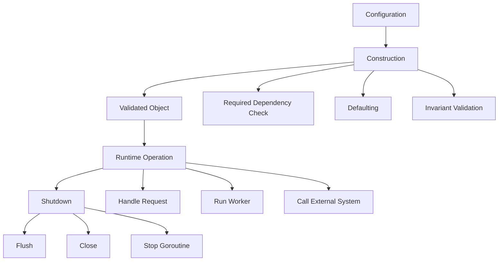
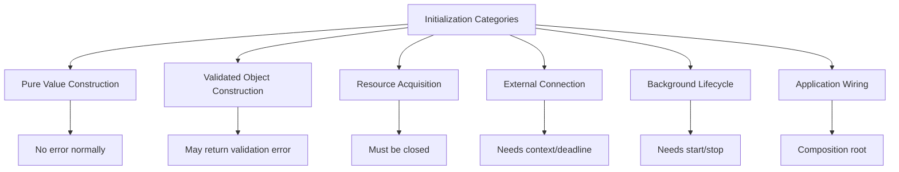

# learn-go-design-patterns-common-patterns-anti-patterns-part-006.md

# Part 006 — Constructor and Initialization Patterns

> Seri: **Go Design Patterns, Common Patterns, and Anti-Patterns**  
> Target pembaca: **Java software engineer yang ingin mendesain Go codebase production-grade**  
> Fokus part ini: **constructor, initialization, dependency validation, zero-value design, lifecycle ownership, dan anti-pattern init/global state**

---

## 0. Posisi Part Ini dalam Seri

Di part sebelumnya kita membahas **interface placement**: interface sebaiknya lahir dari sisi consumer, kecil, berbasis capability, dan tidak dibuat hanya karena kebiasaan Java-style abstraction.

Part ini membahas pertanyaan berikut:

> Setelah kita tahu dependency apa yang dibutuhkan, bagaimana dependency itu dibangun, divalidasi, dikomposisikan, dan dimiliki lifecycle-nya secara idiomatis di Go?

Dalam Java, initialization sering diserahkan kepada:

- framework dependency injection,
- annotation scanning,
- lifecycle callback,
- reflection,
- proxy,
- singleton bean,
- container-managed resource.

Dalam Go, initialization idealnya lebih eksplisit:

- package menyediakan type dan constructor,
- caller menyusun dependency graph,
- constructor memvalidasi invariant,
- lifecycle resource dimiliki secara jelas,
- goroutine/background worker tidak muncul secara diam-diam,
- global state dibatasi keras,
- error initialization dikembalikan sebagai value, bukan dilempar sebagai exception.

Part ini adalah bridge menuju part berikutnya tentang **functional options pattern** dan **configuration pattern**.

---

## 1. Tujuan Pembelajaran

Setelah menyelesaikan part ini, kamu diharapkan mampu:

1. Mendesain constructor Go yang jelas, kecil, dan stabil.
2. Memutuskan kapan type harus zero-value-friendly dan kapan wajib memakai constructor.
3. Membedakan initialization data biasa, resource mahal, dan background lifecycle.
4. Menentukan dependency mana yang required, optional, internal, atau runtime state.
5. Mendesain constructor yang memvalidasi invariant tanpa melakukan side effect berbahaya.
6. Menghindari `init()` abuse, package-level singleton, hidden dependency, dan global mutable state.
7. Mendesain lifecycle ownership untuk resource seperti database, HTTP client, worker, cache, logger, metrics, dan external adapter.
8. Membuat initialization flow yang mudah dites, mudah diobservasi, mudah di-debug, dan mudah diubah.

---

## 2. Mental Model Utama

Constructor di Go bukan sekadar fungsi `NewX`.

Constructor adalah **boundary tempat invariant type dibentuk**.

Initialization adalah **proses membangun dependency graph dan menetapkan ownership lifecycle**.

Perhatikan tiga konsep ini:



A production-grade constructor should answer:

1. What must exist before this object can operate?
2. What invariant must always hold after construction?
3. Who owns external resources?
4. Who starts background work?
5. Who stops background work?
6. Can this object be safely used concurrently?
7. Is zero value valid?
8. Is failure explicit?

---

## 3. Java Mindset vs Go Mindset

### 3.1 Java Mindset

In many Java codebases:

```java
@Service
public class UserService {
    private final UserRepository repository;
    private final EventPublisher publisher;

    public UserService(UserRepository repository, EventPublisher publisher) {
        this.repository = repository;
        this.publisher = publisher;
    }
}
```

Object construction is often delegated to Spring or another container.

Common traits:

- dependency graph built by container,
- lifecycle managed by annotations,
- proxies injected transparently,
- configuration injected through properties,
- startup failure happens during application context boot,
- circular dependency detected by container,
- singleton scope is default,
- lifecycle callbacks like `@PostConstruct`, `@PreDestroy`.

This can be powerful in large Java systems, but if copied blindly into Go, it often creates unnecessary indirection.

---

### 3.2 Go Mindset

In Go:

```go
type UserService struct {
    repo      UserRepository
    publisher EventPublisher
    clock     Clock
}

func NewUserService(repo UserRepository, publisher EventPublisher, clock Clock) (*UserService, error) {
    if repo == nil {
        return nil, errors.New("user service: repository is required")
    }
    if publisher == nil {
        return nil, errors.New("user service: publisher is required")
    }
    if clock == nil {
        clock = SystemClock{}
    }

    return &UserService{
        repo:      repo,
        publisher: publisher,
        clock:     clock,
    }, nil
}
```

The dependency graph is usually built explicitly:

```go
func main() {
    cfg := mustLoadConfig()
    logger := newLogger(cfg.Log)
    db := mustOpenDB(cfg.Database)
    defer db.Close()

    userRepo := postgres.NewUserRepository(db)
    publisher := outbox.NewPublisher(db, logger)

    userSvc, err := user.NewService(userRepo, publisher, system.Clock{})
    if err != nil {
        logger.Fatal("build user service", "error", err)
    }

    server := httpapi.NewServer(userSvc, logger)
    run(server)
}
```

This is not primitive. It is architectural clarity.

---

## 4. Constructor Is Not a Class Constructor

Go has no class constructor syntax. Instead, constructor is a convention.

Most common form:

```go
func NewClient(...) (*Client, error) {
    // validate, default, return object
}
```

But constructor does not have to be named `NewX`. Depending on semantics, good names include:

```go
func NewStore(...) (*Store, error)
func Open(path string) (*FileStore, error)
func Dial(ctx context.Context, addr string) (*Conn, error)
func Parse(raw string) (Config, error)
func Compile(pattern string) (*Regexp, error)
func MustCompile(pattern string) *Regexp
func FromEnv() (Config, error)
```

Name should express operation cost and semantics.

| Name | Implied Meaning |
|---|---|
| `NewX` | Build an object, usually cheap, no heavy external I/O unless documented |
| `Open` | Acquire a resource that must be closed |
| `Dial` | Establish connection or network-related resource |
| `Parse` | Convert raw input into structured representation |
| `Compile` | Build optimized representation from source/config |
| `MustX` | Panic on failure, usually acceptable only for static startup constants/tests |
| `FromX` | Create value from another representation |

Bad constructor names often hide cost:

```go
func NewRepository() *Repository // secretly opens DB
func NewClient() *Client         // secretly reads env and starts goroutines
func Build() interface{}         // vague
func Init()                      // vague and often global
```

A constructor name should reduce surprise.

---

## 5. Categories of Initialization

Not all initialization is equal.

A common mistake is to treat all construction as the same operation. Production Go systems usually need to distinguish at least six categories.



### 5.1 Pure Value Construction

Example:

```go
type Money struct {
    cents    int64
    currency string
}

func NewMoney(cents int64, currency string) (Money, error) {
    if currency == "" {
        return Money{}, errors.New("currency is required")
    }
    return Money{cents: cents, currency: currency}, nil
}
```

This is cheap and deterministic.

No network, no DB, no goroutine.

---

### 5.2 Validated Object Construction

Example:

```go
type PasswordPolicy struct {
    minLength int
    maxLength int
}

func NewPasswordPolicy(minLength, maxLength int) (PasswordPolicy, error) {
    if minLength <= 0 {
        return PasswordPolicy{}, errors.New("min length must be positive")
    }
    if maxLength < minLength {
        return PasswordPolicy{}, errors.New("max length must be greater than or equal to min length")
    }
    return PasswordPolicy{minLength: minLength, maxLength: maxLength}, nil
}
```

This constructor creates a value that cannot be invalid after construction.

---

### 5.3 Resource Acquisition

Example:

```go
func OpenFileStore(path string) (*FileStore, error) {
    f, err := os.OpenFile(path, os.O_RDWR|os.O_CREATE, 0o600)
    if err != nil {
        return nil, fmt.Errorf("open file store: %w", err)
    }

    return &FileStore{file: f}, nil
}

func (s *FileStore) Close() error {
    return s.file.Close()
}
```

This constructor acquires resource. Caller must know it must call `Close`.

Rule:

> If constructor acquires resource, the returned object should expose lifecycle closure or the ownership should be documented and obvious.

---

### 5.4 External Connection

Example:

```go
func DialBroker(ctx context.Context, addr string) (*BrokerClient, error) {
    if addr == "" {
        return nil, errors.New("broker address is required")
    }

    conn, err := dialWithContext(ctx, addr)
    if err != nil {
        return nil, fmt.Errorf("dial broker %s: %w", addr, err)
    }

    return &BrokerClient{conn: conn}, nil
}
```

If constructor can block on external I/O, accept `context.Context`.

Bad:

```go
func NewBrokerClient(addr string) *BrokerClient {
    conn, _ := net.Dial("tcp", addr) // no context, error ignored
    return &BrokerClient{conn: conn}
}
```

---

### 5.5 Background Lifecycle

Example:

```go
type Worker struct {
    jobs   <-chan Job
    logger *slog.Logger
}

func NewWorker(jobs <-chan Job, logger *slog.Logger) (*Worker, error) {
    if jobs == nil {
        return nil, errors.New("jobs channel is required")
    }
    if logger == nil {
        logger = slog.Default()
    }

    return &Worker{jobs: jobs, logger: logger}, nil
}

func (w *Worker) Run(ctx context.Context) error {
    for {
        select {
        case <-ctx.Done():
            return ctx.Err()
        case job, ok := <-w.jobs:
            if !ok {
                return nil
            }
            if err := w.handle(ctx, job); err != nil {
                w.logger.Error("handle job", "error", err)
            }
        }
    }
}
```

Important design decision:

> Constructor builds the worker. `Run` starts the worker.

Avoid constructor that secretly starts goroutines.

Bad:

```go
func NewWorker(jobs <-chan Job) *Worker {
    w := &Worker{jobs: jobs}
    go w.loop() // hidden lifecycle
    return w
}
```

The caller cannot control shutdown, readiness, failure, or test behavior.

---

### 5.6 Application Wiring

Composition root is where dependency graph is assembled.

```go
type App struct {
    Server *http.Server
    DB     *sql.DB
    Logger *slog.Logger
}

func BuildApp(ctx context.Context, cfg Config) (*App, error) {
    logger := newLogger(cfg.Log)

    db, err := sql.Open("postgres", cfg.Database.DSN)
    if err != nil {
        return nil, fmt.Errorf("open database: %w", err)
    }

    repo := postgres.NewUserRepository(db)
    svc, err := user.NewService(repo, logger)
    if err != nil {
        db.Close()
        return nil, fmt.Errorf("build user service: %w", err)
    }

    server := httpapi.NewServer(svc, logger)

    return &App{
        Server: server,
        DB:     db,
        Logger: logger,
    }, nil
}

func (a *App) Close() error {
    return a.DB.Close()
}
```

Composition root may orchestrate resource cleanup on partial failure.

---

## 6. Constructor Design Decision Tree

Use this decision tree before creating a constructor.

```mermaid
flowchart TD
    A[Need to create a type?] --> B{Can zero value be valid?}
    B -->|Yes| C[Design zero-value-friendly type]
    B -->|No| D{Any invariant or dependency?}
    D -->|No| E[Literal or simple factory is enough]
    D -->|Yes| F[Create constructor]

    F --> G{Can construction fail?}
    G -->|Yes| H[Return (*T, error) or (T, error)]
    G -->|No| I[Return *T or T]

    F --> J{Does it acquire resource?}
    J -->|Yes| K[Expose Close/Shutdown and document ownership]
    J -->|No| L[No lifecycle method needed]

    F --> M{Does it start background work?}
    M -->|Yes| N[Prefer separate Run/Start method]
    M -->|No| O[Constructor remains pure-ish]
```

---

## 7. Zero-Value-Friendly Design

One of Go's important design idioms is that many useful types have meaningful zero values.

Examples from the standard library mindset:

- `bytes.Buffer` can be used as zero value.
- `sync.Mutex` can be used as zero value.
- `sync.WaitGroup` can be used as zero value, with usage rules.
- `http.Client` has a usable zero value, though production usually customizes timeout/transport.

Zero-value-friendly design means:

```go
var b Buffer
b.Write([]byte("hello"))
```

No constructor required.

---

### 7.1 When Zero Value Is Good

Zero value is good when:

1. There is a natural default.
2. No required external dependency exists.
3. Internal state can be lazily initialized safely.
4. Invalid zero value would not hide production risk.
5. Type is commonly embedded or used as field.
6. Type is low-level utility.

Example:

```go
type Counter struct {
    n atomic.Int64
}

func (c *Counter) Inc() {
    c.n.Add(1)
}

func (c *Counter) Value() int64 {
    return c.n.Load()
}
```

This is excellent zero-value design.

---

### 7.2 When Zero Value Is Dangerous

Zero value is bad when:

1. Required dependency is missing.
2. Security configuration would default insecurely.
3. External endpoint is required.
4. Timeout/rate limit must be explicit.
5. Invalid zero value can cause nil pointer panic later.
6. Object represents a resource requiring lifecycle.

Bad example:

```go
type TokenValidator struct {
    jwksURL string
    client  *http.Client
}

func (v *TokenValidator) Validate(ctx context.Context, token string) error {
    req, _ := http.NewRequestWithContext(ctx, http.MethodGet, v.jwksURL, nil)
    resp, err := v.client.Do(req) // panic if client nil
    _ = resp
    return err
}
```

Better:

```go
type TokenValidator struct {
    jwksURL string
    client  *http.Client
}

func NewTokenValidator(jwksURL string, client *http.Client) (*TokenValidator, error) {
    if jwksURL == "" {
        return nil, errors.New("jwks URL is required")
    }
    if client == nil {
        return nil, errors.New("http client is required")
    }
    return &TokenValidator{jwksURL: jwksURL, client: client}, nil
}
```

---

### 7.3 Zero Value with Defaulting

Sometimes zero value is valid but not optimal.

Example:

```go
type RetryPolicy struct {
    MaxAttempts int
    BaseDelay   time.Duration
    MaxDelay    time.Duration
}

func (p RetryPolicy) normalized() RetryPolicy {
    if p.MaxAttempts == 0 {
        p.MaxAttempts = 3
    }
    if p.BaseDelay == 0 {
        p.BaseDelay = 100 * time.Millisecond
    }
    if p.MaxDelay == 0 {
        p.MaxDelay = time.Second
    }
    return p
}
```

This is acceptable if defaults are safe and documented.

But avoid silent defaults for critical production settings:

```go
if cfg.JWTSigningKey == "" {
    cfg.JWTSigningKey = "dev-secret" // catastrophic
}
```

---

## 8. Constructor Return Type: `T`, `*T`, `T,error`, `*T,error`

### 8.1 Return `T`

Use when:

- value is small,
- no failure,
- immutable-ish value,
- copying is okay,
- no shared mutable state.

```go
func NewPoint(x, y int) Point {
    return Point{X: x, Y: y}
}
```

---

### 8.2 Return `*T`

Use when:

- object has mutable state,
- methods need pointer receiver,
- object owns resource,
- object should not be copied,
- object is large,
- identity matters.

```go
func NewCache(maxEntries int) *Cache {
    return &Cache{maxEntries: maxEntries, items: make(map[string]entry)}
}
```

---

### 8.3 Return `(T, error)`

Use when:

- value should be copied,
- construction can fail,
- zero value can represent failure result safely.

```go
func ParseUserID(raw string) (UserID, error) {
    if raw == "" {
        return UserID{}, errors.New("user id is required")
    }
    return UserID(raw), nil
}
```

---

### 8.4 Return `(*T, error)`

Use when:

- object is mutable/resource-owning/large,
- construction can fail.

```go
func NewService(repo Repository, logger *slog.Logger) (*Service, error) {
    if repo == nil {
        return nil, errors.New("repository is required")
    }
    if logger == nil {
        logger = slog.Default()
    }
    return &Service{repo: repo, logger: logger}, nil
}
```

This is very common for production services.

---

## 9. Required vs Optional Dependencies

Constructor should make required dependencies impossible to forget.

### 9.1 Required Dependency as Constructor Parameter

```go
type Service struct {
    repo Repository
}

func NewService(repo Repository) (*Service, error) {
    if repo == nil {
        return nil, errors.New("repository is required")
    }
    return &Service{repo: repo}, nil
}
```

This is clear.

---

### 9.2 Optional Dependency with Safe Default

```go
type Service struct {
    repo   Repository
    logger *slog.Logger
}

func NewService(repo Repository, logger *slog.Logger) (*Service, error) {
    if repo == nil {
        return nil, errors.New("repository is required")
    }
    if logger == nil {
        logger = slog.Default()
    }
    return &Service{repo: repo, logger: logger}, nil
}
```

This is acceptable because default logger is safe.

---

### 9.3 Optional Dependency with Explicit Option

If optional dependencies grow, avoid long parameter lists.

```go
type ServiceConfig struct {
    Logger      *slog.Logger
    Clock       Clock
    RetryPolicy RetryPolicy
}

func NewService(repo Repository, cfg ServiceConfig) (*Service, error) {
    if repo == nil {
        return nil, errors.New("repository is required")
    }
    if cfg.Logger == nil {
        cfg.Logger = slog.Default()
    }
    if cfg.Clock == nil {
        cfg.Clock = SystemClock{}
    }

    return &Service{
        repo:        repo,
        logger:      cfg.Logger,
        clock:       cfg.Clock,
        retryPolicy: cfg.RetryPolicy.normalized(),
    }, nil
}
```

This is often better than functional options when config is data-like and needs validation.

Functional options will be covered in the next part.

---

## 10. Constructor Validation

Constructor validation should protect object invariants.

Good constructor validation asks:

1. Is required dependency missing?
2. Is numeric config within valid range?
3. Are mutually exclusive settings both enabled?
4. Are derived settings coherent?
5. Is production-dangerous default avoided?
6. Does the object become safe to use after construction?

Example:

```go
type RateLimiterConfig struct {
    Rate  int
    Burst int
}

func NewRateLimiter(cfg RateLimiterConfig) (*RateLimiter, error) {
    if cfg.Rate <= 0 {
        return nil, errors.New("rate must be positive")
    }
    if cfg.Burst <= 0 {
        return nil, errors.New("burst must be positive")
    }
    if cfg.Burst < cfg.Rate/10 {
        return nil, errors.New("burst is too small relative to rate")
    }

    return &RateLimiter{
        rate:  cfg.Rate,
        burst: cfg.Burst,
    }, nil
}
```

---

## 11. Constructor Should Not Hide Policy Decisions

Bad:

```go
func NewPaymentClient() *PaymentClient {
    return &PaymentClient{
        timeout: 30 * time.Second,
        retries: 10,
    }
}
```

Why bad?

- Timeout is operational policy.
- Retries are reliability policy.
- Callers cannot see or tune them.
- Production behavior is hidden.

Better:

```go
type PaymentClientConfig struct {
    BaseURL     string
    Timeout     time.Duration
    MaxAttempts int
}

func NewPaymentClient(cfg PaymentClientConfig) (*PaymentClient, error) {
    if cfg.BaseURL == "" {
        return nil, errors.New("base URL is required")
    }
    if cfg.Timeout <= 0 {
        return nil, errors.New("timeout must be positive")
    }
    if cfg.MaxAttempts <= 0 {
        return nil, errors.New("max attempts must be positive")
    }

    return &PaymentClient{
        baseURL:     cfg.BaseURL,
        timeout:     cfg.Timeout,
        maxAttempts: cfg.MaxAttempts,
    }, nil
}
```

Defaults can exist, but make them visible:

```go
func DefaultPaymentClientConfig() PaymentClientConfig {
    return PaymentClientConfig{
        Timeout:     2 * time.Second,
        MaxAttempts: 3,
    }
}
```

Then caller does:

```go
cfg := payment.DefaultPaymentClientConfig()
cfg.BaseURL = env.PaymentBaseURL
client, err := payment.NewPaymentClient(cfg)
```

This makes policy explicit.

---

## 12. Constructor and External I/O

A constructor may or may not perform I/O. The key is to make it obvious.

### 12.1 Cheap Constructor

```go
func NewClient(baseURL string, httpClient *http.Client) (*Client, error) {
    if baseURL == "" {
        return nil, errors.New("base URL is required")
    }
    if httpClient == nil {
        return nil, errors.New("http client is required")
    }
    return &Client{baseURL: baseURL, httpClient: httpClient}, nil
}
```

This constructor does not call the network.

---

### 12.2 Constructor That Validates Connectivity

Sometimes startup should fail if dependency is unavailable.

Do not hide that behind `NewClient` unless documented. Prefer explicit method:

```go
client, err := payment.NewClient(cfg, httpClient)
if err != nil {
    return err
}

if err := client.Ping(ctx); err != nil {
    return fmt.Errorf("payment readiness check: %w", err)
}
```

This separates construction from readiness.

---

### 12.3 When Constructor Performs I/O

If constructor must do I/O, signal with name and context.

```go
func OpenStore(ctx context.Context, dsn string) (*Store, error) {
    db, err := sql.Open("postgres", dsn)
    if err != nil {
        return nil, fmt.Errorf("open database: %w", err)
    }

    pingCtx, cancel := context.WithTimeout(ctx, 5*time.Second)
    defer cancel()

    if err := db.PingContext(pingCtx); err != nil {
        db.Close()
        return nil, fmt.Errorf("ping database: %w", err)
    }

    return &Store{db: db}, nil
}
```

`Open` communicates resource acquisition better than `New`.

---

## 13. `init()` Function: Use Sparingly

Go supports package-level `init()` functions.

`init()` runs automatically before `main`, after package variables are initialized.

This can be useful, but in production application code it is often overused.

---

### 13.1 Acceptable Uses of `init()`

Reasonable uses:

1. Registering standard library side-effect imports where convention is established.
2. Initializing package-local lookup tables from constants.
3. Validating generated/static data.
4. Test-only setup in rare cases.

Example:

```go
var statusText map[Status]string

func init() {
    statusText = map[Status]string{
        StatusPending:  "pending",
        StatusApproved: "approved",
        StatusRejected: "rejected",
    }
}
```

Even this can often be a var literal instead.

---

### 13.2 Dangerous Uses of `init()`

Avoid:

```go
func init() {
    db = connectDatabase()
    go startWorker()
    registerGlobalHandlers()
    loadConfigFromEnv()
}
```

Problems:

- no explicit ordering at application level,
- hard to test,
- hard to pass context/deadline,
- hard to handle error,
- hard to override dependency,
- hidden global state,
- surprising side effects just by importing package.

---

### 13.3 Side-Effect Import Risk

Go allows blank imports:

```go
import _ "github.com/lib/pq"
```

This is sometimes necessary for driver registration.

But creating your own packages that rely heavily on blank import side effects is risky:

```go
import _ "myapp/payment/stripe"
import _ "myapp/payment/paypal"
```

This creates hidden registration and startup behavior.

Prefer explicit registry where possible:

```go
registry := payment.NewRegistry()
registry.Register("stripe", stripe.NewFactory())
registry.Register("paypal", paypal.NewFactory())
```

Part 027 will cover registry/plugin pattern deeply.

---

## 14. Global State and Singleton Anti-Pattern

Global state is tempting.

```go
var DB *sql.DB
var Logger *slog.Logger
var Config Config
```

This makes code easy to write initially, but expensive to maintain.

---

### 14.1 Why Global State Hurts

Global state creates:

1. Hidden dependencies.
2. Test order coupling.
3. Race condition risk.
4. Configuration ambiguity.
5. Difficult multi-tenant/runtime scenario.
6. Harder local reasoning.
7. Startup order problems.
8. Inability to run multiple instances in one process.

Example:

```go
func CreateUser(ctx context.Context, input CreateUserInput) error {
    _, err := DB.ExecContext(ctx, "insert into users ...")
    return err
}
```

The function signature lies. It looks like it needs only `ctx` and input, but it also needs global `DB`.

Better:

```go
type UserRepository struct {
    db *sql.DB
}

func NewUserRepository(db *sql.DB) (*UserRepository, error) {
    if db == nil {
        return nil, errors.New("db is required")
    }
    return &UserRepository{db: db}, nil
}

func (r *UserRepository) Create(ctx context.Context, input CreateUserInput) error {
    _, err := r.db.ExecContext(ctx, "insert into users ...")
    return err
}
```

Now dependency is explicit.

---

### 14.2 Acceptable Global-Like Values

Not all package-level variables are evil.

Usually acceptable:

```go
var ErrNotFound = errors.New("not found")

const DefaultTimeout = 2 * time.Second

var defaultNow = time.Now // sometimes for tests, but be careful
```

Safer package-level values are:

- immutable,
- constants,
- sentinel errors,
- lookup tables not mutated after init,
- stateless functions.

Dangerous globals are:

- mutable config,
- DB connection,
- HTTP client with mutable transport assumptions,
- auth state,
- current tenant,
- logger that changes behavior at runtime,
- cache shared by unrelated tests,
- metrics registry created implicitly.

---

## 15. Lazy Initialization Pattern

Lazy initialization can be useful, but it must be deliberate.

### 15.1 Safe Lazy Initialization with `sync.Once`

```go
type Client struct {
    baseURL string

    once sync.Once
    initErr error
    tokenProvider *TokenProvider
}

func (c *Client) tokenProviderOnce() (*TokenProvider, error) {
    c.once.Do(func() {
        c.tokenProvider, c.initErr = NewTokenProvider(c.baseURL)
    })
    if c.initErr != nil {
        return nil, c.initErr
    }
    return c.tokenProvider, nil
}
```

But beware: `sync.Once` does not retry after failure. If initialization failure should be retryable, use a different design.

---

### 15.2 Lazy Initialization Failure Mode

Bad:

```go
func (s *Service) cache() *Cache {
    if s.cache == nil {
        s.cache = NewCache() // data race under concurrency
    }
    return s.cache
}
```

This has a data race if called concurrently.

Better:

```go
type Service struct {
    cacheOnce sync.Once
    cache     *Cache
}

func (s *Service) Cache() *Cache {
    s.cacheOnce.Do(func() {
        s.cache = NewCache()
    })
    return s.cache
}
```

But even better: ask whether lazy initialization is necessary. Eager explicit construction is often simpler.

---

### 15.3 Lazy Initialization Trade-Off

| Benefit | Cost |
|---|---|
| Faster startup | Failure delayed to request path |
| Avoid unused resource | Harder readiness check |
| Can break dependency cycle | May hide architecture smell |
| Useful for expensive object | Adds concurrency complexity |

Rule:

> Use lazy initialization when it improves actual lifecycle behavior, not to avoid clean dependency design.

---

## 16. Lifecycle Ownership Pattern

A constructor is incomplete if lifecycle ownership is unclear.

Ask:

1. Who creates the resource?
2. Who closes the resource?
3. Who starts background work?
4. Who stops background work?
5. What happens on partial initialization failure?
6. What happens on shutdown timeout?

---

### 16.1 Resource Ownership Example

```go
type App struct {
    db     *sql.DB
    server *http.Server
    worker *Worker
}

func (a *App) Close(ctx context.Context) error {
    var errs []error

    if a.server != nil {
        if err := a.server.Shutdown(ctx); err != nil {
            errs = append(errs, fmt.Errorf("shutdown server: %w", err))
        }
    }

    if a.worker != nil {
        if err := a.worker.Stop(ctx); err != nil {
            errs = append(errs, fmt.Errorf("stop worker: %w", err))
        }
    }

    if a.db != nil {
        if err := a.db.Close(); err != nil {
            errs = append(errs, fmt.Errorf("close db: %w", err))
        }
    }

    return errors.Join(errs...)
}
```

This makes shutdown explicit.

---

### 16.2 Partial Failure Cleanup

Bad:

```go
func BuildApp(cfg Config) (*App, error) {
    db, err := openDB(cfg.DB)
    if err != nil {
        return nil, err
    }

    broker, err := openBroker(cfg.Broker)
    if err != nil {
        return nil, err // db leaked
    }

    return &App{db: db, broker: broker}, nil
}
```

Better:

```go
func BuildApp(cfg Config) (*App, error) {
    db, err := openDB(cfg.DB)
    if err != nil {
        return nil, fmt.Errorf("open db: %w", err)
    }

    broker, err := openBroker(cfg.Broker)
    if err != nil {
        db.Close()
        return nil, fmt.Errorf("open broker: %w", err)
    }

    return &App{db: db, broker: broker}, nil
}
```

For many resources, use cleanup stack pattern.

```go
type cleanupStack struct {
    funcs []func() error
}

func (s *cleanupStack) push(fn func() error) {
    s.funcs = append(s.funcs, fn)
}

func (s *cleanupStack) close() error {
    var errs []error
    for i := len(s.funcs) - 1; i >= 0; i-- {
        if err := s.funcs[i](); err != nil {
            errs = append(errs, err)
        }
    }
    return errors.Join(errs...)
}
```

Usage:

```go
func BuildApp(cfg Config) (*App, error) {
    var cleanups cleanupStack
    success := false
    defer func() {
        if !success {
            _ = cleanups.close()
        }
    }()

    db, err := openDB(cfg.DB)
    if err != nil {
        return nil, fmt.Errorf("open db: %w", err)
    }
    cleanups.push(db.Close)

    broker, err := openBroker(cfg.Broker)
    if err != nil {
        return nil, fmt.Errorf("open broker: %w", err)
    }
    cleanups.push(broker.Close)

    success = true
    return &App{db: db, broker: broker}, nil
}
```

---

## 17. Start/Stop Pattern

Constructor should usually not start background work. Provide explicit start method.

```go
type Scheduler struct {
    jobs   []Job
    logger *slog.Logger
}

func NewScheduler(jobs []Job, logger *slog.Logger) (*Scheduler, error) {
    if logger == nil {
        logger = slog.Default()
    }
    return &Scheduler{jobs: jobs, logger: logger}, nil
}

func (s *Scheduler) Run(ctx context.Context) error {
    ticker := time.NewTicker(time.Minute)
    defer ticker.Stop()

    for {
        select {
        case <-ctx.Done():
            return ctx.Err()
        case <-ticker.C:
            s.runOnce(ctx)
        }
    }
}
```

Caller owns lifecycle:

```go
g, ctx := errgroup.WithContext(ctx)

g.Go(func() error {
    return scheduler.Run(ctx)
})

g.Go(func() error {
    return server.ListenAndServe()
})

if err := g.Wait(); err != nil {
    logger.Error("app stopped", "error", err)
}
```

Even without `errgroup`, the concept remains: caller orchestrates running components.

---

## 18. Constructor and Concurrency Safety

Constructor should establish whether the object is safe for concurrent use.

Example:

```go
type TokenCache struct {
    mu     sync.RWMutex
    tokens map[string]Token
}

func NewTokenCache() *TokenCache {
    return &TokenCache{
        tokens: make(map[string]Token),
    }
}
```

The map is initialized, and methods can safely lock.

```go
func (c *TokenCache) Get(key string) (Token, bool) {
    c.mu.RLock()
    defer c.mu.RUnlock()

    token, ok := c.tokens[key]
    return token, ok
}
```

Bad:

```go
type TokenCache struct {
    tokens map[string]Token
}

func (c *TokenCache) Put(key string, token Token) {
    if c.tokens == nil {
        c.tokens = make(map[string]Token) // race
    }
    c.tokens[key] = token
}
```

Lazy map initialization in a concurrent object is dangerous unless protected.

---

## 19. Constructor and Immutability-ish Design

Go does not enforce immutability generally, but constructors can help create immutable-ish objects.

Bad:

```go
type Client struct {
    BaseURL string
    Timeout time.Duration
}
```

Any caller can mutate fields after construction.

Better:

```go
type Client struct {
    baseURL string
    timeout time.Duration
}

func NewClient(baseURL string, timeout time.Duration) (*Client, error) {
    if baseURL == "" {
        return nil, errors.New("base URL is required")
    }
    if timeout <= 0 {
        return nil, errors.New("timeout must be positive")
    }
    return &Client{baseURL: baseURL, timeout: timeout}, nil
}
```

Keep fields unexported unless mutation is part of the public contract.

---

## 20. Constructor and Defensive Copy

If constructor accepts slices, maps, or pointers, decide whether to copy.

Bad:

```go
type Policy struct {
    allowedRoles []string
}

func NewPolicy(allowedRoles []string) *Policy {
    return &Policy{allowedRoles: allowedRoles}
}
```

Caller can mutate after construction:

```go
roles := []string{"admin"}
policy := NewPolicy(roles)
roles[0] = "guest" // policy changed unexpectedly
```

Better:

```go
func NewPolicy(allowedRoles []string) (*Policy, error) {
    if len(allowedRoles) == 0 {
        return nil, errors.New("allowed roles are required")
    }

    copied := slices.Clone(allowedRoles)
    return &Policy{allowedRoles: copied}, nil
}
```

For maps:

```go
func cloneStringMap(in map[string]string) map[string]string {
    if in == nil {
        return nil
    }
    out := make(map[string]string, len(in))
    for k, v := range in {
        out[k] = v
    }
    return out
}
```

Rule:

> If constructor promises stable internal state, copy mutable input.

---

## 21. Constructor and Interface Dependencies

When constructor accepts interface dependency, validate nil carefully.

```go
type Repository interface {
    Save(ctx context.Context, user User) error
}

func NewService(repo Repository) (*Service, error) {
    if repo == nil {
        return nil, errors.New("repository is required")
    }
    return &Service{repo: repo}, nil
}
```

This catches a nil interface.

But Go has a typed nil trap:

```go
var pgRepo *PostgresRepository = nil
var repo Repository = pgRepo
fmt.Println(repo == nil) // false
```

Now constructor cannot detect nil using `repo == nil`.

Avoid passing typed nil as interface. In tests, make fakes real values.

If you must guard against it, reflection can detect typed nil, but using reflection in every constructor is usually a smell.

```go
func isNilInterface(v any) bool {
    if v == nil {
        return true
    }
    rv := reflect.ValueOf(v)
    switch rv.Kind() {
    case reflect.Chan, reflect.Func, reflect.Interface, reflect.Map, reflect.Pointer, reflect.Slice:
        return rv.IsNil()
    default:
        return false
    }
}
```

Use sparingly. Better design avoids typed nil.

---

## 22. Constructor Error Style

Constructor errors should be clear and actionable.

Bad:

```go
return nil, errors.New("invalid config")
```

Better:

```go
return nil, errors.New("payment client: base URL is required")
```

Better with wrapping:

```go
return nil, fmt.Errorf("payment client: parse base URL: %w", err)
```

For multiple validation errors:

```go
func ValidateConfig(cfg Config) error {
    var errs []error

    if cfg.BaseURL == "" {
        errs = append(errs, errors.New("base URL is required"))
    }
    if cfg.Timeout <= 0 {
        errs = append(errs, errors.New("timeout must be positive"))
    }

    return errors.Join(errs...)
}
```

Then:

```go
func NewClient(cfg Config) (*Client, error) {
    if err := ValidateConfig(cfg); err != nil {
        return nil, fmt.Errorf("payment client config: %w", err)
    }
    return &Client{cfg: cfg}, nil
}
```

---

## 23. `Must` Constructors

`MustX` pattern panics on error.

Example:

```go
var emailPattern = regexp.MustCompile(`^[^@]+@[^@]+$`)
```

Appropriate when:

1. Input is static and known at compile time.
2. Failure is programmer error.
3. Recovery is not meaningful.
4. Used at package initialization or tests.

Dangerous when input comes from config/env/user:

```go
func MustNewPaymentClient(cfg Config) *PaymentClient {
    c, err := NewPaymentClient(cfg)
    if err != nil {
        panic(err)
    }
    return c
}
```

This might be okay in `main` if you want fail-fast startup, but often explicit error handling is clearer:

```go
client, err := NewPaymentClient(cfg)
if err != nil {
    logger.Error("build payment client", "error", err)
    os.Exit(1)
}
```

Rule:

> `Must` is for programmer-known constants, not operational uncertainty.

---

## 24. Factory Function vs Constructor Method vs Builder

### 24.1 Factory Function

Most common:

```go
func NewService(repo Repository) (*Service, error)
```

Use for normal type construction.

---

### 24.2 Factory Interface

Use when consumer needs to create multiple instances at runtime.

```go
type ClientFactory interface {
    NewClient(tenantID string) (*Client, error)
}
```

Be careful. Many “factories” in Go are unnecessary.

---

### 24.3 Builder Pattern

Java-style builder is often overused in Go.

Bad:

```go
client := NewClientBuilder().
    WithBaseURL(url).
    WithTimeout(timeout).
    WithRetries(3).
    Build()
```

In Go, a config struct is often simpler:

```go
client, err := NewClient(ClientConfig{
    BaseURL: url,
    Timeout: timeout,
    Retries: 3,
})
```

Builder can be justified when:

- construction has many staged steps,
- order matters,
- intermediate validation is useful,
- fluent DSL meaningfully improves readability,
- object construction is complex and rare.

But for most services, config struct or functional options is better.

---

## 25. Production Example: Authorization Decision Service

Let's design a production-style constructor for an authorization decision service.

### 25.1 Requirements

The service:

- evaluates whether an actor can perform action on resource,
- uses policy repository,
- emits audit record,
- needs clock,
- needs logger,
- optional decision cache,
- must not start background work in constructor,
- must validate required dependencies,
- must make policy decisions explicit.

---

### 25.2 Interfaces Owned by Consumer

```go
type PolicyRepository interface {
    LoadPolicies(ctx context.Context, resourceType string) ([]Policy, error)
}

type AuditSink interface {
    RecordDecision(ctx context.Context, record DecisionRecord) error
}

type Clock interface {
    Now() time.Time
}
```

---

### 25.3 Config

```go
type DecisionServiceConfig struct {
    Logger       *slog.Logger
    Clock        Clock
    Cache        DecisionCache
    AuditEnabled bool
}
```

---

### 25.4 Constructor

```go
type DecisionService struct {
    policies     PolicyRepository
    audit        AuditSink
    logger       *slog.Logger
    clock        Clock
    cache        DecisionCache
    auditEnabled bool
}

func NewDecisionService(
    policies PolicyRepository,
    audit AuditSink,
    cfg DecisionServiceConfig,
) (*DecisionService, error) {
    if policies == nil {
        return nil, errors.New("decision service: policy repository is required")
    }
    if cfg.AuditEnabled && audit == nil {
        return nil, errors.New("decision service: audit sink is required when audit is enabled")
    }
    if cfg.Logger == nil {
        cfg.Logger = slog.Default()
    }
    if cfg.Clock == nil {
        cfg.Clock = SystemClock{}
    }

    return &DecisionService{
        policies:     policies,
        audit:        audit,
        logger:       cfg.Logger,
        clock:        cfg.Clock,
        cache:        cfg.Cache,
        auditEnabled: cfg.AuditEnabled,
    }, nil
}
```

---

### 25.5 Why This Is Good

- Required dependency is explicit.
- Audit dependency is conditional on policy.
- Logger has safe default.
- Clock has safe default.
- Cache is optional.
- No global state.
- No env reading.
- No goroutine start.
- No external I/O.
- Object is valid after construction.

---

### 25.6 Usage in Composition Root

```go
func BuildAuthorizationModule(cfg Config, db *sql.DB, logger *slog.Logger) (*DecisionService, error) {
    policyRepo, err := postgres.NewPolicyRepository(db)
    if err != nil {
        return nil, fmt.Errorf("build policy repository: %w", err)
    }

    auditSink, err := postgres.NewAuditSink(db)
    if err != nil {
        return nil, fmt.Errorf("build audit sink: %w", err)
    }

    svc, err := NewDecisionService(policyRepo, auditSink, DecisionServiceConfig{
        Logger:       logger,
        Clock:        SystemClock{},
        AuditEnabled: cfg.Authorization.AuditEnabled,
    })
    if err != nil {
        return nil, fmt.Errorf("build decision service: %w", err)
    }

    return svc, nil
}
```

This is readable and operationally clear.

---

## 26. Production Example: Bad Version and Refactoring

### 26.1 Bad Version

```go
var policyRepo PolicyRepository
var auditSink AuditSink
var logger *slog.Logger

func init() {
    cfg := LoadConfigFromEnv()
    logger = slog.Default()
    db := MustConnectDB(cfg.DSN)
    policyRepo = postgres.NewPolicyRepository(db)
    auditSink = postgres.NewAuditSink(db)
}

type DecisionService struct{}

func NewDecisionService() *DecisionService {
    return &DecisionService{}
}

func (s *DecisionService) Decide(ctx context.Context, input DecisionInput) (Decision, error) {
    policies, err := policyRepo.LoadPolicies(ctx, input.ResourceType)
    if err != nil {
        return Decision{}, err
    }

    decision := evaluate(policies, input)
    _ = auditSink.RecordDecision(ctx, decision.Record())
    return decision, nil
}
```

Problems:

- importing package connects to DB,
- config hidden,
- DB lifecycle lost,
- errors during init likely panic,
- tests require global mutation,
- audit error ignored,
- service signature hides dependencies,
- impossible to run two instances with different config,
- no explicit audit policy,
- no construction validation.

---

### 26.2 Refactoring Steps

Step 1: Move dependencies into struct.

```go
type DecisionService struct {
    policies PolicyRepository
    audit    AuditSink
    logger   *slog.Logger
}
```

Step 2: Add constructor.

```go
func NewDecisionService(policies PolicyRepository, audit AuditSink, logger *slog.Logger) (*DecisionService, error) {
    if policies == nil {
        return nil, errors.New("policy repository is required")
    }
    if audit == nil {
        return nil, errors.New("audit sink is required")
    }
    if logger == nil {
        logger = slog.Default()
    }
    return &DecisionService{policies: policies, audit: audit, logger: logger}, nil
}
```

Step 3: Move DB/config loading to composition root.

```go
func main() {
    cfg, err := LoadConfig()
    if err != nil {
        panic(err)
    }

    db, err := OpenDB(cfg.Database)
    if err != nil {
        panic(err)
    }
    defer db.Close()

    svc, err := BuildDecisionService(cfg, db, slog.Default())
    if err != nil {
        panic(err)
    }

    _ = svc
}
```

Step 4: Remove `init()` side effects.

Step 5: Write tests with fakes.

---

## 27. Testing Constructor Behavior

Constructor tests are valuable when constructor enforces invariants.

```go
func TestNewDecisionServiceRequiresPolicyRepository(t *testing.T) {
    svc, err := NewDecisionService(nil, fakeAudit{}, DecisionServiceConfig{})
    if err == nil {
        t.Fatal("expected error")
    }
    if svc != nil {
        t.Fatal("expected nil service")
    }
}
```

Test defaulting:

```go
func TestNewDecisionServiceDefaultsClock(t *testing.T) {
    svc, err := NewDecisionService(fakePolicies{}, fakeAudit{}, DecisionServiceConfig{})
    if err != nil {
        t.Fatal(err)
    }
    if svc.clock == nil {
        t.Fatal("expected default clock")
    }
}
```

Test conditional dependency:

```go
func TestNewDecisionServiceRequiresAuditWhenEnabled(t *testing.T) {
    _, err := NewDecisionService(fakePolicies{}, nil, DecisionServiceConfig{
        AuditEnabled: true,
    })
    if err == nil {
        t.Fatal("expected error")
    }
}
```

---

## 28. Observability of Initialization

Initialization failures should be observable.

At application boundary:

```go
app, err := BuildApp(ctx, cfg)
if err != nil {
    logger.Error("application startup failed", "error", err)
    os.Exit(1)
}
```

Inside constructors, avoid logging and returning the same error unless constructor owns meaningful context.

Bad:

```go
func NewService(repo Repository, logger *slog.Logger) (*Service, error) {
    if repo == nil {
        logger.Error("repo missing")
        return nil, errors.New("repo missing")
    }
    return &Service{repo: repo}, nil
}
```

Better:

```go
func NewService(repo Repository, logger *slog.Logger) (*Service, error) {
    if repo == nil {
        return nil, errors.New("service: repository is required")
    }
    if logger == nil {
        logger = slog.Default()
    }
    return &Service{repo: repo, logger: logger}, nil
}
```

Let composition root log once with context.

---

## 29. Performance Considerations

Constructor performance matters when:

- called per request,
- creates large buffers,
- compiles regex repeatedly,
- allocates maps/slices aggressively,
- creates HTTP clients repeatedly,
- creates DB connections repeatedly,
- starts goroutines repeatedly.

---

### 29.1 Per-Request Constructor Smell

Bad:

```go
func Handle(w http.ResponseWriter, r *http.Request) {
    client := NewPaymentClient(...) // per request
    _ = client
}
```

Better:

```go
type Handler struct {
    payment *PaymentClient
}

func NewHandler(payment *PaymentClient) *Handler {
    return &Handler{payment: payment}
}
```

Construct long-lived dependencies once in composition root.

---

### 29.2 HTTP Client Construction

Bad:

```go
func NewExternalCaller() *ExternalCaller {
    return &ExternalCaller{client: &http.Client{}}
}
```

If each caller creates its own client/transport without understanding connection pooling, production behavior may degrade.

Better:

```go
func NewExternalCaller(client *http.Client, baseURL string) (*ExternalCaller, error) {
    if client == nil {
        return nil, errors.New("http client is required")
    }
    if baseURL == "" {
        return nil, errors.New("base URL is required")
    }
    return &ExternalCaller{client: client, baseURL: baseURL}, nil
}
```

Let composition root own transport policy.

---

## 30. Security Considerations

Constructor defaulting can create security bugs.

Dangerous defaults:

```go
if cfg.TLSInsecureSkipVerify {
    // silently allowed in production
}

if cfg.SigningKey == "" {
    cfg.SigningKey = "default-secret"
}

if cfg.AllowedOrigins == nil {
    cfg.AllowedOrigins = []string{"*"}
}
```

Production-grade constructor should reject insecure missing config unless explicitly operating in dev/test mode.

Example:

```go
func NewJWTVerifier(cfg JWTVerifierConfig) (*JWTVerifier, error) {
    if len(cfg.SigningKeys) == 0 {
        return nil, errors.New("jwt verifier: at least one signing key is required")
    }
    if cfg.ClockSkew < 0 {
        return nil, errors.New("jwt verifier: clock skew cannot be negative")
    }
    if cfg.Issuer == "" {
        return nil, errors.New("jwt verifier: issuer is required")
    }
    if len(cfg.Audiences) == 0 {
        return nil, errors.New("jwt verifier: at least one audience is required")
    }

    return &JWTVerifier{cfg: cfg}, nil
}
```

---

## 31. Anti-Pattern Catalog

### 31.1 Constructor Opens Database Without Saying So

```go
func NewRepository() *Repository {
    db := connectDB(os.Getenv("DSN"))
    return &Repository{db: db}
}
```

Why bad:

- hidden env dependency,
- hidden I/O,
- no context,
- no cleanup ownership,
- poor testability.

Refactor:

```go
func NewRepository(db *sql.DB) (*Repository, error)
```

---

### 31.2 Constructor Starts Goroutine

```go
func NewCache() *Cache {
    c := &Cache{}
    go c.evictLoop()
    return c
}
```

Why bad:

- no shutdown,
- leak risk,
- test flakiness,
- hidden lifecycle.

Refactor:

```go
func NewCache(cfg CacheConfig) (*Cache, error)
func (c *Cache) Run(ctx context.Context) error
```

---

### 31.3 Constructor Reads Environment Variables

```go
func NewClient() *Client {
    return &Client{baseURL: os.Getenv("PAYMENT_URL")}
}
```

Why bad:

- hidden config,
- hard to test,
- construction differs by process env,
- no validation.

Refactor:

```go
func NewClient(cfg ClientConfig) (*Client, error)
```

---

### 31.4 Constructor Returns Interface by Default

```go
func NewService() Service {
    return &serviceImpl{}
}
```

Why often bad:

- hides concrete capabilities,
- limits future methods,
- usually provider-owned interface smell,
- unnecessary abstraction.

Prefer:

```go
func NewService(...) (*Service, error)
```

Consumer can define interface if needed.

---

### 31.5 Constructor Ignores Error

```go
func NewClient(rawURL string) *Client {
    u, _ := url.Parse(rawURL)
    return &Client{url: u}
}
```

Refactor:

```go
func NewClient(rawURL string) (*Client, error) {
    u, err := url.Parse(rawURL)
    if err != nil {
        return nil, fmt.Errorf("parse client URL: %w", err)
    }
    return &Client{url: u}, nil
}
```

---

### 31.6 Constructor Creates Partially Valid Object

```go
func NewService(repo Repository) *Service {
    return &Service{repo: repo}
}

func (s *Service) Do(ctx context.Context) error {
    if s.repo == nil {
        return errors.New("repo missing")
    }
    return nil
}
```

Refactor:

```go
func NewService(repo Repository) (*Service, error) {
    if repo == nil {
        return nil, errors.New("repository is required")
    }
    return &Service{repo: repo}, nil
}
```

Invariant should be established before runtime operation.

---

### 31.7 Constructor with Too Many Parameters

```go
func NewService(a A, b B, c C, d D, e E, f F, timeout time.Duration, retries int, logger *slog.Logger) *Service
```

This signals poor grouping.

Refactor:

```go
func NewService(deps ServiceDeps, cfg ServiceConfig) (*Service, error)
```

Example:

```go
type ServiceDeps struct {
    Repo      Repository
    Publisher Publisher
    Clock     Clock
}

type ServiceConfig struct {
    Timeout time.Duration
    Retries int
    Logger  *slog.Logger
}
```

Be careful not to create a generic dependency bag. Group by meaning.

---

### 31.8 Constructor Accepts `context.Context` but Stores It

Bad:

```go
type Service struct {
    ctx context.Context
}

func NewService(ctx context.Context) *Service {
    return &Service{ctx: ctx}
}
```

Usually wrong. Context is request/lifecycle scoped, not object field.

Better:

```go
func NewService(...) *Service
func (s *Service) Do(ctx context.Context, input Input) error
func (s *Service) Run(ctx context.Context) error
```

Exception: a lifecycle object may keep a context internally during `Run`, but that is runtime state, not constructor dependency.

---

## 32. Refactoring Playbook

### 32.1 From Global Dependency to Constructor Dependency

Before:

```go
var repo Repository

func Approve(ctx context.Context, id string) error {
    return repo.Approve(ctx, id)
}
```

After:

```go
type ApprovalService struct {
    repo Repository
}

func NewApprovalService(repo Repository) (*ApprovalService, error) {
    if repo == nil {
        return nil, errors.New("repository is required")
    }
    return &ApprovalService{repo: repo}, nil
}

func (s *ApprovalService) Approve(ctx context.Context, id string) error {
    return s.repo.Approve(ctx, id)
}
```

---

### 32.2 From `init()` to Composition Root

Before:

```go
func init() {
    client = NewExternalClient(os.Getenv("URL"))
}
```

After:

```go
func BuildExternalClient(cfg Config) (*ExternalClient, error) {
    return NewExternalClient(ExternalClientConfig{
        BaseURL: cfg.External.URL,
        Timeout: cfg.External.Timeout,
    })
}
```

---

### 32.3 From Hidden Goroutine to Explicit Run

Before:

```go
func NewPoller() *Poller {
    p := &Poller{}
    go p.poll()
    return p
}
```

After:

```go
func NewPoller(cfg PollerConfig) (*Poller, error) {
    return &Poller{interval: cfg.Interval}, nil
}

func (p *Poller) Run(ctx context.Context) error {
    ticker := time.NewTicker(p.interval)
    defer ticker.Stop()

    for {
        select {
        case <-ctx.Done():
            return ctx.Err()
        case <-ticker.C:
            if err := p.pollOnce(ctx); err != nil {
                p.logger.Error("poll", "error", err)
            }
        }
    }
}
```

---

### 32.4 From Long Constructor Parameter List to Deps + Config

Before:

```go
func NewCaseService(repo Repo, audit Audit, mail Mailer, clock Clock, logger *slog.Logger, timeout time.Duration, maxRetry int) (*CaseService, error)
```

After:

```go
type CaseServiceDeps struct {
    Repo   Repo
    Audit  Audit
    Mailer Mailer
    Clock  Clock
}

type CaseServiceConfig struct {
    Logger   *slog.Logger
    Timeout  time.Duration
    MaxRetry int
}

func NewCaseService(deps CaseServiceDeps, cfg CaseServiceConfig) (*CaseService, error)
```

This separates object collaborators from operational knobs.

---

## 33. Review Checklist

Use this checklist in code review.

### 33.1 Constructor Semantics

- [ ] Does the constructor name communicate cost and behavior?
- [ ] Is `New` used only for construction that is not surprising?
- [ ] Should the function be named `Open`, `Dial`, `Parse`, or `Compile` instead?
- [ ] Does the constructor return error when construction can fail?
- [ ] Are error messages actionable?

### 33.2 Dependency Clarity

- [ ] Are required dependencies explicit parameters?
- [ ] Are optional dependencies defaulted safely?
- [ ] Are dependencies hidden through globals/env/context?
- [ ] Are interfaces accepted only where useful?
- [ ] Are provider-owned interfaces avoided unless justified?

### 33.3 Invariant Safety

- [ ] Is the object valid after construction?
- [ ] Are nil dependencies rejected?
- [ ] Are numeric bounds validated?
- [ ] Are conflicting config options rejected?
- [ ] Are mutable inputs copied if needed?

### 33.4 Lifecycle

- [ ] Does constructor acquire resources?
- [ ] If yes, is close/shutdown ownership clear?
- [ ] Does constructor start goroutines?
- [ ] If yes, is that explicitly documented and stoppable?
- [ ] Is there cleanup on partial initialization failure?

### 33.5 Testability

- [ ] Can tests construct the object without external systems?
- [ ] Can dependencies be faked without global mutation?
- [ ] Are defaults deterministic enough for tests?
- [ ] Is time injected when behavior depends on time?

### 33.6 Production Readiness

- [ ] Are insecure defaults rejected?
- [ ] Are timeouts explicit where external calls exist?
- [ ] Are retries/rate limits visible policy?
- [ ] Is startup failure logged once at composition root?
- [ ] Is readiness separate from construction where appropriate?

---

## 34. Exercises

### Exercise 1: Refactor Hidden Config

Given:

```go
type EmailClient struct {
    baseURL string
    apiKey  string
}

func NewEmailClient() *EmailClient {
    return &EmailClient{
        baseURL: os.Getenv("EMAIL_URL"),
        apiKey:  os.Getenv("EMAIL_API_KEY"),
    }
}
```

Refactor into:

- config struct,
- constructor validation,
- explicit error,
- no env read inside constructor.

---

### Exercise 2: Refactor Hidden Worker

Given:

```go
type Cleaner struct {
    db *sql.DB
}

func NewCleaner(db *sql.DB) *Cleaner {
    c := &Cleaner{db: db}
    go c.loop()
    return c
}
```

Refactor into:

- constructor,
- `Run(ctx)` method,
- ticker cleanup,
- cancellation handling,
- logger injection.

---

### Exercise 3: Design Constructor for Case Workflow Service

Design constructor for a regulatory case workflow service with dependencies:

- case repository,
- state machine,
- audit sink,
- notification sender,
- clock,
- logger,
- feature flags.

Requirements:

- audit sink is mandatory,
- notification sender is optional,
- clock defaults safely,
- logger defaults safely,
- feature flags are immutable after construction,
- constructor must not perform database query,
- service must be valid after construction.

---

### Exercise 4: Identify Anti-Patterns

Review this code:

```go
var globalClient *Client

func init() {
    globalClient = MustNewClient(os.Getenv("BASE_URL"))
}

type Service struct{}

func NewService() *Service {
    go refreshTokenLoop()
    return &Service{}
}

func (s *Service) Do(ctx context.Context) error {
    return globalClient.Call(ctx)
}
```

Identify at least eight problems and propose a refactoring plan.

---

## 35. Key Takeaways

1. Constructor is a design boundary, not just object creation syntax.
2. Go favors explicit construction over container magic.
3. Required dependencies should be visible in constructor parameters.
4. Optional dependencies need safe defaults or explicit config.
5. Zero-value-friendly design is powerful but not always appropriate.
6. Constructor should establish object invariants.
7. Constructors should not hide env reads, network calls, DB connections, or goroutine startup unless explicitly named/documented.
8. Resource acquisition requires lifecycle ownership.
9. `init()` is powerful but dangerous when used for application behavior.
10. Global mutable state is usually an architecture smell.
11. Lazy initialization adds concurrency and failure complexity.
12. Constructor errors should be specific and actionable.
13. `Must` constructors are for programmer-known constants, not operational uncertainty.
14. Composition root is where application dependency graph becomes visible.
15. Good initialization design improves testability, observability, startup behavior, and production reliability.

---

## 36. Connection to Next Part

This part discussed constructor and initialization patterns generally.

The next part, **Part 007 — Functional Options Pattern, Properly Used**, will go deeper into one specific constructor style:

- why functional options exist,
- when they are better than config struct,
- when they are worse,
- how to validate options,
- how to detect conflicts,
- how to avoid mandatory hidden options,
- how to avoid side-effectful option functions,
- how to design options for production-grade APIs.

Functional options are popular in Go, but also frequently misused. The next part will treat them not as a fashionable idiom, but as a precise API design tool.

---

## Status Seri

- Part saat ini: **Part 006 dari 035**
- Status: **Seri belum selesai**
- Lanjut berikutnya: **Part 007 — Functional Options Pattern, Properly Used**

<!-- NAVIGATION_FOOTER -->
<div class="page-nav">
<a href="./learn-go-design-patterns-common-patterns-anti-patterns-part-005.md">⬅️ Part 005 — Interface Placement Pattern</a>
<a href="./index.md">📚 Kategori</a>
<a href="../../index.md">🏠 Home</a>
<a href="./learn-go-design-patterns-common-patterns-anti-patterns-part-007.md">Part 007 — Functional Options Pattern, Properly Used ➡️</a>
</div>
