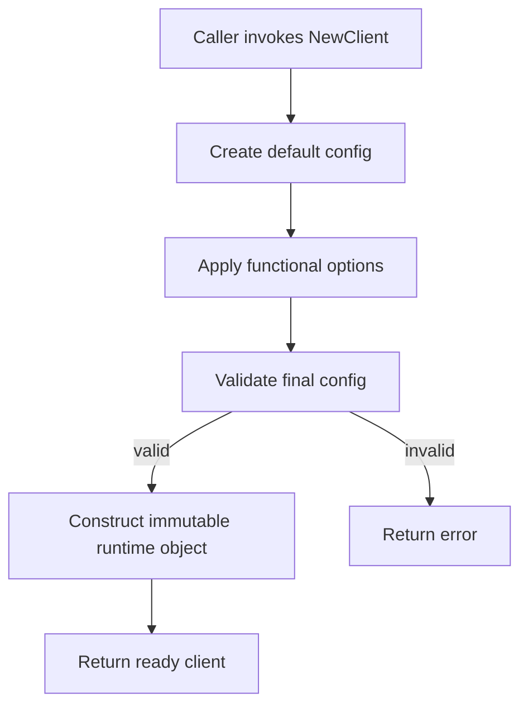

# learn-go-design-patterns-common-patterns-anti-patterns-part-007.md

# Part 007 — Functional Options Pattern, Properly Used

> Seri: **Go Design Patterns, Common Patterns, and Anti-Patterns**  
> Target pembaca: **Java software engineer yang ingin menulis Go production-grade**  
> Baseline bahasa: **Go 1.26.x**  
> Status seri: **belum selesai** — ini adalah **part 007 dari 035**

---

## 0. Tujuan Part Ini

Functional options adalah salah satu pattern Go yang sangat populer, tetapi juga salah satu yang paling sering disalahgunakan.

Di permukaan, pattern ini terlihat sederhana:

```go
client, err := NewClient(
    WithTimeout(2*time.Second),
    WithRetries(3),
    WithLogger(logger),
)
```

Tetapi di balik bentuk yang rapi itu ada banyak keputusan desain:

- apakah parameter benar-benar optional?
- apakah ada dependency wajib?
- apakah default-nya aman?
- apakah option boleh gagal?
- apakah option boleh melakukan I/O?
- apakah urutan option penting?
- apakah option boleh dipakai ulang?
- apakah option mutable?
- apakah option aman untuk concurrent use?
- apakah option membuat API lebih evolvable atau malah menyembunyikan kontrak?

Part ini bertujuan membangun mental model yang kuat agar functional options dipakai sebagai **API evolution pattern**, bukan sebagai gaya dekoratif.

Setelah menyelesaikan part ini, kamu harus bisa:

1. Menjelaskan masalah desain yang diselesaikan functional options.
2. Membedakan functional options, config struct, builder, variadic parameter, dan constructor biasa.
3. Mendesain option yang aman, eksplisit, validatable, dan maintainable.
4. Menghindari anti-pattern seperti hidden mandatory option, side-effect option, order-dependent option, dan option bloat.
5. Menilai apakah sebuah API sebaiknya memakai functional options atau tidak.
6. Melakukan refactoring dari constructor yang membengkak menuju desain yang lebih stabil.
7. Membuat option API yang cocok untuk library, internal platform package, client SDK, service dependency, dan infrastructure adapter.

---

## 1. Ringkasan Eksekutif

Functional options adalah pattern di mana constructor menerima daftar fungsi option yang mengubah konfigurasi internal sebelum objek dibuat.

Bentuk klasiknya:

```go
type Option func(*config)

func WithTimeout(timeout time.Duration) Option {
    return func(cfg *config) {
        cfg.timeout = timeout
    }
}

func NewClient(endpoint string, opts ...Option) (*Client, error) {
    cfg := defaultConfig()
    for _, opt := range opts {
        opt(&cfg)
    }
    if err := cfg.validate(); err != nil {
        return nil, err
    }
    return &Client{endpoint: endpoint, timeout: cfg.timeout}, nil
}
```

Functional options cocok saat:

- constructor punya beberapa parameter optional;
- API library perlu tetap backward-compatible saat opsi baru ditambahkan;
- default aman dan jelas;
- opsi jarang berubah setelah construction;
- kamu ingin call site tetap readable;
- kamu butuh extensibility tanpa constructor signature explosion.

Functional options tidak cocok saat:

- hanya ada satu atau dua parameter sederhana;
- banyak field wajib;
- opsi harus sering dibaca/ditulis setelah construction;
- urutan konfigurasi penting tetapi tidak diekspresikan;
- opsi melakukan side effect berat;
- config perlu dimuat dari file/env/flag dan divalidasi sebagai data;
- kamu hanya meniru style library populer tanpa kebutuhan nyata.

Mental model utamanya:

> Functional options adalah pattern untuk **menstabilkan constructor API ketika optional behavior bertambah**, bukan pattern untuk menyembunyikan konfigurasi yang seharusnya eksplisit.

---

## 2. Masalah Desain yang Diselesaikan

Bayangkan kita punya client HTTP internal:

```go
func NewClient(endpoint string, timeout time.Duration, retries int, logger *slog.Logger, tlsConfig *tls.Config) (*Client, error) {
    // ...
}
```

Awalnya ini terlihat wajar. Tetapi ketika kebutuhan tumbuh:

- timeout;
- retry count;
- retry backoff;
- logger;
- tracer;
- metrics recorder;
- transport;
- TLS config;
- user agent;
- rate limiter;
- circuit breaker;
- base headers;
- clock;
- random source;
- idempotency policy;
- request signer;
- request middleware;
- response hook;
- error classifier;
- shutdown hook.

Constructor menjadi tidak nyaman:

```go
client, err := NewClient(
    endpoint,
    2*time.Second,
    3,
    logger,
    tlsConfig,
    nil,
    nil,
    "aceas-worker/1.0",
    nil,
    true,
    false,
)
```

Call site menjadi penuh `nil`, `0`, `false`, dan magic value.

Masalahnya bukan sekadar panjang. Masalahnya adalah **semantic opacity**.

Pembaca tidak tahu:

```go
NewClient(endpoint, 2*time.Second, 3, logger, tlsConfig, nil, nil, "x", nil, true, false)
```

Apa arti `3`?  
Apa arti `true`?  
Apa arti `nil` keempat?  
Apakah `0` berarti default atau disabled?  
Apakah `false` berarti insecure atau default?

Functional options memperbaiki call site:

```go
client, err := NewClient(endpoint,
    WithTimeout(2*time.Second),
    WithRetries(3),
    WithLogger(logger),
    WithTLSConfig(tlsConfig),
    WithUserAgent("aceas-worker/1.0"),
)
```

Sekarang argumen membawa nama. Call site lebih self-documenting.

Namun manfaat paling penting bukan kosmetik. Manfaat terbesarnya adalah **API evolution**.

Constructor awal:

```go
func NewClient(endpoint string, opts ...Option) (*Client, error)
```

Bisa menerima option baru tanpa mengubah signature:

```go
client, err := NewClient(endpoint,
    WithTimeout(2*time.Second),
    WithRetryBackoff(backoff),
    WithCircuitBreaker(cb),
)
```

Itulah alasan Go blog tentang module compatibility menyebut option types pattern sebagai salah satu cara menambahkan opsi baru tanpa memecah kompatibilitas API.

---

## 3. Java Mindset vs Go Mindset

### 3.1 Java Mindset: Builder untuk Semua Hal

Di Java, constructor dengan banyak parameter sering diselesaikan dengan builder:

```java
Client client = Client.builder()
    .endpoint(endpoint)
    .timeout(Duration.ofSeconds(2))
    .retries(3)
    .logger(logger)
    .build();
```

Builder sangat umum karena Java historisnya tidak punya named argument, default argument, dan function value yang ergonomis seperti Go.

Di Go, kita juga tidak punya named/default argument, tetapi kita punya function value, variadic parameter, composite literal, dan package-level constructor yang murah.

Jadi Go punya beberapa opsi desain:

```go
client, err := NewClient(endpoint, Config{
    Timeout: 2 * time.Second,
    Retries: 3,
    Logger:  logger,
})
```

atau:

```go
client, err := NewClient(endpoint,
    WithTimeout(2*time.Second),
    WithRetries(3),
    WithLogger(logger),
)
```

Go tidak otomatis memilih functional options. Go memilih desain yang paling sederhana untuk kontrak yang dibutuhkan.

### 3.2 Java Mindset: Semua Config Harus Object Besar

Java engineer sering membawa kebiasaan:

```go
type ClientConfig struct {
    Endpoint              string
    Timeout               time.Duration
    Retries               int
    RetryBackoff          Backoff
    Logger                Logger
    Metrics               Metrics
    Tracer                Tracer
    TLSConfig             *tls.Config
    DisableKeepAlives     bool
    MaxIdleConns          int
    MaxIdleConnsPerHost   int
    IdleConnTimeout       time.Duration
    ResponseHeaderTimeout time.Duration
    ExpectContinueTimeout time.Duration
}
```

Lalu semua package menerima config monster.

Masalahnya:

- field mana wajib?
- field mana optional?
- field mana boleh zero?
- field mana default?
- field mana hanya untuk transport?
- field mana hanya untuk retry?
- field mana harus immutable?
- field mana boleh diubah runtime?
- apakah caller boleh menyimpan pointer dan mutate setelah constructor?

Functional options membantu menyembunyikan internal config dan mengekspos hanya intention-level option.

Tetapi config struct tetap lebih baik bila konfigurasi memang data yang perlu:

- dimuat dari env/file/flag;
- dicetak untuk debugging;
- divalidasi sebagai satu dokumen;
- diserialisasi;
- dipakai ulang lintas proses;
- dibandingkan dalam test;
- dipakai untuk reload.

### 3.3 Go Mindset: Pilih Representasi Berdasarkan Ownership

Pertanyaan utamanya bukan “pattern mana yang keren?” tetapi:

> Siapa pemilik konfigurasi ini, dan bagaimana lifecycle-nya?

Jika konfigurasi adalah bagian dari deployment/app config, gunakan struct:

```go
type Config struct {
    Endpoint string
    Timeout  time.Duration
    Retries  int
}
```

Jika konfigurasi adalah customization API library yang akan berevolusi, functional options bisa masuk akal:

```go
client, err := api.NewClient(endpoint,
    api.WithTimeout(cfg.Timeout),
    api.WithRetries(cfg.Retries),
)
```

Sering kali desain terbaik menggabungkan keduanya:

```go
appCfg := LoadConfig()

client, err := api.NewClient(appCfg.Payment.Endpoint,
    api.WithTimeout(appCfg.Payment.Timeout),
    api.WithRetries(appCfg.Payment.Retries),
    api.WithLogger(logger),
)
```

Deployment config tetap data. Library API tetap intention-oriented.

---

## 4. Pattern Dasar Functional Options

### 4.1 Bentuk Minimal

```go
package payment

import "time"

type Client struct {
    endpoint string
    timeout  time.Duration
    retries  int
}

type config struct {
    timeout time.Duration
    retries int
}

type Option func(*config)

func WithTimeout(timeout time.Duration) Option {
    return func(cfg *config) {
        cfg.timeout = timeout
    }
}

func WithRetries(retries int) Option {
    return func(cfg *config) {
        cfg.retries = retries
    }
}

func NewClient(endpoint string, opts ...Option) (*Client, error) {
    cfg := config{
        timeout: 3 * time.Second,
        retries: 1,
    }

    for _, opt := range opts {
        opt(&cfg)
    }

    if endpoint == "" {
        return nil, ErrMissingEndpoint
    }
    if cfg.timeout <= 0 {
        return nil, ErrInvalidTimeout
    }
    if cfg.retries < 0 {
        return nil, ErrInvalidRetries
    }

    return &Client{
        endpoint: endpoint,
        timeout:  cfg.timeout,
        retries:  cfg.retries,
    }, nil
}
```

Call site:

```go
client, err := payment.NewClient("https://payment.internal",
    payment.WithTimeout(2*time.Second),
    payment.WithRetries(3),
)
```

### 4.2 Yang Penting dari Bentuk Ini

Ada beberapa detail desain yang penting:

1. `config` unexported.
2. `Client` tidak menyimpan pointer ke config mutable dari luar.
3. Default dibuat sebelum option diterapkan.
4. Validasi dilakukan setelah semua option diterapkan.
5. Constructor tetap menerima required argument secara eksplisit: `endpoint string`.
6. Option tidak melakukan side effect.
7. Option hanya mengubah `config`, bukan langsung membangun `Client`.

Ini adalah bentuk yang relatif aman.

---

## 5. Mental Model: Option sebagai Intent, Bukan Setter

Kesalahan besar adalah menganggap option hanya setter dengan bentuk fungsi.

Contoh buruk:

```go
func WithTimeout(timeout time.Duration) Option {
    return func(c *Client) {
        c.timeout = timeout
    }
}
```

Secara teknis bisa. Tetapi secara desain, option langsung memodifikasi objek final. Ini membuat lifecycle kurang jelas:

- apakah client sudah valid saat option diterapkan?
- apakah option boleh memanggil method client?
- apakah option boleh start goroutine?
- apakah option boleh membuka koneksi?
- apakah option boleh dipakai setelah client digunakan?

Lebih aman menggunakan config staging:

```go
type Option func(*config)
```

Pattern ini memisahkan:

1. **configuration collection** — kumpulkan intention dari caller.
2. **validation** — cek semua constraint setelah semua option diterapkan.
3. **construction** — bangun object final dari config valid.
4. **lifecycle start** — bila perlu, eksplisit setelah object siap.

Diagram:



Option yang baik menyatakan intent:

```go
WithTimeout(2 * time.Second)
WithLogger(logger)
WithRetryPolicy(policy)
WithTransport(transport)
WithClock(clock)
```

Option yang buruk meniru setter internal:

```go
WithHTTPClientFieldX(x)
WithPrivateBufferSize(n)
WithInternalFlag(true)
SetThingA(a)
SetThingB(b)
```

Jika option mengekspos internal field secara mentah, kamu tidak sedang membuat API yang baik. Kamu hanya memindahkan public field ke public function.

---

## 6. Kapan Memakai Functional Options

Functional options layak dipakai bila sebagian besar kondisi berikut benar.

### 6.1 Banyak Optional Parameters

Constructor seperti ini buruk:

```go
func NewServer(addr string, readTimeout, writeTimeout, idleTimeout time.Duration, logger *slog.Logger, tracer trace.Tracer, metrics Metrics) (*Server, error)
```

Lebih baik:

```go
server, err := NewServer(addr,
    WithReadTimeout(5*time.Second),
    WithWriteTimeout(10*time.Second),
    WithLogger(logger),
    WithMetrics(metrics),
)
```

### 6.2 Default Aman

Functional options bekerja baik jika object bisa dibangun dengan default yang reasonable:

```go
client, err := NewClient(endpoint)
```

Default-nya harus production-safe, bukan hanya test-safe.

Contoh default buruk:

```go
cfg := config{
    timeout: 0, // no timeout forever
    retries: 999,
}
```

Default seperti ini membuat call site tampak sederhana tetapi runtime berbahaya.

### 6.3 API Dipakai Banyak Caller

Jika package dipakai banyak service/team, constructor signature stability penting.

Functional options memungkinkan penambahan opsi baru tanpa merusak caller lama.

Sebelum:

```go
func NewClient(endpoint string, timeout time.Duration) (*Client, error)
```

Menambah retry memecah semua caller:

```go
func NewClient(endpoint string, timeout time.Duration, retries int) (*Client, error)
```

Dengan functional options:

```go
func NewClient(endpoint string, opts ...Option) (*Client, error)
```

Opsi baru:

```go
func WithRetries(n int) Option
```

Caller lama tetap jalan.

### 6.4 Optional Behavior Independent

Functional options cocok bila opsi relatif independen:

```go
WithTimeout(...)
WithLogger(...)
WithMetrics(...)
WithClock(...)
```

Kurang cocok bila option sangat saling bergantung:

```go
WithMode(StreamMode)
WithStreamBuffer(...)
WithStreamFlushInterval(...)
WithBatchMode(...)
WithBatchSize(...)
WithBatchTimeout(...)
```

Jika kombinasi option membentuk mode yang berbeda, lebih baik gunakan explicit config atau constructor berbeda.

### 6.5 Call Site Butuh Readability

Functional options membuat argumen bernama secara manual:

```go
NewCache(
    WithMaxEntries(10_000),
    WithTTL(5*time.Minute),
    WithNegativeTTL(30*time.Second),
)
```

Ini lebih jelas daripada:

```go
NewCache(10_000, 5*time.Minute, 30*time.Second)
```

---

## 7. Kapan Tidak Memakai Functional Options

### 7.1 Hanya Ada Satu atau Dua Parameter

Jangan menulis:

```go
client := NewClient(WithEndpoint(endpoint))
```

Jika endpoint wajib, tulis:

```go
client := NewClient(endpoint)
```

Functional options untuk required parameter menyembunyikan kontrak.

### 7.2 Banyak Required Fields

Buruk:

```go
client, err := NewClient(
    WithEndpoint(endpoint),
    WithCredential(credential),
    WithTenantID(tenantID),
    WithRegion(region),
)
```

Dari signature `NewClient(opts ...Option)`, pembaca tidak tahu apa yang wajib.

Lebih baik:

```go
client, err := NewClient(endpoint, credential, tenantID, region,
    WithTimeout(2*time.Second),
)
```

Atau:

```go
type ClientConfig struct {
    Endpoint   string
    Credential Credential
    TenantID   string
    Region     string
    Timeout    time.Duration
}

client, err := NewClient(ClientConfig{...})
```

### 7.3 Config Perlu Diserialisasi atau Dimuat dari File

Jika config berasal dari YAML/env/flag, struct lebih baik:

```go
type Config struct {
    Endpoint string        `json:"endpoint"`
    Timeout  time.Duration `json:"timeout"`
    Retries  int           `json:"retries"`
}
```

Functional options adalah kode, bukan data. Sulit diserialisasi, dibandingkan, atau ditampilkan.

### 7.4 Runtime Reconfiguration

Functional options biasanya untuk construction-time configuration.

Jika config perlu berubah runtime, buat API khusus:

```go
func (c *Client) SetRateLimit(limit int) error
func (c *Client) UpdatePolicy(policy Policy) error
```

Atau gunakan config manager dengan atomic snapshot:

```go
type PolicyStore interface {
    Current() Policy
    Subscribe(func(Policy)) func()
}
```

Jangan memaksa functional options untuk runtime mutation.

### 7.5 Opsi Sangat Banyak dan Terstruktur

Jika option sudah lebih dari belasan dan membentuk sub-config, functional options bisa menjadi bising:

```go
NewServer(addr,
    WithReadTimeout(...),
    WithWriteTimeout(...),
    WithIdleTimeout(...),
    WithTLSMinVersion(...),
    WithTLSCipherSuites(...),
    WithClientCA(...),
    WithAccessLog(...),
    WithErrorLog(...),
    WithRequestID(...),
    WithRateLimit(...),
    WithCircuitBreaker(...),
    WithHealthCheck(...),
    WithShutdownTimeout(...),
)
```

Mungkin lebih baik:

```go
type ServerConfig struct {
    Addr      string
    Timeouts  TimeoutConfig
    TLS       TLSConfig
    Logging   LoggingConfig
    Resilience ResilienceConfig
}
```

Atau hybrid:

```go
server, err := NewServer(cfg,
    WithLogger(logger),
    WithTracer(tracer),
)
```

---

## 8. Decision Matrix

Gunakan matrix ini saat memilih pattern.

| Situasi | Pilihan Lebih Baik | Alasan |
|---|---|---|
| 1–2 required parameter | Constructor biasa | Signature jelas |
| Banyak optional independent behavior | Functional options | Evolvable dan readable |
| Config dari file/env/flag | Config struct | Config adalah data |
| Banyak required field | Config struct atau explicit parameters | Required contract terlihat |
| Public library dengan opsi berkembang | Functional options | Backward compatibility |
| Internal app kecil | Constructor biasa atau config struct | Hindari ceremony |
| Runtime reload | Config manager / atomic snapshot | Option hanya construction-time |
| Mode konfigurasi saling eksklusif | Constructor berbeda atau config struct dengan validation | Hindari konflik tersembunyi |
| Testing dependency injection | Functional option boleh | Terutama untuk clock/logger/transport |
| Performance hot path | Hindari option per operation | Apply option saat construction saja |

---

## 9. Bentuk Option yang Bisa Mengembalikan Error

Option sederhana tidak bisa gagal:

```go
type Option func(*config)
```

Jika validasi dilakukan setelah apply semua option, ini cukup.

Tetapi kadang option perlu validasi lokal:

```go
type Option func(*config) error

func WithTimeout(timeout time.Duration) Option {
    return func(cfg *config) error {
        if timeout <= 0 {
            return fmt.Errorf("timeout must be positive: %s", timeout)
        }
        cfg.timeout = timeout
        return nil
    }
}
```

Constructor:

```go
func NewClient(endpoint string, opts ...Option) (*Client, error) {
    cfg := defaultConfig()

    for _, opt := range opts {
        if opt == nil {
            return nil, errors.New("nil option")
        }
        if err := opt(&cfg); err != nil {
            return nil, err
        }
    }

    if err := cfg.validate(); err != nil {
        return nil, err
    }

    return newClientFromConfig(endpoint, cfg)
}
```

### 9.1 Kelebihan Option yang Return Error

- Error muncul dekat option yang salah.
- Constructor bisa berhenti lebih awal.
- Option dapat menjaga invariant lokal.
- Cocok untuk public API yang menerima input user-level.

### 9.2 Kekurangan

- Option type lebih verbose.
- Compose option menjadi lebih rumit.
- Tidak semua validasi bisa dilakukan lokal karena beberapa validasi butuh melihat kombinasi final.

Contoh validasi kombinasi:

```go
func (cfg config) validate() error {
    if cfg.retryPolicy != nil && cfg.retries > 0 {
        return errors.New("WithRetryPolicy cannot be combined with WithRetries")
    }
    return nil
}
```

### 9.3 Rekomendasi Praktis

Untuk production code, bentuk paling defensible sering kali:

```go
type Option func(*config) error
```

Namun gunakan dengan disiplin:

- validasi lokal di option;
- validasi kombinasi di `config.validate()`;
- construction side effect setelah validasi final;
- error message menyebut option yang bermasalah.

---

## 10. Required vs Optional: Jangan Sembunyikan Kontrak

Anti-pattern paling umum:

```go
client, err := NewClient(
    WithEndpoint(endpoint),
    WithToken(token),
    WithTimeout(2*time.Second),
)
```

Signature:

```go
func NewClient(opts ...Option) (*Client, error)
```

Masalah:

- caller tidak tahu endpoint wajib;
- compiler tidak membantu;
- error baru muncul runtime;
- documentation harus menggantikan type system;
- test harus menutup kasus missing required option.

Lebih baik:

```go
func NewClient(endpoint string, token Token, opts ...Option) (*Client, error)
```

Call site:

```go
client, err := NewClient(endpoint, token,
    WithTimeout(2*time.Second),
)
```

Aturan praktis:

> Required dependency masuk signature. Optional customization masuk option.

### 10.1 Required Dependency yang Besar

Jika required field banyak, config struct bisa lebih baik:

```go
type ClientConfig struct {
    Endpoint string
    Token    Token
    TenantID string
    Region   string
    Timeout  time.Duration
}

func NewClient(cfg ClientConfig, opts ...Option) (*Client, error) {
    // optional opts mostly for runtime collaborators, tests, hooks
}
```

Namun hati-hati: jangan gabungkan semua hal ke satu config struct tanpa ownership yang jelas.

---

## 11. Defaulting Strategy

Functional options bergantung pada default. Default harus didesain serius.

### 11.1 Default Harus Aman

Buruk:

```go
func defaultConfig() config {
    return config{
        timeout: 0, // means no timeout
        retries: 5,
    }
}
```

Untuk network client, no timeout hampir selalu berbahaya.

Lebih baik:

```go
func defaultConfig() config {
    return config{
        timeout:       3 * time.Second,
        maxRetries:    1,
        retryBackoff:  ExponentialBackoff{Base: 100 * time.Millisecond, Max: 1 * time.Second},
        userAgent:     "payment-client",
    }
}
```

### 11.2 Zero Value Bisa Ambigu

Misalnya:

```go
WithRetries(0)
```

Apakah artinya:

- gunakan default?
- disable retry?
- invalid?

Jangan biarkan ambigu. Buat semantic jelas:

```go
WithMaxRetries(0) // disable retry
```

atau:

```go
WithoutRetries()
```

Lebih expressive:

```go
client, err := NewClient(endpoint,
    WithoutRetries(),
)
```

### 11.3 Default Tidak Boleh Tersembunyi dari Observability

Untuk production system, default penting perlu bisa diamati.

Tambahkan method atau log startup:

```go
func (c *Client) Settings() Settings {
    return Settings{
        Timeout:    c.timeout,
        MaxRetries: c.maxRetries,
    }
}
```

Atau log saat construction:

```go
logger.Info("payment client configured",
    "endpoint", endpoint,
    "timeout", cfg.timeout,
    "max_retries", cfg.maxRetries,
)
```

Hati-hati jangan log secret.

---

## 12. Option Ordering

Functional options diterapkan berurutan:

```go
for _, opt := range opts {
    opt(&cfg)
}
```

Ini membuat pertanyaan penting:

> Apakah urutan option memengaruhi hasil?

Jika ya, API lebih sulit dipahami.

Contoh order-dependent buruk:

```go
NewClient(endpoint,
    WithDefaultTransport(),
    WithTLSConfig(tlsConfig),
)
```

Jika `WithTLSConfig` hanya bekerja setelah `WithDefaultTransport`, caller harus tahu urutan internal.

Lebih buruk:

```go
NewClient(endpoint,
    WithTLSConfig(tlsConfig),
    WithDefaultTransport(), // overwrites TLS config silently
)
```

### 12.1 Prinsip

Option sebaiknya:

- commutative sebisa mungkin;
- tidak diam-diam override option lain;
- mendeteksi konflik eksplisit;
- punya naming yang jelas jika memang override.

### 12.2 Conflict Detection

Gunakan metadata internal:

```go
type config struct {
    transport     http.RoundTripper
    transportSet  bool
    tlsConfig     *tls.Config
    tlsConfigSet  bool
}

func WithTransport(rt http.RoundTripper) Option {
    return func(cfg *config) error {
        if rt == nil {
            return errors.New("WithTransport: nil RoundTripper")
        }
        cfg.transport = rt
        cfg.transportSet = true
        return nil
    }
}

func WithTLSConfig(tlsConfig *tls.Config) Option {
    return func(cfg *config) error {
        if tlsConfig == nil {
            return errors.New("WithTLSConfig: nil TLS config")
        }
        cfg.tlsConfig = tlsConfig.Clone()
        cfg.tlsConfigSet = true
        return nil
    }
}

func (cfg config) validate() error {
    if cfg.transportSet && cfg.tlsConfigSet {
        return errors.New("WithTransport cannot be combined with WithTLSConfig; configure TLS on the custom transport")
    }
    return nil
}
```

### 12.3 Explicit Override

Jika override memang valid, naming harus jelas:

```go
WithTransport(rt)
ReplaceTransport(rt)
```

atau dokumentasi:

```go
// WithTransport replaces the default HTTP transport. When this option is used,
// timeout, TLS, and proxy options that configure the default transport are ignored.
func WithTransport(rt http.RoundTripper) Option
```

Lebih baik lagi, validasi konflik daripada mengabaikan option lain secara diam-diam.

---

## 13. Side Effect dalam Option

Option sebaiknya tidak melakukan side effect berat.

Buruk:

```go
func WithDatabase(dsn string) Option {
    return func(cfg *config) error {
        db, err := sql.Open("postgres", dsn)
        if err != nil {
            return err
        }
        cfg.db = db
        return nil
    }
}
```

Masalah:

- option sekarang melakukan resource acquisition;
- cleanup jika option berikutnya gagal menjadi rumit;
- unit test option menjadi berat;
- constructor lifecycle tidak jelas;
- error bisa terjadi di tengah option application;
- option yang kelihatannya konfigurasi ternyata membuka resource.

Lebih baik:

```go
func WithDB(db *sql.DB) Option {
    return func(cfg *config) error {
        if db == nil {
            return errors.New("WithDB: nil DB")
        }
        cfg.db = db
        return nil
    }
}
```

Resource dibuka di composition root:

```go
db, err := sql.Open("postgres", dsn)
if err != nil {
    return err
}

repo, err := NewRepository(db,
    WithLogger(logger),
)
```

### 13.1 Option Boleh Melakukan Apa?

Option boleh:

- assign field;
- validate local argument;
- clone mutable input;
- wrap collaborator ringan;
- set enum/mode;
- append middleware/hook;
- set function dependency seperti clock atau ID generator.

Option sebaiknya tidak:

- membuka network connection;
- membaca file/env;
- start goroutine;
- register global state;
- mutate global registry;
- melakukan logging berlebihan;
- melakukan query database;
- melakukan HTTP call;
- allocate resource besar tanpa cleanup path.

---

## 14. Mutable Input dan Defensive Copy

Option sering menerima pointer atau slice/map/function. Ini membawa risiko aliasing.

Buruk:

```go
func WithHeaders(headers map[string]string) Option {
    return func(cfg *config) error {
        cfg.headers = headers
        return nil
    }
}
```

Caller bisa mutate setelah construction:

```go
headers := map[string]string{"X-App": "case"}
client, _ := NewClient(endpoint, WithHeaders(headers))
headers["Authorization"] = "secret"
```

Jika `client` memakai map yang sama, state runtime berubah tanpa kontrol.

Lebih baik:

```go
func WithHeaders(headers map[string]string) Option {
    return func(cfg *config) error {
        cloned := make(map[string]string, len(headers))
        for k, v := range headers {
            if k == "" {
                return errors.New("WithHeaders: empty header name")
            }
            cloned[k] = v
        }
        cfg.headers = cloned
        return nil
    }
}
```

Untuk slice:

```go
func WithAllowedTenants(tenants []string) Option {
    return func(cfg *config) error {
        cfg.allowedTenants = append([]string(nil), tenants...)
        return nil
    }
}
```

Untuk TLS config:

```go
func WithTLSConfig(tlsConfig *tls.Config) Option {
    return func(cfg *config) error {
        if tlsConfig == nil {
            return errors.New("WithTLSConfig: nil config")
        }
        cfg.tlsConfig = tlsConfig.Clone()
        return nil
    }
}
```

Aturan praktis:

> Jika option menerima mutable input dan object final menyimpannya, clone atau dokumentasikan ownership secara eksplisit.

---

## 15. Option untuk Dependency Injection

Functional options sering bagus untuk optional collaborator:

```go
func WithLogger(logger *slog.Logger) Option
func WithClock(clock Clock) Option
func WithHTTPClient(client *http.Client) Option
func WithMetrics(recorder MetricsRecorder) Option
```

Ini berguna untuk:

- test seam;
- observability injection;
- custom transport;
- deterministic time;
- fake external dependency.

Contoh:

```go
type Clock interface {
    Now() time.Time
}

type realClock struct{}

func (realClock) Now() time.Time { return time.Now() }

func WithClock(clock Clock) Option {
    return func(cfg *config) error {
        if clock == nil {
            return errors.New("WithClock: nil clock")
        }
        cfg.clock = clock
        return nil
    }
}
```

Default:

```go
func defaultConfig() config {
    return config{
        clock: realClock{},
    }
}
```

Test:

```go
client, err := NewClient(endpoint,
    WithClock(fakeClock{now: fixedTime}),
)
```

### 15.1 Jangan Semua Dependency Jadi Option

Jika dependency wajib untuk fungsi utama object, jangan jadikan optional.

Buruk:

```go
repo, err := NewCaseService(
    WithCaseRepository(repo),
    WithAuditRepository(auditRepo),
    WithPolicyEngine(policy),
)
```

Lebih baik:

```go
svc, err := NewCaseService(repo, auditRepo, policy,
    WithLogger(logger),
    WithClock(clock),
)
```

Kenapa?

Required dependency sebaiknya terlihat di signature. Compiler harus membantu.

---

## 16. Option untuk Hooks dan Middleware

Functional options sering dipakai untuk menambah hook:

```go
func WithBeforeRequest(hook func(context.Context, *http.Request) error) Option
func WithAfterResponse(hook func(context.Context, *http.Response) error) Option
```

Atau middleware:

```go
func WithMiddleware(mw Middleware) Option
```

Config:

```go
type Middleware func(http.RoundTripper) http.RoundTripper

type config struct {
    middlewares []Middleware
}

func WithMiddleware(mw Middleware) Option {
    return func(cfg *config) error {
        if mw == nil {
            return errors.New("WithMiddleware: nil middleware")
        }
        cfg.middlewares = append(cfg.middlewares, mw)
        return nil
    }
}
```

Apply:

```go
func buildTransport(base http.RoundTripper, mws []Middleware) http.RoundTripper {
    rt := base
    for i := len(mws) - 1; i >= 0; i-- {
        rt = mws[i](rt)
    }
    return rt
}
```

### 16.1 Ordering Harus Didokumentasikan

Jika middleware order penting, dokumentasikan.

Contoh:

```go
// WithMiddleware appends middleware to the client transport chain.
// Middleware is executed in the order it is provided:
// WithMiddleware(A), WithMiddleware(B) executes A before B on request path.
func WithMiddleware(mw Middleware) Option
```

Tanpa ini, debugging bisa sulit.

### 16.2 Hook Failure Semantics

Hook perlu kontrak error jelas.

Pertanyaan:

- Jika before hook error, apakah request dibatalkan?
- Jika after hook error, apakah response dianggap gagal?
- Apakah hook panic direcover?
- Apakah hook timeout mengikuti request context?
- Apakah hook boleh mutate request?

Jangan expose hook tanpa semantic contract.

---

## 17. Option dan Context

Jangan membuat option untuk context request-level.

Buruk:

```go
client, err := NewClient(endpoint,
    WithContext(ctx),
)
```

Context bukan konfigurasi object. Context adalah request-scoped cancellation/deadline/value carrier.

Lebih baik:

```go
client, err := NewClient(endpoint)
result, err := client.Do(ctx, req)
```

Namun option boleh menerima context-like dependency jika itu bukan request context, misalnya shutdown context? Bahkan ini pun biasanya buruk.

Constructor yang melakukan I/O mungkin perlu context:

```go
func Open(ctx context.Context, cfg Config) (*Store, error)
```

Tapi jangan simpan context di struct untuk dipakai semua operasi.

Prinsip:

> Context masuk method operation, bukan option construction, kecuali function memang menjalankan operation saat construction.

---

## 18. Option dan Error Taxonomy

Option error sebaiknya bisa dibaca dan di-debug.

Buruk:

```go
return errors.New("invalid value")
```

Lebih baik:

```go
return fmt.Errorf("WithTimeout: timeout must be positive: %s", timeout)
```

Untuk public package, kamu bisa menyediakan typed error bila caller perlu branch:

```go
type OptionError struct {
    Option string
    Reason string
}

func (e *OptionError) Error() string {
    return e.Option + ": " + e.Reason
}
```

Atau sentinel:

```go
var ErrInvalidOption = errors.New("invalid option")
```

```go
return fmt.Errorf("%w: WithTimeout requires positive duration", ErrInvalidOption)
```

Namun jangan over-engineer error taxonomy kalau caller hanya akan log dan fail startup.

---

## 19. Option Composition

Kadang kamu ingin membuat option yang menggabungkan beberapa option.

Contoh:

```go
func WithProductionDefaults() Option {
    return func(cfg *config) error {
        cfg.timeout = 3 * time.Second
        cfg.maxRetries = 2
        cfg.retryBackoff = ExponentialBackoff{
            Base: 100 * time.Millisecond,
            Max:  1 * time.Second,
        }
        return nil
    }
}
```

Namun hati-hati. `WithProductionDefaults` bisa menyembunyikan banyak behavior.

Alternatif:

```go
func ProductionOptions() []Option {
    return []Option{
        WithTimeout(3 * time.Second),
        WithMaxRetries(2),
        WithRetryBackoff(ExponentialBackoff{Base: 100 * time.Millisecond, Max: time.Second}),
    }
}
```

Call site:

```go
opts := ProductionOptions()
opts = append(opts, WithLogger(logger))
client, err := NewClient(endpoint, opts...)
```

### 19.1 Option Bundle

Option bundle berguna untuk environment-specific setup.

Tetapi bundle punya risiko:

- hidden behavior;
- order conflict;
- sulit audit;
- default berubah diam-diam;
- caller tidak sadar retry/rate limit berubah.

Untuk sistem regulated atau high-criticality, lebih baik eksplisit pada composition root.

---

## 20. Option Type Visibility

Ada beberapa pilihan.

### 20.1 Exported Option Type

```go
type Option func(*config) error
```

Masalah: `config` unexported sehingga caller tidak bisa membuat `Option` sendiri karena signature menyebut type unexported. Namun caller tetap bisa menerima/menyimpan option.

Ini umum dan valid.

### 20.2 Interface-Based Option

```go
type Option interface {
    apply(*config) error
}
```

```go
type optionFunc func(*config) error

func (f optionFunc) apply(cfg *config) error {
    return f(cfg)
}
```

Constructor:

```go
func NewClient(endpoint string, opts ...Option) (*Client, error) {
    cfg := defaultConfig()
    for _, opt := range opts {
        if opt == nil {
            return nil, errors.New("nil option")
        }
        if err := opt.apply(&cfg); err != nil {
            return nil, err
        }
    }
    // ...
}
```

Factory:

```go
func WithTimeout(timeout time.Duration) Option {
    return optionFunc(func(cfg *config) error {
        if timeout <= 0 {
            return errors.New("WithTimeout: timeout must be positive")
        }
        cfg.timeout = timeout
        return nil
    })
}
```

Kelebihan:

- caller tidak bisa membuat arbitrary option kecuali punya type dengan method `apply(*config)`, tetapi karena `config` unexported, praktis tertutup;
- package punya kontrol penuh atas option set;
- bisa menambahkan metadata internal.

Kekurangan:

- lebih verbose;
- kadang terlalu defensif untuk internal package.

### 20.3 Sealed Option Pattern

Interface dengan method unexported sering disebut sealed-ish pattern:

```go
type Option interface {
    apply(*config) error
    private()
}
```

Namun karena method `apply(*config)` sendiri sudah memakai unexported type, external package tidak bisa implement dengan mudah. Jangan berlebihan.

### 20.4 Kapan Pakai Mana?

| Bentuk | Cocok untuk |
|---|---|
| `type Option func(*config)` | Internal/simple package |
| `type Option func(*config) error` | API butuh local validation |
| `type Option interface { apply(*config) error }` | Public package yang ingin kontrol ketat |
| Exported config struct | Config sebagai data/deployment contract |

---

## 21. Functional Options vs Config Struct

Ini bukan kompetisi. Keduanya menyelesaikan masalah berbeda.

### 21.1 Config Struct

```go
type Config struct {
    Endpoint string
    Timeout  time.Duration
    Retries  int
}

func NewClient(cfg Config) (*Client, error)
```

Kelebihan:

- mudah di-load dari file/env;
- mudah di-log;
- mudah di-test;
- semua field terlihat;
- cocok untuk app-level config;
- bisa punya validation method;
- bisa punya doc per field.

Kekurangan:

- menambah field exported adalah kompatibel, tetapi caller bisa bergantung pada field;
- caller bisa mengisi field yang tidak relevan;
- zero value ambiguity;
- nested config bisa besar;
- tidak selalu expressive untuk behavior option seperti hook/middleware.

### 21.2 Functional Options

```go
func NewClient(endpoint string, opts ...Option) (*Client, error)
```

Kelebihan:

- call site self-documenting;
- API evolvable;
- internal config tersembunyi;
- option bisa punya validation;
- bisa menerima behavior dependency/hook;
- optional parameter tidak membuat signature panjang.

Kekurangan:

- required option tersembunyi jika disalahgunakan;
- sulit diserialisasi;
- option order/conflict perlu desain;
- lebih sulit introspect final config;
- bisa menjadi bloat.

### 21.3 Hybrid Pattern

Sering paling baik:

```go
type Config struct {
    Endpoint string
    Timeout  time.Duration
    Retries  int
}

func NewClient(cfg Config, opts ...Option) (*Client, error)
```

Gunakan struct untuk deployment data, option untuk runtime collaborators:

```go
client, err := NewClient(cfg.Payment,
    WithLogger(logger),
    WithMetrics(metrics),
    WithClock(clock),
)
```

Namun jangan jadikan hybrid sebagai default. Hybrid perlu alasan.

---

## 22. Functional Options vs Builder

Builder di Go kadang berguna, tetapi jarang perlu untuk constructor sederhana.

Builder:

```go
client, err := NewClientBuilder(endpoint).
    Timeout(2*time.Second).
    Retries(3).
    Logger(logger).
    Build()
```

Kelebihan builder:

- bisa menyimpan state konfigurasi bertahap;
- bisa validasi di `Build`;
- bisa dipakai untuk object kompleks;
- familiar bagi Java engineer;
- bisa mendukung conditional building.

Kekurangan builder:

- lebih banyak type dan method;
- mudah menjadi Java ceremony;
- mutable builder state bisa membingungkan;
- tidak selalu idiomatis untuk Go kecil/sedang.

Functional options lebih ringan:

```go
client, err := NewClient(endpoint,
    WithTimeout(2*time.Second),
    WithRetries(3),
    WithLogger(logger),
)
```

Gunakan builder jika:

- construction bertahap memang domain concept;
- ada staged validation;
- object sangat kompleks;
- kamu butuh fluent DSL;
- kamu membangun query/request/plan, bukan sekadar service client.

Untuk kebanyakan Go service/client, functional options atau config struct lebih cukup.

---

## 23. Functional Options dan Compatibility

Public API Go harus memikirkan compatibility.

Constructor tanpa option:

```go
func NewClient(endpoint string, timeout time.Duration) (*Client, error)
```

Jika kamu menambah parameter, caller rusak.

Functional options:

```go
func NewClient(endpoint string, opts ...Option) (*Client, error)
```

Menambah option baru tidak mengubah signature.

```go
func WithUserAgent(userAgent string) Option
```

Namun compatibility bukan berarti bebas mengubah behavior.

Breaking change bisa terjadi jika kamu:

- mengubah default timeout;
- mengubah semantic retry;
- mengubah order middleware;
- mengubah behavior option lama;
- mengubah error type;
- mengubah nil handling;
- mengubah conflict validation;
- menghapus option;
- mengganti meaning `0`.

### 23.1 Versioning Option Behavior

Jika option behavior harus berubah, pertimbangkan option baru:

```go
WithRetryPolicy(policy RetryPolicy)
```

Daripada mengubah makna lama:

```go
WithRetries(n int)
```

Atau deprecate:

```go
// WithRetries configures a fixed retry count.
// Deprecated: use WithRetryPolicy for jittered backoff and retry classification.
func WithRetries(n int) Option
```

---

## 24. Complete Production Example: Payment Client

Bagian ini membuat contoh lebih lengkap.

### 24.1 Requirements

Kita ingin membuat client untuk external payment service.

Kebutuhan:

- endpoint wajib;
- token provider wajib;
- default timeout aman;
- retry optional;
- logger optional;
- metrics optional;
- custom HTTP client optional;
- base headers optional;
- user agent optional;
- retry policy optional;
- request signer optional;
- clock optional untuk test;
- no network call dalam constructor;
- config immutable setelah construction;
- mutable input harus di-clone;
- konflik option harus dideteksi.

### 24.2 API Surface

```go
package payment

import (
    "context"
    "crypto/tls"
    "errors"
    "fmt"
    "log/slog"
    "net/http"
    "time"
)

type TokenProvider interface {
    Token(ctx context.Context) (string, error)
}

type Metrics interface {
    ObserveRequest(ctx context.Context, method string, statusCode int, duration time.Duration)
}

type RetryPolicy interface {
    NextDelay(attempt int, err error) (time.Duration, bool)
}

type Signer interface {
    Sign(ctx context.Context, req *http.Request) error
}

type Clock interface {
    Now() time.Time
}

type realClock struct{}

func (realClock) Now() time.Time { return time.Now() }

type Client struct {
    endpoint      string
    tokenProvider TokenProvider
    httpClient    *http.Client
    timeout       time.Duration
    retryPolicy   RetryPolicy
    logger        *slog.Logger
    metrics       Metrics
    headers       map[string]string
    userAgent     string
    signer        Signer
    clock         Clock
}
```

### 24.3 Internal Config

```go
type config struct {
    httpClient    *http.Client
    httpClientSet bool

    timeout time.Duration

    tlsConfig    *tls.Config
    tlsConfigSet bool

    retryPolicy RetryPolicy

    logger  *slog.Logger
    metrics Metrics

    headers   map[string]string
    userAgent string

    signer Signer
    clock  Clock
}

func defaultConfig() config {
    return config{
        timeout:   3 * time.Second,
        logger:    slog.Default(),
        headers:   map[string]string{},
        userAgent: "payment-client/1.0",
        clock:     realClock{},
    }
}
```

### 24.4 Option Type

```go
type Option interface {
    apply(*config) error
}

type optionFunc func(*config) error

func (f optionFunc) apply(cfg *config) error {
    return f(cfg)
}
```

### 24.5 Options

```go
func WithHTTPClient(client *http.Client) Option {
    return optionFunc(func(cfg *config) error {
        if client == nil {
            return errors.New("WithHTTPClient: nil client")
        }
        cfg.httpClient = client
        cfg.httpClientSet = true
        return nil
    })
}

func WithTimeout(timeout time.Duration) Option {
    return optionFunc(func(cfg *config) error {
        if timeout <= 0 {
            return fmt.Errorf("WithTimeout: timeout must be positive: %s", timeout)
        }
        cfg.timeout = timeout
        return nil
    })
}

func WithTLSConfig(tlsConfig *tls.Config) Option {
    return optionFunc(func(cfg *config) error {
        if tlsConfig == nil {
            return errors.New("WithTLSConfig: nil config")
        }
        cfg.tlsConfig = tlsConfig.Clone()
        cfg.tlsConfigSet = true
        return nil
    })
}

func WithRetryPolicy(policy RetryPolicy) Option {
    return optionFunc(func(cfg *config) error {
        if policy == nil {
            return errors.New("WithRetryPolicy: nil policy")
        }
        cfg.retryPolicy = policy
        return nil
    })
}

func WithLogger(logger *slog.Logger) Option {
    return optionFunc(func(cfg *config) error {
        if logger == nil {
            return errors.New("WithLogger: nil logger")
        }
        cfg.logger = logger
        return nil
    })
}

func WithMetrics(metrics Metrics) Option {
    return optionFunc(func(cfg *config) error {
        if metrics == nil {
            return errors.New("WithMetrics: nil metrics")
        }
        cfg.metrics = metrics
        return nil
    })
}

func WithHeaders(headers map[string]string) Option {
    return optionFunc(func(cfg *config) error {
        cloned := make(map[string]string, len(headers))
        for k, v := range headers {
            if k == "" {
                return errors.New("WithHeaders: empty header name")
            }
            cloned[k] = v
        }
        cfg.headers = cloned
        return nil
    })
}

func WithUserAgent(userAgent string) Option {
    return optionFunc(func(cfg *config) error {
        if userAgent == "" {
            return errors.New("WithUserAgent: empty user agent")
        }
        cfg.userAgent = userAgent
        return nil
    })
}

func WithSigner(signer Signer) Option {
    return optionFunc(func(cfg *config) error {
        if signer == nil {
            return errors.New("WithSigner: nil signer")
        }
        cfg.signer = signer
        return nil
    })
}

func WithClock(clock Clock) Option {
    return optionFunc(func(cfg *config) error {
        if clock == nil {
            return errors.New("WithClock: nil clock")
        }
        cfg.clock = clock
        return nil
    })
}
```

### 24.6 Validation

```go
func (cfg config) validate() error {
    if cfg.timeout <= 0 {
        return errors.New("timeout must be positive")
    }
    if cfg.clock == nil {
        return errors.New("clock is required")
    }
    if cfg.logger == nil {
        return errors.New("logger is required")
    }
    if cfg.httpClientSet && cfg.tlsConfigSet {
        return errors.New("WithHTTPClient cannot be combined with WithTLSConfig; configure TLS on the custom client")
    }
    return nil
}
```

### 24.7 Constructor

```go
func NewClient(endpoint string, tokenProvider TokenProvider, opts ...Option) (*Client, error) {
    if endpoint == "" {
        return nil, errors.New("endpoint is required")
    }
    if tokenProvider == nil {
        return nil, errors.New("token provider is required")
    }

    cfg := defaultConfig()

    for _, opt := range opts {
        if opt == nil {
            return nil, errors.New("nil option")
        }
        if err := opt.apply(&cfg); err != nil {
            return nil, err
        }
    }

    if err := cfg.validate(); err != nil {
        return nil, err
    }

    httpClient := cfg.httpClient
    if httpClient == nil {
        transport := http.DefaultTransport.(*http.Transport).Clone()
        if cfg.tlsConfig != nil {
            transport.TLSClientConfig = cfg.tlsConfig.Clone()
        }
        httpClient = &http.Client{
            Transport: transport,
            Timeout:   cfg.timeout,
        }
    }

    headers := make(map[string]string, len(cfg.headers))
    for k, v := range cfg.headers {
        headers[k] = v
    }

    return &Client{
        endpoint:      endpoint,
        tokenProvider: tokenProvider,
        httpClient:    httpClient,
        timeout:       cfg.timeout,
        retryPolicy:   cfg.retryPolicy,
        logger:        cfg.logger,
        metrics:       cfg.metrics,
        headers:       headers,
        userAgent:     cfg.userAgent,
        signer:        cfg.signer,
        clock:         cfg.clock,
    }, nil
}
```

### 24.8 Call Site

```go
client, err := payment.NewClient(paymentEndpoint, tokenProvider,
    payment.WithTimeout(2*time.Second),
    payment.WithUserAgent("aceas-case-worker/1.0"),
    payment.WithLogger(logger),
    payment.WithMetrics(metrics),
    payment.WithHeaders(map[string]string{
        "X-System": "ACEAS",
    }),
)
if err != nil {
    return err
}
```

### 24.9 Kenapa Ini Production-Friendly?

- Required dependency terlihat di signature.
- Optional behavior masuk option.
- Default aman.
- Option bisa gagal.
- Mutable input di-clone.
- Conflict terdeteksi.
- Constructor tidak melakukan network call.
- Object final tidak bergantung pada mutable config luar.
- Test seam tersedia: `WithClock`, `WithHTTPClient`, `WithLogger`.
- Observability dependency bisa diinjeksi.
- API bisa berkembang dengan option baru.

---

## 25. Anti-Pattern Catalog

### 25.1 Functional Options untuk Semua Parameter

Buruk:

```go
server, err := NewServer(
    WithAddr(addr),
    WithHandler(handler),
)
```

Padahal `addr` dan `handler` wajib.

Lebih baik:

```go
server, err := NewServer(addr, handler)
```

### 25.2 Hidden Mandatory Option

Buruk:

```go
client, err := NewClient(WithTimeout(2*time.Second))
```

Lalu runtime error:

```text
missing endpoint
```

Signature tidak menunjukkan endpoint wajib.

### 25.3 Option Melakukan I/O

Buruk:

```go
WithCredentialsFromSSM(path string)
```

Jika option membaca AWS SSM saat construction, constructor menjadi berat dan sulit dites.

Lebih baik:

```go
credentials := LoadCredentialsFromSSM(ctx, path)
client, err := NewClient(endpoint, WithCredentials(credentials))
```

Atau buat loader eksplisit di composition root.

### 25.4 Option Start Goroutine

Buruk:

```go
func WithAutoRefresh(interval time.Duration) Option {
    return func(cfg *config) error {
        go refreshLoop(interval)
        return nil
    }
}
```

Masalah:

- siapa pemilik goroutine?
- bagaimana shutdown?
- apa yang terjadi jika constructor gagal setelah option ini?
- bagaimana error dilaporkan?

Lebih baik jadikan lifecycle eksplisit:

```go
client, err := NewClient(...)
if err != nil { return err }

group.Go(func() error {
    return client.RunRefreshLoop(ctx)
})
```

### 25.5 Option Mengubah Global State

Buruk:

```go
func WithGlobalLogger(logger *slog.Logger) Option {
    return func(cfg *config) error {
        slog.SetDefault(logger)
        return nil
    }
}
```

Option untuk satu object tidak boleh mengubah global process behavior.

### 25.6 Option Order Magic

Buruk:

```go
NewClient(endpoint,
    WithTLSConfig(tlsConfig),
    WithHTTPClient(client),
)
```

Jika `WithHTTPClient` membuat `WithTLSConfig` diam-diam tidak berlaku, ini harus error atau documented.

### 25.7 Option Bloat

Buruk:

```go
WithA(...)
WithB(...)
WithC(...)
...
WithZ(...)
```

Jika option terlalu banyak, mungkin package tidak punya boundary yang jelas, atau config perlu dikelompokkan.

### 25.8 Boolean Options yang Tidak Jelas

Buruk:

```go
WithCache(true)
WithTLS(false)
WithRetry(false)
```

Lebih baik:

```go
WithCache()
WithoutCache()
WithTLSConfig(cfg)
WithoutRetries()
```

Boolean option sering membuat call site tidak jelas.

### 25.9 Option Menyimpan Pointer Mutable

Buruk:

```go
func WithConfig(cfg *Config) Option {
    return func(c *config) error {
        c.config = cfg
        return nil
    }
}
```

Jika caller mutate `cfg`, object berubah diam-diam.

### 25.10 Option Mengganti Semantic Contract

Buruk:

```go
WithUnsafeMode()
```

Tanpa documentation. Option seperti ini mengubah guarantee keamanan, consistency, atau durability. Harus sangat eksplisit.

---

## 26. Refactoring Playbook

### 26.1 Dari Long Constructor ke Functional Options

Sebelum:

```go
func NewClient(endpoint string, timeout time.Duration, retries int, logger *slog.Logger, metrics Metrics) (*Client, error)
```

Langkah refactoring:

1. Identifikasi required parameter.
2. Identifikasi optional parameter.
3. Buat internal `config`.
4. Pindahkan default ke `defaultConfig()`.
5. Buat `Option` type.
6. Buat option untuk optional parameter.
7. Buat constructor baru.
8. Pertahankan constructor lama sementara bila API public.
9. Deprecate constructor lama.
10. Migrasikan call site bertahap.

Sesudah:

```go
func NewClient(endpoint string, opts ...Option) (*Client, error)
```

Jika `logger` dan `metrics` optional:

```go
client, err := NewClient(endpoint,
    WithTimeout(timeout),
    WithRetries(retries),
    WithLogger(logger),
    WithMetrics(metrics),
)
```

### 26.2 Jika Constructor Lama Public

Jangan langsung hapus.

```go
// NewClientWithConfig creates a client using explicit configuration.
// Deprecated: use NewClient with functional options.
func NewClientWithConfig(endpoint string, timeout time.Duration, retries int, logger *slog.Logger) (*Client, error) {
    opts := []Option{
        WithTimeout(timeout),
        WithRetries(retries),
    }
    if logger != nil {
        opts = append(opts, WithLogger(logger))
    }
    return NewClient(endpoint, opts...)
}
```

Atau sebaliknya, jika config struct adalah API stabil, jangan ganti semua ke options.

### 26.3 Dari Bad Functional Options ke Better API

Sebelum:

```go
func NewClient(opts ...Option) (*Client, error)
```

Dengan hidden mandatory:

```go
WithEndpoint(endpoint)
WithToken(token)
```

Sesudah:

```go
func NewClient(endpoint string, token Token, opts ...Option) (*Client, error)
```

Migration:

```go
// Deprecated: pass endpoint directly to NewClient.
func WithEndpoint(endpoint string) Option
```

Untuk public API, kamu mungkin perlu major version jika signature berubah. Untuk internal code, migrasikan langsung.

---

## 27. Testing Strategy

### 27.1 Test Default Config

```go
func TestNewClient_Defaults(t *testing.T) {
    client, err := NewClient("https://example.test", fakeTokenProvider{})
    if err != nil {
        t.Fatal(err)
    }

    if client.timeout != 3*time.Second {
        t.Fatalf("timeout = %s, want %s", client.timeout, 3*time.Second)
    }
}
```

### 27.2 Test Option Overrides

```go
func TestNewClient_WithTimeout(t *testing.T) {
    client, err := NewClient("https://example.test", fakeTokenProvider{},
        WithTimeout(500*time.Millisecond),
    )
    if err != nil {
        t.Fatal(err)
    }

    if client.timeout != 500*time.Millisecond {
        t.Fatalf("timeout = %s", client.timeout)
    }
}
```

### 27.3 Test Invalid Option

```go
func TestNewClient_WithTimeoutRejectsNonPositive(t *testing.T) {
    _, err := NewClient("https://example.test", fakeTokenProvider{},
        WithTimeout(0),
    )
    if err == nil {
        t.Fatal("expected error")
    }
}
```

### 27.4 Test Conflict

```go
func TestNewClient_RejectsHTTPClientAndTLSConfig(t *testing.T) {
    _, err := NewClient("https://example.test", fakeTokenProvider{},
        WithHTTPClient(&http.Client{}),
        WithTLSConfig(&tls.Config{}),
    )
    if err == nil {
        t.Fatal("expected conflict error")
    }
}
```

### 27.5 Test Defensive Copy

```go
func TestNewClient_WithHeadersCopiesInput(t *testing.T) {
    headers := map[string]string{"X-App": "case"}

    client, err := NewClient("https://example.test", fakeTokenProvider{},
        WithHeaders(headers),
    )
    if err != nil {
        t.Fatal(err)
    }

    headers["X-App"] = "mutated"

    if got := client.headers["X-App"]; got != "case" {
        t.Fatalf("header mutated through caller map: %q", got)
    }
}
```

### 27.6 Table-Driven Tests

```go
func TestNewClient_OptionValidation(t *testing.T) {
    tests := []struct {
        name string
        opts []Option
    }{
        {name: "zero timeout", opts: []Option{WithTimeout(0)}},
        {name: "nil logger", opts: []Option{WithLogger(nil)}},
        {name: "empty user agent", opts: []Option{WithUserAgent("")}},
    }

    for _, tt := range tests {
        t.Run(tt.name, func(t *testing.T) {
            _, err := NewClient("https://example.test", fakeTokenProvider{}, tt.opts...)
            if err == nil {
                t.Fatal("expected error")
            }
        })
    }
}
```

### 27.7 What Not to Test

Jangan test implementation detail yang tidak penting:

- urutan internal apply jika contract tidak menyatakan;
- private config field satu per satu tanpa behavior;
- exact error string kecuali memang public contract;
- apakah option function dipanggil menggunakan mock;
- allocation kecil kecuali performance-critical library.

---

## 28. Performance Implications

Functional options biasanya diterapkan saat construction, bukan hot path. Karena itu overhead fungsi dan closure biasanya tidak penting.

Namun tetap pahami cost:

```go
WithTimeout(2 * time.Second)
```

mengembalikan closure. Closure bisa allocate tergantung escape analysis dan penggunaan.

Untuk service/client construction, ini hampir selalu negligible.

Yang berbahaya adalah memakai functional options pada per-request hot path:

```go
client.Do(ctx, req,
    WithRequestTimeout(100*time.Millisecond),
    WithRequestHeader("X", "Y"),
)
```

Bisa valid, tetapi harus hati-hati jika dipanggil ratusan ribu kali per detik.

Untuk per-operation option, pertimbangkan:

- request struct;
- context deadline;
- explicit parameter;
- prebuilt immutable option;
- avoid heap allocation;
- benchmark.

Contoh request struct:

```go
type RequestOptions struct {
    Timeout time.Duration
    Headers map[string]string
}

func (c *Client) Do(ctx context.Context, req Request, opts RequestOptions) (Response, error)
```

Functional options paling aman untuk construction-time API.

---

## 29. Security and Compliance Considerations

Functional options bisa menyembunyikan critical security behavior. Untuk production, terutama domain regulated, option harus eksplisit.

### 29.1 Dangerous Security Options

Contoh:

```go
WithInsecureSkipVerify(true)
```

Ini buruk karena boolean tidak cukup menonjol.

Lebih baik:

```go
WithInsecureTLSForTestingOnly()
```

Bahkan lebih baik: jangan sediakan di production package kecuali benar-benar perlu.

Jika harus ada:

```go
// WithInsecureTLSForTestingOnly disables TLS certificate verification.
// It must not be used in production.
func WithInsecureTLSForTestingOnly() Option
```

### 29.2 Secret Handling

Jangan log option values yang mungkin secret:

```go
WithToken("...")
WithAPIKey("...")
```

Lebih baik gunakan provider:

```go
NewClient(endpoint, tokenProvider)
```

Atau:

```go
WithCredentials(credentials)
```

Tetapi `Settings()` jangan mengembalikan secret.

### 29.3 Auditability

Untuk system yang perlu audit, option final penting bisa diekspos sebagai redacted settings:

```go
type Settings struct {
    Endpoint   string
    Timeout    time.Duration
    MaxRetries int
    UserAgent  string
    HasSigner  bool
}
```

```go
func (c *Client) Settings() Settings
```

Ini membantu incident review.

---

## 30. Observability Pattern for Options

Saat service startup, object penting sering perlu mencetak konfigurasi non-secret:

```go
logger.Info("payment client initialized",
    "endpoint", endpoint,
    "timeout", cfg.timeout,
    "retry_enabled", cfg.retryPolicy != nil,
    "metrics_enabled", cfg.metrics != nil,
)
```

Namun constructor library sebaiknya hati-hati melakukan logging sendiri. Jika constructor dipanggil banyak test, logging bisa berisik.

Alternatif:

- provide `Settings()`;
- caller log di composition root;
- constructor log hanya untuk internal service package;
- jangan log secret atau token.

Call site:

```go
client, err := NewClient(...)
if err != nil {
    return err
}
logger.Info("payment client configured", "settings", client.Settings())
```

---

## 31. Pattern Variants

### 31.1 Plain Functional Option

```go
type Option func(*config)
```

Cocok untuk internal code sederhana.

### 31.2 Error-Returning Functional Option

```go
type Option func(*config) error
```

Cocok untuk API yang butuh robust validation.

### 31.3 Interface Option

```go
type Option interface { apply(*config) error }
```

Cocok untuk public package dengan option control.

### 31.4 Option Group

```go
type TransportOption interface { applyTransport(*transportConfig) error }
type RetryOption interface { applyRetry(*retryConfig) error }
```

Cocok jika config area berbeda dan kamu ingin mencegah option salah tempat.

Namun hati-hati complexity.

### 31.5 Generic Option

Kadang orang membuat generic option:

```go
type Option[T any] func(*T) error
```

Ini bisa berguna untuk internal helper, tetapi sering mengurangi clarity karena option config tiap package punya semantic sendiri.

Jangan buru-buru membuat generic option library.

---

## 32. Design Checklist

Sebelum memakai functional options, jawab pertanyaan ini.

### 32.1 Fit Check

- Apakah ada lebih dari dua optional parameter?
- Apakah required dependency tetap terlihat di signature?
- Apakah default aman?
- Apakah option mostly independent?
- Apakah API akan berevolusi?
- Apakah config bukan deployment data utama?
- Apakah call site lebih readable dengan option?

Jika mayoritas “ya”, functional options masuk akal.

### 32.2 Safety Check

- Apakah option bisa gagal?
- Apakah error message jelas?
- Apakah nil option ditolak?
- Apakah mutable input di-clone?
- Apakah conflict option terdeteksi?
- Apakah urutan option tidak mengejutkan?
- Apakah option tidak melakukan I/O?
- Apakah option tidak start goroutine?
- Apakah option tidak mutate global state?

### 32.3 API Check

- Apakah option name berbasis intent?
- Apakah boolean option dihindari jika tidak jelas?
- Apakah option documented?
- Apakah default documented?
- Apakah deprecated option punya pengganti?
- Apakah public API bisa evolve?
- Apakah final settings bisa diamati tanpa secret?

---

## 33. Review Checklist

Saat review PR yang memperkenalkan functional options, gunakan checklist ini.

1. **Required dependencies**  
   Apakah ada required dependency yang disembunyikan sebagai option?

2. **Default safety**  
   Apakah object aman digunakan tanpa optional option?

3. **Validation**  
   Apakah nilai invalid ditolak dengan error jelas?

4. **Conflict handling**  
   Apakah option yang saling eksklusif dideteksi?

5. **Ordering**  
   Apakah hasil bergantung pada urutan option? Jika ya, apakah documented?

6. **Side effect**  
   Apakah option melakukan I/O, start goroutine, mutate global, atau allocate resource besar?

7. **Mutable input**  
   Apakah map/slice/pointer mutable di-clone atau ownership documented?

8. **Context**  
   Apakah context request-level disimpan sebagai option? Jika ya, kemungkinan salah.

9. **Testing**  
   Apakah default, override, invalid option, conflict, dan defensive copy dites?

10. **Readability**  
   Apakah call site lebih jelas daripada config struct atau constructor biasa?

---

## 34. Common Production Failure Modes

### 34.1 Service Hang Karena Default Timeout Nol

Functional options membuat caller merasa aman:

```go
client, _ := NewClient(endpoint)
```

Tetapi default timeout `0`, sehingga HTTP request bisa hang lama. Ini design bug.

### 34.2 Retry Storm Karena Option Tidak Memiliki Budget

```go
WithRetries(5)
```

Tanpa timeout/deadline budget, request bisa melebihi SLA dan memperparah incident.

### 34.3 Secret Bocor Lewat Settings/Log

```go
WithAPIKey(apiKey)
```

Lalu `Settings()` mengembalikan API key. Ini security bug.

### 34.4 Runtime Mutasi Lewat Shared Map

Caller mutate header map setelah client dibuat, menyebabkan request production berubah.

### 34.5 Option Conflict Silent

`WithHTTPClient` membuat `WithTLSConfig` tidak berlaku, tetapi caller tidak tahu. Akibatnya TLS policy tidak sesuai requirement.

### 34.6 Hidden Goroutine Leak

`WithAutoRefresh` start goroutine tanpa shutdown path. Saat test suite berjalan, goroutine leak. Saat production shutdown, refresh masih berjalan.

### 34.7 Required Option Hilang Saat Refactor

Karena endpoint/token adalah option, compiler tidak menangkap missing configuration. Error baru muncul saat startup atau runtime.

---

## 35. Exercises

### Exercise 1 — Refactor Long Constructor

Refactor constructor berikut menjadi API yang lebih baik:

```go
func NewReportClient(endpoint string, timeout time.Duration, retries int, logger *slog.Logger, httpClient *http.Client, userAgent string) (*ReportClient, error)
```

Tentukan:

- required parameter;
- optional parameter;
- default;
- option type;
- validation;
- conflict rule.

### Exercise 2 — Detect Hidden Mandatory Option

Evaluasi API berikut:

```go
func NewPublisher(opts ...Option) (*Publisher, error)

func WithBrokerURL(url string) Option
func WithTopic(topic string) Option
func WithLogger(logger *slog.Logger) Option
```

Apa masalahnya? Desain ulang signature-nya.

### Exercise 3 — Design Safe Cache Options

Buat API constructor untuk cache:

- max entries wajib;
- TTL optional;
- clock optional;
- eviction callback optional;
- metrics optional;
- default TTL 5 menit;
- `WithTTL(0)` harus jelas apakah invalid atau no expiration.

### Exercise 4 — Conflict Detection

Desain option untuk HTTP client:

- `WithHTTPClient(*http.Client)`;
- `WithTransport(http.RoundTripper)`;
- `WithTLSConfig(*tls.Config)`;
- `WithProxyURL(string)`.

Tentukan kombinasi yang legal dan illegal.

### Exercise 5 — Redacted Settings

Tambahkan `Settings()` pada payment client agar bisa dipakai startup log tanpa membocorkan secret.

---

## 36. Key Takeaways

Functional options adalah pattern yang powerful tetapi harus dipakai dengan disiplin.

Inti desainnya:

1. Required dependency tetap masuk signature.
2. Optional behavior masuk option.
3. Default harus aman.
4. Option harus berbasis intent, bukan setter internal.
5. Option sebaiknya tidak melakukan I/O, start goroutine, atau mutate global state.
6. Mutable input harus di-clone atau ownership harus jelas.
7. Conflict option harus dideteksi.
8. Urutan option tidak boleh mengejutkan.
9. Config struct tetap lebih baik untuk deployment config.
10. Functional options paling cocok sebagai API evolution pattern.

Kalimat paling penting:

> Functional options bukan cara untuk menyembunyikan kompleksitas. Functional options adalah cara untuk membuat optional customization tetap eksplisit, evolvable, dan aman.

---

## 37. Hubungan dengan Part Berikutnya

Part ini membahas bagaimana optional construction API didesain. Part berikutnya akan masuk ke **Configuration Pattern**.

Perbedaan penting:

- Functional options adalah **API customization mechanism**.
- Configuration pattern adalah **runtime/deployment configuration model**.

Keduanya sering bertemu, tetapi tidak boleh dicampur sembarangan.

Part berikutnya akan membahas:

- config loading vs config representation;
- env/file/flag/secret source;
- defaulting;
- validation;
- immutable vs reloadable config;
- config ownership;
- anti-pattern global config singleton;
- stringly typed config;
- production misconfiguration failure modes.

---

## 38. Referensi

Referensi yang relevan untuk part ini:

1. Go Blog — Keeping Your Modules Compatible  
   https://go.dev/blog/module-compatibility

2. Effective Go  
   https://go.dev/doc/effective_go

3. Go Code Review Comments  
   https://go.dev/wiki/CodeReviewComments

4. Google Go Style Guide  
   https://google.github.io/styleguide/go/guide.html

5. Google Go Style Decisions  
   https://google.github.io/styleguide/go/decisions.html

6. Google Go Style Best Practices  
   https://google.github.io/styleguide/go/best-practices.html

7. Go 1.26 Release Notes  
   https://go.dev/doc/go1.26

8. Go Modules Reference  
   https://go.dev/ref/mod

---

## 39. Status Seri

Seri belum selesai.

Progress saat ini:

- Part 000 — selesai
- Part 001 — selesai
- Part 002 — selesai
- Part 003 — selesai
- Part 004 — selesai
- Part 005 — selesai
- Part 006 — selesai
- Part 007 — selesai
- Part 008 — berikutnya

Total rencana: **Part 000 sampai Part 035**.


<!-- NAVIGATION_FOOTER -->
<div class="page-nav">
<a href="./learn-go-design-patterns-common-patterns-anti-patterns-part-006.md">⬅️ Part 006 — Constructor and Initialization Patterns</a>
<a href="./index.md">📚 Kategori</a>
<a href="../../index.md">🏠 Home</a>
<a href="./learn-go-design-patterns-common-patterns-anti-patterns-part-008.md">Part 008 — Configuration Pattern ➡️</a>
</div>
