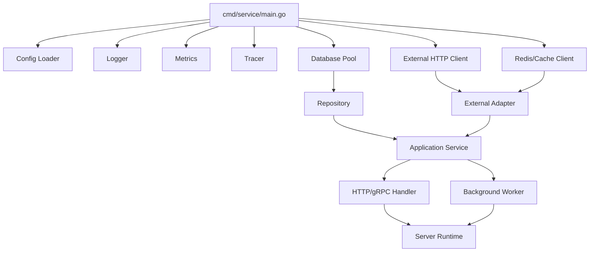
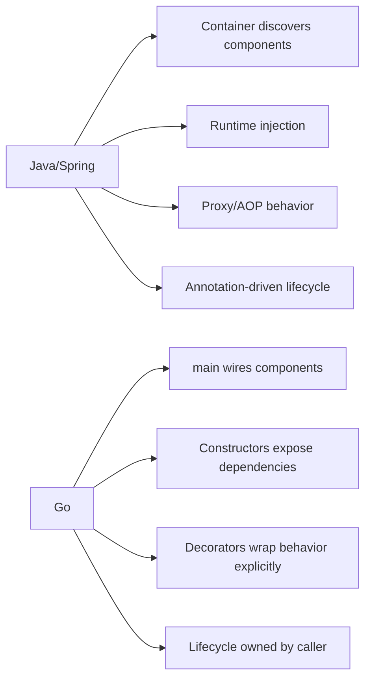
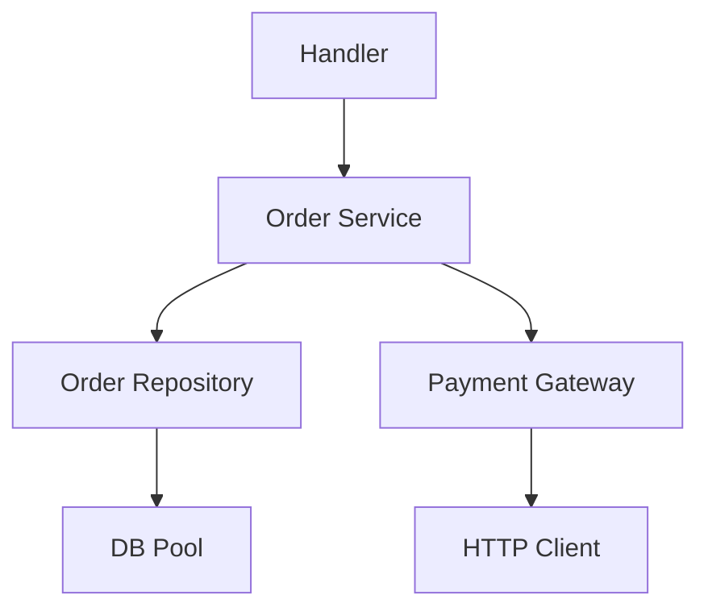
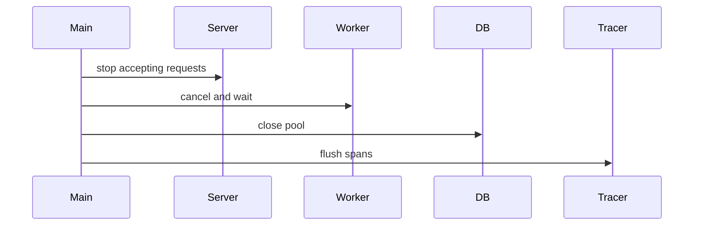
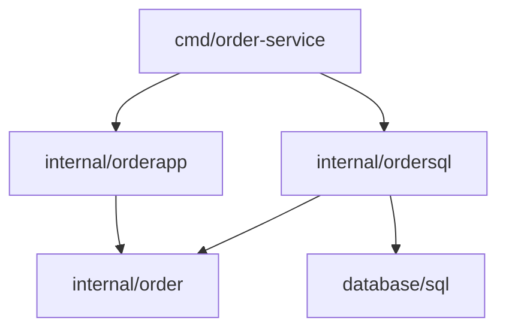
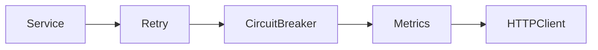
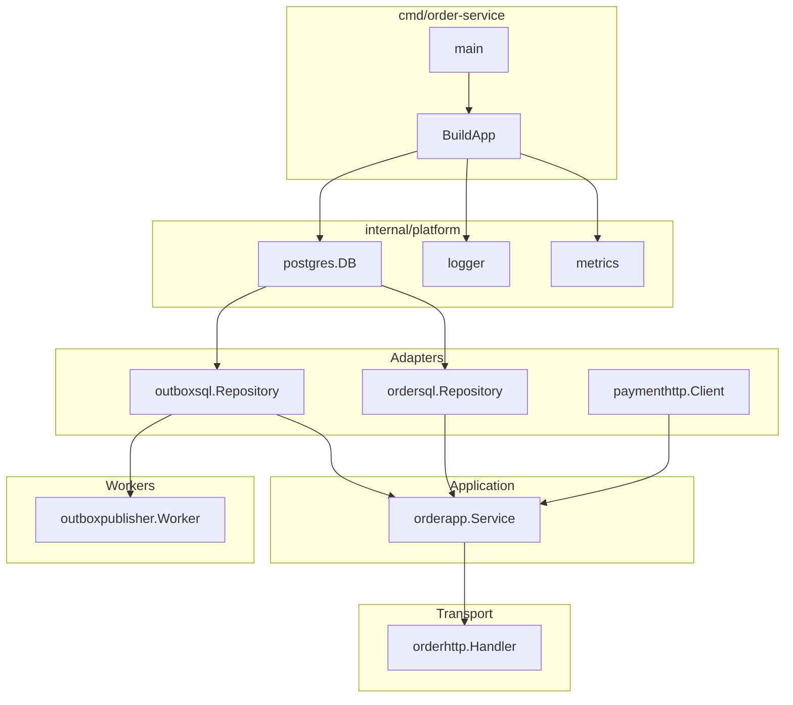

# learn-go-design-patterns-common-patterns-anti-patterns-part-009.md

# Part 009 — Dependency Wiring Pattern Without DI Container

> Seri: **Go Design Patterns, Common Patterns, and Anti-Patterns**  
> Fokus: **manual dependency wiring, composition root, lifecycle ownership, explicit dependency graph, testing seam, dan kapan compile-time DI/code generation masuk akal**  
> Target pembaca: **Java software engineer / tech lead yang ingin berpikir idiomatis Go untuk sistem production-scale**  
> Baseline: **Go 1.26.x**, dengan prinsip kompatibilitas Go 1 dan idiom desain yang masih konsisten dari Effective Go, Go Code Review Comments, Go blog, dan Go style guidance.

---

## 0. Posisi Part Ini Dalam Seri

Pada part sebelumnya kita sudah membahas:

- package sebagai unit desain utama Go,
- API surface sebagai promise publik,
- interface placement,
- constructor dan initialization,
- functional options,
- configuration sebagai operational contract.

Part ini menjawab pertanyaan berikut:

> Setelah kita punya package, constructor, config, interface, client, repository, handler, worker, dan adapter, bagaimana semuanya dirangkai tanpa membawa DI container ala Java/Spring?

Di Java, dependency wiring sering diambil alih oleh framework:

```java
@Service
public class OrderService {
    private final PaymentClient paymentClient;
    private final OrderRepository orderRepository;

    public OrderService(PaymentClient paymentClient, OrderRepository orderRepository) {
        this.paymentClient = paymentClient;
        this.orderRepository = orderRepository;
    }
}
```

Lalu container membaca annotation, membangun graph, menentukan lifecycle, meng-inject dependency, menjalankan post processor, membuat proxy, mengatur transaction boundary, dan kadang menambahkan AOP.

Di Go, pendekatan production yang paling sehat biasanya adalah:

```go
cfg, err := config.Load()
if err != nil {
    return err
}

logger := slog.New(...)
clock := systemclock.New()

db, err := postgres.Open(ctx, cfg.Database)
if err != nil {
    return err
}
defer db.Close()

ordersRepo := ordersql.NewRepository(db)
paymentsClient := paymenthttp.NewClient(cfg.Payment, logger)
orderService := orderapp.NewService(orderapp.Dependencies{
    Orders:   ordersRepo,
    Payments: paymentsClient,
    Clock:    clock,
    Logger:   logger,
})

server := httpserver.New(httpserver.Dependencies{
    Orders: orderService,
    Logger: logger,
})

return server.Run(ctx)
```

Ini terlihat lebih manual, tetapi justru menjadi **arsitektur yang bisa dibaca langsung**.

Manual wiring bukan tanda aplikasi kecil. Manual wiring adalah cara membuat **dependency graph eksplisit**.

---

## 1. Tujuan Pembelajaran

Setelah menyelesaikan part ini, kamu harus mampu:

1. Mendesain dependency graph Go tanpa DI container.
2. Menentukan composition root aplikasi.
3. Memisahkan dependency construction, dependency usage, dan runtime lifecycle.
4. Menghindari global state, service locator, dan hidden dependency.
5. Membedakan constructor dependency, runtime input, config, dan context.
6. Menentukan kapan dependency harus berupa concrete type, interface, function, atau config value.
7. Membuat startup sequence yang eksplisit, testable, observable, dan failure-safe.
8. Mendesain shutdown sequence yang deterministik.
9. Membuat test wiring tanpa mock container.
10. Mengevaluasi kapan code-generation DI seperti Wire layak dipakai.
11. Mengenali anti-pattern dependency wiring yang sering muncul di Go codebase besar.

---

## 2. Core Thesis

Dependency wiring di Go sebaiknya mengikuti prinsip ini:

> **Make construction explicit, make usage narrow, make lifecycle owned, and make the graph readable.**

Artinya:

- construction dilakukan di tempat yang jelas,
- dependency yang diterima suatu komponen sesempit mungkin,
- resource yang dibuka harus jelas siapa yang menutup,
- dependency graph bisa dipahami dari kode biasa,
- tidak perlu reflection container untuk mengetahui aplikasi terbentuk dari apa.

Dependency wiring bukan sekadar masalah “cara inject object”. Ini adalah masalah:

- ownership,
- startup ordering,
- shutdown ordering,
- observability,
- failure containment,
- testability,
- package dependency direction,
- long-term maintainability.

---

## 3. Mental Model: Dependency Graph Sebagai Runtime Architecture

Sebuah service Go production biasanya terdiri dari beberapa kategori node:



Yang penting bukan diagramnya, tetapi **arah ownership-nya**:

- `main` atau composition root membangun dependency.
- Package domain/application tidak membaca env sendiri.
- Repository tidak membuka DB pool sendiri bila pool lifecycle dimiliki aplikasi.
- Handler tidak membuat service sendiri.
- Service tidak membuat HTTP client ke external system sendiri bila config, metrics, tracing, dan retry policy harus dikontrol dari luar.
- Worker tidak start sendiri di constructor.

Dependency graph yang sehat membuat pertanyaan berikut mudah dijawab:

| Pertanyaan | Harus Bisa Dijawab Dari Mana? |
|---|---|
| Service ini memakai database apa? | composition root / wiring file |
| Siapa yang menutup DB pool? | owner yang membuka resource |
| Timeout external client berapa? | config + constructor |
| Retry policy ada di mana? | adapter/decorator wiring |
| Logger/tracer masuk ke komponen apa saja? | constructor dependencies |
| Test bisa mengganti dependency mana? | consumer-owned interface/function seam |
| Startup gagal di titik mana? | explicit initialization sequence |
| Shutdown berjalan urutan apa? | runtime lifecycle owner |

---

## 4. Java DI Container vs Go Manual Wiring

### 4.1 Java Container Model

Di Java/Spring, container biasanya bertanggung jawab atas:

- object discovery,
- dependency graph construction,
- lifecycle callback,
- scope,
- proxy generation,
- AOP,
- transaction interception,
- configuration binding,
- conditional bean,
- component scanning,
- runtime reflection.

Model ini kuat untuk ekosistem enterprise Java, tetapi membawa konsekuensi:

- dependency graph tidak selalu terlihat dari kode biasa,
- banyak behavior muncul dari annotation/proxy,
- startup bisa gagal karena runtime resolution,
- refactoring bisa dipengaruhi framework magic,
- test kadang butuh container juga,
- circular dependency kadang baru terlihat saat runtime.

### 4.2 Go Explicit Wiring Model

Di Go, model yang lebih idiomatis:

- constructor adalah fungsi biasa,
- dependency adalah parameter biasa,
- graph dibangun dengan kode biasa,
- lifecycle dikelola eksplisit,
- interface kecil didefinisikan di sisi consumer,
- package import graph menjadi arsitektur aktual,
- test bisa membuat graph kecil tanpa framework.



Manual wiring bukan berarti “tidak ada dependency injection”.

Manual wiring adalah dependency injection dalam bentuk paling eksplisit:

```go
type Service struct {
    repo   Repository
    clock  Clock
    logger *slog.Logger
}

func NewService(repo Repository, clock Clock, logger *slog.Logger) *Service {
    return &Service{
        repo:   repo,
        clock:  clock,
        logger: logger,
    }
}
```

Yang berbeda hanya tidak ada container yang menyembunyikan graph.

---

## 5. Istilah Penting

### 5.1 Dependency

Dependency adalah sesuatu yang dibutuhkan komponen untuk menjalankan tugasnya.

Contoh:

- repository,
- external client,
- clock,
- ID generator,
- logger,
- metrics recorder,
- config value,
- transaction runner,
- authorization policy,
- feature flag reader.

Dependency bukan:

- request payload,
- `context.Context`,
- temporary variable,
- domain object yang diproses,
- data hasil query.

### 5.2 Wiring

Wiring adalah proses menghubungkan dependency ke komponen yang membutuhkan.

```go
repo := ordersql.NewRepository(db)
svc := orderapp.NewService(repo, clock, logger)
handler := orderhttp.NewHandler(svc, logger)
```

### 5.3 Composition Root

Composition root adalah tempat utama aplikasi membangun dependency graph.

Biasanya berada di:

```text
cmd/order-service/main.go
cmd/order-service/app.go
internal/bootstrap/bootstrap.go
internal/app/app.go
```

Composition root boleh tahu banyak package.

Package lain sebaiknya tidak tahu seluruh graph.

### 5.4 Lifecycle Owner

Lifecycle owner adalah pihak yang membuka dan menutup resource.

Contoh:

```go
db, err := sql.Open("postgres", dsn)
if err != nil {
    return err
}
defer db.Close()
```

Jika `main` membuka DB, `main` atau runtime app owner harus menutup DB.

### 5.5 Provider

Provider adalah fungsi yang membuat dependency.

```go
func NewDB(ctx context.Context, cfg DatabaseConfig) (*sql.DB, error) {
    db, err := sql.Open("postgres", cfg.DSN)
    if err != nil {
        return nil, err
    }
    if err := db.PingContext(ctx); err != nil {
        db.Close()
        return nil, err
    }
    return db, nil
}
```

### 5.6 Dependency Graph

Dependency graph adalah hubungan antar komponen.



Graph yang sehat biasanya acyclic, eksplisit, dan mudah dipotong untuk test.

---

## 6. Dependency Category

Tidak semua dependency sama. Salah mengklasifikasikan dependency akan menghasilkan desain yang buruk.

### 6.1 Stable Infrastructure Dependency

Contoh:

- DB pool,
- Redis client,
- HTTP client,
- logger,
- metrics registry,
- tracer provider.

Karakteristik:

- dibuat saat startup,
- digunakan banyak komponen,
- lifecycle panjang,
- perlu shutdown/flush/close,
- biasanya concrete type boleh dipakai di adapter layer.

### 6.2 Application Boundary Dependency

Contoh:

- repository interface,
- payment gateway interface,
- notification sender,
- authorization checker,
- transaction runner.

Karakteristik:

- sering didefinisikan di sisi application package,
- sebaiknya kecil,
- dipakai untuk menjaga core logic tidak bergantung pada detail external.

### 6.3 Pure Policy Dependency

Contoh:

- clock,
- ID generator,
- pricing policy,
- eligibility policy,
- decision rule,
- feature flag evaluator.

Karakteristik:

- dapat berupa interface kecil atau function,
- sangat penting untuk deterministic testing,
- sering tidak butuh heavy object.

### 6.4 Runtime Input

Contoh:

- request body,
- user ID,
- command object,
- correlation ID,
- context deadline.

Ini **bukan constructor dependency**.

Runtime input masuk ke method call:

```go
func (s *Service) SubmitOrder(ctx context.Context, cmd SubmitOrderCommand) (SubmitOrderResult, error)
```

bukan ke constructor.

### 6.5 Configuration Value

Contoh:

- timeout,
- retry count,
- base URL,
- pool size,
- feature flag default.

Config bisa menjadi constructor parameter atau bagian dari config struct.

Tetapi komponen application sebaiknya tidak membaca env sendiri.

---

## 7. Rule: Do Not Hide Dependencies

Dependency tersembunyi adalah salah satu penyebab utama Go codebase menjadi sulit dites dan sulit dipahami.

### Buruk

```go
package payment

var client = http.DefaultClient

func Charge(ctx context.Context, req ChargeRequest) error {
    resp, err := client.Do(buildRequest(ctx, req))
    if err != nil {
        return err
    }
    defer resp.Body.Close()
    return nil
}
```

Masalah:

- dependency HTTP client tersembunyi,
- timeout tidak jelas,
- test sulit,
- observability sulit,
- retry policy sulit dikontrol,
- shared global dapat termutasi test lain.

### Lebih baik

```go
type Client struct {
    httpClient *http.Client
    baseURL    string
    logger     *slog.Logger
}

func NewClient(cfg Config, httpClient *http.Client, logger *slog.Logger) (*Client, error) {
    if httpClient == nil {
        return nil, errors.New("payment: nil http client")
    }
    if cfg.BaseURL == "" {
        return nil, errors.New("payment: empty base url")
    }
    return &Client{
        httpClient: httpClient,
        baseURL:    cfg.BaseURL,
        logger:     logger,
    }, nil
}

func (c *Client) Charge(ctx context.Context, req ChargeRequest) error {
    // use c.httpClient explicitly
    return nil
}
```

Dependency yang muncul di constructor memberi sinyal desain:

> “Komponen ini tidak bisa bekerja tanpa dependency ini.”

---

## 8. Composition Root Pattern

Composition root adalah tempat dependency graph dibangun.

### 8.1 Minimal Shape

```text
cmd/order-service/
  main.go
  app.go
internal/
  config/
  orderapp/
  ordersql/
  orderhttp/
  paymenthttp/
  runtime/
```

### 8.2 Example

```go
package main

func main() {
    ctx := context.Background()

    if err := run(ctx); err != nil {
        fmt.Fprintf(os.Stderr, "fatal: %v\n", err)
        os.Exit(1)
    }
}

func run(ctx context.Context) error {
    cfg, err := config.Load()
    if err != nil {
        return fmt.Errorf("load config: %w", err)
    }

    logger := newLogger(cfg.Log)

    db, err := newDatabase(ctx, cfg.Database)
    if err != nil {
        return fmt.Errorf("open database: %w", err)
    }
    defer db.Close()

    orderRepo := ordersql.NewRepository(db)
    paymentClient, err := paymenthttp.NewClient(cfg.Payment, logger)
    if err != nil {
        return fmt.Errorf("create payment client: %w", err)
    }

    orderService := orderapp.NewService(orderapp.Dependencies{
        Orders:   orderRepo,
        Payments: paymentClient,
        Clock:    systemclock.Clock{},
        Logger:   logger,
    })

    server := orderhttp.NewServer(orderhttp.Dependencies{
        Orders: orderService,
        Logger: logger,
    })

    return server.Run(ctx)
}
```

### 8.3 Why This Works

- startup order is visible,
- error context is visible,
- lifecycle ownership is visible,
- test graph can be smaller,
- dependency graph follows imports,
- no runtime magic.

### 8.4 Composition Root Can Be Verbose

That is acceptable.

Composition root is allowed to be boring and explicit.

It is not domain logic. It is executable architecture.

---

## 9. Layered Wiring Pattern

Untuk aplikasi besar, `run()` bisa terlalu panjang. Pecah wiring berdasarkan feature atau infrastructure, bukan dengan menyembunyikan dependency.

```go
type Infrastructure struct {
    DB      *sql.DB
    Redis   *redis.Client
    Logger  *slog.Logger
    Metrics *metrics.Registry
    Tracer  trace.TracerProvider
}

type Application struct {
    Orders   *orderapp.Service
    Payments *paymentapp.Service
}

type Transports struct {
    HTTP *http.Server
}
```

```go
func buildInfrastructure(ctx context.Context, cfg Config) (*Infrastructure, func(context.Context) error, error) {
    // construct DB, Redis, logger, metrics, tracer
}

func buildApplication(infra *Infrastructure, cfg Config) (*Application, error) {
    // construct repositories, clients, services
}

func buildTransports(app *Application, infra *Infrastructure, cfg Config) (*Transports, error) {
    // construct HTTP/gRPC servers
}
```

Ini masih manual wiring, tetapi lebih terstruktur.

---

## 10. Dependency Struct Pattern

Saat constructor punya banyak dependency, gunakan dependency struct dengan nama field jelas.

### 10.1 Before

```go
func NewService(
    orders Repository,
    payments PaymentGateway,
    authorizer Authorizer,
    tx TxRunner,
    clock Clock,
    ids IDGenerator,
    logger *slog.Logger,
    metrics Metrics,
) *Service {
    // ...
}
```

Signature panjang membuat posisi parameter rawan tertukar.

### 10.2 After

```go
type Dependencies struct {
    Orders     Repository
    Payments   PaymentGateway
    Authorizer Authorizer
    Tx         TxRunner
    Clock      Clock
    IDs        IDGenerator
    Logger     *slog.Logger
    Metrics    Metrics
}

func NewService(deps Dependencies) (*Service, error) {
    if deps.Orders == nil {
        return nil, errors.New("orderapp: nil orders repository")
    }
    if deps.Payments == nil {
        return nil, errors.New("orderapp: nil payment gateway")
    }
    if deps.Clock == nil {
        deps.Clock = systemclock.Clock{}
    }
    if deps.Logger == nil {
        deps.Logger = slog.Default()
    }

    return &Service{
        orders:     deps.Orders,
        payments:   deps.Payments,
        authorizer: deps.Authorizer,
        tx:         deps.Tx,
        clock:      deps.Clock,
        ids:        deps.IDs,
        logger:     deps.Logger,
        metrics:    deps.Metrics,
    }, nil
}
```

### 10.3 Why Dependency Struct Helps

- call site readable,
- dependencies named,
- optional dependency can have default,
- validation centralized,
- future dependency can be added with less call-site churn,
- test can override selected fields.

### 10.4 Risk

Dependency struct can hide required fields if not validated.

So validate required dependencies in constructor.

---

## 11. Interface or Concrete Type?

A central wiring decision:

> Should this dependency be an interface or concrete type?

### 11.1 Use Concrete Type When

Use concrete type when:

- dependency is infrastructure detail inside adapter package,
- no alternative implementation is needed,
- test can use real implementation cheaply,
- behavior is not part of domain/application seam,
- the type is already stable and well-known.

Example:

```go
type Repository struct {
    db *sql.DB
}

func NewRepository(db *sql.DB) *Repository {
    return &Repository{db: db}
}
```

Inside `ordersql`, `*sql.DB` concrete type is fine.

### 11.2 Use Interface When

Use interface when:

- consumer needs only small behavior,
- implementation belongs to another package/layer,
- testing needs fake behavior,
- policy needs substitution,
- boundary hides external system details,
- compile-time dependency direction matters.

Example:

```go
type Orders interface {
    Insert(ctx context.Context, order Order) error
    FindByID(ctx context.Context, id OrderID) (Order, error)
}

type PaymentGateway interface {
    Authorize(ctx context.Context, req PaymentAuthorization) (PaymentDecision, error)
}
```

These interfaces belong in `orderapp`, not in `ordersql` or `paymenthttp`, because `orderapp` is the consumer.

### 11.3 Use Function When Behavior Is Tiny

Do not create an interface for one function if a function type is clearer.

```go
type NowFunc func() time.Time

type Service struct {
    now NowFunc
}
```

or:

```go
type IDGenerator func() string
```

This is useful for:

- clock,
- ID generation,
- small policy,
- normalization,
- callback.

### 11.4 Do Not Interface Everything

Bad:

```go
type UserServiceInterface interface {
    CreateUser(ctx context.Context, req CreateUserRequest) (*CreateUserResponse, error)
    UpdateUser(ctx context.Context, req UpdateUserRequest) (*UpdateUserResponse, error)
    DeleteUser(ctx context.Context, id string) error
    FindUser(ctx context.Context, id string) (*UserDTO, error)
}
```

This is often a Java habit, not a Go need.

Better:

- define small interfaces at actual consuming boundary,
- return concrete service from constructor,
- expose behavior through package API.

---

## 12. Lifecycle Wiring Pattern

Dependency wiring is not complete until lifecycle is defined.

### 12.1 Resource Types

| Resource | Startup | Shutdown |
|---|---|---|
| DB pool | Open + ping | Close |
| HTTP server | Listen/serve | Shutdown |
| Metrics exporter | Start | Stop/flush |
| Trace provider | Create exporter | Shutdown/flush |
| Worker | Start goroutine | Cancel + wait |
| Queue consumer | Connect/subscribe | Stop consuming + close |
| Cache client | Connect optionally | Close |
| Logger | Create | Flush/sync if needed |

### 12.2 App Runtime Container Without DI Container

You can define an application runtime object:

```go
type App struct {
    server  *http.Server
    workers []Worker
    closers []io.Closer
    logger  *slog.Logger
}

func (a *App) Run(ctx context.Context) error {
    group, ctx := errgroup.WithContext(ctx)

    for _, worker := range a.workers {
        worker := worker
        group.Go(func() error {
            return worker.Run(ctx)
        })
    }

    group.Go(func() error {
        err := a.server.ListenAndServe()
        if err != nil && !errors.Is(err, http.ErrServerClosed) {
            return err
        }
        return nil
    })

    group.Go(func() error {
        <-ctx.Done()
        shutdownCtx, cancel := context.WithTimeout(context.Background(), 30*time.Second)
        defer cancel()
        return a.server.Shutdown(shutdownCtx)
    })

    return group.Wait()
}

func (a *App) Close() error {
    var joined error
    for i := len(a.closers) - 1; i >= 0; i-- {
        if err := a.closers[i].Close(); err != nil {
            joined = errors.Join(joined, err)
        }
    }
    return joined
}
```

Note: this is not a DI container. It is lifecycle ownership.

### 12.3 Shutdown Order

Usually shutdown order should be reverse of startup order:



But real shutdown may need special ordering:

- stop accepting new requests,
- stop consumers or workers,
- let in-flight work drain,
- close DB/cache clients,
- flush logs/traces/metrics.

---

## 13. Startup Failure Pattern

Startup failure must be precise.

Bad:

```go
if err != nil {
    return err
}
```

Better:

```go
if err != nil {
    return fmt.Errorf("open database: %w", err)
}
```

Even better with stage context:

```go
db, err := postgres.Open(ctx, cfg.Database)
if err != nil {
    return fmt.Errorf("bootstrap infrastructure database: %w", err)
}
```

Startup failure should answer:

- which dependency failed,
- which config source was involved,
- whether failure is retryable operationally,
- whether partial resources were cleaned up.

### 13.1 Partial Cleanup

```go
func buildInfrastructure(ctx context.Context, cfg Config) (_ *Infrastructure, cleanup func() error, _ error) {
    var closers []io.Closer
    cleanup = func() error {
        var joined error
        for i := len(closers) - 1; i >= 0; i-- {
            joined = errors.Join(joined, closers[i].Close())
        }
        return joined
    }

    db, err := postgres.Open(ctx, cfg.Database)
    if err != nil {
        return nil, cleanup, fmt.Errorf("open database: %w", err)
    }
    closers = append(closers, db)

    redisClient, err := redisclient.Open(ctx, cfg.Redis)
    if err != nil {
        _ = cleanup()
        return nil, nil, fmt.Errorf("open redis: %w", err)
    }
    closers = append(closers, redisClient)

    return &Infrastructure{DB: db, Redis: redisClient}, cleanup, nil
}
```

This makes partial failure safe.

---

## 14. Dependency Direction Pattern

In Go, package import graph is architecture.

If package `orderapp` imports `ordersql`, then your application layer depends on database implementation.

Often you want the opposite:



`main` wires `ordersql.Repository` into `orderapp.Service`, but `orderapp` does not import `ordersql`.

### 14.1 Consumer-Owned Interface

```go
package orderapp

type OrderRepository interface {
    Save(ctx context.Context, order order.Order) error
    Find(ctx context.Context, id order.ID) (order.Order, error)
}

type Service struct {
    repo OrderRepository
}
```

```go
package ordersql

type Repository struct {
    db *sql.DB
}

func (r *Repository) Save(ctx context.Context, order order.Order) error { ... }
func (r *Repository) Find(ctx context.Context, id order.ID) (order.Order, error) { ... }
```

No explicit `implements` needed.

Wiring checks it implicitly:

```go
repo := ordersql.NewRepository(db)
svc := orderapp.NewService(repo)
```

Optional compile-time assertion:

```go
var _ orderapp.OrderRepository = (*ordersql.Repository)(nil)
```

Use assertion sparingly, usually in adapter package or test.

---

## 15. Wiring With Decorators

Explicit wiring makes cross-cutting behavior visible.

Example:

```go
basePayment := paymenthttp.NewClient(cfg.Payment, httpClient, logger)

payment := paymentapp.PaymentGateway(basePayment)
payment = paymentdecorator.NewMetrics(payment, metrics)
payment = paymentdecorator.NewLogging(payment, logger)
payment = paymentdecorator.NewRetry(payment, retryPolicy)
payment = paymentdecorator.NewCircuitBreaker(payment, breaker)

svc := orderapp.NewService(orderapp.Dependencies{
    Payments: payment,
})
```

This is the Go equivalent of AOP/proxy composition, but visible.

### 15.1 Decorator Ordering Matters



Different order means different semantics:

- metrics outside retry counts one logical operation,
- metrics inside retry counts each attempt,
- circuit breaker outside retry trips on final operation result,
- circuit breaker inside retry sees each attempt.

Manual wiring forces you to make that decision.

---

## 16. Wiring With Feature Modules

For medium-large services, use feature-specific builders.

```go
type OrderModule struct {
    Service *orderapp.Service
    Handler *orderhttp.Handler
    Worker  *orderworker.Worker
}

func BuildOrderModule(deps OrderModuleDeps) (*OrderModule, error) {
    repo := ordersql.NewRepository(deps.DB)
    gateway := paymenthttp.NewClient(deps.PaymentConfig, deps.HTTPClient, deps.Logger)

    service, err := orderapp.NewService(orderapp.Dependencies{
        Orders:   repo,
        Payments: gateway,
        Clock:    deps.Clock,
        Logger:   deps.Logger,
    })
    if err != nil {
        return nil, err
    }

    return &OrderModule{
        Service: service,
        Handler: orderhttp.NewHandler(service, deps.Logger),
        Worker:  orderworker.NewWorker(service, deps.Logger),
    }, nil
}
```

This is useful when:

- feature has multiple adapters,
- feature wiring is large,
- team ownership is feature-based,
- tests need isolated module graph.

Risk:

- module builder can become mini-container,
- dependency direction can become hidden,
- module struct can expose too much.

Keep it explicit.

---

## 17. Wiring and Configuration Boundary

Do not pass the entire app config everywhere.

Bad:

```go
func NewPaymentClient(cfg config.Config) *Client {
    return &Client{
        baseURL: cfg.Payment.BaseURL,
        timeout: cfg.HTTP.Timeout,
    }
}
```

This couples payment client to global config shape.

Better:

```go
type Config struct {
    BaseURL string
    Timeout time.Duration
    Retry   RetryConfig
}

func NewClient(cfg Config, logger *slog.Logger) (*Client, error) {
    // validate only payment config
}
```

At composition root:

```go
paymentClient, err := paymenthttp.NewClient(paymenthttp.Config{
    BaseURL: cfg.Payment.BaseURL,
    Timeout: cfg.Payment.Timeout,
    Retry:   cfg.Payment.Retry,
}, logger)
```

This makes config dependency narrow.

---

## 18. Wiring and Context Boundary

`context.Context` is runtime request/cancellation data, not a constructor dependency.

Bad:

```go
type Service struct {
    ctx context.Context
    repo Repository
}

func NewService(ctx context.Context, repo Repository) *Service {
    return &Service{ctx: ctx, repo: repo}
}
```

Problems:

- context lifetime unclear,
- cancellation may accidentally kill future calls,
- values may leak across requests,
- tests may pass stale context.

Better:

```go
type Service struct {
    repo Repository
}

func NewService(repo Repository) *Service {
    return &Service{repo: repo}
}

func (s *Service) Submit(ctx context.Context, cmd SubmitCommand) error {
    return s.repo.Save(ctx, cmd.Order)
}
```

Exception:

- startup provider may accept context to open/ping resource,
- `Run(ctx)` accepts context to control lifecycle,
- long-running worker accepts context in `Run`.

```go
func Open(ctx context.Context, cfg Config) (*Client, error)
func (w *Worker) Run(ctx context.Context) error
```

But do not store request context in long-lived struct.

---

## 19. Wiring and Logger/Metrics/Tracer

Observability dependencies are real dependencies.

Do not use arbitrary global logger everywhere just because logging feels cross-cutting.

### 19.1 Logger Injection

```go
type Service struct {
    logger *slog.Logger
}
```

This is acceptable for most application services.

For libraries, consider accepting minimal interface or no logger at all.

### 19.2 Metrics Interface

A domain/application package may not need full metrics registry.

Better:

```go
type Metrics interface {
    CountOrderSubmitted(ctx context.Context, status string)
    ObserveSubmitDuration(ctx context.Context, d time.Duration)
}
```

This keeps app package independent from metrics vendor.

### 19.3 Tracing

Often tracing is handled in transport/middleware/client adapter.

Application service can receive context with span already attached and call dependencies normally.

Avoid passing tracer to every package unless the package actually starts spans with meaningful boundaries.

---

## 20. Wiring Transaction Boundary

Transaction management is one of the most important wiring decisions.

### 20.1 Bad: Repository Opens Its Own Transaction Silently

```go
func (r *Repository) SaveOrder(ctx context.Context, order Order) error {
    tx, err := r.db.BeginTx(ctx, nil)
    if err != nil {
        return err
    }
    defer tx.Rollback()

    // save order

    return tx.Commit()
}
```

This is okay for trivial repository method, but dangerous when use case needs multiple repository operations in one transaction.

### 20.2 Better: Transaction Runner Dependency

```go
type TxRunner interface {
    WithinTx(ctx context.Context, fn func(ctx context.Context) error) error
}
```

Service wiring:

```go
svc := orderapp.NewService(orderapp.Dependencies{
    Tx:     txRunner,
    Orders: orderRepo,
    Events: outboxRepo,
})
```

Usage:

```go
func (s *Service) Submit(ctx context.Context, cmd SubmitCommand) error {
    return s.tx.WithinTx(ctx, func(ctx context.Context) error {
        if err := s.orders.Save(ctx, order); err != nil {
            return err
        }
        if err := s.events.Append(ctx, event); err != nil {
            return err
        }
        return nil
    })
}
```

Implementation can bind transaction to context internally or pass explicit tx-scoped repositories. Both have trade-offs and will be discussed more in Part 012.

---

## 21. Wiring External Clients

External client wiring should make operational policy explicit:

- base URL,
- timeout,
- retry,
- circuit breaker,
- auth,
- TLS,
- metrics,
- tracing,
- user agent,
- rate limit,
- idempotency key behavior.

Bad:

```go
func NewClient() *Client {
    return &Client{httpClient: http.DefaultClient}
}
```

Better:

```go
type ClientConfig struct {
    BaseURL       string
    Timeout       time.Duration
    UserAgent     string
    MaxRetries    int
    RetryBackoff   time.Duration
    RateLimitRPS   int
}

func NewClient(cfg ClientConfig, transport http.RoundTripper, logger *slog.Logger) (*Client, error) {
    if cfg.BaseURL == "" {
        return nil, errors.New("client: empty base url")
    }
    if cfg.Timeout <= 0 {
        return nil, errors.New("client: timeout must be positive")
    }
    if transport == nil {
        transport = http.DefaultTransport
    }

    httpClient := &http.Client{
        Timeout:   cfg.Timeout,
        Transport: transport,
    }

    return &Client{
        baseURL:    cfg.BaseURL,
        httpClient: httpClient,
        logger:     logger,
    }, nil
}
```

This makes behavior auditable.

---

## 22. Wiring For Tests

A strong Go wiring design makes tests simple.

### 22.1 Unit Test Wiring

```go
type fakeOrders struct {
    saved []order.Order
}

func (f *fakeOrders) Save(ctx context.Context, o order.Order) error {
    f.saved = append(f.saved, o)
    return nil
}

func TestSubmitOrder(t *testing.T) {
    orders := &fakeOrders{}
    payments := &fakePayments{decision: Approved}

    svc, err := orderapp.NewService(orderapp.Dependencies{
        Orders:   orders,
        Payments: payments,
        Clock:    fixedclock.New(time.Date(2026, 1, 1, 0, 0, 0, 0, time.UTC)),
        Logger:   slog.New(slog.NewTextHandler(io.Discard, nil)),
    })
    if err != nil {
        t.Fatal(err)
    }

    result, err := svc.Submit(context.Background(), SubmitCommand{...})
    if err != nil {
        t.Fatal(err)
    }

    if result.Status != Submitted {
        t.Fatalf("status = %v, want submitted", result.Status)
    }
}
```

No container needed.

### 22.2 Integration Test Wiring

```go
func TestOrderRepositoryIntegration(t *testing.T) {
    db := testdb.Open(t)
    repo := ordersql.NewRepository(db)

    // run real SQL behavior
}
```

### 22.3 Application Graph Test

For critical services, test that wiring can be built with test config:

```go
func TestBuildApp(t *testing.T) {
    cfg := testConfig(t)
    app, cleanup, err := BuildApp(context.Background(), cfg)
    if err != nil {
        t.Fatal(err)
    }
    t.Cleanup(func() { _ = cleanup() })

    if app == nil {
        t.Fatal("nil app")
    }
}
```

This catches missing dependency validation early.

---

## 23. When Manual Wiring Becomes Painful

Manual wiring may become painful when:

- graph has hundreds of components,
- many constructors change frequently,
- same graph is built for many binaries,
- feature modules are composed in many combinations,
- startup code becomes dominated by mechanical parameter passing,
- dependency graph is still explicit but tedious.

This does not automatically mean you need runtime DI container.

Options:

1. Improve package cohesion.
2. Use dependency structs.
3. Split composition root by feature/infrastructure.
4. Generate wiring code at compile time.
5. Consider framework/container only if lifecycle and graph complexity justify it.

---

## 24. Compile-Time DI / Code Generation Pattern

Go has a known compile-time DI approach: generate ordinary Go initialization code.

Google Wire’s Go blog article describes Wire as a tool where you describe services and dependencies, then Wire processes the graph and generates initialization code. It emphasizes compile-time generation instead of runtime reflection/container behavior.

The important design value is:

> Generated wiring should still be ordinary Go code, not runtime magic.

### 24.1 When Compile-Time DI Helps

Use compile-time DI when:

- manual wiring is large and repetitive,
- graph is mostly static,
- constructors are explicit,
- team understands generated code,
- startup failure should remain compile-time/type-checked where possible,
- you do not want reflection runtime container.

### 24.2 When It Does Not Help

Avoid compile-time DI when:

- app is small,
- graph changes frequently in unclear ways,
- team does not understand manual wiring yet,
- code generation hides architectural smell,
- problem is bad package design, not wiring boilerplate.

### 24.3 Rule

Do not use DI generation to avoid understanding your dependency graph.

Use it only after the graph is already clean and explicit.

---

## 25. Runtime DI Container Pattern: Use Carefully

Some Go frameworks/libraries provide runtime DI containers, sometimes with reflection or generics.

They can be useful for:

- plugin-heavy apps,
- framework-style lifecycle management,
- teams standardizing app modules,
- large organizations with consistent platform abstraction,
- advanced dependency override/testing systems.

But they introduce risks:

- graph less visible,
- startup errors move to runtime,
- hidden lifecycle,
- reflection/generic magic,
- harder static reasoning,
- framework lock-in,
- dependency direction can be bypassed.

For many Go services, runtime DI container is more complexity than value.

---

## 26. Service Locator Anti-Pattern

Service locator looks convenient but damages local reasoning.

### Bad

```go
type Container struct {
    services map[string]any
}

func (c *Container) Get(name string) any {
    return c.services[name]
}

func (s *OrderService) Submit(ctx context.Context, cmd Command) error {
    payments := container.Get("payments").(PaymentGateway)
    return payments.Authorize(ctx, ...)
}
```

Problems:

- dependency invisible in constructor,
- runtime type assertions,
- hidden coupling,
- tests depend on global container state,
- missing dependency found late,
- hard to know what service actually needs.

### Better

```go
type Service struct {
    payments PaymentGateway
}

func NewService(payments PaymentGateway) *Service {
    return &Service{payments: payments}
}
```

---

## 27. Global Registry Anti-Pattern

Bad:

```go
var registry = map[string]Handler{}

func Register(name string, h Handler) {
    registry[name] = h
}
```

Sometimes registry is valid, but it becomes dangerous when combined with `init()` side effects:

```go
func init() {
    global.Register("pdf", NewPDFHandler())
}
```

Problems:

- import order creates behavior,
- blank imports become required,
- tests are order-dependent,
- mutation is global,
- plugin availability is not visible from composition root.

Better:

```go
registry := handler.NewRegistry()
registry.Register("pdf", pdf.NewHandler())
registry.Register("csv", csv.NewHandler())
```

Now registration is explicit.

---

## 28. Hidden Goroutine Anti-Pattern

Bad:

```go
func NewCacheRefresher(client Client) *Refresher {
    r := &Refresher{client: client}
    go r.loop()
    return r
}
```

Problems:

- caller cannot control lifecycle,
- no shutdown path,
- tests leak goroutines,
- startup side effect hidden,
- failure reporting unclear.

Better:

```go
type Refresher struct {
    client Client
}

func NewRefresher(client Client) *Refresher {
    return &Refresher{client: client}
}

func (r *Refresher) Run(ctx context.Context) error {
    ticker := time.NewTicker(time.Minute)
    defer ticker.Stop()

    for {
        select {
        case <-ctx.Done():
            return ctx.Err()
        case <-ticker.C:
            if err := r.refresh(ctx); err != nil {
                // log or return depending on policy
            }
        }
    }
}
```

Constructor builds. `Run` starts lifecycle.

---

## 29. Circular Dependency Anti-Pattern

Circular dependency often signals confused ownership.

Example:

```text
orderapp -> paymentapp -> orderapp
```

Possible root causes:

- service calls service bidirectionally,
- shared DTO package missing or misplaced,
- domain concept split incorrectly,
- event/command boundary missing,
- orchestration belongs in higher-level use case,
- interface defined in wrong package.

### Refactoring Options

1. Extract shared domain type package.
2. Move orchestration to application package above both services.
3. Introduce event or command boundary.
4. Define consumer-owned interface in the package that needs behavior.
5. Merge packages if split is artificial.

Do not solve cycles with global service locator.

---

## 30. Example: Production-Grade Wiring for Order Service

### 30.1 Package Layout

```text
cmd/order-service/
  main.go
  app.go
internal/config/
internal/platform/postgres/
internal/platform/redis/
internal/platform/httpclient/
internal/order/
internal/orderapp/
internal/ordersql/
internal/orderhttp/
internal/paymenthttp/
internal/outboxsql/
internal/worker/outboxpublisher/
```

### 30.2 Application Interface

```go
package orderapp

type Orders interface {
    Save(ctx context.Context, order order.Order) error
    FindByID(ctx context.Context, id order.ID) (order.Order, error)
}

type Payments interface {
    Authorize(ctx context.Context, req PaymentAuthorization) (PaymentDecision, error)
}

type Events interface {
    Append(ctx context.Context, event Event) error
}

type TxRunner interface {
    WithinTx(ctx context.Context, fn func(ctx context.Context) error) error
}

type Dependencies struct {
    Orders   Orders
    Payments Payments
    Events   Events
    Tx       TxRunner
    Clock    Clock
    Logger   *slog.Logger
}

func NewService(deps Dependencies) (*Service, error) {
    if deps.Orders == nil {
        return nil, errors.New("orderapp: nil orders")
    }
    if deps.Payments == nil {
        return nil, errors.New("orderapp: nil payments")
    }
    if deps.Events == nil {
        return nil, errors.New("orderapp: nil events")
    }
    if deps.Tx == nil {
        return nil, errors.New("orderapp: nil tx")
    }
    if deps.Clock == nil {
        deps.Clock = systemclock.Clock{}
    }
    if deps.Logger == nil {
        deps.Logger = slog.Default()
    }
    return &Service{deps: deps}, nil
}
```

### 30.3 Wiring

```go
func BuildApp(ctx context.Context, cfg config.Config) (*runtime.App, error) {
    logger := logging.New(cfg.Log)

    db, err := postgres.Open(ctx, cfg.Database)
    if err != nil {
        return nil, fmt.Errorf("open postgres: %w", err)
    }

    txRunner := postgres.NewTxRunner(db)
    orderRepo := ordersql.NewRepository(db)
    outboxRepo := outboxsql.NewRepository(db)

    paymentClient, err := paymenthttp.NewClient(paymenthttp.Config{
        BaseURL: cfg.Payment.BaseURL,
        Timeout: cfg.Payment.Timeout,
    }, logger)
    if err != nil {
        db.Close()
        return nil, fmt.Errorf("create payment client: %w", err)
    }

    paymentGateway := paymentdecorator.NewMetrics(paymentClient, metrics)
    paymentGateway = paymentdecorator.NewRetry(paymentGateway, cfg.Payment.Retry)

    orderService, err := orderapp.NewService(orderapp.Dependencies{
        Orders:   orderRepo,
        Payments: paymentGateway,
        Events:   outboxRepo,
        Tx:       txRunner,
        Clock:    systemclock.Clock{},
        Logger:   logger,
    })
    if err != nil {
        db.Close()
        return nil, fmt.Errorf("create order service: %w", err)
    }

    handler := orderhttp.NewHandler(orderService, logger)
    server := httpserver.New(cfg.HTTP, handler, logger)

    outboxWorker := outboxpublisher.NewWorker(outboxpublisher.Dependencies{
        Events: outboxRepo,
        Logger: logger,
    })

    return runtime.NewApp(runtime.Dependencies{
        Server:  server,
        Workers: []runtime.Worker{outboxWorker},
        Closers: []io.Closer{db},
        Logger:  logger,
    }), nil
}
```

Important:

- `orderapp` does not import `ordersql`.
- `ordersql` does not know HTTP.
- `paymenthttp` does not know order service.
- `main`/composition root sees all concrete implementations.
- lifecycle is owned by runtime app.

---

## 31. Mermaid: Clean Dependency Wiring Shape



Read carefully:

- The arrows in this diagram represent **wiring relationships**, not necessarily import direction.
- Import direction should keep `orderapp` independent from concrete infra adapters.
- `cmd` or bootstrap package is allowed to import many packages.

---

## 32. Anti-Pattern Catalog

### 32.1 Service Locator

Symptom:

- components call `container.Get(...)` internally.

Root cause:

- trying to avoid constructor dependency.

Impact:

- hidden dependency,
- runtime failure,
- poor tests,
- global coupling.

Fix:

- expose dependency in constructor.

---

### 32.2 Global Singleton Dependency

Symptom:

```go
var DB *sql.DB
```

Impact:

- test pollution,
- lifecycle unclear,
- import-time initialization risk,
- difficult multi-tenant/multi-instance support.

Fix:

- build DB in composition root,
- pass to repositories.

---

### 32.3 Constructor Opens Everything

Symptom:

```go
func NewService() *Service {
    db := openDB()
    redis := openRedis()
    client := newPaymentClient()
    return &Service{...}
}
```

Impact:

- hidden config,
- hidden lifecycle,
- impossible to test cheaply,
- startup error handling poor.

Fix:

- constructor accepts dependencies,
- provider functions open resources at composition root.

---

### 32.4 Context Stored In Struct

Symptom:

```go
type Service struct {
    ctx context.Context
}
```

Impact:

- request lifetime leak,
- cancellation confusion,
- value leak.

Fix:

- pass context to each method.

---

### 32.5 Interface Everywhere

Symptom:

- every concrete struct has matching interface in same package.

Impact:

- noisy code,
- weak contracts,
- more mocks than behavior,
- harder refactoring.

Fix:

- define interface only at consumer boundary.

---

### 32.6 `init()` Registration Magic

Symptom:

```go
import _ "myapp/plugins/pdf"
```

Impact:

- behavior hidden in imports,
- test order issues,
- plugin availability unclear.

Fix:

- register explicitly in composition root.

---

### 32.7 Background Work Starts In Constructor

Symptom:

```go
func NewPoller(...) *Poller {
    go poll()
    return p
}
```

Impact:

- leaks,
- no shutdown,
- hidden failure.

Fix:

- separate `New` and `Run(ctx)`.

---

### 32.8 Full App Config Passed Everywhere

Symptom:

```go
func NewRepository(cfg config.Config) *Repository
```

Impact:

- packages coupled to global config schema,
- hard to reuse,
- config changes ripple everywhere.

Fix:

- pass narrow config struct.

---

### 32.9 Reflection DI For Small App

Symptom:

- a small service introduces container, tags, reflection, lifecycle framework.

Impact:

- graph less visible,
- startup behavior harder to debug,
- team needs framework knowledge.

Fix:

- manual wiring first,
- use compile-time generation only if graph is large and stable.

---

## 33. Refactoring Playbook

### Scenario A: Global DB To Explicit Repository Wiring

Before:

```go
package database

var DB *sql.DB
```

Repository:

```go
func FindOrder(ctx context.Context, id string) (Order, error) {
    return query(database.DB, ctx, id)
}
```

Refactor:

1. Create repository struct.
2. Inject `*sql.DB` into repository constructor.
3. Change service to accept repository dependency.
4. Wire repository in composition root.
5. Remove global DB after call sites migrate.

After:

```go
type Repository struct {
    db *sql.DB
}

func NewRepository(db *sql.DB) *Repository {
    return &Repository{db: db}
}
```

---

### Scenario B: Service Locator To Constructor Dependencies

Before:

```go
func (s *Service) Submit(ctx context.Context, cmd Command) error {
    repo := registry.Get("orders").(Repository)
    payment := registry.Get("payments").(PaymentGateway)
    // ...
}
```

Refactor:

1. Identify all `registry.Get` calls.
2. Create dependency interface/function fields.
3. Add constructor parameters.
4. Update composition root.
5. Replace registry in tests with fake dependencies.
6. Delete locator usage from business code.

---

### Scenario C: Constructor Starts Goroutine

Before:

```go
func NewWorker(queue Queue) *Worker {
    w := &Worker{queue: queue}
    go w.consume()
    return w
}
```

Refactor:

1. Move loop into `Run(ctx)`.
2. Return error from `Run`.
3. Add shutdown with context cancellation.
4. Wire worker into runtime app.
5. Test with context cancellation.

---

### Scenario D: DI Container Is Hiding Package Smell

Symptoms:

- container config huge,
- constructors have too many dependencies,
- services depend on many unrelated things,
- interfaces mirror implementations,
- package cycles avoided only through container.

Refactor:

1. Draw dependency graph.
2. Identify god service.
3. Split by use case or capability.
4. Move interfaces to consumers.
5. Reduce constructor dependency count.
6. Only then consider generation.

---

## 34. Review Checklist

Use this checklist in code review.

### Dependency Visibility

- [ ] Does the constructor expose required dependencies?
- [ ] Are hidden globals avoided?
- [ ] Is full app config not passed into low-level packages?
- [ ] Is context not stored in long-lived structs?

### Ownership

- [ ] Who opens each resource?
- [ ] Who closes each resource?
- [ ] Is shutdown order clear?
- [ ] Are background goroutines started by `Run(ctx)` rather than constructor?

### Interface Design

- [ ] Are interfaces defined at consumer boundary?
- [ ] Are interfaces small and behavior-based?
- [ ] Are concrete types returned where appropriate?
- [ ] Are mocks/fakes simple?

### Composition Root

- [ ] Can a reviewer read the startup graph from normal Go code?
- [ ] Are startup errors wrapped with stage context?
- [ ] Are partial resources cleaned up on failure?
- [ ] Is decorator ordering explicit?

### Testability

- [ ] Can unit tests build a small graph?
- [ ] Can integration tests wire real adapters?
- [ ] Are dependency seams meaningful rather than mock-driven noise?

### Anti-Pattern Detection

- [ ] No service locator.
- [ ] No global mutable registry unless explicitly justified.
- [ ] No `init()` side-effect registration unless consciously accepted.
- [ ] No reflection DI introduced before manual graph is understood.
- [ ] No package cycle solved by global state.

---

## 35. Exercises

### Exercise 1 — Draw The Dependency Graph

Take an existing Go service and draw:

- infrastructure dependencies,
- application services,
- repositories,
- external clients,
- handlers,
- workers,
- lifecycle owners.

Then answer:

1. Which package owns composition root?
2. Which resources need shutdown?
3. Which dependencies are hidden?
4. Which interfaces are provider-owned but should be consumer-owned?
5. Which dependency could be a function instead of interface?

---

### Exercise 2 — Remove A Global Dependency

Find one global dependency:

```go
var Logger *slog.Logger
var DB *sql.DB
var Config Config
```

Refactor it into explicit constructor wiring.

Acceptance criteria:

- unit tests can provide fake dependency,
- composition root constructs real dependency,
- no package reads global directly,
- lifecycle owner is clear.

---

### Exercise 3 — Convert Constructor Side Effect

Find a constructor that:

- starts goroutine,
- opens network connection,
- reads env,
- registers global handler,
- performs background polling.

Refactor:

- `NewX` only validates and stores dependencies,
- `OpenX` may create external resource,
- `Run(ctx)` starts long-running work,
- `Close` or context handles shutdown.

---

### Exercise 4 — Compare Manual Wiring vs Code Generation

For a medium-sized service, implement both:

1. manual wiring,
2. generated wiring using compile-time DI.

Evaluate:

- readability,
- compile-time safety,
- onboarding cost,
- startup error clarity,
- test graph construction,
- generated code reviewability.

---

## 36. Production Heuristics

Use these heuristics:

1. If a component needs something to work, make it a constructor dependency.
2. If a value changes per request, make it a method parameter.
3. If a dependency owns resource lifecycle, construct and close it at composition root or runtime owner.
4. If behavior is needed by consumer, define interface at consumer side.
5. If dependency is just a tiny behavior, consider function type.
6. If wiring is long but readable, it may be fine.
7. If wiring is unreadable, first improve package boundaries.
8. If wiring is repetitive and stable, consider compile-time generation.
9. Avoid runtime container unless it solves a real, measured lifecycle/graph problem.
10. Never hide dependency to make constructor shorter.

---

## 37. Summary

Dependency wiring in Go is not about avoiding dependency injection. It is about doing dependency injection without hiding architecture behind runtime magic.

A production-grade Go service should make these things explicit:

- what dependencies exist,
- who owns them,
- how they are configured,
- how they are tested,
- how they start,
- how they stop,
- how they fail,
- how cross-cutting decorators are ordered,
- how package dependency direction is preserved.

Manual wiring is often the best default because it turns startup code into executable architecture documentation.

Compile-time DI/code generation can help when the graph is large and stable, but it should generate ordinary Go and preserve explicitness. Runtime containers can be useful in specialized cases, but they often reduce local reasoning and should not be the first tool in a Go codebase.

The design goal is simple:

> A new engineer should be able to open `cmd/service/main.go` or `internal/bootstrap` and understand how the system is built.

If that is true, your wiring pattern is healthy.

---

## 38. References

- Go Blog — Compile-time Dependency Injection With Go Cloud's Wire: https://go.dev/blog/wire
- Effective Go: https://go.dev/doc/effective_go
- Go Code Review Comments: https://go.dev/wiki/CodeReviewComments
- Go Modules Reference: https://go.dev/ref/mod
- Go Package Documentation: https://pkg.go.dev/
- Go `context` package documentation: https://pkg.go.dev/context
- Go `database/sql` package documentation: https://pkg.go.dev/database/sql
- Go `net/http` package documentation: https://pkg.go.dev/net/http

<!-- NAVIGATION_FOOTER -->
<div class="page-nav">
<a href="./learn-go-design-patterns-common-patterns-anti-patterns-part-008.md">⬅️ Part 008 — Configuration Pattern</a>
<a href="./index.md">📚 Kategori</a>
<a href="../../index.md">🏠 Home</a>
<a href="./learn-go-design-patterns-common-patterns-anti-patterns-part-010.md">Part 010 — Adapter and Port Pattern in Go ➡️</a>
</div>
