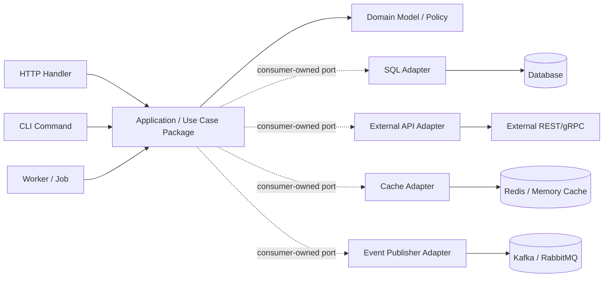
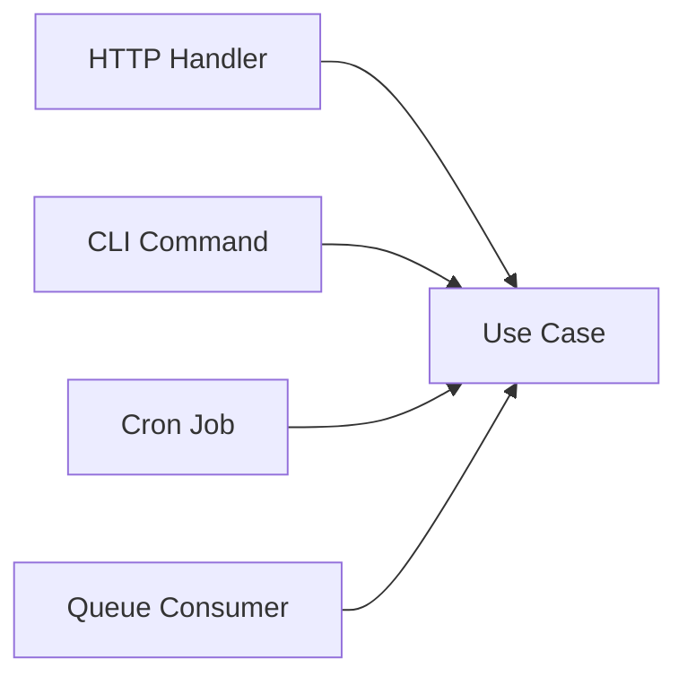
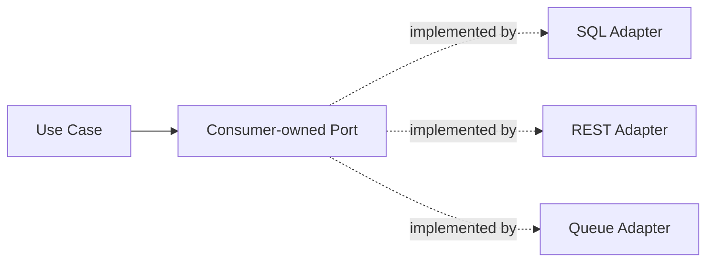
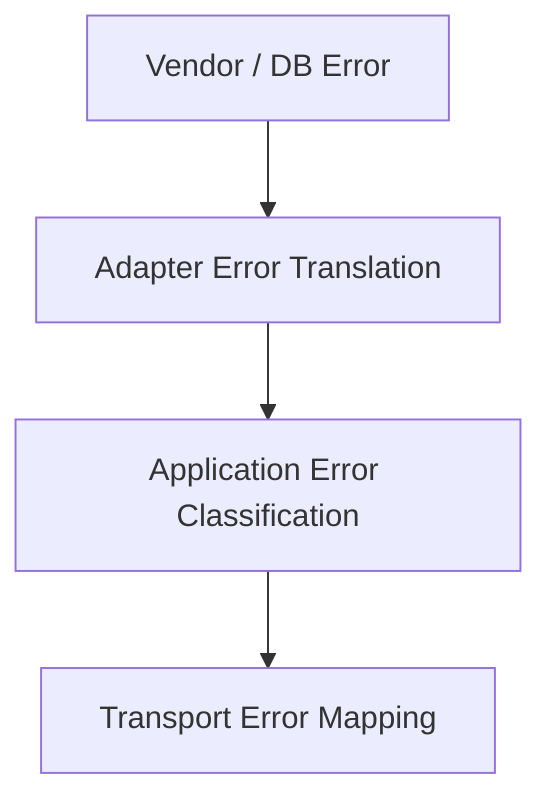
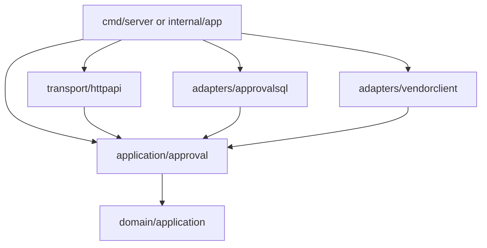
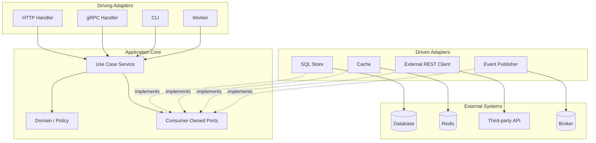

# learn-go-design-patterns-common-patterns-anti-patterns-part-010.md

# Part 010 — Adapter and Port Pattern in Go

> Seri: **Go Design Patterns, Common Patterns, and Anti-Patterns**  
> Fokus: **menerjemahkan ports-and-adapters / hexagonal architecture ke Go secara idiomatis, ringan, eksplisit, dan production-grade**  
> Target pembaca: **Java software engineer yang ingin mendesain service Go besar tanpa membawa ceremony Java berlebihan**  
> Baseline: **Go 1.26.x**

---

## 0. Posisi Part Ini Dalam Seri

Di part sebelumnya kita sudah membangun fondasi:

- Part 000: peta seri dan taxonomy pattern
- Part 001: reframing Java-to-Go
- Part 002: idiomatic simplicity
- Part 003: package-oriented design
- Part 004: API surface pattern
- Part 005: interface placement pattern
- Part 006: constructor dan initialization
- Part 007: functional options
- Part 008: configuration pattern
- Part 009: dependency wiring tanpa DI container

Part ini masuk ke desain boundary yang lebih besar: **Adapter and Port Pattern in Go**.

Dalam dunia Java enterprise, kamu mungkin mengenal istilah:

- hexagonal architecture
- ports and adapters
- clean architecture
- onion architecture
- anti-corruption layer
- gateway
- repository
- client adapter
- driver/driven adapter
- primary/secondary adapter

Di Go, pola ini tetap berguna, tetapi bentuknya harus disesuaikan. Kesalahan umum adalah membawa bentuk Java secara literal:

```text
UserController -> UserService -> UserUseCase -> UserPort -> UserAdapter -> UserRepository -> UserEntity
```

Lalu semua dependency dibuat interface, semua layer pass-through, semua package punya suffix teknis, dan codebase menjadi lebih sulit dipahami daripada problem domain-nya.

Tujuan part ini adalah membangun pemahaman yang lebih presisi:

> Adapter/port pattern di Go bukan tentang memperbanyak layer. Pattern ini tentang **mengendalikan arah dependency, menjaga domain/application boundary tetap bersih, dan membuat interaksi eksternal bisa diganti, dites, diamati, serta gagal secara terkontrol**.

---

## 1. Core Problem: External Systems Shape Your Code Unless You Resist

Sebuah production service jarang berdiri sendiri. Biasanya ia berinteraksi dengan:

- database
- cache
- queue
- object storage
- payment provider
- identity provider
- email/SMS gateway
- third-party REST API
- gRPC service
- Kafka/RabbitMQ
- filesystem
- feature flag service
- secrets manager
- metrics/tracing/logging backend

Tanpa boundary yang jelas, detail eksternal akan bocor ke core logic:

```go
func ApproveApplication(ctx context.Context, db *sql.DB, httpClient *http.Client, req ApproveRequest) error {
    // business validation
    // SQL transaction
    // external API call
    // HTTP status mapping
    // retry rule
    // audit row insert
    // JSON vendor DTO
    // all mixed here
}
```

Masalahnya bukan hanya “code jelek”. Masalah production-nya lebih dalam:

1. **Domain logic sulit dites tanpa database/API asli.**
2. **Vendor DTO menyebar ke seluruh codebase.**
3. **Retry/timeout/error mapping tidak konsisten.**
4. **Perubahan external API memaksa refactor domain.**
5. **Transaction boundary bercampur dengan network call.**
6. **Observability tidak punya boundary event yang jelas.**
7. **Security dan PII sanitization tersebar.**
8. **Import graph menjadi tidak stabil.**
9. **Code review sulit karena tidak jelas: ini logic domain atau transport/infrastructure?**

Adapter/port pattern menyelesaikan masalah ini dengan memisahkan:

- apa yang application core butuhkan
- bagaimana kebutuhan itu dipenuhi oleh dunia luar

---

## 2. Mental Model: Core Does Not Know the Outside World

Mental model paling penting:

```text
Application core declares what it needs.
Adapters implement it using external technology.
```

Bukan:

```text
Infrastructure exposes generic interface.
Core adapts itself to infrastructure abstraction.
```

Dalam Go, interface biasanya lebih baik berada di sisi package yang **menggunakan** dependency, bukan di sisi package yang **mengimplementasikan** dependency. Ini sejalan dengan idiom Go: consumer mendefinisikan capability minimal yang ia butuhkan.

### 2.1 Diagram Boundary



Panah penting:

- transport handler memanggil application use case
- application menggunakan domain
- application mendefinisikan port kecil yang ia butuhkan
- adapter konkret mengimplementasikan port
- adapter tahu tentang external technology
- domain tidak tahu database, HTTP, Kafka, Redis, framework, atau vendor DTO

---

## 3. Java Mindset vs Go Mindset

### 3.1 Java Mindset yang Sering Terbawa

Di Java/Spring, ports-adapters sering dibentuk seperti ini:

```java
public interface UserRepository { ... }
@Repository
public class JpaUserRepository implements UserRepository { ... }
@Service
public class UserService { ... }
@RestController
public class UserController { ... }
```

Lalu framework melakukan wiring via annotation.

Ketika dibawa mentah-mentah ke Go, hasilnya sering seperti:

```text
/internal/user/controller
/internal/user/service
/internal/user/usecase
/internal/user/repository
/internal/user/port
/internal/user/adapter
/internal/user/model
/internal/user/dto
```

Untuk domain kecil, ini menjadi ceremony.

### 3.2 Go Mindset

Go lebih suka:

- package kecil tapi tidak terlalu fragmented
- interface kecil di sisi consumer
- concrete implementation di adapter package
- explicit constructor wiring
- dependency terlihat dari field struct dan constructor
- boundary dipaksa oleh import graph, bukan annotation
- behavior dilihat dari function/method, bukan hierarchy

Go version dari pola ini biasanya lebih sederhana:

```text
/internal/application/approval
/internal/domain/application
/internal/adapters/sqlstore
/internal/adapters/onemap
/internal/adapters/eventpub
/internal/transport/httpapi
```

Atau vertical slice:

```text
/internal/approval
    service.go        // use case + consumer-owned ports
    model.go          // command/result/domain-ish types if local
    sqlstore.go       // optional if small
    http.go           // optional if small
```

Atau hybrid:

```text
/internal/approval        // application use cases
/internal/approval/sql    // approval-specific SQL adapter
/internal/approval/http   // approval-specific transport adapter
```

Tidak ada satu layout universal. Yang penting adalah **arah dependency dan ownership boundary**.

---

## 4. Vocabulary: Port, Adapter, Core, Boundary

### 4.1 Port

Port adalah contract kecil yang menyatakan kebutuhan application core.

Contoh:

```go
type ApplicationStore interface {
    FindForApproval(ctx context.Context, id ApplicationID) (Application, error)
    SaveApproval(ctx context.Context, approval ApprovalDecision) error
}
```

Port bukan “interface untuk repository secara umum”. Port adalah capability yang use case tertentu butuhkan.

Port yang baik:

- kecil
- behavior-oriented
- consumer-owned
- memakai domain/application type, bukan vendor DTO
- tidak terlalu generic
- punya error semantics yang jelas
- tidak menyembunyikan transaction ownership secara ambigu

### 4.2 Adapter

Adapter adalah concrete implementation yang menghubungkan port ke external system.

Contoh:

```go
type SQLApplicationStore struct {
    db *sql.DB
}

func (s *SQLApplicationStore) FindForApproval(ctx context.Context, id approval.ApplicationID) (approval.Application, error) {
    // SQL, row scanning, sql.ErrNoRows mapping, domain mapping
}
```

Adapter yang baik:

- tahu teknologi eksternal
- tahu DTO eksternal
- menerjemahkan error eksternal ke error boundary
- mengontrol timeout/retry bila ia owner-nya
- tidak menyebarkan vendor detail ke core
- mudah dites dengan integration/contract test

### 4.3 Core

Core adalah bagian yang mengandung policy dan use case.

Core bukan selalu “pure domain model” ala DDD berat. Dalam Go, core bisa berupa package application yang cukup pragmatis:

```go
type ApprovalService struct {
    store     ApplicationStore
    notifier ApprovalNotifier
    clock     Clock
}
```

Core sebaiknya tidak import:

- `database/sql`
- vendor SDK
- HTTP client library eksternal
- Kafka client
- Redis client
- framework router
- generated transport DTO jika tidak perlu

### 4.4 Boundary

Boundary adalah tempat translate:

- transport DTO → command
- command → domain operation
- domain result → response DTO
- SQL row → domain/application object
- vendor response → internal result
- infrastructure error → application/domain error

Boundary adalah tempat paling penting dalam pattern ini.

---

## 5. Why This Pattern Matters in Production

Adapter/port pattern bukan hanya untuk “clean code”. Ini punya dampak production langsung.

### 5.1 Change Containment

Jika vendor API berubah, hanya adapter yang berubah.

Tanpa adapter:

```text
vendor DTO -> handler -> service -> domain -> repository -> tests
```

Dengan adapter:

```text
vendor DTO -> adapter -> internal result -> application core
```

### 5.2 Testability

Application use case dapat dites dengan fake port:

```go
type fakeStore struct {
    app approval.Application
    err error
}

func (f *fakeStore) FindForApproval(ctx context.Context, id approval.ApplicationID) (approval.Application, error) {
    return f.app, f.err
}
```

Tidak perlu mocking framework untuk mayoritas kasus.

### 5.3 Operational Consistency

Adapter menjadi tempat konsisten untuk:

- timeout
- retry
- auth token
- error mapping
- redaction
- metrics
- circuit breaker
- schema versioning
- idempotency

### 5.4 Security Boundary

Adapter dapat mencegah leak:

- raw credential
- vendor token
- PII
- sensitive audit payload
- internal DB key

### 5.5 Regulatory Defensibility

Untuk sistem enforcement/case management/regulatory, boundary ini sangat penting karena kamu perlu menjawab:

- dari mana data masuk?
- bagaimana data divalidasi?
- keputusan apa yang dibuat?
- external system mana yang dipanggil?
- error mana yang retryable?
- audit record dibuat sebelum/sesudah apa?
- apakah side effect idempotent?

Adapter/port pattern membuat jawaban itu bisa ditelusuri dari struktur kode.

---

## 6. Basic Shape in Go

Kita pakai contoh use case: **approve application**.

### 6.1 Application Package Owns Ports

```go
package approval

import "context"

type ApplicationID string

type Application struct {
    ID     ApplicationID
    Status Status
    Owner  PartyID
}

type Status string

const (
    StatusPending  Status = "PENDING"
    StatusApproved Status = "APPROVED"
    StatusRejected Status = "REJECTED"
)

type PartyID string

type Decision struct {
    ApplicationID ApplicationID
    OfficerID     string
    Approved      bool
    Reason        string
}

type Store interface {
    FindForDecision(ctx context.Context, id ApplicationID) (Application, error)
    SaveDecision(ctx context.Context, decision Decision) error
}

type Notifier interface {
    NotifyDecision(ctx context.Context, decision Decision) error
}

type Service struct {
    store    Store
    notifier Notifier
}

func NewService(store Store, notifier Notifier) (*Service, error) {
    if store == nil {
        return nil, ErrNilStore
    }
    if notifier == nil {
        return nil, ErrNilNotifier
    }
    return &Service{store: store, notifier: notifier}, nil
}
```

Notice:

- `approval` defines what it needs.
- It does not define `SQLStore`.
- It does not expose `Repository` unless that name matches domain language.
- It does not import `database/sql`.
- It does not know HTTP.

### 6.2 Use Case Logic

```go
func (s *Service) Decide(ctx context.Context, cmd DecideCommand) (DecisionResult, error) {
    if err := cmd.Validate(); err != nil {
        return DecisionResult{}, err
    }

    app, err := s.store.FindForDecision(ctx, cmd.ApplicationID)
    if err != nil {
        return DecisionResult{}, err
    }

    if app.Status != StatusPending {
        return DecisionResult{}, ErrInvalidState
    }

    decision := Decision{
        ApplicationID: cmd.ApplicationID,
        OfficerID:     cmd.OfficerID,
        Approved:      cmd.Approved,
        Reason:        cmd.Reason,
    }

    if err := s.store.SaveDecision(ctx, decision); err != nil {
        return DecisionResult{}, err
    }

    if err := s.notifier.NotifyDecision(ctx, decision); err != nil {
        return DecisionResult{}, err
    }

    return DecisionResult{Decision: decision}, nil
}
```

This is intentionally not perfect. Later parts will improve transaction/outbox/idempotency. For adapter/port discussion, the shape is enough.

### 6.3 SQL Adapter Implements Store

```go
package approvalsql

import (
    "context"
    "database/sql"
    "errors"

    "example.com/app/internal/approval"
)

type Store struct {
    db *sql.DB
}

func NewStore(db *sql.DB) (*Store, error) {
    if db == nil {
        return nil, errors.New("approvalsql: nil db")
    }
    return &Store{db: db}, nil
}

func (s *Store) FindForDecision(ctx context.Context, id approval.ApplicationID) (approval.Application, error) {
    const query = `
        SELECT id, status, owner_id
        FROM applications
        WHERE id = :1
    `

    var app approval.Application
    var status string
    var owner string

    err := s.db.QueryRowContext(ctx, query, string(id)).Scan(
        &app.ID,
        &status,
        &owner,
    )
    if err != nil {
        if errors.Is(err, sql.ErrNoRows) {
            return approval.Application{}, approval.ErrApplicationNotFound
        }
        return approval.Application{}, err
    }

    app.Status = approval.Status(status)
    app.Owner = approval.PartyID(owner)
    return app, nil
}

func (s *Store) SaveDecision(ctx context.Context, decision approval.Decision) error {
    // SQL update/insert with clear transaction ownership.
    return nil
}
```

Important:

- adapter imports core package
- core does not import adapter
- SQL errors are translated
- DB schema does not leak to application service

### 6.4 HTTP Adapter Calls Service

```go
package approvalhttp

import (
    "encoding/json"
    "net/http"

    "example.com/app/internal/approval"
)

type Handler struct {
    service *approval.Service
}

func NewHandler(service *approval.Service) *Handler {
    return &Handler{service: service}
}

func (h *Handler) Decide(w http.ResponseWriter, r *http.Request) {
    var req decideRequest
    if err := json.NewDecoder(r.Body).Decode(&req); err != nil {
        http.Error(w, "invalid request", http.StatusBadRequest)
        return
    }

    cmd := approval.DecideCommand{
        ApplicationID: approval.ApplicationID(req.ApplicationID),
        OfficerID:     req.OfficerID,
        Approved:      req.Approved,
        Reason:        req.Reason,
    }

    result, err := h.service.Decide(r.Context(), cmd)
    if err != nil {
        writeApprovalError(w, err)
        return
    }

    _ = json.NewEncoder(w).Encode(decideResponse{
        ApplicationID: string(result.Decision.ApplicationID),
        Status:        "accepted",
    })
}
```

Transport adapter translates:

```text
HTTP JSON -> command -> service -> result -> HTTP JSON
```

It does not contain domain decision logic.

---

## 7. Port Granularity: The Hardest Design Choice

The biggest mistake is making ports too broad.

Bad:

```go
type ApplicationRepository interface {
    Create(ctx context.Context, app Application) error
    Get(ctx context.Context, id ApplicationID) (Application, error)
    Update(ctx context.Context, app Application) error
    Delete(ctx context.Context, id ApplicationID) error
    List(ctx context.Context, filter Filter) ([]Application, error)
    Count(ctx context.Context, filter Filter) (int, error)
    FindByOwner(ctx context.Context, owner PartyID) ([]Application, error)
    FindPending(ctx context.Context) ([]Application, error)
    SaveDecision(ctx context.Context, decision Decision) error
    SaveAppeal(ctx context.Context, appeal Appeal) error
    SaveAudit(ctx context.Context, audit Audit) error
}
```

This interface is not a port; it is a database-shaped service catalog.

Better:

```go
type DecisionStore interface {
    FindForDecision(ctx context.Context, id ApplicationID) (Application, error)
    SaveDecision(ctx context.Context, decision Decision) error
}
```

Another use case can own another port:

```go
type RenewalStore interface {
    FindForRenewal(ctx context.Context, id ApplicationID) (RenewalApplication, error)
    SaveRenewal(ctx context.Context, renewal RenewalDecision) error
}
```

This may duplicate some methods. That is fine if semantics differ.

### 7.1 Granularity Rule

A good port usually answers:

> What capability does this use case need from outside its boundary?

Not:

> What methods does this infrastructure component support?

### 7.2 Port Granularity Matrix

| Port Shape | Usually Good? | Why |
|---|---:|---|
| `io.Reader` style single capability | Yes | Very composable |
| Use-case-specific 2–5 methods | Yes | Clear semantic boundary |
| Aggregate-specific repository | Sometimes | Good if aggregate semantics are stable |
| Generic CRUD interface | Usually no | Hides important domain/query semantics |
| Mega service interface | No | Couples unrelated use cases |
| Provider-defined interface for mocking | Usually no | Interface should follow consumer need |

---

## 8. Adapter Types

### 8.1 Driving Adapter / Primary Adapter

A driving adapter initiates calls into your application.

Examples:

- HTTP handler
- gRPC handler
- CLI command
- cron job
- queue consumer
- test harness



Driving adapters translate incoming protocol into application command.

### 8.2 Driven Adapter / Secondary Adapter

A driven adapter is called by your application to reach external systems.

Examples:

- SQL store
- Redis cache
- Kafka publisher
- S3 client
- third-party REST API client
- SMTP sender
- identity provider client



### 8.3 Bidirectional Boundary

Some systems are both:

- a queue consumer is a driving adapter
- a queue publisher is a driven adapter

Do not put both into one giant “messaging” abstraction unless they share real ownership.

---

## 9. Anti-Corruption Layer

Adapter/port pattern is often used as an **anti-corruption layer**.

Problem:

External system has concepts that do not match yours.

Example external address API:

```json
{
  "POSTAL": "123456",
  "BLK_NO": "10",
  "ROAD_NAME": "NORTH BRIDGE ROAD",
  "BUILDING": "",
  "LATITUDE": "1.2868",
  "LONGITUDE": "103.8545"
}
```

Internal model:

```go
type Address struct {
    PostalCode string
    Block      string
    Street     string
    Building   string
    Coordinate Coordinate
}

type Coordinate struct {
    Latitude  float64
    Longitude float64
}
```

The adapter owns translation:

```go
func mapAddressResponse(resp externalAddressResponse) (address.Address, error) {
    lat, err := strconv.ParseFloat(resp.Latitude, 64)
    if err != nil {
        return address.Address{}, fmt.Errorf("parse latitude: %w", err)
    }

    lng, err := strconv.ParseFloat(resp.Longitude, 64)
    if err != nil {
        return address.Address{}, fmt.Errorf("parse longitude: %w", err)
    }

    return address.Address{
        PostalCode: resp.Postal,
        Block:      resp.BlockNo,
        Street:     resp.RoadName,
        Building:   resp.Building,
        Coordinate: address.Coordinate{Latitude: lat, Longitude: lng},
    }, nil
}
```

Internal packages should not depend on `externalAddressResponse`.

### 9.1 Anti-Corruption Rule

If an external field name, status code, enum, or DTO appears deep inside your domain/application logic, the adapter boundary has failed.

---

## 10. Error Translation Pattern in Adapters

Adapters should translate infrastructure/vendor errors into meaningful internal errors.

Bad:

```go
if resp.StatusCode == http.StatusNotFound {
    return Address{}, fmt.Errorf("vendor returned 404")
}
```

Then application code does string matching.

Better:

```go
var ErrAddressNotFound = errors.New("address not found")
var ErrAddressProviderUnavailable = errors.New("address provider unavailable")
```

Adapter:

```go
switch resp.StatusCode {
case http.StatusOK:
    // decode
case http.StatusNotFound:
    return Address{}, ErrAddressNotFound
case http.StatusTooManyRequests:
    return Address{}, ErrAddressProviderUnavailable
case http.StatusInternalServerError, http.StatusBadGateway, http.StatusServiceUnavailable:
    return Address{}, ErrAddressProviderUnavailable
default:
    return Address{}, fmt.Errorf("address provider unexpected status: %d", resp.StatusCode)
}
```

Application:

```go
addr, err := s.addresses.Lookup(ctx, postalCode)
if err != nil {
    if errors.Is(err, address.ErrAddressNotFound) {
        return Decision{}, ErrInvalidPostalCode
    }
    return Decision{}, err
}
```

### 10.1 Error Translation Layers



Examples:

| Source Error | Adapter Translation | Application Meaning | HTTP Mapping |
|---|---|---|---|
| `sql.ErrNoRows` | `ErrApplicationNotFound` | requested entity absent | 404 |
| HTTP 429 | `ErrProviderRateLimited` | retryable external dependency | 503/429 |
| timeout | `ErrProviderUnavailable` | dependency unavailable | 503 |
| duplicate key | `ErrDuplicateSubmission` | idempotency/constraint conflict | 409 |
| invalid vendor payload | `ErrProviderContractViolation` | dependency contract broken | 502 |

Do not let every layer invent its own error vocabulary.

---

## 11. Context in Ports and Adapters

Most ports that perform I/O should accept `context.Context` as first parameter:

```go
type AddressLookup interface {
    Lookup(ctx context.Context, postalCode string) (Address, error)
}
```

Context carries:

- cancellation
- deadline
- request-scoped values such as trace/correlation ID

But context should not be used as dependency bag:

Bad:

```go
func Lookup(ctx context.Context, postalCode string) (Address, error) {
    db := ctx.Value(dbKey{}).(*sql.DB)
    logger := ctx.Value(loggerKey{}).(*slog.Logger)
    // hidden dependencies
}
```

Better:

```go
type Client struct {
    httpClient *http.Client
    baseURL    string
    logger     *slog.Logger
}

func (c *Client) Lookup(ctx context.Context, postalCode string) (Address, error) {
    // explicit dependencies on struct
}
```

### 11.1 Deadline Ownership

There are two common options:

1. caller owns deadline
2. adapter applies default per-call timeout if caller has none

Be explicit.

Example:

```go
func (c *Client) Lookup(ctx context.Context, postalCode string) (Address, error) {
    if _, ok := ctx.Deadline(); !ok && c.defaultTimeout > 0 {
        var cancel context.CancelFunc
        ctx, cancel = context.WithTimeout(ctx, c.defaultTimeout)
        defer cancel()
    }

    // perform request
}
```

But be careful: default timeout inside adapter can be useful, yet it should not silently override an upstream deadline.

---

## 12. Transaction Boundary and Ports

Ports that involve persistence must be clear about transaction ownership.

### 12.1 Bad: Transaction Hidden Inside Every Method

```go
type Store interface {
    SaveDecision(ctx context.Context, decision Decision) error
    SaveAudit(ctx context.Context, audit Audit) error
}
```

If each method opens its own transaction, a use case requiring atomicity is broken.

### 12.2 Better: Transaction Closure

```go
type Transactor interface {
    WithinTx(ctx context.Context, fn func(ctx context.Context, tx Store) error) error
}

type Store interface {
    FindForDecision(ctx context.Context, id ApplicationID) (Application, error)
    SaveDecision(ctx context.Context, decision Decision) error
    SaveAudit(ctx context.Context, audit Audit) error
}
```

Use case:

```go
func (s *Service) Decide(ctx context.Context, cmd DecideCommand) error {
    return s.tx.WithinTx(ctx, func(ctx context.Context, store Store) error {
        app, err := store.FindForDecision(ctx, cmd.ApplicationID)
        if err != nil {
            return err
        }

        decision, err := app.Decide(cmd)
        if err != nil {
            return err
        }

        if err := store.SaveDecision(ctx, decision); err != nil {
            return err
        }

        return store.SaveAudit(ctx, decision.AuditRecord())
    })
}
```

SQL adapter can implement this using `*sql.Tx`.

### 12.3 Avoid Network Calls Inside DB Transaction

Bad:

```go
return tx.WithinTx(ctx, func(ctx context.Context, store Store) error {
    if err := store.SaveDecision(ctx, decision); err != nil {
        return err
    }
    return notifier.NotifyDecision(ctx, decision) // network call inside transaction
})
```

Better:

- write decision
- write outbox event in same transaction
- commit
- worker publishes event

Outbox pattern is covered in Part 022.

---

## 13. DTO Translation Boundary

A common anti-pattern is leaking DTOs across layers.

Bad:

```go
func (s *Service) Decide(ctx context.Context, req DecideHTTPRequest) (DecideHTTPResponse, error) {
    // application depends on HTTP DTO
}
```

Better:

```go
func (s *Service) Decide(ctx context.Context, cmd DecideCommand) (DecisionResult, error) {
    // application owns command/result
}
```

HTTP adapter maps:

```go
func toCommand(req decideRequest) approval.DecideCommand {
    return approval.DecideCommand{
        ApplicationID: approval.ApplicationID(req.ApplicationID),
        OfficerID:     req.OfficerID,
        Approved:      req.Approved,
        Reason:        req.Reason,
    }
}
```

Response mapping:

```go
func toResponse(result approval.DecisionResult) decideResponse {
    return decideResponse{
        ApplicationID: string(result.Decision.ApplicationID),
        Status:        string(result.NewStatus),
    }
}
```

DTO mapping is not boring ceremony when it protects your core from unstable external contracts.

---

## 14. External Client Adapter Pattern

Example: an external risk scoring service.

### 14.1 Consumer-Owned Port

```go
package screening

import "context"

type RiskScorer interface {
    Score(ctx context.Context, subject Subject) (RiskScore, error)
}

type Subject struct {
    ID      string
    Name    string
    Country string
}

type RiskScore struct {
    Level   RiskLevel
    Reasons []string
}

type RiskLevel string

const (
    RiskLow    RiskLevel = "LOW"
    RiskMedium RiskLevel = "MEDIUM"
    RiskHigh   RiskLevel = "HIGH"
)
```

### 14.2 REST Adapter

```go
package riskscoreclient

import (
    "bytes"
    "context"
    "encoding/json"
    "fmt"
    "net/http"

    "example.com/app/internal/screening"
)

type Client struct {
    httpClient *http.Client
    baseURL    string
    apiKey     string
}

func New(httpClient *http.Client, baseURL string, apiKey string) (*Client, error) {
    if httpClient == nil {
        return nil, fmt.Errorf("riskscoreclient: nil http client")
    }
    if baseURL == "" {
        return nil, fmt.Errorf("riskscoreclient: empty base url")
    }
    if apiKey == "" {
        return nil, fmt.Errorf("riskscoreclient: empty api key")
    }
    return &Client{httpClient: httpClient, baseURL: baseURL, apiKey: apiKey}, nil
}

func (c *Client) Score(ctx context.Context, subject screening.Subject) (screening.RiskScore, error) {
    body, err := json.Marshal(scoreRequest{
        SubjectID: subject.ID,
        Name:      subject.Name,
        Country:   subject.Country,
    })
    if err != nil {
        return screening.RiskScore{}, fmt.Errorf("encode score request: %w", err)
    }

    req, err := http.NewRequestWithContext(ctx, http.MethodPost, c.baseURL+"/score", bytes.NewReader(body))
    if err != nil {
        return screening.RiskScore{}, fmt.Errorf("build score request: %w", err)
    }
    req.Header.Set("Content-Type", "application/json")
    req.Header.Set("Authorization", "Bearer "+c.apiKey)

    resp, err := c.httpClient.Do(req)
    if err != nil {
        return screening.RiskScore{}, fmt.Errorf("call risk scorer: %w", err)
    }
    defer resp.Body.Close()

    if resp.StatusCode != http.StatusOK {
        return screening.RiskScore{}, mapStatus(resp.StatusCode)
    }

    var decoded scoreResponse
    if err := json.NewDecoder(resp.Body).Decode(&decoded); err != nil {
        return screening.RiskScore{}, fmt.Errorf("decode score response: %w", err)
    }

    return toRiskScore(decoded)
}
```

### 14.3 DTOs Stay Private

```go
type scoreRequest struct {
    SubjectID string `json:"subject_id"`
    Name      string `json:"name"`
    Country   string `json:"country"`
}

type scoreResponse struct {
    Level   string   `json:"level"`
    Reasons []string `json:"reasons"`
}
```

The external API shape does not leak out of the adapter package.

---

## 15. Adapter Observability Pattern

Adapters are natural observability boundaries.

For external API adapter, record:

- dependency name
- operation
- duration
- status class
- retry count
- error class
- timeout/cancellation
- rate limit response
- payload size, if safe

Avoid high cardinality labels:

Bad metric labels:

```text
user_id
application_id
full_url_with_query
raw_error_message
```

Better:

```text
dependency="risk-score"
operation="score"
status_class="5xx"
error_class="provider_unavailable"
```

### 15.1 Adapter Logging

Adapter should log carefully.

Bad:

```go
logger.Info("risk request", "body", string(body), "apiKey", c.apiKey)
```

Better:

```go
logger.InfoContext(ctx, "risk scorer request failed",
    "dependency", "risk-score",
    "operation", "score",
    "status", resp.StatusCode,
)
```

Never log secrets or sensitive payload unless explicitly sanitized and required.

---

## 16. Adapter Security Pattern

Adapters often handle sensitive material:

- API key
- OAuth token
- mTLS certificate
- request signature
- encrypted payload
- PII
- audit-sensitive evidence

Security practices:

1. Keep credentials in adapter config, not context.
2. Do not expose token in returned error.
3. Redact logs.
4. Avoid dumping raw request/response body.
5. Validate external response before mapping.
6. Use strict timeouts.
7. Separate internal model from vendor payload.
8. Treat vendor data as untrusted input.
9. Preserve audit trace without leaking secrets.

Example error problem:

```go
return fmt.Errorf("call failed using token %s: %w", token, err)
```

Never do this.

---

## 17. Adapter Retry Pattern

Retry belongs either:

- in adapter, if retry is dependency-specific and transparent
- in application service, if retry changes business semantics
- in a decorator, if shared across clients

### 17.1 Adapter-Level Retry

Suitable for:

- transient network error
- HTTP 502/503/504
- provider-specific throttling with backoff
- idempotent read operation

Dangerous for:

- non-idempotent write
- command submission
- payment
- notification without idempotency key
- approval transition

Example rule:

```go
func retryable(status int) bool {
    switch status {
    case http.StatusTooManyRequests,
        http.StatusBadGateway,
        http.StatusServiceUnavailable,
        http.StatusGatewayTimeout:
        return true
    default:
        return false
    }
}
```

But retries must respect context deadline.

```go
select {
case <-time.After(backoff):
case <-ctx.Done():
    return Result{}, ctx.Err()
}
```

Resilience patterns are covered deeper in Part 025.

---

## 18. Adapter Caching Pattern

Cache can be an adapter or decorator.

### 18.1 Cache as Adapter

If the port is “lookup address”, cache adapter can implement it directly:

```go
type CachedAddressLookup struct {
    cache  Cache
    source AddressLookup
}
```

### 18.2 Cache as Decorator

```go
func (c *CachedAddressLookup) Lookup(ctx context.Context, postal string) (Address, error) {
    if addr, ok := c.cache.Get(postal); ok {
        return addr, nil
    }

    addr, err := c.source.Lookup(ctx, postal)
    if err != nil {
        return Address{}, err
    }

    c.cache.Set(postal, addr, c.ttl)
    return addr, nil
}
```

But define ownership:

- who decides TTL?
- is negative caching allowed?
- is stale data acceptable?
- does cache key include tenant/locale/version?
- how is cache invalidated?

Cache pattern gets full treatment in Part 026.

---

## 19. Testing Strategy

Adapter/port pattern enables multiple levels of tests.

### 19.1 Application Test with Fake Port

```go
type fakeDecisionStore struct {
    app           approval.Application
    savedDecision approval.Decision
}

func (f *fakeDecisionStore) FindForDecision(ctx context.Context, id approval.ApplicationID) (approval.Application, error) {
    return f.app, nil
}

func (f *fakeDecisionStore) SaveDecision(ctx context.Context, d approval.Decision) error {
    f.savedDecision = d
    return nil
}
```

Test:

```go
func TestService_Decide_ApprovesPendingApplication(t *testing.T) {
    store := &fakeDecisionStore{
        app: approval.Application{
            ID:     "A-001",
            Status: approval.StatusPending,
        },
    }
    notifier := &fakeNotifier{}

    svc, err := approval.NewService(store, notifier)
    if err != nil {
        t.Fatal(err)
    }

    result, err := svc.Decide(context.Background(), approval.DecideCommand{
        ApplicationID: "A-001",
        OfficerID:     "O-001",
        Approved:      true,
        Reason:        "eligible",
    })
    if err != nil {
        t.Fatal(err)
    }

    if !result.Decision.Approved {
        t.Fatal("expected approval")
    }
}
```

### 19.2 Adapter Unit Test with Fake Server

For HTTP adapter:

```go
server := httptest.NewServer(http.HandlerFunc(func(w http.ResponseWriter, r *http.Request) {
    // assert method/path/header
    // respond with vendor-shaped JSON
}))
defer server.Close()
```

This tests adapter translation without real vendor.

### 19.3 Adapter Integration Test

For SQL adapter:

- run real database container if possible
- apply schema migration
- insert fixture
- call adapter
- assert mapping and transaction behavior

### 19.4 Contract Test

For vendor/external services:

- verify expected request
- verify response shape
- verify status/error mapping
- verify versioned schema
- verify backward compatibility

Do not rely only on mocks for adapters. Mocks often test your assumption, not the real external contract.

---

## 20. Package Layout Options

### 20.1 Option A: Layered-ish but Go-Friendly

```text
internal/
  approval/
    service.go       // use case, ports, commands, results
    errors.go
    model.go
  adapters/
    approvalsql/
      store.go
    riskclient/
      client.go
    eventpub/
      publisher.go
  transport/
    httpapi/
      approval_handler.go
  app/
    wiring.go
```

Good when adapters are shared or infrastructure-heavy.

### 20.2 Option B: Feature-Local Adapters

```text
internal/
  approval/
    service.go
    model.go
    errors.go
    sqlstore/
      store.go
    httpapi/
      handler.go
```

Good when feature is cohesive and adapters are not shared.

### 20.3 Option C: Domain/Application Split

```text
internal/
  domain/
    application/
      model.go
      transition.go
  application/
    approval/
      service.go
      ports.go
      command.go
  adapters/
    sqlstore/
    notification/
  transport/
    httpapi/
```

Good when domain is rich, reused by many use cases, and lifecycle is complex.

### 20.4 Avoid Premature Layout Religion

Bad question:

> What folder layout is hexagonal architecture in Go?

Better question:

> Which package owns which decision, and does the import graph enforce that ownership?

---

## 21. Import Graph as Architecture Test

You can reason about architecture by import direction.

Good:

```text
transport/httpapi -> approval
adapters/approvalsql -> approval
app/wiring -> transport/httpapi + adapters/approvalsql + approval
approval -> domain/application
```

Bad:

```text
approval -> adapters/approvalsql
approval -> transport/httpapi
approval -> vendorclient
approval -> database/sql
```

### 21.1 Architecture Diagram



Wiring package may import everyone because it composes the graph.

Core packages should not import adapters.

---

## 22. Common Anti-Patterns

### 22.1 Java Clean Architecture Ceremony

Symptom:

```text
controller -> input port -> usecase interactor -> output port -> presenter -> response model
```

For every small endpoint.

Problem:

- too many files
- too many pass-through methods
- hard to trace logic
- code review becomes archaeology

Fix:

- collapse layers that have no independent decision
- keep command/result structs
- keep boundary mapping where valuable
- use package boundary, not ceremonial class boundary

### 22.2 Interface for Every Adapter

Bad:

```go
type SQLStoreInterface interface { ... }
type RedisCacheInterface interface { ... }
type EmailSenderInterface interface { ... }
```

Problem:

- provider-owned interface
- mocking-driven design
- large unstable contracts

Fix:

- define small interface where used
- return concrete adapter from constructor

### 22.3 External DTO Leak

Bad:

```go
func (s *Service) Evaluate(resp VendorRiskResponse) error
```

Fix:

```go
func (s *Service) Evaluate(score RiskScore) error
```

### 22.4 Generic Repository Port

Bad:

```go
type Repository[T any, ID comparable] interface {
    Save(ctx context.Context, entity T) error
    Find(ctx context.Context, id ID) (T, error)
    Delete(ctx context.Context, id ID) error
}
```

Problem:

- hides query semantics
- hides transaction behavior
- hides domain-specific constraints
- often becomes ORM nostalgia

Fix:

- use-case-specific store
- aggregate-specific repository only when aggregate semantics are clear

### 22.5 Adapter with Business Logic

Bad:

```go
func (s *SQLStore) SaveDecision(ctx context.Context, decision Decision) error {
    if decision.Approved && decision.Reason == "" {
        return ErrReasonRequired
    }
    // SQL
}
```

If that is domain/application invariant, put it in core.

Adapter can validate infrastructure concerns:

- required DB column mapping
- invalid vendor payload
- unsupported external enum

### 22.6 Core Imports Infrastructure

Bad:

```go
package approval

import "database/sql"

type Service struct {
    db *sql.DB
}
```

This may be acceptable for tiny scripts/tools, but for larger service it collapses boundary.

### 22.7 Context as Adapter Registry

Bad:

```go
client := ctx.Value(riskClientKey{}).(RiskClient)
```

Fix:

```go
type Service struct {
    risk RiskScorer
}
```

### 22.8 Adapter Starts Background Goroutine Silently

Bad:

```go
func NewClient(...) *Client {
    c := &Client{}
    go c.refreshTokenLoop()
    return c
}
```

Fix:

- explicit `Start(ctx)` if lifecycle is required
- or token refresh on demand
- or background worker owned by app lifecycle

### 22.9 Ambiguous Side Effects

Bad:

```go
type Store interface {
    Save(ctx context.Context, app Application) error
}
```

Does it:

- insert?
- update?
- upsert?
- publish event?
- write audit?
- mutate version?
- enforce optimistic lock?

Better:

```go
type DecisionStore interface {
    InsertDecision(ctx context.Context, decision Decision) error
    MarkApplicationApproved(ctx context.Context, id ApplicationID, version Version) error
}
```

Or one semantic method:

```go
SaveApprovalDecision(ctx context.Context, decision ApprovalDecision) error
```

With documented behavior.

---

## 23. Production-Grade Example: Address Lookup Port with Cache and External Adapter

### 23.1 Application Port

```go
package address

import "context"

type Lookup interface {
    FindByPostalCode(ctx context.Context, postalCode PostalCode) (Address, error)
}

type PostalCode string

type Address struct {
    PostalCode PostalCode
    Block      string
    Street     string
    Building   string
    Coordinate Coordinate
}

type Coordinate struct {
    Latitude  float64
    Longitude float64
}
```

### 23.2 External Adapter

```go
package onemapaddr

import (
    "context"
    "encoding/json"
    "fmt"
    "net/http"
    "net/url"

    "example.com/app/internal/address"
)

type Client struct {
    httpClient *http.Client
    endpoint   string
    tokenSrc   TokenSource
}

type TokenSource interface {
    Token(ctx context.Context) (string, error)
}

func (c *Client) FindByPostalCode(ctx context.Context, postalCode address.PostalCode) (address.Address, error) {
    token, err := c.tokenSrc.Token(ctx)
    if err != nil {
        return address.Address{}, fmt.Errorf("get token: %w", err)
    }

    u, err := url.Parse(c.endpoint)
    if err != nil {
        return address.Address{}, fmt.Errorf("parse endpoint: %w", err)
    }

    q := u.Query()
    q.Set("searchVal", string(postalCode))
    q.Set("returnGeom", "Y")
    q.Set("getAddrDetails", "Y")
    u.RawQuery = q.Encode()

    req, err := http.NewRequestWithContext(ctx, http.MethodGet, u.String(), nil)
    if err != nil {
        return address.Address{}, fmt.Errorf("build lookup request: %w", err)
    }
    req.Header.Set("Authorization", "Bearer "+token)

    resp, err := c.httpClient.Do(req)
    if err != nil {
        return address.Address{}, fmt.Errorf("call address provider: %w", err)
    }
    defer resp.Body.Close()

    if resp.StatusCode != http.StatusOK {
        return address.Address{}, mapProviderStatus(resp.StatusCode)
    }

    var payload searchResponse
    if err := json.NewDecoder(resp.Body).Decode(&payload); err != nil {
        return address.Address{}, fmt.Errorf("decode address response: %w", err)
    }

    return mapSearchResponse(postalCode, payload)
}
```

### 23.3 Cache Decorator

```go
package addresscache

import (
    "context"
    "time"

    "example.com/app/internal/address"
)

type Cache interface {
    Get(key string) (address.Address, bool)
    Set(key string, value address.Address, ttl time.Duration)
}

type Lookup struct {
    cache  Cache
    source address.Lookup
    ttl    time.Duration
}

func New(cache Cache, source address.Lookup, ttl time.Duration) *Lookup {
    return &Lookup{cache: cache, source: source, ttl: ttl}
}

func (l *Lookup) FindByPostalCode(ctx context.Context, postalCode address.PostalCode) (address.Address, error) {
    key := "postal:" + string(postalCode)

    if addr, ok := l.cache.Get(key); ok {
        return addr, nil
    }

    addr, err := l.source.FindByPostalCode(ctx, postalCode)
    if err != nil {
        return address.Address{}, err
    }

    l.cache.Set(key, addr, l.ttl)
    return addr, nil
}
```

### 23.4 Wiring

```go
provider, err := onemapaddr.NewClient(httpClient, cfg.OneMap.Endpoint, tokenSource)
if err != nil {
    return nil, err
}

cachedProvider := addresscache.New(cache, provider, cfg.AddressCacheTTL)

approvalSvc, err := approval.NewService(store, cachedProvider, notifier)
if err != nil {
    return nil, err
}
```

The application service depends only on `address.Lookup`, not OneMap, Redis, HTTP, token format, or cache implementation.

---

## 24. Design Checklist

Before introducing a port, ask:

1. Which package is the consumer?
2. What exact capability does the consumer need?
3. Can this be a concrete dependency instead?
4. Is this interface small enough?
5. Are method names semantic or CRUD-ish?
6. Does it use internal domain/application types?
7. Does it leak external DTO?
8. Are errors meaningful and stable?
9. Is transaction ownership explicit?
10. Does context represent cancellation/deadline, not hidden dependencies?
11. Can application logic be tested with a simple fake?
12. Can adapter be tested with real-ish external contract?
13. Does import graph point inward?
14. Is observability located at boundary?
15. Is security redaction handled at boundary?

---

## 25. Refactoring Playbook

### 25.1 From Infrastructure-Coupled Service to Port/Adapter

Initial bad shape:

```go
type ApprovalService struct {
    db         *sql.DB
    httpClient *http.Client
}
```

Step 1: Identify external operations.

```text
- load application
- save decision
- call address provider
- send notification
```

Step 2: Define consumer-owned ports.

```go
type Store interface { ... }
type AddressLookup interface { ... }
type Notifier interface { ... }
```

Step 3: Move SQL code to adapter.

```text
approval service -> approvalsql.Store
```

Step 4: Move HTTP vendor code to adapter.

```text
approval service -> onemapaddr.Client
```

Step 5: Replace direct dependency with constructor injection.

```go
func NewService(store Store, addresses AddressLookup, notifier Notifier) (*Service, error)
```

Step 6: Add fake tests for service.

Step 7: Add integration/contract tests for adapters.

Step 8: Add observability at adapter boundary.

Step 9: Review import graph.

### 25.2 From Mega Interface to Use-Case Ports

Initial:

```go
type Repository interface {
    Create(...)
    Update(...)
    Delete(...)
    Find(...)
    List(...)
    SaveDecision(...)
    SaveRenewal(...)
    SaveAppeal(...)
}
```

Refactor:

```go
type DecisionStore interface { ... }
type RenewalStore interface { ... }
type AppealStore interface { ... }
```

One SQL adapter can implement all of them if needed. Interfaces do not need to mirror implementation classes.

### 25.3 From DTO Leak to Mapping Boundary

Initial:

```go
func (s *Service) Decide(ctx context.Context, req httpdto.DecideRequest) error
```

Refactor:

```go
func (s *Service) Decide(ctx context.Context, cmd DecideCommand) error
```

HTTP package owns mapping.

---

## 26. Review Smells

During code review, look for these smells:

- package `domain` imports `database/sql`
- application service imports HTTP router package
- adapter method performs domain validation
- interface has more than 5–7 methods without strong reason
- method names are generic CRUD but use case is semantic
- external DTO appears outside adapter/transport package
- test requires real database for pure business rule
- mock setup is longer than use case logic
- context stores client/db/logger/config
- constructor hides goroutine/network call
- transaction boundary not visible
- retry is implemented in three different places
- adapter returns raw vendor status code as business error
- metrics labels include IDs/raw URLs/raw errors
- package names mirror framework layers rather than domain ownership

---

## 27. The Deeper Principle: Boundary Should Follow Volatility

A useful design heuristic:

> Put boundaries around things that change for different reasons.

Examples:

| Concern | Changes Because | Boundary |
|---|---|---|
| domain rule | policy/legal/business decision | domain/application package |
| SQL schema | storage evolution/performance | SQL adapter |
| HTTP endpoint | API contract/frontend/client | transport adapter |
| vendor API | external provider change | external client adapter |
| retry config | operational reliability | adapter/decorator |
| auth token | security/integration policy | adapter/token source |
| audit event | compliance/reporting | audit adapter/domain event |

Do not create boundary only because a pattern book says so. Create it because volatility, ownership, or failure mode differs.

---

## 28. Exercises

### Exercise 1 — Identify Boundary Leak

Given this method:

```go
func (s *CaseService) Submit(ctx context.Context, req SubmitCaseHTTPReq) (SubmitCaseHTTPResp, error) {
    row := s.db.QueryRowContext(ctx, "SELECT ...")
    vendorResp, err := s.httpClient.Post(...)
    if vendorResp.StatusCode == 404 {
        return SubmitCaseHTTPResp{}, errors.New("invalid vendor status")
    }
    return SubmitCaseHTTPResp{...}, nil
}
```

Identify every boundary leak.

Expected findings:

- HTTP request DTO in service
- HTTP response DTO in service
- direct DB dependency
- direct external HTTP dependency
- vendor status handling inside use case
- no port
- no adapter
- unclear transaction
- unclear error semantics

### Exercise 2 — Design Ports

For a licensing application approval use case, define ports for:

- application loading/saving
- officer authorization check
- address lookup
- audit recording
- notification publishing

Keep each port small.

### Exercise 3 — Refactor Package Layout

Starting layout:

```text
internal/
  controller/
  service/
  repository/
  dto/
  model/
  utils/
```

Refactor into either:

- vertical slice layout
- domain/application/adapters layout

Justify each package.

### Exercise 4 — Adapter Error Mapping

Given HTTP statuses from a provider:

- 200
- 400
- 401
- 404
- 429
- 500
- timeout

Map them into internal errors and explain retryability.

---

## 29. Summary

Adapter and port pattern in Go is not about copying Java clean architecture ceremony. It is about drawing useful boundaries around external volatility.

Key conclusions:

1. **Ports should usually be owned by the consumer.**
2. **Adapters are concrete implementations that talk to external systems.**
3. **Core logic should not know vendor DTO, SQL rows, HTTP status, broker details, or framework types.**
4. **Import graph is architecture.**
5. **Good ports are small, semantic, and use-case-shaped.**
6. **Adapters translate data, errors, observability, security, and failure semantics.**
7. **Do not create layers that do not own decisions.**
8. **Do not hide transaction or lifecycle ownership.**
9. **Testing should combine application fakes with adapter contract/integration tests.**
10. **Boundary should follow volatility, ownership, and failure mode.**

In production Go, ports and adapters should make code easier to reason about, not harder. If the pattern increases ceremony without improving isolation, testability, operability, or evolvability, it is probably being misapplied.

---

## 30. Mermaid Recap



---

## 31. Status Seri

Seri belum selesai.

Part yang sudah dibuat:

- Part 000 — Series Map, Design Philosophy, and Pattern Taxonomy
- Part 001 — Java-to-Go Pattern Reframing
- Part 002 — Idiomatic Simplicity as a Design Pattern
- Part 003 — Package-Oriented Design Pattern
- Part 004 — API Surface Pattern
- Part 005 — Interface Placement Pattern
- Part 006 — Constructor and Initialization Patterns
- Part 007 — Functional Options Pattern, Properly Used
- Part 008 — Configuration Pattern
- Part 009 — Dependency Wiring Pattern Without DI Container
- Part 010 — Adapter and Port Pattern in Go

Part berikutnya:

- Part 011 — Repository Pattern: Useful, Dangerous, and Often Misused

<!-- NAVIGATION_FOOTER -->
<div class="page-nav">
<a href="./learn-go-design-patterns-common-patterns-anti-patterns-part-009.md">⬅️ Part 009 — Dependency Wiring Pattern Without DI Container</a>
<a href="./index.md">📚 Kategori</a>
<a href="../../index.md">🏠 Home</a>
<a href="./learn-go-design-patterns-common-patterns-anti-patterns-part-011.md">Part 011 — Repository Pattern: Useful, Dangerous, and Often Misused ➡️</a>
</div>
