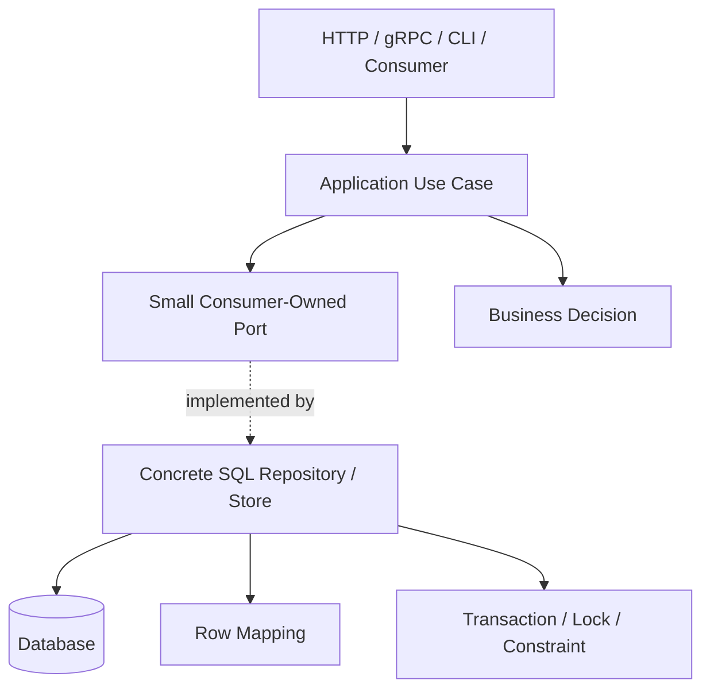
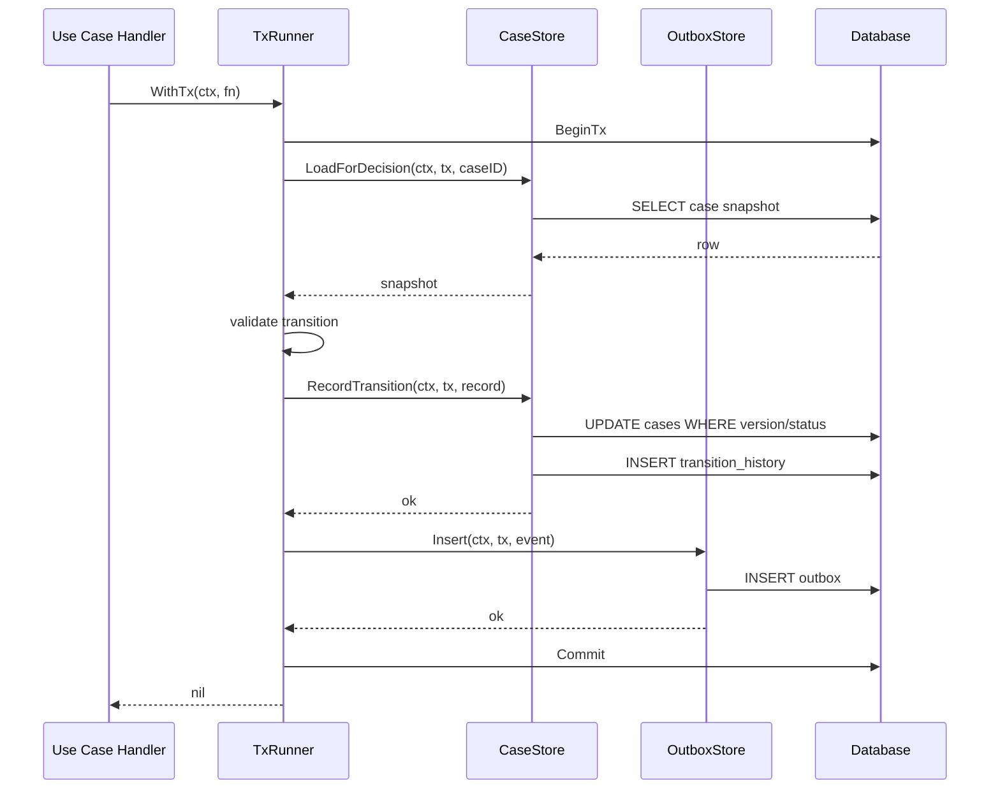

# learn-go-design-patterns-common-patterns-anti-patterns-part-011.md

# Part 011 — Repository Pattern: Useful, Dangerous, and Often Misused

> Seri: **Go Design Patterns, Common Patterns, and Anti-Patterns**  
> Target pembaca: **Java software engineer yang ingin mendesain Go service production-grade**  
> Level: **Advanced / internal engineering handbook**  
> Fokus: **Repository pattern sebagai persistence boundary, bukan DAO generik, bukan ORM wrapper, dan bukan ceremony wajib**

---

## 0. Posisi Part Ini Dalam Seri

Pada part sebelumnya kita sudah membahas:

- package-oriented design
- API surface
- interface placement
- constructor/initialization
- functional options
- configuration
- dependency wiring
- adapter/port pattern

Part ini masuk ke salah satu area yang paling sering disalahpahami oleh engineer yang datang dari Java/Spring/JPA/Hibernate:

> “Apakah Go perlu Repository pattern?”

Jawaban pendeknya:

> **Kadang perlu, sering berguna, tetapi sangat mudah menjadi anti-pattern.**

Jawaban yang lebih tepat:

> Repository di Go berguna ketika ia memodelkan **persistence boundary untuk operasi domain/application yang bermakna**, menjaga ownership transaction, menyembunyikan detail vendor yang memang tidak perlu diketahui caller, tetapi tetap tidak menghilangkan semantic penting dari database.

Repository menjadi buruk ketika diperlakukan sebagai:

- DAO per table
- wrapper tipis atas SQL
- generic CRUD abstraction
- tiruan Spring Data repository
- cara menyembunyikan SQL supaya terlihat “clean”
- interface besar agar bisa dimock
- lapisan wajib di semua fitur meskipun tidak ada value desain

---

## 1. Tujuan Pembelajaran

Setelah menyelesaikan part ini, kamu diharapkan mampu:

1. Membedakan repository, DAO, query object, gateway, dan adapter.
2. Memutuskan kapan repository pattern layak dipakai di Go.
3. Mendesain repository interface yang kecil, consumer-owned, dan use-case oriented.
4. Menentukan transaction ownership secara eksplisit.
5. Menghindari generic repository anti-pattern.
6. Mendesain repository untuk aggregate/domain operation, bukan sekadar table operation.
7. Menjaga SQL semantics tetap terlihat di tempat yang tepat.
8. Memisahkan write model, read model, reporting query, dan lookup query.
9. Menulis repository yang testable tanpa over-mocking.
10. Mendesain persistence boundary yang cocok untuk sistem besar, audit-heavy, compliance-heavy, dan case-management workflow.

---

## 2. Mental Model Utama

Repository bukan “tempat semua query database diletakkan”.

Repository adalah boundary yang menjawab pertanyaan:

> “Bagaimana application/domain layer menyimpan dan mengambil state yang ia perlukan tanpa bergantung langsung pada detail persistence yang tidak relevan bagi use case?”

Tetapi di Go, ada koreksi penting:

> Repository tidak harus menyembunyikan bahwa sistem memakai SQL, transaksi, constraint, locking, pagination, isolation, atau consistency behavior.

Repository yang baik menyembunyikan **incidental persistence detail**, bukan **essential data semantics**.

Contoh incidental detail:

- nama kolom internal
- join table teknis
- SQL placeholder syntax `$1` vs `?`
- driver-specific scan helper
- mapping row ke struct
- retry classification internal

Contoh essential semantics yang tidak boleh disembunyikan sembarangan:

- operasi harus transactional
- query memakai lock
- pagination harus stable
- read bisa stale
- constraint uniqueness bisa gagal
- update memakai optimistic version
- insert bisa idempotent
- row tidak ditemukan berbeda dari sistem error
- operasi harus berjalan dalam tenant/security scope

---

## 3. Kenapa Repository Pattern Sering Bermasalah di Go

Banyak Java engineer membawa pattern seperti ini:

```java
public interface UserRepository extends JpaRepository<User, UUID> {
    Optional<User> findByEmail(String email);
    List<User> findByStatus(Status status);
}
```

Lalu diterjemahkan menjadi Go:

```go
type UserRepository interface {
    Save(ctx context.Context, user *User) error
    FindByID(ctx context.Context, id string) (*User, error)
    FindByEmail(ctx context.Context, email string) (*User, error)
    FindByStatus(ctx context.Context, status string) ([]*User, error)
    Delete(ctx context.Context, id string) error
}
```

Sekilas terlihat normal. Masalahnya: interface ini sering tidak berasal dari kebutuhan consumer. Ia berasal dari asumsi bahwa “semua entity harus punya repository”.

Di Go, desain seperti ini sering menghasilkan:

- interface terlalu besar
- method terlalu CRUD-centric
- caller tidak jelas transaction-nya
- SQL semantics hilang
- business operation tersebar
- test banyak mock tapi coverage behavior rendah
- repository menjadi god object
- query reporting dicampur dengan write aggregate
- performance tuning menjadi sulit karena query tersembunyi di balik abstraction generik

Mental model Go lebih dekat ke:

```go
type ApplicationReader interface {
    GetForDecision(ctx context.Context, appID ApplicationID) (ApplicationForDecision, error)
}

type ApplicationWriter interface {
    SaveDecision(ctx context.Context, decision DecisionRecord) error
}
```

Atau bahkan tanpa interface di provider package:

```go
type Store struct {
    db *sql.DB
}

func (s *Store) GetApplicationForDecision(ctx context.Context, appID ApplicationID) (ApplicationForDecision, error) {
    // SQL implementation
}

func (s *Store) SaveDecision(ctx context.Context, cmd SaveDecisionCommand) error {
    // SQL implementation
}
```

Lalu interface kecil dibuat di package use case bila benar-benar diperlukan.

---

## 4. Repository vs DAO vs Query Object vs Gateway

Istilah ini sering dicampur. Dalam Go, lebih penting memahami fungsi desainnya daripada namanya.

| Konsep | Fokus | Cocok Untuk | Bahaya |
|---|---|---|---|
| DAO | Operasi data level rendah | CRUD table, mapping row | Mudah jadi table-centric dan bocor ke domain |
| Repository | Persistence boundary untuk aggregate/use case | Write model, domain aggregate, transactional operation | Mudah jadi generic CRUD illusion |
| Query Object | Query spesifik, sering read-only | Search, listing, report, dashboard | Bisa tersebar tanpa ownership |
| Gateway | Boundary ke external system | HTTP API, payment, identity, third-party | Bisa menyembunyikan failure semantics |
| Store | Concrete persistence component | Go package yang expose data operations | Bisa jadi god store jika tidak dipisah |

Di Go, nama `Store` sering lebih jujur daripada `Repository`.

Contoh:

```go
type Store struct {
    db *sql.DB
}
```

Nama `Store` tidak mengklaim sebagai domain repository. Ia hanya mengatakan: “ini storage-backed component”.

Nama `Repository` boleh dipakai ketika boundary-nya benar-benar domain/use-case oriented.

---

## 5. Repository Pattern yang Baik di Go

Repository yang baik biasanya memiliki ciri-ciri berikut:

1. Method mewakili operation bermakna, bukan sekadar CRUD table.
2. Interface kecil dan dibuat di sisi consumer bila perlu.
3. Concrete implementation boleh diexpose sebagai struct.
4. Transaction ownership eksplisit.
5. Context selalu parameter pertama untuk operasi I/O.
6. Error semantic jelas: not found, conflict, constraint, retryable, system failure.
7. Tidak menyembunyikan pagination, locking, isolation, atau consistency behavior yang penting.
8. Query read-heavy dipisahkan dari write aggregate bila kebutuhan berbeda.
9. Mapping database ke domain tidak menimbulkan invalid object.
10. Test strategy tidak bergantung pada mock repository besar.

---

## 6. Repository Pattern yang Buruk

Repository yang buruk biasanya terlihat seperti ini:

```go
type Repository[T any, ID comparable] interface {
    Save(ctx context.Context, v T) error
    FindByID(ctx context.Context, id ID) (T, error)
    FindAll(ctx context.Context) ([]T, error)
    Delete(ctx context.Context, id ID) error
}
```

Mengapa ini buruk?

Karena production persistence jarang sekadar generic CRUD.

Pertanyaan nyata yang hilang:

- Apakah `Save` insert atau update?
- Apakah `Save` idempotent?
- Apakah update butuh optimistic locking?
- Apakah delete soft delete atau hard delete?
- Apakah `FindAll` bounded?
- Apakah query tenant-scoped?
- Apakah read boleh stale?
- Bagaimana not found dibedakan dari database failure?
- Apakah operasi harus dalam transaksi?
- Apakah constraint violation diterjemahkan ke domain error?
- Apakah ada audit trail?
- Apakah ada outbox event?

Generic repository memberi ilusi abstraction, tetapi menghapus informasi yang justru penting.

---

## 7. Diagram Mental: Repository Sebagai Boundary, Bukan Layer Wajib



Yang penting:

- use case tidak harus tahu SQL detail rendah
- repository tidak boleh menyembunyikan semantic penting
- port/interface ada di sisi use case bila perlu
- repository concrete ada di infra/persistence package
- transaction bisa dimiliki use case atau unit-of-work boundary, bukan tersembunyi sembarang

---

## 8. Java Mindset vs Go Mindset

### 8.1 Java/Spring Mindset

Dalam Java enterprise, repository sering dipengaruhi oleh:

- JPA entity lifecycle
- Hibernate session
- lazy loading
- transaction annotation
- Spring Data method generation
- repository interface convention
- proxy-based behavior
- dependency injection container

Pattern yang umum:

```java
@Service
@Transactional
public class ApplicationService {
    private final ApplicationRepository repository;

    public void approve(UUID id) {
        Application app = repository.findById(id).orElseThrow();
        app.approve();
        repository.save(app);
    }
}
```

Banyak hal terjadi implisit:

- transaction dimulai oleh annotation
- dirty checking menyimpan perubahan
- lazy loading mungkin terjadi
- repository method bisa dibuat otomatis
- exception dipropagasikan
- rollback behavior framework-driven

### 8.2 Go Mindset

Go cenderung explicit:

```go
func (h *ApproveApplicationHandler) Handle(ctx context.Context, cmd ApproveApplication) error {
    return h.tx.WithTx(ctx, func(ctx context.Context, tx Tx) error {
        app, err := h.apps.GetForUpdate(ctx, tx, cmd.ApplicationID)
        if err != nil {
            return err
        }

        decision, err := app.Approve(cmd.Actor, cmd.Reason, h.clock.Now())
        if err != nil {
            return err
        }

        if err := h.apps.SaveDecision(ctx, tx, decision); err != nil {
            return err
        }

        return h.outbox.Add(ctx, tx, decision.Event())
    })
}
```

Di sini terlihat jelas:

- transaction owner siapa
- read menggunakan lock atau tidak
- domain decision terjadi di mana
- save decision seperti apa
- outbox masuk transaksi yang sama
- error flow eksplisit

Go tidak melarang abstraction. Go hanya membuat biaya abstraction lebih terlihat.

---

## 9. Kapan Repository Pattern Layak Dipakai

Gunakan repository bila ada minimal beberapa kondisi berikut:

### 9.1 Ada Domain Aggregate atau Lifecycle Penting

Contoh:

- application case
- enforcement case
- appeal
- renewal
- compliance investigation
- payment/revenue record
- user identity binding
- approval workflow

Operasi persistence bukan sekadar `insert row`, tetapi bagian dari lifecycle.

### 9.2 Ada Transaction Boundary yang Harus Dikendalikan

Contoh:

- update case status + insert audit trail + insert outbox event
- approve application + allocate number + create correspondence
- submit appeal + freeze previous state + notify reviewer

Repository bisa menjadi boundary operation yang ikut transaction.

### 9.3 Ada Mapping Kompleks dari DB ke Domain Object

Contoh:

- aggregate butuh beberapa table
- nested value object
- optional relation
- history state
- normalized DB model tetapi domain butuh object graph tertentu

### 9.4 Ada Vendor/Storage Detail yang Ingin Dilokalisasi

Contoh:

- PostgreSQL `RETURNING`
- Oracle sequence
- MySQL upsert behavior
- SQL Server locking hint
- JSON/JSONB column
- CLOB/BLOB handling

### 9.5 Ada Testing Seam yang Bernilai

Contoh use case ingin dites tanpa database karena logic kompleks:

```go
type ApplicationStore interface {
    GetForDecision(ctx context.Context, id ApplicationID) (ApplicationSnapshot, error)
    SaveDecision(ctx context.Context, decision DecisionRecord) error
}
```

Interface ini kecil, spesifik, dan dimiliki use case.

---

## 10. Kapan Repository Tidak Perlu

Repository sering tidak perlu bila:

1. Query hanya satu SQL sederhana dan dipakai di satu handler.
2. Operasi hanya read-only report/listing.
3. Tidak ada domain object yang perlu dijaga.
4. Tidak ada transaction composition.
5. Tidak ada testing seam bernilai.
6. Abstraction hanya menambah nama method tanpa menyederhanakan apa pun.
7. SQL semantics lebih penting terlihat langsung.

Contoh yang boleh sederhana:

```go
func (h *ReportHandler) ServeHTTP(w http.ResponseWriter, r *http.Request) {
    ctx := r.Context()

    rows, err := h.db.QueryContext(ctx, `
        SELECT status, COUNT(*)
        FROM applications
        WHERE submitted_at >= $1 AND submitted_at < $2
        GROUP BY status
        ORDER BY status
    `, h.from, h.to)
    if err != nil {
        h.respondError(w, err)
        return
    }
    defer rows.Close()

    // scan and respond
}
```

Untuk query reporting sederhana, membuat `ApplicationRepository.FindStatusCountsBetweenDateRange` mungkin hanya memindahkan complexity tanpa nilai.

Namun, untuk codebase besar, kamu mungkin tetap membuat query object:

```go
type StatusReportQuery struct {
    db *sql.DB
}

func (q *StatusReportQuery) Execute(ctx context.Context, filter StatusReportFilter) ([]StatusCount, error) {
    // SQL here
}
```

Ini bukan repository aggregate. Ini query object.

---

## 11. Repository Method Naming: Dari CRUD ke Intent

Bandingkan desain berikut.

### 11.1 Table-Centric / CRUD-Centric

```go
type CaseRepository interface {
    Create(ctx context.Context, c Case) error
    Update(ctx context.Context, c Case) error
    Delete(ctx context.Context, id string) error
    FindByID(ctx context.Context, id string) (Case, error)
    FindByStatus(ctx context.Context, status string) ([]Case, error)
}
```

Masalah:

- terlalu umum
- tidak menunjukkan invariant
- tidak menunjukkan transaction semantics
- tidak menunjukkan lock/version behavior
- mudah dipakai sembarang

### 11.2 Use-Case-Oriented

```go
type CaseDecisionStore interface {
    LoadForDecision(ctx context.Context, id CaseID) (CaseDecisionSnapshot, error)
    RecordDecision(ctx context.Context, record DecisionRecord) error
}
```

Lebih baik karena:

- method sesuai use case
- object yang dikembalikan sesuai kebutuhan decision
- caller tidak tergoda memakai method umum untuk operasi lain
- lebih mudah menjaga invariant

### 11.3 Transaction-Aware

```go
type CaseDecisionStore interface {
    LoadForDecision(ctx context.Context, tx Tx, id CaseID) (CaseDecisionSnapshot, error)
    RecordDecision(ctx context.Context, tx Tx, record DecisionRecord) error
}
```

Atau transaction dibungkus dalam unit of work:

```go
type CaseUnitOfWork interface {
    WithTx(ctx context.Context, fn func(ctx context.Context, tx CaseTx) error) error
}

type CaseTx interface {
    LoadForDecision(ctx context.Context, id CaseID) (CaseDecisionSnapshot, error)
    RecordDecision(ctx context.Context, record DecisionRecord) error
    AddOutbox(ctx context.Context, event IntegrationEvent) error
}
```

Pilihan mana yang benar tergantung sistem. Yang penting: ownership transaction tidak ambigu.

---

## 12. Transaction Ownership

Repository anti-pattern paling berbahaya adalah transaction tersembunyi.

### 12.1 Buruk: Tiap Repository Method Membuka Transaction Sendiri

```go
func (r *ApplicationRepository) Approve(ctx context.Context, id string) error {
    tx, err := r.db.BeginTx(ctx, nil)
    if err != nil {
        return err
    }
    defer tx.Rollback()

    // update application
    // insert audit

    return tx.Commit()
}
```

Ini tidak selalu salah, tetapi menjadi buruk bila caller perlu menggabungkan operasi:

```go
approve application
+ create notification
+ insert outbox event
+ update quota
```

Jika setiap repository membuka transaction sendiri, atomicity tidak bisa dijaga.

### 12.2 Baik: Use Case Memiliki Transaction Boundary

```go
type TxRunner interface {
    WithTx(ctx context.Context, fn func(ctx context.Context, tx *sql.Tx) error) error
}

func (h *ApproveHandler) Handle(ctx context.Context, cmd ApproveCommand) error {
    return h.tx.WithTx(ctx, func(ctx context.Context, tx *sql.Tx) error {
        app, err := h.apps.LoadForUpdate(ctx, tx, cmd.ApplicationID)
        if err != nil {
            return err
        }

        decision, err := app.Approve(cmd.ActorID, cmd.Reason)
        if err != nil {
            return err
        }

        if err := h.apps.SaveDecision(ctx, tx, decision); err != nil {
            return err
        }

        if err := h.outbox.Insert(ctx, tx, decision.Event); err != nil {
            return err
        }

        return nil
    })
}
```

### 12.3 Baik: Repository Method Atomic Jika Operation Memang Self-Contained

Kadang repository boleh membuka transaction sendiri bila operation memang atomic dan tidak perlu digabung.

```go
func (r *TokenStore) Rotate(ctx context.Context, subject SubjectID, newHash TokenHash) error {
    return r.tx.WithTx(ctx, func(ctx context.Context, tx *sql.Tx) error {
        // revoke old token
        // insert new token
        return nil
    })
}
```

Tetapi kontraknya harus jelas: `Rotate` adalah satu operation atomic.

---

## 13. `*sql.DB`, `*sql.Tx`, dan Interface Kecil untuk Executor

Di Go, `database/sql` memiliki beberapa tipe penting:

- `*sql.DB`: database handle / connection pool
- `*sql.Tx`: transaction
- `*sql.Conn`: single connection
- `*sql.Stmt`: prepared statement
- `*sql.Rows`, `*sql.Row`: query result

`*sql.DB` aman dipakai concurrent dan mengelola connection pool. Tetapi `*sql.Tx` merepresentasikan transaksi tertentu dan harus diselesaikan dengan commit/rollback.

Masalah umum: repository ingin bisa menerima `*sql.DB` atau `*sql.Tx`.

Solusi umum: buat interface executor kecil.

```go
type Queryer interface {
    QueryContext(ctx context.Context, query string, args ...any) (*sql.Rows, error)
    QueryRowContext(ctx context.Context, query string, args ...any) *sql.Row
}

type Execer interface {
    ExecContext(ctx context.Context, query string, args ...any) (sql.Result, error)
}

type DBTX interface {
    QueryContext(ctx context.Context, query string, args ...any) (*sql.Rows, error)
    QueryRowContext(ctx context.Context, query string, args ...any) *sql.Row
    ExecContext(ctx context.Context, query string, args ...any) (sql.Result, error)
}
```

Lalu repository method bisa menerima `DBTX`:

```go
func (s *ApplicationStore) LoadForDecision(ctx context.Context, q DBTX, id ApplicationID) (ApplicationDecisionSnapshot, error) {
    row := q.QueryRowContext(ctx, `
        SELECT id, status, version, assigned_officer_id
        FROM applications
        WHERE id = $1
    `, id)

    var snap ApplicationDecisionSnapshot
    if err := row.Scan(&snap.ID, &snap.Status, &snap.Version, &snap.AssignedOfficerID); err != nil {
        return ApplicationDecisionSnapshot{}, translateSQLError(err)
    }
    return snap, nil
}
```

Dengan ini caller bisa memberikan `*sql.DB` atau `*sql.Tx`.

Namun jangan berlebihan. Jika semua method akhirnya menerima `DBTX`, pastikan transaction ownership tetap terbaca.

---

## 14. Error Semantics Repository

Repository harus menerjemahkan error persistence ke semantic yang berguna.

### 14.1 Not Found

Jangan bocorkan `sql.ErrNoRows` ke seluruh application layer bila domain butuh semantic berbeda.

```go
var ErrApplicationNotFound = errors.New("application not found")

func translateSQLError(err error) error {
    if errors.Is(err, sql.ErrNoRows) {
        return ErrApplicationNotFound
    }
    return err
}
```

Namun hati-hati: not found untuk application berbeda dari not found untuk user, tenant, policy, document.

Lebih baik typed error:

```go
type NotFoundError struct {
    Resource string
    ID       string
}

func (e NotFoundError) Error() string {
    return e.Resource + " not found"
}
```

Atau domain-specific sentinel bila surface kecil.

### 14.2 Conflict / Version Mismatch

Optimistic locking umum:

```sql
UPDATE applications
SET status = $1, version = version + 1
WHERE id = $2 AND version = $3
```

Jika affected rows = 0, kemungkinan:

- row tidak ada
- version berubah
- tenant scope tidak cocok

Jangan langsung return `not found` jika semantic-nya conflict.

```go
result, err := q.ExecContext(ctx, updateSQL, status, id, expectedVersion)
if err != nil {
    return translateSQLError(err)
}

affected, err := result.RowsAffected()
if err != nil {
    return err
}
if affected == 0 {
    return ErrConcurrentModification
}
```

### 14.3 Constraint Violation

Database constraint bukan musuh domain. Constraint adalah guardrail terakhir.

Repository perlu menerjemahkan constraint tertentu:

- duplicate key → already exists / idempotent success / conflict
- foreign key violation → invalid reference / stale command
- check constraint violation → invariant breach

Tetapi jangan semua error database diterjemahkan menjadi “bad request”. Banyak error adalah system failure.

### 14.4 Retryable Error

Repository bisa mengklasifikasi error:

- deadlock
- serialization failure
- lock timeout
- connection reset
- temporary network failure

Tetapi retry policy biasanya bukan di repository method kecil; sering lebih baik di use case / transaction runner / resilience decorator karena perlu budget dan idempotency.

---

## 15. Read Model vs Write Model

Salah satu kesalahan besar: satu repository dipakai untuk semua kebutuhan.

```go
type ApplicationRepository interface {
    Save(ctx context.Context, app Application) error
    FindByID(ctx context.Context, id ApplicationID) (Application, error)
    Search(ctx context.Context, filter Filter) ([]Application, error)
    CountByStatus(ctx context.Context) (map[Status]int, error)
    FindAgingCases(ctx context.Context) ([]Application, error)
    ExportCSV(ctx context.Context, filter Filter) ([]Application, error)
}
```

Ini mencampur:

- write aggregate
- read detail
- search listing
- dashboard query
- report export
- operational monitoring

Lebih sehat:

```go
type ApplicationCommandStore struct { db *sql.DB }
type ApplicationDetailQuery struct { db *sql.DB }
type ApplicationListingQuery struct { db *sql.DB }
type ApplicationReportQuery struct { db *sql.DB }
```

Atau package-level split:

```text
internal/application/applications/
    approve.go
    submit.go
    ports.go

internal/infra/postgres/applications/
    command_store.go
    detail_query.go
    listing_query.go
    report_query.go
```

Write model biasanya butuh:

- invariant
- versioning
- transaction
- lock
- audit
- outbox

Read model biasanya butuh:

- projection
- pagination
- filtering
- index awareness
- DTO/query result
- performance-specific SQL

Menyatukan keduanya sering membuat repository terlalu besar dan lambat berubah.

---

## 16. Aggregate-Oriented Repository

Repository dalam Domain-Driven Design sering dikaitkan dengan aggregate. Di Go, jangan terlalu dogmatis, tetapi ide aggregate tetap berguna.

Aggregate boundary menjawab:

> “State apa yang harus berubah bersama agar invariant tetap benar?”

Contoh case management:

- Case
- CaseStatus
- AssignedOfficer
- LatestDecision
- Version
- Audit-required transition

Repository write operation:

```go
type CaseStore interface {
    LoadForTransition(ctx context.Context, tx DBTX, id CaseID) (CaseAggregate, error)
    SaveTransition(ctx context.Context, tx DBTX, transition CaseTransitionRecord) error
}
```

Bukan:

```go
type CaseRepository interface {
    UpdateCase(ctx context.Context, c Case) error
    InsertCaseHistory(ctx context.Context, h CaseHistory) error
    InsertAudit(ctx context.Context, a Audit) error
}
```

Kenapa?

Karena caller bisa lupa memanggil `InsertAudit`. Jika audit adalah invariant operasional, save operation harus membuatnya sulit dilanggar.

---

## 17. Repository dan Auditability

Untuk sistem regulatory/case-management, repository bukan hanya menyimpan data. Ia sering menjadi titik kritis untuk:

- audit trail
- decision trace
- transition history
- actor identity
- reason code
- before/after snapshot
- correlation id
- outbox event
- data retention metadata

Anti-pattern:

```go
func (r *CaseRepository) UpdateStatus(ctx context.Context, id string, status string) error {
    _, err := r.db.ExecContext(ctx, `UPDATE cases SET status = $1 WHERE id = $2`, status, id)
    return err
}
```

Lebih defensible:

```go
type RecordCaseTransition struct {
    CaseID        CaseID
    FromStatus    CaseStatus
    ToStatus      CaseStatus
    ActorID       ActorID
    Reason        string
    DecisionID    DecisionID
    CorrelationID string
    OccurredAt    time.Time
    ExpectedVer   int64
}

func (s *CaseStore) RecordTransition(ctx context.Context, tx DBTX, cmd RecordCaseTransition) error {
    // 1. optimistic update cases
    // 2. insert transition history
    // 3. insert audit trail
    // 4. insert outbox event
    // all in same tx
    return nil
}
```

Repository method name harus merepresentasikan operation yang regulatory-defensible.

---

## 18. SQL Semantics Jangan Dihilangkan

SQL bukan implementation detail sepenuhnya. Dalam sistem production, SQL sering menentukan correctness.

Contoh semantic penting:

- `SELECT ... FOR UPDATE`
- isolation level
- `ON CONFLICT DO NOTHING`
- `RETURNING`
- `SKIP LOCKED`
- `LIMIT/OFFSET` vs keyset pagination
- read committed vs serializable behavior
- unique index behavior
- foreign key cascade
- generated column
- partial index
- materialized view
- row-level security

Repository boleh menyembunyikan syntax, tetapi tidak boleh menyembunyikan behavior.

Nama method harus memberi clue:

```go
LoadForUpdate(ctx, tx, id)
ClaimNextBatch(ctx, tx, limit)
InsertIfAbsent(ctx, tx, record)
UpdateIfVersion(ctx, tx, id, expectedVersion, patch)
ListAfterCursor(ctx, filter, cursor, limit)
```

Bandingkan dengan nama lemah:

```go
Get(ctx, id)
Save(ctx, obj)
Find(ctx, filter)
Update(ctx, obj)
```

Nama generik membuat semantics tersembunyi.

---

## 19. Pagination Pattern dalam Repository/Query Object

Pagination adalah area anti-pattern umum.

### 19.1 Buruk: `FindAll`

```go
func (r *Repository) FindAll(ctx context.Context) ([]Application, error)
```

Masalah:

- unbounded memory
- unbounded latency
- membunuh DB
- tidak jelas ordering
- tidak stabil saat data berubah

### 19.2 Lebih Baik: Limit + Stable Ordering

```go
type ListApplicationsFilter struct {
    Status    *ApplicationStatus
    OfficerID *OfficerID
    SubmittedFrom *time.Time
    SubmittedTo   *time.Time
}

type PageRequest struct {
    Limit int
    Cursor string
}

type Page[T any] struct {
    Items      []T
    NextCursor string
}

func (q *ApplicationListingQuery) List(ctx context.Context, filter ListApplicationsFilter, page PageRequest) (Page[ApplicationListItem], error) {
    // stable keyset pagination
}
```

### 19.3 Offset Pagination vs Keyset Pagination

Offset pagination mudah:

```sql
ORDER BY submitted_at DESC
LIMIT $1 OFFSET $2
```

Tetapi bisa lambat dan tidak stabil untuk dataset besar.

Keyset pagination:

```sql
WHERE (submitted_at, id) < ($1, $2)
ORDER BY submitted_at DESC, id DESC
LIMIT $3
```

Repository/query object harus mengekspresikan semantic cursor jika production listing besar.

---

## 20. Mapping Pattern: Row → Domain

Mapping sering terlihat trivial, tetapi bisa merusak domain.

### 20.1 Buruk: Scan Langsung ke Domain Mutable Struct

```go
type Application struct {
    ID     string
    Status string
    Amount float64
}

func scanApplication(row *sql.Row) (Application, error) {
    var app Application
    err := row.Scan(&app.ID, &app.Status, &app.Amount)
    return app, err
}
```

Masalah:

- invalid status bisa masuk
- money pakai float
- invariant domain tidak dijaga
- null handling tidak jelas

### 20.2 Lebih Baik: Scan ke Persistence Row, Lalu Construct Domain

```go
type applicationRow struct {
    id          string
    status      string
    amountCents int64
    version     int64
}

func (r applicationRow) toSnapshot() (ApplicationDecisionSnapshot, error) {
    status, err := ParseApplicationStatus(r.status)
    if err != nil {
        return ApplicationDecisionSnapshot{}, fmt.Errorf("invalid stored application status: %w", err)
    }

    return ApplicationDecisionSnapshot{
        ID:          ApplicationID(r.id),
        Status:      status,
        AmountCents: r.amountCents,
        Version:     r.version,
    }, nil
}
```

Persistence mapping boleh tahu database representation. Domain object tetap dijaga.

---

## 21. Null Handling

SQL null tidak sama dengan zero value.

Anti-pattern:

```go
var officerID string
row.Scan(&officerID)
```

Jika kolom nullable, ini bisa error atau memaksa empty string sebagai “tidak ada”.

Gunakan explicit nullable type:

```go
var assignedOfficer sql.NullString
if err := row.Scan(&assignedOfficer); err != nil {
    return snap, err
}

if assignedOfficer.Valid {
    snap.AssignedOfficerID = SomeOfficerID(assignedOfficer.String)
}
```

Atau buat domain optional type bila memang penting.

Jangan biarkan `""`, `0`, atau `time.Time{}` diam-diam berarti “tidak ada” kecuali itu contract eksplisit.

---

## 22. Repository dan Context

Semua operasi I/O repository harus menerima `context.Context` sebagai parameter pertama:

```go
func (s *Store) Get(ctx context.Context, id ID) (Entity, error)
```

Repository tidak boleh:

- menyimpan context di struct
- membuat `context.Background()` sendiri untuk query request-scoped
- mengabaikan cancellation
- mengganti deadline tanpa alasan
- memakai context sebagai dependency bag

Buruk:

```go
type Store struct {
    ctx context.Context
    db  *sql.DB
}
```

Baik:

```go
type Store struct {
    db *sql.DB
}

func (s *Store) Get(ctx context.Context, id ID) (Entity, error) {
    return s.query(ctx, id)
}
```

Context merepresentasikan request lifetime, bukan lifetime repository.

---

## 23. Repository dan Prepared Statements

Prepared statement bisa berguna, tetapi jangan jadikan default rumit tanpa alasan.

Pertimbangkan prepared statement bila:

- query sangat sering dipakai
- driver/database mendapat benefit nyata
- ingin validasi query saat startup
- ingin mengurangi parsing overhead

Tetapi hati-hati:

- prepared statement punya lifecycle
- perlu close
- dalam transaction, statement binding bisa berbeda
- bisa menambah complexity wiring
- beberapa pool/driver punya behavior khusus

Sederhana dulu:

```go
row := s.db.QueryRowContext(ctx, query, args...)
```

Optimasi setelah ada evidence.

---

## 24. Repository dan Observability

Repository adalah boundary bagus untuk observability teknis, tetapi bukan tempat ideal untuk business logging acak.

Yang bisa diamati di repository:

- query duration
- operation name
- rows affected
- database error category
- retry classification
- lock timeout
- slow query
- connection pool stats di level DB component

Yang harus hati-hati:

- raw SQL dengan PII
- query parameter sensitif
- high-cardinality labels
- logging setiap row
- double logging error yang akan dilog di boundary atas

Pattern:

```go
type InstrumentedApplicationStore struct {
    next *ApplicationStore
    meter Meter
}

func (s *InstrumentedApplicationStore) LoadForDecision(ctx context.Context, id ApplicationID) (ApplicationDecisionSnapshot, error) {
    start := time.Now()
    snap, err := s.next.LoadForDecision(ctx, id)
    s.meter.RecordDBOperation(ctx, "application.load_for_decision", time.Since(start), classifyErr(err))
    return snap, err
}
```

Atau instrumentasi dilakukan di SQL helper/decorator.

Jangan membuat repository method penuh log noise:

```go
log.Println("start query")
log.Println("id", id)
log.Println("query success")
```

Structured instrumentation lebih baik.

---

## 25. Repository dan Security Boundary

Repository sering menjadi tempat terakhir untuk enforce data scope.

Contoh tenant/security scope:

```go
type Scope struct {
    TenantID TenantID
    ActorID  ActorID
    Roles    []Role
}

func (q *ApplicationQuery) GetDetail(ctx context.Context, scope Scope, id ApplicationID) (ApplicationDetail, error) {
    row := q.db.QueryRowContext(ctx, `
        SELECT id, status, applicant_name
        FROM applications
        WHERE tenant_id = $1 AND id = $2
    `, scope.TenantID, id)

    // scan
}
```

Anti-pattern:

```go
func (q *ApplicationQuery) GetDetail(ctx context.Context, id ApplicationID) (ApplicationDetail, error) {
    // no tenant scope
}
```

Lalu berharap handler sudah filter authorization. Dalam sistem besar, ini rawan.

Namun jangan juga menjadikan repository sebagai authorization engine penuh jika policy kompleks. Lebih tepat:

- application layer mengevaluasi authorization decision
- repository menegakkan data scope di query
- audit mencatat actor dan scope

---

## 26. Repository dan Idempotency

Persistence boundary sering menjadi tempat penting untuk idempotency.

Contoh command submit application dengan idempotency key:

```go
type SubmissionRecord struct {
    ApplicationID  ApplicationID
    IdempotencyKey string
    ApplicantID    ApplicantID
    PayloadHash    string
    SubmittedAt    time.Time
}

func (s *SubmissionStore) InsertSubmission(ctx context.Context, tx DBTX, rec SubmissionRecord) (InsertSubmissionResult, error) {
    // INSERT with unique idempotency_key
    // if duplicate, load existing result and compare payload hash
}
```

Result bukan hanya error:

```go
type InsertSubmissionResult struct {
    ApplicationID ApplicationID
    Replayed      bool
}
```

Jika duplicate dengan payload berbeda:

```go
var ErrIdempotencyConflict = errors.New("idempotency key reused with different payload")
```

Repository di sini menjaga correctness yang tidak bisa dijamin hanya di memory.

---

## 27. Repository dan Outbox

Untuk event-driven production system, repository sering berinteraksi dengan outbox.

Buruk:

```go
if err := repo.Save(ctx, app); err != nil {
    return err
}

publisher.Publish(ctx, app.ApprovedEvent())
```

Jika publish gagal setelah commit, event hilang. Jika publish berhasil sebelum commit lalu commit gagal, event bohong.

Lebih baik:

```go
err := txRunner.WithTx(ctx, func(ctx context.Context, tx *sql.Tx) error {
    if err := appStore.SaveDecision(ctx, tx, decision); err != nil {
        return err
    }
    if err := outbox.Insert(ctx, tx, decision.Event()); err != nil {
        return err
    }
    return nil
})
```

Repository tidak harus tahu publisher. Tetapi transaction boundary harus memungkinkan outbox insert bersama state change.

---

## 28. Repository Layout Pattern

Contoh layout untuk service besar:

```text
internal/
  applications/
    approve.go
    submit.go
    query_detail.go
    ports.go
    model.go
    errors.go

  infra/
    postgres/
      applications/
        store.go
        command_store.go
        detail_query.go
        listing_query.go
        mapper.go
        errors.go
      outbox/
        store.go
      tx/
        runner.go
```

Atau vertical slice lebih kuat:

```text
internal/
  applicationcase/
    command/
      approve.go
      submit.go
    query/
      detail.go
      listing.go
    postgres/
      command_store.go
      detail_query.go
      mapper.go
```

Tidak ada layout universal. Yang penting:

- import graph jelas
- domain/use case tidak import infra
- infra implement port
- SQL mapping terkumpul di boundary
- query/read model tidak memaksa domain aggregate

---

## 29. Interface Placement untuk Repository

Provider package tidak perlu selalu expose interface.

Buruk:

```go
package postgres

type ApplicationRepository interface {
    Save(ctx context.Context, app Application) error
    FindByID(ctx context.Context, id ApplicationID) (Application, error)
}

type applicationRepository struct {
    db *sql.DB
}
```

Kenapa buruk?

- interface dimiliki implementor
- belum tentu sesuai kebutuhan consumer
- sering terlalu besar
- hanya untuk mocking

Lebih Go-like:

```go
package postgres

type ApplicationStore struct {
    db *sql.DB
}

func NewApplicationStore(db *sql.DB) *ApplicationStore {
    return &ApplicationStore{db: db}
}

func (s *ApplicationStore) LoadForDecision(ctx context.Context, id ApplicationID) (ApplicationDecisionSnapshot, error) {
    // ...
}
```

Consumer package:

```go
package applications

type decisionStore interface {
    LoadForDecision(ctx context.Context, id ApplicationID) (ApplicationDecisionSnapshot, error)
    SaveDecision(ctx context.Context, record DecisionRecord) error
}
```

Interface kecil di consumer.

---

## 30. Testing Strategy

Repository testing perlu dipisahkan dari use case testing.

### 30.1 Use Case Test dengan Fake Kecil

```go
type fakeDecisionStore struct {
    snap ApplicationDecisionSnapshot
    saved []DecisionRecord
    err error
}

func (f *fakeDecisionStore) LoadForDecision(ctx context.Context, id ApplicationID) (ApplicationDecisionSnapshot, error) {
    if f.err != nil {
        return ApplicationDecisionSnapshot{}, f.err
    }
    return f.snap, nil
}

func (f *fakeDecisionStore) SaveDecision(ctx context.Context, record DecisionRecord) error {
    f.saved = append(f.saved, record)
    return nil
}
```

Gunakan fake untuk logic use case.

### 30.2 Repository Integration Test dengan Database Nyata

Repository SQL sebaiknya dites terhadap database nyata atau testcontainer/local DB bila behavior SQL penting.

Test yang perlu:

- row mapping
- not found mapping
- constraint mapping
- optimistic locking
- transaction rollback
- pagination ordering
- null handling
- lock behavior jika penting
- outbox atomicity

Mocking `database/sql` terlalu jauh sering menghasilkan test palsu yang tidak menangkap SQL error.

### 30.3 Contract Test

Jika ada beberapa implementation repository, gunakan contract test:

```go
func RunApplicationStoreContract(t *testing.T, newStore func(t *testing.T) ApplicationStore) {
    t.Run("not found", func(t *testing.T) {})
    t.Run("save decision", func(t *testing.T) {})
    t.Run("optimistic conflict", func(t *testing.T) {})
}
```

---

## 31. Anti-Pattern Catalog

### 31.1 Generic Repository

```go
type Repository[T any] interface {
    Save(context.Context, T) error
    FindByID(context.Context, string) (T, error)
}
```

Masalah:

- menghapus semantic
- tidak cocok untuk transaction/invariant
- membuat domain terlihat seragam padahal tidak

Refactor ke use-case-specific store/query.

---

### 31.2 Repository per Table

```go
type UserTableRepository struct{}
type RoleTableRepository struct{}
type UserRoleTableRepository struct{}
```

Masalah:

- caller harus compose table operation sendiri
- invariant tersebar
- transaction rentan salah

Refactor ke aggregate/use-case operation.

---

### 31.3 `Save` yang Ambigu

```go
func Save(ctx context.Context, user User) error
```

Tidak jelas:

- insert atau update?
- upsert?
- validate version?
- replace all columns?
- partial update?

Refactor:

```go
InsertUser(ctx, cmd InsertUser) error
UpdateUserProfile(ctx, cmd UpdateUserProfile) error
UpdateUserIfVersion(ctx, cmd UpdateUserVersioned) error
```

---

### 31.4 Hidden Transaction

Repository membuka transaction tanpa caller tahu.

Akibat:

- sulit compose atomic operation
- nested transaction ilusi
- rollback ownership ambigu

Refactor ke transaction runner atau method atomic yang jelas.

---

### 31.5 Leaking SQL Rows

```go
func (r *Repo) Query(ctx context.Context) (*sql.Rows, error)
```

Masalah:

- caller harus tahu close rows
- mapping tersebar
- abstraction tidak berguna

Refactor agar repository mengembalikan typed result atau menyediakan iterator dengan lifecycle jelas.

---

### 31.6 Returning Pointers Everywhere

```go
func FindByID(ctx context.Context, id string) (*Application, error)
```

Pointer boleh, tetapi jangan otomatis. Pertimbangkan:

- apakah object besar?
- apakah nil punya makna?
- apakah caller boleh mutate?
- apakah value object lebih aman?

Untuk snapshot kecil, value sering lebih baik:

```go
func GetSnapshot(ctx context.Context, id ID) (Snapshot, error)
```

---

### 31.7 Repository Mengandung Business Decision

```go
func (r *Repo) ApproveIfEligible(ctx context.Context, id string) error {
    // query
    // business rules
    // update
}
```

Bisa benar jika repository adalah operation store, tetapi sering buruk bila business rules tersembunyi di infra package.

Refactor:

- repository load snapshot
- domain/use case evaluate decision
- repository persist decision

---

### 31.8 Repository Tanpa Scope

```go
FindByID(ctx, id)
```

Untuk multi-tenant/security-sensitive system, ini rawan.

Refactor:

```go
FindByID(ctx, scope, id)
```

atau enforce scope di use-case-specific query.

---

### 31.9 Repository Logging PII

```go
log.Printf("query applicant: %+v", applicant)
```

Bahaya:

- PII leak
- compliance issue
- log retention problem

Refactor ke structured safe logging with redaction.

---

### 31.10 Mock-Driven Repository Interface

Interface dibuat hanya karena mocking framework.

Refactor:

- concrete store di infra
- small consumer-owned interface di use case
- fake sederhana untuk test use case
- integration test untuk SQL

---

## 32. Refactoring Playbook: Dari Java-Style Repository ke Go-Style Persistence Boundary

### Step 1 — Inventory Method Repository

Tuliskan semua method:

```text
Save
FindByID
FindByEmail
FindByStatus
UpdateStatus
Delete
Search
Count
Export
```

Klasifikasikan:

- command/write
- query/detail
- query/listing
- report/export
- admin operation
- internal helper

### Step 2 — Identifikasi Use Case

Mapping method ke use case:

```text
ApproveApplication -> LoadForDecision, SaveDecision, InsertAudit, InsertOutbox
ListApplications  -> ListApplicationItems
ExportReport      -> ExportApplicationRows
```

### Step 3 — Pisahkan Read dan Write

Buat store/query object:

```go
type ApplicationDecisionStore struct{}
type ApplicationListingQuery struct{}
type ApplicationReportQuery struct{}
```

### Step 4 — Perjelas Transaction Boundary

Tentukan:

- method menerima tx?
- use case memakai tx runner?
- repository operation atomic sendiri?

### Step 5 — Perbaiki Error Taxonomy

Mapping:

```text
sql.ErrNoRows -> domain NotFound
unique violation -> AlreadyExists / Idempotent replay / Conflict
version update 0 rows -> ConcurrentModification
serialization/deadlock -> Retryable category
```

### Step 6 — Buat Interface di Consumer

Jangan expose interface besar dari infra.

```go
type decisionStore interface {
    LoadForDecision(ctx context.Context, id ApplicationID) (ApplicationDecisionSnapshot, error)
    SaveDecision(ctx context.Context, record DecisionRecord) error
}
```

### Step 7 — Tambahkan Integration Test untuk SQL

Test SQL behavior, bukan mock behavior.

### Step 8 — Hapus Generic CRUD Layer

Jika wrapper tidak memberi semantic, hilangkan.

---

## 33. Production Example: Case Decision Repository

### 33.1 Domain Types

```go
type CaseID string
type ActorID string

type CaseStatus string

const (
    CaseStatusOpen      CaseStatus = "OPEN"
    CaseStatusReviewing CaseStatus = "REVIEWING"
    CaseStatusApproved  CaseStatus = "APPROVED"
    CaseStatusRejected  CaseStatus = "REJECTED"
)

type CaseDecisionSnapshot struct {
    ID        CaseID
    Status    CaseStatus
    Version   int64
    OfficerID ActorID
}

type CaseDecisionRecord struct {
    CaseID        CaseID
    FromStatus    CaseStatus
    ToStatus      CaseStatus
    ActorID       ActorID
    Reason        string
    ExpectedVer   int64
    CorrelationID string
    OccurredAt    time.Time
}
```

### 33.2 Store

```go
type CaseStore struct {
    db *sql.DB
}

func NewCaseStore(db *sql.DB) *CaseStore {
    if db == nil {
        panic("nil db")
    }
    return &CaseStore{db: db}
}
```

In production, avoid panic if dependency can come from runtime config. But for programmer error in constructor, panic may be acceptable if consistent with project style. Alternative: return error.

### 33.3 DBTX Interface

```go
type DBTX interface {
    QueryContext(ctx context.Context, query string, args ...any) (*sql.Rows, error)
    QueryRowContext(ctx context.Context, query string, args ...any) *sql.Row
    ExecContext(ctx context.Context, query string, args ...any) (sql.Result, error)
}
```

### 33.4 Load for Decision

```go
func (s *CaseStore) LoadForDecision(ctx context.Context, q DBTX, id CaseID) (CaseDecisionSnapshot, error) {
    const query = `
        SELECT id, status, version, officer_id
        FROM cases
        WHERE id = $1
    `

    var row struct {
        id        string
        status    string
        version   int64
        officerID string
    }

    err := q.QueryRowContext(ctx, query, string(id)).Scan(
        &row.id,
        &row.status,
        &row.version,
        &row.officerID,
    )
    if err != nil {
        if errors.Is(err, sql.ErrNoRows) {
            return CaseDecisionSnapshot{}, ErrCaseNotFound
        }
        return CaseDecisionSnapshot{}, fmt.Errorf("load case decision snapshot: %w", err)
    }

    status, err := parseCaseStatus(row.status)
    if err != nil {
        return CaseDecisionSnapshot{}, fmt.Errorf("stored case status invalid: %w", err)
    }

    return CaseDecisionSnapshot{
        ID:        CaseID(row.id),
        Status:    status,
        Version:   row.version,
        OfficerID: ActorID(row.officerID),
    }, nil
}
```

### 33.5 Record Transition

```go
func (s *CaseStore) RecordTransition(ctx context.Context, q DBTX, rec CaseDecisionRecord) error {
    const updateCase = `
        UPDATE cases
        SET status = $1,
            version = version + 1,
            updated_at = $2,
            updated_by = $3
        WHERE id = $4
          AND status = $5
          AND version = $6
    `

    result, err := q.ExecContext(ctx, updateCase,
        string(rec.ToStatus),
        rec.OccurredAt,
        string(rec.ActorID),
        string(rec.CaseID),
        string(rec.FromStatus),
        rec.ExpectedVer,
    )
    if err != nil {
        return fmt.Errorf("update case transition: %w", translateDBError(err))
    }

    affected, err := result.RowsAffected()
    if err != nil {
        return fmt.Errorf("read case transition affected rows: %w", err)
    }
    if affected == 0 {
        return ErrCaseTransitionConflict
    }

    const insertHistory = `
        INSERT INTO case_transition_history
            (case_id, from_status, to_status, actor_id, reason, correlation_id, occurred_at)
        VALUES
            ($1, $2, $3, $4, $5, $6, $7)
    `

    if _, err := q.ExecContext(ctx, insertHistory,
        string(rec.CaseID),
        string(rec.FromStatus),
        string(rec.ToStatus),
        string(rec.ActorID),
        rec.Reason,
        rec.CorrelationID,
        rec.OccurredAt,
    ); err != nil {
        return fmt.Errorf("insert case transition history: %w", translateDBError(err))
    }

    return nil
}
```

### 33.6 Use Case With Transaction

```go
type ApproveCaseHandler struct {
    tx      TxRunner
    cases   *CaseStore
    outbox  *OutboxStore
    clock   Clock
}

func (h *ApproveCaseHandler) Handle(ctx context.Context, cmd ApproveCaseCommand) error {
    return h.tx.WithTx(ctx, func(ctx context.Context, tx *sql.Tx) error {
        snap, err := h.cases.LoadForDecision(ctx, tx, cmd.CaseID)
        if err != nil {
            return err
        }

        if snap.Status != CaseStatusReviewing {
            return ErrCaseNotReviewing
        }

        rec := CaseDecisionRecord{
            CaseID:        snap.ID,
            FromStatus:    snap.Status,
            ToStatus:      CaseStatusApproved,
            ActorID:       cmd.ActorID,
            Reason:        cmd.Reason,
            ExpectedVer:   snap.Version,
            CorrelationID: cmd.CorrelationID,
            OccurredAt:    h.clock.Now(),
        }

        if err := h.cases.RecordTransition(ctx, tx, rec); err != nil {
            return err
        }

        event := CaseApprovedEvent{
            CaseID:        rec.CaseID,
            ActorID:       rec.ActorID,
            OccurredAt:    rec.OccurredAt,
            CorrelationID: rec.CorrelationID,
        }

        if err := h.outbox.Insert(ctx, tx, event); err != nil {
            return err
        }

        return nil
    })
}
```

Catatan:

- store concrete tidak perlu interface besar
- transaction jelas
- transition semantic jelas
- history dan outbox atomic
- optimistic conflict terlihat
- domain decision tidak tersembunyi di SQL-only method

---

## 34. Mermaid: Transaction + Repository + Outbox Flow



---

## 35. Review Checklist

Gunakan checklist ini saat review repository di Go codebase.

### 35.1 Purpose

- Apakah repository ini benar-benar punya value?
- Apakah ia hanya wrapper CRUD?
- Apakah method-nya merepresentasikan use case/domain operation?
- Apakah read model dan write model dicampur?

### 35.2 Interface

- Apakah interface dibuat di sisi consumer?
- Apakah interface kecil?
- Apakah semua method dipakai oleh consumer yang sama?
- Apakah interface dibuat hanya untuk mock?

### 35.3 Transaction

- Siapa owner transaction?
- Apakah repository membuka transaction diam-diam?
- Apakah operasi yang harus atomic benar-benar atomic?
- Apakah outbox/audit ikut transaction yang sama bila diperlukan?

### 35.4 Error

- Apakah not found dibedakan dari DB failure?
- Apakah conflict/version mismatch jelas?
- Apakah constraint violation diterjemahkan dengan benar?
- Apakah error wrapping mempertahankan cause?
- Apakah retryable error diklasifikasi di boundary yang tepat?

### 35.5 SQL Semantics

- Apakah locking behavior terlihat dari nama method/contract?
- Apakah pagination bounded dan stable?
- Apakah update memakai expected version bila perlu?
- Apakah query tenant/security scoped?
- Apakah SQL performance bisa dianalisis?

### 35.6 Mapping

- Apakah row mapping menjaga invariant domain?
- Apakah nullable field explicit?
- Apakah zero value tidak dipakai sebagai null palsu?
- Apakah invalid database value menghasilkan error jelas?

### 35.7 Testing

- Apakah use case test memakai fake kecil?
- Apakah SQL behavior dites dengan database nyata?
- Apakah optimistic locking/constraint/pagination dites?
- Apakah mock besar bisa dikurangi?

### 35.8 Observability/Security

- Apakah operation repository bisa diukur?
- Apakah log tidak bocor PII?
- Apakah metric label tidak high-cardinality?
- Apakah audit trail bukan sekadar debug log?

---

## 36. Exercises

### Exercise 1 — Refactor Generic Repository

Diberikan interface:

```go
type ApplicationRepository interface {
    Save(ctx context.Context, app Application) error
    FindByID(ctx context.Context, id string) (Application, error)
    FindByStatus(ctx context.Context, status string) ([]Application, error)
    Delete(ctx context.Context, id string) error
}
```

Refactor menjadi:

1. command store untuk submit/approve/reject
2. detail query
3. listing query
4. report query
5. interface kecil di sisi use case

### Exercise 2 — Transaction Boundary

Desain flow:

```text
Approve application
- validate current status
- update application status
- insert decision record
- insert audit trail
- insert outbox event
```

Tentukan:

- siapa owner transaction
- method repository apa saja
- error apa saja
- test integration apa saja

### Exercise 3 — Error Taxonomy

Mapping error berikut:

- no rows
- duplicate idempotency key same payload
- duplicate idempotency key different payload
- optimistic version mismatch
- foreign key violation
- serialization failure
- connection timeout

Tentukan mana domain error, conflict, retryable, dan system error.

### Exercise 4 — Pagination Design

Desain query listing application untuk dataset 50 juta row dengan filter:

- status
- submitted date
- assigned officer
- tenant

Buat cursor-based pagination contract dan jelaskan index yang dibutuhkan.

---

## 37. Key Takeaways

Repository pattern di Go bukan pattern wajib. Ia adalah alat desain.

Gunakan repository ketika ia:

- memperjelas persistence boundary
- menjaga invariant
- membuat transaction ownership eksplisit
- memisahkan use case dari detail database yang incidental
- tetap mempertahankan SQL semantics penting
- meningkatkan testability tanpa over-mocking

Hindari repository ketika ia:

- hanya CRUD wrapper
- generic abstraction tanpa semantic
- menyembunyikan transaction
- menghapus informasi penting tentang SQL behavior
- dibuat karena kebiasaan Java/Spring
- menjadi god interface atau god service

Kalimat pegangan:

> Repository yang baik membuat persistence decision lebih eksplisit, bukan lebih misterius.

---

## 38. Hubungan Dengan Part Berikutnya

Part berikutnya adalah:

> **Part 012 — Unit of Work and Transaction Boundary Pattern**

Part 011 ini sengaja membuka masalah transaction ownership, tetapi belum membahasnya secara penuh. Part 012 akan masuk jauh lebih detail ke:

- transaction runner
- closure-based transaction
- nested transaction problem
- retryable transaction
- idempotent transaction
- transaction + outbox
- transaction + repository
- transaction + context deadline
- transaction anti-pattern

---

## 39. Status Seri

Seri **belum selesai**.

Saat ini kita berada di:

```text
Part 011 dari 035
```

Masih ada part lanjutan sampai:

```text
Part 035 — Capstone: Designing a Production-Grade Go Service from Zero
```


<!-- NAVIGATION_FOOTER -->
<div class="page-nav">
<a href="./learn-go-design-patterns-common-patterns-anti-patterns-part-010.md">⬅️ Part 010 — Adapter and Port Pattern in Go</a>
<a href="./index.md">📚 Kategori</a>
<a href="../../index.md">🏠 Home</a>
<a href="./learn-go-design-patterns-common-patterns-anti-patterns-part-012.md">Part 012 — Unit of Work and Transaction Boundary Pattern ➡️</a>
</div>
