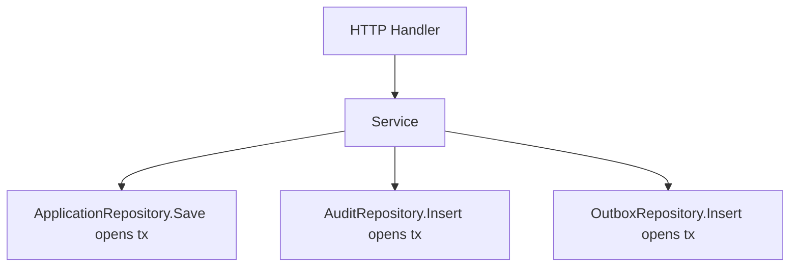
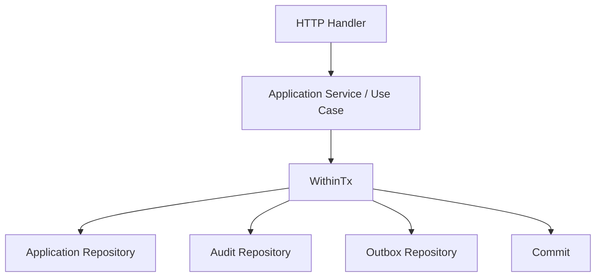
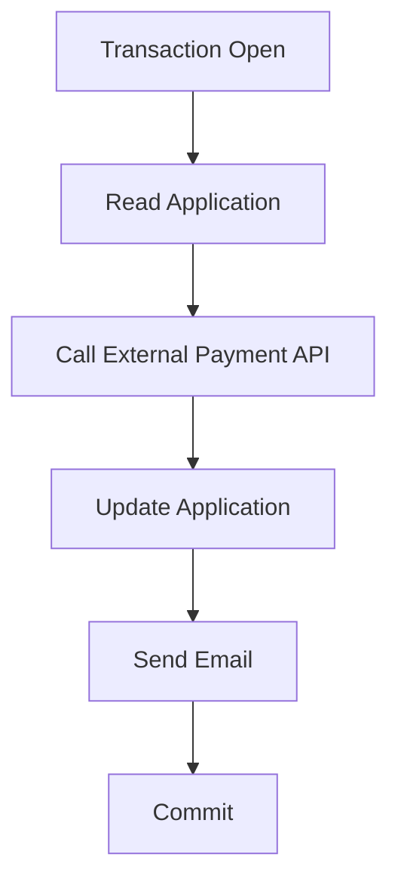
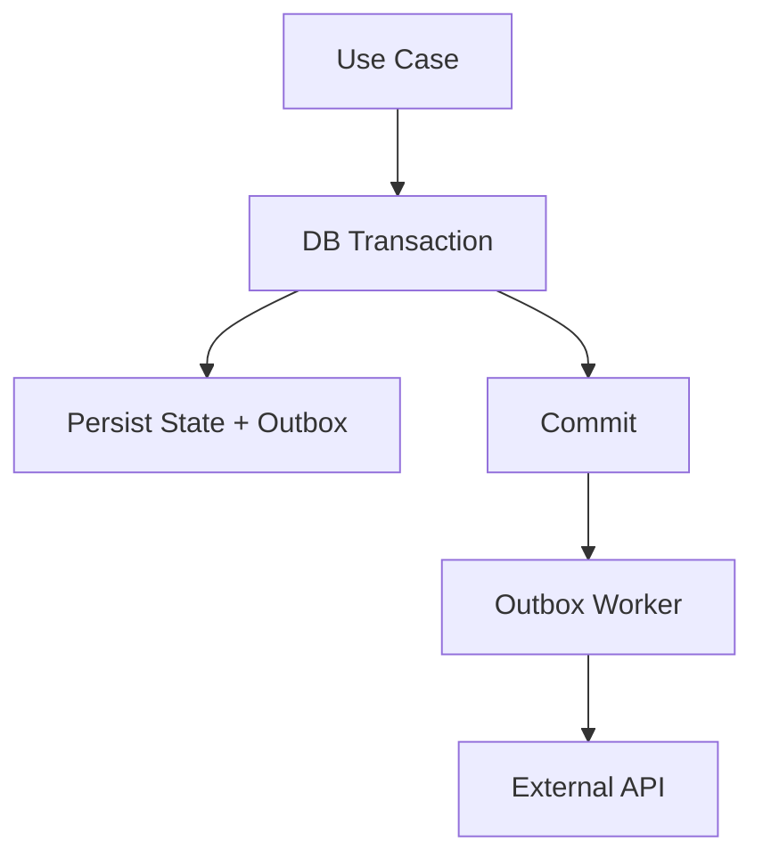
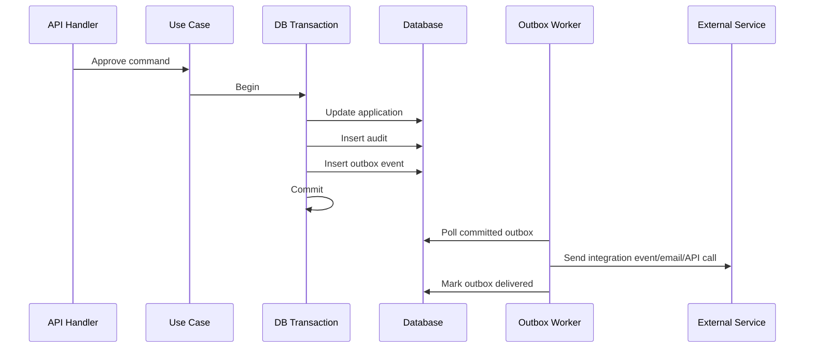
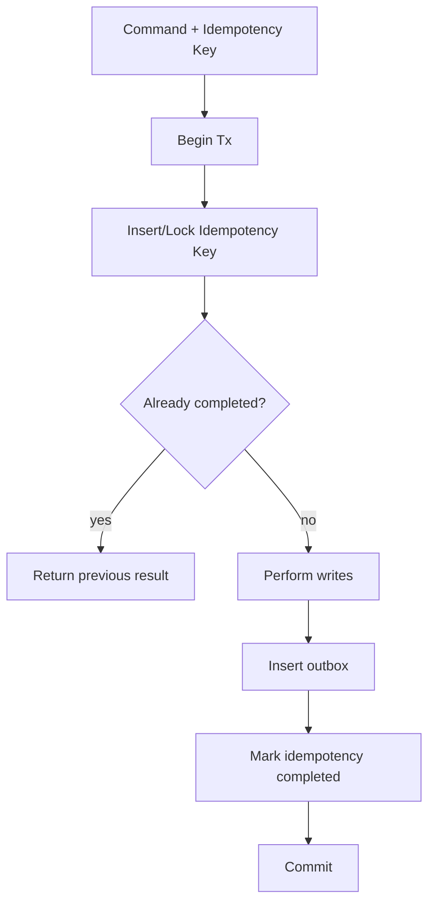
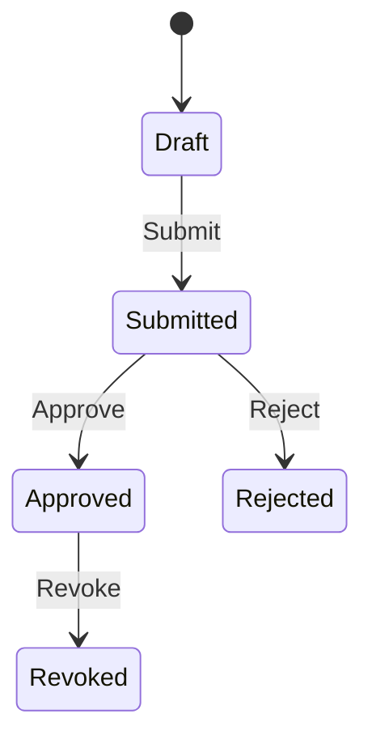

# learn-go-design-patterns-common-patterns-anti-patterns-part-012.md

# Part 012 — Unit of Work and Transaction Boundary Pattern

> Seri: **Go Design Patterns, Common Patterns, and Anti-Patterns**  
> Target pembaca: **Java software engineer yang ingin mendesain sistem Go production-grade**  
> Fokus part ini: **unit of work, transaction boundary, transaction ownership, retryability, idempotency, outbox, dan anti-pattern transaksi di Go**  
> Baseline Go: **Go 1.26.x**

---

## 0. Posisi Part Ini dalam Seri

Part sebelumnya membahas **Repository Pattern**: kapan repository berguna, kapan menjadi DAO palsu, bagaimana menjaga SQL semantics, dan bagaimana membedakan repository, query object, serta adapter persistence.

Part ini naik satu level ke pertanyaan yang lebih berbahaya:

> **Siapa yang memiliki transaksi?**

Dalam sistem kecil, transaksi sering dianggap hanya detail repository:

```go
func (r *UserRepository) Save(ctx context.Context, user User) error {
    tx, err := r.db.BeginTx(ctx, nil)
    if err != nil {
        return err
    }
    defer tx.Rollback()

    // insert user
    // insert audit
    // insert notification row

    return tx.Commit()
}
```

Kadang cukup. Tetapi dalam sistem production, transaksi jarang hanya menyentuh satu repository. Satu use case bisa melibatkan:

- validasi state saat ini,
- update aggregate,
- insert audit trail,
- insert outbox event,
- update counter,
- idempotency record,
- optimistic locking,
- authorization decision record,
- read-after-write,
- dan perubahan multi-table yang harus atomic.

Pada titik itu, transaksi bukan lagi detail repository. Transaksi adalah **application boundary decision**.

---

## 1. Tujuan Pembelajaran

Setelah menyelesaikan part ini, kamu diharapkan mampu:

1. Menjelaskan perbedaan **transaction**, **unit of work**, dan **business use case boundary**.
2. Mendesain transaction boundary yang eksplisit di Go tanpa DI container dan tanpa framework magic.
3. Menentukan kapan repository boleh membuka transaksi sendiri dan kapan tidak.
4. Membuat helper `WithinTx` / `RunInTx` yang aman, tidak menyembunyikan commit ownership, dan tidak menelan error.
5. Menggunakan `context.Context` dengan benar pada `BeginTx`, `ExecContext`, `QueryContext`, dan `Commit`.
6. Memahami failure mode `Commit`, `Rollback`, context cancellation, dan ambiguous outcome.
7. Mendesain retryable transaction dengan idempotency dan error classification.
8. Menghubungkan transaction boundary dengan outbox pattern, audit trail, state machine, dan command handler.
9. Menghindari anti-pattern: transaksi tersembunyi di repository, transaksi terlalu panjang, transaksi membungkus network call, nested transaction palsu, panic-based rollback, dan implicit transaction via context value.
10. Membuat checklist review untuk transaction boundary di codebase besar.

---

## 2. Mental Model: Transaction Bukan Sekadar `BEGIN` dan `COMMIT`

Dalam dokumentasi resmi Go, transaksi database direpresentasikan oleh `*sql.Tx`. Workflow dasarnya:

1. begin transaction,
2. lakukan operasi database,
3. commit jika semua berhasil,
4. rollback jika ada error.

Tetapi dalam desain software, itu baru level mekanik.

Mental model yang lebih tepat:

```text
Business intent
    ↓
Use case / command handler
    ↓
Consistency boundary
    ↓
Database transaction
    ↓
Persistent state transition
```

`BEGIN`/`COMMIT` hanyalah mekanisme untuk menjaga satu consistency boundary. Yang harus didesain adalah boundary-nya.

### 2.1 Transaction

Transaction adalah mekanisme database untuk membuat beberapa operasi menjadi satu perubahan atomic, consistent, isolated, dan durable sesuai kemampuan database dan isolation level yang dipakai.

Di Go, dalam `database/sql`, transaction biasanya direpresentasikan sebagai:

```go
tx, err := db.BeginTx(ctx, &sql.TxOptions{
    Isolation: sql.LevelReadCommitted,
    ReadOnly:  false,
})
```

Lalu operasi dilakukan lewat `tx.ExecContext`, `tx.QueryContext`, `tx.QueryRowContext`, bukan lagi langsung lewat `db`.

### 2.2 Unit of Work

Unit of Work adalah pola yang mengelompokkan perubahan yang harus dipersist bersama.

Dalam bahasa sederhana:

> Unit of Work adalah “satu paket perubahan state” yang harus berhasil atau gagal sebagai satu kesatuan.

Contoh:

```text
ApproveApplication(command)
    - pastikan application masih PendingReview
    - ubah status menjadi Approved
    - simpan approval decision
    - simpan audit trail
    - simpan outbox event ApplicationApproved
```

Semua itu harus atomic. Jika audit trail gagal, status tidak boleh berubah. Jika outbox gagal, status tidak boleh berubah karena sistem downstream tidak akan tahu.

### 2.3 Use Case Boundary

Use case boundary adalah batas intent bisnis.

Contoh use case:

- submit application,
- approve application,
- reject appeal,
- assign case officer,
- mark invoice paid,
- create order,
- reserve inventory,
- revoke access.

Dalam codebase Go yang sehat, transaction boundary sering berada di level use case/application service, bukan di HTTP handler dan bukan tersembunyi di repository.

---

## 3. Java Mindset vs Go Mindset

### 3.1 Java Mindset yang Sering Terbawa

Di Java/Spring, banyak engineer terbiasa dengan:

```java
@Transactional
public void approveApplication(ApproveCommand command) {
    applicationRepository.save(...);
    auditRepository.save(...);
    eventRepository.save(...);
}
```

Transaksi dideklarasikan sebagai annotation. Framework membuka, commit, rollback, dan kadang melakukan proxy interception.

Masalah ketika mindset ini dibawa mentah ke Go:

- mencari annotation yang tidak ada,
- membuat generic transaction manager terlalu cepat,
- menyembunyikan transaksi dalam context,
- menyembunyikan commit/rollback ownership,
- membuat repository membuka transaksi masing-masing,
- membuat service layer terlihat bersih tapi runtime behavior tidak eksplisit.

### 3.2 Go Mindset

Go lebih memilih:

- explicit dependency,
- explicit control flow,
- explicit error handling,
- explicit transaction scope,
- explicit lifecycle.

Bentuk umum Go:

```go
func (s *ApplicationService) Approve(ctx context.Context, cmd ApproveCommand) (ApproveResult, error) {
    return s.txRunner.WithinTx(ctx, sql.TxOptions{}, func(ctx context.Context, tx *sql.Tx) (ApproveResult, error) {
        app, err := s.apps.GetForUpdate(ctx, tx, cmd.ApplicationID)
        if err != nil {
            return ApproveResult{}, err
        }

        decision, err := app.Approve(cmd.OfficerID, cmd.Reason)
        if err != nil {
            return ApproveResult{}, err
        }

        if err := s.apps.Save(ctx, tx, app); err != nil {
            return ApproveResult{}, err
        }
        if err := s.audit.Insert(ctx, tx, decision.AuditRecord()); err != nil {
            return ApproveResult{}, err
        }
        if err := s.outbox.Insert(ctx, tx, decision.Event()); err != nil {
            return ApproveResult{}, err
        }

        return ApproveResult{ApplicationID: app.ID, Status: app.Status}, nil
    })
}
```

Ini lebih verbose daripada annotation, tetapi lebih jelas:

- transaksi dimulai di use case,
- semua repository menerima `tx`,
- commit hanya terjadi setelah callback sukses,
- rollback terjadi saat error,
- side effect eksternal tidak dilakukan di dalam transaksi,
- audit/outbox ikut atomic.

---

## 4. Transaction Boundary sebagai Desain, Bukan Detail Teknis

Pertanyaan desain utama:

> Operasi apa saja yang harus terlihat sebagai satu perubahan state yang konsisten?

Bukan:

> Di file mana saya harus memanggil `BeginTx`?

### 4.1 Boundary yang Terlalu Sempit



Masalah:

- status application bisa berubah tetapi audit gagal,
- audit bisa masuk tetapi outbox gagal,
- tidak ada atomicity antar repository,
- retry menjadi sulit,
- failure recovery menjadi manual.

### 4.2 Boundary yang Lebih Tepat



Satu use case memiliki satu transaction boundary.

### 4.3 Boundary yang Terlalu Lebar



Masalah:

- lock ditahan selama network call,
- external call tidak ikut rollback,
- timeout lebih mungkin,
- deadlock risk naik,
- retry bisa menghasilkan duplicate external side effect,
- commit failure meninggalkan outcome ambigu.

Boundary yang benar biasanya:



---

## 5. Core Pattern: Transaction Runner / Unit of Work Runner

Pattern paling praktis di Go adalah membuat runner kecil yang bertanggung jawab atas begin/commit/rollback.

### 5.1 Non-Generic Version

```go
package txutil

import (
    "context"
    "database/sql"
    "errors"
    "fmt"
)

type Runner struct {
    db *sql.DB
}

func NewRunner(db *sql.DB) *Runner {
    if db == nil {
        panic("txutil: nil db")
    }
    return &Runner{db: db}
}

func (r *Runner) WithinTx(
    ctx context.Context,
    opts *sql.TxOptions,
    fn func(ctx context.Context, tx *sql.Tx) error,
) error {
    tx, err := r.db.BeginTx(ctx, opts)
    if err != nil {
        return fmt.Errorf("begin tx: %w", err)
    }

    committed := false
    defer func() {
        if !committed {
            _ = tx.Rollback()
        }
    }()

    if err := fn(ctx, tx); err != nil {
        return err
    }

    if err := tx.Commit(); err != nil {
        return fmt.Errorf("commit tx: %w", err)
    }

    committed = true
    return nil
}
```

Kelebihan:

- sederhana,
- eksplisit,
- tidak memakai context sebagai hidden dependency,
- mudah dites,
- commit ownership jelas.

Kekurangan:

- caller harus mengatur passing `tx`,
- signature repository harus menerima executor/tx,
- callback tidak boleh menyimpan `tx` untuk dipakai setelah commit.

### 5.2 Generic Version untuk Result

Dengan generics, kita bisa mengembalikan result dari transaction callback.

```go
func WithinTx[T any](
    ctx context.Context,
    db *sql.DB,
    opts *sql.TxOptions,
    fn func(ctx context.Context, tx *sql.Tx) (T, error),
) (T, error) {
    var zero T

    tx, err := db.BeginTx(ctx, opts)
    if err != nil {
        return zero, fmt.Errorf("begin tx: %w", err)
    }

    committed := false
    defer func() {
        if !committed {
            _ = tx.Rollback()
        }
    }()

    result, err := fn(ctx, tx)
    if err != nil {
        return zero, err
    }

    if err := tx.Commit(); err != nil {
        return zero, fmt.Errorf("commit tx: %w", err)
    }

    committed = true
    return result, nil
}
```

Contoh penggunaan:

```go
result, err := txutil.WithinTx(ctx, s.db, nil, func(ctx context.Context, tx *sql.Tx) (ApproveResult, error) {
    app, err := s.apps.GetForUpdate(ctx, tx, cmd.ApplicationID)
    if err != nil {
        return ApproveResult{}, err
    }

    if err := app.Approve(cmd.OfficerID); err != nil {
        return ApproveResult{}, err
    }

    if err := s.apps.Save(ctx, tx, app); err != nil {
        return ApproveResult{}, err
    }

    return ApproveResult{ApplicationID: app.ID, Status: app.Status}, nil
})
```

### 5.3 Should `WithinTx` Recover Panic?

Biasanya, jangan menjadikan panic sebagai normal rollback mechanism.

Rollback saat panic bisa dilakukan sebagai safety net, tetapi jangan mengubah panic menjadi error diam-diam.

```go
defer func() {
    if p := recover(); p != nil {
        _ = tx.Rollback()
        panic(p)
    }
    if !committed {
        _ = tx.Rollback()
    }
}()
```

Prinsip:

- error bisnis → return error/result,
- validation failure → return domain error atau validation result,
- unexpected invariant violation → mungkin panic, tapi jarang,
- panic tidak boleh jadi mekanisme kontrol flow transaksi normal.

---

## 6. Repository Signature untuk Transaction Boundary

Ada beberapa bentuk umum.

### 6.1 Repository Menerima `*sql.Tx`

```go
type ApplicationRepository struct{}

func (r *ApplicationRepository) GetForUpdate(ctx context.Context, tx *sql.Tx, id ApplicationID) (Application, error) {
    row := tx.QueryRowContext(ctx, `
        SELECT id, status, version
        FROM applications
        WHERE id = ?
        FOR UPDATE
    `, id)

    var app Application
    if err := row.Scan(&app.ID, &app.Status, &app.Version); err != nil {
        return Application{}, err
    }
    return app, nil
}
```

Kelebihan:

- sangat eksplisit,
- tidak ambigu apakah operasi dalam transaksi,
- mudah direview.

Kekurangan:

- repository method tidak bisa dipakai di luar transaction kecuali dibuat method terpisah,
- caller harus membawa `tx` ke banyak method.

Cocok untuk operasi yang memang hanya valid dalam transaction.

### 6.2 Repository Menerima Interface Executor

```go
type Execer interface {
    ExecContext(ctx context.Context, query string, args ...any) (sql.Result, error)
}

type Queryer interface {
    QueryContext(ctx context.Context, query string, args ...any) (*sql.Rows, error)
    QueryRowContext(ctx context.Context, query string, args ...any) *sql.Row
}

type DBTX interface {
    Execer
    Queryer
}
```

Karena `*sql.DB` dan `*sql.Tx` sama-sama memiliki method tersebut, repository bisa menerima `DBTX`.

```go
func (r *ApplicationRepository) Save(ctx context.Context, q DBTX, app Application) error {
    _, err := q.ExecContext(ctx, `
        UPDATE applications
        SET status = ?, version = version + 1
        WHERE id = ? AND version = ?
    `, app.Status, app.ID, app.Version)
    return err
}
```

Kelebihan:

- fleksibel,
- method bisa dipakai dengan `*sql.DB` atau `*sql.Tx`,
- bagus untuk repository kecil.

Risiko:

- caller bisa tidak sengaja memakai `db` padahal harus transactional,
- semantics method menjadi kurang jelas,
- `FOR UPDATE` tanpa transaction bisa salah secara semantik di beberapa database/driver.

Gunakan dengan disiplin naming:

```go
func (r *ApplicationRepository) Save(ctx context.Context, tx *sql.Tx, app Application) error
func (r *ApplicationRepository) Find(ctx context.Context, q DBTX, id ApplicationID) (Application, error)
```

### 6.3 Repository Memiliki Method Transactional dan Non-Transactional

```go
func (r *ApplicationRepository) Find(ctx context.Context, id ApplicationID) (Application, error) {
    return r.find(ctx, r.db, id)
}

func (r *ApplicationRepository) FindTx(ctx context.Context, tx *sql.Tx, id ApplicationID) (Application, error) {
    return r.find(ctx, tx, id)
}

func (r *ApplicationRepository) find(ctx context.Context, q DBTX, id ApplicationID) (Application, error) {
    // shared implementation
}
```

Ini eksplisit, tetapi bisa memperbanyak method.

### 6.4 Repository Membuka Transaksi Sendiri

Ini boleh jika operasi benar-benar self-contained.

Contoh valid:

```go
func (r *SessionRepository) DeleteExpired(ctx context.Context, limit int) (int64, error) {
    // batch cleanup internal repository
}
```

Contoh berbahaya:

```go
func (r *ApplicationRepository) Approve(ctx context.Context, appID string) error {
    // opens tx internally
}
```

Karena approval biasanya bukan hanya update satu tabel. Ada audit, outbox, authorization, idempotency, state transition.

Rule of thumb:

> Jika operasi adalah use case bisnis, transaksi dimiliki use case.  
> Jika operasi adalah maintenance internal persistence yang atomic sendiri, repository boleh membuka transaksi.

---

## 7. Context dan Transaction

Dalam `database/sql`, `BeginTx(ctx, opts)` memakai context sampai transaksi selesai. Jika context dibatalkan, package dapat melakukan rollback; `Commit` dapat mengembalikan error jika context yang dipakai untuk `BeginTx` dibatalkan.

Artinya:

- context deadline harus cukup untuk seluruh transaksi,
- jangan membuat transaksi lalu memakai `context.Background()` di dalam repository,
- jangan mengabaikan `ctx` di `ExecContext`/`QueryContext`,
- commit error harus dianggap serius.

### 7.1 Correct Shape

```go
func (s *Service) Do(ctx context.Context, cmd Command) error {
    ctx, cancel := context.WithTimeout(ctx, 2*time.Second)
    defer cancel()

    return s.tx.WithinTx(ctx, nil, func(ctx context.Context, tx *sql.Tx) error {
        if err := s.repo.Update(ctx, tx, cmd.ID); err != nil {
            return err
        }
        return nil
    })
}
```

### 7.2 Wrong Shape: Background Context Inside Repository

```go
func (r *Repository) Save(ctx context.Context, tx *sql.Tx, item Item) error {
    _, err := tx.ExecContext(context.Background(), `UPDATE ...`, item.ID)
    return err
}
```

Masalah:

- request cancellation hilang,
- timeout tidak dihormati,
- shutdown bisa tertahan,
- observability trace bisa putus.

### 7.3 Context Is Not a Transaction Bag

Anti-pattern:

```go
ctx = context.WithValue(ctx, txKey{}, tx)
```

Lalu repository mengambil transaction dari context.

```go
func (r *Repository) Save(ctx context.Context, item Item) error {
    tx := ctx.Value(txKey{}).(*sql.Tx)
    // ...
}
```

Masalah:

- dependency tersembunyi,
- compile-time contract hilang,
- sulit direview,
- method tampak bisa dipakai di mana saja padahal membutuhkan transaction,
- test lebih rapuh,
- nested transaction semakin ambigu.

Context boleh membawa request-scoped metadata seperti correlation ID, auth principal, trace context. Jangan pakai context sebagai service locator atau transaction carrier.

---

## 8. Commit Failure dan Ambiguous Outcome

Banyak engineer memperlakukan commit seperti operasi sederhana:

```go
return tx.Commit()
```

Tetapi commit failure penting.

Kemungkinan:

1. Commit gagal sebelum database menerapkan perubahan.
2. Commit berhasil di database, tetapi client kehilangan response karena network error.
3. Context canceled saat commit.
4. Database connection putus pada fase commit.
5. Constraint/deadlock/serialization failure muncul saat commit.

Dari sudut pandang aplikasi, beberapa error commit bisa menghasilkan **ambiguous outcome**.

### 8.1 Model Error Commit

```go
if err := tx.Commit(); err != nil {
    return fmt.Errorf("commit approve application tx: %w", err)
}
```

Minimal, commit error harus:

- di-wrap dengan operation context,
- di-log oleh boundary atas,
- diberi classification bila perlu,
- dipertimbangkan dalam retry strategy,
- tidak dianggap sama dengan callback validation error.

### 8.2 Jangan Return Result yang Mengasumsikan Commit Berhasil

Salah:

```go
result := ApproveResult{ApplicationID: app.ID, Status: Approved}
if err := tx.Commit(); err != nil {
    return result, err
}
return result, nil
```

Lebih aman:

```go
if err := tx.Commit(); err != nil {
    return ApproveResult{}, fmt.Errorf("commit approve transaction: %w", err)
}
return result, nil
```

Jika API ingin mengembalikan ambiguous result, buat eksplisit:

```go
type CommitOutcome string

const (
    CommitSucceeded CommitOutcome = "succeeded"
    CommitFailed    CommitOutcome = "failed"
    CommitAmbiguous CommitOutcome = "ambiguous"
)
```

Tetapi ini advanced dan biasanya hanya dibutuhkan pada sistem dengan requirement sangat ketat.

---

## 9. Rollback Semantics

Rollback biasanya dipanggil di `defer`. Jika commit berhasil, rollback akan gagal dengan error seperti transaction already committed. Itu sering diabaikan.

Pattern umum:

```go
tx, err := db.BeginTx(ctx, nil)
if err != nil {
    return err
}
defer tx.Rollback()

if err := doWork(ctx, tx); err != nil {
    return err
}

return tx.Commit()
```

Pattern ini sederhana, tetapi memiliki satu kelemahan: rollback tetap dipanggil setelah commit. Secara praktik sering diterima, tetapi untuk clarity production, banyak tim memilih flag `committed`.

```go
committed := false
defer func() {
    if !committed {
        _ = tx.Rollback()
    }
}()

if err := doWork(ctx, tx); err != nil {
    return err
}

if err := tx.Commit(); err != nil {
    return err
}
committed = true
return nil
```

Rollback error saat callback error biasanya secondary. Namun dalam beberapa sistem, rollback error perlu dicatat sebagai log karena bisa menandakan connection issue.

```go
if rollbackErr := tx.Rollback(); rollbackErr != nil && !errors.Is(rollbackErr, sql.ErrTxDone) {
    logger.Warn("rollback failed", "error", rollbackErr)
}
```

Jangan mengganti original business error dengan rollback error kecuali ada alasan kuat.

---

## 10. Nested Transaction Problem

Go `database/sql` tidak memberikan nested transaction abstraction. Database tertentu mendukung savepoint, tetapi itu bukan nested transaction penuh.

Anti-pattern:

```go
func (s *ServiceA) Do(ctx context.Context) error {
    return s.tx.WithinTx(ctx, nil, func(ctx context.Context, tx *sql.Tx) error {
        return s.serviceB.Do(ctx) // serviceB opens another tx
    })
}
```

Masalah:

- serviceB mungkin membuka transaksi berbeda,
- atomicity antar operasi tidak sesuai ekspektasi,
- deadlock risk meningkat,
- transaction ownership tidak jelas.

### 10.1 Better: Inner Logic Accepts Transaction-Aware Dependency

```go
func (s *ServiceA) Do(ctx context.Context) error {
    return s.tx.WithinTx(ctx, nil, func(ctx context.Context, tx *sql.Tx) error {
        if err := s.partA(ctx, tx); err != nil {
            return err
        }
        if err := s.partB(ctx, tx); err != nil {
            return err
        }
        return nil
    })
}
```

### 10.2 Savepoint Pattern

Savepoint bisa dipakai untuk partial rollback, tetapi jangan jadikan default abstraction.

```go
_, err := tx.ExecContext(ctx, "SAVEPOINT before_optional_step")
if err != nil {
    return err
}

if err := optionalStep(ctx, tx); err != nil {
    _, rbErr := tx.ExecContext(ctx, "ROLLBACK TO SAVEPOINT before_optional_step")
    if rbErr != nil {
        return fmt.Errorf("optional step failed: %v; rollback savepoint failed: %w", err, rbErr)
    }
}
```

Gunakan savepoint hanya jika:

- database mendukungnya,
- semantic partial rollback jelas,
- tim memahami konsekuensinya,
- test integration tersedia.

---

## 11. Transaction dan External Side Effect

Rule keras:

> Jangan melakukan network call irreversible di dalam database transaction kecuali kamu sangat sadar konsekuensinya.

Contoh buruk:

```go
return s.tx.WithinTx(ctx, nil, func(ctx context.Context, tx *sql.Tx) error {
    if err := s.orders.MarkPaid(ctx, tx, orderID); err != nil {
        return err
    }

    // Bad: external side effect inside tx.
    if err := s.email.SendReceipt(ctx, customerEmail); err != nil {
        return err
    }

    return nil
})
```

Masalah:

- jika email terkirim lalu commit gagal, state DB tidak paid tetapi customer menerima email,
- jika email lambat, lock DB ditahan,
- retry bisa mengirim email berkali-kali,
- external service outage membuat transaksi DB gagal.

### 11.1 Better: Outbox

```go
return s.tx.WithinTx(ctx, nil, func(ctx context.Context, tx *sql.Tx) error {
    if err := s.orders.MarkPaid(ctx, tx, orderID); err != nil {
        return err
    }
    return s.outbox.Insert(ctx, tx, OutboxMessage{
        Type: "receipt.email.requested",
        Key:  orderID.String(),
        Body: payload,
    })
})
```

Lalu worker mengirim email setelah commit.



Outbox bukan sekadar messaging pattern. Ia adalah transaction boundary pattern untuk memisahkan database consistency dari external side effect.

---

## 12. Retryable Transaction Pattern

Tidak semua transaction error boleh di-retry.

Retry aman jika:

- operasi idempotent atau memiliki idempotency key,
- error diklasifikasikan retryable,
- retry memiliki bounded attempts,
- retry memakai backoff/jitter,
- context deadline masih cukup,
- tidak ada external irreversible side effect dalam transaksi.

### 12.1 Error Classification

```go
type Retryable interface {
    Retryable() bool
}

func IsRetryable(err error) bool {
    var r Retryable
    if errors.As(err, &r) {
        return r.Retryable()
    }
    return false
}
```

Pada production, classification sering bergantung database driver:

- serialization failure,
- deadlock detected,
- lock timeout,
- connection transient error.

Jangan melakukan retry berdasarkan string error tanpa wrapper/classifier yang terisolasi di adapter.

### 12.2 Retry Runner

```go
func RetryTx[T any](
    ctx context.Context,
    attempts int,
    run func(ctx context.Context) (T, error),
    isRetryable func(error) bool,
    sleep func(context.Context, time.Duration) error,
) (T, error) {
    var zero T
    var last error

    for i := 0; i < attempts; i++ {
        result, err := run(ctx)
        if err == nil {
            return result, nil
        }

        last = err
        if !isRetryable(err) || i == attempts-1 {
            return zero, err
        }

        delay := time.Duration(50*(i+1)) * time.Millisecond
        if err := sleep(ctx, delay); err != nil {
            return zero, fmt.Errorf("retry wait: %w; last tx error: %v", err, last)
        }
    }

    return zero, last
}
```

### 12.3 Idempotency Record

Untuk command dari external client, gunakan idempotency key.

```text
idempotency_keys
    key
    command_hash
    status
    result_reference
    created_at
    completed_at
```

Flow:



Idempotency bukan hanya untuk HTTP POST. Ia juga berguna untuk message consumer, scheduled job, dan retryable command.

---

## 13. Isolation Level sebagai Desain

`sql.TxOptions` memiliki `Isolation` dan `ReadOnly`.

```go
opts := &sql.TxOptions{
    Isolation: sql.LevelSerializable,
    ReadOnly:  false,
}
```

Jangan memilih isolation level sebagai dekorasi. Pilih berdasarkan anomaly yang ingin dicegah.

### 13.1 Common Anomalies

| Anomaly | Deskripsi | Contoh |
|---|---|---|
| Dirty read | membaca data uncommitted | jarang di default DB modern |
| Non-repeatable read | row yang sama berubah saat transaction masih berjalan | approval membaca status berubah |
| Phantom read | query range berubah karena insert/update transaksi lain | kuota/count berubah |
| Lost update | dua transaksi update state yang sama dan salah satu menimpa | version counter hilang |
| Write skew | dua transaksi membaca kondisi yang sama lalu menulis row berbeda | rule kapasitas/eligibility rusak |

### 13.2 Pattern: Optimistic Locking

```sql
UPDATE applications
SET status = ?, version = version + 1
WHERE id = ? AND version = ?
```

Jika affected rows = 0, berarti conflict.

```go
res, err := tx.ExecContext(ctx, query, newStatus, id, expectedVersion)
if err != nil {
    return err
}
rows, err := res.RowsAffected()
if err != nil {
    return err
}
if rows == 0 {
    return ErrConcurrentModification
}
```

### 13.3 Pattern: Pessimistic Locking

```sql
SELECT id, status, version
FROM applications
WHERE id = ?
FOR UPDATE
```

Cocok jika:

- conflict tinggi,
- state transition harus serial,
- retry optimistic terlalu mahal,
- business invariant kritikal.

Risiko:

- deadlock,
- lock wait timeout,
- throughput turun,
- transaction harus pendek.

---

## 14. Read-Only Transaction Pattern

Read-only transaction berguna untuk:

- consistent snapshot read,
- multi-query report kecil,
- preventing accidental writes jika database mendukung enforcement,
- routing ke replica jika infrastructure mendukung.

```go
result, err := txutil.WithinTx(ctx, db, &sql.TxOptions{
    ReadOnly: true,
}, func(ctx context.Context, tx *sql.Tx) (Report, error) {
    a, err := repo.LoadPartA(ctx, tx, id)
    if err != nil {
        return Report{}, err
    }
    b, err := repo.LoadPartB(ctx, tx, id)
    if err != nil {
        return Report{}, err
    }
    return BuildReport(a, b), nil
})
```

Jangan gunakan read-only transaction untuk long analytical report besar di OLTP database tanpa memahami lock/MVCC/resource impact.

---

## 15. Transaction Boundary dan State Machine

Untuk workflow berbasis state, transaction boundary biasanya mengelilingi satu transition.



Transition command:

```go
func (s *ApplicationService) Approve(ctx context.Context, cmd ApproveCommand) (ApproveResult, error) {
    return txutil.WithinTx(ctx, s.db, nil, func(ctx context.Context, tx *sql.Tx) (ApproveResult, error) {
        app, err := s.apps.GetForUpdate(ctx, tx, cmd.ApplicationID)
        if err != nil {
            return ApproveResult{}, err
        }

        decision, err := app.Approve(cmd.OfficerID, cmd.Reason)
        if err != nil {
            return ApproveResult{}, err
        }

        if err := s.apps.Save(ctx, tx, app); err != nil {
            return ApproveResult{}, err
        }
        if err := s.audit.Insert(ctx, tx, decision.AuditRecord()); err != nil {
            return ApproveResult{}, err
        }
        if err := s.outbox.Insert(ctx, tx, decision.Event()); err != nil {
            return ApproveResult{}, err
        }

        return ApproveResult{ApplicationID: app.ID, Status: app.Status}, nil
    })
}
```

Invariants:

- state dibaca dan dikunci,
- transition divalidasi sebelum mutation persistent,
- audit record dibuat dalam transaksi yang sama,
- event dibuat sebagai outbox dalam transaksi yang sama,
- external publishing terjadi setelah commit.

---

## 16. Transaction Boundary dan Authorization

Authorization sering terjadi sebelum transaksi, tetapi tidak selalu cukup.

### 16.1 Pre-Transaction Authorization

Cocok untuk policy yang tidak bergantung pada state terkunci:

```go
if !principal.Can("application.approve") {
    return ErrForbidden
}
```

### 16.2 In-Transaction Authorization / Guard

Cocok untuk policy yang bergantung pada current state:

- officer hanya boleh approve application assigned ke dirinya,
- case hanya boleh dipindahkan jika status masih open,
- approval limit bergantung pada amount terkini,
- user role bisa berubah sebelum command diproses.

```go
app, err := s.apps.GetForUpdate(ctx, tx, cmd.ApplicationID)
if err != nil {
    return err
}

if err := s.policy.CanApprove(principal, app); err != nil {
    return err
}
```

Untuk sistem regulated, simpan decision record/audit trail di transaksi yang sama.

---

## 17. Transaction Boundary dan Observability

Transaction boundary adalah tempat bagus untuk observability.

Yang perlu diamati:

- transaction duration,
- commit duration,
- rollback count,
- rollback reason category,
- retry count,
- deadlock/serialization failure count,
- lock wait timeout,
- rows affected mismatch,
- idempotency duplicate hit,
- outbox insert failure,
- ambiguous commit error.

Contoh metric naming:

```text
db_transaction_duration_seconds{use_case="approve_application", outcome="committed"}
db_transaction_total{use_case="approve_application", outcome="rolled_back"}
db_transaction_retry_total{use_case="approve_application", reason="serialization_failure"}
```

Jangan gunakan label dengan cardinality tinggi seperti `application_id`, `user_id`, atau raw SQL.

Structured log boundary:

```go
logger.InfoContext(ctx, "transaction committed",
    "use_case", "approve_application",
    "duration_ms", duration.Milliseconds(),
)
```

Audit trail bukan debug log. Audit trail harus domain-meaningful.

---

## 18. Testing Strategy

### 18.1 Unit Test Domain tanpa DB

Domain transition harus bisa dites tanpa database.

```go
func TestApplicationApprove(t *testing.T) {
    app := Application{Status: StatusSubmitted}

    decision, err := app.Approve(OfficerID("u1"), "valid")
    if err != nil {
        t.Fatal(err)
    }

    if app.Status != StatusApproved {
        t.Fatalf("status = %s", app.Status)
    }
    if decision.Event().Type != "application.approved" {
        t.Fatalf("unexpected event")
    }
}
```

### 18.2 Unit Test Use Case dengan Fake Transaction Runner

Buat interface kecil untuk runner.

```go
type TxRunner interface {
    WithinTx(ctx context.Context, opts *sql.TxOptions, fn func(context.Context, *sql.Tx) error) error
}
```

Namun jika fake butuh `*sql.Tx`, unit test jadi sulit. Alternatif: definisikan executor interface sendiri.

```go
type UnitOfWork interface {
    Applications() ApplicationStore
    Audit() AuditStore
    Outbox() OutboxStore
}

type UnitOfWorkRunner interface {
    WithinUnitOfWork(ctx context.Context, fn func(ctx context.Context, uow UnitOfWork) error) error
}
```

Ini lebih abstrak, tetapi jangan dibuat terlalu dini. Gunakan jika testability dan DB abstraction memang bernilai.

### 18.3 Integration Test Transaction Boundary

Integration test penting untuk:

- commit benar-benar menyimpan semua perubahan,
- rollback benar-benar membatalkan semua perubahan,
- constraint bekerja,
- optimistic lock conflict terdeteksi,
- `FOR UPDATE` behavior sesuai DB,
- isolation behavior sesuai requirement,
- outbox inserted atomically.

Contoh skenario:

```text
Given application status Submitted
When Approve succeeds
Then application status Approved
And audit row exists
And outbox row exists
```

Rollback case:

```text
Given audit repository forced to fail
When Approve is called
Then application status remains Submitted
And no outbox row exists
```

### 18.4 Test with Real Database When Semantics Matter

Mock SQL bisa berguna untuk memastikan query terpanggil, tetapi tidak membuktikan:

- locking,
- isolation,
- constraint,
- transaction rollback,
- trigger behavior,
- driver-specific error code,
- deadlock behavior.

Untuk transaction boundary, integration test dengan database nyata sering lebih bernilai daripada mock berlebihan.

---

## 19. Anti-Pattern Catalog

### 19.1 Transaction Hidden Inside Repository

Gejala:

```go
func (r *Repo) Save(ctx context.Context, x X) error {
    tx, _ := r.db.BeginTx(ctx, nil)
    // ...
}
```

Masalah:

- tidak bisa compose multi-repository atomic operation,
- commit ownership tersembunyi,
- caller salah mengira operasi lebih luas atomic.

Refactor:

- pindahkan transaction ke service/use case,
- repository menerima `tx` atau executor,
- grouping operation dibuat eksplisit.

### 19.2 Transaction in HTTP Handler

Gejala:

```go
func (h *Handler) ServeHTTP(w http.ResponseWriter, r *http.Request) {
    tx, _ := h.db.BeginTx(r.Context(), nil)
    // business logic here
}
```

Masalah:

- handler menjadi application service,
- transport concern bercampur domain,
- testing sulit,
- transaction boundary mengikuti HTTP, bukan use case.

Refactor:

- handler decode/encode saja,
- use case mengelola transaction.

### 19.3 Transaction Across Network Call

Gejala:

```go
WithinTx(func(tx *sql.Tx) error {
    repo.Update(tx)
    external.Call()
    repo.MarkDone(tx)
    return nil
})
```

Masalah:

- lock lama,
- side effect tidak rollback,
- retry berbahaya.

Refactor:

- persist state + outbox,
- external call di worker setelah commit.

### 19.4 Nested Transaction by Accident

Gejala:

```go
ServiceA opens tx -> ServiceB opens tx
```

Masalah:

- atomicity palsu,
- deadlock risk,
- commit ownership ambigu.

Refactor:

- transaction boundary satu di outer use case,
- inner method menerima tx/uow.

### 19.5 Passing Tx Through Context

Gejala:

```go
ctx = context.WithValue(ctx, txKey, tx)
```

Masalah:

- hidden dependency,
- compile-time contract hilang,
- mudah misuse.

Refactor:

- explicit parameter,
- unit of work object,
- repository executor interface.

### 19.6 Panic-Based Rollback

Gejala:

```go
panic(rollbackSignal)
```

Masalah:

- control flow tidak idiomatis,
- observability buruk,
- defer/recover kompleks,
- test sulit.

Refactor:

- return error/result,
- recover hanya safety net.

### 19.7 Ignoring RowsAffected

Gejala:

```go
_, err := tx.ExecContext(ctx, updateQuery, args...)
return err
```

Padahal query adalah optimistic update.

Masalah:

- lost update tidak terdeteksi,
- state machine bisa melompati guard.

Refactor:

- cek `RowsAffected`,
- return `ErrConcurrentModification` atau `ErrInvalidState`.

### 19.8 Commit Error Flattened

Gejala:

```go
if err := tx.Commit(); err != nil {
    return err
}
```

Masalah:

- caller tidak tahu error terjadi saat commit,
- retry classification sulit,
- incident analysis sulit.

Refactor:

```go
return fmt.Errorf("commit approve application transaction: %w", err)
```

### 19.9 Long Transaction for Batch Job

Gejala:

```go
WithinTx(func(tx *sql.Tx) error {
    for _, item := range millionRows {
        process(tx, item)
    }
    return nil
})
```

Masalah:

- lock lama,
- undo/redo pressure,
- replication lag,
- timeout,
- rollback mahal.

Refactor:

- chunked transaction,
- checkpoint,
- idempotent batch processing,
- lease-based job.

### 19.10 Transaction Without Idempotency in Retry Path

Gejala:

```go
for retry {
    createOrder()
}
```

Masalah:

- duplicate order,
- duplicate event,
- duplicate charge.

Refactor:

- idempotency key,
- unique constraint,
- outbox dedup key,
- command hash.

---

## 20. Refactoring Playbook

### Step 1 — Identify Use Case Boundary

Cari method yang mewakili intent:

- `ApproveApplication`,
- `SubmitOrder`,
- `AssignCase`,
- `CloseTicket`,
- `CreateInvoice`.

Jangan mulai dari repository.

### Step 2 — List Persistent Changes

Untuk satu use case, tulis semua perubahan:

```text
ApproveApplication:
- read application for update
- update application status/version
- insert approval decision
- insert audit trail
- insert outbox event
- mark idempotency completed
```

### Step 3 — Decide Atomic Set

Tentukan mana yang harus commit bersama.

Biasanya:

- main state,
- audit,
- outbox,
- idempotency,
- state transition record,

harus satu transaksi.

External API/email/message publish tidak masuk transaksi DB.

### Step 4 — Move BeginTx Upward

Jika repository membuka transaksi sendiri, pindahkan ke use case.

Before:

```go
repo.Approve(ctx, id)
audit.Insert(ctx, audit)
outbox.Insert(ctx, event)
```

After:

```go
WithinTx(ctx, func(ctx context.Context, tx *sql.Tx) error {
    repo.Approve(ctx, tx, id)
    audit.Insert(ctx, tx, audit)
    outbox.Insert(ctx, tx, event)
    return nil
})
```

### Step 5 — Make Repository Tx-Aware

Pilih salah satu:

- explicit `*sql.Tx`,
- `DBTX` executor interface,
- UnitOfWork object.

### Step 6 — Classify Errors

Pisahkan:

- validation/business error,
- not found,
- conflict/concurrent modification,
- constraint violation,
- transient/retryable,
- commit error,
- context cancellation.

### Step 7 — Add Tests

Minimal:

- success commits all,
- failure rolls back all,
- conflict detected,
- duplicate idempotency handled,
- outbox inserted atomically,
- context cancellation returns error.

### Step 8 — Add Observability

Tambahkan metric/log pada use case transaction boundary.

---

## 21. Production Example: Case Assignment

Kita desain use case:

> Assign case to officer.

Requirement:

- case harus `Open`,
- officer harus eligible,
- case assignment berubah,
- audit trail harus tercatat,
- event `case.assigned` harus dikirim setelah commit,
- command harus idempotent,
- concurrent assignment harus dicegah.

### 21.1 Domain Types

```go
type CaseStatus string

const (
    CaseOpen   CaseStatus = "open"
    CaseClosed CaseStatus = "closed"
)

type Case struct {
    ID             string
    Status         CaseStatus
    AssignedTo     string
    Version        int64
}

func (c *Case) AssignTo(officerID string) (CaseAssignedDecision, error) {
    if c.Status != CaseOpen {
        return CaseAssignedDecision{}, ErrInvalidCaseState
    }
    if officerID == "" {
        return CaseAssignedDecision{}, ErrInvalidOfficer
    }

    previous := c.AssignedTo
    c.AssignedTo = officerID

    return CaseAssignedDecision{
        CaseID:     c.ID,
        Previous:   previous,
        AssignedTo: officerID,
    }, nil
}
```

### 21.2 Use Case

```go
type CaseService struct {
    db          *sql.DB
    cases       *CaseRepository
    officers    *OfficerRepository
    audit       *AuditRepository
    outbox      *OutboxRepository
    idempotency *IdempotencyRepository
}

func (s *CaseService) Assign(ctx context.Context, cmd AssignCaseCommand) (AssignCaseResult, error) {
    return txutil.WithinTx(ctx, s.db, nil, func(ctx context.Context, tx *sql.Tx) (AssignCaseResult, error) {
        existing, err := s.idempotency.FindCompleted(ctx, tx, cmd.IdempotencyKey, cmd.Hash())
        if err != nil {
            return AssignCaseResult{}, err
        }
        if existing.Found {
            return AssignCaseResult{CaseID: existing.CaseID, AssignedTo: existing.AssignedTo}, nil
        }

        if err := s.idempotency.LockOrCreate(ctx, tx, cmd.IdempotencyKey, cmd.Hash()); err != nil {
            return AssignCaseResult{}, err
        }

        c, err := s.cases.GetForUpdate(ctx, tx, cmd.CaseID)
        if err != nil {
            return AssignCaseResult{}, err
        }

        eligible, err := s.officers.IsEligible(ctx, tx, cmd.OfficerID)
        if err != nil {
            return AssignCaseResult{}, err
        }
        if !eligible {
            return AssignCaseResult{}, ErrOfficerNotEligible
        }

        decision, err := c.AssignTo(cmd.OfficerID)
        if err != nil {
            return AssignCaseResult{}, err
        }

        if err := s.cases.Save(ctx, tx, c); err != nil {
            return AssignCaseResult{}, err
        }
        if err := s.audit.Insert(ctx, tx, decision.AuditRecord(cmd.ActorID)); err != nil {
            return AssignCaseResult{}, err
        }
        if err := s.outbox.Insert(ctx, tx, decision.Event()); err != nil {
            return AssignCaseResult{}, err
        }
        if err := s.idempotency.MarkCompleted(ctx, tx, cmd.IdempotencyKey, c.ID, c.AssignedTo); err != nil {
            return AssignCaseResult{}, err
        }

        return AssignCaseResult{CaseID: c.ID, AssignedTo: c.AssignedTo}, nil
    })
}
```

### 21.3 Why This Shape Works

- transaction boundary berada di use case,
- repository tidak menyembunyikan commit,
- case row dikunci sebelum transition,
- officer eligibility dicek dalam boundary yang sama,
- audit dan outbox atomic dengan state change,
- idempotency mencegah duplicate result,
- external publish terjadi setelah commit via outbox worker,
- result dikembalikan hanya setelah commit berhasil.

---

## 22. Design Checklist

Gunakan checklist ini saat review PR.

### Boundary

- [ ] Transaction dimulai di use case/application boundary, bukan sembarang repository.
- [ ] Semua write yang harus atomic berada dalam satu transaction.
- [ ] Tidak ada external irreversible side effect di dalam transaction.
- [ ] Transaction tidak lebih lebar dari consistency boundary.
- [ ] Transaction tidak terlalu sempit hingga atomicity bisnis hilang.

### Ownership

- [ ] Commit hanya dilakukan oleh owner transaction.
- [ ] Repository tidak commit/rollback transaction yang tidak ia buat.
- [ ] `tx` tidak disimpan dalam struct untuk dipakai setelah callback.
- [ ] `tx` tidak disembunyikan dalam context.

### Context

- [ ] `BeginTx` memakai context caller.
- [ ] Query/exec memakai `ExecContext`/`QueryContext`.
- [ ] Repository tidak membuat `context.Background()` untuk DB operation.
- [ ] Deadline cukup realistis untuk transaction.

### Error

- [ ] Callback error, begin error, commit error, dan rollback issue dibedakan secara cukup.
- [ ] Commit error di-wrap dengan operation context.
- [ ] RowsAffected dicek untuk optimistic update.
- [ ] Retry hanya untuk error yang diklasifikasikan retryable.

### Consistency

- [ ] Idempotency ada untuk command yang bisa diulang.
- [ ] Outbox digunakan untuk external publish.
- [ ] Audit trail ikut transaksi jika regulatory traceability diperlukan.
- [ ] State transition guard dilakukan sebelum mutation persistent.

### Testing

- [ ] Ada test success commit.
- [ ] Ada test rollback saat salah satu write gagal.
- [ ] Ada test conflict/concurrent modification.
- [ ] Ada integration test untuk isolation/locking jika penting.

---

## 23. Exercises

### Exercise 1 — Identify Transaction Boundary

Diberikan flow:

```text
CreateUser:
- insert users
- insert user_profiles
- call identity provider API
- insert audit
- publish user.created
- send welcome email
```

Tentukan:

1. Apa yang masuk DB transaction?
2. Apa yang harus menjadi outbox?
3. Apa yang tidak boleh dilakukan dalam transaction?
4. Apa idempotency key yang masuk akal?

### Exercise 2 — Refactor Hidden Repository Transaction

Before:

```go
func (r *OrderRepository) MarkPaid(ctx context.Context, orderID string) error {
    tx, err := r.db.BeginTx(ctx, nil)
    if err != nil {
        return err
    }
    defer tx.Rollback()

    if _, err := tx.ExecContext(ctx, `UPDATE orders SET status='paid' WHERE id=?`, orderID); err != nil {
        return err
    }
    return tx.Commit()
}
```

Refactor agar use case bisa menyimpan audit dan outbox dalam transaksi yang sama.

### Exercise 3 — Design Retry Policy

Untuk use case `ReserveInventory`, tentukan:

- error apa yang retryable,
- error apa yang tidak retryable,
- bagaimana mencegah duplicate reservation,
- berapa retry attempt yang masuk akal,
- apa metric yang perlu dicatat.

### Exercise 4 — Write Review Comment

Buat review comment untuk PR yang melakukan HTTP call ke payment provider di dalam transaction.

---

## 24. Ringkasan

Transaction boundary di Go bukan sekadar memanggil `BeginTx` dan `Commit`. Ia adalah keputusan desain yang menentukan consistency, failure behavior, retryability, auditability, dan operational safety.

Prinsip utama:

1. **Transaction belongs to the use case consistency boundary.**
2. **Repository boleh menerima transaction, tetapi jangan menyembunyikan commit ownership.**
3. **Context harus dipropagasi, bukan diganti dengan `Background`.**
4. **Commit error adalah error penting, bukan detail kecil.**
5. **Rollback adalah cleanup, bukan mekanisme bisnis.**
6. **Jangan melakukan external irreversible side effect di dalam transaction.**
7. **Gunakan outbox untuk menyambungkan DB state change dengan external publish.**
8. **Retry transaction hanya jika error retryable dan operasi idempotent.**
9. **Nested transaction harus dihindari kecuali savepoint memang sengaja dipakai.**
10. **Testing transaction boundary butuh integration test saat semantics database penting.**

Dalam Go, kekuatan desain transaction bukan berasal dari annotation atau framework magic, tetapi dari explicitness: siapa membuka transaction, siapa memakai, siapa commit, siapa rollback, dan apa yang terjadi jika gagal.

---

## 25. Referensi

- Go Documentation — Executing transactions: `https://go.dev/doc/database/execute-transactions`
- Go package documentation — `database/sql`: `https://pkg.go.dev/database/sql`
- Go Documentation — Accessing relational databases: `https://go.dev/doc/database/`
- Go Documentation — Querying for data: `https://go.dev/doc/database/querying`
- Go Documentation — Executing SQL statements that don't return data: `https://go.dev/doc/database/change-data`
- Go Documentation — Prepared statements: `https://go.dev/doc/database/prepared-statements`
- Go Documentation — Opening a database handle: `https://go.dev/doc/database/open-handle`
- Effective Go: `https://go.dev/doc/effective_go`
- Go Code Review Comments: `https://go.dev/wiki/CodeReviewComments`

---

## 26. Status Seri

- Part ini: **Part 012 — Unit of Work and Transaction Boundary Pattern**
- Status seri: **belum selesai**
- Berikutnya: **Part 013 — Service Layer Pattern in Go**

<!-- NAVIGATION_FOOTER -->
<div class="page-nav">
<a href="./learn-go-design-patterns-common-patterns-anti-patterns-part-011.md">⬅️ Part 011 — Repository Pattern: Useful, Dangerous, and Often Misused</a>
<a href="./index.md">📚 Kategori</a>
<a href="../../index.md">🏠 Home</a>
<a href="./learn-go-design-patterns-common-patterns-anti-patterns-part-013.md">Part 013 — Service Layer Pattern in Go ➡️</a>
</div>
