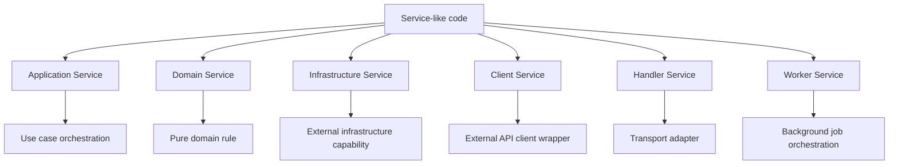
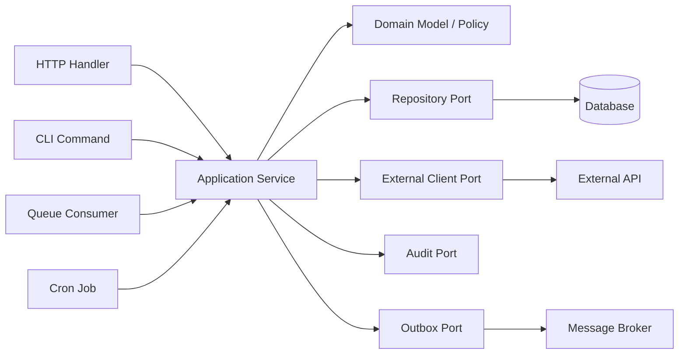
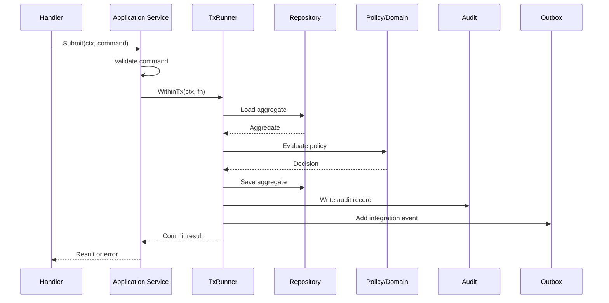
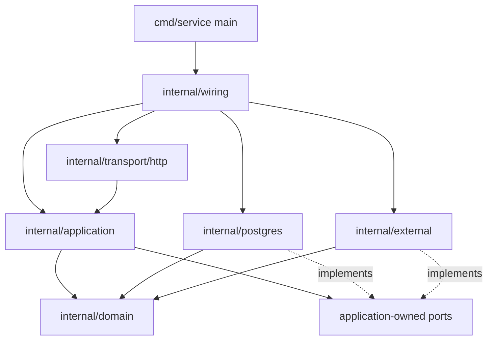

# learn-go-design-patterns-common-patterns-anti-patterns-part-013.md

# Part 013 — Service Layer Pattern in Go

> Seri: **Go Design Patterns, Common Patterns, and Anti-Patterns**  
> Target pembaca: **Java software engineer / tech lead yang ingin mendesain Go service production-grade**  
> Baseline: **Go 1.26.x**  
> Status seri: **belum selesai** — ini adalah **part 013 dari 035**

---

## 0. Tujuan Part Ini

Part ini membahas **Service Layer Pattern in Go**.

Namun kata **service** adalah salah satu kata paling berbahaya dalam desain software. Di banyak codebase enterprise, terutama yang datang dari tradisi Java/Spring, kata `Service` sering menjadi tempat menumpuk semua hal:

- business rule,
- transaction,
- validation,
- authorization,
- orchestration,
- persistence,
- external API call,
- logging,
- retry,
- mapping DTO,
- event publishing,
- cache,
- dan kadang HTTP response shaping.

Akibatnya, `UserService`, `ApplicationService`, `CaseService`, `OrderService`, atau `PaymentService` berubah menjadi **god object**.

Di Go, service layer tetap bisa berguna, tetapi desainnya perlu dibaca dengan mental model berbeda:

> Service di Go bukan class wajib dalam layered architecture. Service adalah boundary perilaku yang hanya layak ada bila ia menyatukan use case, dependency, invariant, atau orchestration yang memang tidak pantas berada di transport handler, repository, atau domain entity.

Setelah mempelajari part ini, kamu harus bisa:

1. membedakan **application service**, **domain service**, **infrastructure service**, **client service**, **handler**, **repository**, dan **worker**;
2. menentukan kapan package `service` layak dibuat dan kapan justru tanda desain lemah;
3. mendesain service Go yang kecil, eksplisit, testable, observable, dan punya ownership jelas;
4. menghindari Java-style service explosion;
5. mendesain command/query handler sebagai alternatif service layer;
6. menentukan transaction boundary, error boundary, context boundary, validation boundary, authorization boundary, dan event boundary;
7. mengenali service anti-pattern sejak code review.

---

## 1. Masalah yang Diselesaikan Service Layer

Service layer biasanya muncul ketika sistem mulai punya operasi yang tidak bisa ditaruh secara bersih di satu tempat.

Contoh operasi:

```text
Approve application
Reject application
Submit appeal
Assign case officer
Escalate compliance case
Generate invoice
Register user from external identity provider
Import data from upstream system
Recalculate eligibility
Publish case status change
```

Operasi seperti itu sering membutuhkan beberapa langkah:

1. ambil data dari repository;
2. validasi precondition;
3. cek authorization;
4. jalankan decision/policy;
5. ubah state;
6. simpan perubahan dalam transaction;
7. tulis audit trail;
8. publish event/outbox;
9. return result yang meaningful.

Kalau semua itu diletakkan di HTTP handler, handler menjadi terlalu gemuk.

Kalau semua itu diletakkan di repository, repository berubah dari persistence boundary menjadi business brain.

Kalau semua itu diletakkan di entity method, entity menjadi terlalu aware terhadap database, external client, current user, clock, transaction, dan event publisher.

Di sinilah service layer berguna.

Service layer menyelesaikan masalah:

- **orchestration** antar dependency;
- **use case boundary**;
- **transaction boundary**;
- **authorization boundary**;
- **validation/invariant boundary**;
- **error translation boundary**;
- **auditability boundary**;
- **test seam** untuk perilaku aplikasi;
- **transport independence** agar HTTP, CLI, queue, dan cron bisa memakai logic sama.

Tetapi service layer juga bisa merusak desain jika dibuat hanya karena template.

---

## 2. Mental Model Utama

### 2.1 Service adalah Use Case Boundary, Bukan Folder Wajib

Di Go, pertanyaan pertama bukan:

> “Service class-nya apa?”

Pertanyaan yang lebih tepat:

> “Operasi apa yang menjadi boundary perilaku sistem?”

Contoh buruk:

```text
internal/
  controller/
  service/
  repository/
  model/
```

Struktur ini terlihat familiar bagi Java/Spring engineer, tetapi sering gagal menjelaskan ownership.

Contoh lebih kuat:

```text
internal/
  application/
    approve_application.go
    submit_application.go
    assign_case.go
  casefile/
    state.go
    policy.go
  persistence/
    application_repo.go
  transport/http/
    application_handler.go
```

Atau:

```text
internal/
  application/
    service.go
    commands.go
    results.go
  application/postgres/
    repository.go
  application/http/
    handler.go
```

Yang penting bukan nama foldernya, melainkan:

- siapa pemilik use case;
- siapa pemilik transaction;
- siapa pemilik dependency;
- siapa pemilik business decision;
- siapa pemilik transport mapping.

---

### 2.2 Service Harus Punya Alasan Eksistensi

Sebuah service layak ada jika ia melakukan minimal salah satu dari ini:

1. mengorkestrasi lebih dari satu dependency;
2. menjaga invariant use case;
3. menjadi transaction boundary;
4. menerapkan policy/authorization/validation yang tidak transport-specific;
5. menyembunyikan external system detail dari application layer;
6. menyatukan lifecycle proses bisnis;
7. menjadi seam untuk test perilaku aplikasi;
8. menghasilkan decision/result yang audit-friendly.

Service yang hanya meneruskan call biasanya tidak layak:

```go
func (s *UserService) GetUser(ctx context.Context, id string) (*User, error) {
    return s.repo.GetUser(ctx, id)
}
```

Ini bukan service layer. Ini **pass-through layer**.

Pass-through layer menambah:

- file,
- indirection,
- test mock,
- stack trace,
- naming noise,
- review overhead,

tanpa menambah decision value.

---

### 2.3 Service Bukan Domain Model

Application service mengatur use case.

Domain model menjaga invariant domain.

Repository menyimpan/mengambil state.

Transport handler menerjemahkan request/response.

Kalau semua domain rule ada di service, domain entity menjadi anemic:

```go
// Buruk: service tahu terlalu banyak detail mutation domain.
func (s *ApplicationService) Approve(ctx context.Context, id string, officerID string) error {
    app, err := s.repo.Find(ctx, id)
    if err != nil {
        return err
    }

    if app.Status != "SUBMITTED" {
        return errors.New("invalid status")
    }

    app.Status = "APPROVED"
    app.ApprovedBy = officerID
    app.ApprovedAt = time.Now()

    return s.repo.Save(ctx, app)
}
```

Lebih baik domain object menjaga transisi:

```go
func (a *Application) Approve(now time.Time, officerID OfficerID) error {
    if a.status != StatusSubmitted {
        return ErrInvalidTransition{From: a.status, To: StatusApproved}
    }

    a.status = StatusApproved
    a.approvedBy = officerID
    a.approvedAt = now
    return nil
}
```

Lalu application service mengorkestrasi:

```go
func (s *ApprovalService) Approve(ctx context.Context, cmd ApproveCommand) (ApproveResult, error) {
    var result ApproveResult

    err := s.tx.WithinTx(ctx, func(ctx context.Context, tx Tx) error {
        app, err := s.apps.GetForUpdate(ctx, tx, cmd.ApplicationID)
        if err != nil {
            return err
        }

        if err := s.authz.CanApprove(ctx, cmd.Actor, app); err != nil {
            return err
        }

        if err := app.Approve(s.clock.Now(), cmd.Actor.OfficerID); err != nil {
            return err
        }

        if err := s.apps.Save(ctx, tx, app); err != nil {
            return err
        }

        result = ApproveResult{ApplicationID: app.ID(), Status: app.Status()}
        return nil
    })
    if err != nil {
        return ApproveResult{}, err
    }

    return result, nil
}
```

Service bukan tempat semua rule, tetapi tempat use case disusun.

---

## 3. Java Mindset vs Go Mindset

### 3.1 Java/Spring Habit

Dalam Java/Spring, struktur ini umum:

```text
Controller -> Service Interface -> ServiceImpl -> Repository Interface -> RepositoryImpl
```

Lalu tiap entity punya service:

```text
UserController
UserService
UserServiceImpl
UserRepository
UserRepositoryImpl
UserMapper
UserDTO
UserEntity
```

Ini masuk akal dalam ekosistem yang banyak memakai:

- annotation scanning,
- proxy,
- AOP transaction,
- reflection injection,
- runtime bean container,
- class/interface split,
- framework-driven lifecycle.

Masalahnya, kalau pola ini disalin mentah ke Go, sering menghasilkan codebase yang:

- terlalu banyak interface;
- terlalu banyak package;
- terlalu banyak indirection;
- terlalu banyak pass-through method;
- import graph sulit dibaca;
- business logic tersebar;
- test terlalu mock-heavy;
- constructor graph tidak eksplisit.

---

### 3.2 Go Mindset

Go lebih nyaman dengan:

- concrete type;
- small interface di sisi consumer;
- explicit constructor;
- explicit transaction;
- explicit error;
- explicit context;
- package cohesion;
- small API surface;
- direct function call bila cukup.

Alih-alih otomatis membuat `UserService` untuk `User`, tanyakan:

1. Apa use case-nya?
2. Apa invariant-nya?
3. Apa boundary-nya?
4. Apa dependency-nya?
5. Apa transaction-nya?
6. Apa result-nya?
7. Siapa caller-nya?
8. Apakah service ini mengurangi kompleksitas atau hanya memindahkan kompleksitas?

---

## 4. Taxonomy Service di Go

Kata service bisa berarti banyak hal. Untuk menghindari ambiguity, gunakan taxonomy berikut.



---

### 4.1 Application Service

Application service mengorkestrasi satu atau beberapa use case.

Contoh:

- `ApprovalService`
- `SubmissionService`
- `CaseAssignmentService`
- `PaymentCaptureService`
- `ProfileRegistrationService`

Ciri-ciri:

- menerima command/query;
- menerima `context.Context`;
- memakai repository/client/policy/clock/event publisher;
- biasanya menjadi transaction boundary;
- mengembalikan result atau error;
- tidak tahu HTTP status code;
- tidak tahu JSON;
- tidak tahu router;
- tidak tahu CLI flag.

Contoh shape:

```go
type ApprovalService struct {
    tx     TxRunner
    apps   ApplicationRepository
    authz  ApprovalAuthorizer
    audit  AuditWriter
    outbox Outbox
    clock  Clock
}

func NewApprovalService(
    tx TxRunner,
    apps ApplicationRepository,
    authz ApprovalAuthorizer,
    audit AuditWriter,
    outbox Outbox,
    clock Clock,
) *ApprovalService {
    return &ApprovalService{
        tx: tx, apps: apps, authz: authz, audit: audit, outbox: outbox, clock: clock,
    }
}

func (s *ApprovalService) Approve(ctx context.Context, cmd ApproveCommand) (ApproveResult, error) {
    // use case orchestration
}
```

---

### 4.2 Domain Service

Domain service berisi rule domain yang:

- tidak natural menjadi method satu entity;
- membutuhkan beberapa entity/value object;
- tetap pure atau hampir pure;
- tidak tergantung database/HTTP/message broker.

Contoh:

```go
type EligibilityPolicy struct {
    minAge int
}

func (p EligibilityPolicy) Evaluate(applicant Applicant, licence Licence) EligibilityDecision {
    // pure domain decision
}
```

Domain service sebaiknya tidak punya dependency berat seperti DB/client.

Kalau domain service butuh repository, biasanya ia sudah bergeser menjadi application service.

---

### 4.3 Infrastructure Service

Infrastructure service menyediakan capability teknis:

- email sender;
- PDF generator;
- token signer;
- object storage;
- identity provider client;
- external address lookup;
- cache provider;
- queue publisher.

Contoh:

```go
type EmailSender interface {
    Send(ctx context.Context, msg EmailMessage) error
}
```

Implementasinya bisa berada di package infra:

```text
internal/email/smtp
internal/email/ses
internal/storage/s3
internal/identity/keycloak
```

Application service memakai interface kecil yang ia butuhkan.

---

### 4.4 Client Service

Kadang package external client disebut service:

```go
type OneMapClient struct {
    http *http.Client
    baseURL string
}

func (c *OneMapClient) ResolvePostalCode(ctx context.Context, postalCode string) (Address, error) {
    // HTTP call to external API
}
```

Ini bukan application service. Ini adapter/client.

Jangan campur:

- HTTP call external;
- application workflow;
- business decision;
- persistence transaction;

dalam satu `ExternalService` besar.

---

### 4.5 Worker Service

Worker service mengelola background processing:

```go
type OutboxDispatcher struct {
    outbox OutboxRepository
    broker EventPublisher
    clock  Clock
}

func (d *OutboxDispatcher) Run(ctx context.Context) error {
    // loop, claim, publish, mark sent
}
```

Worker service punya lifecycle concern:

- start;
- stop;
- cancellation;
- retry;
- backoff;
- metrics;
- poison message handling.

Jangan sembunyikan worker lifecycle di constructor application service.

---

## 5. Service Layer Position dalam Architecture



Application service berada di tengah sebagai **use case orchestrator**.

Ia tidak menjadi owner semua detail, tetapi ia tahu urutan operasi.

---

## 6. Bentuk Service yang Baik

### 6.1 Nama Berdasarkan Capability atau Use Case

Hindari nama terlalu generik:

```go
type UserService struct {}
type ApplicationService struct {}
type CommonService struct {}
```

Lebih baik:

```go
type RegistrationService struct {}
type ApprovalService struct {}
type AssignmentService struct {}
type RenewalService struct {}
type AppealSubmissionService struct {}
```

Nama harus menjawab:

> “Service ini bertanggung jawab atas perilaku apa?”

Bukan:

> “Entity apa yang disentuh?”

---

### 6.2 Method Berdasarkan Use Case, Bukan CRUD Otomatis

Buruk:

```go
type UserService struct {
    repo UserRepository
}

func (s *UserService) Create(ctx context.Context, user User) error
func (s *UserService) Update(ctx context.Context, user User) error
func (s *UserService) Delete(ctx context.Context, id string) error
func (s *UserService) Find(ctx context.Context, id string) (User, error)
func (s *UserService) List(ctx context.Context) ([]User, error)
```

Ini sering hanya repository wrapper.

Lebih kuat:

```go
type RegistrationService struct {
    users UserRepository
    idp   IdentityProvider
    audit AuditWriter
    clock Clock
}

func (s *RegistrationService) RegisterFromIdentity(ctx context.Context, cmd RegisterFromIdentityCommand) (RegistrationResult, error)
func (s *RegistrationService) CompleteProfile(ctx context.Context, cmd CompleteProfileCommand) (CompleteProfileResult, error)
```

---

### 6.3 Command dan Result Membuat Boundary Lebih Jelas

Untuk operasi penting, jangan gunakan daftar parameter panjang.

Buruk:

```go
func (s *ApprovalService) Approve(ctx context.Context, appID string, officerID string, reason string, ip string, userAgent string) error
```

Lebih baik:

```go
type ApproveApplicationCommand struct {
    ApplicationID ApplicationID
    Actor         Actor
    Reason        string
    RequestMeta   RequestMeta
    IdempotencyKey string
}

type ApproveApplicationResult struct {
    ApplicationID ApplicationID
    Status        ApplicationStatus
    ApprovedAt    time.Time
    DecisionID    DecisionID
}

func (s *ApprovalService) Approve(ctx context.Context, cmd ApproveApplicationCommand) (ApproveApplicationResult, error)
```

Command memberi tempat untuk:

- actor;
- request metadata;
- idempotency key;
- correlation ID;
- decision reason;
- validation target;
- future evolution.

Result memberi tempat untuk:

- state baru;
- decision ID;
- audit ID;
- warning;
- partial success;
- next action.

---

### 6.4 Constructor Eksplisit

```go
func NewApprovalService(cfg ApprovalServiceConfig) (*ApprovalService, error) {
    if cfg.Tx == nil {
        return nil, errors.New("approval service: tx runner is required")
    }
    if cfg.Applications == nil {
        return nil, errors.New("approval service: application repository is required")
    }
    if cfg.Authorizer == nil {
        return nil, errors.New("approval service: authorizer is required")
    }
    if cfg.Clock == nil {
        cfg.Clock = SystemClock{}
    }

    return &ApprovalService{
        tx: cfg.Tx,
        apps: cfg.Applications,
        authz: cfg.Authorizer,
        audit: cfg.Audit,
        outbox: cfg.Outbox,
        clock: cfg.Clock,
    }, nil
}
```

Untuk dependency banyak, config struct lebih jelas daripada parameter constructor terlalu panjang.

---

## 7. Application Service Pattern

### 7.1 Struktur Umum

```go
type SubmitApplicationService struct {
    tx       TxRunner
    apps     ApplicationRepository
    profiles ProfileRepository
    policy   SubmissionPolicy
    audit    AuditWriter
    outbox   OutboxWriter
    clock    Clock
}

func (s *SubmitApplicationService) Submit(ctx context.Context, cmd SubmitApplicationCommand) (SubmitApplicationResult, error) {
    if err := cmd.Validate(); err != nil {
        return SubmitApplicationResult{}, err
    }

    var result SubmitApplicationResult

    err := s.tx.WithinTx(ctx, func(ctx context.Context, tx Tx) error {
        profile, err := s.profiles.Get(ctx, tx, cmd.ProfileID)
        if err != nil {
            return err
        }

        app, err := s.apps.GetDraft(ctx, tx, cmd.ApplicationID)
        if err != nil {
            return err
        }

        decision := s.policy.CanSubmit(profile, app, s.clock.Now())
        if !decision.Allowed {
            return SubmissionRejected{Reasons: decision.Reasons}
        }

        if err := app.Submit(s.clock.Now(), cmd.Actor); err != nil {
            return err
        }

        if err := s.apps.Save(ctx, tx, app); err != nil {
            return err
        }

        if err := s.audit.Write(ctx, tx, AuditRecord{
            Actor: cmd.Actor,
            Action: "application.submitted",
            EntityID: app.ID().String(),
            At: s.clock.Now(),
        }); err != nil {
            return err
        }

        if err := s.outbox.Add(ctx, tx, ApplicationSubmittedEvent{
            ApplicationID: app.ID(),
            SubmittedAt: app.SubmittedAt(),
        }); err != nil {
            return err
        }

        result = SubmitApplicationResult{
            ApplicationID: app.ID(),
            Status: app.Status(),
            SubmittedAt: app.SubmittedAt(),
        }
        return nil
    })
    if err != nil {
        return SubmitApplicationResult{}, err
    }

    return result, nil
}
```

Hal penting:

- validation ringan dilakukan sebelum transaction;
- stateful validation dilakukan dalam transaction;
- mutation domain dilakukan oleh entity/domain method;
- persistence dan audit berada dalam transaction;
- event masuk outbox, bukan publish langsung sebelum commit;
- result dibentuk dari state yang sudah diputuskan.

---

### 7.2 Flow Application Service



---

## 8. Domain Service Pattern

Domain service berbeda dari application service.

Domain service idealnya:

- pure;
- deterministic;
- dependency kecil;
- tidak melakukan I/O;
- mudah dites tanpa mock;
- berisi decision logic.

Contoh:

```go
type RenewalEligibilityPolicy struct {
    minRemainingDays int
    maxOutstandingCases int
}

func (p RenewalEligibilityPolicy) Evaluate(now time.Time, licence Licence, cases []ComplianceCase) RenewalDecision {
    var reasons []string

    if licence.Expired(now) {
        reasons = append(reasons, "licence already expired")
    }

    if licence.RemainingDays(now) > p.minRemainingDays {
        reasons = append(reasons, "renewal window has not opened")
    }

    if openCaseCount(cases) > p.maxOutstandingCases {
        reasons = append(reasons, "too many outstanding compliance cases")
    }

    if len(reasons) > 0 {
        return RenewalDecision{Allowed: false, Reasons: reasons}
    }

    return RenewalDecision{Allowed: true}
}
```

Application service memanggil policy ini setelah mengambil data.

---

## 9. Command Handler Style

Alih-alih satu `ApplicationService` besar, gunakan handler per use case.

```go
type ApproveApplicationHandler struct {
    tx    TxRunner
    apps  ApplicationRepository
    authz ApprovalAuthorizer
    audit AuditWriter
    clock Clock
}

func (h *ApproveApplicationHandler) Handle(ctx context.Context, cmd ApproveApplicationCommand) (ApproveApplicationResult, error) {
    // use case
}
```

Keuntungan:

- file kecil;
- dependency spesifik;
- testing lebih fokus;
- tidak ada god service;
- ownership jelas;
- mudah dipetakan ke backlog/use case.

Kekurangan:

- lebih banyak type;
- wiring bisa bertambah;
- perlu naming discipline.

Command handler style cocok untuk sistem dengan banyak use case kompleks.

---

## 10. Query Handler Style

Command mengubah state. Query membaca state.

Jangan paksa query masuk ke service write model jika query butuh optimized read.

```go
type ListApplicationsQuery struct {
    Actor Actor
    Filter ApplicationFilter
    Page PageRequest
}

type ListApplicationsHandler struct {
    reader ApplicationReadRepository
    authz  ApplicationReadAuthorizer
}

func (h *ListApplicationsHandler) Handle(ctx context.Context, q ListApplicationsQuery) (Page[ApplicationListItem], error) {
    if err := h.authz.CanList(ctx, q.Actor, q.Filter); err != nil {
        return Page[ApplicationListItem]{}, err
    }
    return h.reader.List(ctx, q.Filter, q.Page)
}
```

Query handler bisa memakai read model berbeda dari write repository.

Anti-pattern umum:

```go
func (s *ApplicationService) ListEverything(ctx context.Context, filter Filter) ([]Application, error) {
    // load full aggregate for listing table
}
```

Untuk listing, sering lebih baik pakai projection/read model.

---

## 11. Service Dependency Shape

### 11.1 Dependency Harus Minimal

Buruk:

```go
type ApplicationService struct {
    db *sql.DB
    redis *redis.Client
    http *http.Client
    logger *slog.Logger
    config Config
    userRepo UserRepository
    appRepo ApplicationRepository
    caseRepo CaseRepository
    appealRepo AppealRepository
    email EmailSender
    sms SMSClient
    storage Storage
    broker Broker
    validator Validator
    mapper Mapper
    authz Authorizer
    clock Clock
}
```

Ini smell: service terlalu luas.

Lebih baik pecah berdasarkan capability:

```go
type ApprovalService struct {
    tx    TxRunner
    apps  ApplicationRepository
    authz ApprovalAuthorizer
    audit AuditWriter
    outbox OutboxWriter
    clock Clock
}
```

Dependency service harus menjelaskan use case.

---

### 11.2 Jangan Inject Database Jika Repository Lebih Tepat

Application service umumnya tidak perlu tahu SQL.

Buruk:

```go
type ApprovalService struct {
    db *sql.DB
}
```

Kalau service melakukan SQL langsung, repository boundary hilang.

Namun ada pengecualian: untuk service internal kecil atau data access sederhana, SQL langsung bisa diterima jika tidak menciptakan abstraction palsu. Trade-off-nya harus sadar.

---

### 11.3 Jangan Inject Logger Lalu Logging di Mana-mana

Logging di service perlu event model.

Buruk:

```go
s.logger.Info("starting approval")
s.logger.Info("loaded app")
s.logger.Info("checked auth")
s.logger.Info("saved app")
s.logger.Info("done")
```

Lebih baik log decision/important lifecycle:

```go
s.logger.InfoContext(ctx, "application approval completed",
    slog.String("application_id", cmd.ApplicationID.String()),
    slog.String("actor_id", cmd.Actor.ID.String()),
    slog.String("new_status", result.Status.String()),
)
```

Logging bukan pengganti audit.

---

## 12. Transaction Boundary di Service

Application service sering menjadi pemilik transaction.

Alasan:

- service tahu use case atomicity;
- repository tidak tahu semua operasi;
- handler tidak boleh tahu persistence detail;
- domain entity tidak boleh tahu DB.

```go
func (s *ApprovalService) Approve(ctx context.Context, cmd ApproveCommand) (ApproveResult, error) {
    var result ApproveResult

    err := s.tx.WithinTx(ctx, func(ctx context.Context, tx Tx) error {
        app, err := s.apps.GetForUpdate(ctx, tx, cmd.ApplicationID)
        if err != nil {
            return err
        }

        if err := app.Approve(s.clock.Now(), cmd.Actor.OfficerID); err != nil {
            return err
        }

        if err := s.apps.Save(ctx, tx, app); err != nil {
            return err
        }

        result = ApproveResult{ApplicationID: app.ID(), Status: app.Status()}
        return nil
    })
    if err != nil {
        return ApproveResult{}, err
    }

    return result, nil
}
```

Jangan lakukan network call di dalam transaction kecuali benar-benar perlu dan sudah dianalisis.

Buruk:

```go
err := s.tx.WithinTx(ctx, func(ctx context.Context, tx Tx) error {
    app := load(...)
    resp, err := s.externalAPI.Call(ctx, app.Data()) // network call inside DB tx
    if err != nil { return err }
    app.Apply(resp)
    return save(...)
})
```

Risiko:

- lock database ditahan lama;
- timeout external membuat transaction menggantung;
- retry bisa membuat duplicate side effect;
- deadlock meningkat;
- resource pool habis.

Lebih baik gunakan outbox/saga/stepwise orchestration.

---

## 13. Validation Boundary

Service harus membedakan:

1. **command validation** — struktur input;
2. **authorization** — actor boleh melakukan apa;
3. **precondition** — state saat ini memungkinkan operasi;
4. **domain invariant** — rule internal entity/domain;
5. **persistence constraint** — uniqueness/FK/concurrency;
6. **business rejection** — expected denial, bukan necessarily error teknis.

Contoh:

```go
func (cmd ApproveApplicationCommand) Validate() error {
    var errs []error
    if cmd.ApplicationID.IsZero() {
        errs = append(errs, errors.New("application_id is required"))
    }
    if cmd.Actor.IsZero() {
        errs = append(errs, errors.New("actor is required"))
    }
    if len(errs) > 0 {
        return ValidationError{Errors: errs}
    }
    return nil
}
```

Service lalu melakukan stateful validation:

```go
if !app.CanBeApproved() {
    return ApprovalRejected{Reason: "application is not submitted"}
}
```

Jangan taruh semua validation di HTTP binding tag.

---

## 14. Authorization Boundary

Authorization sebaiknya dekat dengan use case, bukan hanya middleware.

Middleware bisa menjawab:

- user authenticated atau tidak;
- token valid atau tidak;
- role kasar ada atau tidak.

Application service harus menjawab:

- actor ini boleh approve application ini atau tidak;
- officer ini assigned ke case ini atau tidak;
- operation ini allowed pada state saat ini atau tidak;
- delegation policy berlaku atau tidak;
- cross-entity restriction terpenuhi atau tidak.

Contoh:

```go
type ApprovalAuthorizer interface {
    CanApprove(ctx context.Context, actor Actor, app Application) error
}
```

Service memanggil authorizer setelah aggregate/data relevan diload.

---

## 15. Error Boundary

Service tidak boleh asal mengembalikan semua error mentah.

Ia harus membedakan:

- validation error;
- unauthorized/forbidden;
- not found;
- conflict;
- rejected business decision;
- transient infrastructure error;
- internal invariant violation.

Contoh taxonomy:

```go
type ValidationError struct { Errors []error }
type NotFoundError struct { Resource string; ID string }
type ConflictError struct { Resource string; Reason string }
type ForbiddenError struct { Action string; Reason string }
type ApprovalRejected struct { Reasons []string }
```

Handler menerjemahkan error service ke HTTP response.

```go
switch {
case errors.As(err, &validation):
    writeJSON(w, http.StatusBadRequest, validation)
case errors.As(err, &forbidden):
    writeJSON(w, http.StatusForbidden, forbidden)
case errors.As(err, &rejected):
    writeJSON(w, http.StatusUnprocessableEntity, rejected)
default:
    writeJSON(w, http.StatusInternalServerError, genericError)
}
```

Service tidak perlu tahu HTTP status code.

---

## 16. Context Boundary

Service method yang melakukan I/O harus menerima `context.Context` sebagai parameter pertama.

```go
func (s *ApprovalService) Approve(ctx context.Context, cmd ApproveCommand) (ApproveResult, error)
```

Context dipakai untuk:

- cancellation;
- deadline;
- trace propagation;
- request-scoped metadata yang benar-benar lintas boundary.

Context jangan dipakai untuk:

- dependency bag;
- optional parameter;
- menyimpan config;
- menyimpan logger sembarangan;
- menyimpan domain entity.

Buruk:

```go
actor := ctx.Value("actor").(Actor)
```

Lebih baik actor eksplisit di command:

```go
type ApproveCommand struct {
    Actor Actor
    ApplicationID ApplicationID
}
```

Context mengontrol lifecycle, command membawa domain/application input.

---

## 17. Observability Boundary

Application service adalah tempat bagus untuk observability pada level use case.

Minimal service penting punya:

- operation name;
- duration;
- result classification;
- error classification;
- business decision outcome;
- domain IDs yang aman;
- actor ID jika boleh;
- correlation/trace propagation;
- audit record bila required.

Contoh event log:

```go
s.logger.InfoContext(ctx, "application approval rejected",
    slog.String("application_id", cmd.ApplicationID.String()),
    slog.String("actor_id", cmd.Actor.ID.String()),
    slog.Any("reasons", decision.Reasons),
)
```

Hati-hati:

- jangan log PII/secrets;
- jangan log full payload;
- jangan jadikan log sebagai source of truth audit;
- jangan high-cardinality metric label sembarangan;
- jangan double-log error di setiap layer.

---

## 18. Testing Service Layer

Service layer bagus harus mudah dites.

### 18.1 Test dengan Fake, Bukan Mock Berlebihan

```go
type fakeApplicationRepo struct {
    app Application
    saved bool
}

func (r *fakeApplicationRepo) GetForUpdate(ctx context.Context, tx Tx, id ApplicationID) (Application, error) {
    return r.app, nil
}

func (r *fakeApplicationRepo) Save(ctx context.Context, tx Tx, app Application) error {
    r.app = app
    r.saved = true
    return nil
}
```

Test:

```go
func TestApprovalService_Approve_SubmittedApplication(t *testing.T) {
    repo := &fakeApplicationRepo{app: NewSubmittedApplication("app-1")}
    svc := ApprovalService{
        tx: fakeTxRunner{},
        apps: repo,
        authz: allowAllAuthorizer{},
        clock: fixedClock{t: mustTime("2026-01-01T00:00:00Z")},
    }

    res, err := svc.Approve(context.Background(), ApproveCommand{
        ApplicationID: ApplicationID("app-1"),
        Actor: Actor{ID: "officer-1"},
    })

    if err != nil {
        t.Fatal(err)
    }
    if res.Status != StatusApproved {
        t.Fatalf("status = %v, want %v", res.Status, StatusApproved)
    }
    if !repo.saved {
        t.Fatalf("expected application to be saved")
    }
}
```

### 18.2 Test Failure Mode

Test tidak cukup hanya happy path.

Uji:

- command invalid;
- unauthorized;
- entity not found;
- invalid state transition;
- repository failure;
- audit failure;
- outbox failure;
- transaction commit failure;
- context cancellation;
- idempotent duplicate command;
- concurrent update conflict.

---

## 19. Service Anti-Pattern Catalog

### 19.1 God Service

Gejala:

- satu service punya 20+ dependency;
- file ribuan baris;
- method CRUD + workflow + reporting + import + export;
- semua team menyentuh file yang sama;
- merge conflict sering;
- test sulit.

Akar masalah:

- service dinamai berdasarkan entity terlalu besar;
- tidak ada use-case boundary;
- domain rule tidak dipisah;
- query/read model dicampur dengan write workflow.

Refactor:

- pecah per use case/capability;
- pindahkan pure rule ke domain policy;
- pindahkan listing/reporting ke query handler;
- buat port kecil per dependency;
- kurangi dependency per service.

---

### 19.2 Pass-Through Service

Gejala:

```go
func (s *Service) Get(ctx context.Context, id string) (Thing, error) {
    return s.repo.Get(ctx, id)
}
```

Akar masalah:

- template layered architecture;
- takut handler memanggil repository langsung;
- mengira semua operasi harus lewat service.

Refactor:

- hapus service bila tidak ada value;
- atau tambahkan responsibility yang memang use-case relevant;
- biarkan handler query sederhana memanggil read repository jika boundary jelas.

---

### 19.3 CRUD Service Explosion

Gejala:

```text
UserService
RoleService
PermissionService
ApplicationService
CaseService
DocumentService
AuditService
NotificationService
```

Masing-masing punya:

```go
Create
Update
Delete
FindByID
List
```

Akar masalah:

- entity-first architecture;
- generated mindset;
- database table menjadi pusat desain.

Refactor:

- identifikasi use case nyata;
- pisahkan command/query;
- gunakan repository/read model langsung untuk operasi sederhana;
- buat service hanya untuk behavior yang punya rule/orchestration.

---

### 19.4 Service Calling Service Spaghetti

Gejala:

```go
ApplicationService -> UserService -> RoleService -> PermissionService -> AuditService -> NotificationService
```

Akar masalah:

- service dijadikan facade semua hal;
- dependency ownership tidak jelas;
- tidak ada port kecil;
- service terlalu generic.

Risiko:

- circular dependency;
- transaction boundary kacau;
- hidden side effect;
- sulit test;
- observability noise.

Refactor:

- service tidak memanggil service besar lain;
- extract capability port;
- pisahkan domain policy;
- centralize orchestration di satu use-case handler;
- dependency harus mengarah ke capability spesifik, bukan service aggregate.

---

### 19.5 Transaction Hidden in Lower Layer

Gejala:

```go
func (r *Repo) SaveApplicationAndAudit(ctx context.Context, app Application, audit AuditRecord) error {
    tx, _ := r.db.BeginTx(ctx, nil)
    // ...
}
```

Service tidak sadar operasi mana atomic.

Risiko:

- nested transaction;
- partial commit;
- impossible composition;
- retry tidak jelas;
- outbox sulit.

Refactor:

- transaction runner di application service;
- repository menerima `tx` atau executor;
- commit ownership eksplisit.

---

### 19.6 Transport-Aware Service

Gejala:

```go
func (s *Service) Approve(w http.ResponseWriter, r *http.Request)
```

Atau:

```go
func (s *Service) Approve(ctx context.Context, req ApproveHTTPRequest) (ApproveHTTPResponse, error)
```

Akar masalah:

- handler dan application service dicampur;
- ingin menghindari mapping DTO.

Refactor:

- HTTP handler decode request;
- map ke command;
- call service;
- map result/error ke response.

---

### 19.7 Context Value Abuse

Gejala:

```go
user := ctx.Value("user").(User)
tenant := ctx.Value("tenant").(string)
role := ctx.Value("role").(string)
```

Refactor:

- actor/tenant/request metadata masuk command;
- context hanya untuk cancellation/deadline/tracing/request-scoped technical metadata.

---

### 19.8 Global Service Singleton

Gejala:

```go
var UserSvc *UserService
```

Risiko:

- hidden dependency;
- test pollution;
- race condition;
- startup order ambiguity;
- multi-tenant/multi-config impossible.

Refactor:

- explicit constructor;
- composition root;
- pass dependency to handler/worker.

---

## 20. Package Layout Alternatives

### 20.1 Layered Layout

```text
internal/
  handler/
  service/
  repository/
  domain/
```

Cocok untuk app kecil, tetapi mudah jadi dumping ground.

### 20.2 Feature/Vertical Slice Layout

```text
internal/
  application/
    approval/
      service.go
      command.go
      result.go
      policy.go
      repository.go
      http.go
      postgres.go
```

Cocok untuk banyak use case.

### 20.3 Domain Package + Adapter Package

```text
internal/
  casefile/
    application.go
    state.go
    policy.go
  appsvc/
    approve.go
    assign.go
  postgres/
    application_repo.go
  httpapi/
    application_handler.go
```

Cocok bila domain kompleks.

Tidak ada satu struktur universal. Yang penting import graph dan ownership jelas.

---

## 21. Import Graph yang Sehat



Rule penting:

- domain tidak import transport;
- domain tidak import postgres;
- application tidak import HTTP framework;
- adapter boleh import domain/application types jika perlu;
- wiring menghubungkan concrete implementation;
- interface biasanya dekat consumer.

---

## 22. Production Example: Approval Service

### 22.1 Domain Types

```go
type ApplicationStatus string

const (
    StatusDraft     ApplicationStatus = "draft"
    StatusSubmitted ApplicationStatus = "submitted"
    StatusApproved  ApplicationStatus = "approved"
    StatusRejected  ApplicationStatus = "rejected"
)

type Application struct {
    id         ApplicationID
    status     ApplicationStatus
    approvedBy OfficerID
    approvedAt time.Time
}

func (a *Application) Approve(now time.Time, officer OfficerID) error {
    if a.status != StatusSubmitted {
        return InvalidTransitionError{From: a.status, To: StatusApproved}
    }
    a.status = StatusApproved
    a.approvedBy = officer
    a.approvedAt = now
    return nil
}
```

### 22.2 Command/Result

```go
type ApproveApplicationCommand struct {
    ApplicationID  ApplicationID
    Actor          Actor
    Reason         string
    IdempotencyKey string
}

type ApproveApplicationResult struct {
    ApplicationID ApplicationID
    Status        ApplicationStatus
    ApprovedAt    time.Time
}
```

### 22.3 Ports

```go
type ApplicationRepository interface {
    GetForUpdate(ctx context.Context, tx Tx, id ApplicationID) (*Application, error)
    Save(ctx context.Context, tx Tx, app *Application) error
}

type ApprovalAuthorizer interface {
    CanApprove(ctx context.Context, actor Actor, app *Application) error
}

type AuditWriter interface {
    Write(ctx context.Context, tx Tx, record AuditRecord) error
}

type OutboxWriter interface {
    Add(ctx context.Context, tx Tx, event Event) error
}
```

### 22.4 Service

```go
type ApprovalService struct {
    tx     TxRunner
    apps   ApplicationRepository
    authz  ApprovalAuthorizer
    audit  AuditWriter
    outbox OutboxWriter
    clock  Clock
}

func (s *ApprovalService) Approve(ctx context.Context, cmd ApproveApplicationCommand) (ApproveApplicationResult, error) {
    if err := cmd.Validate(); err != nil {
        return ApproveApplicationResult{}, err
    }

    var result ApproveApplicationResult

    err := s.tx.WithinTx(ctx, func(ctx context.Context, tx Tx) error {
        app, err := s.apps.GetForUpdate(ctx, tx, cmd.ApplicationID)
        if err != nil {
            return err
        }

        if err := s.authz.CanApprove(ctx, cmd.Actor, app); err != nil {
            return err
        }

        now := s.clock.Now()
        if err := app.Approve(now, cmd.Actor.OfficerID); err != nil {
            return err
        }

        if err := s.apps.Save(ctx, tx, app); err != nil {
            return err
        }

        if err := s.audit.Write(ctx, tx, AuditRecord{
            ActorID:  cmd.Actor.ID,
            EntityID: app.ID().String(),
            Action:   "application.approved",
            At:       now,
            Reason:   cmd.Reason,
        }); err != nil {
            return err
        }

        if err := s.outbox.Add(ctx, tx, ApplicationApprovedEvent{
            ApplicationID: app.ID(),
            ApprovedAt:    now,
        }); err != nil {
            return err
        }

        result = ApproveApplicationResult{
            ApplicationID: app.ID(),
            Status:        app.Status(),
            ApprovedAt:    now,
        }
        return nil
    })
    if err != nil {
        return ApproveApplicationResult{}, err
    }

    return result, nil
}
```

### 22.5 Handler

```go
func (h *ApplicationHandler) approve(w http.ResponseWriter, r *http.Request) {
    ctx := r.Context()

    req, err := decodeApproveRequest(r)
    if err != nil {
        h.writeError(w, err)
        return
    }

    actor, err := h.actorFromRequest(r)
    if err != nil {
        h.writeError(w, err)
        return
    }

    res, err := h.approvals.Approve(ctx, ApproveApplicationCommand{
        ApplicationID:  ApplicationID(req.ApplicationID),
        Actor:          actor,
        Reason:         req.Reason,
        IdempotencyKey: r.Header.Get("Idempotency-Key"),
    })
    if err != nil {
        h.writeError(w, err)
        return
    }

    h.writeJSON(w, http.StatusOK, approveResponse{
        ApplicationID: res.ApplicationID.String(),
        Status:        string(res.Status),
        ApprovedAt:    res.ApprovedAt,
    })
}
```

Handler hanya transport mapping.

---

## 23. Review Checklist

Gunakan checklist ini saat code review service layer.

### 23.1 Existence

- Apakah service ini punya alasan eksistensi jelas?
- Apakah ia mengorkestrasi use case nyata?
- Apakah ia hanya pass-through repository/client?
- Apakah namanya capability/use-case oriented?

### 23.2 Boundary

- Apakah service bebas dari HTTP/JSON/router detail?
- Apakah service tidak tahu database SQL detail jika repository sudah ada?
- Apakah transaction ownership jelas?
- Apakah context hanya dipakai sebagai lifecycle propagation?
- Apakah actor/request metadata eksplisit di command?

### 23.3 Dependency

- Apakah dependency minimal?
- Apakah ada dependency besar yang harus dipecah menjadi port kecil?
- Apakah service memanggil service lain secara berantai?
- Apakah dependency lifecycle jelas?

### 23.4 Behavior

- Apakah validation dibedakan dari authorization dan domain invariant?
- Apakah business rejection tidak diperlakukan sebagai internal server error?
- Apakah domain mutation ada di domain method/policy bila cocok?
- Apakah external side effect tidak terjadi sebelum commit tanpa outbox/idempotency?

### 23.5 Testability

- Apakah service bisa dites dengan fake ringan?
- Apakah test mencakup failure mode?
- Apakah tidak perlu mock framework berat untuk semua hal?
- Apakah transaction behavior bisa dites?

### 23.6 Observability

- Apakah operation punya log/metric/trace boundary yang jelas?
- Apakah error classification jelas?
- Apakah audit dibedakan dari log?
- Apakah sensitive data tidak bocor?

---

## 24. Refactoring Playbook

### 24.1 Dari God Service ke Use Case Service

Langkah:

1. daftar semua method service;
2. kelompokkan berdasarkan use case;
3. identifikasi dependency tiap method;
4. buat service/handler kecil per kelompok;
5. pindahkan pure rule ke domain policy;
6. pindahkan query/listing ke query handler/read repository;
7. hapus dependency yang tidak lagi diperlukan;
8. tambahkan contract test/fake untuk boundary penting.

### 24.2 Dari Pass-Through Service ke Direct Boundary

Langkah:

1. cari method yang hanya delegasi;
2. cek apakah ada validation/auth/transaction/decision;
3. jika tidak ada, pertimbangkan hapus method;
4. handler boleh langsung pakai read repository untuk query sederhana;
5. bila nanti logic tumbuh, extract use case saat dibutuhkan.

### 24.3 Dari Service-to-Service Spaghetti ke Port

Langkah:

1. gambar dependency graph;
2. cari service besar yang dipanggil hanya untuk satu method;
3. extract interface kecil milik caller;
4. implementasikan dengan adapter atau service existing;
5. hindari cyclic import;
6. pindahkan orchestration ke satu use case owner.

### 24.4 Dari Transport-Aware Service ke Application Service

Langkah:

1. buat command/result type;
2. pindahkan decoding/encoding ke handler;
3. pindahkan status code mapping ke handler;
4. service return domain/application error;
5. tambahkan test service tanpa HTTP.

---

## 25. Decision Matrix

| Situasi | Gunakan Service? | Bentuk yang Disarankan |
|---|---:|---|
| HTTP endpoint hanya read sederhana | Tidak selalu | Handler -> read repository |
| Operasi update satu aggregate dengan invariant | Ya | Application service/use-case handler |
| Operasi butuh transaction + audit + outbox | Ya | Application service |
| Pure rule lintas entity | Ya, tetapi domain service | Policy/evaluator pure |
| External API wrapper | Bukan application service | Client/adapter |
| CRUD generated tanpa rule | Tidak perlu service besar | Repository/read model langsung |
| Banyak use case kompleks | Ya | Command handler per use case |
| Banyak query optimized | Ya, query handler/read model | CQRS-lite |
| Butuh background processing | Ya, worker service | Lifecycle-aware worker |
| Hanya ingin “layer lengkap” | Tidak | Hindari ceremony |

---

## 26. Exercises

### Exercise 1 — Identify Service Smells

Diberikan service:

```go
type UserService struct {
    db *sql.DB
    email EmailClient
    audit AuditClient
    payment PaymentClient
    logger *slog.Logger
}

func (s *UserService) Create(ctx context.Context, req CreateUserHTTPRequest) (CreateUserHTTPResponse, error) { ... }
func (s *UserService) Get(ctx context.Context, id string) (*User, error) { return s.repo.Get(ctx, id) }
func (s *UserService) Pay(ctx context.Context, userID string, amount int64) error { ... }
func (s *UserService) SendWelcomeEmail(ctx context.Context, userID string) error { ... }
```

Jawab:

1. smell apa saja?
2. boundary apa yang bocor?
3. method mana yang harus dipindah?
4. package/service baru apa yang lebih tepat?

### Exercise 2 — Design Command Handler

Desain command handler untuk:

```text
Escalate compliance case
```

Minimal melibatkan:

- actor;
- case repository;
- authorization;
- state transition;
- audit;
- outbox;
- transaction;
- result.

### Exercise 3 — Refactor Pass-Through Service

Cari di codebase nyata method service yang hanya:

```go
return repo.Method(ctx, input)
```

Tentukan:

- dihapus;
- dipindahkan;
- tetap karena akan menjadi boundary;
- atau digabung dengan use case lain.

---

## 27. Ringkasan

Service layer di Go bukan kewajiban arsitektur. Ia adalah alat.

Service yang baik:

- punya reason to exist;
- berorientasi use case/capability;
- dependency-nya minimal;
- tidak transport-aware;
- tidak database-detail-heavy;
- menjadi transaction/use-case boundary bila perlu;
- membedakan validation, authorization, decision, error, dan side effect;
- mudah dites dengan fake;
- observable tanpa logging spam;
- tidak menjadi tempat sampah semua business logic.

Service yang buruk:

- hanya pass-through;
- dibuat per entity/table;
- punya terlalu banyak dependency;
- memanggil service lain secara spaghetti;
- menyembunyikan transaction;
- mencampur HTTP DTO dengan domain;
- memakai context sebagai dependency bag;
- menjadi god object.

Mental model akhirnya:

> Di Go, service layer bukan lapisan ritual. Service layer adalah boundary perilaku. Buat hanya ketika ia memperjelas ownership, transaction, decision, orchestration, dan testability. Jika ia hanya menambah indirection, hapus atau tunda.

---

## 28. Referensi

Referensi resmi dan semi-resmi yang relevan untuk part ini:

- Effective Go — prinsip naming, method, interface, embedding, explicitness.
- Go Code Review Comments — interface ownership, context, error handling, package guidance.
- Go Blog: Package Names — package naming dan API ergonomics.
- Go Blog: Organizing Go Code — organisasi package berdasarkan pengguna dan dependency.
- Go Blog: Context — request-scoped cancellation dan deadline.
- Go Blog: Error Handling and Go — error values sebagai explicit control flow.
- Go Blog: Structured Logging with slog — structured logging sebagai observability boundary.
- Go Doc Comments — dokumentasi concurrency safety dan API contract.
- Google Go Style Guide, Style Decisions, Best Practices — least mechanism, interface guidance, naming, API shape.

<!-- NAVIGATION_FOOTER -->
<div class="page-nav">
<a href="./learn-go-design-patterns-common-patterns-anti-patterns-part-012.md">⬅️ Part 012 — Unit of Work and Transaction Boundary Pattern</a>
<a href="./index.md">📚 Kategori</a>
<a href="../../index.md">🏠 Home</a>
<a href="./learn-go-design-patterns-common-patterns-anti-patterns-part-014.md">Part 014 — Handler Pattern: HTTP, CLI, Worker, Consumer ➡️</a>
</div>
